cola Report for Consensus Partitioning
==================

**Date**: 2019-12-06 19:20:56 CET, **cola version**: 1.3.2

----------------------------------------------------------------

<style type='text/css'>

body, td, th {
   font-family: Arial,Helvetica,sans-serif;
   background-color: white;
   font-size: 13px;
  max-width: 800px;
  margin: auto;
  margin-left:210px;
  padding: 0px 10px 0px 10px;
  border-left: 1px solid #EEEEEE;
  line-height: 150%;
}

tt, code, pre {
   font-family: 'DejaVu Sans Mono', 'Droid Sans Mono', 'Lucida Console', Consolas, Monaco, 

monospace;
}

h1 {
   font-size:2.2em;
}

h2 {
   font-size:1.8em;
}

h3 {
   font-size:1.4em;
}

h4 {
   font-size:1.0em;
}

h5 {
   font-size:0.9em;
}

h6 {
   font-size:0.8em;
}

a {
  text-decoration: none;
  color: #0366d6;
}

a:hover {
  text-decoration: underline;
}

a:visited {
   color: #0366d6;
}

pre, img {
  max-width: 100%;
}
pre {
  overflow-x: auto;
}
pre code {
   display: block; padding: 0.5em;
}

code {
  font-size: 92%;
  border: 1px solid #ccc;
}

code[class] {
  background-color: #F8F8F8;
}

table, td, th {
  border: 1px solid #ccc;
}

blockquote {
   color:#666666;
   margin:0;
   padding-left: 1em;
   border-left: 0.5em #EEE solid;
}

hr {
   height: 0px;
   border-bottom: none;
   border-top-width: thin;
   border-top-style: dotted;
   border-top-color: #999999;
}

@media print {
   * {
      background: transparent !important;
      color: black !important;
      filter:none !important;
      -ms-filter: none !important;
   }

   body {
      font-size:12pt;
      max-width:100%;
   }

   a, a:visited {
      text-decoration: underline;
   }

   hr {
      visibility: hidden;
      page-break-before: always;
   }

   pre, blockquote {
      padding-right: 1em;
      page-break-inside: avoid;
   }

   tr, img {
      page-break-inside: avoid;
   }

   img {
      max-width: 100% !important;
   }

   @page :left {
      margin: 15mm 20mm 15mm 10mm;
   }

   @page :right {
      margin: 15mm 10mm 15mm 20mm;
   }

   p, h2, h3 {
      orphans: 3; widows: 3;
   }

   h2, h3 {
      page-break-after: avoid;
   }
}
</style>


## Summary


All available functions which can be applied to this `res_list` object:


```r
res_list
```

```
#> A 'ConsensusPartitionList' object with 24 methods.
#>   On a matrix with 13572 rows and 129 columns.
#>   Top rows are extracted by 'SD, CV, MAD, ATC' methods.
#>   Subgroups are detected by 'hclust, kmeans, skmeans, pam, mclust, NMF' method.
#>   Number of partitions are tried for k = 2, 3, 4, 5, 6.
#>   Performed in total 30000 partitions by row resampling.
#> 
#> Following methods can be applied to this 'ConsensusPartitionList' object:
#>  [1] "cola_report"           "collect_classes"       "collect_plots"         "collect_stats"        
#>  [5] "colnames"              "functional_enrichment" "get_anno_col"          "get_anno"             
#>  [9] "get_classes"           "get_matrix"            "get_membership"        "get_stats"            
#> [13] "is_best_k"             "is_stable_k"           "ncol"                  "nrow"                 
#> [17] "rownames"              "show"                  "suggest_best_k"        "test_to_known_factors"
#> [21] "top_rows_heatmap"      "top_rows_overlap"     
#> 
#> You can get result for a single method by, e.g. object["SD", "hclust"] or object["SD:hclust"]
#> or a subset of methods by object[c("SD", "CV")], c("hclust", "kmeans")]
```

The call of `run_all_consensus_partition_methods()` was:


```
#> run_all_consensus_partition_methods(data = mat, mc.cores = 4)
```

Dimension of the input matrix:


```r
mat = get_matrix(res_list)
dim(mat)
```

```
#> [1] 13572   129
```

### Density distribution

The density distribution for each sample is visualized as in one column in the
following heatmap. The clustering is based on the distance which is the
Kolmogorov-Smirnov statistic between two distributions.


```r
library(ComplexHeatmap)
densityHeatmap(mat, ylab = "value", cluster_columns = TRUE, show_column_names = FALSE,
    mc.cores = 4)
```

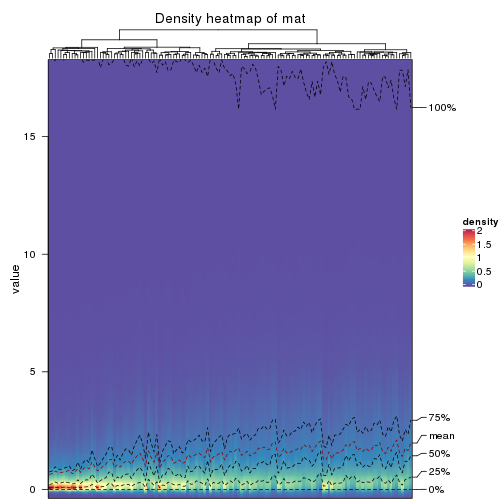


### Suggest the best k


Folowing table shows the best `k` (number of partitions) for each combination
of top-value methods and partition methods. Clicking on the method name in
the table goes to the section for a single combination of methods.

[The cola vignette](http://bioconductor.org/packages/devel/bioc/vignettes/cola/inst/doc/cola.html#toc_13)
explains the definition of the metrics used for determining the best
number of partitions.


```r
suggest_best_k(res_list)
```


|                            | The best k| 1-PAC| Mean silhouette| Concordance|   |Optional k |
|:---------------------------|----------:|-----:|---------------:|-----------:|:--|:----------|
|[ATC:pam](#ATC-pam)         |          4| 1.000|           0.983|       0.994|** |2,3        |
|[ATC:skmeans](#ATC-skmeans) |          3| 0.992|           0.934|       0.972|** |2          |
|[SD:pam](#SD-pam)           |          2| 0.984|           0.964|       0.985|** |           |
|[MAD:kmeans](#MAD-kmeans)   |          2| 0.983|           0.956|       0.982|** |           |
|[CV:kmeans](#CV-kmeans)     |          2| 0.980|           0.942|       0.974|** |           |
|[SD:kmeans](#SD-kmeans)     |          2| 0.968|           0.957|       0.983|** |           |
|[ATC:mclust](#ATC-mclust)   |          2| 0.967|           0.955|       0.976|** |           |
|[ATC:kmeans](#ATC-kmeans)   |          3| 0.965|           0.932|       0.973|** |2          |
|[MAD:skmeans](#MAD-skmeans) |          3| 0.961|           0.926|       0.971|** |2          |
|[CV:NMF](#CV-NMF)           |          2| 0.947|           0.941|       0.974|*  |           |
|[SD:skmeans](#SD-skmeans)   |          3| 0.937|           0.933|       0.972|*  |2          |
|[MAD:pam](#MAD-pam)         |          2| 0.937|           0.953|       0.981|*  |           |
|[CV:skmeans](#CV-skmeans)   |          3| 0.928|           0.900|       0.958|*  |2          |
|[CV:mclust](#CV-mclust)     |          3| 0.912|           0.912|       0.965|*  |2          |
|[ATC:hclust](#ATC-hclust)   |          2| 0.864|           0.910|       0.954|   |           |
|[ATC:NMF](#ATC-NMF)         |          2| 0.827|           0.890|       0.954|   |           |
|[MAD:mclust](#MAD-mclust)   |          5| 0.776|           0.841|       0.896|   |           |
|[MAD:NMF](#MAD-NMF)         |          2| 0.719|           0.866|       0.942|   |           |
|[SD:NMF](#SD-NMF)           |          2| 0.715|           0.884|       0.945|   |           |
|[SD:mclust](#SD-mclust)     |          5| 0.712|           0.802|       0.872|   |           |
|[CV:hclust](#CV-hclust)     |          2| 0.707|           0.865|       0.933|   |           |
|[SD:hclust](#SD-hclust)     |          3| 0.610|           0.787|       0.887|   |           |
|[MAD:hclust](#MAD-hclust)   |          3| 0.579|           0.768|       0.879|   |           |
|[CV:pam](#CV-pam)           |          2| 0.569|           0.875|       0.925|   |           |

\*\*: 1-PAC > 0.95, \*: 1-PAC > 0.9


### CDF of consensus matrices

Cumulative distribution function curves of consensus matrix for all methods.


```r
collect_plots(res_list, fun = plot_ecdf)
```

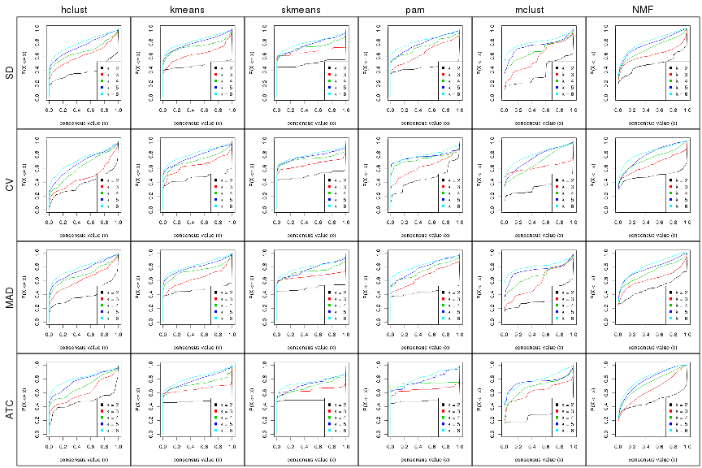


### Consensus heatmap

Consensus heatmaps for all methods. ([What is a consensus heatmap?](http://bioconductor.org/packages/devel/bioc/vignettes/cola/inst/doc/cola.html#toc_9))


<style type='text/css'>


.ui-helper-hidden {
	display: none;
}
.ui-helper-hidden-accessible {
	border: 0;
	clip: rect(0 0 0 0);
	height: 1px;
	margin: -1px;
	overflow: hidden;
	padding: 0;
	position: absolute;
	width: 1px;
}
.ui-helper-reset {
	margin: 0;
	padding: 0;
	border: 0;
	outline: 0;
	line-height: 1.3;
	text-decoration: none;
	font-size: 100%;
	list-style: none;
}
.ui-helper-clearfix:before,
.ui-helper-clearfix:after {
	content: "";
	display: table;
	border-collapse: collapse;
}
.ui-helper-clearfix:after {
	clear: both;
}
.ui-helper-zfix {
	width: 100%;
	height: 100%;
	top: 0;
	left: 0;
	position: absolute;
	opacity: 0;
	filter:Alpha(Opacity=0); 
}

.ui-front {
	z-index: 100;
}


.ui-state-disabled {
	cursor: default !important;
	pointer-events: none;
}


.ui-icon {
	display: inline-block;
	vertical-align: middle;
	margin-top: -.25em;
	position: relative;
	text-indent: -99999px;
	overflow: hidden;
	background-repeat: no-repeat;
}

.ui-widget-icon-block {
	left: 50%;
	margin-left: -8px;
	display: block;
}


.ui-widget-overlay {
	position: fixed;
	top: 0;
	left: 0;
	width: 100%;
	height: 100%;
}
.ui-accordion .ui-accordion-header {
	display: block;
	cursor: pointer;
	position: relative;
	margin: 2px 0 0 0;
	padding: .5em .5em .5em .7em;
	font-size: 100%;
}
.ui-accordion .ui-accordion-content {
	padding: 1em 2.2em;
	border-top: 0;
	overflow: auto;
}
.ui-autocomplete {
	position: absolute;
	top: 0;
	left: 0;
	cursor: default;
}
.ui-menu {
	list-style: none;
	padding: 0;
	margin: 0;
	display: block;
	outline: 0;
}
.ui-menu .ui-menu {
	position: absolute;
}
.ui-menu .ui-menu-item {
	margin: 0;
	cursor: pointer;
	
	list-style-image: url("data:image/gif;base64,R0lGODlhAQABAIAAAAAAAP///yH5BAEAAAAALAAAAAABAAEAAAIBRAA7");
}
.ui-menu .ui-menu-item-wrapper {
	position: relative;
	padding: 3px 1em 3px .4em;
}
.ui-menu .ui-menu-divider {
	margin: 5px 0;
	height: 0;
	font-size: 0;
	line-height: 0;
	border-width: 1px 0 0 0;
}
.ui-menu .ui-state-focus,
.ui-menu .ui-state-active {
	margin: -1px;
}


.ui-menu-icons {
	position: relative;
}
.ui-menu-icons .ui-menu-item-wrapper {
	padding-left: 2em;
}


.ui-menu .ui-icon {
	position: absolute;
	top: 0;
	bottom: 0;
	left: .2em;
	margin: auto 0;
}


.ui-menu .ui-menu-icon {
	left: auto;
	right: 0;
}
.ui-button {
	padding: .4em 1em;
	display: inline-block;
	position: relative;
	line-height: normal;
	margin-right: .1em;
	cursor: pointer;
	vertical-align: middle;
	text-align: center;
	-webkit-user-select: none;
	-moz-user-select: none;
	-ms-user-select: none;
	user-select: none;

	
	overflow: visible;
}

.ui-button,
.ui-button:link,
.ui-button:visited,
.ui-button:hover,
.ui-button:active {
	text-decoration: none;
}


.ui-button-icon-only {
	width: 2em;
	box-sizing: border-box;
	text-indent: -9999px;
	white-space: nowrap;
}


input.ui-button.ui-button-icon-only {
	text-indent: 0;
}


.ui-button-icon-only .ui-icon {
	position: absolute;
	top: 50%;
	left: 50%;
	margin-top: -8px;
	margin-left: -8px;
}

.ui-button.ui-icon-notext .ui-icon {
	padding: 0;
	width: 2.1em;
	height: 2.1em;
	text-indent: -9999px;
	white-space: nowrap;

}

input.ui-button.ui-icon-notext .ui-icon {
	width: auto;
	height: auto;
	text-indent: 0;
	white-space: normal;
	padding: .4em 1em;
}


input.ui-button::-moz-focus-inner,
button.ui-button::-moz-focus-inner {
	border: 0;
	padding: 0;
}
.ui-controlgroup {
	vertical-align: middle;
	display: inline-block;
}
.ui-controlgroup > .ui-controlgroup-item {
	float: left;
	margin-left: 0;
	margin-right: 0;
}
.ui-controlgroup > .ui-controlgroup-item:focus,
.ui-controlgroup > .ui-controlgroup-item.ui-visual-focus {
	z-index: 9999;
}
.ui-controlgroup-vertical > .ui-controlgroup-item {
	display: block;
	float: none;
	width: 100%;
	margin-top: 0;
	margin-bottom: 0;
	text-align: left;
}
.ui-controlgroup-vertical .ui-controlgroup-item {
	box-sizing: border-box;
}
.ui-controlgroup .ui-controlgroup-label {
	padding: .4em 1em;
}
.ui-controlgroup .ui-controlgroup-label span {
	font-size: 80%;
}
.ui-controlgroup-horizontal .ui-controlgroup-label + .ui-controlgroup-item {
	border-left: none;
}
.ui-controlgroup-vertical .ui-controlgroup-label + .ui-controlgroup-item {
	border-top: none;
}
.ui-controlgroup-horizontal .ui-controlgroup-label.ui-widget-content {
	border-right: none;
}
.ui-controlgroup-vertical .ui-controlgroup-label.ui-widget-content {
	border-bottom: none;
}


.ui-controlgroup-vertical .ui-spinner-input {

	
	width: 75%;
	width: calc( 100% - 2.4em );
}
.ui-controlgroup-vertical .ui-spinner .ui-spinner-up {
	border-top-style: solid;
}

.ui-checkboxradio-label .ui-icon-background {
	box-shadow: inset 1px 1px 1px #ccc;
	border-radius: .12em;
	border: none;
}
.ui-checkboxradio-radio-label .ui-icon-background {
	width: 16px;
	height: 16px;
	border-radius: 1em;
	overflow: visible;
	border: none;
}
.ui-checkboxradio-radio-label.ui-checkboxradio-checked .ui-icon,
.ui-checkboxradio-radio-label.ui-checkboxradio-checked:hover .ui-icon {
	background-image: none;
	width: 8px;
	height: 8px;
	border-width: 4px;
	border-style: solid;
}
.ui-checkboxradio-disabled {
	pointer-events: none;
}
.ui-datepicker {
	width: 17em;
	padding: .2em .2em 0;
	display: none;
}
.ui-datepicker .ui-datepicker-header {
	position: relative;
	padding: .2em 0;
}
.ui-datepicker .ui-datepicker-prev,
.ui-datepicker .ui-datepicker-next {
	position: absolute;
	top: 2px;
	width: 1.8em;
	height: 1.8em;
}
.ui-datepicker .ui-datepicker-prev-hover,
.ui-datepicker .ui-datepicker-next-hover {
	top: 1px;
}
.ui-datepicker .ui-datepicker-prev {
	left: 2px;
}
.ui-datepicker .ui-datepicker-next {
	right: 2px;
}
.ui-datepicker .ui-datepicker-prev-hover {
	left: 1px;
}
.ui-datepicker .ui-datepicker-next-hover {
	right: 1px;
}
.ui-datepicker .ui-datepicker-prev span,
.ui-datepicker .ui-datepicker-next span {
	display: block;
	position: absolute;
	left: 50%;
	margin-left: -8px;
	top: 50%;
	margin-top: -8px;
}
.ui-datepicker .ui-datepicker-title {
	margin: 0 2.3em;
	line-height: 1.8em;
	text-align: center;
}
.ui-datepicker .ui-datepicker-title select {
	font-size: 1em;
	margin: 1px 0;
}
.ui-datepicker select.ui-datepicker-month,
.ui-datepicker select.ui-datepicker-year {
	width: 45%;
}
.ui-datepicker table {
	width: 100%;
	font-size: .9em;
	border-collapse: collapse;
	margin: 0 0 .4em;
}
.ui-datepicker th {
	padding: .7em .3em;
	text-align: center;
	font-weight: bold;
	border: 0;
}
.ui-datepicker td {
	border: 0;
	padding: 1px;
}
.ui-datepicker td span,
.ui-datepicker td a {
	display: block;
	padding: .2em;
	text-align: right;
	text-decoration: none;
}
.ui-datepicker .ui-datepicker-buttonpane {
	background-image: none;
	margin: .7em 0 0 0;
	padding: 0 .2em;
	border-left: 0;
	border-right: 0;
	border-bottom: 0;
}
.ui-datepicker .ui-datepicker-buttonpane button {
	float: right;
	margin: .5em .2em .4em;
	cursor: pointer;
	padding: .2em .6em .3em .6em;
	width: auto;
	overflow: visible;
}
.ui-datepicker .ui-datepicker-buttonpane button.ui-datepicker-current {
	float: left;
}


.ui-datepicker.ui-datepicker-multi {
	width: auto;
}
.ui-datepicker-multi .ui-datepicker-group {
	float: left;
}
.ui-datepicker-multi .ui-datepicker-group table {
	width: 95%;
	margin: 0 auto .4em;
}
.ui-datepicker-multi-2 .ui-datepicker-group {
	width: 50%;
}
.ui-datepicker-multi-3 .ui-datepicker-group {
	width: 33.3%;
}
.ui-datepicker-multi-4 .ui-datepicker-group {
	width: 25%;
}
.ui-datepicker-multi .ui-datepicker-group-last .ui-datepicker-header,
.ui-datepicker-multi .ui-datepicker-group-middle .ui-datepicker-header {
	border-left-width: 0;
}
.ui-datepicker-multi .ui-datepicker-buttonpane {
	clear: left;
}
.ui-datepicker-row-break {
	clear: both;
	width: 100%;
	font-size: 0;
}


.ui-datepicker-rtl {
	direction: rtl;
}
.ui-datepicker-rtl .ui-datepicker-prev {
	right: 2px;
	left: auto;
}
.ui-datepicker-rtl .ui-datepicker-next {
	left: 2px;
	right: auto;
}
.ui-datepicker-rtl .ui-datepicker-prev:hover {
	right: 1px;
	left: auto;
}
.ui-datepicker-rtl .ui-datepicker-next:hover {
	left: 1px;
	right: auto;
}
.ui-datepicker-rtl .ui-datepicker-buttonpane {
	clear: right;
}
.ui-datepicker-rtl .ui-datepicker-buttonpane button {
	float: left;
}
.ui-datepicker-rtl .ui-datepicker-buttonpane button.ui-datepicker-current,
.ui-datepicker-rtl .ui-datepicker-group {
	float: right;
}
.ui-datepicker-rtl .ui-datepicker-group-last .ui-datepicker-header,
.ui-datepicker-rtl .ui-datepicker-group-middle .ui-datepicker-header {
	border-right-width: 0;
	border-left-width: 1px;
}


.ui-datepicker .ui-icon {
	display: block;
	text-indent: -99999px;
	overflow: hidden;
	background-repeat: no-repeat;
	left: .5em;
	top: .3em;
}
.ui-dialog {
	position: absolute;
	top: 0;
	left: 0;
	padding: .2em;
	outline: 0;
}
.ui-dialog .ui-dialog-titlebar {
	padding: .4em 1em;
	position: relative;
}
.ui-dialog .ui-dialog-title {
	float: left;
	margin: .1em 0;
	white-space: nowrap;
	width: 90%;
	overflow: hidden;
	text-overflow: ellipsis;
}
.ui-dialog .ui-dialog-titlebar-close {
	position: absolute;
	right: .3em;
	top: 50%;
	width: 20px;
	margin: -10px 0 0 0;
	padding: 1px;
	height: 20px;
}
.ui-dialog .ui-dialog-content {
	position: relative;
	border: 0;
	padding: .5em 1em;
	background: none;
	overflow: auto;
}
.ui-dialog .ui-dialog-buttonpane {
	text-align: left;
	border-width: 1px 0 0 0;
	background-image: none;
	margin-top: .5em;
	padding: .3em 1em .5em .4em;
}
.ui-dialog .ui-dialog-buttonpane .ui-dialog-buttonset {
	float: right;
}
.ui-dialog .ui-dialog-buttonpane button {
	margin: .5em .4em .5em 0;
	cursor: pointer;
}
.ui-dialog .ui-resizable-n {
	height: 2px;
	top: 0;
}
.ui-dialog .ui-resizable-e {
	width: 2px;
	right: 0;
}
.ui-dialog .ui-resizable-s {
	height: 2px;
	bottom: 0;
}
.ui-dialog .ui-resizable-w {
	width: 2px;
	left: 0;
}
.ui-dialog .ui-resizable-se,
.ui-dialog .ui-resizable-sw,
.ui-dialog .ui-resizable-ne,
.ui-dialog .ui-resizable-nw {
	width: 7px;
	height: 7px;
}
.ui-dialog .ui-resizable-se {
	right: 0;
	bottom: 0;
}
.ui-dialog .ui-resizable-sw {
	left: 0;
	bottom: 0;
}
.ui-dialog .ui-resizable-ne {
	right: 0;
	top: 0;
}
.ui-dialog .ui-resizable-nw {
	left: 0;
	top: 0;
}
.ui-draggable .ui-dialog-titlebar {
	cursor: move;
}
.ui-draggable-handle {
	-ms-touch-action: none;
	touch-action: none;
}
.ui-resizable {
	position: relative;
}
.ui-resizable-handle {
	position: absolute;
	font-size: 0.1px;
	display: block;
	-ms-touch-action: none;
	touch-action: none;
}
.ui-resizable-disabled .ui-resizable-handle,
.ui-resizable-autohide .ui-resizable-handle {
	display: none;
}
.ui-resizable-n {
	cursor: n-resize;
	height: 7px;
	width: 100%;
	top: -5px;
	left: 0;
}
.ui-resizable-s {
	cursor: s-resize;
	height: 7px;
	width: 100%;
	bottom: -5px;
	left: 0;
}
.ui-resizable-e {
	cursor: e-resize;
	width: 7px;
	right: -5px;
	top: 0;
	height: 100%;
}
.ui-resizable-w {
	cursor: w-resize;
	width: 7px;
	left: -5px;
	top: 0;
	height: 100%;
}
.ui-resizable-se {
	cursor: se-resize;
	width: 12px;
	height: 12px;
	right: 1px;
	bottom: 1px;
}
.ui-resizable-sw {
	cursor: sw-resize;
	width: 9px;
	height: 9px;
	left: -5px;
	bottom: -5px;
}
.ui-resizable-nw {
	cursor: nw-resize;
	width: 9px;
	height: 9px;
	left: -5px;
	top: -5px;
}
.ui-resizable-ne {
	cursor: ne-resize;
	width: 9px;
	height: 9px;
	right: -5px;
	top: -5px;
}
.ui-progressbar {
	height: 2em;
	text-align: left;
	overflow: hidden;
}
.ui-progressbar .ui-progressbar-value {
	margin: -1px;
	height: 100%;
}
.ui-progressbar .ui-progressbar-overlay {
	background: url("");
	height: 100%;
	filter: alpha(opacity=25); 
	opacity: 0.25;
}
.ui-progressbar-indeterminate .ui-progressbar-value {
	background-image: none;
}
.ui-selectable {
	-ms-touch-action: none;
	touch-action: none;
}
.ui-selectable-helper {
	position: absolute;
	z-index: 100;
	border: 1px dotted black;
}
.ui-selectmenu-menu {
	padding: 0;
	margin: 0;
	position: absolute;
	top: 0;
	left: 0;
	display: none;
}
.ui-selectmenu-menu .ui-menu {
	overflow: auto;
	overflow-x: hidden;
	padding-bottom: 1px;
}
.ui-selectmenu-menu .ui-menu .ui-selectmenu-optgroup {
	font-size: 1em;
	font-weight: bold;
	line-height: 1.5;
	padding: 2px 0.4em;
	margin: 0.5em 0 0 0;
	height: auto;
	border: 0;
}
.ui-selectmenu-open {
	display: block;
}
.ui-selectmenu-text {
	display: block;
	margin-right: 20px;
	overflow: hidden;
	text-overflow: ellipsis;
}
.ui-selectmenu-button.ui-button {
	text-align: left;
	white-space: nowrap;
	width: 14em;
}
.ui-selectmenu-icon.ui-icon {
	float: right;
	margin-top: 0;
}
.ui-slider {
	position: relative;
	text-align: left;
}
.ui-slider .ui-slider-handle {
	position: absolute;
	z-index: 2;
	width: 1.2em;
	height: 1.2em;
	cursor: default;
	-ms-touch-action: none;
	touch-action: none;
}
.ui-slider .ui-slider-range {
	position: absolute;
	z-index: 1;
	font-size: .7em;
	display: block;
	border: 0;
	background-position: 0 0;
}


.ui-slider.ui-state-disabled .ui-slider-handle,
.ui-slider.ui-state-disabled .ui-slider-range {
	filter: inherit;
}

.ui-slider-horizontal {
	height: .8em;
}
.ui-slider-horizontal .ui-slider-handle {
	top: -.3em;
	margin-left: -.6em;
}
.ui-slider-horizontal .ui-slider-range {
	top: 0;
	height: 100%;
}
.ui-slider-horizontal .ui-slider-range-min {
	left: 0;
}
.ui-slider-horizontal .ui-slider-range-max {
	right: 0;
}

.ui-slider-vertical {
	width: .8em;
	height: 100px;
}
.ui-slider-vertical .ui-slider-handle {
	left: -.3em;
	margin-left: 0;
	margin-bottom: -.6em;
}
.ui-slider-vertical .ui-slider-range {
	left: 0;
	width: 100%;
}
.ui-slider-vertical .ui-slider-range-min {
	bottom: 0;
}
.ui-slider-vertical .ui-slider-range-max {
	top: 0;
}
.ui-sortable-handle {
	-ms-touch-action: none;
	touch-action: none;
}
.ui-spinner {
	position: relative;
	display: inline-block;
	overflow: hidden;
	padding: 0;
	vertical-align: middle;
}
.ui-spinner-input {
	border: none;
	background: none;
	color: inherit;
	padding: .222em 0;
	margin: .2em 0;
	vertical-align: middle;
	margin-left: .4em;
	margin-right: 2em;
}
.ui-spinner-button {
	width: 1.6em;
	height: 50%;
	font-size: .5em;
	padding: 0;
	margin: 0;
	text-align: center;
	position: absolute;
	cursor: default;
	display: block;
	overflow: hidden;
	right: 0;
}

.ui-spinner a.ui-spinner-button {
	border-top-style: none;
	border-bottom-style: none;
	border-right-style: none;
}
.ui-spinner-up {
	top: 0;
}
.ui-spinner-down {
	bottom: 0;
}
.ui-tabs {
	position: relative;
	padding: .2em;
}
.ui-tabs .ui-tabs-nav {
	margin: 0;
	padding: .2em .2em 0;
}
.ui-tabs .ui-tabs-nav li {
	list-style: none;
	float: left;
	position: relative;
	top: 0;
	margin: 1px .2em 0 0;
	border-bottom-width: 0;
	padding: 0;
	white-space: nowrap;
}
.ui-tabs .ui-tabs-nav .ui-tabs-anchor {
	float: left;
	padding: .5em 1em;
	text-decoration: none;
}
.ui-tabs .ui-tabs-nav li.ui-tabs-active {
	margin-bottom: -1px;
	padding-bottom: 1px;
}
.ui-tabs .ui-tabs-nav li.ui-tabs-active .ui-tabs-anchor,
.ui-tabs .ui-tabs-nav li.ui-state-disabled .ui-tabs-anchor,
.ui-tabs .ui-tabs-nav li.ui-tabs-loading .ui-tabs-anchor {
	cursor: text;
}
.ui-tabs-collapsible .ui-tabs-nav li.ui-tabs-active .ui-tabs-anchor {
	cursor: pointer;
}
.ui-tabs .ui-tabs-panel {
	display: block;
	border-width: 0;
	padding: 1em 1.4em;
	background: none;
}
.ui-tooltip {
	padding: 8px;
	position: absolute;
	z-index: 9999;
	max-width: 300px;
}
body .ui-tooltip {
	border-width: 2px;
}

.ui-widget {
	font-family: Arial,Helvetica,sans-serif;
	font-size: 1em;
}
.ui-widget .ui-widget {
	font-size: 1em;
}
.ui-widget input,
.ui-widget select,
.ui-widget textarea,
.ui-widget button {
	font-family: Arial,Helvetica,sans-serif;
	font-size: 1em;
}
.ui-widget.ui-widget-content {
	border: 1px solid #c5c5c5;
}
.ui-widget-content {
	border: 1px solid #dddddd;
	background: #ffffff;
	color: #333333;
}
.ui-widget-content a {
	color: #333333;
}
.ui-widget-header {
	border: 1px solid #dddddd;
	background: #e9e9e9;
	color: #333333;
	font-weight: bold;
}
.ui-widget-header a {
	color: #333333;
}


.ui-state-default,
.ui-widget-content .ui-state-default,
.ui-widget-header .ui-state-default,
.ui-button,


html .ui-button.ui-state-disabled:hover,
html .ui-button.ui-state-disabled:active {
	border: 1px solid #c5c5c5;
	background: #f6f6f6;
	font-weight: normal;
	color: #454545;
}
.ui-state-default a,
.ui-state-default a:link,
.ui-state-default a:visited,
a.ui-button,
a:link.ui-button,
a:visited.ui-button,
.ui-button {
	color: #454545;
	text-decoration: none;
}
.ui-state-hover,
.ui-widget-content .ui-state-hover,
.ui-widget-header .ui-state-hover,
.ui-state-focus,
.ui-widget-content .ui-state-focus,
.ui-widget-header .ui-state-focus,
.ui-button:hover,
.ui-button:focus {
	border: 1px solid #cccccc;
	background: #ededed;
	font-weight: normal;
	color: #2b2b2b;
}
.ui-state-hover a,
.ui-state-hover a:hover,
.ui-state-hover a:link,
.ui-state-hover a:visited,
.ui-state-focus a,
.ui-state-focus a:hover,
.ui-state-focus a:link,
.ui-state-focus a:visited,
a.ui-button:hover,
a.ui-button:focus {
	color: #2b2b2b;
	text-decoration: none;
}

.ui-visual-focus {
	box-shadow: 0 0 3px 1px rgb(94, 158, 214);
}
.ui-state-active,
.ui-widget-content .ui-state-active,
.ui-widget-header .ui-state-active,
a.ui-button:active,
.ui-button:active,
.ui-button.ui-state-active:hover {
	border: 1px solid #003eff;
	background: #007fff;
	font-weight: normal;
	color: #ffffff;
}
.ui-icon-background,
.ui-state-active .ui-icon-background {
	border: #003eff;
	background-color: #ffffff;
}
.ui-state-active a,
.ui-state-active a:link,
.ui-state-active a:visited {
	color: #ffffff;
	text-decoration: none;
}


.ui-state-highlight,
.ui-widget-content .ui-state-highlight,
.ui-widget-header .ui-state-highlight {
	border: 1px solid #dad55e;
	background: #fffa90;
	color: #777620;
}
.ui-state-checked {
	border: 1px solid #dad55e;
	background: #fffa90;
}
.ui-state-highlight a,
.ui-widget-content .ui-state-highlight a,
.ui-widget-header .ui-state-highlight a {
	color: #777620;
}
.ui-state-error,
.ui-widget-content .ui-state-error,
.ui-widget-header .ui-state-error {
	border: 1px solid #f1a899;
	background: #fddfdf;
	color: #5f3f3f;
}
.ui-state-error a,
.ui-widget-content .ui-state-error a,
.ui-widget-header .ui-state-error a {
	color: #5f3f3f;
}
.ui-state-error-text,
.ui-widget-content .ui-state-error-text,
.ui-widget-header .ui-state-error-text {
	color: #5f3f3f;
}
.ui-priority-primary,
.ui-widget-content .ui-priority-primary,
.ui-widget-header .ui-priority-primary {
	font-weight: bold;
}
.ui-priority-secondary,
.ui-widget-content .ui-priority-secondary,
.ui-widget-header .ui-priority-secondary {
	opacity: .7;
	filter:Alpha(Opacity=70); 
	font-weight: normal;
}
.ui-state-disabled,
.ui-widget-content .ui-state-disabled,
.ui-widget-header .ui-state-disabled {
	opacity: .35;
	filter:Alpha(Opacity=35); 
	background-image: none;
}
.ui-state-disabled .ui-icon {
	filter:Alpha(Opacity=35); 
}


.ui-icon {
	width: 16px;
	height: 16px;
}
.ui-icon,
.ui-widget-content .ui-icon {
	background-image: url("images/ui-icons_444444_256x240.png");
}
.ui-widget-header .ui-icon {
	background-image: url("images/ui-icons_444444_256x240.png");
}
.ui-state-hover .ui-icon,
.ui-state-focus .ui-icon,
.ui-button:hover .ui-icon,
.ui-button:focus .ui-icon {
	background-image: url("images/ui-icons_555555_256x240.png");
}
.ui-state-active .ui-icon,
.ui-button:active .ui-icon {
	background-image: url("images/ui-icons_ffffff_256x240.png");
}
.ui-state-highlight .ui-icon,
.ui-button .ui-state-highlight.ui-icon {
	background-image: url("images/ui-icons_777620_256x240.png");
}
.ui-state-error .ui-icon,
.ui-state-error-text .ui-icon {
	background-image: url("images/ui-icons_cc0000_256x240.png");
}
.ui-button .ui-icon {
	background-image: url("images/ui-icons_777777_256x240.png");
}


.ui-icon-blank { background-position: 16px 16px; }
.ui-icon-caret-1-n { background-position: 0 0; }
.ui-icon-caret-1-ne { background-position: -16px 0; }
.ui-icon-caret-1-e { background-position: -32px 0; }
.ui-icon-caret-1-se { background-position: -48px 0; }
.ui-icon-caret-1-s { background-position: -65px 0; }
.ui-icon-caret-1-sw { background-position: -80px 0; }
.ui-icon-caret-1-w { background-position: -96px 0; }
.ui-icon-caret-1-nw { background-position: -112px 0; }
.ui-icon-caret-2-n-s { background-position: -128px 0; }
.ui-icon-caret-2-e-w { background-position: -144px 0; }
.ui-icon-triangle-1-n { background-position: 0 -16px; }
.ui-icon-triangle-1-ne { background-position: -16px -16px; }
.ui-icon-triangle-1-e { background-position: -32px -16px; }
.ui-icon-triangle-1-se { background-position: -48px -16px; }
.ui-icon-triangle-1-s { background-position: -65px -16px; }
.ui-icon-triangle-1-sw { background-position: -80px -16px; }
.ui-icon-triangle-1-w { background-position: -96px -16px; }
.ui-icon-triangle-1-nw { background-position: -112px -16px; }
.ui-icon-triangle-2-n-s { background-position: -128px -16px; }
.ui-icon-triangle-2-e-w { background-position: -144px -16px; }
.ui-icon-arrow-1-n { background-position: 0 -32px; }
.ui-icon-arrow-1-ne { background-position: -16px -32px; }
.ui-icon-arrow-1-e { background-position: -32px -32px; }
.ui-icon-arrow-1-se { background-position: -48px -32px; }
.ui-icon-arrow-1-s { background-position: -65px -32px; }
.ui-icon-arrow-1-sw { background-position: -80px -32px; }
.ui-icon-arrow-1-w { background-position: -96px -32px; }
.ui-icon-arrow-1-nw { background-position: -112px -32px; }
.ui-icon-arrow-2-n-s { background-position: -128px -32px; }
.ui-icon-arrow-2-ne-sw { background-position: -144px -32px; }
.ui-icon-arrow-2-e-w { background-position: -160px -32px; }
.ui-icon-arrow-2-se-nw { background-position: -176px -32px; }
.ui-icon-arrowstop-1-n { background-position: -192px -32px; }
.ui-icon-arrowstop-1-e { background-position: -208px -32px; }
.ui-icon-arrowstop-1-s { background-position: -224px -32px; }
.ui-icon-arrowstop-1-w { background-position: -240px -32px; }
.ui-icon-arrowthick-1-n { background-position: 1px -48px; }
.ui-icon-arrowthick-1-ne { background-position: -16px -48px; }
.ui-icon-arrowthick-1-e { background-position: -32px -48px; }
.ui-icon-arrowthick-1-se { background-position: -48px -48px; }
.ui-icon-arrowthick-1-s { background-position: -64px -48px; }
.ui-icon-arrowthick-1-sw { background-position: -80px -48px; }
.ui-icon-arrowthick-1-w { background-position: -96px -48px; }
.ui-icon-arrowthick-1-nw { background-position: -112px -48px; }
.ui-icon-arrowthick-2-n-s { background-position: -128px -48px; }
.ui-icon-arrowthick-2-ne-sw { background-position: -144px -48px; }
.ui-icon-arrowthick-2-e-w { background-position: -160px -48px; }
.ui-icon-arrowthick-2-se-nw { background-position: -176px -48px; }
.ui-icon-arrowthickstop-1-n { background-position: -192px -48px; }
.ui-icon-arrowthickstop-1-e { background-position: -208px -48px; }
.ui-icon-arrowthickstop-1-s { background-position: -224px -48px; }
.ui-icon-arrowthickstop-1-w { background-position: -240px -48px; }
.ui-icon-arrowreturnthick-1-w { background-position: 0 -64px; }
.ui-icon-arrowreturnthick-1-n { background-position: -16px -64px; }
.ui-icon-arrowreturnthick-1-e { background-position: -32px -64px; }
.ui-icon-arrowreturnthick-1-s { background-position: -48px -64px; }
.ui-icon-arrowreturn-1-w { background-position: -64px -64px; }
.ui-icon-arrowreturn-1-n { background-position: -80px -64px; }
.ui-icon-arrowreturn-1-e { background-position: -96px -64px; }
.ui-icon-arrowreturn-1-s { background-position: -112px -64px; }
.ui-icon-arrowrefresh-1-w { background-position: -128px -64px; }
.ui-icon-arrowrefresh-1-n { background-position: -144px -64px; }
.ui-icon-arrowrefresh-1-e { background-position: -160px -64px; }
.ui-icon-arrowrefresh-1-s { background-position: -176px -64px; }
.ui-icon-arrow-4 { background-position: 0 -80px; }
.ui-icon-arrow-4-diag { background-position: -16px -80px; }
.ui-icon-extlink { background-position: -32px -80px; }
.ui-icon-newwin { background-position: -48px -80px; }
.ui-icon-refresh { background-position: -64px -80px; }
.ui-icon-shuffle { background-position: -80px -80px; }
.ui-icon-transfer-e-w { background-position: -96px -80px; }
.ui-icon-transferthick-e-w { background-position: -112px -80px; }
.ui-icon-folder-collapsed { background-position: 0 -96px; }
.ui-icon-folder-open { background-position: -16px -96px; }
.ui-icon-document { background-position: -32px -96px; }
.ui-icon-document-b { background-position: -48px -96px; }
.ui-icon-note { background-position: -64px -96px; }
.ui-icon-mail-closed { background-position: -80px -96px; }
.ui-icon-mail-open { background-position: -96px -96px; }
.ui-icon-suitcase { background-position: -112px -96px; }
.ui-icon-comment { background-position: -128px -96px; }
.ui-icon-person { background-position: -144px -96px; }
.ui-icon-print { background-position: -160px -96px; }
.ui-icon-trash { background-position: -176px -96px; }
.ui-icon-locked { background-position: -192px -96px; }
.ui-icon-unlocked { background-position: -208px -96px; }
.ui-icon-bookmark { background-position: -224px -96px; }
.ui-icon-tag { background-position: -240px -96px; }
.ui-icon-home { background-position: 0 -112px; }
.ui-icon-flag { background-position: -16px -112px; }
.ui-icon-calendar { background-position: -32px -112px; }
.ui-icon-cart { background-position: -48px -112px; }
.ui-icon-pencil { background-position: -64px -112px; }
.ui-icon-clock { background-position: -80px -112px; }
.ui-icon-disk { background-position: -96px -112px; }
.ui-icon-calculator { background-position: -112px -112px; }
.ui-icon-zoomin { background-position: -128px -112px; }
.ui-icon-zoomout { background-position: -144px -112px; }
.ui-icon-search { background-position: -160px -112px; }
.ui-icon-wrench { background-position: -176px -112px; }
.ui-icon-gear { background-position: -192px -112px; }
.ui-icon-heart { background-position: -208px -112px; }
.ui-icon-star { background-position: -224px -112px; }
.ui-icon-link { background-position: -240px -112px; }
.ui-icon-cancel { background-position: 0 -128px; }
.ui-icon-plus { background-position: -16px -128px; }
.ui-icon-plusthick { background-position: -32px -128px; }
.ui-icon-minus { background-position: -48px -128px; }
.ui-icon-minusthick { background-position: -64px -128px; }
.ui-icon-close { background-position: -80px -128px; }
.ui-icon-closethick { background-position: -96px -128px; }
.ui-icon-key { background-position: -112px -128px; }
.ui-icon-lightbulb { background-position: -128px -128px; }
.ui-icon-scissors { background-position: -144px -128px; }
.ui-icon-clipboard { background-position: -160px -128px; }
.ui-icon-copy { background-position: -176px -128px; }
.ui-icon-contact { background-position: -192px -128px; }
.ui-icon-image { background-position: -208px -128px; }
.ui-icon-video { background-position: -224px -128px; }
.ui-icon-script { background-position: -240px -128px; }
.ui-icon-alert { background-position: 0 -144px; }
.ui-icon-info { background-position: -16px -144px; }
.ui-icon-notice { background-position: -32px -144px; }
.ui-icon-help { background-position: -48px -144px; }
.ui-icon-check { background-position: -64px -144px; }
.ui-icon-bullet { background-position: -80px -144px; }
.ui-icon-radio-on { background-position: -96px -144px; }
.ui-icon-radio-off { background-position: -112px -144px; }
.ui-icon-pin-w { background-position: -128px -144px; }
.ui-icon-pin-s { background-position: -144px -144px; }
.ui-icon-play { background-position: 0 -160px; }
.ui-icon-pause { background-position: -16px -160px; }
.ui-icon-seek-next { background-position: -32px -160px; }
.ui-icon-seek-prev { background-position: -48px -160px; }
.ui-icon-seek-end { background-position: -64px -160px; }
.ui-icon-seek-start { background-position: -80px -160px; }

.ui-icon-seek-first { background-position: -80px -160px; }
.ui-icon-stop { background-position: -96px -160px; }
.ui-icon-eject { background-position: -112px -160px; }
.ui-icon-volume-off { background-position: -128px -160px; }
.ui-icon-volume-on { background-position: -144px -160px; }
.ui-icon-power { background-position: 0 -176px; }
.ui-icon-signal-diag { background-position: -16px -176px; }
.ui-icon-signal { background-position: -32px -176px; }
.ui-icon-battery-0 { background-position: -48px -176px; }
.ui-icon-battery-1 { background-position: -64px -176px; }
.ui-icon-battery-2 { background-position: -80px -176px; }
.ui-icon-battery-3 { background-position: -96px -176px; }
.ui-icon-circle-plus { background-position: 0 -192px; }
.ui-icon-circle-minus { background-position: -16px -192px; }
.ui-icon-circle-close { background-position: -32px -192px; }
.ui-icon-circle-triangle-e { background-position: -48px -192px; }
.ui-icon-circle-triangle-s { background-position: -64px -192px; }
.ui-icon-circle-triangle-w { background-position: -80px -192px; }
.ui-icon-circle-triangle-n { background-position: -96px -192px; }
.ui-icon-circle-arrow-e { background-position: -112px -192px; }
.ui-icon-circle-arrow-s { background-position: -128px -192px; }
.ui-icon-circle-arrow-w { background-position: -144px -192px; }
.ui-icon-circle-arrow-n { background-position: -160px -192px; }
.ui-icon-circle-zoomin { background-position: -176px -192px; }
.ui-icon-circle-zoomout { background-position: -192px -192px; }
.ui-icon-circle-check { background-position: -208px -192px; }
.ui-icon-circlesmall-plus { background-position: 0 -208px; }
.ui-icon-circlesmall-minus { background-position: -16px -208px; }
.ui-icon-circlesmall-close { background-position: -32px -208px; }
.ui-icon-squaresmall-plus { background-position: -48px -208px; }
.ui-icon-squaresmall-minus { background-position: -64px -208px; }
.ui-icon-squaresmall-close { background-position: -80px -208px; }
.ui-icon-grip-dotted-vertical { background-position: 0 -224px; }
.ui-icon-grip-dotted-horizontal { background-position: -16px -224px; }
.ui-icon-grip-solid-vertical { background-position: -32px -224px; }
.ui-icon-grip-solid-horizontal { background-position: -48px -224px; }
.ui-icon-gripsmall-diagonal-se { background-position: -64px -224px; }
.ui-icon-grip-diagonal-se { background-position: -80px -224px; }


.ui-corner-all,
.ui-corner-top,
.ui-corner-left,
.ui-corner-tl {
	border-top-left-radius: 3px;
}
.ui-corner-all,
.ui-corner-top,
.ui-corner-right,
.ui-corner-tr {
	border-top-right-radius: 3px;
}
.ui-corner-all,
.ui-corner-bottom,
.ui-corner-left,
.ui-corner-bl {
	border-bottom-left-radius: 3px;
}
.ui-corner-all,
.ui-corner-bottom,
.ui-corner-right,
.ui-corner-br {
	border-bottom-right-radius: 3px;
}


.ui-widget-overlay {
	background: #aaaaaa;
	opacity: .3;
	filter: Alpha(Opacity=30); 
}
.ui-widget-shadow {
	-webkit-box-shadow: 0px 0px 5px #666666;
	box-shadow: 0px 0px 5px #666666;
} 
</style>
<script src='js/jquery-1.12.4.js'></script>
<script src='js/jquery-ui.js'></script>

<script>
$( function() {
	$( '#tabs-collect-consensus-heatmap' ).tabs();
} );
</script>
<div id='tabs-collect-consensus-heatmap'>
<ul>
<li><a href='#tab-collect-consensus-heatmap-1'>k = 2</a></li>
<li><a href='#tab-collect-consensus-heatmap-2'>k = 3</a></li>
<li><a href='#tab-collect-consensus-heatmap-3'>k = 4</a></li>
<li><a href='#tab-collect-consensus-heatmap-4'>k = 5</a></li>
<li><a href='#tab-collect-consensus-heatmap-5'>k = 6</a></li>
</ul>
<div id='tab-collect-consensus-heatmap-1'>
<pre><code class="r">collect_plots(res_list, k = 2, fun = consensus_heatmap, mc.cores = 4)
</code></pre>

<p>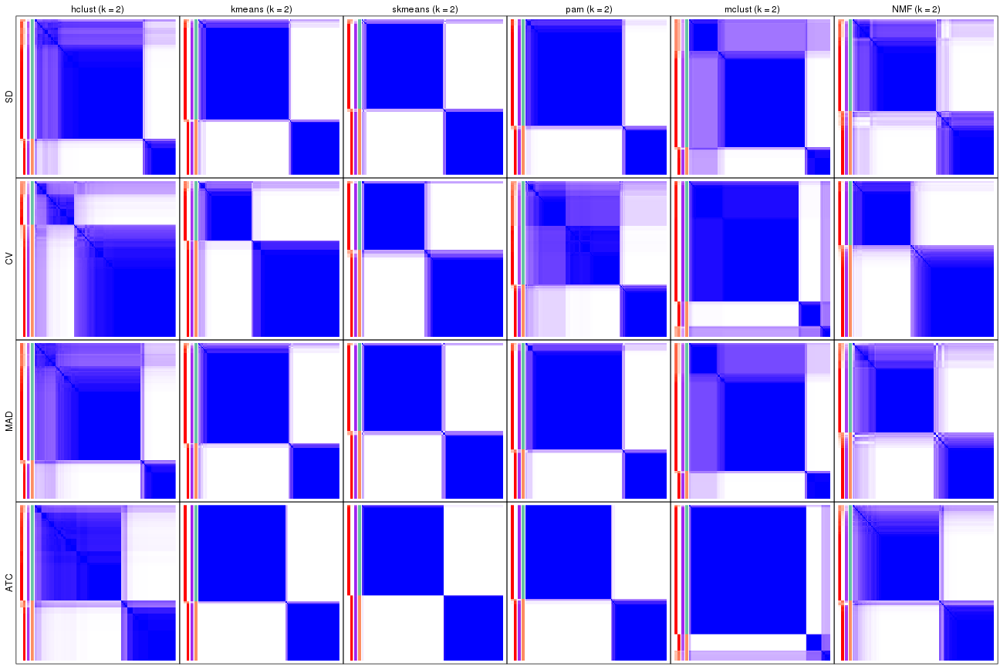</p>

</div>
<div id='tab-collect-consensus-heatmap-2'>
<pre><code class="r">collect_plots(res_list, k = 3, fun = consensus_heatmap, mc.cores = 4)
</code></pre>

<p>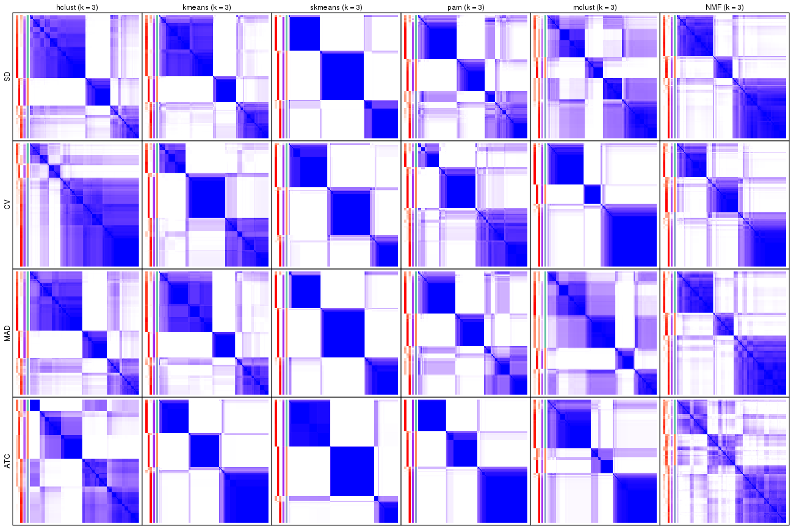</p>

</div>
<div id='tab-collect-consensus-heatmap-3'>
<pre><code class="r">collect_plots(res_list, k = 4, fun = consensus_heatmap, mc.cores = 4)
</code></pre>

<p>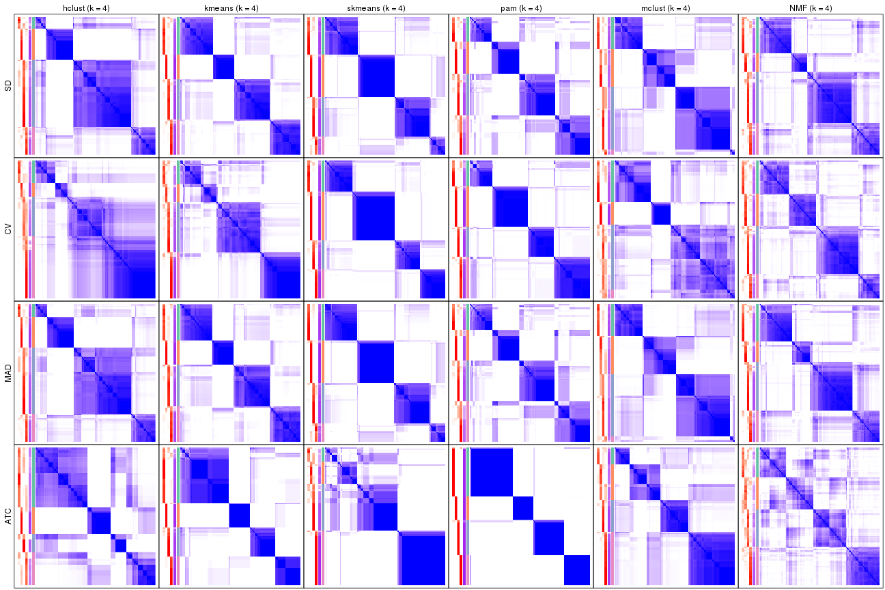</p>

</div>
<div id='tab-collect-consensus-heatmap-4'>
<pre><code class="r">collect_plots(res_list, k = 5, fun = consensus_heatmap, mc.cores = 4)
</code></pre>

<p>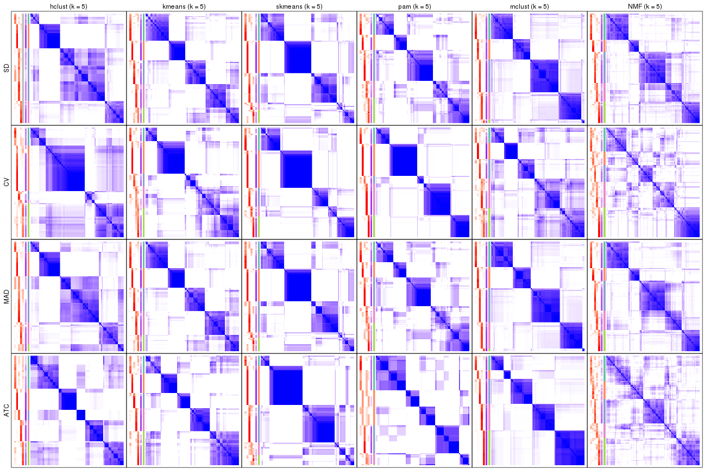</p>

</div>
<div id='tab-collect-consensus-heatmap-5'>
<pre><code class="r">collect_plots(res_list, k = 6, fun = consensus_heatmap, mc.cores = 4)
</code></pre>

<p>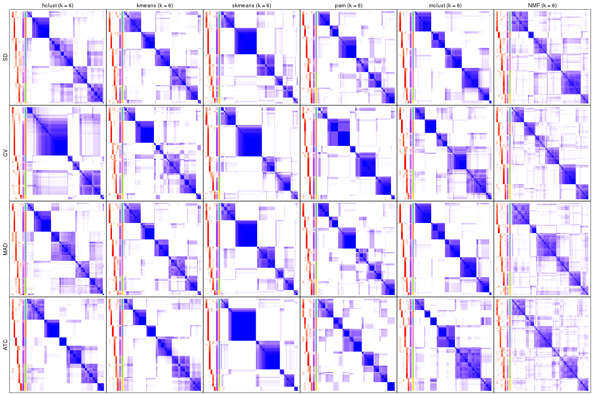</p>

</div>
</div>


### Membership heatmap

Membership heatmaps for all methods. ([What is a membership heatmap?](http://bioconductor.org/packages/devel/bioc/vignettes/cola/inst/doc/cola.html#toc_12))


<script>
$( function() {
	$( '#tabs-collect-membership-heatmap' ).tabs();
} );
</script>
<div id='tabs-collect-membership-heatmap'>
<ul>
<li><a href='#tab-collect-membership-heatmap-1'>k = 2</a></li>
<li><a href='#tab-collect-membership-heatmap-2'>k = 3</a></li>
<li><a href='#tab-collect-membership-heatmap-3'>k = 4</a></li>
<li><a href='#tab-collect-membership-heatmap-4'>k = 5</a></li>
<li><a href='#tab-collect-membership-heatmap-5'>k = 6</a></li>
</ul>
<div id='tab-collect-membership-heatmap-1'>
<pre><code class="r">collect_plots(res_list, k = 2, fun = membership_heatmap, mc.cores = 4)
</code></pre>

<p>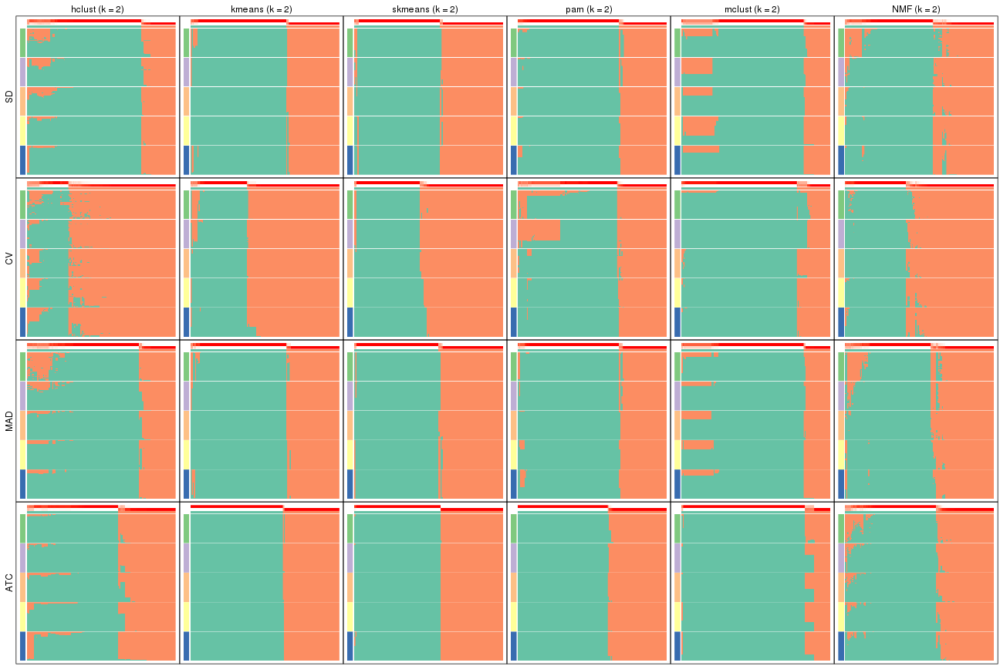</p>

</div>
<div id='tab-collect-membership-heatmap-2'>
<pre><code class="r">collect_plots(res_list, k = 3, fun = membership_heatmap, mc.cores = 4)
</code></pre>

<p>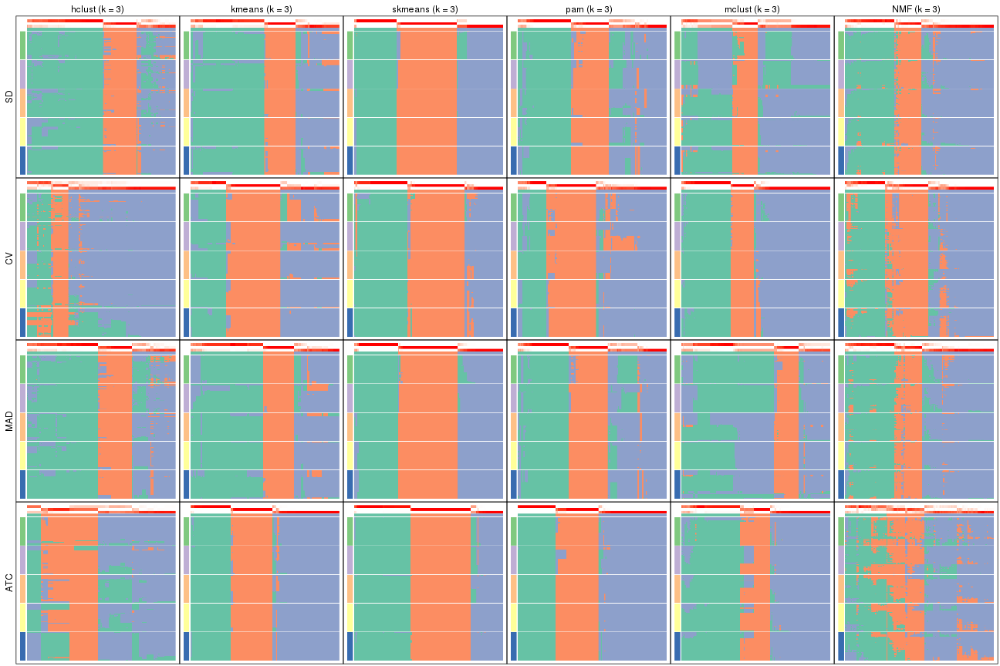</p>

</div>
<div id='tab-collect-membership-heatmap-3'>
<pre><code class="r">collect_plots(res_list, k = 4, fun = membership_heatmap, mc.cores = 4)
</code></pre>

<p>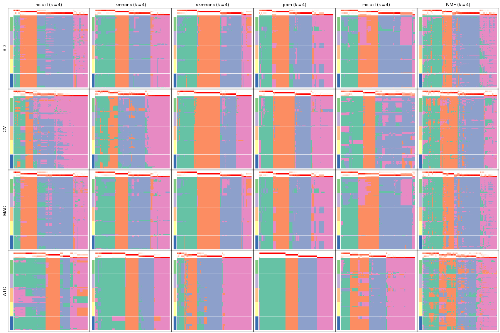</p>

</div>
<div id='tab-collect-membership-heatmap-4'>
<pre><code class="r">collect_plots(res_list, k = 5, fun = membership_heatmap, mc.cores = 4)
</code></pre>

<p>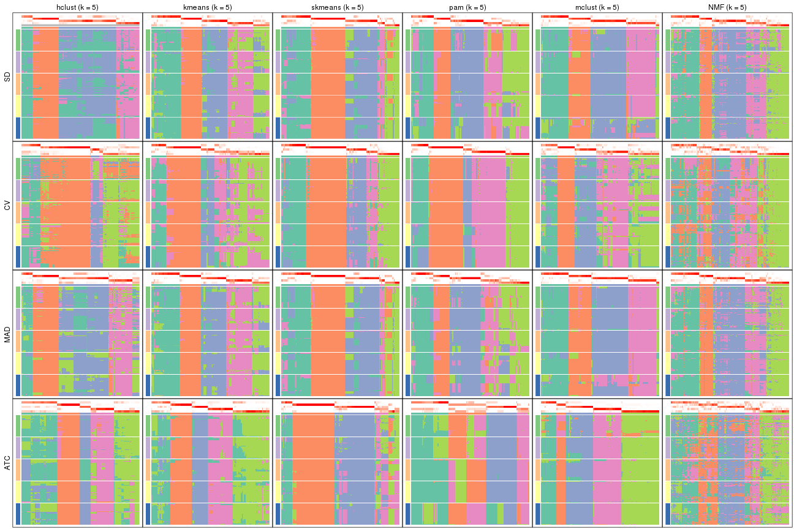</p>

</div>
<div id='tab-collect-membership-heatmap-5'>
<pre><code class="r">collect_plots(res_list, k = 6, fun = membership_heatmap, mc.cores = 4)
</code></pre>

<p>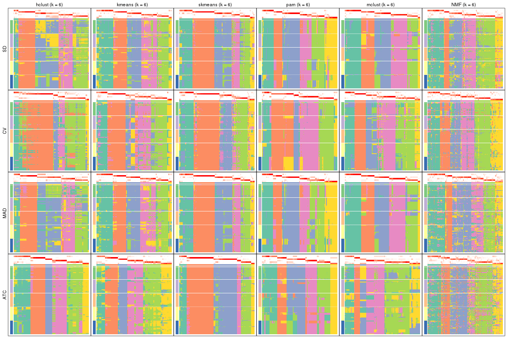</p>

</div>
</div>


### Signature heatmap

Signature heatmaps for all methods. ([What is a signature heatmap?](http://bioconductor.org/packages/devel/bioc/vignettes/cola/inst/doc/cola.html#toc_22))


Note in following heatmaps, rows are scaled.


<script>
$( function() {
	$( '#tabs-collect-get-signatures' ).tabs();
} );
</script>
<div id='tabs-collect-get-signatures'>
<ul>
<li><a href='#tab-collect-get-signatures-1'>k = 2</a></li>
<li><a href='#tab-collect-get-signatures-2'>k = 3</a></li>
<li><a href='#tab-collect-get-signatures-3'>k = 4</a></li>
<li><a href='#tab-collect-get-signatures-4'>k = 5</a></li>
<li><a href='#tab-collect-get-signatures-5'>k = 6</a></li>
</ul>
<div id='tab-collect-get-signatures-1'>
<pre><code class="r">collect_plots(res_list, k = 2, fun = get_signatures, mc.cores = 4)
</code></pre>

<p>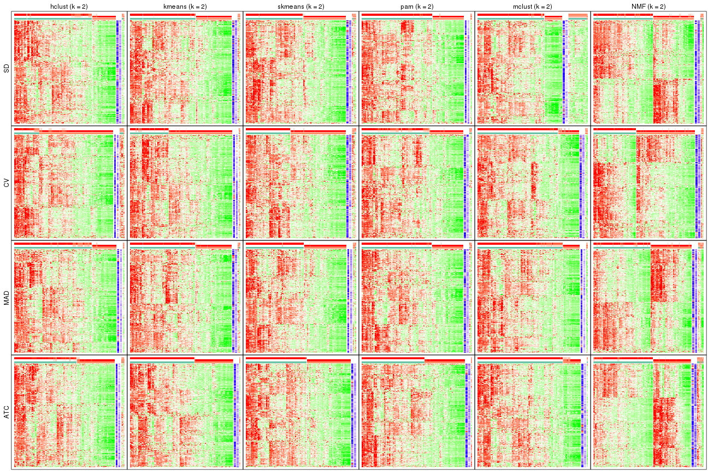</p>

</div>
<div id='tab-collect-get-signatures-2'>
<pre><code class="r">collect_plots(res_list, k = 3, fun = get_signatures, mc.cores = 4)
</code></pre>

<p>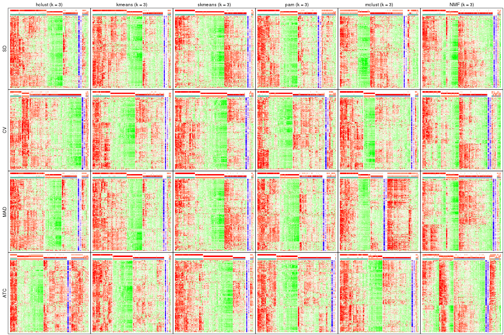</p>

</div>
<div id='tab-collect-get-signatures-3'>
<pre><code class="r">collect_plots(res_list, k = 4, fun = get_signatures, mc.cores = 4)
</code></pre>

<p>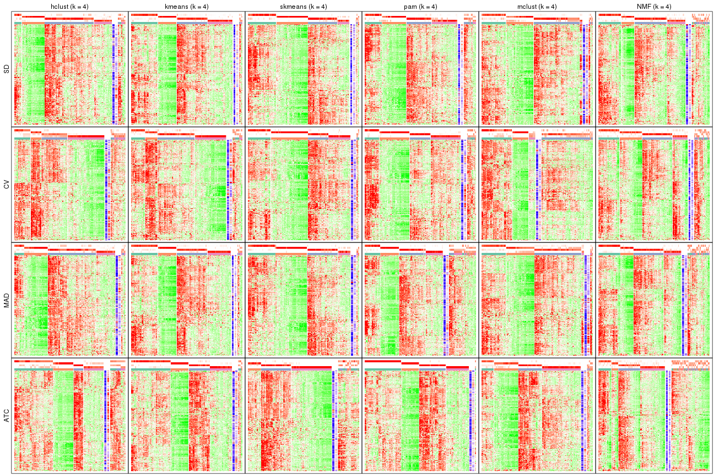</p>

</div>
<div id='tab-collect-get-signatures-4'>
<pre><code class="r">collect_plots(res_list, k = 5, fun = get_signatures, mc.cores = 4)
</code></pre>

<p>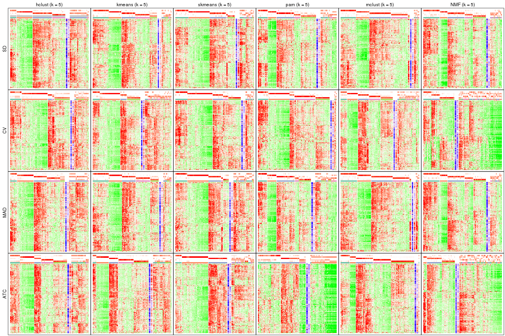</p>

</div>
<div id='tab-collect-get-signatures-5'>
<pre><code class="r">collect_plots(res_list, k = 6, fun = get_signatures, mc.cores = 4)
</code></pre>

<p>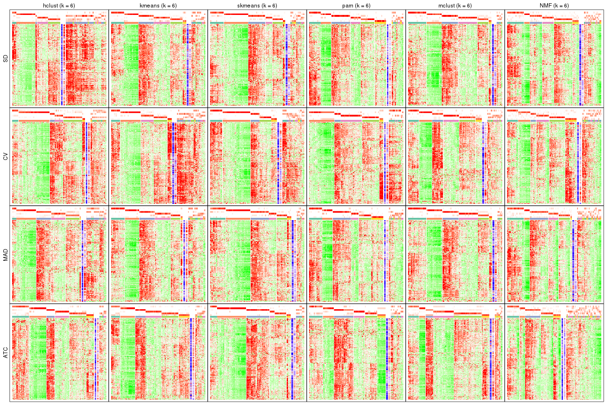</p>

</div>
</div>


### Statistics table

The statistics used for measuring the stability of consensus partitioning.
([How are they
defined?](http://bioconductor.org/packages/devel/bioc/vignettes/cola/inst/doc/cola.html#toc_13))


<script>
$( function() {
	$( '#tabs-get-stats-from-consensus-partition-list' ).tabs();
} );
</script>
<div id='tabs-get-stats-from-consensus-partition-list'>
<ul>
<li><a href='#tab-get-stats-from-consensus-partition-list-1'>k = 2</a></li>
<li><a href='#tab-get-stats-from-consensus-partition-list-2'>k = 3</a></li>
<li><a href='#tab-get-stats-from-consensus-partition-list-3'>k = 4</a></li>
<li><a href='#tab-get-stats-from-consensus-partition-list-4'>k = 5</a></li>
<li><a href='#tab-get-stats-from-consensus-partition-list-5'>k = 6</a></li>
</ul>
<div id='tab-get-stats-from-consensus-partition-list-1'>
<pre><code class="r">get_stats(res_list, k = 2)
</code></pre>

<pre><code>#&gt;             k 1-PAC mean_silhouette concordance area_increased  Rand Jaccard
#&gt; SD:NMF      2 0.715           0.884       0.945          0.489 0.512   0.512
#&gt; CV:NMF      2 0.947           0.941       0.974          0.493 0.512   0.512
#&gt; MAD:NMF     2 0.719           0.866       0.942          0.493 0.507   0.507
#&gt; ATC:NMF     2 0.827           0.890       0.954          0.481 0.522   0.522
#&gt; SD:skmeans  2 1.000           0.947       0.980          0.494 0.507   0.507
#&gt; CV:skmeans  2 0.984           0.944       0.979          0.498 0.503   0.503
#&gt; MAD:skmeans 2 1.000           0.956       0.983          0.494 0.505   0.505
#&gt; ATC:skmeans 2 1.000           0.998       0.999          0.491 0.509   0.509
#&gt; SD:mclust   2 0.597           0.796       0.906          0.363 0.705   0.705
#&gt; CV:mclust   2 0.923           0.928       0.964          0.320 0.649   0.649
#&gt; MAD:mclust  2 0.683           0.897       0.946          0.331 0.705   0.705
#&gt; ATC:mclust  2 0.967           0.955       0.976          0.260 0.715   0.715
#&gt; SD:kmeans   2 0.968           0.957       0.983          0.465 0.538   0.538
#&gt; CV:kmeans   2 0.980           0.942       0.974          0.468 0.525   0.525
#&gt; MAD:kmeans  2 0.983           0.956       0.982          0.466 0.538   0.538
#&gt; ATC:kmeans  2 1.000           0.988       0.995          0.473 0.525   0.525
#&gt; SD:pam      2 0.984           0.964       0.985          0.433 0.563   0.563
#&gt; CV:pam      2 0.569           0.875       0.925          0.454 0.552   0.552
#&gt; MAD:pam     2 0.937           0.953       0.981          0.438 0.563   0.563
#&gt; ATC:pam     2 1.000           0.986       0.994          0.480 0.518   0.518
#&gt; SD:hclust   2 0.741           0.898       0.950          0.385 0.640   0.640
#&gt; CV:hclust   2 0.707           0.865       0.933          0.379 0.594   0.594
#&gt; MAD:hclust  2 0.733           0.871       0.938          0.399 0.624   0.624
#&gt; ATC:hclust  2 0.864           0.910       0.954          0.472 0.522   0.522
</code></pre>

</div>
<div id='tab-get-stats-from-consensus-partition-list-2'>
<pre><code class="r">get_stats(res_list, k = 3)
</code></pre>

<pre><code>#&gt;             k 1-PAC mean_silhouette concordance area_increased  Rand Jaccard
#&gt; SD:NMF      3 0.766           0.847       0.927          0.276 0.789   0.617
#&gt; CV:NMF      3 0.692           0.774       0.902          0.335 0.751   0.550
#&gt; MAD:NMF     3 0.715           0.827       0.914          0.274 0.811   0.646
#&gt; ATC:NMF     3 0.433           0.629       0.801          0.352 0.718   0.513
#&gt; SD:skmeans  3 0.937           0.933       0.972          0.344 0.802   0.619
#&gt; CV:skmeans  3 0.928           0.900       0.958          0.323 0.776   0.579
#&gt; MAD:skmeans 3 0.961           0.926       0.971          0.344 0.796   0.609
#&gt; ATC:skmeans 3 0.992           0.934       0.972          0.309 0.827   0.664
#&gt; SD:mclust   3 0.489           0.623       0.757          0.624 0.664   0.527
#&gt; CV:mclust   3 0.912           0.912       0.965          0.919 0.619   0.464
#&gt; MAD:mclust  3 0.457           0.506       0.737          0.757 0.729   0.621
#&gt; ATC:mclust  3 0.773           0.850       0.924          1.377 0.618   0.474
#&gt; SD:kmeans   3 0.735           0.855       0.914          0.362 0.747   0.564
#&gt; CV:kmeans   3 0.755           0.864       0.920          0.385 0.673   0.452
#&gt; MAD:kmeans  3 0.726           0.831       0.904          0.368 0.739   0.553
#&gt; ATC:kmeans  3 0.965           0.932       0.973          0.384 0.682   0.466
#&gt; SD:pam      3 0.653           0.722       0.880          0.513 0.693   0.492
#&gt; CV:pam      3 0.628           0.802       0.908          0.374 0.815   0.665
#&gt; MAD:pam     3 0.653           0.745       0.888          0.506 0.699   0.499
#&gt; ATC:pam     3 0.999           0.957       0.981          0.353 0.681   0.464
#&gt; SD:hclust   3 0.610           0.787       0.887          0.594 0.729   0.579
#&gt; CV:hclust   3 0.508           0.776       0.862          0.253 0.962   0.936
#&gt; MAD:hclust  3 0.579           0.768       0.879          0.562 0.714   0.551
#&gt; ATC:hclust  3 0.581           0.674       0.799          0.297 0.903   0.813
</code></pre>

</div>
<div id='tab-get-stats-from-consensus-partition-list-3'>
<pre><code class="r">get_stats(res_list, k = 4)
</code></pre>

<pre><code>#&gt;             k 1-PAC mean_silhouette concordance area_increased  Rand Jaccard
#&gt; SD:NMF      4 0.634           0.685       0.848         0.1578 0.790   0.511
#&gt; CV:NMF      4 0.664           0.697       0.836         0.1327 0.773   0.455
#&gt; MAD:NMF     4 0.663           0.686       0.856         0.1562 0.802   0.527
#&gt; ATC:NMF     4 0.527           0.537       0.746         0.1511 0.674   0.297
#&gt; SD:skmeans  4 0.806           0.861       0.922         0.1018 0.896   0.705
#&gt; CV:skmeans  4 0.897           0.905       0.950         0.1211 0.858   0.617
#&gt; MAD:skmeans 4 0.838           0.880       0.933         0.1029 0.881   0.669
#&gt; ATC:skmeans 4 0.766           0.763       0.899         0.0751 0.894   0.721
#&gt; SD:mclust   4 0.639           0.698       0.823         0.1562 0.855   0.662
#&gt; CV:mclust   4 0.521           0.477       0.752         0.1214 0.866   0.691
#&gt; MAD:mclust  4 0.638           0.723       0.821         0.1682 0.603   0.327
#&gt; ATC:mclust  4 0.680           0.816       0.884         0.1218 0.855   0.627
#&gt; SD:kmeans   4 0.810           0.873       0.923         0.1780 0.795   0.506
#&gt; CV:kmeans   4 0.725           0.757       0.877         0.1126 0.874   0.666
#&gt; MAD:kmeans  4 0.764           0.851       0.908         0.1696 0.797   0.508
#&gt; ATC:kmeans  4 0.886           0.881       0.940         0.1143 0.798   0.512
#&gt; SD:pam      4 0.737           0.737       0.881         0.1333 0.797   0.489
#&gt; CV:pam      4 0.854           0.862       0.936         0.1858 0.854   0.619
#&gt; MAD:pam     4 0.737           0.709       0.874         0.1238 0.775   0.449
#&gt; ATC:pam     4 1.000           0.983       0.994         0.1363 0.864   0.638
#&gt; SD:hclust   4 0.640           0.754       0.881         0.0987 0.949   0.866
#&gt; CV:hclust   4 0.463           0.670       0.793         0.3152 0.742   0.544
#&gt; MAD:hclust  4 0.673           0.767       0.874         0.1158 0.962   0.896
#&gt; ATC:hclust  4 0.627           0.625       0.724         0.1392 0.821   0.601
</code></pre>

</div>
<div id='tab-get-stats-from-consensus-partition-list-4'>
<pre><code class="r">get_stats(res_list, k = 5)
</code></pre>

<pre><code>#&gt;             k 1-PAC mean_silhouette concordance area_increased  Rand Jaccard
#&gt; SD:NMF      5 0.616           0.678       0.813         0.0817 0.849   0.526
#&gt; CV:NMF      5 0.559           0.412       0.671         0.0713 0.863   0.546
#&gt; MAD:NMF     5 0.673           0.690       0.827         0.0791 0.840   0.496
#&gt; ATC:NMF     5 0.522           0.410       0.639         0.0634 0.872   0.558
#&gt; SD:skmeans  5 0.758           0.666       0.845         0.0466 0.959   0.848
#&gt; CV:skmeans  5 0.838           0.785       0.893         0.0483 0.933   0.759
#&gt; MAD:skmeans 5 0.773           0.644       0.838         0.0457 0.975   0.906
#&gt; ATC:skmeans 5 0.752           0.676       0.822         0.0494 0.918   0.749
#&gt; SD:mclust   5 0.712           0.802       0.872         0.1023 0.822   0.525
#&gt; CV:mclust   5 0.587           0.571       0.752         0.1054 0.771   0.412
#&gt; MAD:mclust  5 0.776           0.841       0.896         0.1110 0.822   0.525
#&gt; ATC:mclust  5 0.836           0.879       0.915         0.0991 0.894   0.654
#&gt; SD:kmeans   5 0.735           0.727       0.824         0.0676 0.918   0.692
#&gt; CV:kmeans   5 0.713           0.548       0.768         0.0804 0.864   0.576
#&gt; MAD:kmeans  5 0.763           0.766       0.857         0.0713 0.914   0.681
#&gt; ATC:kmeans  5 0.747           0.682       0.842         0.0785 0.893   0.641
#&gt; SD:pam      5 0.674           0.631       0.805         0.0624 0.912   0.678
#&gt; CV:pam      5 0.861           0.861       0.925         0.0406 0.970   0.885
#&gt; MAD:pam     5 0.671           0.598       0.802         0.0629 0.897   0.633
#&gt; ATC:pam     5 0.704           0.383       0.705         0.0644 0.881   0.636
#&gt; SD:hclust   5 0.613           0.613       0.740         0.1157 0.991   0.973
#&gt; CV:hclust   5 0.518           0.636       0.750         0.0950 0.947   0.840
#&gt; MAD:hclust  5 0.653           0.595       0.768         0.0895 0.948   0.839
#&gt; ATC:hclust  5 0.659           0.674       0.783         0.1147 0.847   0.541
</code></pre>

</div>
<div id='tab-get-stats-from-consensus-partition-list-5'>
<pre><code class="r">get_stats(res_list, k = 6)
</code></pre>

<pre><code>#&gt;             k 1-PAC mean_silhouette concordance area_increased  Rand Jaccard
#&gt; SD:NMF      6 0.640           0.642       0.784         0.0445 0.929   0.695
#&gt; CV:NMF      6 0.701           0.646       0.796         0.0448 0.866   0.471
#&gt; MAD:NMF     6 0.617           0.588       0.752         0.0436 0.952   0.780
#&gt; ATC:NMF     6 0.595           0.519       0.686         0.0356 0.893   0.560
#&gt; SD:skmeans  6 0.779           0.726       0.855         0.0437 0.894   0.604
#&gt; CV:skmeans  6 0.839           0.672       0.842         0.0284 0.969   0.868
#&gt; MAD:skmeans 6 0.807           0.770       0.875         0.0437 0.900   0.629
#&gt; ATC:skmeans 6 0.865           0.824       0.916         0.0447 0.957   0.849
#&gt; SD:mclust   6 0.798           0.782       0.875         0.0724 0.891   0.591
#&gt; CV:mclust   6 0.720           0.679       0.825         0.0589 0.919   0.660
#&gt; MAD:mclust  6 0.837           0.819       0.899         0.0723 0.883   0.569
#&gt; ATC:mclust  6 0.688           0.725       0.778         0.0353 0.961   0.836
#&gt; SD:kmeans   6 0.763           0.661       0.821         0.0391 0.948   0.763
#&gt; CV:kmeans   6 0.747           0.623       0.799         0.0475 0.866   0.501
#&gt; MAD:kmeans  6 0.791           0.667       0.824         0.0368 0.957   0.798
#&gt; ATC:kmeans  6 0.760           0.722       0.827         0.0489 0.918   0.646
#&gt; SD:pam      6 0.806           0.729       0.865         0.0511 0.890   0.545
#&gt; CV:pam      6 0.795           0.745       0.877         0.0325 0.973   0.887
#&gt; MAD:pam     6 0.798           0.682       0.855         0.0510 0.885   0.531
#&gt; ATC:pam     6 0.751           0.678       0.795         0.0490 0.836   0.463
#&gt; SD:hclust   6 0.664           0.529       0.715         0.0570 0.859   0.590
#&gt; CV:hclust   6 0.618           0.645       0.812         0.0638 0.942   0.814
#&gt; MAD:hclust  6 0.684           0.634       0.728         0.0546 0.911   0.692
#&gt; ATC:hclust  6 0.781           0.772       0.865         0.0545 0.960   0.818
</code></pre>

</div>
</div>

Following heatmap plots the partition for each combination of methods and the
lightness correspond to the silhouette scores for samples in each method. On
top the consensus subgroup is inferred from all methods by taking the mean
silhouette scores as weight.


<script>
$( function() {
	$( '#tabs-collect-stats-from-consensus-partition-list' ).tabs();
} );
</script>
<div id='tabs-collect-stats-from-consensus-partition-list'>
<ul>
<li><a href='#tab-collect-stats-from-consensus-partition-list-1'>k = 2</a></li>
<li><a href='#tab-collect-stats-from-consensus-partition-list-2'>k = 3</a></li>
<li><a href='#tab-collect-stats-from-consensus-partition-list-3'>k = 4</a></li>
<li><a href='#tab-collect-stats-from-consensus-partition-list-4'>k = 5</a></li>
<li><a href='#tab-collect-stats-from-consensus-partition-list-5'>k = 6</a></li>
</ul>
<div id='tab-collect-stats-from-consensus-partition-list-1'>
<pre><code class="r">collect_stats(res_list, k = 2)
</code></pre>

<p>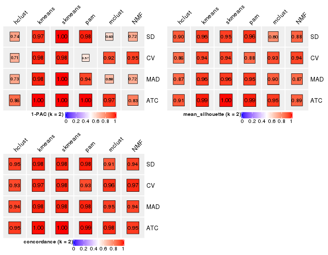</p>

</div>
<div id='tab-collect-stats-from-consensus-partition-list-2'>
<pre><code class="r">collect_stats(res_list, k = 3)
</code></pre>

<p>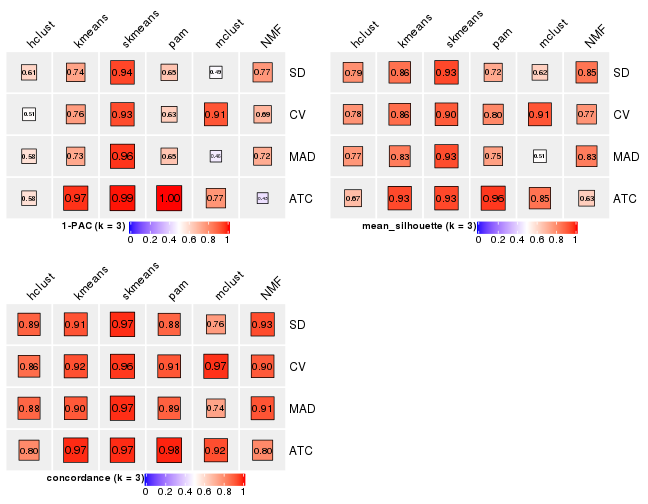</p>

</div>
<div id='tab-collect-stats-from-consensus-partition-list-3'>
<pre><code class="r">collect_stats(res_list, k = 4)
</code></pre>

<p>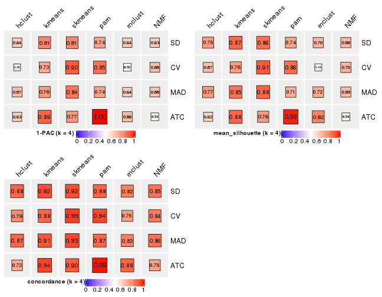</p>

</div>
<div id='tab-collect-stats-from-consensus-partition-list-4'>
<pre><code class="r">collect_stats(res_list, k = 5)
</code></pre>

<p>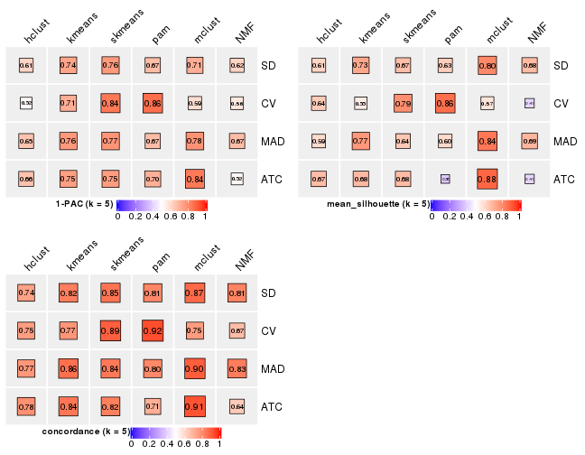</p>

</div>
<div id='tab-collect-stats-from-consensus-partition-list-5'>
<pre><code class="r">collect_stats(res_list, k = 6)
</code></pre>

<p>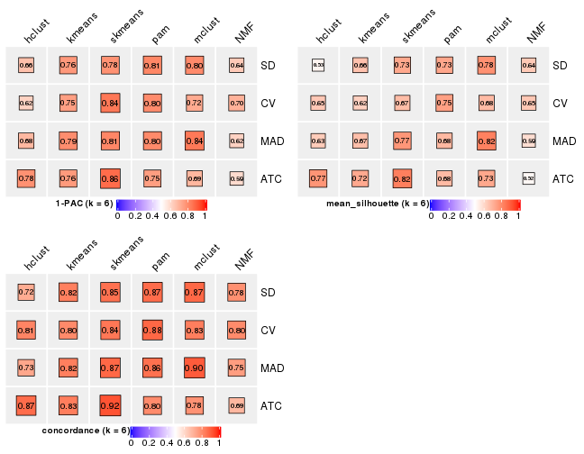</p>

</div>
</div>

### Partition from all methods


Collect partitions from all methods:


<script>
$( function() {
	$( '#tabs-collect-classes-from-consensus-partition-list' ).tabs();
} );
</script>
<div id='tabs-collect-classes-from-consensus-partition-list'>
<ul>
<li><a href='#tab-collect-classes-from-consensus-partition-list-1'>k = 2</a></li>
<li><a href='#tab-collect-classes-from-consensus-partition-list-2'>k = 3</a></li>
<li><a href='#tab-collect-classes-from-consensus-partition-list-3'>k = 4</a></li>
<li><a href='#tab-collect-classes-from-consensus-partition-list-4'>k = 5</a></li>
<li><a href='#tab-collect-classes-from-consensus-partition-list-5'>k = 6</a></li>
</ul>
<div id='tab-collect-classes-from-consensus-partition-list-1'>
<pre><code class="r">collect_classes(res_list, k = 2)
</code></pre>

<p>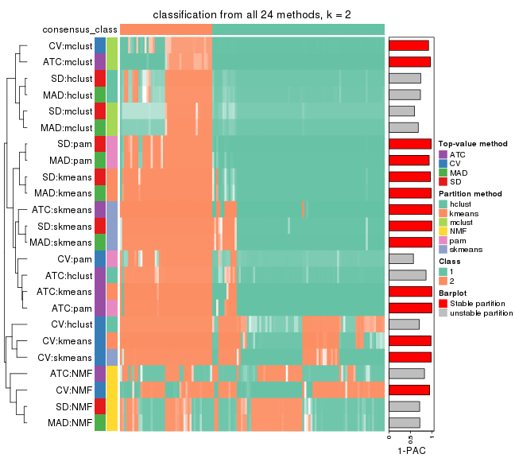</p>

</div>
<div id='tab-collect-classes-from-consensus-partition-list-2'>
<pre><code class="r">collect_classes(res_list, k = 3)
</code></pre>

<p>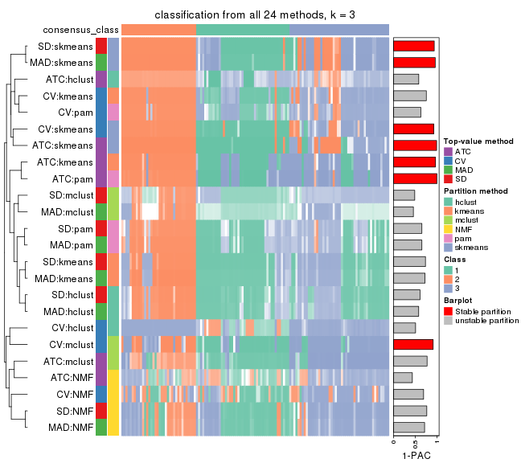</p>

</div>
<div id='tab-collect-classes-from-consensus-partition-list-3'>
<pre><code class="r">collect_classes(res_list, k = 4)
</code></pre>

<p>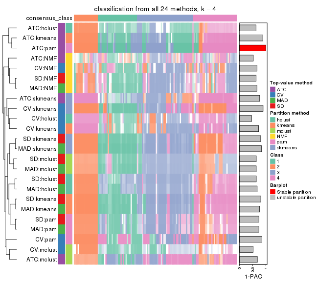</p>

</div>
<div id='tab-collect-classes-from-consensus-partition-list-4'>
<pre><code class="r">collect_classes(res_list, k = 5)
</code></pre>

<p>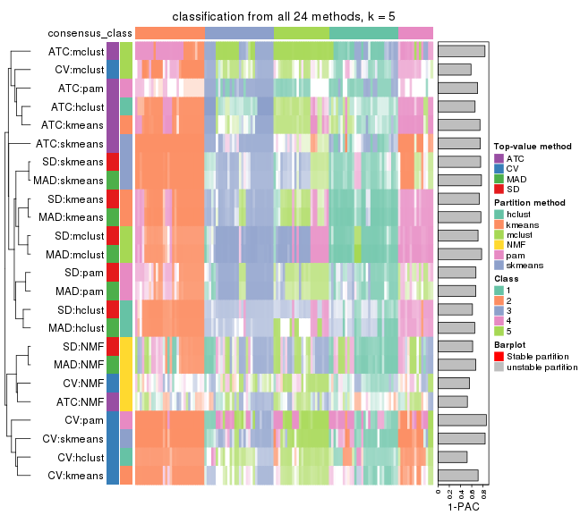</p>

</div>
<div id='tab-collect-classes-from-consensus-partition-list-5'>
<pre><code class="r">collect_classes(res_list, k = 6)
</code></pre>

<p>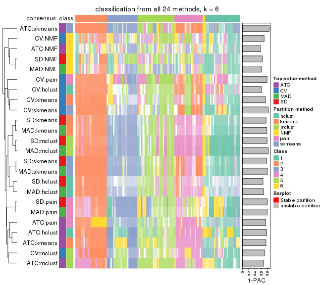</p>

</div>
</div>


### Top rows overlap


Overlap of top rows from different top-row methods:


<script>
$( function() {
	$( '#tabs-top-rows-overlap-by-euler' ).tabs();
} );
</script>
<div id='tabs-top-rows-overlap-by-euler'>
<ul>
<li><a href='#tab-top-rows-overlap-by-euler-1'>top_n = 1000</a></li>
<li><a href='#tab-top-rows-overlap-by-euler-2'>top_n = 2000</a></li>
<li><a href='#tab-top-rows-overlap-by-euler-3'>top_n = 3000</a></li>
<li><a href='#tab-top-rows-overlap-by-euler-4'>top_n = 4000</a></li>
<li><a href='#tab-top-rows-overlap-by-euler-5'>top_n = 5000</a></li>
</ul>
<div id='tab-top-rows-overlap-by-euler-1'>
<pre><code class="r">top_rows_overlap(res_list, top_n = 1000, method = &quot;euler&quot;)
</code></pre>

<p>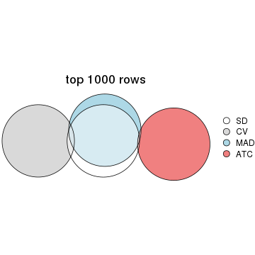</p>

</div>
<div id='tab-top-rows-overlap-by-euler-2'>
<pre><code class="r">top_rows_overlap(res_list, top_n = 2000, method = &quot;euler&quot;)
</code></pre>

<p>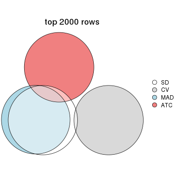</p>

</div>
<div id='tab-top-rows-overlap-by-euler-3'>
<pre><code class="r">top_rows_overlap(res_list, top_n = 3000, method = &quot;euler&quot;)
</code></pre>

<p>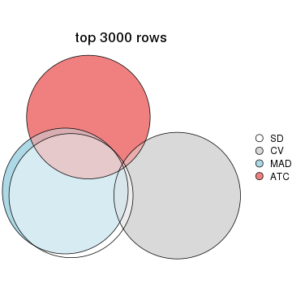</p>

</div>
<div id='tab-top-rows-overlap-by-euler-4'>
<pre><code class="r">top_rows_overlap(res_list, top_n = 4000, method = &quot;euler&quot;)
</code></pre>

<p>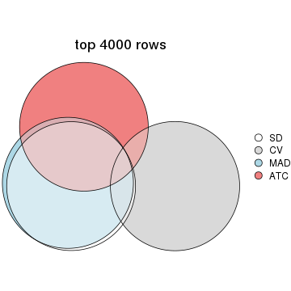</p>

</div>
<div id='tab-top-rows-overlap-by-euler-5'>
<pre><code class="r">top_rows_overlap(res_list, top_n = 5000, method = &quot;euler&quot;)
</code></pre>

<p>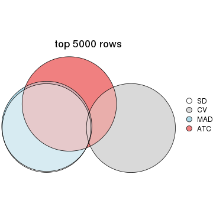</p>

</div>
</div>

Also visualize the correspondance of rankings between different top-row methods:


<script>
$( function() {
	$( '#tabs-top-rows-overlap-by-correspondance' ).tabs();
} );
</script>
<div id='tabs-top-rows-overlap-by-correspondance'>
<ul>
<li><a href='#tab-top-rows-overlap-by-correspondance-1'>top_n = 1000</a></li>
<li><a href='#tab-top-rows-overlap-by-correspondance-2'>top_n = 2000</a></li>
<li><a href='#tab-top-rows-overlap-by-correspondance-3'>top_n = 3000</a></li>
<li><a href='#tab-top-rows-overlap-by-correspondance-4'>top_n = 4000</a></li>
<li><a href='#tab-top-rows-overlap-by-correspondance-5'>top_n = 5000</a></li>
</ul>
<div id='tab-top-rows-overlap-by-correspondance-1'>
<pre><code class="r">top_rows_overlap(res_list, top_n = 1000, method = &quot;correspondance&quot;)
</code></pre>

<p>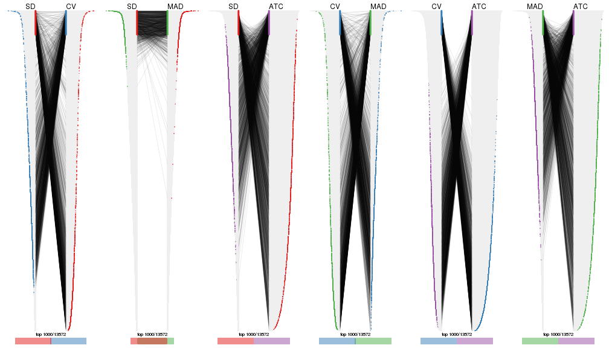</p>

</div>
<div id='tab-top-rows-overlap-by-correspondance-2'>
<pre><code class="r">top_rows_overlap(res_list, top_n = 2000, method = &quot;correspondance&quot;)
</code></pre>

<p>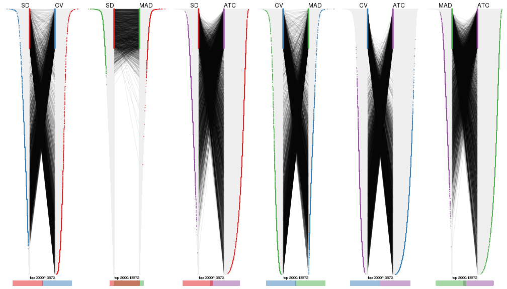</p>

</div>
<div id='tab-top-rows-overlap-by-correspondance-3'>
<pre><code class="r">top_rows_overlap(res_list, top_n = 3000, method = &quot;correspondance&quot;)
</code></pre>

<p>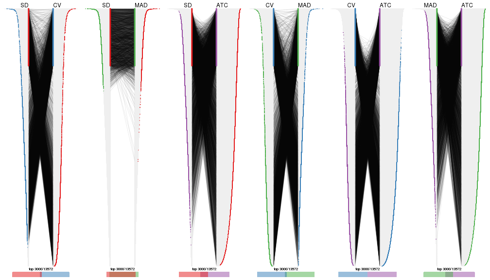</p>

</div>
<div id='tab-top-rows-overlap-by-correspondance-4'>
<pre><code class="r">top_rows_overlap(res_list, top_n = 4000, method = &quot;correspondance&quot;)
</code></pre>

<p>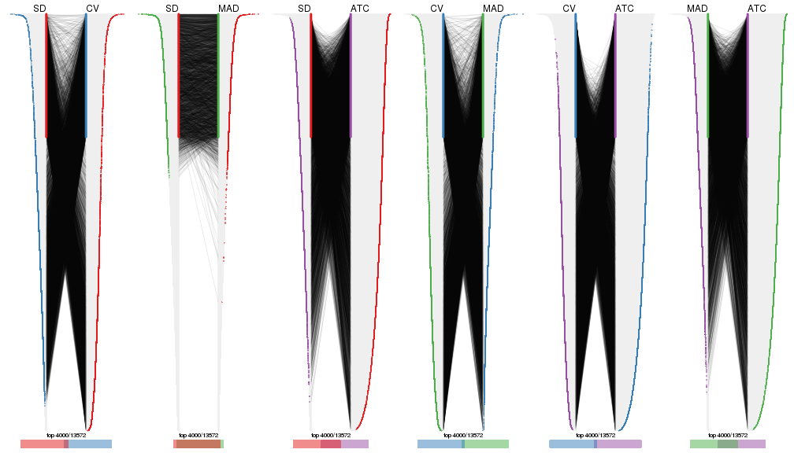</p>

</div>
<div id='tab-top-rows-overlap-by-correspondance-5'>
<pre><code class="r">top_rows_overlap(res_list, top_n = 5000, method = &quot;correspondance&quot;)
</code></pre>

<p>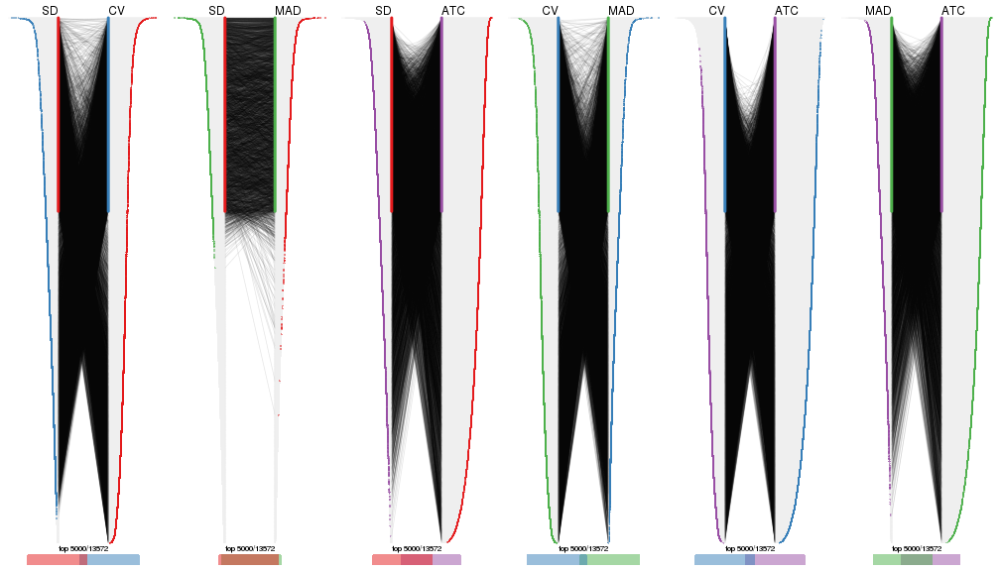</p>

</div>
</div>


Heatmaps of the top rows:


<script>
$( function() {
	$( '#tabs-top-rows-heatmap' ).tabs();
} );
</script>
<div id='tabs-top-rows-heatmap'>
<ul>
<li><a href='#tab-top-rows-heatmap-1'>top_n = 1000</a></li>
<li><a href='#tab-top-rows-heatmap-2'>top_n = 2000</a></li>
<li><a href='#tab-top-rows-heatmap-3'>top_n = 3000</a></li>
<li><a href='#tab-top-rows-heatmap-4'>top_n = 4000</a></li>
<li><a href='#tab-top-rows-heatmap-5'>top_n = 5000</a></li>
</ul>
<div id='tab-top-rows-heatmap-1'>
<pre><code class="r">top_rows_heatmap(res_list, top_n = 1000)
</code></pre>

<p>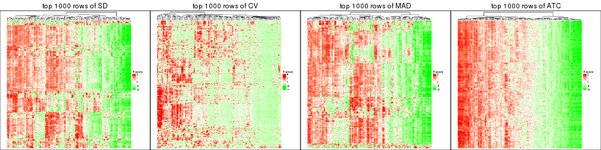</p>

</div>
<div id='tab-top-rows-heatmap-2'>
<pre><code class="r">top_rows_heatmap(res_list, top_n = 2000)
</code></pre>

<p>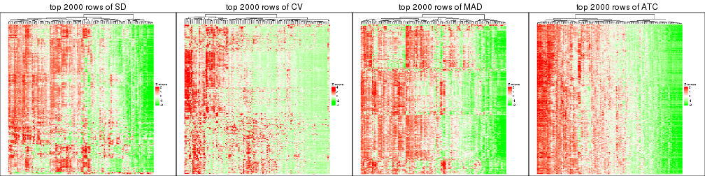</p>

</div>
<div id='tab-top-rows-heatmap-3'>
<pre><code class="r">top_rows_heatmap(res_list, top_n = 3000)
</code></pre>

<p>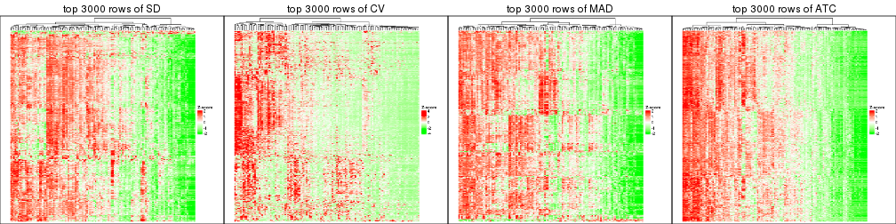</p>

</div>
<div id='tab-top-rows-heatmap-4'>
<pre><code class="r">top_rows_heatmap(res_list, top_n = 4000)
</code></pre>

<p>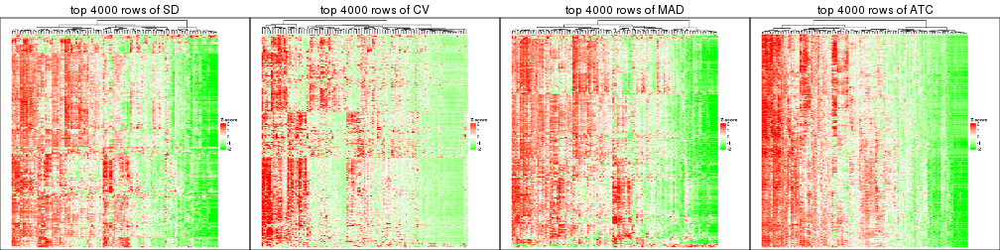</p>

</div>
<div id='tab-top-rows-heatmap-5'>
<pre><code class="r">top_rows_heatmap(res_list, top_n = 5000)
</code></pre>

<p>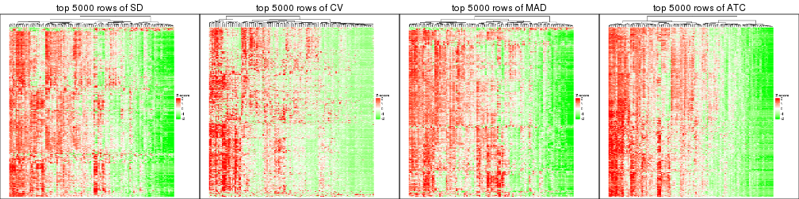</p>

</div>
</div>


 
## Results for each method


---------------------------------------------------


### SD:hclust


The object with results only for a single top-value method and a single partition method 
can be extracted as:

```r
res = res_list["SD", "hclust"]
# you can also extract it by
# res = res_list["SD:hclust"]
```

A summary of `res` and all the functions that can be applied to it:

```r
res
```

```
#> A 'ConsensusPartition' object with k = 2, 3, 4, 5, 6.
#>   On a matrix with 13572 rows and 129 columns.
#>   Top rows (1000, 2000, 3000, 4000, 5000) are extracted by 'SD' method.
#>   Subgroups are detected by 'hclust' method.
#>   Performed in total 1250 partitions by row resampling.
#>   Best k for subgroups seems to be 3.
#> 
#> Following methods can be applied to this 'ConsensusPartition' object:
#>  [1] "cola_report"             "collect_classes"         "collect_plots"          
#>  [4] "collect_stats"           "colnames"                "compare_signatures"     
#>  [7] "consensus_heatmap"       "dimension_reduction"     "functional_enrichment"  
#> [10] "get_anno_col"            "get_anno"                "get_classes"            
#> [13] "get_consensus"           "get_matrix"              "get_membership"         
#> [16] "get_param"               "get_signatures"          "get_stats"              
#> [19] "is_best_k"               "is_stable_k"             "membership_heatmap"     
#> [22] "ncol"                    "nrow"                    "plot_ecdf"              
#> [25] "rownames"                "select_partition_number" "show"                   
#> [28] "suggest_best_k"          "test_to_known_factors"
```

`collect_plots()` function collects all the plots made from `res` for all `k` (number of partitions)
into one single page to provide an easy and fast comparison between different `k`.

```r
collect_plots(res)
```

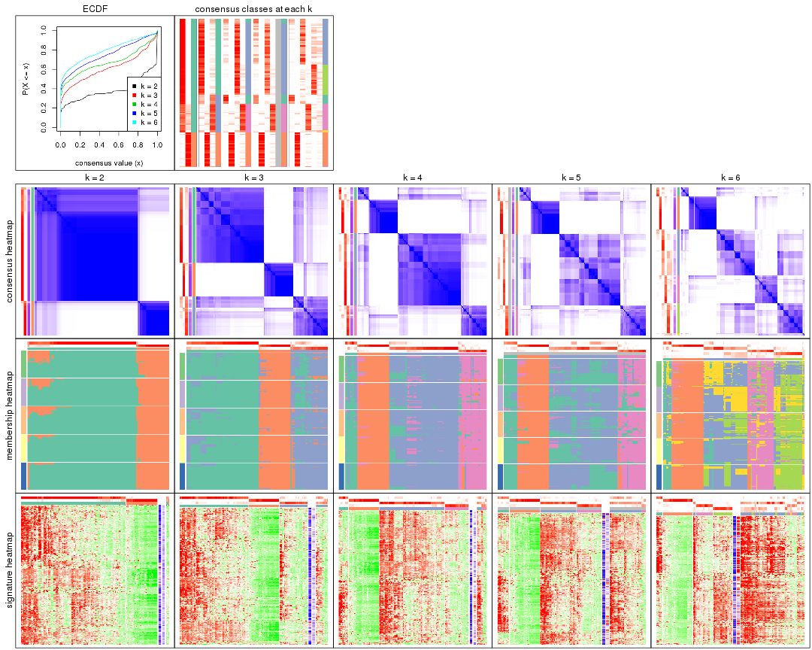

The plots are:

- The first row: a plot of the ECDF (Empirical cumulative distribution
  function) curves of the consensus matrix for each `k` and the heatmap of
  predicted classes for each `k`.
- The second row: heatmaps of the consensus matrix for each `k`.
- The third row: heatmaps of the membership matrix for each `k`.
- The fouth row: heatmaps of the signatures for each `k`.

All the plots in panels can be made by individual functions and they are
plotted later in this section.

`select_partition_number()` produces several plots showing different
statistics for choosing "optimized" `k`. There are following statistics:

- ECDF curves of the consensus matrix for each `k`;
- 1-PAC. [The PAC
  score](https://en.wikipedia.org/wiki/Consensus_clustering#Over-interpretation_potential_of_consensus_clustering)
  measures the proportion of the ambiguous subgrouping.
- Mean silhouette score.
- Concordance. The mean probability of fiting the consensus class ids in all
  partitions.
- Area increased. Denote $A_k$ as the area under the ECDF curve for current
  `k`, the area increased is defined as $A_k - A_{k-1}$.
- Rand index. The percent of pairs of samples that are both in a same cluster
  or both are not in a same cluster in the partition of k and k-1.
- Jaccard index. The ratio of pairs of samples are both in a same cluster in
  the partition of k and k-1 and the pairs of samples are both in a same
  cluster in the partition k or k-1.

The detailed explanations of these statistics can be found in [the cola
vignette](http://bioconductor.org/packages/devel/bioc/vignettes/cola/inst/doc/cola.html#toc_13).

Generally speaking, lower PAC score, higher mean silhouette score or higher
concordance corresponds to better partition. Rand index and Jaccard index
measure how similar the current partition is compared to partition with `k-1`.
If they are too similar, we won't accept `k` is better than `k-1`.

```r
select_partition_number(res)
```

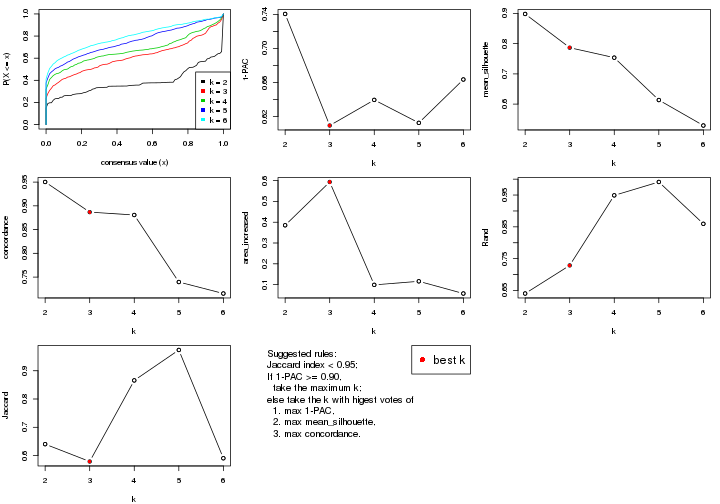

The numeric values for all these statistics can be obtained by `get_stats()`.

```r
get_stats(res)
```

```
#>   k 1-PAC mean_silhouette concordance area_increased  Rand Jaccard
#> 2 2 0.741           0.898       0.950         0.3853 0.640   0.640
#> 3 3 0.610           0.787       0.887         0.5937 0.729   0.579
#> 4 4 0.640           0.754       0.881         0.0987 0.949   0.866
#> 5 5 0.613           0.613       0.740         0.1157 0.991   0.973
#> 6 6 0.664           0.529       0.715         0.0570 0.859   0.590
```

`suggest_best_k()` suggests the best $k$ based on these statistics. The rules are as follows:

- All $k$ with Jaccard index larger than 0.95 are removed because the increase of
  the partition number does not provides enough extra information. If all $k$ are removed,
  the best $k$ is assigned by `NA`.
- For $k$ with 1-PAC larger than 0.9, the maximal $k$ is taken as the "best k". Other $k$ is called "optional k".
- If it does not fit the second rule. The $k$ with the highest vote of highest
  1-PAC, mean silhouette and concordance is taken as the "best k".

```r
suggest_best_k(res)
```

```
#> [1] 3
```


Following shows the table of the partitions (You need to click the **show/hide
code output** link to see it). The membership matrix (columns with name `p*`)
is inferred by
[`clue::cl_consensus()`](https://www.rdocumentation.org/link/cl_consensus?package=clue)
function with the `SE` method. Basically the value in the membership matrix
represents the probability to belong to a certain group. The finall class
label for an item is determined with the group with highest probability it
belongs to.

In `get_classes()` function, the entropy is calculated from the membership
matrix and the silhouette score is calculated from the consensus matrix.


<script>
$( function() {
	$( '#tabs-SD-hclust-get-classes' ).tabs();
} );
</script>
<div id='tabs-SD-hclust-get-classes'>
<ul>
<li><a href='#tab-SD-hclust-get-classes-1'>k = 2</a></li>
<li><a href='#tab-SD-hclust-get-classes-2'>k = 3</a></li>
<li><a href='#tab-SD-hclust-get-classes-3'>k = 4</a></li>
<li><a href='#tab-SD-hclust-get-classes-4'>k = 5</a></li>
<li><a href='#tab-SD-hclust-get-classes-5'>k = 6</a></li>
</ul>

<div id='tab-SD-hclust-get-classes-1'>
<p><a id='tab-SD-hclust-get-classes-1-a' style='color:#0366d6' href='#'>show/hide code output</a></p>
<pre><code class="r">cbind(get_classes(res, k = 2), get_membership(res, k = 2))
</code></pre>

<pre><code>#&gt;            class entropy silhouette    p1    p2
#&gt; SRR1656463     2  0.0000      0.964 0.000 1.000
#&gt; SRR1656464     1  0.0000      0.941 1.000 0.000
#&gt; SRR1656462     1  0.0000      0.941 1.000 0.000
#&gt; SRR1656465     1  0.0000      0.941 1.000 0.000
#&gt; SRR1656467     2  0.8207      0.631 0.256 0.744
#&gt; SRR1656466     1  0.0000      0.941 1.000 0.000
#&gt; SRR1656468     1  0.6048      0.837 0.852 0.148
#&gt; SRR1656472     1  0.0672      0.938 0.992 0.008
#&gt; SRR1656471     1  0.0000      0.941 1.000 0.000
#&gt; SRR1656470     2  0.0000      0.964 0.000 1.000
#&gt; SRR1656469     1  0.0376      0.940 0.996 0.004
#&gt; SRR1656473     2  0.0000      0.964 0.000 1.000
#&gt; SRR1656474     2  0.0000      0.964 0.000 1.000
#&gt; SRR1656475     2  0.0000      0.964 0.000 1.000
#&gt; SRR1656478     1  0.0000      0.941 1.000 0.000
#&gt; SRR1656477     1  0.7602      0.760 0.780 0.220
#&gt; SRR1656479     1  0.0376      0.940 0.996 0.004
#&gt; SRR1656480     1  0.7674      0.755 0.776 0.224
#&gt; SRR1656476     2  0.0000      0.964 0.000 1.000
#&gt; SRR1656481     1  0.5946      0.840 0.856 0.144
#&gt; SRR1656482     2  0.0376      0.962 0.004 0.996
#&gt; SRR1656483     2  0.0000      0.964 0.000 1.000
#&gt; SRR1656485     1  0.0000      0.941 1.000 0.000
#&gt; SRR1656487     1  0.0000      0.941 1.000 0.000
#&gt; SRR1656486     1  0.0000      0.941 1.000 0.000
#&gt; SRR1656488     1  0.0000      0.941 1.000 0.000
#&gt; SRR1656484     1  0.0000      0.941 1.000 0.000
#&gt; SRR1656489     1  0.0000      0.941 1.000 0.000
#&gt; SRR1656491     1  0.0672      0.938 0.992 0.008
#&gt; SRR1656490     1  0.0376      0.940 0.996 0.004
#&gt; SRR1656492     1  0.0000      0.941 1.000 0.000
#&gt; SRR1656493     1  0.0376      0.940 0.996 0.004
#&gt; SRR1656495     1  0.0672      0.938 0.992 0.008
#&gt; SRR1656496     1  0.0376      0.940 0.996 0.004
#&gt; SRR1656494     2  0.3733      0.910 0.072 0.928
#&gt; SRR1656497     2  0.0000      0.964 0.000 1.000
#&gt; SRR1656499     1  0.0000      0.941 1.000 0.000
#&gt; SRR1656500     1  0.0000      0.941 1.000 0.000
#&gt; SRR1656501     1  0.0000      0.941 1.000 0.000
#&gt; SRR1656498     1  0.0000      0.941 1.000 0.000
#&gt; SRR1656504     2  0.0000      0.964 0.000 1.000
#&gt; SRR1656502     1  0.0672      0.938 0.992 0.008
#&gt; SRR1656503     1  0.0000      0.941 1.000 0.000
#&gt; SRR1656507     1  0.0000      0.941 1.000 0.000
#&gt; SRR1656508     1  0.0000      0.941 1.000 0.000
#&gt; SRR1656505     1  0.7815      0.745 0.768 0.232
#&gt; SRR1656506     1  0.0000      0.941 1.000 0.000
#&gt; SRR1656509     1  0.6531      0.817 0.832 0.168
#&gt; SRR1656510     1  0.3733      0.897 0.928 0.072
#&gt; SRR1656511     1  0.8555      0.676 0.720 0.280
#&gt; SRR1656513     2  0.2423      0.940 0.040 0.960
#&gt; SRR1656512     2  0.0000      0.964 0.000 1.000
#&gt; SRR1656514     1  0.0000      0.941 1.000 0.000
#&gt; SRR1656515     2  0.9286      0.425 0.344 0.656
#&gt; SRR1656516     1  0.0000      0.941 1.000 0.000
#&gt; SRR1656518     1  0.0000      0.941 1.000 0.000
#&gt; SRR1656517     1  0.0000      0.941 1.000 0.000
#&gt; SRR1656519     1  0.0000      0.941 1.000 0.000
#&gt; SRR1656522     1  0.0000      0.941 1.000 0.000
#&gt; SRR1656523     1  0.4690      0.877 0.900 0.100
#&gt; SRR1656521     2  0.0000      0.964 0.000 1.000
#&gt; SRR1656520     1  0.0000      0.941 1.000 0.000
#&gt; SRR1656524     1  0.0672      0.938 0.992 0.008
#&gt; SRR1656525     1  0.0000      0.941 1.000 0.000
#&gt; SRR1656526     2  0.0000      0.964 0.000 1.000
#&gt; SRR1656527     2  0.2043      0.946 0.032 0.968
#&gt; SRR1656530     1  0.0000      0.941 1.000 0.000
#&gt; SRR1656529     1  0.0000      0.941 1.000 0.000
#&gt; SRR1656531     1  0.0000      0.941 1.000 0.000
#&gt; SRR1656528     1  0.0000      0.941 1.000 0.000
#&gt; SRR1656534     1  0.0000      0.941 1.000 0.000
#&gt; SRR1656533     1  0.0000      0.941 1.000 0.000
#&gt; SRR1656536     1  0.0672      0.938 0.992 0.008
#&gt; SRR1656532     2  0.2778      0.933 0.048 0.952
#&gt; SRR1656537     1  0.0000      0.941 1.000 0.000
#&gt; SRR1656538     1  0.0000      0.941 1.000 0.000
#&gt; SRR1656535     2  0.0000      0.964 0.000 1.000
#&gt; SRR1656539     1  0.0672      0.938 0.992 0.008
#&gt; SRR1656544     1  0.0000      0.941 1.000 0.000
#&gt; SRR1656542     1  0.0000      0.941 1.000 0.000
#&gt; SRR1656543     1  0.0000      0.941 1.000 0.000
#&gt; SRR1656545     2  0.0000      0.964 0.000 1.000
#&gt; SRR1656540     1  0.0000      0.941 1.000 0.000
#&gt; SRR1656546     1  0.2603      0.916 0.956 0.044
#&gt; SRR1656541     2  0.0000      0.964 0.000 1.000
#&gt; SRR1656547     1  0.9977      0.206 0.528 0.472
#&gt; SRR1656548     1  0.0000      0.941 1.000 0.000
#&gt; SRR1656549     1  0.1414      0.931 0.980 0.020
#&gt; SRR1656551     1  0.0672      0.938 0.992 0.008
#&gt; SRR1656553     1  0.0000      0.941 1.000 0.000
#&gt; SRR1656550     1  0.7950      0.735 0.760 0.240
#&gt; SRR1656552     1  0.7950      0.736 0.760 0.240
#&gt; SRR1656554     1  0.0000      0.941 1.000 0.000
#&gt; SRR1656555     1  0.5946      0.842 0.856 0.144
#&gt; SRR1656556     1  0.6148      0.832 0.848 0.152
#&gt; SRR1656557     1  0.0000      0.941 1.000 0.000
#&gt; SRR1656558     1  0.0000      0.941 1.000 0.000
#&gt; SRR1656559     1  0.0000      0.941 1.000 0.000
#&gt; SRR1656560     1  0.0000      0.941 1.000 0.000
#&gt; SRR1656561     1  0.0000      0.941 1.000 0.000
#&gt; SRR1656562     1  0.8144      0.719 0.748 0.252
#&gt; SRR1656563     1  0.0000      0.941 1.000 0.000
#&gt; SRR1656564     2  0.0000      0.964 0.000 1.000
#&gt; SRR1656565     2  0.4690      0.878 0.100 0.900
#&gt; SRR1656566     1  0.0000      0.941 1.000 0.000
#&gt; SRR1656568     2  0.0000      0.964 0.000 1.000
#&gt; SRR1656567     1  0.7950      0.735 0.760 0.240
#&gt; SRR1656569     1  0.0000      0.941 1.000 0.000
#&gt; SRR1656570     1  0.0000      0.941 1.000 0.000
#&gt; SRR1656571     2  0.0000      0.964 0.000 1.000
#&gt; SRR1656573     1  0.1184      0.934 0.984 0.016
#&gt; SRR1656572     1  0.8555      0.676 0.720 0.280
#&gt; SRR1656574     1  0.0000      0.941 1.000 0.000
#&gt; SRR1656575     1  0.0000      0.941 1.000 0.000
#&gt; SRR1656576     1  0.8555      0.676 0.720 0.280
#&gt; SRR1656578     2  0.2423      0.940 0.040 0.960
#&gt; SRR1656577     1  0.0000      0.941 1.000 0.000
#&gt; SRR1656579     1  0.9963      0.232 0.536 0.464
#&gt; SRR1656580     1  0.0000      0.941 1.000 0.000
#&gt; SRR1656581     1  0.4562      0.880 0.904 0.096
#&gt; SRR1656582     2  0.0000      0.964 0.000 1.000
#&gt; SRR1656585     1  0.7299      0.779 0.796 0.204
#&gt; SRR1656584     1  0.0000      0.941 1.000 0.000
#&gt; SRR1656583     1  0.7219      0.783 0.800 0.200
#&gt; SRR1656586     2  0.0000      0.964 0.000 1.000
#&gt; SRR1656587     1  0.7299      0.779 0.796 0.204
#&gt; SRR1656588     1  0.8207      0.714 0.744 0.256
#&gt; SRR1656589     2  0.0000      0.964 0.000 1.000
#&gt; SRR1656590     1  0.0000      0.941 1.000 0.000
</code></pre>

<script>
$('#tab-SD-hclust-get-classes-1-a').parent().next().next().hide();
$('#tab-SD-hclust-get-classes-1-a').click(function(){
  $('#tab-SD-hclust-get-classes-1-a').parent().next().next().toggle();
  return(false);
});
</script>
</div>

<div id='tab-SD-hclust-get-classes-2'>
<p><a id='tab-SD-hclust-get-classes-2-a' style='color:#0366d6' href='#'>show/hide code output</a></p>
<pre><code class="r">cbind(get_classes(res, k = 3), get_membership(res, k = 3))
</code></pre>

<pre><code>#&gt;            class entropy silhouette    p1    p2    p3
#&gt; SRR1656463     2  0.0000     0.9524 0.000 1.000 0.000
#&gt; SRR1656464     1  0.3879     0.7947 0.848 0.000 0.152
#&gt; SRR1656462     1  0.0000     0.8939 1.000 0.000 0.000
#&gt; SRR1656465     1  0.2625     0.8647 0.916 0.000 0.084
#&gt; SRR1656467     2  0.6095     0.4472 0.000 0.608 0.392
#&gt; SRR1656466     1  0.0892     0.8927 0.980 0.000 0.020
#&gt; SRR1656468     3  0.4937     0.7477 0.148 0.028 0.824
#&gt; SRR1656472     3  0.5327     0.6144 0.272 0.000 0.728
#&gt; SRR1656471     1  0.2959     0.8653 0.900 0.000 0.100
#&gt; SRR1656470     2  0.0000     0.9524 0.000 1.000 0.000
#&gt; SRR1656469     1  0.3941     0.8166 0.844 0.000 0.156
#&gt; SRR1656473     2  0.0000     0.9524 0.000 1.000 0.000
#&gt; SRR1656474     2  0.0000     0.9524 0.000 1.000 0.000
#&gt; SRR1656475     2  0.0000     0.9524 0.000 1.000 0.000
#&gt; SRR1656478     1  0.2711     0.8692 0.912 0.000 0.088
#&gt; SRR1656477     3  0.2280     0.7362 0.008 0.052 0.940
#&gt; SRR1656479     1  0.4555     0.7690 0.800 0.000 0.200
#&gt; SRR1656480     3  0.2384     0.7348 0.008 0.056 0.936
#&gt; SRR1656476     2  0.0000     0.9524 0.000 1.000 0.000
#&gt; SRR1656481     3  0.4874     0.7478 0.144 0.028 0.828
#&gt; SRR1656482     2  0.1289     0.9414 0.000 0.968 0.032
#&gt; SRR1656483     2  0.0000     0.9524 0.000 1.000 0.000
#&gt; SRR1656485     1  0.0000     0.8939 1.000 0.000 0.000
#&gt; SRR1656487     1  0.0892     0.8927 0.980 0.000 0.020
#&gt; SRR1656486     1  0.4178     0.8029 0.828 0.000 0.172
#&gt; SRR1656488     1  0.0000     0.8939 1.000 0.000 0.000
#&gt; SRR1656484     1  0.4452     0.7846 0.808 0.000 0.192
#&gt; SRR1656489     1  0.0747     0.8949 0.984 0.000 0.016
#&gt; SRR1656491     1  0.5431     0.6305 0.716 0.000 0.284
#&gt; SRR1656490     1  0.4750     0.7550 0.784 0.000 0.216
#&gt; SRR1656492     1  0.1031     0.8935 0.976 0.000 0.024
#&gt; SRR1656493     3  0.5968     0.4517 0.364 0.000 0.636
#&gt; SRR1656495     3  0.5529     0.5684 0.296 0.000 0.704
#&gt; SRR1656496     1  0.4504     0.7743 0.804 0.000 0.196
#&gt; SRR1656494     2  0.3752     0.8586 0.000 0.856 0.144
#&gt; SRR1656497     2  0.0000     0.9524 0.000 1.000 0.000
#&gt; SRR1656499     1  0.0000     0.8939 1.000 0.000 0.000
#&gt; SRR1656500     1  0.0000     0.8939 1.000 0.000 0.000
#&gt; SRR1656501     1  0.4178     0.8029 0.828 0.000 0.172
#&gt; SRR1656498     1  0.5650     0.5800 0.688 0.000 0.312
#&gt; SRR1656504     2  0.0000     0.9524 0.000 1.000 0.000
#&gt; SRR1656502     3  0.5327     0.6144 0.272 0.000 0.728
#&gt; SRR1656503     1  0.0747     0.8949 0.984 0.000 0.016
#&gt; SRR1656507     1  0.2711     0.8692 0.912 0.000 0.088
#&gt; SRR1656508     1  0.2878     0.8661 0.904 0.000 0.096
#&gt; SRR1656505     3  0.2584     0.7323 0.008 0.064 0.928
#&gt; SRR1656506     1  0.2625     0.8677 0.916 0.000 0.084
#&gt; SRR1656509     3  0.1989     0.7484 0.048 0.004 0.948
#&gt; SRR1656510     3  0.6252     0.5466 0.344 0.008 0.648
#&gt; SRR1656511     3  0.3573     0.7038 0.004 0.120 0.876
#&gt; SRR1656513     2  0.3116     0.8946 0.000 0.892 0.108
#&gt; SRR1656512     2  0.0000     0.9524 0.000 1.000 0.000
#&gt; SRR1656514     1  0.1289     0.8908 0.968 0.000 0.032
#&gt; SRR1656515     3  0.6308    -0.1635 0.000 0.492 0.508
#&gt; SRR1656516     1  0.0424     0.8950 0.992 0.000 0.008
#&gt; SRR1656518     1  0.4178     0.8029 0.828 0.000 0.172
#&gt; SRR1656517     1  0.2796     0.8674 0.908 0.000 0.092
#&gt; SRR1656519     1  0.0000     0.8939 1.000 0.000 0.000
#&gt; SRR1656522     1  0.0000     0.8939 1.000 0.000 0.000
#&gt; SRR1656523     3  0.5072     0.7107 0.196 0.012 0.792
#&gt; SRR1656521     2  0.0000     0.9524 0.000 1.000 0.000
#&gt; SRR1656520     1  0.0747     0.8940 0.984 0.000 0.016
#&gt; SRR1656524     3  0.5529     0.5684 0.296 0.000 0.704
#&gt; SRR1656525     1  0.0000     0.8939 1.000 0.000 0.000
#&gt; SRR1656526     2  0.1860     0.9322 0.000 0.948 0.052
#&gt; SRR1656527     2  0.2537     0.9144 0.000 0.920 0.080
#&gt; SRR1656530     1  0.0892     0.8927 0.980 0.000 0.020
#&gt; SRR1656529     1  0.1031     0.8926 0.976 0.000 0.024
#&gt; SRR1656531     3  0.6305     0.0960 0.484 0.000 0.516
#&gt; SRR1656528     1  0.0000     0.8939 1.000 0.000 0.000
#&gt; SRR1656534     1  0.0000     0.8939 1.000 0.000 0.000
#&gt; SRR1656533     1  0.2959     0.8643 0.900 0.000 0.100
#&gt; SRR1656536     1  0.4504     0.7741 0.804 0.000 0.196
#&gt; SRR1656532     2  0.3340     0.8839 0.000 0.880 0.120
#&gt; SRR1656537     1  0.5926     0.5002 0.644 0.000 0.356
#&gt; SRR1656538     1  0.0424     0.8950 0.992 0.000 0.008
#&gt; SRR1656535     2  0.0237     0.9512 0.000 0.996 0.004
#&gt; SRR1656539     1  0.4452     0.7792 0.808 0.000 0.192
#&gt; SRR1656544     1  0.0000     0.8939 1.000 0.000 0.000
#&gt; SRR1656542     1  0.0000     0.8939 1.000 0.000 0.000
#&gt; SRR1656543     1  0.0000     0.8939 1.000 0.000 0.000
#&gt; SRR1656545     2  0.0000     0.9524 0.000 1.000 0.000
#&gt; SRR1656540     1  0.1031     0.8925 0.976 0.000 0.024
#&gt; SRR1656546     3  0.5926     0.4810 0.356 0.000 0.644
#&gt; SRR1656541     2  0.1860     0.9322 0.000 0.948 0.052
#&gt; SRR1656547     3  0.6228     0.4219 0.012 0.316 0.672
#&gt; SRR1656548     1  0.0237     0.8946 0.996 0.000 0.004
#&gt; SRR1656549     3  0.6252     0.2459 0.444 0.000 0.556
#&gt; SRR1656551     1  0.4504     0.7741 0.804 0.000 0.196
#&gt; SRR1656553     1  0.0747     0.8949 0.984 0.000 0.016
#&gt; SRR1656550     3  0.2356     0.7265 0.000 0.072 0.928
#&gt; SRR1656552     3  0.4092     0.7369 0.036 0.088 0.876
#&gt; SRR1656554     1  0.2537     0.8694 0.920 0.000 0.080
#&gt; SRR1656555     3  0.5792     0.7183 0.192 0.036 0.772
#&gt; SRR1656556     3  0.6224     0.5475 0.296 0.016 0.688
#&gt; SRR1656557     1  0.0000     0.8939 1.000 0.000 0.000
#&gt; SRR1656558     1  0.2711     0.8692 0.912 0.000 0.088
#&gt; SRR1656559     1  0.0000     0.8939 1.000 0.000 0.000
#&gt; SRR1656560     1  0.0892     0.8927 0.980 0.000 0.020
#&gt; SRR1656561     1  0.0237     0.8946 0.996 0.000 0.004
#&gt; SRR1656562     3  0.3207     0.7270 0.012 0.084 0.904
#&gt; SRR1656563     1  0.2959     0.8643 0.900 0.000 0.100
#&gt; SRR1656564     2  0.0000     0.9524 0.000 1.000 0.000
#&gt; SRR1656565     2  0.4235     0.8187 0.000 0.824 0.176
#&gt; SRR1656566     3  0.6302     0.0927 0.480 0.000 0.520
#&gt; SRR1656568     2  0.0000     0.9524 0.000 1.000 0.000
#&gt; SRR1656567     3  0.2356     0.7265 0.000 0.072 0.928
#&gt; SRR1656569     1  0.2625     0.8677 0.916 0.000 0.084
#&gt; SRR1656570     1  0.2959     0.8643 0.900 0.000 0.100
#&gt; SRR1656571     2  0.0000     0.9524 0.000 1.000 0.000
#&gt; SRR1656573     1  0.5201     0.7146 0.760 0.004 0.236
#&gt; SRR1656572     3  0.3573     0.7038 0.004 0.120 0.876
#&gt; SRR1656574     1  0.2878     0.8661 0.904 0.000 0.096
#&gt; SRR1656575     1  0.4178     0.8029 0.828 0.000 0.172
#&gt; SRR1656576     3  0.3573     0.7038 0.004 0.120 0.876
#&gt; SRR1656578     2  0.3116     0.8946 0.000 0.892 0.108
#&gt; SRR1656577     1  0.0747     0.8915 0.984 0.000 0.016
#&gt; SRR1656579     3  0.5958     0.4412 0.008 0.300 0.692
#&gt; SRR1656580     1  0.0237     0.8946 0.996 0.000 0.004
#&gt; SRR1656581     3  0.4912     0.7098 0.196 0.008 0.796
#&gt; SRR1656582     2  0.1529     0.9372 0.000 0.960 0.040
#&gt; SRR1656585     3  0.2550     0.7441 0.024 0.040 0.936
#&gt; SRR1656584     1  0.6299     0.0297 0.524 0.000 0.476
#&gt; SRR1656583     3  0.2443     0.7445 0.028 0.032 0.940
#&gt; SRR1656586     2  0.0000     0.9524 0.000 1.000 0.000
#&gt; SRR1656587     3  0.2550     0.7441 0.024 0.040 0.936
#&gt; SRR1656588     3  0.2711     0.7196 0.000 0.088 0.912
#&gt; SRR1656589     2  0.0000     0.9524 0.000 1.000 0.000
#&gt; SRR1656590     1  0.5988     0.4730 0.632 0.000 0.368
</code></pre>

<script>
$('#tab-SD-hclust-get-classes-2-a').parent().next().next().hide();
$('#tab-SD-hclust-get-classes-2-a').click(function(){
  $('#tab-SD-hclust-get-classes-2-a').parent().next().next().toggle();
  return(false);
});
</script>
</div>

<div id='tab-SD-hclust-get-classes-3'>
<p><a id='tab-SD-hclust-get-classes-3-a' style='color:#0366d6' href='#'>show/hide code output</a></p>
<pre><code class="r">cbind(get_classes(res, k = 4), get_membership(res, k = 4))
</code></pre>

<pre><code>#&gt;            class entropy silhouette    p1    p2    p3    p4
#&gt; SRR1656463     2  0.0000     0.9440 0.000 1.000 0.000 0.000
#&gt; SRR1656464     3  0.4795     0.4971 0.292 0.000 0.696 0.012
#&gt; SRR1656462     3  0.0000     0.8445 0.000 0.000 1.000 0.000
#&gt; SRR1656465     3  0.2281     0.8058 0.000 0.000 0.904 0.096
#&gt; SRR1656467     2  0.4916     0.3072 0.000 0.576 0.000 0.424
#&gt; SRR1656466     3  0.0921     0.8401 0.000 0.000 0.972 0.028
#&gt; SRR1656468     4  0.3684     0.7331 0.020 0.004 0.132 0.844
#&gt; SRR1656472     1  0.2530     0.5681 0.896 0.000 0.004 0.100
#&gt; SRR1656471     3  0.2805     0.8041 0.012 0.000 0.888 0.100
#&gt; SRR1656470     2  0.0000     0.9440 0.000 1.000 0.000 0.000
#&gt; SRR1656469     3  0.3577     0.7437 0.012 0.000 0.832 0.156
#&gt; SRR1656473     2  0.0000     0.9440 0.000 1.000 0.000 0.000
#&gt; SRR1656474     2  0.0000     0.9440 0.000 1.000 0.000 0.000
#&gt; SRR1656475     2  0.0000     0.9440 0.000 1.000 0.000 0.000
#&gt; SRR1656478     3  0.3569     0.7166 0.196 0.000 0.804 0.000
#&gt; SRR1656477     4  0.0469     0.8062 0.000 0.012 0.000 0.988
#&gt; SRR1656479     3  0.4801     0.6799 0.048 0.000 0.764 0.188
#&gt; SRR1656480     4  0.0592     0.8073 0.000 0.016 0.000 0.984
#&gt; SRR1656476     2  0.0000     0.9440 0.000 1.000 0.000 0.000
#&gt; SRR1656481     4  0.2944     0.7321 0.004 0.000 0.128 0.868
#&gt; SRR1656482     2  0.1118     0.9307 0.000 0.964 0.000 0.036
#&gt; SRR1656483     2  0.0000     0.9440 0.000 1.000 0.000 0.000
#&gt; SRR1656485     3  0.0000     0.8445 0.000 0.000 1.000 0.000
#&gt; SRR1656487     3  0.0921     0.8401 0.000 0.000 0.972 0.028
#&gt; SRR1656486     3  0.4431     0.5373 0.304 0.000 0.696 0.000
#&gt; SRR1656488     3  0.0000     0.8445 0.000 0.000 1.000 0.000
#&gt; SRR1656484     3  0.5003     0.5116 0.308 0.000 0.676 0.016
#&gt; SRR1656489     3  0.0921     0.8435 0.028 0.000 0.972 0.000
#&gt; SRR1656491     3  0.5256     0.5472 0.036 0.000 0.692 0.272
#&gt; SRR1656490     3  0.5279     0.6561 0.072 0.000 0.736 0.192
#&gt; SRR1656492     3  0.1042     0.8433 0.008 0.000 0.972 0.020
#&gt; SRR1656493     1  0.3495     0.6934 0.844 0.000 0.140 0.016
#&gt; SRR1656495     1  0.0188     0.6192 0.996 0.000 0.000 0.004
#&gt; SRR1656496     3  0.4916     0.6809 0.056 0.000 0.760 0.184
#&gt; SRR1656494     2  0.3306     0.8326 0.004 0.840 0.000 0.156
#&gt; SRR1656497     2  0.0000     0.9440 0.000 1.000 0.000 0.000
#&gt; SRR1656499     3  0.0000     0.8445 0.000 0.000 1.000 0.000
#&gt; SRR1656500     3  0.0000     0.8445 0.000 0.000 1.000 0.000
#&gt; SRR1656501     3  0.4431     0.5373 0.304 0.000 0.696 0.000
#&gt; SRR1656498     3  0.4999    -0.1464 0.492 0.000 0.508 0.000
#&gt; SRR1656504     2  0.0000     0.9440 0.000 1.000 0.000 0.000
#&gt; SRR1656502     1  0.2530     0.5681 0.896 0.000 0.004 0.100
#&gt; SRR1656503     3  0.0592     0.8449 0.016 0.000 0.984 0.000
#&gt; SRR1656507     3  0.3569     0.7166 0.196 0.000 0.804 0.000
#&gt; SRR1656508     3  0.3688     0.7014 0.208 0.000 0.792 0.000
#&gt; SRR1656505     4  0.0817     0.8082 0.000 0.024 0.000 0.976
#&gt; SRR1656506     3  0.2466     0.8053 0.004 0.000 0.900 0.096
#&gt; SRR1656509     4  0.2466     0.7878 0.056 0.000 0.028 0.916
#&gt; SRR1656510     4  0.5793     0.3972 0.048 0.000 0.324 0.628
#&gt; SRR1656511     4  0.2775     0.7963 0.020 0.084 0.000 0.896
#&gt; SRR1656513     2  0.2831     0.8712 0.004 0.876 0.000 0.120
#&gt; SRR1656512     2  0.0000     0.9440 0.000 1.000 0.000 0.000
#&gt; SRR1656514     3  0.2412     0.8143 0.084 0.000 0.908 0.008
#&gt; SRR1656515     4  0.4967     0.0893 0.000 0.452 0.000 0.548
#&gt; SRR1656516     3  0.0592     0.8454 0.016 0.000 0.984 0.000
#&gt; SRR1656518     3  0.4431     0.5373 0.304 0.000 0.696 0.000
#&gt; SRR1656517     3  0.3610     0.7096 0.200 0.000 0.800 0.000
#&gt; SRR1656519     3  0.0000     0.8445 0.000 0.000 1.000 0.000
#&gt; SRR1656522     3  0.0707     0.8435 0.020 0.000 0.980 0.000
#&gt; SRR1656523     4  0.5843     0.6160 0.156 0.004 0.124 0.716
#&gt; SRR1656521     2  0.0000     0.9440 0.000 1.000 0.000 0.000
#&gt; SRR1656520     3  0.1256     0.8402 0.028 0.000 0.964 0.008
#&gt; SRR1656524     1  0.0188     0.6192 0.996 0.000 0.000 0.004
#&gt; SRR1656525     3  0.0000     0.8445 0.000 0.000 1.000 0.000
#&gt; SRR1656526     2  0.1792     0.9149 0.000 0.932 0.000 0.068
#&gt; SRR1656527     2  0.2266     0.8987 0.004 0.912 0.000 0.084
#&gt; SRR1656530     3  0.0921     0.8401 0.000 0.000 0.972 0.028
#&gt; SRR1656529     3  0.0817     0.8421 0.000 0.000 0.976 0.024
#&gt; SRR1656531     1  0.3726     0.7133 0.788 0.000 0.212 0.000
#&gt; SRR1656528     3  0.0000     0.8445 0.000 0.000 1.000 0.000
#&gt; SRR1656534     3  0.0000     0.8445 0.000 0.000 1.000 0.000
#&gt; SRR1656533     3  0.3726     0.6968 0.212 0.000 0.788 0.000
#&gt; SRR1656536     3  0.4095     0.6989 0.016 0.000 0.792 0.192
#&gt; SRR1656532     2  0.2999     0.8591 0.004 0.864 0.000 0.132
#&gt; SRR1656537     1  0.4967     0.2753 0.548 0.000 0.452 0.000
#&gt; SRR1656538     3  0.0592     0.8454 0.016 0.000 0.984 0.000
#&gt; SRR1656535     2  0.0188     0.9428 0.000 0.996 0.000 0.004
#&gt; SRR1656539     3  0.4054     0.7042 0.016 0.000 0.796 0.188
#&gt; SRR1656544     3  0.0000     0.8445 0.000 0.000 1.000 0.000
#&gt; SRR1656542     3  0.0000     0.8445 0.000 0.000 1.000 0.000
#&gt; SRR1656543     3  0.0000     0.8445 0.000 0.000 1.000 0.000
#&gt; SRR1656545     2  0.0000     0.9440 0.000 1.000 0.000 0.000
#&gt; SRR1656540     3  0.1452     0.8369 0.036 0.000 0.956 0.008
#&gt; SRR1656546     4  0.7553     0.0657 0.324 0.000 0.208 0.468
#&gt; SRR1656541     2  0.1792     0.9149 0.000 0.932 0.000 0.068
#&gt; SRR1656547     4  0.4746     0.5782 0.008 0.276 0.004 0.712
#&gt; SRR1656548     3  0.0469     0.8456 0.012 0.000 0.988 0.000
#&gt; SRR1656549     1  0.5334     0.6600 0.680 0.000 0.284 0.036
#&gt; SRR1656551     3  0.4095     0.6989 0.016 0.000 0.792 0.192
#&gt; SRR1656553     3  0.0592     0.8449 0.016 0.000 0.984 0.000
#&gt; SRR1656550     4  0.1022     0.8085 0.000 0.032 0.000 0.968
#&gt; SRR1656552     4  0.3255     0.8028 0.044 0.048 0.016 0.892
#&gt; SRR1656554     3  0.2401     0.8080 0.004 0.000 0.904 0.092
#&gt; SRR1656555     4  0.4449     0.6682 0.016 0.016 0.172 0.796
#&gt; SRR1656556     4  0.4910     0.4469 0.020 0.000 0.276 0.704
#&gt; SRR1656557     3  0.0000     0.8445 0.000 0.000 1.000 0.000
#&gt; SRR1656558     3  0.3569     0.7166 0.196 0.000 0.804 0.000
#&gt; SRR1656559     3  0.0707     0.8435 0.020 0.000 0.980 0.000
#&gt; SRR1656560     3  0.0921     0.8401 0.000 0.000 0.972 0.028
#&gt; SRR1656561     3  0.0469     0.8456 0.012 0.000 0.988 0.000
#&gt; SRR1656562     4  0.1953     0.8094 0.012 0.044 0.004 0.940
#&gt; SRR1656563     3  0.3726     0.6968 0.212 0.000 0.788 0.000
#&gt; SRR1656564     2  0.0000     0.9440 0.000 1.000 0.000 0.000
#&gt; SRR1656565     2  0.3626     0.7951 0.004 0.812 0.000 0.184
#&gt; SRR1656566     1  0.4277     0.6705 0.720 0.000 0.280 0.000
#&gt; SRR1656568     2  0.0000     0.9440 0.000 1.000 0.000 0.000
#&gt; SRR1656567     4  0.1022     0.8085 0.000 0.032 0.000 0.968
#&gt; SRR1656569     3  0.2466     0.8053 0.004 0.000 0.900 0.096
#&gt; SRR1656570     3  0.3726     0.6968 0.212 0.000 0.788 0.000
#&gt; SRR1656571     2  0.0000     0.9440 0.000 1.000 0.000 0.000
#&gt; SRR1656573     3  0.4988     0.6239 0.036 0.000 0.728 0.236
#&gt; SRR1656572     4  0.2775     0.7963 0.020 0.084 0.000 0.896
#&gt; SRR1656574     3  0.3688     0.7014 0.208 0.000 0.792 0.000
#&gt; SRR1656575     3  0.4431     0.5373 0.304 0.000 0.696 0.000
#&gt; SRR1656576     4  0.2775     0.7963 0.020 0.084 0.000 0.896
#&gt; SRR1656578     2  0.2831     0.8712 0.004 0.876 0.000 0.120
#&gt; SRR1656577     3  0.1474     0.8305 0.052 0.000 0.948 0.000
#&gt; SRR1656579     4  0.4134     0.5937 0.000 0.260 0.000 0.740
#&gt; SRR1656580     3  0.0469     0.8456 0.012 0.000 0.988 0.000
#&gt; SRR1656581     4  0.5664     0.6153 0.156 0.000 0.124 0.720
#&gt; SRR1656582     2  0.1302     0.9265 0.000 0.956 0.000 0.044
#&gt; SRR1656585     4  0.2188     0.8078 0.032 0.020 0.012 0.936
#&gt; SRR1656584     1  0.4624     0.5949 0.660 0.000 0.340 0.000
#&gt; SRR1656583     4  0.1821     0.8052 0.032 0.012 0.008 0.948
#&gt; SRR1656586     2  0.0000     0.9440 0.000 1.000 0.000 0.000
#&gt; SRR1656587     4  0.2188     0.8078 0.032 0.020 0.012 0.936
#&gt; SRR1656588     4  0.1389     0.8072 0.000 0.048 0.000 0.952
#&gt; SRR1656589     2  0.0000     0.9440 0.000 1.000 0.000 0.000
#&gt; SRR1656590     1  0.4948     0.3137 0.560 0.000 0.440 0.000
</code></pre>

<script>
$('#tab-SD-hclust-get-classes-3-a').parent().next().next().hide();
$('#tab-SD-hclust-get-classes-3-a').click(function(){
  $('#tab-SD-hclust-get-classes-3-a').parent().next().next().toggle();
  return(false);
});
</script>
</div>

<div id='tab-SD-hclust-get-classes-4'>
<p><a id='tab-SD-hclust-get-classes-4-a' style='color:#0366d6' href='#'>show/hide code output</a></p>
<pre><code class="r">cbind(get_classes(res, k = 5), get_membership(res, k = 5))
</code></pre>

<pre><code>#&gt;            class entropy silhouette    p1    p2    p3    p4 p5
#&gt; SRR1656463     2  0.0000     0.9367 0.000 1.000 0.000 0.000 NA
#&gt; SRR1656464     3  0.6326     0.1557 0.336 0.000 0.492 0.000 NA
#&gt; SRR1656462     3  0.2740     0.5910 0.096 0.000 0.876 0.000 NA
#&gt; SRR1656465     3  0.5299     0.5074 0.016 0.000 0.612 0.036 NA
#&gt; SRR1656467     2  0.5394     0.2929 0.000 0.540 0.000 0.400 NA
#&gt; SRR1656466     3  0.4582     0.5437 0.016 0.000 0.684 0.012 NA
#&gt; SRR1656468     4  0.3964     0.7439 0.016 0.000 0.020 0.788 NA
#&gt; SRR1656472     1  0.5341     0.5619 0.504 0.000 0.000 0.052 NA
#&gt; SRR1656471     3  0.5355     0.4998 0.016 0.000 0.596 0.036 NA
#&gt; SRR1656470     2  0.0000     0.9367 0.000 1.000 0.000 0.000 NA
#&gt; SRR1656469     3  0.6070     0.4740 0.016 0.000 0.576 0.100 NA
#&gt; SRR1656473     2  0.0000     0.9367 0.000 1.000 0.000 0.000 NA
#&gt; SRR1656474     2  0.0000     0.9367 0.000 1.000 0.000 0.000 NA
#&gt; SRR1656475     2  0.0000     0.9367 0.000 1.000 0.000 0.000 NA
#&gt; SRR1656478     3  0.4440     0.2615 0.468 0.000 0.528 0.000 NA
#&gt; SRR1656477     4  0.1408     0.7942 0.000 0.008 0.000 0.948 NA
#&gt; SRR1656479     3  0.7283     0.3908 0.076 0.000 0.468 0.120 NA
#&gt; SRR1656480     4  0.1331     0.7944 0.000 0.008 0.000 0.952 NA
#&gt; SRR1656476     2  0.0000     0.9367 0.000 1.000 0.000 0.000 NA
#&gt; SRR1656481     4  0.3907     0.7414 0.016 0.000 0.016 0.788 NA
#&gt; SRR1656482     2  0.1469     0.9199 0.000 0.948 0.000 0.016 NA
#&gt; SRR1656483     2  0.0000     0.9367 0.000 1.000 0.000 0.000 NA
#&gt; SRR1656485     3  0.2561     0.5943 0.096 0.000 0.884 0.000 NA
#&gt; SRR1656487     3  0.4582     0.5437 0.016 0.000 0.684 0.012 NA
#&gt; SRR1656486     3  0.4517     0.1877 0.436 0.000 0.556 0.000 NA
#&gt; SRR1656488     3  0.2230     0.6000 0.000 0.000 0.884 0.000 NA
#&gt; SRR1656484     3  0.5225     0.2010 0.392 0.000 0.564 0.004 NA
#&gt; SRR1656489     3  0.1270     0.6097 0.052 0.000 0.948 0.000 NA
#&gt; SRR1656491     3  0.7269     0.3173 0.036 0.000 0.424 0.196 NA
#&gt; SRR1656490     3  0.7602     0.3716 0.104 0.000 0.456 0.132 NA
#&gt; SRR1656492     3  0.4455     0.5571 0.036 0.000 0.704 0.000 NA
#&gt; SRR1656493     1  0.5355     0.6949 0.636 0.000 0.064 0.008 NA
#&gt; SRR1656495     1  0.4015     0.6434 0.652 0.000 0.000 0.000 NA
#&gt; SRR1656496     3  0.7301     0.3957 0.080 0.000 0.476 0.120 NA
#&gt; SRR1656494     2  0.3779     0.8144 0.000 0.804 0.000 0.144 NA
#&gt; SRR1656497     2  0.0000     0.9367 0.000 1.000 0.000 0.000 NA
#&gt; SRR1656499     3  0.2230     0.6000 0.000 0.000 0.884 0.000 NA
#&gt; SRR1656500     3  0.2653     0.5902 0.096 0.000 0.880 0.000 NA
#&gt; SRR1656501     3  0.4517     0.1877 0.436 0.000 0.556 0.000 NA
#&gt; SRR1656498     1  0.4269     0.4601 0.732 0.000 0.232 0.000 NA
#&gt; SRR1656504     2  0.0000     0.9367 0.000 1.000 0.000 0.000 NA
#&gt; SRR1656502     1  0.5341     0.5619 0.504 0.000 0.000 0.052 NA
#&gt; SRR1656503     3  0.1043     0.6108 0.040 0.000 0.960 0.000 NA
#&gt; SRR1656507     3  0.4440     0.2615 0.468 0.000 0.528 0.000 NA
#&gt; SRR1656508     3  0.4448     0.2381 0.480 0.000 0.516 0.000 NA
#&gt; SRR1656505     4  0.0451     0.7938 0.000 0.008 0.000 0.988 NA
#&gt; SRR1656506     3  0.5483     0.5020 0.024 0.000 0.600 0.036 NA
#&gt; SRR1656509     4  0.3455     0.7687 0.024 0.000 0.020 0.844 NA
#&gt; SRR1656510     4  0.6743     0.4844 0.036 0.000 0.184 0.564 NA
#&gt; SRR1656511     4  0.3237     0.7758 0.000 0.048 0.000 0.848 NA
#&gt; SRR1656513     2  0.3359     0.8513 0.000 0.840 0.000 0.108 NA
#&gt; SRR1656512     2  0.0000     0.9367 0.000 1.000 0.000 0.000 NA
#&gt; SRR1656514     3  0.4898     0.4481 0.248 0.000 0.684 0.000 NA
#&gt; SRR1656515     4  0.5473     0.0887 0.000 0.416 0.000 0.520 NA
#&gt; SRR1656516     3  0.1831     0.6077 0.076 0.000 0.920 0.000 NA
#&gt; SRR1656518     3  0.4622     0.1758 0.440 0.000 0.548 0.000 NA
#&gt; SRR1656517     3  0.4443     0.2506 0.472 0.000 0.524 0.000 NA
#&gt; SRR1656519     3  0.2653     0.5902 0.096 0.000 0.880 0.000 NA
#&gt; SRR1656522     3  0.3779     0.5237 0.200 0.000 0.776 0.000 NA
#&gt; SRR1656523     4  0.5711     0.6340 0.116 0.000 0.012 0.648 NA
#&gt; SRR1656521     2  0.0000     0.9367 0.000 1.000 0.000 0.000 NA
#&gt; SRR1656520     3  0.3390     0.5765 0.100 0.000 0.840 0.000 NA
#&gt; SRR1656524     1  0.4015     0.6434 0.652 0.000 0.000 0.000 NA
#&gt; SRR1656525     3  0.2338     0.6011 0.004 0.000 0.884 0.000 NA
#&gt; SRR1656526     2  0.2376     0.9002 0.000 0.904 0.000 0.044 NA
#&gt; SRR1656527     2  0.2628     0.8806 0.000 0.884 0.000 0.088 NA
#&gt; SRR1656530     3  0.4582     0.5437 0.016 0.000 0.684 0.012 NA
#&gt; SRR1656529     3  0.4420     0.5549 0.016 0.000 0.712 0.012 NA
#&gt; SRR1656531     1  0.6089     0.6955 0.532 0.000 0.144 0.000 NA
#&gt; SRR1656528     3  0.3456     0.5845 0.016 0.000 0.800 0.000 NA
#&gt; SRR1656534     3  0.2653     0.5902 0.096 0.000 0.880 0.000 NA
#&gt; SRR1656533     3  0.4658     0.2237 0.484 0.000 0.504 0.000 NA
#&gt; SRR1656536     3  0.6377     0.4371 0.016 0.000 0.532 0.124 NA
#&gt; SRR1656532     2  0.3507     0.8404 0.000 0.828 0.000 0.120 NA
#&gt; SRR1656537     1  0.4100     0.5426 0.764 0.000 0.192 0.000 NA
#&gt; SRR1656538     3  0.1831     0.6077 0.076 0.000 0.920 0.000 NA
#&gt; SRR1656535     2  0.0162     0.9358 0.000 0.996 0.000 0.004 NA
#&gt; SRR1656539     3  0.6353     0.4384 0.016 0.000 0.532 0.120 NA
#&gt; SRR1656544     3  0.2707     0.5948 0.100 0.000 0.876 0.000 NA
#&gt; SRR1656542     3  0.2707     0.5948 0.100 0.000 0.876 0.000 NA
#&gt; SRR1656543     3  0.2740     0.5910 0.096 0.000 0.876 0.000 NA
#&gt; SRR1656545     2  0.0000     0.9367 0.000 1.000 0.000 0.000 NA
#&gt; SRR1656540     3  0.3517     0.5723 0.100 0.000 0.832 0.000 NA
#&gt; SRR1656546     4  0.7729     0.0778 0.324 0.000 0.108 0.428 NA
#&gt; SRR1656541     2  0.2376     0.9002 0.000 0.904 0.000 0.044 NA
#&gt; SRR1656547     4  0.5116     0.5737 0.000 0.248 0.000 0.668 NA
#&gt; SRR1656548     3  0.1704     0.6098 0.068 0.000 0.928 0.000 NA
#&gt; SRR1656549     1  0.6390     0.6697 0.584 0.000 0.144 0.024 NA
#&gt; SRR1656551     3  0.6377     0.4371 0.016 0.000 0.532 0.124 NA
#&gt; SRR1656553     3  0.1043     0.6108 0.040 0.000 0.960 0.000 NA
#&gt; SRR1656550     4  0.0807     0.7923 0.000 0.012 0.000 0.976 NA
#&gt; SRR1656552     4  0.3251     0.7878 0.008 0.028 0.008 0.864 NA
#&gt; SRR1656554     3  0.5439     0.4996 0.024 0.000 0.596 0.032 NA
#&gt; SRR1656555     4  0.5365     0.6878 0.028 0.000 0.080 0.704 NA
#&gt; SRR1656556     4  0.5779     0.5084 0.004 0.000 0.220 0.628 NA
#&gt; SRR1656557     3  0.2740     0.5910 0.096 0.000 0.876 0.000 NA
#&gt; SRR1656558     3  0.4440     0.2615 0.468 0.000 0.528 0.000 NA
#&gt; SRR1656559     3  0.3779     0.5237 0.200 0.000 0.776 0.000 NA
#&gt; SRR1656560     3  0.4582     0.5437 0.016 0.000 0.684 0.012 NA
#&gt; SRR1656561     3  0.1704     0.6098 0.068 0.000 0.928 0.000 NA
#&gt; SRR1656562     4  0.2470     0.7894 0.000 0.012 0.000 0.884 NA
#&gt; SRR1656563     3  0.4560     0.2242 0.484 0.000 0.508 0.000 NA
#&gt; SRR1656564     2  0.0162     0.9359 0.000 0.996 0.000 0.004 NA
#&gt; SRR1656565     2  0.4010     0.7870 0.000 0.784 0.000 0.160 NA
#&gt; SRR1656566     1  0.5305     0.6795 0.676 0.000 0.152 0.000 NA
#&gt; SRR1656568     2  0.0162     0.9359 0.000 0.996 0.000 0.004 NA
#&gt; SRR1656567     4  0.0807     0.7923 0.000 0.012 0.000 0.976 NA
#&gt; SRR1656569     3  0.5483     0.5020 0.024 0.000 0.600 0.036 NA
#&gt; SRR1656570     3  0.4560     0.2242 0.484 0.000 0.508 0.000 NA
#&gt; SRR1656571     2  0.0000     0.9367 0.000 1.000 0.000 0.000 NA
#&gt; SRR1656573     3  0.7412     0.3587 0.060 0.000 0.440 0.164 NA
#&gt; SRR1656572     4  0.3237     0.7758 0.000 0.048 0.000 0.848 NA
#&gt; SRR1656574     3  0.4448     0.2381 0.480 0.000 0.516 0.000 NA
#&gt; SRR1656575     3  0.4517     0.1877 0.436 0.000 0.556 0.000 NA
#&gt; SRR1656576     4  0.3237     0.7758 0.000 0.048 0.000 0.848 NA
#&gt; SRR1656578     2  0.3359     0.8513 0.000 0.840 0.000 0.108 NA
#&gt; SRR1656577     3  0.4169     0.4936 0.240 0.000 0.732 0.000 NA
#&gt; SRR1656579     4  0.4481     0.5916 0.000 0.232 0.000 0.720 NA
#&gt; SRR1656580     3  0.1638     0.6107 0.064 0.000 0.932 0.000 NA
#&gt; SRR1656581     4  0.5657     0.6340 0.116 0.000 0.012 0.656 NA
#&gt; SRR1656582     2  0.1670     0.9148 0.000 0.936 0.000 0.012 NA
#&gt; SRR1656585     4  0.2612     0.7868 0.016 0.004 0.004 0.892 NA
#&gt; SRR1656584     1  0.5572     0.6370 0.644 0.000 0.192 0.000 NA
#&gt; SRR1656583     4  0.2511     0.7842 0.016 0.000 0.004 0.892 NA
#&gt; SRR1656586     2  0.0000     0.9367 0.000 1.000 0.000 0.000 NA
#&gt; SRR1656587     4  0.2612     0.7868 0.016 0.004 0.004 0.892 NA
#&gt; SRR1656588     4  0.1493     0.7911 0.000 0.028 0.000 0.948 NA
#&gt; SRR1656589     2  0.0000     0.9367 0.000 1.000 0.000 0.000 NA
#&gt; SRR1656590     1  0.3995     0.5591 0.776 0.000 0.180 0.000 NA
</code></pre>

<script>
$('#tab-SD-hclust-get-classes-4-a').parent().next().next().hide();
$('#tab-SD-hclust-get-classes-4-a').click(function(){
  $('#tab-SD-hclust-get-classes-4-a').parent().next().next().toggle();
  return(false);
});
</script>
</div>

<div id='tab-SD-hclust-get-classes-5'>
<p><a id='tab-SD-hclust-get-classes-5-a' style='color:#0366d6' href='#'>show/hide code output</a></p>
<pre><code class="r">cbind(get_classes(res, k = 6), get_membership(res, k = 6))
</code></pre>

<pre><code>#&gt;            class entropy silhouette    p1    p2    p3    p4    p5    p6
#&gt; SRR1656463     2  0.0000      0.928 0.000 1.000 0.000 0.000 0.000 0.000
#&gt; SRR1656464     3  0.6737      0.348 0.212 0.000 0.516 0.000 0.108 0.164
#&gt; SRR1656462     3  0.6053      0.366 0.000 0.000 0.412 0.000 0.308 0.280
#&gt; SRR1656465     5  0.1078      0.701 0.000 0.000 0.008 0.016 0.964 0.012
#&gt; SRR1656467     2  0.5052      0.267 0.000 0.532 0.000 0.388 0.000 0.080
#&gt; SRR1656466     5  0.1649      0.707 0.000 0.000 0.032 0.000 0.932 0.036
#&gt; SRR1656468     4  0.3730      0.550 0.000 0.000 0.000 0.772 0.168 0.060
#&gt; SRR1656472     1  0.3669      0.531 0.784 0.000 0.016 0.012 0.008 0.180
#&gt; SRR1656471     5  0.1520      0.699 0.008 0.000 0.008 0.016 0.948 0.020
#&gt; SRR1656470     2  0.0146      0.928 0.000 0.996 0.000 0.000 0.000 0.004
#&gt; SRR1656469     5  0.1829      0.675 0.000 0.000 0.000 0.056 0.920 0.024
#&gt; SRR1656473     2  0.0146      0.928 0.000 0.996 0.000 0.000 0.000 0.004
#&gt; SRR1656474     2  0.0146      0.928 0.000 0.996 0.000 0.000 0.000 0.004
#&gt; SRR1656475     2  0.0146      0.928 0.000 0.996 0.000 0.000 0.000 0.004
#&gt; SRR1656478     3  0.1138      0.456 0.004 0.000 0.960 0.000 0.024 0.012
#&gt; SRR1656477     4  0.1605      0.676 0.004 0.000 0.000 0.936 0.016 0.044
#&gt; SRR1656479     5  0.5158      0.537 0.016 0.000 0.104 0.072 0.728 0.080
#&gt; SRR1656480     4  0.1461      0.677 0.000 0.000 0.000 0.940 0.016 0.044
#&gt; SRR1656476     2  0.0000      0.928 0.000 1.000 0.000 0.000 0.000 0.000
#&gt; SRR1656481     4  0.3786      0.552 0.004 0.000 0.000 0.772 0.172 0.052
#&gt; SRR1656482     2  0.1367      0.913 0.000 0.944 0.000 0.012 0.000 0.044
#&gt; SRR1656483     2  0.0146      0.928 0.000 0.996 0.000 0.000 0.000 0.004
#&gt; SRR1656485     3  0.6027      0.374 0.000 0.000 0.424 0.000 0.304 0.272
#&gt; SRR1656487     5  0.1649      0.707 0.000 0.000 0.032 0.000 0.932 0.036
#&gt; SRR1656486     3  0.4723      0.271 0.108 0.000 0.704 0.000 0.176 0.012
#&gt; SRR1656488     5  0.5346      0.278 0.000 0.000 0.164 0.000 0.584 0.252
#&gt; SRR1656484     3  0.5972      0.236 0.152 0.000 0.560 0.000 0.256 0.032
#&gt; SRR1656489     3  0.5759      0.213 0.004 0.000 0.440 0.000 0.408 0.148
#&gt; SRR1656491     5  0.4785      0.491 0.012 0.000 0.024 0.140 0.736 0.088
#&gt; SRR1656490     5  0.5713      0.461 0.020 0.000 0.148 0.076 0.676 0.080
#&gt; SRR1656492     5  0.3221      0.671 0.000 0.000 0.096 0.000 0.828 0.076
#&gt; SRR1656493     1  0.4005      0.559 0.748 0.000 0.192 0.000 0.004 0.056
#&gt; SRR1656495     1  0.1524      0.617 0.932 0.000 0.060 0.000 0.000 0.008
#&gt; SRR1656496     5  0.5332      0.525 0.016 0.000 0.116 0.072 0.712 0.084
#&gt; SRR1656494     2  0.3602      0.804 0.000 0.792 0.000 0.136 0.000 0.072
#&gt; SRR1656497     2  0.0146      0.928 0.000 0.996 0.000 0.000 0.000 0.004
#&gt; SRR1656499     5  0.5374      0.269 0.000 0.000 0.168 0.000 0.580 0.252
#&gt; SRR1656500     3  0.6014      0.390 0.000 0.000 0.432 0.000 0.288 0.280
#&gt; SRR1656501     3  0.4723      0.271 0.108 0.000 0.704 0.000 0.176 0.012
#&gt; SRR1656498     3  0.4308     -0.187 0.280 0.000 0.680 0.000 0.012 0.028
#&gt; SRR1656504     2  0.0000      0.928 0.000 1.000 0.000 0.000 0.000 0.000
#&gt; SRR1656502     1  0.3669      0.531 0.784 0.000 0.016 0.012 0.008 0.180
#&gt; SRR1656503     5  0.5744     -0.226 0.000 0.000 0.408 0.000 0.424 0.168
#&gt; SRR1656507     3  0.1138      0.456 0.004 0.000 0.960 0.000 0.024 0.012
#&gt; SRR1656508     3  0.0837      0.445 0.004 0.000 0.972 0.000 0.020 0.004
#&gt; SRR1656505     4  0.0146      0.679 0.000 0.000 0.000 0.996 0.000 0.004
#&gt; SRR1656506     5  0.1802      0.703 0.000 0.000 0.020 0.024 0.932 0.024
#&gt; SRR1656509     4  0.4154      0.606 0.060 0.000 0.004 0.796 0.064 0.076
#&gt; SRR1656510     6  0.6825      0.292 0.004 0.000 0.036 0.268 0.300 0.392
#&gt; SRR1656511     4  0.3534      0.627 0.000 0.036 0.000 0.796 0.008 0.160
#&gt; SRR1656513     2  0.3206      0.840 0.000 0.828 0.000 0.104 0.000 0.068
#&gt; SRR1656512     2  0.0146      0.928 0.000 0.996 0.000 0.000 0.000 0.004
#&gt; SRR1656514     3  0.5673      0.505 0.040 0.000 0.628 0.000 0.156 0.176
#&gt; SRR1656515     4  0.5123      0.126 0.000 0.408 0.000 0.508 0.000 0.084
#&gt; SRR1656516     3  0.5363      0.242 0.000 0.000 0.492 0.000 0.396 0.112
#&gt; SRR1656518     3  0.4723      0.260 0.108 0.000 0.704 0.000 0.176 0.012
#&gt; SRR1656517     3  0.0632      0.448 0.000 0.000 0.976 0.000 0.024 0.000
#&gt; SRR1656519     3  0.6004      0.395 0.000 0.000 0.436 0.000 0.284 0.280
#&gt; SRR1656522     3  0.5348      0.489 0.000 0.000 0.592 0.000 0.192 0.216
#&gt; SRR1656523     4  0.6853      0.186 0.048 0.000 0.068 0.564 0.120 0.200
#&gt; SRR1656521     2  0.0000      0.928 0.000 1.000 0.000 0.000 0.000 0.000
#&gt; SRR1656520     3  0.6356      0.401 0.016 0.000 0.432 0.000 0.264 0.288
#&gt; SRR1656524     1  0.1524      0.617 0.932 0.000 0.060 0.000 0.000 0.008
#&gt; SRR1656525     5  0.5510      0.223 0.000 0.000 0.192 0.000 0.560 0.248
#&gt; SRR1656526     2  0.2328      0.887 0.000 0.892 0.000 0.052 0.000 0.056
#&gt; SRR1656527     2  0.2579      0.869 0.000 0.872 0.000 0.088 0.000 0.040
#&gt; SRR1656530     5  0.1649      0.707 0.000 0.000 0.032 0.000 0.932 0.036
#&gt; SRR1656529     5  0.2164      0.694 0.000 0.000 0.032 0.000 0.900 0.068
#&gt; SRR1656531     1  0.5246      0.560 0.604 0.000 0.280 0.000 0.008 0.108
#&gt; SRR1656528     5  0.4253      0.528 0.000 0.000 0.108 0.000 0.732 0.160
#&gt; SRR1656534     3  0.6004      0.395 0.000 0.000 0.436 0.000 0.284 0.280
#&gt; SRR1656533     3  0.1065      0.432 0.008 0.000 0.964 0.000 0.020 0.008
#&gt; SRR1656536     5  0.2563      0.643 0.000 0.000 0.000 0.072 0.876 0.052
#&gt; SRR1656532     2  0.3341      0.829 0.000 0.816 0.000 0.116 0.000 0.068
#&gt; SRR1656537     3  0.4406     -0.286 0.344 0.000 0.624 0.000 0.008 0.024
#&gt; SRR1656538     3  0.5363      0.242 0.000 0.000 0.492 0.000 0.396 0.112
#&gt; SRR1656535     2  0.0146      0.928 0.000 0.996 0.000 0.004 0.000 0.000
#&gt; SRR1656539     5  0.2506      0.646 0.000 0.000 0.000 0.068 0.880 0.052
#&gt; SRR1656544     3  0.6006      0.379 0.000 0.000 0.432 0.000 0.304 0.264
#&gt; SRR1656542     3  0.6006      0.379 0.000 0.000 0.432 0.000 0.304 0.264
#&gt; SRR1656543     3  0.6053      0.366 0.000 0.000 0.412 0.000 0.308 0.280
#&gt; SRR1656545     2  0.0146      0.928 0.000 0.996 0.000 0.000 0.000 0.004
#&gt; SRR1656540     3  0.6427      0.398 0.020 0.000 0.428 0.000 0.264 0.288
#&gt; SRR1656546     6  0.7735      0.153 0.192 0.000 0.240 0.136 0.024 0.408
#&gt; SRR1656541     2  0.2328      0.887 0.000 0.892 0.000 0.052 0.000 0.056
#&gt; SRR1656547     4  0.5062      0.429 0.000 0.240 0.000 0.648 0.012 0.100
#&gt; SRR1656548     3  0.5372      0.235 0.000 0.000 0.484 0.000 0.404 0.112
#&gt; SRR1656549     1  0.5987      0.374 0.452 0.000 0.420 0.016 0.012 0.100
#&gt; SRR1656551     5  0.2563      0.643 0.000 0.000 0.000 0.072 0.876 0.052
#&gt; SRR1656553     5  0.5744     -0.226 0.000 0.000 0.408 0.000 0.424 0.168
#&gt; SRR1656550     4  0.0858      0.677 0.000 0.004 0.000 0.968 0.000 0.028
#&gt; SRR1656552     4  0.5289      0.241 0.004 0.024 0.008 0.572 0.032 0.360
#&gt; SRR1656554     5  0.1448      0.700 0.000 0.000 0.012 0.016 0.948 0.024
#&gt; SRR1656555     4  0.5373      0.408 0.000 0.000 0.024 0.648 0.176 0.152
#&gt; SRR1656556     4  0.5460      0.171 0.028 0.000 0.000 0.576 0.320 0.076
#&gt; SRR1656557     3  0.6053      0.366 0.000 0.000 0.412 0.000 0.308 0.280
#&gt; SRR1656558     3  0.1138      0.456 0.004 0.000 0.960 0.000 0.024 0.012
#&gt; SRR1656559     3  0.5348      0.489 0.000 0.000 0.592 0.000 0.192 0.216
#&gt; SRR1656560     5  0.1720      0.706 0.000 0.000 0.032 0.000 0.928 0.040
#&gt; SRR1656561     3  0.5372      0.235 0.000 0.000 0.484 0.000 0.404 0.112
#&gt; SRR1656562     4  0.3114      0.650 0.004 0.004 0.000 0.832 0.024 0.136
#&gt; SRR1656563     3  0.0951      0.436 0.008 0.000 0.968 0.000 0.020 0.004
#&gt; SRR1656564     2  0.0291      0.927 0.000 0.992 0.000 0.004 0.000 0.004
#&gt; SRR1656565     2  0.3821      0.778 0.000 0.772 0.000 0.148 0.000 0.080
#&gt; SRR1656566     1  0.4297      0.424 0.532 0.000 0.452 0.000 0.004 0.012
#&gt; SRR1656568     2  0.0291      0.927 0.000 0.992 0.000 0.004 0.000 0.004
#&gt; SRR1656567     4  0.0858      0.677 0.000 0.004 0.000 0.968 0.000 0.028
#&gt; SRR1656569     5  0.1802      0.703 0.000 0.000 0.020 0.024 0.932 0.024
#&gt; SRR1656570     3  0.0951      0.436 0.008 0.000 0.968 0.000 0.020 0.004
#&gt; SRR1656571     2  0.0146      0.928 0.000 0.996 0.000 0.000 0.000 0.004
#&gt; SRR1656573     5  0.5215      0.497 0.008 0.000 0.084 0.108 0.716 0.084
#&gt; SRR1656572     4  0.3534      0.627 0.000 0.036 0.000 0.796 0.008 0.160
#&gt; SRR1656574     3  0.0837      0.445 0.004 0.000 0.972 0.000 0.020 0.004
#&gt; SRR1656575     3  0.4723      0.271 0.108 0.000 0.704 0.000 0.176 0.012
#&gt; SRR1656576     4  0.3497      0.630 0.000 0.036 0.000 0.800 0.008 0.156
#&gt; SRR1656578     2  0.3206      0.840 0.000 0.828 0.000 0.104 0.000 0.068
#&gt; SRR1656577     3  0.4974      0.512 0.000 0.000 0.648 0.000 0.160 0.192
#&gt; SRR1656579     4  0.4091      0.460 0.000 0.224 0.000 0.720 0.000 0.056
#&gt; SRR1656580     3  0.5376      0.227 0.000 0.000 0.480 0.000 0.408 0.112
#&gt; SRR1656581     4  0.6805      0.187 0.048 0.000 0.068 0.572 0.120 0.192
#&gt; SRR1656582     2  0.1563      0.906 0.000 0.932 0.000 0.012 0.000 0.056
#&gt; SRR1656585     4  0.3286      0.647 0.040 0.000 0.000 0.848 0.044 0.068
#&gt; SRR1656584     3  0.4484     -0.510 0.460 0.000 0.516 0.000 0.008 0.016
#&gt; SRR1656583     4  0.3528      0.640 0.044 0.000 0.000 0.832 0.048 0.076
#&gt; SRR1656586     2  0.0146      0.928 0.000 0.996 0.000 0.000 0.000 0.004
#&gt; SRR1656587     4  0.3286      0.647 0.040 0.000 0.000 0.848 0.044 0.068
#&gt; SRR1656588     4  0.1480      0.676 0.000 0.020 0.000 0.940 0.000 0.040
#&gt; SRR1656589     2  0.0146      0.928 0.000 0.996 0.000 0.000 0.000 0.004
#&gt; SRR1656590     3  0.4444     -0.303 0.356 0.000 0.612 0.000 0.008 0.024
</code></pre>

<script>
$('#tab-SD-hclust-get-classes-5-a').parent().next().next().hide();
$('#tab-SD-hclust-get-classes-5-a').click(function(){
  $('#tab-SD-hclust-get-classes-5-a').parent().next().next().toggle();
  return(false);
});
</script>
</div>
</div>

Heatmaps for the consensus matrix. It visualizes the probability of two
samples to be in a same group.


<script>
$( function() {
	$( '#tabs-SD-hclust-consensus-heatmap' ).tabs();
} );
</script>
<div id='tabs-SD-hclust-consensus-heatmap'>
<ul>
<li><a href='#tab-SD-hclust-consensus-heatmap-1'>k = 2</a></li>
<li><a href='#tab-SD-hclust-consensus-heatmap-2'>k = 3</a></li>
<li><a href='#tab-SD-hclust-consensus-heatmap-3'>k = 4</a></li>
<li><a href='#tab-SD-hclust-consensus-heatmap-4'>k = 5</a></li>
<li><a href='#tab-SD-hclust-consensus-heatmap-5'>k = 6</a></li>
</ul>
<div id='tab-SD-hclust-consensus-heatmap-1'>
<pre><code class="r">consensus_heatmap(res, k = 2)
</code></pre>

<p>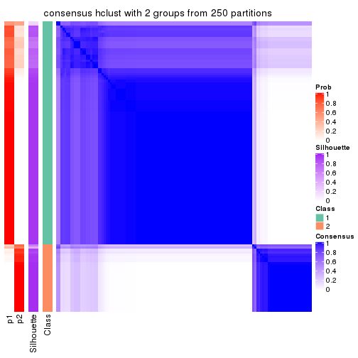</p>

</div>
<div id='tab-SD-hclust-consensus-heatmap-2'>
<pre><code class="r">consensus_heatmap(res, k = 3)
</code></pre>

<p>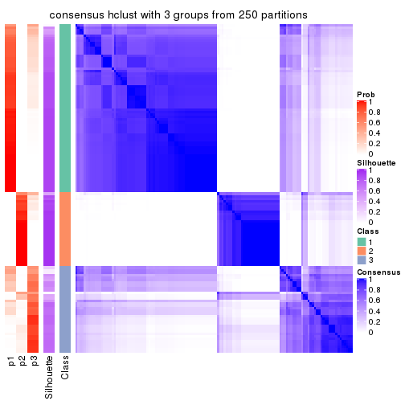</p>

</div>
<div id='tab-SD-hclust-consensus-heatmap-3'>
<pre><code class="r">consensus_heatmap(res, k = 4)
</code></pre>

<p>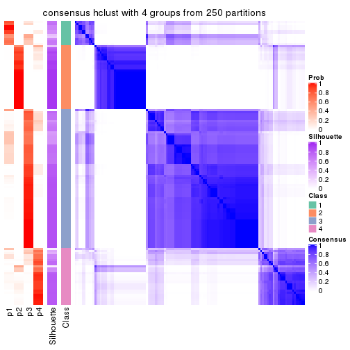</p>

</div>
<div id='tab-SD-hclust-consensus-heatmap-4'>
<pre><code class="r">consensus_heatmap(res, k = 5)
</code></pre>

<p>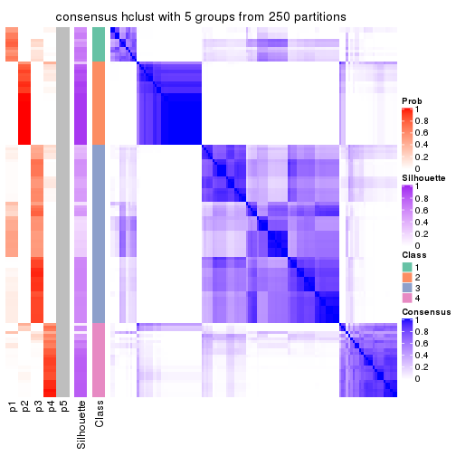</p>

</div>
<div id='tab-SD-hclust-consensus-heatmap-5'>
<pre><code class="r">consensus_heatmap(res, k = 6)
</code></pre>

<p>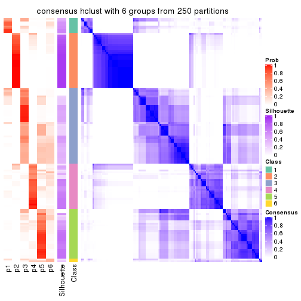</p>

</div>
</div>

Heatmaps for the membership of samples in all partitions to see how consistent they are:


<script>
$( function() {
	$( '#tabs-SD-hclust-membership-heatmap' ).tabs();
} );
</script>
<div id='tabs-SD-hclust-membership-heatmap'>
<ul>
<li><a href='#tab-SD-hclust-membership-heatmap-1'>k = 2</a></li>
<li><a href='#tab-SD-hclust-membership-heatmap-2'>k = 3</a></li>
<li><a href='#tab-SD-hclust-membership-heatmap-3'>k = 4</a></li>
<li><a href='#tab-SD-hclust-membership-heatmap-4'>k = 5</a></li>
<li><a href='#tab-SD-hclust-membership-heatmap-5'>k = 6</a></li>
</ul>
<div id='tab-SD-hclust-membership-heatmap-1'>
<pre><code class="r">membership_heatmap(res, k = 2)
</code></pre>

<p>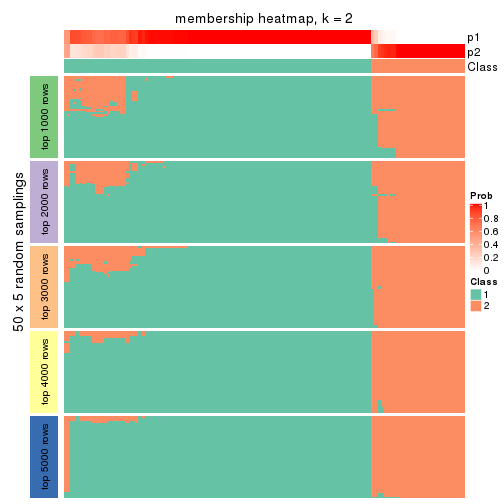</p>

</div>
<div id='tab-SD-hclust-membership-heatmap-2'>
<pre><code class="r">membership_heatmap(res, k = 3)
</code></pre>

<p>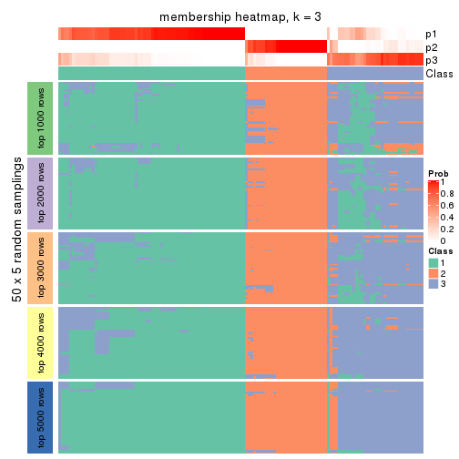</p>

</div>
<div id='tab-SD-hclust-membership-heatmap-3'>
<pre><code class="r">membership_heatmap(res, k = 4)
</code></pre>

<p>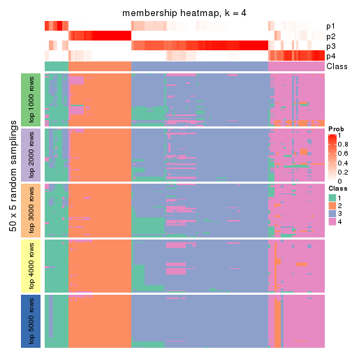</p>

</div>
<div id='tab-SD-hclust-membership-heatmap-4'>
<pre><code class="r">membership_heatmap(res, k = 5)
</code></pre>

<p>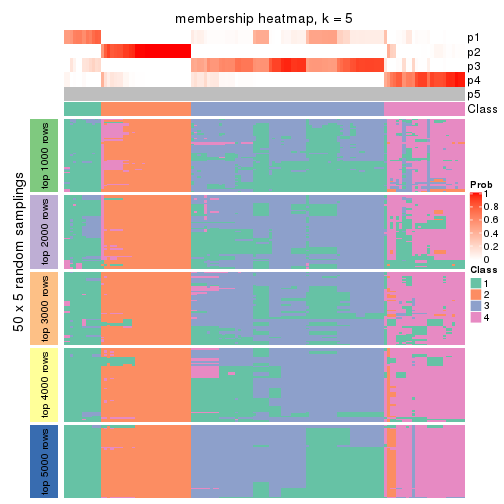</p>

</div>
<div id='tab-SD-hclust-membership-heatmap-5'>
<pre><code class="r">membership_heatmap(res, k = 6)
</code></pre>

<p>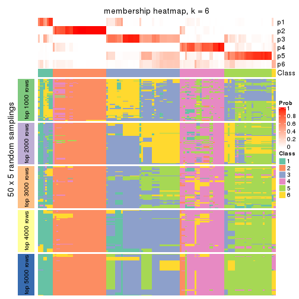</p>

</div>
</div>

As soon as we have had the classes for columns, we can look for signatures
which are significantly different between classes which can be candidate marks
for certain classes. Following are the heatmaps for signatures.


Signature heatmaps where rows are scaled:


<script>
$( function() {
	$( '#tabs-SD-hclust-get-signatures' ).tabs();
} );
</script>
<div id='tabs-SD-hclust-get-signatures'>
<ul>
<li><a href='#tab-SD-hclust-get-signatures-1'>k = 2</a></li>
<li><a href='#tab-SD-hclust-get-signatures-2'>k = 3</a></li>
<li><a href='#tab-SD-hclust-get-signatures-3'>k = 4</a></li>
<li><a href='#tab-SD-hclust-get-signatures-4'>k = 5</a></li>
<li><a href='#tab-SD-hclust-get-signatures-5'>k = 6</a></li>
</ul>
<div id='tab-SD-hclust-get-signatures-1'>
<pre><code class="r">get_signatures(res, k = 2)
</code></pre>

<p>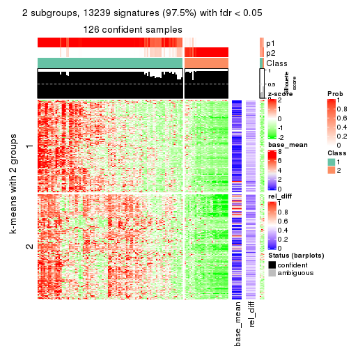</p>

</div>
<div id='tab-SD-hclust-get-signatures-2'>
<pre><code class="r">get_signatures(res, k = 3)
</code></pre>

<p>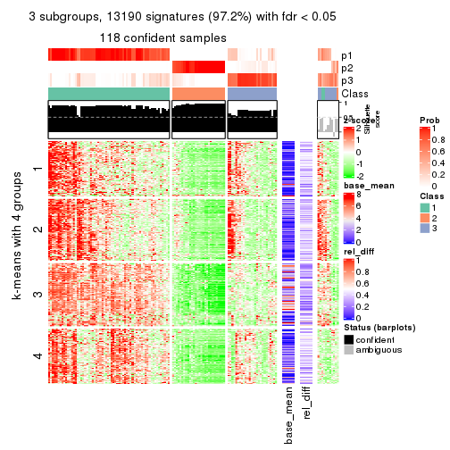</p>

</div>
<div id='tab-SD-hclust-get-signatures-3'>
<pre><code class="r">get_signatures(res, k = 4)
</code></pre>

<p>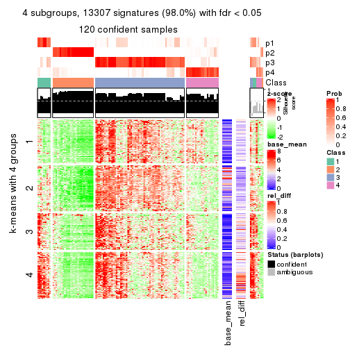</p>

</div>
<div id='tab-SD-hclust-get-signatures-4'>
<pre><code class="r">get_signatures(res, k = 5)
</code></pre>

<p>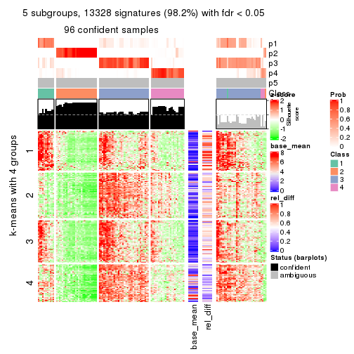</p>

</div>
<div id='tab-SD-hclust-get-signatures-5'>
<pre><code class="r">get_signatures(res, k = 6)
</code></pre>

<p>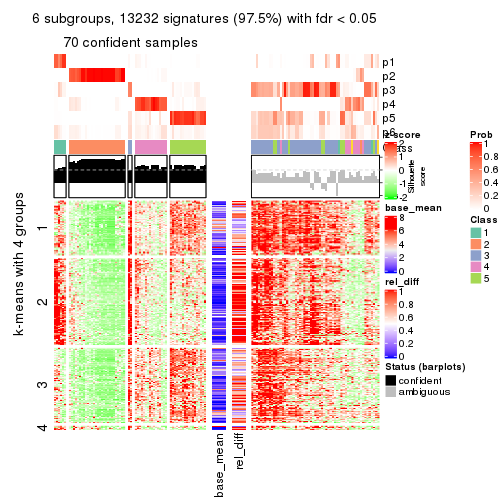</p>

</div>
</div>


Signature heatmaps where rows are not scaled:


<script>
$( function() {
	$( '#tabs-SD-hclust-get-signatures-no-scale' ).tabs();
} );
</script>
<div id='tabs-SD-hclust-get-signatures-no-scale'>
<ul>
<li><a href='#tab-SD-hclust-get-signatures-no-scale-1'>k = 2</a></li>
<li><a href='#tab-SD-hclust-get-signatures-no-scale-2'>k = 3</a></li>
<li><a href='#tab-SD-hclust-get-signatures-no-scale-3'>k = 4</a></li>
<li><a href='#tab-SD-hclust-get-signatures-no-scale-4'>k = 5</a></li>
<li><a href='#tab-SD-hclust-get-signatures-no-scale-5'>k = 6</a></li>
</ul>
<div id='tab-SD-hclust-get-signatures-no-scale-1'>
<pre><code class="r">get_signatures(res, k = 2, scale_rows = FALSE)
</code></pre>

<p>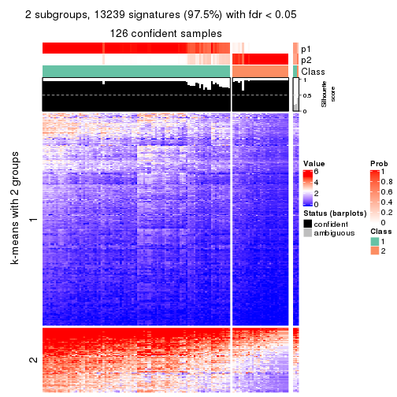</p>

</div>
<div id='tab-SD-hclust-get-signatures-no-scale-2'>
<pre><code class="r">get_signatures(res, k = 3, scale_rows = FALSE)
</code></pre>

<p>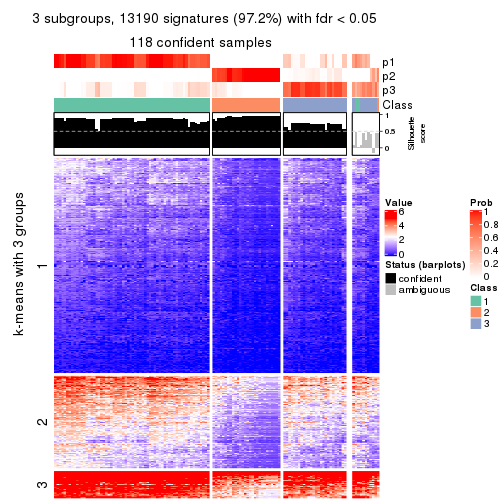</p>

</div>
<div id='tab-SD-hclust-get-signatures-no-scale-3'>
<pre><code class="r">get_signatures(res, k = 4, scale_rows = FALSE)
</code></pre>

<p>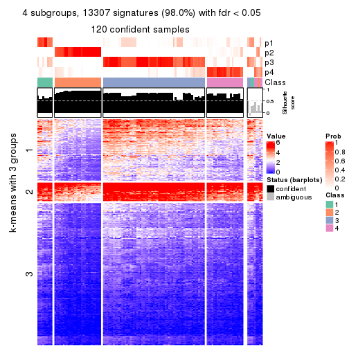</p>

</div>
<div id='tab-SD-hclust-get-signatures-no-scale-4'>
<pre><code class="r">get_signatures(res, k = 5, scale_rows = FALSE)
</code></pre>

<p>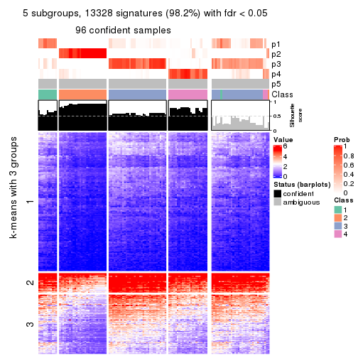</p>

</div>
<div id='tab-SD-hclust-get-signatures-no-scale-5'>
<pre><code class="r">get_signatures(res, k = 6, scale_rows = FALSE)
</code></pre>

<p>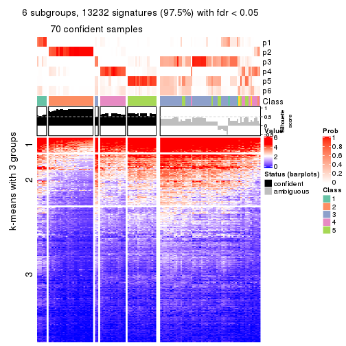</p>

</div>
</div>


Compare the overlap of signatures from different k:

```r
compare_signatures(res)
```

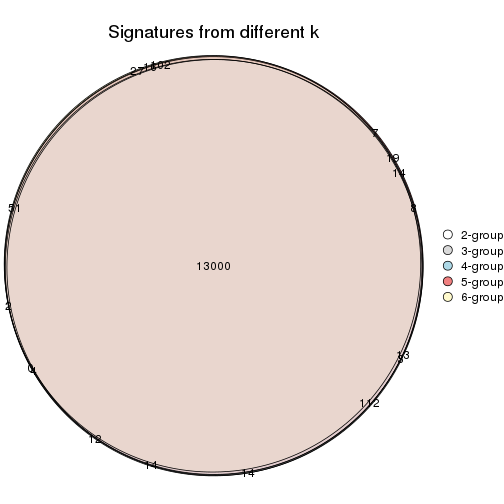

`get_signature()` returns a data frame invisibly. TO get the list of signatures, the function
call should be assigned to a variable explicitly. In following code, if `plot` argument is set
to `FALSE`, no heatmap is plotted while only the differential analysis is performed.

```r
# code only for demonstration
tb = get_signature(res, k = ..., plot = FALSE)
```

An example of the output of `tb` is:

```
#>   which_row         fdr    mean_1    mean_2 scaled_mean_1 scaled_mean_2 km
#> 1        38 0.042760348  8.373488  9.131774    -0.5533452     0.5164555  1
#> 2        40 0.018707592  7.106213  8.469186    -0.6173731     0.5762149  1
#> 3        55 0.019134737 10.221463 11.207825    -0.6159697     0.5749050  1
#> 4        59 0.006059896  5.921854  7.869574    -0.6899429     0.6439467  1
#> 5        60 0.018055526  8.928898 10.211722    -0.6204761     0.5791110  1
#> 6        98 0.009384629 15.714769 14.887706     0.6635654    -0.6193277  2
...
```

The columns in `tb` are:

1. `which_row`: row indices corresponding to the input matrix.
2. `fdr`: FDR for the differential test. 
3. `mean_x`: The mean value in group x.
4. `scaled_mean_x`: The mean value in group x after rows are scaled.
5. `km`: Row groups if k-means clustering is applied to rows.


UMAP plot which shows how samples are separated.


<script>
$( function() {
	$( '#tabs-SD-hclust-dimension-reduction' ).tabs();
} );
</script>
<div id='tabs-SD-hclust-dimension-reduction'>
<ul>
<li><a href='#tab-SD-hclust-dimension-reduction-1'>k = 2</a></li>
<li><a href='#tab-SD-hclust-dimension-reduction-2'>k = 3</a></li>
<li><a href='#tab-SD-hclust-dimension-reduction-3'>k = 4</a></li>
<li><a href='#tab-SD-hclust-dimension-reduction-4'>k = 5</a></li>
<li><a href='#tab-SD-hclust-dimension-reduction-5'>k = 6</a></li>
</ul>
<div id='tab-SD-hclust-dimension-reduction-1'>
<pre><code class="r">dimension_reduction(res, k = 2, method = &quot;UMAP&quot;)
</code></pre>

<p>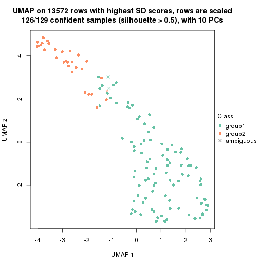</p>

</div>
<div id='tab-SD-hclust-dimension-reduction-2'>
<pre><code class="r">dimension_reduction(res, k = 3, method = &quot;UMAP&quot;)
</code></pre>

<p>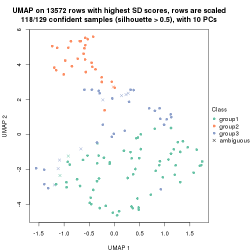</p>

</div>
<div id='tab-SD-hclust-dimension-reduction-3'>
<pre><code class="r">dimension_reduction(res, k = 4, method = &quot;UMAP&quot;)
</code></pre>

<p>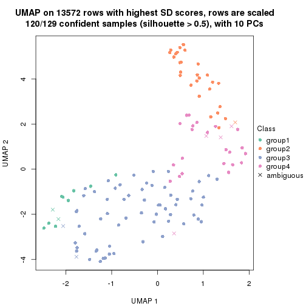</p>

</div>
<div id='tab-SD-hclust-dimension-reduction-4'>
<pre><code class="r">dimension_reduction(res, k = 5, method = &quot;UMAP&quot;)
</code></pre>

<p>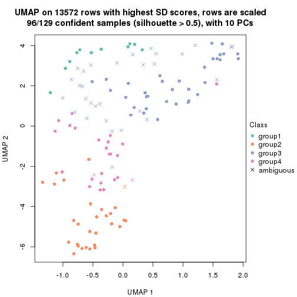</p>

</div>
<div id='tab-SD-hclust-dimension-reduction-5'>
<pre><code class="r">dimension_reduction(res, k = 6, method = &quot;UMAP&quot;)
</code></pre>

<p>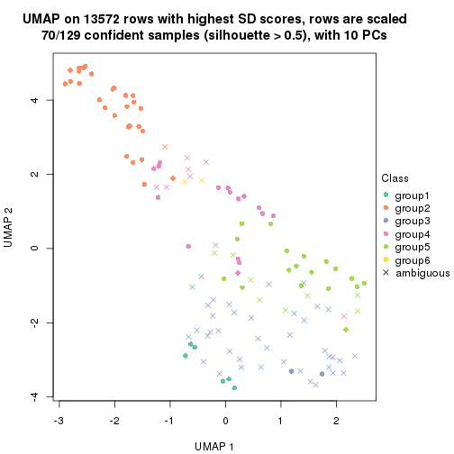</p>

</div>
</div>


Following heatmap shows how subgroups are split when increasing `k`:

```r
collect_classes(res)
```

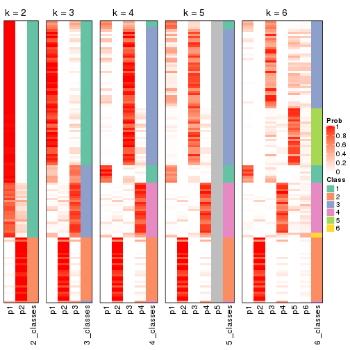


If matrix rows can be associated to genes, consider to use `GO_Enrichment(res,
...)` to perform function enrichment for the signature genes.


 

---------------------------------------------------


### SD:kmeans**


The object with results only for a single top-value method and a single partition method 
can be extracted as:

```r
res = res_list["SD", "kmeans"]
# you can also extract it by
# res = res_list["SD:kmeans"]
```

A summary of `res` and all the functions that can be applied to it:

```r
res
```

```
#> A 'ConsensusPartition' object with k = 2, 3, 4, 5, 6.
#>   On a matrix with 13572 rows and 129 columns.
#>   Top rows (1000, 2000, 3000, 4000, 5000) are extracted by 'SD' method.
#>   Subgroups are detected by 'kmeans' method.
#>   Performed in total 1250 partitions by row resampling.
#>   Best k for subgroups seems to be 2.
#> 
#> Following methods can be applied to this 'ConsensusPartition' object:
#>  [1] "cola_report"             "collect_classes"         "collect_plots"          
#>  [4] "collect_stats"           "colnames"                "compare_signatures"     
#>  [7] "consensus_heatmap"       "dimension_reduction"     "functional_enrichment"  
#> [10] "get_anno_col"            "get_anno"                "get_classes"            
#> [13] "get_consensus"           "get_matrix"              "get_membership"         
#> [16] "get_param"               "get_signatures"          "get_stats"              
#> [19] "is_best_k"               "is_stable_k"             "membership_heatmap"     
#> [22] "ncol"                    "nrow"                    "plot_ecdf"              
#> [25] "rownames"                "select_partition_number" "show"                   
#> [28] "suggest_best_k"          "test_to_known_factors"
```

`collect_plots()` function collects all the plots made from `res` for all `k` (number of partitions)
into one single page to provide an easy and fast comparison between different `k`.

```r
collect_plots(res)
```

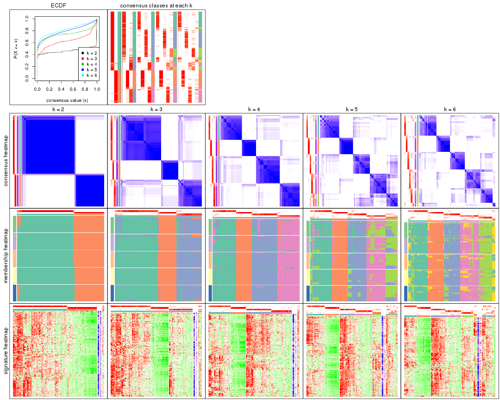

The plots are:

- The first row: a plot of the ECDF (Empirical cumulative distribution
  function) curves of the consensus matrix for each `k` and the heatmap of
  predicted classes for each `k`.
- The second row: heatmaps of the consensus matrix for each `k`.
- The third row: heatmaps of the membership matrix for each `k`.
- The fouth row: heatmaps of the signatures for each `k`.

All the plots in panels can be made by individual functions and they are
plotted later in this section.

`select_partition_number()` produces several plots showing different
statistics for choosing "optimized" `k`. There are following statistics:

- ECDF curves of the consensus matrix for each `k`;
- 1-PAC. [The PAC
  score](https://en.wikipedia.org/wiki/Consensus_clustering#Over-interpretation_potential_of_consensus_clustering)
  measures the proportion of the ambiguous subgrouping.
- Mean silhouette score.
- Concordance. The mean probability of fiting the consensus class ids in all
  partitions.
- Area increased. Denote $A_k$ as the area under the ECDF curve for current
  `k`, the area increased is defined as $A_k - A_{k-1}$.
- Rand index. The percent of pairs of samples that are both in a same cluster
  or both are not in a same cluster in the partition of k and k-1.
- Jaccard index. The ratio of pairs of samples are both in a same cluster in
  the partition of k and k-1 and the pairs of samples are both in a same
  cluster in the partition k or k-1.

The detailed explanations of these statistics can be found in [the cola
vignette](http://bioconductor.org/packages/devel/bioc/vignettes/cola/inst/doc/cola.html#toc_13).

Generally speaking, lower PAC score, higher mean silhouette score or higher
concordance corresponds to better partition. Rand index and Jaccard index
measure how similar the current partition is compared to partition with `k-1`.
If they are too similar, we won't accept `k` is better than `k-1`.

```r
select_partition_number(res)
```

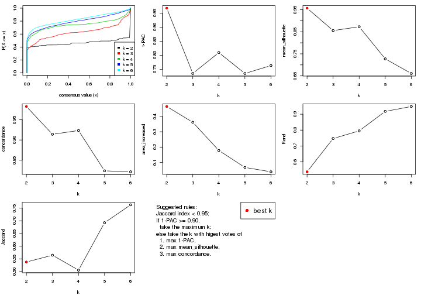

The numeric values for all these statistics can be obtained by `get_stats()`.

```r
get_stats(res)
```

```
#>   k 1-PAC mean_silhouette concordance area_increased  Rand Jaccard
#> 2 2 0.968           0.957       0.983         0.4646 0.538   0.538
#> 3 3 0.735           0.855       0.914         0.3618 0.747   0.564
#> 4 4 0.810           0.873       0.923         0.1780 0.795   0.506
#> 5 5 0.735           0.727       0.824         0.0676 0.918   0.692
#> 6 6 0.763           0.661       0.821         0.0391 0.948   0.763
```

`suggest_best_k()` suggests the best $k$ based on these statistics. The rules are as follows:

- All $k$ with Jaccard index larger than 0.95 are removed because the increase of
  the partition number does not provides enough extra information. If all $k$ are removed,
  the best $k$ is assigned by `NA`.
- For $k$ with 1-PAC larger than 0.9, the maximal $k$ is taken as the "best k". Other $k$ is called "optional k".
- If it does not fit the second rule. The $k$ with the highest vote of highest
  1-PAC, mean silhouette and concordance is taken as the "best k".

```r
suggest_best_k(res)
```

```
#> [1] 2
```


Following shows the table of the partitions (You need to click the **show/hide
code output** link to see it). The membership matrix (columns with name `p*`)
is inferred by
[`clue::cl_consensus()`](https://www.rdocumentation.org/link/cl_consensus?package=clue)
function with the `SE` method. Basically the value in the membership matrix
represents the probability to belong to a certain group. The finall class
label for an item is determined with the group with highest probability it
belongs to.

In `get_classes()` function, the entropy is calculated from the membership
matrix and the silhouette score is calculated from the consensus matrix.


<script>
$( function() {
	$( '#tabs-SD-kmeans-get-classes' ).tabs();
} );
</script>
<div id='tabs-SD-kmeans-get-classes'>
<ul>
<li><a href='#tab-SD-kmeans-get-classes-1'>k = 2</a></li>
<li><a href='#tab-SD-kmeans-get-classes-2'>k = 3</a></li>
<li><a href='#tab-SD-kmeans-get-classes-3'>k = 4</a></li>
<li><a href='#tab-SD-kmeans-get-classes-4'>k = 5</a></li>
<li><a href='#tab-SD-kmeans-get-classes-5'>k = 6</a></li>
</ul>

<div id='tab-SD-kmeans-get-classes-1'>
<p><a id='tab-SD-kmeans-get-classes-1-a' style='color:#0366d6' href='#'>show/hide code output</a></p>
<pre><code class="r">cbind(get_classes(res, k = 2), get_membership(res, k = 2))
</code></pre>

<pre><code>#&gt;            class entropy silhouette    p1    p2
#&gt; SRR1656463     2   0.000      0.980 0.000 1.000
#&gt; SRR1656464     1   0.000      0.983 1.000 0.000
#&gt; SRR1656462     1   0.000      0.983 1.000 0.000
#&gt; SRR1656465     1   0.000      0.983 1.000 0.000
#&gt; SRR1656467     2   0.000      0.980 0.000 1.000
#&gt; SRR1656466     1   0.000      0.983 1.000 0.000
#&gt; SRR1656468     1   0.881      0.581 0.700 0.300
#&gt; SRR1656472     1   0.000      0.983 1.000 0.000
#&gt; SRR1656471     1   0.000      0.983 1.000 0.000
#&gt; SRR1656470     2   0.000      0.980 0.000 1.000
#&gt; SRR1656469     1   0.000      0.983 1.000 0.000
#&gt; SRR1656473     2   0.000      0.980 0.000 1.000
#&gt; SRR1656474     2   0.000      0.980 0.000 1.000
#&gt; SRR1656475     2   0.000      0.980 0.000 1.000
#&gt; SRR1656478     1   0.000      0.983 1.000 0.000
#&gt; SRR1656477     1   0.971      0.331 0.600 0.400
#&gt; SRR1656479     1   0.000      0.983 1.000 0.000
#&gt; SRR1656480     2   0.000      0.980 0.000 1.000
#&gt; SRR1656476     2   0.000      0.980 0.000 1.000
#&gt; SRR1656481     1   0.529      0.859 0.880 0.120
#&gt; SRR1656482     2   0.000      0.980 0.000 1.000
#&gt; SRR1656483     2   0.000      0.980 0.000 1.000
#&gt; SRR1656485     1   0.000      0.983 1.000 0.000
#&gt; SRR1656487     1   0.000      0.983 1.000 0.000
#&gt; SRR1656486     1   0.000      0.983 1.000 0.000
#&gt; SRR1656488     1   0.000      0.983 1.000 0.000
#&gt; SRR1656484     1   0.000      0.983 1.000 0.000
#&gt; SRR1656489     1   0.000      0.983 1.000 0.000
#&gt; SRR1656491     1   0.000      0.983 1.000 0.000
#&gt; SRR1656490     1   0.000      0.983 1.000 0.000
#&gt; SRR1656492     1   0.000      0.983 1.000 0.000
#&gt; SRR1656493     1   0.000      0.983 1.000 0.000
#&gt; SRR1656495     2   0.000      0.980 0.000 1.000
#&gt; SRR1656496     1   0.000      0.983 1.000 0.000
#&gt; SRR1656494     2   0.000      0.980 0.000 1.000
#&gt; SRR1656497     2   0.000      0.980 0.000 1.000
#&gt; SRR1656499     1   0.000      0.983 1.000 0.000
#&gt; SRR1656500     1   0.000      0.983 1.000 0.000
#&gt; SRR1656501     1   0.000      0.983 1.000 0.000
#&gt; SRR1656498     1   0.000      0.983 1.000 0.000
#&gt; SRR1656504     2   0.000      0.980 0.000 1.000
#&gt; SRR1656502     1   0.000      0.983 1.000 0.000
#&gt; SRR1656503     1   0.000      0.983 1.000 0.000
#&gt; SRR1656507     1   0.000      0.983 1.000 0.000
#&gt; SRR1656508     1   0.000      0.983 1.000 0.000
#&gt; SRR1656505     2   0.000      0.980 0.000 1.000
#&gt; SRR1656506     1   0.000      0.983 1.000 0.000
#&gt; SRR1656509     1   0.000      0.983 1.000 0.000
#&gt; SRR1656510     1   0.388      0.909 0.924 0.076
#&gt; SRR1656511     2   0.000      0.980 0.000 1.000
#&gt; SRR1656513     2   0.000      0.980 0.000 1.000
#&gt; SRR1656512     2   0.000      0.980 0.000 1.000
#&gt; SRR1656514     1   0.000      0.983 1.000 0.000
#&gt; SRR1656515     2   0.000      0.980 0.000 1.000
#&gt; SRR1656516     1   0.000      0.983 1.000 0.000
#&gt; SRR1656518     1   0.000      0.983 1.000 0.000
#&gt; SRR1656517     1   0.000      0.983 1.000 0.000
#&gt; SRR1656519     1   0.000      0.983 1.000 0.000
#&gt; SRR1656522     1   0.000      0.983 1.000 0.000
#&gt; SRR1656523     2   0.983      0.259 0.424 0.576
#&gt; SRR1656521     2   0.000      0.980 0.000 1.000
#&gt; SRR1656520     1   0.000      0.983 1.000 0.000
#&gt; SRR1656524     1   0.000      0.983 1.000 0.000
#&gt; SRR1656525     1   0.000      0.983 1.000 0.000
#&gt; SRR1656526     2   0.000      0.980 0.000 1.000
#&gt; SRR1656527     2   0.000      0.980 0.000 1.000
#&gt; SRR1656530     1   0.000      0.983 1.000 0.000
#&gt; SRR1656529     1   0.000      0.983 1.000 0.000
#&gt; SRR1656531     1   0.000      0.983 1.000 0.000
#&gt; SRR1656528     1   0.000      0.983 1.000 0.000
#&gt; SRR1656534     1   0.000      0.983 1.000 0.000
#&gt; SRR1656533     1   0.000      0.983 1.000 0.000
#&gt; SRR1656536     1   0.000      0.983 1.000 0.000
#&gt; SRR1656532     2   0.000      0.980 0.000 1.000
#&gt; SRR1656537     1   0.000      0.983 1.000 0.000
#&gt; SRR1656538     1   0.000      0.983 1.000 0.000
#&gt; SRR1656535     2   0.000      0.980 0.000 1.000
#&gt; SRR1656539     1   0.000      0.983 1.000 0.000
#&gt; SRR1656544     1   0.000      0.983 1.000 0.000
#&gt; SRR1656542     1   0.000      0.983 1.000 0.000
#&gt; SRR1656543     1   0.000      0.983 1.000 0.000
#&gt; SRR1656545     2   0.000      0.980 0.000 1.000
#&gt; SRR1656540     1   0.000      0.983 1.000 0.000
#&gt; SRR1656546     1   0.000      0.983 1.000 0.000
#&gt; SRR1656541     2   0.000      0.980 0.000 1.000
#&gt; SRR1656547     2   0.000      0.980 0.000 1.000
#&gt; SRR1656548     1   0.000      0.983 1.000 0.000
#&gt; SRR1656549     1   0.000      0.983 1.000 0.000
#&gt; SRR1656551     1   0.000      0.983 1.000 0.000
#&gt; SRR1656553     1   0.000      0.983 1.000 0.000
#&gt; SRR1656550     2   0.000      0.980 0.000 1.000
#&gt; SRR1656552     2   0.000      0.980 0.000 1.000
#&gt; SRR1656554     1   0.000      0.983 1.000 0.000
#&gt; SRR1656555     1   0.689      0.771 0.816 0.184
#&gt; SRR1656556     1   0.529      0.859 0.880 0.120
#&gt; SRR1656557     1   0.000      0.983 1.000 0.000
#&gt; SRR1656558     1   0.000      0.983 1.000 0.000
#&gt; SRR1656559     1   0.000      0.983 1.000 0.000
#&gt; SRR1656560     1   0.000      0.983 1.000 0.000
#&gt; SRR1656561     1   0.000      0.983 1.000 0.000
#&gt; SRR1656562     2   0.000      0.980 0.000 1.000
#&gt; SRR1656563     1   0.000      0.983 1.000 0.000
#&gt; SRR1656564     2   0.000      0.980 0.000 1.000
#&gt; SRR1656565     2   0.000      0.980 0.000 1.000
#&gt; SRR1656566     1   0.000      0.983 1.000 0.000
#&gt; SRR1656568     2   0.000      0.980 0.000 1.000
#&gt; SRR1656567     2   0.000      0.980 0.000 1.000
#&gt; SRR1656569     1   0.000      0.983 1.000 0.000
#&gt; SRR1656570     1   0.000      0.983 1.000 0.000
#&gt; SRR1656571     2   0.000      0.980 0.000 1.000
#&gt; SRR1656573     1   0.000      0.983 1.000 0.000
#&gt; SRR1656572     2   0.000      0.980 0.000 1.000
#&gt; SRR1656574     1   0.000      0.983 1.000 0.000
#&gt; SRR1656575     1   0.000      0.983 1.000 0.000
#&gt; SRR1656576     2   0.000      0.980 0.000 1.000
#&gt; SRR1656578     2   0.000      0.980 0.000 1.000
#&gt; SRR1656577     1   0.000      0.983 1.000 0.000
#&gt; SRR1656579     2   0.000      0.980 0.000 1.000
#&gt; SRR1656580     1   0.000      0.983 1.000 0.000
#&gt; SRR1656581     1   0.000      0.983 1.000 0.000
#&gt; SRR1656582     2   0.000      0.980 0.000 1.000
#&gt; SRR1656585     1   0.563      0.845 0.868 0.132
#&gt; SRR1656584     1   0.000      0.983 1.000 0.000
#&gt; SRR1656583     2   0.985      0.240 0.428 0.572
#&gt; SRR1656586     2   0.000      0.980 0.000 1.000
#&gt; SRR1656587     2   0.242      0.940 0.040 0.960
#&gt; SRR1656588     2   0.000      0.980 0.000 1.000
#&gt; SRR1656589     2   0.000      0.980 0.000 1.000
#&gt; SRR1656590     1   0.000      0.983 1.000 0.000
</code></pre>

<script>
$('#tab-SD-kmeans-get-classes-1-a').parent().next().next().hide();
$('#tab-SD-kmeans-get-classes-1-a').click(function(){
  $('#tab-SD-kmeans-get-classes-1-a').parent().next().next().toggle();
  return(false);
});
</script>
</div>

<div id='tab-SD-kmeans-get-classes-2'>
<p><a id='tab-SD-kmeans-get-classes-2-a' style='color:#0366d6' href='#'>show/hide code output</a></p>
<pre><code class="r">cbind(get_classes(res, k = 3), get_membership(res, k = 3))
</code></pre>

<pre><code>#&gt;            class entropy silhouette    p1    p2    p3
#&gt; SRR1656463     2  0.0000      0.969 0.000 1.000 0.000
#&gt; SRR1656464     1  0.0747      0.907 0.984 0.000 0.016
#&gt; SRR1656462     1  0.2537      0.912 0.920 0.000 0.080
#&gt; SRR1656465     1  0.6126      0.485 0.600 0.000 0.400
#&gt; SRR1656467     2  0.0892      0.952 0.000 0.980 0.020
#&gt; SRR1656466     1  0.5058      0.762 0.756 0.000 0.244
#&gt; SRR1656468     3  0.0892      0.849 0.020 0.000 0.980
#&gt; SRR1656472     3  0.4346      0.775 0.184 0.000 0.816
#&gt; SRR1656471     1  0.5254      0.723 0.736 0.000 0.264
#&gt; SRR1656470     2  0.0000      0.969 0.000 1.000 0.000
#&gt; SRR1656469     1  0.5254      0.741 0.736 0.000 0.264
#&gt; SRR1656473     2  0.0000      0.969 0.000 1.000 0.000
#&gt; SRR1656474     2  0.0000      0.969 0.000 1.000 0.000
#&gt; SRR1656475     2  0.0000      0.969 0.000 1.000 0.000
#&gt; SRR1656478     1  0.1289      0.904 0.968 0.000 0.032
#&gt; SRR1656477     3  0.1289      0.857 0.000 0.032 0.968
#&gt; SRR1656479     1  0.2537      0.913 0.920 0.000 0.080
#&gt; SRR1656480     3  0.2959      0.850 0.000 0.100 0.900
#&gt; SRR1656476     2  0.0000      0.969 0.000 1.000 0.000
#&gt; SRR1656481     3  0.0892      0.849 0.020 0.000 0.980
#&gt; SRR1656482     2  0.0000      0.969 0.000 1.000 0.000
#&gt; SRR1656483     2  0.0000      0.969 0.000 1.000 0.000
#&gt; SRR1656485     1  0.2537      0.912 0.920 0.000 0.080
#&gt; SRR1656487     1  0.3619      0.875 0.864 0.000 0.136
#&gt; SRR1656486     1  0.1964      0.912 0.944 0.000 0.056
#&gt; SRR1656488     1  0.2537      0.912 0.920 0.000 0.080
#&gt; SRR1656484     1  0.1411      0.902 0.964 0.000 0.036
#&gt; SRR1656489     1  0.0592      0.908 0.988 0.000 0.012
#&gt; SRR1656491     1  0.3038      0.906 0.896 0.000 0.104
#&gt; SRR1656490     3  0.5431      0.621 0.284 0.000 0.716
#&gt; SRR1656492     1  0.2448      0.913 0.924 0.000 0.076
#&gt; SRR1656493     3  0.5291      0.684 0.268 0.000 0.732
#&gt; SRR1656495     3  0.2682      0.836 0.076 0.004 0.920
#&gt; SRR1656496     1  0.2711      0.913 0.912 0.000 0.088
#&gt; SRR1656494     3  0.3192      0.845 0.000 0.112 0.888
#&gt; SRR1656497     2  0.0000      0.969 0.000 1.000 0.000
#&gt; SRR1656499     1  0.2537      0.912 0.920 0.000 0.080
#&gt; SRR1656500     1  0.2261      0.914 0.932 0.000 0.068
#&gt; SRR1656501     1  0.1411      0.909 0.964 0.000 0.036
#&gt; SRR1656498     1  0.0747      0.907 0.984 0.000 0.016
#&gt; SRR1656504     2  0.0000      0.969 0.000 1.000 0.000
#&gt; SRR1656502     3  0.3116      0.826 0.108 0.000 0.892
#&gt; SRR1656503     1  0.1289      0.904 0.968 0.000 0.032
#&gt; SRR1656507     1  0.1289      0.904 0.968 0.000 0.032
#&gt; SRR1656508     1  0.0747      0.907 0.984 0.000 0.016
#&gt; SRR1656505     3  0.2959      0.850 0.000 0.100 0.900
#&gt; SRR1656506     1  0.2537      0.912 0.920 0.000 0.080
#&gt; SRR1656509     3  0.5098      0.571 0.248 0.000 0.752
#&gt; SRR1656510     3  0.0747      0.851 0.016 0.000 0.984
#&gt; SRR1656511     3  0.3192      0.844 0.000 0.112 0.888
#&gt; SRR1656513     2  0.4399      0.750 0.000 0.812 0.188
#&gt; SRR1656512     2  0.0000      0.969 0.000 1.000 0.000
#&gt; SRR1656514     1  0.0237      0.909 0.996 0.000 0.004
#&gt; SRR1656515     2  0.5098      0.653 0.000 0.752 0.248
#&gt; SRR1656516     1  0.1163      0.909 0.972 0.000 0.028
#&gt; SRR1656518     1  0.1411      0.902 0.964 0.000 0.036
#&gt; SRR1656517     1  0.0747      0.907 0.984 0.000 0.016
#&gt; SRR1656519     1  0.2448      0.913 0.924 0.000 0.076
#&gt; SRR1656522     1  0.0000      0.910 1.000 0.000 0.000
#&gt; SRR1656523     3  0.1411      0.859 0.000 0.036 0.964
#&gt; SRR1656521     2  0.0000      0.969 0.000 1.000 0.000
#&gt; SRR1656520     1  0.2537      0.912 0.920 0.000 0.080
#&gt; SRR1656524     3  0.5291      0.684 0.268 0.000 0.732
#&gt; SRR1656525     1  0.2537      0.912 0.920 0.000 0.080
#&gt; SRR1656526     2  0.0000      0.969 0.000 1.000 0.000
#&gt; SRR1656527     2  0.0237      0.966 0.000 0.996 0.004
#&gt; SRR1656530     1  0.2796      0.910 0.908 0.000 0.092
#&gt; SRR1656529     1  0.3816      0.872 0.852 0.000 0.148
#&gt; SRR1656531     1  0.0892      0.905 0.980 0.000 0.020
#&gt; SRR1656528     1  0.2537      0.912 0.920 0.000 0.080
#&gt; SRR1656534     1  0.2066      0.915 0.940 0.000 0.060
#&gt; SRR1656533     1  0.0747      0.907 0.984 0.000 0.016
#&gt; SRR1656536     3  0.0892      0.849 0.020 0.000 0.980
#&gt; SRR1656532     3  0.3412      0.836 0.000 0.124 0.876
#&gt; SRR1656537     1  0.1411      0.902 0.964 0.000 0.036
#&gt; SRR1656538     1  0.2165      0.915 0.936 0.000 0.064
#&gt; SRR1656535     2  0.0000      0.969 0.000 1.000 0.000
#&gt; SRR1656539     1  0.6260      0.363 0.552 0.000 0.448
#&gt; SRR1656544     1  0.2537      0.912 0.920 0.000 0.080
#&gt; SRR1656542     1  0.2448      0.913 0.924 0.000 0.076
#&gt; SRR1656543     1  0.2537      0.912 0.920 0.000 0.080
#&gt; SRR1656545     2  0.0000      0.969 0.000 1.000 0.000
#&gt; SRR1656540     1  0.2537      0.912 0.920 0.000 0.080
#&gt; SRR1656546     3  0.6079      0.460 0.388 0.000 0.612
#&gt; SRR1656541     2  0.5254      0.613 0.000 0.736 0.264
#&gt; SRR1656547     3  0.3192      0.845 0.000 0.112 0.888
#&gt; SRR1656548     1  0.2537      0.912 0.920 0.000 0.080
#&gt; SRR1656549     1  0.6079      0.276 0.612 0.000 0.388
#&gt; SRR1656551     3  0.0892      0.849 0.020 0.000 0.980
#&gt; SRR1656553     1  0.2448      0.913 0.924 0.000 0.076
#&gt; SRR1656550     3  0.2537      0.856 0.000 0.080 0.920
#&gt; SRR1656552     3  0.3116      0.846 0.000 0.108 0.892
#&gt; SRR1656554     1  0.5327      0.723 0.728 0.000 0.272
#&gt; SRR1656555     3  0.0424      0.852 0.008 0.000 0.992
#&gt; SRR1656556     3  0.4452      0.686 0.192 0.000 0.808
#&gt; SRR1656557     1  0.2448      0.913 0.924 0.000 0.076
#&gt; SRR1656558     1  0.1163      0.905 0.972 0.000 0.028
#&gt; SRR1656559     1  0.0237      0.909 0.996 0.000 0.004
#&gt; SRR1656560     1  0.2537      0.912 0.920 0.000 0.080
#&gt; SRR1656561     1  0.2165      0.915 0.936 0.000 0.064
#&gt; SRR1656562     3  0.2878      0.850 0.000 0.096 0.904
#&gt; SRR1656563     1  0.0747      0.907 0.984 0.000 0.016
#&gt; SRR1656564     2  0.0000      0.969 0.000 1.000 0.000
#&gt; SRR1656565     3  0.3551      0.830 0.000 0.132 0.868
#&gt; SRR1656566     3  0.6302      0.200 0.480 0.000 0.520
#&gt; SRR1656568     2  0.0000      0.969 0.000 1.000 0.000
#&gt; SRR1656567     3  0.3267      0.842 0.000 0.116 0.884
#&gt; SRR1656569     1  0.3879      0.871 0.848 0.000 0.152
#&gt; SRR1656570     1  0.0747      0.907 0.984 0.000 0.016
#&gt; SRR1656571     2  0.0000      0.969 0.000 1.000 0.000
#&gt; SRR1656573     3  0.0237      0.853 0.004 0.000 0.996
#&gt; SRR1656572     3  0.3192      0.844 0.000 0.112 0.888
#&gt; SRR1656574     1  0.0592      0.908 0.988 0.000 0.012
#&gt; SRR1656575     1  0.1289      0.904 0.968 0.000 0.032
#&gt; SRR1656576     3  0.3267      0.842 0.000 0.116 0.884
#&gt; SRR1656578     2  0.0237      0.966 0.000 0.996 0.004
#&gt; SRR1656577     1  0.0237      0.909 0.996 0.000 0.004
#&gt; SRR1656579     3  0.3267      0.842 0.000 0.116 0.884
#&gt; SRR1656580     1  0.1753      0.915 0.952 0.000 0.048
#&gt; SRR1656581     3  0.0000      0.854 0.000 0.000 1.000
#&gt; SRR1656582     2  0.0000      0.969 0.000 1.000 0.000
#&gt; SRR1656585     3  0.0237      0.854 0.000 0.004 0.996
#&gt; SRR1656584     1  0.1411      0.902 0.964 0.000 0.036
#&gt; SRR1656583     3  0.2066      0.858 0.000 0.060 0.940
#&gt; SRR1656586     2  0.0000      0.969 0.000 1.000 0.000
#&gt; SRR1656587     3  0.3083      0.853 0.024 0.060 0.916
#&gt; SRR1656588     3  0.5465      0.633 0.000 0.288 0.712
#&gt; SRR1656589     2  0.0000      0.969 0.000 1.000 0.000
#&gt; SRR1656590     1  0.6008      0.323 0.628 0.000 0.372
</code></pre>

<script>
$('#tab-SD-kmeans-get-classes-2-a').parent().next().next().hide();
$('#tab-SD-kmeans-get-classes-2-a').click(function(){
  $('#tab-SD-kmeans-get-classes-2-a').parent().next().next().toggle();
  return(false);
});
</script>
</div>

<div id='tab-SD-kmeans-get-classes-3'>
<p><a id='tab-SD-kmeans-get-classes-3-a' style='color:#0366d6' href='#'>show/hide code output</a></p>
<pre><code class="r">cbind(get_classes(res, k = 4), get_membership(res, k = 4))
</code></pre>

<pre><code>#&gt;            class entropy silhouette    p1    p2    p3    p4
#&gt; SRR1656463     2  0.0000     0.9902 0.000 1.000 0.000 0.000
#&gt; SRR1656464     1  0.2216     0.8834 0.908 0.000 0.092 0.000
#&gt; SRR1656462     3  0.1302     0.9216 0.044 0.000 0.956 0.000
#&gt; SRR1656465     3  0.4123     0.7031 0.008 0.000 0.772 0.220
#&gt; SRR1656467     4  0.4605     0.5124 0.000 0.336 0.000 0.664
#&gt; SRR1656466     3  0.1722     0.8795 0.008 0.000 0.944 0.048
#&gt; SRR1656468     4  0.1305     0.9164 0.004 0.000 0.036 0.960
#&gt; SRR1656472     1  0.4399     0.6516 0.760 0.000 0.016 0.224
#&gt; SRR1656471     3  0.3852     0.7396 0.008 0.000 0.800 0.192
#&gt; SRR1656470     2  0.0000     0.9902 0.000 1.000 0.000 0.000
#&gt; SRR1656469     3  0.2198     0.8672 0.008 0.000 0.920 0.072
#&gt; SRR1656473     2  0.0000     0.9902 0.000 1.000 0.000 0.000
#&gt; SRR1656474     2  0.0000     0.9902 0.000 1.000 0.000 0.000
#&gt; SRR1656475     2  0.0000     0.9902 0.000 1.000 0.000 0.000
#&gt; SRR1656478     1  0.1792     0.8944 0.932 0.000 0.068 0.000
#&gt; SRR1656477     4  0.1209     0.9181 0.004 0.000 0.032 0.964
#&gt; SRR1656479     1  0.2216     0.8881 0.908 0.000 0.092 0.000
#&gt; SRR1656480     4  0.0336     0.9239 0.000 0.000 0.008 0.992
#&gt; SRR1656476     2  0.0000     0.9902 0.000 1.000 0.000 0.000
#&gt; SRR1656481     4  0.1545     0.9135 0.008 0.000 0.040 0.952
#&gt; SRR1656482     2  0.0000     0.9902 0.000 1.000 0.000 0.000
#&gt; SRR1656483     2  0.0000     0.9902 0.000 1.000 0.000 0.000
#&gt; SRR1656485     3  0.1022     0.9218 0.032 0.000 0.968 0.000
#&gt; SRR1656487     3  0.1576     0.8819 0.004 0.000 0.948 0.048
#&gt; SRR1656486     1  0.3528     0.8125 0.808 0.000 0.192 0.000
#&gt; SRR1656488     3  0.1022     0.9218 0.032 0.000 0.968 0.000
#&gt; SRR1656484     1  0.1557     0.8944 0.944 0.000 0.056 0.000
#&gt; SRR1656489     1  0.3801     0.7690 0.780 0.000 0.220 0.000
#&gt; SRR1656491     3  0.4798     0.7007 0.180 0.000 0.768 0.052
#&gt; SRR1656490     1  0.2759     0.8501 0.904 0.000 0.052 0.044
#&gt; SRR1656492     3  0.1118     0.9221 0.036 0.000 0.964 0.000
#&gt; SRR1656493     1  0.1022     0.8618 0.968 0.000 0.000 0.032
#&gt; SRR1656495     1  0.4008     0.6393 0.756 0.000 0.000 0.244
#&gt; SRR1656496     1  0.2408     0.8840 0.896 0.000 0.104 0.000
#&gt; SRR1656494     4  0.0921     0.9174 0.028 0.000 0.000 0.972
#&gt; SRR1656497     2  0.0000     0.9902 0.000 1.000 0.000 0.000
#&gt; SRR1656499     3  0.1118     0.9219 0.036 0.000 0.964 0.000
#&gt; SRR1656500     3  0.1302     0.9216 0.044 0.000 0.956 0.000
#&gt; SRR1656501     1  0.3486     0.8117 0.812 0.000 0.188 0.000
#&gt; SRR1656498     1  0.1716     0.8944 0.936 0.000 0.064 0.000
#&gt; SRR1656504     2  0.0000     0.9902 0.000 1.000 0.000 0.000
#&gt; SRR1656502     1  0.4399     0.6516 0.760 0.000 0.016 0.224
#&gt; SRR1656503     1  0.3975     0.7507 0.760 0.000 0.240 0.000
#&gt; SRR1656507     1  0.1792     0.8944 0.932 0.000 0.068 0.000
#&gt; SRR1656508     1  0.1716     0.8944 0.936 0.000 0.064 0.000
#&gt; SRR1656505     4  0.0336     0.9239 0.000 0.000 0.008 0.992
#&gt; SRR1656506     3  0.0336     0.9145 0.008 0.000 0.992 0.000
#&gt; SRR1656509     1  0.6234     0.4209 0.584 0.000 0.068 0.348
#&gt; SRR1656510     4  0.2255     0.8923 0.012 0.000 0.068 0.920
#&gt; SRR1656511     4  0.1557     0.9069 0.056 0.000 0.000 0.944
#&gt; SRR1656513     4  0.4872     0.4655 0.004 0.356 0.000 0.640
#&gt; SRR1656512     2  0.0000     0.9902 0.000 1.000 0.000 0.000
#&gt; SRR1656514     3  0.4624     0.5218 0.340 0.000 0.660 0.000
#&gt; SRR1656515     4  0.2921     0.8179 0.000 0.140 0.000 0.860
#&gt; SRR1656516     1  0.3486     0.8117 0.812 0.000 0.188 0.000
#&gt; SRR1656518     1  0.1637     0.8946 0.940 0.000 0.060 0.000
#&gt; SRR1656517     1  0.1716     0.8944 0.936 0.000 0.064 0.000
#&gt; SRR1656519     3  0.1302     0.9216 0.044 0.000 0.956 0.000
#&gt; SRR1656522     3  0.2011     0.9017 0.080 0.000 0.920 0.000
#&gt; SRR1656523     4  0.0895     0.9236 0.020 0.000 0.004 0.976
#&gt; SRR1656521     2  0.0000     0.9902 0.000 1.000 0.000 0.000
#&gt; SRR1656520     3  0.1302     0.9216 0.044 0.000 0.956 0.000
#&gt; SRR1656524     1  0.1118     0.8587 0.964 0.000 0.000 0.036
#&gt; SRR1656525     3  0.1211     0.9217 0.040 0.000 0.960 0.000
#&gt; SRR1656526     2  0.1211     0.9590 0.000 0.960 0.000 0.040
#&gt; SRR1656527     2  0.2089     0.9372 0.020 0.932 0.000 0.048
#&gt; SRR1656530     3  0.0657     0.9112 0.012 0.000 0.984 0.004
#&gt; SRR1656529     3  0.1970     0.8742 0.008 0.000 0.932 0.060
#&gt; SRR1656531     1  0.1716     0.8944 0.936 0.000 0.064 0.000
#&gt; SRR1656528     3  0.0592     0.9174 0.016 0.000 0.984 0.000
#&gt; SRR1656534     3  0.1940     0.9046 0.076 0.000 0.924 0.000
#&gt; SRR1656533     1  0.1716     0.8944 0.936 0.000 0.064 0.000
#&gt; SRR1656536     4  0.1545     0.9135 0.008 0.000 0.040 0.952
#&gt; SRR1656532     4  0.2282     0.8960 0.052 0.024 0.000 0.924
#&gt; SRR1656537     1  0.0921     0.8886 0.972 0.000 0.028 0.000
#&gt; SRR1656538     3  0.1940     0.9046 0.076 0.000 0.924 0.000
#&gt; SRR1656535     2  0.0336     0.9853 0.000 0.992 0.000 0.008
#&gt; SRR1656539     3  0.4086     0.7092 0.008 0.000 0.776 0.216
#&gt; SRR1656544     3  0.1022     0.9218 0.032 0.000 0.968 0.000
#&gt; SRR1656542     3  0.1302     0.9216 0.044 0.000 0.956 0.000
#&gt; SRR1656543     3  0.1302     0.9216 0.044 0.000 0.956 0.000
#&gt; SRR1656545     2  0.0000     0.9902 0.000 1.000 0.000 0.000
#&gt; SRR1656540     3  0.1118     0.9219 0.036 0.000 0.964 0.000
#&gt; SRR1656546     1  0.1724     0.8763 0.948 0.000 0.020 0.032
#&gt; SRR1656541     4  0.4103     0.6679 0.000 0.256 0.000 0.744
#&gt; SRR1656547     4  0.0000     0.9236 0.000 0.000 0.000 1.000
#&gt; SRR1656548     3  0.1211     0.9217 0.040 0.000 0.960 0.000
#&gt; SRR1656549     1  0.0524     0.8789 0.988 0.000 0.004 0.008
#&gt; SRR1656551     4  0.1545     0.9135 0.008 0.000 0.040 0.952
#&gt; SRR1656553     3  0.1211     0.9217 0.040 0.000 0.960 0.000
#&gt; SRR1656550     4  0.0469     0.9236 0.000 0.000 0.012 0.988
#&gt; SRR1656552     4  0.0188     0.9238 0.004 0.000 0.000 0.996
#&gt; SRR1656554     3  0.2198     0.8661 0.008 0.000 0.920 0.072
#&gt; SRR1656555     4  0.0524     0.9238 0.004 0.000 0.008 0.988
#&gt; SRR1656556     4  0.5203     0.2596 0.008 0.000 0.416 0.576
#&gt; SRR1656557     3  0.1302     0.9216 0.044 0.000 0.956 0.000
#&gt; SRR1656558     1  0.1716     0.8944 0.936 0.000 0.064 0.000
#&gt; SRR1656559     3  0.2647     0.8654 0.120 0.000 0.880 0.000
#&gt; SRR1656560     3  0.0779     0.9161 0.016 0.000 0.980 0.004
#&gt; SRR1656561     3  0.1867     0.9053 0.072 0.000 0.928 0.000
#&gt; SRR1656562     4  0.0707     0.9200 0.020 0.000 0.000 0.980
#&gt; SRR1656563     1  0.2216     0.8833 0.908 0.000 0.092 0.000
#&gt; SRR1656564     2  0.0000     0.9902 0.000 1.000 0.000 0.000
#&gt; SRR1656565     4  0.1610     0.9098 0.032 0.016 0.000 0.952
#&gt; SRR1656566     1  0.0524     0.8789 0.988 0.000 0.004 0.008
#&gt; SRR1656568     2  0.0000     0.9902 0.000 1.000 0.000 0.000
#&gt; SRR1656567     4  0.0000     0.9236 0.000 0.000 0.000 1.000
#&gt; SRR1656569     3  0.2124     0.8693 0.008 0.000 0.924 0.068
#&gt; SRR1656570     1  0.2281     0.8832 0.904 0.000 0.096 0.000
#&gt; SRR1656571     2  0.0000     0.9902 0.000 1.000 0.000 0.000
#&gt; SRR1656573     4  0.1798     0.9131 0.016 0.000 0.040 0.944
#&gt; SRR1656572     4  0.1557     0.9069 0.056 0.000 0.000 0.944
#&gt; SRR1656574     1  0.4996     0.0479 0.516 0.000 0.484 0.000
#&gt; SRR1656575     1  0.1716     0.8947 0.936 0.000 0.064 0.000
#&gt; SRR1656576     4  0.0000     0.9236 0.000 0.000 0.000 1.000
#&gt; SRR1656578     2  0.2706     0.9032 0.020 0.900 0.000 0.080
#&gt; SRR1656577     3  0.3688     0.7600 0.208 0.000 0.792 0.000
#&gt; SRR1656579     4  0.0000     0.9236 0.000 0.000 0.000 1.000
#&gt; SRR1656580     3  0.1940     0.9046 0.076 0.000 0.924 0.000
#&gt; SRR1656581     4  0.1833     0.9174 0.024 0.000 0.032 0.944
#&gt; SRR1656582     2  0.0469     0.9829 0.000 0.988 0.000 0.012
#&gt; SRR1656585     4  0.1406     0.9222 0.024 0.000 0.016 0.960
#&gt; SRR1656584     1  0.1022     0.8889 0.968 0.000 0.032 0.000
#&gt; SRR1656583     4  0.0927     0.9233 0.008 0.000 0.016 0.976
#&gt; SRR1656586     2  0.0000     0.9902 0.000 1.000 0.000 0.000
#&gt; SRR1656587     4  0.1389     0.9124 0.048 0.000 0.000 0.952
#&gt; SRR1656588     4  0.2081     0.8735 0.000 0.084 0.000 0.916
#&gt; SRR1656589     2  0.0000     0.9902 0.000 1.000 0.000 0.000
#&gt; SRR1656590     1  0.0188     0.8786 0.996 0.000 0.000 0.004
</code></pre>

<script>
$('#tab-SD-kmeans-get-classes-3-a').parent().next().next().hide();
$('#tab-SD-kmeans-get-classes-3-a').click(function(){
  $('#tab-SD-kmeans-get-classes-3-a').parent().next().next().toggle();
  return(false);
});
</script>
</div>

<div id='tab-SD-kmeans-get-classes-4'>
<p><a id='tab-SD-kmeans-get-classes-4-a' style='color:#0366d6' href='#'>show/hide code output</a></p>
<pre><code class="r">cbind(get_classes(res, k = 5), get_membership(res, k = 5))
</code></pre>

<pre><code>#&gt;            class entropy silhouette    p1    p2    p3    p4    p5
#&gt; SRR1656463     2  0.0000     0.9555 0.000 1.000 0.000 0.000 0.000
#&gt; SRR1656464     1  0.6178     0.2624 0.484 0.000 0.376 0.000 0.140
#&gt; SRR1656462     3  0.0162     0.7987 0.004 0.000 0.996 0.000 0.000
#&gt; SRR1656465     5  0.5060     0.7360 0.000 0.000 0.224 0.092 0.684
#&gt; SRR1656467     4  0.3196     0.7034 0.000 0.192 0.000 0.804 0.004
#&gt; SRR1656466     5  0.3949     0.6833 0.000 0.000 0.332 0.000 0.668
#&gt; SRR1656468     4  0.4045     0.4587 0.000 0.000 0.000 0.644 0.356
#&gt; SRR1656472     1  0.6190     0.5366 0.536 0.000 0.004 0.140 0.320
#&gt; SRR1656471     5  0.4924     0.7264 0.000 0.000 0.272 0.060 0.668
#&gt; SRR1656470     2  0.0000     0.9555 0.000 1.000 0.000 0.000 0.000
#&gt; SRR1656469     5  0.5441     0.7203 0.048 0.000 0.232 0.040 0.680
#&gt; SRR1656473     2  0.0000     0.9555 0.000 1.000 0.000 0.000 0.000
#&gt; SRR1656474     2  0.0000     0.9555 0.000 1.000 0.000 0.000 0.000
#&gt; SRR1656475     2  0.0000     0.9555 0.000 1.000 0.000 0.000 0.000
#&gt; SRR1656478     1  0.1251     0.8331 0.956 0.000 0.036 0.000 0.008
#&gt; SRR1656477     4  0.3816     0.5617 0.000 0.000 0.000 0.696 0.304
#&gt; SRR1656479     1  0.4473     0.5149 0.656 0.000 0.020 0.000 0.324
#&gt; SRR1656480     4  0.1671     0.8245 0.000 0.000 0.000 0.924 0.076
#&gt; SRR1656476     2  0.0000     0.9555 0.000 1.000 0.000 0.000 0.000
#&gt; SRR1656481     5  0.4201     0.2908 0.000 0.000 0.000 0.408 0.592
#&gt; SRR1656482     2  0.0566     0.9490 0.000 0.984 0.000 0.012 0.004
#&gt; SRR1656483     2  0.0000     0.9555 0.000 1.000 0.000 0.000 0.000
#&gt; SRR1656485     3  0.2020     0.7494 0.000 0.000 0.900 0.000 0.100
#&gt; SRR1656487     5  0.4101     0.6256 0.000 0.000 0.372 0.000 0.628
#&gt; SRR1656486     1  0.2863     0.8054 0.876 0.000 0.060 0.000 0.064
#&gt; SRR1656488     3  0.1908     0.7559 0.000 0.000 0.908 0.000 0.092
#&gt; SRR1656484     1  0.1310     0.8356 0.956 0.000 0.020 0.000 0.024
#&gt; SRR1656489     3  0.4622     0.2120 0.440 0.000 0.548 0.000 0.012
#&gt; SRR1656491     5  0.5480     0.6869 0.076 0.000 0.248 0.016 0.660
#&gt; SRR1656490     1  0.4639     0.4521 0.612 0.000 0.000 0.020 0.368
#&gt; SRR1656492     3  0.6285    -0.0359 0.152 0.000 0.456 0.000 0.392
#&gt; SRR1656493     1  0.3196     0.7726 0.804 0.000 0.004 0.000 0.192
#&gt; SRR1656495     1  0.6904     0.2375 0.396 0.000 0.004 0.308 0.292
#&gt; SRR1656496     1  0.4734     0.4111 0.604 0.000 0.024 0.000 0.372
#&gt; SRR1656494     4  0.1608     0.8155 0.000 0.000 0.000 0.928 0.072
#&gt; SRR1656497     2  0.0000     0.9555 0.000 1.000 0.000 0.000 0.000
#&gt; SRR1656499     3  0.0324     0.7977 0.004 0.000 0.992 0.000 0.004
#&gt; SRR1656500     3  0.0290     0.7984 0.008 0.000 0.992 0.000 0.000
#&gt; SRR1656501     1  0.2193     0.8218 0.912 0.000 0.060 0.000 0.028
#&gt; SRR1656498     1  0.1106     0.8349 0.964 0.000 0.024 0.000 0.012
#&gt; SRR1656504     2  0.0000     0.9555 0.000 1.000 0.000 0.000 0.000
#&gt; SRR1656502     1  0.6190     0.5366 0.536 0.000 0.004 0.140 0.320
#&gt; SRR1656503     1  0.3586     0.7108 0.792 0.000 0.188 0.000 0.020
#&gt; SRR1656507     1  0.1331     0.8322 0.952 0.000 0.040 0.000 0.008
#&gt; SRR1656508     1  0.0955     0.8344 0.968 0.000 0.028 0.000 0.004
#&gt; SRR1656505     4  0.1671     0.8245 0.000 0.000 0.000 0.924 0.076
#&gt; SRR1656506     5  0.4306     0.3287 0.000 0.000 0.492 0.000 0.508
#&gt; SRR1656509     5  0.5868     0.6022 0.120 0.000 0.056 0.136 0.688
#&gt; SRR1656510     4  0.4835     0.3296 0.000 0.000 0.028 0.592 0.380
#&gt; SRR1656511     4  0.1928     0.8140 0.004 0.000 0.004 0.920 0.072
#&gt; SRR1656513     4  0.3669     0.7264 0.000 0.128 0.000 0.816 0.056
#&gt; SRR1656512     2  0.0000     0.9555 0.000 1.000 0.000 0.000 0.000
#&gt; SRR1656514     3  0.3835     0.6461 0.244 0.000 0.744 0.000 0.012
#&gt; SRR1656515     4  0.2006     0.8100 0.000 0.072 0.000 0.916 0.012
#&gt; SRR1656516     1  0.2409     0.8162 0.900 0.000 0.068 0.000 0.032
#&gt; SRR1656518     1  0.1310     0.8353 0.956 0.000 0.024 0.000 0.020
#&gt; SRR1656517     1  0.1331     0.8321 0.952 0.000 0.040 0.000 0.008
#&gt; SRR1656519     3  0.0162     0.7987 0.004 0.000 0.996 0.000 0.000
#&gt; SRR1656522     3  0.2513     0.7518 0.116 0.000 0.876 0.000 0.008
#&gt; SRR1656523     4  0.2424     0.7915 0.000 0.000 0.000 0.868 0.132
#&gt; SRR1656521     2  0.0000     0.9555 0.000 1.000 0.000 0.000 0.000
#&gt; SRR1656520     3  0.0162     0.7987 0.004 0.000 0.996 0.000 0.000
#&gt; SRR1656524     1  0.4170     0.7114 0.712 0.000 0.004 0.012 0.272
#&gt; SRR1656525     3  0.1892     0.7650 0.004 0.000 0.916 0.000 0.080
#&gt; SRR1656526     2  0.3366     0.7479 0.000 0.784 0.000 0.212 0.004
#&gt; SRR1656527     2  0.4399     0.7571 0.004 0.768 0.004 0.168 0.056
#&gt; SRR1656530     5  0.4196     0.6498 0.004 0.000 0.356 0.000 0.640
#&gt; SRR1656529     5  0.4323     0.6877 0.000 0.000 0.332 0.012 0.656
#&gt; SRR1656531     1  0.2017     0.8191 0.912 0.000 0.008 0.000 0.080
#&gt; SRR1656528     3  0.3274     0.5942 0.000 0.000 0.780 0.000 0.220
#&gt; SRR1656534     3  0.1502     0.7871 0.056 0.000 0.940 0.000 0.004
#&gt; SRR1656533     1  0.0955     0.8344 0.968 0.000 0.028 0.000 0.004
#&gt; SRR1656536     5  0.4138     0.3535 0.000 0.000 0.000 0.384 0.616
#&gt; SRR1656532     4  0.3595     0.7260 0.004 0.008 0.004 0.796 0.188
#&gt; SRR1656537     1  0.2719     0.7977 0.852 0.000 0.004 0.000 0.144
#&gt; SRR1656538     3  0.1768     0.7796 0.072 0.000 0.924 0.000 0.004
#&gt; SRR1656535     2  0.0671     0.9468 0.000 0.980 0.000 0.016 0.004
#&gt; SRR1656539     5  0.5060     0.7360 0.000 0.000 0.224 0.092 0.684
#&gt; SRR1656544     3  0.3003     0.6475 0.000 0.000 0.812 0.000 0.188
#&gt; SRR1656542     3  0.0162     0.7987 0.004 0.000 0.996 0.000 0.000
#&gt; SRR1656543     3  0.0162     0.7987 0.004 0.000 0.996 0.000 0.000
#&gt; SRR1656545     2  0.0000     0.9555 0.000 1.000 0.000 0.000 0.000
#&gt; SRR1656540     3  0.1270     0.7684 0.000 0.000 0.948 0.000 0.052
#&gt; SRR1656546     1  0.1717     0.8314 0.936 0.000 0.008 0.004 0.052
#&gt; SRR1656541     4  0.3053     0.7296 0.000 0.164 0.000 0.828 0.008
#&gt; SRR1656547     4  0.0963     0.8334 0.000 0.000 0.000 0.964 0.036
#&gt; SRR1656548     3  0.3123     0.6531 0.004 0.000 0.812 0.000 0.184
#&gt; SRR1656549     1  0.1043     0.8301 0.960 0.000 0.000 0.000 0.040
#&gt; SRR1656551     5  0.4126     0.3628 0.000 0.000 0.000 0.380 0.620
#&gt; SRR1656553     3  0.1697     0.7827 0.008 0.000 0.932 0.000 0.060
#&gt; SRR1656550     4  0.1671     0.8245 0.000 0.000 0.000 0.924 0.076
#&gt; SRR1656552     4  0.1121     0.8330 0.000 0.000 0.000 0.956 0.044
#&gt; SRR1656554     5  0.4637     0.7205 0.000 0.000 0.292 0.036 0.672
#&gt; SRR1656555     4  0.3707     0.5896 0.000 0.000 0.000 0.716 0.284
#&gt; SRR1656556     5  0.5426     0.6162 0.000 0.000 0.108 0.252 0.640
#&gt; SRR1656557     3  0.0162     0.7987 0.004 0.000 0.996 0.000 0.000
#&gt; SRR1656558     1  0.1251     0.8331 0.956 0.000 0.036 0.000 0.008
#&gt; SRR1656559     3  0.2753     0.7364 0.136 0.000 0.856 0.000 0.008
#&gt; SRR1656560     3  0.3774     0.4326 0.000 0.000 0.704 0.000 0.296
#&gt; SRR1656561     3  0.5472     0.6032 0.156 0.000 0.656 0.000 0.188
#&gt; SRR1656562     4  0.1121     0.8304 0.000 0.000 0.000 0.956 0.044
#&gt; SRR1656563     1  0.2929     0.7447 0.840 0.000 0.152 0.000 0.008
#&gt; SRR1656564     2  0.0566     0.9490 0.000 0.984 0.000 0.012 0.004
#&gt; SRR1656565     4  0.1638     0.8183 0.000 0.000 0.004 0.932 0.064
#&gt; SRR1656566     1  0.2516     0.7978 0.860 0.000 0.000 0.000 0.140
#&gt; SRR1656568     2  0.0324     0.9525 0.000 0.992 0.000 0.004 0.004
#&gt; SRR1656567     4  0.1043     0.8337 0.000 0.000 0.000 0.960 0.040
#&gt; SRR1656569     5  0.4419     0.7067 0.000 0.000 0.312 0.020 0.668
#&gt; SRR1656570     1  0.1670     0.8270 0.936 0.000 0.052 0.000 0.012
#&gt; SRR1656571     2  0.0000     0.9555 0.000 1.000 0.000 0.000 0.000
#&gt; SRR1656573     5  0.4138     0.3392 0.000 0.000 0.000 0.384 0.616
#&gt; SRR1656572     4  0.1662     0.8232 0.004 0.000 0.004 0.936 0.056
#&gt; SRR1656574     3  0.4517     0.2227 0.436 0.000 0.556 0.000 0.008
#&gt; SRR1656575     1  0.1310     0.8353 0.956 0.000 0.024 0.000 0.020
#&gt; SRR1656576     4  0.0771     0.8343 0.000 0.004 0.000 0.976 0.020
#&gt; SRR1656578     2  0.5781     0.4257 0.004 0.576 0.004 0.336 0.080
#&gt; SRR1656577     3  0.3487     0.6684 0.212 0.000 0.780 0.000 0.008
#&gt; SRR1656579     4  0.1197     0.8325 0.000 0.000 0.000 0.952 0.048
#&gt; SRR1656580     3  0.2011     0.7719 0.088 0.000 0.908 0.000 0.004
#&gt; SRR1656581     4  0.4294     0.1450 0.000 0.000 0.000 0.532 0.468
#&gt; SRR1656582     2  0.1892     0.8964 0.000 0.916 0.000 0.080 0.004
#&gt; SRR1656585     4  0.3676     0.6712 0.004 0.000 0.004 0.760 0.232
#&gt; SRR1656584     1  0.0566     0.8338 0.984 0.000 0.004 0.000 0.012
#&gt; SRR1656583     4  0.1908     0.8279 0.000 0.000 0.000 0.908 0.092
#&gt; SRR1656586     2  0.0000     0.9555 0.000 1.000 0.000 0.000 0.000
#&gt; SRR1656587     4  0.2228     0.8143 0.004 0.000 0.004 0.900 0.092
#&gt; SRR1656588     4  0.1648     0.8267 0.000 0.040 0.000 0.940 0.020
#&gt; SRR1656589     2  0.0000     0.9555 0.000 1.000 0.000 0.000 0.000
#&gt; SRR1656590     1  0.3550     0.7473 0.760 0.000 0.004 0.000 0.236
</code></pre>

<script>
$('#tab-SD-kmeans-get-classes-4-a').parent().next().next().hide();
$('#tab-SD-kmeans-get-classes-4-a').click(function(){
  $('#tab-SD-kmeans-get-classes-4-a').parent().next().next().toggle();
  return(false);
});
</script>
</div>

<div id='tab-SD-kmeans-get-classes-5'>
<p><a id='tab-SD-kmeans-get-classes-5-a' style='color:#0366d6' href='#'>show/hide code output</a></p>
<pre><code class="r">cbind(get_classes(res, k = 6), get_membership(res, k = 6))
</code></pre>

<pre><code>#&gt;            class entropy silhouette    p1    p2    p3    p4    p5    p6
#&gt; SRR1656463     2  0.0547    0.88755 0.000 0.980 0.000 0.000 0.000 0.020
#&gt; SRR1656464     3  0.5363    0.33899 0.156 0.000 0.600 0.000 0.004 0.240
#&gt; SRR1656462     3  0.0858    0.83121 0.004 0.000 0.968 0.000 0.028 0.000
#&gt; SRR1656465     5  0.1245    0.80557 0.000 0.000 0.032 0.016 0.952 0.000
#&gt; SRR1656467     4  0.3422    0.73643 0.000 0.036 0.000 0.788 0.000 0.176
#&gt; SRR1656466     5  0.1625    0.80121 0.000 0.000 0.060 0.000 0.928 0.012
#&gt; SRR1656468     4  0.4051    0.10327 0.000 0.000 0.000 0.560 0.432 0.008
#&gt; SRR1656472     6  0.4983    0.80480 0.220 0.000 0.008 0.052 0.032 0.688
#&gt; SRR1656471     5  0.1429    0.80467 0.000 0.000 0.052 0.004 0.940 0.004
#&gt; SRR1656470     2  0.0000    0.88888 0.000 1.000 0.000 0.000 0.000 0.000
#&gt; SRR1656469     5  0.1268    0.80103 0.008 0.000 0.036 0.000 0.952 0.004
#&gt; SRR1656473     2  0.0000    0.88888 0.000 1.000 0.000 0.000 0.000 0.000
#&gt; SRR1656474     2  0.0000    0.88888 0.000 1.000 0.000 0.000 0.000 0.000
#&gt; SRR1656475     2  0.0000    0.88888 0.000 1.000 0.000 0.000 0.000 0.000
#&gt; SRR1656478     1  0.1346    0.70374 0.952 0.000 0.024 0.000 0.008 0.016
#&gt; SRR1656477     4  0.3566    0.55610 0.000 0.000 0.000 0.752 0.224 0.024
#&gt; SRR1656479     1  0.4621    0.38470 0.604 0.000 0.016 0.000 0.356 0.024
#&gt; SRR1656480     4  0.0914    0.76359 0.000 0.000 0.000 0.968 0.016 0.016
#&gt; SRR1656476     2  0.0547    0.88755 0.000 0.980 0.000 0.000 0.000 0.020
#&gt; SRR1656481     5  0.4018    0.54188 0.000 0.000 0.000 0.324 0.656 0.020
#&gt; SRR1656482     2  0.2489    0.82590 0.000 0.860 0.000 0.012 0.000 0.128
#&gt; SRR1656483     2  0.0547    0.88755 0.000 0.980 0.000 0.000 0.000 0.020
#&gt; SRR1656485     3  0.3756    0.66059 0.000 0.000 0.712 0.000 0.268 0.020
#&gt; SRR1656487     5  0.1838    0.79547 0.000 0.000 0.068 0.000 0.916 0.016
#&gt; SRR1656486     1  0.2419    0.69511 0.896 0.000 0.028 0.000 0.060 0.016
#&gt; SRR1656488     3  0.3566    0.69676 0.000 0.000 0.744 0.000 0.236 0.020
#&gt; SRR1656484     1  0.1590    0.70044 0.936 0.000 0.008 0.000 0.048 0.008
#&gt; SRR1656489     1  0.4117    0.43007 0.672 0.000 0.296 0.000 0.000 0.032
#&gt; SRR1656491     5  0.1693    0.79694 0.012 0.000 0.032 0.000 0.936 0.020
#&gt; SRR1656490     1  0.5024    0.18880 0.500 0.000 0.000 0.008 0.440 0.052
#&gt; SRR1656492     1  0.5945    0.15085 0.436 0.000 0.116 0.000 0.424 0.024
#&gt; SRR1656493     1  0.4109   -0.23083 0.576 0.000 0.000 0.000 0.012 0.412
#&gt; SRR1656495     6  0.3419    0.69866 0.116 0.000 0.000 0.056 0.008 0.820
#&gt; SRR1656496     1  0.4738    0.33362 0.556 0.000 0.020 0.000 0.404 0.020
#&gt; SRR1656494     4  0.3175    0.73550 0.000 0.000 0.000 0.744 0.000 0.256
#&gt; SRR1656497     2  0.0000    0.88888 0.000 1.000 0.000 0.000 0.000 0.000
#&gt; SRR1656499     3  0.1296    0.82921 0.004 0.000 0.952 0.000 0.032 0.012
#&gt; SRR1656500     3  0.0717    0.82983 0.008 0.000 0.976 0.000 0.016 0.000
#&gt; SRR1656501     1  0.2358    0.69677 0.900 0.000 0.028 0.000 0.056 0.016
#&gt; SRR1656498     1  0.1575    0.69470 0.936 0.000 0.032 0.000 0.000 0.032
#&gt; SRR1656504     2  0.0547    0.88755 0.000 0.980 0.000 0.000 0.000 0.020
#&gt; SRR1656502     6  0.4983    0.80480 0.220 0.000 0.008 0.052 0.032 0.688
#&gt; SRR1656503     1  0.4303    0.53062 0.732 0.000 0.204 0.000 0.040 0.024
#&gt; SRR1656507     1  0.1346    0.70374 0.952 0.000 0.024 0.000 0.008 0.016
#&gt; SRR1656508     1  0.1572    0.69577 0.936 0.000 0.036 0.000 0.000 0.028
#&gt; SRR1656505     4  0.0914    0.76359 0.000 0.000 0.000 0.968 0.016 0.016
#&gt; SRR1656506     5  0.2715    0.74943 0.004 0.000 0.112 0.000 0.860 0.024
#&gt; SRR1656509     5  0.4228    0.70409 0.032 0.000 0.012 0.088 0.792 0.076
#&gt; SRR1656510     4  0.4597   -0.06453 0.004 0.000 0.004 0.488 0.484 0.020
#&gt; SRR1656511     4  0.3753    0.71460 0.000 0.000 0.004 0.696 0.008 0.292
#&gt; SRR1656513     4  0.4216    0.69228 0.000 0.032 0.004 0.676 0.000 0.288
#&gt; SRR1656512     2  0.0000    0.88888 0.000 1.000 0.000 0.000 0.000 0.000
#&gt; SRR1656514     3  0.3449    0.69298 0.116 0.000 0.808 0.000 0.000 0.076
#&gt; SRR1656515     4  0.2340    0.76096 0.000 0.000 0.000 0.852 0.000 0.148
#&gt; SRR1656516     1  0.2467    0.69942 0.896 0.000 0.036 0.000 0.048 0.020
#&gt; SRR1656518     1  0.1452    0.69603 0.948 0.000 0.012 0.000 0.020 0.020
#&gt; SRR1656517     1  0.1575    0.69672 0.936 0.000 0.032 0.000 0.000 0.032
#&gt; SRR1656519     3  0.0777    0.83111 0.004 0.000 0.972 0.000 0.024 0.000
#&gt; SRR1656522     3  0.1950    0.78895 0.064 0.000 0.912 0.000 0.000 0.024
#&gt; SRR1656523     4  0.3669    0.67567 0.004 0.000 0.004 0.784 0.172 0.036
#&gt; SRR1656521     2  0.0000    0.88888 0.000 1.000 0.000 0.000 0.000 0.000
#&gt; SRR1656520     3  0.0858    0.83121 0.004 0.000 0.968 0.000 0.028 0.000
#&gt; SRR1656524     6  0.3992    0.70254 0.364 0.000 0.000 0.000 0.012 0.624
#&gt; SRR1656525     3  0.3705    0.70615 0.004 0.000 0.748 0.000 0.224 0.024
#&gt; SRR1656526     2  0.5771    0.32458 0.000 0.500 0.004 0.328 0.000 0.168
#&gt; SRR1656527     2  0.5280    0.52326 0.000 0.564 0.004 0.104 0.000 0.328
#&gt; SRR1656530     5  0.1682    0.79936 0.000 0.000 0.052 0.000 0.928 0.020
#&gt; SRR1656529     5  0.1625    0.80108 0.000 0.000 0.060 0.000 0.928 0.012
#&gt; SRR1656531     1  0.4290   -0.00967 0.612 0.000 0.020 0.000 0.004 0.364
#&gt; SRR1656528     3  0.4273    0.46800 0.000 0.000 0.596 0.000 0.380 0.024
#&gt; SRR1656534     3  0.1194    0.82065 0.032 0.000 0.956 0.000 0.008 0.004
#&gt; SRR1656533     1  0.1498    0.69693 0.940 0.000 0.032 0.000 0.000 0.028
#&gt; SRR1656536     5  0.3859    0.58468 0.000 0.000 0.000 0.288 0.692 0.020
#&gt; SRR1656532     4  0.3950    0.59427 0.000 0.000 0.004 0.564 0.000 0.432
#&gt; SRR1656537     1  0.4421   -0.30772 0.552 0.000 0.020 0.000 0.004 0.424
#&gt; SRR1656538     3  0.1767    0.81971 0.036 0.000 0.932 0.000 0.012 0.020
#&gt; SRR1656535     2  0.3274    0.78465 0.000 0.804 0.004 0.024 0.000 0.168
#&gt; SRR1656539     5  0.1269    0.80010 0.000 0.000 0.020 0.012 0.956 0.012
#&gt; SRR1656544     3  0.4165    0.60044 0.004 0.000 0.664 0.000 0.308 0.024
#&gt; SRR1656542     3  0.1218    0.83118 0.004 0.000 0.956 0.000 0.028 0.012
#&gt; SRR1656543     3  0.0858    0.83121 0.004 0.000 0.968 0.000 0.028 0.000
#&gt; SRR1656545     2  0.0000    0.88888 0.000 1.000 0.000 0.000 0.000 0.000
#&gt; SRR1656540     3  0.1349    0.81929 0.000 0.000 0.940 0.000 0.056 0.004
#&gt; SRR1656546     1  0.1909    0.66859 0.920 0.000 0.004 0.000 0.024 0.052
#&gt; SRR1656541     4  0.4344    0.67002 0.000 0.096 0.000 0.716 0.000 0.188
#&gt; SRR1656547     4  0.1524    0.77736 0.000 0.000 0.000 0.932 0.008 0.060
#&gt; SRR1656548     3  0.4287    0.59141 0.008 0.000 0.656 0.000 0.312 0.024
#&gt; SRR1656549     1  0.1498    0.67474 0.940 0.000 0.000 0.000 0.028 0.032
#&gt; SRR1656551     5  0.3738    0.59497 0.000 0.000 0.000 0.280 0.704 0.016
#&gt; SRR1656553     3  0.2810    0.76876 0.004 0.000 0.832 0.000 0.156 0.008
#&gt; SRR1656550     4  0.1003    0.76269 0.000 0.000 0.000 0.964 0.020 0.016
#&gt; SRR1656552     4  0.3670    0.76872 0.000 0.000 0.004 0.788 0.056 0.152
#&gt; SRR1656554     5  0.1398    0.80428 0.000 0.000 0.052 0.000 0.940 0.008
#&gt; SRR1656555     4  0.4206    0.32601 0.000 0.000 0.000 0.620 0.356 0.024
#&gt; SRR1656556     5  0.3987    0.65845 0.000 0.000 0.012 0.236 0.728 0.024
#&gt; SRR1656557     3  0.0858    0.83121 0.004 0.000 0.968 0.000 0.028 0.000
#&gt; SRR1656558     1  0.1257    0.70036 0.952 0.000 0.028 0.000 0.000 0.020
#&gt; SRR1656559     3  0.2066    0.78216 0.072 0.000 0.904 0.000 0.000 0.024
#&gt; SRR1656560     5  0.4305   -0.05784 0.000 0.000 0.436 0.000 0.544 0.020
#&gt; SRR1656561     1  0.6643    0.08542 0.404 0.000 0.280 0.000 0.284 0.032
#&gt; SRR1656562     4  0.2402    0.77163 0.000 0.000 0.000 0.868 0.012 0.120
#&gt; SRR1656563     1  0.2402    0.68725 0.896 0.000 0.060 0.000 0.012 0.032
#&gt; SRR1656564     2  0.2615    0.82178 0.000 0.852 0.004 0.008 0.000 0.136
#&gt; SRR1656565     4  0.3426    0.72484 0.000 0.000 0.004 0.720 0.000 0.276
#&gt; SRR1656566     1  0.3940    0.00612 0.640 0.000 0.000 0.000 0.012 0.348
#&gt; SRR1656568     2  0.1155    0.87964 0.000 0.956 0.004 0.004 0.000 0.036
#&gt; SRR1656567     4  0.0622    0.77244 0.000 0.000 0.000 0.980 0.008 0.012
#&gt; SRR1656569     5  0.1265    0.80396 0.000 0.000 0.044 0.000 0.948 0.008
#&gt; SRR1656570     1  0.2415    0.70064 0.900 0.000 0.024 0.000 0.040 0.036
#&gt; SRR1656571     2  0.0547    0.88755 0.000 0.980 0.000 0.000 0.000 0.020
#&gt; SRR1656573     5  0.4319    0.57942 0.012 0.000 0.000 0.256 0.696 0.036
#&gt; SRR1656572     4  0.3746    0.72940 0.000 0.000 0.004 0.712 0.012 0.272
#&gt; SRR1656574     3  0.4395    0.20398 0.404 0.000 0.568 0.000 0.000 0.028
#&gt; SRR1656575     1  0.1173    0.70193 0.960 0.000 0.016 0.000 0.016 0.008
#&gt; SRR1656576     4  0.2632    0.76100 0.000 0.000 0.000 0.832 0.004 0.164
#&gt; SRR1656578     2  0.6074    0.24566 0.000 0.424 0.004 0.224 0.000 0.348
#&gt; SRR1656577     3  0.2066    0.78216 0.072 0.000 0.904 0.000 0.000 0.024
#&gt; SRR1656579     4  0.0622    0.77106 0.000 0.000 0.000 0.980 0.012 0.008
#&gt; SRR1656580     3  0.1718    0.81413 0.044 0.000 0.932 0.000 0.008 0.016
#&gt; SRR1656581     5  0.4924    0.20558 0.004 0.000 0.004 0.416 0.532 0.044
#&gt; SRR1656582     2  0.4415    0.71108 0.000 0.724 0.004 0.104 0.000 0.168
#&gt; SRR1656585     4  0.4556    0.61039 0.000 0.000 0.000 0.696 0.188 0.116
#&gt; SRR1656584     1  0.1088    0.68717 0.960 0.000 0.000 0.000 0.016 0.024
#&gt; SRR1656583     4  0.2999    0.73814 0.000 0.000 0.000 0.840 0.048 0.112
#&gt; SRR1656586     2  0.0000    0.88888 0.000 1.000 0.000 0.000 0.000 0.000
#&gt; SRR1656587     4  0.3345    0.72679 0.000 0.000 0.000 0.776 0.020 0.204
#&gt; SRR1656588     4  0.0865    0.77648 0.000 0.000 0.000 0.964 0.000 0.036
#&gt; SRR1656589     2  0.0000    0.88888 0.000 1.000 0.000 0.000 0.000 0.000
#&gt; SRR1656590     6  0.4303    0.66210 0.392 0.000 0.008 0.000 0.012 0.588
</code></pre>

<script>
$('#tab-SD-kmeans-get-classes-5-a').parent().next().next().hide();
$('#tab-SD-kmeans-get-classes-5-a').click(function(){
  $('#tab-SD-kmeans-get-classes-5-a').parent().next().next().toggle();
  return(false);
});
</script>
</div>
</div>

Heatmaps for the consensus matrix. It visualizes the probability of two
samples to be in a same group.


<script>
$( function() {
	$( '#tabs-SD-kmeans-consensus-heatmap' ).tabs();
} );
</script>
<div id='tabs-SD-kmeans-consensus-heatmap'>
<ul>
<li><a href='#tab-SD-kmeans-consensus-heatmap-1'>k = 2</a></li>
<li><a href='#tab-SD-kmeans-consensus-heatmap-2'>k = 3</a></li>
<li><a href='#tab-SD-kmeans-consensus-heatmap-3'>k = 4</a></li>
<li><a href='#tab-SD-kmeans-consensus-heatmap-4'>k = 5</a></li>
<li><a href='#tab-SD-kmeans-consensus-heatmap-5'>k = 6</a></li>
</ul>
<div id='tab-SD-kmeans-consensus-heatmap-1'>
<pre><code class="r">consensus_heatmap(res, k = 2)
</code></pre>

<p>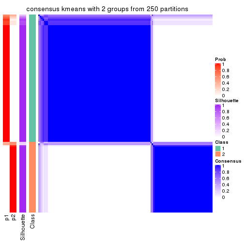</p>

</div>
<div id='tab-SD-kmeans-consensus-heatmap-2'>
<pre><code class="r">consensus_heatmap(res, k = 3)
</code></pre>

<p>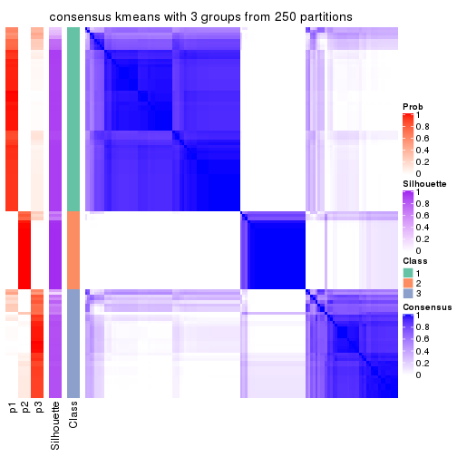</p>

</div>
<div id='tab-SD-kmeans-consensus-heatmap-3'>
<pre><code class="r">consensus_heatmap(res, k = 4)
</code></pre>

<p>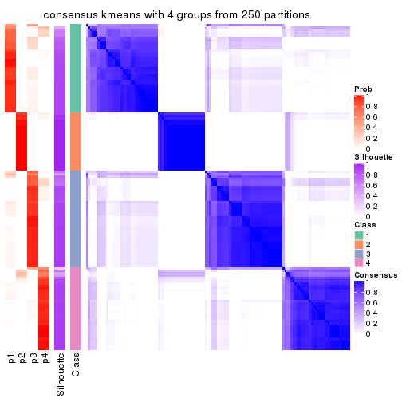</p>

</div>
<div id='tab-SD-kmeans-consensus-heatmap-4'>
<pre><code class="r">consensus_heatmap(res, k = 5)
</code></pre>

<p>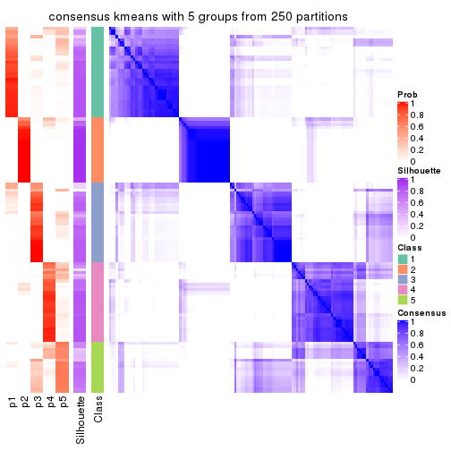</p>

</div>
<div id='tab-SD-kmeans-consensus-heatmap-5'>
<pre><code class="r">consensus_heatmap(res, k = 6)
</code></pre>

<p>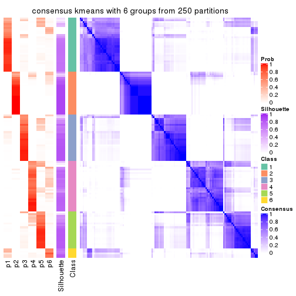</p>

</div>
</div>

Heatmaps for the membership of samples in all partitions to see how consistent they are:


<script>
$( function() {
	$( '#tabs-SD-kmeans-membership-heatmap' ).tabs();
} );
</script>
<div id='tabs-SD-kmeans-membership-heatmap'>
<ul>
<li><a href='#tab-SD-kmeans-membership-heatmap-1'>k = 2</a></li>
<li><a href='#tab-SD-kmeans-membership-heatmap-2'>k = 3</a></li>
<li><a href='#tab-SD-kmeans-membership-heatmap-3'>k = 4</a></li>
<li><a href='#tab-SD-kmeans-membership-heatmap-4'>k = 5</a></li>
<li><a href='#tab-SD-kmeans-membership-heatmap-5'>k = 6</a></li>
</ul>
<div id='tab-SD-kmeans-membership-heatmap-1'>
<pre><code class="r">membership_heatmap(res, k = 2)
</code></pre>

<p>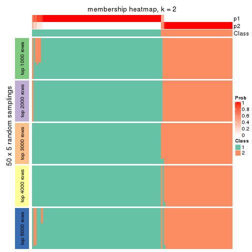</p>

</div>
<div id='tab-SD-kmeans-membership-heatmap-2'>
<pre><code class="r">membership_heatmap(res, k = 3)
</code></pre>

<p>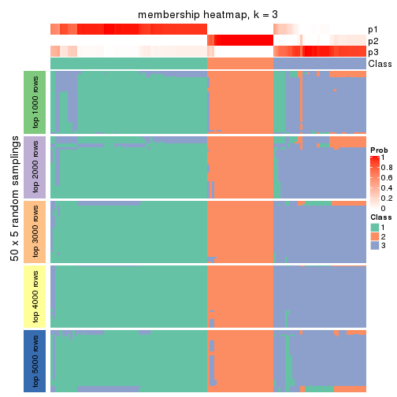</p>

</div>
<div id='tab-SD-kmeans-membership-heatmap-3'>
<pre><code class="r">membership_heatmap(res, k = 4)
</code></pre>

<p>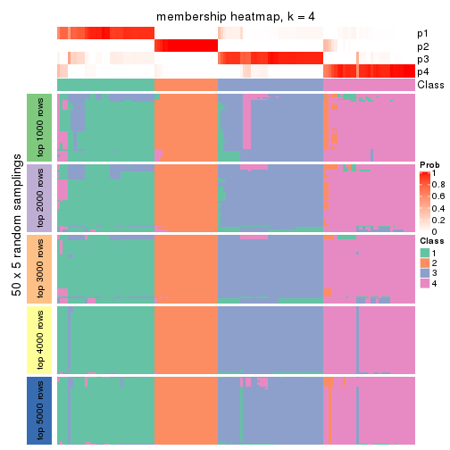</p>

</div>
<div id='tab-SD-kmeans-membership-heatmap-4'>
<pre><code class="r">membership_heatmap(res, k = 5)
</code></pre>

<p>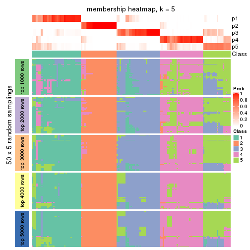</p>

</div>
<div id='tab-SD-kmeans-membership-heatmap-5'>
<pre><code class="r">membership_heatmap(res, k = 6)
</code></pre>

<p>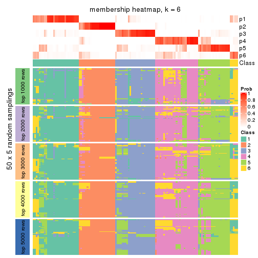</p>

</div>
</div>

As soon as we have had the classes for columns, we can look for signatures
which are significantly different between classes which can be candidate marks
for certain classes. Following are the heatmaps for signatures.


Signature heatmaps where rows are scaled:


<script>
$( function() {
	$( '#tabs-SD-kmeans-get-signatures' ).tabs();
} );
</script>
<div id='tabs-SD-kmeans-get-signatures'>
<ul>
<li><a href='#tab-SD-kmeans-get-signatures-1'>k = 2</a></li>
<li><a href='#tab-SD-kmeans-get-signatures-2'>k = 3</a></li>
<li><a href='#tab-SD-kmeans-get-signatures-3'>k = 4</a></li>
<li><a href='#tab-SD-kmeans-get-signatures-4'>k = 5</a></li>
<li><a href='#tab-SD-kmeans-get-signatures-5'>k = 6</a></li>
</ul>
<div id='tab-SD-kmeans-get-signatures-1'>
<pre><code class="r">get_signatures(res, k = 2)
</code></pre>

<p>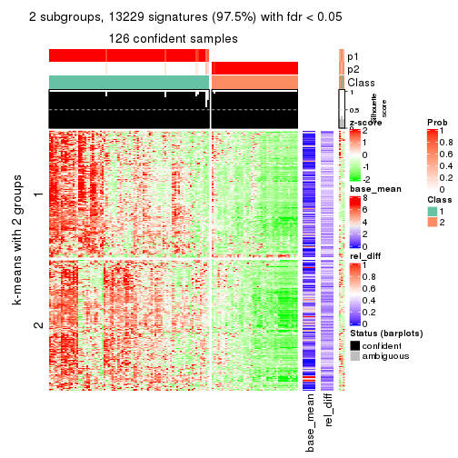</p>

</div>
<div id='tab-SD-kmeans-get-signatures-2'>
<pre><code class="r">get_signatures(res, k = 3)
</code></pre>

<p>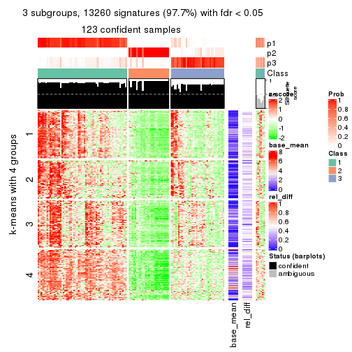</p>

</div>
<div id='tab-SD-kmeans-get-signatures-3'>
<pre><code class="r">get_signatures(res, k = 4)
</code></pre>

<p>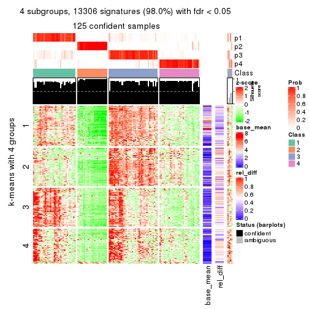</p>

</div>
<div id='tab-SD-kmeans-get-signatures-4'>
<pre><code class="r">get_signatures(res, k = 5)
</code></pre>

<p>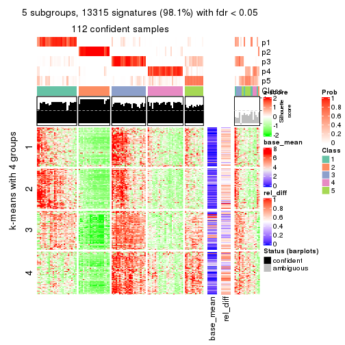</p>

</div>
<div id='tab-SD-kmeans-get-signatures-5'>
<pre><code class="r">get_signatures(res, k = 6)
</code></pre>

<p>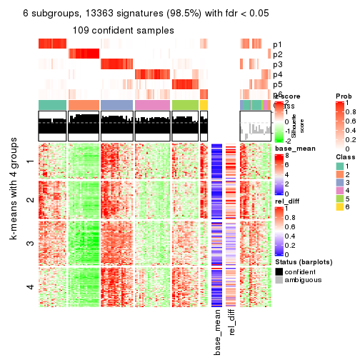</p>

</div>
</div>


Signature heatmaps where rows are not scaled:


<script>
$( function() {
	$( '#tabs-SD-kmeans-get-signatures-no-scale' ).tabs();
} );
</script>
<div id='tabs-SD-kmeans-get-signatures-no-scale'>
<ul>
<li><a href='#tab-SD-kmeans-get-signatures-no-scale-1'>k = 2</a></li>
<li><a href='#tab-SD-kmeans-get-signatures-no-scale-2'>k = 3</a></li>
<li><a href='#tab-SD-kmeans-get-signatures-no-scale-3'>k = 4</a></li>
<li><a href='#tab-SD-kmeans-get-signatures-no-scale-4'>k = 5</a></li>
<li><a href='#tab-SD-kmeans-get-signatures-no-scale-5'>k = 6</a></li>
</ul>
<div id='tab-SD-kmeans-get-signatures-no-scale-1'>
<pre><code class="r">get_signatures(res, k = 2, scale_rows = FALSE)
</code></pre>

<p>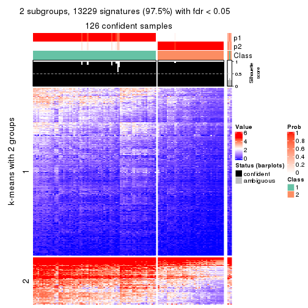</p>

</div>
<div id='tab-SD-kmeans-get-signatures-no-scale-2'>
<pre><code class="r">get_signatures(res, k = 3, scale_rows = FALSE)
</code></pre>

<p>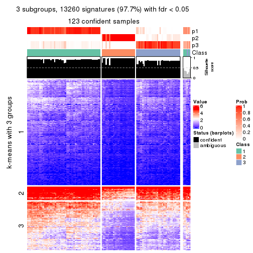</p>

</div>
<div id='tab-SD-kmeans-get-signatures-no-scale-3'>
<pre><code class="r">get_signatures(res, k = 4, scale_rows = FALSE)
</code></pre>

<p>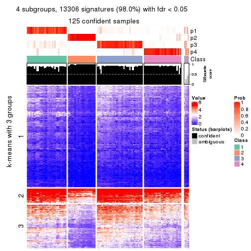</p>

</div>
<div id='tab-SD-kmeans-get-signatures-no-scale-4'>
<pre><code class="r">get_signatures(res, k = 5, scale_rows = FALSE)
</code></pre>

<p>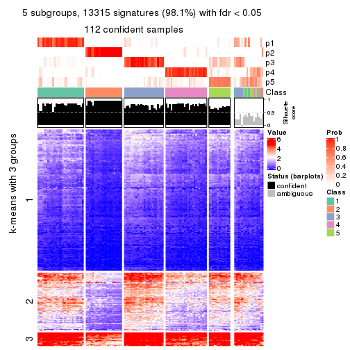</p>

</div>
<div id='tab-SD-kmeans-get-signatures-no-scale-5'>
<pre><code class="r">get_signatures(res, k = 6, scale_rows = FALSE)
</code></pre>

<p>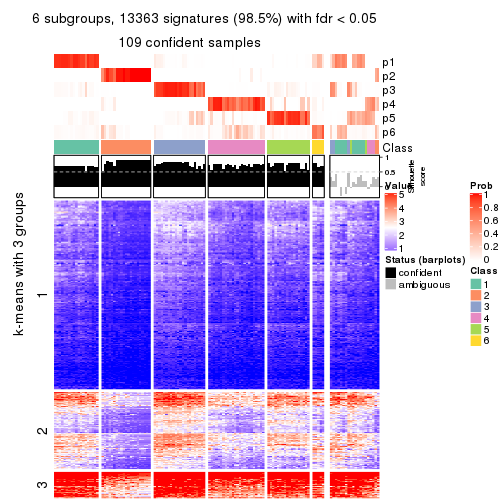</p>

</div>
</div>


Compare the overlap of signatures from different k:

```r
compare_signatures(res)
```

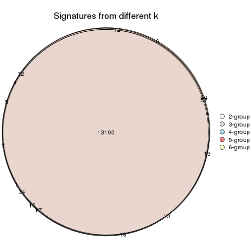

`get_signature()` returns a data frame invisibly. TO get the list of signatures, the function
call should be assigned to a variable explicitly. In following code, if `plot` argument is set
to `FALSE`, no heatmap is plotted while only the differential analysis is performed.

```r
# code only for demonstration
tb = get_signature(res, k = ..., plot = FALSE)
```

An example of the output of `tb` is:

```
#>   which_row         fdr    mean_1    mean_2 scaled_mean_1 scaled_mean_2 km
#> 1        38 0.042760348  8.373488  9.131774    -0.5533452     0.5164555  1
#> 2        40 0.018707592  7.106213  8.469186    -0.6173731     0.5762149  1
#> 3        55 0.019134737 10.221463 11.207825    -0.6159697     0.5749050  1
#> 4        59 0.006059896  5.921854  7.869574    -0.6899429     0.6439467  1
#> 5        60 0.018055526  8.928898 10.211722    -0.6204761     0.5791110  1
#> 6        98 0.009384629 15.714769 14.887706     0.6635654    -0.6193277  2
...
```

The columns in `tb` are:

1. `which_row`: row indices corresponding to the input matrix.
2. `fdr`: FDR for the differential test. 
3. `mean_x`: The mean value in group x.
4. `scaled_mean_x`: The mean value in group x after rows are scaled.
5. `km`: Row groups if k-means clustering is applied to rows.


UMAP plot which shows how samples are separated.


<script>
$( function() {
	$( '#tabs-SD-kmeans-dimension-reduction' ).tabs();
} );
</script>
<div id='tabs-SD-kmeans-dimension-reduction'>
<ul>
<li><a href='#tab-SD-kmeans-dimension-reduction-1'>k = 2</a></li>
<li><a href='#tab-SD-kmeans-dimension-reduction-2'>k = 3</a></li>
<li><a href='#tab-SD-kmeans-dimension-reduction-3'>k = 4</a></li>
<li><a href='#tab-SD-kmeans-dimension-reduction-4'>k = 5</a></li>
<li><a href='#tab-SD-kmeans-dimension-reduction-5'>k = 6</a></li>
</ul>
<div id='tab-SD-kmeans-dimension-reduction-1'>
<pre><code class="r">dimension_reduction(res, k = 2, method = &quot;UMAP&quot;)
</code></pre>

<p>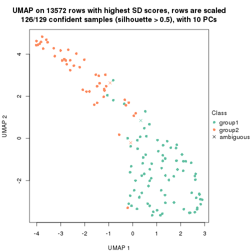</p>

</div>
<div id='tab-SD-kmeans-dimension-reduction-2'>
<pre><code class="r">dimension_reduction(res, k = 3, method = &quot;UMAP&quot;)
</code></pre>

<p>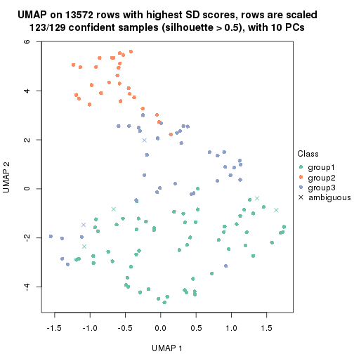</p>

</div>
<div id='tab-SD-kmeans-dimension-reduction-3'>
<pre><code class="r">dimension_reduction(res, k = 4, method = &quot;UMAP&quot;)
</code></pre>

<p>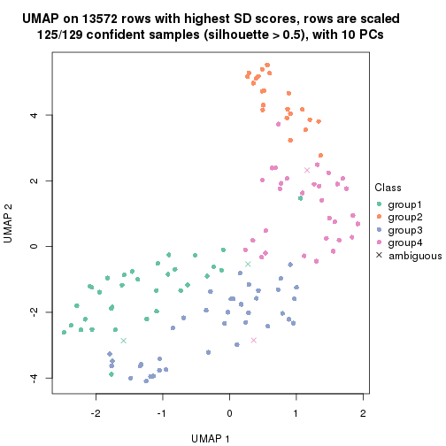</p>

</div>
<div id='tab-SD-kmeans-dimension-reduction-4'>
<pre><code class="r">dimension_reduction(res, k = 5, method = &quot;UMAP&quot;)
</code></pre>

<p>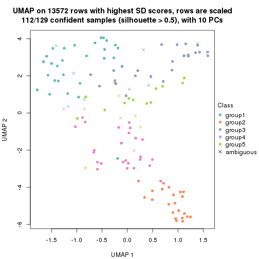</p>

</div>
<div id='tab-SD-kmeans-dimension-reduction-5'>
<pre><code class="r">dimension_reduction(res, k = 6, method = &quot;UMAP&quot;)
</code></pre>

<p>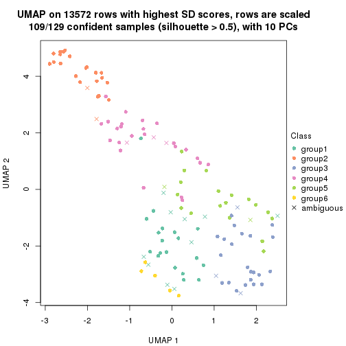</p>

</div>
</div>


Following heatmap shows how subgroups are split when increasing `k`:

```r
collect_classes(res)
```

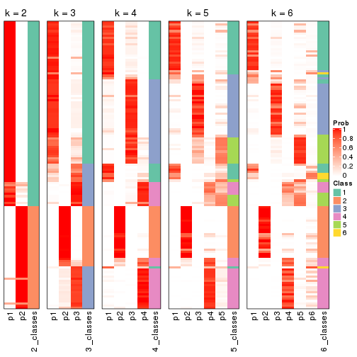


If matrix rows can be associated to genes, consider to use `GO_Enrichment(res,
...)` to perform function enrichment for the signature genes.


 

---------------------------------------------------


### SD:skmeans*


The object with results only for a single top-value method and a single partition method 
can be extracted as:

```r
res = res_list["SD", "skmeans"]
# you can also extract it by
# res = res_list["SD:skmeans"]
```

A summary of `res` and all the functions that can be applied to it:

```r
res
```

```
#> A 'ConsensusPartition' object with k = 2, 3, 4, 5, 6.
#>   On a matrix with 13572 rows and 129 columns.
#>   Top rows (1000, 2000, 3000, 4000, 5000) are extracted by 'SD' method.
#>   Subgroups are detected by 'skmeans' method.
#>   Performed in total 1250 partitions by row resampling.
#>   Best k for subgroups seems to be 3.
#> 
#> Following methods can be applied to this 'ConsensusPartition' object:
#>  [1] "cola_report"             "collect_classes"         "collect_plots"          
#>  [4] "collect_stats"           "colnames"                "compare_signatures"     
#>  [7] "consensus_heatmap"       "dimension_reduction"     "functional_enrichment"  
#> [10] "get_anno_col"            "get_anno"                "get_classes"            
#> [13] "get_consensus"           "get_matrix"              "get_membership"         
#> [16] "get_param"               "get_signatures"          "get_stats"              
#> [19] "is_best_k"               "is_stable_k"             "membership_heatmap"     
#> [22] "ncol"                    "nrow"                    "plot_ecdf"              
#> [25] "rownames"                "select_partition_number" "show"                   
#> [28] "suggest_best_k"          "test_to_known_factors"
```

`collect_plots()` function collects all the plots made from `res` for all `k` (number of partitions)
into one single page to provide an easy and fast comparison between different `k`.

```r
collect_plots(res)
```

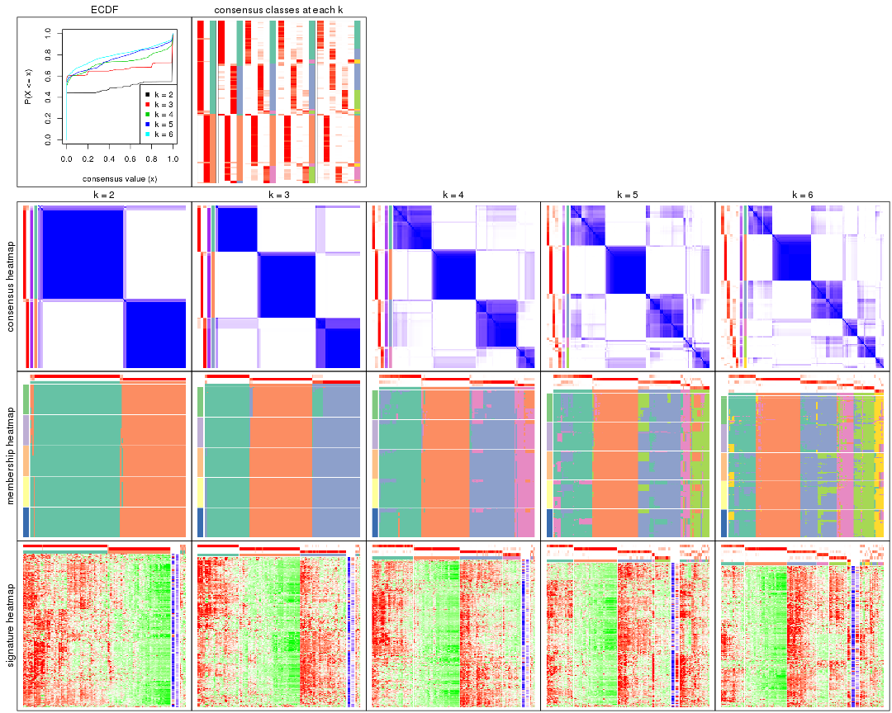

The plots are:

- The first row: a plot of the ECDF (Empirical cumulative distribution
  function) curves of the consensus matrix for each `k` and the heatmap of
  predicted classes for each `k`.
- The second row: heatmaps of the consensus matrix for each `k`.
- The third row: heatmaps of the membership matrix for each `k`.
- The fouth row: heatmaps of the signatures for each `k`.

All the plots in panels can be made by individual functions and they are
plotted later in this section.

`select_partition_number()` produces several plots showing different
statistics for choosing "optimized" `k`. There are following statistics:

- ECDF curves of the consensus matrix for each `k`;
- 1-PAC. [The PAC
  score](https://en.wikipedia.org/wiki/Consensus_clustering#Over-interpretation_potential_of_consensus_clustering)
  measures the proportion of the ambiguous subgrouping.
- Mean silhouette score.
- Concordance. The mean probability of fiting the consensus class ids in all
  partitions.
- Area increased. Denote $A_k$ as the area under the ECDF curve for current
  `k`, the area increased is defined as $A_k - A_{k-1}$.
- Rand index. The percent of pairs of samples that are both in a same cluster
  or both are not in a same cluster in the partition of k and k-1.
- Jaccard index. The ratio of pairs of samples are both in a same cluster in
  the partition of k and k-1 and the pairs of samples are both in a same
  cluster in the partition k or k-1.

The detailed explanations of these statistics can be found in [the cola
vignette](http://bioconductor.org/packages/devel/bioc/vignettes/cola/inst/doc/cola.html#toc_13).

Generally speaking, lower PAC score, higher mean silhouette score or higher
concordance corresponds to better partition. Rand index and Jaccard index
measure how similar the current partition is compared to partition with `k-1`.
If they are too similar, we won't accept `k` is better than `k-1`.

```r
select_partition_number(res)
```

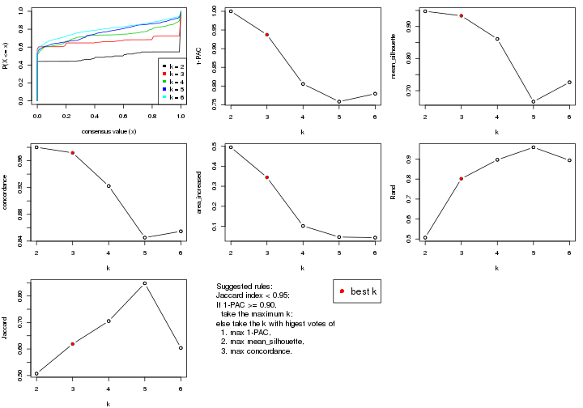

The numeric values for all these statistics can be obtained by `get_stats()`.

```r
get_stats(res)
```

```
#>   k 1-PAC mean_silhouette concordance area_increased  Rand Jaccard
#> 2 2 1.000           0.947       0.980         0.4943 0.507   0.507
#> 3 3 0.937           0.933       0.972         0.3443 0.802   0.619
#> 4 4 0.806           0.861       0.922         0.1018 0.896   0.705
#> 5 5 0.758           0.666       0.845         0.0466 0.959   0.848
#> 6 6 0.779           0.726       0.855         0.0437 0.894   0.604
```

`suggest_best_k()` suggests the best $k$ based on these statistics. The rules are as follows:

- All $k$ with Jaccard index larger than 0.95 are removed because the increase of
  the partition number does not provides enough extra information. If all $k$ are removed,
  the best $k$ is assigned by `NA`.
- For $k$ with 1-PAC larger than 0.9, the maximal $k$ is taken as the "best k". Other $k$ is called "optional k".
- If it does not fit the second rule. The $k$ with the highest vote of highest
  1-PAC, mean silhouette and concordance is taken as the "best k".

```r
suggest_best_k(res)
```

```
#> [1] 3
#> attr(,"optional")
#> [1] 2
```

There is also optional best $k$ = 2 that is worth to check.

Following shows the table of the partitions (You need to click the **show/hide
code output** link to see it). The membership matrix (columns with name `p*`)
is inferred by
[`clue::cl_consensus()`](https://www.rdocumentation.org/link/cl_consensus?package=clue)
function with the `SE` method. Basically the value in the membership matrix
represents the probability to belong to a certain group. The finall class
label for an item is determined with the group with highest probability it
belongs to.

In `get_classes()` function, the entropy is calculated from the membership
matrix and the silhouette score is calculated from the consensus matrix.


<script>
$( function() {
	$( '#tabs-SD-skmeans-get-classes' ).tabs();
} );
</script>
<div id='tabs-SD-skmeans-get-classes'>
<ul>
<li><a href='#tab-SD-skmeans-get-classes-1'>k = 2</a></li>
<li><a href='#tab-SD-skmeans-get-classes-2'>k = 3</a></li>
<li><a href='#tab-SD-skmeans-get-classes-3'>k = 4</a></li>
<li><a href='#tab-SD-skmeans-get-classes-4'>k = 5</a></li>
<li><a href='#tab-SD-skmeans-get-classes-5'>k = 6</a></li>
</ul>

<div id='tab-SD-skmeans-get-classes-1'>
<p><a id='tab-SD-skmeans-get-classes-1-a' style='color:#0366d6' href='#'>show/hide code output</a></p>
<pre><code class="r">cbind(get_classes(res, k = 2), get_membership(res, k = 2))
</code></pre>

<pre><code>#&gt;            class entropy silhouette    p1    p2
#&gt; SRR1656463     2   0.000      0.979 0.000 1.000
#&gt; SRR1656464     1   0.000      0.979 1.000 0.000
#&gt; SRR1656462     1   0.000      0.979 1.000 0.000
#&gt; SRR1656465     1   0.000      0.979 1.000 0.000
#&gt; SRR1656467     2   0.000      0.979 0.000 1.000
#&gt; SRR1656466     1   0.000      0.979 1.000 0.000
#&gt; SRR1656468     2   0.000      0.979 0.000 1.000
#&gt; SRR1656472     1   0.000      0.979 1.000 0.000
#&gt; SRR1656471     1   0.000      0.979 1.000 0.000
#&gt; SRR1656470     2   0.000      0.979 0.000 1.000
#&gt; SRR1656469     1   0.000      0.979 1.000 0.000
#&gt; SRR1656473     2   0.000      0.979 0.000 1.000
#&gt; SRR1656474     2   0.000      0.979 0.000 1.000
#&gt; SRR1656475     2   0.000      0.979 0.000 1.000
#&gt; SRR1656478     1   0.000      0.979 1.000 0.000
#&gt; SRR1656477     2   0.000      0.979 0.000 1.000
#&gt; SRR1656479     1   0.000      0.979 1.000 0.000
#&gt; SRR1656480     2   0.000      0.979 0.000 1.000
#&gt; SRR1656476     2   0.000      0.979 0.000 1.000
#&gt; SRR1656481     2   0.000      0.979 0.000 1.000
#&gt; SRR1656482     2   0.000      0.979 0.000 1.000
#&gt; SRR1656483     2   0.000      0.979 0.000 1.000
#&gt; SRR1656485     1   0.000      0.979 1.000 0.000
#&gt; SRR1656487     1   0.000      0.979 1.000 0.000
#&gt; SRR1656486     1   0.000      0.979 1.000 0.000
#&gt; SRR1656488     1   0.000      0.979 1.000 0.000
#&gt; SRR1656484     1   0.000      0.979 1.000 0.000
#&gt; SRR1656489     1   0.000      0.979 1.000 0.000
#&gt; SRR1656491     1   0.000      0.979 1.000 0.000
#&gt; SRR1656490     1   0.000      0.979 1.000 0.000
#&gt; SRR1656492     1   0.000      0.979 1.000 0.000
#&gt; SRR1656493     1   0.000      0.979 1.000 0.000
#&gt; SRR1656495     2   0.000      0.979 0.000 1.000
#&gt; SRR1656496     1   0.000      0.979 1.000 0.000
#&gt; SRR1656494     2   0.000      0.979 0.000 1.000
#&gt; SRR1656497     2   0.000      0.979 0.000 1.000
#&gt; SRR1656499     1   0.000      0.979 1.000 0.000
#&gt; SRR1656500     1   0.000      0.979 1.000 0.000
#&gt; SRR1656501     1   0.000      0.979 1.000 0.000
#&gt; SRR1656498     1   0.000      0.979 1.000 0.000
#&gt; SRR1656504     2   0.000      0.979 0.000 1.000
#&gt; SRR1656502     1   0.855      0.605 0.720 0.280
#&gt; SRR1656503     1   0.000      0.979 1.000 0.000
#&gt; SRR1656507     1   0.000      0.979 1.000 0.000
#&gt; SRR1656508     1   0.000      0.979 1.000 0.000
#&gt; SRR1656505     2   0.000      0.979 0.000 1.000
#&gt; SRR1656506     1   0.000      0.979 1.000 0.000
#&gt; SRR1656509     1   0.000      0.979 1.000 0.000
#&gt; SRR1656510     2   0.971      0.331 0.400 0.600
#&gt; SRR1656511     2   0.000      0.979 0.000 1.000
#&gt; SRR1656513     2   0.000      0.979 0.000 1.000
#&gt; SRR1656512     2   0.000      0.979 0.000 1.000
#&gt; SRR1656514     1   0.000      0.979 1.000 0.000
#&gt; SRR1656515     2   0.000      0.979 0.000 1.000
#&gt; SRR1656516     1   0.000      0.979 1.000 0.000
#&gt; SRR1656518     1   0.000      0.979 1.000 0.000
#&gt; SRR1656517     1   0.000      0.979 1.000 0.000
#&gt; SRR1656519     1   0.000      0.979 1.000 0.000
#&gt; SRR1656522     1   0.000      0.979 1.000 0.000
#&gt; SRR1656523     2   0.000      0.979 0.000 1.000
#&gt; SRR1656521     2   0.000      0.979 0.000 1.000
#&gt; SRR1656520     1   0.000      0.979 1.000 0.000
#&gt; SRR1656524     2   0.895      0.540 0.312 0.688
#&gt; SRR1656525     1   0.000      0.979 1.000 0.000
#&gt; SRR1656526     2   0.000      0.979 0.000 1.000
#&gt; SRR1656527     2   0.000      0.979 0.000 1.000
#&gt; SRR1656530     1   0.000      0.979 1.000 0.000
#&gt; SRR1656529     1   0.000      0.979 1.000 0.000
#&gt; SRR1656531     1   0.000      0.979 1.000 0.000
#&gt; SRR1656528     1   0.000      0.979 1.000 0.000
#&gt; SRR1656534     1   0.000      0.979 1.000 0.000
#&gt; SRR1656533     1   0.000      0.979 1.000 0.000
#&gt; SRR1656536     1   0.998      0.108 0.528 0.472
#&gt; SRR1656532     2   0.000      0.979 0.000 1.000
#&gt; SRR1656537     1   0.000      0.979 1.000 0.000
#&gt; SRR1656538     1   0.000      0.979 1.000 0.000
#&gt; SRR1656535     2   0.000      0.979 0.000 1.000
#&gt; SRR1656539     1   0.000      0.979 1.000 0.000
#&gt; SRR1656544     1   0.000      0.979 1.000 0.000
#&gt; SRR1656542     1   0.000      0.979 1.000 0.000
#&gt; SRR1656543     1   0.000      0.979 1.000 0.000
#&gt; SRR1656545     2   0.000      0.979 0.000 1.000
#&gt; SRR1656540     1   0.000      0.979 1.000 0.000
#&gt; SRR1656546     1   0.971      0.316 0.600 0.400
#&gt; SRR1656541     2   0.000      0.979 0.000 1.000
#&gt; SRR1656547     2   0.000      0.979 0.000 1.000
#&gt; SRR1656548     1   0.000      0.979 1.000 0.000
#&gt; SRR1656549     1   0.000      0.979 1.000 0.000
#&gt; SRR1656551     2   0.958      0.373 0.380 0.620
#&gt; SRR1656553     1   0.000      0.979 1.000 0.000
#&gt; SRR1656550     2   0.000      0.979 0.000 1.000
#&gt; SRR1656552     2   0.000      0.979 0.000 1.000
#&gt; SRR1656554     1   0.000      0.979 1.000 0.000
#&gt; SRR1656555     2   0.000      0.979 0.000 1.000
#&gt; SRR1656556     1   0.917      0.498 0.668 0.332
#&gt; SRR1656557     1   0.000      0.979 1.000 0.000
#&gt; SRR1656558     1   0.000      0.979 1.000 0.000
#&gt; SRR1656559     1   0.000      0.979 1.000 0.000
#&gt; SRR1656560     1   0.000      0.979 1.000 0.000
#&gt; SRR1656561     1   0.000      0.979 1.000 0.000
#&gt; SRR1656562     2   0.000      0.979 0.000 1.000
#&gt; SRR1656563     1   0.000      0.979 1.000 0.000
#&gt; SRR1656564     2   0.000      0.979 0.000 1.000
#&gt; SRR1656565     2   0.000      0.979 0.000 1.000
#&gt; SRR1656566     1   0.000      0.979 1.000 0.000
#&gt; SRR1656568     2   0.000      0.979 0.000 1.000
#&gt; SRR1656567     2   0.000      0.979 0.000 1.000
#&gt; SRR1656569     1   0.000      0.979 1.000 0.000
#&gt; SRR1656570     1   0.000      0.979 1.000 0.000
#&gt; SRR1656571     2   0.000      0.979 0.000 1.000
#&gt; SRR1656573     1   0.000      0.979 1.000 0.000
#&gt; SRR1656572     2   0.000      0.979 0.000 1.000
#&gt; SRR1656574     1   0.000      0.979 1.000 0.000
#&gt; SRR1656575     1   0.000      0.979 1.000 0.000
#&gt; SRR1656576     2   0.000      0.979 0.000 1.000
#&gt; SRR1656578     2   0.000      0.979 0.000 1.000
#&gt; SRR1656577     1   0.000      0.979 1.000 0.000
#&gt; SRR1656579     2   0.000      0.979 0.000 1.000
#&gt; SRR1656580     1   0.000      0.979 1.000 0.000
#&gt; SRR1656581     2   0.000      0.979 0.000 1.000
#&gt; SRR1656582     2   0.000      0.979 0.000 1.000
#&gt; SRR1656585     2   0.000      0.979 0.000 1.000
#&gt; SRR1656584     1   0.000      0.979 1.000 0.000
#&gt; SRR1656583     2   0.000      0.979 0.000 1.000
#&gt; SRR1656586     2   0.000      0.979 0.000 1.000
#&gt; SRR1656587     2   0.000      0.979 0.000 1.000
#&gt; SRR1656588     2   0.000      0.979 0.000 1.000
#&gt; SRR1656589     2   0.000      0.979 0.000 1.000
#&gt; SRR1656590     1   0.000      0.979 1.000 0.000
</code></pre>

<script>
$('#tab-SD-skmeans-get-classes-1-a').parent().next().next().hide();
$('#tab-SD-skmeans-get-classes-1-a').click(function(){
  $('#tab-SD-skmeans-get-classes-1-a').parent().next().next().toggle();
  return(false);
});
</script>
</div>

<div id='tab-SD-skmeans-get-classes-2'>
<p><a id='tab-SD-skmeans-get-classes-2-a' style='color:#0366d6' href='#'>show/hide code output</a></p>
<pre><code class="r">cbind(get_classes(res, k = 3), get_membership(res, k = 3))
</code></pre>

<pre><code>#&gt;            class entropy silhouette    p1    p2    p3
#&gt; SRR1656463     2  0.0000     0.9845 0.000 1.000 0.000
#&gt; SRR1656464     1  0.0000     0.9733 1.000 0.000 0.000
#&gt; SRR1656462     3  0.0000     0.9453 0.000 0.000 1.000
#&gt; SRR1656465     3  0.0000     0.9453 0.000 0.000 1.000
#&gt; SRR1656467     2  0.0000     0.9845 0.000 1.000 0.000
#&gt; SRR1656466     3  0.0000     0.9453 0.000 0.000 1.000
#&gt; SRR1656468     2  0.4504     0.7700 0.000 0.804 0.196
#&gt; SRR1656472     1  0.0000     0.9733 1.000 0.000 0.000
#&gt; SRR1656471     3  0.0000     0.9453 0.000 0.000 1.000
#&gt; SRR1656470     2  0.0000     0.9845 0.000 1.000 0.000
#&gt; SRR1656469     3  0.0000     0.9453 0.000 0.000 1.000
#&gt; SRR1656473     2  0.0000     0.9845 0.000 1.000 0.000
#&gt; SRR1656474     2  0.0000     0.9845 0.000 1.000 0.000
#&gt; SRR1656475     2  0.0000     0.9845 0.000 1.000 0.000
#&gt; SRR1656478     1  0.0000     0.9733 1.000 0.000 0.000
#&gt; SRR1656477     2  0.0000     0.9845 0.000 1.000 0.000
#&gt; SRR1656479     1  0.6154     0.2337 0.592 0.000 0.408
#&gt; SRR1656480     2  0.0000     0.9845 0.000 1.000 0.000
#&gt; SRR1656476     2  0.0000     0.9845 0.000 1.000 0.000
#&gt; SRR1656481     3  0.0237     0.9423 0.000 0.004 0.996
#&gt; SRR1656482     2  0.0000     0.9845 0.000 1.000 0.000
#&gt; SRR1656483     2  0.0000     0.9845 0.000 1.000 0.000
#&gt; SRR1656485     3  0.0000     0.9453 0.000 0.000 1.000
#&gt; SRR1656487     3  0.0000     0.9453 0.000 0.000 1.000
#&gt; SRR1656486     1  0.0000     0.9733 1.000 0.000 0.000
#&gt; SRR1656488     3  0.0000     0.9453 0.000 0.000 1.000
#&gt; SRR1656484     1  0.0000     0.9733 1.000 0.000 0.000
#&gt; SRR1656489     1  0.0000     0.9733 1.000 0.000 0.000
#&gt; SRR1656491     3  0.0000     0.9453 0.000 0.000 1.000
#&gt; SRR1656490     1  0.0000     0.9733 1.000 0.000 0.000
#&gt; SRR1656492     3  0.4504     0.7844 0.196 0.000 0.804
#&gt; SRR1656493     1  0.0000     0.9733 1.000 0.000 0.000
#&gt; SRR1656495     2  0.0237     0.9808 0.004 0.996 0.000
#&gt; SRR1656496     1  0.6274     0.0649 0.544 0.000 0.456
#&gt; SRR1656494     2  0.0000     0.9845 0.000 1.000 0.000
#&gt; SRR1656497     2  0.0000     0.9845 0.000 1.000 0.000
#&gt; SRR1656499     3  0.0000     0.9453 0.000 0.000 1.000
#&gt; SRR1656500     3  0.4452     0.7891 0.192 0.000 0.808
#&gt; SRR1656501     1  0.0000     0.9733 1.000 0.000 0.000
#&gt; SRR1656498     1  0.0000     0.9733 1.000 0.000 0.000
#&gt; SRR1656504     2  0.0000     0.9845 0.000 1.000 0.000
#&gt; SRR1656502     1  0.0424     0.9644 0.992 0.008 0.000
#&gt; SRR1656503     1  0.0000     0.9733 1.000 0.000 0.000
#&gt; SRR1656507     1  0.0000     0.9733 1.000 0.000 0.000
#&gt; SRR1656508     1  0.0000     0.9733 1.000 0.000 0.000
#&gt; SRR1656505     2  0.0000     0.9845 0.000 1.000 0.000
#&gt; SRR1656506     3  0.0000     0.9453 0.000 0.000 1.000
#&gt; SRR1656509     3  0.0000     0.9453 0.000 0.000 1.000
#&gt; SRR1656510     2  0.6126     0.3785 0.000 0.600 0.400
#&gt; SRR1656511     2  0.0000     0.9845 0.000 1.000 0.000
#&gt; SRR1656513     2  0.0000     0.9845 0.000 1.000 0.000
#&gt; SRR1656512     2  0.0000     0.9845 0.000 1.000 0.000
#&gt; SRR1656514     1  0.0000     0.9733 1.000 0.000 0.000
#&gt; SRR1656515     2  0.0000     0.9845 0.000 1.000 0.000
#&gt; SRR1656516     1  0.0000     0.9733 1.000 0.000 0.000
#&gt; SRR1656518     1  0.0000     0.9733 1.000 0.000 0.000
#&gt; SRR1656517     1  0.0000     0.9733 1.000 0.000 0.000
#&gt; SRR1656519     3  0.4399     0.7933 0.188 0.000 0.812
#&gt; SRR1656522     1  0.0000     0.9733 1.000 0.000 0.000
#&gt; SRR1656523     2  0.0000     0.9845 0.000 1.000 0.000
#&gt; SRR1656521     2  0.0000     0.9845 0.000 1.000 0.000
#&gt; SRR1656520     3  0.0000     0.9453 0.000 0.000 1.000
#&gt; SRR1656524     1  0.0000     0.9733 1.000 0.000 0.000
#&gt; SRR1656525     3  0.0000     0.9453 0.000 0.000 1.000
#&gt; SRR1656526     2  0.0000     0.9845 0.000 1.000 0.000
#&gt; SRR1656527     2  0.0000     0.9845 0.000 1.000 0.000
#&gt; SRR1656530     3  0.0000     0.9453 0.000 0.000 1.000
#&gt; SRR1656529     3  0.0000     0.9453 0.000 0.000 1.000
#&gt; SRR1656531     1  0.0000     0.9733 1.000 0.000 0.000
#&gt; SRR1656528     3  0.0000     0.9453 0.000 0.000 1.000
#&gt; SRR1656534     3  0.4555     0.7793 0.200 0.000 0.800
#&gt; SRR1656533     1  0.0000     0.9733 1.000 0.000 0.000
#&gt; SRR1656536     3  0.0000     0.9453 0.000 0.000 1.000
#&gt; SRR1656532     2  0.0000     0.9845 0.000 1.000 0.000
#&gt; SRR1656537     1  0.0000     0.9733 1.000 0.000 0.000
#&gt; SRR1656538     3  0.4504     0.7844 0.196 0.000 0.804
#&gt; SRR1656535     2  0.0000     0.9845 0.000 1.000 0.000
#&gt; SRR1656539     3  0.0000     0.9453 0.000 0.000 1.000
#&gt; SRR1656544     3  0.0000     0.9453 0.000 0.000 1.000
#&gt; SRR1656542     3  0.4452     0.7891 0.192 0.000 0.808
#&gt; SRR1656543     3  0.0000     0.9453 0.000 0.000 1.000
#&gt; SRR1656545     2  0.0000     0.9845 0.000 1.000 0.000
#&gt; SRR1656540     3  0.0000     0.9453 0.000 0.000 1.000
#&gt; SRR1656546     1  0.0000     0.9733 1.000 0.000 0.000
#&gt; SRR1656541     2  0.0000     0.9845 0.000 1.000 0.000
#&gt; SRR1656547     2  0.0000     0.9845 0.000 1.000 0.000
#&gt; SRR1656548     3  0.0000     0.9453 0.000 0.000 1.000
#&gt; SRR1656549     1  0.0000     0.9733 1.000 0.000 0.000
#&gt; SRR1656551     3  0.0000     0.9453 0.000 0.000 1.000
#&gt; SRR1656553     3  0.4121     0.8130 0.168 0.000 0.832
#&gt; SRR1656550     2  0.0000     0.9845 0.000 1.000 0.000
#&gt; SRR1656552     2  0.0000     0.9845 0.000 1.000 0.000
#&gt; SRR1656554     3  0.0000     0.9453 0.000 0.000 1.000
#&gt; SRR1656555     2  0.4555     0.7648 0.000 0.800 0.200
#&gt; SRR1656556     3  0.0237     0.9423 0.000 0.004 0.996
#&gt; SRR1656557     3  0.0000     0.9453 0.000 0.000 1.000
#&gt; SRR1656558     1  0.0000     0.9733 1.000 0.000 0.000
#&gt; SRR1656559     1  0.0000     0.9733 1.000 0.000 0.000
#&gt; SRR1656560     3  0.0000     0.9453 0.000 0.000 1.000
#&gt; SRR1656561     3  0.4504     0.7844 0.196 0.000 0.804
#&gt; SRR1656562     2  0.0000     0.9845 0.000 1.000 0.000
#&gt; SRR1656563     1  0.0000     0.9733 1.000 0.000 0.000
#&gt; SRR1656564     2  0.0000     0.9845 0.000 1.000 0.000
#&gt; SRR1656565     2  0.0000     0.9845 0.000 1.000 0.000
#&gt; SRR1656566     1  0.0000     0.9733 1.000 0.000 0.000
#&gt; SRR1656568     2  0.0000     0.9845 0.000 1.000 0.000
#&gt; SRR1656567     2  0.0000     0.9845 0.000 1.000 0.000
#&gt; SRR1656569     3  0.0000     0.9453 0.000 0.000 1.000
#&gt; SRR1656570     1  0.0000     0.9733 1.000 0.000 0.000
#&gt; SRR1656571     2  0.0000     0.9845 0.000 1.000 0.000
#&gt; SRR1656573     3  0.0000     0.9453 0.000 0.000 1.000
#&gt; SRR1656572     2  0.0000     0.9845 0.000 1.000 0.000
#&gt; SRR1656574     1  0.0000     0.9733 1.000 0.000 0.000
#&gt; SRR1656575     1  0.0000     0.9733 1.000 0.000 0.000
#&gt; SRR1656576     2  0.0000     0.9845 0.000 1.000 0.000
#&gt; SRR1656578     2  0.0000     0.9845 0.000 1.000 0.000
#&gt; SRR1656577     1  0.0000     0.9733 1.000 0.000 0.000
#&gt; SRR1656579     2  0.0000     0.9845 0.000 1.000 0.000
#&gt; SRR1656580     3  0.6235     0.2881 0.436 0.000 0.564
#&gt; SRR1656581     2  0.0000     0.9845 0.000 1.000 0.000
#&gt; SRR1656582     2  0.0000     0.9845 0.000 1.000 0.000
#&gt; SRR1656585     2  0.0000     0.9845 0.000 1.000 0.000
#&gt; SRR1656584     1  0.0000     0.9733 1.000 0.000 0.000
#&gt; SRR1656583     2  0.0000     0.9845 0.000 1.000 0.000
#&gt; SRR1656586     2  0.0000     0.9845 0.000 1.000 0.000
#&gt; SRR1656587     2  0.0000     0.9845 0.000 1.000 0.000
#&gt; SRR1656588     2  0.0000     0.9845 0.000 1.000 0.000
#&gt; SRR1656589     2  0.0000     0.9845 0.000 1.000 0.000
#&gt; SRR1656590     1  0.0000     0.9733 1.000 0.000 0.000
</code></pre>

<script>
$('#tab-SD-skmeans-get-classes-2-a').parent().next().next().hide();
$('#tab-SD-skmeans-get-classes-2-a').click(function(){
  $('#tab-SD-skmeans-get-classes-2-a').parent().next().next().toggle();
  return(false);
});
</script>
</div>

<div id='tab-SD-skmeans-get-classes-3'>
<p><a id='tab-SD-skmeans-get-classes-3-a' style='color:#0366d6' href='#'>show/hide code output</a></p>
<pre><code class="r">cbind(get_classes(res, k = 4), get_membership(res, k = 4))
</code></pre>

<pre><code>#&gt;            class entropy silhouette    p1    p2    p3    p4
#&gt; SRR1656463     2  0.0000      0.975 0.000 1.000 0.000 0.000
#&gt; SRR1656464     1  0.2921      0.856 0.860 0.000 0.140 0.000
#&gt; SRR1656462     3  0.0000      0.909 0.000 0.000 1.000 0.000
#&gt; SRR1656465     3  0.4382      0.691 0.000 0.000 0.704 0.296
#&gt; SRR1656467     2  0.0188      0.971 0.000 0.996 0.000 0.004
#&gt; SRR1656466     3  0.3569      0.794 0.000 0.000 0.804 0.196
#&gt; SRR1656468     4  0.0000      0.773 0.000 0.000 0.000 1.000
#&gt; SRR1656472     1  0.2319      0.868 0.924 0.000 0.036 0.040
#&gt; SRR1656471     3  0.4304      0.707 0.000 0.000 0.716 0.284
#&gt; SRR1656470     2  0.0000      0.975 0.000 1.000 0.000 0.000
#&gt; SRR1656469     3  0.3801      0.772 0.000 0.000 0.780 0.220
#&gt; SRR1656473     2  0.0000      0.975 0.000 1.000 0.000 0.000
#&gt; SRR1656474     2  0.0000      0.975 0.000 1.000 0.000 0.000
#&gt; SRR1656475     2  0.0000      0.975 0.000 1.000 0.000 0.000
#&gt; SRR1656478     1  0.0921      0.894 0.972 0.000 0.028 0.000
#&gt; SRR1656477     4  0.1302      0.796 0.000 0.044 0.000 0.956
#&gt; SRR1656479     3  0.4624      0.437 0.340 0.000 0.660 0.000
#&gt; SRR1656480     4  0.3486      0.812 0.000 0.188 0.000 0.812
#&gt; SRR1656476     2  0.0000      0.975 0.000 1.000 0.000 0.000
#&gt; SRR1656481     4  0.0000      0.773 0.000 0.000 0.000 1.000
#&gt; SRR1656482     2  0.0000      0.975 0.000 1.000 0.000 0.000
#&gt; SRR1656483     2  0.0000      0.975 0.000 1.000 0.000 0.000
#&gt; SRR1656485     3  0.0000      0.909 0.000 0.000 1.000 0.000
#&gt; SRR1656487     3  0.3837      0.768 0.000 0.000 0.776 0.224
#&gt; SRR1656486     1  0.3649      0.815 0.796 0.000 0.204 0.000
#&gt; SRR1656488     3  0.0817      0.903 0.000 0.000 0.976 0.024
#&gt; SRR1656484     1  0.1389      0.889 0.952 0.000 0.048 0.000
#&gt; SRR1656489     1  0.3610      0.819 0.800 0.000 0.200 0.000
#&gt; SRR1656491     3  0.0000      0.909 0.000 0.000 1.000 0.000
#&gt; SRR1656490     1  0.0592      0.895 0.984 0.000 0.016 0.000
#&gt; SRR1656492     3  0.1398      0.889 0.040 0.000 0.956 0.004
#&gt; SRR1656493     1  0.0000      0.892 1.000 0.000 0.000 0.000
#&gt; SRR1656495     2  0.3569      0.704 0.196 0.804 0.000 0.000
#&gt; SRR1656496     3  0.3024      0.759 0.148 0.000 0.852 0.000
#&gt; SRR1656494     2  0.0188      0.971 0.000 0.996 0.000 0.004
#&gt; SRR1656497     2  0.0000      0.975 0.000 1.000 0.000 0.000
#&gt; SRR1656499     3  0.0000      0.909 0.000 0.000 1.000 0.000
#&gt; SRR1656500     3  0.0000      0.909 0.000 0.000 1.000 0.000
#&gt; SRR1656501     1  0.3610      0.818 0.800 0.000 0.200 0.000
#&gt; SRR1656498     1  0.0000      0.892 1.000 0.000 0.000 0.000
#&gt; SRR1656504     2  0.0000      0.975 0.000 1.000 0.000 0.000
#&gt; SRR1656502     1  0.2319      0.868 0.924 0.000 0.036 0.040
#&gt; SRR1656503     1  0.4454      0.712 0.692 0.000 0.308 0.000
#&gt; SRR1656507     1  0.0921      0.894 0.972 0.000 0.028 0.000
#&gt; SRR1656508     1  0.0336      0.894 0.992 0.000 0.008 0.000
#&gt; SRR1656505     4  0.3873      0.786 0.000 0.228 0.000 0.772
#&gt; SRR1656506     3  0.0188      0.908 0.000 0.000 0.996 0.004
#&gt; SRR1656509     3  0.1584      0.886 0.012 0.000 0.952 0.036
#&gt; SRR1656510     2  0.7149      0.263 0.004 0.576 0.240 0.180
#&gt; SRR1656511     2  0.0000      0.975 0.000 1.000 0.000 0.000
#&gt; SRR1656513     2  0.0000      0.975 0.000 1.000 0.000 0.000
#&gt; SRR1656512     2  0.0000      0.975 0.000 1.000 0.000 0.000
#&gt; SRR1656514     1  0.4713      0.555 0.640 0.000 0.360 0.000
#&gt; SRR1656515     2  0.2281      0.862 0.000 0.904 0.000 0.096
#&gt; SRR1656516     1  0.3837      0.802 0.776 0.000 0.224 0.000
#&gt; SRR1656518     1  0.0469      0.895 0.988 0.000 0.012 0.000
#&gt; SRR1656517     1  0.0469      0.895 0.988 0.000 0.012 0.000
#&gt; SRR1656519     3  0.0000      0.909 0.000 0.000 1.000 0.000
#&gt; SRR1656522     1  0.4624      0.660 0.660 0.000 0.340 0.000
#&gt; SRR1656523     2  0.0000      0.975 0.000 1.000 0.000 0.000
#&gt; SRR1656521     2  0.0000      0.975 0.000 1.000 0.000 0.000
#&gt; SRR1656520     3  0.0000      0.909 0.000 0.000 1.000 0.000
#&gt; SRR1656524     1  0.0000      0.892 1.000 0.000 0.000 0.000
#&gt; SRR1656525     3  0.0000      0.909 0.000 0.000 1.000 0.000
#&gt; SRR1656526     2  0.0000      0.975 0.000 1.000 0.000 0.000
#&gt; SRR1656527     2  0.0000      0.975 0.000 1.000 0.000 0.000
#&gt; SRR1656530     3  0.1389      0.894 0.000 0.000 0.952 0.048
#&gt; SRR1656529     3  0.3837      0.768 0.000 0.000 0.776 0.224
#&gt; SRR1656531     1  0.0188      0.893 0.996 0.000 0.004 0.000
#&gt; SRR1656528     3  0.1389      0.894 0.000 0.000 0.952 0.048
#&gt; SRR1656534     3  0.0188      0.907 0.004 0.000 0.996 0.000
#&gt; SRR1656533     1  0.0336      0.894 0.992 0.000 0.008 0.000
#&gt; SRR1656536     4  0.0000      0.773 0.000 0.000 0.000 1.000
#&gt; SRR1656532     2  0.0000      0.975 0.000 1.000 0.000 0.000
#&gt; SRR1656537     1  0.0000      0.892 1.000 0.000 0.000 0.000
#&gt; SRR1656538     3  0.0188      0.907 0.004 0.000 0.996 0.000
#&gt; SRR1656535     2  0.0000      0.975 0.000 1.000 0.000 0.000
#&gt; SRR1656539     3  0.3942      0.756 0.000 0.000 0.764 0.236
#&gt; SRR1656544     3  0.0000      0.909 0.000 0.000 1.000 0.000
#&gt; SRR1656542     3  0.0000      0.909 0.000 0.000 1.000 0.000
#&gt; SRR1656543     3  0.0000      0.909 0.000 0.000 1.000 0.000
#&gt; SRR1656545     2  0.0000      0.975 0.000 1.000 0.000 0.000
#&gt; SRR1656540     3  0.0188      0.908 0.000 0.000 0.996 0.004
#&gt; SRR1656546     1  0.3577      0.732 0.832 0.156 0.012 0.000
#&gt; SRR1656541     2  0.0000      0.975 0.000 1.000 0.000 0.000
#&gt; SRR1656547     2  0.0592      0.959 0.000 0.984 0.000 0.016
#&gt; SRR1656548     3  0.0000      0.909 0.000 0.000 1.000 0.000
#&gt; SRR1656549     1  0.0000      0.892 1.000 0.000 0.000 0.000
#&gt; SRR1656551     4  0.0188      0.771 0.000 0.000 0.004 0.996
#&gt; SRR1656553     3  0.0000      0.909 0.000 0.000 1.000 0.000
#&gt; SRR1656550     4  0.3444      0.813 0.000 0.184 0.000 0.816
#&gt; SRR1656552     2  0.0000      0.975 0.000 1.000 0.000 0.000
#&gt; SRR1656554     3  0.3907      0.760 0.000 0.000 0.768 0.232
#&gt; SRR1656555     4  0.4285      0.779 0.000 0.156 0.040 0.804
#&gt; SRR1656556     4  0.4643      0.226 0.000 0.000 0.344 0.656
#&gt; SRR1656557     3  0.0000      0.909 0.000 0.000 1.000 0.000
#&gt; SRR1656558     1  0.0469      0.895 0.988 0.000 0.012 0.000
#&gt; SRR1656559     1  0.4250      0.752 0.724 0.000 0.276 0.000
#&gt; SRR1656560     3  0.1389      0.894 0.000 0.000 0.952 0.048
#&gt; SRR1656561     3  0.0817      0.899 0.024 0.000 0.976 0.000
#&gt; SRR1656562     2  0.0000      0.975 0.000 1.000 0.000 0.000
#&gt; SRR1656563     1  0.2469      0.871 0.892 0.000 0.108 0.000
#&gt; SRR1656564     2  0.0000      0.975 0.000 1.000 0.000 0.000
#&gt; SRR1656565     2  0.0000      0.975 0.000 1.000 0.000 0.000
#&gt; SRR1656566     1  0.0000      0.892 1.000 0.000 0.000 0.000
#&gt; SRR1656568     2  0.0000      0.975 0.000 1.000 0.000 0.000
#&gt; SRR1656567     4  0.3942      0.780 0.000 0.236 0.000 0.764
#&gt; SRR1656569     3  0.3837      0.768 0.000 0.000 0.776 0.224
#&gt; SRR1656570     1  0.2408      0.872 0.896 0.000 0.104 0.000
#&gt; SRR1656571     2  0.0000      0.975 0.000 1.000 0.000 0.000
#&gt; SRR1656573     4  0.4761      0.187 0.000 0.000 0.372 0.628
#&gt; SRR1656572     2  0.0000      0.975 0.000 1.000 0.000 0.000
#&gt; SRR1656574     1  0.2760      0.862 0.872 0.000 0.128 0.000
#&gt; SRR1656575     1  0.0469      0.895 0.988 0.000 0.012 0.000
#&gt; SRR1656576     2  0.0000      0.975 0.000 1.000 0.000 0.000
#&gt; SRR1656578     2  0.0000      0.975 0.000 1.000 0.000 0.000
#&gt; SRR1656577     1  0.3907      0.798 0.768 0.000 0.232 0.000
#&gt; SRR1656579     4  0.4193      0.747 0.000 0.268 0.000 0.732
#&gt; SRR1656580     3  0.0188      0.907 0.004 0.000 0.996 0.000
#&gt; SRR1656581     4  0.4955      0.716 0.024 0.268 0.000 0.708
#&gt; SRR1656582     2  0.0000      0.975 0.000 1.000 0.000 0.000
#&gt; SRR1656585     4  0.3610      0.807 0.000 0.200 0.000 0.800
#&gt; SRR1656584     1  0.0000      0.892 1.000 0.000 0.000 0.000
#&gt; SRR1656583     4  0.3486      0.812 0.000 0.188 0.000 0.812
#&gt; SRR1656586     2  0.0000      0.975 0.000 1.000 0.000 0.000
#&gt; SRR1656587     2  0.1118      0.937 0.000 0.964 0.000 0.036
#&gt; SRR1656588     4  0.4103      0.761 0.000 0.256 0.000 0.744
#&gt; SRR1656589     2  0.0000      0.975 0.000 1.000 0.000 0.000
#&gt; SRR1656590     1  0.0000      0.892 1.000 0.000 0.000 0.000
</code></pre>

<script>
$('#tab-SD-skmeans-get-classes-3-a').parent().next().next().hide();
$('#tab-SD-skmeans-get-classes-3-a').click(function(){
  $('#tab-SD-skmeans-get-classes-3-a').parent().next().next().toggle();
  return(false);
});
</script>
</div>

<div id='tab-SD-skmeans-get-classes-4'>
<p><a id='tab-SD-skmeans-get-classes-4-a' style='color:#0366d6' href='#'>show/hide code output</a></p>
<pre><code class="r">cbind(get_classes(res, k = 5), get_membership(res, k = 5))
</code></pre>

<pre><code>#&gt;            class entropy silhouette    p1    p2    p3    p4    p5
#&gt; SRR1656463     2  0.0000     0.9673 0.000 1.000 0.000 0.000 0.000
#&gt; SRR1656464     1  0.6590     0.4036 0.452 0.000 0.320 0.228 0.000
#&gt; SRR1656462     3  0.1831     0.7626 0.004 0.000 0.920 0.076 0.000
#&gt; SRR1656465     3  0.4425     0.4651 0.000 0.000 0.600 0.008 0.392
#&gt; SRR1656467     2  0.0290     0.9604 0.000 0.992 0.000 0.008 0.000
#&gt; SRR1656466     3  0.4088     0.5775 0.000 0.000 0.688 0.008 0.304
#&gt; SRR1656468     5  0.0000     0.5697 0.000 0.000 0.000 0.000 1.000
#&gt; SRR1656472     4  0.0404     0.5450 0.012 0.000 0.000 0.988 0.000
#&gt; SRR1656471     3  0.4403     0.4761 0.000 0.000 0.608 0.008 0.384
#&gt; SRR1656470     2  0.0000     0.9673 0.000 1.000 0.000 0.000 0.000
#&gt; SRR1656469     3  0.4088     0.5771 0.000 0.000 0.688 0.008 0.304
#&gt; SRR1656473     2  0.0000     0.9673 0.000 1.000 0.000 0.000 0.000
#&gt; SRR1656474     2  0.0000     0.9673 0.000 1.000 0.000 0.000 0.000
#&gt; SRR1656475     2  0.0000     0.9673 0.000 1.000 0.000 0.000 0.000
#&gt; SRR1656478     1  0.0162     0.7072 0.996 0.000 0.000 0.004 0.000
#&gt; SRR1656477     5  0.1792     0.5454 0.000 0.000 0.000 0.084 0.916
#&gt; SRR1656479     1  0.5790     0.2911 0.500 0.000 0.408 0.092 0.000
#&gt; SRR1656480     5  0.4109     0.6025 0.000 0.288 0.000 0.012 0.700
#&gt; SRR1656476     2  0.0000     0.9673 0.000 1.000 0.000 0.000 0.000
#&gt; SRR1656481     5  0.0404     0.5710 0.000 0.000 0.000 0.012 0.988
#&gt; SRR1656482     2  0.0000     0.9673 0.000 1.000 0.000 0.000 0.000
#&gt; SRR1656483     2  0.0000     0.9673 0.000 1.000 0.000 0.000 0.000
#&gt; SRR1656485     3  0.0290     0.7738 0.000 0.000 0.992 0.008 0.000
#&gt; SRR1656487     3  0.4088     0.5771 0.000 0.000 0.688 0.008 0.304
#&gt; SRR1656486     1  0.0865     0.7124 0.972 0.000 0.024 0.004 0.000
#&gt; SRR1656488     3  0.0579     0.7707 0.000 0.000 0.984 0.008 0.008
#&gt; SRR1656484     1  0.1809     0.7076 0.928 0.000 0.012 0.060 0.000
#&gt; SRR1656489     1  0.5260     0.5665 0.648 0.000 0.264 0.088 0.000
#&gt; SRR1656491     3  0.0324     0.7744 0.004 0.000 0.992 0.004 0.000
#&gt; SRR1656490     1  0.0290     0.7067 0.992 0.000 0.000 0.008 0.000
#&gt; SRR1656492     3  0.3171     0.6636 0.176 0.000 0.816 0.008 0.000
#&gt; SRR1656493     1  0.3913     0.3104 0.676 0.000 0.000 0.324 0.000
#&gt; SRR1656495     4  0.2286     0.4981 0.004 0.108 0.000 0.888 0.000
#&gt; SRR1656496     3  0.5752    -0.0795 0.412 0.000 0.500 0.088 0.000
#&gt; SRR1656494     2  0.2471     0.8176 0.000 0.864 0.000 0.136 0.000
#&gt; SRR1656497     2  0.0000     0.9673 0.000 1.000 0.000 0.000 0.000
#&gt; SRR1656499     3  0.0162     0.7731 0.000 0.000 0.996 0.004 0.000
#&gt; SRR1656500     3  0.2450     0.7511 0.028 0.000 0.896 0.076 0.000
#&gt; SRR1656501     1  0.0703     0.7130 0.976 0.000 0.024 0.000 0.000
#&gt; SRR1656498     1  0.0510     0.7113 0.984 0.000 0.000 0.016 0.000
#&gt; SRR1656504     2  0.0000     0.9673 0.000 1.000 0.000 0.000 0.000
#&gt; SRR1656502     4  0.0404     0.5450 0.012 0.000 0.000 0.988 0.000
#&gt; SRR1656503     1  0.5723     0.3753 0.520 0.000 0.392 0.088 0.000
#&gt; SRR1656507     1  0.0000     0.7090 1.000 0.000 0.000 0.000 0.000
#&gt; SRR1656508     1  0.2077     0.7002 0.908 0.000 0.008 0.084 0.000
#&gt; SRR1656505     5  0.4130     0.6006 0.000 0.292 0.000 0.012 0.696
#&gt; SRR1656506     3  0.0000     0.7739 0.000 0.000 1.000 0.000 0.000
#&gt; SRR1656509     4  0.4288     0.2135 0.012 0.000 0.324 0.664 0.000
#&gt; SRR1656510     2  0.7379    -0.1361 0.048 0.448 0.160 0.004 0.340
#&gt; SRR1656511     2  0.0000     0.9673 0.000 1.000 0.000 0.000 0.000
#&gt; SRR1656513     2  0.0000     0.9673 0.000 1.000 0.000 0.000 0.000
#&gt; SRR1656512     2  0.0000     0.9673 0.000 1.000 0.000 0.000 0.000
#&gt; SRR1656514     1  0.5872     0.3181 0.492 0.000 0.408 0.100 0.000
#&gt; SRR1656515     2  0.2077     0.8607 0.000 0.908 0.000 0.008 0.084
#&gt; SRR1656516     1  0.5144     0.5510 0.632 0.000 0.304 0.064 0.000
#&gt; SRR1656518     1  0.0162     0.7072 0.996 0.000 0.000 0.004 0.000
#&gt; SRR1656517     1  0.0000     0.7090 1.000 0.000 0.000 0.000 0.000
#&gt; SRR1656519     3  0.1831     0.7626 0.004 0.000 0.920 0.076 0.000
#&gt; SRR1656522     1  0.5742     0.3471 0.508 0.000 0.404 0.088 0.000
#&gt; SRR1656523     2  0.0162     0.9641 0.000 0.996 0.000 0.004 0.000
#&gt; SRR1656521     2  0.0000     0.9673 0.000 1.000 0.000 0.000 0.000
#&gt; SRR1656520     3  0.1831     0.7626 0.004 0.000 0.920 0.076 0.000
#&gt; SRR1656524     4  0.4305     0.0972 0.488 0.000 0.000 0.512 0.000
#&gt; SRR1656525     3  0.0162     0.7742 0.004 0.000 0.996 0.000 0.000
#&gt; SRR1656526     2  0.0000     0.9673 0.000 1.000 0.000 0.000 0.000
#&gt; SRR1656527     2  0.0000     0.9673 0.000 1.000 0.000 0.000 0.000
#&gt; SRR1656530     3  0.1830     0.7526 0.000 0.000 0.924 0.008 0.068
#&gt; SRR1656529     3  0.4088     0.5771 0.000 0.000 0.688 0.008 0.304
#&gt; SRR1656531     1  0.2970     0.6670 0.828 0.000 0.004 0.168 0.000
#&gt; SRR1656528     3  0.1956     0.7493 0.000 0.000 0.916 0.008 0.076
#&gt; SRR1656534     3  0.3362     0.7122 0.080 0.000 0.844 0.076 0.000
#&gt; SRR1656533     1  0.0404     0.7106 0.988 0.000 0.000 0.012 0.000
#&gt; SRR1656536     5  0.0162     0.5707 0.000 0.000 0.000 0.004 0.996
#&gt; SRR1656532     2  0.2516     0.8123 0.000 0.860 0.000 0.140 0.000
#&gt; SRR1656537     1  0.3983     0.3089 0.660 0.000 0.000 0.340 0.000
#&gt; SRR1656538     3  0.5122     0.3089 0.312 0.000 0.628 0.060 0.000
#&gt; SRR1656535     2  0.0000     0.9673 0.000 1.000 0.000 0.000 0.000
#&gt; SRR1656539     3  0.4283     0.5258 0.000 0.000 0.644 0.008 0.348
#&gt; SRR1656544     3  0.0771     0.7736 0.004 0.000 0.976 0.020 0.000
#&gt; SRR1656542     3  0.2300     0.7558 0.024 0.000 0.904 0.072 0.000
#&gt; SRR1656543     3  0.1704     0.7649 0.004 0.000 0.928 0.068 0.000
#&gt; SRR1656545     2  0.0000     0.9673 0.000 1.000 0.000 0.000 0.000
#&gt; SRR1656540     3  0.1831     0.7626 0.004 0.000 0.920 0.076 0.000
#&gt; SRR1656546     1  0.3882     0.5037 0.788 0.044 0.000 0.168 0.000
#&gt; SRR1656541     2  0.0000     0.9673 0.000 1.000 0.000 0.000 0.000
#&gt; SRR1656547     2  0.0609     0.9484 0.000 0.980 0.000 0.000 0.020
#&gt; SRR1656548     3  0.0000     0.7739 0.000 0.000 1.000 0.000 0.000
#&gt; SRR1656549     1  0.2471     0.6012 0.864 0.000 0.000 0.136 0.000
#&gt; SRR1656551     5  0.0000     0.5697 0.000 0.000 0.000 0.000 1.000
#&gt; SRR1656553     3  0.2595     0.7460 0.032 0.000 0.888 0.080 0.000
#&gt; SRR1656550     5  0.3659     0.6141 0.000 0.220 0.000 0.012 0.768
#&gt; SRR1656552     2  0.0000     0.9673 0.000 1.000 0.000 0.000 0.000
#&gt; SRR1656554     3  0.4235     0.5406 0.000 0.000 0.656 0.008 0.336
#&gt; SRR1656555     5  0.4524     0.5084 0.000 0.336 0.020 0.000 0.644
#&gt; SRR1656556     5  0.5580     0.2141 0.000 0.000 0.336 0.088 0.576
#&gt; SRR1656557     3  0.1831     0.7626 0.004 0.000 0.920 0.076 0.000
#&gt; SRR1656558     1  0.0290     0.7054 0.992 0.000 0.000 0.008 0.000
#&gt; SRR1656559     1  0.5663     0.4332 0.548 0.000 0.364 0.088 0.000
#&gt; SRR1656560     3  0.1956     0.7493 0.000 0.000 0.916 0.008 0.076
#&gt; SRR1656561     3  0.3876     0.3646 0.316 0.000 0.684 0.000 0.000
#&gt; SRR1656562     2  0.0510     0.9534 0.000 0.984 0.000 0.016 0.000
#&gt; SRR1656563     1  0.2616     0.6969 0.888 0.000 0.036 0.076 0.000
#&gt; SRR1656564     2  0.0000     0.9673 0.000 1.000 0.000 0.000 0.000
#&gt; SRR1656565     2  0.0000     0.9673 0.000 1.000 0.000 0.000 0.000
#&gt; SRR1656566     1  0.3895     0.3181 0.680 0.000 0.000 0.320 0.000
#&gt; SRR1656568     2  0.0000     0.9673 0.000 1.000 0.000 0.000 0.000
#&gt; SRR1656567     5  0.4339     0.5763 0.000 0.336 0.000 0.012 0.652
#&gt; SRR1656569     3  0.4088     0.5771 0.000 0.000 0.688 0.008 0.304
#&gt; SRR1656570     1  0.1701     0.7106 0.936 0.000 0.016 0.048 0.000
#&gt; SRR1656571     2  0.0000     0.9673 0.000 1.000 0.000 0.000 0.000
#&gt; SRR1656573     5  0.4551     0.1386 0.008 0.000 0.348 0.008 0.636
#&gt; SRR1656572     2  0.0000     0.9673 0.000 1.000 0.000 0.000 0.000
#&gt; SRR1656574     1  0.5010     0.5902 0.688 0.000 0.224 0.088 0.000
#&gt; SRR1656575     1  0.0404     0.7106 0.988 0.000 0.000 0.012 0.000
#&gt; SRR1656576     2  0.0000     0.9673 0.000 1.000 0.000 0.000 0.000
#&gt; SRR1656578     2  0.1121     0.9258 0.000 0.956 0.000 0.044 0.000
#&gt; SRR1656577     1  0.5491     0.5190 0.600 0.000 0.312 0.088 0.000
#&gt; SRR1656579     5  0.4252     0.5732 0.000 0.340 0.000 0.008 0.652
#&gt; SRR1656580     3  0.5618     0.1505 0.348 0.000 0.564 0.088 0.000
#&gt; SRR1656581     5  0.4809     0.5255 0.036 0.296 0.000 0.004 0.664
#&gt; SRR1656582     2  0.0000     0.9673 0.000 1.000 0.000 0.000 0.000
#&gt; SRR1656585     4  0.4497    -0.0532 0.000 0.008 0.000 0.568 0.424
#&gt; SRR1656584     1  0.2127     0.6268 0.892 0.000 0.000 0.108 0.000
#&gt; SRR1656583     5  0.4443     0.1001 0.000 0.004 0.000 0.472 0.524
#&gt; SRR1656586     2  0.0000     0.9673 0.000 1.000 0.000 0.000 0.000
#&gt; SRR1656587     4  0.4201     0.1822 0.000 0.408 0.000 0.592 0.000
#&gt; SRR1656588     5  0.4339     0.5763 0.000 0.336 0.000 0.012 0.652
#&gt; SRR1656589     2  0.0000     0.9673 0.000 1.000 0.000 0.000 0.000
#&gt; SRR1656590     4  0.4210     0.2298 0.412 0.000 0.000 0.588 0.000
</code></pre>

<script>
$('#tab-SD-skmeans-get-classes-4-a').parent().next().next().hide();
$('#tab-SD-skmeans-get-classes-4-a').click(function(){
  $('#tab-SD-skmeans-get-classes-4-a').parent().next().next().toggle();
  return(false);
});
</script>
</div>

<div id='tab-SD-skmeans-get-classes-5'>
<p><a id='tab-SD-skmeans-get-classes-5-a' style='color:#0366d6' href='#'>show/hide code output</a></p>
<pre><code class="r">cbind(get_classes(res, k = 6), get_membership(res, k = 6))
</code></pre>

<pre><code>#&gt;            class entropy silhouette    p1    p2    p3    p4    p5    p6
#&gt; SRR1656463     2  0.0000     0.9690 0.000 1.000 0.000 0.000 0.000 0.000
#&gt; SRR1656464     3  0.2489     0.7113 0.012 0.000 0.860 0.000 0.000 0.128
#&gt; SRR1656462     3  0.2454     0.7619 0.000 0.000 0.840 0.000 0.160 0.000
#&gt; SRR1656465     5  0.0937     0.7802 0.000 0.000 0.000 0.040 0.960 0.000
#&gt; SRR1656467     2  0.1327     0.9135 0.000 0.936 0.000 0.064 0.000 0.000
#&gt; SRR1656466     5  0.1779     0.7926 0.000 0.000 0.064 0.016 0.920 0.000
#&gt; SRR1656468     4  0.2191     0.7083 0.000 0.000 0.004 0.876 0.120 0.000
#&gt; SRR1656472     6  0.0725     0.6652 0.012 0.000 0.012 0.000 0.000 0.976
#&gt; SRR1656471     5  0.1010     0.7835 0.000 0.000 0.004 0.036 0.960 0.000
#&gt; SRR1656470     2  0.0000     0.9690 0.000 1.000 0.000 0.000 0.000 0.000
#&gt; SRR1656469     5  0.0692     0.7988 0.000 0.000 0.020 0.004 0.976 0.000
#&gt; SRR1656473     2  0.0000     0.9690 0.000 1.000 0.000 0.000 0.000 0.000
#&gt; SRR1656474     2  0.0000     0.9690 0.000 1.000 0.000 0.000 0.000 0.000
#&gt; SRR1656475     2  0.0000     0.9690 0.000 1.000 0.000 0.000 0.000 0.000
#&gt; SRR1656478     1  0.2006     0.7843 0.892 0.000 0.104 0.000 0.000 0.004
#&gt; SRR1656477     4  0.1478     0.7167 0.000 0.004 0.000 0.944 0.020 0.032
#&gt; SRR1656479     3  0.3201     0.6649 0.140 0.000 0.824 0.008 0.028 0.000
#&gt; SRR1656480     4  0.1204     0.7504 0.000 0.056 0.000 0.944 0.000 0.000
#&gt; SRR1656476     2  0.0000     0.9690 0.000 1.000 0.000 0.000 0.000 0.000
#&gt; SRR1656481     4  0.2178     0.7043 0.000 0.000 0.000 0.868 0.132 0.000
#&gt; SRR1656482     2  0.0000     0.9690 0.000 1.000 0.000 0.000 0.000 0.000
#&gt; SRR1656483     2  0.0000     0.9690 0.000 1.000 0.000 0.000 0.000 0.000
#&gt; SRR1656485     3  0.3789     0.3210 0.000 0.000 0.584 0.000 0.416 0.000
#&gt; SRR1656487     5  0.1082     0.7992 0.000 0.000 0.040 0.004 0.956 0.000
#&gt; SRR1656486     1  0.2504     0.7795 0.856 0.000 0.136 0.004 0.004 0.000
#&gt; SRR1656488     5  0.3446     0.5398 0.000 0.000 0.308 0.000 0.692 0.000
#&gt; SRR1656484     1  0.3969     0.6521 0.652 0.000 0.332 0.016 0.000 0.000
#&gt; SRR1656489     3  0.3221     0.4498 0.264 0.000 0.736 0.000 0.000 0.000
#&gt; SRR1656491     3  0.3601     0.6081 0.004 0.000 0.684 0.000 0.312 0.000
#&gt; SRR1656490     1  0.1738     0.7655 0.928 0.000 0.052 0.016 0.004 0.000
#&gt; SRR1656492     5  0.6044     0.2245 0.264 0.000 0.268 0.004 0.464 0.000
#&gt; SRR1656493     1  0.3695     0.5205 0.732 0.000 0.000 0.024 0.000 0.244
#&gt; SRR1656495     6  0.2146     0.6472 0.060 0.008 0.000 0.024 0.000 0.908
#&gt; SRR1656496     3  0.1268     0.7717 0.036 0.000 0.952 0.004 0.008 0.000
#&gt; SRR1656494     2  0.2685     0.8526 0.000 0.868 0.000 0.072 0.000 0.060
#&gt; SRR1656497     2  0.0000     0.9690 0.000 1.000 0.000 0.000 0.000 0.000
#&gt; SRR1656499     3  0.3843     0.2088 0.000 0.000 0.548 0.000 0.452 0.000
#&gt; SRR1656500     3  0.2178     0.7735 0.000 0.000 0.868 0.000 0.132 0.000
#&gt; SRR1656501     1  0.2378     0.7815 0.848 0.000 0.152 0.000 0.000 0.000
#&gt; SRR1656498     1  0.2955     0.7782 0.816 0.000 0.172 0.008 0.000 0.004
#&gt; SRR1656504     2  0.0146     0.9674 0.000 0.996 0.000 0.004 0.000 0.000
#&gt; SRR1656502     6  0.0725     0.6652 0.012 0.000 0.012 0.000 0.000 0.976
#&gt; SRR1656503     3  0.0632     0.7750 0.024 0.000 0.976 0.000 0.000 0.000
#&gt; SRR1656507     1  0.2362     0.7860 0.860 0.000 0.136 0.000 0.000 0.004
#&gt; SRR1656508     1  0.4062     0.4769 0.552 0.000 0.440 0.008 0.000 0.000
#&gt; SRR1656505     4  0.1204     0.7504 0.000 0.056 0.000 0.944 0.000 0.000
#&gt; SRR1656506     5  0.3288     0.5676 0.000 0.000 0.276 0.000 0.724 0.000
#&gt; SRR1656509     6  0.4214     0.4581 0.000 0.000 0.276 0.000 0.044 0.680
#&gt; SRR1656510     4  0.7701     0.2694 0.116 0.196 0.020 0.344 0.324 0.000
#&gt; SRR1656511     2  0.0146     0.9674 0.000 0.996 0.000 0.004 0.000 0.000
#&gt; SRR1656513     2  0.0000     0.9690 0.000 1.000 0.000 0.000 0.000 0.000
#&gt; SRR1656512     2  0.0000     0.9690 0.000 1.000 0.000 0.000 0.000 0.000
#&gt; SRR1656514     3  0.1341     0.7664 0.028 0.000 0.948 0.000 0.000 0.024
#&gt; SRR1656515     2  0.3684     0.3831 0.000 0.628 0.000 0.372 0.000 0.000
#&gt; SRR1656516     3  0.3563     0.2828 0.336 0.000 0.664 0.000 0.000 0.000
#&gt; SRR1656518     1  0.1765     0.7822 0.904 0.000 0.096 0.000 0.000 0.000
#&gt; SRR1656517     1  0.2320     0.7856 0.864 0.000 0.132 0.000 0.000 0.004
#&gt; SRR1656519     3  0.2340     0.7677 0.000 0.000 0.852 0.000 0.148 0.000
#&gt; SRR1656522     3  0.0632     0.7750 0.024 0.000 0.976 0.000 0.000 0.000
#&gt; SRR1656523     2  0.2976     0.8668 0.012 0.884 0.016 0.040 0.032 0.016
#&gt; SRR1656521     2  0.0000     0.9690 0.000 1.000 0.000 0.000 0.000 0.000
#&gt; SRR1656520     3  0.2416     0.7636 0.000 0.000 0.844 0.000 0.156 0.000
#&gt; SRR1656524     1  0.4206     0.3268 0.620 0.000 0.000 0.024 0.000 0.356
#&gt; SRR1656525     3  0.2969     0.7046 0.000 0.000 0.776 0.000 0.224 0.000
#&gt; SRR1656526     2  0.0000     0.9690 0.000 1.000 0.000 0.000 0.000 0.000
#&gt; SRR1656527     2  0.0000     0.9690 0.000 1.000 0.000 0.000 0.000 0.000
#&gt; SRR1656530     5  0.2883     0.6989 0.000 0.000 0.212 0.000 0.788 0.000
#&gt; SRR1656529     5  0.0547     0.7987 0.000 0.000 0.020 0.000 0.980 0.000
#&gt; SRR1656531     1  0.5983     0.4408 0.424 0.000 0.396 0.008 0.000 0.172
#&gt; SRR1656528     5  0.2178     0.7657 0.000 0.000 0.132 0.000 0.868 0.000
#&gt; SRR1656534     3  0.2070     0.7800 0.008 0.000 0.892 0.000 0.100 0.000
#&gt; SRR1656533     1  0.2706     0.7813 0.832 0.000 0.160 0.008 0.000 0.000
#&gt; SRR1656536     4  0.3265     0.6218 0.000 0.000 0.000 0.748 0.248 0.004
#&gt; SRR1656532     2  0.1814     0.8804 0.000 0.900 0.000 0.000 0.000 0.100
#&gt; SRR1656537     1  0.4427     0.5161 0.692 0.000 0.028 0.024 0.000 0.256
#&gt; SRR1656538     3  0.1700     0.7742 0.048 0.000 0.928 0.000 0.024 0.000
#&gt; SRR1656535     2  0.0000     0.9690 0.000 1.000 0.000 0.000 0.000 0.000
#&gt; SRR1656539     5  0.0891     0.7911 0.000 0.000 0.008 0.024 0.968 0.000
#&gt; SRR1656544     3  0.2697     0.7404 0.000 0.000 0.812 0.000 0.188 0.000
#&gt; SRR1656542     3  0.2378     0.7666 0.000 0.000 0.848 0.000 0.152 0.000
#&gt; SRR1656543     3  0.2631     0.7463 0.000 0.000 0.820 0.000 0.180 0.000
#&gt; SRR1656545     2  0.0000     0.9690 0.000 1.000 0.000 0.000 0.000 0.000
#&gt; SRR1656540     3  0.2838     0.7392 0.000 0.000 0.808 0.000 0.188 0.004
#&gt; SRR1656546     1  0.0984     0.7387 0.968 0.000 0.012 0.008 0.000 0.012
#&gt; SRR1656541     2  0.0000     0.9690 0.000 1.000 0.000 0.000 0.000 0.000
#&gt; SRR1656547     2  0.2793     0.7409 0.000 0.800 0.000 0.200 0.000 0.000
#&gt; SRR1656548     3  0.3833     0.2701 0.000 0.000 0.556 0.000 0.444 0.000
#&gt; SRR1656549     1  0.1218     0.7250 0.956 0.000 0.004 0.028 0.000 0.012
#&gt; SRR1656551     4  0.3937     0.4138 0.000 0.000 0.000 0.572 0.424 0.004
#&gt; SRR1656553     3  0.2048     0.7766 0.000 0.000 0.880 0.000 0.120 0.000
#&gt; SRR1656550     4  0.1285     0.7499 0.000 0.052 0.000 0.944 0.004 0.000
#&gt; SRR1656552     2  0.0291     0.9654 0.004 0.992 0.000 0.004 0.000 0.000
#&gt; SRR1656554     5  0.0000     0.7914 0.000 0.000 0.000 0.000 1.000 0.000
#&gt; SRR1656555     4  0.6284     0.4306 0.000 0.240 0.016 0.536 0.192 0.016
#&gt; SRR1656556     5  0.5364     0.0433 0.000 0.000 0.024 0.416 0.504 0.056
#&gt; SRR1656557     3  0.2454     0.7619 0.000 0.000 0.840 0.000 0.160 0.000
#&gt; SRR1656558     1  0.1588     0.7754 0.924 0.000 0.072 0.000 0.000 0.004
#&gt; SRR1656559     3  0.0632     0.7750 0.024 0.000 0.976 0.000 0.000 0.000
#&gt; SRR1656560     5  0.2912     0.6954 0.000 0.000 0.216 0.000 0.784 0.000
#&gt; SRR1656561     3  0.4111     0.6756 0.144 0.000 0.748 0.000 0.108 0.000
#&gt; SRR1656562     2  0.0508     0.9589 0.000 0.984 0.000 0.012 0.000 0.004
#&gt; SRR1656563     1  0.4056     0.5064 0.576 0.000 0.416 0.004 0.004 0.000
#&gt; SRR1656564     2  0.0146     0.9674 0.000 0.996 0.000 0.004 0.000 0.000
#&gt; SRR1656565     2  0.0146     0.9674 0.000 0.996 0.000 0.004 0.000 0.000
#&gt; SRR1656566     1  0.3539     0.5526 0.756 0.000 0.000 0.024 0.000 0.220
#&gt; SRR1656568     2  0.0146     0.9674 0.000 0.996 0.000 0.004 0.000 0.000
#&gt; SRR1656567     4  0.1444     0.7454 0.000 0.072 0.000 0.928 0.000 0.000
#&gt; SRR1656569     5  0.0000     0.7914 0.000 0.000 0.000 0.000 1.000 0.000
#&gt; SRR1656570     1  0.3954     0.5816 0.620 0.000 0.372 0.004 0.004 0.000
#&gt; SRR1656571     2  0.0000     0.9690 0.000 1.000 0.000 0.000 0.000 0.000
#&gt; SRR1656573     5  0.4138     0.5521 0.016 0.000 0.024 0.164 0.772 0.024
#&gt; SRR1656572     2  0.0146     0.9674 0.000 0.996 0.000 0.004 0.000 0.000
#&gt; SRR1656574     3  0.3081     0.5307 0.220 0.000 0.776 0.004 0.000 0.000
#&gt; SRR1656575     1  0.2454     0.7819 0.840 0.000 0.160 0.000 0.000 0.000
#&gt; SRR1656576     2  0.0000     0.9690 0.000 1.000 0.000 0.000 0.000 0.000
#&gt; SRR1656578     2  0.0363     0.9610 0.000 0.988 0.000 0.000 0.000 0.012
#&gt; SRR1656577     3  0.1501     0.7380 0.076 0.000 0.924 0.000 0.000 0.000
#&gt; SRR1656579     4  0.1610     0.7385 0.000 0.084 0.000 0.916 0.000 0.000
#&gt; SRR1656580     3  0.0777     0.7759 0.024 0.000 0.972 0.000 0.004 0.000
#&gt; SRR1656581     4  0.6257     0.4627 0.056 0.212 0.016 0.620 0.080 0.016
#&gt; SRR1656582     2  0.0146     0.9674 0.000 0.996 0.000 0.004 0.000 0.000
#&gt; SRR1656585     6  0.3902     0.4703 0.000 0.012 0.008 0.256 0.004 0.720
#&gt; SRR1656584     1  0.1332     0.7512 0.952 0.000 0.028 0.012 0.000 0.008
#&gt; SRR1656583     6  0.4250     0.1186 0.000 0.016 0.000 0.456 0.000 0.528
#&gt; SRR1656586     2  0.0000     0.9690 0.000 1.000 0.000 0.000 0.000 0.000
#&gt; SRR1656587     6  0.3711     0.4316 0.000 0.260 0.000 0.020 0.000 0.720
#&gt; SRR1656588     4  0.1556     0.7411 0.000 0.080 0.000 0.920 0.000 0.000
#&gt; SRR1656589     2  0.0000     0.9690 0.000 1.000 0.000 0.000 0.000 0.000
#&gt; SRR1656590     6  0.4632     0.2272 0.360 0.000 0.016 0.024 0.000 0.600
</code></pre>

<script>
$('#tab-SD-skmeans-get-classes-5-a').parent().next().next().hide();
$('#tab-SD-skmeans-get-classes-5-a').click(function(){
  $('#tab-SD-skmeans-get-classes-5-a').parent().next().next().toggle();
  return(false);
});
</script>
</div>
</div>

Heatmaps for the consensus matrix. It visualizes the probability of two
samples to be in a same group.


<script>
$( function() {
	$( '#tabs-SD-skmeans-consensus-heatmap' ).tabs();
} );
</script>
<div id='tabs-SD-skmeans-consensus-heatmap'>
<ul>
<li><a href='#tab-SD-skmeans-consensus-heatmap-1'>k = 2</a></li>
<li><a href='#tab-SD-skmeans-consensus-heatmap-2'>k = 3</a></li>
<li><a href='#tab-SD-skmeans-consensus-heatmap-3'>k = 4</a></li>
<li><a href='#tab-SD-skmeans-consensus-heatmap-4'>k = 5</a></li>
<li><a href='#tab-SD-skmeans-consensus-heatmap-5'>k = 6</a></li>
</ul>
<div id='tab-SD-skmeans-consensus-heatmap-1'>
<pre><code class="r">consensus_heatmap(res, k = 2)
</code></pre>

<p>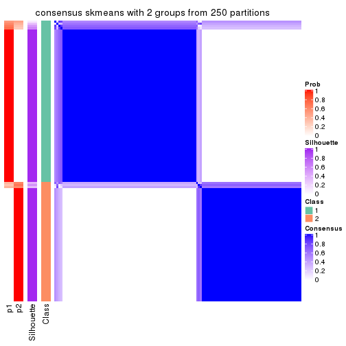</p>

</div>
<div id='tab-SD-skmeans-consensus-heatmap-2'>
<pre><code class="r">consensus_heatmap(res, k = 3)
</code></pre>

<p>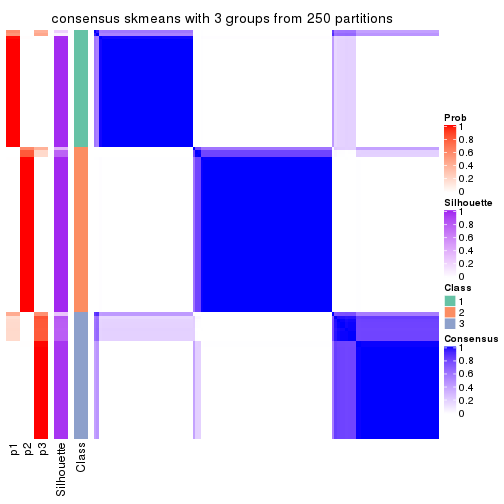</p>

</div>
<div id='tab-SD-skmeans-consensus-heatmap-3'>
<pre><code class="r">consensus_heatmap(res, k = 4)
</code></pre>

<p>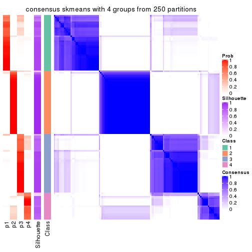</p>

</div>
<div id='tab-SD-skmeans-consensus-heatmap-4'>
<pre><code class="r">consensus_heatmap(res, k = 5)
</code></pre>

<p>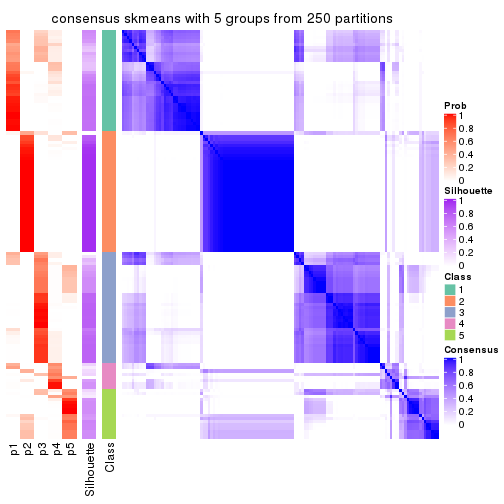</p>

</div>
<div id='tab-SD-skmeans-consensus-heatmap-5'>
<pre><code class="r">consensus_heatmap(res, k = 6)
</code></pre>

<p>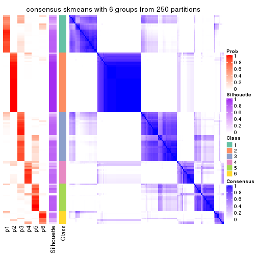</p>

</div>
</div>

Heatmaps for the membership of samples in all partitions to see how consistent they are:


<script>
$( function() {
	$( '#tabs-SD-skmeans-membership-heatmap' ).tabs();
} );
</script>
<div id='tabs-SD-skmeans-membership-heatmap'>
<ul>
<li><a href='#tab-SD-skmeans-membership-heatmap-1'>k = 2</a></li>
<li><a href='#tab-SD-skmeans-membership-heatmap-2'>k = 3</a></li>
<li><a href='#tab-SD-skmeans-membership-heatmap-3'>k = 4</a></li>
<li><a href='#tab-SD-skmeans-membership-heatmap-4'>k = 5</a></li>
<li><a href='#tab-SD-skmeans-membership-heatmap-5'>k = 6</a></li>
</ul>
<div id='tab-SD-skmeans-membership-heatmap-1'>
<pre><code class="r">membership_heatmap(res, k = 2)
</code></pre>

<p>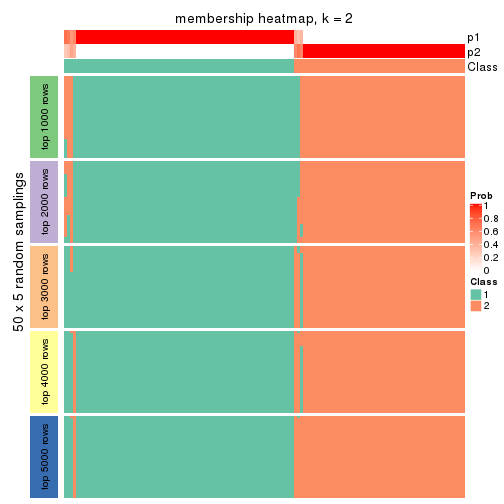</p>

</div>
<div id='tab-SD-skmeans-membership-heatmap-2'>
<pre><code class="r">membership_heatmap(res, k = 3)
</code></pre>

<p>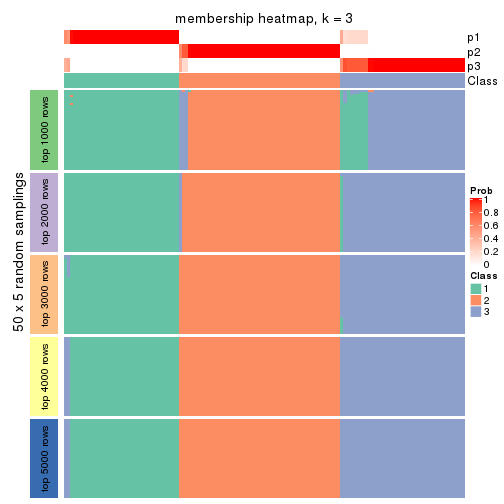</p>

</div>
<div id='tab-SD-skmeans-membership-heatmap-3'>
<pre><code class="r">membership_heatmap(res, k = 4)
</code></pre>

<p>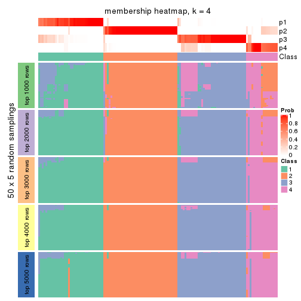</p>

</div>
<div id='tab-SD-skmeans-membership-heatmap-4'>
<pre><code class="r">membership_heatmap(res, k = 5)
</code></pre>

<p>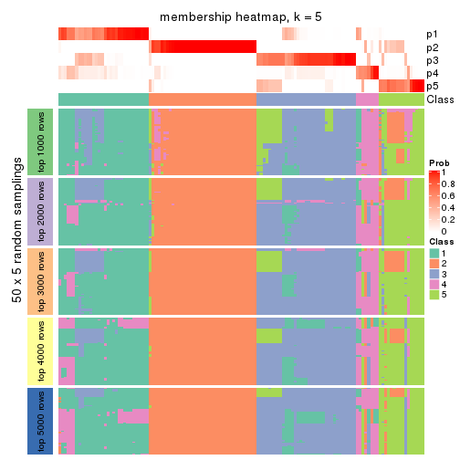</p>

</div>
<div id='tab-SD-skmeans-membership-heatmap-5'>
<pre><code class="r">membership_heatmap(res, k = 6)
</code></pre>

<p>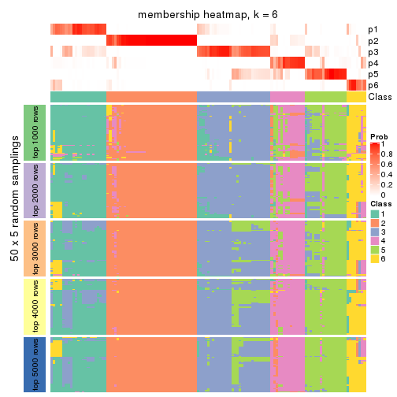</p>

</div>
</div>

As soon as we have had the classes for columns, we can look for signatures
which are significantly different between classes which can be candidate marks
for certain classes. Following are the heatmaps for signatures.


Signature heatmaps where rows are scaled:


<script>
$( function() {
	$( '#tabs-SD-skmeans-get-signatures' ).tabs();
} );
</script>
<div id='tabs-SD-skmeans-get-signatures'>
<ul>
<li><a href='#tab-SD-skmeans-get-signatures-1'>k = 2</a></li>
<li><a href='#tab-SD-skmeans-get-signatures-2'>k = 3</a></li>
<li><a href='#tab-SD-skmeans-get-signatures-3'>k = 4</a></li>
<li><a href='#tab-SD-skmeans-get-signatures-4'>k = 5</a></li>
<li><a href='#tab-SD-skmeans-get-signatures-5'>k = 6</a></li>
</ul>
<div id='tab-SD-skmeans-get-signatures-1'>
<pre><code class="r">get_signatures(res, k = 2)
</code></pre>

<p>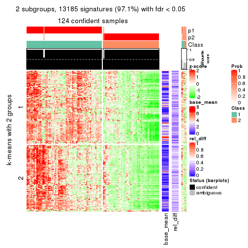</p>

</div>
<div id='tab-SD-skmeans-get-signatures-2'>
<pre><code class="r">get_signatures(res, k = 3)
</code></pre>

<p>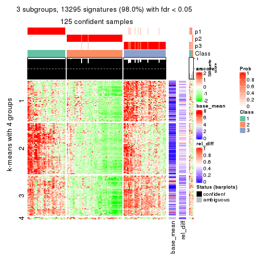</p>

</div>
<div id='tab-SD-skmeans-get-signatures-3'>
<pre><code class="r">get_signatures(res, k = 4)
</code></pre>

<p>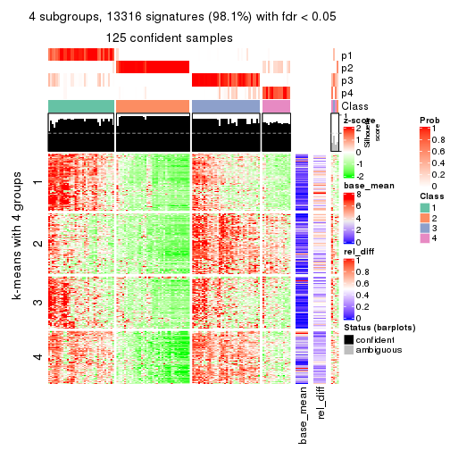</p>

</div>
<div id='tab-SD-skmeans-get-signatures-4'>
<pre><code class="r">get_signatures(res, k = 5)
</code></pre>

<p>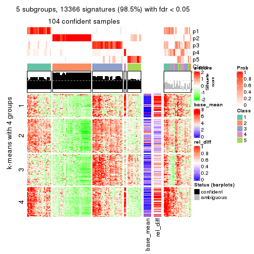</p>

</div>
<div id='tab-SD-skmeans-get-signatures-5'>
<pre><code class="r">get_signatures(res, k = 6)
</code></pre>

<p>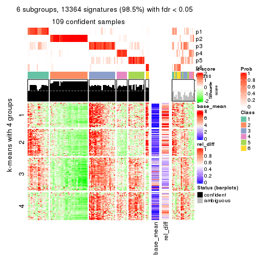</p>

</div>
</div>


Signature heatmaps where rows are not scaled:


<script>
$( function() {
	$( '#tabs-SD-skmeans-get-signatures-no-scale' ).tabs();
} );
</script>
<div id='tabs-SD-skmeans-get-signatures-no-scale'>
<ul>
<li><a href='#tab-SD-skmeans-get-signatures-no-scale-1'>k = 2</a></li>
<li><a href='#tab-SD-skmeans-get-signatures-no-scale-2'>k = 3</a></li>
<li><a href='#tab-SD-skmeans-get-signatures-no-scale-3'>k = 4</a></li>
<li><a href='#tab-SD-skmeans-get-signatures-no-scale-4'>k = 5</a></li>
<li><a href='#tab-SD-skmeans-get-signatures-no-scale-5'>k = 6</a></li>
</ul>
<div id='tab-SD-skmeans-get-signatures-no-scale-1'>
<pre><code class="r">get_signatures(res, k = 2, scale_rows = FALSE)
</code></pre>

<p>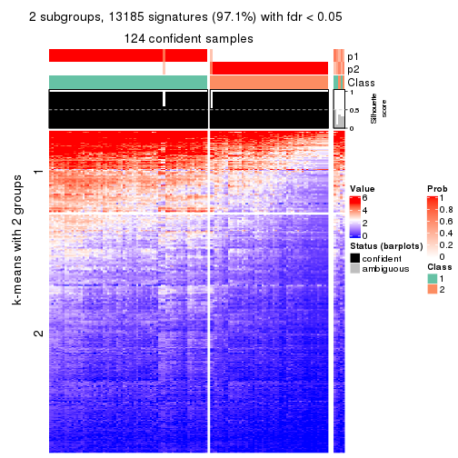</p>

</div>
<div id='tab-SD-skmeans-get-signatures-no-scale-2'>
<pre><code class="r">get_signatures(res, k = 3, scale_rows = FALSE)
</code></pre>

<p>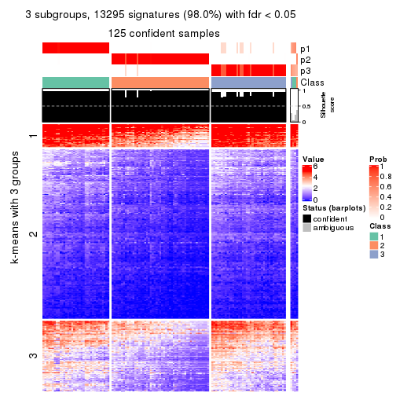</p>

</div>
<div id='tab-SD-skmeans-get-signatures-no-scale-3'>
<pre><code class="r">get_signatures(res, k = 4, scale_rows = FALSE)
</code></pre>

<p>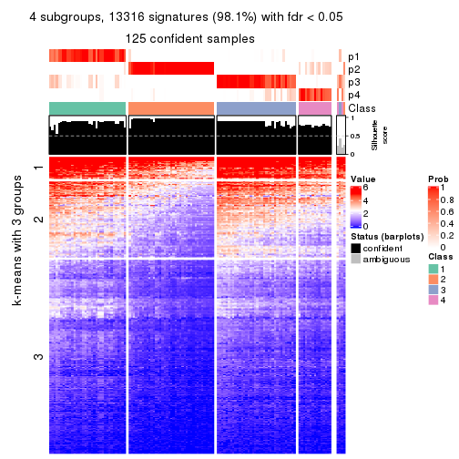</p>

</div>
<div id='tab-SD-skmeans-get-signatures-no-scale-4'>
<pre><code class="r">get_signatures(res, k = 5, scale_rows = FALSE)
</code></pre>

<p>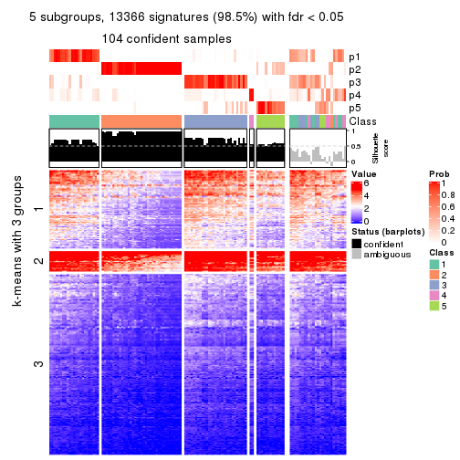</p>

</div>
<div id='tab-SD-skmeans-get-signatures-no-scale-5'>
<pre><code class="r">get_signatures(res, k = 6, scale_rows = FALSE)
</code></pre>

<p>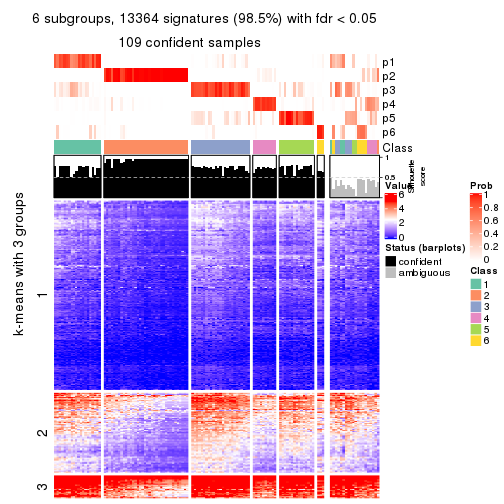</p>

</div>
</div>


Compare the overlap of signatures from different k:

```r
compare_signatures(res)
```

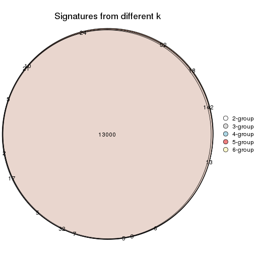

`get_signature()` returns a data frame invisibly. TO get the list of signatures, the function
call should be assigned to a variable explicitly. In following code, if `plot` argument is set
to `FALSE`, no heatmap is plotted while only the differential analysis is performed.

```r
# code only for demonstration
tb = get_signature(res, k = ..., plot = FALSE)
```

An example of the output of `tb` is:

```
#>   which_row         fdr    mean_1    mean_2 scaled_mean_1 scaled_mean_2 km
#> 1        38 0.042760348  8.373488  9.131774    -0.5533452     0.5164555  1
#> 2        40 0.018707592  7.106213  8.469186    -0.6173731     0.5762149  1
#> 3        55 0.019134737 10.221463 11.207825    -0.6159697     0.5749050  1
#> 4        59 0.006059896  5.921854  7.869574    -0.6899429     0.6439467  1
#> 5        60 0.018055526  8.928898 10.211722    -0.6204761     0.5791110  1
#> 6        98 0.009384629 15.714769 14.887706     0.6635654    -0.6193277  2
...
```

The columns in `tb` are:

1. `which_row`: row indices corresponding to the input matrix.
2. `fdr`: FDR for the differential test. 
3. `mean_x`: The mean value in group x.
4. `scaled_mean_x`: The mean value in group x after rows are scaled.
5. `km`: Row groups if k-means clustering is applied to rows.


UMAP plot which shows how samples are separated.


<script>
$( function() {
	$( '#tabs-SD-skmeans-dimension-reduction' ).tabs();
} );
</script>
<div id='tabs-SD-skmeans-dimension-reduction'>
<ul>
<li><a href='#tab-SD-skmeans-dimension-reduction-1'>k = 2</a></li>
<li><a href='#tab-SD-skmeans-dimension-reduction-2'>k = 3</a></li>
<li><a href='#tab-SD-skmeans-dimension-reduction-3'>k = 4</a></li>
<li><a href='#tab-SD-skmeans-dimension-reduction-4'>k = 5</a></li>
<li><a href='#tab-SD-skmeans-dimension-reduction-5'>k = 6</a></li>
</ul>
<div id='tab-SD-skmeans-dimension-reduction-1'>
<pre><code class="r">dimension_reduction(res, k = 2, method = &quot;UMAP&quot;)
</code></pre>

<p>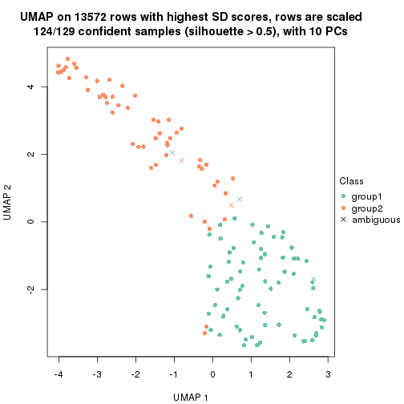</p>

</div>
<div id='tab-SD-skmeans-dimension-reduction-2'>
<pre><code class="r">dimension_reduction(res, k = 3, method = &quot;UMAP&quot;)
</code></pre>

<p>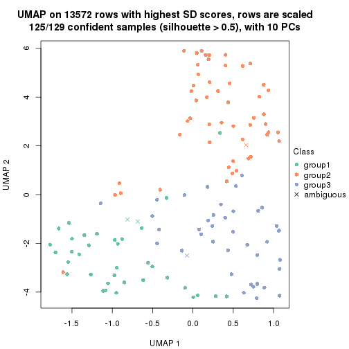</p>

</div>
<div id='tab-SD-skmeans-dimension-reduction-3'>
<pre><code class="r">dimension_reduction(res, k = 4, method = &quot;UMAP&quot;)
</code></pre>

<p>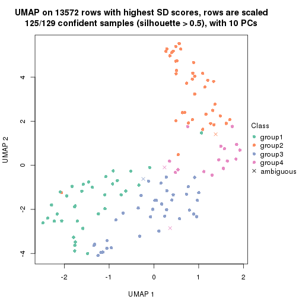</p>

</div>
<div id='tab-SD-skmeans-dimension-reduction-4'>
<pre><code class="r">dimension_reduction(res, k = 5, method = &quot;UMAP&quot;)
</code></pre>

<p>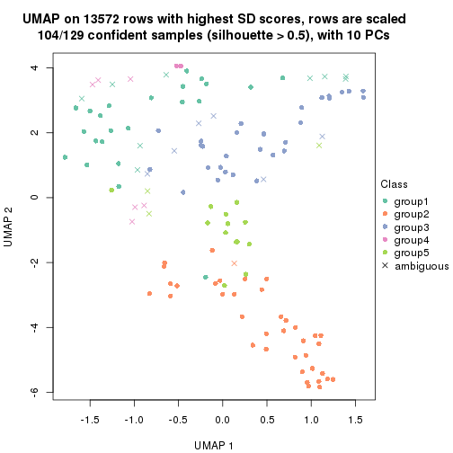</p>

</div>
<div id='tab-SD-skmeans-dimension-reduction-5'>
<pre><code class="r">dimension_reduction(res, k = 6, method = &quot;UMAP&quot;)
</code></pre>

<p>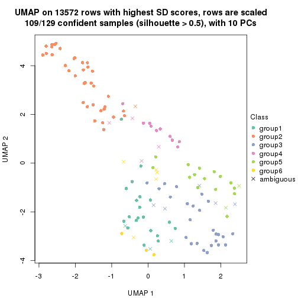</p>

</div>
</div>


Following heatmap shows how subgroups are split when increasing `k`:

```r
collect_classes(res)
```

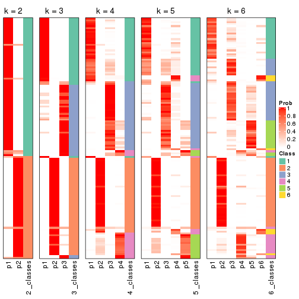


If matrix rows can be associated to genes, consider to use `GO_Enrichment(res,
...)` to perform function enrichment for the signature genes.


 

---------------------------------------------------


### SD:pam**


The object with results only for a single top-value method and a single partition method 
can be extracted as:

```r
res = res_list["SD", "pam"]
# you can also extract it by
# res = res_list["SD:pam"]
```

A summary of `res` and all the functions that can be applied to it:

```r
res
```

```
#> A 'ConsensusPartition' object with k = 2, 3, 4, 5, 6.
#>   On a matrix with 13572 rows and 129 columns.
#>   Top rows (1000, 2000, 3000, 4000, 5000) are extracted by 'SD' method.
#>   Subgroups are detected by 'pam' method.
#>   Performed in total 1250 partitions by row resampling.
#>   Best k for subgroups seems to be 2.
#> 
#> Following methods can be applied to this 'ConsensusPartition' object:
#>  [1] "cola_report"             "collect_classes"         "collect_plots"          
#>  [4] "collect_stats"           "colnames"                "compare_signatures"     
#>  [7] "consensus_heatmap"       "dimension_reduction"     "functional_enrichment"  
#> [10] "get_anno_col"            "get_anno"                "get_classes"            
#> [13] "get_consensus"           "get_matrix"              "get_membership"         
#> [16] "get_param"               "get_signatures"          "get_stats"              
#> [19] "is_best_k"               "is_stable_k"             "membership_heatmap"     
#> [22] "ncol"                    "nrow"                    "plot_ecdf"              
#> [25] "rownames"                "select_partition_number" "show"                   
#> [28] "suggest_best_k"          "test_to_known_factors"
```

`collect_plots()` function collects all the plots made from `res` for all `k` (number of partitions)
into one single page to provide an easy and fast comparison between different `k`.

```r
collect_plots(res)
```

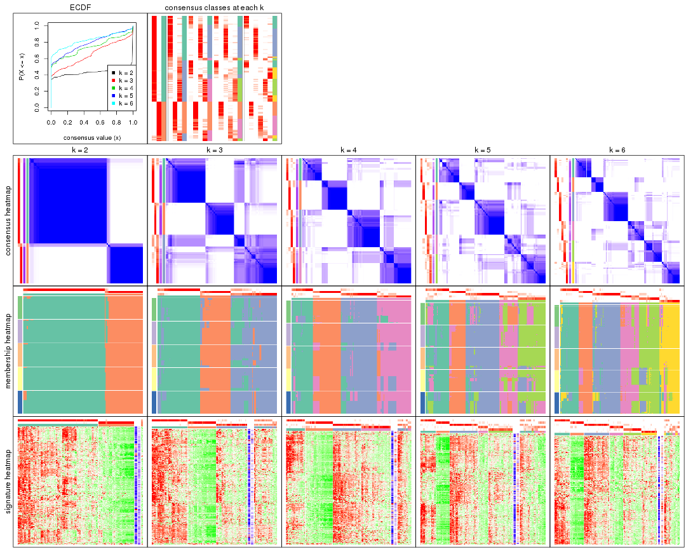

The plots are:

- The first row: a plot of the ECDF (Empirical cumulative distribution
  function) curves of the consensus matrix for each `k` and the heatmap of
  predicted classes for each `k`.
- The second row: heatmaps of the consensus matrix for each `k`.
- The third row: heatmaps of the membership matrix for each `k`.
- The fouth row: heatmaps of the signatures for each `k`.

All the plots in panels can be made by individual functions and they are
plotted later in this section.

`select_partition_number()` produces several plots showing different
statistics for choosing "optimized" `k`. There are following statistics:

- ECDF curves of the consensus matrix for each `k`;
- 1-PAC. [The PAC
  score](https://en.wikipedia.org/wiki/Consensus_clustering#Over-interpretation_potential_of_consensus_clustering)
  measures the proportion of the ambiguous subgrouping.
- Mean silhouette score.
- Concordance. The mean probability of fiting the consensus class ids in all
  partitions.
- Area increased. Denote $A_k$ as the area under the ECDF curve for current
  `k`, the area increased is defined as $A_k - A_{k-1}$.
- Rand index. The percent of pairs of samples that are both in a same cluster
  or both are not in a same cluster in the partition of k and k-1.
- Jaccard index. The ratio of pairs of samples are both in a same cluster in
  the partition of k and k-1 and the pairs of samples are both in a same
  cluster in the partition k or k-1.

The detailed explanations of these statistics can be found in [the cola
vignette](http://bioconductor.org/packages/devel/bioc/vignettes/cola/inst/doc/cola.html#toc_13).

Generally speaking, lower PAC score, higher mean silhouette score or higher
concordance corresponds to better partition. Rand index and Jaccard index
measure how similar the current partition is compared to partition with `k-1`.
If they are too similar, we won't accept `k` is better than `k-1`.

```r
select_partition_number(res)
```

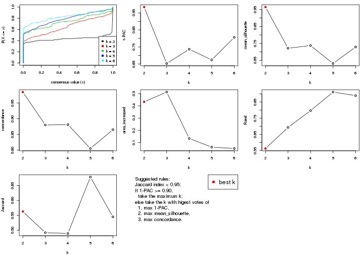

The numeric values for all these statistics can be obtained by `get_stats()`.

```r
get_stats(res)
```

```
#>   k 1-PAC mean_silhouette concordance area_increased  Rand Jaccard
#> 2 2 0.984           0.964       0.985         0.4331 0.563   0.563
#> 3 3 0.653           0.722       0.880         0.5127 0.693   0.492
#> 4 4 0.737           0.737       0.881         0.1333 0.797   0.489
#> 5 5 0.674           0.631       0.805         0.0624 0.912   0.678
#> 6 6 0.806           0.729       0.865         0.0511 0.890   0.545
```

`suggest_best_k()` suggests the best $k$ based on these statistics. The rules are as follows:

- All $k$ with Jaccard index larger than 0.95 are removed because the increase of
  the partition number does not provides enough extra information. If all $k$ are removed,
  the best $k$ is assigned by `NA`.
- For $k$ with 1-PAC larger than 0.9, the maximal $k$ is taken as the "best k". Other $k$ is called "optional k".
- If it does not fit the second rule. The $k$ with the highest vote of highest
  1-PAC, mean silhouette and concordance is taken as the "best k".

```r
suggest_best_k(res)
```

```
#> [1] 2
```


Following shows the table of the partitions (You need to click the **show/hide
code output** link to see it). The membership matrix (columns with name `p*`)
is inferred by
[`clue::cl_consensus()`](https://www.rdocumentation.org/link/cl_consensus?package=clue)
function with the `SE` method. Basically the value in the membership matrix
represents the probability to belong to a certain group. The finall class
label for an item is determined with the group with highest probability it
belongs to.

In `get_classes()` function, the entropy is calculated from the membership
matrix and the silhouette score is calculated from the consensus matrix.


<script>
$( function() {
	$( '#tabs-SD-pam-get-classes' ).tabs();
} );
</script>
<div id='tabs-SD-pam-get-classes'>
<ul>
<li><a href='#tab-SD-pam-get-classes-1'>k = 2</a></li>
<li><a href='#tab-SD-pam-get-classes-2'>k = 3</a></li>
<li><a href='#tab-SD-pam-get-classes-3'>k = 4</a></li>
<li><a href='#tab-SD-pam-get-classes-4'>k = 5</a></li>
<li><a href='#tab-SD-pam-get-classes-5'>k = 6</a></li>
</ul>

<div id='tab-SD-pam-get-classes-1'>
<p><a id='tab-SD-pam-get-classes-1-a' style='color:#0366d6' href='#'>show/hide code output</a></p>
<pre><code class="r">cbind(get_classes(res, k = 2), get_membership(res, k = 2))
</code></pre>

<pre><code>#&gt;            class entropy silhouette    p1    p2
#&gt; SRR1656463     2  0.0000      0.967 0.000 1.000
#&gt; SRR1656464     1  0.0000      0.992 1.000 0.000
#&gt; SRR1656462     1  0.0000      0.992 1.000 0.000
#&gt; SRR1656465     1  0.0000      0.992 1.000 0.000
#&gt; SRR1656467     2  0.0000      0.967 0.000 1.000
#&gt; SRR1656466     1  0.0000      0.992 1.000 0.000
#&gt; SRR1656468     1  0.0672      0.986 0.992 0.008
#&gt; SRR1656472     1  0.0000      0.992 1.000 0.000
#&gt; SRR1656471     1  0.0000      0.992 1.000 0.000
#&gt; SRR1656470     2  0.0000      0.967 0.000 1.000
#&gt; SRR1656469     1  0.0000      0.992 1.000 0.000
#&gt; SRR1656473     2  0.0000      0.967 0.000 1.000
#&gt; SRR1656474     2  0.0000      0.967 0.000 1.000
#&gt; SRR1656475     2  0.0000      0.967 0.000 1.000
#&gt; SRR1656478     1  0.0000      0.992 1.000 0.000
#&gt; SRR1656477     1  0.2043      0.964 0.968 0.032
#&gt; SRR1656479     1  0.0000      0.992 1.000 0.000
#&gt; SRR1656480     2  0.0000      0.967 0.000 1.000
#&gt; SRR1656476     2  0.0000      0.967 0.000 1.000
#&gt; SRR1656481     1  0.1633      0.972 0.976 0.024
#&gt; SRR1656482     2  0.0000      0.967 0.000 1.000
#&gt; SRR1656483     2  0.0000      0.967 0.000 1.000
#&gt; SRR1656485     1  0.0000      0.992 1.000 0.000
#&gt; SRR1656487     1  0.0000      0.992 1.000 0.000
#&gt; SRR1656486     1  0.0000      0.992 1.000 0.000
#&gt; SRR1656488     1  0.0000      0.992 1.000 0.000
#&gt; SRR1656484     1  0.0000      0.992 1.000 0.000
#&gt; SRR1656489     1  0.0000      0.992 1.000 0.000
#&gt; SRR1656491     1  0.0000      0.992 1.000 0.000
#&gt; SRR1656490     1  0.0000      0.992 1.000 0.000
#&gt; SRR1656492     1  0.0000      0.992 1.000 0.000
#&gt; SRR1656493     1  0.0000      0.992 1.000 0.000
#&gt; SRR1656495     1  0.5059      0.875 0.888 0.112
#&gt; SRR1656496     1  0.0000      0.992 1.000 0.000
#&gt; SRR1656494     2  0.0000      0.967 0.000 1.000
#&gt; SRR1656497     2  0.0000      0.967 0.000 1.000
#&gt; SRR1656499     1  0.0000      0.992 1.000 0.000
#&gt; SRR1656500     1  0.0000      0.992 1.000 0.000
#&gt; SRR1656501     1  0.0000      0.992 1.000 0.000
#&gt; SRR1656498     1  0.0000      0.992 1.000 0.000
#&gt; SRR1656504     2  0.0000      0.967 0.000 1.000
#&gt; SRR1656502     1  0.0000      0.992 1.000 0.000
#&gt; SRR1656503     1  0.0000      0.992 1.000 0.000
#&gt; SRR1656507     1  0.0000      0.992 1.000 0.000
#&gt; SRR1656508     1  0.0000      0.992 1.000 0.000
#&gt; SRR1656505     2  0.9850      0.255 0.428 0.572
#&gt; SRR1656506     1  0.0000      0.992 1.000 0.000
#&gt; SRR1656509     1  0.0000      0.992 1.000 0.000
#&gt; SRR1656510     1  0.0000      0.992 1.000 0.000
#&gt; SRR1656511     2  0.6247      0.803 0.156 0.844
#&gt; SRR1656513     2  0.0000      0.967 0.000 1.000
#&gt; SRR1656512     2  0.0000      0.967 0.000 1.000
#&gt; SRR1656514     1  0.0000      0.992 1.000 0.000
#&gt; SRR1656515     2  0.0000      0.967 0.000 1.000
#&gt; SRR1656516     1  0.0000      0.992 1.000 0.000
#&gt; SRR1656518     1  0.0000      0.992 1.000 0.000
#&gt; SRR1656517     1  0.0000      0.992 1.000 0.000
#&gt; SRR1656519     1  0.0000      0.992 1.000 0.000
#&gt; SRR1656522     1  0.0000      0.992 1.000 0.000
#&gt; SRR1656523     1  0.4939      0.880 0.892 0.108
#&gt; SRR1656521     2  0.0000      0.967 0.000 1.000
#&gt; SRR1656520     1  0.0000      0.992 1.000 0.000
#&gt; SRR1656524     1  0.0000      0.992 1.000 0.000
#&gt; SRR1656525     1  0.0000      0.992 1.000 0.000
#&gt; SRR1656526     2  0.0000      0.967 0.000 1.000
#&gt; SRR1656527     2  0.0000      0.967 0.000 1.000
#&gt; SRR1656530     1  0.0000      0.992 1.000 0.000
#&gt; SRR1656529     1  0.0000      0.992 1.000 0.000
#&gt; SRR1656531     1  0.0000      0.992 1.000 0.000
#&gt; SRR1656528     1  0.0000      0.992 1.000 0.000
#&gt; SRR1656534     1  0.0000      0.992 1.000 0.000
#&gt; SRR1656533     1  0.0000      0.992 1.000 0.000
#&gt; SRR1656536     1  0.0000      0.992 1.000 0.000
#&gt; SRR1656532     2  0.0000      0.967 0.000 1.000
#&gt; SRR1656537     1  0.0000      0.992 1.000 0.000
#&gt; SRR1656538     1  0.0000      0.992 1.000 0.000
#&gt; SRR1656535     2  0.0000      0.967 0.000 1.000
#&gt; SRR1656539     1  0.0000      0.992 1.000 0.000
#&gt; SRR1656544     1  0.0000      0.992 1.000 0.000
#&gt; SRR1656542     1  0.0000      0.992 1.000 0.000
#&gt; SRR1656543     1  0.0000      0.992 1.000 0.000
#&gt; SRR1656545     2  0.0000      0.967 0.000 1.000
#&gt; SRR1656540     1  0.0000      0.992 1.000 0.000
#&gt; SRR1656546     1  0.0000      0.992 1.000 0.000
#&gt; SRR1656541     2  0.0000      0.967 0.000 1.000
#&gt; SRR1656547     2  0.0000      0.967 0.000 1.000
#&gt; SRR1656548     1  0.0000      0.992 1.000 0.000
#&gt; SRR1656549     1  0.0000      0.992 1.000 0.000
#&gt; SRR1656551     1  0.0000      0.992 1.000 0.000
#&gt; SRR1656553     1  0.0000      0.992 1.000 0.000
#&gt; SRR1656550     2  0.0000      0.967 0.000 1.000
#&gt; SRR1656552     2  0.9608      0.397 0.384 0.616
#&gt; SRR1656554     1  0.0000      0.992 1.000 0.000
#&gt; SRR1656555     1  0.0000      0.992 1.000 0.000
#&gt; SRR1656556     1  0.1633      0.972 0.976 0.024
#&gt; SRR1656557     1  0.0000      0.992 1.000 0.000
#&gt; SRR1656558     1  0.0000      0.992 1.000 0.000
#&gt; SRR1656559     1  0.0000      0.992 1.000 0.000
#&gt; SRR1656560     1  0.0000      0.992 1.000 0.000
#&gt; SRR1656561     1  0.0000      0.992 1.000 0.000
#&gt; SRR1656562     1  0.5178      0.870 0.884 0.116
#&gt; SRR1656563     1  0.0000      0.992 1.000 0.000
#&gt; SRR1656564     2  0.0000      0.967 0.000 1.000
#&gt; SRR1656565     2  0.0000      0.967 0.000 1.000
#&gt; SRR1656566     1  0.0000      0.992 1.000 0.000
#&gt; SRR1656568     2  0.0000      0.967 0.000 1.000
#&gt; SRR1656567     2  0.0000      0.967 0.000 1.000
#&gt; SRR1656569     1  0.0000      0.992 1.000 0.000
#&gt; SRR1656570     1  0.0000      0.992 1.000 0.000
#&gt; SRR1656571     2  0.0000      0.967 0.000 1.000
#&gt; SRR1656573     1  0.0000      0.992 1.000 0.000
#&gt; SRR1656572     2  0.9209      0.509 0.336 0.664
#&gt; SRR1656574     1  0.0000      0.992 1.000 0.000
#&gt; SRR1656575     1  0.0000      0.992 1.000 0.000
#&gt; SRR1656576     2  0.0000      0.967 0.000 1.000
#&gt; SRR1656578     2  0.0000      0.967 0.000 1.000
#&gt; SRR1656577     1  0.0000      0.992 1.000 0.000
#&gt; SRR1656579     2  0.0000      0.967 0.000 1.000
#&gt; SRR1656580     1  0.0000      0.992 1.000 0.000
#&gt; SRR1656581     1  0.0938      0.982 0.988 0.012
#&gt; SRR1656582     2  0.0000      0.967 0.000 1.000
#&gt; SRR1656585     1  0.0938      0.982 0.988 0.012
#&gt; SRR1656584     1  0.0000      0.992 1.000 0.000
#&gt; SRR1656583     1  0.3733      0.924 0.928 0.072
#&gt; SRR1656586     2  0.0000      0.967 0.000 1.000
#&gt; SRR1656587     1  0.5519      0.856 0.872 0.128
#&gt; SRR1656588     2  0.0000      0.967 0.000 1.000
#&gt; SRR1656589     2  0.0000      0.967 0.000 1.000
#&gt; SRR1656590     1  0.0000      0.992 1.000 0.000
</code></pre>

<script>
$('#tab-SD-pam-get-classes-1-a').parent().next().next().hide();
$('#tab-SD-pam-get-classes-1-a').click(function(){
  $('#tab-SD-pam-get-classes-1-a').parent().next().next().toggle();
  return(false);
});
</script>
</div>

<div id='tab-SD-pam-get-classes-2'>
<p><a id='tab-SD-pam-get-classes-2-a' style='color:#0366d6' href='#'>show/hide code output</a></p>
<pre><code class="r">cbind(get_classes(res, k = 3), get_membership(res, k = 3))
</code></pre>

<pre><code>#&gt;            class entropy silhouette    p1    p2    p3
#&gt; SRR1656463     2  0.0000     0.9354 0.000 1.000 0.000
#&gt; SRR1656464     1  0.0000     0.9022 1.000 0.000 0.000
#&gt; SRR1656462     1  0.0000     0.9022 1.000 0.000 0.000
#&gt; SRR1656465     3  0.5948     0.4283 0.360 0.000 0.640
#&gt; SRR1656467     2  0.1529     0.9185 0.000 0.960 0.040
#&gt; SRR1656466     1  0.6111     0.2450 0.604 0.000 0.396
#&gt; SRR1656468     3  0.0000     0.7499 0.000 0.000 1.000
#&gt; SRR1656472     3  0.2165     0.7422 0.064 0.000 0.936
#&gt; SRR1656471     1  0.6260     0.0738 0.552 0.000 0.448
#&gt; SRR1656470     2  0.0000     0.9354 0.000 1.000 0.000
#&gt; SRR1656469     3  0.5560     0.5570 0.300 0.000 0.700
#&gt; SRR1656473     2  0.0000     0.9354 0.000 1.000 0.000
#&gt; SRR1656474     2  0.0000     0.9354 0.000 1.000 0.000
#&gt; SRR1656475     2  0.0000     0.9354 0.000 1.000 0.000
#&gt; SRR1656478     3  0.6307     0.2366 0.488 0.000 0.512
#&gt; SRR1656477     3  0.0000     0.7499 0.000 0.000 1.000
#&gt; SRR1656479     3  0.6225     0.3609 0.432 0.000 0.568
#&gt; SRR1656480     3  0.3619     0.6406 0.000 0.136 0.864
#&gt; SRR1656476     2  0.0000     0.9354 0.000 1.000 0.000
#&gt; SRR1656481     3  0.0000     0.7499 0.000 0.000 1.000
#&gt; SRR1656482     2  0.0000     0.9354 0.000 1.000 0.000
#&gt; SRR1656483     2  0.0000     0.9354 0.000 1.000 0.000
#&gt; SRR1656485     1  0.0000     0.9022 1.000 0.000 0.000
#&gt; SRR1656487     1  0.1411     0.8687 0.964 0.000 0.036
#&gt; SRR1656486     3  0.6307     0.2366 0.488 0.000 0.512
#&gt; SRR1656488     1  0.0000     0.9022 1.000 0.000 0.000
#&gt; SRR1656484     3  0.6307     0.2366 0.488 0.000 0.512
#&gt; SRR1656489     1  0.0000     0.9022 1.000 0.000 0.000
#&gt; SRR1656491     3  0.1529     0.7478 0.040 0.000 0.960
#&gt; SRR1656490     3  0.2448     0.7415 0.076 0.000 0.924
#&gt; SRR1656492     1  0.5733     0.3782 0.676 0.000 0.324
#&gt; SRR1656493     3  0.1860     0.7463 0.052 0.000 0.948
#&gt; SRR1656495     3  0.4784     0.5975 0.004 0.200 0.796
#&gt; SRR1656496     3  0.6140     0.4140 0.404 0.000 0.596
#&gt; SRR1656494     2  0.5529     0.6547 0.000 0.704 0.296
#&gt; SRR1656497     2  0.0000     0.9354 0.000 1.000 0.000
#&gt; SRR1656499     1  0.0000     0.9022 1.000 0.000 0.000
#&gt; SRR1656500     1  0.0000     0.9022 1.000 0.000 0.000
#&gt; SRR1656501     3  0.6308     0.2261 0.492 0.000 0.508
#&gt; SRR1656498     1  0.0000     0.9022 1.000 0.000 0.000
#&gt; SRR1656504     2  0.0000     0.9354 0.000 1.000 0.000
#&gt; SRR1656502     3  0.1529     0.7478 0.040 0.000 0.960
#&gt; SRR1656503     1  0.6295    -0.1491 0.528 0.000 0.472
#&gt; SRR1656507     1  0.5397     0.4856 0.720 0.000 0.280
#&gt; SRR1656508     1  0.0000     0.9022 1.000 0.000 0.000
#&gt; SRR1656505     3  0.0000     0.7499 0.000 0.000 1.000
#&gt; SRR1656506     1  0.0000     0.9022 1.000 0.000 0.000
#&gt; SRR1656509     3  0.5397     0.5506 0.280 0.000 0.720
#&gt; SRR1656510     3  0.4178     0.6872 0.172 0.000 0.828
#&gt; SRR1656511     3  0.6095     0.1806 0.000 0.392 0.608
#&gt; SRR1656513     2  0.2959     0.8811 0.000 0.900 0.100
#&gt; SRR1656512     2  0.0000     0.9354 0.000 1.000 0.000
#&gt; SRR1656514     1  0.0000     0.9022 1.000 0.000 0.000
#&gt; SRR1656515     2  0.1964     0.9108 0.000 0.944 0.056
#&gt; SRR1656516     1  0.2625     0.8162 0.916 0.000 0.084
#&gt; SRR1656518     3  0.6307     0.2366 0.488 0.000 0.512
#&gt; SRR1656517     1  0.0000     0.9022 1.000 0.000 0.000
#&gt; SRR1656519     1  0.0000     0.9022 1.000 0.000 0.000
#&gt; SRR1656522     1  0.0000     0.9022 1.000 0.000 0.000
#&gt; SRR1656523     3  0.0000     0.7499 0.000 0.000 1.000
#&gt; SRR1656521     2  0.0000     0.9354 0.000 1.000 0.000
#&gt; SRR1656520     1  0.0000     0.9022 1.000 0.000 0.000
#&gt; SRR1656524     3  0.3340     0.7193 0.120 0.000 0.880
#&gt; SRR1656525     1  0.0000     0.9022 1.000 0.000 0.000
#&gt; SRR1656526     2  0.0892     0.9285 0.000 0.980 0.020
#&gt; SRR1656527     2  0.0747     0.9295 0.000 0.984 0.016
#&gt; SRR1656530     1  0.4555     0.6750 0.800 0.000 0.200
#&gt; SRR1656529     1  0.6307    -0.0645 0.512 0.000 0.488
#&gt; SRR1656531     1  0.0592     0.8919 0.988 0.000 0.012
#&gt; SRR1656528     1  0.0000     0.9022 1.000 0.000 0.000
#&gt; SRR1656534     1  0.0000     0.9022 1.000 0.000 0.000
#&gt; SRR1656533     1  0.0000     0.9022 1.000 0.000 0.000
#&gt; SRR1656536     3  0.0000     0.7499 0.000 0.000 1.000
#&gt; SRR1656532     2  0.4235     0.8111 0.000 0.824 0.176
#&gt; SRR1656537     3  0.6307     0.2366 0.488 0.000 0.512
#&gt; SRR1656538     1  0.0000     0.9022 1.000 0.000 0.000
#&gt; SRR1656535     2  0.0000     0.9354 0.000 1.000 0.000
#&gt; SRR1656539     3  0.5397     0.5506 0.280 0.000 0.720
#&gt; SRR1656544     1  0.0000     0.9022 1.000 0.000 0.000
#&gt; SRR1656542     1  0.0000     0.9022 1.000 0.000 0.000
#&gt; SRR1656543     1  0.0000     0.9022 1.000 0.000 0.000
#&gt; SRR1656545     2  0.0000     0.9354 0.000 1.000 0.000
#&gt; SRR1656540     1  0.1529     0.8649 0.960 0.000 0.040
#&gt; SRR1656546     3  0.4555     0.6695 0.200 0.000 0.800
#&gt; SRR1656541     2  0.3267     0.8691 0.000 0.884 0.116
#&gt; SRR1656547     3  0.0000     0.7499 0.000 0.000 1.000
#&gt; SRR1656548     1  0.0000     0.9022 1.000 0.000 0.000
#&gt; SRR1656549     3  0.5905     0.4933 0.352 0.000 0.648
#&gt; SRR1656551     3  0.0000     0.7499 0.000 0.000 1.000
#&gt; SRR1656553     1  0.0000     0.9022 1.000 0.000 0.000
#&gt; SRR1656550     3  0.4555     0.5853 0.000 0.200 0.800
#&gt; SRR1656552     3  0.0000     0.7499 0.000 0.000 1.000
#&gt; SRR1656554     3  0.5465     0.5418 0.288 0.000 0.712
#&gt; SRR1656555     3  0.0000     0.7499 0.000 0.000 1.000
#&gt; SRR1656556     3  0.5431     0.5408 0.284 0.000 0.716
#&gt; SRR1656557     1  0.0000     0.9022 1.000 0.000 0.000
#&gt; SRR1656558     3  0.6307     0.2366 0.488 0.000 0.512
#&gt; SRR1656559     1  0.0000     0.9022 1.000 0.000 0.000
#&gt; SRR1656560     1  0.2625     0.8144 0.916 0.000 0.084
#&gt; SRR1656561     1  0.0000     0.9022 1.000 0.000 0.000
#&gt; SRR1656562     3  0.0000     0.7499 0.000 0.000 1.000
#&gt; SRR1656563     1  0.0000     0.9022 1.000 0.000 0.000
#&gt; SRR1656564     2  0.0000     0.9354 0.000 1.000 0.000
#&gt; SRR1656565     2  0.4235     0.8111 0.000 0.824 0.176
#&gt; SRR1656566     3  0.6168     0.3988 0.412 0.000 0.588
#&gt; SRR1656568     2  0.0000     0.9354 0.000 1.000 0.000
#&gt; SRR1656567     2  0.6267     0.3433 0.000 0.548 0.452
#&gt; SRR1656569     3  0.5216     0.6167 0.260 0.000 0.740
#&gt; SRR1656570     1  0.2537     0.8211 0.920 0.000 0.080
#&gt; SRR1656571     2  0.0000     0.9354 0.000 1.000 0.000
#&gt; SRR1656573     3  0.0237     0.7504 0.004 0.000 0.996
#&gt; SRR1656572     3  0.5098     0.4778 0.000 0.248 0.752
#&gt; SRR1656574     1  0.0000     0.9022 1.000 0.000 0.000
#&gt; SRR1656575     1  0.6045     0.1877 0.620 0.000 0.380
#&gt; SRR1656576     2  0.6235     0.3912 0.000 0.564 0.436
#&gt; SRR1656578     2  0.1643     0.9147 0.000 0.956 0.044
#&gt; SRR1656577     1  0.0000     0.9022 1.000 0.000 0.000
#&gt; SRR1656579     3  0.6140     0.0516 0.000 0.404 0.596
#&gt; SRR1656580     1  0.0000     0.9022 1.000 0.000 0.000
#&gt; SRR1656581     3  0.0000     0.7499 0.000 0.000 1.000
#&gt; SRR1656582     2  0.0000     0.9354 0.000 1.000 0.000
#&gt; SRR1656585     3  0.0000     0.7499 0.000 0.000 1.000
#&gt; SRR1656584     3  0.6307     0.2366 0.488 0.000 0.512
#&gt; SRR1656583     3  0.0000     0.7499 0.000 0.000 1.000
#&gt; SRR1656586     2  0.0000     0.9354 0.000 1.000 0.000
#&gt; SRR1656587     3  0.0000     0.7499 0.000 0.000 1.000
#&gt; SRR1656588     2  0.2959     0.8810 0.000 0.900 0.100
#&gt; SRR1656589     2  0.0000     0.9354 0.000 1.000 0.000
#&gt; SRR1656590     3  0.4452     0.6801 0.192 0.000 0.808
</code></pre>

<script>
$('#tab-SD-pam-get-classes-2-a').parent().next().next().hide();
$('#tab-SD-pam-get-classes-2-a').click(function(){
  $('#tab-SD-pam-get-classes-2-a').parent().next().next().toggle();
  return(false);
});
</script>
</div>

<div id='tab-SD-pam-get-classes-3'>
<p><a id='tab-SD-pam-get-classes-3-a' style='color:#0366d6' href='#'>show/hide code output</a></p>
<pre><code class="r">cbind(get_classes(res, k = 4), get_membership(res, k = 4))
</code></pre>

<pre><code>#&gt;            class entropy silhouette    p1    p2    p3    p4
#&gt; SRR1656463     2  0.0000     0.9056 0.000 1.000 0.000 0.000
#&gt; SRR1656464     1  0.3024     0.7898 0.852 0.000 0.148 0.000
#&gt; SRR1656462     3  0.0000     0.8707 0.000 0.000 1.000 0.000
#&gt; SRR1656465     4  0.4500     0.5915 0.000 0.000 0.316 0.684
#&gt; SRR1656467     2  0.4522     0.6271 0.000 0.680 0.000 0.320
#&gt; SRR1656466     4  0.4500     0.5915 0.000 0.000 0.316 0.684
#&gt; SRR1656468     4  0.0000     0.7931 0.000 0.000 0.000 1.000
#&gt; SRR1656472     1  0.3157     0.7630 0.852 0.000 0.004 0.144
#&gt; SRR1656471     4  0.4500     0.5915 0.000 0.000 0.316 0.684
#&gt; SRR1656470     2  0.0000     0.9056 0.000 1.000 0.000 0.000
#&gt; SRR1656469     4  0.4677     0.5901 0.004 0.000 0.316 0.680
#&gt; SRR1656473     2  0.0000     0.9056 0.000 1.000 0.000 0.000
#&gt; SRR1656474     2  0.0000     0.9056 0.000 1.000 0.000 0.000
#&gt; SRR1656475     2  0.0000     0.9056 0.000 1.000 0.000 0.000
#&gt; SRR1656478     1  0.0000     0.8403 1.000 0.000 0.000 0.000
#&gt; SRR1656477     4  0.0000     0.7931 0.000 0.000 0.000 1.000
#&gt; SRR1656479     3  0.3754     0.7741 0.064 0.000 0.852 0.084
#&gt; SRR1656480     4  0.0000     0.7931 0.000 0.000 0.000 1.000
#&gt; SRR1656476     2  0.0000     0.9056 0.000 1.000 0.000 0.000
#&gt; SRR1656481     4  0.0000     0.7931 0.000 0.000 0.000 1.000
#&gt; SRR1656482     2  0.0000     0.9056 0.000 1.000 0.000 0.000
#&gt; SRR1656483     2  0.0000     0.9056 0.000 1.000 0.000 0.000
#&gt; SRR1656485     3  0.0000     0.8707 0.000 0.000 1.000 0.000
#&gt; SRR1656487     3  0.2081     0.8195 0.000 0.000 0.916 0.084
#&gt; SRR1656486     3  0.3024     0.7754 0.148 0.000 0.852 0.000
#&gt; SRR1656488     3  0.0000     0.8707 0.000 0.000 1.000 0.000
#&gt; SRR1656484     1  0.4500     0.4604 0.684 0.000 0.316 0.000
#&gt; SRR1656489     3  0.2081     0.8078 0.084 0.000 0.916 0.000
#&gt; SRR1656491     4  0.6033     0.5542 0.064 0.000 0.316 0.620
#&gt; SRR1656490     4  0.5532     0.6585 0.068 0.000 0.228 0.704
#&gt; SRR1656492     3  0.0469     0.8654 0.012 0.000 0.988 0.000
#&gt; SRR1656493     1  0.0000     0.8403 1.000 0.000 0.000 0.000
#&gt; SRR1656495     1  0.4356     0.5137 0.708 0.000 0.000 0.292
#&gt; SRR1656496     3  0.6013     0.3530 0.064 0.000 0.624 0.312
#&gt; SRR1656494     4  0.4843     0.1056 0.000 0.396 0.000 0.604
#&gt; SRR1656497     2  0.0000     0.9056 0.000 1.000 0.000 0.000
#&gt; SRR1656499     3  0.0000     0.8707 0.000 0.000 1.000 0.000
#&gt; SRR1656500     3  0.0000     0.8707 0.000 0.000 1.000 0.000
#&gt; SRR1656501     3  0.2973     0.7793 0.144 0.000 0.856 0.000
#&gt; SRR1656498     1  0.1716     0.8302 0.936 0.000 0.064 0.000
#&gt; SRR1656504     2  0.0000     0.9056 0.000 1.000 0.000 0.000
#&gt; SRR1656502     1  0.2281     0.8054 0.904 0.000 0.000 0.096
#&gt; SRR1656503     3  0.2081     0.8195 0.000 0.000 0.916 0.084
#&gt; SRR1656507     1  0.4072     0.6441 0.748 0.000 0.252 0.000
#&gt; SRR1656508     1  0.3024     0.7898 0.852 0.000 0.148 0.000
#&gt; SRR1656505     4  0.0000     0.7931 0.000 0.000 0.000 1.000
#&gt; SRR1656506     3  0.2081     0.8195 0.000 0.000 0.916 0.084
#&gt; SRR1656509     4  0.4677     0.5901 0.004 0.000 0.316 0.680
#&gt; SRR1656510     4  0.1716     0.7664 0.064 0.000 0.000 0.936
#&gt; SRR1656511     4  0.6376    -0.0845 0.064 0.432 0.000 0.504
#&gt; SRR1656513     2  0.4522     0.6271 0.000 0.680 0.000 0.320
#&gt; SRR1656512     2  0.0000     0.9056 0.000 1.000 0.000 0.000
#&gt; SRR1656514     1  0.4643     0.5179 0.656 0.000 0.344 0.000
#&gt; SRR1656515     2  0.4643     0.5935 0.000 0.656 0.000 0.344
#&gt; SRR1656516     3  0.2081     0.8232 0.084 0.000 0.916 0.000
#&gt; SRR1656518     3  0.4994     0.1736 0.480 0.000 0.520 0.000
#&gt; SRR1656517     1  0.3024     0.7803 0.852 0.000 0.148 0.000
#&gt; SRR1656519     3  0.0000     0.8707 0.000 0.000 1.000 0.000
#&gt; SRR1656522     3  0.4406     0.4917 0.300 0.000 0.700 0.000
#&gt; SRR1656523     4  0.1716     0.7664 0.064 0.000 0.000 0.936
#&gt; SRR1656521     2  0.0000     0.9056 0.000 1.000 0.000 0.000
#&gt; SRR1656520     3  0.0000     0.8707 0.000 0.000 1.000 0.000
#&gt; SRR1656524     1  0.0000     0.8403 1.000 0.000 0.000 0.000
#&gt; SRR1656525     3  0.0000     0.8707 0.000 0.000 1.000 0.000
#&gt; SRR1656526     2  0.1302     0.8803 0.000 0.956 0.000 0.044
#&gt; SRR1656527     2  0.0188     0.9038 0.000 0.996 0.000 0.004
#&gt; SRR1656530     3  0.5558     0.3723 0.036 0.000 0.640 0.324
#&gt; SRR1656529     4  0.4522     0.5865 0.000 0.000 0.320 0.680
#&gt; SRR1656531     1  0.3024     0.7898 0.852 0.000 0.148 0.000
#&gt; SRR1656528     3  0.0000     0.8707 0.000 0.000 1.000 0.000
#&gt; SRR1656534     3  0.0000     0.8707 0.000 0.000 1.000 0.000
#&gt; SRR1656533     1  0.1716     0.8302 0.936 0.000 0.064 0.000
#&gt; SRR1656536     4  0.0000     0.7931 0.000 0.000 0.000 1.000
#&gt; SRR1656532     2  0.5538     0.5897 0.036 0.644 0.000 0.320
#&gt; SRR1656537     1  0.0000     0.8403 1.000 0.000 0.000 0.000
#&gt; SRR1656538     3  0.0000     0.8707 0.000 0.000 1.000 0.000
#&gt; SRR1656535     2  0.0188     0.9038 0.000 0.996 0.000 0.004
#&gt; SRR1656539     4  0.4677     0.5901 0.004 0.000 0.316 0.680
#&gt; SRR1656544     3  0.0000     0.8707 0.000 0.000 1.000 0.000
#&gt; SRR1656542     3  0.0000     0.8707 0.000 0.000 1.000 0.000
#&gt; SRR1656543     3  0.0000     0.8707 0.000 0.000 1.000 0.000
#&gt; SRR1656545     2  0.0000     0.9056 0.000 1.000 0.000 0.000
#&gt; SRR1656540     3  0.0469     0.8655 0.000 0.000 0.988 0.012
#&gt; SRR1656546     1  0.4647     0.5143 0.704 0.000 0.008 0.288
#&gt; SRR1656541     2  0.4624     0.6001 0.000 0.660 0.000 0.340
#&gt; SRR1656547     4  0.0000     0.7931 0.000 0.000 0.000 1.000
#&gt; SRR1656548     3  0.0000     0.8707 0.000 0.000 1.000 0.000
#&gt; SRR1656549     1  0.0000     0.8403 1.000 0.000 0.000 0.000
#&gt; SRR1656551     4  0.0000     0.7931 0.000 0.000 0.000 1.000
#&gt; SRR1656553     3  0.0000     0.8707 0.000 0.000 1.000 0.000
#&gt; SRR1656550     4  0.0000     0.7931 0.000 0.000 0.000 1.000
#&gt; SRR1656552     4  0.3400     0.7284 0.064 0.064 0.000 0.872
#&gt; SRR1656554     4  0.4677     0.5901 0.004 0.000 0.316 0.680
#&gt; SRR1656555     4  0.0188     0.7917 0.004 0.000 0.000 0.996
#&gt; SRR1656556     4  0.4222     0.6374 0.000 0.000 0.272 0.728
#&gt; SRR1656557     3  0.0000     0.8707 0.000 0.000 1.000 0.000
#&gt; SRR1656558     1  0.1716     0.8302 0.936 0.000 0.064 0.000
#&gt; SRR1656559     3  0.4522     0.4533 0.320 0.000 0.680 0.000
#&gt; SRR1656560     3  0.2530     0.7856 0.000 0.000 0.888 0.112
#&gt; SRR1656561     3  0.0000     0.8707 0.000 0.000 1.000 0.000
#&gt; SRR1656562     4  0.0000     0.7931 0.000 0.000 0.000 1.000
#&gt; SRR1656563     3  0.4406     0.4917 0.300 0.000 0.700 0.000
#&gt; SRR1656564     2  0.0000     0.9056 0.000 1.000 0.000 0.000
#&gt; SRR1656565     2  0.4585     0.6122 0.000 0.668 0.000 0.332
#&gt; SRR1656566     1  0.0000     0.8403 1.000 0.000 0.000 0.000
#&gt; SRR1656568     2  0.0000     0.9056 0.000 1.000 0.000 0.000
#&gt; SRR1656567     4  0.0000     0.7931 0.000 0.000 0.000 1.000
#&gt; SRR1656569     4  0.6276     0.4296 0.064 0.000 0.380 0.556
#&gt; SRR1656570     3  0.3486     0.7408 0.188 0.000 0.812 0.000
#&gt; SRR1656571     2  0.0000     0.9056 0.000 1.000 0.000 0.000
#&gt; SRR1656573     4  0.1716     0.7664 0.064 0.000 0.000 0.936
#&gt; SRR1656572     4  0.6013     0.3115 0.064 0.312 0.000 0.624
#&gt; SRR1656574     3  0.4406     0.4917 0.300 0.000 0.700 0.000
#&gt; SRR1656575     1  0.5000    -0.1365 0.500 0.000 0.500 0.000
#&gt; SRR1656576     4  0.4500     0.3395 0.000 0.316 0.000 0.684
#&gt; SRR1656578     2  0.0000     0.9056 0.000 1.000 0.000 0.000
#&gt; SRR1656577     3  0.4406     0.4917 0.300 0.000 0.700 0.000
#&gt; SRR1656579     4  0.0000     0.7931 0.000 0.000 0.000 1.000
#&gt; SRR1656580     3  0.0000     0.8707 0.000 0.000 1.000 0.000
#&gt; SRR1656581     4  0.1716     0.7664 0.064 0.000 0.000 0.936
#&gt; SRR1656582     2  0.0000     0.9056 0.000 1.000 0.000 0.000
#&gt; SRR1656585     4  0.0000     0.7931 0.000 0.000 0.000 1.000
#&gt; SRR1656584     1  0.0000     0.8403 1.000 0.000 0.000 0.000
#&gt; SRR1656583     4  0.0000     0.7931 0.000 0.000 0.000 1.000
#&gt; SRR1656586     2  0.0000     0.9056 0.000 1.000 0.000 0.000
#&gt; SRR1656587     4  0.0000     0.7931 0.000 0.000 0.000 1.000
#&gt; SRR1656588     2  0.4790     0.5271 0.000 0.620 0.000 0.380
#&gt; SRR1656589     2  0.0000     0.9056 0.000 1.000 0.000 0.000
#&gt; SRR1656590     1  0.0000     0.8403 1.000 0.000 0.000 0.000
</code></pre>

<script>
$('#tab-SD-pam-get-classes-3-a').parent().next().next().hide();
$('#tab-SD-pam-get-classes-3-a').click(function(){
  $('#tab-SD-pam-get-classes-3-a').parent().next().next().toggle();
  return(false);
});
</script>
</div>

<div id='tab-SD-pam-get-classes-4'>
<p><a id='tab-SD-pam-get-classes-4-a' style='color:#0366d6' href='#'>show/hide code output</a></p>
<pre><code class="r">cbind(get_classes(res, k = 5), get_membership(res, k = 5))
</code></pre>

<pre><code>#&gt;            class entropy silhouette    p1    p2    p3    p4    p5
#&gt; SRR1656463     2  0.4235     0.1941 0.000 0.576 0.000 0.424 0.000
#&gt; SRR1656464     1  0.1792     0.7205 0.916 0.000 0.084 0.000 0.000
#&gt; SRR1656462     3  0.0000     0.8488 0.000 0.000 1.000 0.000 0.000
#&gt; SRR1656465     5  0.4065     0.6737 0.000 0.000 0.264 0.016 0.720
#&gt; SRR1656467     4  0.5180     0.6054 0.000 0.196 0.000 0.684 0.120
#&gt; SRR1656466     5  0.4065     0.6737 0.000 0.000 0.264 0.016 0.720
#&gt; SRR1656468     5  0.2690     0.6694 0.000 0.000 0.000 0.156 0.844
#&gt; SRR1656472     1  0.4449     0.5052 0.688 0.000 0.004 0.020 0.288
#&gt; SRR1656471     5  0.3684     0.6651 0.000 0.000 0.280 0.000 0.720
#&gt; SRR1656470     2  0.0000     0.8715 0.000 1.000 0.000 0.000 0.000
#&gt; SRR1656469     5  0.2813     0.6832 0.000 0.000 0.168 0.000 0.832
#&gt; SRR1656473     2  0.0000     0.8715 0.000 1.000 0.000 0.000 0.000
#&gt; SRR1656474     2  0.0000     0.8715 0.000 1.000 0.000 0.000 0.000
#&gt; SRR1656475     2  0.0000     0.8715 0.000 1.000 0.000 0.000 0.000
#&gt; SRR1656478     1  0.2179     0.7104 0.888 0.000 0.000 0.112 0.000
#&gt; SRR1656477     5  0.2690     0.6694 0.000 0.000 0.000 0.156 0.844
#&gt; SRR1656479     3  0.5962     0.4931 0.000 0.000 0.584 0.168 0.248
#&gt; SRR1656480     5  0.2690     0.6694 0.000 0.000 0.000 0.156 0.844
#&gt; SRR1656476     2  0.1608     0.8422 0.000 0.928 0.000 0.072 0.000
#&gt; SRR1656481     5  0.2690     0.6694 0.000 0.000 0.000 0.156 0.844
#&gt; SRR1656482     2  0.4307    -0.0725 0.000 0.500 0.000 0.500 0.000
#&gt; SRR1656483     2  0.0404     0.8691 0.000 0.988 0.000 0.012 0.000
#&gt; SRR1656485     3  0.0000     0.8488 0.000 0.000 1.000 0.000 0.000
#&gt; SRR1656487     3  0.1908     0.7867 0.000 0.000 0.908 0.000 0.092
#&gt; SRR1656486     3  0.6884     0.4865 0.084 0.000 0.592 0.168 0.156
#&gt; SRR1656488     3  0.0000     0.8488 0.000 0.000 1.000 0.000 0.000
#&gt; SRR1656484     1  0.7576     0.4855 0.520 0.000 0.156 0.168 0.156
#&gt; SRR1656489     3  0.1544     0.8019 0.068 0.000 0.932 0.000 0.000
#&gt; SRR1656491     5  0.5195     0.5711 0.000 0.000 0.144 0.168 0.688
#&gt; SRR1656490     5  0.5222     0.5578 0.000 0.000 0.124 0.196 0.680
#&gt; SRR1656492     3  0.4444     0.6676 0.000 0.000 0.756 0.088 0.156
#&gt; SRR1656493     1  0.6226     0.4355 0.504 0.000 0.000 0.340 0.156
#&gt; SRR1656495     1  0.6268     0.4091 0.484 0.000 0.000 0.360 0.156
#&gt; SRR1656496     5  0.6342     0.1441 0.000 0.000 0.356 0.168 0.476
#&gt; SRR1656494     4  0.4138     0.4448 0.000 0.000 0.000 0.616 0.384
#&gt; SRR1656497     2  0.0000     0.8715 0.000 1.000 0.000 0.000 0.000
#&gt; SRR1656499     3  0.0000     0.8488 0.000 0.000 1.000 0.000 0.000
#&gt; SRR1656500     3  0.0000     0.8488 0.000 0.000 1.000 0.000 0.000
#&gt; SRR1656501     3  0.6786     0.5031 0.084 0.000 0.604 0.160 0.152
#&gt; SRR1656498     1  0.0000     0.7399 1.000 0.000 0.000 0.000 0.000
#&gt; SRR1656504     2  0.1671     0.8395 0.000 0.924 0.000 0.076 0.000
#&gt; SRR1656502     1  0.3878     0.5814 0.748 0.000 0.000 0.016 0.236
#&gt; SRR1656503     3  0.3242     0.7166 0.000 0.000 0.784 0.000 0.216
#&gt; SRR1656507     1  0.1410     0.7321 0.940 0.000 0.060 0.000 0.000
#&gt; SRR1656508     1  0.1792     0.7205 0.916 0.000 0.084 0.000 0.000
#&gt; SRR1656505     5  0.2690     0.6694 0.000 0.000 0.000 0.156 0.844
#&gt; SRR1656506     3  0.1792     0.7913 0.000 0.000 0.916 0.000 0.084
#&gt; SRR1656509     5  0.3586     0.6733 0.000 0.000 0.264 0.000 0.736
#&gt; SRR1656510     5  0.3895     0.5981 0.000 0.000 0.000 0.320 0.680
#&gt; SRR1656511     4  0.2648     0.5021 0.000 0.000 0.000 0.848 0.152
#&gt; SRR1656513     4  0.2970     0.6348 0.000 0.168 0.000 0.828 0.004
#&gt; SRR1656512     2  0.0000     0.8715 0.000 1.000 0.000 0.000 0.000
#&gt; SRR1656514     1  0.3586     0.5295 0.736 0.000 0.264 0.000 0.000
#&gt; SRR1656515     4  0.5378     0.6208 0.000 0.160 0.000 0.668 0.172
#&gt; SRR1656516     3  0.2966     0.7308 0.184 0.000 0.816 0.000 0.000
#&gt; SRR1656518     3  0.8068     0.1608 0.248 0.000 0.428 0.168 0.156
#&gt; SRR1656517     1  0.1965     0.7149 0.904 0.000 0.096 0.000 0.000
#&gt; SRR1656519     3  0.0000     0.8488 0.000 0.000 1.000 0.000 0.000
#&gt; SRR1656522     3  0.3730     0.5047 0.288 0.000 0.712 0.000 0.000
#&gt; SRR1656523     5  0.4088     0.3889 0.000 0.000 0.000 0.368 0.632
#&gt; SRR1656521     2  0.0609     0.8664 0.000 0.980 0.000 0.020 0.000
#&gt; SRR1656520     3  0.0000     0.8488 0.000 0.000 1.000 0.000 0.000
#&gt; SRR1656524     1  0.3954     0.6224 0.772 0.000 0.000 0.192 0.036
#&gt; SRR1656525     3  0.0000     0.8488 0.000 0.000 1.000 0.000 0.000
#&gt; SRR1656526     4  0.3913     0.4478 0.000 0.324 0.000 0.676 0.000
#&gt; SRR1656527     4  0.4219     0.2387 0.000 0.416 0.000 0.584 0.000
#&gt; SRR1656530     3  0.4430     0.5004 0.000 0.000 0.708 0.036 0.256
#&gt; SRR1656529     5  0.4060     0.5773 0.000 0.000 0.360 0.000 0.640
#&gt; SRR1656531     1  0.1792     0.7205 0.916 0.000 0.084 0.000 0.000
#&gt; SRR1656528     3  0.0000     0.8488 0.000 0.000 1.000 0.000 0.000
#&gt; SRR1656534     3  0.0609     0.8405 0.020 0.000 0.980 0.000 0.000
#&gt; SRR1656533     1  0.0000     0.7399 1.000 0.000 0.000 0.000 0.000
#&gt; SRR1656536     5  0.2690     0.6694 0.000 0.000 0.000 0.156 0.844
#&gt; SRR1656532     4  0.1478     0.6391 0.000 0.064 0.000 0.936 0.000
#&gt; SRR1656537     1  0.0000     0.7399 1.000 0.000 0.000 0.000 0.000
#&gt; SRR1656538     3  0.0000     0.8488 0.000 0.000 1.000 0.000 0.000
#&gt; SRR1656535     4  0.3932     0.4402 0.000 0.328 0.000 0.672 0.000
#&gt; SRR1656539     5  0.3586     0.6733 0.000 0.000 0.264 0.000 0.736
#&gt; SRR1656544     3  0.0000     0.8488 0.000 0.000 1.000 0.000 0.000
#&gt; SRR1656542     3  0.0000     0.8488 0.000 0.000 1.000 0.000 0.000
#&gt; SRR1656543     3  0.0000     0.8488 0.000 0.000 1.000 0.000 0.000
#&gt; SRR1656545     2  0.0000     0.8715 0.000 1.000 0.000 0.000 0.000
#&gt; SRR1656540     3  0.1544     0.8114 0.000 0.000 0.932 0.000 0.068
#&gt; SRR1656546     1  0.6487     0.4171 0.488 0.000 0.004 0.332 0.176
#&gt; SRR1656541     4  0.3495     0.6435 0.000 0.160 0.000 0.812 0.028
#&gt; SRR1656547     4  0.4307     0.1786 0.000 0.000 0.000 0.504 0.496
#&gt; SRR1656548     3  0.0000     0.8488 0.000 0.000 1.000 0.000 0.000
#&gt; SRR1656549     1  0.6145     0.4654 0.532 0.000 0.000 0.312 0.156
#&gt; SRR1656551     5  0.2329     0.6773 0.000 0.000 0.000 0.124 0.876
#&gt; SRR1656553     3  0.0000     0.8488 0.000 0.000 1.000 0.000 0.000
#&gt; SRR1656550     5  0.2690     0.6694 0.000 0.000 0.000 0.156 0.844
#&gt; SRR1656552     4  0.2561     0.5067 0.000 0.000 0.000 0.856 0.144
#&gt; SRR1656554     5  0.3707     0.6628 0.000 0.000 0.284 0.000 0.716
#&gt; SRR1656555     5  0.3561     0.6264 0.000 0.000 0.000 0.260 0.740
#&gt; SRR1656556     5  0.4223     0.6781 0.000 0.000 0.248 0.028 0.724
#&gt; SRR1656557     3  0.0000     0.8488 0.000 0.000 1.000 0.000 0.000
#&gt; SRR1656558     1  0.0000     0.7399 1.000 0.000 0.000 0.000 0.000
#&gt; SRR1656559     3  0.4291     0.1188 0.464 0.000 0.536 0.000 0.000
#&gt; SRR1656560     3  0.1792     0.7977 0.000 0.000 0.916 0.000 0.084
#&gt; SRR1656561     3  0.0000     0.8488 0.000 0.000 1.000 0.000 0.000
#&gt; SRR1656562     5  0.3816     0.5884 0.000 0.000 0.000 0.304 0.696
#&gt; SRR1656563     3  0.4291     0.1400 0.464 0.000 0.536 0.000 0.000
#&gt; SRR1656564     2  0.4278     0.1198 0.000 0.548 0.000 0.452 0.000
#&gt; SRR1656565     4  0.3203     0.6386 0.000 0.168 0.000 0.820 0.012
#&gt; SRR1656566     1  0.0000     0.7399 1.000 0.000 0.000 0.000 0.000
#&gt; SRR1656568     2  0.1851     0.8302 0.000 0.912 0.000 0.088 0.000
#&gt; SRR1656567     4  0.4219     0.3917 0.000 0.000 0.000 0.584 0.416
#&gt; SRR1656569     5  0.5344     0.5729 0.000 0.000 0.160 0.168 0.672
#&gt; SRR1656570     3  0.4016     0.6151 0.272 0.000 0.716 0.012 0.000
#&gt; SRR1656571     2  0.1608     0.8422 0.000 0.928 0.000 0.072 0.000
#&gt; SRR1656573     5  0.2813     0.5728 0.000 0.000 0.000 0.168 0.832
#&gt; SRR1656572     4  0.2516     0.5128 0.000 0.000 0.000 0.860 0.140
#&gt; SRR1656574     1  0.4304    -0.0385 0.516 0.000 0.484 0.000 0.000
#&gt; SRR1656575     1  0.7564     0.3195 0.468 0.000 0.284 0.164 0.084
#&gt; SRR1656576     4  0.2966     0.6183 0.000 0.000 0.000 0.816 0.184
#&gt; SRR1656578     4  0.3913     0.4443 0.000 0.324 0.000 0.676 0.000
#&gt; SRR1656577     1  0.4304    -0.0385 0.516 0.000 0.484 0.000 0.000
#&gt; SRR1656579     4  0.4182     0.4207 0.000 0.000 0.000 0.600 0.400
#&gt; SRR1656580     3  0.0000     0.8488 0.000 0.000 1.000 0.000 0.000
#&gt; SRR1656581     5  0.3949     0.4410 0.000 0.000 0.000 0.332 0.668
#&gt; SRR1656582     4  0.3949     0.4340 0.000 0.332 0.000 0.668 0.000
#&gt; SRR1656585     5  0.0162     0.6704 0.000 0.000 0.000 0.004 0.996
#&gt; SRR1656584     1  0.0000     0.7399 1.000 0.000 0.000 0.000 0.000
#&gt; SRR1656583     5  0.2813     0.6546 0.000 0.000 0.000 0.168 0.832
#&gt; SRR1656586     2  0.0000     0.8715 0.000 1.000 0.000 0.000 0.000
#&gt; SRR1656587     5  0.2732     0.6669 0.000 0.000 0.000 0.160 0.840
#&gt; SRR1656588     4  0.5899     0.6014 0.000 0.160 0.000 0.592 0.248
#&gt; SRR1656589     2  0.0000     0.8715 0.000 1.000 0.000 0.000 0.000
#&gt; SRR1656590     1  0.0000     0.7399 1.000 0.000 0.000 0.000 0.000
</code></pre>

<script>
$('#tab-SD-pam-get-classes-4-a').parent().next().next().hide();
$('#tab-SD-pam-get-classes-4-a').click(function(){
  $('#tab-SD-pam-get-classes-4-a').parent().next().next().toggle();
  return(false);
});
</script>
</div>

<div id='tab-SD-pam-get-classes-5'>
<p><a id='tab-SD-pam-get-classes-5-a' style='color:#0366d6' href='#'>show/hide code output</a></p>
<pre><code class="r">cbind(get_classes(res, k = 6), get_membership(res, k = 6))
</code></pre>

<pre><code>#&gt;            class entropy silhouette    p1    p2    p3    p4    p5    p6
#&gt; SRR1656463     4  0.3309     0.4539 0.000 0.280 0.000 0.720 0.000 0.000
#&gt; SRR1656464     1  0.0000     0.8676 1.000 0.000 0.000 0.000 0.000 0.000
#&gt; SRR1656462     3  0.0000     0.9042 0.000 0.000 1.000 0.000 0.000 0.000
#&gt; SRR1656465     5  0.3175     0.7065 0.000 0.000 0.256 0.000 0.744 0.000
#&gt; SRR1656467     4  0.1663     0.7355 0.000 0.000 0.000 0.912 0.088 0.000
#&gt; SRR1656466     5  0.3175     0.7065 0.000 0.000 0.256 0.000 0.744 0.000
#&gt; SRR1656468     5  0.0000     0.7656 0.000 0.000 0.000 0.000 1.000 0.000
#&gt; SRR1656472     6  0.6110     0.2875 0.340 0.000 0.000 0.192 0.012 0.456
#&gt; SRR1656471     5  0.3244     0.6916 0.000 0.000 0.268 0.000 0.732 0.000
#&gt; SRR1656470     2  0.0000     0.8923 0.000 1.000 0.000 0.000 0.000 0.000
#&gt; SRR1656469     5  0.4295     0.7141 0.000 0.000 0.160 0.000 0.728 0.112
#&gt; SRR1656473     2  0.0000     0.8923 0.000 1.000 0.000 0.000 0.000 0.000
#&gt; SRR1656474     2  0.0000     0.8923 0.000 1.000 0.000 0.000 0.000 0.000
#&gt; SRR1656475     2  0.0000     0.8923 0.000 1.000 0.000 0.000 0.000 0.000
#&gt; SRR1656478     1  0.2883     0.7269 0.788 0.000 0.000 0.000 0.000 0.212
#&gt; SRR1656477     5  0.0000     0.7656 0.000 0.000 0.000 0.000 1.000 0.000
#&gt; SRR1656479     6  0.0000     0.8107 0.000 0.000 0.000 0.000 0.000 1.000
#&gt; SRR1656480     5  0.0260     0.7613 0.000 0.000 0.000 0.008 0.992 0.000
#&gt; SRR1656476     2  0.3151     0.7527 0.000 0.748 0.000 0.252 0.000 0.000
#&gt; SRR1656481     5  0.0000     0.7656 0.000 0.000 0.000 0.000 1.000 0.000
#&gt; SRR1656482     4  0.2730     0.5926 0.000 0.192 0.000 0.808 0.000 0.000
#&gt; SRR1656483     2  0.3244     0.7400 0.000 0.732 0.000 0.268 0.000 0.000
#&gt; SRR1656485     3  0.0000     0.9042 0.000 0.000 1.000 0.000 0.000 0.000
#&gt; SRR1656487     3  0.1610     0.8407 0.000 0.000 0.916 0.000 0.084 0.000
#&gt; SRR1656486     6  0.0000     0.8107 0.000 0.000 0.000 0.000 0.000 1.000
#&gt; SRR1656488     3  0.0000     0.9042 0.000 0.000 1.000 0.000 0.000 0.000
#&gt; SRR1656484     6  0.0146     0.8103 0.004 0.000 0.000 0.000 0.000 0.996
#&gt; SRR1656489     3  0.1663     0.8458 0.088 0.000 0.912 0.000 0.000 0.000
#&gt; SRR1656491     6  0.1556     0.7824 0.000 0.000 0.000 0.000 0.080 0.920
#&gt; SRR1656490     6  0.0000     0.8107 0.000 0.000 0.000 0.000 0.000 1.000
#&gt; SRR1656492     6  0.3175     0.5553 0.000 0.000 0.256 0.000 0.000 0.744
#&gt; SRR1656493     6  0.1556     0.7852 0.080 0.000 0.000 0.000 0.000 0.920
#&gt; SRR1656495     6  0.4156     0.6561 0.080 0.000 0.000 0.188 0.000 0.732
#&gt; SRR1656496     6  0.0000     0.8107 0.000 0.000 0.000 0.000 0.000 1.000
#&gt; SRR1656494     4  0.3244     0.6738 0.000 0.000 0.000 0.732 0.268 0.000
#&gt; SRR1656497     2  0.0000     0.8923 0.000 1.000 0.000 0.000 0.000 0.000
#&gt; SRR1656499     3  0.0000     0.9042 0.000 0.000 1.000 0.000 0.000 0.000
#&gt; SRR1656500     3  0.0000     0.9042 0.000 0.000 1.000 0.000 0.000 0.000
#&gt; SRR1656501     6  0.0458     0.8051 0.000 0.000 0.016 0.000 0.000 0.984
#&gt; SRR1656498     1  0.0000     0.8676 1.000 0.000 0.000 0.000 0.000 0.000
#&gt; SRR1656504     2  0.3288     0.7295 0.000 0.724 0.000 0.276 0.000 0.000
#&gt; SRR1656502     6  0.6074     0.1587 0.392 0.000 0.000 0.192 0.008 0.408
#&gt; SRR1656503     3  0.3371     0.6003 0.000 0.000 0.708 0.000 0.000 0.292
#&gt; SRR1656507     1  0.1556     0.8481 0.920 0.000 0.000 0.000 0.000 0.080
#&gt; SRR1656508     1  0.0000     0.8676 1.000 0.000 0.000 0.000 0.000 0.000
#&gt; SRR1656505     5  0.0000     0.7656 0.000 0.000 0.000 0.000 1.000 0.000
#&gt; SRR1656506     3  0.1700     0.8418 0.000 0.000 0.916 0.000 0.080 0.004
#&gt; SRR1656509     5  0.3518     0.7020 0.000 0.000 0.256 0.000 0.732 0.012
#&gt; SRR1656510     6  0.3647     0.5109 0.000 0.000 0.000 0.000 0.360 0.640
#&gt; SRR1656511     6  0.3843     0.2970 0.000 0.000 0.000 0.452 0.000 0.548
#&gt; SRR1656513     4  0.0000     0.7294 0.000 0.000 0.000 1.000 0.000 0.000
#&gt; SRR1656512     2  0.0000     0.8923 0.000 1.000 0.000 0.000 0.000 0.000
#&gt; SRR1656514     1  0.1556     0.8456 0.920 0.000 0.080 0.000 0.000 0.000
#&gt; SRR1656515     4  0.3244     0.6738 0.000 0.000 0.000 0.732 0.268 0.000
#&gt; SRR1656516     3  0.5037     0.2545 0.380 0.000 0.540 0.000 0.000 0.080
#&gt; SRR1656518     6  0.0000     0.8107 0.000 0.000 0.000 0.000 0.000 1.000
#&gt; SRR1656517     1  0.1204     0.8610 0.944 0.000 0.000 0.000 0.000 0.056
#&gt; SRR1656519     3  0.0000     0.9042 0.000 0.000 1.000 0.000 0.000 0.000
#&gt; SRR1656522     3  0.3309     0.5366 0.280 0.000 0.720 0.000 0.000 0.000
#&gt; SRR1656523     6  0.1856     0.7943 0.000 0.000 0.000 0.032 0.048 0.920
#&gt; SRR1656521     2  0.0000     0.8923 0.000 1.000 0.000 0.000 0.000 0.000
#&gt; SRR1656520     3  0.0000     0.9042 0.000 0.000 1.000 0.000 0.000 0.000
#&gt; SRR1656524     1  0.3862    -0.0511 0.524 0.000 0.000 0.000 0.000 0.476
#&gt; SRR1656525     3  0.0000     0.9042 0.000 0.000 1.000 0.000 0.000 0.000
#&gt; SRR1656526     4  0.0458     0.7265 0.000 0.016 0.000 0.984 0.000 0.000
#&gt; SRR1656527     4  0.1765     0.6702 0.000 0.096 0.000 0.904 0.000 0.000
#&gt; SRR1656530     3  0.3356     0.7742 0.000 0.000 0.808 0.000 0.052 0.140
#&gt; SRR1656529     3  0.3695     0.2801 0.000 0.000 0.624 0.000 0.376 0.000
#&gt; SRR1656531     1  0.0000     0.8676 1.000 0.000 0.000 0.000 0.000 0.000
#&gt; SRR1656528     3  0.0000     0.9042 0.000 0.000 1.000 0.000 0.000 0.000
#&gt; SRR1656534     3  0.0632     0.8933 0.024 0.000 0.976 0.000 0.000 0.000
#&gt; SRR1656533     1  0.1204     0.8610 0.944 0.000 0.000 0.000 0.000 0.056
#&gt; SRR1656536     5  0.0000     0.7656 0.000 0.000 0.000 0.000 1.000 0.000
#&gt; SRR1656532     4  0.0000     0.7294 0.000 0.000 0.000 1.000 0.000 0.000
#&gt; SRR1656537     1  0.0000     0.8676 1.000 0.000 0.000 0.000 0.000 0.000
#&gt; SRR1656538     3  0.0000     0.9042 0.000 0.000 1.000 0.000 0.000 0.000
#&gt; SRR1656535     4  0.1814     0.6829 0.000 0.100 0.000 0.900 0.000 0.000
#&gt; SRR1656539     5  0.3518     0.7020 0.000 0.000 0.256 0.000 0.732 0.012
#&gt; SRR1656544     3  0.0000     0.9042 0.000 0.000 1.000 0.000 0.000 0.000
#&gt; SRR1656542     3  0.0000     0.9042 0.000 0.000 1.000 0.000 0.000 0.000
#&gt; SRR1656543     3  0.0000     0.9042 0.000 0.000 1.000 0.000 0.000 0.000
#&gt; SRR1656545     2  0.0000     0.8923 0.000 1.000 0.000 0.000 0.000 0.000
#&gt; SRR1656540     3  0.1814     0.8276 0.000 0.000 0.900 0.000 0.100 0.000
#&gt; SRR1656546     6  0.0000     0.8107 0.000 0.000 0.000 0.000 0.000 1.000
#&gt; SRR1656541     4  0.0713     0.7318 0.000 0.000 0.000 0.972 0.028 0.000
#&gt; SRR1656547     4  0.3828     0.4309 0.000 0.000 0.000 0.560 0.440 0.000
#&gt; SRR1656548     3  0.0146     0.9028 0.000 0.000 0.996 0.000 0.000 0.004
#&gt; SRR1656549     6  0.0000     0.8107 0.000 0.000 0.000 0.000 0.000 1.000
#&gt; SRR1656551     5  0.1141     0.7592 0.000 0.000 0.000 0.000 0.948 0.052
#&gt; SRR1656553     3  0.0146     0.9028 0.000 0.000 0.996 0.000 0.000 0.004
#&gt; SRR1656550     5  0.0260     0.7613 0.000 0.000 0.000 0.008 0.992 0.000
#&gt; SRR1656552     6  0.5572     0.3544 0.000 0.000 0.000 0.188 0.268 0.544
#&gt; SRR1656554     5  0.3244     0.6916 0.000 0.000 0.268 0.000 0.732 0.000
#&gt; SRR1656555     5  0.0713     0.7643 0.000 0.000 0.000 0.000 0.972 0.028
#&gt; SRR1656556     5  0.3101     0.7166 0.000 0.000 0.244 0.000 0.756 0.000
#&gt; SRR1656557     3  0.0000     0.9042 0.000 0.000 1.000 0.000 0.000 0.000
#&gt; SRR1656558     1  0.1204     0.8610 0.944 0.000 0.000 0.000 0.000 0.056
#&gt; SRR1656559     1  0.2416     0.7857 0.844 0.000 0.156 0.000 0.000 0.000
#&gt; SRR1656560     3  0.1444     0.8532 0.000 0.000 0.928 0.000 0.072 0.000
#&gt; SRR1656561     3  0.1556     0.8548 0.000 0.000 0.920 0.000 0.000 0.080
#&gt; SRR1656562     5  0.0291     0.7634 0.000 0.000 0.000 0.004 0.992 0.004
#&gt; SRR1656563     1  0.3789     0.2842 0.584 0.000 0.416 0.000 0.000 0.000
#&gt; SRR1656564     4  0.3351     0.4369 0.000 0.288 0.000 0.712 0.000 0.000
#&gt; SRR1656565     4  0.3221     0.6764 0.000 0.000 0.000 0.736 0.264 0.000
#&gt; SRR1656566     1  0.0000     0.8676 1.000 0.000 0.000 0.000 0.000 0.000
#&gt; SRR1656568     2  0.3244     0.7400 0.000 0.732 0.000 0.268 0.000 0.000
#&gt; SRR1656567     4  0.3851     0.4941 0.000 0.000 0.000 0.540 0.460 0.000
#&gt; SRR1656569     5  0.4819     0.2839 0.000 0.000 0.056 0.000 0.528 0.416
#&gt; SRR1656570     3  0.4545     0.6144 0.224 0.000 0.684 0.000 0.000 0.092
#&gt; SRR1656571     2  0.3244     0.7400 0.000 0.732 0.000 0.268 0.000 0.000
#&gt; SRR1656573     6  0.1556     0.7824 0.000 0.000 0.000 0.000 0.080 0.920
#&gt; SRR1656572     6  0.5361     0.4235 0.000 0.000 0.000 0.268 0.156 0.576
#&gt; SRR1656574     1  0.1556     0.8456 0.920 0.000 0.080 0.000 0.000 0.000
#&gt; SRR1656575     1  0.4666     0.2919 0.536 0.000 0.044 0.000 0.000 0.420
#&gt; SRR1656576     4  0.3833     0.5126 0.000 0.000 0.000 0.556 0.444 0.000
#&gt; SRR1656578     4  0.0000     0.7294 0.000 0.000 0.000 1.000 0.000 0.000
#&gt; SRR1656577     1  0.1556     0.8456 0.920 0.000 0.080 0.000 0.000 0.000
#&gt; SRR1656579     4  0.3851     0.4941 0.000 0.000 0.000 0.540 0.460 0.000
#&gt; SRR1656580     3  0.0000     0.9042 0.000 0.000 1.000 0.000 0.000 0.000
#&gt; SRR1656581     6  0.1556     0.7824 0.000 0.000 0.000 0.000 0.080 0.920
#&gt; SRR1656582     4  0.2664     0.6026 0.000 0.184 0.000 0.816 0.000 0.000
#&gt; SRR1656585     5  0.3244     0.5950 0.000 0.000 0.000 0.000 0.732 0.268
#&gt; SRR1656584     1  0.1007     0.8636 0.956 0.000 0.000 0.000 0.000 0.044
#&gt; SRR1656583     5  0.3509     0.4865 0.000 0.000 0.000 0.240 0.744 0.016
#&gt; SRR1656586     2  0.0000     0.8923 0.000 1.000 0.000 0.000 0.000 0.000
#&gt; SRR1656587     5  0.2980     0.5582 0.000 0.000 0.000 0.192 0.800 0.008
#&gt; SRR1656588     4  0.3244     0.6738 0.000 0.000 0.000 0.732 0.268 0.000
#&gt; SRR1656589     2  0.0000     0.8923 0.000 1.000 0.000 0.000 0.000 0.000
#&gt; SRR1656590     1  0.0000     0.8676 1.000 0.000 0.000 0.000 0.000 0.000
</code></pre>

<script>
$('#tab-SD-pam-get-classes-5-a').parent().next().next().hide();
$('#tab-SD-pam-get-classes-5-a').click(function(){
  $('#tab-SD-pam-get-classes-5-a').parent().next().next().toggle();
  return(false);
});
</script>
</div>
</div>

Heatmaps for the consensus matrix. It visualizes the probability of two
samples to be in a same group.


<script>
$( function() {
	$( '#tabs-SD-pam-consensus-heatmap' ).tabs();
} );
</script>
<div id='tabs-SD-pam-consensus-heatmap'>
<ul>
<li><a href='#tab-SD-pam-consensus-heatmap-1'>k = 2</a></li>
<li><a href='#tab-SD-pam-consensus-heatmap-2'>k = 3</a></li>
<li><a href='#tab-SD-pam-consensus-heatmap-3'>k = 4</a></li>
<li><a href='#tab-SD-pam-consensus-heatmap-4'>k = 5</a></li>
<li><a href='#tab-SD-pam-consensus-heatmap-5'>k = 6</a></li>
</ul>
<div id='tab-SD-pam-consensus-heatmap-1'>
<pre><code class="r">consensus_heatmap(res, k = 2)
</code></pre>

<p>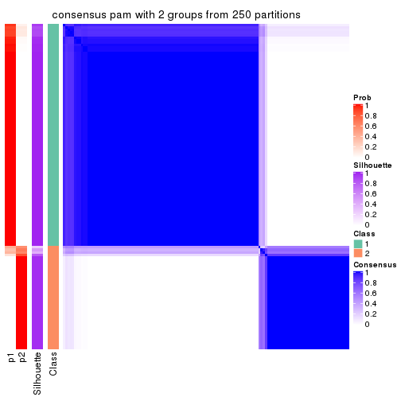</p>

</div>
<div id='tab-SD-pam-consensus-heatmap-2'>
<pre><code class="r">consensus_heatmap(res, k = 3)
</code></pre>

<p>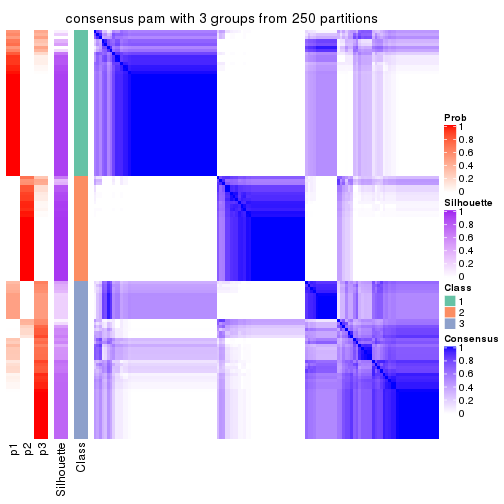</p>

</div>
<div id='tab-SD-pam-consensus-heatmap-3'>
<pre><code class="r">consensus_heatmap(res, k = 4)
</code></pre>

<p>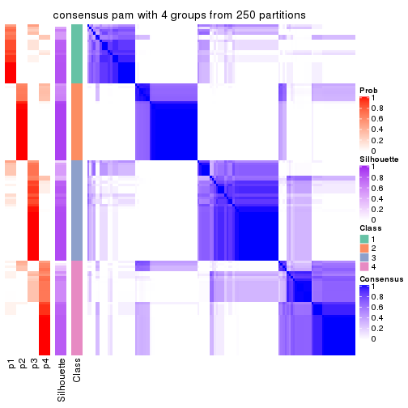</p>

</div>
<div id='tab-SD-pam-consensus-heatmap-4'>
<pre><code class="r">consensus_heatmap(res, k = 5)
</code></pre>

<p>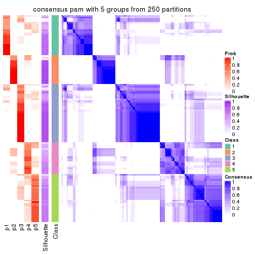</p>

</div>
<div id='tab-SD-pam-consensus-heatmap-5'>
<pre><code class="r">consensus_heatmap(res, k = 6)
</code></pre>

<p>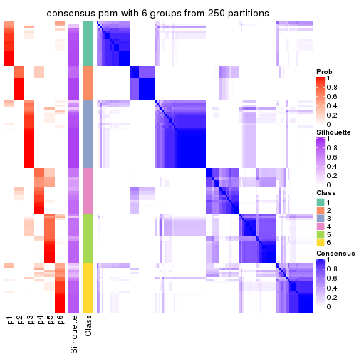</p>

</div>
</div>

Heatmaps for the membership of samples in all partitions to see how consistent they are:


<script>
$( function() {
	$( '#tabs-SD-pam-membership-heatmap' ).tabs();
} );
</script>
<div id='tabs-SD-pam-membership-heatmap'>
<ul>
<li><a href='#tab-SD-pam-membership-heatmap-1'>k = 2</a></li>
<li><a href='#tab-SD-pam-membership-heatmap-2'>k = 3</a></li>
<li><a href='#tab-SD-pam-membership-heatmap-3'>k = 4</a></li>
<li><a href='#tab-SD-pam-membership-heatmap-4'>k = 5</a></li>
<li><a href='#tab-SD-pam-membership-heatmap-5'>k = 6</a></li>
</ul>
<div id='tab-SD-pam-membership-heatmap-1'>
<pre><code class="r">membership_heatmap(res, k = 2)
</code></pre>

<p>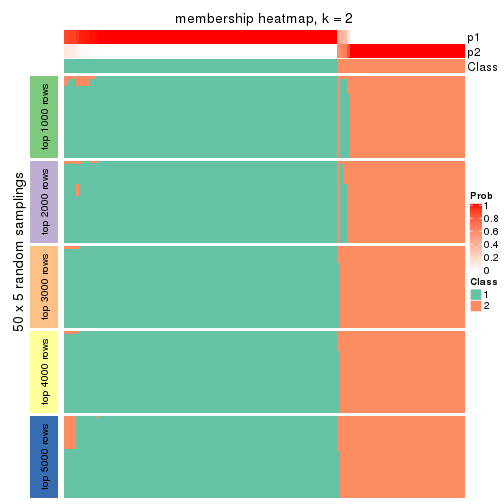</p>

</div>
<div id='tab-SD-pam-membership-heatmap-2'>
<pre><code class="r">membership_heatmap(res, k = 3)
</code></pre>

<p>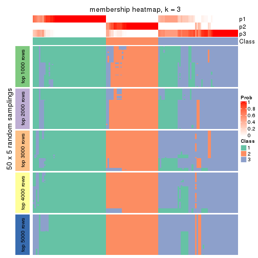</p>

</div>
<div id='tab-SD-pam-membership-heatmap-3'>
<pre><code class="r">membership_heatmap(res, k = 4)
</code></pre>

<p>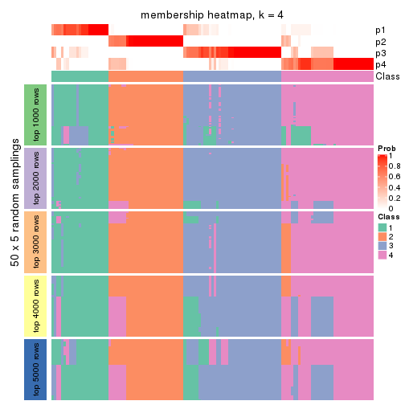</p>

</div>
<div id='tab-SD-pam-membership-heatmap-4'>
<pre><code class="r">membership_heatmap(res, k = 5)
</code></pre>

<p>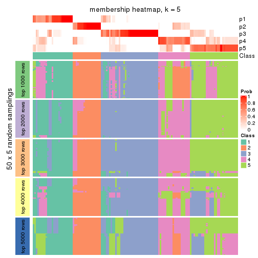</p>

</div>
<div id='tab-SD-pam-membership-heatmap-5'>
<pre><code class="r">membership_heatmap(res, k = 6)
</code></pre>

<p>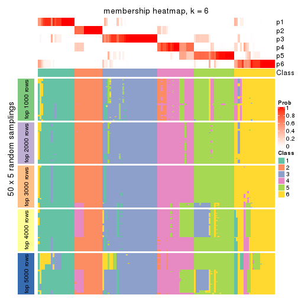</p>

</div>
</div>

As soon as we have had the classes for columns, we can look for signatures
which are significantly different between classes which can be candidate marks
for certain classes. Following are the heatmaps for signatures.


Signature heatmaps where rows are scaled:


<script>
$( function() {
	$( '#tabs-SD-pam-get-signatures' ).tabs();
} );
</script>
<div id='tabs-SD-pam-get-signatures'>
<ul>
<li><a href='#tab-SD-pam-get-signatures-1'>k = 2</a></li>
<li><a href='#tab-SD-pam-get-signatures-2'>k = 3</a></li>
<li><a href='#tab-SD-pam-get-signatures-3'>k = 4</a></li>
<li><a href='#tab-SD-pam-get-signatures-4'>k = 5</a></li>
<li><a href='#tab-SD-pam-get-signatures-5'>k = 6</a></li>
</ul>
<div id='tab-SD-pam-get-signatures-1'>
<pre><code class="r">get_signatures(res, k = 2)
</code></pre>

<p>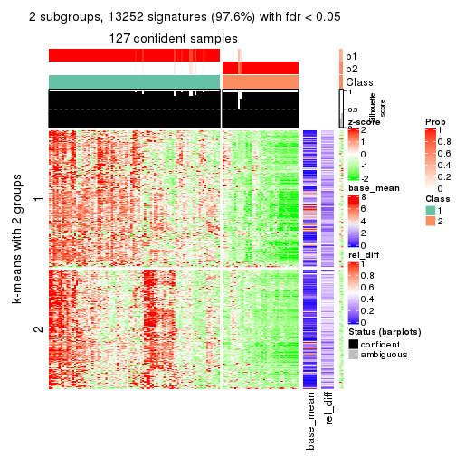</p>

</div>
<div id='tab-SD-pam-get-signatures-2'>
<pre><code class="r">get_signatures(res, k = 3)
</code></pre>

<p>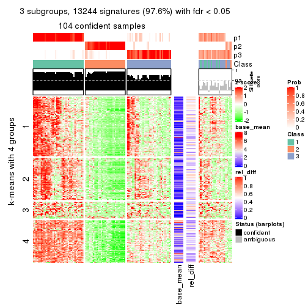</p>

</div>
<div id='tab-SD-pam-get-signatures-3'>
<pre><code class="r">get_signatures(res, k = 4)
</code></pre>

<p>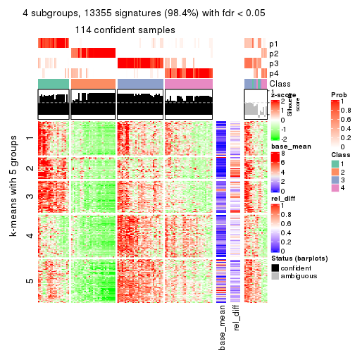</p>

</div>
<div id='tab-SD-pam-get-signatures-4'>
<pre><code class="r">get_signatures(res, k = 5)
</code></pre>

<p>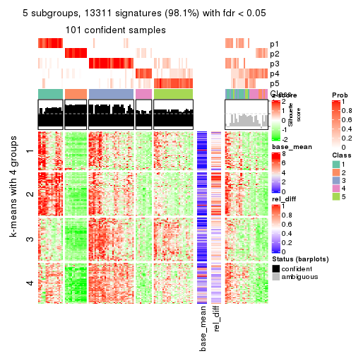</p>

</div>
<div id='tab-SD-pam-get-signatures-5'>
<pre><code class="r">get_signatures(res, k = 6)
</code></pre>

<p>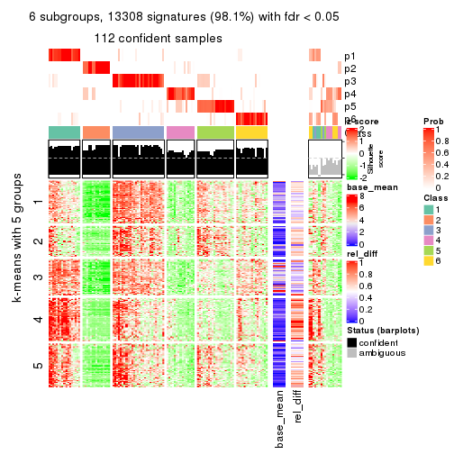</p>

</div>
</div>


Signature heatmaps where rows are not scaled:


<script>
$( function() {
	$( '#tabs-SD-pam-get-signatures-no-scale' ).tabs();
} );
</script>
<div id='tabs-SD-pam-get-signatures-no-scale'>
<ul>
<li><a href='#tab-SD-pam-get-signatures-no-scale-1'>k = 2</a></li>
<li><a href='#tab-SD-pam-get-signatures-no-scale-2'>k = 3</a></li>
<li><a href='#tab-SD-pam-get-signatures-no-scale-3'>k = 4</a></li>
<li><a href='#tab-SD-pam-get-signatures-no-scale-4'>k = 5</a></li>
<li><a href='#tab-SD-pam-get-signatures-no-scale-5'>k = 6</a></li>
</ul>
<div id='tab-SD-pam-get-signatures-no-scale-1'>
<pre><code class="r">get_signatures(res, k = 2, scale_rows = FALSE)
</code></pre>

<p>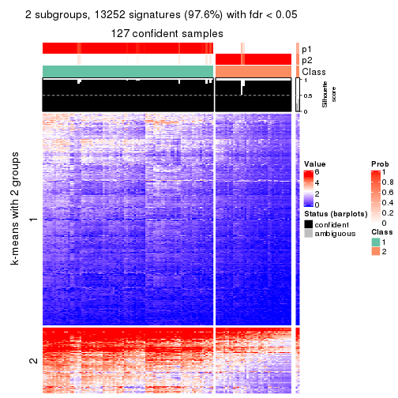</p>

</div>
<div id='tab-SD-pam-get-signatures-no-scale-2'>
<pre><code class="r">get_signatures(res, k = 3, scale_rows = FALSE)
</code></pre>

<p>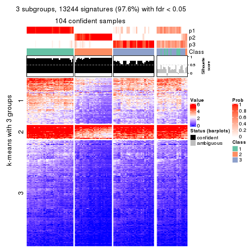</p>

</div>
<div id='tab-SD-pam-get-signatures-no-scale-3'>
<pre><code class="r">get_signatures(res, k = 4, scale_rows = FALSE)
</code></pre>

<p>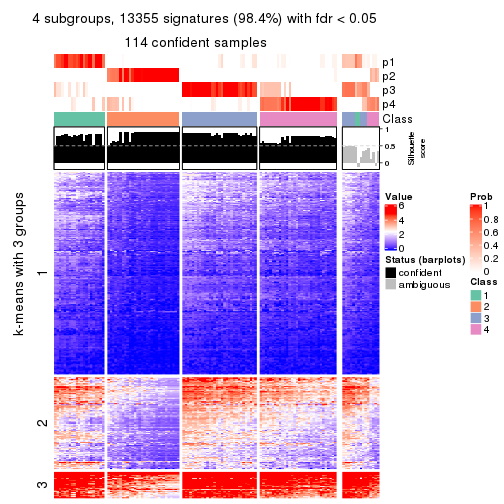</p>

</div>
<div id='tab-SD-pam-get-signatures-no-scale-4'>
<pre><code class="r">get_signatures(res, k = 5, scale_rows = FALSE)
</code></pre>

<p>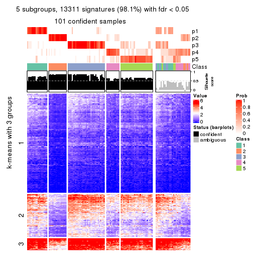</p>

</div>
<div id='tab-SD-pam-get-signatures-no-scale-5'>
<pre><code class="r">get_signatures(res, k = 6, scale_rows = FALSE)
</code></pre>

<p>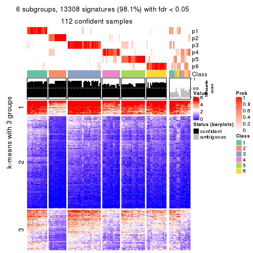</p>

</div>
</div>


Compare the overlap of signatures from different k:

```r
compare_signatures(res)
```

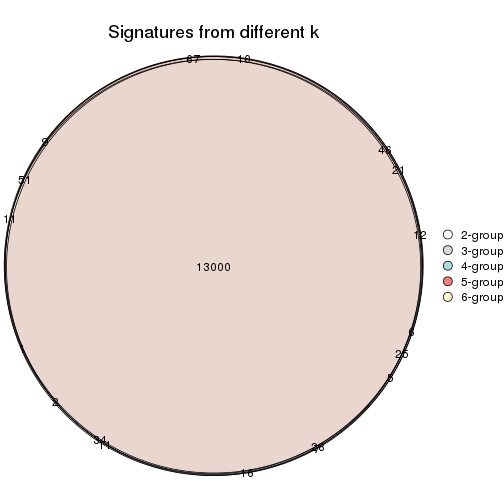

`get_signature()` returns a data frame invisibly. TO get the list of signatures, the function
call should be assigned to a variable explicitly. In following code, if `plot` argument is set
to `FALSE`, no heatmap is plotted while only the differential analysis is performed.

```r
# code only for demonstration
tb = get_signature(res, k = ..., plot = FALSE)
```

An example of the output of `tb` is:

```
#>   which_row         fdr    mean_1    mean_2 scaled_mean_1 scaled_mean_2 km
#> 1        38 0.042760348  8.373488  9.131774    -0.5533452     0.5164555  1
#> 2        40 0.018707592  7.106213  8.469186    -0.6173731     0.5762149  1
#> 3        55 0.019134737 10.221463 11.207825    -0.6159697     0.5749050  1
#> 4        59 0.006059896  5.921854  7.869574    -0.6899429     0.6439467  1
#> 5        60 0.018055526  8.928898 10.211722    -0.6204761     0.5791110  1
#> 6        98 0.009384629 15.714769 14.887706     0.6635654    -0.6193277  2
...
```

The columns in `tb` are:

1. `which_row`: row indices corresponding to the input matrix.
2. `fdr`: FDR for the differential test. 
3. `mean_x`: The mean value in group x.
4. `scaled_mean_x`: The mean value in group x after rows are scaled.
5. `km`: Row groups if k-means clustering is applied to rows.


UMAP plot which shows how samples are separated.


<script>
$( function() {
	$( '#tabs-SD-pam-dimension-reduction' ).tabs();
} );
</script>
<div id='tabs-SD-pam-dimension-reduction'>
<ul>
<li><a href='#tab-SD-pam-dimension-reduction-1'>k = 2</a></li>
<li><a href='#tab-SD-pam-dimension-reduction-2'>k = 3</a></li>
<li><a href='#tab-SD-pam-dimension-reduction-3'>k = 4</a></li>
<li><a href='#tab-SD-pam-dimension-reduction-4'>k = 5</a></li>
<li><a href='#tab-SD-pam-dimension-reduction-5'>k = 6</a></li>
</ul>
<div id='tab-SD-pam-dimension-reduction-1'>
<pre><code class="r">dimension_reduction(res, k = 2, method = &quot;UMAP&quot;)
</code></pre>

<p>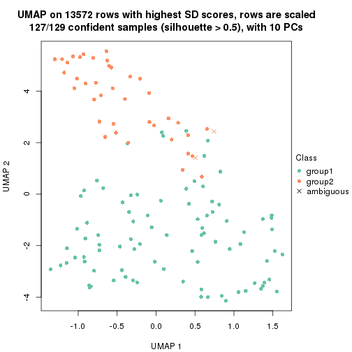</p>

</div>
<div id='tab-SD-pam-dimension-reduction-2'>
<pre><code class="r">dimension_reduction(res, k = 3, method = &quot;UMAP&quot;)
</code></pre>

<p>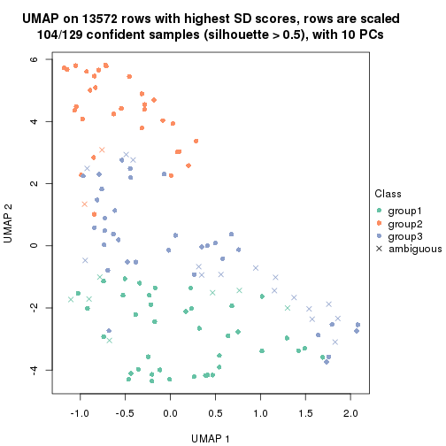</p>

</div>
<div id='tab-SD-pam-dimension-reduction-3'>
<pre><code class="r">dimension_reduction(res, k = 4, method = &quot;UMAP&quot;)
</code></pre>

<p>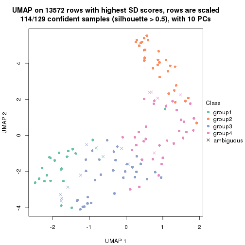</p>

</div>
<div id='tab-SD-pam-dimension-reduction-4'>
<pre><code class="r">dimension_reduction(res, k = 5, method = &quot;UMAP&quot;)
</code></pre>

<p>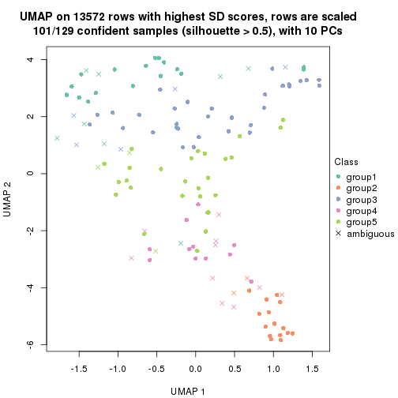</p>

</div>
<div id='tab-SD-pam-dimension-reduction-5'>
<pre><code class="r">dimension_reduction(res, k = 6, method = &quot;UMAP&quot;)
</code></pre>

<p>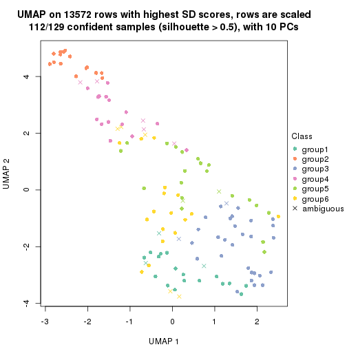</p>

</div>
</div>


Following heatmap shows how subgroups are split when increasing `k`:

```r
collect_classes(res)
```

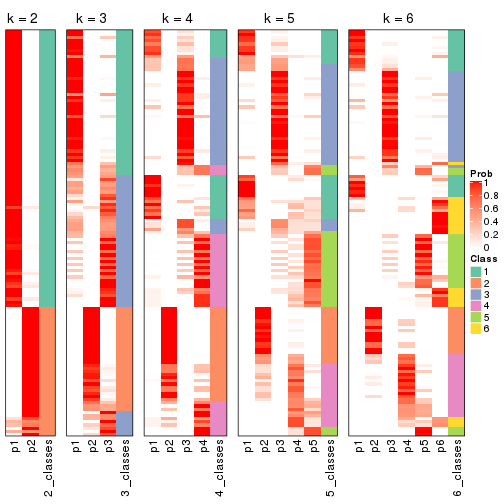


If matrix rows can be associated to genes, consider to use `GO_Enrichment(res,
...)` to perform function enrichment for the signature genes.


 

---------------------------------------------------


### SD:mclust


The object with results only for a single top-value method and a single partition method 
can be extracted as:

```r
res = res_list["SD", "mclust"]
# you can also extract it by
# res = res_list["SD:mclust"]
```

A summary of `res` and all the functions that can be applied to it:

```r
res
```

```
#> A 'ConsensusPartition' object with k = 2, 3, 4, 5, 6.
#>   On a matrix with 13572 rows and 129 columns.
#>   Top rows (1000, 2000, 3000, 4000, 5000) are extracted by 'SD' method.
#>   Subgroups are detected by 'mclust' method.
#>   Performed in total 1250 partitions by row resampling.
#>   Best k for subgroups seems to be 5.
#> 
#> Following methods can be applied to this 'ConsensusPartition' object:
#>  [1] "cola_report"             "collect_classes"         "collect_plots"          
#>  [4] "collect_stats"           "colnames"                "compare_signatures"     
#>  [7] "consensus_heatmap"       "dimension_reduction"     "functional_enrichment"  
#> [10] "get_anno_col"            "get_anno"                "get_classes"            
#> [13] "get_consensus"           "get_matrix"              "get_membership"         
#> [16] "get_param"               "get_signatures"          "get_stats"              
#> [19] "is_best_k"               "is_stable_k"             "membership_heatmap"     
#> [22] "ncol"                    "nrow"                    "plot_ecdf"              
#> [25] "rownames"                "select_partition_number" "show"                   
#> [28] "suggest_best_k"          "test_to_known_factors"
```

`collect_plots()` function collects all the plots made from `res` for all `k` (number of partitions)
into one single page to provide an easy and fast comparison between different `k`.

```r
collect_plots(res)
```

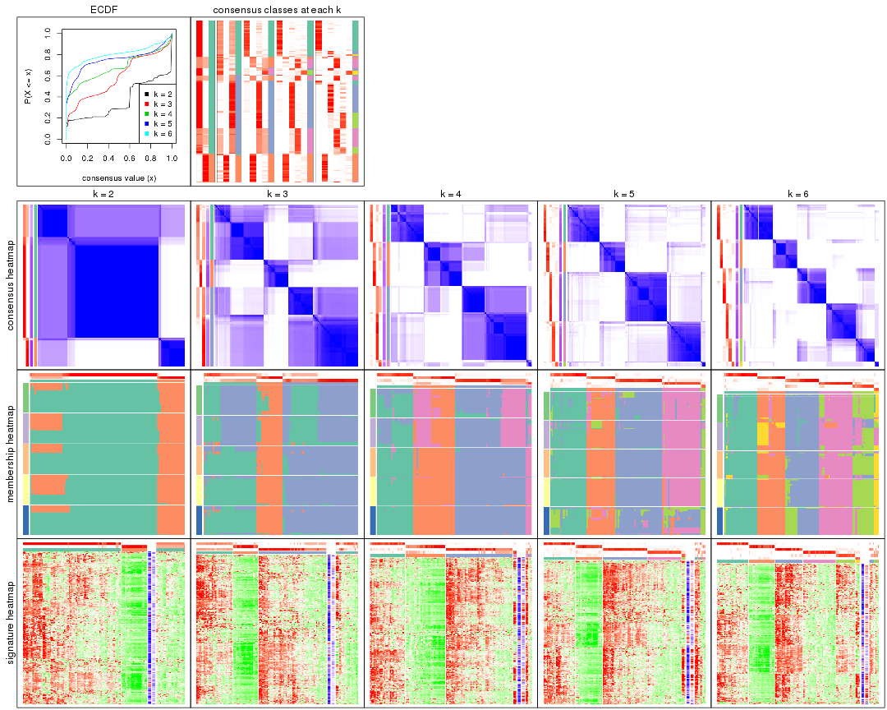

The plots are:

- The first row: a plot of the ECDF (Empirical cumulative distribution
  function) curves of the consensus matrix for each `k` and the heatmap of
  predicted classes for each `k`.
- The second row: heatmaps of the consensus matrix for each `k`.
- The third row: heatmaps of the membership matrix for each `k`.
- The fouth row: heatmaps of the signatures for each `k`.

All the plots in panels can be made by individual functions and they are
plotted later in this section.

`select_partition_number()` produces several plots showing different
statistics for choosing "optimized" `k`. There are following statistics:

- ECDF curves of the consensus matrix for each `k`;
- 1-PAC. [The PAC
  score](https://en.wikipedia.org/wiki/Consensus_clustering#Over-interpretation_potential_of_consensus_clustering)
  measures the proportion of the ambiguous subgrouping.
- Mean silhouette score.
- Concordance. The mean probability of fiting the consensus class ids in all
  partitions.
- Area increased. Denote $A_k$ as the area under the ECDF curve for current
  `k`, the area increased is defined as $A_k - A_{k-1}$.
- Rand index. The percent of pairs of samples that are both in a same cluster
  or both are not in a same cluster in the partition of k and k-1.
- Jaccard index. The ratio of pairs of samples are both in a same cluster in
  the partition of k and k-1 and the pairs of samples are both in a same
  cluster in the partition k or k-1.

The detailed explanations of these statistics can be found in [the cola
vignette](http://bioconductor.org/packages/devel/bioc/vignettes/cola/inst/doc/cola.html#toc_13).

Generally speaking, lower PAC score, higher mean silhouette score or higher
concordance corresponds to better partition. Rand index and Jaccard index
measure how similar the current partition is compared to partition with `k-1`.
If they are too similar, we won't accept `k` is better than `k-1`.

```r
select_partition_number(res)
```

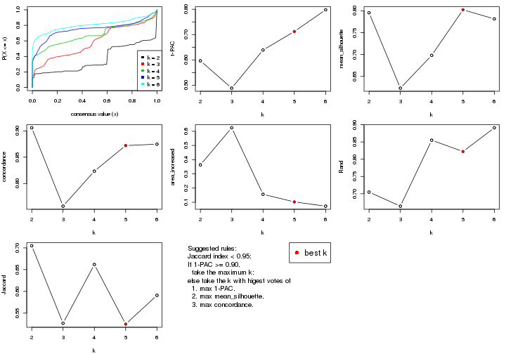

The numeric values for all these statistics can be obtained by `get_stats()`.

```r
get_stats(res)
```

```
#>   k 1-PAC mean_silhouette concordance area_increased  Rand Jaccard
#> 2 2 0.597           0.796       0.906         0.3634 0.705   0.705
#> 3 3 0.489           0.623       0.757         0.6243 0.664   0.527
#> 4 4 0.639           0.698       0.823         0.1562 0.855   0.662
#> 5 5 0.712           0.802       0.872         0.1023 0.822   0.525
#> 6 6 0.798           0.782       0.875         0.0724 0.891   0.591
```

`suggest_best_k()` suggests the best $k$ based on these statistics. The rules are as follows:

- All $k$ with Jaccard index larger than 0.95 are removed because the increase of
  the partition number does not provides enough extra information. If all $k$ are removed,
  the best $k$ is assigned by `NA`.
- For $k$ with 1-PAC larger than 0.9, the maximal $k$ is taken as the "best k". Other $k$ is called "optional k".
- If it does not fit the second rule. The $k$ with the highest vote of highest
  1-PAC, mean silhouette and concordance is taken as the "best k".

```r
suggest_best_k(res)
```

```
#> [1] 5
```


Following shows the table of the partitions (You need to click the **show/hide
code output** link to see it). The membership matrix (columns with name `p*`)
is inferred by
[`clue::cl_consensus()`](https://www.rdocumentation.org/link/cl_consensus?package=clue)
function with the `SE` method. Basically the value in the membership matrix
represents the probability to belong to a certain group. The finall class
label for an item is determined with the group with highest probability it
belongs to.

In `get_classes()` function, the entropy is calculated from the membership
matrix and the silhouette score is calculated from the consensus matrix.


<script>
$( function() {
	$( '#tabs-SD-mclust-get-classes' ).tabs();
} );
</script>
<div id='tabs-SD-mclust-get-classes'>
<ul>
<li><a href='#tab-SD-mclust-get-classes-1'>k = 2</a></li>
<li><a href='#tab-SD-mclust-get-classes-2'>k = 3</a></li>
<li><a href='#tab-SD-mclust-get-classes-3'>k = 4</a></li>
<li><a href='#tab-SD-mclust-get-classes-4'>k = 5</a></li>
<li><a href='#tab-SD-mclust-get-classes-5'>k = 6</a></li>
</ul>

<div id='tab-SD-mclust-get-classes-1'>
<p><a id='tab-SD-mclust-get-classes-1-a' style='color:#0366d6' href='#'>show/hide code output</a></p>
<pre><code class="r">cbind(get_classes(res, k = 2), get_membership(res, k = 2))
</code></pre>

<pre><code>#&gt;            class entropy silhouette    p1    p2
#&gt; SRR1656463     2  0.0000      0.956 0.000 1.000
#&gt; SRR1656464     1  0.0000      0.875 1.000 0.000
#&gt; SRR1656462     1  0.0000      0.875 1.000 0.000
#&gt; SRR1656465     1  0.0000      0.875 1.000 0.000
#&gt; SRR1656467     1  0.9850      0.422 0.572 0.428
#&gt; SRR1656466     1  0.0000      0.875 1.000 0.000
#&gt; SRR1656468     1  0.9732      0.475 0.596 0.404
#&gt; SRR1656472     1  0.0000      0.875 1.000 0.000
#&gt; SRR1656471     1  0.0000      0.875 1.000 0.000
#&gt; SRR1656470     2  0.0000      0.956 0.000 1.000
#&gt; SRR1656469     1  0.0000      0.875 1.000 0.000
#&gt; SRR1656473     2  0.0000      0.956 0.000 1.000
#&gt; SRR1656474     2  0.0000      0.956 0.000 1.000
#&gt; SRR1656475     2  0.0000      0.956 0.000 1.000
#&gt; SRR1656478     1  0.0000      0.875 1.000 0.000
#&gt; SRR1656477     1  0.9522      0.523 0.628 0.372
#&gt; SRR1656479     1  0.0000      0.875 1.000 0.000
#&gt; SRR1656480     1  0.9732      0.475 0.596 0.404
#&gt; SRR1656476     2  0.0938      0.952 0.012 0.988
#&gt; SRR1656481     1  0.5629      0.788 0.868 0.132
#&gt; SRR1656482     2  0.0938      0.952 0.012 0.988
#&gt; SRR1656483     2  0.0000      0.956 0.000 1.000
#&gt; SRR1656485     1  0.0000      0.875 1.000 0.000
#&gt; SRR1656487     1  0.0000      0.875 1.000 0.000
#&gt; SRR1656486     1  0.0000      0.875 1.000 0.000
#&gt; SRR1656488     1  0.0000      0.875 1.000 0.000
#&gt; SRR1656484     1  0.0000      0.875 1.000 0.000
#&gt; SRR1656489     1  0.0000      0.875 1.000 0.000
#&gt; SRR1656491     1  0.0000      0.875 1.000 0.000
#&gt; SRR1656490     1  0.2778      0.846 0.952 0.048
#&gt; SRR1656492     1  0.0000      0.875 1.000 0.000
#&gt; SRR1656493     1  0.0000      0.875 1.000 0.000
#&gt; SRR1656495     1  0.0000      0.875 1.000 0.000
#&gt; SRR1656496     1  0.0000      0.875 1.000 0.000
#&gt; SRR1656494     1  0.9732      0.475 0.596 0.404
#&gt; SRR1656497     2  0.0000      0.956 0.000 1.000
#&gt; SRR1656499     1  0.0000      0.875 1.000 0.000
#&gt; SRR1656500     1  0.0000      0.875 1.000 0.000
#&gt; SRR1656501     1  0.0000      0.875 1.000 0.000
#&gt; SRR1656498     1  0.0000      0.875 1.000 0.000
#&gt; SRR1656504     2  0.1184      0.949 0.016 0.984
#&gt; SRR1656502     1  0.0000      0.875 1.000 0.000
#&gt; SRR1656503     1  0.0000      0.875 1.000 0.000
#&gt; SRR1656507     1  0.0000      0.875 1.000 0.000
#&gt; SRR1656508     1  0.0000      0.875 1.000 0.000
#&gt; SRR1656505     1  0.9732      0.475 0.596 0.404
#&gt; SRR1656506     1  0.0000      0.875 1.000 0.000
#&gt; SRR1656509     1  0.0000      0.875 1.000 0.000
#&gt; SRR1656510     1  0.6801      0.745 0.820 0.180
#&gt; SRR1656511     1  0.9732      0.475 0.596 0.404
#&gt; SRR1656513     1  0.9732      0.475 0.596 0.404
#&gt; SRR1656512     2  0.0000      0.956 0.000 1.000
#&gt; SRR1656514     1  0.0000      0.875 1.000 0.000
#&gt; SRR1656515     1  0.9732      0.475 0.596 0.404
#&gt; SRR1656516     1  0.0000      0.875 1.000 0.000
#&gt; SRR1656518     1  0.0000      0.875 1.000 0.000
#&gt; SRR1656517     1  0.0000      0.875 1.000 0.000
#&gt; SRR1656519     1  0.0000      0.875 1.000 0.000
#&gt; SRR1656522     1  0.0000      0.875 1.000 0.000
#&gt; SRR1656523     1  0.9732      0.475 0.596 0.404
#&gt; SRR1656521     2  0.0000      0.956 0.000 1.000
#&gt; SRR1656520     1  0.0000      0.875 1.000 0.000
#&gt; SRR1656524     1  0.0000      0.875 1.000 0.000
#&gt; SRR1656525     1  0.0000      0.875 1.000 0.000
#&gt; SRR1656526     2  0.3733      0.887 0.072 0.928
#&gt; SRR1656527     2  0.8016      0.601 0.244 0.756
#&gt; SRR1656530     1  0.0000      0.875 1.000 0.000
#&gt; SRR1656529     1  0.0000      0.875 1.000 0.000
#&gt; SRR1656531     1  0.0000      0.875 1.000 0.000
#&gt; SRR1656528     1  0.0000      0.875 1.000 0.000
#&gt; SRR1656534     1  0.0000      0.875 1.000 0.000
#&gt; SRR1656533     1  0.0000      0.875 1.000 0.000
#&gt; SRR1656536     1  0.5294      0.797 0.880 0.120
#&gt; SRR1656532     1  0.9732      0.475 0.596 0.404
#&gt; SRR1656537     1  0.0000      0.875 1.000 0.000
#&gt; SRR1656538     1  0.0000      0.875 1.000 0.000
#&gt; SRR1656535     2  0.0938      0.952 0.012 0.988
#&gt; SRR1656539     1  0.0000      0.875 1.000 0.000
#&gt; SRR1656544     1  0.0000      0.875 1.000 0.000
#&gt; SRR1656542     1  0.0000      0.875 1.000 0.000
#&gt; SRR1656543     1  0.0000      0.875 1.000 0.000
#&gt; SRR1656545     2  0.0000      0.956 0.000 1.000
#&gt; SRR1656540     1  0.0000      0.875 1.000 0.000
#&gt; SRR1656546     1  0.0000      0.875 1.000 0.000
#&gt; SRR1656541     2  0.9580      0.217 0.380 0.620
#&gt; SRR1656547     1  0.9732      0.475 0.596 0.404
#&gt; SRR1656548     1  0.0000      0.875 1.000 0.000
#&gt; SRR1656549     1  0.0000      0.875 1.000 0.000
#&gt; SRR1656551     1  0.5737      0.785 0.864 0.136
#&gt; SRR1656553     1  0.0000      0.875 1.000 0.000
#&gt; SRR1656550     1  0.9732      0.475 0.596 0.404
#&gt; SRR1656552     1  0.9732      0.475 0.596 0.404
#&gt; SRR1656554     1  0.0000      0.875 1.000 0.000
#&gt; SRR1656555     1  0.9460      0.533 0.636 0.364
#&gt; SRR1656556     1  0.0000      0.875 1.000 0.000
#&gt; SRR1656557     1  0.0000      0.875 1.000 0.000
#&gt; SRR1656558     1  0.0000      0.875 1.000 0.000
#&gt; SRR1656559     1  0.0000      0.875 1.000 0.000
#&gt; SRR1656560     1  0.0000      0.875 1.000 0.000
#&gt; SRR1656561     1  0.0000      0.875 1.000 0.000
#&gt; SRR1656562     1  0.9732      0.475 0.596 0.404
#&gt; SRR1656563     1  0.0000      0.875 1.000 0.000
#&gt; SRR1656564     2  0.0000      0.956 0.000 1.000
#&gt; SRR1656565     1  0.9732      0.475 0.596 0.404
#&gt; SRR1656566     1  0.0000      0.875 1.000 0.000
#&gt; SRR1656568     2  0.0938      0.952 0.012 0.988
#&gt; SRR1656567     1  0.9732      0.475 0.596 0.404
#&gt; SRR1656569     1  0.0000      0.875 1.000 0.000
#&gt; SRR1656570     1  0.0000      0.875 1.000 0.000
#&gt; SRR1656571     2  0.0000      0.956 0.000 1.000
#&gt; SRR1656573     1  0.6801      0.745 0.820 0.180
#&gt; SRR1656572     1  0.9732      0.475 0.596 0.404
#&gt; SRR1656574     1  0.0000      0.875 1.000 0.000
#&gt; SRR1656575     1  0.0000      0.875 1.000 0.000
#&gt; SRR1656576     1  0.9732      0.475 0.596 0.404
#&gt; SRR1656578     1  0.9732      0.475 0.596 0.404
#&gt; SRR1656577     1  0.0000      0.875 1.000 0.000
#&gt; SRR1656579     1  0.9732      0.475 0.596 0.404
#&gt; SRR1656580     1  0.0000      0.875 1.000 0.000
#&gt; SRR1656581     1  0.9460      0.534 0.636 0.364
#&gt; SRR1656582     2  0.0938      0.952 0.012 0.988
#&gt; SRR1656585     1  0.9732      0.475 0.596 0.404
#&gt; SRR1656584     1  0.0000      0.875 1.000 0.000
#&gt; SRR1656583     1  0.6438      0.757 0.836 0.164
#&gt; SRR1656586     2  0.0000      0.956 0.000 1.000
#&gt; SRR1656587     1  0.9732      0.475 0.596 0.404
#&gt; SRR1656588     1  0.9732      0.475 0.596 0.404
#&gt; SRR1656589     2  0.0000      0.956 0.000 1.000
#&gt; SRR1656590     1  0.0000      0.875 1.000 0.000
</code></pre>

<script>
$('#tab-SD-mclust-get-classes-1-a').parent().next().next().hide();
$('#tab-SD-mclust-get-classes-1-a').click(function(){
  $('#tab-SD-mclust-get-classes-1-a').parent().next().next().toggle();
  return(false);
});
</script>
</div>

<div id='tab-SD-mclust-get-classes-2'>
<p><a id='tab-SD-mclust-get-classes-2-a' style='color:#0366d6' href='#'>show/hide code output</a></p>
<pre><code class="r">cbind(get_classes(res, k = 3), get_membership(res, k = 3))
</code></pre>

<pre><code>#&gt;            class entropy silhouette    p1    p2    p3
#&gt; SRR1656463     2  0.2200     0.8842 0.056 0.940 0.004
#&gt; SRR1656464     1  0.6299     0.6921 0.524 0.000 0.476
#&gt; SRR1656462     3  0.0424     0.6783 0.008 0.000 0.992
#&gt; SRR1656465     3  0.3686     0.6444 0.140 0.000 0.860
#&gt; SRR1656467     3  0.7878     0.4980 0.392 0.060 0.548
#&gt; SRR1656466     3  0.0592     0.6800 0.012 0.000 0.988
#&gt; SRR1656468     3  0.6045     0.5594 0.380 0.000 0.620
#&gt; SRR1656472     1  0.3038     0.4743 0.896 0.000 0.104
#&gt; SRR1656471     3  0.1529     0.6776 0.040 0.000 0.960
#&gt; SRR1656470     2  0.0000     0.8933 0.000 1.000 0.000
#&gt; SRR1656469     3  0.0237     0.6814 0.004 0.000 0.996
#&gt; SRR1656473     2  0.0000     0.8933 0.000 1.000 0.000
#&gt; SRR1656474     2  0.0000     0.8933 0.000 1.000 0.000
#&gt; SRR1656475     2  0.0000     0.8933 0.000 1.000 0.000
#&gt; SRR1656478     1  0.6140     0.6877 0.596 0.000 0.404
#&gt; SRR1656477     3  0.6111     0.5523 0.396 0.000 0.604
#&gt; SRR1656479     3  0.3816     0.4151 0.148 0.000 0.852
#&gt; SRR1656480     3  0.6095     0.5522 0.392 0.000 0.608
#&gt; SRR1656476     2  0.2945     0.8750 0.088 0.908 0.004
#&gt; SRR1656481     3  0.6045     0.5594 0.380 0.000 0.620
#&gt; SRR1656482     2  0.3644     0.8607 0.124 0.872 0.004
#&gt; SRR1656483     2  0.0000     0.8933 0.000 1.000 0.000
#&gt; SRR1656485     3  0.0000     0.6813 0.000 0.000 1.000
#&gt; SRR1656487     3  0.0592     0.6800 0.012 0.000 0.988
#&gt; SRR1656486     3  0.6225    -0.5689 0.432 0.000 0.568
#&gt; SRR1656488     3  0.0592     0.6800 0.012 0.000 0.988
#&gt; SRR1656484     1  0.6308     0.6853 0.508 0.000 0.492
#&gt; SRR1656489     1  0.6302     0.6922 0.520 0.000 0.480
#&gt; SRR1656491     3  0.0237     0.6806 0.004 0.000 0.996
#&gt; SRR1656490     3  0.4796     0.1711 0.220 0.000 0.780
#&gt; SRR1656492     3  0.0424     0.6783 0.008 0.000 0.992
#&gt; SRR1656493     1  0.5835     0.6145 0.660 0.000 0.340
#&gt; SRR1656495     1  0.2878     0.4680 0.904 0.000 0.096
#&gt; SRR1656496     3  0.0892     0.6661 0.020 0.000 0.980
#&gt; SRR1656494     1  0.6306     0.2797 0.748 0.052 0.200
#&gt; SRR1656497     2  0.0000     0.8933 0.000 1.000 0.000
#&gt; SRR1656499     3  0.0592     0.6800 0.012 0.000 0.988
#&gt; SRR1656500     3  0.0424     0.6783 0.008 0.000 0.992
#&gt; SRR1656501     1  0.6307     0.6870 0.512 0.000 0.488
#&gt; SRR1656498     1  0.6307     0.6896 0.512 0.000 0.488
#&gt; SRR1656504     2  0.3826     0.8580 0.124 0.868 0.008
#&gt; SRR1656502     1  0.2959     0.4713 0.900 0.000 0.100
#&gt; SRR1656503     1  0.6307     0.6896 0.512 0.000 0.488
#&gt; SRR1656507     1  0.6140     0.6877 0.596 0.000 0.404
#&gt; SRR1656508     1  0.6307     0.6896 0.512 0.000 0.488
#&gt; SRR1656505     3  0.6045     0.5594 0.380 0.000 0.620
#&gt; SRR1656506     3  0.0592     0.6800 0.012 0.000 0.988
#&gt; SRR1656509     3  0.1643     0.6755 0.044 0.000 0.956
#&gt; SRR1656510     3  0.4178     0.6281 0.172 0.000 0.828
#&gt; SRR1656511     1  0.4920     0.4433 0.840 0.052 0.108
#&gt; SRR1656513     1  0.8439    -0.2156 0.536 0.368 0.096
#&gt; SRR1656512     2  0.0000     0.8933 0.000 1.000 0.000
#&gt; SRR1656514     1  0.6299     0.6921 0.524 0.000 0.476
#&gt; SRR1656515     3  0.7724     0.5009 0.396 0.052 0.552
#&gt; SRR1656516     1  0.6307     0.6896 0.512 0.000 0.488
#&gt; SRR1656518     1  0.6140     0.6877 0.596 0.000 0.404
#&gt; SRR1656517     1  0.6140     0.6877 0.596 0.000 0.404
#&gt; SRR1656519     3  0.0424     0.6783 0.008 0.000 0.992
#&gt; SRR1656522     1  0.6307     0.6896 0.512 0.000 0.488
#&gt; SRR1656523     3  0.6079     0.5571 0.388 0.000 0.612
#&gt; SRR1656521     2  0.0983     0.8913 0.016 0.980 0.004
#&gt; SRR1656520     3  0.0892     0.6775 0.020 0.000 0.980
#&gt; SRR1656524     1  0.3879     0.5042 0.848 0.000 0.152
#&gt; SRR1656525     3  0.0237     0.6815 0.004 0.000 0.996
#&gt; SRR1656526     2  0.6252     0.6709 0.344 0.648 0.008
#&gt; SRR1656527     1  0.4749     0.2861 0.816 0.172 0.012
#&gt; SRR1656530     3  0.0592     0.6800 0.012 0.000 0.988
#&gt; SRR1656529     3  0.0592     0.6800 0.012 0.000 0.988
#&gt; SRR1656531     1  0.6299     0.6921 0.524 0.000 0.476
#&gt; SRR1656528     3  0.0592     0.6800 0.012 0.000 0.988
#&gt; SRR1656534     3  0.1163     0.6559 0.028 0.000 0.972
#&gt; SRR1656533     1  0.6140     0.6877 0.596 0.000 0.404
#&gt; SRR1656536     3  0.6045     0.5594 0.380 0.000 0.620
#&gt; SRR1656532     1  0.4689     0.4398 0.852 0.052 0.096
#&gt; SRR1656537     1  0.6299     0.6921 0.524 0.000 0.476
#&gt; SRR1656538     3  0.2625     0.5586 0.084 0.000 0.916
#&gt; SRR1656535     2  0.5982     0.6940 0.328 0.668 0.004
#&gt; SRR1656539     3  0.0000     0.6813 0.000 0.000 1.000
#&gt; SRR1656544     3  0.0237     0.6806 0.004 0.000 0.996
#&gt; SRR1656542     3  0.0237     0.6806 0.004 0.000 0.996
#&gt; SRR1656543     3  0.0237     0.6806 0.004 0.000 0.996
#&gt; SRR1656545     2  0.0000     0.8933 0.000 1.000 0.000
#&gt; SRR1656540     3  0.0892     0.6775 0.020 0.000 0.980
#&gt; SRR1656546     1  0.6299     0.6901 0.524 0.000 0.476
#&gt; SRR1656541     2  0.8618     0.4796 0.388 0.508 0.104
#&gt; SRR1656547     3  0.6062     0.5589 0.384 0.000 0.616
#&gt; SRR1656548     3  0.0237     0.6806 0.004 0.000 0.996
#&gt; SRR1656549     1  0.6140     0.6877 0.596 0.000 0.404
#&gt; SRR1656551     3  0.6045     0.5594 0.380 0.000 0.620
#&gt; SRR1656553     3  0.0592     0.6747 0.012 0.000 0.988
#&gt; SRR1656550     3  0.6095     0.5522 0.392 0.000 0.608
#&gt; SRR1656552     3  0.7129     0.5303 0.392 0.028 0.580
#&gt; SRR1656554     3  0.0592     0.6800 0.012 0.000 0.988
#&gt; SRR1656555     3  0.6045     0.5609 0.380 0.000 0.620
#&gt; SRR1656556     3  0.6111     0.5523 0.396 0.000 0.604
#&gt; SRR1656557     3  0.0424     0.6783 0.008 0.000 0.992
#&gt; SRR1656558     1  0.6140     0.6877 0.596 0.000 0.404
#&gt; SRR1656559     1  0.6307     0.6896 0.512 0.000 0.488
#&gt; SRR1656560     3  0.0592     0.6800 0.012 0.000 0.988
#&gt; SRR1656561     3  0.1411     0.6443 0.036 0.000 0.964
#&gt; SRR1656562     1  0.6143     0.0809 0.684 0.012 0.304
#&gt; SRR1656563     1  0.6140     0.6877 0.596 0.000 0.404
#&gt; SRR1656564     2  0.3573     0.8628 0.120 0.876 0.004
#&gt; SRR1656565     1  0.6128     0.3792 0.780 0.084 0.136
#&gt; SRR1656566     1  0.6305     0.6904 0.516 0.000 0.484
#&gt; SRR1656568     2  0.4682     0.8138 0.192 0.804 0.004
#&gt; SRR1656567     3  0.6095     0.5549 0.392 0.000 0.608
#&gt; SRR1656569     3  0.0592     0.6800 0.012 0.000 0.988
#&gt; SRR1656570     1  0.6140     0.6877 0.596 0.000 0.404
#&gt; SRR1656571     2  0.0000     0.8933 0.000 1.000 0.000
#&gt; SRR1656573     3  0.3192     0.6532 0.112 0.000 0.888
#&gt; SRR1656572     1  0.4920     0.4433 0.840 0.052 0.108
#&gt; SRR1656574     1  0.6307     0.6896 0.512 0.000 0.488
#&gt; SRR1656575     1  0.6140     0.6877 0.596 0.000 0.404
#&gt; SRR1656576     3  0.7699     0.5077 0.388 0.052 0.560
#&gt; SRR1656578     1  0.5253     0.4465 0.828 0.076 0.096
#&gt; SRR1656577     1  0.6307     0.6896 0.512 0.000 0.488
#&gt; SRR1656579     3  0.6045     0.5594 0.380 0.000 0.620
#&gt; SRR1656580     3  0.6062    -0.4574 0.384 0.000 0.616
#&gt; SRR1656581     3  0.6045     0.5609 0.380 0.000 0.620
#&gt; SRR1656582     2  0.5845     0.7136 0.308 0.688 0.004
#&gt; SRR1656585     3  0.6095     0.5557 0.392 0.000 0.608
#&gt; SRR1656584     1  0.6140     0.6877 0.596 0.000 0.404
#&gt; SRR1656583     3  0.6140     0.5486 0.404 0.000 0.596
#&gt; SRR1656586     2  0.0000     0.8933 0.000 1.000 0.000
#&gt; SRR1656587     1  0.3752     0.4231 0.856 0.000 0.144
#&gt; SRR1656588     3  0.7030     0.5316 0.396 0.024 0.580
#&gt; SRR1656589     2  0.0000     0.8933 0.000 1.000 0.000
#&gt; SRR1656590     1  0.6295     0.6921 0.528 0.000 0.472
</code></pre>

<script>
$('#tab-SD-mclust-get-classes-2-a').parent().next().next().hide();
$('#tab-SD-mclust-get-classes-2-a').click(function(){
  $('#tab-SD-mclust-get-classes-2-a').parent().next().next().toggle();
  return(false);
});
</script>
</div>

<div id='tab-SD-mclust-get-classes-3'>
<p><a id='tab-SD-mclust-get-classes-3-a' style='color:#0366d6' href='#'>show/hide code output</a></p>
<pre><code class="r">cbind(get_classes(res, k = 4), get_membership(res, k = 4))
</code></pre>

<pre><code>#&gt;            class entropy silhouette    p1    p2    p3    p4
#&gt; SRR1656463     2  0.1389      0.754 0.000 0.952 0.000 0.048
#&gt; SRR1656464     4  0.6299      0.424 0.080 0.000 0.320 0.600
#&gt; SRR1656462     3  0.1211      0.756 0.040 0.000 0.960 0.000
#&gt; SRR1656465     3  0.1474      0.729 0.000 0.000 0.948 0.052
#&gt; SRR1656467     2  0.4855      0.643 0.000 0.600 0.000 0.400
#&gt; SRR1656466     3  0.0000      0.748 0.000 0.000 1.000 0.000
#&gt; SRR1656468     3  0.4898      0.543 0.000 0.000 0.584 0.416
#&gt; SRR1656472     4  0.2814      0.646 0.132 0.000 0.000 0.868
#&gt; SRR1656471     3  0.1938      0.745 0.012 0.000 0.936 0.052
#&gt; SRR1656470     2  0.0188      0.738 0.004 0.996 0.000 0.000
#&gt; SRR1656469     3  0.0000      0.748 0.000 0.000 1.000 0.000
#&gt; SRR1656473     2  0.0188      0.738 0.004 0.996 0.000 0.000
#&gt; SRR1656474     2  0.0188      0.738 0.004 0.996 0.000 0.000
#&gt; SRR1656475     2  0.0188      0.738 0.004 0.996 0.000 0.000
#&gt; SRR1656478     1  0.2081      0.844 0.916 0.000 0.084 0.000
#&gt; SRR1656477     3  0.4898      0.543 0.000 0.000 0.584 0.416
#&gt; SRR1656479     3  0.2281      0.722 0.096 0.000 0.904 0.000
#&gt; SRR1656480     3  0.4898      0.543 0.000 0.000 0.584 0.416
#&gt; SRR1656476     2  0.2011      0.761 0.000 0.920 0.000 0.080
#&gt; SRR1656481     3  0.4898      0.543 0.000 0.000 0.584 0.416
#&gt; SRR1656482     2  0.2589      0.766 0.000 0.884 0.000 0.116
#&gt; SRR1656483     2  0.0000      0.738 0.000 1.000 0.000 0.000
#&gt; SRR1656485     3  0.1211      0.756 0.040 0.000 0.960 0.000
#&gt; SRR1656487     3  0.0000      0.748 0.000 0.000 1.000 0.000
#&gt; SRR1656486     1  0.4454      0.684 0.692 0.000 0.308 0.000
#&gt; SRR1656488     3  0.1211      0.756 0.040 0.000 0.960 0.000
#&gt; SRR1656484     1  0.2216      0.843 0.908 0.000 0.092 0.000
#&gt; SRR1656489     1  0.3837      0.774 0.776 0.000 0.224 0.000
#&gt; SRR1656491     3  0.1211      0.756 0.040 0.000 0.960 0.000
#&gt; SRR1656490     3  0.4836      0.475 0.320 0.000 0.672 0.008
#&gt; SRR1656492     3  0.1211      0.756 0.040 0.000 0.960 0.000
#&gt; SRR1656493     1  0.1488      0.800 0.956 0.000 0.032 0.012
#&gt; SRR1656495     4  0.2149      0.627 0.088 0.000 0.000 0.912
#&gt; SRR1656496     3  0.1557      0.748 0.056 0.000 0.944 0.000
#&gt; SRR1656494     2  0.4898      0.634 0.000 0.584 0.000 0.416
#&gt; SRR1656497     2  0.0188      0.738 0.004 0.996 0.000 0.000
#&gt; SRR1656499     3  0.1211      0.756 0.040 0.000 0.960 0.000
#&gt; SRR1656500     3  0.1211      0.756 0.040 0.000 0.960 0.000
#&gt; SRR1656501     1  0.4406      0.694 0.700 0.000 0.300 0.000
#&gt; SRR1656498     1  0.1792      0.844 0.932 0.000 0.068 0.000
#&gt; SRR1656504     2  0.2589      0.766 0.000 0.884 0.000 0.116
#&gt; SRR1656502     4  0.2408      0.642 0.104 0.000 0.000 0.896
#&gt; SRR1656503     1  0.4761      0.578 0.628 0.000 0.372 0.000
#&gt; SRR1656507     1  0.3123      0.821 0.844 0.000 0.156 0.000
#&gt; SRR1656508     1  0.1792      0.844 0.932 0.000 0.068 0.000
#&gt; SRR1656505     3  0.4898      0.543 0.000 0.000 0.584 0.416
#&gt; SRR1656506     3  0.1211      0.756 0.040 0.000 0.960 0.000
#&gt; SRR1656509     3  0.3217      0.704 0.012 0.000 0.860 0.128
#&gt; SRR1656510     3  0.4903      0.638 0.028 0.000 0.724 0.248
#&gt; SRR1656511     2  0.4898      0.634 0.000 0.584 0.000 0.416
#&gt; SRR1656513     2  0.4888      0.637 0.000 0.588 0.000 0.412
#&gt; SRR1656512     2  0.0000      0.738 0.000 1.000 0.000 0.000
#&gt; SRR1656514     4  0.6794      0.376 0.136 0.000 0.280 0.584
#&gt; SRR1656515     2  0.4898      0.634 0.000 0.584 0.000 0.416
#&gt; SRR1656516     1  0.4431      0.689 0.696 0.000 0.304 0.000
#&gt; SRR1656518     1  0.1792      0.844 0.932 0.000 0.068 0.000
#&gt; SRR1656517     1  0.1792      0.844 0.932 0.000 0.068 0.000
#&gt; SRR1656519     3  0.1211      0.756 0.040 0.000 0.960 0.000
#&gt; SRR1656522     1  0.4543      0.661 0.676 0.000 0.324 0.000
#&gt; SRR1656523     3  0.5203      0.532 0.000 0.008 0.576 0.416
#&gt; SRR1656521     2  0.0469      0.743 0.000 0.988 0.000 0.012
#&gt; SRR1656520     3  0.1211      0.756 0.040 0.000 0.960 0.000
#&gt; SRR1656524     1  0.3545      0.559 0.828 0.000 0.008 0.164
#&gt; SRR1656525     3  0.1211      0.756 0.040 0.000 0.960 0.000
#&gt; SRR1656526     2  0.3801      0.739 0.000 0.780 0.000 0.220
#&gt; SRR1656527     2  0.4155      0.729 0.004 0.756 0.000 0.240
#&gt; SRR1656530     3  0.0000      0.748 0.000 0.000 1.000 0.000
#&gt; SRR1656529     3  0.0000      0.748 0.000 0.000 1.000 0.000
#&gt; SRR1656531     1  0.3164      0.817 0.884 0.000 0.064 0.052
#&gt; SRR1656528     3  0.1211      0.756 0.040 0.000 0.960 0.000
#&gt; SRR1656534     3  0.1716      0.743 0.064 0.000 0.936 0.000
#&gt; SRR1656533     1  0.1792      0.844 0.932 0.000 0.068 0.000
#&gt; SRR1656536     3  0.4898      0.543 0.000 0.000 0.584 0.416
#&gt; SRR1656532     2  0.5060      0.634 0.004 0.584 0.000 0.412
#&gt; SRR1656537     1  0.2399      0.784 0.920 0.000 0.032 0.048
#&gt; SRR1656538     3  0.2081      0.722 0.084 0.000 0.916 0.000
#&gt; SRR1656535     2  0.2760      0.764 0.000 0.872 0.000 0.128
#&gt; SRR1656539     3  0.0336      0.750 0.008 0.000 0.992 0.000
#&gt; SRR1656544     3  0.1211      0.756 0.040 0.000 0.960 0.000
#&gt; SRR1656542     3  0.1211      0.756 0.040 0.000 0.960 0.000
#&gt; SRR1656543     3  0.1211      0.756 0.040 0.000 0.960 0.000
#&gt; SRR1656545     2  0.0000      0.738 0.000 1.000 0.000 0.000
#&gt; SRR1656540     3  0.1211      0.756 0.040 0.000 0.960 0.000
#&gt; SRR1656546     1  0.2300      0.831 0.920 0.000 0.064 0.016
#&gt; SRR1656541     2  0.4898      0.634 0.000 0.584 0.000 0.416
#&gt; SRR1656547     3  0.4898      0.543 0.000 0.000 0.584 0.416
#&gt; SRR1656548     3  0.1211      0.756 0.040 0.000 0.960 0.000
#&gt; SRR1656549     1  0.1474      0.833 0.948 0.000 0.052 0.000
#&gt; SRR1656551     3  0.4898      0.543 0.000 0.000 0.584 0.416
#&gt; SRR1656553     3  0.1211      0.756 0.040 0.000 0.960 0.000
#&gt; SRR1656550     3  0.4898      0.543 0.000 0.000 0.584 0.416
#&gt; SRR1656552     2  0.4898      0.634 0.000 0.584 0.000 0.416
#&gt; SRR1656554     3  0.0000      0.748 0.000 0.000 1.000 0.000
#&gt; SRR1656555     3  0.4898      0.543 0.000 0.000 0.584 0.416
#&gt; SRR1656556     3  0.4888      0.546 0.000 0.000 0.588 0.412
#&gt; SRR1656557     3  0.1211      0.756 0.040 0.000 0.960 0.000
#&gt; SRR1656558     1  0.1716      0.841 0.936 0.000 0.064 0.000
#&gt; SRR1656559     1  0.4356      0.704 0.708 0.000 0.292 0.000
#&gt; SRR1656560     3  0.0000      0.748 0.000 0.000 1.000 0.000
#&gt; SRR1656561     3  0.2345      0.711 0.100 0.000 0.900 0.000
#&gt; SRR1656562     2  0.7343      0.330 0.000 0.428 0.156 0.416
#&gt; SRR1656563     1  0.3219      0.815 0.836 0.000 0.164 0.000
#&gt; SRR1656564     2  0.2589      0.766 0.000 0.884 0.000 0.116
#&gt; SRR1656565     2  0.4898      0.634 0.000 0.584 0.000 0.416
#&gt; SRR1656566     1  0.1022      0.812 0.968 0.000 0.032 0.000
#&gt; SRR1656568     2  0.2589      0.766 0.000 0.884 0.000 0.116
#&gt; SRR1656567     3  0.4898      0.543 0.000 0.000 0.584 0.416
#&gt; SRR1656569     3  0.0000      0.748 0.000 0.000 1.000 0.000
#&gt; SRR1656570     1  0.2921      0.828 0.860 0.000 0.140 0.000
#&gt; SRR1656571     2  0.0000      0.738 0.000 1.000 0.000 0.000
#&gt; SRR1656573     3  0.4730      0.572 0.000 0.000 0.636 0.364
#&gt; SRR1656572     2  0.4898      0.634 0.000 0.584 0.000 0.416
#&gt; SRR1656574     1  0.3764      0.780 0.784 0.000 0.216 0.000
#&gt; SRR1656575     1  0.2081      0.844 0.916 0.000 0.084 0.000
#&gt; SRR1656576     2  0.4898      0.634 0.000 0.584 0.000 0.416
#&gt; SRR1656578     2  0.4053      0.734 0.004 0.768 0.000 0.228
#&gt; SRR1656577     1  0.3837      0.774 0.776 0.000 0.224 0.000
#&gt; SRR1656579     3  0.4898      0.543 0.000 0.000 0.584 0.416
#&gt; SRR1656580     3  0.2530      0.693 0.112 0.000 0.888 0.000
#&gt; SRR1656581     3  0.4866      0.549 0.000 0.000 0.596 0.404
#&gt; SRR1656582     2  0.2760      0.764 0.000 0.872 0.000 0.128
#&gt; SRR1656585     3  0.4898      0.543 0.000 0.000 0.584 0.416
#&gt; SRR1656584     1  0.1637      0.839 0.940 0.000 0.060 0.000
#&gt; SRR1656583     3  0.4898      0.543 0.000 0.000 0.584 0.416
#&gt; SRR1656586     2  0.0188      0.738 0.004 0.996 0.000 0.000
#&gt; SRR1656587     3  0.5526      0.513 0.000 0.020 0.564 0.416
#&gt; SRR1656588     3  0.5708      0.500 0.000 0.028 0.556 0.416
#&gt; SRR1656589     2  0.0188      0.738 0.004 0.996 0.000 0.000
#&gt; SRR1656590     1  0.3377      0.660 0.848 0.000 0.012 0.140
</code></pre>

<script>
$('#tab-SD-mclust-get-classes-3-a').parent().next().next().hide();
$('#tab-SD-mclust-get-classes-3-a').click(function(){
  $('#tab-SD-mclust-get-classes-3-a').parent().next().next().toggle();
  return(false);
});
</script>
</div>

<div id='tab-SD-mclust-get-classes-4'>
<p><a id='tab-SD-mclust-get-classes-4-a' style='color:#0366d6' href='#'>show/hide code output</a></p>
<pre><code class="r">cbind(get_classes(res, k = 5), get_membership(res, k = 5))
</code></pre>

<pre><code>#&gt;            class entropy silhouette    p1    p2    p3    p4    p5
#&gt; SRR1656463     2  0.0609      0.862 0.000 0.980 0.000 0.020 0.000
#&gt; SRR1656464     5  0.7607      0.170 0.276 0.000 0.280 0.048 0.396
#&gt; SRR1656462     3  0.2331      0.876 0.020 0.000 0.900 0.080 0.000
#&gt; SRR1656465     3  0.2153      0.878 0.000 0.000 0.916 0.040 0.044
#&gt; SRR1656467     4  0.2708      0.807 0.000 0.072 0.044 0.884 0.000
#&gt; SRR1656466     3  0.1282      0.908 0.000 0.000 0.952 0.004 0.044
#&gt; SRR1656468     4  0.2424      0.870 0.000 0.000 0.132 0.868 0.000
#&gt; SRR1656472     5  0.3771      0.794 0.040 0.000 0.000 0.164 0.796
#&gt; SRR1656471     3  0.2103      0.895 0.020 0.000 0.920 0.056 0.004
#&gt; SRR1656470     2  0.2127      0.856 0.000 0.892 0.000 0.000 0.108
#&gt; SRR1656469     3  0.1282      0.908 0.000 0.000 0.952 0.004 0.044
#&gt; SRR1656473     2  0.2127      0.856 0.000 0.892 0.000 0.000 0.108
#&gt; SRR1656474     2  0.2127      0.856 0.000 0.892 0.000 0.000 0.108
#&gt; SRR1656475     2  0.2127      0.856 0.000 0.892 0.000 0.000 0.108
#&gt; SRR1656478     1  0.0510      0.840 0.984 0.000 0.016 0.000 0.000
#&gt; SRR1656477     4  0.2280      0.872 0.000 0.000 0.120 0.880 0.000
#&gt; SRR1656479     3  0.3123      0.772 0.184 0.000 0.812 0.004 0.000
#&gt; SRR1656480     4  0.2329      0.872 0.000 0.000 0.124 0.876 0.000
#&gt; SRR1656476     2  0.2230      0.850 0.000 0.912 0.000 0.044 0.044
#&gt; SRR1656481     4  0.2424      0.870 0.000 0.000 0.132 0.868 0.000
#&gt; SRR1656482     2  0.1410      0.857 0.000 0.940 0.000 0.060 0.000
#&gt; SRR1656483     2  0.0510      0.862 0.000 0.984 0.000 0.016 0.000
#&gt; SRR1656485     3  0.0771      0.923 0.020 0.000 0.976 0.004 0.000
#&gt; SRR1656487     3  0.1282      0.908 0.000 0.000 0.952 0.004 0.044
#&gt; SRR1656486     1  0.2280      0.780 0.880 0.000 0.120 0.000 0.000
#&gt; SRR1656488     3  0.0771      0.923 0.020 0.000 0.976 0.004 0.000
#&gt; SRR1656484     1  0.2127      0.795 0.892 0.000 0.108 0.000 0.000
#&gt; SRR1656489     1  0.1121      0.837 0.956 0.000 0.044 0.000 0.000
#&gt; SRR1656491     3  0.1377      0.921 0.020 0.000 0.956 0.004 0.020
#&gt; SRR1656490     1  0.4724      0.573 0.732 0.000 0.164 0.104 0.000
#&gt; SRR1656492     3  0.1041      0.921 0.032 0.000 0.964 0.004 0.000
#&gt; SRR1656493     1  0.3849      0.710 0.808 0.000 0.000 0.112 0.080
#&gt; SRR1656495     5  0.3771      0.792 0.040 0.000 0.000 0.164 0.796
#&gt; SRR1656496     3  0.1952      0.894 0.084 0.000 0.912 0.004 0.000
#&gt; SRR1656494     4  0.2069      0.765 0.000 0.012 0.000 0.912 0.076
#&gt; SRR1656497     2  0.2127      0.856 0.000 0.892 0.000 0.000 0.108
#&gt; SRR1656499     3  0.0771      0.923 0.020 0.000 0.976 0.004 0.000
#&gt; SRR1656500     3  0.0609      0.922 0.020 0.000 0.980 0.000 0.000
#&gt; SRR1656501     1  0.1732      0.813 0.920 0.000 0.080 0.000 0.000
#&gt; SRR1656498     1  0.3113      0.789 0.868 0.000 0.008 0.044 0.080
#&gt; SRR1656504     2  0.2580      0.843 0.000 0.892 0.000 0.064 0.044
#&gt; SRR1656502     5  0.3771      0.794 0.040 0.000 0.000 0.164 0.796
#&gt; SRR1656503     1  0.4138      0.362 0.616 0.000 0.384 0.000 0.000
#&gt; SRR1656507     1  0.0703      0.841 0.976 0.000 0.024 0.000 0.000
#&gt; SRR1656508     1  0.2124      0.831 0.924 0.000 0.020 0.044 0.012
#&gt; SRR1656505     4  0.2424      0.870 0.000 0.000 0.132 0.868 0.000
#&gt; SRR1656506     3  0.0771      0.923 0.020 0.000 0.976 0.004 0.000
#&gt; SRR1656509     3  0.3013      0.771 0.000 0.000 0.832 0.160 0.008
#&gt; SRR1656510     4  0.3861      0.654 0.000 0.000 0.284 0.712 0.004
#&gt; SRR1656511     4  0.2746      0.742 0.000 0.112 0.008 0.872 0.008
#&gt; SRR1656513     2  0.4341      0.485 0.000 0.628 0.000 0.364 0.008
#&gt; SRR1656512     2  0.2074      0.856 0.000 0.896 0.000 0.000 0.104
#&gt; SRR1656514     3  0.5356      0.644 0.136 0.000 0.728 0.048 0.088
#&gt; SRR1656515     4  0.2305      0.863 0.000 0.012 0.092 0.896 0.000
#&gt; SRR1656516     1  0.2471      0.761 0.864 0.000 0.136 0.000 0.000
#&gt; SRR1656518     1  0.0404      0.839 0.988 0.000 0.012 0.000 0.000
#&gt; SRR1656517     1  0.0609      0.841 0.980 0.000 0.020 0.000 0.000
#&gt; SRR1656519     3  0.2012      0.893 0.020 0.000 0.920 0.060 0.000
#&gt; SRR1656522     3  0.6221      0.335 0.276 0.000 0.600 0.044 0.080
#&gt; SRR1656523     4  0.2445      0.868 0.000 0.004 0.108 0.884 0.004
#&gt; SRR1656521     2  0.1485      0.864 0.000 0.948 0.000 0.020 0.032
#&gt; SRR1656520     3  0.1808      0.899 0.020 0.000 0.936 0.040 0.004
#&gt; SRR1656524     1  0.6036      0.253 0.564 0.000 0.000 0.160 0.276
#&gt; SRR1656525     3  0.0771      0.923 0.020 0.000 0.976 0.004 0.000
#&gt; SRR1656526     2  0.4264      0.687 0.000 0.744 0.000 0.212 0.044
#&gt; SRR1656527     2  0.3789      0.706 0.000 0.768 0.000 0.212 0.020
#&gt; SRR1656530     3  0.1443      0.911 0.004 0.000 0.948 0.004 0.044
#&gt; SRR1656529     3  0.1282      0.908 0.000 0.000 0.952 0.004 0.044
#&gt; SRR1656531     1  0.3301      0.783 0.856 0.000 0.008 0.048 0.088
#&gt; SRR1656528     3  0.0771      0.923 0.020 0.000 0.976 0.004 0.000
#&gt; SRR1656534     3  0.2927      0.862 0.068 0.000 0.872 0.060 0.000
#&gt; SRR1656533     1  0.0609      0.841 0.980 0.000 0.020 0.000 0.000
#&gt; SRR1656536     4  0.2424      0.870 0.000 0.000 0.132 0.868 0.000
#&gt; SRR1656532     4  0.6981     -0.183 0.008 0.312 0.000 0.404 0.276
#&gt; SRR1656537     1  0.3075      0.774 0.860 0.000 0.000 0.048 0.092
#&gt; SRR1656538     3  0.1544      0.901 0.068 0.000 0.932 0.000 0.000
#&gt; SRR1656535     2  0.2645      0.840 0.000 0.888 0.000 0.068 0.044
#&gt; SRR1656539     3  0.1569      0.911 0.004 0.000 0.944 0.008 0.044
#&gt; SRR1656544     3  0.0771      0.923 0.020 0.000 0.976 0.004 0.000
#&gt; SRR1656542     3  0.0771      0.923 0.020 0.000 0.976 0.004 0.000
#&gt; SRR1656543     3  0.2012      0.893 0.020 0.000 0.920 0.060 0.000
#&gt; SRR1656545     2  0.2074      0.856 0.000 0.896 0.000 0.000 0.104
#&gt; SRR1656540     3  0.2302      0.882 0.020 0.000 0.916 0.048 0.016
#&gt; SRR1656546     1  0.1341      0.797 0.944 0.000 0.000 0.056 0.000
#&gt; SRR1656541     4  0.4987      0.353 0.000 0.340 0.000 0.616 0.044
#&gt; SRR1656547     4  0.2179      0.869 0.000 0.000 0.112 0.888 0.000
#&gt; SRR1656548     3  0.0771      0.923 0.020 0.000 0.976 0.004 0.000
#&gt; SRR1656549     1  0.0000      0.831 1.000 0.000 0.000 0.000 0.000
#&gt; SRR1656551     4  0.2920      0.860 0.000 0.000 0.132 0.852 0.016
#&gt; SRR1656553     3  0.0898      0.920 0.020 0.000 0.972 0.008 0.000
#&gt; SRR1656550     4  0.2329      0.872 0.000 0.000 0.124 0.876 0.000
#&gt; SRR1656552     4  0.2804      0.861 0.000 0.012 0.092 0.880 0.016
#&gt; SRR1656554     3  0.1282      0.908 0.000 0.000 0.952 0.004 0.044
#&gt; SRR1656555     4  0.2707      0.866 0.000 0.000 0.132 0.860 0.008
#&gt; SRR1656556     4  0.4060      0.451 0.000 0.000 0.360 0.640 0.000
#&gt; SRR1656557     3  0.2079      0.891 0.020 0.000 0.916 0.064 0.000
#&gt; SRR1656558     1  0.0290      0.837 0.992 0.000 0.008 0.000 0.000
#&gt; SRR1656559     1  0.6374      0.352 0.564 0.000 0.312 0.044 0.080
#&gt; SRR1656560     3  0.1443      0.911 0.004 0.000 0.948 0.004 0.044
#&gt; SRR1656561     3  0.1704      0.901 0.068 0.000 0.928 0.004 0.000
#&gt; SRR1656562     4  0.1877      0.844 0.000 0.012 0.064 0.924 0.000
#&gt; SRR1656563     1  0.1043      0.838 0.960 0.000 0.040 0.000 0.000
#&gt; SRR1656564     2  0.1341      0.858 0.000 0.944 0.000 0.056 0.000
#&gt; SRR1656565     4  0.1764      0.788 0.000 0.064 0.008 0.928 0.000
#&gt; SRR1656566     1  0.2595      0.787 0.888 0.000 0.000 0.032 0.080
#&gt; SRR1656568     2  0.2304      0.828 0.000 0.892 0.000 0.100 0.008
#&gt; SRR1656567     4  0.2329      0.872 0.000 0.000 0.124 0.876 0.000
#&gt; SRR1656569     3  0.1282      0.908 0.000 0.000 0.952 0.004 0.044
#&gt; SRR1656570     1  0.0963      0.839 0.964 0.000 0.036 0.000 0.000
#&gt; SRR1656571     2  0.0000      0.862 0.000 1.000 0.000 0.000 0.000
#&gt; SRR1656573     4  0.2732      0.845 0.000 0.000 0.160 0.840 0.000
#&gt; SRR1656572     4  0.2522      0.736 0.000 0.108 0.000 0.880 0.012
#&gt; SRR1656574     1  0.2230      0.831 0.912 0.000 0.044 0.044 0.000
#&gt; SRR1656575     1  0.0609      0.841 0.980 0.000 0.020 0.000 0.000
#&gt; SRR1656576     4  0.2772      0.832 0.000 0.012 0.052 0.892 0.044
#&gt; SRR1656578     2  0.5618      0.518 0.000 0.632 0.000 0.224 0.144
#&gt; SRR1656577     1  0.4041      0.742 0.804 0.000 0.136 0.044 0.016
#&gt; SRR1656579     4  0.2424      0.870 0.000 0.000 0.132 0.868 0.000
#&gt; SRR1656580     3  0.1410      0.906 0.060 0.000 0.940 0.000 0.000
#&gt; SRR1656581     4  0.2583      0.869 0.000 0.000 0.132 0.864 0.004
#&gt; SRR1656582     2  0.2770      0.836 0.000 0.880 0.000 0.076 0.044
#&gt; SRR1656585     4  0.2230      0.871 0.000 0.000 0.116 0.884 0.000
#&gt; SRR1656584     1  0.0000      0.831 1.000 0.000 0.000 0.000 0.000
#&gt; SRR1656583     4  0.2124      0.831 0.000 0.000 0.056 0.916 0.028
#&gt; SRR1656586     2  0.2127      0.856 0.000 0.892 0.000 0.000 0.108
#&gt; SRR1656587     4  0.2017      0.766 0.000 0.008 0.000 0.912 0.080
#&gt; SRR1656588     4  0.2230      0.871 0.000 0.000 0.116 0.884 0.000
#&gt; SRR1656589     2  0.2127      0.856 0.000 0.892 0.000 0.000 0.108
#&gt; SRR1656590     1  0.4964      0.571 0.700 0.000 0.000 0.096 0.204
</code></pre>

<script>
$('#tab-SD-mclust-get-classes-4-a').parent().next().next().hide();
$('#tab-SD-mclust-get-classes-4-a').click(function(){
  $('#tab-SD-mclust-get-classes-4-a').parent().next().next().toggle();
  return(false);
});
</script>
</div>

<div id='tab-SD-mclust-get-classes-5'>
<p><a id='tab-SD-mclust-get-classes-5-a' style='color:#0366d6' href='#'>show/hide code output</a></p>
<pre><code class="r">cbind(get_classes(res, k = 6), get_membership(res, k = 6))
</code></pre>

<pre><code>#&gt;            class entropy silhouette    p1    p2    p3    p4    p5    p6
#&gt; SRR1656463     2  0.0146     0.8621 0.000 0.996 0.000 0.004 0.000 0.000
#&gt; SRR1656464     3  0.3087     0.6716 0.160 0.000 0.820 0.004 0.012 0.004
#&gt; SRR1656462     3  0.0000     0.8323 0.000 0.000 1.000 0.000 0.000 0.000
#&gt; SRR1656465     5  0.2221     0.7729 0.000 0.000 0.072 0.032 0.896 0.000
#&gt; SRR1656467     4  0.1865     0.8577 0.000 0.040 0.000 0.920 0.040 0.000
#&gt; SRR1656466     5  0.2003     0.7874 0.000 0.000 0.116 0.000 0.884 0.000
#&gt; SRR1656468     4  0.3215     0.6573 0.000 0.000 0.004 0.756 0.240 0.000
#&gt; SRR1656472     6  0.3035     0.9327 0.008 0.000 0.000 0.148 0.016 0.828
#&gt; SRR1656471     5  0.4222     0.7324 0.000 0.000 0.184 0.088 0.728 0.000
#&gt; SRR1656470     2  0.3025     0.8424 0.000 0.820 0.000 0.000 0.024 0.156
#&gt; SRR1656469     5  0.2003     0.7874 0.000 0.000 0.116 0.000 0.884 0.000
#&gt; SRR1656473     2  0.3025     0.8424 0.000 0.820 0.000 0.000 0.024 0.156
#&gt; SRR1656474     2  0.3025     0.8424 0.000 0.820 0.000 0.000 0.024 0.156
#&gt; SRR1656475     2  0.3025     0.8424 0.000 0.820 0.000 0.000 0.024 0.156
#&gt; SRR1656478     1  0.0547     0.8955 0.980 0.000 0.020 0.000 0.000 0.000
#&gt; SRR1656477     4  0.0891     0.8984 0.000 0.008 0.000 0.968 0.024 0.000
#&gt; SRR1656479     1  0.4729     0.5509 0.676 0.000 0.128 0.000 0.196 0.000
#&gt; SRR1656480     4  0.0891     0.8984 0.000 0.008 0.000 0.968 0.024 0.000
#&gt; SRR1656476     2  0.0146     0.8621 0.000 0.996 0.000 0.004 0.000 0.000
#&gt; SRR1656481     5  0.3966     0.2509 0.000 0.000 0.004 0.444 0.552 0.000
#&gt; SRR1656482     2  0.1257     0.8459 0.000 0.952 0.000 0.020 0.028 0.000
#&gt; SRR1656483     2  0.0000     0.8622 0.000 1.000 0.000 0.000 0.000 0.000
#&gt; SRR1656485     3  0.2793     0.7290 0.000 0.000 0.800 0.000 0.200 0.000
#&gt; SRR1656487     5  0.2003     0.7874 0.000 0.000 0.116 0.000 0.884 0.000
#&gt; SRR1656486     1  0.1644     0.8601 0.920 0.000 0.076 0.000 0.004 0.000
#&gt; SRR1656488     3  0.2883     0.7209 0.000 0.000 0.788 0.000 0.212 0.000
#&gt; SRR1656484     1  0.0458     0.8962 0.984 0.000 0.016 0.000 0.000 0.000
#&gt; SRR1656489     1  0.2219     0.7994 0.864 0.000 0.136 0.000 0.000 0.000
#&gt; SRR1656491     5  0.4557     0.7311 0.020 0.000 0.180 0.076 0.724 0.000
#&gt; SRR1656490     1  0.2088     0.8559 0.920 0.000 0.024 0.036 0.016 0.004
#&gt; SRR1656492     3  0.4407     0.0806 0.024 0.000 0.492 0.000 0.484 0.000
#&gt; SRR1656493     1  0.2972     0.6949 0.836 0.000 0.000 0.128 0.000 0.036
#&gt; SRR1656495     6  0.2944     0.9293 0.008 0.000 0.000 0.148 0.012 0.832
#&gt; SRR1656496     1  0.6065    -0.0101 0.404 0.000 0.280 0.000 0.316 0.000
#&gt; SRR1656494     4  0.0935     0.8865 0.000 0.000 0.000 0.964 0.032 0.004
#&gt; SRR1656497     2  0.2988     0.8433 0.000 0.824 0.000 0.000 0.024 0.152
#&gt; SRR1656499     3  0.0146     0.8317 0.000 0.000 0.996 0.000 0.004 0.000
#&gt; SRR1656500     3  0.0000     0.8323 0.000 0.000 1.000 0.000 0.000 0.000
#&gt; SRR1656501     1  0.1219     0.8808 0.948 0.000 0.048 0.000 0.004 0.000
#&gt; SRR1656498     1  0.0260     0.8960 0.992 0.000 0.008 0.000 0.000 0.000
#&gt; SRR1656504     2  0.0146     0.8621 0.000 0.996 0.000 0.004 0.000 0.000
#&gt; SRR1656502     6  0.3035     0.9327 0.008 0.000 0.000 0.148 0.016 0.828
#&gt; SRR1656503     1  0.3023     0.6870 0.768 0.000 0.232 0.000 0.000 0.000
#&gt; SRR1656507     1  0.1007     0.8842 0.956 0.000 0.044 0.000 0.000 0.000
#&gt; SRR1656508     1  0.0260     0.8960 0.992 0.000 0.008 0.000 0.000 0.000
#&gt; SRR1656505     4  0.0790     0.8958 0.000 0.000 0.000 0.968 0.032 0.000
#&gt; SRR1656506     3  0.3857     0.1936 0.000 0.000 0.532 0.000 0.468 0.000
#&gt; SRR1656509     5  0.4333     0.6863 0.008 0.000 0.064 0.188 0.736 0.004
#&gt; SRR1656510     4  0.3990     0.5518 0.000 0.000 0.028 0.688 0.284 0.000
#&gt; SRR1656511     4  0.1367     0.8744 0.000 0.012 0.000 0.944 0.044 0.000
#&gt; SRR1656513     4  0.2003     0.8427 0.000 0.044 0.000 0.912 0.044 0.000
#&gt; SRR1656512     2  0.2950     0.8440 0.000 0.828 0.000 0.000 0.024 0.148
#&gt; SRR1656514     3  0.1194     0.8086 0.032 0.000 0.956 0.000 0.008 0.004
#&gt; SRR1656515     4  0.1124     0.8872 0.000 0.008 0.000 0.956 0.036 0.000
#&gt; SRR1656516     1  0.2632     0.7671 0.832 0.000 0.164 0.000 0.004 0.000
#&gt; SRR1656518     1  0.0260     0.8945 0.992 0.000 0.008 0.000 0.000 0.000
#&gt; SRR1656517     1  0.0260     0.8960 0.992 0.000 0.008 0.000 0.000 0.000
#&gt; SRR1656519     3  0.0000     0.8323 0.000 0.000 1.000 0.000 0.000 0.000
#&gt; SRR1656522     3  0.0858     0.8168 0.028 0.000 0.968 0.000 0.000 0.004
#&gt; SRR1656523     4  0.2300     0.7863 0.000 0.000 0.000 0.856 0.144 0.000
#&gt; SRR1656521     2  0.0146     0.8621 0.000 0.996 0.000 0.004 0.000 0.000
#&gt; SRR1656520     3  0.0000     0.8323 0.000 0.000 1.000 0.000 0.000 0.000
#&gt; SRR1656524     6  0.4847     0.8160 0.156 0.000 0.000 0.148 0.008 0.688
#&gt; SRR1656525     3  0.2823     0.7267 0.000 0.000 0.796 0.000 0.204 0.000
#&gt; SRR1656526     2  0.3874     0.5918 0.000 0.732 0.000 0.228 0.040 0.000
#&gt; SRR1656527     2  0.4025     0.5897 0.000 0.720 0.000 0.232 0.048 0.000
#&gt; SRR1656530     5  0.2003     0.7874 0.000 0.000 0.116 0.000 0.884 0.000
#&gt; SRR1656529     5  0.2003     0.7874 0.000 0.000 0.116 0.000 0.884 0.000
#&gt; SRR1656531     1  0.0520     0.8952 0.984 0.000 0.008 0.000 0.000 0.008
#&gt; SRR1656528     3  0.3717     0.4316 0.000 0.000 0.616 0.000 0.384 0.000
#&gt; SRR1656534     3  0.0260     0.8292 0.008 0.000 0.992 0.000 0.000 0.000
#&gt; SRR1656533     1  0.0260     0.8960 0.992 0.000 0.008 0.000 0.000 0.000
#&gt; SRR1656536     5  0.3290     0.6268 0.000 0.000 0.004 0.252 0.744 0.000
#&gt; SRR1656532     4  0.2358     0.8430 0.000 0.012 0.000 0.900 0.048 0.040
#&gt; SRR1656537     1  0.0865     0.8800 0.964 0.000 0.000 0.000 0.000 0.036
#&gt; SRR1656538     3  0.0291     0.8316 0.004 0.000 0.992 0.000 0.004 0.000
#&gt; SRR1656535     2  0.1564     0.8371 0.000 0.936 0.000 0.024 0.040 0.000
#&gt; SRR1656539     5  0.2672     0.7738 0.000 0.000 0.080 0.052 0.868 0.000
#&gt; SRR1656544     3  0.2823     0.7267 0.000 0.000 0.796 0.000 0.204 0.000
#&gt; SRR1656542     3  0.0000     0.8323 0.000 0.000 1.000 0.000 0.000 0.000
#&gt; SRR1656543     3  0.0000     0.8323 0.000 0.000 1.000 0.000 0.000 0.000
#&gt; SRR1656545     2  0.2950     0.8440 0.000 0.828 0.000 0.000 0.024 0.148
#&gt; SRR1656540     3  0.0146     0.8308 0.000 0.000 0.996 0.000 0.004 0.000
#&gt; SRR1656546     1  0.1434     0.8738 0.948 0.000 0.008 0.020 0.000 0.024
#&gt; SRR1656541     4  0.2164     0.8337 0.000 0.068 0.000 0.900 0.032 0.000
#&gt; SRR1656547     4  0.0806     0.8985 0.000 0.008 0.000 0.972 0.020 0.000
#&gt; SRR1656548     3  0.2883     0.7190 0.000 0.000 0.788 0.000 0.212 0.000
#&gt; SRR1656549     1  0.0260     0.8945 0.992 0.000 0.008 0.000 0.000 0.000
#&gt; SRR1656551     5  0.3360     0.6113 0.000 0.000 0.004 0.264 0.732 0.000
#&gt; SRR1656553     3  0.3528     0.5969 0.004 0.000 0.700 0.000 0.296 0.000
#&gt; SRR1656550     4  0.0891     0.8984 0.000 0.008 0.000 0.968 0.024 0.000
#&gt; SRR1656552     4  0.0547     0.8982 0.000 0.000 0.000 0.980 0.020 0.000
#&gt; SRR1656554     5  0.2003     0.7874 0.000 0.000 0.116 0.000 0.884 0.000
#&gt; SRR1656555     4  0.3136     0.6741 0.000 0.000 0.004 0.768 0.228 0.000
#&gt; SRR1656556     5  0.4119     0.5222 0.000 0.000 0.016 0.336 0.644 0.004
#&gt; SRR1656557     3  0.0000     0.8323 0.000 0.000 1.000 0.000 0.000 0.000
#&gt; SRR1656558     1  0.0000     0.8922 1.000 0.000 0.000 0.000 0.000 0.000
#&gt; SRR1656559     3  0.1082     0.8073 0.040 0.000 0.956 0.000 0.000 0.004
#&gt; SRR1656560     5  0.2300     0.7651 0.000 0.000 0.144 0.000 0.856 0.000
#&gt; SRR1656561     3  0.3320     0.7137 0.016 0.000 0.772 0.000 0.212 0.000
#&gt; SRR1656562     4  0.0547     0.8979 0.000 0.000 0.000 0.980 0.020 0.000
#&gt; SRR1656563     1  0.0363     0.8965 0.988 0.000 0.012 0.000 0.000 0.000
#&gt; SRR1656564     2  0.0820     0.8560 0.000 0.972 0.000 0.012 0.016 0.000
#&gt; SRR1656565     4  0.1007     0.8806 0.000 0.000 0.000 0.956 0.044 0.000
#&gt; SRR1656566     1  0.0865     0.8788 0.964 0.000 0.000 0.000 0.000 0.036
#&gt; SRR1656568     2  0.0363     0.8599 0.000 0.988 0.000 0.012 0.000 0.000
#&gt; SRR1656567     4  0.0891     0.8984 0.000 0.008 0.000 0.968 0.024 0.000
#&gt; SRR1656569     5  0.2003     0.7874 0.000 0.000 0.116 0.000 0.884 0.000
#&gt; SRR1656570     1  0.0458     0.8962 0.984 0.000 0.016 0.000 0.000 0.000
#&gt; SRR1656571     2  0.0000     0.8622 0.000 1.000 0.000 0.000 0.000 0.000
#&gt; SRR1656573     5  0.4062     0.2587 0.000 0.000 0.008 0.440 0.552 0.000
#&gt; SRR1656572     4  0.0405     0.8951 0.000 0.008 0.000 0.988 0.004 0.000
#&gt; SRR1656574     3  0.3563     0.4181 0.336 0.000 0.664 0.000 0.000 0.000
#&gt; SRR1656575     1  0.0458     0.8962 0.984 0.000 0.016 0.000 0.000 0.000
#&gt; SRR1656576     4  0.1049     0.8866 0.000 0.008 0.000 0.960 0.032 0.000
#&gt; SRR1656578     2  0.4987     0.3579 0.000 0.584 0.000 0.352 0.048 0.016
#&gt; SRR1656577     3  0.1387     0.7840 0.068 0.000 0.932 0.000 0.000 0.000
#&gt; SRR1656579     4  0.0891     0.8984 0.000 0.008 0.000 0.968 0.024 0.000
#&gt; SRR1656580     3  0.0146     0.8311 0.004 0.000 0.996 0.000 0.000 0.000
#&gt; SRR1656581     4  0.3360     0.6223 0.000 0.000 0.004 0.732 0.264 0.000
#&gt; SRR1656582     2  0.1418     0.8414 0.000 0.944 0.000 0.024 0.032 0.000
#&gt; SRR1656585     4  0.0692     0.8972 0.000 0.000 0.000 0.976 0.020 0.004
#&gt; SRR1656584     1  0.0000     0.8922 1.000 0.000 0.000 0.000 0.000 0.000
#&gt; SRR1656583     4  0.0777     0.8969 0.000 0.000 0.000 0.972 0.024 0.004
#&gt; SRR1656586     2  0.3025     0.8424 0.000 0.820 0.000 0.000 0.024 0.156
#&gt; SRR1656587     4  0.0692     0.8972 0.000 0.000 0.000 0.976 0.020 0.004
#&gt; SRR1656588     4  0.1124     0.8872 0.000 0.008 0.000 0.956 0.036 0.000
#&gt; SRR1656589     2  0.3025     0.8424 0.000 0.820 0.000 0.000 0.024 0.156
#&gt; SRR1656590     1  0.2948     0.7229 0.804 0.000 0.000 0.008 0.000 0.188
</code></pre>

<script>
$('#tab-SD-mclust-get-classes-5-a').parent().next().next().hide();
$('#tab-SD-mclust-get-classes-5-a').click(function(){
  $('#tab-SD-mclust-get-classes-5-a').parent().next().next().toggle();
  return(false);
});
</script>
</div>
</div>

Heatmaps for the consensus matrix. It visualizes the probability of two
samples to be in a same group.


<script>
$( function() {
	$( '#tabs-SD-mclust-consensus-heatmap' ).tabs();
} );
</script>
<div id='tabs-SD-mclust-consensus-heatmap'>
<ul>
<li><a href='#tab-SD-mclust-consensus-heatmap-1'>k = 2</a></li>
<li><a href='#tab-SD-mclust-consensus-heatmap-2'>k = 3</a></li>
<li><a href='#tab-SD-mclust-consensus-heatmap-3'>k = 4</a></li>
<li><a href='#tab-SD-mclust-consensus-heatmap-4'>k = 5</a></li>
<li><a href='#tab-SD-mclust-consensus-heatmap-5'>k = 6</a></li>
</ul>
<div id='tab-SD-mclust-consensus-heatmap-1'>
<pre><code class="r">consensus_heatmap(res, k = 2)
</code></pre>

<p>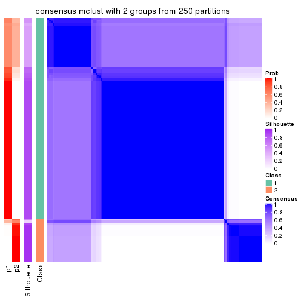</p>

</div>
<div id='tab-SD-mclust-consensus-heatmap-2'>
<pre><code class="r">consensus_heatmap(res, k = 3)
</code></pre>

<p>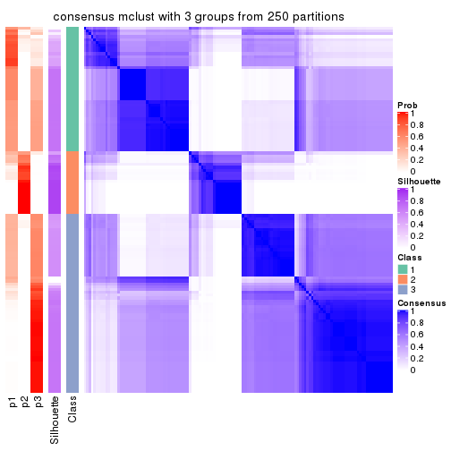</p>

</div>
<div id='tab-SD-mclust-consensus-heatmap-3'>
<pre><code class="r">consensus_heatmap(res, k = 4)
</code></pre>

<p>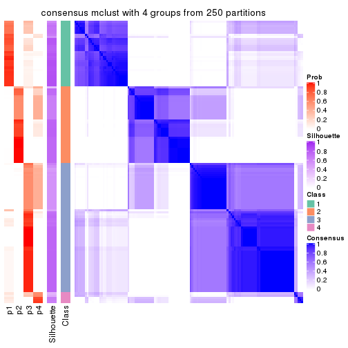</p>

</div>
<div id='tab-SD-mclust-consensus-heatmap-4'>
<pre><code class="r">consensus_heatmap(res, k = 5)
</code></pre>

<p>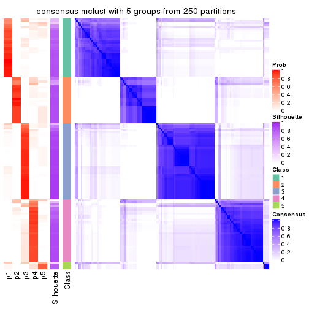</p>

</div>
<div id='tab-SD-mclust-consensus-heatmap-5'>
<pre><code class="r">consensus_heatmap(res, k = 6)
</code></pre>

<p>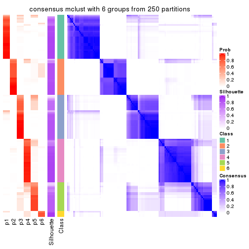</p>

</div>
</div>

Heatmaps for the membership of samples in all partitions to see how consistent they are:


<script>
$( function() {
	$( '#tabs-SD-mclust-membership-heatmap' ).tabs();
} );
</script>
<div id='tabs-SD-mclust-membership-heatmap'>
<ul>
<li><a href='#tab-SD-mclust-membership-heatmap-1'>k = 2</a></li>
<li><a href='#tab-SD-mclust-membership-heatmap-2'>k = 3</a></li>
<li><a href='#tab-SD-mclust-membership-heatmap-3'>k = 4</a></li>
<li><a href='#tab-SD-mclust-membership-heatmap-4'>k = 5</a></li>
<li><a href='#tab-SD-mclust-membership-heatmap-5'>k = 6</a></li>
</ul>
<div id='tab-SD-mclust-membership-heatmap-1'>
<pre><code class="r">membership_heatmap(res, k = 2)
</code></pre>

<p>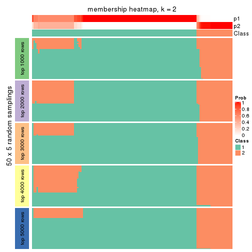</p>

</div>
<div id='tab-SD-mclust-membership-heatmap-2'>
<pre><code class="r">membership_heatmap(res, k = 3)
</code></pre>

<p>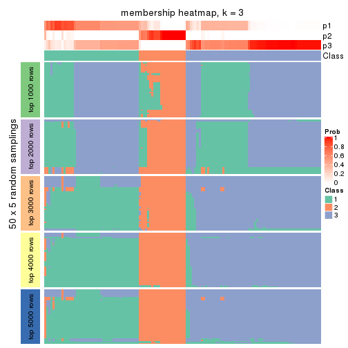</p>

</div>
<div id='tab-SD-mclust-membership-heatmap-3'>
<pre><code class="r">membership_heatmap(res, k = 4)
</code></pre>

<p>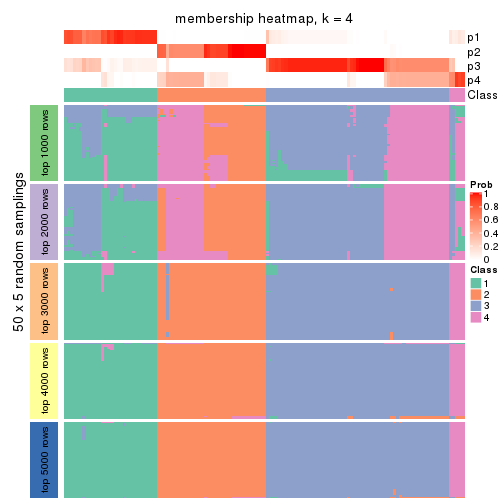</p>

</div>
<div id='tab-SD-mclust-membership-heatmap-4'>
<pre><code class="r">membership_heatmap(res, k = 5)
</code></pre>

<p>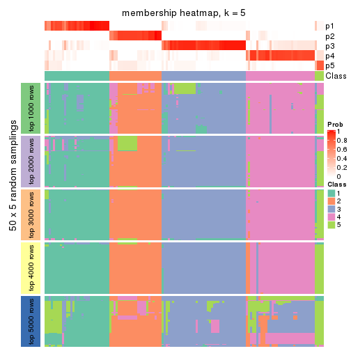</p>

</div>
<div id='tab-SD-mclust-membership-heatmap-5'>
<pre><code class="r">membership_heatmap(res, k = 6)
</code></pre>

<p>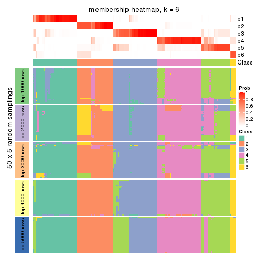</p>

</div>
</div>

As soon as we have had the classes for columns, we can look for signatures
which are significantly different between classes which can be candidate marks
for certain classes. Following are the heatmaps for signatures.


Signature heatmaps where rows are scaled:


<script>
$( function() {
	$( '#tabs-SD-mclust-get-signatures' ).tabs();
} );
</script>
<div id='tabs-SD-mclust-get-signatures'>
<ul>
<li><a href='#tab-SD-mclust-get-signatures-1'>k = 2</a></li>
<li><a href='#tab-SD-mclust-get-signatures-2'>k = 3</a></li>
<li><a href='#tab-SD-mclust-get-signatures-3'>k = 4</a></li>
<li><a href='#tab-SD-mclust-get-signatures-4'>k = 5</a></li>
<li><a href='#tab-SD-mclust-get-signatures-5'>k = 6</a></li>
</ul>
<div id='tab-SD-mclust-get-signatures-1'>
<pre><code class="r">get_signatures(res, k = 2)
</code></pre>

<p>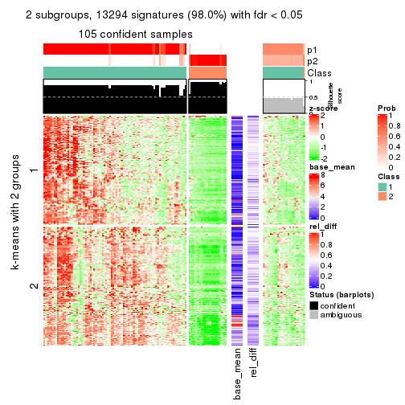</p>

</div>
<div id='tab-SD-mclust-get-signatures-2'>
<pre><code class="r">get_signatures(res, k = 3)
</code></pre>

<p>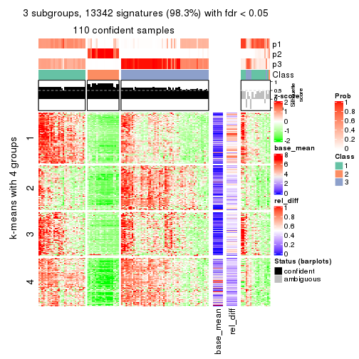</p>

</div>
<div id='tab-SD-mclust-get-signatures-3'>
<pre><code class="r">get_signatures(res, k = 4)
</code></pre>

<p>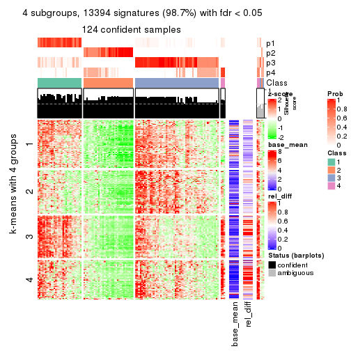</p>

</div>
<div id='tab-SD-mclust-get-signatures-4'>
<pre><code class="r">get_signatures(res, k = 5)
</code></pre>

<p>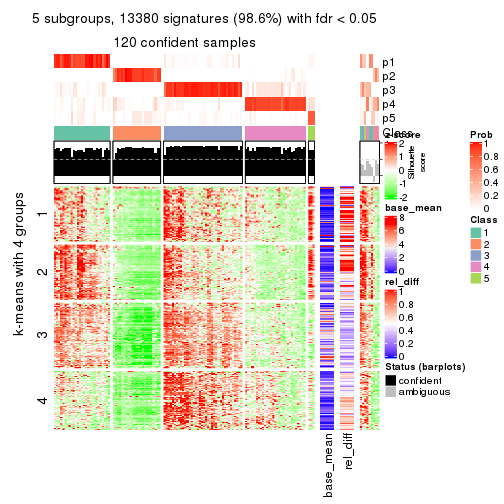</p>

</div>
<div id='tab-SD-mclust-get-signatures-5'>
<pre><code class="r">get_signatures(res, k = 6)
</code></pre>

<p>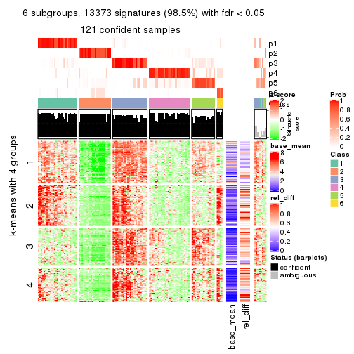</p>

</div>
</div>


Signature heatmaps where rows are not scaled:


<script>
$( function() {
	$( '#tabs-SD-mclust-get-signatures-no-scale' ).tabs();
} );
</script>
<div id='tabs-SD-mclust-get-signatures-no-scale'>
<ul>
<li><a href='#tab-SD-mclust-get-signatures-no-scale-1'>k = 2</a></li>
<li><a href='#tab-SD-mclust-get-signatures-no-scale-2'>k = 3</a></li>
<li><a href='#tab-SD-mclust-get-signatures-no-scale-3'>k = 4</a></li>
<li><a href='#tab-SD-mclust-get-signatures-no-scale-4'>k = 5</a></li>
<li><a href='#tab-SD-mclust-get-signatures-no-scale-5'>k = 6</a></li>
</ul>
<div id='tab-SD-mclust-get-signatures-no-scale-1'>
<pre><code class="r">get_signatures(res, k = 2, scale_rows = FALSE)
</code></pre>

<p>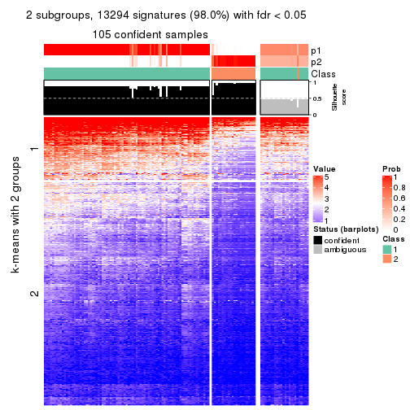</p>

</div>
<div id='tab-SD-mclust-get-signatures-no-scale-2'>
<pre><code class="r">get_signatures(res, k = 3, scale_rows = FALSE)
</code></pre>

<p>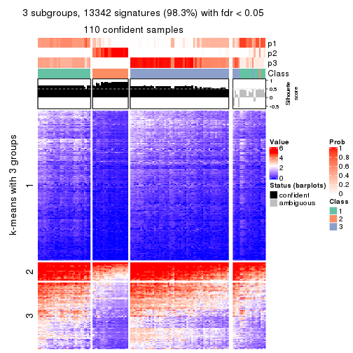</p>

</div>
<div id='tab-SD-mclust-get-signatures-no-scale-3'>
<pre><code class="r">get_signatures(res, k = 4, scale_rows = FALSE)
</code></pre>

<p>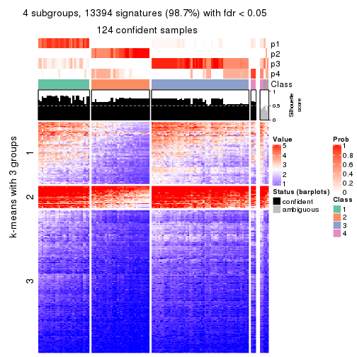</p>

</div>
<div id='tab-SD-mclust-get-signatures-no-scale-4'>
<pre><code class="r">get_signatures(res, k = 5, scale_rows = FALSE)
</code></pre>

<p>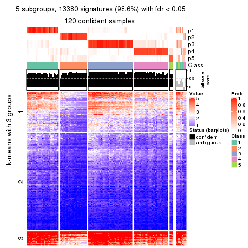</p>

</div>
<div id='tab-SD-mclust-get-signatures-no-scale-5'>
<pre><code class="r">get_signatures(res, k = 6, scale_rows = FALSE)
</code></pre>

<p>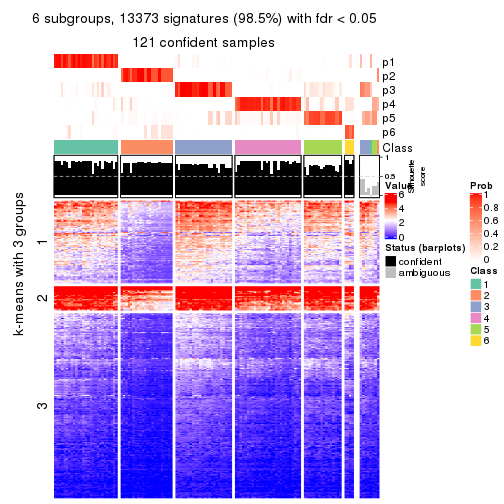</p>

</div>
</div>


Compare the overlap of signatures from different k:

```r
compare_signatures(res)
```

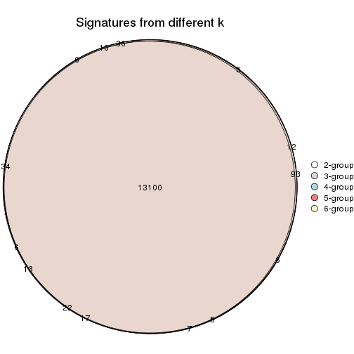

`get_signature()` returns a data frame invisibly. TO get the list of signatures, the function
call should be assigned to a variable explicitly. In following code, if `plot` argument is set
to `FALSE`, no heatmap is plotted while only the differential analysis is performed.

```r
# code only for demonstration
tb = get_signature(res, k = ..., plot = FALSE)
```

An example of the output of `tb` is:

```
#>   which_row         fdr    mean_1    mean_2 scaled_mean_1 scaled_mean_2 km
#> 1        38 0.042760348  8.373488  9.131774    -0.5533452     0.5164555  1
#> 2        40 0.018707592  7.106213  8.469186    -0.6173731     0.5762149  1
#> 3        55 0.019134737 10.221463 11.207825    -0.6159697     0.5749050  1
#> 4        59 0.006059896  5.921854  7.869574    -0.6899429     0.6439467  1
#> 5        60 0.018055526  8.928898 10.211722    -0.6204761     0.5791110  1
#> 6        98 0.009384629 15.714769 14.887706     0.6635654    -0.6193277  2
...
```

The columns in `tb` are:

1. `which_row`: row indices corresponding to the input matrix.
2. `fdr`: FDR for the differential test. 
3. `mean_x`: The mean value in group x.
4. `scaled_mean_x`: The mean value in group x after rows are scaled.
5. `km`: Row groups if k-means clustering is applied to rows.


UMAP plot which shows how samples are separated.


<script>
$( function() {
	$( '#tabs-SD-mclust-dimension-reduction' ).tabs();
} );
</script>
<div id='tabs-SD-mclust-dimension-reduction'>
<ul>
<li><a href='#tab-SD-mclust-dimension-reduction-1'>k = 2</a></li>
<li><a href='#tab-SD-mclust-dimension-reduction-2'>k = 3</a></li>
<li><a href='#tab-SD-mclust-dimension-reduction-3'>k = 4</a></li>
<li><a href='#tab-SD-mclust-dimension-reduction-4'>k = 5</a></li>
<li><a href='#tab-SD-mclust-dimension-reduction-5'>k = 6</a></li>
</ul>
<div id='tab-SD-mclust-dimension-reduction-1'>
<pre><code class="r">dimension_reduction(res, k = 2, method = &quot;UMAP&quot;)
</code></pre>

<p>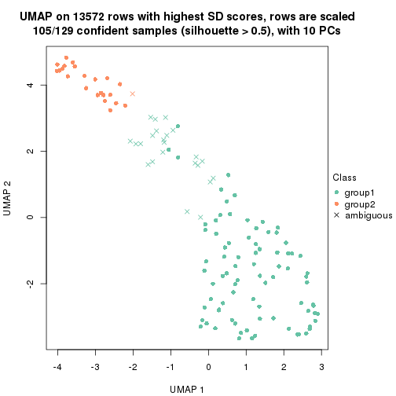</p>

</div>
<div id='tab-SD-mclust-dimension-reduction-2'>
<pre><code class="r">dimension_reduction(res, k = 3, method = &quot;UMAP&quot;)
</code></pre>

<p>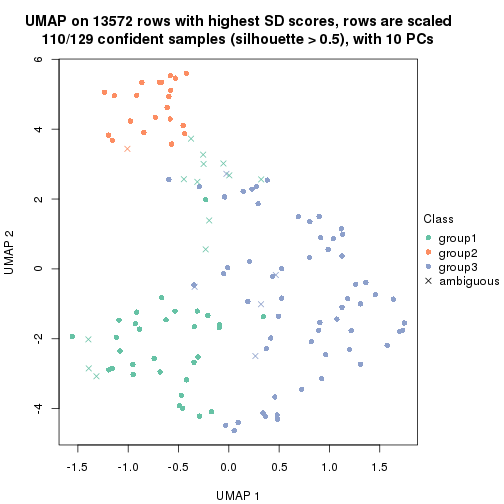</p>

</div>
<div id='tab-SD-mclust-dimension-reduction-3'>
<pre><code class="r">dimension_reduction(res, k = 4, method = &quot;UMAP&quot;)
</code></pre>

<p>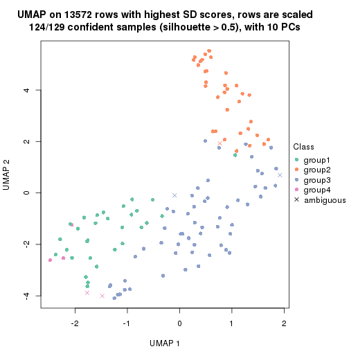</p>

</div>
<div id='tab-SD-mclust-dimension-reduction-4'>
<pre><code class="r">dimension_reduction(res, k = 5, method = &quot;UMAP&quot;)
</code></pre>

<p>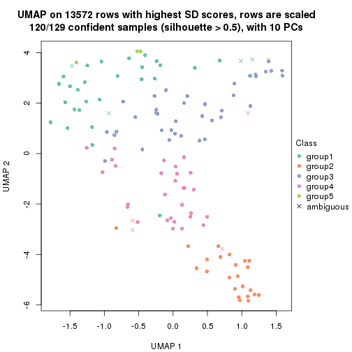</p>

</div>
<div id='tab-SD-mclust-dimension-reduction-5'>
<pre><code class="r">dimension_reduction(res, k = 6, method = &quot;UMAP&quot;)
</code></pre>

<p>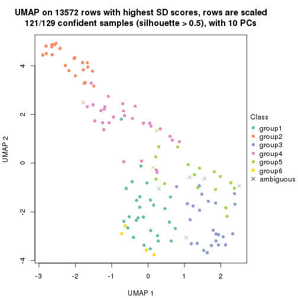</p>

</div>
</div>


Following heatmap shows how subgroups are split when increasing `k`:

```r
collect_classes(res)
```

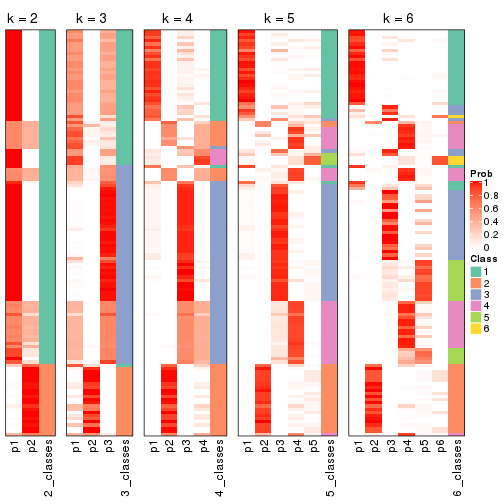


If matrix rows can be associated to genes, consider to use `GO_Enrichment(res,
...)` to perform function enrichment for the signature genes.


 

---------------------------------------------------


### SD:NMF


The object with results only for a single top-value method and a single partition method 
can be extracted as:

```r
res = res_list["SD", "NMF"]
# you can also extract it by
# res = res_list["SD:NMF"]
```

A summary of `res` and all the functions that can be applied to it:

```r
res
```

```
#> A 'ConsensusPartition' object with k = 2, 3, 4, 5, 6.
#>   On a matrix with 13572 rows and 129 columns.
#>   Top rows (1000, 2000, 3000, 4000, 5000) are extracted by 'SD' method.
#>   Subgroups are detected by 'NMF' method.
#>   Performed in total 1250 partitions by row resampling.
#>   Best k for subgroups seems to be 2.
#> 
#> Following methods can be applied to this 'ConsensusPartition' object:
#>  [1] "cola_report"             "collect_classes"         "collect_plots"          
#>  [4] "collect_stats"           "colnames"                "compare_signatures"     
#>  [7] "consensus_heatmap"       "dimension_reduction"     "functional_enrichment"  
#> [10] "get_anno_col"            "get_anno"                "get_classes"            
#> [13] "get_consensus"           "get_matrix"              "get_membership"         
#> [16] "get_param"               "get_signatures"          "get_stats"              
#> [19] "is_best_k"               "is_stable_k"             "membership_heatmap"     
#> [22] "ncol"                    "nrow"                    "plot_ecdf"              
#> [25] "rownames"                "select_partition_number" "show"                   
#> [28] "suggest_best_k"          "test_to_known_factors"
```

`collect_plots()` function collects all the plots made from `res` for all `k` (number of partitions)
into one single page to provide an easy and fast comparison between different `k`.

```r
collect_plots(res)
```

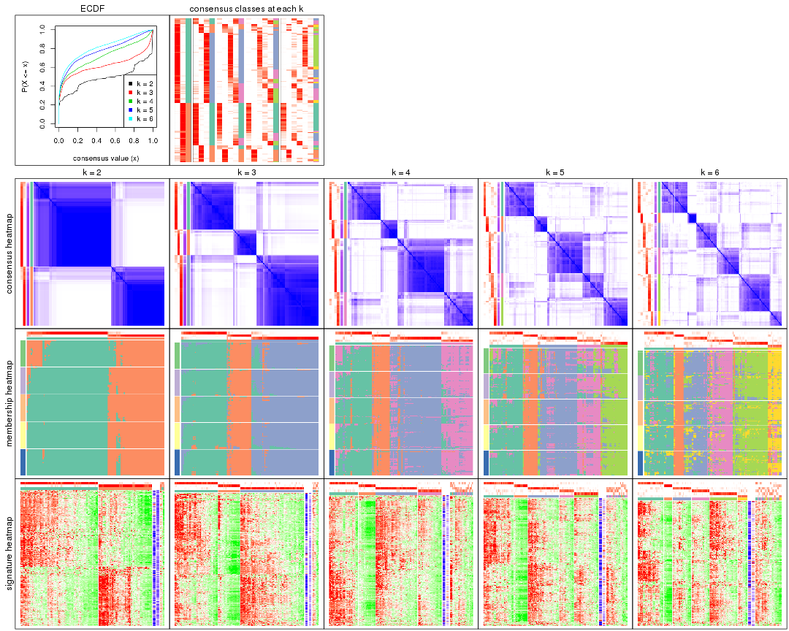

The plots are:

- The first row: a plot of the ECDF (Empirical cumulative distribution
  function) curves of the consensus matrix for each `k` and the heatmap of
  predicted classes for each `k`.
- The second row: heatmaps of the consensus matrix for each `k`.
- The third row: heatmaps of the membership matrix for each `k`.
- The fouth row: heatmaps of the signatures for each `k`.

All the plots in panels can be made by individual functions and they are
plotted later in this section.

`select_partition_number()` produces several plots showing different
statistics for choosing "optimized" `k`. There are following statistics:

- ECDF curves of the consensus matrix for each `k`;
- 1-PAC. [The PAC
  score](https://en.wikipedia.org/wiki/Consensus_clustering#Over-interpretation_potential_of_consensus_clustering)
  measures the proportion of the ambiguous subgrouping.
- Mean silhouette score.
- Concordance. The mean probability of fiting the consensus class ids in all
  partitions.
- Area increased. Denote $A_k$ as the area under the ECDF curve for current
  `k`, the area increased is defined as $A_k - A_{k-1}$.
- Rand index. The percent of pairs of samples that are both in a same cluster
  or both are not in a same cluster in the partition of k and k-1.
- Jaccard index. The ratio of pairs of samples are both in a same cluster in
  the partition of k and k-1 and the pairs of samples are both in a same
  cluster in the partition k or k-1.

The detailed explanations of these statistics can be found in [the cola
vignette](http://bioconductor.org/packages/devel/bioc/vignettes/cola/inst/doc/cola.html#toc_13).

Generally speaking, lower PAC score, higher mean silhouette score or higher
concordance corresponds to better partition. Rand index and Jaccard index
measure how similar the current partition is compared to partition with `k-1`.
If they are too similar, we won't accept `k` is better than `k-1`.

```r
select_partition_number(res)
```

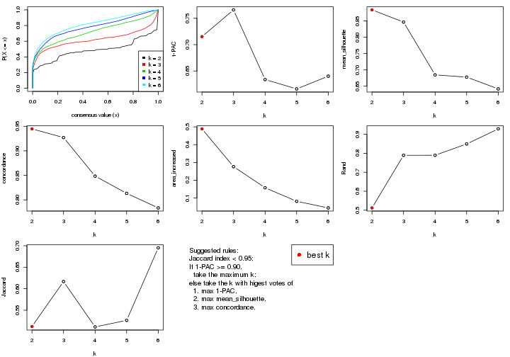

The numeric values for all these statistics can be obtained by `get_stats()`.

```r
get_stats(res)
```

```
#>   k 1-PAC mean_silhouette concordance area_increased  Rand Jaccard
#> 2 2 0.715           0.884       0.945         0.4886 0.512   0.512
#> 3 3 0.766           0.847       0.927         0.2763 0.789   0.617
#> 4 4 0.634           0.685       0.848         0.1578 0.790   0.511
#> 5 5 0.616           0.678       0.813         0.0817 0.849   0.526
#> 6 6 0.640           0.642       0.784         0.0445 0.929   0.695
```

`suggest_best_k()` suggests the best $k$ based on these statistics. The rules are as follows:

- All $k$ with Jaccard index larger than 0.95 are removed because the increase of
  the partition number does not provides enough extra information. If all $k$ are removed,
  the best $k$ is assigned by `NA`.
- For $k$ with 1-PAC larger than 0.9, the maximal $k$ is taken as the "best k". Other $k$ is called "optional k".
- If it does not fit the second rule. The $k$ with the highest vote of highest
  1-PAC, mean silhouette and concordance is taken as the "best k".

```r
suggest_best_k(res)
```

```
#> [1] 2
```


Following shows the table of the partitions (You need to click the **show/hide
code output** link to see it). The membership matrix (columns with name `p*`)
is inferred by
[`clue::cl_consensus()`](https://www.rdocumentation.org/link/cl_consensus?package=clue)
function with the `SE` method. Basically the value in the membership matrix
represents the probability to belong to a certain group. The finall class
label for an item is determined with the group with highest probability it
belongs to.

In `get_classes()` function, the entropy is calculated from the membership
matrix and the silhouette score is calculated from the consensus matrix.


<script>
$( function() {
	$( '#tabs-SD-NMF-get-classes' ).tabs();
} );
</script>
<div id='tabs-SD-NMF-get-classes'>
<ul>
<li><a href='#tab-SD-NMF-get-classes-1'>k = 2</a></li>
<li><a href='#tab-SD-NMF-get-classes-2'>k = 3</a></li>
<li><a href='#tab-SD-NMF-get-classes-3'>k = 4</a></li>
<li><a href='#tab-SD-NMF-get-classes-4'>k = 5</a></li>
<li><a href='#tab-SD-NMF-get-classes-5'>k = 6</a></li>
</ul>

<div id='tab-SD-NMF-get-classes-1'>
<p><a id='tab-SD-NMF-get-classes-1-a' style='color:#0366d6' href='#'>show/hide code output</a></p>
<pre><code class="r">cbind(get_classes(res, k = 2), get_membership(res, k = 2))
</code></pre>

<pre><code>#&gt;            class entropy silhouette    p1    p2
#&gt; SRR1656463     1  0.0000     0.9410 1.000 0.000
#&gt; SRR1656464     2  0.0376     0.9340 0.004 0.996
#&gt; SRR1656462     1  0.0000     0.9410 1.000 0.000
#&gt; SRR1656465     1  0.0000     0.9410 1.000 0.000
#&gt; SRR1656467     1  0.0000     0.9410 1.000 0.000
#&gt; SRR1656466     1  0.0000     0.9410 1.000 0.000
#&gt; SRR1656468     1  0.0000     0.9410 1.000 0.000
#&gt; SRR1656472     2  0.4022     0.8839 0.080 0.920
#&gt; SRR1656471     1  0.0000     0.9410 1.000 0.000
#&gt; SRR1656470     1  0.0000     0.9410 1.000 0.000
#&gt; SRR1656469     1  0.0000     0.9410 1.000 0.000
#&gt; SRR1656473     2  0.7219     0.7674 0.200 0.800
#&gt; SRR1656474     2  0.6247     0.8171 0.156 0.844
#&gt; SRR1656475     2  0.9710     0.4188 0.400 0.600
#&gt; SRR1656478     2  0.0000     0.9357 0.000 1.000
#&gt; SRR1656477     1  0.0000     0.9410 1.000 0.000
#&gt; SRR1656479     1  0.8813     0.6280 0.700 0.300
#&gt; SRR1656480     1  0.0000     0.9410 1.000 0.000
#&gt; SRR1656476     1  0.0000     0.9410 1.000 0.000
#&gt; SRR1656481     1  0.0000     0.9410 1.000 0.000
#&gt; SRR1656482     1  0.0000     0.9410 1.000 0.000
#&gt; SRR1656483     1  0.0000     0.9410 1.000 0.000
#&gt; SRR1656485     1  0.0000     0.9410 1.000 0.000
#&gt; SRR1656487     1  0.0000     0.9410 1.000 0.000
#&gt; SRR1656486     1  0.8608     0.6564 0.716 0.284
#&gt; SRR1656488     1  0.0000     0.9410 1.000 0.000
#&gt; SRR1656484     2  0.8267     0.6324 0.260 0.740
#&gt; SRR1656489     2  0.0376     0.9341 0.004 0.996
#&gt; SRR1656491     1  0.0376     0.9393 0.996 0.004
#&gt; SRR1656490     1  0.9732     0.3963 0.596 0.404
#&gt; SRR1656492     1  0.7139     0.7830 0.804 0.196
#&gt; SRR1656493     2  0.0000     0.9357 0.000 1.000
#&gt; SRR1656495     2  0.0000     0.9357 0.000 1.000
#&gt; SRR1656496     1  0.7139     0.7834 0.804 0.196
#&gt; SRR1656494     1  0.4161     0.8722 0.916 0.084
#&gt; SRR1656497     1  0.0000     0.9410 1.000 0.000
#&gt; SRR1656499     1  0.0000     0.9410 1.000 0.000
#&gt; SRR1656500     1  0.2043     0.9237 0.968 0.032
#&gt; SRR1656501     1  1.0000     0.0936 0.504 0.496
#&gt; SRR1656498     2  0.0000     0.9357 0.000 1.000
#&gt; SRR1656504     1  0.7376     0.7686 0.792 0.208
#&gt; SRR1656502     2  0.0000     0.9357 0.000 1.000
#&gt; SRR1656503     2  0.7299     0.7273 0.204 0.796
#&gt; SRR1656507     2  0.0000     0.9357 0.000 1.000
#&gt; SRR1656508     2  0.0000     0.9357 0.000 1.000
#&gt; SRR1656505     1  0.0000     0.9410 1.000 0.000
#&gt; SRR1656506     1  0.0376     0.9393 0.996 0.004
#&gt; SRR1656509     1  0.0000     0.9410 1.000 0.000
#&gt; SRR1656510     1  0.2603     0.9163 0.956 0.044
#&gt; SRR1656511     2  0.0000     0.9357 0.000 1.000
#&gt; SRR1656513     2  0.6438     0.8086 0.164 0.836
#&gt; SRR1656512     2  0.0000     0.9357 0.000 1.000
#&gt; SRR1656514     2  0.2778     0.9046 0.048 0.952
#&gt; SRR1656515     1  0.0000     0.9410 1.000 0.000
#&gt; SRR1656516     2  0.9209     0.4660 0.336 0.664
#&gt; SRR1656518     2  0.0000     0.9357 0.000 1.000
#&gt; SRR1656517     2  0.0000     0.9357 0.000 1.000
#&gt; SRR1656519     1  0.0938     0.9352 0.988 0.012
#&gt; SRR1656522     2  0.2423     0.9109 0.040 0.960
#&gt; SRR1656523     1  0.7299     0.7736 0.796 0.204
#&gt; SRR1656521     2  0.0000     0.9357 0.000 1.000
#&gt; SRR1656520     1  0.0000     0.9410 1.000 0.000
#&gt; SRR1656524     2  0.0000     0.9357 0.000 1.000
#&gt; SRR1656525     1  0.0376     0.9393 0.996 0.004
#&gt; SRR1656526     1  0.0000     0.9410 1.000 0.000
#&gt; SRR1656527     2  0.0000     0.9357 0.000 1.000
#&gt; SRR1656530     1  0.0000     0.9410 1.000 0.000
#&gt; SRR1656529     1  0.0000     0.9410 1.000 0.000
#&gt; SRR1656531     2  0.0000     0.9357 0.000 1.000
#&gt; SRR1656528     1  0.0000     0.9410 1.000 0.000
#&gt; SRR1656534     1  0.7139     0.7830 0.804 0.196
#&gt; SRR1656533     2  0.0000     0.9357 0.000 1.000
#&gt; SRR1656536     1  0.0000     0.9410 1.000 0.000
#&gt; SRR1656532     2  0.0000     0.9357 0.000 1.000
#&gt; SRR1656537     2  0.0000     0.9357 0.000 1.000
#&gt; SRR1656538     1  0.7219     0.7784 0.800 0.200
#&gt; SRR1656535     2  0.0000     0.9357 0.000 1.000
#&gt; SRR1656539     1  0.0000     0.9410 1.000 0.000
#&gt; SRR1656544     1  0.0376     0.9393 0.996 0.004
#&gt; SRR1656542     1  0.4298     0.8837 0.912 0.088
#&gt; SRR1656543     1  0.0000     0.9410 1.000 0.000
#&gt; SRR1656545     2  0.6247     0.8173 0.156 0.844
#&gt; SRR1656540     1  0.0000     0.9410 1.000 0.000
#&gt; SRR1656546     2  0.0000     0.9357 0.000 1.000
#&gt; SRR1656541     1  0.0000     0.9410 1.000 0.000
#&gt; SRR1656547     1  0.0000     0.9410 1.000 0.000
#&gt; SRR1656548     1  0.2603     0.9162 0.956 0.044
#&gt; SRR1656549     2  0.0000     0.9357 0.000 1.000
#&gt; SRR1656551     1  0.0000     0.9410 1.000 0.000
#&gt; SRR1656553     1  0.0376     0.9393 0.996 0.004
#&gt; SRR1656550     1  0.0000     0.9410 1.000 0.000
#&gt; SRR1656552     1  0.6712     0.8042 0.824 0.176
#&gt; SRR1656554     1  0.0000     0.9410 1.000 0.000
#&gt; SRR1656555     1  0.0000     0.9410 1.000 0.000
#&gt; SRR1656556     1  0.0000     0.9410 1.000 0.000
#&gt; SRR1656557     1  0.0000     0.9410 1.000 0.000
#&gt; SRR1656558     2  0.0000     0.9357 0.000 1.000
#&gt; SRR1656559     2  0.0672     0.9318 0.008 0.992
#&gt; SRR1656560     1  0.0000     0.9410 1.000 0.000
#&gt; SRR1656561     1  0.7219     0.7784 0.800 0.200
#&gt; SRR1656562     1  0.4431     0.8644 0.908 0.092
#&gt; SRR1656563     2  0.0376     0.9341 0.004 0.996
#&gt; SRR1656564     2  0.0000     0.9357 0.000 1.000
#&gt; SRR1656565     2  0.8327     0.6246 0.264 0.736
#&gt; SRR1656566     2  0.0000     0.9357 0.000 1.000
#&gt; SRR1656568     2  0.0000     0.9357 0.000 1.000
#&gt; SRR1656567     1  0.0000     0.9410 1.000 0.000
#&gt; SRR1656569     1  0.0000     0.9410 1.000 0.000
#&gt; SRR1656570     2  0.0376     0.9341 0.004 0.996
#&gt; SRR1656571     2  0.3114     0.9019 0.056 0.944
#&gt; SRR1656573     1  0.2948     0.9108 0.948 0.052
#&gt; SRR1656572     2  0.0000     0.9357 0.000 1.000
#&gt; SRR1656574     2  0.0376     0.9341 0.004 0.996
#&gt; SRR1656575     2  0.0000     0.9357 0.000 1.000
#&gt; SRR1656576     1  0.0000     0.9410 1.000 0.000
#&gt; SRR1656578     2  0.0000     0.9357 0.000 1.000
#&gt; SRR1656577     2  0.0000     0.9357 0.000 1.000
#&gt; SRR1656579     1  0.0000     0.9410 1.000 0.000
#&gt; SRR1656580     1  0.7139     0.7834 0.804 0.196
#&gt; SRR1656581     1  0.7219     0.7784 0.800 0.200
#&gt; SRR1656582     1  0.6048     0.8316 0.852 0.148
#&gt; SRR1656585     1  0.0000     0.9410 1.000 0.000
#&gt; SRR1656584     2  0.0000     0.9357 0.000 1.000
#&gt; SRR1656583     1  0.0000     0.9410 1.000 0.000
#&gt; SRR1656586     2  0.7950     0.7191 0.240 0.760
#&gt; SRR1656587     2  0.7453     0.7632 0.212 0.788
#&gt; SRR1656588     1  0.0000     0.9410 1.000 0.000
#&gt; SRR1656589     2  0.7528     0.7496 0.216 0.784
#&gt; SRR1656590     2  0.0000     0.9357 0.000 1.000
</code></pre>

<script>
$('#tab-SD-NMF-get-classes-1-a').parent().next().next().hide();
$('#tab-SD-NMF-get-classes-1-a').click(function(){
  $('#tab-SD-NMF-get-classes-1-a').parent().next().next().toggle();
  return(false);
});
</script>
</div>

<div id='tab-SD-NMF-get-classes-2'>
<p><a id='tab-SD-NMF-get-classes-2-a' style='color:#0366d6' href='#'>show/hide code output</a></p>
<pre><code class="r">cbind(get_classes(res, k = 3), get_membership(res, k = 3))
</code></pre>

<pre><code>#&gt;            class entropy silhouette    p1    p2    p3
#&gt; SRR1656463     3  0.4555    0.72828 0.000 0.200 0.800
#&gt; SRR1656464     1  0.3816    0.79139 0.852 0.148 0.000
#&gt; SRR1656462     3  0.0000    0.92024 0.000 0.000 1.000
#&gt; SRR1656465     3  0.0000    0.92024 0.000 0.000 1.000
#&gt; SRR1656467     2  0.5016    0.66733 0.000 0.760 0.240
#&gt; SRR1656466     3  0.0000    0.92024 0.000 0.000 1.000
#&gt; SRR1656468     3  0.0237    0.92075 0.004 0.000 0.996
#&gt; SRR1656472     2  0.0892    0.90512 0.020 0.980 0.000
#&gt; SRR1656471     3  0.0892    0.91163 0.000 0.020 0.980
#&gt; SRR1656470     2  0.0892    0.90399 0.000 0.980 0.020
#&gt; SRR1656469     3  0.0892    0.91814 0.020 0.000 0.980
#&gt; SRR1656473     2  0.0237    0.90719 0.004 0.996 0.000
#&gt; SRR1656474     2  0.0424    0.90715 0.008 0.992 0.000
#&gt; SRR1656475     2  0.0237    0.90709 0.000 0.996 0.004
#&gt; SRR1656478     1  0.0892    0.91502 0.980 0.000 0.020
#&gt; SRR1656477     3  0.2537    0.86947 0.000 0.080 0.920
#&gt; SRR1656479     1  0.6280    0.11604 0.540 0.000 0.460
#&gt; SRR1656480     3  0.1289    0.90461 0.000 0.032 0.968
#&gt; SRR1656476     3  0.0592    0.92019 0.012 0.000 0.988
#&gt; SRR1656481     3  0.0592    0.91562 0.000 0.012 0.988
#&gt; SRR1656482     2  0.1031    0.90289 0.000 0.976 0.024
#&gt; SRR1656483     2  0.1529    0.89393 0.000 0.960 0.040
#&gt; SRR1656485     3  0.0000    0.92024 0.000 0.000 1.000
#&gt; SRR1656487     3  0.0237    0.91894 0.000 0.004 0.996
#&gt; SRR1656486     1  0.4346    0.76509 0.816 0.000 0.184
#&gt; SRR1656488     3  0.0747    0.91938 0.016 0.000 0.984
#&gt; SRR1656484     1  0.2066    0.89366 0.940 0.000 0.060
#&gt; SRR1656489     1  0.1529    0.90842 0.960 0.000 0.040
#&gt; SRR1656491     3  0.0892    0.91814 0.020 0.000 0.980
#&gt; SRR1656490     1  0.4887    0.70230 0.772 0.000 0.228
#&gt; SRR1656492     3  0.3686    0.82951 0.140 0.000 0.860
#&gt; SRR1656493     1  0.0592    0.90736 0.988 0.012 0.000
#&gt; SRR1656495     1  0.3879    0.78691 0.848 0.152 0.000
#&gt; SRR1656496     3  0.5621    0.58832 0.308 0.000 0.692
#&gt; SRR1656494     2  0.0892    0.90399 0.000 0.980 0.020
#&gt; SRR1656497     2  0.1031    0.90274 0.000 0.976 0.024
#&gt; SRR1656499     3  0.0237    0.92075 0.004 0.000 0.996
#&gt; SRR1656500     3  0.1753    0.90491 0.048 0.000 0.952
#&gt; SRR1656501     1  0.3619    0.82224 0.864 0.000 0.136
#&gt; SRR1656498     1  0.0592    0.90736 0.988 0.012 0.000
#&gt; SRR1656504     1  0.6286    0.10906 0.536 0.000 0.464
#&gt; SRR1656502     2  0.1031    0.90378 0.024 0.976 0.000
#&gt; SRR1656503     1  0.2796    0.86873 0.908 0.000 0.092
#&gt; SRR1656507     1  0.1163    0.91323 0.972 0.000 0.028
#&gt; SRR1656508     1  0.0592    0.90736 0.988 0.012 0.000
#&gt; SRR1656505     3  0.0424    0.91743 0.000 0.008 0.992
#&gt; SRR1656506     3  0.0892    0.91814 0.020 0.000 0.980
#&gt; SRR1656509     3  0.6215    0.25948 0.000 0.428 0.572
#&gt; SRR1656510     3  0.1964    0.89946 0.056 0.000 0.944
#&gt; SRR1656511     1  0.0424    0.91418 0.992 0.000 0.008
#&gt; SRR1656513     2  0.0747    0.90605 0.016 0.984 0.000
#&gt; SRR1656512     2  0.2959    0.85233 0.100 0.900 0.000
#&gt; SRR1656514     1  0.3434    0.86626 0.904 0.064 0.032
#&gt; SRR1656515     3  0.4121    0.78118 0.000 0.168 0.832
#&gt; SRR1656516     1  0.2959    0.86046 0.900 0.000 0.100
#&gt; SRR1656518     1  0.1031    0.91415 0.976 0.000 0.024
#&gt; SRR1656517     1  0.0747    0.91488 0.984 0.000 0.016
#&gt; SRR1656519     3  0.0000    0.92024 0.000 0.000 1.000
#&gt; SRR1656522     1  0.2229    0.90916 0.944 0.012 0.044
#&gt; SRR1656523     3  0.5859    0.51021 0.344 0.000 0.656
#&gt; SRR1656521     1  0.0424    0.91422 0.992 0.000 0.008
#&gt; SRR1656520     3  0.0892    0.91163 0.000 0.020 0.980
#&gt; SRR1656524     1  0.1031    0.90108 0.976 0.024 0.000
#&gt; SRR1656525     3  0.1163    0.91498 0.028 0.000 0.972
#&gt; SRR1656526     3  0.0424    0.92065 0.008 0.000 0.992
#&gt; SRR1656527     1  0.2356    0.86876 0.928 0.072 0.000
#&gt; SRR1656530     3  0.1031    0.91663 0.024 0.000 0.976
#&gt; SRR1656529     3  0.0237    0.92075 0.004 0.000 0.996
#&gt; SRR1656531     1  0.0892    0.90327 0.980 0.020 0.000
#&gt; SRR1656528     3  0.0424    0.92065 0.008 0.000 0.992
#&gt; SRR1656534     3  0.4702    0.74540 0.212 0.000 0.788
#&gt; SRR1656533     1  0.0424    0.91418 0.992 0.000 0.008
#&gt; SRR1656536     3  0.0592    0.91562 0.000 0.012 0.988
#&gt; SRR1656532     1  0.3116    0.83518 0.892 0.108 0.000
#&gt; SRR1656537     1  0.0892    0.90327 0.980 0.020 0.000
#&gt; SRR1656538     3  0.4974    0.71092 0.236 0.000 0.764
#&gt; SRR1656535     1  0.0592    0.91478 0.988 0.000 0.012
#&gt; SRR1656539     3  0.0000    0.92024 0.000 0.000 1.000
#&gt; SRR1656544     3  0.0747    0.91944 0.016 0.000 0.984
#&gt; SRR1656542     3  0.1860    0.90228 0.052 0.000 0.948
#&gt; SRR1656543     3  0.0000    0.92024 0.000 0.000 1.000
#&gt; SRR1656545     2  0.0892    0.90512 0.020 0.980 0.000
#&gt; SRR1656540     3  0.1163    0.90726 0.000 0.028 0.972
#&gt; SRR1656546     1  0.1411    0.91044 0.964 0.000 0.036
#&gt; SRR1656541     3  0.0237    0.92075 0.004 0.000 0.996
#&gt; SRR1656547     3  0.0237    0.91894 0.000 0.004 0.996
#&gt; SRR1656548     3  0.1753    0.90454 0.048 0.000 0.952
#&gt; SRR1656549     1  0.0237    0.91285 0.996 0.000 0.004
#&gt; SRR1656551     3  0.0000    0.92024 0.000 0.000 1.000
#&gt; SRR1656553     3  0.0592    0.92006 0.012 0.000 0.988
#&gt; SRR1656550     3  0.1289    0.90461 0.000 0.032 0.968
#&gt; SRR1656552     3  0.2959    0.86594 0.100 0.000 0.900
#&gt; SRR1656554     3  0.0237    0.92075 0.004 0.000 0.996
#&gt; SRR1656555     3  0.0892    0.91814 0.020 0.000 0.980
#&gt; SRR1656556     3  0.3412    0.83009 0.000 0.124 0.876
#&gt; SRR1656557     3  0.0424    0.92084 0.008 0.000 0.992
#&gt; SRR1656558     1  0.0424    0.91422 0.992 0.000 0.008
#&gt; SRR1656559     1  0.0892    0.91502 0.980 0.000 0.020
#&gt; SRR1656560     3  0.0237    0.92075 0.004 0.000 0.996
#&gt; SRR1656561     3  0.5497    0.61611 0.292 0.000 0.708
#&gt; SRR1656562     2  0.6521   -0.00329 0.004 0.500 0.496
#&gt; SRR1656563     1  0.1529    0.90838 0.960 0.000 0.040
#&gt; SRR1656564     2  0.5859    0.48125 0.344 0.656 0.000
#&gt; SRR1656565     2  0.7860    0.61629 0.228 0.656 0.116
#&gt; SRR1656566     1  0.0592    0.90736 0.988 0.012 0.000
#&gt; SRR1656568     1  0.2165    0.87504 0.936 0.064 0.000
#&gt; SRR1656567     3  0.1411    0.90228 0.000 0.036 0.964
#&gt; SRR1656569     3  0.0592    0.92029 0.012 0.000 0.988
#&gt; SRR1656570     1  0.1964    0.89780 0.944 0.000 0.056
#&gt; SRR1656571     2  0.1031    0.90406 0.024 0.976 0.000
#&gt; SRR1656573     3  0.1289    0.91377 0.032 0.000 0.968
#&gt; SRR1656572     1  0.1411    0.91044 0.964 0.000 0.036
#&gt; SRR1656574     1  0.0892    0.91502 0.980 0.000 0.020
#&gt; SRR1656575     1  0.1163    0.91323 0.972 0.000 0.028
#&gt; SRR1656576     3  0.0747    0.91938 0.016 0.000 0.984
#&gt; SRR1656578     2  0.2878    0.85626 0.096 0.904 0.000
#&gt; SRR1656577     1  0.0892    0.91502 0.980 0.000 0.020
#&gt; SRR1656579     3  0.0747    0.91387 0.000 0.016 0.984
#&gt; SRR1656580     3  0.6244    0.22759 0.440 0.000 0.560
#&gt; SRR1656581     3  0.5058    0.70121 0.244 0.000 0.756
#&gt; SRR1656582     3  0.3038    0.86261 0.104 0.000 0.896
#&gt; SRR1656585     3  0.4842    0.71569 0.000 0.224 0.776
#&gt; SRR1656584     1  0.0000    0.91137 1.000 0.000 0.000
#&gt; SRR1656583     2  0.1529    0.89378 0.000 0.960 0.040
#&gt; SRR1656586     2  0.0237    0.90709 0.000 0.996 0.004
#&gt; SRR1656587     2  0.1529    0.89561 0.040 0.960 0.000
#&gt; SRR1656588     3  0.2356    0.87682 0.000 0.072 0.928
#&gt; SRR1656589     2  0.0000    0.90718 0.000 1.000 0.000
#&gt; SRR1656590     1  0.1753    0.88652 0.952 0.048 0.000
</code></pre>

<script>
$('#tab-SD-NMF-get-classes-2-a').parent().next().next().hide();
$('#tab-SD-NMF-get-classes-2-a').click(function(){
  $('#tab-SD-NMF-get-classes-2-a').parent().next().next().toggle();
  return(false);
});
</script>
</div>

<div id='tab-SD-NMF-get-classes-3'>
<p><a id='tab-SD-NMF-get-classes-3-a' style='color:#0366d6' href='#'>show/hide code output</a></p>
<pre><code class="r">cbind(get_classes(res, k = 4), get_membership(res, k = 4))
</code></pre>

<pre><code>#&gt;            class entropy silhouette    p1    p2    p3    p4
#&gt; SRR1656463     3  0.4225    0.71475 0.000 0.184 0.792 0.024
#&gt; SRR1656464     1  0.1943    0.79170 0.944 0.016 0.032 0.008
#&gt; SRR1656462     3  0.0564    0.85818 0.004 0.004 0.988 0.004
#&gt; SRR1656465     3  0.0592    0.85852 0.000 0.000 0.984 0.016
#&gt; SRR1656467     3  0.5126    0.10403 0.000 0.444 0.552 0.004
#&gt; SRR1656466     3  0.1211    0.85192 0.000 0.000 0.960 0.040
#&gt; SRR1656468     3  0.2345    0.81881 0.000 0.000 0.900 0.100
#&gt; SRR1656472     1  0.6246   -0.10892 0.488 0.464 0.044 0.004
#&gt; SRR1656471     3  0.0779    0.85560 0.000 0.004 0.980 0.016
#&gt; SRR1656470     2  0.0188    0.88705 0.000 0.996 0.000 0.004
#&gt; SRR1656469     3  0.2868    0.76407 0.000 0.000 0.864 0.136
#&gt; SRR1656473     2  0.0188    0.88771 0.004 0.996 0.000 0.000
#&gt; SRR1656474     2  0.0188    0.88771 0.004 0.996 0.000 0.000
#&gt; SRR1656475     2  0.0376    0.88764 0.004 0.992 0.000 0.004
#&gt; SRR1656478     1  0.1743    0.80847 0.940 0.000 0.004 0.056
#&gt; SRR1656477     3  0.0524    0.85753 0.000 0.004 0.988 0.008
#&gt; SRR1656479     4  0.2773    0.75642 0.028 0.000 0.072 0.900
#&gt; SRR1656480     3  0.1004    0.85419 0.000 0.004 0.972 0.024
#&gt; SRR1656476     4  0.3837    0.69647 0.000 0.000 0.224 0.776
#&gt; SRR1656481     3  0.0921    0.85458 0.000 0.000 0.972 0.028
#&gt; SRR1656482     2  0.4193    0.62814 0.000 0.732 0.268 0.000
#&gt; SRR1656483     3  0.5573    0.03807 0.004 0.476 0.508 0.012
#&gt; SRR1656485     3  0.0524    0.85816 0.000 0.004 0.988 0.008
#&gt; SRR1656487     3  0.0921    0.85681 0.000 0.000 0.972 0.028
#&gt; SRR1656486     4  0.2197    0.72964 0.080 0.000 0.004 0.916
#&gt; SRR1656488     3  0.1474    0.85105 0.000 0.000 0.948 0.052
#&gt; SRR1656484     1  0.4872    0.50226 0.640 0.000 0.004 0.356
#&gt; SRR1656489     1  0.2334    0.79325 0.908 0.000 0.004 0.088
#&gt; SRR1656491     4  0.5143    0.13137 0.004 0.000 0.456 0.540
#&gt; SRR1656490     4  0.4248    0.60088 0.220 0.000 0.012 0.768
#&gt; SRR1656492     4  0.5530    0.51497 0.032 0.000 0.336 0.632
#&gt; SRR1656493     1  0.0336    0.81078 0.992 0.000 0.000 0.008
#&gt; SRR1656495     1  0.1488    0.79927 0.956 0.032 0.000 0.012
#&gt; SRR1656496     4  0.3856    0.76009 0.032 0.000 0.136 0.832
#&gt; SRR1656494     3  0.5433    0.08133 0.008 0.448 0.540 0.004
#&gt; SRR1656497     2  0.2480    0.84312 0.000 0.904 0.008 0.088
#&gt; SRR1656499     3  0.1022    0.85569 0.000 0.000 0.968 0.032
#&gt; SRR1656500     3  0.0672    0.85852 0.008 0.000 0.984 0.008
#&gt; SRR1656501     4  0.4697    0.49850 0.296 0.000 0.008 0.696
#&gt; SRR1656498     1  0.0188    0.81011 0.996 0.000 0.000 0.004
#&gt; SRR1656504     4  0.1854    0.74428 0.048 0.000 0.012 0.940
#&gt; SRR1656502     1  0.5427    0.03851 0.544 0.444 0.008 0.004
#&gt; SRR1656503     1  0.4656    0.73051 0.792 0.000 0.072 0.136
#&gt; SRR1656507     1  0.3105    0.77137 0.856 0.000 0.004 0.140
#&gt; SRR1656508     1  0.1867    0.80603 0.928 0.000 0.000 0.072
#&gt; SRR1656505     3  0.1022    0.85472 0.000 0.000 0.968 0.032
#&gt; SRR1656506     4  0.3569    0.71446 0.000 0.000 0.196 0.804
#&gt; SRR1656509     3  0.1822    0.83990 0.004 0.044 0.944 0.008
#&gt; SRR1656510     4  0.5269    0.46209 0.016 0.000 0.364 0.620
#&gt; SRR1656511     4  0.1557    0.73713 0.056 0.000 0.000 0.944
#&gt; SRR1656513     2  0.0376    0.88764 0.004 0.992 0.000 0.004
#&gt; SRR1656512     2  0.1489    0.87690 0.004 0.952 0.000 0.044
#&gt; SRR1656514     1  0.4741    0.54659 0.728 0.008 0.256 0.008
#&gt; SRR1656515     3  0.1510    0.85141 0.000 0.028 0.956 0.016
#&gt; SRR1656516     4  0.5604   -0.00445 0.476 0.000 0.020 0.504
#&gt; SRR1656518     1  0.5097    0.27986 0.568 0.000 0.004 0.428
#&gt; SRR1656517     1  0.3208    0.75691 0.848 0.000 0.004 0.148
#&gt; SRR1656519     3  0.0188    0.85892 0.000 0.000 0.996 0.004
#&gt; SRR1656522     1  0.2654    0.74817 0.888 0.000 0.108 0.004
#&gt; SRR1656523     4  0.1388    0.75361 0.012 0.000 0.028 0.960
#&gt; SRR1656521     1  0.5165    0.12257 0.512 0.000 0.004 0.484
#&gt; SRR1656520     3  0.0844    0.85683 0.004 0.004 0.980 0.012
#&gt; SRR1656524     1  0.0592    0.81038 0.984 0.000 0.000 0.016
#&gt; SRR1656525     3  0.4331    0.55529 0.000 0.000 0.712 0.288
#&gt; SRR1656526     4  0.1716    0.76101 0.000 0.000 0.064 0.936
#&gt; SRR1656527     1  0.0524    0.81117 0.988 0.008 0.000 0.004
#&gt; SRR1656530     3  0.2973    0.77702 0.000 0.000 0.856 0.144
#&gt; SRR1656529     3  0.4456    0.57261 0.000 0.004 0.716 0.280
#&gt; SRR1656531     1  0.0921    0.80801 0.972 0.000 0.000 0.028
#&gt; SRR1656528     3  0.4978    0.34120 0.000 0.004 0.612 0.384
#&gt; SRR1656534     3  0.2773    0.79789 0.072 0.000 0.900 0.028
#&gt; SRR1656533     1  0.4193    0.65089 0.732 0.000 0.000 0.268
#&gt; SRR1656536     3  0.0524    0.85816 0.000 0.004 0.988 0.008
#&gt; SRR1656532     1  0.0779    0.80515 0.980 0.016 0.000 0.004
#&gt; SRR1656537     1  0.0336    0.81051 0.992 0.000 0.000 0.008
#&gt; SRR1656538     4  0.5850    0.65139 0.080 0.000 0.244 0.676
#&gt; SRR1656535     4  0.4539    0.52754 0.272 0.000 0.008 0.720
#&gt; SRR1656539     3  0.0524    0.85816 0.000 0.004 0.988 0.008
#&gt; SRR1656544     3  0.0469    0.85901 0.000 0.000 0.988 0.012
#&gt; SRR1656542     3  0.1978    0.84298 0.004 0.000 0.928 0.068
#&gt; SRR1656543     3  0.0817    0.85665 0.000 0.000 0.976 0.024
#&gt; SRR1656545     2  0.2334    0.85357 0.000 0.908 0.004 0.088
#&gt; SRR1656540     3  0.0844    0.85683 0.004 0.004 0.980 0.012
#&gt; SRR1656546     1  0.5050    0.34139 0.588 0.000 0.004 0.408
#&gt; SRR1656541     3  0.4661    0.43068 0.000 0.000 0.652 0.348
#&gt; SRR1656547     3  0.1305    0.85533 0.000 0.004 0.960 0.036
#&gt; SRR1656548     4  0.3486    0.73240 0.000 0.000 0.188 0.812
#&gt; SRR1656549     4  0.4193    0.48596 0.268 0.000 0.000 0.732
#&gt; SRR1656551     3  0.1743    0.84249 0.000 0.004 0.940 0.056
#&gt; SRR1656553     3  0.1610    0.84363 0.032 0.000 0.952 0.016
#&gt; SRR1656550     3  0.0524    0.85816 0.000 0.004 0.988 0.008
#&gt; SRR1656552     4  0.3161    0.74967 0.012 0.000 0.124 0.864
#&gt; SRR1656554     3  0.5155    0.07309 0.000 0.004 0.528 0.468
#&gt; SRR1656555     4  0.3486    0.72746 0.000 0.000 0.188 0.812
#&gt; SRR1656556     3  0.0657    0.85826 0.000 0.004 0.984 0.012
#&gt; SRR1656557     3  0.0469    0.85901 0.000 0.000 0.988 0.012
#&gt; SRR1656558     1  0.1389    0.80908 0.952 0.000 0.000 0.048
#&gt; SRR1656559     1  0.0927    0.80920 0.976 0.000 0.016 0.008
#&gt; SRR1656560     3  0.1389    0.85102 0.000 0.000 0.952 0.048
#&gt; SRR1656561     4  0.1929    0.75426 0.036 0.000 0.024 0.940
#&gt; SRR1656562     2  0.4267    0.72179 0.000 0.788 0.188 0.024
#&gt; SRR1656563     4  0.2216    0.71688 0.092 0.000 0.000 0.908
#&gt; SRR1656564     2  0.2670    0.84908 0.040 0.908 0.000 0.052
#&gt; SRR1656565     2  0.3201    0.84232 0.032 0.888 0.072 0.008
#&gt; SRR1656566     1  0.1302    0.81120 0.956 0.000 0.000 0.044
#&gt; SRR1656568     1  0.1305    0.81215 0.960 0.004 0.000 0.036
#&gt; SRR1656567     3  0.0376    0.85876 0.000 0.004 0.992 0.004
#&gt; SRR1656569     4  0.4855    0.47068 0.000 0.004 0.352 0.644
#&gt; SRR1656570     4  0.1557    0.73713 0.056 0.000 0.000 0.944
#&gt; SRR1656571     2  0.0336    0.88668 0.008 0.992 0.000 0.000
#&gt; SRR1656573     4  0.4304    0.60524 0.000 0.000 0.284 0.716
#&gt; SRR1656572     4  0.5119    0.10795 0.440 0.000 0.004 0.556
#&gt; SRR1656574     1  0.3400    0.74477 0.820 0.000 0.000 0.180
#&gt; SRR1656575     1  0.2814    0.77503 0.868 0.000 0.000 0.132
#&gt; SRR1656576     4  0.3311    0.73832 0.000 0.000 0.172 0.828
#&gt; SRR1656578     2  0.3801    0.67905 0.220 0.780 0.000 0.000
#&gt; SRR1656577     1  0.0921    0.81246 0.972 0.000 0.000 0.028
#&gt; SRR1656579     3  0.4964    0.36851 0.000 0.004 0.616 0.380
#&gt; SRR1656580     3  0.7883   -0.28192 0.292 0.000 0.380 0.328
#&gt; SRR1656581     4  0.1677    0.75756 0.012 0.000 0.040 0.948
#&gt; SRR1656582     4  0.1743    0.75925 0.000 0.004 0.056 0.940
#&gt; SRR1656585     3  0.5857    0.60720 0.004 0.172 0.712 0.112
#&gt; SRR1656584     1  0.4072    0.66288 0.748 0.000 0.000 0.252
#&gt; SRR1656583     2  0.5276    0.26326 0.004 0.560 0.432 0.004
#&gt; SRR1656586     2  0.0188    0.88771 0.004 0.996 0.000 0.000
#&gt; SRR1656587     1  0.7378    0.09600 0.448 0.140 0.408 0.004
#&gt; SRR1656588     3  0.0672    0.85817 0.000 0.008 0.984 0.008
#&gt; SRR1656589     2  0.0376    0.88722 0.004 0.992 0.004 0.000
#&gt; SRR1656590     1  0.0779    0.80770 0.980 0.004 0.000 0.016
</code></pre>

<script>
$('#tab-SD-NMF-get-classes-3-a').parent().next().next().hide();
$('#tab-SD-NMF-get-classes-3-a').click(function(){
  $('#tab-SD-NMF-get-classes-3-a').parent().next().next().toggle();
  return(false);
});
</script>
</div>

<div id='tab-SD-NMF-get-classes-4'>
<p><a id='tab-SD-NMF-get-classes-4-a' style='color:#0366d6' href='#'>show/hide code output</a></p>
<pre><code class="r">cbind(get_classes(res, k = 5), get_membership(res, k = 5))
</code></pre>

<pre><code>#&gt;            class entropy silhouette    p1    p2    p3    p4    p5
#&gt; SRR1656463     4  0.6638     0.3222 0.000 0.272 0.276 0.452 0.000
#&gt; SRR1656464     1  0.1518     0.8037 0.944 0.004 0.048 0.004 0.000
#&gt; SRR1656462     3  0.2124     0.7827 0.004 0.000 0.900 0.096 0.000
#&gt; SRR1656465     3  0.2329     0.7645 0.000 0.000 0.876 0.124 0.000
#&gt; SRR1656467     3  0.2408     0.7317 0.000 0.096 0.892 0.008 0.004
#&gt; SRR1656466     4  0.4101     0.3974 0.000 0.000 0.372 0.628 0.000
#&gt; SRR1656468     4  0.4084     0.4769 0.000 0.000 0.328 0.668 0.004
#&gt; SRR1656472     1  0.5098     0.6014 0.716 0.092 0.180 0.012 0.000
#&gt; SRR1656471     3  0.0324     0.7871 0.000 0.000 0.992 0.004 0.004
#&gt; SRR1656470     2  0.0162     0.8869 0.000 0.996 0.000 0.004 0.000
#&gt; SRR1656469     3  0.4984     0.4618 0.000 0.000 0.640 0.308 0.052
#&gt; SRR1656473     2  0.0000     0.8869 0.000 1.000 0.000 0.000 0.000
#&gt; SRR1656474     2  0.0000     0.8869 0.000 1.000 0.000 0.000 0.000
#&gt; SRR1656475     2  0.0162     0.8869 0.000 0.996 0.000 0.004 0.000
#&gt; SRR1656478     1  0.4192     0.5072 0.596 0.000 0.000 0.404 0.000
#&gt; SRR1656477     3  0.0854     0.7854 0.000 0.008 0.976 0.012 0.004
#&gt; SRR1656479     5  0.0865     0.8184 0.000 0.000 0.024 0.004 0.972
#&gt; SRR1656480     3  0.0579     0.7880 0.000 0.000 0.984 0.008 0.008
#&gt; SRR1656476     4  0.5064     0.5802 0.000 0.000 0.088 0.680 0.232
#&gt; SRR1656481     3  0.3039     0.7006 0.000 0.000 0.808 0.192 0.000
#&gt; SRR1656482     3  0.4718     0.3359 0.008 0.404 0.580 0.008 0.000
#&gt; SRR1656483     2  0.3255     0.7730 0.000 0.848 0.100 0.052 0.000
#&gt; SRR1656485     3  0.1410     0.7898 0.000 0.000 0.940 0.060 0.000
#&gt; SRR1656487     3  0.3857     0.5490 0.000 0.000 0.688 0.312 0.000
#&gt; SRR1656486     5  0.4275     0.6473 0.024 0.000 0.008 0.228 0.740
#&gt; SRR1656488     4  0.4225     0.4062 0.000 0.000 0.364 0.632 0.004
#&gt; SRR1656484     1  0.5415     0.6468 0.648 0.000 0.004 0.092 0.256
#&gt; SRR1656489     1  0.3790     0.7162 0.724 0.000 0.000 0.272 0.004
#&gt; SRR1656491     5  0.4724     0.7364 0.000 0.000 0.104 0.164 0.732
#&gt; SRR1656490     5  0.2597     0.7796 0.060 0.000 0.004 0.040 0.896
#&gt; SRR1656492     4  0.3304     0.7009 0.004 0.000 0.092 0.852 0.052
#&gt; SRR1656493     1  0.2629     0.8046 0.860 0.000 0.000 0.136 0.004
#&gt; SRR1656495     1  0.0854     0.8092 0.976 0.012 0.004 0.008 0.000
#&gt; SRR1656496     5  0.1329     0.8240 0.008 0.000 0.032 0.004 0.956
#&gt; SRR1656494     3  0.3375     0.7005 0.040 0.096 0.852 0.012 0.000
#&gt; SRR1656497     2  0.2674     0.8518 0.000 0.868 0.000 0.120 0.012
#&gt; SRR1656499     3  0.4297     0.1159 0.000 0.000 0.528 0.472 0.000
#&gt; SRR1656500     3  0.1792     0.7838 0.000 0.000 0.916 0.084 0.000
#&gt; SRR1656501     4  0.5268     0.6312 0.104 0.000 0.024 0.720 0.152
#&gt; SRR1656498     1  0.0794     0.8184 0.972 0.000 0.000 0.028 0.000
#&gt; SRR1656504     4  0.4270     0.4659 0.004 0.000 0.004 0.656 0.336
#&gt; SRR1656502     1  0.3673     0.7204 0.836 0.092 0.060 0.012 0.000
#&gt; SRR1656503     1  0.4256     0.7653 0.760 0.000 0.004 0.192 0.044
#&gt; SRR1656507     4  0.3706     0.5433 0.236 0.000 0.004 0.756 0.004
#&gt; SRR1656508     1  0.2179     0.7962 0.896 0.000 0.000 0.004 0.100
#&gt; SRR1656505     3  0.3913     0.5062 0.000 0.000 0.676 0.324 0.000
#&gt; SRR1656506     5  0.1908     0.8122 0.000 0.000 0.092 0.000 0.908
#&gt; SRR1656509     3  0.1667     0.7713 0.024 0.012 0.948 0.012 0.004
#&gt; SRR1656510     4  0.3112     0.6976 0.000 0.000 0.100 0.856 0.044
#&gt; SRR1656511     5  0.0579     0.8168 0.008 0.000 0.000 0.008 0.984
#&gt; SRR1656513     2  0.3796     0.8241 0.100 0.820 0.004 0.076 0.000
#&gt; SRR1656512     2  0.2773     0.8531 0.000 0.868 0.000 0.112 0.020
#&gt; SRR1656514     1  0.3328     0.7037 0.812 0.004 0.176 0.008 0.000
#&gt; SRR1656515     3  0.4968     0.6700 0.000 0.136 0.712 0.152 0.000
#&gt; SRR1656516     4  0.5371     0.6240 0.140 0.000 0.028 0.716 0.116
#&gt; SRR1656518     4  0.5316     0.3819 0.284 0.000 0.000 0.632 0.084
#&gt; SRR1656517     1  0.4252     0.6881 0.700 0.000 0.000 0.280 0.020
#&gt; SRR1656519     3  0.0566     0.7905 0.004 0.000 0.984 0.012 0.000
#&gt; SRR1656522     1  0.3413     0.7784 0.832 0.000 0.044 0.124 0.000
#&gt; SRR1656523     5  0.0162     0.8189 0.000 0.000 0.004 0.000 0.996
#&gt; SRR1656521     4  0.4049     0.6105 0.164 0.000 0.000 0.780 0.056
#&gt; SRR1656520     3  0.0854     0.7824 0.008 0.000 0.976 0.012 0.004
#&gt; SRR1656524     1  0.0771     0.8185 0.976 0.000 0.000 0.020 0.004
#&gt; SRR1656525     5  0.6572     0.1390 0.000 0.000 0.364 0.208 0.428
#&gt; SRR1656526     5  0.3828     0.7464 0.000 0.020 0.008 0.184 0.788
#&gt; SRR1656527     1  0.2690     0.7955 0.844 0.000 0.000 0.156 0.000
#&gt; SRR1656530     4  0.4009     0.5008 0.000 0.000 0.312 0.684 0.004
#&gt; SRR1656529     3  0.6247    -0.0779 0.000 0.000 0.428 0.144 0.428
#&gt; SRR1656531     1  0.1116     0.8119 0.964 0.000 0.004 0.004 0.028
#&gt; SRR1656528     5  0.5557     0.5528 0.000 0.000 0.260 0.116 0.624
#&gt; SRR1656534     3  0.3146     0.7247 0.052 0.000 0.856 0.000 0.092
#&gt; SRR1656533     1  0.5004     0.6722 0.672 0.000 0.000 0.072 0.256
#&gt; SRR1656536     3  0.1197     0.7912 0.000 0.000 0.952 0.048 0.000
#&gt; SRR1656532     1  0.0451     0.8145 0.988 0.008 0.000 0.004 0.000
#&gt; SRR1656537     1  0.0510     0.8171 0.984 0.000 0.000 0.016 0.000
#&gt; SRR1656538     4  0.4147     0.6862 0.016 0.000 0.064 0.804 0.116
#&gt; SRR1656535     4  0.4075     0.6490 0.060 0.000 0.000 0.780 0.160
#&gt; SRR1656539     3  0.1851     0.7834 0.000 0.000 0.912 0.088 0.000
#&gt; SRR1656544     3  0.2020     0.7801 0.000 0.000 0.900 0.100 0.000
#&gt; SRR1656542     4  0.4744     0.3178 0.000 0.000 0.408 0.572 0.020
#&gt; SRR1656543     3  0.3210     0.6955 0.000 0.000 0.788 0.212 0.000
#&gt; SRR1656545     2  0.3242     0.8431 0.000 0.844 0.000 0.116 0.040
#&gt; SRR1656540     3  0.0451     0.7863 0.004 0.000 0.988 0.008 0.000
#&gt; SRR1656546     4  0.3639     0.5952 0.184 0.000 0.000 0.792 0.024
#&gt; SRR1656541     4  0.3536     0.6051 0.000 0.000 0.156 0.812 0.032
#&gt; SRR1656547     3  0.4420     0.4073 0.000 0.000 0.548 0.448 0.004
#&gt; SRR1656548     5  0.3670     0.7659 0.000 0.000 0.068 0.112 0.820
#&gt; SRR1656549     5  0.1774     0.7960 0.052 0.000 0.000 0.016 0.932
#&gt; SRR1656551     3  0.1872     0.7815 0.000 0.000 0.928 0.020 0.052
#&gt; SRR1656553     3  0.4886     0.4807 0.032 0.000 0.596 0.372 0.000
#&gt; SRR1656550     3  0.1341     0.7918 0.000 0.000 0.944 0.056 0.000
#&gt; SRR1656552     4  0.3193     0.6884 0.004 0.000 0.032 0.852 0.112
#&gt; SRR1656554     5  0.3980     0.6405 0.000 0.000 0.284 0.008 0.708
#&gt; SRR1656555     5  0.3929     0.7401 0.000 0.000 0.028 0.208 0.764
#&gt; SRR1656556     3  0.0671     0.7897 0.000 0.004 0.980 0.016 0.000
#&gt; SRR1656557     3  0.1908     0.7802 0.000 0.000 0.908 0.092 0.000
#&gt; SRR1656558     1  0.3661     0.7091 0.724 0.000 0.000 0.276 0.000
#&gt; SRR1656559     1  0.3048     0.7845 0.820 0.000 0.004 0.176 0.000
#&gt; SRR1656560     4  0.4341     0.3037 0.000 0.000 0.404 0.592 0.004
#&gt; SRR1656561     5  0.1461     0.8205 0.004 0.000 0.016 0.028 0.952
#&gt; SRR1656562     2  0.6882     0.2510 0.000 0.476 0.020 0.184 0.320
#&gt; SRR1656563     5  0.0451     0.8165 0.008 0.000 0.000 0.004 0.988
#&gt; SRR1656564     5  0.5288     0.1693 0.052 0.404 0.000 0.000 0.544
#&gt; SRR1656565     2  0.5245     0.6803 0.096 0.720 0.024 0.000 0.160
#&gt; SRR1656566     1  0.2329     0.8078 0.876 0.000 0.000 0.124 0.000
#&gt; SRR1656568     1  0.2451     0.8211 0.904 0.004 0.000 0.056 0.036
#&gt; SRR1656567     3  0.2127     0.7754 0.000 0.000 0.892 0.108 0.000
#&gt; SRR1656569     5  0.3616     0.7547 0.000 0.000 0.164 0.032 0.804
#&gt; SRR1656570     5  0.0324     0.8173 0.004 0.000 0.000 0.004 0.992
#&gt; SRR1656571     2  0.0960     0.8800 0.016 0.972 0.008 0.004 0.000
#&gt; SRR1656573     5  0.2462     0.7997 0.000 0.000 0.112 0.008 0.880
#&gt; SRR1656572     4  0.4767     0.5595 0.200 0.000 0.004 0.724 0.072
#&gt; SRR1656574     1  0.3093     0.7654 0.824 0.000 0.000 0.008 0.168
#&gt; SRR1656575     1  0.3366     0.7990 0.828 0.000 0.000 0.140 0.032
#&gt; SRR1656576     5  0.2928     0.7981 0.000 0.000 0.064 0.064 0.872
#&gt; SRR1656578     1  0.4249     0.2728 0.568 0.432 0.000 0.000 0.000
#&gt; SRR1656577     1  0.1732     0.8169 0.920 0.000 0.000 0.080 0.000
#&gt; SRR1656579     3  0.4641    -0.0371 0.000 0.000 0.532 0.012 0.456
#&gt; SRR1656580     5  0.6090     0.6586 0.100 0.000 0.136 0.088 0.676
#&gt; SRR1656581     5  0.0324     0.8191 0.000 0.000 0.004 0.004 0.992
#&gt; SRR1656582     5  0.0162     0.8189 0.000 0.000 0.004 0.000 0.996
#&gt; SRR1656585     3  0.5714     0.5121 0.024 0.076 0.676 0.008 0.216
#&gt; SRR1656584     1  0.5198     0.7164 0.688 0.000 0.000 0.164 0.148
#&gt; SRR1656583     3  0.3878     0.6829 0.020 0.140 0.816 0.016 0.008
#&gt; SRR1656586     2  0.0000     0.8869 0.000 1.000 0.000 0.000 0.000
#&gt; SRR1656587     1  0.5278     0.4822 0.624 0.044 0.320 0.012 0.000
#&gt; SRR1656588     3  0.1041     0.7917 0.000 0.004 0.964 0.032 0.000
#&gt; SRR1656589     2  0.0613     0.8831 0.004 0.984 0.008 0.004 0.000
#&gt; SRR1656590     1  0.0324     0.8134 0.992 0.000 0.004 0.004 0.000
</code></pre>

<script>
$('#tab-SD-NMF-get-classes-4-a').parent().next().next().hide();
$('#tab-SD-NMF-get-classes-4-a').click(function(){
  $('#tab-SD-NMF-get-classes-4-a').parent().next().next().toggle();
  return(false);
});
</script>
</div>

<div id='tab-SD-NMF-get-classes-5'>
<p><a id='tab-SD-NMF-get-classes-5-a' style='color:#0366d6' href='#'>show/hide code output</a></p>
<pre><code class="r">cbind(get_classes(res, k = 6), get_membership(res, k = 6))
</code></pre>

<pre><code>#&gt;            class entropy silhouette    p1    p2    p3    p4    p5    p6
#&gt; SRR1656463     3  0.6438     0.3547 0.000 0.312 0.464 0.000 0.188 0.036
#&gt; SRR1656464     1  0.2871     0.7509 0.868 0.000 0.008 0.004 0.080 0.040
#&gt; SRR1656462     5  0.3777     0.7675 0.008 0.000 0.040 0.004 0.784 0.164
#&gt; SRR1656465     5  0.3166     0.7732 0.000 0.000 0.156 0.004 0.816 0.024
#&gt; SRR1656467     5  0.1406     0.8080 0.000 0.008 0.004 0.016 0.952 0.020
#&gt; SRR1656466     3  0.4533     0.5041 0.000 0.000 0.652 0.000 0.284 0.064
#&gt; SRR1656468     3  0.4338     0.6016 0.000 0.000 0.716 0.004 0.208 0.072
#&gt; SRR1656472     1  0.5095     0.5242 0.660 0.000 0.004 0.024 0.244 0.068
#&gt; SRR1656471     5  0.0951     0.8122 0.000 0.000 0.004 0.008 0.968 0.020
#&gt; SRR1656470     2  0.0000     0.9192 0.000 1.000 0.000 0.000 0.000 0.000
#&gt; SRR1656469     5  0.5645     0.0895 0.000 0.000 0.444 0.068 0.456 0.032
#&gt; SRR1656473     2  0.0000     0.9192 0.000 1.000 0.000 0.000 0.000 0.000
#&gt; SRR1656474     2  0.0000     0.9192 0.000 1.000 0.000 0.000 0.000 0.000
#&gt; SRR1656475     2  0.0000     0.9192 0.000 1.000 0.000 0.000 0.000 0.000
#&gt; SRR1656478     1  0.4983     0.4456 0.564 0.000 0.356 0.000 0.000 0.080
#&gt; SRR1656477     5  0.0881     0.8136 0.000 0.000 0.008 0.008 0.972 0.012
#&gt; SRR1656479     4  0.2024     0.7245 0.028 0.000 0.000 0.920 0.036 0.016
#&gt; SRR1656480     5  0.1251     0.8165 0.000 0.000 0.008 0.012 0.956 0.024
#&gt; SRR1656476     3  0.3367     0.5926 0.000 0.000 0.804 0.164 0.020 0.012
#&gt; SRR1656481     5  0.3292     0.7321 0.000 0.000 0.200 0.008 0.784 0.008
#&gt; SRR1656482     5  0.4399     0.3914 0.000 0.384 0.004 0.004 0.592 0.016
#&gt; SRR1656483     2  0.1390     0.8730 0.000 0.948 0.032 0.000 0.016 0.004
#&gt; SRR1656485     5  0.2009     0.8128 0.000 0.000 0.068 0.000 0.908 0.024
#&gt; SRR1656487     5  0.4593     0.3556 0.000 0.000 0.380 0.000 0.576 0.044
#&gt; SRR1656486     4  0.5028     0.3355 0.020 0.000 0.384 0.556 0.000 0.040
#&gt; SRR1656488     3  0.4570     0.5505 0.000 0.000 0.668 0.000 0.252 0.080
#&gt; SRR1656484     4  0.6594     0.1983 0.332 0.000 0.148 0.472 0.020 0.028
#&gt; SRR1656489     1  0.5280     0.6042 0.616 0.000 0.248 0.008 0.000 0.128
#&gt; SRR1656491     6  0.4254     0.5039 0.000 0.000 0.004 0.352 0.020 0.624
#&gt; SRR1656490     4  0.3360     0.6914 0.084 0.000 0.044 0.840 0.000 0.032
#&gt; SRR1656492     3  0.1434     0.6992 0.000 0.000 0.948 0.008 0.024 0.020
#&gt; SRR1656493     1  0.3468     0.7486 0.804 0.000 0.128 0.000 0.000 0.068
#&gt; SRR1656495     1  0.1334     0.7692 0.948 0.000 0.000 0.020 0.000 0.032
#&gt; SRR1656496     4  0.2641     0.7335 0.020 0.000 0.040 0.896 0.024 0.020
#&gt; SRR1656494     5  0.2856     0.7677 0.064 0.000 0.004 0.004 0.868 0.060
#&gt; SRR1656497     6  0.3911     0.3535 0.000 0.368 0.000 0.008 0.000 0.624
#&gt; SRR1656499     3  0.5953     0.2824 0.000 0.000 0.448 0.000 0.308 0.244
#&gt; SRR1656500     5  0.2770     0.8149 0.012 0.000 0.036 0.012 0.884 0.056
#&gt; SRR1656501     3  0.4683     0.6501 0.096 0.000 0.744 0.052 0.000 0.108
#&gt; SRR1656498     1  0.0820     0.7807 0.972 0.000 0.012 0.000 0.000 0.016
#&gt; SRR1656504     3  0.2212     0.6608 0.000 0.000 0.880 0.112 0.000 0.008
#&gt; SRR1656502     1  0.3984     0.6899 0.800 0.000 0.004 0.028 0.100 0.068
#&gt; SRR1656503     6  0.3773     0.6031 0.164 0.000 0.012 0.028 0.008 0.788
#&gt; SRR1656507     3  0.3319     0.6359 0.164 0.000 0.800 0.000 0.000 0.036
#&gt; SRR1656508     1  0.3110     0.6782 0.792 0.000 0.000 0.196 0.000 0.012
#&gt; SRR1656505     5  0.3967     0.4687 0.000 0.000 0.356 0.000 0.632 0.012
#&gt; SRR1656506     4  0.3035     0.7175 0.000 0.000 0.040 0.860 0.076 0.024
#&gt; SRR1656509     5  0.2935     0.7783 0.028 0.000 0.004 0.004 0.852 0.112
#&gt; SRR1656510     3  0.0291     0.6979 0.000 0.000 0.992 0.004 0.004 0.000
#&gt; SRR1656511     4  0.1167     0.7221 0.012 0.000 0.008 0.960 0.000 0.020
#&gt; SRR1656513     6  0.4682     0.4996 0.064 0.240 0.000 0.004 0.008 0.684
#&gt; SRR1656512     2  0.4083    -0.0353 0.000 0.532 0.000 0.008 0.000 0.460
#&gt; SRR1656514     1  0.4083     0.5491 0.688 0.000 0.008 0.000 0.284 0.020
#&gt; SRR1656515     5  0.5031     0.6998 0.000 0.060 0.092 0.000 0.712 0.136
#&gt; SRR1656516     3  0.4272     0.6516 0.104 0.000 0.776 0.044 0.000 0.076
#&gt; SRR1656518     3  0.4150     0.6061 0.168 0.000 0.760 0.048 0.000 0.024
#&gt; SRR1656517     1  0.4729     0.6242 0.660 0.000 0.264 0.008 0.000 0.068
#&gt; SRR1656519     5  0.1515     0.8172 0.000 0.000 0.020 0.008 0.944 0.028
#&gt; SRR1656522     1  0.4178     0.7004 0.764 0.000 0.016 0.004 0.056 0.160
#&gt; SRR1656523     4  0.1049     0.7195 0.000 0.000 0.008 0.960 0.000 0.032
#&gt; SRR1656521     3  0.3978     0.6591 0.112 0.000 0.792 0.028 0.000 0.068
#&gt; SRR1656520     5  0.0582     0.8159 0.004 0.000 0.004 0.004 0.984 0.004
#&gt; SRR1656524     1  0.0870     0.7784 0.972 0.000 0.004 0.012 0.000 0.012
#&gt; SRR1656525     6  0.5356     0.6723 0.000 0.000 0.084 0.124 0.104 0.688
#&gt; SRR1656526     6  0.3468     0.6264 0.000 0.000 0.008 0.264 0.000 0.728
#&gt; SRR1656527     1  0.3468     0.7504 0.804 0.000 0.128 0.000 0.000 0.068
#&gt; SRR1656530     3  0.4316     0.6226 0.000 0.000 0.728 0.000 0.144 0.128
#&gt; SRR1656529     6  0.7267     0.3090 0.000 0.000 0.124 0.232 0.232 0.412
#&gt; SRR1656531     1  0.2594     0.7527 0.884 0.000 0.004 0.068 0.004 0.040
#&gt; SRR1656528     4  0.6990    -0.1740 0.000 0.000 0.116 0.388 0.132 0.364
#&gt; SRR1656534     5  0.3712     0.7061 0.024 0.000 0.004 0.168 0.788 0.016
#&gt; SRR1656533     1  0.5023     0.3715 0.564 0.000 0.036 0.376 0.000 0.024
#&gt; SRR1656536     5  0.2070     0.8188 0.000 0.000 0.044 0.000 0.908 0.048
#&gt; SRR1656532     1  0.0790     0.7724 0.968 0.000 0.000 0.000 0.000 0.032
#&gt; SRR1656537     1  0.0260     0.7785 0.992 0.000 0.008 0.000 0.000 0.000
#&gt; SRR1656538     3  0.3361     0.6799 0.040 0.000 0.848 0.040 0.004 0.068
#&gt; SRR1656535     3  0.2239     0.6919 0.040 0.004 0.912 0.028 0.000 0.016
#&gt; SRR1656539     5  0.2404     0.8095 0.000 0.000 0.080 0.000 0.884 0.036
#&gt; SRR1656544     5  0.3481     0.7772 0.000 0.000 0.124 0.000 0.804 0.072
#&gt; SRR1656542     3  0.4250     0.4564 0.004 0.000 0.664 0.016 0.308 0.008
#&gt; SRR1656543     5  0.5051     0.5941 0.000 0.000 0.208 0.004 0.648 0.140
#&gt; SRR1656545     6  0.4789     0.4979 0.000 0.268 0.000 0.092 0.000 0.640
#&gt; SRR1656540     5  0.0951     0.8148 0.000 0.000 0.008 0.004 0.968 0.020
#&gt; SRR1656546     3  0.5000     0.5650 0.144 0.000 0.668 0.008 0.000 0.180
#&gt; SRR1656541     6  0.4208     0.6631 0.000 0.000 0.140 0.028 0.064 0.768
#&gt; SRR1656547     6  0.4013     0.6555 0.000 0.000 0.104 0.004 0.124 0.768
#&gt; SRR1656548     4  0.4130     0.6035 0.000 0.000 0.264 0.700 0.008 0.028
#&gt; SRR1656549     4  0.2063     0.7115 0.060 0.000 0.008 0.912 0.000 0.020
#&gt; SRR1656551     5  0.2521     0.8130 0.000 0.000 0.020 0.032 0.892 0.056
#&gt; SRR1656553     6  0.4281     0.6328 0.032 0.000 0.064 0.000 0.140 0.764
#&gt; SRR1656550     5  0.2404     0.8093 0.000 0.000 0.036 0.000 0.884 0.080
#&gt; SRR1656552     3  0.1841     0.6984 0.000 0.000 0.920 0.008 0.008 0.064
#&gt; SRR1656554     4  0.3909     0.5958 0.000 0.000 0.020 0.732 0.236 0.012
#&gt; SRR1656555     6  0.3692     0.6479 0.000 0.000 0.008 0.244 0.012 0.736
#&gt; SRR1656556     5  0.1313     0.8191 0.000 0.000 0.016 0.004 0.952 0.028
#&gt; SRR1656557     5  0.3334     0.7918 0.000 0.000 0.052 0.004 0.820 0.124
#&gt; SRR1656558     1  0.4255     0.6745 0.708 0.000 0.224 0.000 0.000 0.068
#&gt; SRR1656559     1  0.4622     0.7087 0.720 0.000 0.132 0.000 0.012 0.136
#&gt; SRR1656560     3  0.5606     0.3403 0.000 0.000 0.512 0.000 0.324 0.164
#&gt; SRR1656561     4  0.2679     0.7149 0.000 0.000 0.096 0.868 0.004 0.032
#&gt; SRR1656562     6  0.3441     0.6849 0.000 0.060 0.004 0.092 0.012 0.832
#&gt; SRR1656563     4  0.1059     0.7236 0.016 0.000 0.004 0.964 0.000 0.016
#&gt; SRR1656564     4  0.5385     0.4672 0.132 0.228 0.000 0.624 0.000 0.016
#&gt; SRR1656565     4  0.8219     0.0955 0.076 0.352 0.044 0.368 0.076 0.084
#&gt; SRR1656566     1  0.3421     0.7600 0.824 0.000 0.116 0.016 0.000 0.044
#&gt; SRR1656568     1  0.3123     0.7807 0.864 0.004 0.040 0.040 0.000 0.052
#&gt; SRR1656567     5  0.2507     0.8080 0.000 0.004 0.072 0.000 0.884 0.040
#&gt; SRR1656569     4  0.4621     0.6580 0.000 0.000 0.112 0.724 0.148 0.016
#&gt; SRR1656570     4  0.0862     0.7239 0.004 0.000 0.008 0.972 0.000 0.016
#&gt; SRR1656571     2  0.0146     0.9170 0.000 0.996 0.000 0.000 0.000 0.004
#&gt; SRR1656573     4  0.3988     0.6999 0.000 0.000 0.060 0.796 0.104 0.040
#&gt; SRR1656572     3  0.4231     0.6404 0.140 0.000 0.760 0.016 0.000 0.084
#&gt; SRR1656574     1  0.4713     0.4505 0.620 0.000 0.004 0.320 0.000 0.056
#&gt; SRR1656575     1  0.4780     0.6900 0.708 0.000 0.180 0.024 0.000 0.088
#&gt; SRR1656576     4  0.4800     0.6229 0.000 0.000 0.192 0.692 0.012 0.104
#&gt; SRR1656578     1  0.3898     0.5345 0.684 0.296 0.000 0.000 0.000 0.020
#&gt; SRR1656577     1  0.1644     0.7823 0.932 0.000 0.040 0.000 0.000 0.028
#&gt; SRR1656579     4  0.5114     0.2156 0.000 0.000 0.052 0.492 0.444 0.012
#&gt; SRR1656580     4  0.6861     0.4321 0.184 0.000 0.052 0.548 0.040 0.176
#&gt; SRR1656581     4  0.1649     0.7297 0.000 0.000 0.040 0.936 0.008 0.016
#&gt; SRR1656582     4  0.1088     0.7240 0.000 0.000 0.016 0.960 0.000 0.024
#&gt; SRR1656585     5  0.5534     0.3601 0.016 0.000 0.004 0.284 0.592 0.104
#&gt; SRR1656584     1  0.5517     0.6640 0.644 0.000 0.172 0.148 0.000 0.036
#&gt; SRR1656583     5  0.2350     0.7937 0.000 0.016 0.004 0.008 0.896 0.076
#&gt; SRR1656586     2  0.0146     0.9177 0.000 0.996 0.000 0.000 0.004 0.000
#&gt; SRR1656587     5  0.5262     0.1824 0.404 0.000 0.004 0.008 0.520 0.064
#&gt; SRR1656588     5  0.1265     0.8180 0.000 0.000 0.044 0.000 0.948 0.008
#&gt; SRR1656589     2  0.0146     0.9177 0.000 0.996 0.000 0.000 0.004 0.000
#&gt; SRR1656590     1  0.1232     0.7715 0.956 0.000 0.000 0.016 0.004 0.024
</code></pre>

<script>
$('#tab-SD-NMF-get-classes-5-a').parent().next().next().hide();
$('#tab-SD-NMF-get-classes-5-a').click(function(){
  $('#tab-SD-NMF-get-classes-5-a').parent().next().next().toggle();
  return(false);
});
</script>
</div>
</div>

Heatmaps for the consensus matrix. It visualizes the probability of two
samples to be in a same group.


<script>
$( function() {
	$( '#tabs-SD-NMF-consensus-heatmap' ).tabs();
} );
</script>
<div id='tabs-SD-NMF-consensus-heatmap'>
<ul>
<li><a href='#tab-SD-NMF-consensus-heatmap-1'>k = 2</a></li>
<li><a href='#tab-SD-NMF-consensus-heatmap-2'>k = 3</a></li>
<li><a href='#tab-SD-NMF-consensus-heatmap-3'>k = 4</a></li>
<li><a href='#tab-SD-NMF-consensus-heatmap-4'>k = 5</a></li>
<li><a href='#tab-SD-NMF-consensus-heatmap-5'>k = 6</a></li>
</ul>
<div id='tab-SD-NMF-consensus-heatmap-1'>
<pre><code class="r">consensus_heatmap(res, k = 2)
</code></pre>

<p>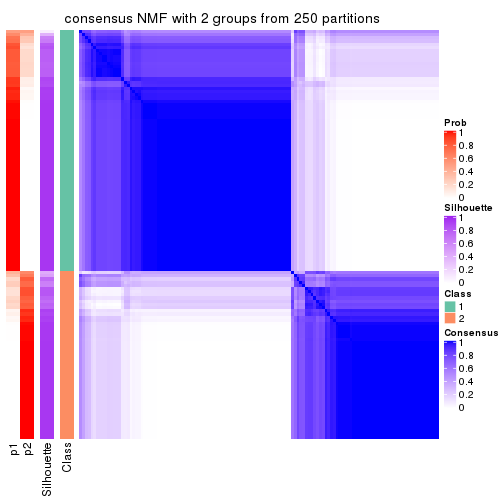</p>

</div>
<div id='tab-SD-NMF-consensus-heatmap-2'>
<pre><code class="r">consensus_heatmap(res, k = 3)
</code></pre>

<p>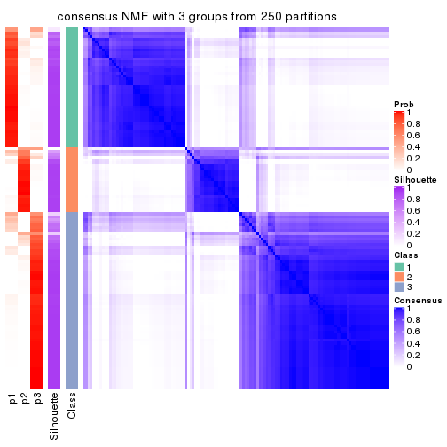</p>

</div>
<div id='tab-SD-NMF-consensus-heatmap-3'>
<pre><code class="r">consensus_heatmap(res, k = 4)
</code></pre>

<p>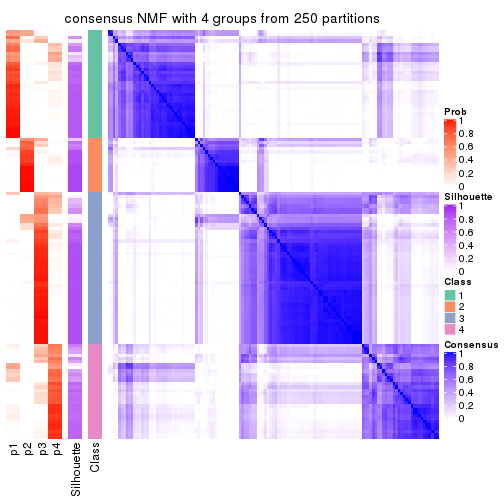</p>

</div>
<div id='tab-SD-NMF-consensus-heatmap-4'>
<pre><code class="r">consensus_heatmap(res, k = 5)
</code></pre>

<p>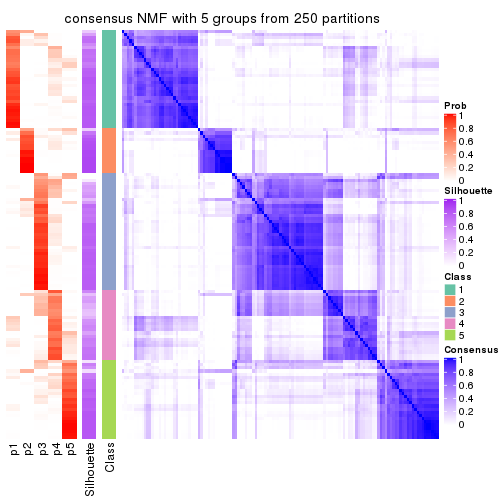</p>

</div>
<div id='tab-SD-NMF-consensus-heatmap-5'>
<pre><code class="r">consensus_heatmap(res, k = 6)
</code></pre>

<p>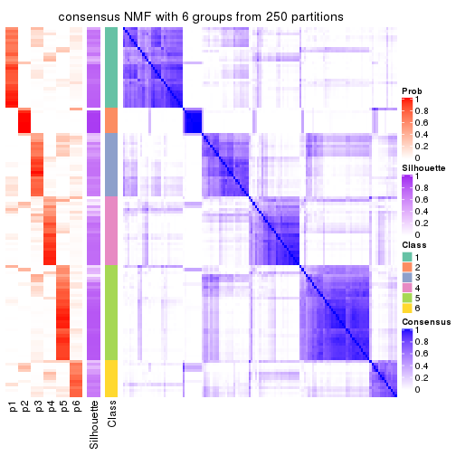</p>

</div>
</div>

Heatmaps for the membership of samples in all partitions to see how consistent they are:


<script>
$( function() {
	$( '#tabs-SD-NMF-membership-heatmap' ).tabs();
} );
</script>
<div id='tabs-SD-NMF-membership-heatmap'>
<ul>
<li><a href='#tab-SD-NMF-membership-heatmap-1'>k = 2</a></li>
<li><a href='#tab-SD-NMF-membership-heatmap-2'>k = 3</a></li>
<li><a href='#tab-SD-NMF-membership-heatmap-3'>k = 4</a></li>
<li><a href='#tab-SD-NMF-membership-heatmap-4'>k = 5</a></li>
<li><a href='#tab-SD-NMF-membership-heatmap-5'>k = 6</a></li>
</ul>
<div id='tab-SD-NMF-membership-heatmap-1'>
<pre><code class="r">membership_heatmap(res, k = 2)
</code></pre>

<p>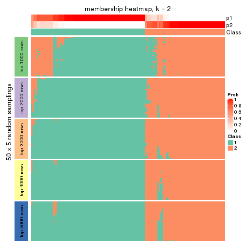</p>

</div>
<div id='tab-SD-NMF-membership-heatmap-2'>
<pre><code class="r">membership_heatmap(res, k = 3)
</code></pre>

<p>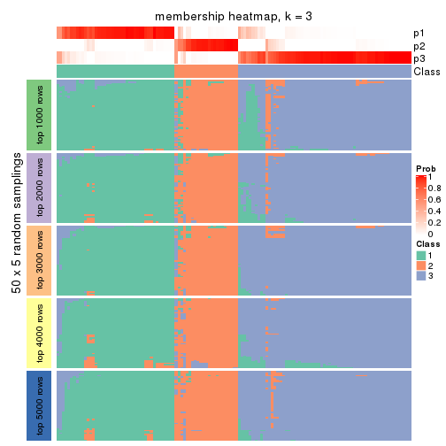</p>

</div>
<div id='tab-SD-NMF-membership-heatmap-3'>
<pre><code class="r">membership_heatmap(res, k = 4)
</code></pre>

<p>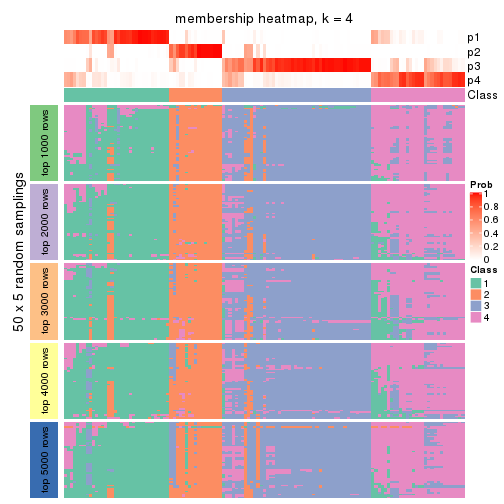</p>

</div>
<div id='tab-SD-NMF-membership-heatmap-4'>
<pre><code class="r">membership_heatmap(res, k = 5)
</code></pre>

<p>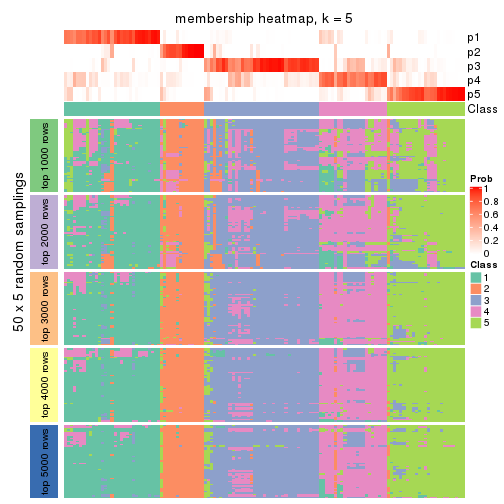</p>

</div>
<div id='tab-SD-NMF-membership-heatmap-5'>
<pre><code class="r">membership_heatmap(res, k = 6)
</code></pre>

<p>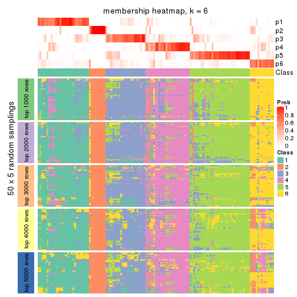</p>

</div>
</div>

As soon as we have had the classes for columns, we can look for signatures
which are significantly different between classes which can be candidate marks
for certain classes. Following are the heatmaps for signatures.


Signature heatmaps where rows are scaled:


<script>
$( function() {
	$( '#tabs-SD-NMF-get-signatures' ).tabs();
} );
</script>
<div id='tabs-SD-NMF-get-signatures'>
<ul>
<li><a href='#tab-SD-NMF-get-signatures-1'>k = 2</a></li>
<li><a href='#tab-SD-NMF-get-signatures-2'>k = 3</a></li>
<li><a href='#tab-SD-NMF-get-signatures-3'>k = 4</a></li>
<li><a href='#tab-SD-NMF-get-signatures-4'>k = 5</a></li>
<li><a href='#tab-SD-NMF-get-signatures-5'>k = 6</a></li>
</ul>
<div id='tab-SD-NMF-get-signatures-1'>
<pre><code class="r">get_signatures(res, k = 2)
</code></pre>

<p>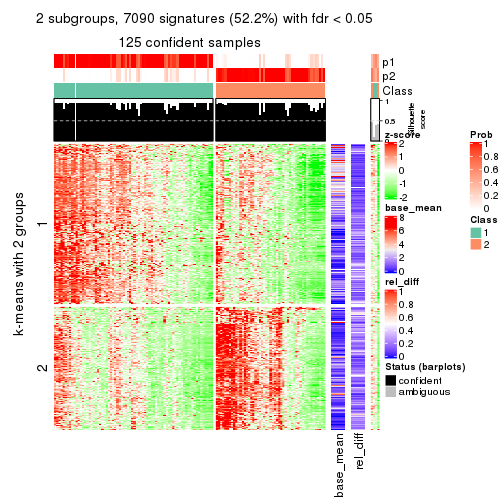</p>

</div>
<div id='tab-SD-NMF-get-signatures-2'>
<pre><code class="r">get_signatures(res, k = 3)
</code></pre>

<p>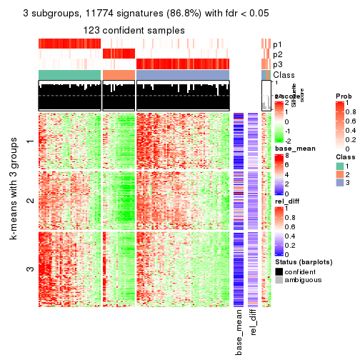</p>

</div>
<div id='tab-SD-NMF-get-signatures-3'>
<pre><code class="r">get_signatures(res, k = 4)
</code></pre>

<p>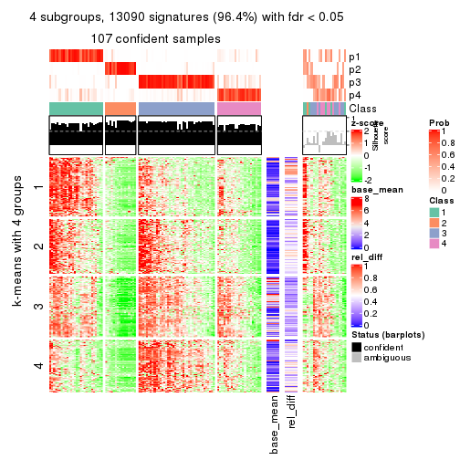</p>

</div>
<div id='tab-SD-NMF-get-signatures-4'>
<pre><code class="r">get_signatures(res, k = 5)
</code></pre>

<p>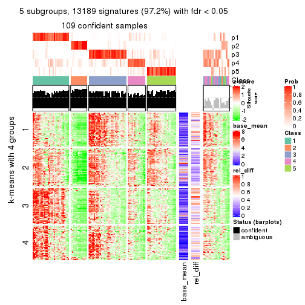</p>

</div>
<div id='tab-SD-NMF-get-signatures-5'>
<pre><code class="r">get_signatures(res, k = 6)
</code></pre>

<p>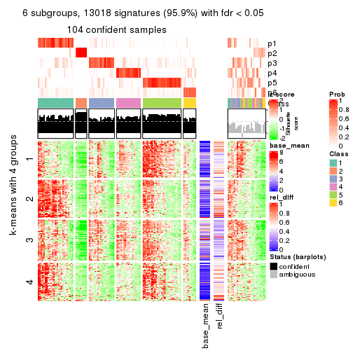</p>

</div>
</div>


Signature heatmaps where rows are not scaled:


<script>
$( function() {
	$( '#tabs-SD-NMF-get-signatures-no-scale' ).tabs();
} );
</script>
<div id='tabs-SD-NMF-get-signatures-no-scale'>
<ul>
<li><a href='#tab-SD-NMF-get-signatures-no-scale-1'>k = 2</a></li>
<li><a href='#tab-SD-NMF-get-signatures-no-scale-2'>k = 3</a></li>
<li><a href='#tab-SD-NMF-get-signatures-no-scale-3'>k = 4</a></li>
<li><a href='#tab-SD-NMF-get-signatures-no-scale-4'>k = 5</a></li>
<li><a href='#tab-SD-NMF-get-signatures-no-scale-5'>k = 6</a></li>
</ul>
<div id='tab-SD-NMF-get-signatures-no-scale-1'>
<pre><code class="r">get_signatures(res, k = 2, scale_rows = FALSE)
</code></pre>

<p>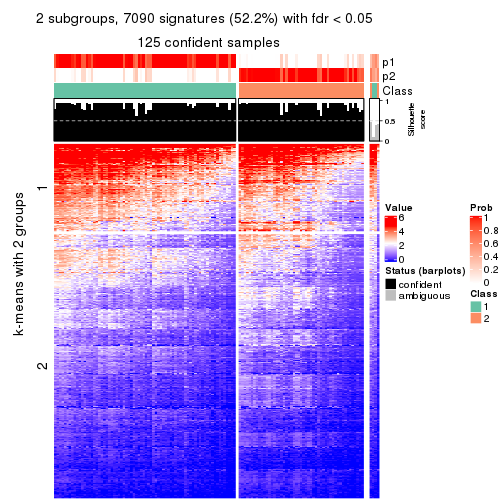</p>

</div>
<div id='tab-SD-NMF-get-signatures-no-scale-2'>
<pre><code class="r">get_signatures(res, k = 3, scale_rows = FALSE)
</code></pre>

<p>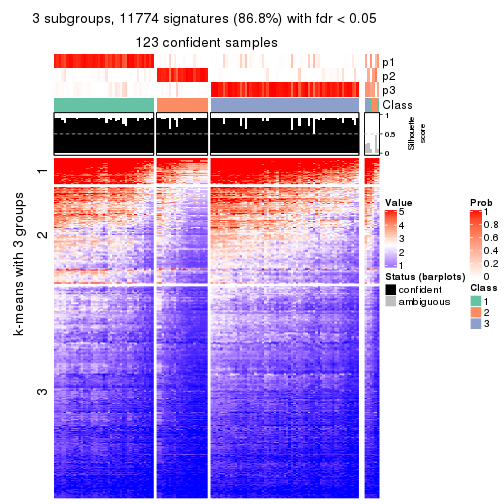</p>

</div>
<div id='tab-SD-NMF-get-signatures-no-scale-3'>
<pre><code class="r">get_signatures(res, k = 4, scale_rows = FALSE)
</code></pre>

<p>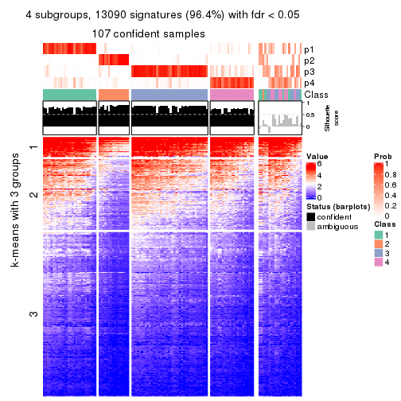</p>

</div>
<div id='tab-SD-NMF-get-signatures-no-scale-4'>
<pre><code class="r">get_signatures(res, k = 5, scale_rows = FALSE)
</code></pre>

<p>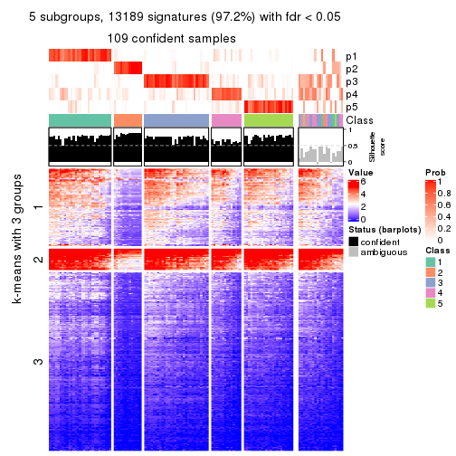</p>

</div>
<div id='tab-SD-NMF-get-signatures-no-scale-5'>
<pre><code class="r">get_signatures(res, k = 6, scale_rows = FALSE)
</code></pre>

<p>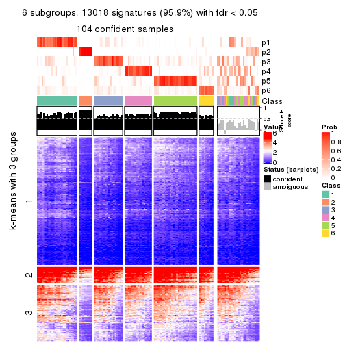</p>

</div>
</div>


Compare the overlap of signatures from different k:

```r
compare_signatures(res)
```

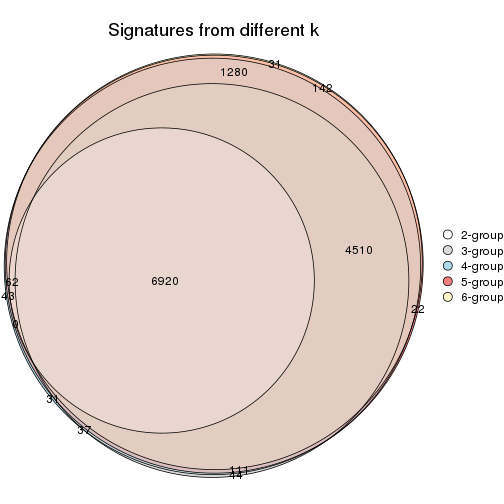

`get_signature()` returns a data frame invisibly. TO get the list of signatures, the function
call should be assigned to a variable explicitly. In following code, if `plot` argument is set
to `FALSE`, no heatmap is plotted while only the differential analysis is performed.

```r
# code only for demonstration
tb = get_signature(res, k = ..., plot = FALSE)
```

An example of the output of `tb` is:

```
#>   which_row         fdr    mean_1    mean_2 scaled_mean_1 scaled_mean_2 km
#> 1        38 0.042760348  8.373488  9.131774    -0.5533452     0.5164555  1
#> 2        40 0.018707592  7.106213  8.469186    -0.6173731     0.5762149  1
#> 3        55 0.019134737 10.221463 11.207825    -0.6159697     0.5749050  1
#> 4        59 0.006059896  5.921854  7.869574    -0.6899429     0.6439467  1
#> 5        60 0.018055526  8.928898 10.211722    -0.6204761     0.5791110  1
#> 6        98 0.009384629 15.714769 14.887706     0.6635654    -0.6193277  2
...
```

The columns in `tb` are:

1. `which_row`: row indices corresponding to the input matrix.
2. `fdr`: FDR for the differential test. 
3. `mean_x`: The mean value in group x.
4. `scaled_mean_x`: The mean value in group x after rows are scaled.
5. `km`: Row groups if k-means clustering is applied to rows.


UMAP plot which shows how samples are separated.


<script>
$( function() {
	$( '#tabs-SD-NMF-dimension-reduction' ).tabs();
} );
</script>
<div id='tabs-SD-NMF-dimension-reduction'>
<ul>
<li><a href='#tab-SD-NMF-dimension-reduction-1'>k = 2</a></li>
<li><a href='#tab-SD-NMF-dimension-reduction-2'>k = 3</a></li>
<li><a href='#tab-SD-NMF-dimension-reduction-3'>k = 4</a></li>
<li><a href='#tab-SD-NMF-dimension-reduction-4'>k = 5</a></li>
<li><a href='#tab-SD-NMF-dimension-reduction-5'>k = 6</a></li>
</ul>
<div id='tab-SD-NMF-dimension-reduction-1'>
<pre><code class="r">dimension_reduction(res, k = 2, method = &quot;UMAP&quot;)
</code></pre>

<p>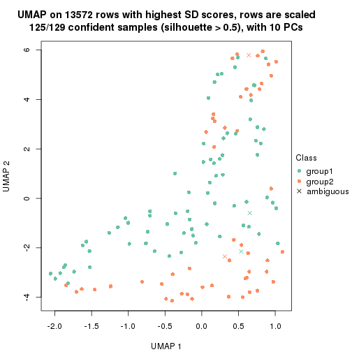</p>

</div>
<div id='tab-SD-NMF-dimension-reduction-2'>
<pre><code class="r">dimension_reduction(res, k = 3, method = &quot;UMAP&quot;)
</code></pre>

<p>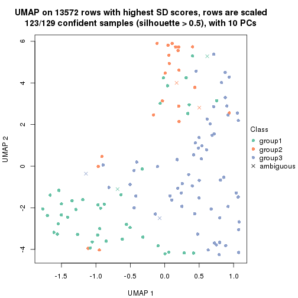</p>

</div>
<div id='tab-SD-NMF-dimension-reduction-3'>
<pre><code class="r">dimension_reduction(res, k = 4, method = &quot;UMAP&quot;)
</code></pre>

<p>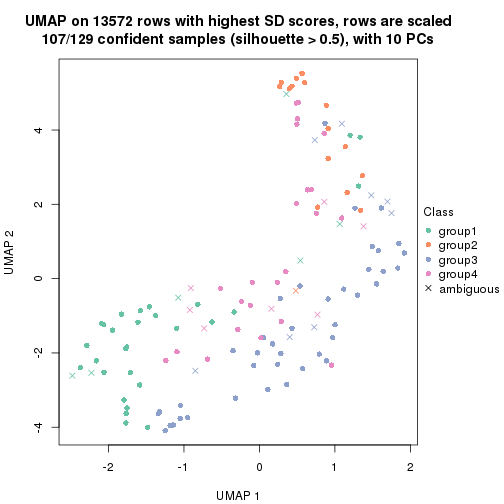</p>

</div>
<div id='tab-SD-NMF-dimension-reduction-4'>
<pre><code class="r">dimension_reduction(res, k = 5, method = &quot;UMAP&quot;)
</code></pre>

<p>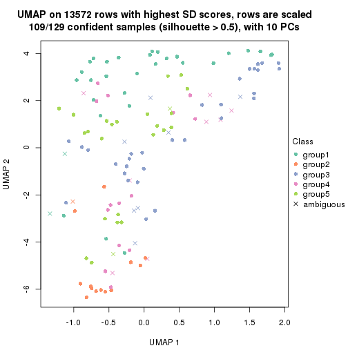</p>

</div>
<div id='tab-SD-NMF-dimension-reduction-5'>
<pre><code class="r">dimension_reduction(res, k = 6, method = &quot;UMAP&quot;)
</code></pre>

<p>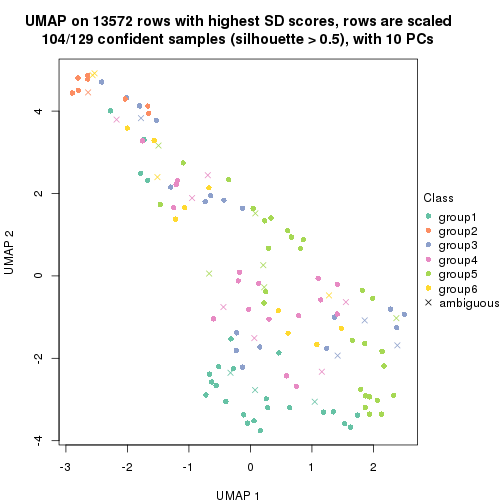</p>

</div>
</div>


Following heatmap shows how subgroups are split when increasing `k`:

```r
collect_classes(res)
```

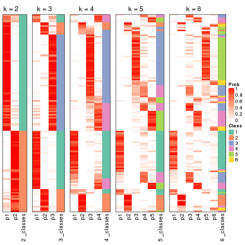


If matrix rows can be associated to genes, consider to use `GO_Enrichment(res,
...)` to perform function enrichment for the signature genes.


 

---------------------------------------------------


### CV:hclust


The object with results only for a single top-value method and a single partition method 
can be extracted as:

```r
res = res_list["CV", "hclust"]
# you can also extract it by
# res = res_list["CV:hclust"]
```

A summary of `res` and all the functions that can be applied to it:

```r
res
```

```
#> A 'ConsensusPartition' object with k = 2, 3, 4, 5, 6.
#>   On a matrix with 13572 rows and 129 columns.
#>   Top rows (1000, 2000, 3000, 4000, 5000) are extracted by 'CV' method.
#>   Subgroups are detected by 'hclust' method.
#>   Performed in total 1250 partitions by row resampling.
#>   Best k for subgroups seems to be 2.
#> 
#> Following methods can be applied to this 'ConsensusPartition' object:
#>  [1] "cola_report"             "collect_classes"         "collect_plots"          
#>  [4] "collect_stats"           "colnames"                "compare_signatures"     
#>  [7] "consensus_heatmap"       "dimension_reduction"     "functional_enrichment"  
#> [10] "get_anno_col"            "get_anno"                "get_classes"            
#> [13] "get_consensus"           "get_matrix"              "get_membership"         
#> [16] "get_param"               "get_signatures"          "get_stats"              
#> [19] "is_best_k"               "is_stable_k"             "membership_heatmap"     
#> [22] "ncol"                    "nrow"                    "plot_ecdf"              
#> [25] "rownames"                "select_partition_number" "show"                   
#> [28] "suggest_best_k"          "test_to_known_factors"
```

`collect_plots()` function collects all the plots made from `res` for all `k` (number of partitions)
into one single page to provide an easy and fast comparison between different `k`.

```r
collect_plots(res)
```

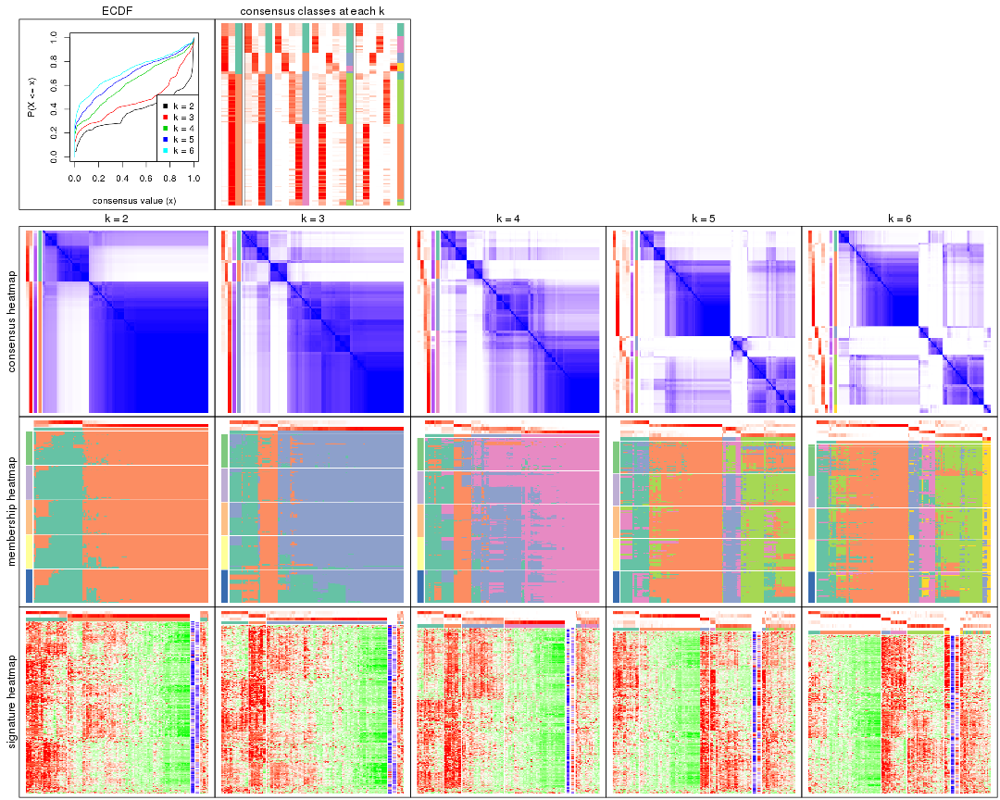

The plots are:

- The first row: a plot of the ECDF (Empirical cumulative distribution
  function) curves of the consensus matrix for each `k` and the heatmap of
  predicted classes for each `k`.
- The second row: heatmaps of the consensus matrix for each `k`.
- The third row: heatmaps of the membership matrix for each `k`.
- The fouth row: heatmaps of the signatures for each `k`.

All the plots in panels can be made by individual functions and they are
plotted later in this section.

`select_partition_number()` produces several plots showing different
statistics for choosing "optimized" `k`. There are following statistics:

- ECDF curves of the consensus matrix for each `k`;
- 1-PAC. [The PAC
  score](https://en.wikipedia.org/wiki/Consensus_clustering#Over-interpretation_potential_of_consensus_clustering)
  measures the proportion of the ambiguous subgrouping.
- Mean silhouette score.
- Concordance. The mean probability of fiting the consensus class ids in all
  partitions.
- Area increased. Denote $A_k$ as the area under the ECDF curve for current
  `k`, the area increased is defined as $A_k - A_{k-1}$.
- Rand index. The percent of pairs of samples that are both in a same cluster
  or both are not in a same cluster in the partition of k and k-1.
- Jaccard index. The ratio of pairs of samples are both in a same cluster in
  the partition of k and k-1 and the pairs of samples are both in a same
  cluster in the partition k or k-1.

The detailed explanations of these statistics can be found in [the cola
vignette](http://bioconductor.org/packages/devel/bioc/vignettes/cola/inst/doc/cola.html#toc_13).

Generally speaking, lower PAC score, higher mean silhouette score or higher
concordance corresponds to better partition. Rand index and Jaccard index
measure how similar the current partition is compared to partition with `k-1`.
If they are too similar, we won't accept `k` is better than `k-1`.

```r
select_partition_number(res)
```

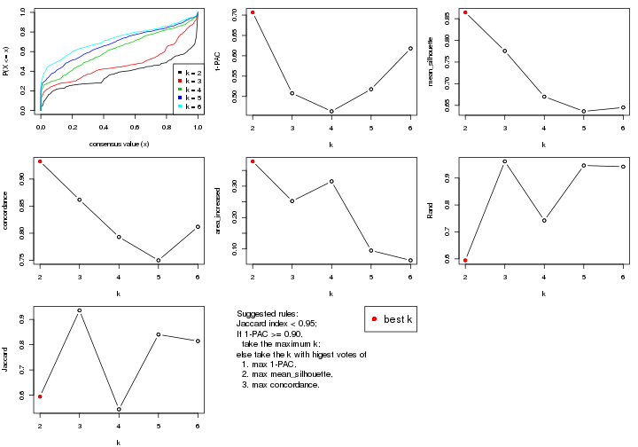

The numeric values for all these statistics can be obtained by `get_stats()`.

```r
get_stats(res)
```

```
#>   k 1-PAC mean_silhouette concordance area_increased  Rand Jaccard
#> 2 2 0.707           0.865       0.933         0.3788 0.594   0.594
#> 3 3 0.508           0.776       0.862         0.2525 0.962   0.936
#> 4 4 0.463           0.670       0.793         0.3152 0.742   0.544
#> 5 5 0.518           0.636       0.750         0.0950 0.947   0.840
#> 6 6 0.618           0.645       0.812         0.0638 0.942   0.814
```

`suggest_best_k()` suggests the best $k$ based on these statistics. The rules are as follows:

- All $k$ with Jaccard index larger than 0.95 are removed because the increase of
  the partition number does not provides enough extra information. If all $k$ are removed,
  the best $k$ is assigned by `NA`.
- For $k$ with 1-PAC larger than 0.9, the maximal $k$ is taken as the "best k". Other $k$ is called "optional k".
- If it does not fit the second rule. The $k$ with the highest vote of highest
  1-PAC, mean silhouette and concordance is taken as the "best k".

```r
suggest_best_k(res)
```

```
#> [1] 2
```


Following shows the table of the partitions (You need to click the **show/hide
code output** link to see it). The membership matrix (columns with name `p*`)
is inferred by
[`clue::cl_consensus()`](https://www.rdocumentation.org/link/cl_consensus?package=clue)
function with the `SE` method. Basically the value in the membership matrix
represents the probability to belong to a certain group. The finall class
label for an item is determined with the group with highest probability it
belongs to.

In `get_classes()` function, the entropy is calculated from the membership
matrix and the silhouette score is calculated from the consensus matrix.


<script>
$( function() {
	$( '#tabs-CV-hclust-get-classes' ).tabs();
} );
</script>
<div id='tabs-CV-hclust-get-classes'>
<ul>
<li><a href='#tab-CV-hclust-get-classes-1'>k = 2</a></li>
<li><a href='#tab-CV-hclust-get-classes-2'>k = 3</a></li>
<li><a href='#tab-CV-hclust-get-classes-3'>k = 4</a></li>
<li><a href='#tab-CV-hclust-get-classes-4'>k = 5</a></li>
<li><a href='#tab-CV-hclust-get-classes-5'>k = 6</a></li>
</ul>

<div id='tab-CV-hclust-get-classes-1'>
<p><a id='tab-CV-hclust-get-classes-1-a' style='color:#0366d6' href='#'>show/hide code output</a></p>
<pre><code class="r">cbind(get_classes(res, k = 2), get_membership(res, k = 2))
</code></pre>

<pre><code>#&gt;            class entropy silhouette    p1    p2
#&gt; SRR1656463     2  0.0000      0.960 0.000 1.000
#&gt; SRR1656464     1  0.0000      0.828 1.000 0.000
#&gt; SRR1656462     1  0.1414      0.836 0.980 0.020
#&gt; SRR1656465     2  0.1414      0.949 0.020 0.980
#&gt; SRR1656467     2  0.0000      0.960 0.000 1.000
#&gt; SRR1656466     2  0.3274      0.916 0.060 0.940
#&gt; SRR1656468     2  0.0000      0.960 0.000 1.000
#&gt; SRR1656472     1  0.0000      0.828 1.000 0.000
#&gt; SRR1656471     2  0.5294      0.851 0.120 0.880
#&gt; SRR1656470     2  0.0000      0.960 0.000 1.000
#&gt; SRR1656469     2  0.0000      0.960 0.000 1.000
#&gt; SRR1656473     2  0.0000      0.960 0.000 1.000
#&gt; SRR1656474     2  0.0000      0.960 0.000 1.000
#&gt; SRR1656475     2  0.0000      0.960 0.000 1.000
#&gt; SRR1656478     1  0.9661      0.532 0.608 0.392
#&gt; SRR1656477     2  0.0000      0.960 0.000 1.000
#&gt; SRR1656479     2  0.0000      0.960 0.000 1.000
#&gt; SRR1656480     2  0.0000      0.960 0.000 1.000
#&gt; SRR1656476     2  0.0000      0.960 0.000 1.000
#&gt; SRR1656481     2  0.0000      0.960 0.000 1.000
#&gt; SRR1656482     2  0.0000      0.960 0.000 1.000
#&gt; SRR1656483     2  0.0000      0.960 0.000 1.000
#&gt; SRR1656485     2  0.2778      0.926 0.048 0.952
#&gt; SRR1656487     2  0.3431      0.912 0.064 0.936
#&gt; SRR1656486     2  0.0000      0.960 0.000 1.000
#&gt; SRR1656488     2  0.3431      0.912 0.064 0.936
#&gt; SRR1656484     2  0.6438      0.778 0.164 0.836
#&gt; SRR1656489     1  0.9686      0.525 0.604 0.396
#&gt; SRR1656491     2  0.0000      0.960 0.000 1.000
#&gt; SRR1656490     2  0.0000      0.960 0.000 1.000
#&gt; SRR1656492     2  0.2236      0.937 0.036 0.964
#&gt; SRR1656493     1  0.4431      0.822 0.908 0.092
#&gt; SRR1656495     1  0.3431      0.833 0.936 0.064
#&gt; SRR1656496     2  0.1184      0.952 0.016 0.984
#&gt; SRR1656494     2  0.0672      0.956 0.008 0.992
#&gt; SRR1656497     2  0.0000      0.960 0.000 1.000
#&gt; SRR1656499     2  0.8608      0.558 0.284 0.716
#&gt; SRR1656500     1  0.9977      0.268 0.528 0.472
#&gt; SRR1656501     2  0.0000      0.960 0.000 1.000
#&gt; SRR1656498     1  0.2043      0.837 0.968 0.032
#&gt; SRR1656504     2  0.0000      0.960 0.000 1.000
#&gt; SRR1656502     1  0.0000      0.828 1.000 0.000
#&gt; SRR1656503     2  0.6148      0.798 0.152 0.848
#&gt; SRR1656507     1  0.9661      0.532 0.608 0.392
#&gt; SRR1656508     1  0.2778      0.837 0.952 0.048
#&gt; SRR1656505     2  0.0000      0.960 0.000 1.000
#&gt; SRR1656506     2  0.1414      0.948 0.020 0.980
#&gt; SRR1656509     2  0.5946      0.821 0.144 0.856
#&gt; SRR1656510     2  0.0000      0.960 0.000 1.000
#&gt; SRR1656511     2  0.0000      0.960 0.000 1.000
#&gt; SRR1656513     2  0.0000      0.960 0.000 1.000
#&gt; SRR1656512     2  0.0000      0.960 0.000 1.000
#&gt; SRR1656514     1  0.0000      0.828 1.000 0.000
#&gt; SRR1656515     2  0.0000      0.960 0.000 1.000
#&gt; SRR1656516     2  0.6438      0.778 0.164 0.836
#&gt; SRR1656518     1  0.9795      0.484 0.584 0.416
#&gt; SRR1656517     1  0.2603      0.837 0.956 0.044
#&gt; SRR1656519     1  0.2603      0.836 0.956 0.044
#&gt; SRR1656522     1  0.0000      0.828 1.000 0.000
#&gt; SRR1656523     2  0.0000      0.960 0.000 1.000
#&gt; SRR1656521     2  0.0000      0.960 0.000 1.000
#&gt; SRR1656520     1  0.1414      0.836 0.980 0.020
#&gt; SRR1656524     1  0.3431      0.833 0.936 0.064
#&gt; SRR1656525     2  0.4022      0.891 0.080 0.920
#&gt; SRR1656526     2  0.0000      0.960 0.000 1.000
#&gt; SRR1656527     2  0.0000      0.960 0.000 1.000
#&gt; SRR1656530     2  0.0000      0.960 0.000 1.000
#&gt; SRR1656529     2  0.1414      0.948 0.020 0.980
#&gt; SRR1656531     1  0.0938      0.833 0.988 0.012
#&gt; SRR1656528     2  0.1414      0.948 0.020 0.980
#&gt; SRR1656534     1  0.1184      0.835 0.984 0.016
#&gt; SRR1656533     1  0.6343      0.782 0.840 0.160
#&gt; SRR1656536     2  0.0000      0.960 0.000 1.000
#&gt; SRR1656532     2  0.0672      0.956 0.008 0.992
#&gt; SRR1656537     1  0.1633      0.836 0.976 0.024
#&gt; SRR1656538     2  0.7139      0.729 0.196 0.804
#&gt; SRR1656535     2  0.0000      0.960 0.000 1.000
#&gt; SRR1656539     2  0.1843      0.942 0.028 0.972
#&gt; SRR1656544     2  0.7139      0.735 0.196 0.804
#&gt; SRR1656542     1  0.9996      0.218 0.512 0.488
#&gt; SRR1656543     1  0.1414      0.836 0.980 0.020
#&gt; SRR1656545     2  0.0000      0.960 0.000 1.000
#&gt; SRR1656540     1  0.1633      0.836 0.976 0.024
#&gt; SRR1656546     2  0.0376      0.958 0.004 0.996
#&gt; SRR1656541     2  0.0000      0.960 0.000 1.000
#&gt; SRR1656547     2  0.0000      0.960 0.000 1.000
#&gt; SRR1656548     2  0.0672      0.956 0.008 0.992
#&gt; SRR1656549     2  0.0000      0.960 0.000 1.000
#&gt; SRR1656551     2  0.0000      0.960 0.000 1.000
#&gt; SRR1656553     2  0.7950      0.654 0.240 0.760
#&gt; SRR1656550     2  0.0000      0.960 0.000 1.000
#&gt; SRR1656552     2  0.0000      0.960 0.000 1.000
#&gt; SRR1656554     2  0.1414      0.948 0.020 0.980
#&gt; SRR1656555     2  0.0000      0.960 0.000 1.000
#&gt; SRR1656556     2  0.7950      0.656 0.240 0.760
#&gt; SRR1656557     1  0.1414      0.836 0.980 0.020
#&gt; SRR1656558     1  0.9661      0.532 0.608 0.392
#&gt; SRR1656559     1  0.0000      0.828 1.000 0.000
#&gt; SRR1656560     2  0.1184      0.951 0.016 0.984
#&gt; SRR1656561     2  0.0672      0.956 0.008 0.992
#&gt; SRR1656562     2  0.0000      0.960 0.000 1.000
#&gt; SRR1656563     1  0.9850      0.457 0.572 0.428
#&gt; SRR1656564     2  0.0000      0.960 0.000 1.000
#&gt; SRR1656565     2  0.0000      0.960 0.000 1.000
#&gt; SRR1656566     1  0.9732      0.508 0.596 0.404
#&gt; SRR1656568     2  0.0000      0.960 0.000 1.000
#&gt; SRR1656567     2  0.0000      0.960 0.000 1.000
#&gt; SRR1656569     2  0.1414      0.948 0.020 0.980
#&gt; SRR1656570     1  0.9850      0.457 0.572 0.428
#&gt; SRR1656571     2  0.0000      0.960 0.000 1.000
#&gt; SRR1656573     2  0.0000      0.960 0.000 1.000
#&gt; SRR1656572     2  0.0000      0.960 0.000 1.000
#&gt; SRR1656574     1  0.6343      0.782 0.840 0.160
#&gt; SRR1656575     2  0.4161      0.885 0.084 0.916
#&gt; SRR1656576     2  0.0000      0.960 0.000 1.000
#&gt; SRR1656578     2  0.0672      0.956 0.008 0.992
#&gt; SRR1656577     1  0.2236      0.838 0.964 0.036
#&gt; SRR1656579     2  0.0000      0.960 0.000 1.000
#&gt; SRR1656580     2  0.6973      0.743 0.188 0.812
#&gt; SRR1656581     2  0.0938      0.954 0.012 0.988
#&gt; SRR1656582     2  0.0000      0.960 0.000 1.000
#&gt; SRR1656585     2  0.0376      0.958 0.004 0.996
#&gt; SRR1656584     1  0.9732      0.508 0.596 0.404
#&gt; SRR1656583     2  0.9209      0.426 0.336 0.664
#&gt; SRR1656586     2  0.0000      0.960 0.000 1.000
#&gt; SRR1656587     2  0.0938      0.954 0.012 0.988
#&gt; SRR1656588     2  0.0000      0.960 0.000 1.000
#&gt; SRR1656589     2  0.0000      0.960 0.000 1.000
#&gt; SRR1656590     1  0.3733      0.831 0.928 0.072
</code></pre>

<script>
$('#tab-CV-hclust-get-classes-1-a').parent().next().next().hide();
$('#tab-CV-hclust-get-classes-1-a').click(function(){
  $('#tab-CV-hclust-get-classes-1-a').parent().next().next().toggle();
  return(false);
});
</script>
</div>

<div id='tab-CV-hclust-get-classes-2'>
<p><a id='tab-CV-hclust-get-classes-2-a' style='color:#0366d6' href='#'>show/hide code output</a></p>
<pre><code class="r">cbind(get_classes(res, k = 3), get_membership(res, k = 3))
</code></pre>

<pre><code>#&gt;            class entropy silhouette    p1    p2    p3
#&gt; SRR1656463     3  0.0592      0.883 0.012 0.000 0.988
#&gt; SRR1656464     2  0.3879      0.808 0.152 0.848 0.000
#&gt; SRR1656462     2  0.2537      0.817 0.080 0.920 0.000
#&gt; SRR1656465     3  0.5722      0.828 0.112 0.084 0.804
#&gt; SRR1656467     3  0.0592      0.883 0.012 0.000 0.988
#&gt; SRR1656466     3  0.6526      0.795 0.112 0.128 0.760
#&gt; SRR1656468     3  0.3802      0.870 0.080 0.032 0.888
#&gt; SRR1656472     2  0.3879      0.808 0.152 0.848 0.000
#&gt; SRR1656471     3  0.7524      0.716 0.116 0.196 0.688
#&gt; SRR1656470     3  0.0592      0.883 0.012 0.000 0.988
#&gt; SRR1656469     3  0.3802      0.870 0.080 0.032 0.888
#&gt; SRR1656473     3  0.0592      0.883 0.012 0.000 0.988
#&gt; SRR1656474     3  0.0592      0.883 0.012 0.000 0.988
#&gt; SRR1656475     3  0.0592      0.883 0.012 0.000 0.988
#&gt; SRR1656478     1  0.5058      0.622 0.756 0.000 0.244
#&gt; SRR1656477     3  0.4316      0.863 0.088 0.044 0.868
#&gt; SRR1656479     3  0.1989      0.884 0.048 0.004 0.948
#&gt; SRR1656480     3  0.4206      0.864 0.088 0.040 0.872
#&gt; SRR1656476     3  0.0592      0.883 0.012 0.000 0.988
#&gt; SRR1656481     3  0.3802      0.870 0.080 0.032 0.888
#&gt; SRR1656482     3  0.0592      0.883 0.012 0.000 0.988
#&gt; SRR1656483     3  0.0592      0.883 0.012 0.000 0.988
#&gt; SRR1656485     3  0.6394      0.802 0.116 0.116 0.768
#&gt; SRR1656487     3  0.6783      0.780 0.116 0.140 0.744
#&gt; SRR1656486     3  0.0592      0.886 0.012 0.000 0.988
#&gt; SRR1656488     3  0.6783      0.780 0.116 0.140 0.744
#&gt; SRR1656484     3  0.5431      0.696 0.284 0.000 0.716
#&gt; SRR1656489     1  0.5098      0.620 0.752 0.000 0.248
#&gt; SRR1656491     3  0.2584      0.880 0.064 0.008 0.928
#&gt; SRR1656490     3  0.1989      0.884 0.048 0.004 0.948
#&gt; SRR1656492     3  0.5371      0.837 0.140 0.048 0.812
#&gt; SRR1656493     1  0.4295      0.613 0.864 0.104 0.032
#&gt; SRR1656495     1  0.2959      0.592 0.900 0.100 0.000
#&gt; SRR1656496     3  0.2945      0.877 0.088 0.004 0.908
#&gt; SRR1656494     3  0.0747      0.886 0.016 0.000 0.984
#&gt; SRR1656497     3  0.0592      0.883 0.012 0.000 0.988
#&gt; SRR1656499     3  0.8649      0.423 0.112 0.360 0.528
#&gt; SRR1656500     2  0.8567      0.115 0.128 0.576 0.296
#&gt; SRR1656501     3  0.0592      0.886 0.012 0.000 0.988
#&gt; SRR1656498     1  0.4121      0.541 0.832 0.168 0.000
#&gt; SRR1656504     3  0.0592      0.883 0.012 0.000 0.988
#&gt; SRR1656502     2  0.3879      0.808 0.152 0.848 0.000
#&gt; SRR1656503     3  0.5480      0.721 0.264 0.004 0.732
#&gt; SRR1656507     1  0.5058      0.622 0.756 0.000 0.244
#&gt; SRR1656508     1  0.3918      0.570 0.856 0.140 0.004
#&gt; SRR1656505     3  0.4035      0.867 0.080 0.040 0.880
#&gt; SRR1656506     3  0.5731      0.828 0.108 0.088 0.804
#&gt; SRR1656509     3  0.7807      0.693 0.144 0.184 0.672
#&gt; SRR1656510     3  0.3802      0.870 0.080 0.032 0.888
#&gt; SRR1656511     3  0.0592      0.883 0.012 0.000 0.988
#&gt; SRR1656513     3  0.0237      0.884 0.004 0.000 0.996
#&gt; SRR1656512     3  0.0592      0.883 0.012 0.000 0.988
#&gt; SRR1656514     2  0.3816      0.809 0.148 0.852 0.000
#&gt; SRR1656515     3  0.0592      0.883 0.012 0.000 0.988
#&gt; SRR1656516     3  0.5986      0.682 0.284 0.012 0.704
#&gt; SRR1656518     1  0.5291      0.601 0.732 0.000 0.268
#&gt; SRR1656517     1  0.3551      0.577 0.868 0.132 0.000
#&gt; SRR1656519     2  0.3752      0.791 0.096 0.884 0.020
#&gt; SRR1656522     2  0.3879      0.807 0.152 0.848 0.000
#&gt; SRR1656523     3  0.0237      0.885 0.004 0.000 0.996
#&gt; SRR1656521     3  0.0592      0.883 0.012 0.000 0.988
#&gt; SRR1656520     2  0.2448      0.813 0.076 0.924 0.000
#&gt; SRR1656524     1  0.2959      0.592 0.900 0.100 0.000
#&gt; SRR1656525     3  0.5008      0.812 0.180 0.016 0.804
#&gt; SRR1656526     3  0.0592      0.883 0.012 0.000 0.988
#&gt; SRR1656527     3  0.1411      0.874 0.036 0.000 0.964
#&gt; SRR1656530     3  0.3445      0.873 0.088 0.016 0.896
#&gt; SRR1656529     3  0.5804      0.825 0.112 0.088 0.800
#&gt; SRR1656531     1  0.5810      0.237 0.664 0.336 0.000
#&gt; SRR1656528     3  0.5804      0.825 0.112 0.088 0.800
#&gt; SRR1656534     2  0.3192      0.812 0.112 0.888 0.000
#&gt; SRR1656533     1  0.3899      0.630 0.888 0.056 0.056
#&gt; SRR1656536     3  0.4316      0.863 0.088 0.044 0.868
#&gt; SRR1656532     3  0.0747      0.886 0.016 0.000 0.984
#&gt; SRR1656537     1  0.4452      0.505 0.808 0.192 0.000
#&gt; SRR1656538     3  0.6473      0.625 0.312 0.020 0.668
#&gt; SRR1656535     3  0.0592      0.883 0.012 0.000 0.988
#&gt; SRR1656539     3  0.5883      0.822 0.112 0.092 0.796
#&gt; SRR1656544     3  0.7267      0.649 0.268 0.064 0.668
#&gt; SRR1656542     2  0.9962     -0.129 0.292 0.364 0.344
#&gt; SRR1656543     2  0.2625      0.818 0.084 0.916 0.000
#&gt; SRR1656545     3  0.0592      0.883 0.012 0.000 0.988
#&gt; SRR1656540     2  0.2448      0.811 0.076 0.924 0.000
#&gt; SRR1656546     3  0.1643      0.870 0.044 0.000 0.956
#&gt; SRR1656541     3  0.0592      0.883 0.012 0.000 0.988
#&gt; SRR1656547     3  0.0592      0.883 0.012 0.000 0.988
#&gt; SRR1656548     3  0.3607      0.868 0.112 0.008 0.880
#&gt; SRR1656549     3  0.0592      0.885 0.012 0.000 0.988
#&gt; SRR1656551     3  0.4035      0.867 0.080 0.040 0.880
#&gt; SRR1656553     3  0.8009      0.567 0.276 0.100 0.624
#&gt; SRR1656550     3  0.4316      0.863 0.088 0.044 0.868
#&gt; SRR1656552     3  0.0592      0.883 0.012 0.000 0.988
#&gt; SRR1656554     3  0.5804      0.825 0.112 0.088 0.800
#&gt; SRR1656555     3  0.0592      0.883 0.012 0.000 0.988
#&gt; SRR1656556     3  0.8513      0.513 0.116 0.316 0.568
#&gt; SRR1656557     2  0.2625      0.818 0.084 0.916 0.000
#&gt; SRR1656558     1  0.5058      0.622 0.756 0.000 0.244
#&gt; SRR1656559     2  0.3879      0.807 0.152 0.848 0.000
#&gt; SRR1656560     3  0.5722      0.828 0.112 0.084 0.804
#&gt; SRR1656561     3  0.3607      0.868 0.112 0.008 0.880
#&gt; SRR1656562     3  0.0237      0.884 0.004 0.000 0.996
#&gt; SRR1656563     1  0.5397      0.585 0.720 0.000 0.280
#&gt; SRR1656564     3  0.0592      0.883 0.012 0.000 0.988
#&gt; SRR1656565     3  0.1643      0.884 0.044 0.000 0.956
#&gt; SRR1656566     1  0.5443      0.610 0.736 0.004 0.260
#&gt; SRR1656568     3  0.0592      0.883 0.012 0.000 0.988
#&gt; SRR1656567     3  0.4146      0.866 0.080 0.044 0.876
#&gt; SRR1656569     3  0.5650      0.830 0.108 0.084 0.808
#&gt; SRR1656570     1  0.5397      0.585 0.720 0.000 0.280
#&gt; SRR1656571     3  0.0592      0.883 0.012 0.000 0.988
#&gt; SRR1656573     3  0.2772      0.878 0.080 0.004 0.916
#&gt; SRR1656572     3  0.0424      0.885 0.008 0.000 0.992
#&gt; SRR1656574     1  0.3899      0.630 0.888 0.056 0.056
#&gt; SRR1656575     3  0.4702      0.790 0.212 0.000 0.788
#&gt; SRR1656576     3  0.0592      0.883 0.012 0.000 0.988
#&gt; SRR1656578     3  0.0747      0.886 0.016 0.000 0.984
#&gt; SRR1656577     1  0.4062      0.543 0.836 0.164 0.000
#&gt; SRR1656579     3  0.0829      0.883 0.012 0.004 0.984
#&gt; SRR1656580     3  0.6416      0.640 0.304 0.020 0.676
#&gt; SRR1656581     3  0.2261      0.882 0.068 0.000 0.932
#&gt; SRR1656582     3  0.0592      0.883 0.012 0.000 0.988
#&gt; SRR1656585     3  0.2774      0.879 0.072 0.008 0.920
#&gt; SRR1656584     1  0.5443      0.610 0.736 0.004 0.260
#&gt; SRR1656583     3  0.9004      0.280 0.132 0.400 0.468
#&gt; SRR1656586     3  0.0592      0.883 0.012 0.000 0.988
#&gt; SRR1656587     3  0.1267      0.886 0.024 0.004 0.972
#&gt; SRR1656588     3  0.4035      0.867 0.080 0.040 0.880
#&gt; SRR1656589     3  0.0592      0.883 0.012 0.000 0.988
#&gt; SRR1656590     1  0.4139      0.592 0.860 0.124 0.016
</code></pre>

<script>
$('#tab-CV-hclust-get-classes-2-a').parent().next().next().hide();
$('#tab-CV-hclust-get-classes-2-a').click(function(){
  $('#tab-CV-hclust-get-classes-2-a').parent().next().next().toggle();
  return(false);
});
</script>
</div>

<div id='tab-CV-hclust-get-classes-3'>
<p><a id='tab-CV-hclust-get-classes-3-a' style='color:#0366d6' href='#'>show/hide code output</a></p>
<pre><code class="r">cbind(get_classes(res, k = 4), get_membership(res, k = 4))
</code></pre>

<pre><code>#&gt;            class entropy silhouette    p1    p2    p3    p4
#&gt; SRR1656463     4  0.0000    0.84141 0.000 0.000 0.000 1.000
#&gt; SRR1656464     2  0.1211    0.87680 0.040 0.960 0.000 0.000
#&gt; SRR1656462     2  0.3569    0.89544 0.000 0.804 0.196 0.000
#&gt; SRR1656465     3  0.4222    0.75116 0.000 0.000 0.728 0.272
#&gt; SRR1656467     4  0.0817    0.83011 0.000 0.000 0.024 0.976
#&gt; SRR1656466     3  0.4088    0.74573 0.000 0.004 0.764 0.232
#&gt; SRR1656468     3  0.4933    0.61298 0.000 0.000 0.568 0.432
#&gt; SRR1656472     2  0.1302    0.87473 0.044 0.956 0.000 0.000
#&gt; SRR1656471     3  0.5072    0.71526 0.000 0.052 0.740 0.208
#&gt; SRR1656470     4  0.0000    0.84141 0.000 0.000 0.000 1.000
#&gt; SRR1656469     4  0.4985   -0.36068 0.000 0.000 0.468 0.532
#&gt; SRR1656473     4  0.0000    0.84141 0.000 0.000 0.000 1.000
#&gt; SRR1656474     4  0.0000    0.84141 0.000 0.000 0.000 1.000
#&gt; SRR1656475     4  0.0000    0.84141 0.000 0.000 0.000 1.000
#&gt; SRR1656478     1  0.6215    0.69238 0.664 0.000 0.208 0.128
#&gt; SRR1656477     3  0.4790    0.68875 0.000 0.000 0.620 0.380
#&gt; SRR1656479     4  0.2944    0.73440 0.004 0.000 0.128 0.868
#&gt; SRR1656480     3  0.4817    0.68125 0.000 0.000 0.612 0.388
#&gt; SRR1656476     4  0.0000    0.84141 0.000 0.000 0.000 1.000
#&gt; SRR1656481     3  0.4994    0.49571 0.000 0.000 0.520 0.480
#&gt; SRR1656482     4  0.0336    0.83878 0.000 0.000 0.008 0.992
#&gt; SRR1656483     4  0.0000    0.84141 0.000 0.000 0.000 1.000
#&gt; SRR1656485     3  0.4122    0.74674 0.000 0.004 0.760 0.236
#&gt; SRR1656487     3  0.3726    0.73760 0.000 0.000 0.788 0.212
#&gt; SRR1656486     4  0.2053    0.80260 0.004 0.000 0.072 0.924
#&gt; SRR1656488     3  0.3726    0.73760 0.000 0.000 0.788 0.212
#&gt; SRR1656484     3  0.7494    0.52694 0.188 0.000 0.460 0.352
#&gt; SRR1656489     1  0.6262    0.68776 0.660 0.000 0.208 0.132
#&gt; SRR1656491     4  0.4103    0.48187 0.000 0.000 0.256 0.744
#&gt; SRR1656490     4  0.2944    0.73440 0.004 0.000 0.128 0.868
#&gt; SRR1656492     3  0.5383    0.71510 0.024 0.004 0.664 0.308
#&gt; SRR1656493     1  0.1762    0.70590 0.952 0.016 0.020 0.012
#&gt; SRR1656495     1  0.0895    0.69214 0.976 0.020 0.004 0.000
#&gt; SRR1656496     4  0.4999    0.28480 0.012 0.000 0.328 0.660
#&gt; SRR1656494     4  0.1902    0.80966 0.004 0.000 0.064 0.932
#&gt; SRR1656497     4  0.0000    0.84141 0.000 0.000 0.000 1.000
#&gt; SRR1656499     3  0.4840    0.51585 0.000 0.116 0.784 0.100
#&gt; SRR1656500     3  0.5170   -0.12159 0.008 0.324 0.660 0.008
#&gt; SRR1656501     4  0.2125    0.79938 0.004 0.000 0.076 0.920
#&gt; SRR1656498     1  0.3306    0.60663 0.840 0.156 0.004 0.000
#&gt; SRR1656504     4  0.0000    0.84141 0.000 0.000 0.000 1.000
#&gt; SRR1656502     2  0.1302    0.87473 0.044 0.956 0.000 0.000
#&gt; SRR1656503     4  0.7268   -0.28743 0.152 0.000 0.372 0.476
#&gt; SRR1656507     1  0.6215    0.69238 0.664 0.000 0.208 0.128
#&gt; SRR1656508     1  0.3335    0.63357 0.856 0.128 0.016 0.000
#&gt; SRR1656505     3  0.4916    0.62896 0.000 0.000 0.576 0.424
#&gt; SRR1656506     3  0.4624    0.71874 0.000 0.000 0.660 0.340
#&gt; SRR1656509     3  0.5883    0.70966 0.024 0.044 0.700 0.232
#&gt; SRR1656510     4  0.5000   -0.45272 0.000 0.000 0.496 0.504
#&gt; SRR1656511     4  0.0000    0.84141 0.000 0.000 0.000 1.000
#&gt; SRR1656513     4  0.1022    0.82907 0.000 0.000 0.032 0.968
#&gt; SRR1656512     4  0.0000    0.84141 0.000 0.000 0.000 1.000
#&gt; SRR1656514     2  0.0469    0.88580 0.012 0.988 0.000 0.000
#&gt; SRR1656515     4  0.0188    0.83957 0.000 0.000 0.004 0.996
#&gt; SRR1656516     3  0.7424    0.42997 0.168 0.000 0.424 0.408
#&gt; SRR1656518     1  0.6472    0.66451 0.640 0.000 0.212 0.148
#&gt; SRR1656517     1  0.1661    0.68263 0.944 0.052 0.004 0.000
#&gt; SRR1656519     2  0.4682    0.87710 0.020 0.764 0.208 0.008
#&gt; SRR1656522     2  0.0707    0.88476 0.020 0.980 0.000 0.000
#&gt; SRR1656523     4  0.1209    0.82915 0.004 0.000 0.032 0.964
#&gt; SRR1656521     4  0.0000    0.84141 0.000 0.000 0.000 1.000
#&gt; SRR1656520     2  0.3801    0.88792 0.000 0.780 0.220 0.000
#&gt; SRR1656524     1  0.0895    0.69214 0.976 0.020 0.004 0.000
#&gt; SRR1656525     4  0.6285   -0.19189 0.060 0.000 0.412 0.528
#&gt; SRR1656526     4  0.0000    0.84141 0.000 0.000 0.000 1.000
#&gt; SRR1656527     4  0.1406    0.80379 0.024 0.000 0.016 0.960
#&gt; SRR1656530     3  0.4855    0.66048 0.000 0.000 0.600 0.400
#&gt; SRR1656529     3  0.4193    0.75120 0.000 0.000 0.732 0.268
#&gt; SRR1656531     1  0.4781    0.34417 0.660 0.336 0.004 0.000
#&gt; SRR1656528     3  0.4193    0.75120 0.000 0.000 0.732 0.268
#&gt; SRR1656534     2  0.4095    0.89365 0.024 0.804 0.172 0.000
#&gt; SRR1656533     1  0.3190    0.71742 0.880 0.008 0.096 0.016
#&gt; SRR1656536     3  0.4790    0.68875 0.000 0.000 0.620 0.380
#&gt; SRR1656532     4  0.1902    0.81154 0.004 0.000 0.064 0.932
#&gt; SRR1656537     1  0.2714    0.64855 0.884 0.112 0.004 0.000
#&gt; SRR1656538     3  0.7501    0.52763 0.196 0.000 0.472 0.332
#&gt; SRR1656535     4  0.0000    0.84141 0.000 0.000 0.000 1.000
#&gt; SRR1656539     3  0.4164    0.75156 0.000 0.000 0.736 0.264
#&gt; SRR1656544     3  0.7454    0.60827 0.176 0.004 0.512 0.308
#&gt; SRR1656542     3  0.7946    0.03824 0.192 0.184 0.572 0.052
#&gt; SRR1656543     2  0.3528    0.89649 0.000 0.808 0.192 0.000
#&gt; SRR1656545     4  0.0000    0.84141 0.000 0.000 0.000 1.000
#&gt; SRR1656540     2  0.3873    0.88587 0.000 0.772 0.228 0.000
#&gt; SRR1656546     4  0.1936    0.77911 0.032 0.000 0.028 0.940
#&gt; SRR1656541     4  0.0000    0.84141 0.000 0.000 0.000 1.000
#&gt; SRR1656547     4  0.0000    0.84141 0.000 0.000 0.000 1.000
#&gt; SRR1656548     4  0.5039    0.00192 0.004 0.000 0.404 0.592
#&gt; SRR1656549     4  0.1576    0.82274 0.004 0.000 0.048 0.948
#&gt; SRR1656551     3  0.4916    0.62896 0.000 0.000 0.576 0.424
#&gt; SRR1656553     3  0.7984    0.56914 0.164 0.040 0.540 0.256
#&gt; SRR1656550     3  0.4790    0.68875 0.000 0.000 0.620 0.380
#&gt; SRR1656552     4  0.0000    0.84141 0.000 0.000 0.000 1.000
#&gt; SRR1656554     3  0.4193    0.75120 0.000 0.000 0.732 0.268
#&gt; SRR1656555     4  0.0000    0.84141 0.000 0.000 0.000 1.000
#&gt; SRR1656556     3  0.5102    0.59089 0.000 0.100 0.764 0.136
#&gt; SRR1656557     2  0.3528    0.89649 0.000 0.808 0.192 0.000
#&gt; SRR1656558     1  0.6215    0.69238 0.664 0.000 0.208 0.128
#&gt; SRR1656559     2  0.0707    0.88476 0.020 0.980 0.000 0.000
#&gt; SRR1656560     3  0.4250    0.75056 0.000 0.000 0.724 0.276
#&gt; SRR1656561     4  0.5039    0.00192 0.004 0.000 0.404 0.592
#&gt; SRR1656562     4  0.1022    0.82907 0.000 0.000 0.032 0.968
#&gt; SRR1656563     1  0.6602    0.64465 0.628 0.000 0.208 0.164
#&gt; SRR1656564     4  0.0376    0.83642 0.004 0.000 0.004 0.992
#&gt; SRR1656565     4  0.3831    0.59939 0.004 0.000 0.204 0.792
#&gt; SRR1656566     1  0.6320    0.68061 0.656 0.000 0.204 0.140
#&gt; SRR1656568     4  0.0376    0.83647 0.004 0.000 0.004 0.992
#&gt; SRR1656567     3  0.4855    0.66649 0.000 0.000 0.600 0.400
#&gt; SRR1656569     3  0.4643    0.71718 0.000 0.000 0.656 0.344
#&gt; SRR1656570     1  0.6602    0.64465 0.628 0.000 0.208 0.164
#&gt; SRR1656571     4  0.0000    0.84141 0.000 0.000 0.000 1.000
#&gt; SRR1656573     4  0.4872    0.18401 0.004 0.000 0.356 0.640
#&gt; SRR1656572     4  0.1978    0.80600 0.004 0.000 0.068 0.928
#&gt; SRR1656574     1  0.3190    0.71742 0.880 0.008 0.096 0.016
#&gt; SRR1656575     4  0.6346    0.29975 0.116 0.000 0.244 0.640
#&gt; SRR1656576     4  0.0000    0.84141 0.000 0.000 0.000 1.000
#&gt; SRR1656578     4  0.1902    0.81154 0.004 0.000 0.064 0.932
#&gt; SRR1656577     1  0.3450    0.60965 0.836 0.156 0.008 0.000
#&gt; SRR1656579     4  0.1211    0.81838 0.000 0.000 0.040 0.960
#&gt; SRR1656580     3  0.7469    0.52547 0.188 0.000 0.472 0.340
#&gt; SRR1656581     4  0.4576    0.49977 0.012 0.000 0.260 0.728
#&gt; SRR1656582     4  0.0000    0.84141 0.000 0.000 0.000 1.000
#&gt; SRR1656585     4  0.4837    0.18432 0.004 0.000 0.348 0.648
#&gt; SRR1656584     1  0.6353    0.67888 0.652 0.000 0.208 0.140
#&gt; SRR1656583     3  0.5327    0.40182 0.008 0.172 0.752 0.068
#&gt; SRR1656586     4  0.0000    0.84141 0.000 0.000 0.000 1.000
#&gt; SRR1656587     4  0.2480    0.78369 0.008 0.000 0.088 0.904
#&gt; SRR1656588     3  0.4916    0.62896 0.000 0.000 0.576 0.424
#&gt; SRR1656589     4  0.0000    0.84141 0.000 0.000 0.000 1.000
#&gt; SRR1656590     1  0.3160    0.65374 0.872 0.108 0.020 0.000
</code></pre>

<script>
$('#tab-CV-hclust-get-classes-3-a').parent().next().next().hide();
$('#tab-CV-hclust-get-classes-3-a').click(function(){
  $('#tab-CV-hclust-get-classes-3-a').parent().next().next().toggle();
  return(false);
});
</script>
</div>

<div id='tab-CV-hclust-get-classes-4'>
<p><a id='tab-CV-hclust-get-classes-4-a' style='color:#0366d6' href='#'>show/hide code output</a></p>
<pre><code class="r">cbind(get_classes(res, k = 5), get_membership(res, k = 5))
</code></pre>

<pre><code>#&gt;            class entropy silhouette    p1    p2    p3    p4    p5
#&gt; SRR1656463     2  0.0000     0.8660 0.000 1.000 0.000 0.000 0.000
#&gt; SRR1656464     4  0.4654     0.8684 0.024 0.000 0.348 0.628 0.000
#&gt; SRR1656462     3  0.1956     0.5734 0.000 0.000 0.916 0.076 0.008
#&gt; SRR1656465     5  0.3615     0.7291 0.000 0.156 0.000 0.036 0.808
#&gt; SRR1656467     2  0.1121     0.8444 0.000 0.956 0.000 0.000 0.044
#&gt; SRR1656466     5  0.4307     0.7058 0.000 0.128 0.036 0.040 0.796
#&gt; SRR1656468     5  0.4047     0.6723 0.000 0.320 0.000 0.004 0.676
#&gt; SRR1656472     4  0.4540     0.8750 0.024 0.000 0.320 0.656 0.000
#&gt; SRR1656471     5  0.4803     0.6403 0.000 0.096 0.092 0.040 0.772
#&gt; SRR1656470     2  0.0000     0.8660 0.000 1.000 0.000 0.000 0.000
#&gt; SRR1656469     5  0.4622     0.4487 0.000 0.440 0.000 0.012 0.548
#&gt; SRR1656473     2  0.0000     0.8660 0.000 1.000 0.000 0.000 0.000
#&gt; SRR1656474     2  0.0000     0.8660 0.000 1.000 0.000 0.000 0.000
#&gt; SRR1656475     2  0.0000     0.8660 0.000 1.000 0.000 0.000 0.000
#&gt; SRR1656478     1  0.6899     0.6444 0.520 0.036 0.000 0.284 0.160
#&gt; SRR1656477     5  0.3741     0.7184 0.000 0.264 0.000 0.004 0.732
#&gt; SRR1656479     2  0.3888     0.7315 0.000 0.800 0.000 0.064 0.136
#&gt; SRR1656480     5  0.3838     0.7107 0.000 0.280 0.000 0.004 0.716
#&gt; SRR1656476     2  0.0000     0.8660 0.000 1.000 0.000 0.000 0.000
#&gt; SRR1656481     5  0.4225     0.6087 0.000 0.364 0.000 0.004 0.632
#&gt; SRR1656482     2  0.0404     0.8625 0.000 0.988 0.000 0.000 0.012
#&gt; SRR1656483     2  0.0000     0.8660 0.000 1.000 0.000 0.000 0.000
#&gt; SRR1656485     5  0.3999     0.7049 0.000 0.124 0.020 0.044 0.812
#&gt; SRR1656487     5  0.4042     0.6826 0.000 0.100 0.040 0.040 0.820
#&gt; SRR1656486     2  0.3180     0.7947 0.000 0.856 0.000 0.068 0.076
#&gt; SRR1656488     5  0.4042     0.6826 0.000 0.100 0.040 0.040 0.820
#&gt; SRR1656484     5  0.7871     0.4465 0.152 0.244 0.000 0.144 0.460
#&gt; SRR1656489     1  0.6928     0.6427 0.516 0.036 0.000 0.284 0.164
#&gt; SRR1656491     2  0.4863     0.4236 0.000 0.656 0.000 0.048 0.296
#&gt; SRR1656490     2  0.3888     0.7315 0.000 0.800 0.000 0.064 0.136
#&gt; SRR1656492     5  0.4592     0.7151 0.004 0.228 0.008 0.032 0.728
#&gt; SRR1656493     1  0.2086     0.6507 0.924 0.008 0.000 0.020 0.048
#&gt; SRR1656495     1  0.0807     0.6367 0.976 0.000 0.000 0.012 0.012
#&gt; SRR1656496     2  0.5829     0.1448 0.008 0.548 0.000 0.080 0.364
#&gt; SRR1656494     2  0.2234     0.8341 0.004 0.916 0.000 0.044 0.036
#&gt; SRR1656497     2  0.0000     0.8660 0.000 1.000 0.000 0.000 0.000
#&gt; SRR1656499     5  0.5615     0.4057 0.000 0.044 0.272 0.040 0.644
#&gt; SRR1656500     3  0.5334     0.1396 0.000 0.000 0.512 0.052 0.436
#&gt; SRR1656501     2  0.3239     0.7916 0.000 0.852 0.000 0.068 0.080
#&gt; SRR1656498     1  0.2561     0.5591 0.856 0.000 0.000 0.144 0.000
#&gt; SRR1656504     2  0.0000     0.8660 0.000 1.000 0.000 0.000 0.000
#&gt; SRR1656502     4  0.4540     0.8750 0.024 0.000 0.320 0.656 0.000
#&gt; SRR1656503     5  0.7999     0.3488 0.124 0.352 0.000 0.160 0.364
#&gt; SRR1656507     1  0.6899     0.6444 0.520 0.036 0.000 0.284 0.160
#&gt; SRR1656508     1  0.2624     0.5819 0.872 0.000 0.000 0.116 0.012
#&gt; SRR1656505     5  0.4066     0.6683 0.000 0.324 0.000 0.004 0.672
#&gt; SRR1656506     5  0.4240     0.7329 0.000 0.228 0.000 0.036 0.736
#&gt; SRR1656509     5  0.6135     0.6331 0.024 0.104 0.092 0.076 0.704
#&gt; SRR1656510     5  0.4403     0.4747 0.000 0.436 0.000 0.004 0.560
#&gt; SRR1656511     2  0.0000     0.8660 0.000 1.000 0.000 0.000 0.000
#&gt; SRR1656513     2  0.1661     0.8453 0.000 0.940 0.000 0.024 0.036
#&gt; SRR1656512     2  0.0000     0.8660 0.000 1.000 0.000 0.000 0.000
#&gt; SRR1656514     4  0.4450     0.6208 0.004 0.000 0.488 0.508 0.000
#&gt; SRR1656515     2  0.0703     0.8564 0.000 0.976 0.000 0.000 0.024
#&gt; SRR1656516     5  0.8045     0.4317 0.120 0.256 0.000 0.208 0.416
#&gt; SRR1656518     1  0.7226     0.6294 0.488 0.052 0.000 0.292 0.168
#&gt; SRR1656517     1  0.1522     0.6232 0.944 0.000 0.000 0.044 0.012
#&gt; SRR1656519     3  0.1851     0.5752 0.008 0.004 0.940 0.024 0.024
#&gt; SRR1656522     3  0.4450    -0.6880 0.004 0.000 0.508 0.488 0.000
#&gt; SRR1656523     2  0.2139     0.8357 0.000 0.916 0.000 0.052 0.032
#&gt; SRR1656521     2  0.0000     0.8660 0.000 1.000 0.000 0.000 0.000
#&gt; SRR1656520     3  0.0671     0.5936 0.000 0.000 0.980 0.004 0.016
#&gt; SRR1656524     1  0.0807     0.6367 0.976 0.000 0.000 0.012 0.012
#&gt; SRR1656525     5  0.7185     0.3113 0.036 0.400 0.004 0.148 0.412
#&gt; SRR1656526     2  0.0000     0.8660 0.000 1.000 0.000 0.000 0.000
#&gt; SRR1656527     2  0.1651     0.8315 0.008 0.944 0.000 0.012 0.036
#&gt; SRR1656530     5  0.4350     0.7077 0.000 0.268 0.000 0.028 0.704
#&gt; SRR1656529     5  0.3489     0.7245 0.000 0.144 0.000 0.036 0.820
#&gt; SRR1656531     1  0.4218     0.2699 0.660 0.000 0.008 0.332 0.000
#&gt; SRR1656528     5  0.3531     0.7267 0.000 0.148 0.000 0.036 0.816
#&gt; SRR1656534     3  0.1787     0.5720 0.016 0.000 0.940 0.032 0.012
#&gt; SRR1656533     1  0.3759     0.6581 0.816 0.000 0.000 0.092 0.092
#&gt; SRR1656536     5  0.3741     0.7184 0.000 0.264 0.000 0.004 0.732
#&gt; SRR1656532     2  0.2313     0.8347 0.004 0.912 0.000 0.044 0.040
#&gt; SRR1656537     1  0.2522     0.5816 0.880 0.000 0.000 0.108 0.012
#&gt; SRR1656538     5  0.7908     0.4156 0.152 0.188 0.000 0.192 0.468
#&gt; SRR1656535     2  0.0000     0.8660 0.000 1.000 0.000 0.000 0.000
#&gt; SRR1656539     5  0.3764     0.7232 0.000 0.148 0.004 0.040 0.808
#&gt; SRR1656544     5  0.7891     0.5337 0.144 0.144 0.028 0.144 0.540
#&gt; SRR1656542     5  0.8062    -0.0312 0.148 0.004 0.336 0.124 0.388
#&gt; SRR1656543     3  0.1831     0.5701 0.000 0.000 0.920 0.076 0.004
#&gt; SRR1656545     2  0.0000     0.8660 0.000 1.000 0.000 0.000 0.000
#&gt; SRR1656540     3  0.0794     0.5901 0.000 0.000 0.972 0.000 0.028
#&gt; SRR1656546     2  0.2198     0.8082 0.012 0.920 0.000 0.020 0.048
#&gt; SRR1656541     2  0.0000     0.8660 0.000 1.000 0.000 0.000 0.000
#&gt; SRR1656547     2  0.0290     0.8641 0.000 0.992 0.000 0.000 0.008
#&gt; SRR1656548     2  0.6088    -0.0844 0.004 0.484 0.000 0.108 0.404
#&gt; SRR1656549     2  0.2514     0.8243 0.000 0.896 0.000 0.060 0.044
#&gt; SRR1656551     5  0.4047     0.6729 0.000 0.320 0.000 0.004 0.676
#&gt; SRR1656553     5  0.8460     0.4788 0.136 0.144 0.076 0.136 0.508
#&gt; SRR1656550     5  0.3715     0.7205 0.000 0.260 0.000 0.004 0.736
#&gt; SRR1656552     2  0.0000     0.8660 0.000 1.000 0.000 0.000 0.000
#&gt; SRR1656554     5  0.3489     0.7245 0.000 0.144 0.000 0.036 0.820
#&gt; SRR1656555     2  0.0162     0.8650 0.000 0.996 0.000 0.000 0.004
#&gt; SRR1656556     5  0.5665     0.4873 0.000 0.068 0.220 0.040 0.672
#&gt; SRR1656557     3  0.1831     0.5701 0.000 0.000 0.920 0.076 0.004
#&gt; SRR1656558     1  0.6899     0.6444 0.520 0.036 0.000 0.284 0.160
#&gt; SRR1656559     3  0.4450    -0.6880 0.004 0.000 0.508 0.488 0.000
#&gt; SRR1656560     5  0.3573     0.7283 0.000 0.152 0.000 0.036 0.812
#&gt; SRR1656561     2  0.6088    -0.0844 0.004 0.484 0.000 0.108 0.404
#&gt; SRR1656562     2  0.1661     0.8453 0.000 0.940 0.000 0.024 0.036
#&gt; SRR1656563     1  0.7546     0.6075 0.448 0.064 0.000 0.292 0.196
#&gt; SRR1656564     2  0.0798     0.8560 0.000 0.976 0.000 0.008 0.016
#&gt; SRR1656565     2  0.4555     0.5811 0.000 0.720 0.000 0.056 0.224
#&gt; SRR1656566     1  0.7072     0.6388 0.508 0.048 0.000 0.288 0.156
#&gt; SRR1656568     2  0.0693     0.8574 0.000 0.980 0.000 0.008 0.012
#&gt; SRR1656567     5  0.3906     0.7006 0.000 0.292 0.000 0.004 0.704
#&gt; SRR1656569     5  0.4297     0.7305 0.000 0.236 0.000 0.036 0.728
#&gt; SRR1656570     1  0.7546     0.6075 0.448 0.064 0.000 0.292 0.196
#&gt; SRR1656571     2  0.0000     0.8660 0.000 1.000 0.000 0.000 0.000
#&gt; SRR1656573     2  0.5513     0.0288 0.000 0.524 0.000 0.068 0.408
#&gt; SRR1656572     2  0.3055     0.8008 0.000 0.864 0.000 0.064 0.072
#&gt; SRR1656574     1  0.3759     0.6581 0.816 0.000 0.000 0.092 0.092
#&gt; SRR1656575     2  0.7004     0.2998 0.064 0.556 0.000 0.156 0.224
#&gt; SRR1656576     2  0.0000     0.8660 0.000 1.000 0.000 0.000 0.000
#&gt; SRR1656578     2  0.2387     0.8332 0.004 0.908 0.000 0.048 0.040
#&gt; SRR1656577     1  0.2719     0.5614 0.852 0.000 0.000 0.144 0.004
#&gt; SRR1656579     2  0.1671     0.8149 0.000 0.924 0.000 0.000 0.076
#&gt; SRR1656580     5  0.7861     0.4323 0.152 0.180 0.000 0.192 0.476
#&gt; SRR1656581     2  0.5275     0.4445 0.004 0.640 0.000 0.068 0.288
#&gt; SRR1656582     2  0.0000     0.8660 0.000 1.000 0.000 0.000 0.000
#&gt; SRR1656585     2  0.5483    -0.0856 0.000 0.512 0.000 0.064 0.424
#&gt; SRR1656584     1  0.7101     0.6376 0.504 0.048 0.000 0.288 0.160
#&gt; SRR1656583     5  0.5805     0.2979 0.008 0.024 0.304 0.048 0.616
#&gt; SRR1656586     2  0.0000     0.8660 0.000 1.000 0.000 0.000 0.000
#&gt; SRR1656587     2  0.3021     0.8038 0.004 0.872 0.000 0.064 0.060
#&gt; SRR1656588     5  0.4047     0.6728 0.000 0.320 0.000 0.004 0.676
#&gt; SRR1656589     2  0.0000     0.8660 0.000 1.000 0.000 0.000 0.000
#&gt; SRR1656590     1  0.2616     0.6044 0.880 0.000 0.000 0.100 0.020
</code></pre>

<script>
$('#tab-CV-hclust-get-classes-4-a').parent().next().next().hide();
$('#tab-CV-hclust-get-classes-4-a').click(function(){
  $('#tab-CV-hclust-get-classes-4-a').parent().next().next().toggle();
  return(false);
});
</script>
</div>

<div id='tab-CV-hclust-get-classes-5'>
<p><a id='tab-CV-hclust-get-classes-5-a' style='color:#0366d6' href='#'>show/hide code output</a></p>
<pre><code class="r">cbind(get_classes(res, k = 6), get_membership(res, k = 6))
</code></pre>

<pre><code>#&gt;            class entropy silhouette    p1    p2    p3    p4    p5    p6
#&gt; SRR1656463     2  0.0000     0.8678 0.000 1.000 0.000 0.000 0.000 0.000
#&gt; SRR1656464     6  0.1152     0.7354 0.000 0.000 0.044 0.004 0.000 0.952
#&gt; SRR1656462     3  0.2001     0.7420 0.004 0.000 0.900 0.000 0.004 0.092
#&gt; SRR1656465     5  0.1219     0.7123 0.004 0.048 0.000 0.000 0.948 0.000
#&gt; SRR1656467     2  0.1610     0.8235 0.000 0.916 0.000 0.000 0.084 0.000
#&gt; SRR1656466     5  0.2168     0.6988 0.016 0.036 0.028 0.000 0.916 0.004
#&gt; SRR1656468     5  0.4092     0.6822 0.060 0.196 0.000 0.000 0.740 0.004
#&gt; SRR1656472     6  0.0603     0.7305 0.000 0.000 0.016 0.004 0.000 0.980
#&gt; SRR1656471     5  0.2905     0.6370 0.016 0.008 0.084 0.004 0.872 0.016
#&gt; SRR1656470     2  0.0000     0.8678 0.000 1.000 0.000 0.000 0.000 0.000
#&gt; SRR1656469     5  0.4867     0.5301 0.068 0.320 0.000 0.000 0.608 0.004
#&gt; SRR1656473     2  0.0000     0.8678 0.000 1.000 0.000 0.000 0.000 0.000
#&gt; SRR1656474     2  0.0000     0.8678 0.000 1.000 0.000 0.000 0.000 0.000
#&gt; SRR1656475     2  0.0000     0.8678 0.000 1.000 0.000 0.000 0.000 0.000
#&gt; SRR1656478     1  0.2768     0.5323 0.832 0.012 0.000 0.156 0.000 0.000
#&gt; SRR1656477     5  0.3576     0.7084 0.060 0.136 0.000 0.000 0.800 0.004
#&gt; SRR1656479     2  0.4051     0.7205 0.164 0.756 0.000 0.000 0.076 0.004
#&gt; SRR1656480     5  0.3835     0.7019 0.060 0.164 0.000 0.000 0.772 0.004
#&gt; SRR1656476     2  0.0000     0.8678 0.000 1.000 0.000 0.000 0.000 0.000
#&gt; SRR1656481     5  0.4390     0.6400 0.064 0.232 0.000 0.000 0.700 0.004
#&gt; SRR1656482     2  0.0458     0.8645 0.000 0.984 0.000 0.000 0.016 0.000
#&gt; SRR1656483     2  0.0146     0.8669 0.000 0.996 0.000 0.000 0.004 0.000
#&gt; SRR1656485     5  0.1774     0.6932 0.020 0.024 0.016 0.000 0.936 0.004
#&gt; SRR1656487     5  0.1749     0.6781 0.016 0.012 0.032 0.000 0.936 0.004
#&gt; SRR1656486     2  0.3094     0.7855 0.140 0.824 0.000 0.000 0.036 0.000
#&gt; SRR1656488     5  0.1749     0.6781 0.016 0.012 0.032 0.000 0.936 0.004
#&gt; SRR1656484     1  0.6215     0.0376 0.436 0.180 0.000 0.012 0.368 0.004
#&gt; SRR1656489     1  0.2730     0.5358 0.836 0.012 0.000 0.152 0.000 0.000
#&gt; SRR1656491     2  0.5480     0.3893 0.164 0.580 0.000 0.000 0.252 0.004
#&gt; SRR1656490     2  0.4051     0.7205 0.164 0.756 0.000 0.000 0.076 0.004
#&gt; SRR1656492     5  0.4912     0.6246 0.156 0.152 0.004 0.000 0.684 0.004
#&gt; SRR1656493     4  0.2165     0.7710 0.108 0.008 0.000 0.884 0.000 0.000
#&gt; SRR1656495     4  0.1075     0.7857 0.048 0.000 0.000 0.952 0.000 0.000
#&gt; SRR1656496     2  0.6029     0.0921 0.232 0.460 0.000 0.000 0.304 0.004
#&gt; SRR1656494     2  0.2230     0.8327 0.084 0.892 0.000 0.000 0.024 0.000
#&gt; SRR1656497     2  0.0000     0.8678 0.000 1.000 0.000 0.000 0.000 0.000
#&gt; SRR1656499     5  0.4310     0.4239 0.012 0.004 0.272 0.004 0.692 0.016
#&gt; SRR1656500     3  0.4917     0.1645 0.024 0.000 0.512 0.004 0.444 0.016
#&gt; SRR1656501     2  0.3163     0.7830 0.140 0.820 0.000 0.000 0.040 0.000
#&gt; SRR1656498     4  0.4240     0.7804 0.124 0.000 0.000 0.736 0.000 0.140
#&gt; SRR1656504     2  0.0000     0.8678 0.000 1.000 0.000 0.000 0.000 0.000
#&gt; SRR1656502     6  0.0603     0.7305 0.000 0.000 0.016 0.004 0.000 0.980
#&gt; SRR1656503     1  0.5983     0.0719 0.432 0.244 0.000 0.000 0.324 0.000
#&gt; SRR1656507     1  0.2768     0.5323 0.832 0.012 0.000 0.156 0.000 0.000
#&gt; SRR1656508     4  0.4043     0.7885 0.128 0.000 0.000 0.756 0.000 0.116
#&gt; SRR1656505     5  0.4121     0.6802 0.060 0.200 0.000 0.000 0.736 0.004
#&gt; SRR1656506     5  0.2234     0.7030 0.004 0.124 0.000 0.000 0.872 0.000
#&gt; SRR1656509     5  0.4340     0.5744 0.108 0.012 0.080 0.004 0.780 0.016
#&gt; SRR1656510     5  0.4996     0.4528 0.064 0.384 0.000 0.000 0.548 0.004
#&gt; SRR1656511     2  0.0000     0.8678 0.000 1.000 0.000 0.000 0.000 0.000
#&gt; SRR1656513     2  0.1745     0.8477 0.056 0.924 0.000 0.000 0.020 0.000
#&gt; SRR1656512     2  0.0000     0.8678 0.000 1.000 0.000 0.000 0.000 0.000
#&gt; SRR1656514     6  0.3586     0.6582 0.004 0.000 0.280 0.000 0.004 0.712
#&gt; SRR1656515     2  0.1075     0.8498 0.000 0.952 0.000 0.000 0.048 0.000
#&gt; SRR1656516     1  0.5637     0.1615 0.480 0.156 0.000 0.000 0.364 0.000
#&gt; SRR1656518     1  0.2790     0.5450 0.844 0.024 0.000 0.132 0.000 0.000
#&gt; SRR1656517     4  0.0777     0.7781 0.024 0.000 0.000 0.972 0.000 0.004
#&gt; SRR1656519     3  0.1742     0.7507 0.040 0.004 0.936 0.008 0.008 0.004
#&gt; SRR1656522     6  0.4310     0.4962 0.000 0.000 0.440 0.020 0.000 0.540
#&gt; SRR1656523     2  0.2053     0.8270 0.108 0.888 0.000 0.000 0.004 0.000
#&gt; SRR1656521     2  0.0000     0.8678 0.000 1.000 0.000 0.000 0.000 0.000
#&gt; SRR1656520     3  0.1086     0.7624 0.012 0.000 0.964 0.012 0.012 0.000
#&gt; SRR1656524     4  0.1075     0.7857 0.048 0.000 0.000 0.952 0.000 0.000
#&gt; SRR1656525     5  0.6343     0.0565 0.332 0.288 0.004 0.000 0.372 0.004
#&gt; SRR1656526     2  0.0000     0.8678 0.000 1.000 0.000 0.000 0.000 0.000
#&gt; SRR1656527     2  0.1349     0.8448 0.056 0.940 0.000 0.004 0.000 0.000
#&gt; SRR1656530     5  0.4250     0.6700 0.108 0.144 0.000 0.000 0.744 0.004
#&gt; SRR1656529     5  0.0790     0.7059 0.000 0.032 0.000 0.000 0.968 0.000
#&gt; SRR1656531     4  0.3531     0.5618 0.000 0.000 0.000 0.672 0.000 0.328
#&gt; SRR1656528     5  0.0865     0.7080 0.000 0.036 0.000 0.000 0.964 0.000
#&gt; SRR1656534     3  0.2058     0.7439 0.024 0.000 0.924 0.012 0.012 0.028
#&gt; SRR1656533     4  0.3862     0.5020 0.476 0.000 0.000 0.524 0.000 0.000
#&gt; SRR1656536     5  0.3576     0.7084 0.060 0.136 0.000 0.000 0.800 0.004
#&gt; SRR1656532     2  0.2121     0.8328 0.096 0.892 0.000 0.000 0.012 0.000
#&gt; SRR1656537     4  0.1531     0.7367 0.004 0.000 0.000 0.928 0.000 0.068
#&gt; SRR1656538     1  0.5201     0.1690 0.500 0.092 0.000 0.000 0.408 0.000
#&gt; SRR1656535     2  0.0000     0.8678 0.000 1.000 0.000 0.000 0.000 0.000
#&gt; SRR1656539     5  0.1536     0.7065 0.016 0.040 0.000 0.000 0.940 0.004
#&gt; SRR1656544     5  0.4994     0.1566 0.392 0.032 0.024 0.000 0.552 0.000
#&gt; SRR1656542     1  0.6122     0.0741 0.356 0.000 0.336 0.000 0.308 0.000
#&gt; SRR1656543     3  0.1714     0.7395 0.000 0.000 0.908 0.000 0.000 0.092
#&gt; SRR1656545     2  0.0000     0.8678 0.000 1.000 0.000 0.000 0.000 0.000
#&gt; SRR1656540     3  0.1116     0.7620 0.008 0.000 0.960 0.000 0.028 0.004
#&gt; SRR1656546     2  0.1700     0.8267 0.080 0.916 0.000 0.004 0.000 0.000
#&gt; SRR1656541     2  0.0000     0.8678 0.000 1.000 0.000 0.000 0.000 0.000
#&gt; SRR1656547     2  0.0547     0.8640 0.000 0.980 0.000 0.000 0.020 0.000
#&gt; SRR1656548     2  0.6170    -0.0785 0.264 0.404 0.000 0.000 0.328 0.004
#&gt; SRR1656549     2  0.2278     0.8156 0.128 0.868 0.000 0.000 0.004 0.000
#&gt; SRR1656551     5  0.4092     0.6834 0.060 0.196 0.000 0.000 0.740 0.004
#&gt; SRR1656553     5  0.6199     0.0440 0.364 0.076 0.076 0.000 0.484 0.000
#&gt; SRR1656550     5  0.3536     0.7090 0.060 0.132 0.000 0.000 0.804 0.004
#&gt; SRR1656552     2  0.0000     0.8678 0.000 1.000 0.000 0.000 0.000 0.000
#&gt; SRR1656554     5  0.0790     0.7059 0.000 0.032 0.000 0.000 0.968 0.000
#&gt; SRR1656555     2  0.0363     0.8654 0.000 0.988 0.000 0.000 0.012 0.000
#&gt; SRR1656556     5  0.4033     0.5045 0.016 0.004 0.212 0.004 0.748 0.016
#&gt; SRR1656557     3  0.1714     0.7395 0.000 0.000 0.908 0.000 0.000 0.092
#&gt; SRR1656558     1  0.2768     0.5323 0.832 0.012 0.000 0.156 0.000 0.000
#&gt; SRR1656559     6  0.4310     0.4962 0.000 0.000 0.440 0.020 0.000 0.540
#&gt; SRR1656560     5  0.0937     0.7102 0.000 0.040 0.000 0.000 0.960 0.000
#&gt; SRR1656561     2  0.6170    -0.0785 0.264 0.404 0.000 0.000 0.328 0.004
#&gt; SRR1656562     2  0.1829     0.8472 0.056 0.920 0.000 0.000 0.024 0.000
#&gt; SRR1656563     1  0.1668     0.5386 0.928 0.008 0.000 0.060 0.004 0.000
#&gt; SRR1656564     2  0.0713     0.8603 0.028 0.972 0.000 0.000 0.000 0.000
#&gt; SRR1656565     2  0.4799     0.5899 0.140 0.684 0.000 0.000 0.172 0.004
#&gt; SRR1656566     1  0.2907     0.5335 0.828 0.020 0.000 0.152 0.000 0.000
#&gt; SRR1656568     2  0.0632     0.8613 0.024 0.976 0.000 0.000 0.000 0.000
#&gt; SRR1656567     5  0.4031     0.6871 0.060 0.188 0.000 0.000 0.748 0.004
#&gt; SRR1656569     5  0.2362     0.7026 0.004 0.136 0.000 0.000 0.860 0.000
#&gt; SRR1656570     1  0.1668     0.5386 0.928 0.008 0.000 0.060 0.004 0.000
#&gt; SRR1656571     2  0.0000     0.8678 0.000 1.000 0.000 0.000 0.000 0.000
#&gt; SRR1656573     2  0.6033    -0.0431 0.212 0.432 0.000 0.000 0.352 0.004
#&gt; SRR1656572     2  0.3014     0.7924 0.132 0.832 0.000 0.000 0.036 0.000
#&gt; SRR1656574     4  0.3862     0.5020 0.476 0.000 0.000 0.524 0.000 0.000
#&gt; SRR1656575     2  0.5536     0.2505 0.380 0.504 0.000 0.008 0.108 0.000
#&gt; SRR1656576     2  0.0000     0.8678 0.000 1.000 0.000 0.000 0.000 0.000
#&gt; SRR1656578     2  0.2170     0.8310 0.100 0.888 0.000 0.000 0.012 0.000
#&gt; SRR1656577     4  0.4316     0.7783 0.128 0.000 0.000 0.728 0.000 0.144
#&gt; SRR1656579     2  0.2092     0.7822 0.000 0.876 0.000 0.000 0.124 0.000
#&gt; SRR1656580     1  0.5061     0.1295 0.496 0.076 0.000 0.000 0.428 0.000
#&gt; SRR1656581     2  0.5576     0.4073 0.204 0.572 0.000 0.000 0.220 0.004
#&gt; SRR1656582     2  0.0000     0.8678 0.000 1.000 0.000 0.000 0.000 0.000
#&gt; SRR1656585     5  0.5963     0.1927 0.188 0.396 0.000 0.000 0.412 0.004
#&gt; SRR1656584     1  0.2869     0.5377 0.832 0.020 0.000 0.148 0.000 0.000
#&gt; SRR1656583     5  0.5252     0.3264 0.048 0.004 0.276 0.016 0.640 0.016
#&gt; SRR1656586     2  0.0000     0.8678 0.000 1.000 0.000 0.000 0.000 0.000
#&gt; SRR1656587     2  0.3066     0.7933 0.124 0.832 0.000 0.000 0.044 0.000
#&gt; SRR1656588     5  0.4092     0.6832 0.060 0.196 0.000 0.000 0.740 0.004
#&gt; SRR1656589     2  0.0000     0.8678 0.000 1.000 0.000 0.000 0.000 0.000
#&gt; SRR1656590     4  0.4516     0.7753 0.188 0.000 0.000 0.700 0.000 0.112
</code></pre>

<script>
$('#tab-CV-hclust-get-classes-5-a').parent().next().next().hide();
$('#tab-CV-hclust-get-classes-5-a').click(function(){
  $('#tab-CV-hclust-get-classes-5-a').parent().next().next().toggle();
  return(false);
});
</script>
</div>
</div>

Heatmaps for the consensus matrix. It visualizes the probability of two
samples to be in a same group.


<script>
$( function() {
	$( '#tabs-CV-hclust-consensus-heatmap' ).tabs();
} );
</script>
<div id='tabs-CV-hclust-consensus-heatmap'>
<ul>
<li><a href='#tab-CV-hclust-consensus-heatmap-1'>k = 2</a></li>
<li><a href='#tab-CV-hclust-consensus-heatmap-2'>k = 3</a></li>
<li><a href='#tab-CV-hclust-consensus-heatmap-3'>k = 4</a></li>
<li><a href='#tab-CV-hclust-consensus-heatmap-4'>k = 5</a></li>
<li><a href='#tab-CV-hclust-consensus-heatmap-5'>k = 6</a></li>
</ul>
<div id='tab-CV-hclust-consensus-heatmap-1'>
<pre><code class="r">consensus_heatmap(res, k = 2)
</code></pre>

<p>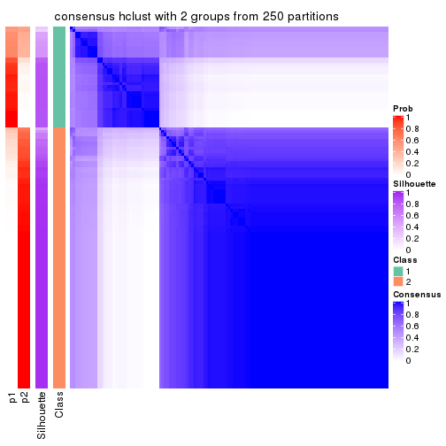</p>

</div>
<div id='tab-CV-hclust-consensus-heatmap-2'>
<pre><code class="r">consensus_heatmap(res, k = 3)
</code></pre>

<p>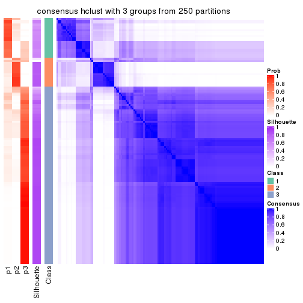</p>

</div>
<div id='tab-CV-hclust-consensus-heatmap-3'>
<pre><code class="r">consensus_heatmap(res, k = 4)
</code></pre>

<p>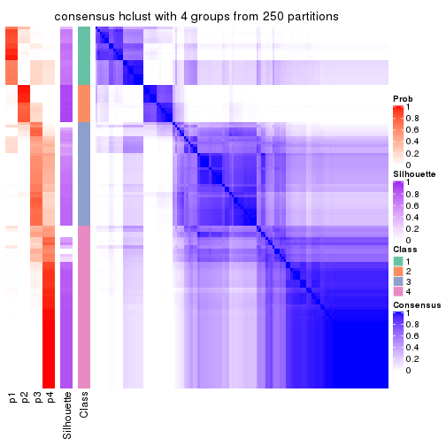</p>

</div>
<div id='tab-CV-hclust-consensus-heatmap-4'>
<pre><code class="r">consensus_heatmap(res, k = 5)
</code></pre>

<p>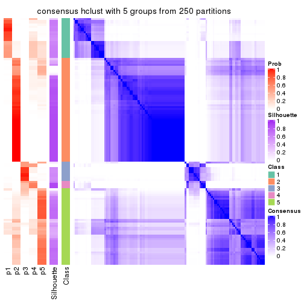</p>

</div>
<div id='tab-CV-hclust-consensus-heatmap-5'>
<pre><code class="r">consensus_heatmap(res, k = 6)
</code></pre>

<p>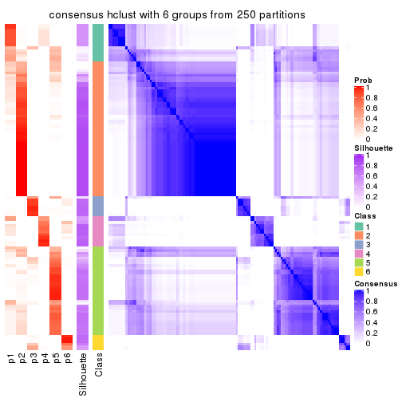</p>

</div>
</div>

Heatmaps for the membership of samples in all partitions to see how consistent they are:


<script>
$( function() {
	$( '#tabs-CV-hclust-membership-heatmap' ).tabs();
} );
</script>
<div id='tabs-CV-hclust-membership-heatmap'>
<ul>
<li><a href='#tab-CV-hclust-membership-heatmap-1'>k = 2</a></li>
<li><a href='#tab-CV-hclust-membership-heatmap-2'>k = 3</a></li>
<li><a href='#tab-CV-hclust-membership-heatmap-3'>k = 4</a></li>
<li><a href='#tab-CV-hclust-membership-heatmap-4'>k = 5</a></li>
<li><a href='#tab-CV-hclust-membership-heatmap-5'>k = 6</a></li>
</ul>
<div id='tab-CV-hclust-membership-heatmap-1'>
<pre><code class="r">membership_heatmap(res, k = 2)
</code></pre>

<p>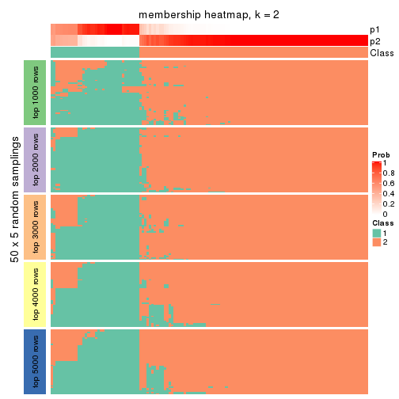</p>

</div>
<div id='tab-CV-hclust-membership-heatmap-2'>
<pre><code class="r">membership_heatmap(res, k = 3)
</code></pre>

<p>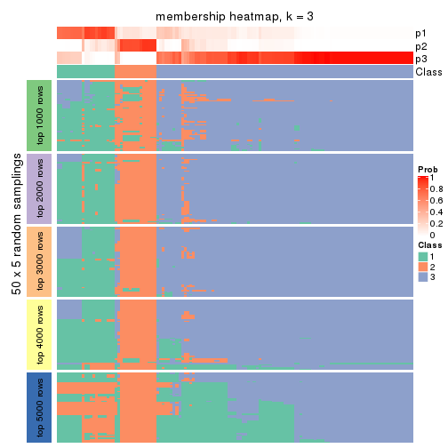</p>

</div>
<div id='tab-CV-hclust-membership-heatmap-3'>
<pre><code class="r">membership_heatmap(res, k = 4)
</code></pre>

<p>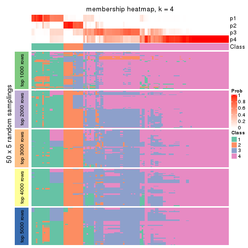</p>

</div>
<div id='tab-CV-hclust-membership-heatmap-4'>
<pre><code class="r">membership_heatmap(res, k = 5)
</code></pre>

<p>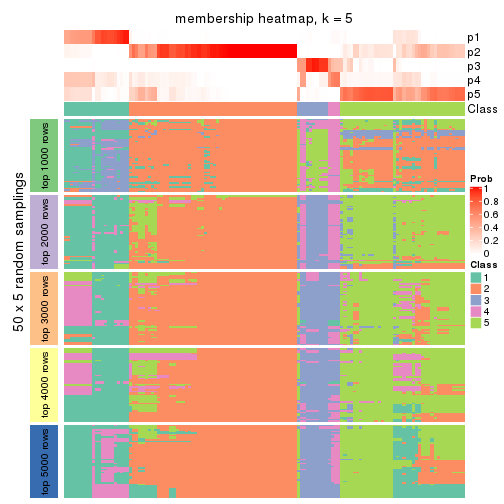</p>

</div>
<div id='tab-CV-hclust-membership-heatmap-5'>
<pre><code class="r">membership_heatmap(res, k = 6)
</code></pre>

<p>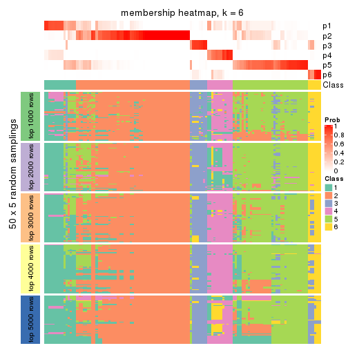</p>

</div>
</div>

As soon as we have had the classes for columns, we can look for signatures
which are significantly different between classes which can be candidate marks
for certain classes. Following are the heatmaps for signatures.


Signature heatmaps where rows are scaled:


<script>
$( function() {
	$( '#tabs-CV-hclust-get-signatures' ).tabs();
} );
</script>
<div id='tabs-CV-hclust-get-signatures'>
<ul>
<li><a href='#tab-CV-hclust-get-signatures-1'>k = 2</a></li>
<li><a href='#tab-CV-hclust-get-signatures-2'>k = 3</a></li>
<li><a href='#tab-CV-hclust-get-signatures-3'>k = 4</a></li>
<li><a href='#tab-CV-hclust-get-signatures-4'>k = 5</a></li>
<li><a href='#tab-CV-hclust-get-signatures-5'>k = 6</a></li>
</ul>
<div id='tab-CV-hclust-get-signatures-1'>
<pre><code class="r">get_signatures(res, k = 2)
</code></pre>

<p>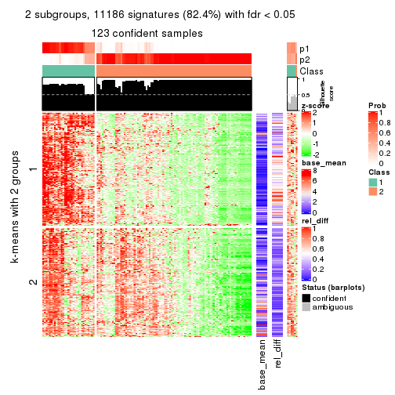</p>

</div>
<div id='tab-CV-hclust-get-signatures-2'>
<pre><code class="r">get_signatures(res, k = 3)
</code></pre>

<p>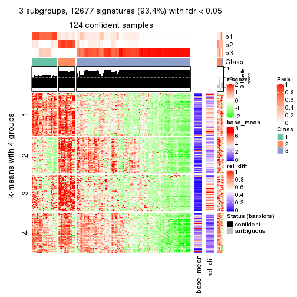</p>

</div>
<div id='tab-CV-hclust-get-signatures-3'>
<pre><code class="r">get_signatures(res, k = 4)
</code></pre>

<p>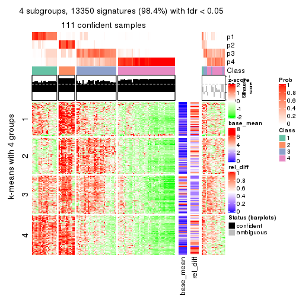</p>

</div>
<div id='tab-CV-hclust-get-signatures-4'>
<pre><code class="r">get_signatures(res, k = 5)
</code></pre>

<p>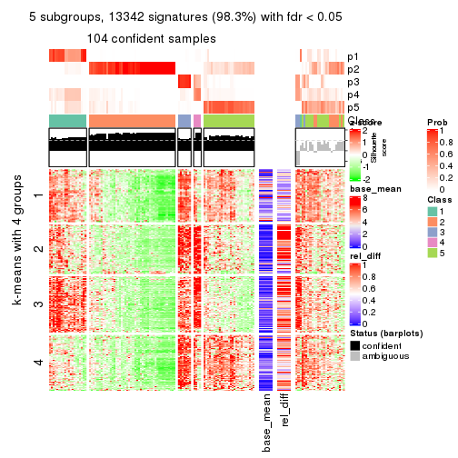</p>

</div>
<div id='tab-CV-hclust-get-signatures-5'>
<pre><code class="r">get_signatures(res, k = 6)
</code></pre>

<p>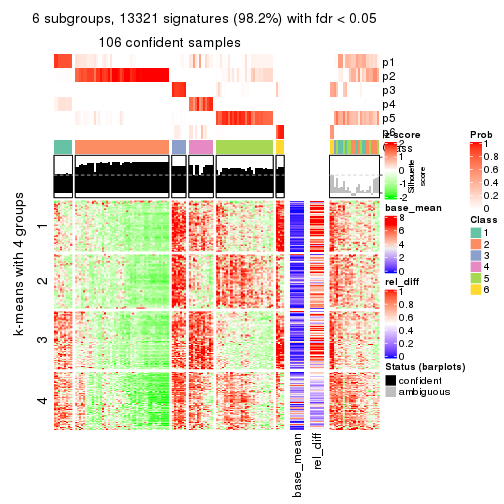</p>

</div>
</div>


Signature heatmaps where rows are not scaled:


<script>
$( function() {
	$( '#tabs-CV-hclust-get-signatures-no-scale' ).tabs();
} );
</script>
<div id='tabs-CV-hclust-get-signatures-no-scale'>
<ul>
<li><a href='#tab-CV-hclust-get-signatures-no-scale-1'>k = 2</a></li>
<li><a href='#tab-CV-hclust-get-signatures-no-scale-2'>k = 3</a></li>
<li><a href='#tab-CV-hclust-get-signatures-no-scale-3'>k = 4</a></li>
<li><a href='#tab-CV-hclust-get-signatures-no-scale-4'>k = 5</a></li>
<li><a href='#tab-CV-hclust-get-signatures-no-scale-5'>k = 6</a></li>
</ul>
<div id='tab-CV-hclust-get-signatures-no-scale-1'>
<pre><code class="r">get_signatures(res, k = 2, scale_rows = FALSE)
</code></pre>

<p>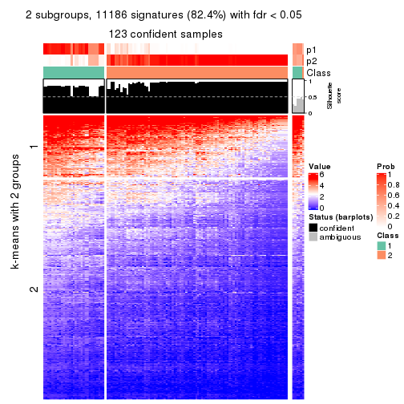</p>

</div>
<div id='tab-CV-hclust-get-signatures-no-scale-2'>
<pre><code class="r">get_signatures(res, k = 3, scale_rows = FALSE)
</code></pre>

<p>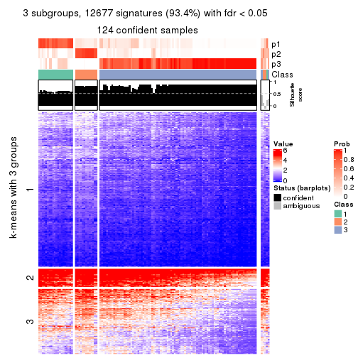</p>

</div>
<div id='tab-CV-hclust-get-signatures-no-scale-3'>
<pre><code class="r">get_signatures(res, k = 4, scale_rows = FALSE)
</code></pre>

<p>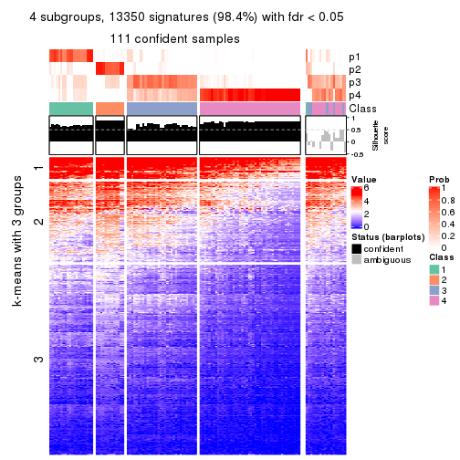</p>

</div>
<div id='tab-CV-hclust-get-signatures-no-scale-4'>
<pre><code class="r">get_signatures(res, k = 5, scale_rows = FALSE)
</code></pre>

<p>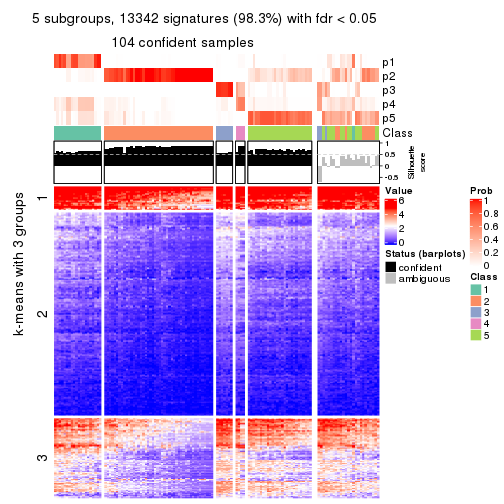</p>

</div>
<div id='tab-CV-hclust-get-signatures-no-scale-5'>
<pre><code class="r">get_signatures(res, k = 6, scale_rows = FALSE)
</code></pre>

<p>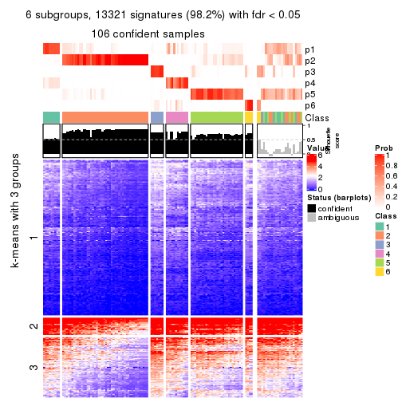</p>

</div>
</div>


Compare the overlap of signatures from different k:

```r
compare_signatures(res)
```

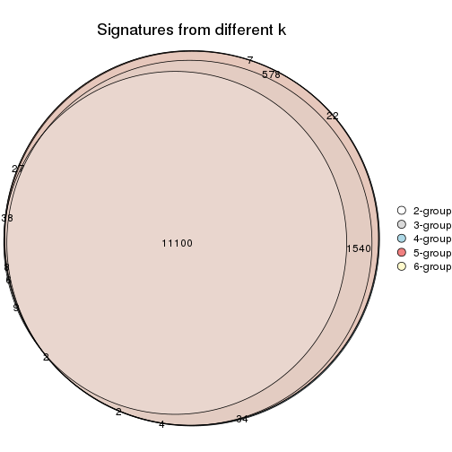

`get_signature()` returns a data frame invisibly. TO get the list of signatures, the function
call should be assigned to a variable explicitly. In following code, if `plot` argument is set
to `FALSE`, no heatmap is plotted while only the differential analysis is performed.

```r
# code only for demonstration
tb = get_signature(res, k = ..., plot = FALSE)
```

An example of the output of `tb` is:

```
#>   which_row         fdr    mean_1    mean_2 scaled_mean_1 scaled_mean_2 km
#> 1        38 0.042760348  8.373488  9.131774    -0.5533452     0.5164555  1
#> 2        40 0.018707592  7.106213  8.469186    -0.6173731     0.5762149  1
#> 3        55 0.019134737 10.221463 11.207825    -0.6159697     0.5749050  1
#> 4        59 0.006059896  5.921854  7.869574    -0.6899429     0.6439467  1
#> 5        60 0.018055526  8.928898 10.211722    -0.6204761     0.5791110  1
#> 6        98 0.009384629 15.714769 14.887706     0.6635654    -0.6193277  2
...
```

The columns in `tb` are:

1. `which_row`: row indices corresponding to the input matrix.
2. `fdr`: FDR for the differential test. 
3. `mean_x`: The mean value in group x.
4. `scaled_mean_x`: The mean value in group x after rows are scaled.
5. `km`: Row groups if k-means clustering is applied to rows.


UMAP plot which shows how samples are separated.


<script>
$( function() {
	$( '#tabs-CV-hclust-dimension-reduction' ).tabs();
} );
</script>
<div id='tabs-CV-hclust-dimension-reduction'>
<ul>
<li><a href='#tab-CV-hclust-dimension-reduction-1'>k = 2</a></li>
<li><a href='#tab-CV-hclust-dimension-reduction-2'>k = 3</a></li>
<li><a href='#tab-CV-hclust-dimension-reduction-3'>k = 4</a></li>
<li><a href='#tab-CV-hclust-dimension-reduction-4'>k = 5</a></li>
<li><a href='#tab-CV-hclust-dimension-reduction-5'>k = 6</a></li>
</ul>
<div id='tab-CV-hclust-dimension-reduction-1'>
<pre><code class="r">dimension_reduction(res, k = 2, method = &quot;UMAP&quot;)
</code></pre>

<p>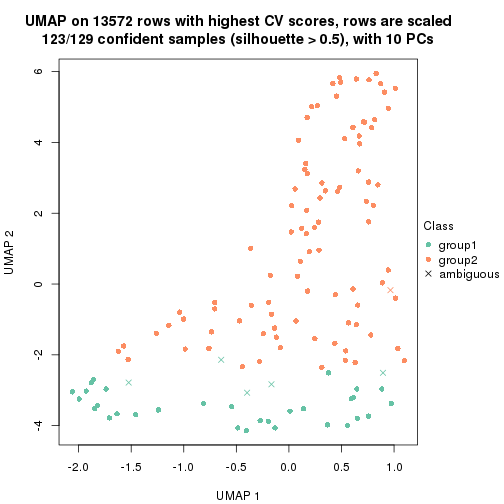</p>

</div>
<div id='tab-CV-hclust-dimension-reduction-2'>
<pre><code class="r">dimension_reduction(res, k = 3, method = &quot;UMAP&quot;)
</code></pre>

<p>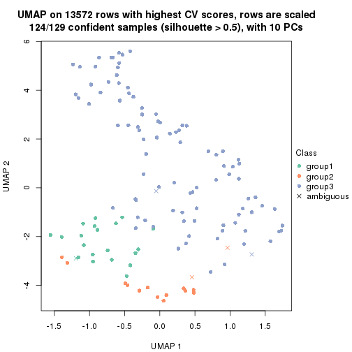</p>

</div>
<div id='tab-CV-hclust-dimension-reduction-3'>
<pre><code class="r">dimension_reduction(res, k = 4, method = &quot;UMAP&quot;)
</code></pre>

<p>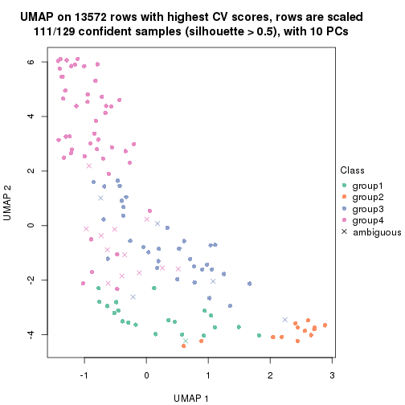</p>

</div>
<div id='tab-CV-hclust-dimension-reduction-4'>
<pre><code class="r">dimension_reduction(res, k = 5, method = &quot;UMAP&quot;)
</code></pre>

<p>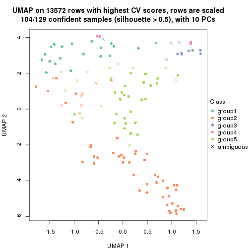</p>

</div>
<div id='tab-CV-hclust-dimension-reduction-5'>
<pre><code class="r">dimension_reduction(res, k = 6, method = &quot;UMAP&quot;)
</code></pre>

<p>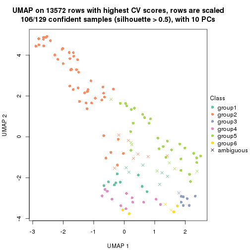</p>

</div>
</div>


Following heatmap shows how subgroups are split when increasing `k`:

```r
collect_classes(res)
```

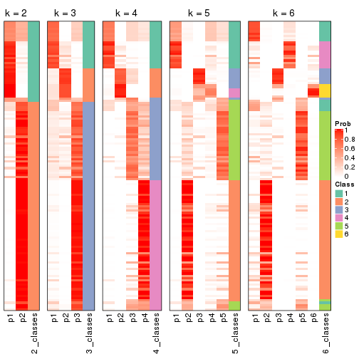


If matrix rows can be associated to genes, consider to use `GO_Enrichment(res,
...)` to perform function enrichment for the signature genes.


 

---------------------------------------------------


### CV:kmeans**


The object with results only for a single top-value method and a single partition method 
can be extracted as:

```r
res = res_list["CV", "kmeans"]
# you can also extract it by
# res = res_list["CV:kmeans"]
```

A summary of `res` and all the functions that can be applied to it:

```r
res
```

```
#> A 'ConsensusPartition' object with k = 2, 3, 4, 5, 6.
#>   On a matrix with 13572 rows and 129 columns.
#>   Top rows (1000, 2000, 3000, 4000, 5000) are extracted by 'CV' method.
#>   Subgroups are detected by 'kmeans' method.
#>   Performed in total 1250 partitions by row resampling.
#>   Best k for subgroups seems to be 2.
#> 
#> Following methods can be applied to this 'ConsensusPartition' object:
#>  [1] "cola_report"             "collect_classes"         "collect_plots"          
#>  [4] "collect_stats"           "colnames"                "compare_signatures"     
#>  [7] "consensus_heatmap"       "dimension_reduction"     "functional_enrichment"  
#> [10] "get_anno_col"            "get_anno"                "get_classes"            
#> [13] "get_consensus"           "get_matrix"              "get_membership"         
#> [16] "get_param"               "get_signatures"          "get_stats"              
#> [19] "is_best_k"               "is_stable_k"             "membership_heatmap"     
#> [22] "ncol"                    "nrow"                    "plot_ecdf"              
#> [25] "rownames"                "select_partition_number" "show"                   
#> [28] "suggest_best_k"          "test_to_known_factors"
```

`collect_plots()` function collects all the plots made from `res` for all `k` (number of partitions)
into one single page to provide an easy and fast comparison between different `k`.

```r
collect_plots(res)
```

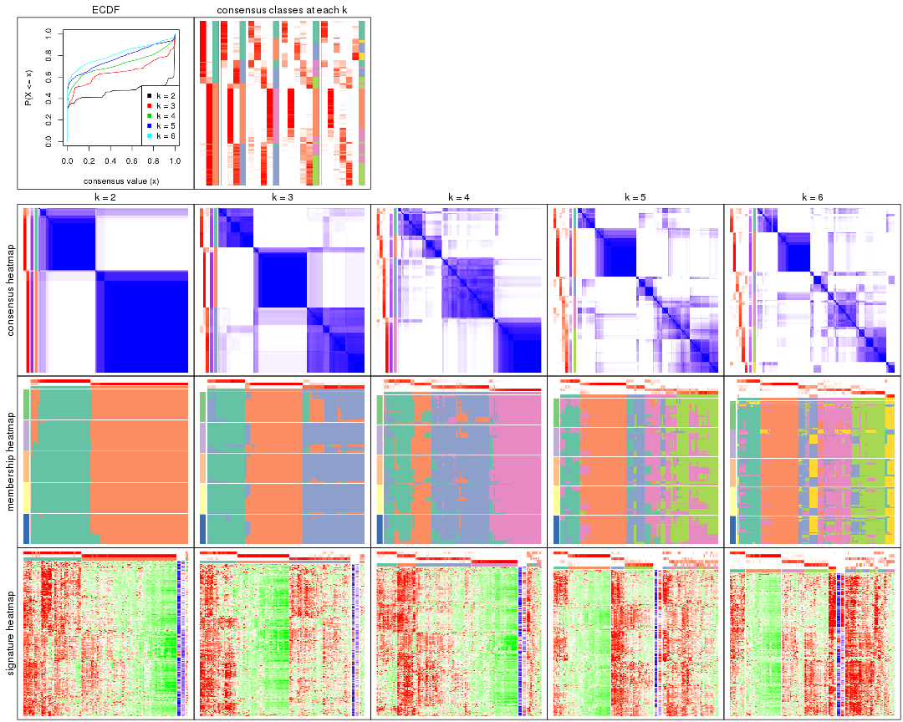

The plots are:

- The first row: a plot of the ECDF (Empirical cumulative distribution
  function) curves of the consensus matrix for each `k` and the heatmap of
  predicted classes for each `k`.
- The second row: heatmaps of the consensus matrix for each `k`.
- The third row: heatmaps of the membership matrix for each `k`.
- The fouth row: heatmaps of the signatures for each `k`.

All the plots in panels can be made by individual functions and they are
plotted later in this section.

`select_partition_number()` produces several plots showing different
statistics for choosing "optimized" `k`. There are following statistics:

- ECDF curves of the consensus matrix for each `k`;
- 1-PAC. [The PAC
  score](https://en.wikipedia.org/wiki/Consensus_clustering#Over-interpretation_potential_of_consensus_clustering)
  measures the proportion of the ambiguous subgrouping.
- Mean silhouette score.
- Concordance. The mean probability of fiting the consensus class ids in all
  partitions.
- Area increased. Denote $A_k$ as the area under the ECDF curve for current
  `k`, the area increased is defined as $A_k - A_{k-1}$.
- Rand index. The percent of pairs of samples that are both in a same cluster
  or both are not in a same cluster in the partition of k and k-1.
- Jaccard index. The ratio of pairs of samples are both in a same cluster in
  the partition of k and k-1 and the pairs of samples are both in a same
  cluster in the partition k or k-1.

The detailed explanations of these statistics can be found in [the cola
vignette](http://bioconductor.org/packages/devel/bioc/vignettes/cola/inst/doc/cola.html#toc_13).

Generally speaking, lower PAC score, higher mean silhouette score or higher
concordance corresponds to better partition. Rand index and Jaccard index
measure how similar the current partition is compared to partition with `k-1`.
If they are too similar, we won't accept `k` is better than `k-1`.

```r
select_partition_number(res)
```

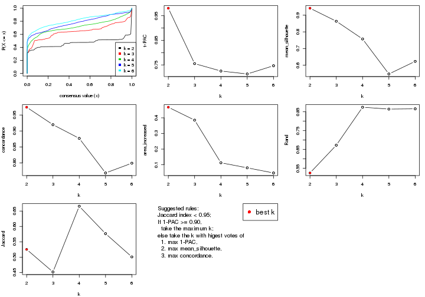

The numeric values for all these statistics can be obtained by `get_stats()`.

```r
get_stats(res)
```

```
#>   k 1-PAC mean_silhouette concordance area_increased  Rand Jaccard
#> 2 2 0.980           0.942       0.974         0.4677 0.525   0.525
#> 3 3 0.755           0.864       0.920         0.3853 0.673   0.452
#> 4 4 0.725           0.757       0.877         0.1126 0.874   0.666
#> 5 5 0.713           0.548       0.768         0.0804 0.864   0.576
#> 6 6 0.747           0.623       0.799         0.0475 0.866   0.501
```

`suggest_best_k()` suggests the best $k$ based on these statistics. The rules are as follows:

- All $k$ with Jaccard index larger than 0.95 are removed because the increase of
  the partition number does not provides enough extra information. If all $k$ are removed,
  the best $k$ is assigned by `NA`.
- For $k$ with 1-PAC larger than 0.9, the maximal $k$ is taken as the "best k". Other $k$ is called "optional k".
- If it does not fit the second rule. The $k$ with the highest vote of highest
  1-PAC, mean silhouette and concordance is taken as the "best k".

```r
suggest_best_k(res)
```

```
#> [1] 2
```


Following shows the table of the partitions (You need to click the **show/hide
code output** link to see it). The membership matrix (columns with name `p*`)
is inferred by
[`clue::cl_consensus()`](https://www.rdocumentation.org/link/cl_consensus?package=clue)
function with the `SE` method. Basically the value in the membership matrix
represents the probability to belong to a certain group. The finall class
label for an item is determined with the group with highest probability it
belongs to.

In `get_classes()` function, the entropy is calculated from the membership
matrix and the silhouette score is calculated from the consensus matrix.


<script>
$( function() {
	$( '#tabs-CV-kmeans-get-classes' ).tabs();
} );
</script>
<div id='tabs-CV-kmeans-get-classes'>
<ul>
<li><a href='#tab-CV-kmeans-get-classes-1'>k = 2</a></li>
<li><a href='#tab-CV-kmeans-get-classes-2'>k = 3</a></li>
<li><a href='#tab-CV-kmeans-get-classes-3'>k = 4</a></li>
<li><a href='#tab-CV-kmeans-get-classes-4'>k = 5</a></li>
<li><a href='#tab-CV-kmeans-get-classes-5'>k = 6</a></li>
</ul>

<div id='tab-CV-kmeans-get-classes-1'>
<p><a id='tab-CV-kmeans-get-classes-1-a' style='color:#0366d6' href='#'>show/hide code output</a></p>
<pre><code class="r">cbind(get_classes(res, k = 2), get_membership(res, k = 2))
</code></pre>

<pre><code>#&gt;            class entropy silhouette    p1    p2
#&gt; SRR1656463     2  0.0000      0.988 0.000 1.000
#&gt; SRR1656464     1  0.0000      0.948 1.000 0.000
#&gt; SRR1656462     1  0.0000      0.948 1.000 0.000
#&gt; SRR1656465     2  0.0376      0.985 0.004 0.996
#&gt; SRR1656467     2  0.0000      0.988 0.000 1.000
#&gt; SRR1656466     1  0.9775      0.358 0.588 0.412
#&gt; SRR1656468     2  0.0000      0.988 0.000 1.000
#&gt; SRR1656472     1  0.0000      0.948 1.000 0.000
#&gt; SRR1656471     1  0.9323      0.514 0.652 0.348
#&gt; SRR1656470     2  0.0000      0.988 0.000 1.000
#&gt; SRR1656469     2  0.0000      0.988 0.000 1.000
#&gt; SRR1656473     2  0.0000      0.988 0.000 1.000
#&gt; SRR1656474     2  0.0000      0.988 0.000 1.000
#&gt; SRR1656475     2  0.0000      0.988 0.000 1.000
#&gt; SRR1656478     1  0.0000      0.948 1.000 0.000
#&gt; SRR1656477     2  0.0000      0.988 0.000 1.000
#&gt; SRR1656479     2  0.0000      0.988 0.000 1.000
#&gt; SRR1656480     2  0.0000      0.988 0.000 1.000
#&gt; SRR1656476     2  0.0000      0.988 0.000 1.000
#&gt; SRR1656481     2  0.0000      0.988 0.000 1.000
#&gt; SRR1656482     2  0.0000      0.988 0.000 1.000
#&gt; SRR1656483     2  0.0000      0.988 0.000 1.000
#&gt; SRR1656485     1  0.9170      0.546 0.668 0.332
#&gt; SRR1656487     2  0.3733      0.919 0.072 0.928
#&gt; SRR1656486     2  0.0000      0.988 0.000 1.000
#&gt; SRR1656488     1  0.9286      0.522 0.656 0.344
#&gt; SRR1656484     1  0.1414      0.935 0.980 0.020
#&gt; SRR1656489     1  0.0000      0.948 1.000 0.000
#&gt; SRR1656491     2  0.0000      0.988 0.000 1.000
#&gt; SRR1656490     2  0.0000      0.988 0.000 1.000
#&gt; SRR1656492     2  0.3733      0.919 0.072 0.928
#&gt; SRR1656493     1  0.0000      0.948 1.000 0.000
#&gt; SRR1656495     1  0.0000      0.948 1.000 0.000
#&gt; SRR1656496     2  0.0376      0.985 0.004 0.996
#&gt; SRR1656494     2  0.0000      0.988 0.000 1.000
#&gt; SRR1656497     2  0.0000      0.988 0.000 1.000
#&gt; SRR1656499     1  0.0000      0.948 1.000 0.000
#&gt; SRR1656500     1  0.0000      0.948 1.000 0.000
#&gt; SRR1656501     2  0.0000      0.988 0.000 1.000
#&gt; SRR1656498     1  0.0000      0.948 1.000 0.000
#&gt; SRR1656504     2  0.0000      0.988 0.000 1.000
#&gt; SRR1656502     1  0.0000      0.948 1.000 0.000
#&gt; SRR1656503     2  0.9393      0.431 0.356 0.644
#&gt; SRR1656507     1  0.0000      0.948 1.000 0.000
#&gt; SRR1656508     1  0.0000      0.948 1.000 0.000
#&gt; SRR1656505     2  0.0000      0.988 0.000 1.000
#&gt; SRR1656506     2  0.0000      0.988 0.000 1.000
#&gt; SRR1656509     1  0.4562      0.870 0.904 0.096
#&gt; SRR1656510     2  0.0000      0.988 0.000 1.000
#&gt; SRR1656511     2  0.0000      0.988 0.000 1.000
#&gt; SRR1656513     2  0.0000      0.988 0.000 1.000
#&gt; SRR1656512     2  0.0000      0.988 0.000 1.000
#&gt; SRR1656514     1  0.0000      0.948 1.000 0.000
#&gt; SRR1656515     2  0.0000      0.988 0.000 1.000
#&gt; SRR1656516     2  0.4298      0.901 0.088 0.912
#&gt; SRR1656518     1  0.9087      0.535 0.676 0.324
#&gt; SRR1656517     1  0.0000      0.948 1.000 0.000
#&gt; SRR1656519     1  0.0000      0.948 1.000 0.000
#&gt; SRR1656522     1  0.0000      0.948 1.000 0.000
#&gt; SRR1656523     2  0.0000      0.988 0.000 1.000
#&gt; SRR1656521     2  0.0000      0.988 0.000 1.000
#&gt; SRR1656520     1  0.0000      0.948 1.000 0.000
#&gt; SRR1656524     1  0.0000      0.948 1.000 0.000
#&gt; SRR1656525     2  0.3733      0.919 0.072 0.928
#&gt; SRR1656526     2  0.0000      0.988 0.000 1.000
#&gt; SRR1656527     2  0.0000      0.988 0.000 1.000
#&gt; SRR1656530     2  0.0000      0.988 0.000 1.000
#&gt; SRR1656529     2  0.0000      0.988 0.000 1.000
#&gt; SRR1656531     1  0.0000      0.948 1.000 0.000
#&gt; SRR1656528     2  0.3584      0.924 0.068 0.932
#&gt; SRR1656534     1  0.0000      0.948 1.000 0.000
#&gt; SRR1656533     1  0.0000      0.948 1.000 0.000
#&gt; SRR1656536     2  0.0000      0.988 0.000 1.000
#&gt; SRR1656532     2  0.0000      0.988 0.000 1.000
#&gt; SRR1656537     1  0.0000      0.948 1.000 0.000
#&gt; SRR1656538     1  0.5519      0.838 0.872 0.128
#&gt; SRR1656535     2  0.0000      0.988 0.000 1.000
#&gt; SRR1656539     2  0.3584      0.924 0.068 0.932
#&gt; SRR1656544     1  0.9358      0.506 0.648 0.352
#&gt; SRR1656542     1  0.0000      0.948 1.000 0.000
#&gt; SRR1656543     1  0.0000      0.948 1.000 0.000
#&gt; SRR1656545     2  0.0000      0.988 0.000 1.000
#&gt; SRR1656540     1  0.0000      0.948 1.000 0.000
#&gt; SRR1656546     2  0.0000      0.988 0.000 1.000
#&gt; SRR1656541     2  0.0000      0.988 0.000 1.000
#&gt; SRR1656547     2  0.0000      0.988 0.000 1.000
#&gt; SRR1656548     2  0.0000      0.988 0.000 1.000
#&gt; SRR1656549     2  0.0000      0.988 0.000 1.000
#&gt; SRR1656551     2  0.0000      0.988 0.000 1.000
#&gt; SRR1656553     1  0.0000      0.948 1.000 0.000
#&gt; SRR1656550     2  0.0000      0.988 0.000 1.000
#&gt; SRR1656552     2  0.0000      0.988 0.000 1.000
#&gt; SRR1656554     2  0.0000      0.988 0.000 1.000
#&gt; SRR1656555     2  0.0000      0.988 0.000 1.000
#&gt; SRR1656556     1  0.0938      0.940 0.988 0.012
#&gt; SRR1656557     1  0.0000      0.948 1.000 0.000
#&gt; SRR1656558     1  0.0000      0.948 1.000 0.000
#&gt; SRR1656559     1  0.0000      0.948 1.000 0.000
#&gt; SRR1656560     2  0.3584      0.924 0.068 0.932
#&gt; SRR1656561     2  0.0000      0.988 0.000 1.000
#&gt; SRR1656562     2  0.0000      0.988 0.000 1.000
#&gt; SRR1656563     1  0.0000      0.948 1.000 0.000
#&gt; SRR1656564     2  0.0000      0.988 0.000 1.000
#&gt; SRR1656565     2  0.0000      0.988 0.000 1.000
#&gt; SRR1656566     1  0.0000      0.948 1.000 0.000
#&gt; SRR1656568     2  0.0000      0.988 0.000 1.000
#&gt; SRR1656567     2  0.0000      0.988 0.000 1.000
#&gt; SRR1656569     2  0.0000      0.988 0.000 1.000
#&gt; SRR1656570     1  0.1184      0.938 0.984 0.016
#&gt; SRR1656571     2  0.0000      0.988 0.000 1.000
#&gt; SRR1656573     2  0.0000      0.988 0.000 1.000
#&gt; SRR1656572     2  0.0000      0.988 0.000 1.000
#&gt; SRR1656574     1  0.0000      0.948 1.000 0.000
#&gt; SRR1656575     2  0.0376      0.985 0.004 0.996
#&gt; SRR1656576     2  0.0000      0.988 0.000 1.000
#&gt; SRR1656578     2  0.0000      0.988 0.000 1.000
#&gt; SRR1656577     1  0.0000      0.948 1.000 0.000
#&gt; SRR1656579     2  0.0000      0.988 0.000 1.000
#&gt; SRR1656580     1  0.0000      0.948 1.000 0.000
#&gt; SRR1656581     2  0.0000      0.988 0.000 1.000
#&gt; SRR1656582     2  0.0000      0.988 0.000 1.000
#&gt; SRR1656585     2  0.0000      0.988 0.000 1.000
#&gt; SRR1656584     1  0.2236      0.923 0.964 0.036
#&gt; SRR1656583     1  0.0000      0.948 1.000 0.000
#&gt; SRR1656586     2  0.0000      0.988 0.000 1.000
#&gt; SRR1656587     2  0.0376      0.985 0.004 0.996
#&gt; SRR1656588     2  0.0000      0.988 0.000 1.000
#&gt; SRR1656589     2  0.0000      0.988 0.000 1.000
#&gt; SRR1656590     1  0.0000      0.948 1.000 0.000
</code></pre>

<script>
$('#tab-CV-kmeans-get-classes-1-a').parent().next().next().hide();
$('#tab-CV-kmeans-get-classes-1-a').click(function(){
  $('#tab-CV-kmeans-get-classes-1-a').parent().next().next().toggle();
  return(false);
});
</script>
</div>

<div id='tab-CV-kmeans-get-classes-2'>
<p><a id='tab-CV-kmeans-get-classes-2-a' style='color:#0366d6' href='#'>show/hide code output</a></p>
<pre><code class="r">cbind(get_classes(res, k = 3), get_membership(res, k = 3))
</code></pre>

<pre><code>#&gt;            class entropy silhouette    p1    p2    p3
#&gt; SRR1656463     2  0.0000      0.956 0.000 1.000 0.000
#&gt; SRR1656464     1  0.1753      0.921 0.952 0.000 0.048
#&gt; SRR1656462     1  0.4750      0.818 0.784 0.000 0.216
#&gt; SRR1656465     3  0.2066      0.888 0.000 0.060 0.940
#&gt; SRR1656467     2  0.0000      0.956 0.000 1.000 0.000
#&gt; SRR1656466     3  0.0592      0.869 0.000 0.012 0.988
#&gt; SRR1656468     2  0.1643      0.911 0.000 0.956 0.044
#&gt; SRR1656472     1  0.1753      0.921 0.952 0.000 0.048
#&gt; SRR1656471     3  0.0592      0.869 0.000 0.012 0.988
#&gt; SRR1656470     2  0.0000      0.956 0.000 1.000 0.000
#&gt; SRR1656469     3  0.5098      0.771 0.000 0.248 0.752
#&gt; SRR1656473     2  0.0000      0.956 0.000 1.000 0.000
#&gt; SRR1656474     2  0.0000      0.956 0.000 1.000 0.000
#&gt; SRR1656475     2  0.0000      0.956 0.000 1.000 0.000
#&gt; SRR1656478     1  0.2066      0.902 0.940 0.000 0.060
#&gt; SRR1656477     3  0.2165      0.888 0.000 0.064 0.936
#&gt; SRR1656479     3  0.4887      0.794 0.000 0.228 0.772
#&gt; SRR1656480     3  0.5138      0.767 0.000 0.252 0.748
#&gt; SRR1656476     2  0.0000      0.956 0.000 1.000 0.000
#&gt; SRR1656481     3  0.2165      0.888 0.000 0.064 0.936
#&gt; SRR1656482     2  0.0000      0.956 0.000 1.000 0.000
#&gt; SRR1656483     2  0.0000      0.956 0.000 1.000 0.000
#&gt; SRR1656485     3  0.0592      0.869 0.000 0.012 0.988
#&gt; SRR1656487     3  0.0592      0.869 0.000 0.012 0.988
#&gt; SRR1656486     2  0.0000      0.956 0.000 1.000 0.000
#&gt; SRR1656488     3  0.0592      0.869 0.000 0.012 0.988
#&gt; SRR1656484     3  0.4504      0.766 0.196 0.000 0.804
#&gt; SRR1656489     1  0.2066      0.902 0.940 0.000 0.060
#&gt; SRR1656491     3  0.4887      0.794 0.000 0.228 0.772
#&gt; SRR1656490     3  0.5465      0.722 0.000 0.288 0.712
#&gt; SRR1656492     3  0.1860      0.886 0.000 0.052 0.948
#&gt; SRR1656493     1  0.0592      0.924 0.988 0.000 0.012
#&gt; SRR1656495     1  0.0592      0.924 0.988 0.000 0.012
#&gt; SRR1656496     3  0.2165      0.888 0.000 0.064 0.936
#&gt; SRR1656494     3  0.4887      0.794 0.000 0.228 0.772
#&gt; SRR1656497     2  0.0000      0.956 0.000 1.000 0.000
#&gt; SRR1656499     3  0.0592      0.860 0.012 0.000 0.988
#&gt; SRR1656500     1  0.5327      0.759 0.728 0.000 0.272
#&gt; SRR1656501     3  0.5138      0.770 0.000 0.252 0.748
#&gt; SRR1656498     1  0.0592      0.924 0.988 0.000 0.012
#&gt; SRR1656504     2  0.0000      0.956 0.000 1.000 0.000
#&gt; SRR1656502     1  0.1753      0.921 0.952 0.000 0.048
#&gt; SRR1656503     3  0.1753      0.859 0.048 0.000 0.952
#&gt; SRR1656507     3  0.5216      0.697 0.260 0.000 0.740
#&gt; SRR1656508     1  0.0592      0.924 0.988 0.000 0.012
#&gt; SRR1656505     2  0.6026      0.286 0.000 0.624 0.376
#&gt; SRR1656506     3  0.2165      0.888 0.000 0.064 0.936
#&gt; SRR1656509     3  0.0000      0.862 0.000 0.000 1.000
#&gt; SRR1656510     2  0.0000      0.956 0.000 1.000 0.000
#&gt; SRR1656511     2  0.0000      0.956 0.000 1.000 0.000
#&gt; SRR1656513     2  0.0000      0.956 0.000 1.000 0.000
#&gt; SRR1656512     2  0.0000      0.956 0.000 1.000 0.000
#&gt; SRR1656514     1  0.1753      0.921 0.952 0.000 0.048
#&gt; SRR1656515     2  0.0000      0.956 0.000 1.000 0.000
#&gt; SRR1656516     3  0.2527      0.882 0.020 0.044 0.936
#&gt; SRR1656518     3  0.5327      0.684 0.272 0.000 0.728
#&gt; SRR1656517     1  0.0592      0.924 0.988 0.000 0.012
#&gt; SRR1656519     1  0.1860      0.920 0.948 0.000 0.052
#&gt; SRR1656522     1  0.1753      0.921 0.952 0.000 0.048
#&gt; SRR1656523     2  0.0000      0.956 0.000 1.000 0.000
#&gt; SRR1656521     2  0.0000      0.956 0.000 1.000 0.000
#&gt; SRR1656520     1  0.4750      0.818 0.784 0.000 0.216
#&gt; SRR1656524     1  0.0592      0.924 0.988 0.000 0.012
#&gt; SRR1656525     3  0.1964      0.887 0.000 0.056 0.944
#&gt; SRR1656526     2  0.0000      0.956 0.000 1.000 0.000
#&gt; SRR1656527     2  0.0000      0.956 0.000 1.000 0.000
#&gt; SRR1656530     3  0.2959      0.877 0.000 0.100 0.900
#&gt; SRR1656529     3  0.2165      0.888 0.000 0.064 0.936
#&gt; SRR1656531     1  0.0000      0.924 1.000 0.000 0.000
#&gt; SRR1656528     3  0.2066      0.888 0.000 0.060 0.940
#&gt; SRR1656534     1  0.1860      0.920 0.948 0.000 0.052
#&gt; SRR1656533     1  0.0592      0.924 0.988 0.000 0.012
#&gt; SRR1656536     3  0.2165      0.888 0.000 0.064 0.936
#&gt; SRR1656532     2  0.0592      0.943 0.000 0.988 0.012
#&gt; SRR1656537     1  0.0000      0.924 1.000 0.000 0.000
#&gt; SRR1656538     3  0.1999      0.869 0.036 0.012 0.952
#&gt; SRR1656535     2  0.0000      0.956 0.000 1.000 0.000
#&gt; SRR1656539     3  0.2066      0.888 0.000 0.060 0.940
#&gt; SRR1656544     3  0.1163      0.877 0.000 0.028 0.972
#&gt; SRR1656542     1  0.5926      0.652 0.644 0.000 0.356
#&gt; SRR1656543     1  0.4750      0.818 0.784 0.000 0.216
#&gt; SRR1656545     2  0.0000      0.956 0.000 1.000 0.000
#&gt; SRR1656540     1  0.5098      0.785 0.752 0.000 0.248
#&gt; SRR1656546     2  0.0000      0.956 0.000 1.000 0.000
#&gt; SRR1656541     2  0.0000      0.956 0.000 1.000 0.000
#&gt; SRR1656547     2  0.0000      0.956 0.000 1.000 0.000
#&gt; SRR1656548     3  0.2165      0.888 0.000 0.064 0.936
#&gt; SRR1656549     2  0.0424      0.948 0.000 0.992 0.008
#&gt; SRR1656551     2  0.6154      0.176 0.000 0.592 0.408
#&gt; SRR1656553     3  0.0000      0.862 0.000 0.000 1.000
#&gt; SRR1656550     3  0.2165      0.888 0.000 0.064 0.936
#&gt; SRR1656552     2  0.0000      0.956 0.000 1.000 0.000
#&gt; SRR1656554     3  0.2165      0.888 0.000 0.064 0.936
#&gt; SRR1656555     2  0.0000      0.956 0.000 1.000 0.000
#&gt; SRR1656556     3  0.0592      0.860 0.012 0.000 0.988
#&gt; SRR1656557     1  0.5098      0.785 0.752 0.000 0.248
#&gt; SRR1656558     1  0.1753      0.909 0.952 0.000 0.048
#&gt; SRR1656559     1  0.1753      0.921 0.952 0.000 0.048
#&gt; SRR1656560     3  0.2066      0.888 0.000 0.060 0.940
#&gt; SRR1656561     3  0.4291      0.834 0.000 0.180 0.820
#&gt; SRR1656562     2  0.0000      0.956 0.000 1.000 0.000
#&gt; SRR1656563     3  0.5327      0.684 0.272 0.000 0.728
#&gt; SRR1656564     2  0.0000      0.956 0.000 1.000 0.000
#&gt; SRR1656565     2  0.0000      0.956 0.000 1.000 0.000
#&gt; SRR1656566     1  0.2066      0.902 0.940 0.000 0.060
#&gt; SRR1656568     2  0.0000      0.956 0.000 1.000 0.000
#&gt; SRR1656567     2  0.6026      0.286 0.000 0.624 0.376
#&gt; SRR1656569     3  0.3752      0.858 0.000 0.144 0.856
#&gt; SRR1656570     3  0.5327      0.684 0.272 0.000 0.728
#&gt; SRR1656571     2  0.0000      0.956 0.000 1.000 0.000
#&gt; SRR1656573     3  0.4887      0.794 0.000 0.228 0.772
#&gt; SRR1656572     2  0.0000      0.956 0.000 1.000 0.000
#&gt; SRR1656574     1  0.0592      0.924 0.988 0.000 0.012
#&gt; SRR1656575     3  0.5803      0.755 0.016 0.248 0.736
#&gt; SRR1656576     2  0.0000      0.956 0.000 1.000 0.000
#&gt; SRR1656578     2  0.0592      0.943 0.000 0.988 0.012
#&gt; SRR1656577     1  0.0000      0.924 1.000 0.000 0.000
#&gt; SRR1656579     2  0.0000      0.956 0.000 1.000 0.000
#&gt; SRR1656580     3  0.1289      0.862 0.032 0.000 0.968
#&gt; SRR1656581     2  0.6309     -0.213 0.000 0.500 0.500
#&gt; SRR1656582     2  0.0000      0.956 0.000 1.000 0.000
#&gt; SRR1656585     3  0.4750      0.805 0.000 0.216 0.784
#&gt; SRR1656584     3  0.5327      0.684 0.272 0.000 0.728
#&gt; SRR1656583     3  0.0592      0.860 0.012 0.000 0.988
#&gt; SRR1656586     2  0.0000      0.956 0.000 1.000 0.000
#&gt; SRR1656587     3  0.4750      0.805 0.000 0.216 0.784
#&gt; SRR1656588     3  0.5327      0.739 0.000 0.272 0.728
#&gt; SRR1656589     2  0.0000      0.956 0.000 1.000 0.000
#&gt; SRR1656590     1  0.0592      0.924 0.988 0.000 0.012
</code></pre>

<script>
$('#tab-CV-kmeans-get-classes-2-a').parent().next().next().hide();
$('#tab-CV-kmeans-get-classes-2-a').click(function(){
  $('#tab-CV-kmeans-get-classes-2-a').parent().next().next().toggle();
  return(false);
});
</script>
</div>

<div id='tab-CV-kmeans-get-classes-3'>
<p><a id='tab-CV-kmeans-get-classes-3-a' style='color:#0366d6' href='#'>show/hide code output</a></p>
<pre><code class="r">cbind(get_classes(res, k = 4), get_membership(res, k = 4))
</code></pre>

<pre><code>#&gt;            class entropy silhouette    p1    p2    p3    p4
#&gt; SRR1656463     4  0.0000     0.9320 0.000 0.000 0.000 1.000
#&gt; SRR1656464     2  0.2814     0.7989 0.132 0.868 0.000 0.000
#&gt; SRR1656462     2  0.2048     0.7916 0.008 0.928 0.064 0.000
#&gt; SRR1656465     3  0.0376     0.8576 0.004 0.004 0.992 0.000
#&gt; SRR1656467     4  0.0657     0.9267 0.012 0.000 0.004 0.984
#&gt; SRR1656466     3  0.1978     0.8300 0.004 0.068 0.928 0.000
#&gt; SRR1656468     4  0.5912     0.1068 0.036 0.000 0.440 0.524
#&gt; SRR1656472     2  0.2814     0.7989 0.132 0.868 0.000 0.000
#&gt; SRR1656471     3  0.2654     0.8052 0.004 0.108 0.888 0.000
#&gt; SRR1656470     4  0.0000     0.9320 0.000 0.000 0.000 1.000
#&gt; SRR1656469     3  0.2892     0.8404 0.036 0.000 0.896 0.068
#&gt; SRR1656473     4  0.0000     0.9320 0.000 0.000 0.000 1.000
#&gt; SRR1656474     4  0.0000     0.9320 0.000 0.000 0.000 1.000
#&gt; SRR1656475     4  0.0000     0.9320 0.000 0.000 0.000 1.000
#&gt; SRR1656478     1  0.1510     0.7158 0.956 0.028 0.016 0.000
#&gt; SRR1656477     3  0.0992     0.8606 0.012 0.004 0.976 0.008
#&gt; SRR1656479     3  0.5036     0.6450 0.280 0.000 0.696 0.024
#&gt; SRR1656480     3  0.2965     0.8388 0.036 0.000 0.892 0.072
#&gt; SRR1656476     4  0.0000     0.9320 0.000 0.000 0.000 1.000
#&gt; SRR1656481     3  0.0992     0.8606 0.012 0.004 0.976 0.008
#&gt; SRR1656482     4  0.0000     0.9320 0.000 0.000 0.000 1.000
#&gt; SRR1656483     4  0.0000     0.9320 0.000 0.000 0.000 1.000
#&gt; SRR1656485     3  0.2125     0.8256 0.004 0.076 0.920 0.000
#&gt; SRR1656487     3  0.2466     0.8140 0.004 0.096 0.900 0.000
#&gt; SRR1656486     4  0.3216     0.8509 0.076 0.000 0.044 0.880
#&gt; SRR1656488     3  0.2999     0.7865 0.004 0.132 0.864 0.000
#&gt; SRR1656484     1  0.4933     0.1428 0.568 0.000 0.432 0.000
#&gt; SRR1656489     1  0.2222     0.7150 0.924 0.060 0.016 0.000
#&gt; SRR1656491     3  0.2871     0.8469 0.072 0.000 0.896 0.032
#&gt; SRR1656490     3  0.4688     0.7745 0.080 0.000 0.792 0.128
#&gt; SRR1656492     3  0.1792     0.8525 0.068 0.000 0.932 0.000
#&gt; SRR1656493     1  0.2149     0.7064 0.912 0.088 0.000 0.000
#&gt; SRR1656495     1  0.2469     0.6939 0.892 0.108 0.000 0.000
#&gt; SRR1656496     3  0.2831     0.8347 0.120 0.000 0.876 0.004
#&gt; SRR1656494     3  0.5407     0.7385 0.152 0.000 0.740 0.108
#&gt; SRR1656497     4  0.0000     0.9320 0.000 0.000 0.000 1.000
#&gt; SRR1656499     3  0.3810     0.7334 0.008 0.188 0.804 0.000
#&gt; SRR1656500     2  0.3324     0.7124 0.012 0.852 0.136 0.000
#&gt; SRR1656501     3  0.5614     0.5788 0.304 0.000 0.652 0.044
#&gt; SRR1656498     1  0.4972    -0.1242 0.544 0.456 0.000 0.000
#&gt; SRR1656504     4  0.0000     0.9320 0.000 0.000 0.000 1.000
#&gt; SRR1656502     2  0.2814     0.7989 0.132 0.868 0.000 0.000
#&gt; SRR1656503     1  0.4985    -0.0184 0.532 0.000 0.468 0.000
#&gt; SRR1656507     1  0.2469     0.6940 0.892 0.000 0.108 0.000
#&gt; SRR1656508     1  0.3569     0.5909 0.804 0.196 0.000 0.000
#&gt; SRR1656505     3  0.3787     0.8001 0.036 0.000 0.840 0.124
#&gt; SRR1656506     3  0.1398     0.8588 0.040 0.000 0.956 0.004
#&gt; SRR1656509     3  0.3266     0.8156 0.084 0.040 0.876 0.000
#&gt; SRR1656510     4  0.3557     0.8148 0.036 0.000 0.108 0.856
#&gt; SRR1656511     4  0.0000     0.9320 0.000 0.000 0.000 1.000
#&gt; SRR1656513     4  0.1305     0.9150 0.036 0.000 0.004 0.960
#&gt; SRR1656512     4  0.0000     0.9320 0.000 0.000 0.000 1.000
#&gt; SRR1656514     2  0.2469     0.8031 0.108 0.892 0.000 0.000
#&gt; SRR1656515     4  0.0657     0.9267 0.012 0.000 0.004 0.984
#&gt; SRR1656516     3  0.4624     0.5497 0.340 0.000 0.660 0.000
#&gt; SRR1656518     1  0.2469     0.6940 0.892 0.000 0.108 0.000
#&gt; SRR1656517     1  0.3764     0.5564 0.784 0.216 0.000 0.000
#&gt; SRR1656519     2  0.0937     0.8028 0.012 0.976 0.012 0.000
#&gt; SRR1656522     2  0.2814     0.7989 0.132 0.868 0.000 0.000
#&gt; SRR1656523     4  0.2124     0.8919 0.068 0.000 0.008 0.924
#&gt; SRR1656521     4  0.0000     0.9320 0.000 0.000 0.000 1.000
#&gt; SRR1656520     2  0.2048     0.7916 0.008 0.928 0.064 0.000
#&gt; SRR1656524     1  0.2345     0.6999 0.900 0.100 0.000 0.000
#&gt; SRR1656525     3  0.0817     0.8597 0.024 0.000 0.976 0.000
#&gt; SRR1656526     4  0.0000     0.9320 0.000 0.000 0.000 1.000
#&gt; SRR1656527     4  0.0000     0.9320 0.000 0.000 0.000 1.000
#&gt; SRR1656530     3  0.1798     0.8592 0.040 0.000 0.944 0.016
#&gt; SRR1656529     3  0.0524     0.8613 0.004 0.000 0.988 0.008
#&gt; SRR1656531     2  0.4961     0.3230 0.448 0.552 0.000 0.000
#&gt; SRR1656528     3  0.0376     0.8576 0.004 0.004 0.992 0.000
#&gt; SRR1656534     2  0.1545     0.8067 0.040 0.952 0.008 0.000
#&gt; SRR1656533     1  0.2149     0.7064 0.912 0.088 0.000 0.000
#&gt; SRR1656536     3  0.0804     0.8611 0.012 0.000 0.980 0.008
#&gt; SRR1656532     4  0.6143     0.1688 0.456 0.000 0.048 0.496
#&gt; SRR1656537     2  0.4994     0.2401 0.480 0.520 0.000 0.000
#&gt; SRR1656538     3  0.2921     0.8133 0.140 0.000 0.860 0.000
#&gt; SRR1656535     4  0.0000     0.9320 0.000 0.000 0.000 1.000
#&gt; SRR1656539     3  0.0376     0.8576 0.004 0.004 0.992 0.000
#&gt; SRR1656544     3  0.0524     0.8566 0.004 0.008 0.988 0.000
#&gt; SRR1656542     1  0.7568     0.1900 0.456 0.340 0.204 0.000
#&gt; SRR1656543     2  0.2048     0.7916 0.008 0.928 0.064 0.000
#&gt; SRR1656545     4  0.0000     0.9320 0.000 0.000 0.000 1.000
#&gt; SRR1656540     2  0.2053     0.7866 0.004 0.924 0.072 0.000
#&gt; SRR1656546     4  0.3821     0.8136 0.120 0.000 0.040 0.840
#&gt; SRR1656541     4  0.0000     0.9320 0.000 0.000 0.000 1.000
#&gt; SRR1656547     4  0.1305     0.9150 0.036 0.000 0.004 0.960
#&gt; SRR1656548     3  0.1824     0.8553 0.060 0.000 0.936 0.004
#&gt; SRR1656549     4  0.6200     0.2009 0.444 0.000 0.052 0.504
#&gt; SRR1656551     3  0.3731     0.8042 0.036 0.000 0.844 0.120
#&gt; SRR1656553     3  0.5470     0.6922 0.100 0.168 0.732 0.000
#&gt; SRR1656550     3  0.0992     0.8606 0.012 0.004 0.976 0.008
#&gt; SRR1656552     4  0.0657     0.9267 0.012 0.000 0.004 0.984
#&gt; SRR1656554     3  0.0524     0.8615 0.004 0.000 0.988 0.008
#&gt; SRR1656555     4  0.0657     0.9267 0.012 0.000 0.004 0.984
#&gt; SRR1656556     3  0.5229     0.2573 0.008 0.428 0.564 0.000
#&gt; SRR1656557     2  0.2048     0.7916 0.008 0.928 0.064 0.000
#&gt; SRR1656558     1  0.2402     0.7109 0.912 0.076 0.012 0.000
#&gt; SRR1656559     2  0.2814     0.7989 0.132 0.868 0.000 0.000
#&gt; SRR1656560     3  0.0376     0.8576 0.004 0.004 0.992 0.000
#&gt; SRR1656561     3  0.2546     0.8458 0.092 0.000 0.900 0.008
#&gt; SRR1656562     4  0.1706     0.9071 0.036 0.000 0.016 0.948
#&gt; SRR1656563     1  0.2589     0.6889 0.884 0.000 0.116 0.000
#&gt; SRR1656564     4  0.0000     0.9320 0.000 0.000 0.000 1.000
#&gt; SRR1656565     4  0.1677     0.9077 0.040 0.000 0.012 0.948
#&gt; SRR1656566     1  0.1610     0.7164 0.952 0.032 0.016 0.000
#&gt; SRR1656568     4  0.0000     0.9320 0.000 0.000 0.000 1.000
#&gt; SRR1656567     3  0.3616     0.8108 0.036 0.000 0.852 0.112
#&gt; SRR1656569     3  0.2197     0.8573 0.048 0.000 0.928 0.024
#&gt; SRR1656570     1  0.2589     0.6889 0.884 0.000 0.116 0.000
#&gt; SRR1656571     4  0.0000     0.9320 0.000 0.000 0.000 1.000
#&gt; SRR1656573     3  0.2943     0.8458 0.076 0.000 0.892 0.032
#&gt; SRR1656572     4  0.1305     0.9150 0.036 0.000 0.004 0.960
#&gt; SRR1656574     1  0.3486     0.5915 0.812 0.188 0.000 0.000
#&gt; SRR1656575     1  0.6895     0.0756 0.492 0.000 0.400 0.108
#&gt; SRR1656576     4  0.0000     0.9320 0.000 0.000 0.000 1.000
#&gt; SRR1656578     4  0.5650     0.2882 0.432 0.000 0.024 0.544
#&gt; SRR1656577     2  0.4543     0.5732 0.324 0.676 0.000 0.000
#&gt; SRR1656579     4  0.0657     0.9267 0.012 0.000 0.004 0.984
#&gt; SRR1656580     3  0.4699     0.5557 0.320 0.004 0.676 0.000
#&gt; SRR1656581     3  0.5998     0.6039 0.092 0.000 0.668 0.240
#&gt; SRR1656582     4  0.0000     0.9320 0.000 0.000 0.000 1.000
#&gt; SRR1656585     3  0.2797     0.8482 0.068 0.000 0.900 0.032
#&gt; SRR1656584     1  0.2345     0.6967 0.900 0.000 0.100 0.000
#&gt; SRR1656583     3  0.5257     0.6777 0.060 0.212 0.728 0.000
#&gt; SRR1656586     4  0.0000     0.9320 0.000 0.000 0.000 1.000
#&gt; SRR1656587     3  0.4713     0.7716 0.172 0.000 0.776 0.052
#&gt; SRR1656588     3  0.2635     0.8415 0.020 0.000 0.904 0.076
#&gt; SRR1656589     4  0.0000     0.9320 0.000 0.000 0.000 1.000
#&gt; SRR1656590     1  0.2149     0.7064 0.912 0.088 0.000 0.000
</code></pre>

<script>
$('#tab-CV-kmeans-get-classes-3-a').parent().next().next().hide();
$('#tab-CV-kmeans-get-classes-3-a').click(function(){
  $('#tab-CV-kmeans-get-classes-3-a').parent().next().next().toggle();
  return(false);
});
</script>
</div>

<div id='tab-CV-kmeans-get-classes-4'>
<p><a id='tab-CV-kmeans-get-classes-4-a' style='color:#0366d6' href='#'>show/hide code output</a></p>
<pre><code class="r">cbind(get_classes(res, k = 5), get_membership(res, k = 5))
</code></pre>

<pre><code>#&gt;            class entropy silhouette    p1    p2    p3    p4    p5
#&gt; SRR1656463     2  0.0000     0.9197 0.000 1.000 0.000 0.000 0.000
#&gt; SRR1656464     3  0.3612     0.5754 0.268 0.000 0.732 0.000 0.000
#&gt; SRR1656462     3  0.2439     0.7277 0.000 0.000 0.876 0.120 0.004
#&gt; SRR1656465     5  0.3715     0.6321 0.000 0.000 0.004 0.260 0.736
#&gt; SRR1656467     2  0.0510     0.9131 0.000 0.984 0.000 0.000 0.016
#&gt; SRR1656466     5  0.3949     0.6081 0.000 0.000 0.004 0.300 0.696
#&gt; SRR1656468     5  0.1671     0.5603 0.000 0.076 0.000 0.000 0.924
#&gt; SRR1656472     3  0.3983     0.4870 0.340 0.000 0.660 0.000 0.000
#&gt; SRR1656471     5  0.5684     0.4851 0.000 0.000 0.096 0.340 0.564
#&gt; SRR1656470     2  0.0000     0.9197 0.000 1.000 0.000 0.000 0.000
#&gt; SRR1656469     5  0.1430     0.5689 0.000 0.004 0.000 0.052 0.944
#&gt; SRR1656473     2  0.0000     0.9197 0.000 1.000 0.000 0.000 0.000
#&gt; SRR1656474     2  0.0000     0.9197 0.000 1.000 0.000 0.000 0.000
#&gt; SRR1656475     2  0.0000     0.9197 0.000 1.000 0.000 0.000 0.000
#&gt; SRR1656478     1  0.4171     0.3224 0.604 0.000 0.000 0.396 0.000
#&gt; SRR1656477     5  0.3123     0.6622 0.000 0.000 0.004 0.184 0.812
#&gt; SRR1656479     4  0.4557     0.3105 0.004 0.004 0.000 0.552 0.440
#&gt; SRR1656480     5  0.0290     0.6087 0.000 0.008 0.000 0.000 0.992
#&gt; SRR1656476     2  0.0000     0.9197 0.000 1.000 0.000 0.000 0.000
#&gt; SRR1656481     5  0.3160     0.6609 0.000 0.000 0.004 0.188 0.808
#&gt; SRR1656482     2  0.0162     0.9183 0.000 0.996 0.000 0.000 0.004
#&gt; SRR1656483     2  0.0000     0.9197 0.000 1.000 0.000 0.000 0.000
#&gt; SRR1656485     5  0.4716     0.5801 0.000 0.000 0.036 0.308 0.656
#&gt; SRR1656487     5  0.4135     0.5794 0.000 0.000 0.004 0.340 0.656
#&gt; SRR1656486     2  0.6556     0.1525 0.000 0.476 0.000 0.260 0.264
#&gt; SRR1656488     5  0.5948     0.3842 0.000 0.000 0.108 0.408 0.484
#&gt; SRR1656484     4  0.4981     0.4253 0.188 0.000 0.000 0.704 0.108
#&gt; SRR1656489     1  0.3752     0.5467 0.708 0.000 0.000 0.292 0.000
#&gt; SRR1656491     5  0.4074     0.0688 0.000 0.000 0.000 0.364 0.636
#&gt; SRR1656490     5  0.5046    -0.2481 0.000 0.032 0.000 0.468 0.500
#&gt; SRR1656492     4  0.4249    -0.3096 0.000 0.000 0.000 0.568 0.432
#&gt; SRR1656493     1  0.1732     0.7764 0.920 0.000 0.000 0.080 0.000
#&gt; SRR1656495     1  0.1478     0.7799 0.936 0.000 0.000 0.064 0.000
#&gt; SRR1656496     4  0.4304     0.2250 0.000 0.000 0.000 0.516 0.484
#&gt; SRR1656494     5  0.5350    -0.2755 0.000 0.052 0.000 0.460 0.488
#&gt; SRR1656497     2  0.0000     0.9197 0.000 1.000 0.000 0.000 0.000
#&gt; SRR1656499     4  0.6687    -0.2053 0.000 0.000 0.332 0.420 0.248
#&gt; SRR1656500     3  0.4989     0.4143 0.000 0.000 0.552 0.416 0.032
#&gt; SRR1656501     4  0.4830     0.3435 0.016 0.004 0.000 0.560 0.420
#&gt; SRR1656498     1  0.2648     0.6235 0.848 0.000 0.152 0.000 0.000
#&gt; SRR1656504     2  0.0000     0.9197 0.000 1.000 0.000 0.000 0.000
#&gt; SRR1656502     3  0.3983     0.4870 0.340 0.000 0.660 0.000 0.000
#&gt; SRR1656503     4  0.5941     0.4512 0.168 0.000 0.000 0.588 0.244
#&gt; SRR1656507     4  0.4425     0.0351 0.452 0.000 0.000 0.544 0.004
#&gt; SRR1656508     1  0.0693     0.7578 0.980 0.000 0.008 0.012 0.000
#&gt; SRR1656505     5  0.1205     0.5894 0.000 0.040 0.000 0.004 0.956
#&gt; SRR1656506     5  0.3003     0.6616 0.000 0.000 0.000 0.188 0.812
#&gt; SRR1656509     4  0.5415    -0.2526 0.000 0.000 0.064 0.552 0.384
#&gt; SRR1656510     2  0.5125     0.3433 0.000 0.544 0.000 0.040 0.416
#&gt; SRR1656511     2  0.0000     0.9197 0.000 1.000 0.000 0.000 0.000
#&gt; SRR1656513     2  0.3795     0.7292 0.000 0.780 0.000 0.028 0.192
#&gt; SRR1656512     2  0.0000     0.9197 0.000 1.000 0.000 0.000 0.000
#&gt; SRR1656514     3  0.3612     0.5754 0.268 0.000 0.732 0.000 0.000
#&gt; SRR1656515     2  0.0404     0.9152 0.000 0.988 0.000 0.000 0.012
#&gt; SRR1656516     4  0.5422     0.4193 0.072 0.000 0.000 0.580 0.348
#&gt; SRR1656518     4  0.4297    -0.0146 0.472 0.000 0.000 0.528 0.000
#&gt; SRR1656517     1  0.0693     0.7560 0.980 0.000 0.012 0.008 0.000
#&gt; SRR1656519     3  0.2597     0.7267 0.004 0.000 0.872 0.120 0.004
#&gt; SRR1656522     3  0.3684     0.5638 0.280 0.000 0.720 0.000 0.000
#&gt; SRR1656523     2  0.4934     0.6414 0.000 0.708 0.000 0.104 0.188
#&gt; SRR1656521     2  0.0000     0.9197 0.000 1.000 0.000 0.000 0.000
#&gt; SRR1656520     3  0.2439     0.7277 0.000 0.000 0.876 0.120 0.004
#&gt; SRR1656524     1  0.1478     0.7799 0.936 0.000 0.000 0.064 0.000
#&gt; SRR1656525     4  0.4288    -0.2239 0.000 0.000 0.004 0.612 0.384
#&gt; SRR1656526     2  0.0000     0.9197 0.000 1.000 0.000 0.000 0.000
#&gt; SRR1656527     2  0.0693     0.9108 0.000 0.980 0.000 0.008 0.012
#&gt; SRR1656530     5  0.2074     0.5689 0.000 0.000 0.000 0.104 0.896
#&gt; SRR1656529     5  0.3123     0.6622 0.000 0.000 0.004 0.184 0.812
#&gt; SRR1656531     1  0.3612     0.4712 0.732 0.000 0.268 0.000 0.000
#&gt; SRR1656528     5  0.3884     0.6169 0.000 0.000 0.004 0.288 0.708
#&gt; SRR1656534     3  0.2563     0.7246 0.008 0.000 0.872 0.120 0.000
#&gt; SRR1656533     1  0.1608     0.7795 0.928 0.000 0.000 0.072 0.000
#&gt; SRR1656536     5  0.3123     0.6622 0.000 0.000 0.004 0.184 0.812
#&gt; SRR1656532     4  0.7428     0.4179 0.124 0.144 0.000 0.532 0.200
#&gt; SRR1656537     1  0.3534     0.4920 0.744 0.000 0.256 0.000 0.000
#&gt; SRR1656538     4  0.3160     0.2349 0.000 0.000 0.004 0.808 0.188
#&gt; SRR1656535     2  0.0000     0.9197 0.000 1.000 0.000 0.000 0.000
#&gt; SRR1656539     5  0.3790     0.6267 0.000 0.000 0.004 0.272 0.724
#&gt; SRR1656544     5  0.4165     0.5988 0.000 0.000 0.008 0.320 0.672
#&gt; SRR1656542     4  0.5343    -0.1271 0.032 0.000 0.344 0.604 0.020
#&gt; SRR1656543     3  0.2439     0.7277 0.000 0.000 0.876 0.120 0.004
#&gt; SRR1656545     2  0.0000     0.9197 0.000 1.000 0.000 0.000 0.000
#&gt; SRR1656540     3  0.2439     0.7277 0.000 0.000 0.876 0.120 0.004
#&gt; SRR1656546     4  0.6670     0.1468 0.004 0.380 0.000 0.420 0.196
#&gt; SRR1656541     2  0.0000     0.9197 0.000 1.000 0.000 0.000 0.000
#&gt; SRR1656547     2  0.3663     0.7247 0.000 0.776 0.000 0.016 0.208
#&gt; SRR1656548     5  0.3913     0.4777 0.000 0.000 0.000 0.324 0.676
#&gt; SRR1656549     4  0.6982     0.4363 0.152 0.072 0.000 0.568 0.208
#&gt; SRR1656551     5  0.1043     0.5925 0.000 0.040 0.000 0.000 0.960
#&gt; SRR1656553     4  0.5128     0.0121 0.000 0.000 0.268 0.656 0.076
#&gt; SRR1656550     5  0.3123     0.6622 0.000 0.000 0.004 0.184 0.812
#&gt; SRR1656552     2  0.0404     0.9152 0.000 0.988 0.000 0.000 0.012
#&gt; SRR1656554     5  0.3039     0.6618 0.000 0.000 0.000 0.192 0.808
#&gt; SRR1656555     2  0.0794     0.9051 0.000 0.972 0.000 0.000 0.028
#&gt; SRR1656556     3  0.6299     0.2586 0.000 0.000 0.432 0.416 0.152
#&gt; SRR1656557     3  0.2439     0.7277 0.000 0.000 0.876 0.120 0.004
#&gt; SRR1656558     1  0.3424     0.6216 0.760 0.000 0.000 0.240 0.000
#&gt; SRR1656559     3  0.3612     0.5754 0.268 0.000 0.732 0.000 0.000
#&gt; SRR1656560     5  0.3814     0.6243 0.000 0.000 0.004 0.276 0.720
#&gt; SRR1656561     5  0.4304    -0.2191 0.000 0.000 0.000 0.484 0.516
#&gt; SRR1656562     2  0.4817     0.6024 0.000 0.680 0.000 0.056 0.264
#&gt; SRR1656563     4  0.4297    -0.0212 0.472 0.000 0.000 0.528 0.000
#&gt; SRR1656564     2  0.0162     0.9182 0.000 0.996 0.000 0.004 0.000
#&gt; SRR1656565     2  0.5187     0.5636 0.000 0.656 0.000 0.084 0.260
#&gt; SRR1656566     1  0.3730     0.5489 0.712 0.000 0.000 0.288 0.000
#&gt; SRR1656568     2  0.0000     0.9197 0.000 1.000 0.000 0.000 0.000
#&gt; SRR1656567     5  0.1124     0.5979 0.000 0.036 0.000 0.004 0.960
#&gt; SRR1656569     5  0.1851     0.6411 0.000 0.000 0.000 0.088 0.912
#&gt; SRR1656570     4  0.4297    -0.0212 0.472 0.000 0.000 0.528 0.000
#&gt; SRR1656571     2  0.0000     0.9197 0.000 1.000 0.000 0.000 0.000
#&gt; SRR1656573     5  0.3684     0.2628 0.000 0.000 0.000 0.280 0.720
#&gt; SRR1656572     2  0.3795     0.7294 0.000 0.780 0.000 0.028 0.192
#&gt; SRR1656574     1  0.2300     0.7604 0.908 0.000 0.040 0.052 0.000
#&gt; SRR1656575     4  0.6417     0.4689 0.140 0.024 0.000 0.576 0.260
#&gt; SRR1656576     2  0.0000     0.9197 0.000 1.000 0.000 0.000 0.000
#&gt; SRR1656578     4  0.7541     0.3890 0.096 0.208 0.000 0.504 0.192
#&gt; SRR1656577     1  0.4238     0.2048 0.628 0.000 0.368 0.004 0.000
#&gt; SRR1656579     2  0.0290     0.9169 0.000 0.992 0.000 0.000 0.008
#&gt; SRR1656580     4  0.3342     0.3076 0.020 0.000 0.008 0.836 0.136
#&gt; SRR1656581     5  0.4331    -0.0405 0.000 0.004 0.000 0.400 0.596
#&gt; SRR1656582     2  0.0000     0.9197 0.000 1.000 0.000 0.000 0.000
#&gt; SRR1656585     5  0.3395     0.3541 0.000 0.000 0.000 0.236 0.764
#&gt; SRR1656584     4  0.4307    -0.0829 0.496 0.000 0.000 0.504 0.000
#&gt; SRR1656583     4  0.5878    -0.1294 0.000 0.000 0.336 0.548 0.116
#&gt; SRR1656586     2  0.0000     0.9197 0.000 1.000 0.000 0.000 0.000
#&gt; SRR1656587     4  0.4881     0.2791 0.004 0.016 0.000 0.520 0.460
#&gt; SRR1656588     5  0.0579     0.6127 0.000 0.008 0.000 0.008 0.984
#&gt; SRR1656589     2  0.0000     0.9197 0.000 1.000 0.000 0.000 0.000
#&gt; SRR1656590     1  0.1732     0.7763 0.920 0.000 0.000 0.080 0.000
</code></pre>

<script>
$('#tab-CV-kmeans-get-classes-4-a').parent().next().next().hide();
$('#tab-CV-kmeans-get-classes-4-a').click(function(){
  $('#tab-CV-kmeans-get-classes-4-a').parent().next().next().toggle();
  return(false);
});
</script>
</div>

<div id='tab-CV-kmeans-get-classes-5'>
<p><a id='tab-CV-kmeans-get-classes-5-a' style='color:#0366d6' href='#'>show/hide code output</a></p>
<pre><code class="r">cbind(get_classes(res, k = 6), get_membership(res, k = 6))
</code></pre>

<pre><code>#&gt;            class entropy silhouette    p1    p2    p3    p4    p5    p6
#&gt; SRR1656463     2  0.0000    0.93870 0.000 1.000 0.000 0.000 0.000 0.000
#&gt; SRR1656464     6  0.0748    0.76494 0.016 0.000 0.004 0.004 0.000 0.976
#&gt; SRR1656462     3  0.4220    0.31128 0.000 0.000 0.520 0.008 0.004 0.468
#&gt; SRR1656465     5  0.0865    0.73668 0.000 0.000 0.036 0.000 0.964 0.000
#&gt; SRR1656467     2  0.2584    0.83309 0.000 0.848 0.004 0.144 0.004 0.000
#&gt; SRR1656466     5  0.3531    0.49772 0.000 0.000 0.328 0.000 0.672 0.000
#&gt; SRR1656468     5  0.3089    0.69050 0.000 0.008 0.004 0.188 0.800 0.000
#&gt; SRR1656472     6  0.1411    0.76771 0.060 0.000 0.000 0.004 0.000 0.936
#&gt; SRR1656471     5  0.3819    0.43242 0.000 0.000 0.372 0.000 0.624 0.004
#&gt; SRR1656470     2  0.0000    0.93870 0.000 1.000 0.000 0.000 0.000 0.000
#&gt; SRR1656469     5  0.3043    0.68506 0.000 0.004 0.004 0.196 0.796 0.000
#&gt; SRR1656473     2  0.0000    0.93870 0.000 1.000 0.000 0.000 0.000 0.000
#&gt; SRR1656474     2  0.0000    0.93870 0.000 1.000 0.000 0.000 0.000 0.000
#&gt; SRR1656475     2  0.0000    0.93870 0.000 1.000 0.000 0.000 0.000 0.000
#&gt; SRR1656478     1  0.3766    0.65192 0.784 0.000 0.144 0.068 0.000 0.004
#&gt; SRR1656477     5  0.0790    0.75781 0.000 0.000 0.000 0.032 0.968 0.000
#&gt; SRR1656479     4  0.3624    0.67490 0.028 0.000 0.100 0.824 0.044 0.004
#&gt; SRR1656480     5  0.2946    0.69567 0.000 0.004 0.004 0.184 0.808 0.000
#&gt; SRR1656476     2  0.0000    0.93870 0.000 1.000 0.000 0.000 0.000 0.000
#&gt; SRR1656481     5  0.0790    0.75781 0.000 0.000 0.000 0.032 0.968 0.000
#&gt; SRR1656482     2  0.1152    0.91368 0.000 0.952 0.004 0.044 0.000 0.000
#&gt; SRR1656483     2  0.0000    0.93870 0.000 1.000 0.000 0.000 0.000 0.000
#&gt; SRR1656485     5  0.3912    0.46918 0.000 0.000 0.340 0.012 0.648 0.000
#&gt; SRR1656487     5  0.3531    0.49801 0.000 0.000 0.328 0.000 0.672 0.000
#&gt; SRR1656486     4  0.1949    0.69235 0.000 0.088 0.004 0.904 0.004 0.000
#&gt; SRR1656488     5  0.3672    0.44279 0.000 0.000 0.368 0.000 0.632 0.000
#&gt; SRR1656484     4  0.6221    0.34269 0.180 0.000 0.240 0.544 0.032 0.004
#&gt; SRR1656489     1  0.2294    0.70751 0.896 0.000 0.076 0.020 0.000 0.008
#&gt; SRR1656491     4  0.2237    0.69309 0.000 0.000 0.020 0.896 0.080 0.004
#&gt; SRR1656490     4  0.1411    0.69818 0.000 0.000 0.004 0.936 0.060 0.000
#&gt; SRR1656492     5  0.6814   -0.01271 0.024 0.000 0.336 0.292 0.340 0.008
#&gt; SRR1656493     1  0.0790    0.72004 0.968 0.000 0.000 0.000 0.000 0.032
#&gt; SRR1656495     1  0.0865    0.71885 0.964 0.000 0.000 0.000 0.000 0.036
#&gt; SRR1656496     4  0.4162    0.65993 0.028 0.000 0.116 0.784 0.068 0.004
#&gt; SRR1656494     4  0.2341    0.69905 0.000 0.032 0.012 0.900 0.056 0.000
#&gt; SRR1656497     2  0.0000    0.93870 0.000 1.000 0.000 0.000 0.000 0.000
#&gt; SRR1656499     3  0.3088    0.48260 0.000 0.000 0.808 0.000 0.172 0.020
#&gt; SRR1656500     3  0.2941    0.49001 0.000 0.000 0.856 0.004 0.064 0.076
#&gt; SRR1656501     4  0.3621    0.67860 0.028 0.000 0.096 0.828 0.040 0.008
#&gt; SRR1656498     1  0.3244    0.40425 0.732 0.000 0.000 0.000 0.000 0.268
#&gt; SRR1656504     2  0.0000    0.93870 0.000 1.000 0.000 0.000 0.000 0.000
#&gt; SRR1656502     6  0.1411    0.76771 0.060 0.000 0.000 0.004 0.000 0.936
#&gt; SRR1656503     4  0.4578    0.63270 0.076 0.000 0.136 0.752 0.028 0.008
#&gt; SRR1656507     1  0.6167    0.24610 0.416 0.000 0.288 0.292 0.000 0.004
#&gt; SRR1656508     1  0.1615    0.69742 0.928 0.000 0.004 0.004 0.000 0.064
#&gt; SRR1656505     5  0.3089    0.69050 0.000 0.008 0.004 0.188 0.800 0.000
#&gt; SRR1656506     5  0.1225    0.75686 0.000 0.000 0.012 0.036 0.952 0.000
#&gt; SRR1656509     3  0.6156    0.11238 0.012 0.000 0.472 0.228 0.288 0.000
#&gt; SRR1656510     4  0.5125    0.53293 0.000 0.204 0.004 0.640 0.152 0.000
#&gt; SRR1656511     2  0.0790    0.92232 0.000 0.968 0.000 0.032 0.000 0.000
#&gt; SRR1656513     4  0.3862    0.31340 0.000 0.388 0.004 0.608 0.000 0.000
#&gt; SRR1656512     2  0.0000    0.93870 0.000 1.000 0.000 0.000 0.000 0.000
#&gt; SRR1656514     6  0.0717    0.74982 0.008 0.000 0.016 0.000 0.000 0.976
#&gt; SRR1656515     2  0.2584    0.83475 0.000 0.848 0.004 0.144 0.004 0.000
#&gt; SRR1656516     4  0.4628    0.63714 0.068 0.000 0.124 0.756 0.044 0.008
#&gt; SRR1656518     1  0.5638    0.30871 0.504 0.000 0.140 0.352 0.000 0.004
#&gt; SRR1656517     1  0.1327    0.69770 0.936 0.000 0.000 0.000 0.000 0.064
#&gt; SRR1656519     3  0.4175    0.31235 0.000 0.000 0.524 0.012 0.000 0.464
#&gt; SRR1656522     6  0.0692    0.76729 0.020 0.000 0.004 0.000 0.000 0.976
#&gt; SRR1656523     4  0.3728    0.40946 0.000 0.344 0.004 0.652 0.000 0.000
#&gt; SRR1656521     2  0.0000    0.93870 0.000 1.000 0.000 0.000 0.000 0.000
#&gt; SRR1656520     3  0.4308    0.31152 0.000 0.000 0.516 0.012 0.004 0.468
#&gt; SRR1656524     1  0.0865    0.71885 0.964 0.000 0.000 0.000 0.000 0.036
#&gt; SRR1656525     4  0.6591   -0.00319 0.020 0.000 0.372 0.388 0.212 0.008
#&gt; SRR1656526     2  0.0000    0.93870 0.000 1.000 0.000 0.000 0.000 0.000
#&gt; SRR1656527     2  0.2597    0.80518 0.000 0.824 0.000 0.176 0.000 0.000
#&gt; SRR1656530     5  0.3758    0.59867 0.000 0.000 0.024 0.232 0.740 0.004
#&gt; SRR1656529     5  0.0935    0.75727 0.000 0.000 0.004 0.032 0.964 0.000
#&gt; SRR1656531     6  0.3857    0.20190 0.468 0.000 0.000 0.000 0.000 0.532
#&gt; SRR1656528     5  0.1141    0.73060 0.000 0.000 0.052 0.000 0.948 0.000
#&gt; SRR1656534     3  0.4313    0.28856 0.004 0.000 0.504 0.012 0.000 0.480
#&gt; SRR1656533     1  0.1194    0.72215 0.956 0.000 0.004 0.008 0.000 0.032
#&gt; SRR1656536     5  0.0790    0.75781 0.000 0.000 0.000 0.032 0.968 0.000
#&gt; SRR1656532     4  0.3150    0.69189 0.040 0.068 0.036 0.856 0.000 0.000
#&gt; SRR1656537     6  0.3860    0.19981 0.472 0.000 0.000 0.000 0.000 0.528
#&gt; SRR1656538     3  0.6645   -0.10917 0.040 0.000 0.400 0.396 0.156 0.008
#&gt; SRR1656535     2  0.0000    0.93870 0.000 1.000 0.000 0.000 0.000 0.000
#&gt; SRR1656539     5  0.1267    0.72646 0.000 0.000 0.060 0.000 0.940 0.000
#&gt; SRR1656544     5  0.4563    0.42108 0.000 0.000 0.348 0.048 0.604 0.000
#&gt; SRR1656542     3  0.3106    0.47621 0.020 0.000 0.864 0.044 0.064 0.008
#&gt; SRR1656543     3  0.4220    0.31128 0.000 0.000 0.520 0.008 0.004 0.468
#&gt; SRR1656545     2  0.0000    0.93870 0.000 1.000 0.000 0.000 0.000 0.000
#&gt; SRR1656540     3  0.4220    0.31128 0.000 0.000 0.520 0.008 0.004 0.468
#&gt; SRR1656546     4  0.2540    0.68560 0.004 0.104 0.020 0.872 0.000 0.000
#&gt; SRR1656541     2  0.0000    0.93870 0.000 1.000 0.000 0.000 0.000 0.000
#&gt; SRR1656547     2  0.4224    0.08800 0.000 0.512 0.004 0.476 0.008 0.000
#&gt; SRR1656548     5  0.5591    0.09652 0.016 0.000 0.072 0.384 0.520 0.008
#&gt; SRR1656549     4  0.3043    0.69417 0.056 0.032 0.040 0.868 0.000 0.004
#&gt; SRR1656551     5  0.3056    0.69314 0.000 0.008 0.004 0.184 0.804 0.000
#&gt; SRR1656553     3  0.3620    0.47948 0.012 0.000 0.808 0.060 0.120 0.000
#&gt; SRR1656550     5  0.0790    0.75781 0.000 0.000 0.000 0.032 0.968 0.000
#&gt; SRR1656552     2  0.2933    0.77442 0.000 0.796 0.004 0.200 0.000 0.000
#&gt; SRR1656554     5  0.1010    0.75766 0.000 0.000 0.004 0.036 0.960 0.000
#&gt; SRR1656555     2  0.2595    0.81955 0.000 0.836 0.004 0.160 0.000 0.000
#&gt; SRR1656556     3  0.3014    0.48832 0.000 0.000 0.832 0.000 0.132 0.036
#&gt; SRR1656557     3  0.4217    0.31494 0.000 0.000 0.524 0.008 0.004 0.464
#&gt; SRR1656558     1  0.1622    0.72243 0.940 0.000 0.028 0.016 0.000 0.016
#&gt; SRR1656559     6  0.0725    0.75987 0.012 0.000 0.012 0.000 0.000 0.976
#&gt; SRR1656560     5  0.1765    0.70672 0.000 0.000 0.096 0.000 0.904 0.000
#&gt; SRR1656561     4  0.4238    0.66642 0.028 0.000 0.108 0.784 0.072 0.008
#&gt; SRR1656562     4  0.3606    0.55867 0.000 0.264 0.004 0.724 0.008 0.000
#&gt; SRR1656563     1  0.5458    0.47157 0.576 0.000 0.128 0.288 0.000 0.008
#&gt; SRR1656564     2  0.2219    0.84412 0.000 0.864 0.000 0.136 0.000 0.000
#&gt; SRR1656565     4  0.4058    0.45337 0.000 0.320 0.004 0.660 0.016 0.000
#&gt; SRR1656566     1  0.1341    0.71971 0.948 0.000 0.028 0.024 0.000 0.000
#&gt; SRR1656568     2  0.0000    0.93870 0.000 1.000 0.000 0.000 0.000 0.000
#&gt; SRR1656567     5  0.3089    0.69050 0.000 0.008 0.004 0.188 0.800 0.000
#&gt; SRR1656569     5  0.1387    0.75204 0.000 0.000 0.000 0.068 0.932 0.000
#&gt; SRR1656570     1  0.5474    0.46466 0.572 0.000 0.128 0.292 0.000 0.008
#&gt; SRR1656571     2  0.0000    0.93870 0.000 1.000 0.000 0.000 0.000 0.000
#&gt; SRR1656573     4  0.4119    0.37713 0.000 0.000 0.016 0.644 0.336 0.004
#&gt; SRR1656572     4  0.3915    0.24196 0.000 0.412 0.004 0.584 0.000 0.000
#&gt; SRR1656574     1  0.1590    0.71496 0.936 0.000 0.008 0.008 0.000 0.048
#&gt; SRR1656575     4  0.4173    0.65529 0.068 0.000 0.104 0.788 0.036 0.004
#&gt; SRR1656576     2  0.0000    0.93870 0.000 1.000 0.000 0.000 0.000 0.000
#&gt; SRR1656578     4  0.3051    0.68735 0.032 0.088 0.024 0.856 0.000 0.000
#&gt; SRR1656577     1  0.4114   -0.08904 0.532 0.000 0.004 0.004 0.000 0.460
#&gt; SRR1656579     2  0.2333    0.85366 0.000 0.872 0.004 0.120 0.004 0.000
#&gt; SRR1656580     3  0.6439   -0.11466 0.048 0.000 0.428 0.408 0.108 0.008
#&gt; SRR1656581     4  0.2466    0.69014 0.012 0.000 0.012 0.888 0.084 0.004
#&gt; SRR1656582     2  0.0000    0.93870 0.000 1.000 0.000 0.000 0.000 0.000
#&gt; SRR1656585     4  0.4129    0.16657 0.000 0.000 0.012 0.564 0.424 0.000
#&gt; SRR1656584     1  0.4855    0.58071 0.672 0.000 0.124 0.200 0.000 0.004
#&gt; SRR1656583     3  0.4088    0.48441 0.004 0.000 0.768 0.056 0.160 0.012
#&gt; SRR1656586     2  0.0000    0.93870 0.000 1.000 0.000 0.000 0.000 0.000
#&gt; SRR1656587     4  0.3377    0.69550 0.012 0.012 0.080 0.844 0.052 0.000
#&gt; SRR1656588     5  0.2773    0.71113 0.000 0.004 0.004 0.164 0.828 0.000
#&gt; SRR1656589     2  0.0000    0.93870 0.000 1.000 0.000 0.000 0.000 0.000
#&gt; SRR1656590     1  0.0972    0.72210 0.964 0.000 0.000 0.008 0.000 0.028
</code></pre>

<script>
$('#tab-CV-kmeans-get-classes-5-a').parent().next().next().hide();
$('#tab-CV-kmeans-get-classes-5-a').click(function(){
  $('#tab-CV-kmeans-get-classes-5-a').parent().next().next().toggle();
  return(false);
});
</script>
</div>
</div>

Heatmaps for the consensus matrix. It visualizes the probability of two
samples to be in a same group.


<script>
$( function() {
	$( '#tabs-CV-kmeans-consensus-heatmap' ).tabs();
} );
</script>
<div id='tabs-CV-kmeans-consensus-heatmap'>
<ul>
<li><a href='#tab-CV-kmeans-consensus-heatmap-1'>k = 2</a></li>
<li><a href='#tab-CV-kmeans-consensus-heatmap-2'>k = 3</a></li>
<li><a href='#tab-CV-kmeans-consensus-heatmap-3'>k = 4</a></li>
<li><a href='#tab-CV-kmeans-consensus-heatmap-4'>k = 5</a></li>
<li><a href='#tab-CV-kmeans-consensus-heatmap-5'>k = 6</a></li>
</ul>
<div id='tab-CV-kmeans-consensus-heatmap-1'>
<pre><code class="r">consensus_heatmap(res, k = 2)
</code></pre>

<p>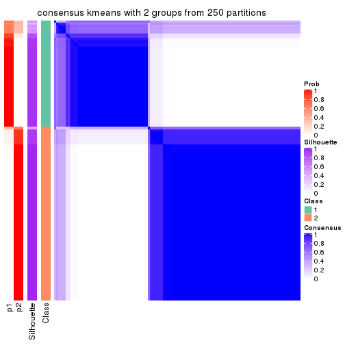</p>

</div>
<div id='tab-CV-kmeans-consensus-heatmap-2'>
<pre><code class="r">consensus_heatmap(res, k = 3)
</code></pre>

<p>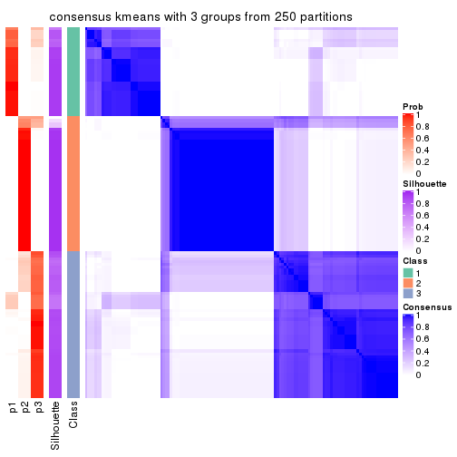</p>

</div>
<div id='tab-CV-kmeans-consensus-heatmap-3'>
<pre><code class="r">consensus_heatmap(res, k = 4)
</code></pre>

<p>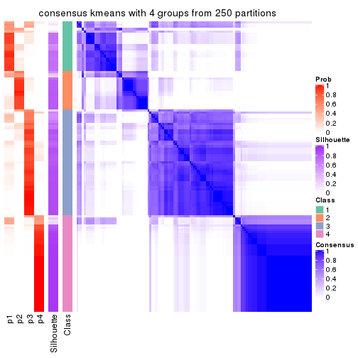</p>

</div>
<div id='tab-CV-kmeans-consensus-heatmap-4'>
<pre><code class="r">consensus_heatmap(res, k = 5)
</code></pre>

<p>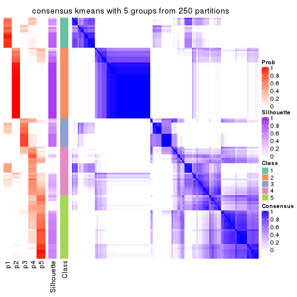</p>

</div>
<div id='tab-CV-kmeans-consensus-heatmap-5'>
<pre><code class="r">consensus_heatmap(res, k = 6)
</code></pre>

<p>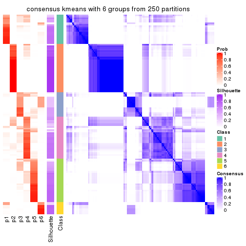</p>

</div>
</div>

Heatmaps for the membership of samples in all partitions to see how consistent they are:


<script>
$( function() {
	$( '#tabs-CV-kmeans-membership-heatmap' ).tabs();
} );
</script>
<div id='tabs-CV-kmeans-membership-heatmap'>
<ul>
<li><a href='#tab-CV-kmeans-membership-heatmap-1'>k = 2</a></li>
<li><a href='#tab-CV-kmeans-membership-heatmap-2'>k = 3</a></li>
<li><a href='#tab-CV-kmeans-membership-heatmap-3'>k = 4</a></li>
<li><a href='#tab-CV-kmeans-membership-heatmap-4'>k = 5</a></li>
<li><a href='#tab-CV-kmeans-membership-heatmap-5'>k = 6</a></li>
</ul>
<div id='tab-CV-kmeans-membership-heatmap-1'>
<pre><code class="r">membership_heatmap(res, k = 2)
</code></pre>

<p>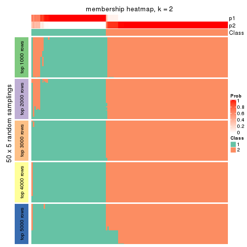</p>

</div>
<div id='tab-CV-kmeans-membership-heatmap-2'>
<pre><code class="r">membership_heatmap(res, k = 3)
</code></pre>

<p>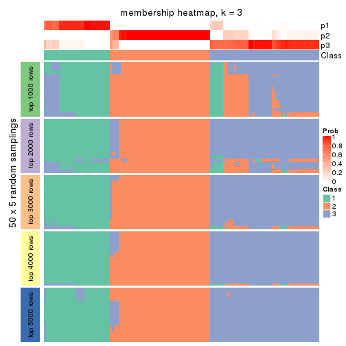</p>

</div>
<div id='tab-CV-kmeans-membership-heatmap-3'>
<pre><code class="r">membership_heatmap(res, k = 4)
</code></pre>

<p>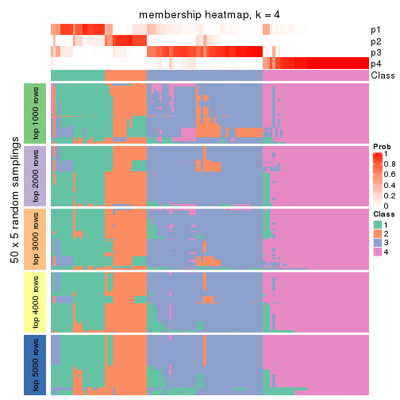</p>

</div>
<div id='tab-CV-kmeans-membership-heatmap-4'>
<pre><code class="r">membership_heatmap(res, k = 5)
</code></pre>

<p>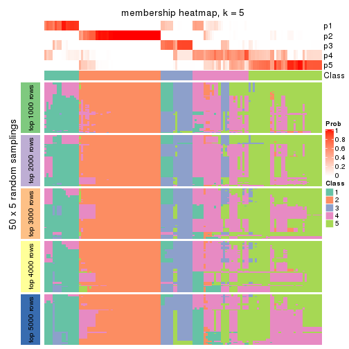</p>

</div>
<div id='tab-CV-kmeans-membership-heatmap-5'>
<pre><code class="r">membership_heatmap(res, k = 6)
</code></pre>

<p>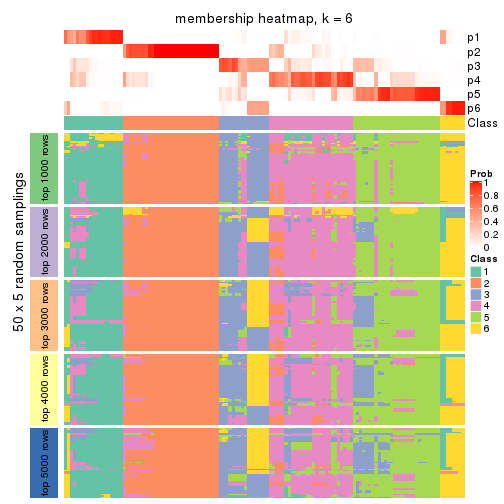</p>

</div>
</div>

As soon as we have had the classes for columns, we can look for signatures
which are significantly different between classes which can be candidate marks
for certain classes. Following are the heatmaps for signatures.


Signature heatmaps where rows are scaled:


<script>
$( function() {
	$( '#tabs-CV-kmeans-get-signatures' ).tabs();
} );
</script>
<div id='tabs-CV-kmeans-get-signatures'>
<ul>
<li><a href='#tab-CV-kmeans-get-signatures-1'>k = 2</a></li>
<li><a href='#tab-CV-kmeans-get-signatures-2'>k = 3</a></li>
<li><a href='#tab-CV-kmeans-get-signatures-3'>k = 4</a></li>
<li><a href='#tab-CV-kmeans-get-signatures-4'>k = 5</a></li>
<li><a href='#tab-CV-kmeans-get-signatures-5'>k = 6</a></li>
</ul>
<div id='tab-CV-kmeans-get-signatures-1'>
<pre><code class="r">get_signatures(res, k = 2)
</code></pre>

<p>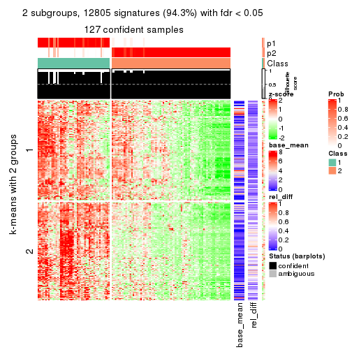</p>

</div>
<div id='tab-CV-kmeans-get-signatures-2'>
<pre><code class="r">get_signatures(res, k = 3)
</code></pre>

<p>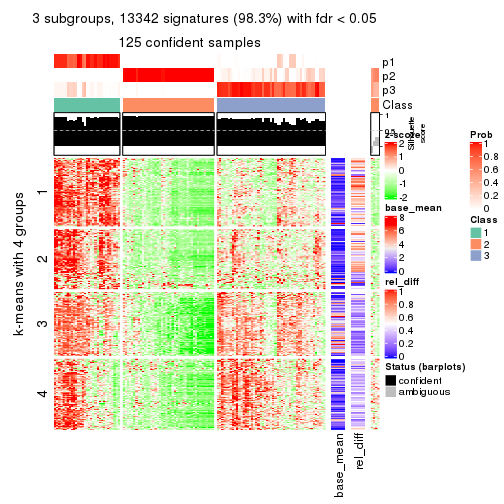</p>

</div>
<div id='tab-CV-kmeans-get-signatures-3'>
<pre><code class="r">get_signatures(res, k = 4)
</code></pre>

<p>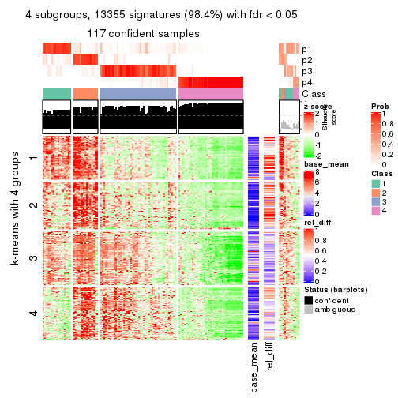</p>

</div>
<div id='tab-CV-kmeans-get-signatures-4'>
<pre><code class="r">get_signatures(res, k = 5)
</code></pre>

<p>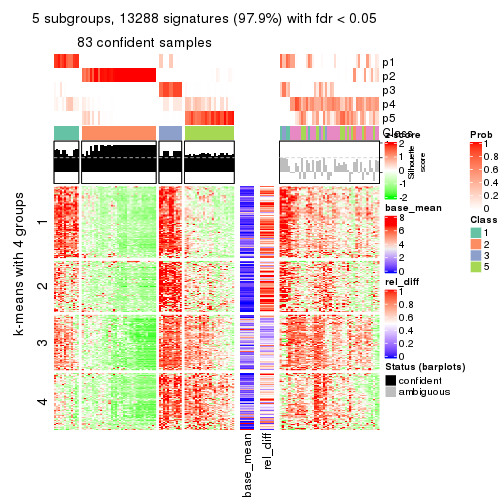</p>

</div>
<div id='tab-CV-kmeans-get-signatures-5'>
<pre><code class="r">get_signatures(res, k = 6)
</code></pre>

<p>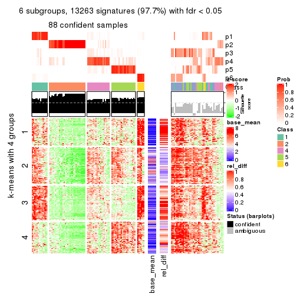</p>

</div>
</div>


Signature heatmaps where rows are not scaled:


<script>
$( function() {
	$( '#tabs-CV-kmeans-get-signatures-no-scale' ).tabs();
} );
</script>
<div id='tabs-CV-kmeans-get-signatures-no-scale'>
<ul>
<li><a href='#tab-CV-kmeans-get-signatures-no-scale-1'>k = 2</a></li>
<li><a href='#tab-CV-kmeans-get-signatures-no-scale-2'>k = 3</a></li>
<li><a href='#tab-CV-kmeans-get-signatures-no-scale-3'>k = 4</a></li>
<li><a href='#tab-CV-kmeans-get-signatures-no-scale-4'>k = 5</a></li>
<li><a href='#tab-CV-kmeans-get-signatures-no-scale-5'>k = 6</a></li>
</ul>
<div id='tab-CV-kmeans-get-signatures-no-scale-1'>
<pre><code class="r">get_signatures(res, k = 2, scale_rows = FALSE)
</code></pre>

<p>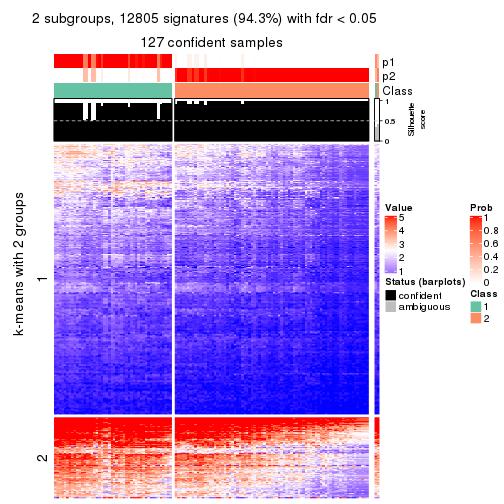</p>

</div>
<div id='tab-CV-kmeans-get-signatures-no-scale-2'>
<pre><code class="r">get_signatures(res, k = 3, scale_rows = FALSE)
</code></pre>

<p>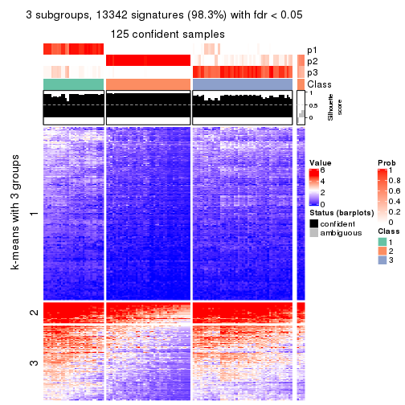</p>

</div>
<div id='tab-CV-kmeans-get-signatures-no-scale-3'>
<pre><code class="r">get_signatures(res, k = 4, scale_rows = FALSE)
</code></pre>

<p>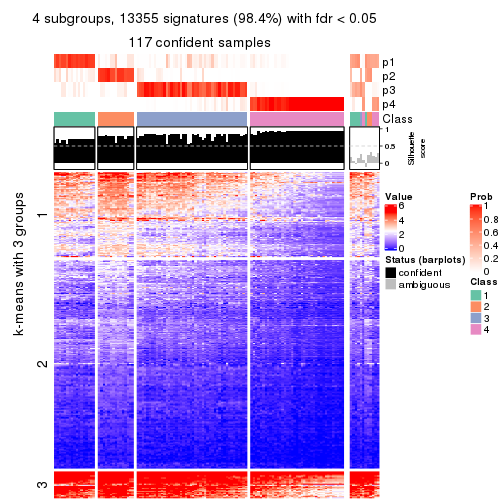</p>

</div>
<div id='tab-CV-kmeans-get-signatures-no-scale-4'>
<pre><code class="r">get_signatures(res, k = 5, scale_rows = FALSE)
</code></pre>

<p>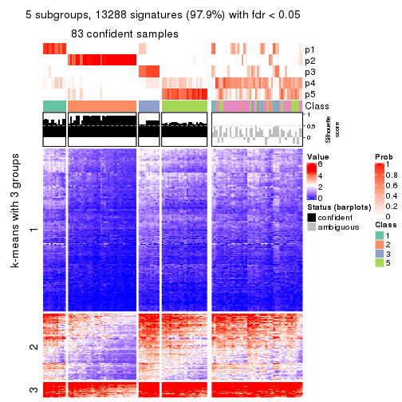</p>

</div>
<div id='tab-CV-kmeans-get-signatures-no-scale-5'>
<pre><code class="r">get_signatures(res, k = 6, scale_rows = FALSE)
</code></pre>

<p>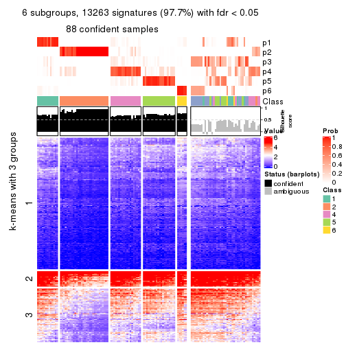</p>

</div>
</div>


Compare the overlap of signatures from different k:

```r
compare_signatures(res)
```

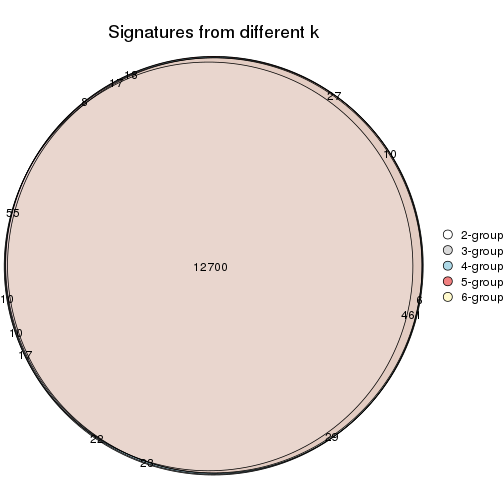

`get_signature()` returns a data frame invisibly. TO get the list of signatures, the function
call should be assigned to a variable explicitly. In following code, if `plot` argument is set
to `FALSE`, no heatmap is plotted while only the differential analysis is performed.

```r
# code only for demonstration
tb = get_signature(res, k = ..., plot = FALSE)
```

An example of the output of `tb` is:

```
#>   which_row         fdr    mean_1    mean_2 scaled_mean_1 scaled_mean_2 km
#> 1        38 0.042760348  8.373488  9.131774    -0.5533452     0.5164555  1
#> 2        40 0.018707592  7.106213  8.469186    -0.6173731     0.5762149  1
#> 3        55 0.019134737 10.221463 11.207825    -0.6159697     0.5749050  1
#> 4        59 0.006059896  5.921854  7.869574    -0.6899429     0.6439467  1
#> 5        60 0.018055526  8.928898 10.211722    -0.6204761     0.5791110  1
#> 6        98 0.009384629 15.714769 14.887706     0.6635654    -0.6193277  2
...
```

The columns in `tb` are:

1. `which_row`: row indices corresponding to the input matrix.
2. `fdr`: FDR for the differential test. 
3. `mean_x`: The mean value in group x.
4. `scaled_mean_x`: The mean value in group x after rows are scaled.
5. `km`: Row groups if k-means clustering is applied to rows.


UMAP plot which shows how samples are separated.


<script>
$( function() {
	$( '#tabs-CV-kmeans-dimension-reduction' ).tabs();
} );
</script>
<div id='tabs-CV-kmeans-dimension-reduction'>
<ul>
<li><a href='#tab-CV-kmeans-dimension-reduction-1'>k = 2</a></li>
<li><a href='#tab-CV-kmeans-dimension-reduction-2'>k = 3</a></li>
<li><a href='#tab-CV-kmeans-dimension-reduction-3'>k = 4</a></li>
<li><a href='#tab-CV-kmeans-dimension-reduction-4'>k = 5</a></li>
<li><a href='#tab-CV-kmeans-dimension-reduction-5'>k = 6</a></li>
</ul>
<div id='tab-CV-kmeans-dimension-reduction-1'>
<pre><code class="r">dimension_reduction(res, k = 2, method = &quot;UMAP&quot;)
</code></pre>

<p>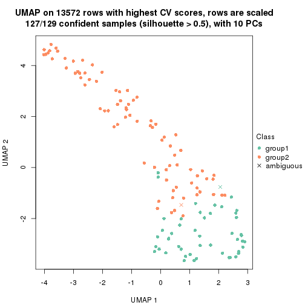</p>

</div>
<div id='tab-CV-kmeans-dimension-reduction-2'>
<pre><code class="r">dimension_reduction(res, k = 3, method = &quot;UMAP&quot;)
</code></pre>

<p>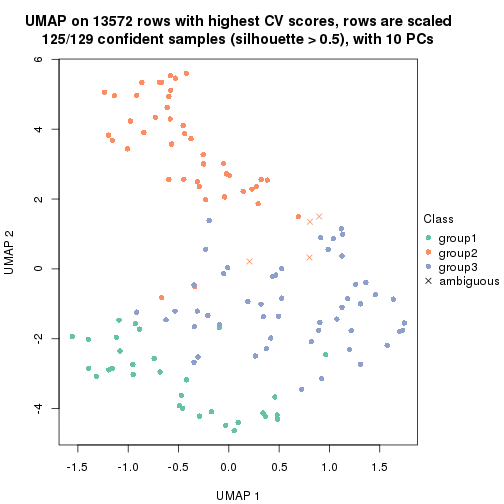</p>

</div>
<div id='tab-CV-kmeans-dimension-reduction-3'>
<pre><code class="r">dimension_reduction(res, k = 4, method = &quot;UMAP&quot;)
</code></pre>

<p>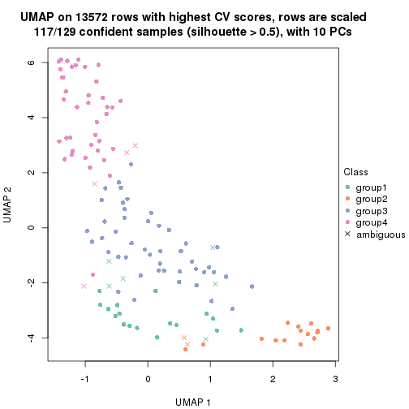</p>

</div>
<div id='tab-CV-kmeans-dimension-reduction-4'>
<pre><code class="r">dimension_reduction(res, k = 5, method = &quot;UMAP&quot;)
</code></pre>

<p>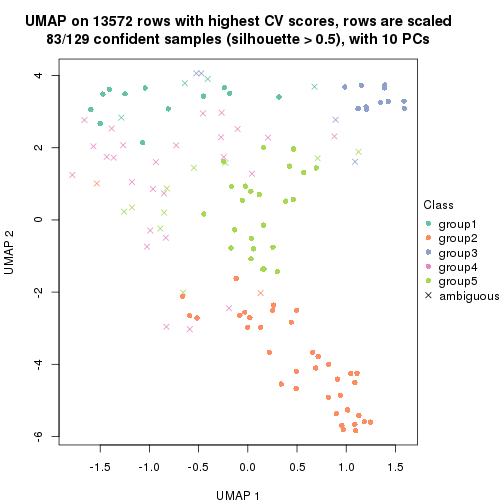</p>

</div>
<div id='tab-CV-kmeans-dimension-reduction-5'>
<pre><code class="r">dimension_reduction(res, k = 6, method = &quot;UMAP&quot;)
</code></pre>

<p>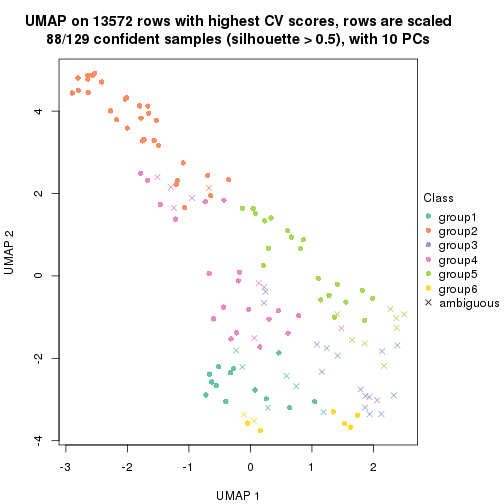</p>

</div>
</div>


Following heatmap shows how subgroups are split when increasing `k`:

```r
collect_classes(res)
```

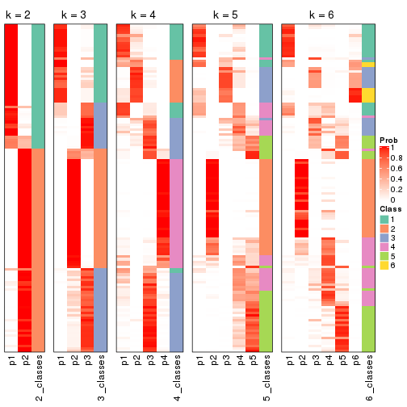


If matrix rows can be associated to genes, consider to use `GO_Enrichment(res,
...)` to perform function enrichment for the signature genes.


 

---------------------------------------------------


### CV:skmeans*


The object with results only for a single top-value method and a single partition method 
can be extracted as:

```r
res = res_list["CV", "skmeans"]
# you can also extract it by
# res = res_list["CV:skmeans"]
```

A summary of `res` and all the functions that can be applied to it:

```r
res
```

```
#> A 'ConsensusPartition' object with k = 2, 3, 4, 5, 6.
#>   On a matrix with 13572 rows and 129 columns.
#>   Top rows (1000, 2000, 3000, 4000, 5000) are extracted by 'CV' method.
#>   Subgroups are detected by 'skmeans' method.
#>   Performed in total 1250 partitions by row resampling.
#>   Best k for subgroups seems to be 3.
#> 
#> Following methods can be applied to this 'ConsensusPartition' object:
#>  [1] "cola_report"             "collect_classes"         "collect_plots"          
#>  [4] "collect_stats"           "colnames"                "compare_signatures"     
#>  [7] "consensus_heatmap"       "dimension_reduction"     "functional_enrichment"  
#> [10] "get_anno_col"            "get_anno"                "get_classes"            
#> [13] "get_consensus"           "get_matrix"              "get_membership"         
#> [16] "get_param"               "get_signatures"          "get_stats"              
#> [19] "is_best_k"               "is_stable_k"             "membership_heatmap"     
#> [22] "ncol"                    "nrow"                    "plot_ecdf"              
#> [25] "rownames"                "select_partition_number" "show"                   
#> [28] "suggest_best_k"          "test_to_known_factors"
```

`collect_plots()` function collects all the plots made from `res` for all `k` (number of partitions)
into one single page to provide an easy and fast comparison between different `k`.

```r
collect_plots(res)
```

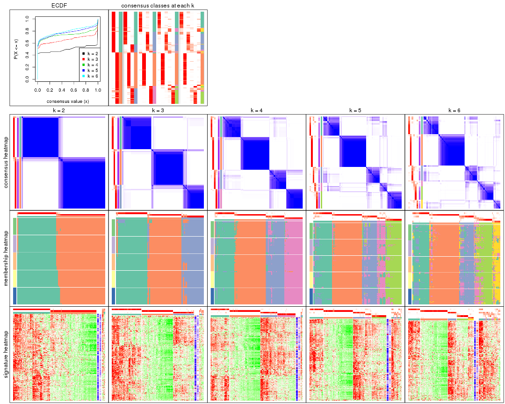

The plots are:

- The first row: a plot of the ECDF (Empirical cumulative distribution
  function) curves of the consensus matrix for each `k` and the heatmap of
  predicted classes for each `k`.
- The second row: heatmaps of the consensus matrix for each `k`.
- The third row: heatmaps of the membership matrix for each `k`.
- The fouth row: heatmaps of the signatures for each `k`.

All the plots in panels can be made by individual functions and they are
plotted later in this section.

`select_partition_number()` produces several plots showing different
statistics for choosing "optimized" `k`. There are following statistics:

- ECDF curves of the consensus matrix for each `k`;
- 1-PAC. [The PAC
  score](https://en.wikipedia.org/wiki/Consensus_clustering#Over-interpretation_potential_of_consensus_clustering)
  measures the proportion of the ambiguous subgrouping.
- Mean silhouette score.
- Concordance. The mean probability of fiting the consensus class ids in all
  partitions.
- Area increased. Denote $A_k$ as the area under the ECDF curve for current
  `k`, the area increased is defined as $A_k - A_{k-1}$.
- Rand index. The percent of pairs of samples that are both in a same cluster
  or both are not in a same cluster in the partition of k and k-1.
- Jaccard index. The ratio of pairs of samples are both in a same cluster in
  the partition of k and k-1 and the pairs of samples are both in a same
  cluster in the partition k or k-1.

The detailed explanations of these statistics can be found in [the cola
vignette](http://bioconductor.org/packages/devel/bioc/vignettes/cola/inst/doc/cola.html#toc_13).

Generally speaking, lower PAC score, higher mean silhouette score or higher
concordance corresponds to better partition. Rand index and Jaccard index
measure how similar the current partition is compared to partition with `k-1`.
If they are too similar, we won't accept `k` is better than `k-1`.

```r
select_partition_number(res)
```

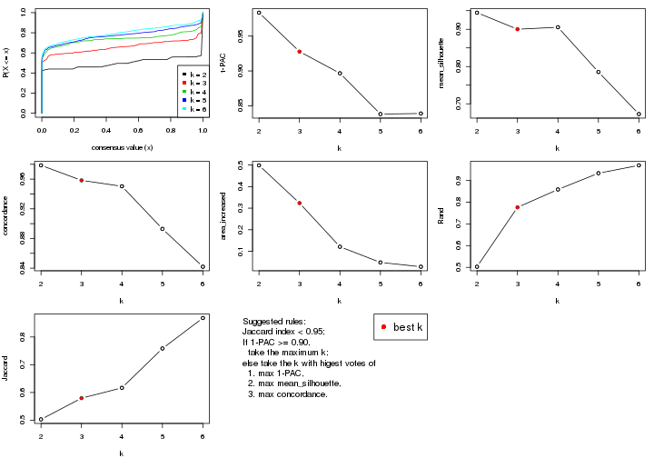

The numeric values for all these statistics can be obtained by `get_stats()`.

```r
get_stats(res)
```

```
#>   k 1-PAC mean_silhouette concordance area_increased  Rand Jaccard
#> 2 2 0.984           0.944       0.979         0.4984 0.503   0.503
#> 3 3 0.928           0.900       0.958         0.3235 0.776   0.579
#> 4 4 0.897           0.905       0.950         0.1211 0.858   0.617
#> 5 5 0.838           0.785       0.893         0.0483 0.933   0.759
#> 6 6 0.839           0.672       0.842         0.0284 0.969   0.868
```

`suggest_best_k()` suggests the best $k$ based on these statistics. The rules are as follows:

- All $k$ with Jaccard index larger than 0.95 are removed because the increase of
  the partition number does not provides enough extra information. If all $k$ are removed,
  the best $k$ is assigned by `NA`.
- For $k$ with 1-PAC larger than 0.9, the maximal $k$ is taken as the "best k". Other $k$ is called "optional k".
- If it does not fit the second rule. The $k$ with the highest vote of highest
  1-PAC, mean silhouette and concordance is taken as the "best k".

```r
suggest_best_k(res)
```

```
#> [1] 3
#> attr(,"optional")
#> [1] 2
```

There is also optional best $k$ = 2 that is worth to check.

Following shows the table of the partitions (You need to click the **show/hide
code output** link to see it). The membership matrix (columns with name `p*`)
is inferred by
[`clue::cl_consensus()`](https://www.rdocumentation.org/link/cl_consensus?package=clue)
function with the `SE` method. Basically the value in the membership matrix
represents the probability to belong to a certain group. The finall class
label for an item is determined with the group with highest probability it
belongs to.

In `get_classes()` function, the entropy is calculated from the membership
matrix and the silhouette score is calculated from the consensus matrix.


<script>
$( function() {
	$( '#tabs-CV-skmeans-get-classes' ).tabs();
} );
</script>
<div id='tabs-CV-skmeans-get-classes'>
<ul>
<li><a href='#tab-CV-skmeans-get-classes-1'>k = 2</a></li>
<li><a href='#tab-CV-skmeans-get-classes-2'>k = 3</a></li>
<li><a href='#tab-CV-skmeans-get-classes-3'>k = 4</a></li>
<li><a href='#tab-CV-skmeans-get-classes-4'>k = 5</a></li>
<li><a href='#tab-CV-skmeans-get-classes-5'>k = 6</a></li>
</ul>

<div id='tab-CV-skmeans-get-classes-1'>
<p><a id='tab-CV-skmeans-get-classes-1-a' style='color:#0366d6' href='#'>show/hide code output</a></p>
<pre><code class="r">cbind(get_classes(res, k = 2), get_membership(res, k = 2))
</code></pre>

<pre><code>#&gt;            class entropy silhouette    p1    p2
#&gt; SRR1656463     2   0.000      0.971 0.000 1.000
#&gt; SRR1656464     1   0.000      0.985 1.000 0.000
#&gt; SRR1656462     1   0.000      0.985 1.000 0.000
#&gt; SRR1656465     2   0.753      0.724 0.216 0.784
#&gt; SRR1656467     2   0.000      0.971 0.000 1.000
#&gt; SRR1656466     1   0.000      0.985 1.000 0.000
#&gt; SRR1656468     2   0.000      0.971 0.000 1.000
#&gt; SRR1656472     1   0.000      0.985 1.000 0.000
#&gt; SRR1656471     1   0.000      0.985 1.000 0.000
#&gt; SRR1656470     2   0.000      0.971 0.000 1.000
#&gt; SRR1656469     2   0.000      0.971 0.000 1.000
#&gt; SRR1656473     2   0.000      0.971 0.000 1.000
#&gt; SRR1656474     2   0.000      0.971 0.000 1.000
#&gt; SRR1656475     2   0.000      0.971 0.000 1.000
#&gt; SRR1656478     1   0.000      0.985 1.000 0.000
#&gt; SRR1656477     2   0.000      0.971 0.000 1.000
#&gt; SRR1656479     2   0.141      0.954 0.020 0.980
#&gt; SRR1656480     2   0.000      0.971 0.000 1.000
#&gt; SRR1656476     2   0.000      0.971 0.000 1.000
#&gt; SRR1656481     2   0.000      0.971 0.000 1.000
#&gt; SRR1656482     2   0.000      0.971 0.000 1.000
#&gt; SRR1656483     2   0.000      0.971 0.000 1.000
#&gt; SRR1656485     1   0.000      0.985 1.000 0.000
#&gt; SRR1656487     1   0.000      0.985 1.000 0.000
#&gt; SRR1656486     2   0.000      0.971 0.000 1.000
#&gt; SRR1656488     1   0.000      0.985 1.000 0.000
#&gt; SRR1656484     1   0.000      0.985 1.000 0.000
#&gt; SRR1656489     1   0.000      0.985 1.000 0.000
#&gt; SRR1656491     2   0.000      0.971 0.000 1.000
#&gt; SRR1656490     2   0.000      0.971 0.000 1.000
#&gt; SRR1656492     1   0.000      0.985 1.000 0.000
#&gt; SRR1656493     1   0.000      0.985 1.000 0.000
#&gt; SRR1656495     1   0.000      0.985 1.000 0.000
#&gt; SRR1656496     1   0.000      0.985 1.000 0.000
#&gt; SRR1656494     2   0.000      0.971 0.000 1.000
#&gt; SRR1656497     2   0.000      0.971 0.000 1.000
#&gt; SRR1656499     1   0.000      0.985 1.000 0.000
#&gt; SRR1656500     1   0.000      0.985 1.000 0.000
#&gt; SRR1656501     2   0.000      0.971 0.000 1.000
#&gt; SRR1656498     1   0.000      0.985 1.000 0.000
#&gt; SRR1656504     2   0.000      0.971 0.000 1.000
#&gt; SRR1656502     1   0.000      0.985 1.000 0.000
#&gt; SRR1656503     1   0.000      0.985 1.000 0.000
#&gt; SRR1656507     1   0.000      0.985 1.000 0.000
#&gt; SRR1656508     1   0.000      0.985 1.000 0.000
#&gt; SRR1656505     2   0.000      0.971 0.000 1.000
#&gt; SRR1656506     2   0.730      0.742 0.204 0.796
#&gt; SRR1656509     1   0.000      0.985 1.000 0.000
#&gt; SRR1656510     2   0.000      0.971 0.000 1.000
#&gt; SRR1656511     2   0.000      0.971 0.000 1.000
#&gt; SRR1656513     2   0.000      0.971 0.000 1.000
#&gt; SRR1656512     2   0.000      0.971 0.000 1.000
#&gt; SRR1656514     1   0.000      0.985 1.000 0.000
#&gt; SRR1656515     2   0.000      0.971 0.000 1.000
#&gt; SRR1656516     1   0.000      0.985 1.000 0.000
#&gt; SRR1656518     1   0.000      0.985 1.000 0.000
#&gt; SRR1656517     1   0.000      0.985 1.000 0.000
#&gt; SRR1656519     1   0.000      0.985 1.000 0.000
#&gt; SRR1656522     1   0.000      0.985 1.000 0.000
#&gt; SRR1656523     2   0.000      0.971 0.000 1.000
#&gt; SRR1656521     2   0.000      0.971 0.000 1.000
#&gt; SRR1656520     1   0.000      0.985 1.000 0.000
#&gt; SRR1656524     1   0.000      0.985 1.000 0.000
#&gt; SRR1656525     1   0.000      0.985 1.000 0.000
#&gt; SRR1656526     2   0.000      0.971 0.000 1.000
#&gt; SRR1656527     2   0.000      0.971 0.000 1.000
#&gt; SRR1656530     2   0.000      0.971 0.000 1.000
#&gt; SRR1656529     2   0.000      0.971 0.000 1.000
#&gt; SRR1656531     1   0.000      0.985 1.000 0.000
#&gt; SRR1656528     2   0.990      0.239 0.440 0.560
#&gt; SRR1656534     1   0.000      0.985 1.000 0.000
#&gt; SRR1656533     1   0.000      0.985 1.000 0.000
#&gt; SRR1656536     2   0.000      0.971 0.000 1.000
#&gt; SRR1656532     2   0.000      0.971 0.000 1.000
#&gt; SRR1656537     1   0.000      0.985 1.000 0.000
#&gt; SRR1656538     1   0.000      0.985 1.000 0.000
#&gt; SRR1656535     2   0.000      0.971 0.000 1.000
#&gt; SRR1656539     2   0.995      0.172 0.460 0.540
#&gt; SRR1656544     1   0.000      0.985 1.000 0.000
#&gt; SRR1656542     1   0.000      0.985 1.000 0.000
#&gt; SRR1656543     1   0.000      0.985 1.000 0.000
#&gt; SRR1656545     2   0.000      0.971 0.000 1.000
#&gt; SRR1656540     1   0.000      0.985 1.000 0.000
#&gt; SRR1656546     2   0.000      0.971 0.000 1.000
#&gt; SRR1656541     2   0.000      0.971 0.000 1.000
#&gt; SRR1656547     2   0.000      0.971 0.000 1.000
#&gt; SRR1656548     2   0.722      0.747 0.200 0.800
#&gt; SRR1656549     2   0.000      0.971 0.000 1.000
#&gt; SRR1656551     2   0.000      0.971 0.000 1.000
#&gt; SRR1656553     1   0.000      0.985 1.000 0.000
#&gt; SRR1656550     2   0.000      0.971 0.000 1.000
#&gt; SRR1656552     2   0.000      0.971 0.000 1.000
#&gt; SRR1656554     2   0.000      0.971 0.000 1.000
#&gt; SRR1656555     2   0.000      0.971 0.000 1.000
#&gt; SRR1656556     1   0.000      0.985 1.000 0.000
#&gt; SRR1656557     1   0.000      0.985 1.000 0.000
#&gt; SRR1656558     1   0.000      0.985 1.000 0.000
#&gt; SRR1656559     1   0.000      0.985 1.000 0.000
#&gt; SRR1656560     2   0.969      0.362 0.396 0.604
#&gt; SRR1656561     2   0.000      0.971 0.000 1.000
#&gt; SRR1656562     2   0.000      0.971 0.000 1.000
#&gt; SRR1656563     1   0.000      0.985 1.000 0.000
#&gt; SRR1656564     2   0.000      0.971 0.000 1.000
#&gt; SRR1656565     2   0.000      0.971 0.000 1.000
#&gt; SRR1656566     1   0.000      0.985 1.000 0.000
#&gt; SRR1656568     2   0.000      0.971 0.000 1.000
#&gt; SRR1656567     2   0.000      0.971 0.000 1.000
#&gt; SRR1656569     2   0.000      0.971 0.000 1.000
#&gt; SRR1656570     1   0.000      0.985 1.000 0.000
#&gt; SRR1656571     2   0.000      0.971 0.000 1.000
#&gt; SRR1656573     2   0.000      0.971 0.000 1.000
#&gt; SRR1656572     2   0.000      0.971 0.000 1.000
#&gt; SRR1656574     1   0.000      0.985 1.000 0.000
#&gt; SRR1656575     1   0.981      0.240 0.580 0.420
#&gt; SRR1656576     2   0.000      0.971 0.000 1.000
#&gt; SRR1656578     2   0.204      0.942 0.032 0.968
#&gt; SRR1656577     1   0.000      0.985 1.000 0.000
#&gt; SRR1656579     2   0.000      0.971 0.000 1.000
#&gt; SRR1656580     1   0.000      0.985 1.000 0.000
#&gt; SRR1656581     2   0.000      0.971 0.000 1.000
#&gt; SRR1656582     2   0.000      0.971 0.000 1.000
#&gt; SRR1656585     2   0.000      0.971 0.000 1.000
#&gt; SRR1656584     1   0.000      0.985 1.000 0.000
#&gt; SRR1656583     1   0.000      0.985 1.000 0.000
#&gt; SRR1656586     2   0.000      0.971 0.000 1.000
#&gt; SRR1656587     1   0.955      0.368 0.624 0.376
#&gt; SRR1656588     2   0.000      0.971 0.000 1.000
#&gt; SRR1656589     2   0.000      0.971 0.000 1.000
#&gt; SRR1656590     1   0.000      0.985 1.000 0.000
</code></pre>

<script>
$('#tab-CV-skmeans-get-classes-1-a').parent().next().next().hide();
$('#tab-CV-skmeans-get-classes-1-a').click(function(){
  $('#tab-CV-skmeans-get-classes-1-a').parent().next().next().toggle();
  return(false);
});
</script>
</div>

<div id='tab-CV-skmeans-get-classes-2'>
<p><a id='tab-CV-skmeans-get-classes-2-a' style='color:#0366d6' href='#'>show/hide code output</a></p>
<pre><code class="r">cbind(get_classes(res, k = 3), get_membership(res, k = 3))
</code></pre>

<pre><code>#&gt;            class entropy silhouette    p1    p2    p3
#&gt; SRR1656463     2  0.0000      0.965 0.000 1.000 0.000
#&gt; SRR1656464     1  0.0000      0.965 1.000 0.000 0.000
#&gt; SRR1656462     1  0.1529      0.945 0.960 0.000 0.040
#&gt; SRR1656465     3  0.0000      0.921 0.000 0.000 1.000
#&gt; SRR1656467     2  0.0000      0.965 0.000 1.000 0.000
#&gt; SRR1656466     3  0.0000      0.921 0.000 0.000 1.000
#&gt; SRR1656468     2  0.6126      0.253 0.000 0.600 0.400
#&gt; SRR1656472     1  0.0000      0.965 1.000 0.000 0.000
#&gt; SRR1656471     3  0.0000      0.921 0.000 0.000 1.000
#&gt; SRR1656470     2  0.0000      0.965 0.000 1.000 0.000
#&gt; SRR1656469     3  0.6267      0.246 0.000 0.452 0.548
#&gt; SRR1656473     2  0.0000      0.965 0.000 1.000 0.000
#&gt; SRR1656474     2  0.0000      0.965 0.000 1.000 0.000
#&gt; SRR1656475     2  0.0000      0.965 0.000 1.000 0.000
#&gt; SRR1656478     1  0.0000      0.965 1.000 0.000 0.000
#&gt; SRR1656477     3  0.0000      0.921 0.000 0.000 1.000
#&gt; SRR1656479     2  0.5098      0.655 0.248 0.752 0.000
#&gt; SRR1656480     3  0.5591      0.593 0.000 0.304 0.696
#&gt; SRR1656476     2  0.0000      0.965 0.000 1.000 0.000
#&gt; SRR1656481     3  0.0000      0.921 0.000 0.000 1.000
#&gt; SRR1656482     2  0.0000      0.965 0.000 1.000 0.000
#&gt; SRR1656483     2  0.0000      0.965 0.000 1.000 0.000
#&gt; SRR1656485     3  0.0000      0.921 0.000 0.000 1.000
#&gt; SRR1656487     3  0.0000      0.921 0.000 0.000 1.000
#&gt; SRR1656486     2  0.0000      0.965 0.000 1.000 0.000
#&gt; SRR1656488     3  0.0000      0.921 0.000 0.000 1.000
#&gt; SRR1656484     1  0.0000      0.965 1.000 0.000 0.000
#&gt; SRR1656489     1  0.0000      0.965 1.000 0.000 0.000
#&gt; SRR1656491     2  0.5706      0.487 0.000 0.680 0.320
#&gt; SRR1656490     2  0.0000      0.965 0.000 1.000 0.000
#&gt; SRR1656492     3  0.2625      0.848 0.084 0.000 0.916
#&gt; SRR1656493     1  0.0000      0.965 1.000 0.000 0.000
#&gt; SRR1656495     1  0.0000      0.965 1.000 0.000 0.000
#&gt; SRR1656496     3  0.4452      0.737 0.192 0.000 0.808
#&gt; SRR1656494     2  0.0000      0.965 0.000 1.000 0.000
#&gt; SRR1656497     2  0.0000      0.965 0.000 1.000 0.000
#&gt; SRR1656499     3  0.0000      0.921 0.000 0.000 1.000
#&gt; SRR1656500     1  0.1529      0.945 0.960 0.000 0.040
#&gt; SRR1656501     2  0.0000      0.965 0.000 1.000 0.000
#&gt; SRR1656498     1  0.0000      0.965 1.000 0.000 0.000
#&gt; SRR1656504     2  0.0000      0.965 0.000 1.000 0.000
#&gt; SRR1656502     1  0.0000      0.965 1.000 0.000 0.000
#&gt; SRR1656503     1  0.0000      0.965 1.000 0.000 0.000
#&gt; SRR1656507     1  0.0000      0.965 1.000 0.000 0.000
#&gt; SRR1656508     1  0.0000      0.965 1.000 0.000 0.000
#&gt; SRR1656505     2  0.6180      0.200 0.000 0.584 0.416
#&gt; SRR1656506     3  0.0000      0.921 0.000 0.000 1.000
#&gt; SRR1656509     1  0.2711      0.904 0.912 0.000 0.088
#&gt; SRR1656510     2  0.0000      0.965 0.000 1.000 0.000
#&gt; SRR1656511     2  0.0000      0.965 0.000 1.000 0.000
#&gt; SRR1656513     2  0.0000      0.965 0.000 1.000 0.000
#&gt; SRR1656512     2  0.0000      0.965 0.000 1.000 0.000
#&gt; SRR1656514     1  0.0000      0.965 1.000 0.000 0.000
#&gt; SRR1656515     2  0.0000      0.965 0.000 1.000 0.000
#&gt; SRR1656516     1  0.1860      0.932 0.948 0.000 0.052
#&gt; SRR1656518     1  0.0000      0.965 1.000 0.000 0.000
#&gt; SRR1656517     1  0.0000      0.965 1.000 0.000 0.000
#&gt; SRR1656519     1  0.0000      0.965 1.000 0.000 0.000
#&gt; SRR1656522     1  0.0000      0.965 1.000 0.000 0.000
#&gt; SRR1656523     2  0.0000      0.965 0.000 1.000 0.000
#&gt; SRR1656521     2  0.0000      0.965 0.000 1.000 0.000
#&gt; SRR1656520     1  0.1529      0.945 0.960 0.000 0.040
#&gt; SRR1656524     1  0.0000      0.965 1.000 0.000 0.000
#&gt; SRR1656525     3  0.0000      0.921 0.000 0.000 1.000
#&gt; SRR1656526     2  0.0000      0.965 0.000 1.000 0.000
#&gt; SRR1656527     2  0.0000      0.965 0.000 1.000 0.000
#&gt; SRR1656530     3  0.0237      0.919 0.000 0.004 0.996
#&gt; SRR1656529     3  0.0000      0.921 0.000 0.000 1.000
#&gt; SRR1656531     1  0.0000      0.965 1.000 0.000 0.000
#&gt; SRR1656528     3  0.0000      0.921 0.000 0.000 1.000
#&gt; SRR1656534     1  0.0000      0.965 1.000 0.000 0.000
#&gt; SRR1656533     1  0.0000      0.965 1.000 0.000 0.000
#&gt; SRR1656536     3  0.0000      0.921 0.000 0.000 1.000
#&gt; SRR1656532     2  0.1529      0.926 0.040 0.960 0.000
#&gt; SRR1656537     1  0.0000      0.965 1.000 0.000 0.000
#&gt; SRR1656538     1  0.3551      0.856 0.868 0.000 0.132
#&gt; SRR1656535     2  0.0000      0.965 0.000 1.000 0.000
#&gt; SRR1656539     3  0.0000      0.921 0.000 0.000 1.000
#&gt; SRR1656544     3  0.0000      0.921 0.000 0.000 1.000
#&gt; SRR1656542     1  0.0000      0.965 1.000 0.000 0.000
#&gt; SRR1656543     1  0.1529      0.945 0.960 0.000 0.040
#&gt; SRR1656545     2  0.0000      0.965 0.000 1.000 0.000
#&gt; SRR1656540     1  0.1964      0.934 0.944 0.000 0.056
#&gt; SRR1656546     2  0.0000      0.965 0.000 1.000 0.000
#&gt; SRR1656541     2  0.0000      0.965 0.000 1.000 0.000
#&gt; SRR1656547     2  0.0000      0.965 0.000 1.000 0.000
#&gt; SRR1656548     3  0.0000      0.921 0.000 0.000 1.000
#&gt; SRR1656549     2  0.1163      0.939 0.028 0.972 0.000
#&gt; SRR1656551     3  0.5859      0.518 0.000 0.344 0.656
#&gt; SRR1656553     1  0.1529      0.945 0.960 0.000 0.040
#&gt; SRR1656550     3  0.0000      0.921 0.000 0.000 1.000
#&gt; SRR1656552     2  0.0000      0.965 0.000 1.000 0.000
#&gt; SRR1656554     3  0.0000      0.921 0.000 0.000 1.000
#&gt; SRR1656555     2  0.0000      0.965 0.000 1.000 0.000
#&gt; SRR1656556     3  0.0000      0.921 0.000 0.000 1.000
#&gt; SRR1656557     1  0.1529      0.945 0.960 0.000 0.040
#&gt; SRR1656558     1  0.0000      0.965 1.000 0.000 0.000
#&gt; SRR1656559     1  0.0000      0.965 1.000 0.000 0.000
#&gt; SRR1656560     3  0.0000      0.921 0.000 0.000 1.000
#&gt; SRR1656561     3  0.1163      0.906 0.000 0.028 0.972
#&gt; SRR1656562     2  0.0000      0.965 0.000 1.000 0.000
#&gt; SRR1656563     1  0.0000      0.965 1.000 0.000 0.000
#&gt; SRR1656564     2  0.0000      0.965 0.000 1.000 0.000
#&gt; SRR1656565     2  0.0000      0.965 0.000 1.000 0.000
#&gt; SRR1656566     1  0.0000      0.965 1.000 0.000 0.000
#&gt; SRR1656568     2  0.0000      0.965 0.000 1.000 0.000
#&gt; SRR1656567     3  0.6305      0.141 0.000 0.484 0.516
#&gt; SRR1656569     3  0.0892      0.910 0.000 0.020 0.980
#&gt; SRR1656570     1  0.0000      0.965 1.000 0.000 0.000
#&gt; SRR1656571     2  0.0000      0.965 0.000 1.000 0.000
#&gt; SRR1656573     3  0.5291      0.659 0.000 0.268 0.732
#&gt; SRR1656572     2  0.0000      0.965 0.000 1.000 0.000
#&gt; SRR1656574     1  0.0000      0.965 1.000 0.000 0.000
#&gt; SRR1656575     1  0.6180      0.310 0.584 0.416 0.000
#&gt; SRR1656576     2  0.0000      0.965 0.000 1.000 0.000
#&gt; SRR1656578     2  0.1529      0.926 0.040 0.960 0.000
#&gt; SRR1656577     1  0.0000      0.965 1.000 0.000 0.000
#&gt; SRR1656579     2  0.0000      0.965 0.000 1.000 0.000
#&gt; SRR1656580     1  0.1529      0.945 0.960 0.000 0.040
#&gt; SRR1656581     2  0.0000      0.965 0.000 1.000 0.000
#&gt; SRR1656582     2  0.0000      0.965 0.000 1.000 0.000
#&gt; SRR1656585     3  0.1753      0.891 0.000 0.048 0.952
#&gt; SRR1656584     1  0.0000      0.965 1.000 0.000 0.000
#&gt; SRR1656583     1  0.1643      0.943 0.956 0.000 0.044
#&gt; SRR1656586     2  0.0000      0.965 0.000 1.000 0.000
#&gt; SRR1656587     1  0.6111      0.374 0.604 0.396 0.000
#&gt; SRR1656588     3  0.4452      0.755 0.000 0.192 0.808
#&gt; SRR1656589     2  0.0000      0.965 0.000 1.000 0.000
#&gt; SRR1656590     1  0.0000      0.965 1.000 0.000 0.000
</code></pre>

<script>
$('#tab-CV-skmeans-get-classes-2-a').parent().next().next().hide();
$('#tab-CV-skmeans-get-classes-2-a').click(function(){
  $('#tab-CV-skmeans-get-classes-2-a').parent().next().next().toggle();
  return(false);
});
</script>
</div>

<div id='tab-CV-skmeans-get-classes-3'>
<p><a id='tab-CV-skmeans-get-classes-3-a' style='color:#0366d6' href='#'>show/hide code output</a></p>
<pre><code class="r">cbind(get_classes(res, k = 4), get_membership(res, k = 4))
</code></pre>

<pre><code>#&gt;            class entropy silhouette    p1    p2    p3    p4
#&gt; SRR1656463     2  0.0000      0.980 0.000 1.000 0.000 0.000
#&gt; SRR1656464     3  0.2814      0.797 0.132 0.000 0.868 0.000
#&gt; SRR1656462     3  0.0000      0.895 0.000 0.000 1.000 0.000
#&gt; SRR1656465     4  0.0000      0.972 0.000 0.000 0.000 1.000
#&gt; SRR1656467     2  0.0000      0.980 0.000 1.000 0.000 0.000
#&gt; SRR1656466     3  0.4103      0.704 0.000 0.000 0.744 0.256
#&gt; SRR1656468     4  0.0469      0.966 0.000 0.012 0.000 0.988
#&gt; SRR1656472     1  0.4643      0.552 0.656 0.000 0.344 0.000
#&gt; SRR1656471     3  0.4830      0.464 0.000 0.000 0.608 0.392
#&gt; SRR1656470     2  0.0000      0.980 0.000 1.000 0.000 0.000
#&gt; SRR1656469     4  0.0336      0.969 0.000 0.008 0.000 0.992
#&gt; SRR1656473     2  0.0000      0.980 0.000 1.000 0.000 0.000
#&gt; SRR1656474     2  0.0000      0.980 0.000 1.000 0.000 0.000
#&gt; SRR1656475     2  0.0000      0.980 0.000 1.000 0.000 0.000
#&gt; SRR1656478     1  0.1716      0.910 0.936 0.000 0.064 0.000
#&gt; SRR1656477     4  0.0000      0.972 0.000 0.000 0.000 1.000
#&gt; SRR1656479     1  0.3975      0.650 0.760 0.240 0.000 0.000
#&gt; SRR1656480     4  0.0336      0.969 0.000 0.008 0.000 0.992
#&gt; SRR1656476     2  0.0000      0.980 0.000 1.000 0.000 0.000
#&gt; SRR1656481     4  0.0000      0.972 0.000 0.000 0.000 1.000
#&gt; SRR1656482     2  0.0000      0.980 0.000 1.000 0.000 0.000
#&gt; SRR1656483     2  0.0000      0.980 0.000 1.000 0.000 0.000
#&gt; SRR1656485     3  0.2814      0.835 0.000 0.000 0.868 0.132
#&gt; SRR1656487     4  0.1637      0.918 0.000 0.000 0.060 0.940
#&gt; SRR1656486     2  0.0000      0.980 0.000 1.000 0.000 0.000
#&gt; SRR1656488     3  0.4072      0.709 0.000 0.000 0.748 0.252
#&gt; SRR1656484     1  0.3266      0.794 0.832 0.000 0.168 0.000
#&gt; SRR1656489     1  0.1022      0.924 0.968 0.000 0.032 0.000
#&gt; SRR1656491     4  0.3266      0.770 0.000 0.168 0.000 0.832
#&gt; SRR1656490     2  0.0000      0.980 0.000 1.000 0.000 0.000
#&gt; SRR1656492     3  0.6822      0.316 0.104 0.000 0.512 0.384
#&gt; SRR1656493     1  0.1022      0.924 0.968 0.000 0.032 0.000
#&gt; SRR1656495     1  0.0921      0.923 0.972 0.000 0.028 0.000
#&gt; SRR1656496     4  0.3764      0.733 0.216 0.000 0.000 0.784
#&gt; SRR1656494     2  0.0188      0.977 0.000 0.996 0.004 0.000
#&gt; SRR1656497     2  0.0000      0.980 0.000 1.000 0.000 0.000
#&gt; SRR1656499     3  0.1118      0.885 0.000 0.000 0.964 0.036
#&gt; SRR1656500     3  0.0000      0.895 0.000 0.000 1.000 0.000
#&gt; SRR1656501     2  0.3024      0.833 0.148 0.852 0.000 0.000
#&gt; SRR1656498     1  0.1022      0.924 0.968 0.000 0.032 0.000
#&gt; SRR1656504     2  0.0000      0.980 0.000 1.000 0.000 0.000
#&gt; SRR1656502     1  0.4522      0.599 0.680 0.000 0.320 0.000
#&gt; SRR1656503     1  0.1637      0.899 0.940 0.000 0.060 0.000
#&gt; SRR1656507     1  0.1211      0.922 0.960 0.000 0.040 0.000
#&gt; SRR1656508     1  0.1022      0.924 0.968 0.000 0.032 0.000
#&gt; SRR1656505     4  0.0469      0.966 0.000 0.012 0.000 0.988
#&gt; SRR1656506     4  0.0000      0.972 0.000 0.000 0.000 1.000
#&gt; SRR1656509     3  0.0000      0.895 0.000 0.000 1.000 0.000
#&gt; SRR1656510     2  0.0000      0.980 0.000 1.000 0.000 0.000
#&gt; SRR1656511     2  0.0000      0.980 0.000 1.000 0.000 0.000
#&gt; SRR1656513     2  0.0000      0.980 0.000 1.000 0.000 0.000
#&gt; SRR1656512     2  0.0000      0.980 0.000 1.000 0.000 0.000
#&gt; SRR1656514     3  0.1557      0.866 0.056 0.000 0.944 0.000
#&gt; SRR1656515     2  0.0000      0.980 0.000 1.000 0.000 0.000
#&gt; SRR1656516     1  0.0804      0.907 0.980 0.000 0.012 0.008
#&gt; SRR1656518     1  0.0000      0.913 1.000 0.000 0.000 0.000
#&gt; SRR1656517     1  0.1022      0.924 0.968 0.000 0.032 0.000
#&gt; SRR1656519     3  0.0336      0.892 0.008 0.000 0.992 0.000
#&gt; SRR1656522     3  0.2973      0.782 0.144 0.000 0.856 0.000
#&gt; SRR1656523     2  0.0188      0.977 0.004 0.996 0.000 0.000
#&gt; SRR1656521     2  0.0000      0.980 0.000 1.000 0.000 0.000
#&gt; SRR1656520     3  0.0000      0.895 0.000 0.000 1.000 0.000
#&gt; SRR1656524     1  0.0817      0.923 0.976 0.000 0.024 0.000
#&gt; SRR1656525     3  0.3335      0.829 0.016 0.000 0.856 0.128
#&gt; SRR1656526     2  0.0000      0.980 0.000 1.000 0.000 0.000
#&gt; SRR1656527     2  0.0000      0.980 0.000 1.000 0.000 0.000
#&gt; SRR1656530     4  0.0000      0.972 0.000 0.000 0.000 1.000
#&gt; SRR1656529     4  0.0000      0.972 0.000 0.000 0.000 1.000
#&gt; SRR1656531     1  0.1118      0.923 0.964 0.000 0.036 0.000
#&gt; SRR1656528     4  0.0000      0.972 0.000 0.000 0.000 1.000
#&gt; SRR1656534     3  0.0921      0.883 0.028 0.000 0.972 0.000
#&gt; SRR1656533     1  0.0817      0.923 0.976 0.000 0.024 0.000
#&gt; SRR1656536     4  0.0000      0.972 0.000 0.000 0.000 1.000
#&gt; SRR1656532     2  0.4406      0.576 0.300 0.700 0.000 0.000
#&gt; SRR1656537     1  0.1118      0.923 0.964 0.000 0.036 0.000
#&gt; SRR1656538     3  0.3485      0.833 0.116 0.000 0.856 0.028
#&gt; SRR1656535     2  0.0000      0.980 0.000 1.000 0.000 0.000
#&gt; SRR1656539     4  0.0000      0.972 0.000 0.000 0.000 1.000
#&gt; SRR1656544     3  0.3311      0.800 0.000 0.000 0.828 0.172
#&gt; SRR1656542     3  0.0188      0.894 0.004 0.000 0.996 0.000
#&gt; SRR1656543     3  0.0000      0.895 0.000 0.000 1.000 0.000
#&gt; SRR1656545     2  0.0000      0.980 0.000 1.000 0.000 0.000
#&gt; SRR1656540     3  0.0000      0.895 0.000 0.000 1.000 0.000
#&gt; SRR1656546     2  0.0000      0.980 0.000 1.000 0.000 0.000
#&gt; SRR1656541     2  0.0000      0.980 0.000 1.000 0.000 0.000
#&gt; SRR1656547     2  0.0000      0.980 0.000 1.000 0.000 0.000
#&gt; SRR1656548     4  0.0817      0.958 0.024 0.000 0.000 0.976
#&gt; SRR1656549     2  0.3528      0.774 0.192 0.808 0.000 0.000
#&gt; SRR1656551     4  0.0336      0.969 0.000 0.008 0.000 0.992
#&gt; SRR1656553     3  0.0000      0.895 0.000 0.000 1.000 0.000
#&gt; SRR1656550     4  0.0000      0.972 0.000 0.000 0.000 1.000
#&gt; SRR1656552     2  0.0000      0.980 0.000 1.000 0.000 0.000
#&gt; SRR1656554     4  0.0000      0.972 0.000 0.000 0.000 1.000
#&gt; SRR1656555     2  0.0000      0.980 0.000 1.000 0.000 0.000
#&gt; SRR1656556     3  0.0921      0.887 0.000 0.000 0.972 0.028
#&gt; SRR1656557     3  0.0000      0.895 0.000 0.000 1.000 0.000
#&gt; SRR1656558     1  0.0921      0.923 0.972 0.000 0.028 0.000
#&gt; SRR1656559     3  0.2814      0.797 0.132 0.000 0.868 0.000
#&gt; SRR1656560     4  0.0000      0.972 0.000 0.000 0.000 1.000
#&gt; SRR1656561     4  0.0921      0.955 0.028 0.000 0.000 0.972
#&gt; SRR1656562     2  0.0000      0.980 0.000 1.000 0.000 0.000
#&gt; SRR1656563     1  0.0000      0.913 1.000 0.000 0.000 0.000
#&gt; SRR1656564     2  0.0000      0.980 0.000 1.000 0.000 0.000
#&gt; SRR1656565     2  0.0000      0.980 0.000 1.000 0.000 0.000
#&gt; SRR1656566     1  0.0817      0.923 0.976 0.000 0.024 0.000
#&gt; SRR1656568     2  0.0000      0.980 0.000 1.000 0.000 0.000
#&gt; SRR1656567     4  0.0336      0.969 0.000 0.008 0.000 0.992
#&gt; SRR1656569     4  0.0000      0.972 0.000 0.000 0.000 1.000
#&gt; SRR1656570     1  0.0000      0.913 1.000 0.000 0.000 0.000
#&gt; SRR1656571     2  0.0000      0.980 0.000 1.000 0.000 0.000
#&gt; SRR1656573     4  0.1474      0.924 0.000 0.052 0.000 0.948
#&gt; SRR1656572     2  0.0000      0.980 0.000 1.000 0.000 0.000
#&gt; SRR1656574     1  0.1867      0.903 0.928 0.000 0.072 0.000
#&gt; SRR1656575     1  0.1302      0.883 0.956 0.044 0.000 0.000
#&gt; SRR1656576     2  0.0000      0.980 0.000 1.000 0.000 0.000
#&gt; SRR1656578     2  0.3400      0.780 0.180 0.820 0.000 0.000
#&gt; SRR1656577     1  0.2011      0.898 0.920 0.000 0.080 0.000
#&gt; SRR1656579     2  0.0000      0.980 0.000 1.000 0.000 0.000
#&gt; SRR1656580     3  0.1022      0.887 0.032 0.000 0.968 0.000
#&gt; SRR1656581     2  0.1118      0.951 0.036 0.964 0.000 0.000
#&gt; SRR1656582     2  0.0000      0.980 0.000 1.000 0.000 0.000
#&gt; SRR1656585     4  0.0000      0.972 0.000 0.000 0.000 1.000
#&gt; SRR1656584     1  0.0000      0.913 1.000 0.000 0.000 0.000
#&gt; SRR1656583     3  0.0000      0.895 0.000 0.000 1.000 0.000
#&gt; SRR1656586     2  0.0000      0.980 0.000 1.000 0.000 0.000
#&gt; SRR1656587     1  0.7429      0.359 0.492 0.316 0.192 0.000
#&gt; SRR1656588     4  0.0188      0.971 0.000 0.004 0.000 0.996
#&gt; SRR1656589     2  0.0000      0.980 0.000 1.000 0.000 0.000
#&gt; SRR1656590     1  0.1022      0.924 0.968 0.000 0.032 0.000
</code></pre>

<script>
$('#tab-CV-skmeans-get-classes-3-a').parent().next().next().hide();
$('#tab-CV-skmeans-get-classes-3-a').click(function(){
  $('#tab-CV-skmeans-get-classes-3-a').parent().next().next().toggle();
  return(false);
});
</script>
</div>

<div id='tab-CV-skmeans-get-classes-4'>
<p><a id='tab-CV-skmeans-get-classes-4-a' style='color:#0366d6' href='#'>show/hide code output</a></p>
<pre><code class="r">cbind(get_classes(res, k = 5), get_membership(res, k = 5))
</code></pre>

<pre><code>#&gt;            class entropy silhouette    p1    p2    p3    p4    p5
#&gt; SRR1656463     2  0.0000     0.9749 0.000 1.000 0.000 0.000 0.000
#&gt; SRR1656464     1  0.4150     0.4761 0.612 0.000 0.388 0.000 0.000
#&gt; SRR1656462     3  0.0880     0.8231 0.032 0.000 0.968 0.000 0.000
#&gt; SRR1656465     5  0.3165     0.8309 0.000 0.000 0.036 0.116 0.848
#&gt; SRR1656467     2  0.0000     0.9749 0.000 1.000 0.000 0.000 0.000
#&gt; SRR1656466     3  0.4637     0.6644 0.000 0.000 0.744 0.128 0.128
#&gt; SRR1656468     5  0.0290     0.8933 0.000 0.008 0.000 0.000 0.992
#&gt; SRR1656472     1  0.3796     0.6125 0.700 0.000 0.300 0.000 0.000
#&gt; SRR1656471     3  0.5772     0.3865 0.000 0.000 0.564 0.108 0.328
#&gt; SRR1656470     2  0.0000     0.9749 0.000 1.000 0.000 0.000 0.000
#&gt; SRR1656469     5  0.0162     0.8953 0.000 0.004 0.000 0.000 0.996
#&gt; SRR1656473     2  0.0000     0.9749 0.000 1.000 0.000 0.000 0.000
#&gt; SRR1656474     2  0.0000     0.9749 0.000 1.000 0.000 0.000 0.000
#&gt; SRR1656475     2  0.0000     0.9749 0.000 1.000 0.000 0.000 0.000
#&gt; SRR1656478     1  0.0290     0.7954 0.992 0.000 0.008 0.000 0.000
#&gt; SRR1656477     5  0.0162     0.8948 0.000 0.000 0.004 0.000 0.996
#&gt; SRR1656479     4  0.3111     0.7320 0.144 0.012 0.000 0.840 0.004
#&gt; SRR1656480     5  0.0162     0.8953 0.000 0.004 0.000 0.000 0.996
#&gt; SRR1656476     2  0.0000     0.9749 0.000 1.000 0.000 0.000 0.000
#&gt; SRR1656481     5  0.1117     0.8873 0.000 0.000 0.016 0.020 0.964
#&gt; SRR1656482     2  0.0000     0.9749 0.000 1.000 0.000 0.000 0.000
#&gt; SRR1656483     2  0.0000     0.9749 0.000 1.000 0.000 0.000 0.000
#&gt; SRR1656485     3  0.3427     0.7423 0.000 0.000 0.836 0.108 0.056
#&gt; SRR1656487     5  0.5905     0.4735 0.000 0.000 0.276 0.144 0.580
#&gt; SRR1656486     2  0.1197     0.9329 0.000 0.952 0.000 0.048 0.000
#&gt; SRR1656488     3  0.4717     0.6562 0.000 0.000 0.736 0.144 0.120
#&gt; SRR1656484     1  0.2915     0.7455 0.860 0.000 0.116 0.024 0.000
#&gt; SRR1656489     1  0.0000     0.7951 1.000 0.000 0.000 0.000 0.000
#&gt; SRR1656491     5  0.6465     0.1749 0.000 0.220 0.000 0.288 0.492
#&gt; SRR1656490     2  0.0290     0.9688 0.000 0.992 0.000 0.008 0.000
#&gt; SRR1656492     3  0.6146     0.4970 0.020 0.000 0.592 0.276 0.112
#&gt; SRR1656493     1  0.0000     0.7951 1.000 0.000 0.000 0.000 0.000
#&gt; SRR1656495     1  0.0404     0.7877 0.988 0.000 0.000 0.012 0.000
#&gt; SRR1656496     4  0.3948     0.5643 0.012 0.000 0.012 0.768 0.208
#&gt; SRR1656494     2  0.0960     0.9526 0.004 0.972 0.008 0.016 0.000
#&gt; SRR1656497     2  0.0000     0.9749 0.000 1.000 0.000 0.000 0.000
#&gt; SRR1656499     3  0.2179     0.7663 0.000 0.000 0.888 0.112 0.000
#&gt; SRR1656500     3  0.0880     0.8231 0.032 0.000 0.968 0.000 0.000
#&gt; SRR1656501     4  0.3694     0.7143 0.084 0.084 0.000 0.828 0.004
#&gt; SRR1656498     1  0.0162     0.7961 0.996 0.000 0.004 0.000 0.000
#&gt; SRR1656504     2  0.0000     0.9749 0.000 1.000 0.000 0.000 0.000
#&gt; SRR1656502     1  0.3661     0.6409 0.724 0.000 0.276 0.000 0.000
#&gt; SRR1656503     4  0.4723     0.2934 0.448 0.000 0.016 0.536 0.000
#&gt; SRR1656507     1  0.0162     0.7961 0.996 0.000 0.004 0.000 0.000
#&gt; SRR1656508     1  0.0000     0.7951 1.000 0.000 0.000 0.000 0.000
#&gt; SRR1656505     5  0.0162     0.8953 0.000 0.004 0.000 0.000 0.996
#&gt; SRR1656506     5  0.2017     0.8736 0.000 0.000 0.008 0.080 0.912
#&gt; SRR1656509     3  0.1205     0.8192 0.040 0.000 0.956 0.004 0.000
#&gt; SRR1656510     2  0.0000     0.9749 0.000 1.000 0.000 0.000 0.000
#&gt; SRR1656511     2  0.0000     0.9749 0.000 1.000 0.000 0.000 0.000
#&gt; SRR1656513     2  0.0000     0.9749 0.000 1.000 0.000 0.000 0.000
#&gt; SRR1656512     2  0.0000     0.9749 0.000 1.000 0.000 0.000 0.000
#&gt; SRR1656514     1  0.4307     0.2073 0.504 0.000 0.496 0.000 0.000
#&gt; SRR1656515     2  0.0000     0.9749 0.000 1.000 0.000 0.000 0.000
#&gt; SRR1656516     4  0.3086     0.7237 0.180 0.000 0.000 0.816 0.004
#&gt; SRR1656518     1  0.4126     0.1469 0.620 0.000 0.000 0.380 0.000
#&gt; SRR1656517     1  0.0000     0.7951 1.000 0.000 0.000 0.000 0.000
#&gt; SRR1656519     3  0.2127     0.7694 0.108 0.000 0.892 0.000 0.000
#&gt; SRR1656522     1  0.3999     0.5505 0.656 0.000 0.344 0.000 0.000
#&gt; SRR1656523     2  0.2732     0.8018 0.000 0.840 0.000 0.160 0.000
#&gt; SRR1656521     2  0.0000     0.9749 0.000 1.000 0.000 0.000 0.000
#&gt; SRR1656520     3  0.0880     0.8231 0.032 0.000 0.968 0.000 0.000
#&gt; SRR1656524     1  0.0880     0.7711 0.968 0.000 0.000 0.032 0.000
#&gt; SRR1656525     3  0.4735     0.2851 0.000 0.000 0.524 0.460 0.016
#&gt; SRR1656526     2  0.0000     0.9749 0.000 1.000 0.000 0.000 0.000
#&gt; SRR1656527     2  0.0000     0.9749 0.000 1.000 0.000 0.000 0.000
#&gt; SRR1656530     5  0.3909     0.7696 0.000 0.000 0.024 0.216 0.760
#&gt; SRR1656529     5  0.1768     0.8780 0.000 0.000 0.004 0.072 0.924
#&gt; SRR1656531     1  0.0162     0.7961 0.996 0.000 0.004 0.000 0.000
#&gt; SRR1656528     5  0.3732     0.7998 0.000 0.000 0.032 0.176 0.792
#&gt; SRR1656534     3  0.2813     0.6914 0.168 0.000 0.832 0.000 0.000
#&gt; SRR1656533     1  0.0404     0.7877 0.988 0.000 0.000 0.012 0.000
#&gt; SRR1656536     5  0.0162     0.8948 0.000 0.000 0.004 0.000 0.996
#&gt; SRR1656532     2  0.4354     0.5959 0.256 0.712 0.000 0.032 0.000
#&gt; SRR1656537     1  0.0162     0.7961 0.996 0.000 0.004 0.000 0.000
#&gt; SRR1656538     4  0.4015     0.3115 0.004 0.000 0.284 0.708 0.004
#&gt; SRR1656535     2  0.0000     0.9749 0.000 1.000 0.000 0.000 0.000
#&gt; SRR1656539     5  0.2889     0.8480 0.000 0.000 0.044 0.084 0.872
#&gt; SRR1656544     3  0.3184     0.7528 0.000 0.000 0.852 0.100 0.048
#&gt; SRR1656542     3  0.1478     0.8059 0.064 0.000 0.936 0.000 0.000
#&gt; SRR1656543     3  0.0880     0.8231 0.032 0.000 0.968 0.000 0.000
#&gt; SRR1656545     2  0.0000     0.9749 0.000 1.000 0.000 0.000 0.000
#&gt; SRR1656540     3  0.0880     0.8231 0.032 0.000 0.968 0.000 0.000
#&gt; SRR1656546     2  0.0000     0.9749 0.000 1.000 0.000 0.000 0.000
#&gt; SRR1656541     2  0.0000     0.9749 0.000 1.000 0.000 0.000 0.000
#&gt; SRR1656547     2  0.0000     0.9749 0.000 1.000 0.000 0.000 0.000
#&gt; SRR1656548     4  0.4485     0.3098 0.000 0.000 0.028 0.680 0.292
#&gt; SRR1656549     4  0.4086     0.5271 0.012 0.284 0.000 0.704 0.000
#&gt; SRR1656551     5  0.0162     0.8953 0.000 0.004 0.000 0.000 0.996
#&gt; SRR1656553     3  0.0880     0.8231 0.032 0.000 0.968 0.000 0.000
#&gt; SRR1656550     5  0.0162     0.8948 0.000 0.000 0.004 0.000 0.996
#&gt; SRR1656552     2  0.0000     0.9749 0.000 1.000 0.000 0.000 0.000
#&gt; SRR1656554     5  0.1956     0.8756 0.000 0.000 0.008 0.076 0.916
#&gt; SRR1656555     2  0.0000     0.9749 0.000 1.000 0.000 0.000 0.000
#&gt; SRR1656556     3  0.0451     0.8152 0.008 0.000 0.988 0.004 0.000
#&gt; SRR1656557     3  0.0880     0.8231 0.032 0.000 0.968 0.000 0.000
#&gt; SRR1656558     1  0.0703     0.7777 0.976 0.000 0.000 0.024 0.000
#&gt; SRR1656559     1  0.4114     0.4985 0.624 0.000 0.376 0.000 0.000
#&gt; SRR1656560     5  0.4170     0.7687 0.000 0.000 0.048 0.192 0.760
#&gt; SRR1656561     4  0.1331     0.6726 0.000 0.000 0.008 0.952 0.040
#&gt; SRR1656562     2  0.0000     0.9749 0.000 1.000 0.000 0.000 0.000
#&gt; SRR1656563     4  0.3534     0.6814 0.256 0.000 0.000 0.744 0.000
#&gt; SRR1656564     2  0.0000     0.9749 0.000 1.000 0.000 0.000 0.000
#&gt; SRR1656565     2  0.0290     0.9687 0.000 0.992 0.000 0.008 0.000
#&gt; SRR1656566     1  0.1121     0.7608 0.956 0.000 0.000 0.044 0.000
#&gt; SRR1656568     2  0.0000     0.9749 0.000 1.000 0.000 0.000 0.000
#&gt; SRR1656567     5  0.0162     0.8953 0.000 0.004 0.000 0.000 0.996
#&gt; SRR1656569     5  0.0510     0.8932 0.000 0.000 0.000 0.016 0.984
#&gt; SRR1656570     4  0.3508     0.6852 0.252 0.000 0.000 0.748 0.000
#&gt; SRR1656571     2  0.0000     0.9749 0.000 1.000 0.000 0.000 0.000
#&gt; SRR1656573     5  0.2448     0.8224 0.000 0.020 0.000 0.088 0.892
#&gt; SRR1656572     2  0.0000     0.9749 0.000 1.000 0.000 0.000 0.000
#&gt; SRR1656574     1  0.1965     0.7620 0.904 0.000 0.096 0.000 0.000
#&gt; SRR1656575     4  0.3521     0.6973 0.232 0.004 0.000 0.764 0.000
#&gt; SRR1656576     2  0.0000     0.9749 0.000 1.000 0.000 0.000 0.000
#&gt; SRR1656578     2  0.3656     0.7148 0.196 0.784 0.000 0.020 0.000
#&gt; SRR1656577     1  0.2329     0.7480 0.876 0.000 0.124 0.000 0.000
#&gt; SRR1656579     2  0.0000     0.9749 0.000 1.000 0.000 0.000 0.000
#&gt; SRR1656580     3  0.5111     0.1562 0.028 0.000 0.516 0.452 0.004
#&gt; SRR1656581     2  0.3521     0.6886 0.000 0.764 0.000 0.232 0.004
#&gt; SRR1656582     2  0.0000     0.9749 0.000 1.000 0.000 0.000 0.000
#&gt; SRR1656585     5  0.0404     0.8926 0.000 0.000 0.000 0.012 0.988
#&gt; SRR1656584     1  0.4192     0.0651 0.596 0.000 0.000 0.404 0.000
#&gt; SRR1656583     3  0.1282     0.8174 0.044 0.000 0.952 0.004 0.000
#&gt; SRR1656586     2  0.0000     0.9749 0.000 1.000 0.000 0.000 0.000
#&gt; SRR1656587     1  0.7196     0.2550 0.436 0.264 0.280 0.016 0.004
#&gt; SRR1656588     5  0.0162     0.8953 0.000 0.004 0.000 0.000 0.996
#&gt; SRR1656589     2  0.0000     0.9749 0.000 1.000 0.000 0.000 0.000
#&gt; SRR1656590     1  0.0162     0.7961 0.996 0.000 0.004 0.000 0.000
</code></pre>

<script>
$('#tab-CV-skmeans-get-classes-4-a').parent().next().next().hide();
$('#tab-CV-skmeans-get-classes-4-a').click(function(){
  $('#tab-CV-skmeans-get-classes-4-a').parent().next().next().toggle();
  return(false);
});
</script>
</div>

<div id='tab-CV-skmeans-get-classes-5'>
<p><a id='tab-CV-skmeans-get-classes-5-a' style='color:#0366d6' href='#'>show/hide code output</a></p>
<pre><code class="r">cbind(get_classes(res, k = 6), get_membership(res, k = 6))
</code></pre>

<pre><code>#&gt;            class entropy silhouette    p1    p2    p3    p4    p5    p6
#&gt; SRR1656463     2  0.0000     0.9451 0.000 1.000 0.000 0.000 0.000 0.000
#&gt; SRR1656464     1  0.4335     0.2674 0.508 0.000 0.472 0.020 0.000 0.000
#&gt; SRR1656462     3  0.0458     0.7280 0.016 0.000 0.984 0.000 0.000 0.000
#&gt; SRR1656465     5  0.3852     0.3787 0.000 0.000 0.012 0.324 0.664 0.000
#&gt; SRR1656467     2  0.0000     0.9451 0.000 1.000 0.000 0.000 0.000 0.000
#&gt; SRR1656466     3  0.5166     0.1736 0.000 0.000 0.552 0.348 0.100 0.000
#&gt; SRR1656468     5  0.0000     0.8642 0.000 0.000 0.000 0.000 1.000 0.000
#&gt; SRR1656472     1  0.4362     0.4353 0.584 0.000 0.392 0.020 0.000 0.004
#&gt; SRR1656471     3  0.5919    -0.0834 0.000 0.000 0.464 0.288 0.248 0.000
#&gt; SRR1656470     2  0.0000     0.9451 0.000 1.000 0.000 0.000 0.000 0.000
#&gt; SRR1656469     5  0.0260     0.8573 0.000 0.008 0.000 0.000 0.992 0.000
#&gt; SRR1656473     2  0.0000     0.9451 0.000 1.000 0.000 0.000 0.000 0.000
#&gt; SRR1656474     2  0.0000     0.9451 0.000 1.000 0.000 0.000 0.000 0.000
#&gt; SRR1656475     2  0.0000     0.9451 0.000 1.000 0.000 0.000 0.000 0.000
#&gt; SRR1656478     1  0.0520     0.7917 0.984 0.000 0.008 0.008 0.000 0.000
#&gt; SRR1656477     5  0.0000     0.8642 0.000 0.000 0.000 0.000 1.000 0.000
#&gt; SRR1656479     6  0.0363     0.6628 0.000 0.000 0.000 0.012 0.000 0.988
#&gt; SRR1656480     5  0.0000     0.8642 0.000 0.000 0.000 0.000 1.000 0.000
#&gt; SRR1656476     2  0.0000     0.9451 0.000 1.000 0.000 0.000 0.000 0.000
#&gt; SRR1656481     5  0.2165     0.7690 0.000 0.000 0.008 0.108 0.884 0.000
#&gt; SRR1656482     2  0.0000     0.9451 0.000 1.000 0.000 0.000 0.000 0.000
#&gt; SRR1656483     2  0.0000     0.9451 0.000 1.000 0.000 0.000 0.000 0.000
#&gt; SRR1656485     3  0.4203     0.3802 0.000 0.000 0.652 0.316 0.032 0.000
#&gt; SRR1656487     4  0.6023     0.3695 0.000 0.000 0.284 0.428 0.288 0.000
#&gt; SRR1656486     2  0.1866     0.8746 0.000 0.908 0.000 0.008 0.000 0.084
#&gt; SRR1656488     3  0.5011     0.1661 0.000 0.000 0.552 0.368 0.080 0.000
#&gt; SRR1656484     1  0.4350     0.6841 0.760 0.000 0.136 0.032 0.000 0.072
#&gt; SRR1656489     1  0.0405     0.7909 0.988 0.000 0.004 0.008 0.000 0.000
#&gt; SRR1656491     6  0.7674     0.0120 0.000 0.220 0.000 0.208 0.272 0.300
#&gt; SRR1656490     2  0.1500     0.9034 0.000 0.936 0.000 0.012 0.000 0.052
#&gt; SRR1656492     4  0.6077     0.1238 0.012 0.000 0.372 0.504 0.052 0.060
#&gt; SRR1656493     1  0.0508     0.7903 0.984 0.000 0.004 0.012 0.000 0.000
#&gt; SRR1656495     1  0.0713     0.7847 0.972 0.000 0.000 0.028 0.000 0.000
#&gt; SRR1656496     6  0.5446     0.3581 0.008 0.000 0.000 0.236 0.156 0.600
#&gt; SRR1656494     2  0.4755     0.4934 0.004 0.616 0.012 0.340 0.004 0.024
#&gt; SRR1656497     2  0.0000     0.9451 0.000 1.000 0.000 0.000 0.000 0.000
#&gt; SRR1656499     3  0.3515     0.4157 0.000 0.000 0.676 0.324 0.000 0.000
#&gt; SRR1656500     3  0.0363     0.7281 0.012 0.000 0.988 0.000 0.000 0.000
#&gt; SRR1656501     6  0.2903     0.6718 0.036 0.016 0.000 0.084 0.000 0.864
#&gt; SRR1656498     1  0.0520     0.7919 0.984 0.000 0.008 0.008 0.000 0.000
#&gt; SRR1656504     2  0.0000     0.9451 0.000 1.000 0.000 0.000 0.000 0.000
#&gt; SRR1656502     1  0.4313     0.4680 0.604 0.000 0.372 0.020 0.000 0.004
#&gt; SRR1656503     6  0.5442     0.3910 0.336 0.000 0.008 0.108 0.000 0.548
#&gt; SRR1656507     1  0.0405     0.7909 0.988 0.000 0.004 0.008 0.000 0.000
#&gt; SRR1656508     1  0.0622     0.7920 0.980 0.000 0.008 0.012 0.000 0.000
#&gt; SRR1656505     5  0.0146     0.8611 0.000 0.004 0.000 0.000 0.996 0.000
#&gt; SRR1656506     5  0.3619     0.6280 0.000 0.000 0.000 0.232 0.744 0.024
#&gt; SRR1656509     3  0.2723     0.6656 0.020 0.000 0.856 0.120 0.000 0.004
#&gt; SRR1656510     2  0.0603     0.9334 0.000 0.980 0.000 0.004 0.016 0.000
#&gt; SRR1656511     2  0.0000     0.9451 0.000 1.000 0.000 0.000 0.000 0.000
#&gt; SRR1656513     2  0.0260     0.9417 0.000 0.992 0.000 0.008 0.000 0.000
#&gt; SRR1656512     2  0.0000     0.9451 0.000 1.000 0.000 0.000 0.000 0.000
#&gt; SRR1656514     3  0.4067    -0.1219 0.444 0.000 0.548 0.008 0.000 0.000
#&gt; SRR1656515     2  0.0000     0.9451 0.000 1.000 0.000 0.000 0.000 0.000
#&gt; SRR1656516     6  0.4104     0.6590 0.104 0.000 0.000 0.148 0.000 0.748
#&gt; SRR1656518     1  0.4388     0.1444 0.572 0.000 0.000 0.028 0.000 0.400
#&gt; SRR1656517     1  0.0405     0.7903 0.988 0.000 0.004 0.008 0.000 0.000
#&gt; SRR1656519     3  0.1863     0.6789 0.104 0.000 0.896 0.000 0.000 0.000
#&gt; SRR1656522     1  0.4072     0.3462 0.544 0.000 0.448 0.008 0.000 0.000
#&gt; SRR1656523     2  0.3168     0.7443 0.000 0.792 0.000 0.016 0.000 0.192
#&gt; SRR1656521     2  0.0000     0.9451 0.000 1.000 0.000 0.000 0.000 0.000
#&gt; SRR1656520     3  0.0458     0.7280 0.016 0.000 0.984 0.000 0.000 0.000
#&gt; SRR1656524     1  0.1564     0.7554 0.936 0.000 0.000 0.024 0.000 0.040
#&gt; SRR1656525     4  0.5729     0.2340 0.000 0.000 0.288 0.528 0.004 0.180
#&gt; SRR1656526     2  0.0000     0.9451 0.000 1.000 0.000 0.000 0.000 0.000
#&gt; SRR1656527     2  0.1007     0.9193 0.000 0.956 0.000 0.044 0.000 0.000
#&gt; SRR1656530     4  0.4936     0.0621 0.000 0.000 0.004 0.480 0.464 0.052
#&gt; SRR1656529     5  0.3514     0.6371 0.000 0.000 0.000 0.228 0.752 0.020
#&gt; SRR1656531     1  0.0520     0.7919 0.984 0.000 0.008 0.008 0.000 0.000
#&gt; SRR1656528     4  0.4563     0.0530 0.000 0.000 0.008 0.504 0.468 0.020
#&gt; SRR1656534     3  0.2135     0.6580 0.128 0.000 0.872 0.000 0.000 0.000
#&gt; SRR1656533     1  0.0520     0.7868 0.984 0.000 0.000 0.008 0.000 0.008
#&gt; SRR1656536     5  0.0000     0.8642 0.000 0.000 0.000 0.000 1.000 0.000
#&gt; SRR1656532     2  0.6916    -0.0189 0.172 0.396 0.000 0.352 0.000 0.080
#&gt; SRR1656537     1  0.0520     0.7919 0.984 0.000 0.008 0.008 0.000 0.000
#&gt; SRR1656538     6  0.5983     0.0218 0.000 0.000 0.228 0.384 0.000 0.388
#&gt; SRR1656535     2  0.0000     0.9451 0.000 1.000 0.000 0.000 0.000 0.000
#&gt; SRR1656539     5  0.4014     0.4976 0.000 0.000 0.044 0.240 0.716 0.000
#&gt; SRR1656544     3  0.4130     0.4533 0.000 0.000 0.696 0.260 0.044 0.000
#&gt; SRR1656542     3  0.1267     0.7095 0.060 0.000 0.940 0.000 0.000 0.000
#&gt; SRR1656543     3  0.0363     0.7281 0.012 0.000 0.988 0.000 0.000 0.000
#&gt; SRR1656545     2  0.0000     0.9451 0.000 1.000 0.000 0.000 0.000 0.000
#&gt; SRR1656540     3  0.0363     0.7281 0.012 0.000 0.988 0.000 0.000 0.000
#&gt; SRR1656546     2  0.1075     0.9167 0.000 0.952 0.000 0.048 0.000 0.000
#&gt; SRR1656541     2  0.0000     0.9451 0.000 1.000 0.000 0.000 0.000 0.000
#&gt; SRR1656547     2  0.0146     0.9433 0.000 0.996 0.000 0.004 0.000 0.000
#&gt; SRR1656548     4  0.5661    -0.0486 0.000 0.000 0.004 0.476 0.136 0.384
#&gt; SRR1656549     6  0.2356     0.6165 0.004 0.096 0.000 0.016 0.000 0.884
#&gt; SRR1656551     5  0.0000     0.8642 0.000 0.000 0.000 0.000 1.000 0.000
#&gt; SRR1656553     3  0.0458     0.7280 0.016 0.000 0.984 0.000 0.000 0.000
#&gt; SRR1656550     5  0.0000     0.8642 0.000 0.000 0.000 0.000 1.000 0.000
#&gt; SRR1656552     2  0.0000     0.9451 0.000 1.000 0.000 0.000 0.000 0.000
#&gt; SRR1656554     5  0.3345     0.6739 0.000 0.000 0.000 0.204 0.776 0.020
#&gt; SRR1656555     2  0.0146     0.9433 0.000 0.996 0.000 0.004 0.000 0.000
#&gt; SRR1656556     3  0.1444     0.6865 0.000 0.000 0.928 0.072 0.000 0.000
#&gt; SRR1656557     3  0.0363     0.7281 0.012 0.000 0.988 0.000 0.000 0.000
#&gt; SRR1656558     1  0.0622     0.7863 0.980 0.000 0.000 0.012 0.000 0.008
#&gt; SRR1656559     1  0.4072     0.3455 0.544 0.000 0.448 0.008 0.000 0.000
#&gt; SRR1656560     4  0.4644     0.1481 0.000 0.000 0.032 0.524 0.440 0.004
#&gt; SRR1656561     6  0.3076     0.5733 0.000 0.000 0.000 0.240 0.000 0.760
#&gt; SRR1656562     2  0.0260     0.9418 0.000 0.992 0.000 0.008 0.000 0.000
#&gt; SRR1656563     6  0.2491     0.6585 0.164 0.000 0.000 0.000 0.000 0.836
#&gt; SRR1656564     2  0.1003     0.9249 0.000 0.964 0.000 0.016 0.000 0.020
#&gt; SRR1656565     2  0.1418     0.9102 0.000 0.944 0.000 0.024 0.000 0.032
#&gt; SRR1656566     1  0.2250     0.7115 0.888 0.000 0.000 0.020 0.000 0.092
#&gt; SRR1656568     2  0.0260     0.9413 0.000 0.992 0.000 0.008 0.000 0.000
#&gt; SRR1656567     5  0.0000     0.8642 0.000 0.000 0.000 0.000 1.000 0.000
#&gt; SRR1656569     5  0.1333     0.8394 0.000 0.000 0.000 0.048 0.944 0.008
#&gt; SRR1656570     6  0.2491     0.6585 0.164 0.000 0.000 0.000 0.000 0.836
#&gt; SRR1656571     2  0.0000     0.9451 0.000 1.000 0.000 0.000 0.000 0.000
#&gt; SRR1656573     5  0.3620     0.6926 0.000 0.036 0.000 0.056 0.824 0.084
#&gt; SRR1656572     2  0.0000     0.9451 0.000 1.000 0.000 0.000 0.000 0.000
#&gt; SRR1656574     1  0.3046     0.7040 0.800 0.000 0.188 0.012 0.000 0.000
#&gt; SRR1656575     6  0.2741     0.6760 0.092 0.008 0.000 0.032 0.000 0.868
#&gt; SRR1656576     2  0.0000     0.9451 0.000 1.000 0.000 0.000 0.000 0.000
#&gt; SRR1656578     2  0.6318     0.2161 0.124 0.480 0.000 0.344 0.000 0.052
#&gt; SRR1656577     1  0.3245     0.6683 0.764 0.000 0.228 0.008 0.000 0.000
#&gt; SRR1656579     2  0.0000     0.9451 0.000 1.000 0.000 0.000 0.000 0.000
#&gt; SRR1656580     3  0.5318     0.2226 0.004 0.000 0.560 0.108 0.000 0.328
#&gt; SRR1656581     2  0.3956     0.6343 0.000 0.716 0.000 0.028 0.004 0.252
#&gt; SRR1656582     2  0.0000     0.9451 0.000 1.000 0.000 0.000 0.000 0.000
#&gt; SRR1656585     5  0.1633     0.8356 0.000 0.000 0.000 0.044 0.932 0.024
#&gt; SRR1656584     1  0.4276     0.1110 0.564 0.000 0.000 0.020 0.000 0.416
#&gt; SRR1656583     3  0.2622     0.6738 0.024 0.000 0.868 0.104 0.000 0.004
#&gt; SRR1656586     2  0.0000     0.9451 0.000 1.000 0.000 0.000 0.000 0.000
#&gt; SRR1656587     4  0.8177    -0.1077 0.216 0.140 0.256 0.352 0.012 0.024
#&gt; SRR1656588     5  0.0000     0.8642 0.000 0.000 0.000 0.000 1.000 0.000
#&gt; SRR1656589     2  0.0000     0.9451 0.000 1.000 0.000 0.000 0.000 0.000
#&gt; SRR1656590     1  0.0622     0.7920 0.980 0.000 0.008 0.012 0.000 0.000
</code></pre>

<script>
$('#tab-CV-skmeans-get-classes-5-a').parent().next().next().hide();
$('#tab-CV-skmeans-get-classes-5-a').click(function(){
  $('#tab-CV-skmeans-get-classes-5-a').parent().next().next().toggle();
  return(false);
});
</script>
</div>
</div>

Heatmaps for the consensus matrix. It visualizes the probability of two
samples to be in a same group.


<script>
$( function() {
	$( '#tabs-CV-skmeans-consensus-heatmap' ).tabs();
} );
</script>
<div id='tabs-CV-skmeans-consensus-heatmap'>
<ul>
<li><a href='#tab-CV-skmeans-consensus-heatmap-1'>k = 2</a></li>
<li><a href='#tab-CV-skmeans-consensus-heatmap-2'>k = 3</a></li>
<li><a href='#tab-CV-skmeans-consensus-heatmap-3'>k = 4</a></li>
<li><a href='#tab-CV-skmeans-consensus-heatmap-4'>k = 5</a></li>
<li><a href='#tab-CV-skmeans-consensus-heatmap-5'>k = 6</a></li>
</ul>
<div id='tab-CV-skmeans-consensus-heatmap-1'>
<pre><code class="r">consensus_heatmap(res, k = 2)
</code></pre>

<p>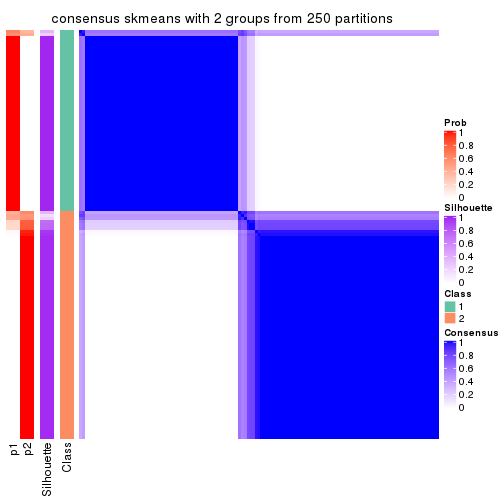</p>

</div>
<div id='tab-CV-skmeans-consensus-heatmap-2'>
<pre><code class="r">consensus_heatmap(res, k = 3)
</code></pre>

<p>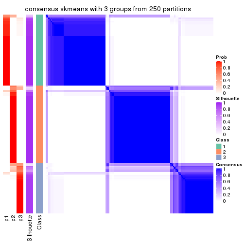</p>

</div>
<div id='tab-CV-skmeans-consensus-heatmap-3'>
<pre><code class="r">consensus_heatmap(res, k = 4)
</code></pre>

<p>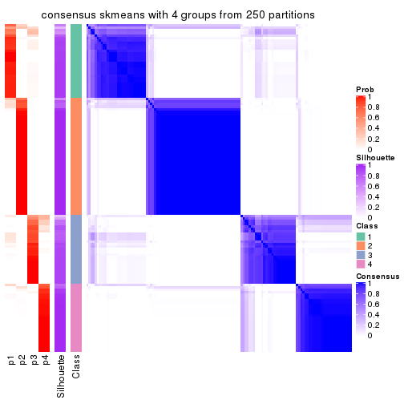</p>

</div>
<div id='tab-CV-skmeans-consensus-heatmap-4'>
<pre><code class="r">consensus_heatmap(res, k = 5)
</code></pre>

<p>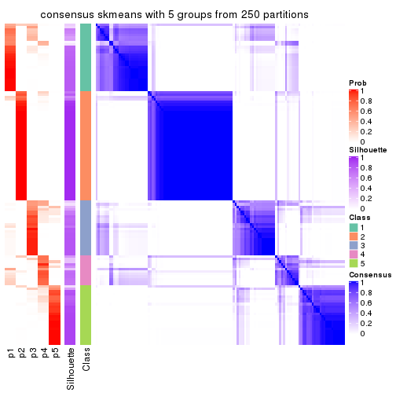</p>

</div>
<div id='tab-CV-skmeans-consensus-heatmap-5'>
<pre><code class="r">consensus_heatmap(res, k = 6)
</code></pre>

<p>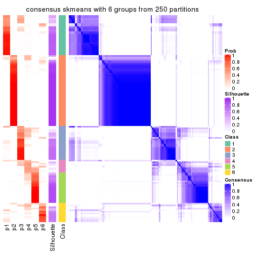</p>

</div>
</div>

Heatmaps for the membership of samples in all partitions to see how consistent they are:


<script>
$( function() {
	$( '#tabs-CV-skmeans-membership-heatmap' ).tabs();
} );
</script>
<div id='tabs-CV-skmeans-membership-heatmap'>
<ul>
<li><a href='#tab-CV-skmeans-membership-heatmap-1'>k = 2</a></li>
<li><a href='#tab-CV-skmeans-membership-heatmap-2'>k = 3</a></li>
<li><a href='#tab-CV-skmeans-membership-heatmap-3'>k = 4</a></li>
<li><a href='#tab-CV-skmeans-membership-heatmap-4'>k = 5</a></li>
<li><a href='#tab-CV-skmeans-membership-heatmap-5'>k = 6</a></li>
</ul>
<div id='tab-CV-skmeans-membership-heatmap-1'>
<pre><code class="r">membership_heatmap(res, k = 2)
</code></pre>

<p>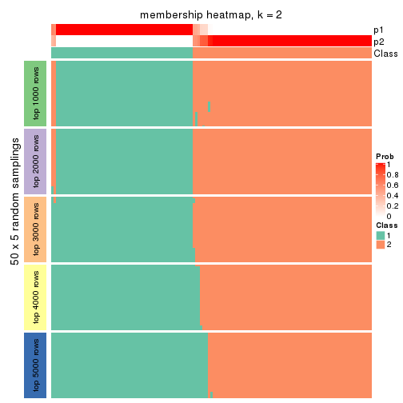</p>

</div>
<div id='tab-CV-skmeans-membership-heatmap-2'>
<pre><code class="r">membership_heatmap(res, k = 3)
</code></pre>

<p>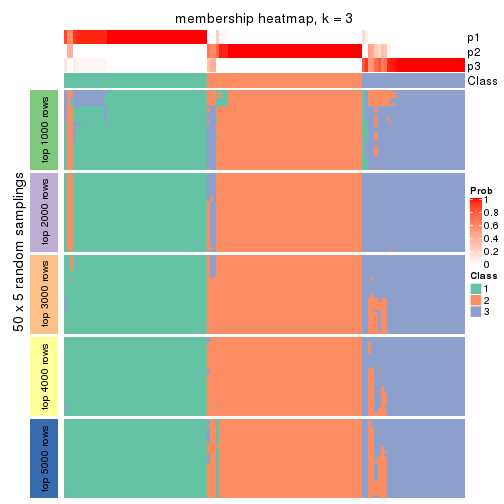</p>

</div>
<div id='tab-CV-skmeans-membership-heatmap-3'>
<pre><code class="r">membership_heatmap(res, k = 4)
</code></pre>

<p>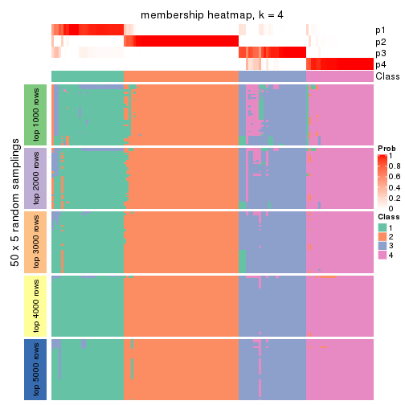</p>

</div>
<div id='tab-CV-skmeans-membership-heatmap-4'>
<pre><code class="r">membership_heatmap(res, k = 5)
</code></pre>

<p>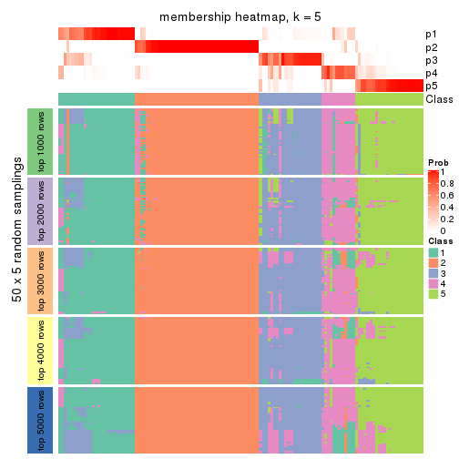</p>

</div>
<div id='tab-CV-skmeans-membership-heatmap-5'>
<pre><code class="r">membership_heatmap(res, k = 6)
</code></pre>

<p>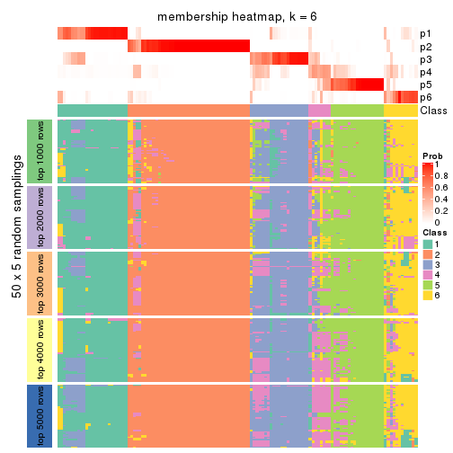</p>

</div>
</div>

As soon as we have had the classes for columns, we can look for signatures
which are significantly different between classes which can be candidate marks
for certain classes. Following are the heatmaps for signatures.


Signature heatmaps where rows are scaled:


<script>
$( function() {
	$( '#tabs-CV-skmeans-get-signatures' ).tabs();
} );
</script>
<div id='tabs-CV-skmeans-get-signatures'>
<ul>
<li><a href='#tab-CV-skmeans-get-signatures-1'>k = 2</a></li>
<li><a href='#tab-CV-skmeans-get-signatures-2'>k = 3</a></li>
<li><a href='#tab-CV-skmeans-get-signatures-3'>k = 4</a></li>
<li><a href='#tab-CV-skmeans-get-signatures-4'>k = 5</a></li>
<li><a href='#tab-CV-skmeans-get-signatures-5'>k = 6</a></li>
</ul>
<div id='tab-CV-skmeans-get-signatures-1'>
<pre><code class="r">get_signatures(res, k = 2)
</code></pre>

<p>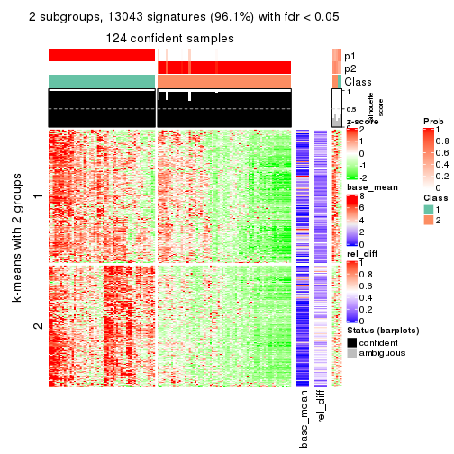</p>

</div>
<div id='tab-CV-skmeans-get-signatures-2'>
<pre><code class="r">get_signatures(res, k = 3)
</code></pre>

<p>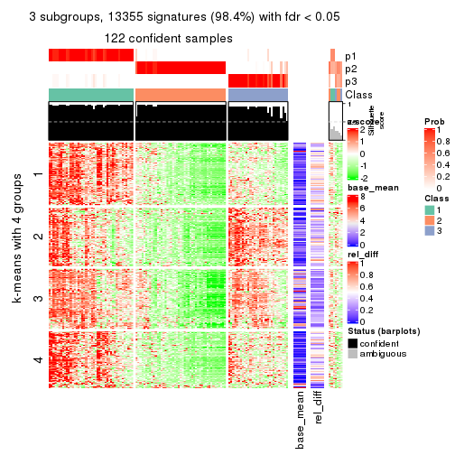</p>

</div>
<div id='tab-CV-skmeans-get-signatures-3'>
<pre><code class="r">get_signatures(res, k = 4)
</code></pre>

<p>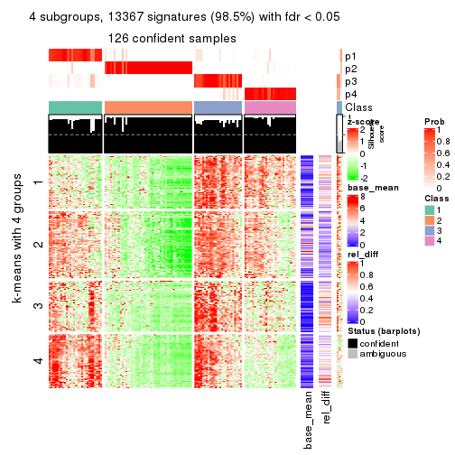</p>

</div>
<div id='tab-CV-skmeans-get-signatures-4'>
<pre><code class="r">get_signatures(res, k = 5)
</code></pre>

<p>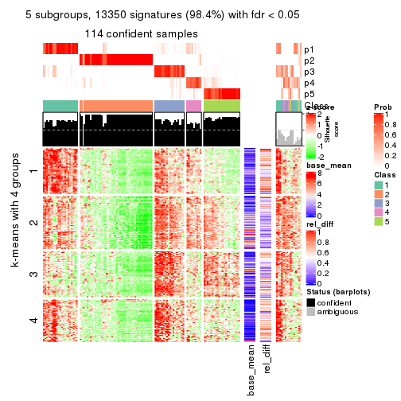</p>

</div>
<div id='tab-CV-skmeans-get-signatures-5'>
<pre><code class="r">get_signatures(res, k = 6)
</code></pre>

<p>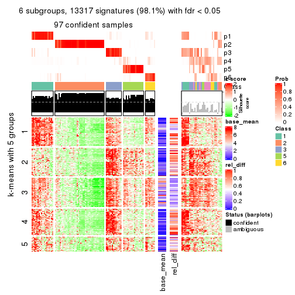</p>

</div>
</div>


Signature heatmaps where rows are not scaled:


<script>
$( function() {
	$( '#tabs-CV-skmeans-get-signatures-no-scale' ).tabs();
} );
</script>
<div id='tabs-CV-skmeans-get-signatures-no-scale'>
<ul>
<li><a href='#tab-CV-skmeans-get-signatures-no-scale-1'>k = 2</a></li>
<li><a href='#tab-CV-skmeans-get-signatures-no-scale-2'>k = 3</a></li>
<li><a href='#tab-CV-skmeans-get-signatures-no-scale-3'>k = 4</a></li>
<li><a href='#tab-CV-skmeans-get-signatures-no-scale-4'>k = 5</a></li>
<li><a href='#tab-CV-skmeans-get-signatures-no-scale-5'>k = 6</a></li>
</ul>
<div id='tab-CV-skmeans-get-signatures-no-scale-1'>
<pre><code class="r">get_signatures(res, k = 2, scale_rows = FALSE)
</code></pre>

<p>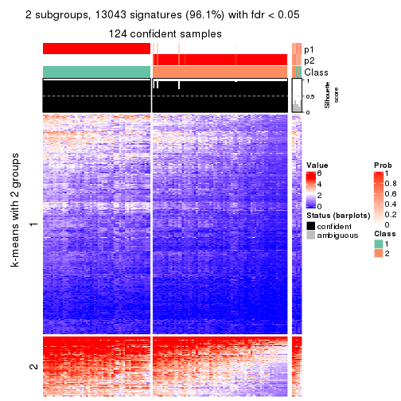</p>

</div>
<div id='tab-CV-skmeans-get-signatures-no-scale-2'>
<pre><code class="r">get_signatures(res, k = 3, scale_rows = FALSE)
</code></pre>

<p>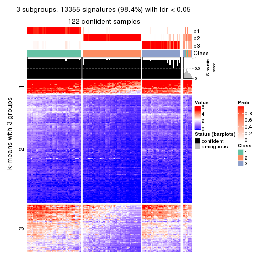</p>

</div>
<div id='tab-CV-skmeans-get-signatures-no-scale-3'>
<pre><code class="r">get_signatures(res, k = 4, scale_rows = FALSE)
</code></pre>

<p>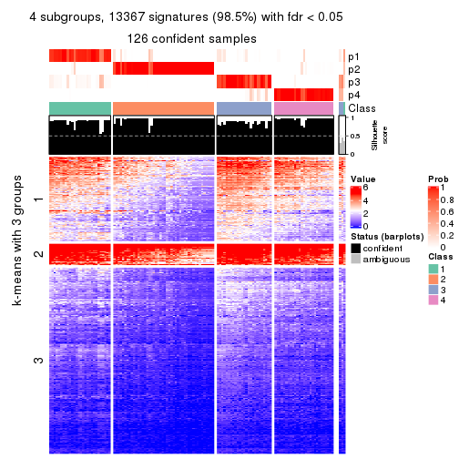</p>

</div>
<div id='tab-CV-skmeans-get-signatures-no-scale-4'>
<pre><code class="r">get_signatures(res, k = 5, scale_rows = FALSE)
</code></pre>

<p>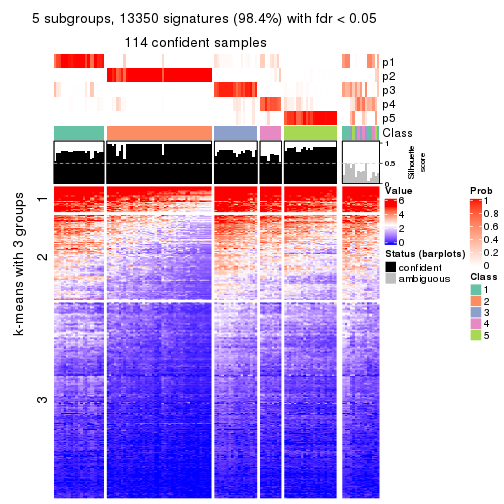</p>

</div>
<div id='tab-CV-skmeans-get-signatures-no-scale-5'>
<pre><code class="r">get_signatures(res, k = 6, scale_rows = FALSE)
</code></pre>

<p>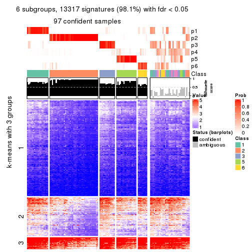</p>

</div>
</div>


Compare the overlap of signatures from different k:

```r
compare_signatures(res)
```

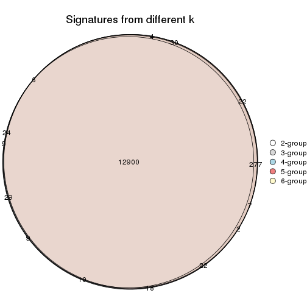

`get_signature()` returns a data frame invisibly. TO get the list of signatures, the function
call should be assigned to a variable explicitly. In following code, if `plot` argument is set
to `FALSE`, no heatmap is plotted while only the differential analysis is performed.

```r
# code only for demonstration
tb = get_signature(res, k = ..., plot = FALSE)
```

An example of the output of `tb` is:

```
#>   which_row         fdr    mean_1    mean_2 scaled_mean_1 scaled_mean_2 km
#> 1        38 0.042760348  8.373488  9.131774    -0.5533452     0.5164555  1
#> 2        40 0.018707592  7.106213  8.469186    -0.6173731     0.5762149  1
#> 3        55 0.019134737 10.221463 11.207825    -0.6159697     0.5749050  1
#> 4        59 0.006059896  5.921854  7.869574    -0.6899429     0.6439467  1
#> 5        60 0.018055526  8.928898 10.211722    -0.6204761     0.5791110  1
#> 6        98 0.009384629 15.714769 14.887706     0.6635654    -0.6193277  2
...
```

The columns in `tb` are:

1. `which_row`: row indices corresponding to the input matrix.
2. `fdr`: FDR for the differential test. 
3. `mean_x`: The mean value in group x.
4. `scaled_mean_x`: The mean value in group x after rows are scaled.
5. `km`: Row groups if k-means clustering is applied to rows.


UMAP plot which shows how samples are separated.


<script>
$( function() {
	$( '#tabs-CV-skmeans-dimension-reduction' ).tabs();
} );
</script>
<div id='tabs-CV-skmeans-dimension-reduction'>
<ul>
<li><a href='#tab-CV-skmeans-dimension-reduction-1'>k = 2</a></li>
<li><a href='#tab-CV-skmeans-dimension-reduction-2'>k = 3</a></li>
<li><a href='#tab-CV-skmeans-dimension-reduction-3'>k = 4</a></li>
<li><a href='#tab-CV-skmeans-dimension-reduction-4'>k = 5</a></li>
<li><a href='#tab-CV-skmeans-dimension-reduction-5'>k = 6</a></li>
</ul>
<div id='tab-CV-skmeans-dimension-reduction-1'>
<pre><code class="r">dimension_reduction(res, k = 2, method = &quot;UMAP&quot;)
</code></pre>

<p>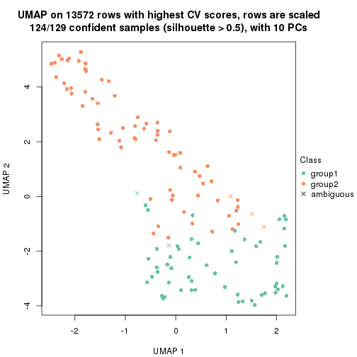</p>

</div>
<div id='tab-CV-skmeans-dimension-reduction-2'>
<pre><code class="r">dimension_reduction(res, k = 3, method = &quot;UMAP&quot;)
</code></pre>

<p>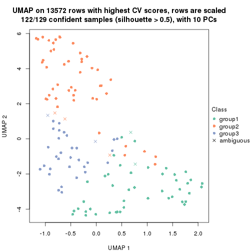</p>

</div>
<div id='tab-CV-skmeans-dimension-reduction-3'>
<pre><code class="r">dimension_reduction(res, k = 4, method = &quot;UMAP&quot;)
</code></pre>

<p>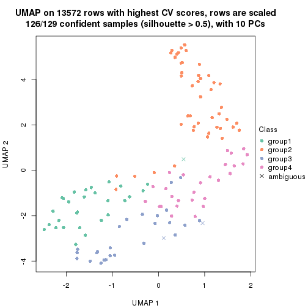</p>

</div>
<div id='tab-CV-skmeans-dimension-reduction-4'>
<pre><code class="r">dimension_reduction(res, k = 5, method = &quot;UMAP&quot;)
</code></pre>

<p>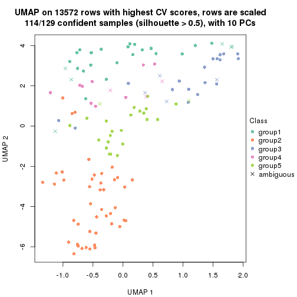</p>

</div>
<div id='tab-CV-skmeans-dimension-reduction-5'>
<pre><code class="r">dimension_reduction(res, k = 6, method = &quot;UMAP&quot;)
</code></pre>

<p>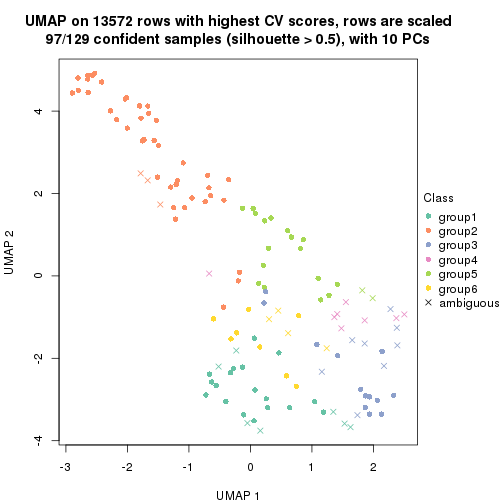</p>

</div>
</div>


Following heatmap shows how subgroups are split when increasing `k`:

```r
collect_classes(res)
```

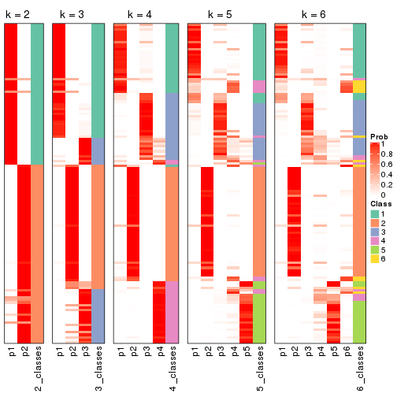


If matrix rows can be associated to genes, consider to use `GO_Enrichment(res,
...)` to perform function enrichment for the signature genes.


 

---------------------------------------------------


### CV:pam


The object with results only for a single top-value method and a single partition method 
can be extracted as:

```r
res = res_list["CV", "pam"]
# you can also extract it by
# res = res_list["CV:pam"]
```

A summary of `res` and all the functions that can be applied to it:

```r
res
```

```
#> A 'ConsensusPartition' object with k = 2, 3, 4, 5, 6.
#>   On a matrix with 13572 rows and 129 columns.
#>   Top rows (1000, 2000, 3000, 4000, 5000) are extracted by 'CV' method.
#>   Subgroups are detected by 'pam' method.
#>   Performed in total 1250 partitions by row resampling.
#>   Best k for subgroups seems to be 2.
#> 
#> Following methods can be applied to this 'ConsensusPartition' object:
#>  [1] "cola_report"             "collect_classes"         "collect_plots"          
#>  [4] "collect_stats"           "colnames"                "compare_signatures"     
#>  [7] "consensus_heatmap"       "dimension_reduction"     "functional_enrichment"  
#> [10] "get_anno_col"            "get_anno"                "get_classes"            
#> [13] "get_consensus"           "get_matrix"              "get_membership"         
#> [16] "get_param"               "get_signatures"          "get_stats"              
#> [19] "is_best_k"               "is_stable_k"             "membership_heatmap"     
#> [22] "ncol"                    "nrow"                    "plot_ecdf"              
#> [25] "rownames"                "select_partition_number" "show"                   
#> [28] "suggest_best_k"          "test_to_known_factors"
```

`collect_plots()` function collects all the plots made from `res` for all `k` (number of partitions)
into one single page to provide an easy and fast comparison between different `k`.

```r
collect_plots(res)
```

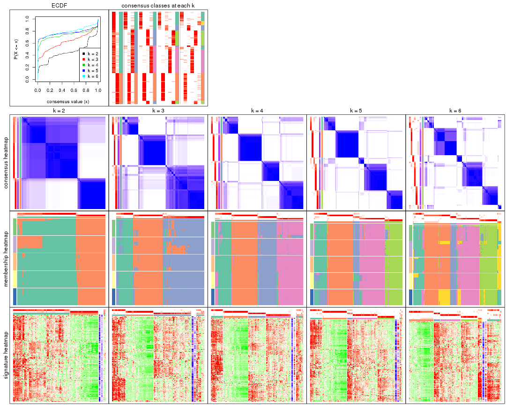

The plots are:

- The first row: a plot of the ECDF (Empirical cumulative distribution
  function) curves of the consensus matrix for each `k` and the heatmap of
  predicted classes for each `k`.
- The second row: heatmaps of the consensus matrix for each `k`.
- The third row: heatmaps of the membership matrix for each `k`.
- The fouth row: heatmaps of the signatures for each `k`.

All the plots in panels can be made by individual functions and they are
plotted later in this section.

`select_partition_number()` produces several plots showing different
statistics for choosing "optimized" `k`. There are following statistics:

- ECDF curves of the consensus matrix for each `k`;
- 1-PAC. [The PAC
  score](https://en.wikipedia.org/wiki/Consensus_clustering#Over-interpretation_potential_of_consensus_clustering)
  measures the proportion of the ambiguous subgrouping.
- Mean silhouette score.
- Concordance. The mean probability of fiting the consensus class ids in all
  partitions.
- Area increased. Denote $A_k$ as the area under the ECDF curve for current
  `k`, the area increased is defined as $A_k - A_{k-1}$.
- Rand index. The percent of pairs of samples that are both in a same cluster
  or both are not in a same cluster in the partition of k and k-1.
- Jaccard index. The ratio of pairs of samples are both in a same cluster in
  the partition of k and k-1 and the pairs of samples are both in a same
  cluster in the partition k or k-1.

The detailed explanations of these statistics can be found in [the cola
vignette](http://bioconductor.org/packages/devel/bioc/vignettes/cola/inst/doc/cola.html#toc_13).

Generally speaking, lower PAC score, higher mean silhouette score or higher
concordance corresponds to better partition. Rand index and Jaccard index
measure how similar the current partition is compared to partition with `k-1`.
If they are too similar, we won't accept `k` is better than `k-1`.

```r
select_partition_number(res)
```

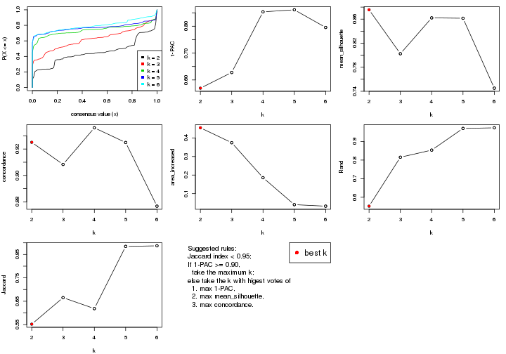

The numeric values for all these statistics can be obtained by `get_stats()`.

```r
get_stats(res)
```

```
#>   k 1-PAC mean_silhouette concordance area_increased  Rand Jaccard
#> 2 2 0.569           0.875       0.925         0.4544 0.552   0.552
#> 3 3 0.628           0.802       0.908         0.3742 0.815   0.665
#> 4 4 0.854           0.862       0.936         0.1858 0.854   0.619
#> 5 5 0.861           0.861       0.925         0.0406 0.970   0.885
#> 6 6 0.795           0.745       0.877         0.0325 0.973   0.887
```

`suggest_best_k()` suggests the best $k$ based on these statistics. The rules are as follows:

- All $k$ with Jaccard index larger than 0.95 are removed because the increase of
  the partition number does not provides enough extra information. If all $k$ are removed,
  the best $k$ is assigned by `NA`.
- For $k$ with 1-PAC larger than 0.9, the maximal $k$ is taken as the "best k". Other $k$ is called "optional k".
- If it does not fit the second rule. The $k$ with the highest vote of highest
  1-PAC, mean silhouette and concordance is taken as the "best k".

```r
suggest_best_k(res)
```

```
#> [1] 2
```


Following shows the table of the partitions (You need to click the **show/hide
code output** link to see it). The membership matrix (columns with name `p*`)
is inferred by
[`clue::cl_consensus()`](https://www.rdocumentation.org/link/cl_consensus?package=clue)
function with the `SE` method. Basically the value in the membership matrix
represents the probability to belong to a certain group. The finall class
label for an item is determined with the group with highest probability it
belongs to.

In `get_classes()` function, the entropy is calculated from the membership
matrix and the silhouette score is calculated from the consensus matrix.


<script>
$( function() {
	$( '#tabs-CV-pam-get-classes' ).tabs();
} );
</script>
<div id='tabs-CV-pam-get-classes'>
<ul>
<li><a href='#tab-CV-pam-get-classes-1'>k = 2</a></li>
<li><a href='#tab-CV-pam-get-classes-2'>k = 3</a></li>
<li><a href='#tab-CV-pam-get-classes-3'>k = 4</a></li>
<li><a href='#tab-CV-pam-get-classes-4'>k = 5</a></li>
<li><a href='#tab-CV-pam-get-classes-5'>k = 6</a></li>
</ul>

<div id='tab-CV-pam-get-classes-1'>
<p><a id='tab-CV-pam-get-classes-1-a' style='color:#0366d6' href='#'>show/hide code output</a></p>
<pre><code class="r">cbind(get_classes(res, k = 2), get_membership(res, k = 2))
</code></pre>

<pre><code>#&gt;            class entropy silhouette    p1    p2
#&gt; SRR1656463     2  0.0000      0.973 0.000 1.000
#&gt; SRR1656464     1  0.0000      0.891 1.000 0.000
#&gt; SRR1656462     1  0.0672      0.893 0.992 0.008
#&gt; SRR1656465     1  0.6801      0.847 0.820 0.180
#&gt; SRR1656467     2  0.0000      0.973 0.000 1.000
#&gt; SRR1656466     1  0.2236      0.891 0.964 0.036
#&gt; SRR1656468     2  0.0000      0.973 0.000 1.000
#&gt; SRR1656472     1  0.0000      0.891 1.000 0.000
#&gt; SRR1656471     1  0.2043      0.892 0.968 0.032
#&gt; SRR1656470     2  0.0000      0.973 0.000 1.000
#&gt; SRR1656469     1  0.9635      0.549 0.612 0.388
#&gt; SRR1656473     2  0.0000      0.973 0.000 1.000
#&gt; SRR1656474     2  0.0000      0.973 0.000 1.000
#&gt; SRR1656475     2  0.0000      0.973 0.000 1.000
#&gt; SRR1656478     1  0.0376      0.892 0.996 0.004
#&gt; SRR1656477     1  0.7745      0.803 0.772 0.228
#&gt; SRR1656479     1  0.6801      0.847 0.820 0.180
#&gt; SRR1656480     1  1.0000      0.248 0.504 0.496
#&gt; SRR1656476     2  0.0000      0.973 0.000 1.000
#&gt; SRR1656481     1  0.8499      0.744 0.724 0.276
#&gt; SRR1656482     2  0.0000      0.973 0.000 1.000
#&gt; SRR1656483     2  0.0000      0.973 0.000 1.000
#&gt; SRR1656485     1  0.1414      0.893 0.980 0.020
#&gt; SRR1656487     1  0.1184      0.894 0.984 0.016
#&gt; SRR1656486     1  0.8081      0.784 0.752 0.248
#&gt; SRR1656488     1  0.1184      0.894 0.984 0.016
#&gt; SRR1656484     1  0.6712      0.848 0.824 0.176
#&gt; SRR1656489     1  0.0000      0.891 1.000 0.000
#&gt; SRR1656491     1  0.6801      0.847 0.820 0.180
#&gt; SRR1656490     1  0.6801      0.847 0.820 0.180
#&gt; SRR1656492     1  0.1184      0.894 0.984 0.016
#&gt; SRR1656493     1  0.0000      0.891 1.000 0.000
#&gt; SRR1656495     1  0.0000      0.891 1.000 0.000
#&gt; SRR1656496     1  0.6801      0.847 0.820 0.180
#&gt; SRR1656494     1  0.9248      0.644 0.660 0.340
#&gt; SRR1656497     2  0.0000      0.973 0.000 1.000
#&gt; SRR1656499     1  0.1184      0.894 0.984 0.016
#&gt; SRR1656500     1  0.0938      0.893 0.988 0.012
#&gt; SRR1656501     1  0.6801      0.847 0.820 0.180
#&gt; SRR1656498     1  0.0000      0.891 1.000 0.000
#&gt; SRR1656504     2  0.0000      0.973 0.000 1.000
#&gt; SRR1656502     1  0.0000      0.891 1.000 0.000
#&gt; SRR1656503     1  0.6801      0.847 0.820 0.180
#&gt; SRR1656507     1  0.0672      0.893 0.992 0.008
#&gt; SRR1656508     1  0.0000      0.891 1.000 0.000
#&gt; SRR1656505     2  0.0000      0.973 0.000 1.000
#&gt; SRR1656506     1  0.6801      0.847 0.820 0.180
#&gt; SRR1656509     1  0.6531      0.852 0.832 0.168
#&gt; SRR1656510     2  0.0938      0.962 0.012 0.988
#&gt; SRR1656511     2  0.0000      0.973 0.000 1.000
#&gt; SRR1656513     2  0.0000      0.973 0.000 1.000
#&gt; SRR1656512     2  0.0000      0.973 0.000 1.000
#&gt; SRR1656514     1  0.0000      0.891 1.000 0.000
#&gt; SRR1656515     2  0.0000      0.973 0.000 1.000
#&gt; SRR1656516     1  0.6531      0.852 0.832 0.168
#&gt; SRR1656518     1  0.0376      0.892 0.996 0.004
#&gt; SRR1656517     1  0.0000      0.891 1.000 0.000
#&gt; SRR1656519     1  0.0000      0.891 1.000 0.000
#&gt; SRR1656522     1  0.0000      0.891 1.000 0.000
#&gt; SRR1656523     1  0.9815      0.471 0.580 0.420
#&gt; SRR1656521     2  0.0000      0.973 0.000 1.000
#&gt; SRR1656520     1  0.0376      0.892 0.996 0.004
#&gt; SRR1656524     1  0.0000      0.891 1.000 0.000
#&gt; SRR1656525     1  0.1414      0.894 0.980 0.020
#&gt; SRR1656526     2  0.0000      0.973 0.000 1.000
#&gt; SRR1656527     2  0.0000      0.973 0.000 1.000
#&gt; SRR1656530     1  0.6801      0.847 0.820 0.180
#&gt; SRR1656529     1  0.6801      0.847 0.820 0.180
#&gt; SRR1656531     1  0.0000      0.891 1.000 0.000
#&gt; SRR1656528     1  0.6801      0.847 0.820 0.180
#&gt; SRR1656534     1  0.0000      0.891 1.000 0.000
#&gt; SRR1656533     1  0.0000      0.891 1.000 0.000
#&gt; SRR1656536     1  0.9248      0.644 0.660 0.340
#&gt; SRR1656532     1  0.9044      0.678 0.680 0.320
#&gt; SRR1656537     1  0.0000      0.891 1.000 0.000
#&gt; SRR1656538     1  0.0938      0.893 0.988 0.012
#&gt; SRR1656535     2  0.0000      0.973 0.000 1.000
#&gt; SRR1656539     1  0.6801      0.847 0.820 0.180
#&gt; SRR1656544     1  0.1843      0.893 0.972 0.028
#&gt; SRR1656542     1  0.0000      0.891 1.000 0.000
#&gt; SRR1656543     1  0.0000      0.891 1.000 0.000
#&gt; SRR1656545     2  0.0000      0.973 0.000 1.000
#&gt; SRR1656540     1  0.0938      0.893 0.988 0.012
#&gt; SRR1656546     2  0.3879      0.891 0.076 0.924
#&gt; SRR1656541     2  0.0000      0.973 0.000 1.000
#&gt; SRR1656547     2  0.0000      0.973 0.000 1.000
#&gt; SRR1656548     1  0.6801      0.847 0.820 0.180
#&gt; SRR1656549     1  0.8081      0.784 0.752 0.248
#&gt; SRR1656551     2  0.8144      0.582 0.252 0.748
#&gt; SRR1656553     1  0.1184      0.894 0.984 0.016
#&gt; SRR1656550     1  0.9248      0.644 0.660 0.340
#&gt; SRR1656552     2  0.0000      0.973 0.000 1.000
#&gt; SRR1656554     1  0.6801      0.847 0.820 0.180
#&gt; SRR1656555     2  0.0000      0.973 0.000 1.000
#&gt; SRR1656556     1  0.1184      0.894 0.984 0.016
#&gt; SRR1656557     1  0.0938      0.893 0.988 0.012
#&gt; SRR1656558     1  0.0000      0.891 1.000 0.000
#&gt; SRR1656559     1  0.0000      0.891 1.000 0.000
#&gt; SRR1656560     1  0.6801      0.847 0.820 0.180
#&gt; SRR1656561     1  0.6801      0.847 0.820 0.180
#&gt; SRR1656562     2  0.9754      0.104 0.408 0.592
#&gt; SRR1656563     1  0.0672      0.893 0.992 0.008
#&gt; SRR1656564     2  0.0000      0.973 0.000 1.000
#&gt; SRR1656565     2  0.0000      0.973 0.000 1.000
#&gt; SRR1656566     1  0.1184      0.893 0.984 0.016
#&gt; SRR1656568     2  0.0000      0.973 0.000 1.000
#&gt; SRR1656567     2  0.0376      0.969 0.004 0.996
#&gt; SRR1656569     1  0.6801      0.847 0.820 0.180
#&gt; SRR1656570     1  0.0938      0.894 0.988 0.012
#&gt; SRR1656571     2  0.0000      0.973 0.000 1.000
#&gt; SRR1656573     1  0.6801      0.847 0.820 0.180
#&gt; SRR1656572     2  0.0000      0.973 0.000 1.000
#&gt; SRR1656574     1  0.0000      0.891 1.000 0.000
#&gt; SRR1656575     1  0.6801      0.847 0.820 0.180
#&gt; SRR1656576     2  0.0000      0.973 0.000 1.000
#&gt; SRR1656578     2  0.6048      0.790 0.148 0.852
#&gt; SRR1656577     1  0.0000      0.891 1.000 0.000
#&gt; SRR1656579     2  0.0000      0.973 0.000 1.000
#&gt; SRR1656580     1  0.1184      0.894 0.984 0.016
#&gt; SRR1656581     1  0.8016      0.789 0.756 0.244
#&gt; SRR1656582     2  0.0000      0.973 0.000 1.000
#&gt; SRR1656585     1  0.6801      0.847 0.820 0.180
#&gt; SRR1656584     1  0.5946      0.859 0.856 0.144
#&gt; SRR1656583     1  0.1843      0.893 0.972 0.028
#&gt; SRR1656586     2  0.0000      0.973 0.000 1.000
#&gt; SRR1656587     1  0.6887      0.844 0.816 0.184
#&gt; SRR1656588     2  0.2778      0.923 0.048 0.952
#&gt; SRR1656589     2  0.0000      0.973 0.000 1.000
#&gt; SRR1656590     1  0.0000      0.891 1.000 0.000
</code></pre>

<script>
$('#tab-CV-pam-get-classes-1-a').parent().next().next().hide();
$('#tab-CV-pam-get-classes-1-a').click(function(){
  $('#tab-CV-pam-get-classes-1-a').parent().next().next().toggle();
  return(false);
});
</script>
</div>

<div id='tab-CV-pam-get-classes-2'>
<p><a id='tab-CV-pam-get-classes-2-a' style='color:#0366d6' href='#'>show/hide code output</a></p>
<pre><code class="r">cbind(get_classes(res, k = 3), get_membership(res, k = 3))
</code></pre>

<pre><code>#&gt;            class entropy silhouette    p1    p2    p3
#&gt; SRR1656463     2  0.0000      0.948 0.000 1.000 0.000
#&gt; SRR1656464     1  0.0000      0.846 1.000 0.000 0.000
#&gt; SRR1656462     1  0.5733      0.616 0.676 0.000 0.324
#&gt; SRR1656465     3  0.0747      0.859 0.000 0.016 0.984
#&gt; SRR1656467     2  0.0000      0.948 0.000 1.000 0.000
#&gt; SRR1656466     3  0.0000      0.857 0.000 0.000 1.000
#&gt; SRR1656468     2  0.4235      0.770 0.000 0.824 0.176
#&gt; SRR1656472     1  0.0000      0.846 1.000 0.000 0.000
#&gt; SRR1656471     3  0.0000      0.857 0.000 0.000 1.000
#&gt; SRR1656470     2  0.0000      0.948 0.000 1.000 0.000
#&gt; SRR1656469     3  0.5178      0.698 0.000 0.256 0.744
#&gt; SRR1656473     2  0.0000      0.948 0.000 1.000 0.000
#&gt; SRR1656474     2  0.0000      0.948 0.000 1.000 0.000
#&gt; SRR1656475     2  0.0000      0.948 0.000 1.000 0.000
#&gt; SRR1656478     3  0.3267      0.762 0.116 0.000 0.884
#&gt; SRR1656477     3  0.3482      0.828 0.000 0.128 0.872
#&gt; SRR1656479     3  0.3193      0.846 0.004 0.100 0.896
#&gt; SRR1656480     3  0.6045      0.465 0.000 0.380 0.620
#&gt; SRR1656476     2  0.0000      0.948 0.000 1.000 0.000
#&gt; SRR1656481     3  0.2796      0.830 0.000 0.092 0.908
#&gt; SRR1656482     2  0.0000      0.948 0.000 1.000 0.000
#&gt; SRR1656483     2  0.0000      0.948 0.000 1.000 0.000
#&gt; SRR1656485     3  0.0237      0.857 0.004 0.000 0.996
#&gt; SRR1656487     3  0.0000      0.857 0.000 0.000 1.000
#&gt; SRR1656486     3  0.5623      0.681 0.004 0.280 0.716
#&gt; SRR1656488     3  0.0000      0.857 0.000 0.000 1.000
#&gt; SRR1656484     3  0.3193      0.846 0.004 0.100 0.896
#&gt; SRR1656489     3  0.5254      0.600 0.264 0.000 0.736
#&gt; SRR1656491     3  0.2945      0.850 0.004 0.088 0.908
#&gt; SRR1656490     3  0.3272      0.844 0.004 0.104 0.892
#&gt; SRR1656492     3  0.0237      0.857 0.004 0.000 0.996
#&gt; SRR1656493     1  0.2711      0.808 0.912 0.000 0.088
#&gt; SRR1656495     1  0.6079      0.361 0.612 0.000 0.388
#&gt; SRR1656496     3  0.2945      0.850 0.004 0.088 0.908
#&gt; SRR1656494     3  0.6095      0.498 0.000 0.392 0.608
#&gt; SRR1656497     2  0.0000      0.948 0.000 1.000 0.000
#&gt; SRR1656499     3  0.0892      0.846 0.020 0.000 0.980
#&gt; SRR1656500     3  0.6062      0.147 0.384 0.000 0.616
#&gt; SRR1656501     3  0.3193      0.846 0.004 0.100 0.896
#&gt; SRR1656498     1  0.0000      0.846 1.000 0.000 0.000
#&gt; SRR1656504     2  0.0000      0.948 0.000 1.000 0.000
#&gt; SRR1656502     1  0.0000      0.846 1.000 0.000 0.000
#&gt; SRR1656503     3  0.1878      0.859 0.004 0.044 0.952
#&gt; SRR1656507     3  0.0237      0.857 0.004 0.000 0.996
#&gt; SRR1656508     1  0.0000      0.846 1.000 0.000 0.000
#&gt; SRR1656505     2  0.4235      0.770 0.000 0.824 0.176
#&gt; SRR1656506     3  0.0237      0.857 0.004 0.000 0.996
#&gt; SRR1656509     3  0.0000      0.857 0.000 0.000 1.000
#&gt; SRR1656510     2  0.3116      0.852 0.000 0.892 0.108
#&gt; SRR1656511     2  0.0000      0.948 0.000 1.000 0.000
#&gt; SRR1656513     2  0.0000      0.948 0.000 1.000 0.000
#&gt; SRR1656512     2  0.0000      0.948 0.000 1.000 0.000
#&gt; SRR1656514     1  0.0000      0.846 1.000 0.000 0.000
#&gt; SRR1656515     2  0.0000      0.948 0.000 1.000 0.000
#&gt; SRR1656516     3  0.0237      0.857 0.004 0.000 0.996
#&gt; SRR1656518     3  0.4914      0.819 0.068 0.088 0.844
#&gt; SRR1656517     1  0.0000      0.846 1.000 0.000 0.000
#&gt; SRR1656519     1  0.5760      0.608 0.672 0.000 0.328
#&gt; SRR1656522     1  0.0000      0.846 1.000 0.000 0.000
#&gt; SRR1656523     3  0.6386      0.429 0.004 0.412 0.584
#&gt; SRR1656521     2  0.0000      0.948 0.000 1.000 0.000
#&gt; SRR1656520     3  0.6302     -0.175 0.480 0.000 0.520
#&gt; SRR1656524     1  0.6045      0.382 0.620 0.000 0.380
#&gt; SRR1656525     3  0.0237      0.857 0.004 0.000 0.996
#&gt; SRR1656526     2  0.0000      0.948 0.000 1.000 0.000
#&gt; SRR1656527     2  0.0000      0.948 0.000 1.000 0.000
#&gt; SRR1656530     3  0.2860      0.851 0.004 0.084 0.912
#&gt; SRR1656529     3  0.2625      0.851 0.000 0.084 0.916
#&gt; SRR1656531     1  0.0000      0.846 1.000 0.000 0.000
#&gt; SRR1656528     3  0.0000      0.857 0.000 0.000 1.000
#&gt; SRR1656534     1  0.0237      0.845 0.996 0.000 0.004
#&gt; SRR1656533     1  0.0424      0.844 0.992 0.000 0.008
#&gt; SRR1656536     3  0.4702      0.749 0.000 0.212 0.788
#&gt; SRR1656532     3  0.6247      0.531 0.004 0.376 0.620
#&gt; SRR1656537     1  0.0000      0.846 1.000 0.000 0.000
#&gt; SRR1656538     3  0.0237      0.857 0.004 0.000 0.996
#&gt; SRR1656535     2  0.0000      0.948 0.000 1.000 0.000
#&gt; SRR1656539     3  0.0747      0.859 0.000 0.016 0.984
#&gt; SRR1656544     3  0.0000      0.857 0.000 0.000 1.000
#&gt; SRR1656542     3  0.0237      0.857 0.004 0.000 0.996
#&gt; SRR1656543     1  0.3816      0.784 0.852 0.000 0.148
#&gt; SRR1656545     2  0.0000      0.948 0.000 1.000 0.000
#&gt; SRR1656540     1  0.6111      0.498 0.604 0.000 0.396
#&gt; SRR1656546     2  0.2165      0.889 0.000 0.936 0.064
#&gt; SRR1656541     2  0.0000      0.948 0.000 1.000 0.000
#&gt; SRR1656547     2  0.0000      0.948 0.000 1.000 0.000
#&gt; SRR1656548     3  0.0237      0.857 0.004 0.000 0.996
#&gt; SRR1656549     3  0.5588      0.686 0.004 0.276 0.720
#&gt; SRR1656551     2  0.6215      0.181 0.000 0.572 0.428
#&gt; SRR1656553     3  0.0000      0.857 0.000 0.000 1.000
#&gt; SRR1656550     3  0.4702      0.749 0.000 0.212 0.788
#&gt; SRR1656552     2  0.0000      0.948 0.000 1.000 0.000
#&gt; SRR1656554     3  0.2261      0.855 0.000 0.068 0.932
#&gt; SRR1656555     2  0.0000      0.948 0.000 1.000 0.000
#&gt; SRR1656556     3  0.0000      0.857 0.000 0.000 1.000
#&gt; SRR1656557     1  0.5650      0.637 0.688 0.000 0.312
#&gt; SRR1656558     1  0.6045      0.382 0.620 0.000 0.380
#&gt; SRR1656559     1  0.0000      0.846 1.000 0.000 0.000
#&gt; SRR1656560     3  0.0000      0.857 0.000 0.000 1.000
#&gt; SRR1656561     3  0.0237      0.857 0.004 0.000 0.996
#&gt; SRR1656562     2  0.6095      0.203 0.000 0.608 0.392
#&gt; SRR1656563     3  0.0237      0.857 0.004 0.000 0.996
#&gt; SRR1656564     2  0.0000      0.948 0.000 1.000 0.000
#&gt; SRR1656565     2  0.0000      0.948 0.000 1.000 0.000
#&gt; SRR1656566     3  0.5497      0.559 0.292 0.000 0.708
#&gt; SRR1656568     2  0.0000      0.948 0.000 1.000 0.000
#&gt; SRR1656567     2  0.3412      0.833 0.000 0.876 0.124
#&gt; SRR1656569     3  0.2959      0.846 0.000 0.100 0.900
#&gt; SRR1656570     3  0.1878      0.859 0.004 0.044 0.952
#&gt; SRR1656571     2  0.0000      0.948 0.000 1.000 0.000
#&gt; SRR1656573     3  0.3272      0.844 0.004 0.104 0.892
#&gt; SRR1656572     2  0.0000      0.948 0.000 1.000 0.000
#&gt; SRR1656574     1  0.4121      0.751 0.832 0.000 0.168
#&gt; SRR1656575     3  0.3851      0.826 0.004 0.136 0.860
#&gt; SRR1656576     2  0.0000      0.948 0.000 1.000 0.000
#&gt; SRR1656578     2  0.2537      0.873 0.000 0.920 0.080
#&gt; SRR1656577     1  0.0000      0.846 1.000 0.000 0.000
#&gt; SRR1656579     2  0.0000      0.948 0.000 1.000 0.000
#&gt; SRR1656580     3  0.0237      0.857 0.004 0.000 0.996
#&gt; SRR1656581     3  0.3272      0.844 0.004 0.104 0.892
#&gt; SRR1656582     2  0.0000      0.948 0.000 1.000 0.000
#&gt; SRR1656585     3  0.3272      0.844 0.004 0.104 0.892
#&gt; SRR1656584     3  0.5431      0.572 0.284 0.000 0.716
#&gt; SRR1656583     3  0.0237      0.857 0.004 0.000 0.996
#&gt; SRR1656586     2  0.0000      0.948 0.000 1.000 0.000
#&gt; SRR1656587     3  0.4465      0.792 0.004 0.176 0.820
#&gt; SRR1656588     2  0.4121      0.781 0.000 0.832 0.168
#&gt; SRR1656589     2  0.0000      0.948 0.000 1.000 0.000
#&gt; SRR1656590     1  0.6026      0.391 0.624 0.000 0.376
</code></pre>

<script>
$('#tab-CV-pam-get-classes-2-a').parent().next().next().hide();
$('#tab-CV-pam-get-classes-2-a').click(function(){
  $('#tab-CV-pam-get-classes-2-a').parent().next().next().toggle();
  return(false);
});
</script>
</div>

<div id='tab-CV-pam-get-classes-3'>
<p><a id='tab-CV-pam-get-classes-3-a' style='color:#0366d6' href='#'>show/hide code output</a></p>
<pre><code class="r">cbind(get_classes(res, k = 4), get_membership(res, k = 4))
</code></pre>

<pre><code>#&gt;            class entropy silhouette    p1    p2    p3    p4
#&gt; SRR1656463     2  0.0000      0.971 0.000 1.000 0.000 0.000
#&gt; SRR1656464     1  0.0000      0.840 1.000 0.000 0.000 0.000
#&gt; SRR1656462     1  0.5321      0.681 0.716 0.000 0.056 0.228
#&gt; SRR1656465     3  0.0000      0.942 0.000 0.000 1.000 0.000
#&gt; SRR1656467     2  0.0188      0.969 0.000 0.996 0.004 0.000
#&gt; SRR1656466     3  0.0188      0.941 0.000 0.000 0.996 0.004
#&gt; SRR1656468     3  0.2647      0.818 0.000 0.120 0.880 0.000
#&gt; SRR1656472     1  0.0000      0.840 1.000 0.000 0.000 0.000
#&gt; SRR1656471     3  0.0188      0.941 0.000 0.000 0.996 0.004
#&gt; SRR1656470     2  0.0000      0.971 0.000 1.000 0.000 0.000
#&gt; SRR1656469     3  0.0188      0.940 0.000 0.004 0.996 0.000
#&gt; SRR1656473     2  0.0000      0.971 0.000 1.000 0.000 0.000
#&gt; SRR1656474     2  0.0000      0.971 0.000 1.000 0.000 0.000
#&gt; SRR1656475     2  0.0000      0.971 0.000 1.000 0.000 0.000
#&gt; SRR1656478     4  0.0000      0.914 0.000 0.000 0.000 1.000
#&gt; SRR1656477     3  0.0000      0.942 0.000 0.000 1.000 0.000
#&gt; SRR1656479     4  0.1389      0.928 0.000 0.000 0.048 0.952
#&gt; SRR1656480     3  0.0000      0.942 0.000 0.000 1.000 0.000
#&gt; SRR1656476     2  0.0000      0.971 0.000 1.000 0.000 0.000
#&gt; SRR1656481     3  0.0000      0.942 0.000 0.000 1.000 0.000
#&gt; SRR1656482     2  0.0000      0.971 0.000 1.000 0.000 0.000
#&gt; SRR1656483     2  0.0000      0.971 0.000 1.000 0.000 0.000
#&gt; SRR1656485     4  0.3172      0.813 0.000 0.000 0.160 0.840
#&gt; SRR1656487     3  0.0188      0.941 0.000 0.000 0.996 0.004
#&gt; SRR1656486     4  0.1489      0.905 0.000 0.044 0.004 0.952
#&gt; SRR1656488     3  0.1302      0.913 0.000 0.000 0.956 0.044
#&gt; SRR1656484     4  0.1302      0.928 0.000 0.000 0.044 0.956
#&gt; SRR1656489     4  0.0000      0.914 0.000 0.000 0.000 1.000
#&gt; SRR1656491     4  0.1389      0.928 0.000 0.000 0.048 0.952
#&gt; SRR1656490     4  0.1389      0.928 0.000 0.000 0.048 0.952
#&gt; SRR1656492     4  0.1302      0.928 0.000 0.000 0.044 0.956
#&gt; SRR1656493     1  0.2704      0.786 0.876 0.000 0.000 0.124
#&gt; SRR1656495     1  0.4855      0.379 0.600 0.000 0.000 0.400
#&gt; SRR1656496     4  0.1389      0.928 0.000 0.000 0.048 0.952
#&gt; SRR1656494     4  0.3401      0.782 0.000 0.152 0.008 0.840
#&gt; SRR1656497     2  0.0000      0.971 0.000 1.000 0.000 0.000
#&gt; SRR1656499     3  0.1489      0.910 0.004 0.000 0.952 0.044
#&gt; SRR1656500     4  0.4817      0.197 0.388 0.000 0.000 0.612
#&gt; SRR1656501     4  0.1389      0.928 0.000 0.000 0.048 0.952
#&gt; SRR1656498     1  0.0188      0.840 0.996 0.000 0.000 0.004
#&gt; SRR1656504     2  0.0000      0.971 0.000 1.000 0.000 0.000
#&gt; SRR1656502     1  0.0000      0.840 1.000 0.000 0.000 0.000
#&gt; SRR1656503     4  0.0188      0.913 0.004 0.000 0.000 0.996
#&gt; SRR1656507     4  0.0188      0.916 0.000 0.000 0.004 0.996
#&gt; SRR1656508     1  0.0188      0.840 0.996 0.000 0.000 0.004
#&gt; SRR1656505     3  0.0188      0.940 0.000 0.004 0.996 0.000
#&gt; SRR1656506     3  0.2760      0.806 0.000 0.000 0.872 0.128
#&gt; SRR1656509     3  0.4898      0.329 0.000 0.000 0.584 0.416
#&gt; SRR1656510     2  0.4372      0.622 0.000 0.728 0.268 0.004
#&gt; SRR1656511     2  0.0000      0.971 0.000 1.000 0.000 0.000
#&gt; SRR1656513     2  0.0188      0.969 0.000 0.996 0.004 0.000
#&gt; SRR1656512     2  0.0000      0.971 0.000 1.000 0.000 0.000
#&gt; SRR1656514     1  0.0000      0.840 1.000 0.000 0.000 0.000
#&gt; SRR1656515     2  0.0188      0.969 0.000 0.996 0.004 0.000
#&gt; SRR1656516     4  0.1302      0.928 0.000 0.000 0.044 0.956
#&gt; SRR1656518     4  0.1388      0.917 0.028 0.000 0.012 0.960
#&gt; SRR1656517     1  0.0188      0.840 0.996 0.000 0.000 0.004
#&gt; SRR1656519     1  0.4877      0.417 0.592 0.000 0.000 0.408
#&gt; SRR1656522     1  0.0336      0.838 0.992 0.000 0.000 0.008
#&gt; SRR1656523     4  0.4464      0.692 0.000 0.208 0.024 0.768
#&gt; SRR1656521     2  0.0000      0.971 0.000 1.000 0.000 0.000
#&gt; SRR1656520     4  0.4817      0.197 0.388 0.000 0.000 0.612
#&gt; SRR1656524     1  0.4817      0.407 0.612 0.000 0.000 0.388
#&gt; SRR1656525     4  0.0188      0.915 0.000 0.000 0.004 0.996
#&gt; SRR1656526     2  0.0000      0.971 0.000 1.000 0.000 0.000
#&gt; SRR1656527     2  0.0000      0.971 0.000 1.000 0.000 0.000
#&gt; SRR1656530     4  0.1302      0.928 0.000 0.000 0.044 0.956
#&gt; SRR1656529     3  0.0188      0.941 0.000 0.000 0.996 0.004
#&gt; SRR1656531     1  0.0000      0.840 1.000 0.000 0.000 0.000
#&gt; SRR1656528     3  0.0188      0.941 0.000 0.000 0.996 0.004
#&gt; SRR1656534     1  0.0336      0.840 0.992 0.000 0.000 0.008
#&gt; SRR1656533     1  0.0469      0.838 0.988 0.000 0.000 0.012
#&gt; SRR1656536     3  0.0000      0.942 0.000 0.000 1.000 0.000
#&gt; SRR1656532     4  0.2888      0.820 0.000 0.124 0.004 0.872
#&gt; SRR1656537     1  0.0188      0.840 0.996 0.000 0.000 0.004
#&gt; SRR1656538     4  0.1302      0.928 0.000 0.000 0.044 0.956
#&gt; SRR1656535     2  0.0000      0.971 0.000 1.000 0.000 0.000
#&gt; SRR1656539     3  0.0000      0.942 0.000 0.000 1.000 0.000
#&gt; SRR1656544     3  0.0336      0.940 0.000 0.000 0.992 0.008
#&gt; SRR1656542     4  0.0188      0.913 0.004 0.000 0.000 0.996
#&gt; SRR1656543     1  0.4174      0.714 0.816 0.000 0.140 0.044
#&gt; SRR1656545     2  0.0000      0.971 0.000 1.000 0.000 0.000
#&gt; SRR1656540     3  0.6007      0.224 0.408 0.000 0.548 0.044
#&gt; SRR1656546     2  0.2593      0.857 0.000 0.892 0.004 0.104
#&gt; SRR1656541     2  0.0000      0.971 0.000 1.000 0.000 0.000
#&gt; SRR1656547     2  0.0188      0.969 0.000 0.996 0.004 0.000
#&gt; SRR1656548     4  0.1302      0.928 0.000 0.000 0.044 0.956
#&gt; SRR1656549     4  0.1452      0.911 0.000 0.036 0.008 0.956
#&gt; SRR1656551     3  0.0000      0.942 0.000 0.000 1.000 0.000
#&gt; SRR1656553     4  0.2466      0.836 0.004 0.000 0.096 0.900
#&gt; SRR1656550     3  0.0000      0.942 0.000 0.000 1.000 0.000
#&gt; SRR1656552     2  0.0188      0.969 0.000 0.996 0.004 0.000
#&gt; SRR1656554     3  0.0000      0.942 0.000 0.000 1.000 0.000
#&gt; SRR1656555     2  0.0188      0.969 0.000 0.996 0.004 0.000
#&gt; SRR1656556     3  0.1489      0.910 0.004 0.000 0.952 0.044
#&gt; SRR1656557     1  0.5171      0.705 0.760 0.000 0.128 0.112
#&gt; SRR1656558     1  0.4817      0.407 0.612 0.000 0.000 0.388
#&gt; SRR1656559     1  0.1118      0.827 0.964 0.000 0.000 0.036
#&gt; SRR1656560     3  0.0188      0.941 0.000 0.000 0.996 0.004
#&gt; SRR1656561     4  0.1302      0.928 0.000 0.000 0.044 0.956
#&gt; SRR1656562     2  0.5016      0.294 0.000 0.600 0.004 0.396
#&gt; SRR1656563     4  0.1211      0.928 0.000 0.000 0.040 0.960
#&gt; SRR1656564     2  0.0000      0.971 0.000 1.000 0.000 0.000
#&gt; SRR1656565     2  0.0188      0.969 0.000 0.996 0.004 0.000
#&gt; SRR1656566     4  0.1637      0.895 0.060 0.000 0.000 0.940
#&gt; SRR1656568     2  0.0000      0.971 0.000 1.000 0.000 0.000
#&gt; SRR1656567     3  0.1022      0.915 0.000 0.032 0.968 0.000
#&gt; SRR1656569     3  0.0817      0.924 0.000 0.000 0.976 0.024
#&gt; SRR1656570     4  0.1211      0.928 0.000 0.000 0.040 0.960
#&gt; SRR1656571     2  0.0000      0.971 0.000 1.000 0.000 0.000
#&gt; SRR1656573     4  0.1389      0.928 0.000 0.000 0.048 0.952
#&gt; SRR1656572     2  0.0000      0.971 0.000 1.000 0.000 0.000
#&gt; SRR1656574     1  0.4679      0.488 0.648 0.000 0.000 0.352
#&gt; SRR1656575     4  0.1624      0.922 0.000 0.020 0.028 0.952
#&gt; SRR1656576     2  0.0000      0.971 0.000 1.000 0.000 0.000
#&gt; SRR1656578     2  0.2654      0.853 0.000 0.888 0.004 0.108
#&gt; SRR1656577     1  0.0000      0.840 1.000 0.000 0.000 0.000
#&gt; SRR1656579     2  0.0188      0.969 0.000 0.996 0.004 0.000
#&gt; SRR1656580     4  0.1302      0.928 0.000 0.000 0.044 0.956
#&gt; SRR1656581     4  0.1389      0.928 0.000 0.000 0.048 0.952
#&gt; SRR1656582     2  0.0000      0.971 0.000 1.000 0.000 0.000
#&gt; SRR1656585     4  0.1389      0.928 0.000 0.000 0.048 0.952
#&gt; SRR1656584     4  0.1302      0.906 0.044 0.000 0.000 0.956
#&gt; SRR1656583     4  0.0188      0.913 0.004 0.000 0.000 0.996
#&gt; SRR1656586     2  0.0000      0.971 0.000 1.000 0.000 0.000
#&gt; SRR1656587     4  0.1635      0.906 0.000 0.044 0.008 0.948
#&gt; SRR1656588     3  0.0469      0.935 0.000 0.012 0.988 0.000
#&gt; SRR1656589     2  0.0000      0.971 0.000 1.000 0.000 0.000
#&gt; SRR1656590     1  0.4804      0.415 0.616 0.000 0.000 0.384
</code></pre>

<script>
$('#tab-CV-pam-get-classes-3-a').parent().next().next().hide();
$('#tab-CV-pam-get-classes-3-a').click(function(){
  $('#tab-CV-pam-get-classes-3-a').parent().next().next().toggle();
  return(false);
});
</script>
</div>

<div id='tab-CV-pam-get-classes-4'>
<p><a id='tab-CV-pam-get-classes-4-a' style='color:#0366d6' href='#'>show/hide code output</a></p>
<pre><code class="r">cbind(get_classes(res, k = 5), get_membership(res, k = 5))
</code></pre>

<pre><code>#&gt;            class entropy silhouette    p1    p2    p3    p4    p5
#&gt; SRR1656463     2  0.0000      0.971 0.000 1.000 0.000 0.000 0.000
#&gt; SRR1656464     1  0.0000      0.771 1.000 0.000 0.000 0.000 0.000
#&gt; SRR1656462     3  0.3561      0.840 0.260 0.000 0.740 0.000 0.000
#&gt; SRR1656465     5  0.0000      0.935 0.000 0.000 0.000 0.000 1.000
#&gt; SRR1656467     2  0.0000      0.971 0.000 1.000 0.000 0.000 0.000
#&gt; SRR1656466     5  0.0000      0.935 0.000 0.000 0.000 0.000 1.000
#&gt; SRR1656468     5  0.2471      0.771 0.000 0.136 0.000 0.000 0.864
#&gt; SRR1656472     1  0.0000      0.771 1.000 0.000 0.000 0.000 0.000
#&gt; SRR1656471     5  0.0000      0.935 0.000 0.000 0.000 0.000 1.000
#&gt; SRR1656470     2  0.0000      0.971 0.000 1.000 0.000 0.000 0.000
#&gt; SRR1656469     5  0.0000      0.935 0.000 0.000 0.000 0.000 1.000
#&gt; SRR1656473     2  0.0000      0.971 0.000 1.000 0.000 0.000 0.000
#&gt; SRR1656474     2  0.0000      0.971 0.000 1.000 0.000 0.000 0.000
#&gt; SRR1656475     2  0.0000      0.971 0.000 1.000 0.000 0.000 0.000
#&gt; SRR1656478     4  0.3612      0.704 0.000 0.000 0.268 0.732 0.000
#&gt; SRR1656477     5  0.0000      0.935 0.000 0.000 0.000 0.000 1.000
#&gt; SRR1656479     4  0.0162      0.939 0.000 0.000 0.000 0.996 0.004
#&gt; SRR1656480     5  0.0000      0.935 0.000 0.000 0.000 0.000 1.000
#&gt; SRR1656476     2  0.0000      0.971 0.000 1.000 0.000 0.000 0.000
#&gt; SRR1656481     5  0.0000      0.935 0.000 0.000 0.000 0.000 1.000
#&gt; SRR1656482     2  0.0000      0.971 0.000 1.000 0.000 0.000 0.000
#&gt; SRR1656483     2  0.0000      0.971 0.000 1.000 0.000 0.000 0.000
#&gt; SRR1656485     4  0.2329      0.826 0.000 0.000 0.000 0.876 0.124
#&gt; SRR1656487     5  0.2230      0.855 0.000 0.000 0.116 0.000 0.884
#&gt; SRR1656486     4  0.0162      0.937 0.000 0.004 0.000 0.996 0.000
#&gt; SRR1656488     5  0.2516      0.832 0.000 0.000 0.140 0.000 0.860
#&gt; SRR1656484     4  0.0000      0.938 0.000 0.000 0.000 1.000 0.000
#&gt; SRR1656489     4  0.1043      0.919 0.000 0.000 0.040 0.960 0.000
#&gt; SRR1656491     4  0.0162      0.939 0.000 0.000 0.000 0.996 0.004
#&gt; SRR1656490     4  0.0162      0.939 0.000 0.000 0.000 0.996 0.004
#&gt; SRR1656492     4  0.0162      0.939 0.000 0.000 0.000 0.996 0.004
#&gt; SRR1656493     1  0.6071      0.528 0.548 0.000 0.300 0.152 0.000
#&gt; SRR1656495     1  0.5754      0.562 0.604 0.000 0.260 0.136 0.000
#&gt; SRR1656496     4  0.0162      0.939 0.000 0.000 0.000 0.996 0.004
#&gt; SRR1656494     4  0.2674      0.789 0.000 0.140 0.000 0.856 0.004
#&gt; SRR1656497     2  0.0000      0.971 0.000 1.000 0.000 0.000 0.000
#&gt; SRR1656499     3  0.3796      0.430 0.000 0.000 0.700 0.000 0.300
#&gt; SRR1656500     3  0.3561      0.840 0.260 0.000 0.740 0.000 0.000
#&gt; SRR1656501     4  0.0162      0.939 0.000 0.000 0.000 0.996 0.004
#&gt; SRR1656498     1  0.1205      0.765 0.956 0.000 0.040 0.004 0.000
#&gt; SRR1656504     2  0.0000      0.971 0.000 1.000 0.000 0.000 0.000
#&gt; SRR1656502     1  0.0000      0.771 1.000 0.000 0.000 0.000 0.000
#&gt; SRR1656503     4  0.0290      0.936 0.000 0.000 0.008 0.992 0.000
#&gt; SRR1656507     4  0.0000      0.938 0.000 0.000 0.000 1.000 0.000
#&gt; SRR1656508     1  0.1205      0.765 0.956 0.000 0.040 0.004 0.000
#&gt; SRR1656505     5  0.0162      0.932 0.000 0.004 0.000 0.000 0.996
#&gt; SRR1656506     5  0.2732      0.751 0.000 0.000 0.000 0.160 0.840
#&gt; SRR1656509     5  0.4251      0.384 0.000 0.000 0.004 0.372 0.624
#&gt; SRR1656510     2  0.3741      0.620 0.000 0.732 0.000 0.004 0.264
#&gt; SRR1656511     2  0.0000      0.971 0.000 1.000 0.000 0.000 0.000
#&gt; SRR1656513     2  0.0000      0.971 0.000 1.000 0.000 0.000 0.000
#&gt; SRR1656512     2  0.0000      0.971 0.000 1.000 0.000 0.000 0.000
#&gt; SRR1656514     1  0.0404      0.764 0.988 0.000 0.012 0.000 0.000
#&gt; SRR1656515     2  0.0000      0.971 0.000 1.000 0.000 0.000 0.000
#&gt; SRR1656516     4  0.0162      0.939 0.000 0.000 0.000 0.996 0.004
#&gt; SRR1656518     4  0.3534      0.711 0.000 0.000 0.256 0.744 0.000
#&gt; SRR1656517     1  0.2233      0.759 0.892 0.000 0.104 0.004 0.000
#&gt; SRR1656519     3  0.6268      0.556 0.260 0.000 0.536 0.204 0.000
#&gt; SRR1656522     1  0.1478      0.748 0.936 0.000 0.064 0.000 0.000
#&gt; SRR1656523     4  0.3003      0.726 0.000 0.188 0.000 0.812 0.000
#&gt; SRR1656521     2  0.0000      0.971 0.000 1.000 0.000 0.000 0.000
#&gt; SRR1656520     3  0.3561      0.840 0.260 0.000 0.740 0.000 0.000
#&gt; SRR1656524     1  0.4597      0.662 0.696 0.000 0.260 0.044 0.000
#&gt; SRR1656525     4  0.0794      0.924 0.000 0.000 0.028 0.972 0.000
#&gt; SRR1656526     2  0.0000      0.971 0.000 1.000 0.000 0.000 0.000
#&gt; SRR1656527     2  0.0000      0.971 0.000 1.000 0.000 0.000 0.000
#&gt; SRR1656530     4  0.0162      0.939 0.000 0.000 0.000 0.996 0.004
#&gt; SRR1656529     5  0.0000      0.935 0.000 0.000 0.000 0.000 1.000
#&gt; SRR1656531     1  0.0000      0.771 1.000 0.000 0.000 0.000 0.000
#&gt; SRR1656528     5  0.2230      0.855 0.000 0.000 0.116 0.000 0.884
#&gt; SRR1656534     3  0.4287      0.538 0.460 0.000 0.540 0.000 0.000
#&gt; SRR1656533     1  0.3949      0.667 0.696 0.000 0.300 0.004 0.000
#&gt; SRR1656536     5  0.0000      0.935 0.000 0.000 0.000 0.000 1.000
#&gt; SRR1656532     4  0.2179      0.828 0.000 0.112 0.000 0.888 0.000
#&gt; SRR1656537     1  0.0000      0.771 1.000 0.000 0.000 0.000 0.000
#&gt; SRR1656538     4  0.0162      0.939 0.000 0.000 0.000 0.996 0.004
#&gt; SRR1656535     2  0.0000      0.971 0.000 1.000 0.000 0.000 0.000
#&gt; SRR1656539     5  0.0000      0.935 0.000 0.000 0.000 0.000 1.000
#&gt; SRR1656544     5  0.0162      0.933 0.000 0.000 0.000 0.004 0.996
#&gt; SRR1656542     4  0.0162      0.938 0.000 0.000 0.004 0.996 0.000
#&gt; SRR1656543     3  0.3561      0.840 0.260 0.000 0.740 0.000 0.000
#&gt; SRR1656545     2  0.0000      0.971 0.000 1.000 0.000 0.000 0.000
#&gt; SRR1656540     3  0.3796      0.813 0.300 0.000 0.700 0.000 0.000
#&gt; SRR1656546     2  0.2127      0.843 0.000 0.892 0.000 0.108 0.000
#&gt; SRR1656541     2  0.0000      0.971 0.000 1.000 0.000 0.000 0.000
#&gt; SRR1656547     2  0.0000      0.971 0.000 1.000 0.000 0.000 0.000
#&gt; SRR1656548     4  0.0162      0.939 0.000 0.000 0.000 0.996 0.004
#&gt; SRR1656549     4  0.0000      0.938 0.000 0.000 0.000 1.000 0.000
#&gt; SRR1656551     5  0.0000      0.935 0.000 0.000 0.000 0.000 1.000
#&gt; SRR1656553     4  0.3530      0.725 0.000 0.000 0.204 0.784 0.012
#&gt; SRR1656550     5  0.0000      0.935 0.000 0.000 0.000 0.000 1.000
#&gt; SRR1656552     2  0.0000      0.971 0.000 1.000 0.000 0.000 0.000
#&gt; SRR1656554     5  0.0000      0.935 0.000 0.000 0.000 0.000 1.000
#&gt; SRR1656555     2  0.0000      0.971 0.000 1.000 0.000 0.000 0.000
#&gt; SRR1656556     5  0.3074      0.767 0.000 0.000 0.196 0.000 0.804
#&gt; SRR1656557     3  0.3561      0.840 0.260 0.000 0.740 0.000 0.000
#&gt; SRR1656558     1  0.4597      0.662 0.696 0.000 0.260 0.044 0.000
#&gt; SRR1656559     1  0.1197      0.760 0.952 0.000 0.048 0.000 0.000
#&gt; SRR1656560     5  0.0000      0.935 0.000 0.000 0.000 0.000 1.000
#&gt; SRR1656561     4  0.0162      0.939 0.000 0.000 0.000 0.996 0.004
#&gt; SRR1656562     2  0.4171      0.330 0.000 0.604 0.000 0.396 0.000
#&gt; SRR1656563     4  0.0000      0.938 0.000 0.000 0.000 1.000 0.000
#&gt; SRR1656564     2  0.0000      0.971 0.000 1.000 0.000 0.000 0.000
#&gt; SRR1656565     2  0.0000      0.971 0.000 1.000 0.000 0.000 0.000
#&gt; SRR1656566     4  0.4132      0.683 0.020 0.000 0.260 0.720 0.000
#&gt; SRR1656568     2  0.0000      0.971 0.000 1.000 0.000 0.000 0.000
#&gt; SRR1656567     5  0.0162      0.932 0.000 0.004 0.000 0.000 0.996
#&gt; SRR1656569     5  0.1043      0.901 0.000 0.000 0.000 0.040 0.960
#&gt; SRR1656570     4  0.0000      0.938 0.000 0.000 0.000 1.000 0.000
#&gt; SRR1656571     2  0.0000      0.971 0.000 1.000 0.000 0.000 0.000
#&gt; SRR1656573     4  0.0162      0.939 0.000 0.000 0.000 0.996 0.004
#&gt; SRR1656572     2  0.0000      0.971 0.000 1.000 0.000 0.000 0.000
#&gt; SRR1656574     1  0.5086      0.152 0.564 0.000 0.040 0.396 0.000
#&gt; SRR1656575     4  0.0162      0.937 0.000 0.004 0.000 0.996 0.000
#&gt; SRR1656576     2  0.0000      0.971 0.000 1.000 0.000 0.000 0.000
#&gt; SRR1656578     2  0.2127      0.843 0.000 0.892 0.000 0.108 0.000
#&gt; SRR1656577     1  0.1205      0.765 0.956 0.000 0.040 0.004 0.000
#&gt; SRR1656579     2  0.0000      0.971 0.000 1.000 0.000 0.000 0.000
#&gt; SRR1656580     4  0.0162      0.939 0.000 0.000 0.000 0.996 0.004
#&gt; SRR1656581     4  0.0162      0.939 0.000 0.000 0.000 0.996 0.004
#&gt; SRR1656582     2  0.0000      0.971 0.000 1.000 0.000 0.000 0.000
#&gt; SRR1656585     4  0.0162      0.939 0.000 0.000 0.000 0.996 0.004
#&gt; SRR1656584     4  0.3561      0.706 0.000 0.000 0.260 0.740 0.000
#&gt; SRR1656583     4  0.0290      0.936 0.000 0.000 0.008 0.992 0.000
#&gt; SRR1656586     2  0.0000      0.971 0.000 1.000 0.000 0.000 0.000
#&gt; SRR1656587     4  0.0290      0.935 0.000 0.008 0.000 0.992 0.000
#&gt; SRR1656588     5  0.0162      0.932 0.000 0.004 0.000 0.000 0.996
#&gt; SRR1656589     2  0.0000      0.971 0.000 1.000 0.000 0.000 0.000
#&gt; SRR1656590     1  0.4597      0.662 0.696 0.000 0.260 0.044 0.000
</code></pre>

<script>
$('#tab-CV-pam-get-classes-4-a').parent().next().next().hide();
$('#tab-CV-pam-get-classes-4-a').click(function(){
  $('#tab-CV-pam-get-classes-4-a').parent().next().next().toggle();
  return(false);
});
</script>
</div>

<div id='tab-CV-pam-get-classes-5'>
<p><a id='tab-CV-pam-get-classes-5-a' style='color:#0366d6' href='#'>show/hide code output</a></p>
<pre><code class="r">cbind(get_classes(res, k = 6), get_membership(res, k = 6))
</code></pre>

<pre><code>#&gt;            class entropy silhouette    p1    p2    p3    p4    p5    p6
#&gt; SRR1656463     2  0.3076      0.866 0.000 0.760 0.000 0.000 0.000 0.240
#&gt; SRR1656464     6  0.3076      0.851 0.240 0.000 0.000 0.000 0.000 0.760
#&gt; SRR1656462     3  0.0000      0.933 0.000 0.000 1.000 0.000 0.000 0.000
#&gt; SRR1656465     5  0.0000      0.910 0.000 0.000 0.000 0.000 1.000 0.000
#&gt; SRR1656467     2  0.0000      0.824 0.000 1.000 0.000 0.000 0.000 0.000
#&gt; SRR1656466     5  0.0363      0.905 0.000 0.000 0.000 0.012 0.988 0.000
#&gt; SRR1656468     5  0.3578      0.538 0.000 0.340 0.000 0.000 0.660 0.000
#&gt; SRR1656472     6  0.3076      0.851 0.240 0.000 0.000 0.000 0.000 0.760
#&gt; SRR1656471     5  0.0000      0.910 0.000 0.000 0.000 0.000 1.000 0.000
#&gt; SRR1656470     2  0.3076      0.866 0.000 0.760 0.000 0.000 0.000 0.240
#&gt; SRR1656469     5  0.0713      0.898 0.000 0.028 0.000 0.000 0.972 0.000
#&gt; SRR1656473     2  0.3076      0.866 0.000 0.760 0.000 0.000 0.000 0.240
#&gt; SRR1656474     2  0.3076      0.866 0.000 0.760 0.000 0.000 0.000 0.240
#&gt; SRR1656475     2  0.3076      0.866 0.000 0.760 0.000 0.000 0.000 0.240
#&gt; SRR1656478     1  0.4097      0.112 0.500 0.000 0.008 0.492 0.000 0.000
#&gt; SRR1656477     5  0.0000      0.910 0.000 0.000 0.000 0.000 1.000 0.000
#&gt; SRR1656479     4  0.0260      0.884 0.000 0.000 0.000 0.992 0.008 0.000
#&gt; SRR1656480     5  0.0000      0.910 0.000 0.000 0.000 0.000 1.000 0.000
#&gt; SRR1656476     2  0.3076      0.866 0.000 0.760 0.000 0.000 0.000 0.240
#&gt; SRR1656481     5  0.0000      0.910 0.000 0.000 0.000 0.000 1.000 0.000
#&gt; SRR1656482     2  0.0000      0.824 0.000 1.000 0.000 0.000 0.000 0.000
#&gt; SRR1656483     2  0.2219      0.853 0.000 0.864 0.000 0.000 0.000 0.136
#&gt; SRR1656485     4  0.2260      0.763 0.000 0.000 0.000 0.860 0.140 0.000
#&gt; SRR1656487     5  0.1663      0.865 0.000 0.000 0.088 0.000 0.912 0.000
#&gt; SRR1656486     4  0.3101      0.649 0.000 0.244 0.000 0.756 0.000 0.000
#&gt; SRR1656488     5  0.1910      0.850 0.000 0.000 0.108 0.000 0.892 0.000
#&gt; SRR1656484     4  0.0458      0.880 0.016 0.000 0.000 0.984 0.000 0.000
#&gt; SRR1656489     4  0.3852      0.213 0.384 0.000 0.004 0.612 0.000 0.000
#&gt; SRR1656491     4  0.0458      0.883 0.000 0.000 0.000 0.984 0.016 0.000
#&gt; SRR1656490     4  0.0363      0.884 0.000 0.000 0.000 0.988 0.012 0.000
#&gt; SRR1656492     4  0.0458      0.883 0.000 0.000 0.000 0.984 0.016 0.000
#&gt; SRR1656493     1  0.1957      0.454 0.888 0.000 0.000 0.112 0.000 0.000
#&gt; SRR1656495     1  0.2793      0.429 0.800 0.000 0.000 0.200 0.000 0.000
#&gt; SRR1656496     4  0.0146      0.883 0.000 0.000 0.000 0.996 0.004 0.000
#&gt; SRR1656494     4  0.3819      0.468 0.000 0.372 0.000 0.624 0.004 0.000
#&gt; SRR1656497     2  0.3076      0.866 0.000 0.760 0.000 0.000 0.000 0.240
#&gt; SRR1656499     3  0.0000      0.933 0.000 0.000 1.000 0.000 0.000 0.000
#&gt; SRR1656500     3  0.0000      0.933 0.000 0.000 1.000 0.000 0.000 0.000
#&gt; SRR1656501     4  0.0146      0.883 0.000 0.000 0.000 0.996 0.004 0.000
#&gt; SRR1656498     1  0.1444      0.437 0.928 0.000 0.000 0.000 0.000 0.072
#&gt; SRR1656504     2  0.3076      0.866 0.000 0.760 0.000 0.000 0.000 0.240
#&gt; SRR1656502     6  0.3076      0.851 0.240 0.000 0.000 0.000 0.000 0.760
#&gt; SRR1656503     4  0.0405      0.881 0.004 0.000 0.008 0.988 0.000 0.000
#&gt; SRR1656507     4  0.0713      0.867 0.028 0.000 0.000 0.972 0.000 0.000
#&gt; SRR1656508     1  0.1444      0.437 0.928 0.000 0.000 0.000 0.000 0.072
#&gt; SRR1656505     5  0.3076      0.679 0.000 0.240 0.000 0.000 0.760 0.000
#&gt; SRR1656506     5  0.2378      0.760 0.000 0.000 0.000 0.152 0.848 0.000
#&gt; SRR1656509     5  0.3717      0.379 0.000 0.000 0.000 0.384 0.616 0.000
#&gt; SRR1656510     2  0.3383      0.482 0.000 0.728 0.000 0.004 0.268 0.000
#&gt; SRR1656511     2  0.1714      0.845 0.000 0.908 0.000 0.000 0.000 0.092
#&gt; SRR1656513     2  0.0000      0.824 0.000 1.000 0.000 0.000 0.000 0.000
#&gt; SRR1656512     2  0.3076      0.866 0.000 0.760 0.000 0.000 0.000 0.240
#&gt; SRR1656514     6  0.5587      0.565 0.240 0.000 0.212 0.000 0.000 0.548
#&gt; SRR1656515     2  0.0000      0.824 0.000 1.000 0.000 0.000 0.000 0.000
#&gt; SRR1656516     4  0.0146      0.883 0.000 0.000 0.000 0.996 0.004 0.000
#&gt; SRR1656518     4  0.3868     -0.135 0.496 0.000 0.000 0.504 0.000 0.000
#&gt; SRR1656517     1  0.1444      0.437 0.928 0.000 0.000 0.000 0.000 0.072
#&gt; SRR1656519     3  0.2793      0.643 0.000 0.000 0.800 0.200 0.000 0.000
#&gt; SRR1656522     6  0.3076      0.851 0.240 0.000 0.000 0.000 0.000 0.760
#&gt; SRR1656523     4  0.3756      0.506 0.000 0.352 0.000 0.644 0.004 0.000
#&gt; SRR1656521     2  0.3076      0.866 0.000 0.760 0.000 0.000 0.000 0.240
#&gt; SRR1656520     3  0.0000      0.933 0.000 0.000 1.000 0.000 0.000 0.000
#&gt; SRR1656524     1  0.0000      0.469 1.000 0.000 0.000 0.000 0.000 0.000
#&gt; SRR1656525     4  0.1151      0.869 0.000 0.000 0.032 0.956 0.012 0.000
#&gt; SRR1656526     2  0.3076      0.866 0.000 0.760 0.000 0.000 0.000 0.240
#&gt; SRR1656527     2  0.0000      0.824 0.000 1.000 0.000 0.000 0.000 0.000
#&gt; SRR1656530     4  0.0458      0.883 0.000 0.000 0.000 0.984 0.016 0.000
#&gt; SRR1656529     5  0.0000      0.910 0.000 0.000 0.000 0.000 1.000 0.000
#&gt; SRR1656531     6  0.3864      0.580 0.480 0.000 0.000 0.000 0.000 0.520
#&gt; SRR1656528     5  0.1663      0.866 0.000 0.000 0.088 0.000 0.912 0.000
#&gt; SRR1656534     3  0.2553      0.762 0.144 0.000 0.848 0.008 0.000 0.000
#&gt; SRR1656533     1  0.0000      0.469 1.000 0.000 0.000 0.000 0.000 0.000
#&gt; SRR1656536     5  0.0000      0.910 0.000 0.000 0.000 0.000 1.000 0.000
#&gt; SRR1656532     4  0.3531      0.534 0.000 0.328 0.000 0.672 0.000 0.000
#&gt; SRR1656537     1  0.3867     -0.616 0.512 0.000 0.000 0.000 0.000 0.488
#&gt; SRR1656538     4  0.0458      0.883 0.000 0.000 0.000 0.984 0.016 0.000
#&gt; SRR1656535     2  0.3076      0.866 0.000 0.760 0.000 0.000 0.000 0.240
#&gt; SRR1656539     5  0.0000      0.910 0.000 0.000 0.000 0.000 1.000 0.000
#&gt; SRR1656544     5  0.0458      0.904 0.000 0.000 0.000 0.016 0.984 0.000
#&gt; SRR1656542     4  0.0260      0.882 0.000 0.000 0.008 0.992 0.000 0.000
#&gt; SRR1656543     3  0.0000      0.933 0.000 0.000 1.000 0.000 0.000 0.000
#&gt; SRR1656545     2  0.3076      0.866 0.000 0.760 0.000 0.000 0.000 0.240
#&gt; SRR1656540     3  0.0000      0.933 0.000 0.000 1.000 0.000 0.000 0.000
#&gt; SRR1656546     2  0.1910      0.728 0.000 0.892 0.000 0.108 0.000 0.000
#&gt; SRR1656541     2  0.3076      0.866 0.000 0.760 0.000 0.000 0.000 0.240
#&gt; SRR1656547     2  0.0000      0.824 0.000 1.000 0.000 0.000 0.000 0.000
#&gt; SRR1656548     4  0.0458      0.883 0.000 0.000 0.000 0.984 0.016 0.000
#&gt; SRR1656549     4  0.0458      0.880 0.016 0.000 0.000 0.984 0.000 0.000
#&gt; SRR1656551     5  0.0937      0.891 0.000 0.040 0.000 0.000 0.960 0.000
#&gt; SRR1656553     4  0.2980      0.695 0.000 0.000 0.192 0.800 0.008 0.000
#&gt; SRR1656550     5  0.0000      0.910 0.000 0.000 0.000 0.000 1.000 0.000
#&gt; SRR1656552     2  0.0000      0.824 0.000 1.000 0.000 0.000 0.000 0.000
#&gt; SRR1656554     5  0.0000      0.910 0.000 0.000 0.000 0.000 1.000 0.000
#&gt; SRR1656555     2  0.0000      0.824 0.000 1.000 0.000 0.000 0.000 0.000
#&gt; SRR1656556     5  0.2597      0.784 0.000 0.000 0.176 0.000 0.824 0.000
#&gt; SRR1656557     3  0.0000      0.933 0.000 0.000 1.000 0.000 0.000 0.000
#&gt; SRR1656558     1  0.0146      0.467 0.996 0.000 0.000 0.004 0.000 0.000
#&gt; SRR1656559     1  0.5160     -0.162 0.476 0.000 0.448 0.004 0.000 0.072
#&gt; SRR1656560     5  0.0000      0.910 0.000 0.000 0.000 0.000 1.000 0.000
#&gt; SRR1656561     4  0.0458      0.883 0.000 0.000 0.000 0.984 0.016 0.000
#&gt; SRR1656562     2  0.2854      0.580 0.000 0.792 0.000 0.208 0.000 0.000
#&gt; SRR1656563     4  0.0458      0.880 0.016 0.000 0.000 0.984 0.000 0.000
#&gt; SRR1656564     2  0.0000      0.824 0.000 1.000 0.000 0.000 0.000 0.000
#&gt; SRR1656565     2  0.0000      0.824 0.000 1.000 0.000 0.000 0.000 0.000
#&gt; SRR1656566     1  0.3857      0.162 0.532 0.000 0.000 0.468 0.000 0.000
#&gt; SRR1656568     2  0.3076      0.866 0.000 0.760 0.000 0.000 0.000 0.240
#&gt; SRR1656567     5  0.2362      0.799 0.000 0.136 0.000 0.004 0.860 0.000
#&gt; SRR1656569     5  0.0865      0.888 0.000 0.000 0.000 0.036 0.964 0.000
#&gt; SRR1656570     4  0.0458      0.880 0.016 0.000 0.000 0.984 0.000 0.000
#&gt; SRR1656571     2  0.3076      0.866 0.000 0.760 0.000 0.000 0.000 0.240
#&gt; SRR1656573     4  0.1320      0.863 0.000 0.036 0.000 0.948 0.016 0.000
#&gt; SRR1656572     2  0.0000      0.824 0.000 1.000 0.000 0.000 0.000 0.000
#&gt; SRR1656574     1  0.4569      0.344 0.636 0.000 0.000 0.304 0.000 0.060
#&gt; SRR1656575     4  0.0146      0.883 0.000 0.000 0.000 0.996 0.004 0.000
#&gt; SRR1656576     2  0.3050      0.866 0.000 0.764 0.000 0.000 0.000 0.236
#&gt; SRR1656578     2  0.2048      0.712 0.000 0.880 0.000 0.120 0.000 0.000
#&gt; SRR1656577     1  0.5002     -0.133 0.516 0.000 0.412 0.000 0.000 0.072
#&gt; SRR1656579     2  0.0000      0.824 0.000 1.000 0.000 0.000 0.000 0.000
#&gt; SRR1656580     4  0.0458      0.883 0.000 0.000 0.000 0.984 0.016 0.000
#&gt; SRR1656581     4  0.2932      0.732 0.000 0.164 0.000 0.820 0.016 0.000
#&gt; SRR1656582     2  0.3076      0.866 0.000 0.760 0.000 0.000 0.000 0.240
#&gt; SRR1656585     4  0.0260      0.884 0.000 0.000 0.000 0.992 0.008 0.000
#&gt; SRR1656584     1  0.3864      0.128 0.520 0.000 0.000 0.480 0.000 0.000
#&gt; SRR1656583     4  0.0405      0.882 0.000 0.000 0.008 0.988 0.004 0.000
#&gt; SRR1656586     2  0.3076      0.866 0.000 0.760 0.000 0.000 0.000 0.240
#&gt; SRR1656587     4  0.0260      0.881 0.000 0.008 0.000 0.992 0.000 0.000
#&gt; SRR1656588     5  0.0000      0.910 0.000 0.000 0.000 0.000 1.000 0.000
#&gt; SRR1656589     2  0.3076      0.866 0.000 0.760 0.000 0.000 0.000 0.240
#&gt; SRR1656590     1  0.1444      0.437 0.928 0.000 0.000 0.000 0.000 0.072
</code></pre>

<script>
$('#tab-CV-pam-get-classes-5-a').parent().next().next().hide();
$('#tab-CV-pam-get-classes-5-a').click(function(){
  $('#tab-CV-pam-get-classes-5-a').parent().next().next().toggle();
  return(false);
});
</script>
</div>
</div>

Heatmaps for the consensus matrix. It visualizes the probability of two
samples to be in a same group.


<script>
$( function() {
	$( '#tabs-CV-pam-consensus-heatmap' ).tabs();
} );
</script>
<div id='tabs-CV-pam-consensus-heatmap'>
<ul>
<li><a href='#tab-CV-pam-consensus-heatmap-1'>k = 2</a></li>
<li><a href='#tab-CV-pam-consensus-heatmap-2'>k = 3</a></li>
<li><a href='#tab-CV-pam-consensus-heatmap-3'>k = 4</a></li>
<li><a href='#tab-CV-pam-consensus-heatmap-4'>k = 5</a></li>
<li><a href='#tab-CV-pam-consensus-heatmap-5'>k = 6</a></li>
</ul>
<div id='tab-CV-pam-consensus-heatmap-1'>
<pre><code class="r">consensus_heatmap(res, k = 2)
</code></pre>

<p>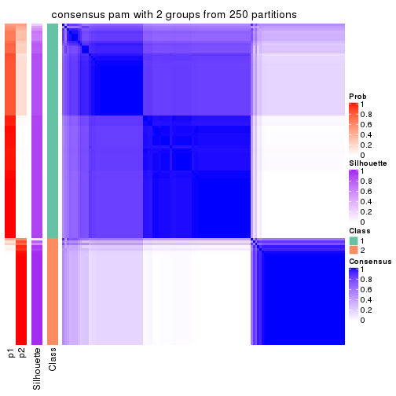</p>

</div>
<div id='tab-CV-pam-consensus-heatmap-2'>
<pre><code class="r">consensus_heatmap(res, k = 3)
</code></pre>

<p>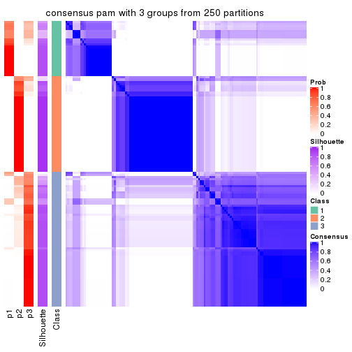</p>

</div>
<div id='tab-CV-pam-consensus-heatmap-3'>
<pre><code class="r">consensus_heatmap(res, k = 4)
</code></pre>

<p>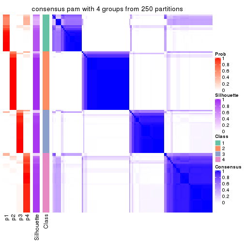</p>

</div>
<div id='tab-CV-pam-consensus-heatmap-4'>
<pre><code class="r">consensus_heatmap(res, k = 5)
</code></pre>

<p>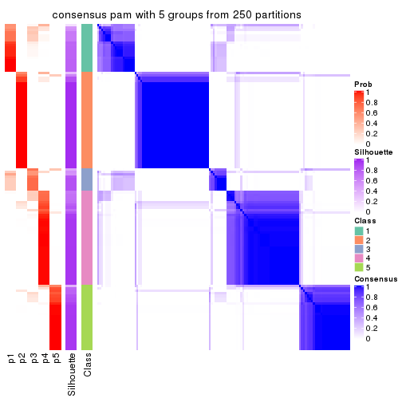</p>

</div>
<div id='tab-CV-pam-consensus-heatmap-5'>
<pre><code class="r">consensus_heatmap(res, k = 6)
</code></pre>

<p>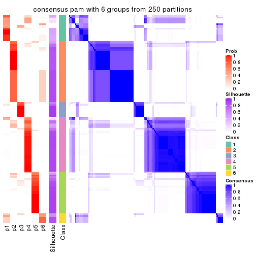</p>

</div>
</div>

Heatmaps for the membership of samples in all partitions to see how consistent they are:


<script>
$( function() {
	$( '#tabs-CV-pam-membership-heatmap' ).tabs();
} );
</script>
<div id='tabs-CV-pam-membership-heatmap'>
<ul>
<li><a href='#tab-CV-pam-membership-heatmap-1'>k = 2</a></li>
<li><a href='#tab-CV-pam-membership-heatmap-2'>k = 3</a></li>
<li><a href='#tab-CV-pam-membership-heatmap-3'>k = 4</a></li>
<li><a href='#tab-CV-pam-membership-heatmap-4'>k = 5</a></li>
<li><a href='#tab-CV-pam-membership-heatmap-5'>k = 6</a></li>
</ul>
<div id='tab-CV-pam-membership-heatmap-1'>
<pre><code class="r">membership_heatmap(res, k = 2)
</code></pre>

<p>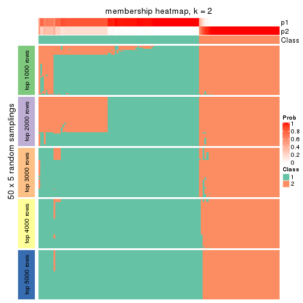</p>

</div>
<div id='tab-CV-pam-membership-heatmap-2'>
<pre><code class="r">membership_heatmap(res, k = 3)
</code></pre>

<p>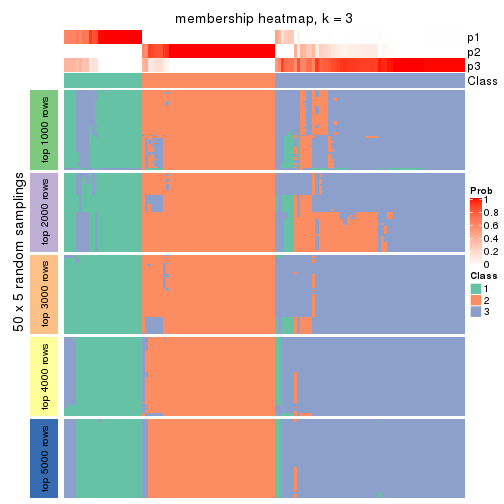</p>

</div>
<div id='tab-CV-pam-membership-heatmap-3'>
<pre><code class="r">membership_heatmap(res, k = 4)
</code></pre>

<p>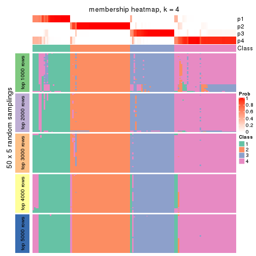</p>

</div>
<div id='tab-CV-pam-membership-heatmap-4'>
<pre><code class="r">membership_heatmap(res, k = 5)
</code></pre>

<p>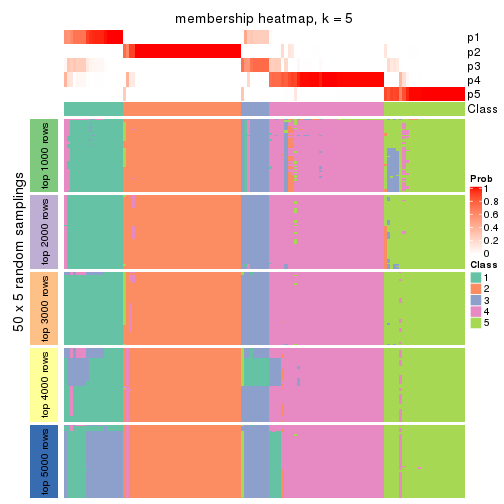</p>

</div>
<div id='tab-CV-pam-membership-heatmap-5'>
<pre><code class="r">membership_heatmap(res, k = 6)
</code></pre>

<p>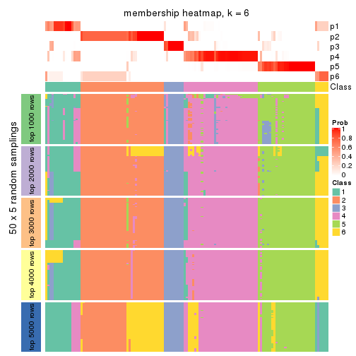</p>

</div>
</div>

As soon as we have had the classes for columns, we can look for signatures
which are significantly different between classes which can be candidate marks
for certain classes. Following are the heatmaps for signatures.


Signature heatmaps where rows are scaled:


<script>
$( function() {
	$( '#tabs-CV-pam-get-signatures' ).tabs();
} );
</script>
<div id='tabs-CV-pam-get-signatures'>
<ul>
<li><a href='#tab-CV-pam-get-signatures-1'>k = 2</a></li>
<li><a href='#tab-CV-pam-get-signatures-2'>k = 3</a></li>
<li><a href='#tab-CV-pam-get-signatures-3'>k = 4</a></li>
<li><a href='#tab-CV-pam-get-signatures-4'>k = 5</a></li>
<li><a href='#tab-CV-pam-get-signatures-5'>k = 6</a></li>
</ul>
<div id='tab-CV-pam-get-signatures-1'>
<pre><code class="r">get_signatures(res, k = 2)
</code></pre>

<p>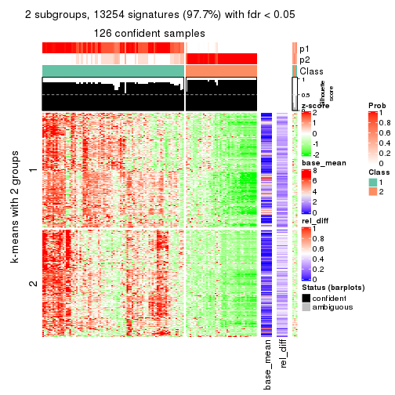</p>

</div>
<div id='tab-CV-pam-get-signatures-2'>
<pre><code class="r">get_signatures(res, k = 3)
</code></pre>

<p>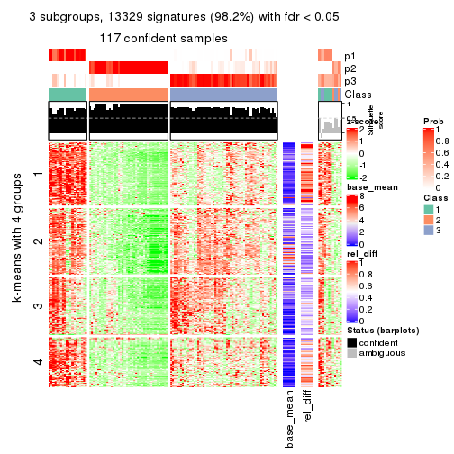</p>

</div>
<div id='tab-CV-pam-get-signatures-3'>
<pre><code class="r">get_signatures(res, k = 4)
</code></pre>

<p>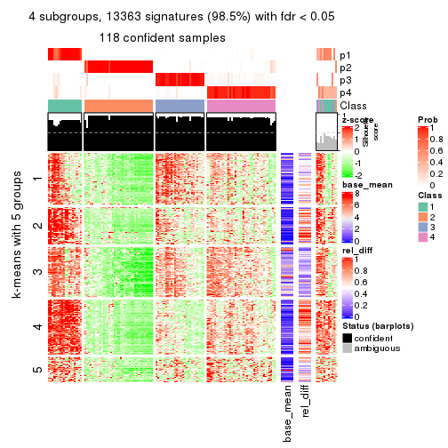</p>

</div>
<div id='tab-CV-pam-get-signatures-4'>
<pre><code class="r">get_signatures(res, k = 5)
</code></pre>

<p>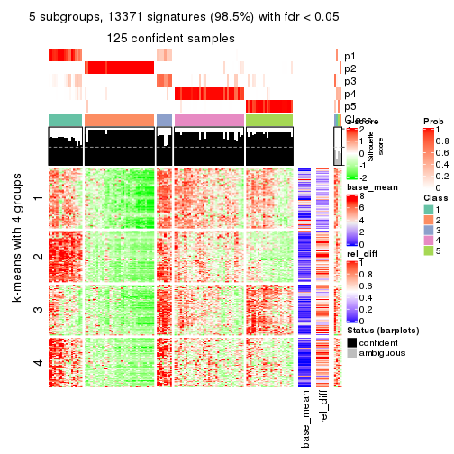</p>

</div>
<div id='tab-CV-pam-get-signatures-5'>
<pre><code class="r">get_signatures(res, k = 6)
</code></pre>

<p>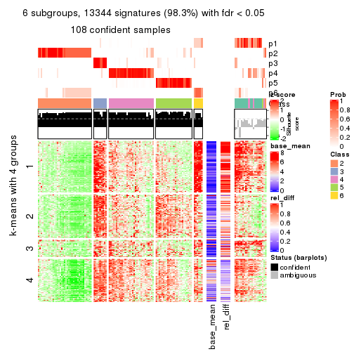</p>

</div>
</div>


Signature heatmaps where rows are not scaled:


<script>
$( function() {
	$( '#tabs-CV-pam-get-signatures-no-scale' ).tabs();
} );
</script>
<div id='tabs-CV-pam-get-signatures-no-scale'>
<ul>
<li><a href='#tab-CV-pam-get-signatures-no-scale-1'>k = 2</a></li>
<li><a href='#tab-CV-pam-get-signatures-no-scale-2'>k = 3</a></li>
<li><a href='#tab-CV-pam-get-signatures-no-scale-3'>k = 4</a></li>
<li><a href='#tab-CV-pam-get-signatures-no-scale-4'>k = 5</a></li>
<li><a href='#tab-CV-pam-get-signatures-no-scale-5'>k = 6</a></li>
</ul>
<div id='tab-CV-pam-get-signatures-no-scale-1'>
<pre><code class="r">get_signatures(res, k = 2, scale_rows = FALSE)
</code></pre>

<p>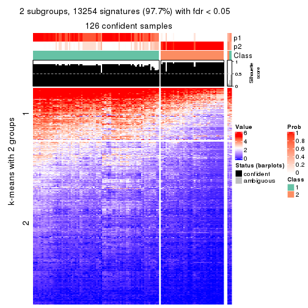</p>

</div>
<div id='tab-CV-pam-get-signatures-no-scale-2'>
<pre><code class="r">get_signatures(res, k = 3, scale_rows = FALSE)
</code></pre>

<p>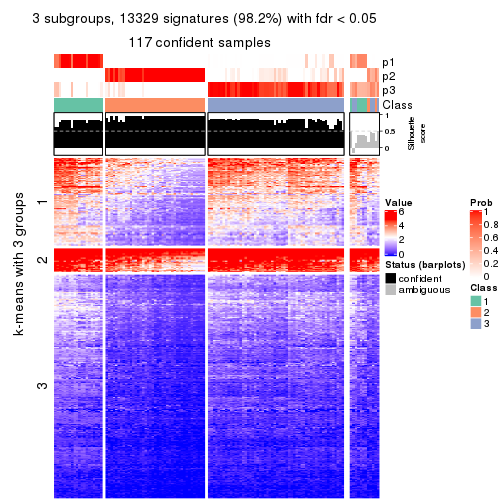</p>

</div>
<div id='tab-CV-pam-get-signatures-no-scale-3'>
<pre><code class="r">get_signatures(res, k = 4, scale_rows = FALSE)
</code></pre>

<p>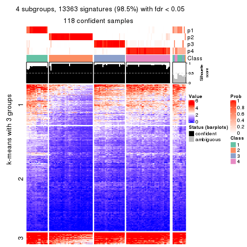</p>

</div>
<div id='tab-CV-pam-get-signatures-no-scale-4'>
<pre><code class="r">get_signatures(res, k = 5, scale_rows = FALSE)
</code></pre>

<p>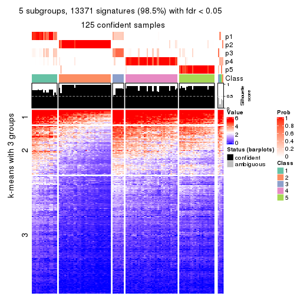</p>

</div>
<div id='tab-CV-pam-get-signatures-no-scale-5'>
<pre><code class="r">get_signatures(res, k = 6, scale_rows = FALSE)
</code></pre>

<p>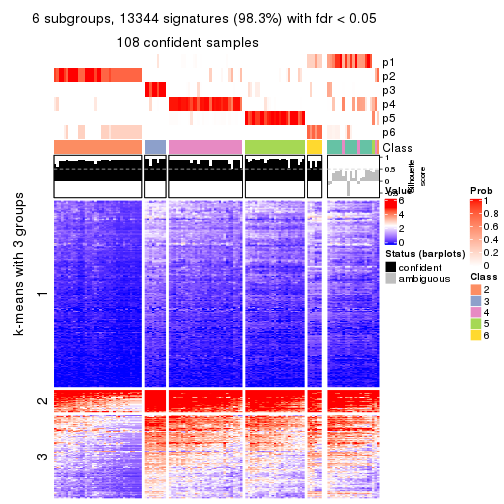</p>

</div>
</div>


Compare the overlap of signatures from different k:

```r
compare_signatures(res)
```

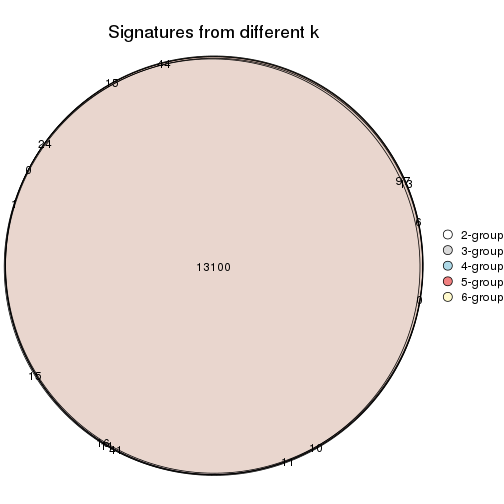

`get_signature()` returns a data frame invisibly. TO get the list of signatures, the function
call should be assigned to a variable explicitly. In following code, if `plot` argument is set
to `FALSE`, no heatmap is plotted while only the differential analysis is performed.

```r
# code only for demonstration
tb = get_signature(res, k = ..., plot = FALSE)
```

An example of the output of `tb` is:

```
#>   which_row         fdr    mean_1    mean_2 scaled_mean_1 scaled_mean_2 km
#> 1        38 0.042760348  8.373488  9.131774    -0.5533452     0.5164555  1
#> 2        40 0.018707592  7.106213  8.469186    -0.6173731     0.5762149  1
#> 3        55 0.019134737 10.221463 11.207825    -0.6159697     0.5749050  1
#> 4        59 0.006059896  5.921854  7.869574    -0.6899429     0.6439467  1
#> 5        60 0.018055526  8.928898 10.211722    -0.6204761     0.5791110  1
#> 6        98 0.009384629 15.714769 14.887706     0.6635654    -0.6193277  2
...
```

The columns in `tb` are:

1. `which_row`: row indices corresponding to the input matrix.
2. `fdr`: FDR for the differential test. 
3. `mean_x`: The mean value in group x.
4. `scaled_mean_x`: The mean value in group x after rows are scaled.
5. `km`: Row groups if k-means clustering is applied to rows.


UMAP plot which shows how samples are separated.


<script>
$( function() {
	$( '#tabs-CV-pam-dimension-reduction' ).tabs();
} );
</script>
<div id='tabs-CV-pam-dimension-reduction'>
<ul>
<li><a href='#tab-CV-pam-dimension-reduction-1'>k = 2</a></li>
<li><a href='#tab-CV-pam-dimension-reduction-2'>k = 3</a></li>
<li><a href='#tab-CV-pam-dimension-reduction-3'>k = 4</a></li>
<li><a href='#tab-CV-pam-dimension-reduction-4'>k = 5</a></li>
<li><a href='#tab-CV-pam-dimension-reduction-5'>k = 6</a></li>
</ul>
<div id='tab-CV-pam-dimension-reduction-1'>
<pre><code class="r">dimension_reduction(res, k = 2, method = &quot;UMAP&quot;)
</code></pre>

<p>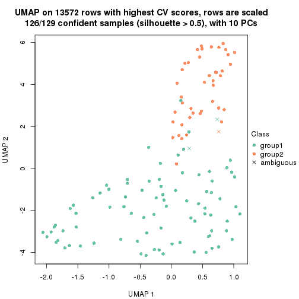</p>

</div>
<div id='tab-CV-pam-dimension-reduction-2'>
<pre><code class="r">dimension_reduction(res, k = 3, method = &quot;UMAP&quot;)
</code></pre>

<p>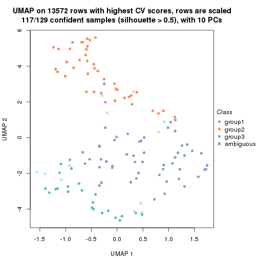</p>

</div>
<div id='tab-CV-pam-dimension-reduction-3'>
<pre><code class="r">dimension_reduction(res, k = 4, method = &quot;UMAP&quot;)
</code></pre>

<p>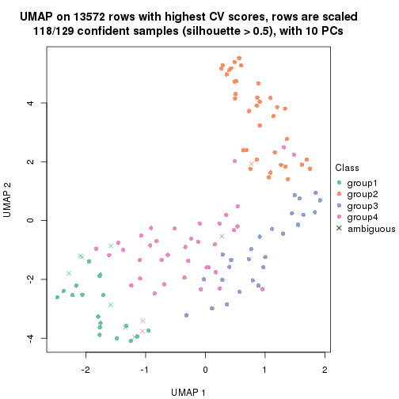</p>

</div>
<div id='tab-CV-pam-dimension-reduction-4'>
<pre><code class="r">dimension_reduction(res, k = 5, method = &quot;UMAP&quot;)
</code></pre>

<p>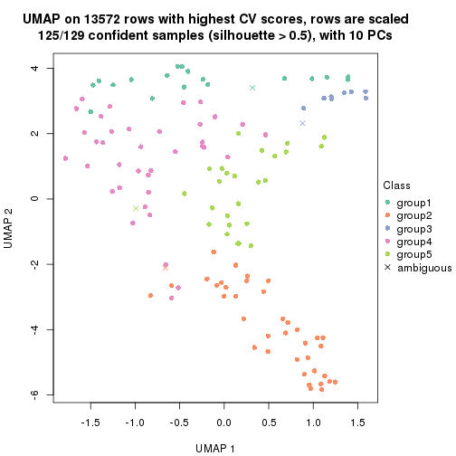</p>

</div>
<div id='tab-CV-pam-dimension-reduction-5'>
<pre><code class="r">dimension_reduction(res, k = 6, method = &quot;UMAP&quot;)
</code></pre>

<p>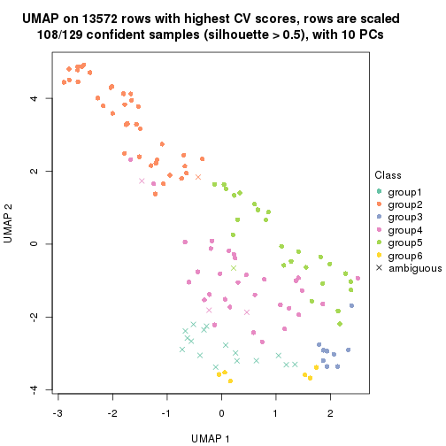</p>

</div>
</div>


Following heatmap shows how subgroups are split when increasing `k`:

```r
collect_classes(res)
```

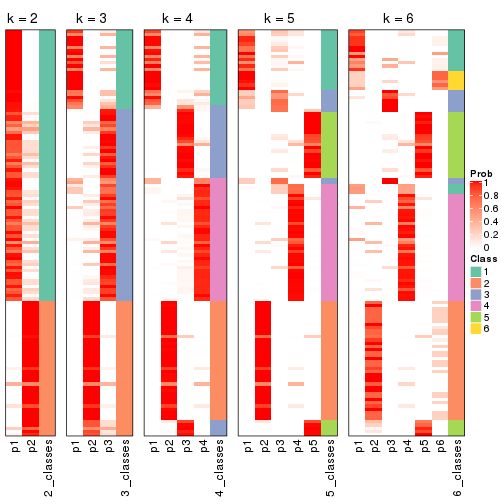


If matrix rows can be associated to genes, consider to use `GO_Enrichment(res,
...)` to perform function enrichment for the signature genes.


 

---------------------------------------------------


### CV:mclust*


The object with results only for a single top-value method and a single partition method 
can be extracted as:

```r
res = res_list["CV", "mclust"]
# you can also extract it by
# res = res_list["CV:mclust"]
```

A summary of `res` and all the functions that can be applied to it:

```r
res
```

```
#> A 'ConsensusPartition' object with k = 2, 3, 4, 5, 6.
#>   On a matrix with 13572 rows and 129 columns.
#>   Top rows (1000, 2000, 3000, 4000, 5000) are extracted by 'CV' method.
#>   Subgroups are detected by 'mclust' method.
#>   Performed in total 1250 partitions by row resampling.
#>   Best k for subgroups seems to be 3.
#> 
#> Following methods can be applied to this 'ConsensusPartition' object:
#>  [1] "cola_report"             "collect_classes"         "collect_plots"          
#>  [4] "collect_stats"           "colnames"                "compare_signatures"     
#>  [7] "consensus_heatmap"       "dimension_reduction"     "functional_enrichment"  
#> [10] "get_anno_col"            "get_anno"                "get_classes"            
#> [13] "get_consensus"           "get_matrix"              "get_membership"         
#> [16] "get_param"               "get_signatures"          "get_stats"              
#> [19] "is_best_k"               "is_stable_k"             "membership_heatmap"     
#> [22] "ncol"                    "nrow"                    "plot_ecdf"              
#> [25] "rownames"                "select_partition_number" "show"                   
#> [28] "suggest_best_k"          "test_to_known_factors"
```

`collect_plots()` function collects all the plots made from `res` for all `k` (number of partitions)
into one single page to provide an easy and fast comparison between different `k`.

```r
collect_plots(res)
```

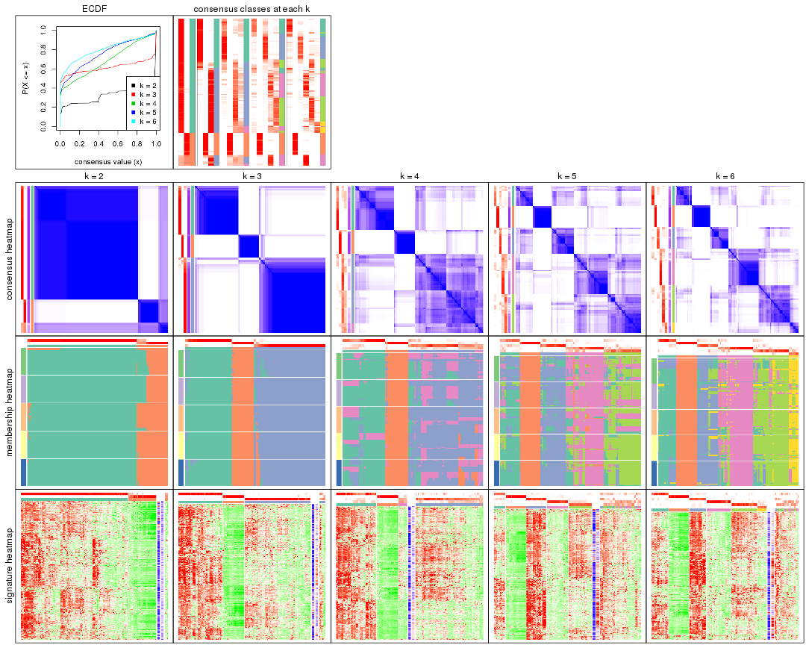

The plots are:

- The first row: a plot of the ECDF (Empirical cumulative distribution
  function) curves of the consensus matrix for each `k` and the heatmap of
  predicted classes for each `k`.
- The second row: heatmaps of the consensus matrix for each `k`.
- The third row: heatmaps of the membership matrix for each `k`.
- The fouth row: heatmaps of the signatures for each `k`.

All the plots in panels can be made by individual functions and they are
plotted later in this section.

`select_partition_number()` produces several plots showing different
statistics for choosing "optimized" `k`. There are following statistics:

- ECDF curves of the consensus matrix for each `k`;
- 1-PAC. [The PAC
  score](https://en.wikipedia.org/wiki/Consensus_clustering#Over-interpretation_potential_of_consensus_clustering)
  measures the proportion of the ambiguous subgrouping.
- Mean silhouette score.
- Concordance. The mean probability of fiting the consensus class ids in all
  partitions.
- Area increased. Denote $A_k$ as the area under the ECDF curve for current
  `k`, the area increased is defined as $A_k - A_{k-1}$.
- Rand index. The percent of pairs of samples that are both in a same cluster
  or both are not in a same cluster in the partition of k and k-1.
- Jaccard index. The ratio of pairs of samples are both in a same cluster in
  the partition of k and k-1 and the pairs of samples are both in a same
  cluster in the partition k or k-1.

The detailed explanations of these statistics can be found in [the cola
vignette](http://bioconductor.org/packages/devel/bioc/vignettes/cola/inst/doc/cola.html#toc_13).

Generally speaking, lower PAC score, higher mean silhouette score or higher
concordance corresponds to better partition. Rand index and Jaccard index
measure how similar the current partition is compared to partition with `k-1`.
If they are too similar, we won't accept `k` is better than `k-1`.

```r
select_partition_number(res)
```

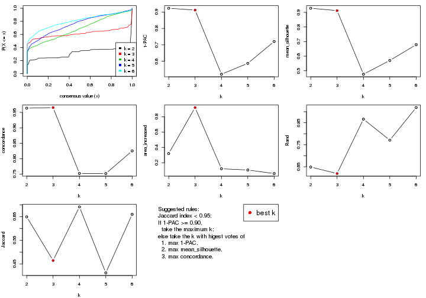

The numeric values for all these statistics can be obtained by `get_stats()`.

```r
get_stats(res)
```

```
#>   k 1-PAC mean_silhouette concordance area_increased  Rand Jaccard
#> 2 2 0.923           0.928       0.964         0.3198 0.649   0.649
#> 3 3 0.912           0.912       0.965         0.9185 0.619   0.464
#> 4 4 0.521           0.477       0.752         0.1214 0.866   0.691
#> 5 5 0.587           0.571       0.752         0.1054 0.771   0.412
#> 6 6 0.720           0.679       0.825         0.0589 0.919   0.660
```

`suggest_best_k()` suggests the best $k$ based on these statistics. The rules are as follows:

- All $k$ with Jaccard index larger than 0.95 are removed because the increase of
  the partition number does not provides enough extra information. If all $k$ are removed,
  the best $k$ is assigned by `NA`.
- For $k$ with 1-PAC larger than 0.9, the maximal $k$ is taken as the "best k". Other $k$ is called "optional k".
- If it does not fit the second rule. The $k$ with the highest vote of highest
  1-PAC, mean silhouette and concordance is taken as the "best k".

```r
suggest_best_k(res)
```

```
#> [1] 3
#> attr(,"optional")
#> [1] 2
```

There is also optional best $k$ = 2 that is worth to check.

Following shows the table of the partitions (You need to click the **show/hide
code output** link to see it). The membership matrix (columns with name `p*`)
is inferred by
[`clue::cl_consensus()`](https://www.rdocumentation.org/link/cl_consensus?package=clue)
function with the `SE` method. Basically the value in the membership matrix
represents the probability to belong to a certain group. The finall class
label for an item is determined with the group with highest probability it
belongs to.

In `get_classes()` function, the entropy is calculated from the membership
matrix and the silhouette score is calculated from the consensus matrix.


<script>
$( function() {
	$( '#tabs-CV-mclust-get-classes' ).tabs();
} );
</script>
<div id='tabs-CV-mclust-get-classes'>
<ul>
<li><a href='#tab-CV-mclust-get-classes-1'>k = 2</a></li>
<li><a href='#tab-CV-mclust-get-classes-2'>k = 3</a></li>
<li><a href='#tab-CV-mclust-get-classes-3'>k = 4</a></li>
<li><a href='#tab-CV-mclust-get-classes-4'>k = 5</a></li>
<li><a href='#tab-CV-mclust-get-classes-5'>k = 6</a></li>
</ul>

<div id='tab-CV-mclust-get-classes-1'>
<p><a id='tab-CV-mclust-get-classes-1-a' style='color:#0366d6' href='#'>show/hide code output</a></p>
<pre><code class="r">cbind(get_classes(res, k = 2), get_membership(res, k = 2))
</code></pre>

<pre><code>#&gt;            class entropy silhouette    p1    p2
#&gt; SRR1656463     2  0.0000      0.856 0.000 1.000
#&gt; SRR1656464     1  0.0000      0.990 1.000 0.000
#&gt; SRR1656462     1  0.0000      0.990 1.000 0.000
#&gt; SRR1656465     1  0.1184      0.982 0.984 0.016
#&gt; SRR1656467     2  0.9732      0.503 0.404 0.596
#&gt; SRR1656466     1  0.0000      0.990 1.000 0.000
#&gt; SRR1656468     1  0.1184      0.982 0.984 0.016
#&gt; SRR1656472     1  0.0000      0.990 1.000 0.000
#&gt; SRR1656471     1  0.1184      0.982 0.984 0.016
#&gt; SRR1656470     2  0.0000      0.856 0.000 1.000
#&gt; SRR1656469     1  0.1184      0.982 0.984 0.016
#&gt; SRR1656473     2  0.0000      0.856 0.000 1.000
#&gt; SRR1656474     2  0.0000      0.856 0.000 1.000
#&gt; SRR1656475     2  0.0000      0.856 0.000 1.000
#&gt; SRR1656478     1  0.0000      0.990 1.000 0.000
#&gt; SRR1656477     1  0.1184      0.982 0.984 0.016
#&gt; SRR1656479     1  0.0000      0.990 1.000 0.000
#&gt; SRR1656480     1  0.1184      0.982 0.984 0.016
#&gt; SRR1656476     2  0.0000      0.856 0.000 1.000
#&gt; SRR1656481     1  0.1184      0.982 0.984 0.016
#&gt; SRR1656482     2  0.8909      0.631 0.308 0.692
#&gt; SRR1656483     2  0.0376      0.855 0.004 0.996
#&gt; SRR1656485     1  0.0000      0.990 1.000 0.000
#&gt; SRR1656487     1  0.1184      0.982 0.984 0.016
#&gt; SRR1656486     1  0.0938      0.984 0.988 0.012
#&gt; SRR1656488     1  0.1184      0.982 0.984 0.016
#&gt; SRR1656484     1  0.0000      0.990 1.000 0.000
#&gt; SRR1656489     1  0.0000      0.990 1.000 0.000
#&gt; SRR1656491     1  0.1184      0.982 0.984 0.016
#&gt; SRR1656490     1  0.1184      0.982 0.984 0.016
#&gt; SRR1656492     1  0.0000      0.990 1.000 0.000
#&gt; SRR1656493     1  0.0000      0.990 1.000 0.000
#&gt; SRR1656495     1  0.0000      0.990 1.000 0.000
#&gt; SRR1656496     1  0.0000      0.990 1.000 0.000
#&gt; SRR1656494     1  0.0000      0.990 1.000 0.000
#&gt; SRR1656497     2  0.0000      0.856 0.000 1.000
#&gt; SRR1656499     1  0.0000      0.990 1.000 0.000
#&gt; SRR1656500     1  0.0000      0.990 1.000 0.000
#&gt; SRR1656501     1  0.0376      0.988 0.996 0.004
#&gt; SRR1656498     1  0.0000      0.990 1.000 0.000
#&gt; SRR1656504     2  0.1843      0.847 0.028 0.972
#&gt; SRR1656502     1  0.0000      0.990 1.000 0.000
#&gt; SRR1656503     1  0.0000      0.990 1.000 0.000
#&gt; SRR1656507     1  0.0000      0.990 1.000 0.000
#&gt; SRR1656508     1  0.0000      0.990 1.000 0.000
#&gt; SRR1656505     1  0.1184      0.982 0.984 0.016
#&gt; SRR1656506     1  0.0000      0.990 1.000 0.000
#&gt; SRR1656509     1  0.0000      0.990 1.000 0.000
#&gt; SRR1656510     1  0.1184      0.982 0.984 0.016
#&gt; SRR1656511     2  0.9732      0.503 0.404 0.596
#&gt; SRR1656513     2  0.9775      0.486 0.412 0.588
#&gt; SRR1656512     2  0.0000      0.856 0.000 1.000
#&gt; SRR1656514     1  0.0000      0.990 1.000 0.000
#&gt; SRR1656515     1  0.1414      0.979 0.980 0.020
#&gt; SRR1656516     1  0.0000      0.990 1.000 0.000
#&gt; SRR1656518     1  0.0000      0.990 1.000 0.000
#&gt; SRR1656517     1  0.0000      0.990 1.000 0.000
#&gt; SRR1656519     1  0.0000      0.990 1.000 0.000
#&gt; SRR1656522     1  0.0000      0.990 1.000 0.000
#&gt; SRR1656523     1  0.0000      0.990 1.000 0.000
#&gt; SRR1656521     2  0.0000      0.856 0.000 1.000
#&gt; SRR1656520     1  0.0000      0.990 1.000 0.000
#&gt; SRR1656524     1  0.0000      0.990 1.000 0.000
#&gt; SRR1656525     1  0.0000      0.990 1.000 0.000
#&gt; SRR1656526     2  0.0000      0.856 0.000 1.000
#&gt; SRR1656527     2  0.9815      0.483 0.420 0.580
#&gt; SRR1656530     1  0.1184      0.982 0.984 0.016
#&gt; SRR1656529     1  0.0000      0.990 1.000 0.000
#&gt; SRR1656531     1  0.0000      0.990 1.000 0.000
#&gt; SRR1656528     1  0.0000      0.990 1.000 0.000
#&gt; SRR1656534     1  0.0000      0.990 1.000 0.000
#&gt; SRR1656533     1  0.0000      0.990 1.000 0.000
#&gt; SRR1656536     1  0.1184      0.982 0.984 0.016
#&gt; SRR1656532     1  0.0000      0.990 1.000 0.000
#&gt; SRR1656537     1  0.0000      0.990 1.000 0.000
#&gt; SRR1656538     1  0.0000      0.990 1.000 0.000
#&gt; SRR1656535     2  0.0000      0.856 0.000 1.000
#&gt; SRR1656539     1  0.1184      0.982 0.984 0.016
#&gt; SRR1656544     1  0.0000      0.990 1.000 0.000
#&gt; SRR1656542     1  0.0000      0.990 1.000 0.000
#&gt; SRR1656543     1  0.0000      0.990 1.000 0.000
#&gt; SRR1656545     2  0.0000      0.856 0.000 1.000
#&gt; SRR1656540     1  0.0000      0.990 1.000 0.000
#&gt; SRR1656546     1  0.0000      0.990 1.000 0.000
#&gt; SRR1656541     2  0.0000      0.856 0.000 1.000
#&gt; SRR1656547     1  0.1843      0.971 0.972 0.028
#&gt; SRR1656548     1  0.0000      0.990 1.000 0.000
#&gt; SRR1656549     1  0.0000      0.990 1.000 0.000
#&gt; SRR1656551     1  0.1184      0.982 0.984 0.016
#&gt; SRR1656553     1  0.0000      0.990 1.000 0.000
#&gt; SRR1656550     1  0.1184      0.982 0.984 0.016
#&gt; SRR1656552     2  0.9732      0.503 0.404 0.596
#&gt; SRR1656554     1  0.0000      0.990 1.000 0.000
#&gt; SRR1656555     1  0.1184      0.982 0.984 0.016
#&gt; SRR1656556     1  0.0000      0.990 1.000 0.000
#&gt; SRR1656557     1  0.0000      0.990 1.000 0.000
#&gt; SRR1656558     1  0.0000      0.990 1.000 0.000
#&gt; SRR1656559     1  0.0000      0.990 1.000 0.000
#&gt; SRR1656560     1  0.1184      0.982 0.984 0.016
#&gt; SRR1656561     1  0.0000      0.990 1.000 0.000
#&gt; SRR1656562     1  0.4815      0.874 0.896 0.104
#&gt; SRR1656563     1  0.0000      0.990 1.000 0.000
#&gt; SRR1656564     2  0.9732      0.503 0.404 0.596
#&gt; SRR1656565     1  0.4815      0.874 0.896 0.104
#&gt; SRR1656566     1  0.0000      0.990 1.000 0.000
#&gt; SRR1656568     2  0.9710      0.510 0.400 0.600
#&gt; SRR1656567     1  0.1184      0.982 0.984 0.016
#&gt; SRR1656569     1  0.0672      0.986 0.992 0.008
#&gt; SRR1656570     1  0.0000      0.990 1.000 0.000
#&gt; SRR1656571     2  0.0000      0.856 0.000 1.000
#&gt; SRR1656573     1  0.1184      0.982 0.984 0.016
#&gt; SRR1656572     1  0.6712      0.755 0.824 0.176
#&gt; SRR1656574     1  0.0000      0.990 1.000 0.000
#&gt; SRR1656575     1  0.0000      0.990 1.000 0.000
#&gt; SRR1656576     2  0.4022      0.823 0.080 0.920
#&gt; SRR1656578     1  0.0000      0.990 1.000 0.000
#&gt; SRR1656577     1  0.0000      0.990 1.000 0.000
#&gt; SRR1656579     2  1.0000      0.245 0.496 0.504
#&gt; SRR1656580     1  0.0000      0.990 1.000 0.000
#&gt; SRR1656581     1  0.0000      0.990 1.000 0.000
#&gt; SRR1656582     2  0.4431      0.816 0.092 0.908
#&gt; SRR1656585     1  0.1184      0.982 0.984 0.016
#&gt; SRR1656584     1  0.0000      0.990 1.000 0.000
#&gt; SRR1656583     1  0.0000      0.990 1.000 0.000
#&gt; SRR1656586     2  0.0000      0.856 0.000 1.000
#&gt; SRR1656587     1  0.0000      0.990 1.000 0.000
#&gt; SRR1656588     1  0.1184      0.982 0.984 0.016
#&gt; SRR1656589     2  0.0000      0.856 0.000 1.000
#&gt; SRR1656590     1  0.0000      0.990 1.000 0.000
</code></pre>

<script>
$('#tab-CV-mclust-get-classes-1-a').parent().next().next().hide();
$('#tab-CV-mclust-get-classes-1-a').click(function(){
  $('#tab-CV-mclust-get-classes-1-a').parent().next().next().toggle();
  return(false);
});
</script>
</div>

<div id='tab-CV-mclust-get-classes-2'>
<p><a id='tab-CV-mclust-get-classes-2-a' style='color:#0366d6' href='#'>show/hide code output</a></p>
<pre><code class="r">cbind(get_classes(res, k = 3), get_membership(res, k = 3))
</code></pre>

<pre><code>#&gt;            class entropy silhouette    p1    p2    p3
#&gt; SRR1656463     2  0.0000     0.9871 0.000 1.000 0.000
#&gt; SRR1656464     1  0.0000     0.9574 1.000 0.000 0.000
#&gt; SRR1656462     1  0.0000     0.9574 1.000 0.000 0.000
#&gt; SRR1656465     3  0.0000     0.9523 0.000 0.000 1.000
#&gt; SRR1656467     3  0.0000     0.9523 0.000 0.000 1.000
#&gt; SRR1656466     3  0.0000     0.9523 0.000 0.000 1.000
#&gt; SRR1656468     3  0.0000     0.9523 0.000 0.000 1.000
#&gt; SRR1656472     1  0.0000     0.9574 1.000 0.000 0.000
#&gt; SRR1656471     1  0.3482     0.8187 0.872 0.000 0.128
#&gt; SRR1656470     2  0.0000     0.9871 0.000 1.000 0.000
#&gt; SRR1656469     3  0.0000     0.9523 0.000 0.000 1.000
#&gt; SRR1656473     2  0.0000     0.9871 0.000 1.000 0.000
#&gt; SRR1656474     2  0.0000     0.9871 0.000 1.000 0.000
#&gt; SRR1656475     2  0.0000     0.9871 0.000 1.000 0.000
#&gt; SRR1656478     1  0.1163     0.9362 0.972 0.000 0.028
#&gt; SRR1656477     3  0.0000     0.9523 0.000 0.000 1.000
#&gt; SRR1656479     3  0.0000     0.9523 0.000 0.000 1.000
#&gt; SRR1656480     3  0.0000     0.9523 0.000 0.000 1.000
#&gt; SRR1656476     2  0.0000     0.9871 0.000 1.000 0.000
#&gt; SRR1656481     3  0.0000     0.9523 0.000 0.000 1.000
#&gt; SRR1656482     3  0.6235     0.2389 0.000 0.436 0.564
#&gt; SRR1656483     2  0.0000     0.9871 0.000 1.000 0.000
#&gt; SRR1656485     3  0.0000     0.9523 0.000 0.000 1.000
#&gt; SRR1656487     3  0.1411     0.9234 0.036 0.000 0.964
#&gt; SRR1656486     3  0.0000     0.9523 0.000 0.000 1.000
#&gt; SRR1656488     1  0.6079     0.3825 0.612 0.000 0.388
#&gt; SRR1656484     3  0.2356     0.8899 0.072 0.000 0.928
#&gt; SRR1656489     1  0.0747     0.9463 0.984 0.000 0.016
#&gt; SRR1656491     3  0.0000     0.9523 0.000 0.000 1.000
#&gt; SRR1656490     3  0.0000     0.9523 0.000 0.000 1.000
#&gt; SRR1656492     3  0.0000     0.9523 0.000 0.000 1.000
#&gt; SRR1656493     1  0.0000     0.9574 1.000 0.000 0.000
#&gt; SRR1656495     1  0.0000     0.9574 1.000 0.000 0.000
#&gt; SRR1656496     3  0.0000     0.9523 0.000 0.000 1.000
#&gt; SRR1656494     3  0.3482     0.8330 0.128 0.000 0.872
#&gt; SRR1656497     2  0.0000     0.9871 0.000 1.000 0.000
#&gt; SRR1656499     1  0.0424     0.9519 0.992 0.000 0.008
#&gt; SRR1656500     1  0.0000     0.9574 1.000 0.000 0.000
#&gt; SRR1656501     3  0.0000     0.9523 0.000 0.000 1.000
#&gt; SRR1656498     1  0.0000     0.9574 1.000 0.000 0.000
#&gt; SRR1656504     2  0.0000     0.9871 0.000 1.000 0.000
#&gt; SRR1656502     1  0.0000     0.9574 1.000 0.000 0.000
#&gt; SRR1656503     3  0.0424     0.9461 0.008 0.000 0.992
#&gt; SRR1656507     3  0.6307     0.0203 0.488 0.000 0.512
#&gt; SRR1656508     1  0.0000     0.9574 1.000 0.000 0.000
#&gt; SRR1656505     3  0.0000     0.9523 0.000 0.000 1.000
#&gt; SRR1656506     3  0.0000     0.9523 0.000 0.000 1.000
#&gt; SRR1656509     1  0.1289     0.9313 0.968 0.000 0.032
#&gt; SRR1656510     3  0.0000     0.9523 0.000 0.000 1.000
#&gt; SRR1656511     3  0.5291     0.6265 0.000 0.268 0.732
#&gt; SRR1656513     3  0.0000     0.9523 0.000 0.000 1.000
#&gt; SRR1656512     2  0.0000     0.9871 0.000 1.000 0.000
#&gt; SRR1656514     1  0.0000     0.9574 1.000 0.000 0.000
#&gt; SRR1656515     3  0.0000     0.9523 0.000 0.000 1.000
#&gt; SRR1656516     3  0.0000     0.9523 0.000 0.000 1.000
#&gt; SRR1656518     3  0.6026     0.3893 0.376 0.000 0.624
#&gt; SRR1656517     1  0.0000     0.9574 1.000 0.000 0.000
#&gt; SRR1656519     1  0.0000     0.9574 1.000 0.000 0.000
#&gt; SRR1656522     1  0.0000     0.9574 1.000 0.000 0.000
#&gt; SRR1656523     3  0.0000     0.9523 0.000 0.000 1.000
#&gt; SRR1656521     2  0.0000     0.9871 0.000 1.000 0.000
#&gt; SRR1656520     1  0.0000     0.9574 1.000 0.000 0.000
#&gt; SRR1656524     1  0.0000     0.9574 1.000 0.000 0.000
#&gt; SRR1656525     3  0.0000     0.9523 0.000 0.000 1.000
#&gt; SRR1656526     2  0.0000     0.9871 0.000 1.000 0.000
#&gt; SRR1656527     3  0.0000     0.9523 0.000 0.000 1.000
#&gt; SRR1656530     3  0.0000     0.9523 0.000 0.000 1.000
#&gt; SRR1656529     3  0.0000     0.9523 0.000 0.000 1.000
#&gt; SRR1656531     1  0.0000     0.9574 1.000 0.000 0.000
#&gt; SRR1656528     3  0.1529     0.9197 0.040 0.000 0.960
#&gt; SRR1656534     1  0.0000     0.9574 1.000 0.000 0.000
#&gt; SRR1656533     1  0.0000     0.9574 1.000 0.000 0.000
#&gt; SRR1656536     3  0.0000     0.9523 0.000 0.000 1.000
#&gt; SRR1656532     3  0.3340     0.8409 0.120 0.000 0.880
#&gt; SRR1656537     1  0.0000     0.9574 1.000 0.000 0.000
#&gt; SRR1656538     1  0.6168     0.3152 0.588 0.000 0.412
#&gt; SRR1656535     2  0.0000     0.9871 0.000 1.000 0.000
#&gt; SRR1656539     3  0.0000     0.9523 0.000 0.000 1.000
#&gt; SRR1656544     3  0.0000     0.9523 0.000 0.000 1.000
#&gt; SRR1656542     1  0.0592     0.9493 0.988 0.000 0.012
#&gt; SRR1656543     1  0.0000     0.9574 1.000 0.000 0.000
#&gt; SRR1656545     2  0.0000     0.9871 0.000 1.000 0.000
#&gt; SRR1656540     1  0.0000     0.9574 1.000 0.000 0.000
#&gt; SRR1656546     3  0.0000     0.9523 0.000 0.000 1.000
#&gt; SRR1656541     2  0.0000     0.9871 0.000 1.000 0.000
#&gt; SRR1656547     3  0.0000     0.9523 0.000 0.000 1.000
#&gt; SRR1656548     3  0.0000     0.9523 0.000 0.000 1.000
#&gt; SRR1656549     3  0.1289     0.9269 0.032 0.000 0.968
#&gt; SRR1656551     3  0.0000     0.9523 0.000 0.000 1.000
#&gt; SRR1656553     1  0.4887     0.6912 0.772 0.000 0.228
#&gt; SRR1656550     3  0.0000     0.9523 0.000 0.000 1.000
#&gt; SRR1656552     3  0.0000     0.9523 0.000 0.000 1.000
#&gt; SRR1656554     3  0.0000     0.9523 0.000 0.000 1.000
#&gt; SRR1656555     3  0.0000     0.9523 0.000 0.000 1.000
#&gt; SRR1656556     1  0.0000     0.9574 1.000 0.000 0.000
#&gt; SRR1656557     1  0.0000     0.9574 1.000 0.000 0.000
#&gt; SRR1656558     1  0.0000     0.9574 1.000 0.000 0.000
#&gt; SRR1656559     1  0.0000     0.9574 1.000 0.000 0.000
#&gt; SRR1656560     3  0.0000     0.9523 0.000 0.000 1.000
#&gt; SRR1656561     3  0.0000     0.9523 0.000 0.000 1.000
#&gt; SRR1656562     3  0.0000     0.9523 0.000 0.000 1.000
#&gt; SRR1656563     1  0.0000     0.9574 1.000 0.000 0.000
#&gt; SRR1656564     3  0.4654     0.7225 0.000 0.208 0.792
#&gt; SRR1656565     3  0.0000     0.9523 0.000 0.000 1.000
#&gt; SRR1656566     1  0.0000     0.9574 1.000 0.000 0.000
#&gt; SRR1656568     3  0.6244     0.2257 0.000 0.440 0.560
#&gt; SRR1656567     3  0.0000     0.9523 0.000 0.000 1.000
#&gt; SRR1656569     3  0.0000     0.9523 0.000 0.000 1.000
#&gt; SRR1656570     1  0.1643     0.9214 0.956 0.000 0.044
#&gt; SRR1656571     2  0.0000     0.9871 0.000 1.000 0.000
#&gt; SRR1656573     3  0.0000     0.9523 0.000 0.000 1.000
#&gt; SRR1656572     3  0.0000     0.9523 0.000 0.000 1.000
#&gt; SRR1656574     1  0.0000     0.9574 1.000 0.000 0.000
#&gt; SRR1656575     3  0.0000     0.9523 0.000 0.000 1.000
#&gt; SRR1656576     2  0.1529     0.9472 0.000 0.960 0.040
#&gt; SRR1656578     3  0.4452     0.7571 0.192 0.000 0.808
#&gt; SRR1656577     1  0.0000     0.9574 1.000 0.000 0.000
#&gt; SRR1656579     3  0.0000     0.9523 0.000 0.000 1.000
#&gt; SRR1656580     1  0.1964     0.9101 0.944 0.000 0.056
#&gt; SRR1656581     3  0.0000     0.9523 0.000 0.000 1.000
#&gt; SRR1656582     2  0.4121     0.7902 0.000 0.832 0.168
#&gt; SRR1656585     3  0.0000     0.9523 0.000 0.000 1.000
#&gt; SRR1656584     1  0.1753     0.9174 0.952 0.000 0.048
#&gt; SRR1656583     1  0.0000     0.9574 1.000 0.000 0.000
#&gt; SRR1656586     2  0.0000     0.9871 0.000 1.000 0.000
#&gt; SRR1656587     3  0.0000     0.9523 0.000 0.000 1.000
#&gt; SRR1656588     3  0.0000     0.9523 0.000 0.000 1.000
#&gt; SRR1656589     2  0.0000     0.9871 0.000 1.000 0.000
#&gt; SRR1656590     1  0.0000     0.9574 1.000 0.000 0.000
</code></pre>

<script>
$('#tab-CV-mclust-get-classes-2-a').parent().next().next().hide();
$('#tab-CV-mclust-get-classes-2-a').click(function(){
  $('#tab-CV-mclust-get-classes-2-a').parent().next().next().toggle();
  return(false);
});
</script>
</div>

<div id='tab-CV-mclust-get-classes-3'>
<p><a id='tab-CV-mclust-get-classes-3-a' style='color:#0366d6' href='#'>show/hide code output</a></p>
<pre><code class="r">cbind(get_classes(res, k = 4), get_membership(res, k = 4))
</code></pre>

<pre><code>#&gt;            class entropy silhouette    p1    p2    p3    p4
#&gt; SRR1656463     2  0.0000     0.9485 0.000 1.000 0.000 0.000
#&gt; SRR1656464     1  0.0000     0.8234 1.000 0.000 0.000 0.000
#&gt; SRR1656462     1  0.0336     0.8236 0.992 0.000 0.008 0.000
#&gt; SRR1656465     3  0.2760     0.3081 0.000 0.000 0.872 0.128
#&gt; SRR1656467     4  0.7844     0.5368 0.000 0.264 0.368 0.368
#&gt; SRR1656466     3  0.3099     0.3978 0.104 0.000 0.876 0.020
#&gt; SRR1656468     4  0.4996     0.5846 0.000 0.000 0.484 0.516
#&gt; SRR1656472     1  0.0000     0.8234 1.000 0.000 0.000 0.000
#&gt; SRR1656471     3  0.5050     0.1747 0.408 0.000 0.588 0.004
#&gt; SRR1656470     2  0.0000     0.9485 0.000 1.000 0.000 0.000
#&gt; SRR1656469     3  0.4730    -0.0737 0.000 0.000 0.636 0.364
#&gt; SRR1656473     2  0.0000     0.9485 0.000 1.000 0.000 0.000
#&gt; SRR1656474     2  0.0000     0.9485 0.000 1.000 0.000 0.000
#&gt; SRR1656475     2  0.0000     0.9485 0.000 1.000 0.000 0.000
#&gt; SRR1656478     1  0.7544     0.5719 0.484 0.000 0.224 0.292
#&gt; SRR1656477     3  0.4643    -0.0370 0.000 0.000 0.656 0.344
#&gt; SRR1656479     3  0.4008     0.3297 0.000 0.000 0.756 0.244
#&gt; SRR1656480     4  0.4967     0.5848 0.000 0.000 0.452 0.548
#&gt; SRR1656476     2  0.0000     0.9485 0.000 1.000 0.000 0.000
#&gt; SRR1656481     3  0.4643    -0.0396 0.000 0.000 0.656 0.344
#&gt; SRR1656482     2  0.7628    -0.3619 0.000 0.440 0.212 0.348
#&gt; SRR1656483     2  0.0336     0.9421 0.000 0.992 0.000 0.008
#&gt; SRR1656485     3  0.2466     0.4096 0.096 0.000 0.900 0.004
#&gt; SRR1656487     3  0.2593     0.4066 0.104 0.000 0.892 0.004
#&gt; SRR1656486     3  0.4543     0.1929 0.000 0.000 0.676 0.324
#&gt; SRR1656488     3  0.2654     0.4044 0.108 0.000 0.888 0.004
#&gt; SRR1656484     3  0.5339     0.3512 0.272 0.000 0.688 0.040
#&gt; SRR1656489     1  0.7222     0.6286 0.528 0.000 0.172 0.300
#&gt; SRR1656491     3  0.3907     0.2745 0.000 0.000 0.768 0.232
#&gt; SRR1656490     3  0.4072     0.2359 0.000 0.000 0.748 0.252
#&gt; SRR1656492     3  0.3156     0.4231 0.068 0.000 0.884 0.048
#&gt; SRR1656493     1  0.4599     0.7743 0.736 0.000 0.016 0.248
#&gt; SRR1656495     1  0.0779     0.8242 0.980 0.000 0.004 0.016
#&gt; SRR1656496     3  0.3591     0.3528 0.008 0.000 0.824 0.168
#&gt; SRR1656494     3  0.6794     0.2832 0.328 0.000 0.556 0.116
#&gt; SRR1656497     2  0.0000     0.9485 0.000 1.000 0.000 0.000
#&gt; SRR1656499     1  0.4431     0.5283 0.696 0.000 0.304 0.000
#&gt; SRR1656500     1  0.0469     0.8233 0.988 0.000 0.012 0.000
#&gt; SRR1656501     3  0.4040     0.3263 0.000 0.000 0.752 0.248
#&gt; SRR1656498     1  0.2466     0.8137 0.900 0.000 0.004 0.096
#&gt; SRR1656504     2  0.0000     0.9485 0.000 1.000 0.000 0.000
#&gt; SRR1656502     1  0.0000     0.8234 1.000 0.000 0.000 0.000
#&gt; SRR1656503     3  0.5655     0.3719 0.212 0.000 0.704 0.084
#&gt; SRR1656507     3  0.6080     0.0253 0.468 0.000 0.488 0.044
#&gt; SRR1656508     1  0.4155     0.7801 0.756 0.000 0.004 0.240
#&gt; SRR1656505     4  0.4898     0.6255 0.000 0.000 0.416 0.584
#&gt; SRR1656506     3  0.1004     0.4029 0.024 0.000 0.972 0.004
#&gt; SRR1656509     1  0.4888     0.2207 0.588 0.000 0.412 0.000
#&gt; SRR1656510     3  0.4697    -0.0556 0.000 0.000 0.644 0.356
#&gt; SRR1656511     3  0.7681    -0.4115 0.000 0.224 0.432 0.344
#&gt; SRR1656513     3  0.6979    -0.2960 0.000 0.128 0.528 0.344
#&gt; SRR1656512     2  0.0000     0.9485 0.000 1.000 0.000 0.000
#&gt; SRR1656514     1  0.0000     0.8234 1.000 0.000 0.000 0.000
#&gt; SRR1656515     4  0.7603     0.5769 0.000 0.204 0.360 0.436
#&gt; SRR1656516     3  0.4175     0.3613 0.012 0.000 0.776 0.212
#&gt; SRR1656518     1  0.7614     0.5523 0.468 0.000 0.232 0.300
#&gt; SRR1656517     1  0.4283     0.7744 0.740 0.000 0.004 0.256
#&gt; SRR1656519     1  0.0336     0.8236 0.992 0.000 0.008 0.000
#&gt; SRR1656522     1  0.0000     0.8234 1.000 0.000 0.000 0.000
#&gt; SRR1656523     3  0.4661     0.1185 0.000 0.000 0.652 0.348
#&gt; SRR1656521     2  0.0000     0.9485 0.000 1.000 0.000 0.000
#&gt; SRR1656520     1  0.0336     0.8236 0.992 0.000 0.008 0.000
#&gt; SRR1656524     1  0.4155     0.7801 0.756 0.000 0.004 0.240
#&gt; SRR1656525     3  0.2363     0.4180 0.056 0.000 0.920 0.024
#&gt; SRR1656526     2  0.0000     0.9485 0.000 1.000 0.000 0.000
#&gt; SRR1656527     3  0.7109    -0.3071 0.000 0.144 0.520 0.336
#&gt; SRR1656530     3  0.2281     0.3639 0.000 0.000 0.904 0.096
#&gt; SRR1656529     3  0.1182     0.3943 0.016 0.000 0.968 0.016
#&gt; SRR1656531     1  0.0000     0.8234 1.000 0.000 0.000 0.000
#&gt; SRR1656528     3  0.2530     0.4084 0.100 0.000 0.896 0.004
#&gt; SRR1656534     1  0.0188     0.8239 0.996 0.000 0.004 0.000
#&gt; SRR1656533     1  0.5512     0.7396 0.660 0.000 0.040 0.300
#&gt; SRR1656536     3  0.4776    -0.1090 0.000 0.000 0.624 0.376
#&gt; SRR1656532     3  0.6835     0.2880 0.316 0.000 0.560 0.124
#&gt; SRR1656537     1  0.0000     0.8234 1.000 0.000 0.000 0.000
#&gt; SRR1656538     3  0.6007     0.2072 0.408 0.000 0.548 0.044
#&gt; SRR1656535     2  0.0000     0.9485 0.000 1.000 0.000 0.000
#&gt; SRR1656539     3  0.2466     0.3287 0.004 0.000 0.900 0.096
#&gt; SRR1656544     3  0.1902     0.4136 0.064 0.000 0.932 0.004
#&gt; SRR1656542     1  0.5646     0.5633 0.672 0.000 0.272 0.056
#&gt; SRR1656543     1  0.0336     0.8236 0.992 0.000 0.008 0.000
#&gt; SRR1656545     2  0.0000     0.9485 0.000 1.000 0.000 0.000
#&gt; SRR1656540     1  0.0336     0.8236 0.992 0.000 0.008 0.000
#&gt; SRR1656546     3  0.4250     0.2927 0.000 0.000 0.724 0.276
#&gt; SRR1656541     2  0.0000     0.9485 0.000 1.000 0.000 0.000
#&gt; SRR1656547     3  0.5099    -0.1424 0.000 0.008 0.612 0.380
#&gt; SRR1656548     3  0.1510     0.4105 0.028 0.000 0.956 0.016
#&gt; SRR1656549     3  0.6159     0.3718 0.132 0.000 0.672 0.196
#&gt; SRR1656551     4  0.4998     0.5737 0.000 0.000 0.488 0.512
#&gt; SRR1656553     3  0.4624     0.3175 0.340 0.000 0.660 0.000
#&gt; SRR1656550     3  0.4661    -0.0448 0.000 0.000 0.652 0.348
#&gt; SRR1656552     3  0.6991    -0.3065 0.000 0.128 0.524 0.348
#&gt; SRR1656554     3  0.1305     0.4086 0.036 0.000 0.960 0.004
#&gt; SRR1656555     3  0.5323    -0.0930 0.000 0.020 0.628 0.352
#&gt; SRR1656556     1  0.3172     0.6850 0.840 0.000 0.160 0.000
#&gt; SRR1656557     1  0.0336     0.8236 0.992 0.000 0.008 0.000
#&gt; SRR1656558     1  0.6720     0.6837 0.580 0.000 0.120 0.300
#&gt; SRR1656559     1  0.0000     0.8234 1.000 0.000 0.000 0.000
#&gt; SRR1656560     3  0.0921     0.3768 0.000 0.000 0.972 0.028
#&gt; SRR1656561     3  0.4248     0.3598 0.012 0.000 0.768 0.220
#&gt; SRR1656562     3  0.5682    -0.0937 0.000 0.036 0.612 0.352
#&gt; SRR1656563     1  0.7453     0.5943 0.496 0.000 0.204 0.300
#&gt; SRR1656564     3  0.7451    -0.3789 0.000 0.184 0.472 0.344
#&gt; SRR1656565     3  0.6106    -0.1320 0.000 0.060 0.592 0.348
#&gt; SRR1656566     1  0.6578     0.6959 0.592 0.000 0.108 0.300
#&gt; SRR1656568     3  0.7885    -0.4157 0.000 0.288 0.372 0.340
#&gt; SRR1656567     4  0.4996     0.5287 0.000 0.000 0.484 0.516
#&gt; SRR1656569     3  0.1211     0.3666 0.000 0.000 0.960 0.040
#&gt; SRR1656570     1  0.7572     0.5659 0.476 0.000 0.224 0.300
#&gt; SRR1656571     2  0.0000     0.9485 0.000 1.000 0.000 0.000
#&gt; SRR1656573     3  0.3907     0.2775 0.000 0.000 0.768 0.232
#&gt; SRR1656572     3  0.6156    -0.1335 0.000 0.064 0.592 0.344
#&gt; SRR1656574     1  0.4188     0.7787 0.752 0.000 0.004 0.244
#&gt; SRR1656575     3  0.4360     0.3269 0.008 0.000 0.744 0.248
#&gt; SRR1656576     2  0.4274     0.7297 0.000 0.808 0.044 0.148
#&gt; SRR1656578     3  0.6602     0.2742 0.356 0.000 0.552 0.092
#&gt; SRR1656577     1  0.0779     0.8243 0.980 0.000 0.004 0.016
#&gt; SRR1656579     4  0.7844     0.5368 0.000 0.264 0.368 0.368
#&gt; SRR1656580     3  0.6395    -0.0245 0.464 0.000 0.472 0.064
#&gt; SRR1656581     3  0.4155     0.3213 0.004 0.000 0.756 0.240
#&gt; SRR1656582     2  0.2983     0.8258 0.000 0.892 0.068 0.040
#&gt; SRR1656585     3  0.4008     0.2421 0.000 0.000 0.756 0.244
#&gt; SRR1656584     1  0.7572     0.5659 0.476 0.000 0.224 0.300
#&gt; SRR1656583     1  0.3400     0.6682 0.820 0.000 0.180 0.000
#&gt; SRR1656586     2  0.0000     0.9485 0.000 1.000 0.000 0.000
#&gt; SRR1656587     3  0.6316     0.2741 0.156 0.000 0.660 0.184
#&gt; SRR1656588     3  0.4925    -0.4048 0.000 0.000 0.572 0.428
#&gt; SRR1656589     2  0.0000     0.9485 0.000 1.000 0.000 0.000
#&gt; SRR1656590     1  0.4011     0.7892 0.784 0.000 0.008 0.208
</code></pre>

<script>
$('#tab-CV-mclust-get-classes-3-a').parent().next().next().hide();
$('#tab-CV-mclust-get-classes-3-a').click(function(){
  $('#tab-CV-mclust-get-classes-3-a').parent().next().next().toggle();
  return(false);
});
</script>
</div>

<div id='tab-CV-mclust-get-classes-4'>
<p><a id='tab-CV-mclust-get-classes-4-a' style='color:#0366d6' href='#'>show/hide code output</a></p>
<pre><code class="r">cbind(get_classes(res, k = 5), get_membership(res, k = 5))
</code></pre>

<pre><code>#&gt;            class entropy silhouette    p1    p2    p3    p4    p5
#&gt; SRR1656463     2  0.0000     0.9842 0.000 1.000 0.000 0.000 0.000
#&gt; SRR1656464     3  0.0794     0.8063 0.028 0.000 0.972 0.000 0.000
#&gt; SRR1656462     3  0.2302     0.7887 0.048 0.000 0.916 0.016 0.020
#&gt; SRR1656465     5  0.3146     0.6740 0.028 0.000 0.000 0.128 0.844
#&gt; SRR1656467     4  0.3155     0.5973 0.016 0.128 0.000 0.848 0.008
#&gt; SRR1656466     5  0.3794     0.6926 0.000 0.000 0.048 0.152 0.800
#&gt; SRR1656468     4  0.5985     0.1856 0.112 0.000 0.000 0.480 0.408
#&gt; SRR1656472     3  0.0794     0.8063 0.028 0.000 0.972 0.000 0.000
#&gt; SRR1656471     5  0.5632     0.5522 0.000 0.000 0.232 0.140 0.628
#&gt; SRR1656470     2  0.0000     0.9842 0.000 1.000 0.000 0.000 0.000
#&gt; SRR1656469     4  0.4987     0.2397 0.044 0.000 0.000 0.616 0.340
#&gt; SRR1656473     2  0.0000     0.9842 0.000 1.000 0.000 0.000 0.000
#&gt; SRR1656474     2  0.0000     0.9842 0.000 1.000 0.000 0.000 0.000
#&gt; SRR1656475     2  0.0000     0.9842 0.000 1.000 0.000 0.000 0.000
#&gt; SRR1656478     1  0.5490     0.6702 0.708 0.000 0.164 0.040 0.088
#&gt; SRR1656477     5  0.3339     0.5258 0.124 0.000 0.000 0.040 0.836
#&gt; SRR1656479     4  0.6659     0.0139 0.248 0.000 0.000 0.436 0.316
#&gt; SRR1656480     5  0.6289     0.0794 0.160 0.000 0.000 0.356 0.484
#&gt; SRR1656476     2  0.0162     0.9816 0.000 0.996 0.000 0.004 0.000
#&gt; SRR1656481     5  0.3099     0.5337 0.124 0.000 0.000 0.028 0.848
#&gt; SRR1656482     4  0.2648     0.5914 0.000 0.152 0.000 0.848 0.000
#&gt; SRR1656483     2  0.2773     0.8106 0.000 0.836 0.000 0.164 0.000
#&gt; SRR1656485     5  0.3535     0.6955 0.000 0.000 0.028 0.164 0.808
#&gt; SRR1656487     5  0.3608     0.6928 0.000 0.000 0.040 0.148 0.812
#&gt; SRR1656486     4  0.1831     0.6379 0.004 0.000 0.000 0.920 0.076
#&gt; SRR1656488     5  0.3752     0.6908 0.000 0.000 0.048 0.148 0.804
#&gt; SRR1656484     1  0.7690    -0.0380 0.384 0.000 0.092 0.148 0.376
#&gt; SRR1656489     1  0.4138     0.6746 0.780 0.000 0.148 0.000 0.072
#&gt; SRR1656491     4  0.4430    -0.0253 0.004 0.000 0.000 0.540 0.456
#&gt; SRR1656490     4  0.3906     0.3946 0.004 0.000 0.000 0.704 0.292
#&gt; SRR1656492     5  0.4412     0.6797 0.040 0.000 0.012 0.192 0.756
#&gt; SRR1656493     1  0.3913     0.5104 0.676 0.000 0.324 0.000 0.000
#&gt; SRR1656495     1  0.4242     0.3517 0.572 0.000 0.428 0.000 0.000
#&gt; SRR1656496     5  0.5285     0.4387 0.060 0.000 0.000 0.356 0.584
#&gt; SRR1656494     4  0.8184    -0.0256 0.204 0.000 0.136 0.388 0.272
#&gt; SRR1656497     2  0.0000     0.9842 0.000 1.000 0.000 0.000 0.000
#&gt; SRR1656499     5  0.5893     0.1947 0.000 0.000 0.436 0.100 0.464
#&gt; SRR1656500     3  0.3931     0.7104 0.056 0.000 0.832 0.040 0.072
#&gt; SRR1656501     4  0.6622     0.0926 0.260 0.000 0.000 0.456 0.284
#&gt; SRR1656498     3  0.3480     0.6180 0.248 0.000 0.752 0.000 0.000
#&gt; SRR1656504     2  0.0290     0.9785 0.000 0.992 0.000 0.008 0.000
#&gt; SRR1656502     3  0.0794     0.8063 0.028 0.000 0.972 0.000 0.000
#&gt; SRR1656503     1  0.7774     0.1105 0.412 0.000 0.076 0.212 0.300
#&gt; SRR1656507     1  0.7364     0.4838 0.536 0.000 0.144 0.112 0.208
#&gt; SRR1656508     3  0.4302     0.1042 0.480 0.000 0.520 0.000 0.000
#&gt; SRR1656505     4  0.5981     0.2001 0.112 0.000 0.000 0.484 0.404
#&gt; SRR1656506     5  0.3353     0.6871 0.008 0.000 0.000 0.196 0.796
#&gt; SRR1656509     5  0.7283     0.2980 0.056 0.000 0.352 0.148 0.444
#&gt; SRR1656510     4  0.1205     0.6533 0.004 0.000 0.000 0.956 0.040
#&gt; SRR1656511     4  0.1168     0.6643 0.000 0.032 0.000 0.960 0.008
#&gt; SRR1656513     4  0.1168     0.6643 0.000 0.032 0.000 0.960 0.008
#&gt; SRR1656512     2  0.0000     0.9842 0.000 1.000 0.000 0.000 0.000
#&gt; SRR1656514     3  0.0794     0.8063 0.028 0.000 0.972 0.000 0.000
#&gt; SRR1656515     4  0.4195     0.5844 0.048 0.080 0.000 0.816 0.056
#&gt; SRR1656516     5  0.6824     0.0838 0.328 0.000 0.000 0.328 0.344
#&gt; SRR1656518     1  0.5048     0.6809 0.744 0.000 0.132 0.028 0.096
#&gt; SRR1656517     3  0.4268     0.2401 0.444 0.000 0.556 0.000 0.000
#&gt; SRR1656519     3  0.2395     0.7948 0.072 0.000 0.904 0.016 0.008
#&gt; SRR1656522     3  0.0794     0.8063 0.028 0.000 0.972 0.000 0.000
#&gt; SRR1656523     4  0.1877     0.6432 0.012 0.000 0.000 0.924 0.064
#&gt; SRR1656521     2  0.0000     0.9842 0.000 1.000 0.000 0.000 0.000
#&gt; SRR1656520     3  0.2302     0.7887 0.048 0.000 0.916 0.016 0.020
#&gt; SRR1656524     1  0.4060     0.4483 0.640 0.000 0.360 0.000 0.000
#&gt; SRR1656525     5  0.3648     0.6902 0.016 0.000 0.004 0.188 0.792
#&gt; SRR1656526     2  0.0000     0.9842 0.000 1.000 0.000 0.000 0.000
#&gt; SRR1656527     4  0.1168     0.6643 0.000 0.032 0.000 0.960 0.008
#&gt; SRR1656530     5  0.3890     0.6359 0.012 0.000 0.000 0.252 0.736
#&gt; SRR1656529     5  0.3561     0.6909 0.008 0.000 0.008 0.188 0.796
#&gt; SRR1656531     3  0.1851     0.7754 0.088 0.000 0.912 0.000 0.000
#&gt; SRR1656528     5  0.3894     0.6951 0.008 0.000 0.036 0.156 0.800
#&gt; SRR1656534     3  0.2020     0.7935 0.100 0.000 0.900 0.000 0.000
#&gt; SRR1656533     1  0.3707     0.5523 0.716 0.000 0.284 0.000 0.000
#&gt; SRR1656536     5  0.3339     0.5258 0.124 0.000 0.000 0.040 0.836
#&gt; SRR1656532     4  0.7779     0.1246 0.272 0.000 0.116 0.456 0.156
#&gt; SRR1656537     3  0.1043     0.8005 0.040 0.000 0.960 0.000 0.000
#&gt; SRR1656538     5  0.6978     0.4296 0.244 0.000 0.072 0.128 0.556
#&gt; SRR1656535     2  0.0162     0.9818 0.000 0.996 0.000 0.004 0.000
#&gt; SRR1656539     5  0.3241     0.6832 0.024 0.000 0.000 0.144 0.832
#&gt; SRR1656544     5  0.3381     0.6948 0.000 0.000 0.016 0.176 0.808
#&gt; SRR1656542     1  0.7673     0.3574 0.356 0.000 0.300 0.048 0.296
#&gt; SRR1656543     3  0.2302     0.7887 0.048 0.000 0.916 0.016 0.020
#&gt; SRR1656545     2  0.0000     0.9842 0.000 1.000 0.000 0.000 0.000
#&gt; SRR1656540     3  0.2400     0.7870 0.048 0.000 0.912 0.020 0.020
#&gt; SRR1656546     4  0.2798     0.5835 0.008 0.000 0.000 0.852 0.140
#&gt; SRR1656541     2  0.0000     0.9842 0.000 1.000 0.000 0.000 0.000
#&gt; SRR1656547     4  0.1612     0.6590 0.012 0.024 0.000 0.948 0.016
#&gt; SRR1656548     5  0.3897     0.6784 0.028 0.000 0.000 0.204 0.768
#&gt; SRR1656549     1  0.7229    -0.0233 0.412 0.000 0.044 0.384 0.160
#&gt; SRR1656551     4  0.5968     0.0819 0.108 0.000 0.000 0.448 0.444
#&gt; SRR1656553     5  0.7464     0.2539 0.228 0.000 0.164 0.096 0.512
#&gt; SRR1656550     5  0.3339     0.5258 0.124 0.000 0.000 0.040 0.836
#&gt; SRR1656552     4  0.1168     0.6643 0.000 0.032 0.000 0.960 0.008
#&gt; SRR1656554     5  0.3474     0.6893 0.008 0.000 0.004 0.192 0.796
#&gt; SRR1656555     4  0.1205     0.6545 0.000 0.004 0.000 0.956 0.040
#&gt; SRR1656556     3  0.4216     0.5922 0.000 0.000 0.780 0.100 0.120
#&gt; SRR1656557     3  0.2302     0.7887 0.048 0.000 0.916 0.016 0.020
#&gt; SRR1656558     1  0.4264     0.6393 0.744 0.000 0.212 0.000 0.044
#&gt; SRR1656559     3  0.0794     0.8063 0.028 0.000 0.972 0.000 0.000
#&gt; SRR1656560     5  0.2929     0.6928 0.000 0.000 0.000 0.180 0.820
#&gt; SRR1656561     5  0.5447     0.3272 0.064 0.000 0.000 0.400 0.536
#&gt; SRR1656562     4  0.1211     0.6629 0.000 0.024 0.000 0.960 0.016
#&gt; SRR1656563     1  0.4870     0.6838 0.748 0.000 0.152 0.020 0.080
#&gt; SRR1656564     4  0.1168     0.6643 0.000 0.032 0.000 0.960 0.008
#&gt; SRR1656565     4  0.1168     0.6643 0.000 0.032 0.000 0.960 0.008
#&gt; SRR1656566     1  0.4409     0.6676 0.752 0.000 0.176 0.000 0.072
#&gt; SRR1656568     4  0.1168     0.6643 0.000 0.032 0.000 0.960 0.008
#&gt; SRR1656567     5  0.6315     0.0360 0.160 0.000 0.000 0.372 0.468
#&gt; SRR1656569     5  0.3612     0.6649 0.008 0.000 0.000 0.228 0.764
#&gt; SRR1656570     1  0.5026     0.6834 0.740 0.000 0.148 0.024 0.088
#&gt; SRR1656571     2  0.0000     0.9842 0.000 1.000 0.000 0.000 0.000
#&gt; SRR1656573     4  0.4434    -0.0393 0.004 0.000 0.000 0.536 0.460
#&gt; SRR1656572     4  0.1168     0.6643 0.000 0.032 0.000 0.960 0.008
#&gt; SRR1656574     3  0.4283     0.2399 0.456 0.000 0.544 0.000 0.000
#&gt; SRR1656575     4  0.6603     0.1117 0.388 0.000 0.000 0.400 0.212
#&gt; SRR1656576     4  0.4297    -0.1029 0.000 0.472 0.000 0.528 0.000
#&gt; SRR1656578     4  0.7857     0.0873 0.276 0.000 0.124 0.444 0.156
#&gt; SRR1656577     3  0.2329     0.7592 0.124 0.000 0.876 0.000 0.000
#&gt; SRR1656579     4  0.2857     0.6096 0.012 0.112 0.000 0.868 0.008
#&gt; SRR1656580     5  0.7701     0.0353 0.328 0.000 0.140 0.104 0.428
#&gt; SRR1656581     4  0.4010     0.5007 0.032 0.000 0.000 0.760 0.208
#&gt; SRR1656582     2  0.1792     0.9000 0.000 0.916 0.000 0.084 0.000
#&gt; SRR1656585     5  0.4294     0.2499 0.000 0.000 0.000 0.468 0.532
#&gt; SRR1656584     1  0.4311     0.6793 0.776 0.000 0.144 0.004 0.076
#&gt; SRR1656583     3  0.5880     0.2393 0.004 0.000 0.584 0.116 0.296
#&gt; SRR1656586     2  0.0000     0.9842 0.000 1.000 0.000 0.000 0.000
#&gt; SRR1656587     4  0.7504    -0.0574 0.192 0.000 0.056 0.424 0.328
#&gt; SRR1656588     5  0.5653     0.3937 0.160 0.000 0.000 0.208 0.632
#&gt; SRR1656589     2  0.0000     0.9842 0.000 1.000 0.000 0.000 0.000
#&gt; SRR1656590     1  0.3752     0.5283 0.708 0.000 0.292 0.000 0.000
</code></pre>

<script>
$('#tab-CV-mclust-get-classes-4-a').parent().next().next().hide();
$('#tab-CV-mclust-get-classes-4-a').click(function(){
  $('#tab-CV-mclust-get-classes-4-a').parent().next().next().toggle();
  return(false);
});
</script>
</div>

<div id='tab-CV-mclust-get-classes-5'>
<p><a id='tab-CV-mclust-get-classes-5-a' style='color:#0366d6' href='#'>show/hide code output</a></p>
<pre><code class="r">cbind(get_classes(res, k = 6), get_membership(res, k = 6))
</code></pre>

<pre><code>#&gt;            class entropy silhouette    p1    p2    p3    p4    p5    p6
#&gt; SRR1656463     2  0.0000     0.9878 0.000 1.000 0.000 0.000 0.000 0.000
#&gt; SRR1656464     3  0.2053     0.7571 0.108 0.000 0.888 0.000 0.000 0.004
#&gt; SRR1656462     3  0.3706     0.7346 0.004 0.000 0.796 0.000 0.104 0.096
#&gt; SRR1656465     5  0.2805     0.5907 0.000 0.000 0.004 0.000 0.812 0.184
#&gt; SRR1656467     4  0.0820     0.7666 0.000 0.012 0.000 0.972 0.000 0.016
#&gt; SRR1656466     5  0.1838     0.6942 0.000 0.000 0.068 0.000 0.916 0.016
#&gt; SRR1656468     6  0.4348     0.6770 0.000 0.000 0.000 0.248 0.064 0.688
#&gt; SRR1656472     3  0.2053     0.7571 0.108 0.000 0.888 0.000 0.000 0.004
#&gt; SRR1656471     5  0.4022     0.5406 0.000 0.000 0.252 0.000 0.708 0.040
#&gt; SRR1656470     2  0.0000     0.9878 0.000 1.000 0.000 0.000 0.000 0.000
#&gt; SRR1656469     4  0.4866     0.3821 0.000 0.000 0.000 0.648 0.116 0.236
#&gt; SRR1656473     2  0.0000     0.9878 0.000 1.000 0.000 0.000 0.000 0.000
#&gt; SRR1656474     2  0.0000     0.9878 0.000 1.000 0.000 0.000 0.000 0.000
#&gt; SRR1656475     2  0.0000     0.9878 0.000 1.000 0.000 0.000 0.000 0.000
#&gt; SRR1656478     1  0.2053     0.7660 0.888 0.000 0.004 0.000 0.108 0.000
#&gt; SRR1656477     5  0.3950     0.0524 0.000 0.000 0.004 0.000 0.564 0.432
#&gt; SRR1656479     4  0.5673     0.0434 0.116 0.000 0.004 0.456 0.420 0.004
#&gt; SRR1656480     6  0.3278     0.7646 0.000 0.000 0.000 0.088 0.088 0.824
#&gt; SRR1656476     2  0.0000     0.9878 0.000 1.000 0.000 0.000 0.000 0.000
#&gt; SRR1656481     6  0.3830     0.5225 0.000 0.000 0.004 0.000 0.376 0.620
#&gt; SRR1656482     4  0.0458     0.7714 0.000 0.016 0.000 0.984 0.000 0.000
#&gt; SRR1656483     2  0.1444     0.9094 0.000 0.928 0.000 0.072 0.000 0.000
#&gt; SRR1656485     5  0.0914     0.7099 0.000 0.000 0.016 0.000 0.968 0.016
#&gt; SRR1656487     5  0.2006     0.6868 0.000 0.000 0.080 0.000 0.904 0.016
#&gt; SRR1656486     4  0.0146     0.7783 0.000 0.000 0.000 0.996 0.004 0.000
#&gt; SRR1656488     5  0.2006     0.6868 0.000 0.000 0.080 0.000 0.904 0.016
#&gt; SRR1656484     5  0.4570     0.5673 0.252 0.000 0.000 0.080 0.668 0.000
#&gt; SRR1656489     1  0.0146     0.8125 0.996 0.000 0.000 0.000 0.004 0.000
#&gt; SRR1656491     4  0.4415     0.2229 0.020 0.000 0.000 0.556 0.420 0.004
#&gt; SRR1656490     4  0.1320     0.7574 0.016 0.000 0.000 0.948 0.036 0.000
#&gt; SRR1656492     5  0.1578     0.7136 0.000 0.000 0.004 0.048 0.936 0.012
#&gt; SRR1656493     1  0.2538     0.7721 0.860 0.000 0.124 0.000 0.000 0.016
#&gt; SRR1656495     1  0.2896     0.7458 0.824 0.000 0.160 0.000 0.000 0.016
#&gt; SRR1656496     5  0.4086     0.5797 0.036 0.000 0.004 0.212 0.740 0.008
#&gt; SRR1656494     4  0.7138     0.1920 0.176 0.000 0.128 0.440 0.256 0.000
#&gt; SRR1656497     2  0.0000     0.9878 0.000 1.000 0.000 0.000 0.000 0.000
#&gt; SRR1656499     5  0.4740     0.4282 0.004 0.000 0.300 0.000 0.632 0.064
#&gt; SRR1656500     3  0.5567     0.1565 0.020 0.000 0.476 0.000 0.424 0.080
#&gt; SRR1656501     4  0.5893     0.3875 0.232 0.000 0.004 0.532 0.228 0.004
#&gt; SRR1656498     3  0.4184     0.3313 0.408 0.000 0.576 0.000 0.000 0.016
#&gt; SRR1656504     2  0.0000     0.9878 0.000 1.000 0.000 0.000 0.000 0.000
#&gt; SRR1656502     3  0.2053     0.7571 0.108 0.000 0.888 0.000 0.000 0.004
#&gt; SRR1656503     5  0.5872     0.2164 0.400 0.000 0.000 0.196 0.404 0.000
#&gt; SRR1656507     1  0.4034     0.3227 0.652 0.000 0.000 0.020 0.328 0.000
#&gt; SRR1656508     1  0.3431     0.6497 0.756 0.000 0.228 0.000 0.000 0.016
#&gt; SRR1656505     6  0.4294     0.6746 0.000 0.000 0.000 0.248 0.060 0.692
#&gt; SRR1656506     5  0.1485     0.7137 0.000 0.000 0.004 0.024 0.944 0.028
#&gt; SRR1656509     5  0.5167     0.5523 0.108 0.000 0.204 0.008 0.668 0.012
#&gt; SRR1656510     4  0.0000     0.7787 0.000 0.000 0.000 1.000 0.000 0.000
#&gt; SRR1656511     4  0.0000     0.7787 0.000 0.000 0.000 1.000 0.000 0.000
#&gt; SRR1656513     4  0.0000     0.7787 0.000 0.000 0.000 1.000 0.000 0.000
#&gt; SRR1656512     2  0.0000     0.9878 0.000 1.000 0.000 0.000 0.000 0.000
#&gt; SRR1656514     3  0.2100     0.7566 0.112 0.000 0.884 0.000 0.000 0.004
#&gt; SRR1656515     4  0.1610     0.7188 0.000 0.000 0.000 0.916 0.000 0.084
#&gt; SRR1656516     5  0.5812     0.4599 0.212 0.000 0.004 0.212 0.564 0.008
#&gt; SRR1656518     1  0.1204     0.8016 0.944 0.000 0.000 0.000 0.056 0.000
#&gt; SRR1656517     1  0.3558     0.6138 0.736 0.000 0.248 0.000 0.000 0.016
#&gt; SRR1656519     3  0.5248     0.7467 0.100 0.000 0.700 0.000 0.104 0.096
#&gt; SRR1656522     3  0.2100     0.7566 0.112 0.000 0.884 0.000 0.000 0.004
#&gt; SRR1656523     4  0.0632     0.7730 0.000 0.000 0.000 0.976 0.024 0.000
#&gt; SRR1656521     2  0.0000     0.9878 0.000 1.000 0.000 0.000 0.000 0.000
#&gt; SRR1656520     3  0.3706     0.7346 0.004 0.000 0.796 0.000 0.104 0.096
#&gt; SRR1656524     1  0.2821     0.7537 0.832 0.000 0.152 0.000 0.000 0.016
#&gt; SRR1656525     5  0.1138     0.7175 0.000 0.000 0.004 0.024 0.960 0.012
#&gt; SRR1656526     2  0.0000     0.9878 0.000 1.000 0.000 0.000 0.000 0.000
#&gt; SRR1656527     4  0.0146     0.7783 0.000 0.000 0.000 0.996 0.004 0.000
#&gt; SRR1656530     5  0.2678     0.6681 0.000 0.000 0.004 0.116 0.860 0.020
#&gt; SRR1656529     5  0.1218     0.7105 0.000 0.000 0.004 0.012 0.956 0.028
#&gt; SRR1656531     3  0.2968     0.7156 0.168 0.000 0.816 0.000 0.000 0.016
#&gt; SRR1656528     5  0.0603     0.7102 0.000 0.000 0.004 0.000 0.980 0.016
#&gt; SRR1656534     3  0.5224     0.7433 0.124 0.000 0.700 0.000 0.092 0.084
#&gt; SRR1656533     1  0.0603     0.8082 0.980 0.000 0.004 0.000 0.000 0.016
#&gt; SRR1656536     6  0.3769     0.5577 0.000 0.000 0.004 0.000 0.356 0.640
#&gt; SRR1656532     4  0.4793     0.5539 0.240 0.000 0.008 0.668 0.084 0.000
#&gt; SRR1656537     3  0.2581     0.7422 0.120 0.000 0.860 0.000 0.000 0.020
#&gt; SRR1656538     5  0.1931     0.7070 0.068 0.000 0.008 0.004 0.916 0.004
#&gt; SRR1656535     2  0.0000     0.9878 0.000 1.000 0.000 0.000 0.000 0.000
#&gt; SRR1656539     5  0.2738     0.6008 0.000 0.000 0.004 0.000 0.820 0.176
#&gt; SRR1656544     5  0.0862     0.7136 0.000 0.000 0.004 0.008 0.972 0.016
#&gt; SRR1656542     5  0.5610     0.4389 0.236 0.000 0.148 0.004 0.600 0.012
#&gt; SRR1656543     3  0.3706     0.7346 0.004 0.000 0.796 0.000 0.104 0.096
#&gt; SRR1656545     2  0.0000     0.9878 0.000 1.000 0.000 0.000 0.000 0.000
#&gt; SRR1656540     3  0.3706     0.7346 0.004 0.000 0.796 0.000 0.104 0.096
#&gt; SRR1656546     4  0.0865     0.7673 0.000 0.000 0.000 0.964 0.036 0.000
#&gt; SRR1656541     2  0.0000     0.9878 0.000 1.000 0.000 0.000 0.000 0.000
#&gt; SRR1656547     4  0.0458     0.7723 0.000 0.000 0.000 0.984 0.000 0.016
#&gt; SRR1656548     5  0.1982     0.7031 0.000 0.000 0.004 0.068 0.912 0.016
#&gt; SRR1656549     4  0.5105     0.4483 0.340 0.000 0.000 0.564 0.096 0.000
#&gt; SRR1656551     6  0.4431     0.6985 0.000 0.000 0.000 0.228 0.080 0.692
#&gt; SRR1656553     5  0.3616     0.6820 0.088 0.000 0.068 0.008 0.824 0.012
#&gt; SRR1656550     6  0.3795     0.5455 0.000 0.000 0.004 0.000 0.364 0.632
#&gt; SRR1656552     4  0.0000     0.7787 0.000 0.000 0.000 1.000 0.000 0.000
#&gt; SRR1656554     5  0.0858     0.7104 0.000 0.000 0.000 0.004 0.968 0.028
#&gt; SRR1656555     4  0.0000     0.7787 0.000 0.000 0.000 1.000 0.000 0.000
#&gt; SRR1656556     3  0.5108     0.1515 0.004 0.000 0.496 0.000 0.432 0.068
#&gt; SRR1656557     3  0.3706     0.7346 0.004 0.000 0.796 0.000 0.104 0.096
#&gt; SRR1656558     1  0.0146     0.8120 0.996 0.000 0.000 0.000 0.000 0.004
#&gt; SRR1656559     3  0.2100     0.7566 0.112 0.000 0.884 0.000 0.000 0.004
#&gt; SRR1656560     5  0.1528     0.7023 0.000 0.000 0.000 0.016 0.936 0.048
#&gt; SRR1656561     5  0.4440     0.4843 0.032 0.000 0.004 0.284 0.672 0.008
#&gt; SRR1656562     4  0.0000     0.7787 0.000 0.000 0.000 1.000 0.000 0.000
#&gt; SRR1656563     1  0.1204     0.8021 0.944 0.000 0.000 0.000 0.056 0.000
#&gt; SRR1656564     4  0.0000     0.7787 0.000 0.000 0.000 1.000 0.000 0.000
#&gt; SRR1656565     4  0.0000     0.7787 0.000 0.000 0.000 1.000 0.000 0.000
#&gt; SRR1656566     1  0.0000     0.8124 1.000 0.000 0.000 0.000 0.000 0.000
#&gt; SRR1656568     4  0.0000     0.7787 0.000 0.000 0.000 1.000 0.000 0.000
#&gt; SRR1656567     6  0.3172     0.7644 0.000 0.000 0.000 0.076 0.092 0.832
#&gt; SRR1656569     5  0.2604     0.6741 0.000 0.000 0.004 0.096 0.872 0.028
#&gt; SRR1656570     1  0.1267     0.7991 0.940 0.000 0.000 0.000 0.060 0.000
#&gt; SRR1656571     2  0.0000     0.9878 0.000 1.000 0.000 0.000 0.000 0.000
#&gt; SRR1656573     4  0.4124     0.0683 0.004 0.000 0.000 0.516 0.476 0.004
#&gt; SRR1656572     4  0.0000     0.7787 0.000 0.000 0.000 1.000 0.000 0.000
#&gt; SRR1656574     1  0.3290     0.6187 0.744 0.000 0.252 0.000 0.000 0.004
#&gt; SRR1656575     4  0.5305     0.3265 0.404 0.000 0.000 0.492 0.104 0.000
#&gt; SRR1656576     4  0.3862    -0.0131 0.000 0.476 0.000 0.524 0.000 0.000
#&gt; SRR1656578     4  0.5291     0.5272 0.244 0.000 0.032 0.640 0.084 0.000
#&gt; SRR1656577     3  0.3266     0.6322 0.272 0.000 0.728 0.000 0.000 0.000
#&gt; SRR1656579     4  0.0790     0.7629 0.000 0.000 0.000 0.968 0.000 0.032
#&gt; SRR1656580     5  0.2837     0.6674 0.144 0.000 0.004 0.004 0.840 0.008
#&gt; SRR1656581     4  0.2420     0.7082 0.000 0.000 0.004 0.864 0.128 0.004
#&gt; SRR1656582     2  0.1863     0.8599 0.000 0.896 0.000 0.104 0.000 0.000
#&gt; SRR1656585     5  0.3937     0.2042 0.004 0.000 0.000 0.424 0.572 0.000
#&gt; SRR1656584     1  0.1007     0.8066 0.956 0.000 0.000 0.000 0.044 0.000
#&gt; SRR1656583     5  0.5151     0.3379 0.048 0.000 0.356 0.008 0.576 0.012
#&gt; SRR1656586     2  0.0000     0.9878 0.000 1.000 0.000 0.000 0.000 0.000
#&gt; SRR1656587     5  0.6926     0.2692 0.120 0.000 0.124 0.324 0.432 0.000
#&gt; SRR1656588     6  0.3023     0.7512 0.000 0.000 0.000 0.044 0.120 0.836
#&gt; SRR1656589     2  0.0000     0.9878 0.000 1.000 0.000 0.000 0.000 0.000
#&gt; SRR1656590     1  0.2821     0.7538 0.832 0.000 0.152 0.000 0.000 0.016
</code></pre>

<script>
$('#tab-CV-mclust-get-classes-5-a').parent().next().next().hide();
$('#tab-CV-mclust-get-classes-5-a').click(function(){
  $('#tab-CV-mclust-get-classes-5-a').parent().next().next().toggle();
  return(false);
});
</script>
</div>
</div>

Heatmaps for the consensus matrix. It visualizes the probability of two
samples to be in a same group.


<script>
$( function() {
	$( '#tabs-CV-mclust-consensus-heatmap' ).tabs();
} );
</script>
<div id='tabs-CV-mclust-consensus-heatmap'>
<ul>
<li><a href='#tab-CV-mclust-consensus-heatmap-1'>k = 2</a></li>
<li><a href='#tab-CV-mclust-consensus-heatmap-2'>k = 3</a></li>
<li><a href='#tab-CV-mclust-consensus-heatmap-3'>k = 4</a></li>
<li><a href='#tab-CV-mclust-consensus-heatmap-4'>k = 5</a></li>
<li><a href='#tab-CV-mclust-consensus-heatmap-5'>k = 6</a></li>
</ul>
<div id='tab-CV-mclust-consensus-heatmap-1'>
<pre><code class="r">consensus_heatmap(res, k = 2)
</code></pre>

<p>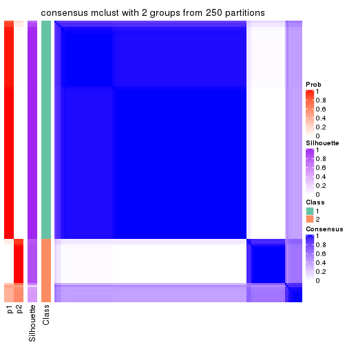</p>

</div>
<div id='tab-CV-mclust-consensus-heatmap-2'>
<pre><code class="r">consensus_heatmap(res, k = 3)
</code></pre>

<p>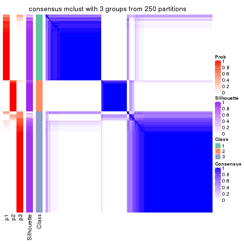</p>

</div>
<div id='tab-CV-mclust-consensus-heatmap-3'>
<pre><code class="r">consensus_heatmap(res, k = 4)
</code></pre>

<p>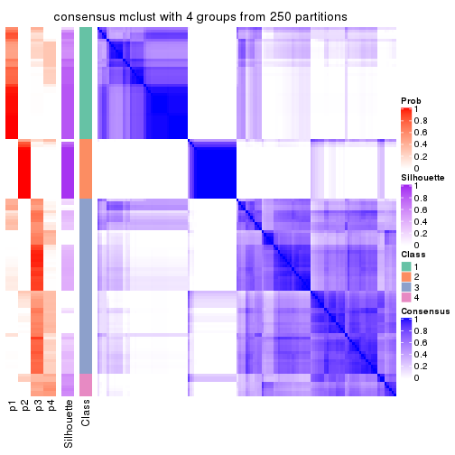</p>

</div>
<div id='tab-CV-mclust-consensus-heatmap-4'>
<pre><code class="r">consensus_heatmap(res, k = 5)
</code></pre>

<p>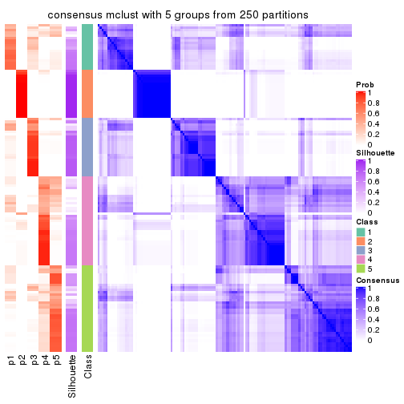</p>

</div>
<div id='tab-CV-mclust-consensus-heatmap-5'>
<pre><code class="r">consensus_heatmap(res, k = 6)
</code></pre>

<p>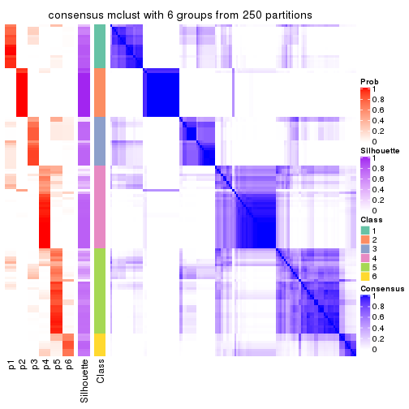</p>

</div>
</div>

Heatmaps for the membership of samples in all partitions to see how consistent they are:


<script>
$( function() {
	$( '#tabs-CV-mclust-membership-heatmap' ).tabs();
} );
</script>
<div id='tabs-CV-mclust-membership-heatmap'>
<ul>
<li><a href='#tab-CV-mclust-membership-heatmap-1'>k = 2</a></li>
<li><a href='#tab-CV-mclust-membership-heatmap-2'>k = 3</a></li>
<li><a href='#tab-CV-mclust-membership-heatmap-3'>k = 4</a></li>
<li><a href='#tab-CV-mclust-membership-heatmap-4'>k = 5</a></li>
<li><a href='#tab-CV-mclust-membership-heatmap-5'>k = 6</a></li>
</ul>
<div id='tab-CV-mclust-membership-heatmap-1'>
<pre><code class="r">membership_heatmap(res, k = 2)
</code></pre>

<p>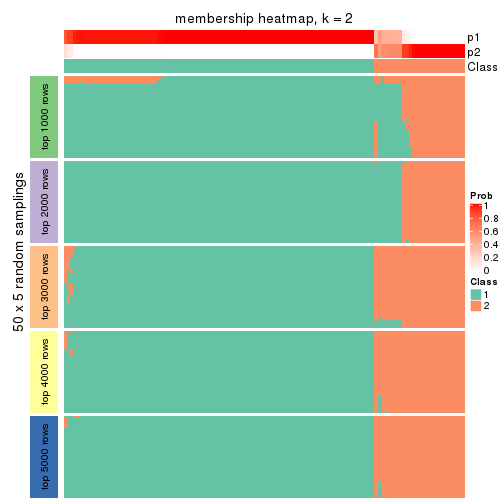</p>

</div>
<div id='tab-CV-mclust-membership-heatmap-2'>
<pre><code class="r">membership_heatmap(res, k = 3)
</code></pre>

<p>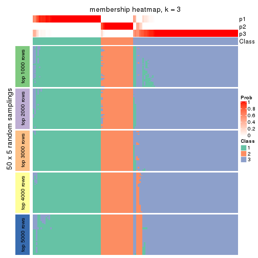</p>

</div>
<div id='tab-CV-mclust-membership-heatmap-3'>
<pre><code class="r">membership_heatmap(res, k = 4)
</code></pre>

<p>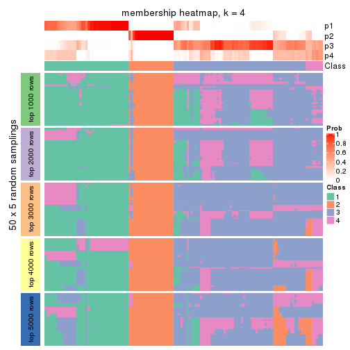</p>

</div>
<div id='tab-CV-mclust-membership-heatmap-4'>
<pre><code class="r">membership_heatmap(res, k = 5)
</code></pre>

<p>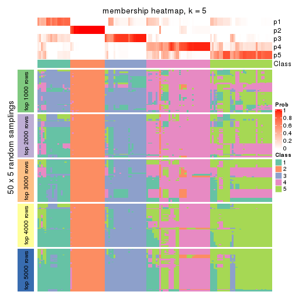</p>

</div>
<div id='tab-CV-mclust-membership-heatmap-5'>
<pre><code class="r">membership_heatmap(res, k = 6)
</code></pre>

<p>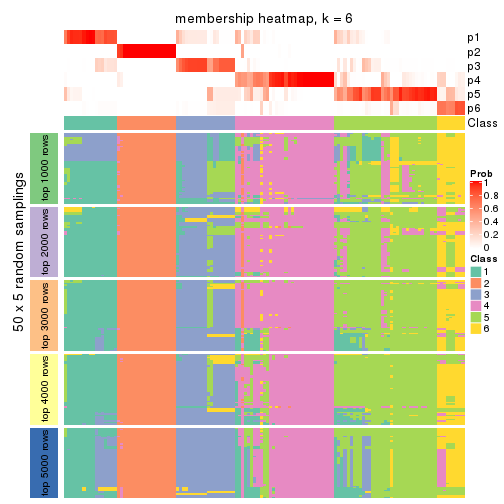</p>

</div>
</div>

As soon as we have had the classes for columns, we can look for signatures
which are significantly different between classes which can be candidate marks
for certain classes. Following are the heatmaps for signatures.


Signature heatmaps where rows are scaled:


<script>
$( function() {
	$( '#tabs-CV-mclust-get-signatures' ).tabs();
} );
</script>
<div id='tabs-CV-mclust-get-signatures'>
<ul>
<li><a href='#tab-CV-mclust-get-signatures-1'>k = 2</a></li>
<li><a href='#tab-CV-mclust-get-signatures-2'>k = 3</a></li>
<li><a href='#tab-CV-mclust-get-signatures-3'>k = 4</a></li>
<li><a href='#tab-CV-mclust-get-signatures-4'>k = 5</a></li>
<li><a href='#tab-CV-mclust-get-signatures-5'>k = 6</a></li>
</ul>
<div id='tab-CV-mclust-get-signatures-1'>
<pre><code class="r">get_signatures(res, k = 2)
</code></pre>

<p>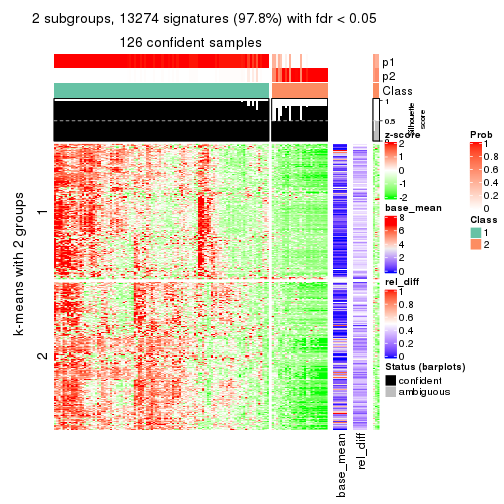</p>

</div>
<div id='tab-CV-mclust-get-signatures-2'>
<pre><code class="r">get_signatures(res, k = 3)
</code></pre>

<p>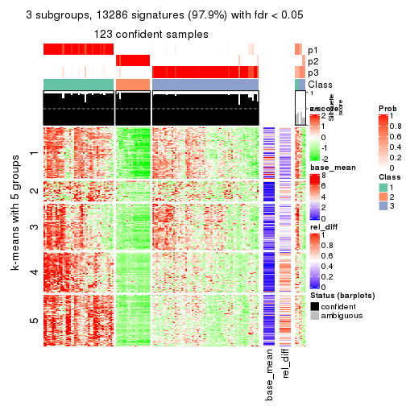</p>

</div>
<div id='tab-CV-mclust-get-signatures-3'>
<pre><code class="r">get_signatures(res, k = 4)
</code></pre>

<p>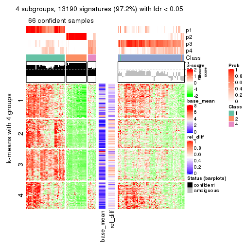</p>

</div>
<div id='tab-CV-mclust-get-signatures-4'>
<pre><code class="r">get_signatures(res, k = 5)
</code></pre>

<p>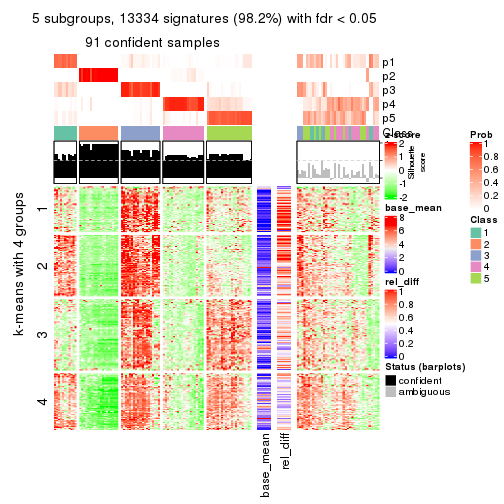</p>

</div>
<div id='tab-CV-mclust-get-signatures-5'>
<pre><code class="r">get_signatures(res, k = 6)
</code></pre>

<p>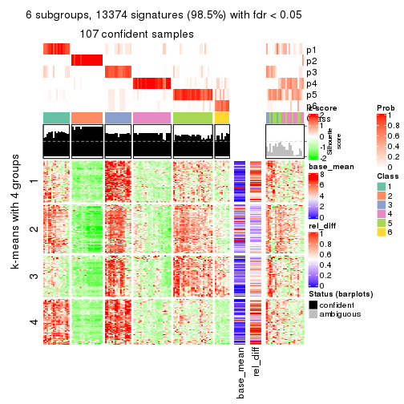</p>

</div>
</div>


Signature heatmaps where rows are not scaled:


<script>
$( function() {
	$( '#tabs-CV-mclust-get-signatures-no-scale' ).tabs();
} );
</script>
<div id='tabs-CV-mclust-get-signatures-no-scale'>
<ul>
<li><a href='#tab-CV-mclust-get-signatures-no-scale-1'>k = 2</a></li>
<li><a href='#tab-CV-mclust-get-signatures-no-scale-2'>k = 3</a></li>
<li><a href='#tab-CV-mclust-get-signatures-no-scale-3'>k = 4</a></li>
<li><a href='#tab-CV-mclust-get-signatures-no-scale-4'>k = 5</a></li>
<li><a href='#tab-CV-mclust-get-signatures-no-scale-5'>k = 6</a></li>
</ul>
<div id='tab-CV-mclust-get-signatures-no-scale-1'>
<pre><code class="r">get_signatures(res, k = 2, scale_rows = FALSE)
</code></pre>

<p>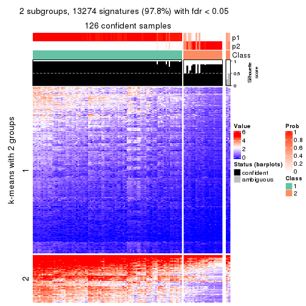</p>

</div>
<div id='tab-CV-mclust-get-signatures-no-scale-2'>
<pre><code class="r">get_signatures(res, k = 3, scale_rows = FALSE)
</code></pre>

<p>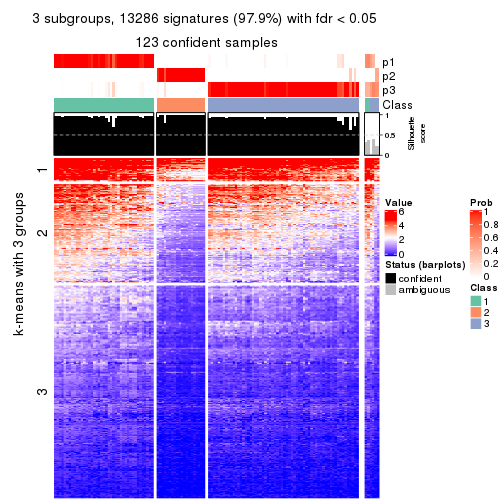</p>

</div>
<div id='tab-CV-mclust-get-signatures-no-scale-3'>
<pre><code class="r">get_signatures(res, k = 4, scale_rows = FALSE)
</code></pre>

<p>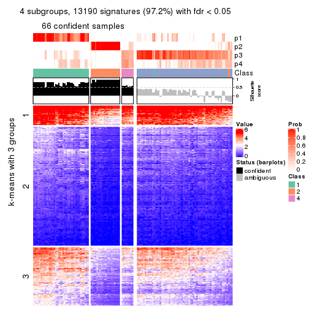</p>

</div>
<div id='tab-CV-mclust-get-signatures-no-scale-4'>
<pre><code class="r">get_signatures(res, k = 5, scale_rows = FALSE)
</code></pre>

<p>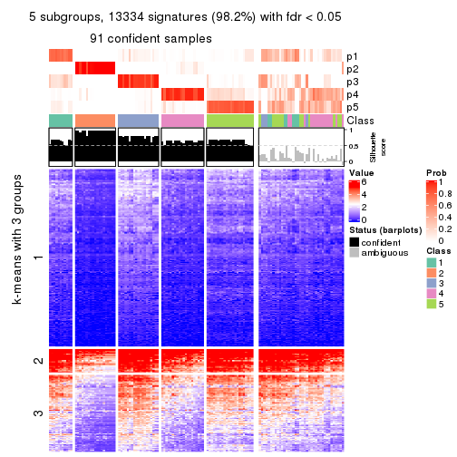</p>

</div>
<div id='tab-CV-mclust-get-signatures-no-scale-5'>
<pre><code class="r">get_signatures(res, k = 6, scale_rows = FALSE)
</code></pre>

<p>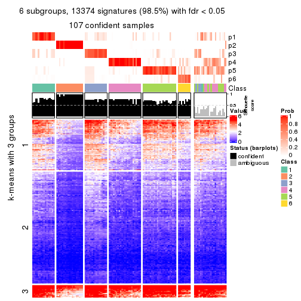</p>

</div>
</div>


Compare the overlap of signatures from different k:

```r
compare_signatures(res)
```

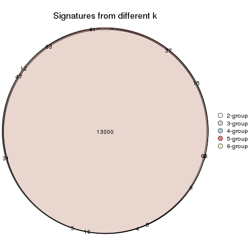

`get_signature()` returns a data frame invisibly. TO get the list of signatures, the function
call should be assigned to a variable explicitly. In following code, if `plot` argument is set
to `FALSE`, no heatmap is plotted while only the differential analysis is performed.

```r
# code only for demonstration
tb = get_signature(res, k = ..., plot = FALSE)
```

An example of the output of `tb` is:

```
#>   which_row         fdr    mean_1    mean_2 scaled_mean_1 scaled_mean_2 km
#> 1        38 0.042760348  8.373488  9.131774    -0.5533452     0.5164555  1
#> 2        40 0.018707592  7.106213  8.469186    -0.6173731     0.5762149  1
#> 3        55 0.019134737 10.221463 11.207825    -0.6159697     0.5749050  1
#> 4        59 0.006059896  5.921854  7.869574    -0.6899429     0.6439467  1
#> 5        60 0.018055526  8.928898 10.211722    -0.6204761     0.5791110  1
#> 6        98 0.009384629 15.714769 14.887706     0.6635654    -0.6193277  2
...
```

The columns in `tb` are:

1. `which_row`: row indices corresponding to the input matrix.
2. `fdr`: FDR for the differential test. 
3. `mean_x`: The mean value in group x.
4. `scaled_mean_x`: The mean value in group x after rows are scaled.
5. `km`: Row groups if k-means clustering is applied to rows.


UMAP plot which shows how samples are separated.


<script>
$( function() {
	$( '#tabs-CV-mclust-dimension-reduction' ).tabs();
} );
</script>
<div id='tabs-CV-mclust-dimension-reduction'>
<ul>
<li><a href='#tab-CV-mclust-dimension-reduction-1'>k = 2</a></li>
<li><a href='#tab-CV-mclust-dimension-reduction-2'>k = 3</a></li>
<li><a href='#tab-CV-mclust-dimension-reduction-3'>k = 4</a></li>
<li><a href='#tab-CV-mclust-dimension-reduction-4'>k = 5</a></li>
<li><a href='#tab-CV-mclust-dimension-reduction-5'>k = 6</a></li>
</ul>
<div id='tab-CV-mclust-dimension-reduction-1'>
<pre><code class="r">dimension_reduction(res, k = 2, method = &quot;UMAP&quot;)
</code></pre>

<p>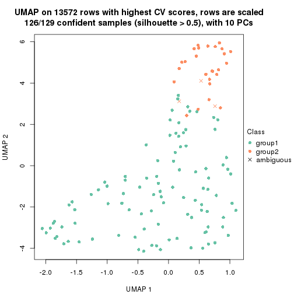</p>

</div>
<div id='tab-CV-mclust-dimension-reduction-2'>
<pre><code class="r">dimension_reduction(res, k = 3, method = &quot;UMAP&quot;)
</code></pre>

<p>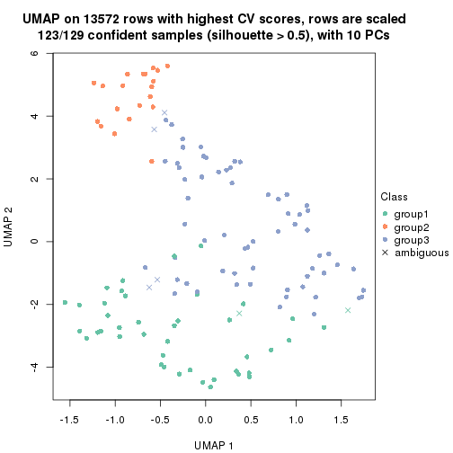</p>

</div>
<div id='tab-CV-mclust-dimension-reduction-3'>
<pre><code class="r">dimension_reduction(res, k = 4, method = &quot;UMAP&quot;)
</code></pre>

<p>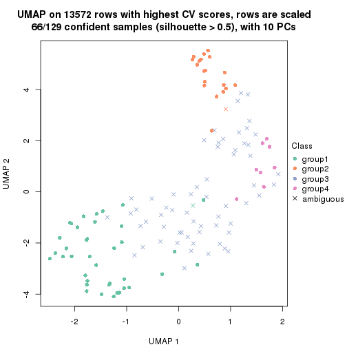</p>

</div>
<div id='tab-CV-mclust-dimension-reduction-4'>
<pre><code class="r">dimension_reduction(res, k = 5, method = &quot;UMAP&quot;)
</code></pre>

<p>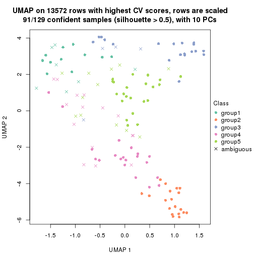</p>

</div>
<div id='tab-CV-mclust-dimension-reduction-5'>
<pre><code class="r">dimension_reduction(res, k = 6, method = &quot;UMAP&quot;)
</code></pre>

<p>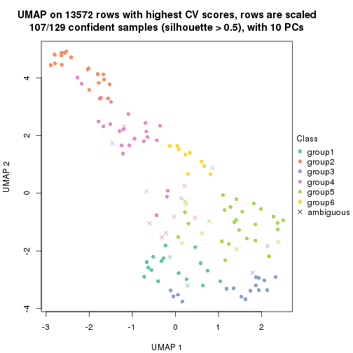</p>

</div>
</div>


Following heatmap shows how subgroups are split when increasing `k`:

```r
collect_classes(res)
```

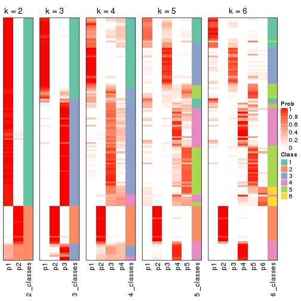


If matrix rows can be associated to genes, consider to use `GO_Enrichment(res,
...)` to perform function enrichment for the signature genes.


 

---------------------------------------------------


### CV:NMF*


The object with results only for a single top-value method and a single partition method 
can be extracted as:

```r
res = res_list["CV", "NMF"]
# you can also extract it by
# res = res_list["CV:NMF"]
```

A summary of `res` and all the functions that can be applied to it:

```r
res
```

```
#> A 'ConsensusPartition' object with k = 2, 3, 4, 5, 6.
#>   On a matrix with 13572 rows and 129 columns.
#>   Top rows (1000, 2000, 3000, 4000, 5000) are extracted by 'CV' method.
#>   Subgroups are detected by 'NMF' method.
#>   Performed in total 1250 partitions by row resampling.
#>   Best k for subgroups seems to be 2.
#> 
#> Following methods can be applied to this 'ConsensusPartition' object:
#>  [1] "cola_report"             "collect_classes"         "collect_plots"          
#>  [4] "collect_stats"           "colnames"                "compare_signatures"     
#>  [7] "consensus_heatmap"       "dimension_reduction"     "functional_enrichment"  
#> [10] "get_anno_col"            "get_anno"                "get_classes"            
#> [13] "get_consensus"           "get_matrix"              "get_membership"         
#> [16] "get_param"               "get_signatures"          "get_stats"              
#> [19] "is_best_k"               "is_stable_k"             "membership_heatmap"     
#> [22] "ncol"                    "nrow"                    "plot_ecdf"              
#> [25] "rownames"                "select_partition_number" "show"                   
#> [28] "suggest_best_k"          "test_to_known_factors"
```

`collect_plots()` function collects all the plots made from `res` for all `k` (number of partitions)
into one single page to provide an easy and fast comparison between different `k`.

```r
collect_plots(res)
```

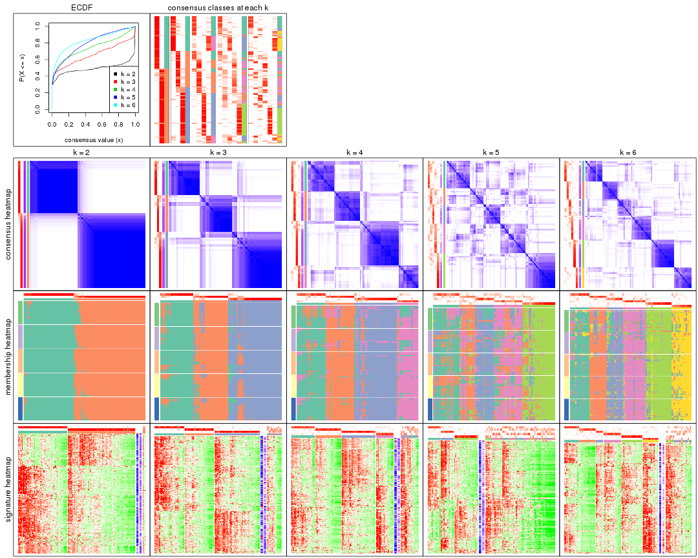

The plots are:

- The first row: a plot of the ECDF (Empirical cumulative distribution
  function) curves of the consensus matrix for each `k` and the heatmap of
  predicted classes for each `k`.
- The second row: heatmaps of the consensus matrix for each `k`.
- The third row: heatmaps of the membership matrix for each `k`.
- The fouth row: heatmaps of the signatures for each `k`.

All the plots in panels can be made by individual functions and they are
plotted later in this section.

`select_partition_number()` produces several plots showing different
statistics for choosing "optimized" `k`. There are following statistics:

- ECDF curves of the consensus matrix for each `k`;
- 1-PAC. [The PAC
  score](https://en.wikipedia.org/wiki/Consensus_clustering#Over-interpretation_potential_of_consensus_clustering)
  measures the proportion of the ambiguous subgrouping.
- Mean silhouette score.
- Concordance. The mean probability of fiting the consensus class ids in all
  partitions.
- Area increased. Denote $A_k$ as the area under the ECDF curve for current
  `k`, the area increased is defined as $A_k - A_{k-1}$.
- Rand index. The percent of pairs of samples that are both in a same cluster
  or both are not in a same cluster in the partition of k and k-1.
- Jaccard index. The ratio of pairs of samples are both in a same cluster in
  the partition of k and k-1 and the pairs of samples are both in a same
  cluster in the partition k or k-1.

The detailed explanations of these statistics can be found in [the cola
vignette](http://bioconductor.org/packages/devel/bioc/vignettes/cola/inst/doc/cola.html#toc_13).

Generally speaking, lower PAC score, higher mean silhouette score or higher
concordance corresponds to better partition. Rand index and Jaccard index
measure how similar the current partition is compared to partition with `k-1`.
If they are too similar, we won't accept `k` is better than `k-1`.

```r
select_partition_number(res)
```

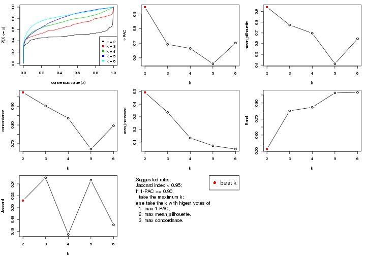

The numeric values for all these statistics can be obtained by `get_stats()`.

```r
get_stats(res)
```

```
#>   k 1-PAC mean_silhouette concordance area_increased  Rand Jaccard
#> 2 2 0.947           0.941       0.974         0.4928 0.512   0.512
#> 3 3 0.692           0.774       0.902         0.3353 0.751   0.550
#> 4 4 0.664           0.697       0.836         0.1327 0.773   0.455
#> 5 5 0.559           0.412       0.671         0.0713 0.863   0.546
#> 6 6 0.701           0.646       0.796         0.0448 0.866   0.471
```

`suggest_best_k()` suggests the best $k$ based on these statistics. The rules are as follows:

- All $k$ with Jaccard index larger than 0.95 are removed because the increase of
  the partition number does not provides enough extra information. If all $k$ are removed,
  the best $k$ is assigned by `NA`.
- For $k$ with 1-PAC larger than 0.9, the maximal $k$ is taken as the "best k". Other $k$ is called "optional k".
- If it does not fit the second rule. The $k$ with the highest vote of highest
  1-PAC, mean silhouette and concordance is taken as the "best k".

```r
suggest_best_k(res)
```

```
#> [1] 2
```


Following shows the table of the partitions (You need to click the **show/hide
code output** link to see it). The membership matrix (columns with name `p*`)
is inferred by
[`clue::cl_consensus()`](https://www.rdocumentation.org/link/cl_consensus?package=clue)
function with the `SE` method. Basically the value in the membership matrix
represents the probability to belong to a certain group. The finall class
label for an item is determined with the group with highest probability it
belongs to.

In `get_classes()` function, the entropy is calculated from the membership
matrix and the silhouette score is calculated from the consensus matrix.


<script>
$( function() {
	$( '#tabs-CV-NMF-get-classes' ).tabs();
} );
</script>
<div id='tabs-CV-NMF-get-classes'>
<ul>
<li><a href='#tab-CV-NMF-get-classes-1'>k = 2</a></li>
<li><a href='#tab-CV-NMF-get-classes-2'>k = 3</a></li>
<li><a href='#tab-CV-NMF-get-classes-3'>k = 4</a></li>
<li><a href='#tab-CV-NMF-get-classes-4'>k = 5</a></li>
<li><a href='#tab-CV-NMF-get-classes-5'>k = 6</a></li>
</ul>

<div id='tab-CV-NMF-get-classes-1'>
<p><a id='tab-CV-NMF-get-classes-1-a' style='color:#0366d6' href='#'>show/hide code output</a></p>
<pre><code class="r">cbind(get_classes(res, k = 2), get_membership(res, k = 2))
</code></pre>

<pre><code>#&gt;            class entropy silhouette    p1    p2
#&gt; SRR1656463     2  0.0000      0.962 0.000 1.000
#&gt; SRR1656464     1  0.0000      0.988 1.000 0.000
#&gt; SRR1656462     2  0.0938      0.955 0.012 0.988
#&gt; SRR1656465     2  0.0000      0.962 0.000 1.000
#&gt; SRR1656467     2  0.0000      0.962 0.000 1.000
#&gt; SRR1656466     2  0.0000      0.962 0.000 1.000
#&gt; SRR1656468     2  0.0000      0.962 0.000 1.000
#&gt; SRR1656472     1  0.0000      0.988 1.000 0.000
#&gt; SRR1656471     2  0.0000      0.962 0.000 1.000
#&gt; SRR1656470     2  0.0000      0.962 0.000 1.000
#&gt; SRR1656469     2  0.0000      0.962 0.000 1.000
#&gt; SRR1656473     1  0.3114      0.942 0.944 0.056
#&gt; SRR1656474     1  0.0000      0.988 1.000 0.000
#&gt; SRR1656475     2  0.0000      0.962 0.000 1.000
#&gt; SRR1656478     1  0.0000      0.988 1.000 0.000
#&gt; SRR1656477     2  0.0000      0.962 0.000 1.000
#&gt; SRR1656479     1  0.0000      0.988 1.000 0.000
#&gt; SRR1656480     2  0.0000      0.962 0.000 1.000
#&gt; SRR1656476     2  0.0000      0.962 0.000 1.000
#&gt; SRR1656481     2  0.0000      0.962 0.000 1.000
#&gt; SRR1656482     2  0.0000      0.962 0.000 1.000
#&gt; SRR1656483     2  0.0000      0.962 0.000 1.000
#&gt; SRR1656485     2  0.0000      0.962 0.000 1.000
#&gt; SRR1656487     2  0.0000      0.962 0.000 1.000
#&gt; SRR1656486     1  0.0000      0.988 1.000 0.000
#&gt; SRR1656488     2  0.0000      0.962 0.000 1.000
#&gt; SRR1656484     1  0.2236      0.959 0.964 0.036
#&gt; SRR1656489     1  0.0000      0.988 1.000 0.000
#&gt; SRR1656491     2  0.0000      0.962 0.000 1.000
#&gt; SRR1656490     2  0.9996      0.103 0.488 0.512
#&gt; SRR1656492     2  0.0000      0.962 0.000 1.000
#&gt; SRR1656493     1  0.0000      0.988 1.000 0.000
#&gt; SRR1656495     1  0.0000      0.988 1.000 0.000
#&gt; SRR1656496     2  0.5842      0.835 0.140 0.860
#&gt; SRR1656494     1  0.1184      0.976 0.984 0.016
#&gt; SRR1656497     2  0.0000      0.962 0.000 1.000
#&gt; SRR1656499     2  0.0000      0.962 0.000 1.000
#&gt; SRR1656500     2  0.0000      0.962 0.000 1.000
#&gt; SRR1656501     1  0.0376      0.985 0.996 0.004
#&gt; SRR1656498     1  0.0000      0.988 1.000 0.000
#&gt; SRR1656504     2  0.4298      0.891 0.088 0.912
#&gt; SRR1656502     1  0.0000      0.988 1.000 0.000
#&gt; SRR1656503     1  0.0000      0.988 1.000 0.000
#&gt; SRR1656507     1  0.0000      0.988 1.000 0.000
#&gt; SRR1656508     1  0.0000      0.988 1.000 0.000
#&gt; SRR1656505     2  0.0000      0.962 0.000 1.000
#&gt; SRR1656506     2  0.0000      0.962 0.000 1.000
#&gt; SRR1656509     2  0.1843      0.944 0.028 0.972
#&gt; SRR1656510     2  0.0000      0.962 0.000 1.000
#&gt; SRR1656511     1  0.0000      0.988 1.000 0.000
#&gt; SRR1656513     1  0.0000      0.988 1.000 0.000
#&gt; SRR1656512     1  0.3431      0.934 0.936 0.064
#&gt; SRR1656514     1  0.0000      0.988 1.000 0.000
#&gt; SRR1656515     2  0.0000      0.962 0.000 1.000
#&gt; SRR1656516     1  0.3431      0.935 0.936 0.064
#&gt; SRR1656518     1  0.0000      0.988 1.000 0.000
#&gt; SRR1656517     1  0.0000      0.988 1.000 0.000
#&gt; SRR1656519     1  0.6148      0.817 0.848 0.152
#&gt; SRR1656522     1  0.0000      0.988 1.000 0.000
#&gt; SRR1656523     1  0.2948      0.946 0.948 0.052
#&gt; SRR1656521     1  0.0000      0.988 1.000 0.000
#&gt; SRR1656520     2  0.0000      0.962 0.000 1.000
#&gt; SRR1656524     1  0.0000      0.988 1.000 0.000
#&gt; SRR1656525     2  0.0000      0.962 0.000 1.000
#&gt; SRR1656526     2  0.0000      0.962 0.000 1.000
#&gt; SRR1656527     1  0.0000      0.988 1.000 0.000
#&gt; SRR1656530     2  0.0000      0.962 0.000 1.000
#&gt; SRR1656529     2  0.0000      0.962 0.000 1.000
#&gt; SRR1656531     1  0.0000      0.988 1.000 0.000
#&gt; SRR1656528     2  0.0000      0.962 0.000 1.000
#&gt; SRR1656534     2  0.9909      0.250 0.444 0.556
#&gt; SRR1656533     1  0.0000      0.988 1.000 0.000
#&gt; SRR1656536     2  0.0000      0.962 0.000 1.000
#&gt; SRR1656532     1  0.0000      0.988 1.000 0.000
#&gt; SRR1656537     1  0.0000      0.988 1.000 0.000
#&gt; SRR1656538     2  0.0000      0.962 0.000 1.000
#&gt; SRR1656535     2  0.8327      0.662 0.264 0.736
#&gt; SRR1656539     2  0.0000      0.962 0.000 1.000
#&gt; SRR1656544     2  0.0000      0.962 0.000 1.000
#&gt; SRR1656542     1  0.3733      0.923 0.928 0.072
#&gt; SRR1656543     2  0.0000      0.962 0.000 1.000
#&gt; SRR1656545     2  0.1633      0.947 0.024 0.976
#&gt; SRR1656540     2  0.0000      0.962 0.000 1.000
#&gt; SRR1656546     1  0.0000      0.988 1.000 0.000
#&gt; SRR1656541     2  0.0000      0.962 0.000 1.000
#&gt; SRR1656547     2  0.0000      0.962 0.000 1.000
#&gt; SRR1656548     2  0.0000      0.962 0.000 1.000
#&gt; SRR1656549     1  0.0000      0.988 1.000 0.000
#&gt; SRR1656551     2  0.0000      0.962 0.000 1.000
#&gt; SRR1656553     2  0.5408      0.854 0.124 0.876
#&gt; SRR1656550     2  0.0000      0.962 0.000 1.000
#&gt; SRR1656552     2  0.2778      0.927 0.048 0.952
#&gt; SRR1656554     2  0.0000      0.962 0.000 1.000
#&gt; SRR1656555     2  0.0000      0.962 0.000 1.000
#&gt; SRR1656556     2  0.0000      0.962 0.000 1.000
#&gt; SRR1656557     2  0.0000      0.962 0.000 1.000
#&gt; SRR1656558     1  0.0000      0.988 1.000 0.000
#&gt; SRR1656559     1  0.0000      0.988 1.000 0.000
#&gt; SRR1656560     2  0.0000      0.962 0.000 1.000
#&gt; SRR1656561     2  0.0376      0.960 0.004 0.996
#&gt; SRR1656562     2  0.4939      0.870 0.108 0.892
#&gt; SRR1656563     1  0.0000      0.988 1.000 0.000
#&gt; SRR1656564     1  0.0000      0.988 1.000 0.000
#&gt; SRR1656565     2  0.9833      0.319 0.424 0.576
#&gt; SRR1656566     1  0.0000      0.988 1.000 0.000
#&gt; SRR1656568     1  0.0000      0.988 1.000 0.000
#&gt; SRR1656567     2  0.0000      0.962 0.000 1.000
#&gt; SRR1656569     2  0.0000      0.962 0.000 1.000
#&gt; SRR1656570     1  0.0000      0.988 1.000 0.000
#&gt; SRR1656571     2  0.3274      0.919 0.060 0.940
#&gt; SRR1656573     2  0.0000      0.962 0.000 1.000
#&gt; SRR1656572     1  0.0376      0.985 0.996 0.004
#&gt; SRR1656574     1  0.0000      0.988 1.000 0.000
#&gt; SRR1656575     1  0.0000      0.988 1.000 0.000
#&gt; SRR1656576     2  0.0000      0.962 0.000 1.000
#&gt; SRR1656578     1  0.0000      0.988 1.000 0.000
#&gt; SRR1656577     1  0.0000      0.988 1.000 0.000
#&gt; SRR1656579     2  0.0000      0.962 0.000 1.000
#&gt; SRR1656580     2  0.2603      0.931 0.044 0.956
#&gt; SRR1656581     2  0.7056      0.770 0.192 0.808
#&gt; SRR1656582     2  0.0000      0.962 0.000 1.000
#&gt; SRR1656585     2  0.0000      0.962 0.000 1.000
#&gt; SRR1656584     1  0.0000      0.988 1.000 0.000
#&gt; SRR1656583     2  0.0938      0.955 0.012 0.988
#&gt; SRR1656586     2  0.1414      0.950 0.020 0.980
#&gt; SRR1656587     1  0.3584      0.930 0.932 0.068
#&gt; SRR1656588     2  0.0000      0.962 0.000 1.000
#&gt; SRR1656589     2  0.8267      0.664 0.260 0.740
#&gt; SRR1656590     1  0.0000      0.988 1.000 0.000
</code></pre>

<script>
$('#tab-CV-NMF-get-classes-1-a').parent().next().next().hide();
$('#tab-CV-NMF-get-classes-1-a').click(function(){
  $('#tab-CV-NMF-get-classes-1-a').parent().next().next().toggle();
  return(false);
});
</script>
</div>

<div id='tab-CV-NMF-get-classes-2'>
<p><a id='tab-CV-NMF-get-classes-2-a' style='color:#0366d6' href='#'>show/hide code output</a></p>
<pre><code class="r">cbind(get_classes(res, k = 3), get_membership(res, k = 3))
</code></pre>

<pre><code>#&gt;            class entropy silhouette    p1    p2    p3
#&gt; SRR1656463     3  0.0000     0.8907 0.000 0.000 1.000
#&gt; SRR1656464     1  0.0000     0.9017 1.000 0.000 0.000
#&gt; SRR1656462     3  0.4796     0.7164 0.220 0.000 0.780
#&gt; SRR1656465     3  0.0000     0.8907 0.000 0.000 1.000
#&gt; SRR1656467     3  0.0237     0.8897 0.004 0.000 0.996
#&gt; SRR1656466     3  0.0424     0.8882 0.008 0.000 0.992
#&gt; SRR1656468     3  0.0000     0.8907 0.000 0.000 1.000
#&gt; SRR1656472     1  0.0000     0.9017 1.000 0.000 0.000
#&gt; SRR1656471     3  0.0000     0.8907 0.000 0.000 1.000
#&gt; SRR1656470     3  0.0000     0.8907 0.000 0.000 1.000
#&gt; SRR1656469     3  0.0000     0.8907 0.000 0.000 1.000
#&gt; SRR1656473     2  0.0237     0.8605 0.000 0.996 0.004
#&gt; SRR1656474     1  0.0000     0.9017 1.000 0.000 0.000
#&gt; SRR1656475     3  0.6299     0.0667 0.000 0.476 0.524
#&gt; SRR1656478     1  0.1411     0.8952 0.964 0.036 0.000
#&gt; SRR1656477     3  0.0000     0.8907 0.000 0.000 1.000
#&gt; SRR1656479     2  0.0000     0.8609 0.000 1.000 0.000
#&gt; SRR1656480     3  0.0000     0.8907 0.000 0.000 1.000
#&gt; SRR1656476     2  0.5216     0.6238 0.000 0.740 0.260
#&gt; SRR1656481     3  0.0000     0.8907 0.000 0.000 1.000
#&gt; SRR1656482     3  0.0424     0.8882 0.008 0.000 0.992
#&gt; SRR1656483     3  0.0237     0.8897 0.004 0.000 0.996
#&gt; SRR1656485     3  0.0237     0.8897 0.004 0.000 0.996
#&gt; SRR1656487     3  0.0000     0.8907 0.000 0.000 1.000
#&gt; SRR1656486     2  0.0000     0.8609 0.000 1.000 0.000
#&gt; SRR1656488     3  0.0000     0.8907 0.000 0.000 1.000
#&gt; SRR1656484     2  0.5443     0.5391 0.260 0.736 0.004
#&gt; SRR1656489     1  0.0892     0.9000 0.980 0.020 0.000
#&gt; SRR1656491     3  0.6225     0.2177 0.000 0.432 0.568
#&gt; SRR1656490     2  0.7741     0.3367 0.056 0.568 0.376
#&gt; SRR1656492     2  0.6280     0.1352 0.000 0.540 0.460
#&gt; SRR1656493     1  0.0424     0.9025 0.992 0.008 0.000
#&gt; SRR1656495     1  0.0237     0.9027 0.996 0.004 0.000
#&gt; SRR1656496     2  0.0892     0.8565 0.000 0.980 0.020
#&gt; SRR1656494     1  0.0592     0.8952 0.988 0.000 0.012
#&gt; SRR1656497     2  0.6111     0.3336 0.000 0.604 0.396
#&gt; SRR1656499     3  0.0000     0.8907 0.000 0.000 1.000
#&gt; SRR1656500     3  0.0000     0.8907 0.000 0.000 1.000
#&gt; SRR1656501     2  0.0000     0.8609 0.000 1.000 0.000
#&gt; SRR1656498     1  0.1289     0.8963 0.968 0.032 0.000
#&gt; SRR1656504     2  0.0424     0.8599 0.000 0.992 0.008
#&gt; SRR1656502     1  0.0000     0.9017 1.000 0.000 0.000
#&gt; SRR1656503     1  0.5058     0.7170 0.756 0.244 0.000
#&gt; SRR1656507     1  0.1529     0.8932 0.960 0.040 0.000
#&gt; SRR1656508     1  0.3879     0.8188 0.848 0.152 0.000
#&gt; SRR1656505     3  0.0000     0.8907 0.000 0.000 1.000
#&gt; SRR1656506     3  0.5882     0.4407 0.000 0.348 0.652
#&gt; SRR1656509     3  0.5178     0.6708 0.256 0.000 0.744
#&gt; SRR1656510     3  0.4178     0.7354 0.000 0.172 0.828
#&gt; SRR1656511     2  0.0000     0.8609 0.000 1.000 0.000
#&gt; SRR1656513     1  0.0237     0.9027 0.996 0.004 0.000
#&gt; SRR1656512     2  0.0000     0.8609 0.000 1.000 0.000
#&gt; SRR1656514     1  0.0000     0.9017 1.000 0.000 0.000
#&gt; SRR1656515     3  0.0000     0.8907 0.000 0.000 1.000
#&gt; SRR1656516     2  0.0000     0.8609 0.000 1.000 0.000
#&gt; SRR1656518     2  0.5098     0.5622 0.248 0.752 0.000
#&gt; SRR1656517     1  0.3619     0.8293 0.864 0.136 0.000
#&gt; SRR1656519     1  0.3816     0.7535 0.852 0.000 0.148
#&gt; SRR1656522     1  0.0000     0.9017 1.000 0.000 0.000
#&gt; SRR1656523     2  0.0000     0.8609 0.000 1.000 0.000
#&gt; SRR1656521     2  0.0000     0.8609 0.000 1.000 0.000
#&gt; SRR1656520     3  0.3482     0.8083 0.128 0.000 0.872
#&gt; SRR1656524     1  0.1643     0.8911 0.956 0.044 0.000
#&gt; SRR1656525     3  0.6026     0.3723 0.000 0.376 0.624
#&gt; SRR1656526     3  0.6286     0.1118 0.000 0.464 0.536
#&gt; SRR1656527     1  0.0424     0.9025 0.992 0.008 0.000
#&gt; SRR1656530     3  0.0000     0.8907 0.000 0.000 1.000
#&gt; SRR1656529     3  0.0000     0.8907 0.000 0.000 1.000
#&gt; SRR1656531     1  0.0424     0.9025 0.992 0.008 0.000
#&gt; SRR1656528     3  0.1860     0.8555 0.000 0.052 0.948
#&gt; SRR1656534     3  0.7828     0.5551 0.160 0.168 0.672
#&gt; SRR1656533     1  0.6274     0.3058 0.544 0.456 0.000
#&gt; SRR1656536     3  0.0000     0.8907 0.000 0.000 1.000
#&gt; SRR1656532     1  0.0237     0.9027 0.996 0.004 0.000
#&gt; SRR1656537     1  0.0237     0.9027 0.996 0.004 0.000
#&gt; SRR1656538     2  0.0424     0.8599 0.000 0.992 0.008
#&gt; SRR1656535     2  0.0000     0.8609 0.000 1.000 0.000
#&gt; SRR1656539     3  0.0237     0.8897 0.004 0.000 0.996
#&gt; SRR1656544     3  0.0424     0.8882 0.008 0.000 0.992
#&gt; SRR1656542     1  0.1525     0.8856 0.964 0.004 0.032
#&gt; SRR1656543     3  0.2448     0.8467 0.076 0.000 0.924
#&gt; SRR1656545     2  0.3551     0.7770 0.000 0.868 0.132
#&gt; SRR1656540     3  0.2711     0.8381 0.088 0.000 0.912
#&gt; SRR1656546     1  0.5216     0.6953 0.740 0.260 0.000
#&gt; SRR1656541     3  0.0000     0.8907 0.000 0.000 1.000
#&gt; SRR1656547     3  0.0000     0.8907 0.000 0.000 1.000
#&gt; SRR1656548     2  0.2066     0.8339 0.000 0.940 0.060
#&gt; SRR1656549     2  0.0237     0.8587 0.004 0.996 0.000
#&gt; SRR1656551     3  0.0000     0.8907 0.000 0.000 1.000
#&gt; SRR1656553     3  0.5926     0.4974 0.356 0.000 0.644
#&gt; SRR1656550     3  0.0000     0.8907 0.000 0.000 1.000
#&gt; SRR1656552     2  0.2959     0.8109 0.000 0.900 0.100
#&gt; SRR1656554     3  0.1031     0.8774 0.000 0.024 0.976
#&gt; SRR1656555     3  0.6291     0.0982 0.000 0.468 0.532
#&gt; SRR1656556     3  0.0592     0.8864 0.012 0.000 0.988
#&gt; SRR1656557     3  0.0747     0.8844 0.016 0.000 0.984
#&gt; SRR1656558     1  0.2796     0.8617 0.908 0.092 0.000
#&gt; SRR1656559     1  0.0000     0.9017 1.000 0.000 0.000
#&gt; SRR1656560     3  0.0000     0.8907 0.000 0.000 1.000
#&gt; SRR1656561     2  0.0424     0.8599 0.000 0.992 0.008
#&gt; SRR1656562     2  0.4796     0.6744 0.000 0.780 0.220
#&gt; SRR1656563     2  0.0000     0.8609 0.000 1.000 0.000
#&gt; SRR1656564     2  0.1163     0.8417 0.028 0.972 0.000
#&gt; SRR1656565     2  0.0237     0.8606 0.000 0.996 0.004
#&gt; SRR1656566     1  0.5465     0.6561 0.712 0.288 0.000
#&gt; SRR1656568     1  0.6126     0.4433 0.600 0.400 0.000
#&gt; SRR1656567     3  0.0000     0.8907 0.000 0.000 1.000
#&gt; SRR1656569     3  0.0424     0.8869 0.000 0.008 0.992
#&gt; SRR1656570     2  0.0000     0.8609 0.000 1.000 0.000
#&gt; SRR1656571     2  0.8503     0.3442 0.104 0.544 0.352
#&gt; SRR1656573     3  0.4887     0.6677 0.000 0.228 0.772
#&gt; SRR1656572     2  0.0000     0.8609 0.000 1.000 0.000
#&gt; SRR1656574     1  0.6267     0.3146 0.548 0.452 0.000
#&gt; SRR1656575     2  0.6095     0.1971 0.392 0.608 0.000
#&gt; SRR1656576     2  0.5327     0.6029 0.000 0.728 0.272
#&gt; SRR1656578     1  0.0237     0.9027 0.996 0.004 0.000
#&gt; SRR1656577     1  0.4399     0.7845 0.812 0.188 0.000
#&gt; SRR1656579     3  0.0424     0.8868 0.000 0.008 0.992
#&gt; SRR1656580     2  0.0000     0.8609 0.000 1.000 0.000
#&gt; SRR1656581     2  0.0424     0.8599 0.000 0.992 0.008
#&gt; SRR1656582     2  0.1860     0.8386 0.000 0.948 0.052
#&gt; SRR1656585     3  0.0237     0.8897 0.004 0.000 0.996
#&gt; SRR1656584     2  0.4750     0.6180 0.216 0.784 0.000
#&gt; SRR1656583     3  0.4796     0.7176 0.220 0.000 0.780
#&gt; SRR1656586     3  0.4796     0.7215 0.220 0.000 0.780
#&gt; SRR1656587     1  0.0592     0.8957 0.988 0.000 0.012
#&gt; SRR1656588     3  0.0000     0.8907 0.000 0.000 1.000
#&gt; SRR1656589     3  0.6286     0.2392 0.464 0.000 0.536
#&gt; SRR1656590     1  0.0237     0.9027 0.996 0.004 0.000
</code></pre>

<script>
$('#tab-CV-NMF-get-classes-2-a').parent().next().next().hide();
$('#tab-CV-NMF-get-classes-2-a').click(function(){
  $('#tab-CV-NMF-get-classes-2-a').parent().next().next().toggle();
  return(false);
});
</script>
</div>

<div id='tab-CV-NMF-get-classes-3'>
<p><a id='tab-CV-NMF-get-classes-3-a' style='color:#0366d6' href='#'>show/hide code output</a></p>
<pre><code class="r">cbind(get_classes(res, k = 4), get_membership(res, k = 4))
</code></pre>

<pre><code>#&gt;            class entropy silhouette    p1    p2    p3    p4
#&gt; SRR1656463     3  0.3547     0.7616 0.000 0.016 0.840 0.144
#&gt; SRR1656464     4  0.2973     0.7432 0.144 0.000 0.000 0.856
#&gt; SRR1656462     4  0.5231     0.5215 0.028 0.000 0.296 0.676
#&gt; SRR1656465     3  0.0592     0.8472 0.000 0.000 0.984 0.016
#&gt; SRR1656467     3  0.4898     0.6140 0.000 0.024 0.716 0.260
#&gt; SRR1656466     3  0.0188     0.8485 0.000 0.000 0.996 0.004
#&gt; SRR1656468     3  0.0188     0.8482 0.004 0.000 0.996 0.000
#&gt; SRR1656472     4  0.2469     0.7553 0.108 0.000 0.000 0.892
#&gt; SRR1656471     3  0.1576     0.8376 0.000 0.004 0.948 0.048
#&gt; SRR1656470     3  0.6411     0.4185 0.000 0.308 0.600 0.092
#&gt; SRR1656469     3  0.0188     0.8485 0.000 0.000 0.996 0.004
#&gt; SRR1656473     2  0.3486     0.7831 0.000 0.812 0.000 0.188
#&gt; SRR1656474     4  0.2300     0.7358 0.000 0.064 0.016 0.920
#&gt; SRR1656475     2  0.4692     0.7327 0.000 0.756 0.032 0.212
#&gt; SRR1656478     1  0.1661     0.7721 0.944 0.000 0.004 0.052
#&gt; SRR1656477     3  0.1661     0.8357 0.000 0.004 0.944 0.052
#&gt; SRR1656479     2  0.1022     0.8495 0.032 0.968 0.000 0.000
#&gt; SRR1656480     3  0.5522     0.6646 0.000 0.120 0.732 0.148
#&gt; SRR1656476     2  0.0859     0.8624 0.008 0.980 0.008 0.004
#&gt; SRR1656481     3  0.0336     0.8481 0.000 0.000 0.992 0.008
#&gt; SRR1656482     4  0.6204     0.5067 0.000 0.164 0.164 0.672
#&gt; SRR1656483     3  0.7527     0.1495 0.000 0.192 0.452 0.356
#&gt; SRR1656485     3  0.0188     0.8482 0.004 0.000 0.996 0.000
#&gt; SRR1656487     3  0.0188     0.8482 0.004 0.000 0.996 0.000
#&gt; SRR1656486     1  0.4328     0.6878 0.748 0.244 0.008 0.000
#&gt; SRR1656488     3  0.1022     0.8429 0.032 0.000 0.968 0.000
#&gt; SRR1656484     2  0.5913     0.1674 0.352 0.600 0.000 0.048
#&gt; SRR1656489     1  0.1474     0.7726 0.948 0.000 0.000 0.052
#&gt; SRR1656491     2  0.5612     0.6685 0.044 0.716 0.224 0.016
#&gt; SRR1656490     1  0.5220     0.7326 0.772 0.116 0.104 0.008
#&gt; SRR1656492     3  0.5992     0.1474 0.444 0.040 0.516 0.000
#&gt; SRR1656493     1  0.3219     0.7023 0.836 0.000 0.000 0.164
#&gt; SRR1656495     4  0.3649     0.7008 0.204 0.000 0.000 0.796
#&gt; SRR1656496     2  0.1474     0.8585 0.000 0.948 0.000 0.052
#&gt; SRR1656494     4  0.0927     0.7609 0.016 0.000 0.008 0.976
#&gt; SRR1656497     2  0.3591     0.8391 0.032 0.872 0.016 0.080
#&gt; SRR1656499     3  0.1302     0.8387 0.044 0.000 0.956 0.000
#&gt; SRR1656500     3  0.0376     0.8487 0.004 0.000 0.992 0.004
#&gt; SRR1656501     1  0.3324     0.7632 0.852 0.136 0.012 0.000
#&gt; SRR1656498     1  0.2868     0.7269 0.864 0.000 0.000 0.136
#&gt; SRR1656504     2  0.0707     0.8555 0.020 0.980 0.000 0.000
#&gt; SRR1656502     4  0.2704     0.7510 0.124 0.000 0.000 0.876
#&gt; SRR1656503     1  0.1377     0.7784 0.964 0.008 0.008 0.020
#&gt; SRR1656507     1  0.1637     0.7714 0.940 0.000 0.000 0.060
#&gt; SRR1656508     1  0.5700     0.2192 0.560 0.028 0.000 0.412
#&gt; SRR1656505     3  0.0592     0.8472 0.000 0.000 0.984 0.016
#&gt; SRR1656506     2  0.3080     0.8246 0.000 0.880 0.096 0.024
#&gt; SRR1656509     4  0.2101     0.7421 0.000 0.012 0.060 0.928
#&gt; SRR1656510     3  0.2944     0.7848 0.128 0.004 0.868 0.000
#&gt; SRR1656511     2  0.0592     0.8555 0.016 0.984 0.000 0.000
#&gt; SRR1656513     4  0.2271     0.7553 0.076 0.008 0.000 0.916
#&gt; SRR1656512     2  0.2408     0.8407 0.000 0.896 0.000 0.104
#&gt; SRR1656514     4  0.3266     0.7301 0.168 0.000 0.000 0.832
#&gt; SRR1656515     3  0.1398     0.8456 0.004 0.000 0.956 0.040
#&gt; SRR1656516     1  0.3495     0.7652 0.844 0.140 0.016 0.000
#&gt; SRR1656518     1  0.3105     0.7835 0.868 0.120 0.000 0.012
#&gt; SRR1656517     1  0.1557     0.7748 0.944 0.000 0.000 0.056
#&gt; SRR1656519     3  0.7877    -0.1441 0.304 0.000 0.388 0.308
#&gt; SRR1656522     4  0.4776     0.4574 0.376 0.000 0.000 0.624
#&gt; SRR1656523     2  0.0376     0.8592 0.004 0.992 0.000 0.004
#&gt; SRR1656521     1  0.3836     0.7576 0.816 0.168 0.016 0.000
#&gt; SRR1656520     3  0.5165     0.0212 0.004 0.000 0.512 0.484
#&gt; SRR1656524     1  0.3688     0.6544 0.792 0.000 0.000 0.208
#&gt; SRR1656525     3  0.3695     0.7904 0.108 0.028 0.856 0.008
#&gt; SRR1656526     2  0.5322     0.7187 0.048 0.752 0.184 0.016
#&gt; SRR1656527     1  0.4382     0.5120 0.704 0.000 0.000 0.296
#&gt; SRR1656530     3  0.2081     0.8202 0.084 0.000 0.916 0.000
#&gt; SRR1656529     3  0.3004     0.7934 0.008 0.100 0.884 0.008
#&gt; SRR1656531     4  0.4277     0.6136 0.280 0.000 0.000 0.720
#&gt; SRR1656528     3  0.1489     0.8395 0.044 0.004 0.952 0.000
#&gt; SRR1656534     3  0.6961    -0.0637 0.452 0.076 0.460 0.012
#&gt; SRR1656533     1  0.3647     0.7877 0.852 0.108 0.000 0.040
#&gt; SRR1656536     3  0.1022     0.8440 0.000 0.000 0.968 0.032
#&gt; SRR1656532     4  0.4164     0.6350 0.264 0.000 0.000 0.736
#&gt; SRR1656537     4  0.4790     0.4340 0.380 0.000 0.000 0.620
#&gt; SRR1656538     1  0.5571     0.4213 0.580 0.396 0.024 0.000
#&gt; SRR1656535     2  0.2909     0.8235 0.092 0.888 0.000 0.020
#&gt; SRR1656539     3  0.0817     0.8459 0.000 0.000 0.976 0.024
#&gt; SRR1656544     3  0.0188     0.8485 0.000 0.000 0.996 0.004
#&gt; SRR1656542     1  0.3471     0.7444 0.868 0.000 0.072 0.060
#&gt; SRR1656543     3  0.1398     0.8399 0.040 0.000 0.956 0.004
#&gt; SRR1656545     2  0.3725     0.8233 0.028 0.848 0.004 0.120
#&gt; SRR1656540     4  0.4679     0.4225 0.000 0.000 0.352 0.648
#&gt; SRR1656546     1  0.1059     0.7793 0.972 0.012 0.016 0.000
#&gt; SRR1656541     3  0.2179     0.8283 0.064 0.000 0.924 0.012
#&gt; SRR1656547     3  0.1854     0.8354 0.048 0.000 0.940 0.012
#&gt; SRR1656548     2  0.2816     0.8279 0.064 0.900 0.036 0.000
#&gt; SRR1656549     1  0.4994     0.3106 0.520 0.480 0.000 0.000
#&gt; SRR1656551     3  0.0336     0.8481 0.000 0.000 0.992 0.008
#&gt; SRR1656553     3  0.3552     0.7788 0.128 0.000 0.848 0.024
#&gt; SRR1656550     3  0.0921     0.8453 0.000 0.000 0.972 0.028
#&gt; SRR1656552     1  0.7785     0.1579 0.404 0.248 0.348 0.000
#&gt; SRR1656554     3  0.5643     0.1864 0.000 0.428 0.548 0.024
#&gt; SRR1656555     2  0.5509     0.6820 0.048 0.724 0.216 0.012
#&gt; SRR1656556     3  0.0921     0.8454 0.000 0.000 0.972 0.028
#&gt; SRR1656557     3  0.1022     0.8426 0.032 0.000 0.968 0.000
#&gt; SRR1656558     1  0.1474     0.7745 0.948 0.000 0.000 0.052
#&gt; SRR1656559     1  0.4040     0.5951 0.752 0.000 0.000 0.248
#&gt; SRR1656560     3  0.1637     0.8327 0.060 0.000 0.940 0.000
#&gt; SRR1656561     2  0.2281     0.8161 0.096 0.904 0.000 0.000
#&gt; SRR1656562     2  0.4334     0.7926 0.032 0.804 0.004 0.160
#&gt; SRR1656563     2  0.1792     0.8260 0.068 0.932 0.000 0.000
#&gt; SRR1656564     2  0.2329     0.8552 0.012 0.916 0.000 0.072
#&gt; SRR1656565     2  0.2814     0.8263 0.000 0.868 0.000 0.132
#&gt; SRR1656566     1  0.3833     0.7812 0.848 0.072 0.000 0.080
#&gt; SRR1656568     1  0.4150     0.7821 0.824 0.120 0.000 0.056
#&gt; SRR1656567     3  0.1211     0.8416 0.000 0.000 0.960 0.040
#&gt; SRR1656569     3  0.2002     0.8326 0.000 0.044 0.936 0.020
#&gt; SRR1656570     2  0.1474     0.8381 0.052 0.948 0.000 0.000
#&gt; SRR1656571     2  0.5298     0.4952 0.000 0.612 0.016 0.372
#&gt; SRR1656573     2  0.2246     0.8519 0.004 0.928 0.052 0.016
#&gt; SRR1656572     1  0.4941     0.3769 0.564 0.436 0.000 0.000
#&gt; SRR1656574     1  0.5292     0.7562 0.744 0.168 0.000 0.088
#&gt; SRR1656575     1  0.3447     0.7839 0.852 0.128 0.000 0.020
#&gt; SRR1656576     2  0.2742     0.8444 0.000 0.900 0.024 0.076
#&gt; SRR1656578     4  0.2216     0.7580 0.092 0.000 0.000 0.908
#&gt; SRR1656577     1  0.3082     0.7788 0.884 0.032 0.000 0.084
#&gt; SRR1656579     3  0.6330     0.0418 0.000 0.448 0.492 0.060
#&gt; SRR1656580     2  0.1389     0.8468 0.048 0.952 0.000 0.000
#&gt; SRR1656581     2  0.0817     0.8531 0.024 0.976 0.000 0.000
#&gt; SRR1656582     2  0.0188     0.8599 0.000 0.996 0.000 0.004
#&gt; SRR1656585     4  0.6887    -0.1509 0.000 0.440 0.104 0.456
#&gt; SRR1656584     1  0.4059     0.7577 0.788 0.200 0.000 0.012
#&gt; SRR1656583     4  0.2623     0.7356 0.000 0.028 0.064 0.908
#&gt; SRR1656586     4  0.4839     0.5595 0.000 0.200 0.044 0.756
#&gt; SRR1656587     4  0.1820     0.7629 0.036 0.000 0.020 0.944
#&gt; SRR1656588     3  0.0921     0.8451 0.000 0.000 0.972 0.028
#&gt; SRR1656589     4  0.2021     0.7439 0.000 0.012 0.056 0.932
#&gt; SRR1656590     4  0.3311     0.7273 0.172 0.000 0.000 0.828
</code></pre>

<script>
$('#tab-CV-NMF-get-classes-3-a').parent().next().next().hide();
$('#tab-CV-NMF-get-classes-3-a').click(function(){
  $('#tab-CV-NMF-get-classes-3-a').parent().next().next().toggle();
  return(false);
});
</script>
</div>

<div id='tab-CV-NMF-get-classes-4'>
<p><a id='tab-CV-NMF-get-classes-4-a' style='color:#0366d6' href='#'>show/hide code output</a></p>
<pre><code class="r">cbind(get_classes(res, k = 5), get_membership(res, k = 5))
</code></pre>

<pre><code>#&gt;            class entropy silhouette    p1    p2    p3    p4    p5
#&gt; SRR1656463     2  0.8119     0.1521 0.000 0.416 0.164 0.164 0.256
#&gt; SRR1656464     3  0.2583     0.6977 0.132 0.004 0.864 0.000 0.000
#&gt; SRR1656462     3  0.5257     0.5534 0.020 0.160 0.716 0.000 0.104
#&gt; SRR1656465     5  0.0000     0.7747 0.000 0.000 0.000 0.000 1.000
#&gt; SRR1656467     5  0.4456     0.6510 0.000 0.080 0.100 0.028 0.792
#&gt; SRR1656466     5  0.2249     0.7299 0.008 0.096 0.000 0.000 0.896
#&gt; SRR1656468     5  0.1043     0.7662 0.000 0.040 0.000 0.000 0.960
#&gt; SRR1656472     3  0.1892     0.7084 0.080 0.004 0.916 0.000 0.000
#&gt; SRR1656471     5  0.0854     0.7719 0.000 0.008 0.012 0.004 0.976
#&gt; SRR1656470     2  0.8007     0.0184 0.000 0.364 0.088 0.300 0.248
#&gt; SRR1656469     5  0.1671     0.7507 0.000 0.076 0.000 0.000 0.924
#&gt; SRR1656473     4  0.6553     0.1661 0.000 0.292 0.236 0.472 0.000
#&gt; SRR1656474     3  0.5358     0.3989 0.000 0.248 0.648 0.104 0.000
#&gt; SRR1656475     4  0.6499     0.1203 0.000 0.368 0.192 0.440 0.000
#&gt; SRR1656478     1  0.3321     0.6019 0.832 0.136 0.032 0.000 0.000
#&gt; SRR1656477     5  0.0854     0.7718 0.000 0.012 0.008 0.004 0.976
#&gt; SRR1656479     4  0.3810     0.4640 0.176 0.036 0.000 0.788 0.000
#&gt; SRR1656480     5  0.3736     0.6953 0.000 0.072 0.024 0.064 0.840
#&gt; SRR1656476     4  0.4113     0.4029 0.000 0.232 0.000 0.740 0.028
#&gt; SRR1656481     5  0.0510     0.7726 0.000 0.016 0.000 0.000 0.984
#&gt; SRR1656482     5  0.8375    -0.0780 0.000 0.232 0.308 0.148 0.312
#&gt; SRR1656483     5  0.7966     0.0532 0.000 0.284 0.176 0.120 0.420
#&gt; SRR1656485     5  0.1341     0.7590 0.000 0.056 0.000 0.000 0.944
#&gt; SRR1656487     5  0.0703     0.7710 0.000 0.024 0.000 0.000 0.976
#&gt; SRR1656486     1  0.6006     0.4541 0.584 0.220 0.000 0.196 0.000
#&gt; SRR1656488     5  0.3596     0.6261 0.016 0.200 0.000 0.000 0.784
#&gt; SRR1656484     1  0.5118     0.1892 0.548 0.040 0.000 0.412 0.000
#&gt; SRR1656489     1  0.5036     0.4257 0.628 0.320 0.052 0.000 0.000
#&gt; SRR1656491     4  0.4630     0.1845 0.000 0.396 0.000 0.588 0.016
#&gt; SRR1656490     1  0.4503     0.5377 0.756 0.000 0.000 0.120 0.124
#&gt; SRR1656492     1  0.7121     0.0537 0.400 0.332 0.000 0.016 0.252
#&gt; SRR1656493     1  0.2230     0.5695 0.884 0.000 0.116 0.000 0.000
#&gt; SRR1656495     3  0.3300     0.6759 0.204 0.004 0.792 0.000 0.000
#&gt; SRR1656496     4  0.5297     0.3277 0.272 0.060 0.000 0.656 0.012
#&gt; SRR1656494     3  0.1235     0.6968 0.012 0.016 0.964 0.004 0.004
#&gt; SRR1656497     2  0.5106    -0.0892 0.000 0.508 0.036 0.456 0.000
#&gt; SRR1656499     5  0.4528     0.2425 0.008 0.444 0.000 0.000 0.548
#&gt; SRR1656500     5  0.0162     0.7750 0.000 0.000 0.004 0.000 0.996
#&gt; SRR1656501     1  0.6530     0.2000 0.424 0.380 0.000 0.196 0.000
#&gt; SRR1656498     1  0.2583     0.5614 0.864 0.004 0.132 0.000 0.000
#&gt; SRR1656504     4  0.3921     0.4721 0.044 0.172 0.000 0.784 0.000
#&gt; SRR1656502     3  0.2233     0.7058 0.104 0.004 0.892 0.000 0.000
#&gt; SRR1656503     2  0.5164     0.3822 0.120 0.732 0.024 0.124 0.000
#&gt; SRR1656507     1  0.4054     0.5132 0.732 0.248 0.020 0.000 0.000
#&gt; SRR1656508     1  0.4697     0.3263 0.660 0.000 0.304 0.036 0.000
#&gt; SRR1656505     5  0.0000     0.7747 0.000 0.000 0.000 0.000 1.000
#&gt; SRR1656506     4  0.3942     0.3550 0.000 0.012 0.000 0.728 0.260
#&gt; SRR1656509     3  0.2338     0.6616 0.000 0.036 0.916 0.032 0.016
#&gt; SRR1656510     5  0.5703     0.1400 0.084 0.408 0.000 0.000 0.508
#&gt; SRR1656511     4  0.2270     0.4975 0.076 0.020 0.000 0.904 0.000
#&gt; SRR1656513     2  0.5509    -0.1454 0.000 0.468 0.468 0.064 0.000
#&gt; SRR1656512     4  0.5776     0.2538 0.000 0.288 0.124 0.588 0.000
#&gt; SRR1656514     3  0.3944     0.6508 0.224 0.004 0.756 0.000 0.016
#&gt; SRR1656515     5  0.6111     0.2069 0.000 0.364 0.068 0.028 0.540
#&gt; SRR1656516     2  0.6495    -0.1702 0.388 0.424 0.000 0.188 0.000
#&gt; SRR1656518     1  0.2270     0.6228 0.904 0.020 0.000 0.076 0.000
#&gt; SRR1656517     1  0.1605     0.6133 0.944 0.012 0.040 0.004 0.000
#&gt; SRR1656519     3  0.7906     0.2079 0.280 0.192 0.424 0.000 0.104
#&gt; SRR1656522     3  0.5144     0.5200 0.292 0.068 0.640 0.000 0.000
#&gt; SRR1656523     4  0.1502     0.4991 0.056 0.004 0.000 0.940 0.000
#&gt; SRR1656521     1  0.5921     0.2380 0.460 0.448 0.000 0.088 0.004
#&gt; SRR1656520     5  0.3906     0.5527 0.000 0.004 0.292 0.000 0.704
#&gt; SRR1656524     1  0.2563     0.5686 0.872 0.000 0.120 0.008 0.000
#&gt; SRR1656525     2  0.5199     0.3880 0.036 0.728 0.000 0.164 0.072
#&gt; SRR1656526     2  0.4860    -0.0455 0.000 0.540 0.016 0.440 0.004
#&gt; SRR1656527     1  0.5559    -0.0248 0.544 0.076 0.380 0.000 0.000
#&gt; SRR1656530     2  0.5800     0.3722 0.032 0.628 0.000 0.064 0.276
#&gt; SRR1656529     4  0.6605     0.0282 0.000 0.288 0.000 0.460 0.252
#&gt; SRR1656531     3  0.4138     0.4586 0.384 0.000 0.616 0.000 0.000
#&gt; SRR1656528     4  0.6692    -0.0222 0.000 0.336 0.000 0.416 0.248
#&gt; SRR1656534     5  0.6174     0.1056 0.396 0.008 0.004 0.092 0.500
#&gt; SRR1656533     1  0.2997     0.5897 0.840 0.000 0.012 0.148 0.000
#&gt; SRR1656536     5  0.0162     0.7750 0.000 0.000 0.004 0.000 0.996
#&gt; SRR1656532     3  0.3550     0.6416 0.236 0.004 0.760 0.000 0.000
#&gt; SRR1656537     3  0.4074     0.4829 0.364 0.000 0.636 0.000 0.000
#&gt; SRR1656538     4  0.6134     0.0908 0.116 0.384 0.000 0.496 0.004
#&gt; SRR1656535     2  0.6919    -0.1382 0.148 0.416 0.028 0.408 0.000
#&gt; SRR1656539     5  0.0162     0.7750 0.000 0.000 0.004 0.000 0.996
#&gt; SRR1656544     5  0.4119     0.6054 0.000 0.212 0.036 0.000 0.752
#&gt; SRR1656542     1  0.7174     0.2679 0.476 0.336 0.124 0.000 0.064
#&gt; SRR1656543     5  0.6587     0.2288 0.040 0.360 0.092 0.000 0.508
#&gt; SRR1656545     2  0.5778    -0.1089 0.000 0.464 0.088 0.448 0.000
#&gt; SRR1656540     5  0.4238     0.4206 0.000 0.004 0.368 0.000 0.628
#&gt; SRR1656546     1  0.4562     0.2018 0.500 0.492 0.008 0.000 0.000
#&gt; SRR1656541     2  0.3988     0.4520 0.024 0.776 0.000 0.008 0.192
#&gt; SRR1656547     2  0.4487     0.4427 0.008 0.776 0.004 0.072 0.140
#&gt; SRR1656548     4  0.4173     0.4319 0.028 0.204 0.000 0.760 0.008
#&gt; SRR1656549     1  0.4256     0.1893 0.564 0.000 0.000 0.436 0.000
#&gt; SRR1656551     5  0.0162     0.7743 0.000 0.004 0.000 0.000 0.996
#&gt; SRR1656553     2  0.6827     0.2998 0.144 0.608 0.116 0.000 0.132
#&gt; SRR1656550     5  0.0324     0.7748 0.000 0.004 0.004 0.000 0.992
#&gt; SRR1656552     2  0.4918     0.2659 0.236 0.704 0.000 0.044 0.016
#&gt; SRR1656554     5  0.2813     0.6574 0.000 0.000 0.000 0.168 0.832
#&gt; SRR1656555     4  0.4420     0.1277 0.000 0.448 0.000 0.548 0.004
#&gt; SRR1656556     5  0.0510     0.7733 0.000 0.000 0.016 0.000 0.984
#&gt; SRR1656557     5  0.6415     0.3428 0.008 0.276 0.176 0.000 0.540
#&gt; SRR1656558     1  0.2848     0.6120 0.868 0.104 0.028 0.000 0.000
#&gt; SRR1656559     1  0.5650    -0.1555 0.468 0.076 0.456 0.000 0.000
#&gt; SRR1656560     2  0.4837     0.2370 0.020 0.624 0.000 0.008 0.348
#&gt; SRR1656561     4  0.3710     0.4679 0.048 0.144 0.000 0.808 0.000
#&gt; SRR1656562     4  0.5765     0.0562 0.000 0.424 0.088 0.488 0.000
#&gt; SRR1656563     4  0.4380     0.2054 0.376 0.008 0.000 0.616 0.000
#&gt; SRR1656564     4  0.7478     0.1911 0.320 0.200 0.052 0.428 0.000
#&gt; SRR1656565     4  0.7430     0.2685 0.268 0.176 0.044 0.500 0.012
#&gt; SRR1656566     1  0.2446     0.6179 0.900 0.000 0.044 0.056 0.000
#&gt; SRR1656568     1  0.3992     0.5911 0.812 0.028 0.032 0.128 0.000
#&gt; SRR1656567     5  0.0162     0.7751 0.000 0.004 0.000 0.000 0.996
#&gt; SRR1656569     5  0.0703     0.7699 0.000 0.000 0.000 0.024 0.976
#&gt; SRR1656570     4  0.4060     0.2422 0.360 0.000 0.000 0.640 0.000
#&gt; SRR1656571     4  0.6724     0.1212 0.000 0.284 0.296 0.420 0.000
#&gt; SRR1656573     4  0.4763     0.3822 0.020 0.032 0.000 0.716 0.232
#&gt; SRR1656572     4  0.6433     0.0857 0.188 0.340 0.000 0.472 0.000
#&gt; SRR1656574     1  0.4750     0.4740 0.692 0.004 0.044 0.260 0.000
#&gt; SRR1656575     1  0.7507     0.2832 0.436 0.292 0.052 0.220 0.000
#&gt; SRR1656576     4  0.3639     0.4368 0.000 0.144 0.044 0.812 0.000
#&gt; SRR1656578     3  0.2124     0.6966 0.028 0.056 0.916 0.000 0.000
#&gt; SRR1656577     1  0.4169     0.5522 0.792 0.044 0.148 0.016 0.000
#&gt; SRR1656579     5  0.3810     0.6119 0.000 0.036 0.000 0.176 0.788
#&gt; SRR1656580     4  0.3794     0.4642 0.048 0.152 0.000 0.800 0.000
#&gt; SRR1656581     4  0.5730     0.1001 0.400 0.052 0.000 0.532 0.016
#&gt; SRR1656582     4  0.1918     0.4987 0.036 0.036 0.000 0.928 0.000
#&gt; SRR1656585     4  0.7474     0.1738 0.000 0.076 0.292 0.472 0.160
#&gt; SRR1656584     1  0.3336     0.5183 0.772 0.000 0.000 0.228 0.000
#&gt; SRR1656583     3  0.4339     0.5835 0.000 0.100 0.800 0.072 0.028
#&gt; SRR1656586     3  0.6902    -0.1096 0.000 0.280 0.392 0.324 0.004
#&gt; SRR1656587     3  0.1243     0.7049 0.028 0.008 0.960 0.000 0.004
#&gt; SRR1656588     5  0.0162     0.7750 0.000 0.000 0.004 0.000 0.996
#&gt; SRR1656589     3  0.5695     0.3760 0.000 0.276 0.624 0.088 0.012
#&gt; SRR1656590     3  0.3561     0.6277 0.260 0.000 0.740 0.000 0.000
</code></pre>

<script>
$('#tab-CV-NMF-get-classes-4-a').parent().next().next().hide();
$('#tab-CV-NMF-get-classes-4-a').click(function(){
  $('#tab-CV-NMF-get-classes-4-a').parent().next().next().toggle();
  return(false);
});
</script>
</div>

<div id='tab-CV-NMF-get-classes-5'>
<p><a id='tab-CV-NMF-get-classes-5-a' style='color:#0366d6' href='#'>show/hide code output</a></p>
<pre><code class="r">cbind(get_classes(res, k = 6), get_membership(res, k = 6))
</code></pre>

<pre><code>#&gt;            class entropy silhouette    p1    p2    p3    p4    p5    p6
#&gt; SRR1656463     2  0.3060    0.79415 0.004 0.868 0.040 0.008 0.068 0.012
#&gt; SRR1656464     6  0.0508    0.78450 0.000 0.012 0.004 0.000 0.000 0.984
#&gt; SRR1656462     6  0.3429    0.70191 0.000 0.016 0.144 0.000 0.028 0.812
#&gt; SRR1656465     5  0.0951    0.84973 0.004 0.008 0.020 0.000 0.968 0.000
#&gt; SRR1656467     5  0.1757    0.81443 0.000 0.076 0.000 0.000 0.916 0.008
#&gt; SRR1656466     5  0.3301    0.68409 0.004 0.008 0.216 0.000 0.772 0.000
#&gt; SRR1656468     5  0.1872    0.83168 0.004 0.008 0.064 0.004 0.920 0.000
#&gt; SRR1656472     6  0.0858    0.78396 0.000 0.028 0.004 0.000 0.000 0.968
#&gt; SRR1656471     5  0.0291    0.85134 0.000 0.004 0.000 0.000 0.992 0.004
#&gt; SRR1656470     2  0.3092    0.79298 0.004 0.860 0.028 0.028 0.080 0.000
#&gt; SRR1656469     5  0.3722    0.74425 0.012 0.032 0.140 0.012 0.804 0.000
#&gt; SRR1656473     2  0.1858    0.81476 0.000 0.912 0.000 0.076 0.000 0.012
#&gt; SRR1656474     2  0.2300    0.76972 0.000 0.856 0.000 0.000 0.000 0.144
#&gt; SRR1656475     2  0.1951    0.82041 0.000 0.916 0.020 0.060 0.000 0.004
#&gt; SRR1656478     1  0.3297    0.69134 0.832 0.000 0.100 0.008 0.000 0.060
#&gt; SRR1656477     5  0.0000    0.85130 0.000 0.000 0.000 0.000 1.000 0.000
#&gt; SRR1656479     4  0.0363    0.75781 0.012 0.000 0.000 0.988 0.000 0.000
#&gt; SRR1656480     5  0.1129    0.84406 0.000 0.012 0.004 0.012 0.964 0.008
#&gt; SRR1656476     4  0.4103    0.68931 0.004 0.192 0.040 0.752 0.012 0.000
#&gt; SRR1656481     5  0.1628    0.84317 0.008 0.012 0.036 0.004 0.940 0.000
#&gt; SRR1656482     2  0.3533    0.67222 0.000 0.780 0.004 0.004 0.192 0.020
#&gt; SRR1656483     2  0.2809    0.77670 0.000 0.848 0.000 0.020 0.128 0.004
#&gt; SRR1656485     5  0.3061    0.74509 0.004 0.008 0.168 0.000 0.816 0.004
#&gt; SRR1656487     5  0.1644    0.83752 0.004 0.012 0.052 0.000 0.932 0.000
#&gt; SRR1656486     1  0.5355   -0.13305 0.468 0.000 0.424 0.108 0.000 0.000
#&gt; SRR1656488     5  0.4208    0.16160 0.004 0.008 0.452 0.000 0.536 0.000
#&gt; SRR1656484     1  0.3643    0.70463 0.808 0.076 0.000 0.108 0.004 0.004
#&gt; SRR1656489     3  0.5322    0.35258 0.352 0.004 0.552 0.004 0.000 0.088
#&gt; SRR1656491     4  0.3812    0.65509 0.000 0.024 0.264 0.712 0.000 0.000
#&gt; SRR1656490     1  0.2504    0.73014 0.892 0.004 0.008 0.032 0.064 0.000
#&gt; SRR1656492     3  0.5919    0.39416 0.356 0.016 0.528 0.028 0.072 0.000
#&gt; SRR1656493     1  0.1531    0.74527 0.928 0.000 0.004 0.000 0.000 0.068
#&gt; SRR1656495     6  0.2383    0.78464 0.096 0.024 0.000 0.000 0.000 0.880
#&gt; SRR1656496     4  0.6242   -0.14154 0.420 0.084 0.000 0.428 0.068 0.000
#&gt; SRR1656494     6  0.2048    0.75645 0.000 0.120 0.000 0.000 0.000 0.880
#&gt; SRR1656497     2  0.4002    0.76272 0.000 0.744 0.188 0.068 0.000 0.000
#&gt; SRR1656499     3  0.3109    0.62794 0.000 0.016 0.812 0.000 0.168 0.004
#&gt; SRR1656500     5  0.0748    0.85000 0.000 0.000 0.004 0.004 0.976 0.016
#&gt; SRR1656501     3  0.5465    0.14592 0.112 0.000 0.508 0.376 0.000 0.004
#&gt; SRR1656498     1  0.3171    0.62303 0.784 0.000 0.012 0.000 0.000 0.204
#&gt; SRR1656504     4  0.4097    0.69458 0.012 0.164 0.064 0.760 0.000 0.000
#&gt; SRR1656502     6  0.0777    0.78454 0.000 0.024 0.004 0.000 0.000 0.972
#&gt; SRR1656503     3  0.2826    0.63018 0.000 0.024 0.856 0.008 0.000 0.112
#&gt; SRR1656507     1  0.4520    0.42614 0.688 0.000 0.248 0.012 0.000 0.052
#&gt; SRR1656508     6  0.3946    0.69872 0.192 0.000 0.004 0.052 0.000 0.752
#&gt; SRR1656505     5  0.0964    0.85019 0.004 0.012 0.016 0.000 0.968 0.000
#&gt; SRR1656506     4  0.1806    0.74466 0.000 0.004 0.000 0.908 0.088 0.000
#&gt; SRR1656509     6  0.2624    0.73846 0.000 0.148 0.004 0.004 0.000 0.844
#&gt; SRR1656510     3  0.5501    0.50612 0.048 0.040 0.640 0.020 0.252 0.000
#&gt; SRR1656511     4  0.0891    0.75802 0.024 0.008 0.000 0.968 0.000 0.000
#&gt; SRR1656513     2  0.3970    0.68560 0.000 0.692 0.280 0.000 0.000 0.028
#&gt; SRR1656512     2  0.2402    0.79633 0.000 0.856 0.004 0.140 0.000 0.000
#&gt; SRR1656514     6  0.4249    0.69091 0.184 0.004 0.004 0.000 0.068 0.740
#&gt; SRR1656515     2  0.4198    0.71070 0.000 0.708 0.232 0.000 0.060 0.000
#&gt; SRR1656516     4  0.5701    0.16932 0.100 0.012 0.392 0.492 0.000 0.004
#&gt; SRR1656518     1  0.1630    0.74987 0.940 0.000 0.016 0.024 0.000 0.020
#&gt; SRR1656517     1  0.1410    0.75004 0.944 0.000 0.004 0.008 0.000 0.044
#&gt; SRR1656519     6  0.3909    0.66318 0.060 0.000 0.160 0.000 0.008 0.772
#&gt; SRR1656522     6  0.1564    0.77793 0.024 0.000 0.040 0.000 0.000 0.936
#&gt; SRR1656523     4  0.2003    0.74180 0.044 0.044 0.000 0.912 0.000 0.000
#&gt; SRR1656521     3  0.6176    0.37560 0.352 0.108 0.496 0.040 0.000 0.004
#&gt; SRR1656520     5  0.4424    0.43079 0.012 0.020 0.000 0.000 0.624 0.344
#&gt; SRR1656524     1  0.1610    0.74141 0.916 0.000 0.000 0.000 0.000 0.084
#&gt; SRR1656525     3  0.1480    0.63895 0.000 0.020 0.940 0.040 0.000 0.000
#&gt; SRR1656526     2  0.4168    0.52803 0.000 0.584 0.400 0.016 0.000 0.000
#&gt; SRR1656527     1  0.5163    0.51061 0.640 0.252 0.020 0.000 0.000 0.088
#&gt; SRR1656530     3  0.3831    0.55517 0.004 0.024 0.780 0.172 0.020 0.000
#&gt; SRR1656529     4  0.5007    0.65793 0.000 0.016 0.168 0.692 0.120 0.004
#&gt; SRR1656531     6  0.2446    0.77481 0.124 0.012 0.000 0.000 0.000 0.864
#&gt; SRR1656528     4  0.4436    0.64038 0.000 0.020 0.272 0.680 0.028 0.000
#&gt; SRR1656534     5  0.5420    0.04781 0.440 0.016 0.004 0.036 0.492 0.012
#&gt; SRR1656533     1  0.2340    0.74235 0.896 0.044 0.000 0.056 0.000 0.004
#&gt; SRR1656536     5  0.0146    0.85202 0.000 0.000 0.004 0.000 0.996 0.000
#&gt; SRR1656532     6  0.1410    0.78985 0.044 0.008 0.004 0.000 0.000 0.944
#&gt; SRR1656537     6  0.3405    0.64197 0.272 0.000 0.004 0.000 0.000 0.724
#&gt; SRR1656538     4  0.3708    0.72263 0.052 0.012 0.116 0.812 0.008 0.000
#&gt; SRR1656535     2  0.3859    0.76253 0.024 0.796 0.056 0.124 0.000 0.000
#&gt; SRR1656539     5  0.0146    0.85202 0.000 0.000 0.004 0.000 0.996 0.000
#&gt; SRR1656544     5  0.5920    0.33145 0.004 0.008 0.264 0.000 0.536 0.188
#&gt; SRR1656542     3  0.6319    0.41311 0.084 0.008 0.544 0.000 0.076 0.288
#&gt; SRR1656543     3  0.5703    0.49774 0.008 0.008 0.596 0.000 0.188 0.200
#&gt; SRR1656545     2  0.3352    0.77687 0.000 0.792 0.176 0.032 0.000 0.000
#&gt; SRR1656540     5  0.3843    0.20825 0.000 0.000 0.000 0.000 0.548 0.452
#&gt; SRR1656546     3  0.4075    0.48580 0.312 0.012 0.668 0.004 0.000 0.004
#&gt; SRR1656541     3  0.3480    0.49490 0.016 0.200 0.776 0.000 0.008 0.000
#&gt; SRR1656547     3  0.1155    0.65314 0.000 0.036 0.956 0.000 0.004 0.004
#&gt; SRR1656548     4  0.2746    0.75106 0.008 0.020 0.100 0.868 0.004 0.000
#&gt; SRR1656549     1  0.3201    0.68656 0.780 0.012 0.000 0.208 0.000 0.000
#&gt; SRR1656551     5  0.0146    0.85202 0.000 0.000 0.004 0.000 0.996 0.000
#&gt; SRR1656553     3  0.2182    0.66308 0.004 0.020 0.900 0.000 0.000 0.076
#&gt; SRR1656550     5  0.0146    0.85100 0.000 0.000 0.000 0.000 0.996 0.004
#&gt; SRR1656552     3  0.6367   -0.00332 0.100 0.388 0.444 0.068 0.000 0.000
#&gt; SRR1656554     5  0.2544    0.74384 0.004 0.000 0.000 0.140 0.852 0.004
#&gt; SRR1656555     4  0.4428    0.49930 0.000 0.032 0.388 0.580 0.000 0.000
#&gt; SRR1656556     5  0.1396    0.84866 0.004 0.008 0.012 0.000 0.952 0.024
#&gt; SRR1656557     6  0.5416    0.40361 0.000 0.004 0.228 0.000 0.172 0.596
#&gt; SRR1656558     1  0.2519    0.72618 0.888 0.000 0.048 0.008 0.000 0.056
#&gt; SRR1656559     6  0.4392    0.60955 0.256 0.000 0.064 0.000 0.000 0.680
#&gt; SRR1656560     3  0.1584    0.66560 0.000 0.008 0.928 0.000 0.064 0.000
#&gt; SRR1656561     4  0.2126    0.75876 0.004 0.020 0.072 0.904 0.000 0.000
#&gt; SRR1656562     2  0.5125    0.66427 0.000 0.632 0.232 0.132 0.000 0.004
#&gt; SRR1656563     4  0.1867    0.73943 0.064 0.020 0.000 0.916 0.000 0.000
#&gt; SRR1656564     1  0.5607    0.22286 0.448 0.408 0.000 0.144 0.000 0.000
#&gt; SRR1656565     1  0.6646    0.38506 0.488 0.312 0.004 0.144 0.044 0.008
#&gt; SRR1656566     1  0.1390    0.75322 0.948 0.000 0.004 0.016 0.000 0.032
#&gt; SRR1656568     1  0.2177    0.74850 0.908 0.052 0.000 0.032 0.000 0.008
#&gt; SRR1656567     5  0.0146    0.85116 0.000 0.004 0.000 0.000 0.996 0.000
#&gt; SRR1656569     5  0.1007    0.83802 0.000 0.000 0.000 0.044 0.956 0.000
#&gt; SRR1656570     4  0.1643    0.74269 0.068 0.008 0.000 0.924 0.000 0.000
#&gt; SRR1656571     2  0.1950    0.81589 0.000 0.912 0.000 0.064 0.000 0.024
#&gt; SRR1656573     4  0.2361    0.74527 0.000 0.028 0.000 0.884 0.088 0.000
#&gt; SRR1656572     4  0.5912    0.08093 0.056 0.064 0.424 0.456 0.000 0.000
#&gt; SRR1656574     1  0.3655    0.70082 0.796 0.044 0.000 0.148 0.000 0.012
#&gt; SRR1656575     4  0.6840    0.36318 0.088 0.012 0.136 0.516 0.000 0.248
#&gt; SRR1656576     4  0.2809    0.74072 0.000 0.128 0.020 0.848 0.004 0.000
#&gt; SRR1656578     6  0.3892    0.43367 0.004 0.352 0.004 0.000 0.000 0.640
#&gt; SRR1656577     6  0.5258    0.24758 0.408 0.000 0.060 0.016 0.000 0.516
#&gt; SRR1656579     5  0.1549    0.83970 0.004 0.024 0.004 0.024 0.944 0.000
#&gt; SRR1656580     4  0.2306    0.75639 0.004 0.016 0.092 0.888 0.000 0.000
#&gt; SRR1656581     1  0.5851    0.43926 0.560 0.096 0.000 0.300 0.044 0.000
#&gt; SRR1656582     4  0.1788    0.74798 0.040 0.028 0.000 0.928 0.004 0.000
#&gt; SRR1656585     4  0.5156    0.65950 0.000 0.100 0.004 0.716 0.100 0.080
#&gt; SRR1656584     1  0.1349    0.75310 0.940 0.000 0.004 0.056 0.000 0.000
#&gt; SRR1656583     6  0.4865    0.49170 0.000 0.296 0.004 0.016 0.044 0.640
#&gt; SRR1656586     2  0.1858    0.80586 0.000 0.912 0.000 0.012 0.000 0.076
#&gt; SRR1656587     6  0.1444    0.77273 0.000 0.072 0.000 0.000 0.000 0.928
#&gt; SRR1656588     5  0.0665    0.85127 0.004 0.008 0.008 0.000 0.980 0.000
#&gt; SRR1656589     2  0.1949    0.79933 0.004 0.904 0.004 0.000 0.000 0.088
#&gt; SRR1656590     6  0.2149    0.78336 0.104 0.004 0.004 0.000 0.000 0.888
</code></pre>

<script>
$('#tab-CV-NMF-get-classes-5-a').parent().next().next().hide();
$('#tab-CV-NMF-get-classes-5-a').click(function(){
  $('#tab-CV-NMF-get-classes-5-a').parent().next().next().toggle();
  return(false);
});
</script>
</div>
</div>

Heatmaps for the consensus matrix. It visualizes the probability of two
samples to be in a same group.


<script>
$( function() {
	$( '#tabs-CV-NMF-consensus-heatmap' ).tabs();
} );
</script>
<div id='tabs-CV-NMF-consensus-heatmap'>
<ul>
<li><a href='#tab-CV-NMF-consensus-heatmap-1'>k = 2</a></li>
<li><a href='#tab-CV-NMF-consensus-heatmap-2'>k = 3</a></li>
<li><a href='#tab-CV-NMF-consensus-heatmap-3'>k = 4</a></li>
<li><a href='#tab-CV-NMF-consensus-heatmap-4'>k = 5</a></li>
<li><a href='#tab-CV-NMF-consensus-heatmap-5'>k = 6</a></li>
</ul>
<div id='tab-CV-NMF-consensus-heatmap-1'>
<pre><code class="r">consensus_heatmap(res, k = 2)
</code></pre>

<p>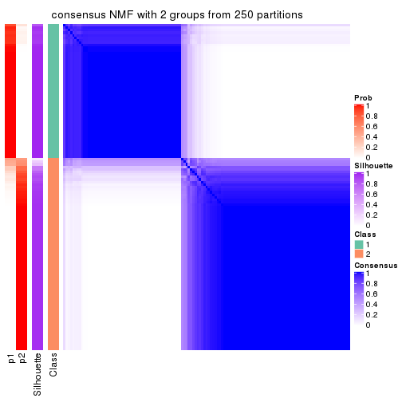</p>

</div>
<div id='tab-CV-NMF-consensus-heatmap-2'>
<pre><code class="r">consensus_heatmap(res, k = 3)
</code></pre>

<p>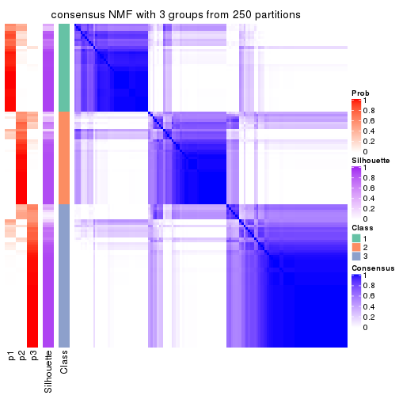</p>

</div>
<div id='tab-CV-NMF-consensus-heatmap-3'>
<pre><code class="r">consensus_heatmap(res, k = 4)
</code></pre>

<p>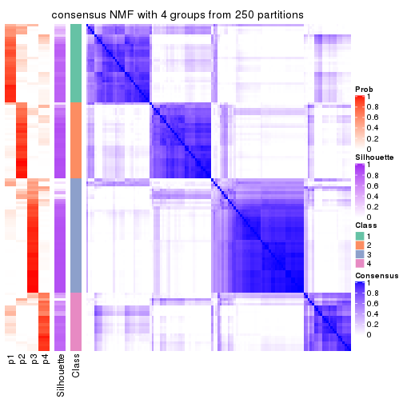</p>

</div>
<div id='tab-CV-NMF-consensus-heatmap-4'>
<pre><code class="r">consensus_heatmap(res, k = 5)
</code></pre>

<p>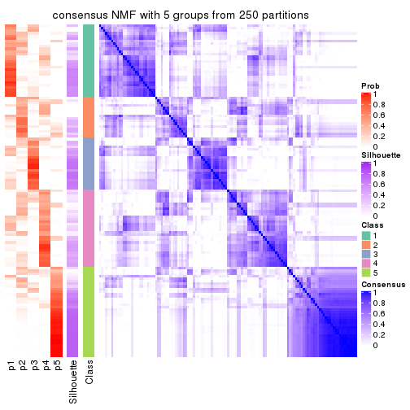</p>

</div>
<div id='tab-CV-NMF-consensus-heatmap-5'>
<pre><code class="r">consensus_heatmap(res, k = 6)
</code></pre>

<p>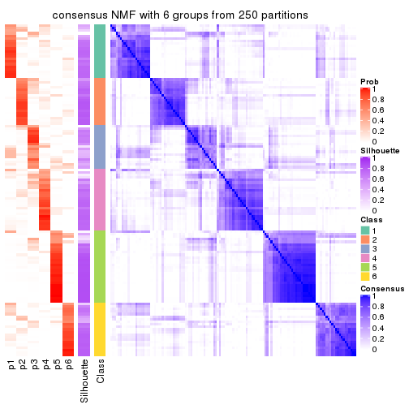</p>

</div>
</div>

Heatmaps for the membership of samples in all partitions to see how consistent they are:


<script>
$( function() {
	$( '#tabs-CV-NMF-membership-heatmap' ).tabs();
} );
</script>
<div id='tabs-CV-NMF-membership-heatmap'>
<ul>
<li><a href='#tab-CV-NMF-membership-heatmap-1'>k = 2</a></li>
<li><a href='#tab-CV-NMF-membership-heatmap-2'>k = 3</a></li>
<li><a href='#tab-CV-NMF-membership-heatmap-3'>k = 4</a></li>
<li><a href='#tab-CV-NMF-membership-heatmap-4'>k = 5</a></li>
<li><a href='#tab-CV-NMF-membership-heatmap-5'>k = 6</a></li>
</ul>
<div id='tab-CV-NMF-membership-heatmap-1'>
<pre><code class="r">membership_heatmap(res, k = 2)
</code></pre>

<p>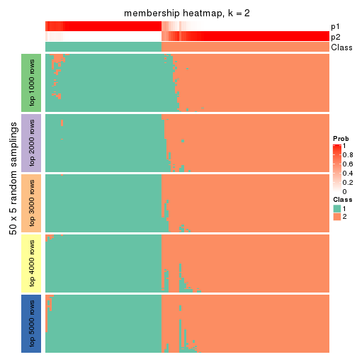</p>

</div>
<div id='tab-CV-NMF-membership-heatmap-2'>
<pre><code class="r">membership_heatmap(res, k = 3)
</code></pre>

<p>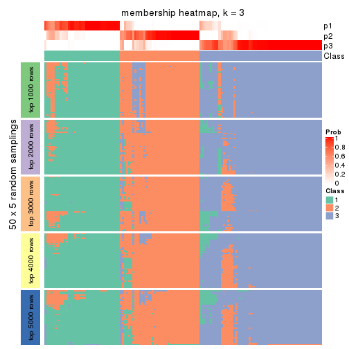</p>

</div>
<div id='tab-CV-NMF-membership-heatmap-3'>
<pre><code class="r">membership_heatmap(res, k = 4)
</code></pre>

<p>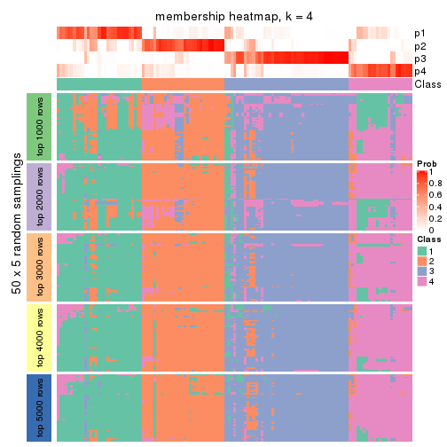</p>

</div>
<div id='tab-CV-NMF-membership-heatmap-4'>
<pre><code class="r">membership_heatmap(res, k = 5)
</code></pre>

<p>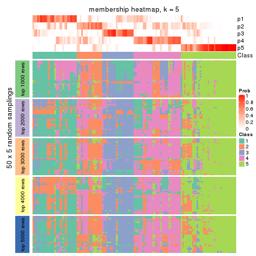</p>

</div>
<div id='tab-CV-NMF-membership-heatmap-5'>
<pre><code class="r">membership_heatmap(res, k = 6)
</code></pre>

<p>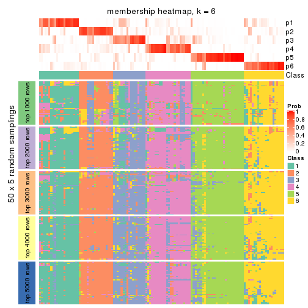</p>

</div>
</div>

As soon as we have had the classes for columns, we can look for signatures
which are significantly different between classes which can be candidate marks
for certain classes. Following are the heatmaps for signatures.


Signature heatmaps where rows are scaled:


<script>
$( function() {
	$( '#tabs-CV-NMF-get-signatures' ).tabs();
} );
</script>
<div id='tabs-CV-NMF-get-signatures'>
<ul>
<li><a href='#tab-CV-NMF-get-signatures-1'>k = 2</a></li>
<li><a href='#tab-CV-NMF-get-signatures-2'>k = 3</a></li>
<li><a href='#tab-CV-NMF-get-signatures-3'>k = 4</a></li>
<li><a href='#tab-CV-NMF-get-signatures-4'>k = 5</a></li>
<li><a href='#tab-CV-NMF-get-signatures-5'>k = 6</a></li>
</ul>
<div id='tab-CV-NMF-get-signatures-1'>
<pre><code class="r">get_signatures(res, k = 2)
</code></pre>

<p>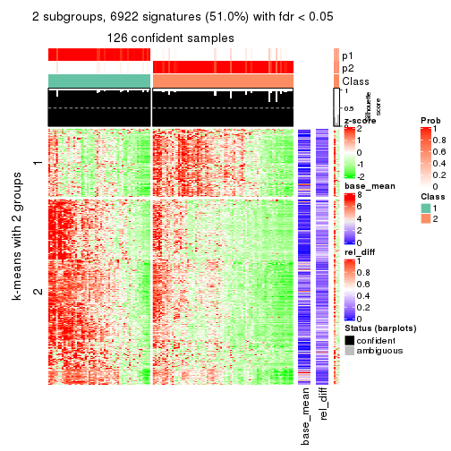</p>

</div>
<div id='tab-CV-NMF-get-signatures-2'>
<pre><code class="r">get_signatures(res, k = 3)
</code></pre>

<p>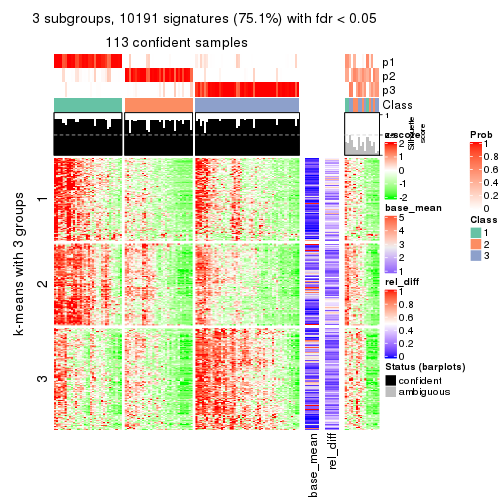</p>

</div>
<div id='tab-CV-NMF-get-signatures-3'>
<pre><code class="r">get_signatures(res, k = 4)
</code></pre>

<p>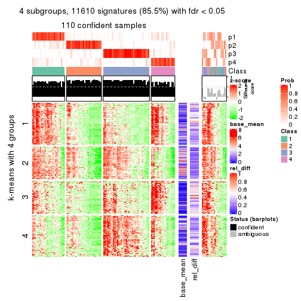</p>

</div>
<div id='tab-CV-NMF-get-signatures-4'>
<pre><code class="r">get_signatures(res, k = 5)
</code></pre>

<p>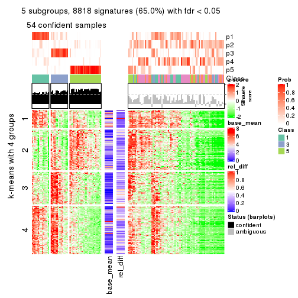</p>

</div>
<div id='tab-CV-NMF-get-signatures-5'>
<pre><code class="r">get_signatures(res, k = 6)
</code></pre>

<p>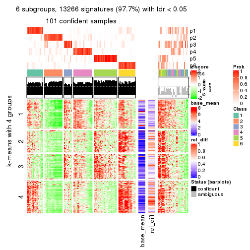</p>

</div>
</div>


Signature heatmaps where rows are not scaled:


<script>
$( function() {
	$( '#tabs-CV-NMF-get-signatures-no-scale' ).tabs();
} );
</script>
<div id='tabs-CV-NMF-get-signatures-no-scale'>
<ul>
<li><a href='#tab-CV-NMF-get-signatures-no-scale-1'>k = 2</a></li>
<li><a href='#tab-CV-NMF-get-signatures-no-scale-2'>k = 3</a></li>
<li><a href='#tab-CV-NMF-get-signatures-no-scale-3'>k = 4</a></li>
<li><a href='#tab-CV-NMF-get-signatures-no-scale-4'>k = 5</a></li>
<li><a href='#tab-CV-NMF-get-signatures-no-scale-5'>k = 6</a></li>
</ul>
<div id='tab-CV-NMF-get-signatures-no-scale-1'>
<pre><code class="r">get_signatures(res, k = 2, scale_rows = FALSE)
</code></pre>

<p>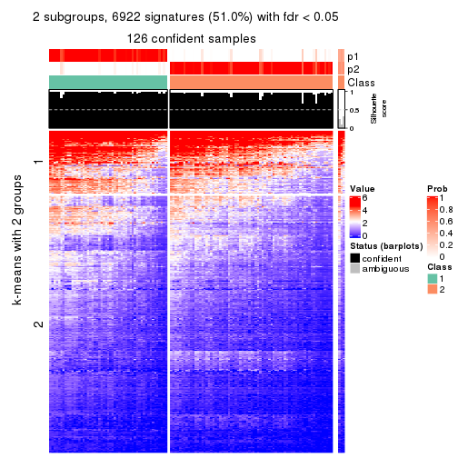</p>

</div>
<div id='tab-CV-NMF-get-signatures-no-scale-2'>
<pre><code class="r">get_signatures(res, k = 3, scale_rows = FALSE)
</code></pre>

<p>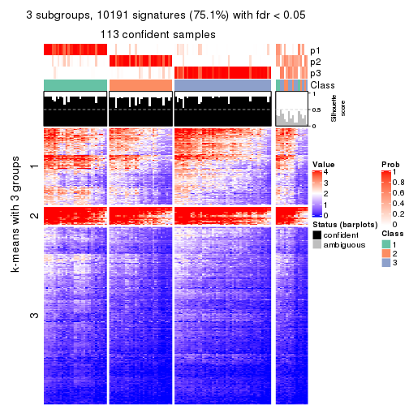</p>

</div>
<div id='tab-CV-NMF-get-signatures-no-scale-3'>
<pre><code class="r">get_signatures(res, k = 4, scale_rows = FALSE)
</code></pre>

<p>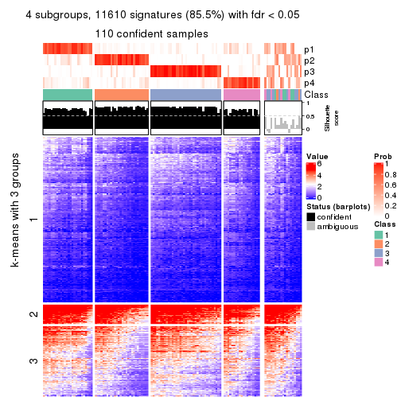</p>

</div>
<div id='tab-CV-NMF-get-signatures-no-scale-4'>
<pre><code class="r">get_signatures(res, k = 5, scale_rows = FALSE)
</code></pre>

<p>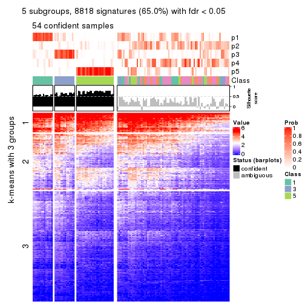</p>

</div>
<div id='tab-CV-NMF-get-signatures-no-scale-5'>
<pre><code class="r">get_signatures(res, k = 6, scale_rows = FALSE)
</code></pre>

<p>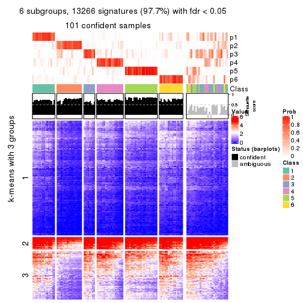</p>

</div>
</div>


Compare the overlap of signatures from different k:

```r
compare_signatures(res)
```

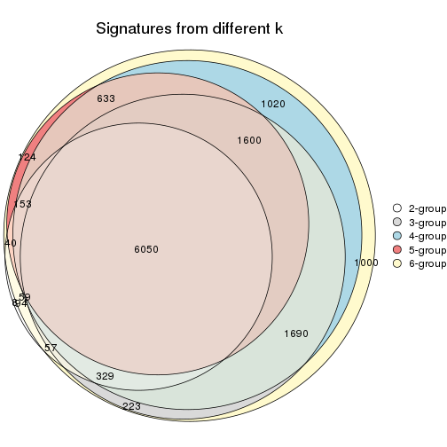

`get_signature()` returns a data frame invisibly. TO get the list of signatures, the function
call should be assigned to a variable explicitly. In following code, if `plot` argument is set
to `FALSE`, no heatmap is plotted while only the differential analysis is performed.

```r
# code only for demonstration
tb = get_signature(res, k = ..., plot = FALSE)
```

An example of the output of `tb` is:

```
#>   which_row         fdr    mean_1    mean_2 scaled_mean_1 scaled_mean_2 km
#> 1        38 0.042760348  8.373488  9.131774    -0.5533452     0.5164555  1
#> 2        40 0.018707592  7.106213  8.469186    -0.6173731     0.5762149  1
#> 3        55 0.019134737 10.221463 11.207825    -0.6159697     0.5749050  1
#> 4        59 0.006059896  5.921854  7.869574    -0.6899429     0.6439467  1
#> 5        60 0.018055526  8.928898 10.211722    -0.6204761     0.5791110  1
#> 6        98 0.009384629 15.714769 14.887706     0.6635654    -0.6193277  2
...
```

The columns in `tb` are:

1. `which_row`: row indices corresponding to the input matrix.
2. `fdr`: FDR for the differential test. 
3. `mean_x`: The mean value in group x.
4. `scaled_mean_x`: The mean value in group x after rows are scaled.
5. `km`: Row groups if k-means clustering is applied to rows.


UMAP plot which shows how samples are separated.


<script>
$( function() {
	$( '#tabs-CV-NMF-dimension-reduction' ).tabs();
} );
</script>
<div id='tabs-CV-NMF-dimension-reduction'>
<ul>
<li><a href='#tab-CV-NMF-dimension-reduction-1'>k = 2</a></li>
<li><a href='#tab-CV-NMF-dimension-reduction-2'>k = 3</a></li>
<li><a href='#tab-CV-NMF-dimension-reduction-3'>k = 4</a></li>
<li><a href='#tab-CV-NMF-dimension-reduction-4'>k = 5</a></li>
<li><a href='#tab-CV-NMF-dimension-reduction-5'>k = 6</a></li>
</ul>
<div id='tab-CV-NMF-dimension-reduction-1'>
<pre><code class="r">dimension_reduction(res, k = 2, method = &quot;UMAP&quot;)
</code></pre>

<p>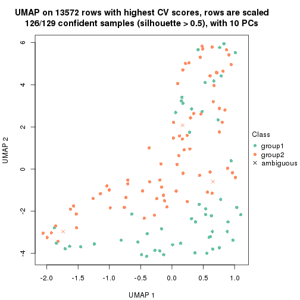</p>

</div>
<div id='tab-CV-NMF-dimension-reduction-2'>
<pre><code class="r">dimension_reduction(res, k = 3, method = &quot;UMAP&quot;)
</code></pre>

<p>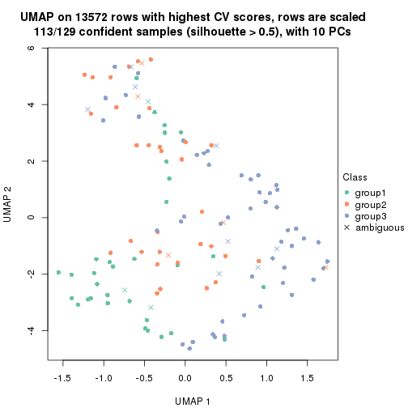</p>

</div>
<div id='tab-CV-NMF-dimension-reduction-3'>
<pre><code class="r">dimension_reduction(res, k = 4, method = &quot;UMAP&quot;)
</code></pre>

<p>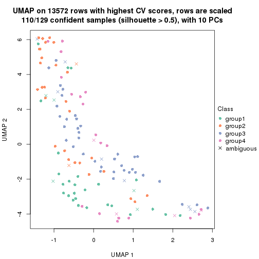</p>

</div>
<div id='tab-CV-NMF-dimension-reduction-4'>
<pre><code class="r">dimension_reduction(res, k = 5, method = &quot;UMAP&quot;)
</code></pre>

<p>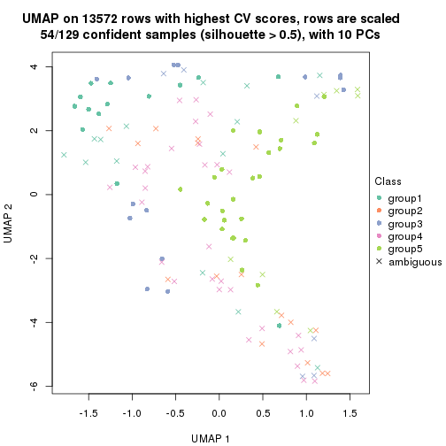</p>

</div>
<div id='tab-CV-NMF-dimension-reduction-5'>
<pre><code class="r">dimension_reduction(res, k = 6, method = &quot;UMAP&quot;)
</code></pre>

<p>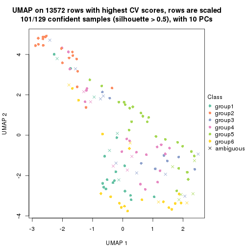</p>

</div>
</div>


Following heatmap shows how subgroups are split when increasing `k`:

```r
collect_classes(res)
```

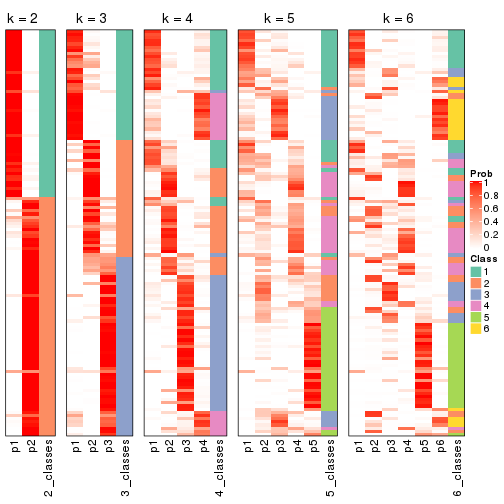


If matrix rows can be associated to genes, consider to use `GO_Enrichment(res,
...)` to perform function enrichment for the signature genes.


 

---------------------------------------------------


### MAD:hclust


The object with results only for a single top-value method and a single partition method 
can be extracted as:

```r
res = res_list["MAD", "hclust"]
# you can also extract it by
# res = res_list["MAD:hclust"]
```

A summary of `res` and all the functions that can be applied to it:

```r
res
```

```
#> A 'ConsensusPartition' object with k = 2, 3, 4, 5, 6.
#>   On a matrix with 13572 rows and 129 columns.
#>   Top rows (1000, 2000, 3000, 4000, 5000) are extracted by 'MAD' method.
#>   Subgroups are detected by 'hclust' method.
#>   Performed in total 1250 partitions by row resampling.
#>   Best k for subgroups seems to be 3.
#> 
#> Following methods can be applied to this 'ConsensusPartition' object:
#>  [1] "cola_report"             "collect_classes"         "collect_plots"          
#>  [4] "collect_stats"           "colnames"                "compare_signatures"     
#>  [7] "consensus_heatmap"       "dimension_reduction"     "functional_enrichment"  
#> [10] "get_anno_col"            "get_anno"                "get_classes"            
#> [13] "get_consensus"           "get_matrix"              "get_membership"         
#> [16] "get_param"               "get_signatures"          "get_stats"              
#> [19] "is_best_k"               "is_stable_k"             "membership_heatmap"     
#> [22] "ncol"                    "nrow"                    "plot_ecdf"              
#> [25] "rownames"                "select_partition_number" "show"                   
#> [28] "suggest_best_k"          "test_to_known_factors"
```

`collect_plots()` function collects all the plots made from `res` for all `k` (number of partitions)
into one single page to provide an easy and fast comparison between different `k`.

```r
collect_plots(res)
```

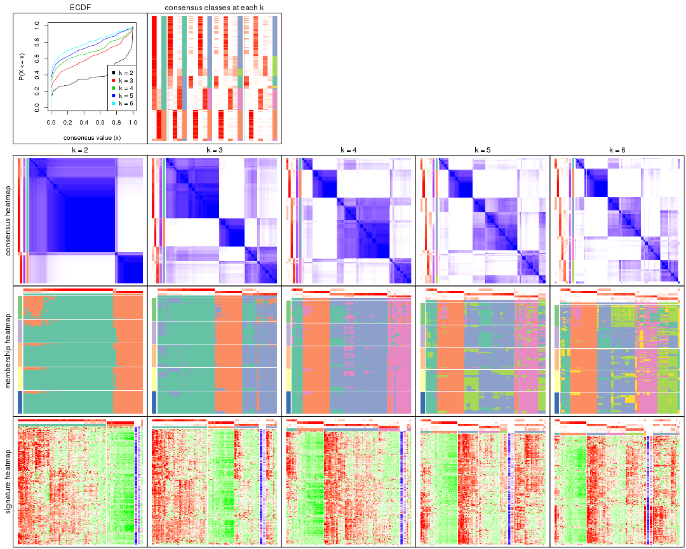

The plots are:

- The first row: a plot of the ECDF (Empirical cumulative distribution
  function) curves of the consensus matrix for each `k` and the heatmap of
  predicted classes for each `k`.
- The second row: heatmaps of the consensus matrix for each `k`.
- The third row: heatmaps of the membership matrix for each `k`.
- The fouth row: heatmaps of the signatures for each `k`.

All the plots in panels can be made by individual functions and they are
plotted later in this section.

`select_partition_number()` produces several plots showing different
statistics for choosing "optimized" `k`. There are following statistics:

- ECDF curves of the consensus matrix for each `k`;
- 1-PAC. [The PAC
  score](https://en.wikipedia.org/wiki/Consensus_clustering#Over-interpretation_potential_of_consensus_clustering)
  measures the proportion of the ambiguous subgrouping.
- Mean silhouette score.
- Concordance. The mean probability of fiting the consensus class ids in all
  partitions.
- Area increased. Denote $A_k$ as the area under the ECDF curve for current
  `k`, the area increased is defined as $A_k - A_{k-1}$.
- Rand index. The percent of pairs of samples that are both in a same cluster
  or both are not in a same cluster in the partition of k and k-1.
- Jaccard index. The ratio of pairs of samples are both in a same cluster in
  the partition of k and k-1 and the pairs of samples are both in a same
  cluster in the partition k or k-1.

The detailed explanations of these statistics can be found in [the cola
vignette](http://bioconductor.org/packages/devel/bioc/vignettes/cola/inst/doc/cola.html#toc_13).

Generally speaking, lower PAC score, higher mean silhouette score or higher
concordance corresponds to better partition. Rand index and Jaccard index
measure how similar the current partition is compared to partition with `k-1`.
If they are too similar, we won't accept `k` is better than `k-1`.

```r
select_partition_number(res)
```

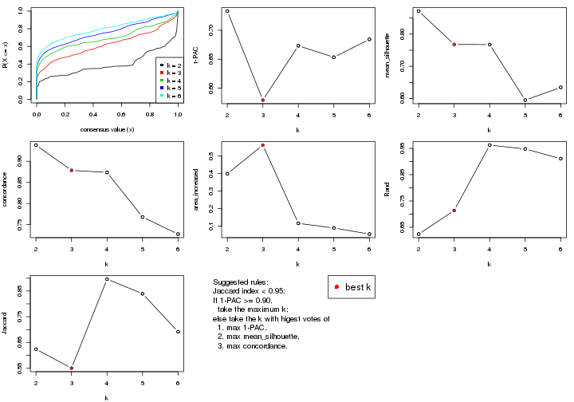

The numeric values for all these statistics can be obtained by `get_stats()`.

```r
get_stats(res)
```

```
#>   k 1-PAC mean_silhouette concordance area_increased  Rand Jaccard
#> 2 2 0.733           0.871       0.938         0.3986 0.624   0.624
#> 3 3 0.579           0.768       0.879         0.5615 0.714   0.551
#> 4 4 0.673           0.767       0.874         0.1158 0.962   0.896
#> 5 5 0.653           0.595       0.768         0.0895 0.948   0.839
#> 6 6 0.684           0.634       0.728         0.0546 0.911   0.692
```

`suggest_best_k()` suggests the best $k$ based on these statistics. The rules are as follows:

- All $k$ with Jaccard index larger than 0.95 are removed because the increase of
  the partition number does not provides enough extra information. If all $k$ are removed,
  the best $k$ is assigned by `NA`.
- For $k$ with 1-PAC larger than 0.9, the maximal $k$ is taken as the "best k". Other $k$ is called "optional k".
- If it does not fit the second rule. The $k$ with the highest vote of highest
  1-PAC, mean silhouette and concordance is taken as the "best k".

```r
suggest_best_k(res)
```

```
#> [1] 3
```


Following shows the table of the partitions (You need to click the **show/hide
code output** link to see it). The membership matrix (columns with name `p*`)
is inferred by
[`clue::cl_consensus()`](https://www.rdocumentation.org/link/cl_consensus?package=clue)
function with the `SE` method. Basically the value in the membership matrix
represents the probability to belong to a certain group. The finall class
label for an item is determined with the group with highest probability it
belongs to.

In `get_classes()` function, the entropy is calculated from the membership
matrix and the silhouette score is calculated from the consensus matrix.


<script>
$( function() {
	$( '#tabs-MAD-hclust-get-classes' ).tabs();
} );
</script>
<div id='tabs-MAD-hclust-get-classes'>
<ul>
<li><a href='#tab-MAD-hclust-get-classes-1'>k = 2</a></li>
<li><a href='#tab-MAD-hclust-get-classes-2'>k = 3</a></li>
<li><a href='#tab-MAD-hclust-get-classes-3'>k = 4</a></li>
<li><a href='#tab-MAD-hclust-get-classes-4'>k = 5</a></li>
<li><a href='#tab-MAD-hclust-get-classes-5'>k = 6</a></li>
</ul>

<div id='tab-MAD-hclust-get-classes-1'>
<p><a id='tab-MAD-hclust-get-classes-1-a' style='color:#0366d6' href='#'>show/hide code output</a></p>
<pre><code class="r">cbind(get_classes(res, k = 2), get_membership(res, k = 2))
</code></pre>

<pre><code>#&gt;            class entropy silhouette    p1    p2
#&gt; SRR1656463     2  0.0000     0.9468 0.000 1.000
#&gt; SRR1656464     1  0.0000     0.9266 1.000 0.000
#&gt; SRR1656462     1  0.0000     0.9266 1.000 0.000
#&gt; SRR1656465     1  0.3733     0.8902 0.928 0.072
#&gt; SRR1656467     2  0.4161     0.8690 0.084 0.916
#&gt; SRR1656466     1  0.0000     0.9266 1.000 0.000
#&gt; SRR1656468     1  0.7674     0.7586 0.776 0.224
#&gt; SRR1656472     1  0.4161     0.8835 0.916 0.084
#&gt; SRR1656471     1  0.5059     0.8608 0.888 0.112
#&gt; SRR1656470     2  0.0000     0.9468 0.000 1.000
#&gt; SRR1656469     1  0.2236     0.9121 0.964 0.036
#&gt; SRR1656473     2  0.0000     0.9468 0.000 1.000
#&gt; SRR1656474     2  0.0000     0.9468 0.000 1.000
#&gt; SRR1656475     2  0.0000     0.9468 0.000 1.000
#&gt; SRR1656478     1  0.0000     0.9266 1.000 0.000
#&gt; SRR1656477     1  0.8763     0.6618 0.704 0.296
#&gt; SRR1656479     1  0.0938     0.9228 0.988 0.012
#&gt; SRR1656480     1  0.8955     0.6368 0.688 0.312
#&gt; SRR1656476     2  0.0000     0.9468 0.000 1.000
#&gt; SRR1656481     1  0.7602     0.7626 0.780 0.220
#&gt; SRR1656482     2  0.0000     0.9468 0.000 1.000
#&gt; SRR1656483     2  0.0000     0.9468 0.000 1.000
#&gt; SRR1656485     1  0.0000     0.9266 1.000 0.000
#&gt; SRR1656487     1  0.0000     0.9266 1.000 0.000
#&gt; SRR1656486     1  0.0000     0.9266 1.000 0.000
#&gt; SRR1656488     1  0.0000     0.9266 1.000 0.000
#&gt; SRR1656484     1  0.0000     0.9266 1.000 0.000
#&gt; SRR1656489     1  0.0000     0.9266 1.000 0.000
#&gt; SRR1656491     1  0.2603     0.9090 0.956 0.044
#&gt; SRR1656490     1  0.1184     0.9213 0.984 0.016
#&gt; SRR1656492     1  0.0000     0.9266 1.000 0.000
#&gt; SRR1656493     1  0.1184     0.9214 0.984 0.016
#&gt; SRR1656495     1  0.1184     0.9214 0.984 0.016
#&gt; SRR1656496     1  0.0938     0.9228 0.988 0.012
#&gt; SRR1656494     2  0.1414     0.9356 0.020 0.980
#&gt; SRR1656497     2  0.0000     0.9468 0.000 1.000
#&gt; SRR1656499     1  0.0000     0.9266 1.000 0.000
#&gt; SRR1656500     1  0.0000     0.9266 1.000 0.000
#&gt; SRR1656501     1  0.0000     0.9266 1.000 0.000
#&gt; SRR1656498     1  0.0000     0.9266 1.000 0.000
#&gt; SRR1656504     2  0.0000     0.9468 0.000 1.000
#&gt; SRR1656502     1  0.4161     0.8835 0.916 0.084
#&gt; SRR1656503     1  0.0000     0.9266 1.000 0.000
#&gt; SRR1656507     1  0.0000     0.9266 1.000 0.000
#&gt; SRR1656508     1  0.0000     0.9266 1.000 0.000
#&gt; SRR1656505     1  0.8909     0.6423 0.692 0.308
#&gt; SRR1656506     1  0.0000     0.9266 1.000 0.000
#&gt; SRR1656509     1  0.7950     0.7395 0.760 0.240
#&gt; SRR1656510     1  0.4562     0.8735 0.904 0.096
#&gt; SRR1656511     1  0.8909     0.6428 0.692 0.308
#&gt; SRR1656513     2  0.1184     0.9388 0.016 0.984
#&gt; SRR1656512     2  0.0000     0.9468 0.000 1.000
#&gt; SRR1656514     1  0.0000     0.9266 1.000 0.000
#&gt; SRR1656515     2  0.8713     0.5264 0.292 0.708
#&gt; SRR1656516     1  0.0000     0.9266 1.000 0.000
#&gt; SRR1656518     1  0.0000     0.9266 1.000 0.000
#&gt; SRR1656517     1  0.0000     0.9266 1.000 0.000
#&gt; SRR1656519     1  0.0000     0.9266 1.000 0.000
#&gt; SRR1656522     1  0.0000     0.9266 1.000 0.000
#&gt; SRR1656523     1  0.7883     0.7435 0.764 0.236
#&gt; SRR1656521     2  0.0000     0.9468 0.000 1.000
#&gt; SRR1656520     1  0.0000     0.9266 1.000 0.000
#&gt; SRR1656524     1  0.1184     0.9214 0.984 0.016
#&gt; SRR1656525     1  0.0000     0.9266 1.000 0.000
#&gt; SRR1656526     2  0.0000     0.9468 0.000 1.000
#&gt; SRR1656527     2  0.1184     0.9388 0.016 0.984
#&gt; SRR1656530     1  0.0000     0.9266 1.000 0.000
#&gt; SRR1656529     1  0.0000     0.9266 1.000 0.000
#&gt; SRR1656531     1  0.0000     0.9266 1.000 0.000
#&gt; SRR1656528     1  0.0000     0.9266 1.000 0.000
#&gt; SRR1656534     1  0.0000     0.9266 1.000 0.000
#&gt; SRR1656533     1  0.0000     0.9266 1.000 0.000
#&gt; SRR1656536     1  0.2948     0.9042 0.948 0.052
#&gt; SRR1656532     2  0.1184     0.9388 0.016 0.984
#&gt; SRR1656537     1  0.0000     0.9266 1.000 0.000
#&gt; SRR1656538     1  0.0000     0.9266 1.000 0.000
#&gt; SRR1656535     2  0.0376     0.9450 0.004 0.996
#&gt; SRR1656539     1  0.2948     0.9042 0.948 0.052
#&gt; SRR1656544     1  0.0000     0.9266 1.000 0.000
#&gt; SRR1656542     1  0.0000     0.9266 1.000 0.000
#&gt; SRR1656543     1  0.0000     0.9266 1.000 0.000
#&gt; SRR1656545     2  0.0000     0.9468 0.000 1.000
#&gt; SRR1656540     1  0.0000     0.9266 1.000 0.000
#&gt; SRR1656546     1  0.3584     0.8931 0.932 0.068
#&gt; SRR1656541     2  0.0000     0.9468 0.000 1.000
#&gt; SRR1656547     2  0.9970    -0.0244 0.468 0.532
#&gt; SRR1656548     1  0.0000     0.9266 1.000 0.000
#&gt; SRR1656549     1  0.1414     0.9194 0.980 0.020
#&gt; SRR1656551     1  0.2948     0.9042 0.948 0.052
#&gt; SRR1656553     1  0.0000     0.9266 1.000 0.000
#&gt; SRR1656550     1  0.9000     0.6298 0.684 0.316
#&gt; SRR1656552     1  0.8267     0.7132 0.740 0.260
#&gt; SRR1656554     1  0.0000     0.9266 1.000 0.000
#&gt; SRR1656555     1  0.6343     0.8228 0.840 0.160
#&gt; SRR1656556     1  0.6531     0.8143 0.832 0.168
#&gt; SRR1656557     1  0.0000     0.9266 1.000 0.000
#&gt; SRR1656558     1  0.0000     0.9266 1.000 0.000
#&gt; SRR1656559     1  0.0000     0.9266 1.000 0.000
#&gt; SRR1656560     1  0.0000     0.9266 1.000 0.000
#&gt; SRR1656561     1  0.0000     0.9266 1.000 0.000
#&gt; SRR1656562     1  0.8713     0.6679 0.708 0.292
#&gt; SRR1656563     1  0.0000     0.9266 1.000 0.000
#&gt; SRR1656564     2  0.0000     0.9468 0.000 1.000
#&gt; SRR1656565     2  0.2603     0.9136 0.044 0.956
#&gt; SRR1656566     1  0.0000     0.9266 1.000 0.000
#&gt; SRR1656568     2  0.0000     0.9468 0.000 1.000
#&gt; SRR1656567     1  0.9000     0.6298 0.684 0.316
#&gt; SRR1656569     1  0.0000     0.9266 1.000 0.000
#&gt; SRR1656570     1  0.0000     0.9266 1.000 0.000
#&gt; SRR1656571     2  0.0000     0.9468 0.000 1.000
#&gt; SRR1656573     1  0.2423     0.9110 0.960 0.040
#&gt; SRR1656572     1  0.8909     0.6428 0.692 0.308
#&gt; SRR1656574     1  0.0000     0.9266 1.000 0.000
#&gt; SRR1656575     1  0.0000     0.9266 1.000 0.000
#&gt; SRR1656576     1  0.9044     0.6218 0.680 0.320
#&gt; SRR1656578     2  0.1184     0.9388 0.016 0.984
#&gt; SRR1656577     1  0.0000     0.9266 1.000 0.000
#&gt; SRR1656579     2  0.9944     0.0226 0.456 0.544
#&gt; SRR1656580     1  0.0000     0.9266 1.000 0.000
#&gt; SRR1656581     1  0.7883     0.7435 0.764 0.236
#&gt; SRR1656582     2  0.0000     0.9468 0.000 1.000
#&gt; SRR1656585     1  0.8081     0.7295 0.752 0.248
#&gt; SRR1656584     1  0.0000     0.9266 1.000 0.000
#&gt; SRR1656583     1  0.8386     0.7029 0.732 0.268
#&gt; SRR1656586     2  0.0000     0.9468 0.000 1.000
#&gt; SRR1656587     1  0.8081     0.7295 0.752 0.248
#&gt; SRR1656588     1  0.9358     0.5596 0.648 0.352
#&gt; SRR1656589     2  0.0000     0.9468 0.000 1.000
#&gt; SRR1656590     1  0.0000     0.9266 1.000 0.000
</code></pre>

<script>
$('#tab-MAD-hclust-get-classes-1-a').parent().next().next().hide();
$('#tab-MAD-hclust-get-classes-1-a').click(function(){
  $('#tab-MAD-hclust-get-classes-1-a').parent().next().next().toggle();
  return(false);
});
</script>
</div>

<div id='tab-MAD-hclust-get-classes-2'>
<p><a id='tab-MAD-hclust-get-classes-2-a' style='color:#0366d6' href='#'>show/hide code output</a></p>
<pre><code class="r">cbind(get_classes(res, k = 3), get_membership(res, k = 3))
</code></pre>

<pre><code>#&gt;            class entropy silhouette    p1    p2    p3
#&gt; SRR1656463     2  0.0000      0.948 0.000 1.000 0.000
#&gt; SRR1656464     1  0.4121      0.757 0.832 0.000 0.168
#&gt; SRR1656462     1  0.0000      0.887 1.000 0.000 0.000
#&gt; SRR1656465     1  0.3551      0.802 0.868 0.000 0.132
#&gt; SRR1656467     2  0.5431      0.695 0.000 0.716 0.284
#&gt; SRR1656466     1  0.1163      0.881 0.972 0.000 0.028
#&gt; SRR1656468     3  0.4056      0.746 0.092 0.032 0.876
#&gt; SRR1656472     3  0.5016      0.665 0.240 0.000 0.760
#&gt; SRR1656471     1  0.4654      0.723 0.792 0.000 0.208
#&gt; SRR1656470     2  0.0000      0.948 0.000 1.000 0.000
#&gt; SRR1656469     1  0.4750      0.711 0.784 0.000 0.216
#&gt; SRR1656473     2  0.0000      0.948 0.000 1.000 0.000
#&gt; SRR1656474     2  0.0000      0.948 0.000 1.000 0.000
#&gt; SRR1656475     2  0.0000      0.948 0.000 1.000 0.000
#&gt; SRR1656478     1  0.3551      0.828 0.868 0.000 0.132
#&gt; SRR1656477     3  0.2550      0.718 0.012 0.056 0.932
#&gt; SRR1656479     1  0.5497      0.590 0.708 0.000 0.292
#&gt; SRR1656480     3  0.2356      0.708 0.000 0.072 0.928
#&gt; SRR1656476     2  0.0000      0.948 0.000 1.000 0.000
#&gt; SRR1656481     3  0.4068      0.741 0.120 0.016 0.864
#&gt; SRR1656482     2  0.2165      0.926 0.000 0.936 0.064
#&gt; SRR1656483     2  0.0000      0.948 0.000 1.000 0.000
#&gt; SRR1656485     1  0.0000      0.887 1.000 0.000 0.000
#&gt; SRR1656487     1  0.1289      0.880 0.968 0.000 0.032
#&gt; SRR1656486     1  0.3619      0.829 0.864 0.000 0.136
#&gt; SRR1656488     1  0.0000      0.887 1.000 0.000 0.000
#&gt; SRR1656484     1  0.3752      0.819 0.856 0.000 0.144
#&gt; SRR1656489     1  0.1411      0.882 0.964 0.000 0.036
#&gt; SRR1656491     1  0.5678      0.525 0.684 0.000 0.316
#&gt; SRR1656490     1  0.5678      0.538 0.684 0.000 0.316
#&gt; SRR1656492     1  0.0424      0.888 0.992 0.000 0.008
#&gt; SRR1656493     3  0.5810      0.527 0.336 0.000 0.664
#&gt; SRR1656495     3  0.5733      0.543 0.324 0.000 0.676
#&gt; SRR1656496     1  0.5327      0.628 0.728 0.000 0.272
#&gt; SRR1656494     2  0.3941      0.865 0.000 0.844 0.156
#&gt; SRR1656497     2  0.0000      0.948 0.000 1.000 0.000
#&gt; SRR1656499     1  0.0000      0.887 1.000 0.000 0.000
#&gt; SRR1656500     1  0.0000      0.887 1.000 0.000 0.000
#&gt; SRR1656501     1  0.3619      0.829 0.864 0.000 0.136
#&gt; SRR1656498     3  0.6299      0.206 0.476 0.000 0.524
#&gt; SRR1656504     2  0.0000      0.948 0.000 1.000 0.000
#&gt; SRR1656502     3  0.5016      0.665 0.240 0.000 0.760
#&gt; SRR1656503     1  0.1163      0.883 0.972 0.000 0.028
#&gt; SRR1656507     1  0.3551      0.828 0.868 0.000 0.132
#&gt; SRR1656508     1  0.3619      0.825 0.864 0.000 0.136
#&gt; SRR1656505     3  0.2356      0.709 0.000 0.072 0.928
#&gt; SRR1656506     1  0.2165      0.863 0.936 0.000 0.064
#&gt; SRR1656509     3  0.1964      0.740 0.056 0.000 0.944
#&gt; SRR1656510     3  0.5536      0.681 0.236 0.012 0.752
#&gt; SRR1656511     3  0.3695      0.702 0.012 0.108 0.880
#&gt; SRR1656513     2  0.3816      0.871 0.000 0.852 0.148
#&gt; SRR1656512     2  0.0000      0.948 0.000 1.000 0.000
#&gt; SRR1656514     1  0.0424      0.887 0.992 0.000 0.008
#&gt; SRR1656515     3  0.6302     -0.150 0.000 0.480 0.520
#&gt; SRR1656516     1  0.0747      0.887 0.984 0.000 0.016
#&gt; SRR1656518     1  0.3619      0.829 0.864 0.000 0.136
#&gt; SRR1656517     1  0.3267      0.842 0.884 0.000 0.116
#&gt; SRR1656519     1  0.0000      0.887 1.000 0.000 0.000
#&gt; SRR1656522     1  0.0000      0.887 1.000 0.000 0.000
#&gt; SRR1656523     3  0.4179      0.743 0.072 0.052 0.876
#&gt; SRR1656521     2  0.0000      0.948 0.000 1.000 0.000
#&gt; SRR1656520     1  0.0424      0.887 0.992 0.000 0.008
#&gt; SRR1656524     3  0.5733      0.543 0.324 0.000 0.676
#&gt; SRR1656525     1  0.0000      0.887 1.000 0.000 0.000
#&gt; SRR1656526     2  0.1964      0.930 0.000 0.944 0.056
#&gt; SRR1656527     2  0.3619      0.880 0.000 0.864 0.136
#&gt; SRR1656530     1  0.1163      0.881 0.972 0.000 0.028
#&gt; SRR1656529     1  0.1753      0.873 0.952 0.000 0.048
#&gt; SRR1656531     3  0.6180      0.383 0.416 0.000 0.584
#&gt; SRR1656528     1  0.0237      0.886 0.996 0.000 0.004
#&gt; SRR1656534     1  0.0000      0.887 1.000 0.000 0.000
#&gt; SRR1656533     1  0.3267      0.842 0.884 0.000 0.116
#&gt; SRR1656536     1  0.5678      0.531 0.684 0.000 0.316
#&gt; SRR1656532     2  0.3816      0.871 0.000 0.852 0.148
#&gt; SRR1656537     3  0.6295      0.211 0.472 0.000 0.528
#&gt; SRR1656538     1  0.0747      0.887 0.984 0.000 0.016
#&gt; SRR1656535     2  0.0237      0.947 0.000 0.996 0.004
#&gt; SRR1656539     1  0.5650      0.540 0.688 0.000 0.312
#&gt; SRR1656544     1  0.0000      0.887 1.000 0.000 0.000
#&gt; SRR1656542     1  0.0000      0.887 1.000 0.000 0.000
#&gt; SRR1656543     1  0.0000      0.887 1.000 0.000 0.000
#&gt; SRR1656545     2  0.0000      0.948 0.000 1.000 0.000
#&gt; SRR1656540     1  0.0424      0.887 0.992 0.000 0.008
#&gt; SRR1656546     3  0.5465      0.602 0.288 0.000 0.712
#&gt; SRR1656541     2  0.1964      0.930 0.000 0.944 0.056
#&gt; SRR1656547     3  0.6307      0.368 0.012 0.328 0.660
#&gt; SRR1656548     1  0.0424      0.887 0.992 0.000 0.008
#&gt; SRR1656549     3  0.6079      0.441 0.388 0.000 0.612
#&gt; SRR1656551     1  0.5678      0.531 0.684 0.000 0.316
#&gt; SRR1656553     1  0.1163      0.883 0.972 0.000 0.028
#&gt; SRR1656550     3  0.2448      0.706 0.000 0.076 0.924
#&gt; SRR1656552     3  0.4914      0.732 0.068 0.088 0.844
#&gt; SRR1656554     1  0.2165      0.863 0.936 0.000 0.064
#&gt; SRR1656555     3  0.4741      0.732 0.152 0.020 0.828
#&gt; SRR1656556     3  0.6495      0.158 0.460 0.004 0.536
#&gt; SRR1656557     1  0.0000      0.887 1.000 0.000 0.000
#&gt; SRR1656558     1  0.3551      0.828 0.868 0.000 0.132
#&gt; SRR1656559     1  0.0000      0.887 1.000 0.000 0.000
#&gt; SRR1656560     1  0.1163      0.881 0.972 0.000 0.028
#&gt; SRR1656561     1  0.0424      0.887 0.992 0.000 0.008
#&gt; SRR1656562     3  0.2845      0.719 0.012 0.068 0.920
#&gt; SRR1656563     1  0.3686      0.822 0.860 0.000 0.140
#&gt; SRR1656564     2  0.0424      0.947 0.000 0.992 0.008
#&gt; SRR1656565     2  0.4121      0.850 0.000 0.832 0.168
#&gt; SRR1656566     3  0.6180      0.377 0.416 0.000 0.584
#&gt; SRR1656568     2  0.0424      0.947 0.000 0.992 0.008
#&gt; SRR1656567     3  0.2448      0.706 0.000 0.076 0.924
#&gt; SRR1656569     1  0.2165      0.863 0.936 0.000 0.064
#&gt; SRR1656570     1  0.3686      0.822 0.860 0.000 0.140
#&gt; SRR1656571     2  0.0000      0.948 0.000 1.000 0.000
#&gt; SRR1656573     1  0.6057      0.472 0.656 0.004 0.340
#&gt; SRR1656572     3  0.3695      0.702 0.012 0.108 0.880
#&gt; SRR1656574     1  0.2796      0.856 0.908 0.000 0.092
#&gt; SRR1656575     1  0.3619      0.829 0.864 0.000 0.136
#&gt; SRR1656576     3  0.3038      0.696 0.000 0.104 0.896
#&gt; SRR1656578     2  0.3816      0.871 0.000 0.852 0.148
#&gt; SRR1656577     1  0.1031      0.884 0.976 0.000 0.024
#&gt; SRR1656579     3  0.5733      0.364 0.000 0.324 0.676
#&gt; SRR1656580     1  0.0747      0.887 0.984 0.000 0.016
#&gt; SRR1656581     3  0.4179      0.743 0.072 0.052 0.876
#&gt; SRR1656582     2  0.1860      0.932 0.000 0.948 0.052
#&gt; SRR1656585     3  0.2280      0.738 0.052 0.008 0.940
#&gt; SRR1656584     3  0.6180      0.377 0.416 0.000 0.584
#&gt; SRR1656583     3  0.2443      0.730 0.032 0.028 0.940
#&gt; SRR1656586     2  0.0000      0.948 0.000 1.000 0.000
#&gt; SRR1656587     3  0.2280      0.738 0.052 0.008 0.940
#&gt; SRR1656588     3  0.3192      0.680 0.000 0.112 0.888
#&gt; SRR1656589     2  0.0000      0.948 0.000 1.000 0.000
#&gt; SRR1656590     3  0.6291      0.218 0.468 0.000 0.532
</code></pre>

<script>
$('#tab-MAD-hclust-get-classes-2-a').parent().next().next().hide();
$('#tab-MAD-hclust-get-classes-2-a').click(function(){
  $('#tab-MAD-hclust-get-classes-2-a').parent().next().next().toggle();
  return(false);
});
</script>
</div>

<div id='tab-MAD-hclust-get-classes-3'>
<p><a id='tab-MAD-hclust-get-classes-3-a' style='color:#0366d6' href='#'>show/hide code output</a></p>
<pre><code class="r">cbind(get_classes(res, k = 4), get_membership(res, k = 4))
</code></pre>

<pre><code>#&gt;            class entropy silhouette    p1    p2    p3    p4
#&gt; SRR1656463     2  0.0000     0.9388 0.000 1.000 0.000 0.000
#&gt; SRR1656464     3  0.5085     0.5314 0.304 0.000 0.676 0.020
#&gt; SRR1656462     3  0.0000     0.8213 0.000 0.000 1.000 0.000
#&gt; SRR1656465     3  0.3266     0.7455 0.000 0.000 0.832 0.168
#&gt; SRR1656467     2  0.4454     0.6080 0.000 0.692 0.000 0.308
#&gt; SRR1656466     3  0.1022     0.8166 0.000 0.000 0.968 0.032
#&gt; SRR1656468     4  0.2179     0.8089 0.000 0.012 0.064 0.924
#&gt; SRR1656472     1  0.4284     0.6440 0.780 0.000 0.020 0.200
#&gt; SRR1656471     3  0.4262     0.6831 0.008 0.000 0.756 0.236
#&gt; SRR1656470     2  0.0000     0.9388 0.000 1.000 0.000 0.000
#&gt; SRR1656469     3  0.4262     0.6654 0.008 0.000 0.756 0.236
#&gt; SRR1656473     2  0.0000     0.9388 0.000 1.000 0.000 0.000
#&gt; SRR1656474     2  0.0000     0.9388 0.000 1.000 0.000 0.000
#&gt; SRR1656475     2  0.0000     0.9388 0.000 1.000 0.000 0.000
#&gt; SRR1656478     3  0.4500     0.5912 0.316 0.000 0.684 0.000
#&gt; SRR1656477     4  0.1109     0.8341 0.000 0.028 0.004 0.968
#&gt; SRR1656479     3  0.6501     0.5357 0.116 0.000 0.616 0.268
#&gt; SRR1656480     4  0.1302     0.8358 0.000 0.044 0.000 0.956
#&gt; SRR1656476     2  0.0000     0.9388 0.000 1.000 0.000 0.000
#&gt; SRR1656481     4  0.2081     0.7811 0.000 0.000 0.084 0.916
#&gt; SRR1656482     2  0.1867     0.9129 0.000 0.928 0.000 0.072
#&gt; SRR1656483     2  0.0000     0.9388 0.000 1.000 0.000 0.000
#&gt; SRR1656485     3  0.0000     0.8213 0.000 0.000 1.000 0.000
#&gt; SRR1656487     3  0.1118     0.8165 0.000 0.000 0.964 0.036
#&gt; SRR1656486     3  0.4564     0.5803 0.328 0.000 0.672 0.000
#&gt; SRR1656488     3  0.0000     0.8213 0.000 0.000 1.000 0.000
#&gt; SRR1656484     3  0.4722     0.6123 0.300 0.000 0.692 0.008
#&gt; SRR1656489     3  0.2469     0.7861 0.108 0.000 0.892 0.000
#&gt; SRR1656491     3  0.5496     0.5415 0.036 0.000 0.652 0.312
#&gt; SRR1656490     3  0.6634     0.4961 0.116 0.000 0.592 0.292
#&gt; SRR1656492     3  0.0927     0.8230 0.016 0.000 0.976 0.008
#&gt; SRR1656493     1  0.1743     0.8413 0.940 0.000 0.056 0.004
#&gt; SRR1656495     1  0.0000     0.8055 1.000 0.000 0.000 0.000
#&gt; SRR1656496     3  0.6448     0.5572 0.120 0.000 0.628 0.252
#&gt; SRR1656494     2  0.3577     0.8439 0.012 0.832 0.000 0.156
#&gt; SRR1656497     2  0.0000     0.9388 0.000 1.000 0.000 0.000
#&gt; SRR1656499     3  0.0000     0.8213 0.000 0.000 1.000 0.000
#&gt; SRR1656500     3  0.0000     0.8213 0.000 0.000 1.000 0.000
#&gt; SRR1656501     3  0.4564     0.5803 0.328 0.000 0.672 0.000
#&gt; SRR1656498     1  0.3688     0.7955 0.792 0.000 0.208 0.000
#&gt; SRR1656504     2  0.0000     0.9388 0.000 1.000 0.000 0.000
#&gt; SRR1656502     1  0.4284     0.6440 0.780 0.000 0.020 0.200
#&gt; SRR1656503     3  0.1302     0.8144 0.044 0.000 0.956 0.000
#&gt; SRR1656507     3  0.4500     0.5912 0.316 0.000 0.684 0.000
#&gt; SRR1656508     3  0.4431     0.6065 0.304 0.000 0.696 0.000
#&gt; SRR1656505     4  0.1302     0.8354 0.000 0.044 0.000 0.956
#&gt; SRR1656506     3  0.1902     0.7991 0.004 0.000 0.932 0.064
#&gt; SRR1656509     4  0.1854     0.8121 0.048 0.000 0.012 0.940
#&gt; SRR1656510     4  0.5172     0.6308 0.068 0.000 0.188 0.744
#&gt; SRR1656511     4  0.2412     0.8261 0.008 0.084 0.000 0.908
#&gt; SRR1656513     2  0.3479     0.8510 0.012 0.840 0.000 0.148
#&gt; SRR1656512     2  0.0000     0.9388 0.000 1.000 0.000 0.000
#&gt; SRR1656514     3  0.2256     0.8073 0.056 0.000 0.924 0.020
#&gt; SRR1656515     4  0.4967     0.1360 0.000 0.452 0.000 0.548
#&gt; SRR1656516     3  0.1022     0.8187 0.032 0.000 0.968 0.000
#&gt; SRR1656518     3  0.4564     0.5803 0.328 0.000 0.672 0.000
#&gt; SRR1656517     3  0.4331     0.6292 0.288 0.000 0.712 0.000
#&gt; SRR1656519     3  0.0000     0.8213 0.000 0.000 1.000 0.000
#&gt; SRR1656522     3  0.0188     0.8213 0.004 0.000 0.996 0.000
#&gt; SRR1656523     4  0.3316     0.8157 0.064 0.028 0.020 0.888
#&gt; SRR1656521     2  0.0000     0.9388 0.000 1.000 0.000 0.000
#&gt; SRR1656520     3  0.1488     0.8169 0.032 0.000 0.956 0.012
#&gt; SRR1656524     1  0.0000     0.8055 1.000 0.000 0.000 0.000
#&gt; SRR1656525     3  0.0000     0.8213 0.000 0.000 1.000 0.000
#&gt; SRR1656526     2  0.1792     0.9152 0.000 0.932 0.000 0.068
#&gt; SRR1656527     2  0.3324     0.8613 0.012 0.852 0.000 0.136
#&gt; SRR1656530     3  0.1022     0.8166 0.000 0.000 0.968 0.032
#&gt; SRR1656529     3  0.1474     0.8073 0.000 0.000 0.948 0.052
#&gt; SRR1656531     1  0.2469     0.8625 0.892 0.000 0.108 0.000
#&gt; SRR1656528     3  0.0336     0.8205 0.000 0.000 0.992 0.008
#&gt; SRR1656534     3  0.0000     0.8213 0.000 0.000 1.000 0.000
#&gt; SRR1656533     3  0.4382     0.6206 0.296 0.000 0.704 0.000
#&gt; SRR1656536     3  0.4917     0.5363 0.008 0.000 0.656 0.336
#&gt; SRR1656532     2  0.3479     0.8510 0.012 0.840 0.000 0.148
#&gt; SRR1656537     1  0.3356     0.8300 0.824 0.000 0.176 0.000
#&gt; SRR1656538     3  0.1022     0.8187 0.032 0.000 0.968 0.000
#&gt; SRR1656535     2  0.0188     0.9378 0.000 0.996 0.000 0.004
#&gt; SRR1656539     3  0.4897     0.5432 0.008 0.000 0.660 0.332
#&gt; SRR1656544     3  0.0000     0.8213 0.000 0.000 1.000 0.000
#&gt; SRR1656542     3  0.0000     0.8213 0.000 0.000 1.000 0.000
#&gt; SRR1656543     3  0.0000     0.8213 0.000 0.000 1.000 0.000
#&gt; SRR1656545     2  0.0000     0.9388 0.000 1.000 0.000 0.000
#&gt; SRR1656540     3  0.1488     0.8169 0.032 0.000 0.956 0.012
#&gt; SRR1656546     4  0.6718     0.1328 0.380 0.000 0.096 0.524
#&gt; SRR1656541     2  0.1792     0.9152 0.000 0.932 0.000 0.068
#&gt; SRR1656547     4  0.4722     0.5603 0.008 0.300 0.000 0.692
#&gt; SRR1656548     3  0.0707     0.8212 0.020 0.000 0.980 0.000
#&gt; SRR1656549     1  0.3659     0.8580 0.840 0.000 0.136 0.024
#&gt; SRR1656551     3  0.4917     0.5363 0.008 0.000 0.656 0.336
#&gt; SRR1656553     3  0.1302     0.8144 0.044 0.000 0.956 0.000
#&gt; SRR1656550     4  0.1389     0.8356 0.000 0.048 0.000 0.952
#&gt; SRR1656552     4  0.4003     0.8096 0.072 0.064 0.012 0.852
#&gt; SRR1656554     3  0.1902     0.7991 0.004 0.000 0.932 0.064
#&gt; SRR1656555     4  0.3272     0.7481 0.004 0.008 0.128 0.860
#&gt; SRR1656556     4  0.5088     0.0852 0.004 0.000 0.424 0.572
#&gt; SRR1656557     3  0.0000     0.8213 0.000 0.000 1.000 0.000
#&gt; SRR1656558     3  0.4500     0.5912 0.316 0.000 0.684 0.000
#&gt; SRR1656559     3  0.0188     0.8213 0.004 0.000 0.996 0.000
#&gt; SRR1656560     3  0.1022     0.8166 0.000 0.000 0.968 0.032
#&gt; SRR1656561     3  0.0707     0.8212 0.020 0.000 0.980 0.000
#&gt; SRR1656562     4  0.1635     0.8365 0.008 0.044 0.000 0.948
#&gt; SRR1656563     3  0.4522     0.5871 0.320 0.000 0.680 0.000
#&gt; SRR1656564     2  0.0592     0.9355 0.000 0.984 0.000 0.016
#&gt; SRR1656565     2  0.3636     0.8274 0.008 0.820 0.000 0.172
#&gt; SRR1656566     1  0.2814     0.8636 0.868 0.000 0.132 0.000
#&gt; SRR1656568     2  0.0592     0.9355 0.000 0.984 0.000 0.016
#&gt; SRR1656567     4  0.1389     0.8356 0.000 0.048 0.000 0.952
#&gt; SRR1656569     3  0.1902     0.7991 0.004 0.000 0.932 0.064
#&gt; SRR1656570     3  0.4522     0.5871 0.320 0.000 0.680 0.000
#&gt; SRR1656571     2  0.0000     0.9388 0.000 1.000 0.000 0.000
#&gt; SRR1656573     3  0.6602     0.4703 0.088 0.004 0.584 0.324
#&gt; SRR1656572     4  0.2412     0.8261 0.008 0.084 0.000 0.908
#&gt; SRR1656574     3  0.4040     0.6712 0.248 0.000 0.752 0.000
#&gt; SRR1656575     3  0.4564     0.5803 0.328 0.000 0.672 0.000
#&gt; SRR1656576     4  0.2011     0.8289 0.000 0.080 0.000 0.920
#&gt; SRR1656578     2  0.3479     0.8510 0.012 0.840 0.000 0.148
#&gt; SRR1656577     3  0.1389     0.8139 0.048 0.000 0.952 0.000
#&gt; SRR1656579     4  0.4382     0.5697 0.000 0.296 0.000 0.704
#&gt; SRR1656580     3  0.1022     0.8187 0.032 0.000 0.968 0.000
#&gt; SRR1656581     4  0.3316     0.8157 0.064 0.028 0.020 0.888
#&gt; SRR1656582     2  0.1716     0.9169 0.000 0.936 0.000 0.064
#&gt; SRR1656585     4  0.1953     0.8168 0.044 0.004 0.012 0.940
#&gt; SRR1656584     1  0.2973     0.8596 0.856 0.000 0.144 0.000
#&gt; SRR1656583     4  0.2284     0.8259 0.036 0.020 0.012 0.932
#&gt; SRR1656586     2  0.0000     0.9388 0.000 1.000 0.000 0.000
#&gt; SRR1656587     4  0.1953     0.8168 0.044 0.004 0.012 0.940
#&gt; SRR1656588     4  0.2081     0.8230 0.000 0.084 0.000 0.916
#&gt; SRR1656589     2  0.0000     0.9388 0.000 1.000 0.000 0.000
#&gt; SRR1656590     1  0.3494     0.8342 0.824 0.000 0.172 0.004
</code></pre>

<script>
$('#tab-MAD-hclust-get-classes-3-a').parent().next().next().hide();
$('#tab-MAD-hclust-get-classes-3-a').click(function(){
  $('#tab-MAD-hclust-get-classes-3-a').parent().next().next().toggle();
  return(false);
});
</script>
</div>

<div id='tab-MAD-hclust-get-classes-4'>
<p><a id='tab-MAD-hclust-get-classes-4-a' style='color:#0366d6' href='#'>show/hide code output</a></p>
<pre><code class="r">cbind(get_classes(res, k = 5), get_membership(res, k = 5))
</code></pre>

<pre><code>#&gt;            class entropy silhouette    p1    p2    p3    p4    p5
#&gt; SRR1656463     2  0.0000     0.9321 0.000 1.000 0.000 0.000 0.000
#&gt; SRR1656464     3  0.5577     0.2882 0.256 0.000 0.624 0.000 0.120
#&gt; SRR1656462     3  0.0404     0.5755 0.000 0.000 0.988 0.000 0.012
#&gt; SRR1656465     3  0.5939    -0.4118 0.000 0.000 0.492 0.108 0.400
#&gt; SRR1656467     2  0.4907     0.6090 0.000 0.664 0.000 0.280 0.056
#&gt; SRR1656466     3  0.4497    -0.0183 0.000 0.000 0.632 0.016 0.352
#&gt; SRR1656468     4  0.2574     0.7368 0.000 0.000 0.012 0.876 0.112
#&gt; SRR1656472     1  0.5731     0.6217 0.560 0.000 0.004 0.084 0.352
#&gt; SRR1656471     3  0.6299    -0.5625 0.000 0.000 0.432 0.152 0.416
#&gt; SRR1656470     2  0.0000     0.9321 0.000 1.000 0.000 0.000 0.000
#&gt; SRR1656469     3  0.6439    -0.6850 0.004 0.000 0.432 0.152 0.412
#&gt; SRR1656473     2  0.0000     0.9321 0.000 1.000 0.000 0.000 0.000
#&gt; SRR1656474     2  0.0000     0.9321 0.000 1.000 0.000 0.000 0.000
#&gt; SRR1656475     2  0.0000     0.9321 0.000 1.000 0.000 0.000 0.000
#&gt; SRR1656478     3  0.4682     0.3954 0.420 0.000 0.564 0.000 0.016
#&gt; SRR1656477     4  0.1522     0.7679 0.000 0.012 0.000 0.944 0.044
#&gt; SRR1656479     5  0.7811     0.8273 0.104 0.000 0.304 0.164 0.428
#&gt; SRR1656480     4  0.1661     0.7707 0.000 0.024 0.000 0.940 0.036
#&gt; SRR1656476     2  0.0000     0.9321 0.000 1.000 0.000 0.000 0.000
#&gt; SRR1656481     4  0.2818     0.7071 0.000 0.000 0.012 0.856 0.132
#&gt; SRR1656482     2  0.2304     0.9050 0.000 0.908 0.000 0.044 0.048
#&gt; SRR1656483     2  0.0000     0.9321 0.000 1.000 0.000 0.000 0.000
#&gt; SRR1656485     3  0.1121     0.5524 0.000 0.000 0.956 0.000 0.044
#&gt; SRR1656487     3  0.4511    -0.0275 0.000 0.000 0.628 0.016 0.356
#&gt; SRR1656486     3  0.5195     0.4099 0.420 0.000 0.536 0.000 0.044
#&gt; SRR1656488     3  0.3074     0.3813 0.000 0.000 0.804 0.000 0.196
#&gt; SRR1656484     3  0.5510     0.4133 0.380 0.000 0.548 0.000 0.072
#&gt; SRR1656489     3  0.3759     0.5621 0.136 0.000 0.808 0.000 0.056
#&gt; SRR1656491     5  0.7041     0.8461 0.020 0.000 0.336 0.208 0.436
#&gt; SRR1656490     5  0.7896     0.8356 0.104 0.000 0.284 0.188 0.424
#&gt; SRR1656492     3  0.4809     0.1717 0.036 0.000 0.664 0.004 0.296
#&gt; SRR1656493     1  0.3565     0.8124 0.800 0.000 0.024 0.000 0.176
#&gt; SRR1656495     1  0.3109     0.7949 0.800 0.000 0.000 0.000 0.200
#&gt; SRR1656496     5  0.7902     0.7976 0.120 0.000 0.308 0.156 0.416
#&gt; SRR1656494     2  0.4016     0.8336 0.000 0.796 0.000 0.112 0.092
#&gt; SRR1656497     2  0.0000     0.9321 0.000 1.000 0.000 0.000 0.000
#&gt; SRR1656499     3  0.2966     0.3982 0.000 0.000 0.816 0.000 0.184
#&gt; SRR1656500     3  0.0510     0.5693 0.000 0.000 0.984 0.000 0.016
#&gt; SRR1656501     3  0.5195     0.4099 0.420 0.000 0.536 0.000 0.044
#&gt; SRR1656498     1  0.3719     0.7806 0.816 0.000 0.116 0.000 0.068
#&gt; SRR1656504     2  0.0000     0.9321 0.000 1.000 0.000 0.000 0.000
#&gt; SRR1656502     1  0.5731     0.6217 0.560 0.000 0.004 0.084 0.352
#&gt; SRR1656503     3  0.2863     0.5783 0.064 0.000 0.876 0.000 0.060
#&gt; SRR1656507     3  0.4682     0.3954 0.420 0.000 0.564 0.000 0.016
#&gt; SRR1656508     3  0.4649     0.4208 0.404 0.000 0.580 0.000 0.016
#&gt; SRR1656505     4  0.0912     0.7728 0.000 0.016 0.000 0.972 0.012
#&gt; SRR1656506     3  0.4757    -0.1685 0.000 0.000 0.596 0.024 0.380
#&gt; SRR1656509     4  0.3912     0.7033 0.020 0.000 0.004 0.768 0.208
#&gt; SRR1656510     4  0.6309     0.5010 0.052 0.000 0.148 0.640 0.160
#&gt; SRR1656511     4  0.3460     0.7556 0.000 0.044 0.000 0.828 0.128
#&gt; SRR1656513     2  0.3970     0.8381 0.000 0.800 0.000 0.104 0.096
#&gt; SRR1656512     2  0.0000     0.9321 0.000 1.000 0.000 0.000 0.000
#&gt; SRR1656514     3  0.2659     0.5622 0.060 0.000 0.888 0.000 0.052
#&gt; SRR1656515     4  0.5320     0.0997 0.000 0.424 0.000 0.524 0.052
#&gt; SRR1656516     3  0.3043     0.5745 0.080 0.000 0.864 0.000 0.056
#&gt; SRR1656518     3  0.5195     0.4099 0.420 0.000 0.536 0.000 0.044
#&gt; SRR1656517     3  0.4620     0.4366 0.392 0.000 0.592 0.000 0.016
#&gt; SRR1656519     3  0.0404     0.5755 0.000 0.000 0.988 0.000 0.012
#&gt; SRR1656522     3  0.1168     0.5819 0.032 0.000 0.960 0.000 0.008
#&gt; SRR1656523     4  0.3386     0.7486 0.040 0.000 0.000 0.832 0.128
#&gt; SRR1656521     2  0.0000     0.9321 0.000 1.000 0.000 0.000 0.000
#&gt; SRR1656520     3  0.1648     0.5728 0.020 0.000 0.940 0.000 0.040
#&gt; SRR1656524     1  0.3109     0.7949 0.800 0.000 0.000 0.000 0.200
#&gt; SRR1656525     3  0.2930     0.4293 0.004 0.000 0.832 0.000 0.164
#&gt; SRR1656526     2  0.2228     0.9069 0.000 0.912 0.000 0.040 0.048
#&gt; SRR1656527     2  0.3806     0.8455 0.000 0.812 0.000 0.104 0.084
#&gt; SRR1656530     3  0.4497    -0.0183 0.000 0.000 0.632 0.016 0.352
#&gt; SRR1656529     3  0.4613    -0.0802 0.000 0.000 0.620 0.020 0.360
#&gt; SRR1656531     1  0.3991     0.8257 0.780 0.000 0.048 0.000 0.172
#&gt; SRR1656528     3  0.3689     0.2772 0.000 0.000 0.740 0.004 0.256
#&gt; SRR1656534     3  0.0404     0.5755 0.000 0.000 0.988 0.000 0.012
#&gt; SRR1656533     3  0.4640     0.4278 0.400 0.000 0.584 0.000 0.016
#&gt; SRR1656536     5  0.6761     0.8486 0.004 0.000 0.336 0.228 0.432
#&gt; SRR1656532     2  0.3970     0.8381 0.000 0.800 0.000 0.104 0.096
#&gt; SRR1656537     1  0.3301     0.8081 0.848 0.000 0.080 0.000 0.072
#&gt; SRR1656538     3  0.3043     0.5745 0.080 0.000 0.864 0.000 0.056
#&gt; SRR1656535     2  0.0162     0.9312 0.000 0.996 0.000 0.000 0.004
#&gt; SRR1656539     5  0.6751     0.8449 0.004 0.000 0.340 0.224 0.432
#&gt; SRR1656544     3  0.1205     0.5584 0.004 0.000 0.956 0.000 0.040
#&gt; SRR1656542     3  0.1205     0.5584 0.004 0.000 0.956 0.000 0.040
#&gt; SRR1656543     3  0.0404     0.5755 0.000 0.000 0.988 0.000 0.012
#&gt; SRR1656545     2  0.0000     0.9321 0.000 1.000 0.000 0.000 0.000
#&gt; SRR1656540     3  0.1725     0.5713 0.020 0.000 0.936 0.000 0.044
#&gt; SRR1656546     4  0.7057     0.0713 0.376 0.000 0.036 0.436 0.152
#&gt; SRR1656541     2  0.2228     0.9069 0.000 0.912 0.000 0.040 0.048
#&gt; SRR1656547     4  0.5136     0.5345 0.000 0.260 0.000 0.660 0.080
#&gt; SRR1656548     3  0.3051     0.5667 0.060 0.000 0.864 0.000 0.076
#&gt; SRR1656549     1  0.2575     0.8156 0.904 0.000 0.044 0.016 0.036
#&gt; SRR1656551     5  0.6761     0.8486 0.004 0.000 0.336 0.228 0.432
#&gt; SRR1656553     3  0.2863     0.5783 0.064 0.000 0.876 0.000 0.060
#&gt; SRR1656550     4  0.0992     0.7722 0.000 0.024 0.000 0.968 0.008
#&gt; SRR1656552     4  0.4733     0.7299 0.052 0.028 0.000 0.756 0.164
#&gt; SRR1656554     3  0.4757    -0.1685 0.000 0.000 0.596 0.024 0.380
#&gt; SRR1656555     4  0.4499     0.6688 0.004 0.000 0.096 0.764 0.136
#&gt; SRR1656556     4  0.6253    -0.4238 0.000 0.000 0.148 0.464 0.388
#&gt; SRR1656557     3  0.0404     0.5755 0.000 0.000 0.988 0.000 0.012
#&gt; SRR1656558     3  0.4682     0.3954 0.420 0.000 0.564 0.000 0.016
#&gt; SRR1656559     3  0.1168     0.5819 0.032 0.000 0.960 0.000 0.008
#&gt; SRR1656560     3  0.4497    -0.0183 0.000 0.000 0.632 0.016 0.352
#&gt; SRR1656561     3  0.3051     0.5667 0.060 0.000 0.864 0.000 0.076
#&gt; SRR1656562     4  0.2886     0.7680 0.004 0.016 0.000 0.864 0.116
#&gt; SRR1656563     3  0.4689     0.3935 0.424 0.000 0.560 0.000 0.016
#&gt; SRR1656564     2  0.1106     0.9246 0.000 0.964 0.000 0.024 0.012
#&gt; SRR1656565     2  0.4158     0.8192 0.000 0.784 0.000 0.124 0.092
#&gt; SRR1656566     1  0.1830     0.8209 0.932 0.000 0.040 0.000 0.028
#&gt; SRR1656568     2  0.1106     0.9246 0.000 0.964 0.000 0.024 0.012
#&gt; SRR1656567     4  0.0992     0.7722 0.000 0.024 0.000 0.968 0.008
#&gt; SRR1656569     3  0.4757    -0.1685 0.000 0.000 0.596 0.024 0.380
#&gt; SRR1656570     3  0.4689     0.3935 0.424 0.000 0.560 0.000 0.016
#&gt; SRR1656571     2  0.0000     0.9321 0.000 1.000 0.000 0.000 0.000
#&gt; SRR1656573     5  0.7679     0.8434 0.072 0.000 0.272 0.216 0.440
#&gt; SRR1656572     4  0.3460     0.7556 0.000 0.044 0.000 0.828 0.128
#&gt; SRR1656574     3  0.4467     0.4673 0.344 0.000 0.640 0.000 0.016
#&gt; SRR1656575     3  0.5195     0.4099 0.420 0.000 0.536 0.000 0.044
#&gt; SRR1656576     4  0.3184     0.7630 0.000 0.048 0.000 0.852 0.100
#&gt; SRR1656578     2  0.3970     0.8381 0.000 0.800 0.000 0.104 0.096
#&gt; SRR1656577     3  0.2193     0.5791 0.092 0.000 0.900 0.000 0.008
#&gt; SRR1656579     4  0.4754     0.5433 0.000 0.264 0.000 0.684 0.052
#&gt; SRR1656580     3  0.2616     0.5807 0.076 0.000 0.888 0.000 0.036
#&gt; SRR1656581     4  0.3386     0.7486 0.040 0.000 0.000 0.832 0.128
#&gt; SRR1656582     2  0.2209     0.9079 0.000 0.912 0.000 0.032 0.056
#&gt; SRR1656585     4  0.3846     0.7088 0.020 0.000 0.004 0.776 0.200
#&gt; SRR1656584     1  0.1893     0.8141 0.928 0.000 0.048 0.000 0.024
#&gt; SRR1656583     4  0.3631     0.7256 0.012 0.004 0.004 0.800 0.180
#&gt; SRR1656586     2  0.0000     0.9321 0.000 1.000 0.000 0.000 0.000
#&gt; SRR1656587     4  0.3846     0.7088 0.020 0.000 0.004 0.776 0.200
#&gt; SRR1656588     4  0.1697     0.7681 0.000 0.060 0.000 0.932 0.008
#&gt; SRR1656589     2  0.0000     0.9321 0.000 1.000 0.000 0.000 0.000
#&gt; SRR1656590     1  0.3421     0.8092 0.840 0.000 0.080 0.000 0.080
</code></pre>

<script>
$('#tab-MAD-hclust-get-classes-4-a').parent().next().next().hide();
$('#tab-MAD-hclust-get-classes-4-a').click(function(){
  $('#tab-MAD-hclust-get-classes-4-a').parent().next().next().toggle();
  return(false);
});
</script>
</div>

<div id='tab-MAD-hclust-get-classes-5'>
<p><a id='tab-MAD-hclust-get-classes-5-a' style='color:#0366d6' href='#'>show/hide code output</a></p>
<pre><code class="r">cbind(get_classes(res, k = 6), get_membership(res, k = 6))
</code></pre>

<pre><code>#&gt;            class entropy silhouette    p1    p2    p3    p4    p5    p6
#&gt; SRR1656463     2  0.0000     0.9258 0.000 1.000 0.000 0.000 0.000 0.000
#&gt; SRR1656464     3  0.5536     0.3770 0.180 0.000 0.632 0.000 0.028 0.160
#&gt; SRR1656462     3  0.2263     0.6000 0.000 0.000 0.896 0.000 0.048 0.056
#&gt; SRR1656465     5  0.4515     0.7409 0.000 0.000 0.192 0.072 0.720 0.016
#&gt; SRR1656467     2  0.4724     0.5964 0.000 0.656 0.000 0.276 0.012 0.056
#&gt; SRR1656466     5  0.3784     0.7177 0.000 0.000 0.308 0.000 0.680 0.012
#&gt; SRR1656468     4  0.2491     0.7153 0.000 0.000 0.000 0.836 0.164 0.000
#&gt; SRR1656472     6  0.4212     1.0000 0.424 0.000 0.000 0.000 0.016 0.560
#&gt; SRR1656471     5  0.4610     0.7262 0.000 0.000 0.152 0.100 0.728 0.020
#&gt; SRR1656470     2  0.0000     0.9258 0.000 1.000 0.000 0.000 0.000 0.000
#&gt; SRR1656469     5  0.4105     0.7524 0.000 0.000 0.152 0.080 0.760 0.008
#&gt; SRR1656473     2  0.0000     0.9258 0.000 1.000 0.000 0.000 0.000 0.000
#&gt; SRR1656474     2  0.0000     0.9258 0.000 1.000 0.000 0.000 0.000 0.000
#&gt; SRR1656475     2  0.0000     0.9258 0.000 1.000 0.000 0.000 0.000 0.000
#&gt; SRR1656478     3  0.4285     0.4063 0.432 0.000 0.552 0.000 0.008 0.008
#&gt; SRR1656477     4  0.1787     0.7291 0.000 0.004 0.000 0.920 0.068 0.008
#&gt; SRR1656479     5  0.5696     0.6480 0.088 0.000 0.092 0.060 0.700 0.060
#&gt; SRR1656480     4  0.1976     0.7312 0.000 0.016 0.000 0.916 0.060 0.008
#&gt; SRR1656476     2  0.0000     0.9258 0.000 1.000 0.000 0.000 0.000 0.000
#&gt; SRR1656481     4  0.2838     0.6754 0.000 0.000 0.000 0.808 0.188 0.004
#&gt; SRR1656482     2  0.2201     0.8969 0.000 0.900 0.000 0.048 0.000 0.052
#&gt; SRR1656483     2  0.0000     0.9258 0.000 1.000 0.000 0.000 0.000 0.000
#&gt; SRR1656485     3  0.3493     0.4969 0.000 0.000 0.796 0.000 0.148 0.056
#&gt; SRR1656487     5  0.3766     0.7203 0.000 0.000 0.304 0.000 0.684 0.012
#&gt; SRR1656486     3  0.4962     0.3929 0.428 0.000 0.516 0.000 0.048 0.008
#&gt; SRR1656488     3  0.4788    -0.1765 0.000 0.000 0.548 0.000 0.396 0.056
#&gt; SRR1656484     3  0.5851     0.3982 0.356 0.000 0.516 0.000 0.092 0.036
#&gt; SRR1656489     3  0.3886     0.6253 0.124 0.000 0.784 0.000 0.084 0.008
#&gt; SRR1656491     5  0.5164     0.7029 0.024 0.000 0.124 0.100 0.720 0.032
#&gt; SRR1656490     5  0.5954     0.6298 0.088 0.000 0.088 0.084 0.680 0.060
#&gt; SRR1656492     5  0.4963     0.5733 0.044 0.000 0.364 0.000 0.576 0.016
#&gt; SRR1656493     1  0.3742     0.3366 0.788 0.000 0.008 0.000 0.056 0.148
#&gt; SRR1656495     1  0.3802     0.1588 0.748 0.000 0.000 0.000 0.044 0.208
#&gt; SRR1656496     5  0.5807     0.6378 0.104 0.000 0.096 0.056 0.688 0.056
#&gt; SRR1656494     2  0.4037     0.8227 0.000 0.784 0.000 0.108 0.020 0.088
#&gt; SRR1656497     2  0.0000     0.9258 0.000 1.000 0.000 0.000 0.000 0.000
#&gt; SRR1656499     3  0.4707    -0.0683 0.000 0.000 0.584 0.000 0.360 0.056
#&gt; SRR1656500     3  0.3078     0.5526 0.000 0.000 0.836 0.000 0.108 0.056
#&gt; SRR1656501     3  0.4962     0.3929 0.428 0.000 0.516 0.000 0.048 0.008
#&gt; SRR1656498     1  0.3838     0.5467 0.784 0.000 0.116 0.000 0.004 0.096
#&gt; SRR1656504     2  0.0000     0.9258 0.000 1.000 0.000 0.000 0.000 0.000
#&gt; SRR1656502     6  0.4212     1.0000 0.424 0.000 0.000 0.000 0.016 0.560
#&gt; SRR1656503     3  0.2763     0.6191 0.036 0.000 0.868 0.000 0.088 0.008
#&gt; SRR1656507     3  0.4285     0.4063 0.432 0.000 0.552 0.000 0.008 0.008
#&gt; SRR1656508     3  0.4261     0.4267 0.416 0.000 0.568 0.000 0.008 0.008
#&gt; SRR1656505     4  0.0665     0.7348 0.000 0.008 0.000 0.980 0.008 0.004
#&gt; SRR1656506     5  0.3309     0.7425 0.000 0.000 0.280 0.000 0.720 0.000
#&gt; SRR1656509     4  0.5104     0.5724 0.004 0.000 0.000 0.628 0.120 0.248
#&gt; SRR1656510     4  0.7885     0.3094 0.040 0.000 0.108 0.376 0.196 0.280
#&gt; SRR1656511     4  0.4279     0.7106 0.000 0.036 0.000 0.772 0.080 0.112
#&gt; SRR1656513     2  0.3995     0.8272 0.000 0.788 0.000 0.100 0.020 0.092
#&gt; SRR1656512     2  0.0000     0.9258 0.000 1.000 0.000 0.000 0.000 0.000
#&gt; SRR1656514     3  0.3066     0.6235 0.024 0.000 0.860 0.000 0.056 0.060
#&gt; SRR1656515     4  0.5169     0.1047 0.000 0.416 0.000 0.516 0.016 0.052
#&gt; SRR1656516     3  0.3099     0.6304 0.060 0.000 0.848 0.000 0.084 0.008
#&gt; SRR1656518     3  0.4962     0.3929 0.428 0.000 0.516 0.000 0.048 0.008
#&gt; SRR1656517     3  0.4238     0.4372 0.404 0.000 0.580 0.000 0.008 0.008
#&gt; SRR1656519     3  0.2263     0.6000 0.000 0.000 0.896 0.000 0.048 0.056
#&gt; SRR1656522     3  0.1564     0.6346 0.024 0.000 0.936 0.000 0.040 0.000
#&gt; SRR1656523     4  0.4487     0.6987 0.032 0.000 0.004 0.748 0.160 0.056
#&gt; SRR1656521     2  0.0000     0.9258 0.000 1.000 0.000 0.000 0.000 0.000
#&gt; SRR1656520     3  0.2937     0.5989 0.000 0.000 0.848 0.000 0.056 0.096
#&gt; SRR1656524     1  0.3802     0.1588 0.748 0.000 0.000 0.000 0.044 0.208
#&gt; SRR1656525     3  0.4634     0.1310 0.004 0.000 0.640 0.000 0.300 0.056
#&gt; SRR1656526     2  0.2278     0.8972 0.000 0.900 0.000 0.044 0.004 0.052
#&gt; SRR1656527     2  0.3846     0.8352 0.000 0.800 0.000 0.100 0.020 0.080
#&gt; SRR1656530     5  0.3784     0.7177 0.000 0.000 0.308 0.000 0.680 0.012
#&gt; SRR1656529     5  0.3428     0.7261 0.000 0.000 0.304 0.000 0.696 0.000
#&gt; SRR1656531     1  0.4133     0.3486 0.708 0.000 0.032 0.000 0.008 0.252
#&gt; SRR1656528     5  0.4814     0.4932 0.000 0.000 0.412 0.000 0.532 0.056
#&gt; SRR1656534     3  0.2263     0.6000 0.000 0.000 0.896 0.000 0.048 0.056
#&gt; SRR1656533     3  0.4336     0.4299 0.408 0.000 0.572 0.000 0.012 0.008
#&gt; SRR1656536     5  0.4587     0.6955 0.000 0.000 0.104 0.136 0.736 0.024
#&gt; SRR1656532     2  0.3995     0.8272 0.000 0.788 0.000 0.100 0.020 0.092
#&gt; SRR1656537     1  0.3605     0.5759 0.804 0.000 0.084 0.000 0.004 0.108
#&gt; SRR1656538     3  0.3099     0.6304 0.060 0.000 0.848 0.000 0.084 0.008
#&gt; SRR1656535     2  0.0146     0.9249 0.000 0.996 0.000 0.000 0.004 0.000
#&gt; SRR1656539     5  0.4549     0.6980 0.000 0.000 0.104 0.132 0.740 0.024
#&gt; SRR1656544     3  0.3416     0.5094 0.000 0.000 0.804 0.000 0.140 0.056
#&gt; SRR1656542     3  0.3416     0.5094 0.000 0.000 0.804 0.000 0.140 0.056
#&gt; SRR1656543     3  0.2390     0.5954 0.000 0.000 0.888 0.000 0.056 0.056
#&gt; SRR1656545     2  0.0000     0.9258 0.000 1.000 0.000 0.000 0.000 0.000
#&gt; SRR1656540     3  0.2997     0.5983 0.000 0.000 0.844 0.000 0.060 0.096
#&gt; SRR1656546     1  0.7423     0.0569 0.396 0.000 0.012 0.208 0.096 0.288
#&gt; SRR1656541     2  0.2278     0.8972 0.000 0.900 0.000 0.044 0.004 0.052
#&gt; SRR1656547     4  0.5052     0.5156 0.000 0.252 0.000 0.652 0.024 0.072
#&gt; SRR1656548     3  0.3382     0.6023 0.048 0.000 0.820 0.000 0.124 0.008
#&gt; SRR1656549     1  0.2074     0.5941 0.924 0.000 0.028 0.016 0.016 0.016
#&gt; SRR1656551     5  0.4587     0.6955 0.000 0.000 0.104 0.136 0.736 0.024
#&gt; SRR1656553     3  0.2763     0.6191 0.036 0.000 0.868 0.000 0.088 0.008
#&gt; SRR1656550     4  0.1148     0.7323 0.000 0.016 0.000 0.960 0.020 0.004
#&gt; SRR1656552     4  0.6754     0.4766 0.040 0.020 0.004 0.496 0.136 0.304
#&gt; SRR1656554     5  0.3309     0.7425 0.000 0.000 0.280 0.000 0.720 0.000
#&gt; SRR1656555     4  0.5129     0.6678 0.000 0.000 0.068 0.704 0.140 0.088
#&gt; SRR1656556     5  0.4959     0.2463 0.000 0.000 0.020 0.380 0.564 0.036
#&gt; SRR1656557     3  0.2263     0.6000 0.000 0.000 0.896 0.000 0.048 0.056
#&gt; SRR1656558     3  0.4285     0.4063 0.432 0.000 0.552 0.000 0.008 0.008
#&gt; SRR1656559     3  0.1564     0.6346 0.024 0.000 0.936 0.000 0.040 0.000
#&gt; SRR1656560     5  0.3784     0.7177 0.000 0.000 0.308 0.000 0.680 0.012
#&gt; SRR1656561     3  0.3382     0.6023 0.048 0.000 0.820 0.000 0.124 0.008
#&gt; SRR1656562     4  0.3710     0.7271 0.000 0.012 0.000 0.804 0.076 0.108
#&gt; SRR1656563     3  0.4375     0.4030 0.432 0.000 0.548 0.000 0.012 0.008
#&gt; SRR1656564     2  0.1080     0.9181 0.000 0.960 0.000 0.032 0.004 0.004
#&gt; SRR1656565     2  0.4092     0.8138 0.000 0.776 0.000 0.112 0.016 0.096
#&gt; SRR1656566     1  0.1408     0.6074 0.944 0.000 0.036 0.000 0.000 0.020
#&gt; SRR1656568     2  0.1080     0.9181 0.000 0.960 0.000 0.032 0.004 0.004
#&gt; SRR1656567     4  0.1148     0.7323 0.000 0.016 0.000 0.960 0.020 0.004
#&gt; SRR1656569     5  0.3309     0.7425 0.000 0.000 0.280 0.000 0.720 0.000
#&gt; SRR1656570     3  0.4375     0.4030 0.432 0.000 0.548 0.000 0.012 0.008
#&gt; SRR1656571     2  0.0000     0.9258 0.000 1.000 0.000 0.000 0.000 0.000
#&gt; SRR1656573     5  0.5634     0.6374 0.052 0.000 0.068 0.120 0.700 0.060
#&gt; SRR1656572     4  0.4279     0.7106 0.000 0.036 0.000 0.772 0.080 0.112
#&gt; SRR1656574     3  0.4278     0.4801 0.352 0.000 0.624 0.000 0.016 0.008
#&gt; SRR1656575     3  0.4962     0.3929 0.428 0.000 0.516 0.000 0.048 0.008
#&gt; SRR1656576     4  0.3779     0.7245 0.000 0.036 0.000 0.812 0.060 0.092
#&gt; SRR1656578     2  0.3995     0.8272 0.000 0.788 0.000 0.100 0.020 0.092
#&gt; SRR1656577     3  0.2679     0.6478 0.096 0.000 0.864 0.000 0.040 0.000
#&gt; SRR1656579     4  0.4342     0.5283 0.000 0.252 0.000 0.692 0.004 0.052
#&gt; SRR1656580     3  0.2765     0.6385 0.056 0.000 0.872 0.000 0.064 0.008
#&gt; SRR1656581     4  0.4487     0.6987 0.032 0.000 0.004 0.748 0.160 0.056
#&gt; SRR1656582     2  0.2138     0.9015 0.000 0.908 0.000 0.036 0.004 0.052
#&gt; SRR1656585     4  0.5045     0.5785 0.004 0.000 0.000 0.636 0.116 0.244
#&gt; SRR1656584     1  0.1124     0.6054 0.956 0.000 0.036 0.000 0.000 0.008
#&gt; SRR1656583     4  0.4954     0.6031 0.004 0.004 0.000 0.660 0.100 0.232
#&gt; SRR1656586     2  0.0000     0.9258 0.000 1.000 0.000 0.000 0.000 0.000
#&gt; SRR1656587     4  0.5045     0.5785 0.004 0.000 0.000 0.636 0.116 0.244
#&gt; SRR1656588     4  0.1826     0.7274 0.000 0.052 0.000 0.924 0.020 0.004
#&gt; SRR1656589     2  0.0000     0.9258 0.000 1.000 0.000 0.000 0.000 0.000
#&gt; SRR1656590     1  0.3693     0.5721 0.796 0.000 0.084 0.000 0.004 0.116
</code></pre>

<script>
$('#tab-MAD-hclust-get-classes-5-a').parent().next().next().hide();
$('#tab-MAD-hclust-get-classes-5-a').click(function(){
  $('#tab-MAD-hclust-get-classes-5-a').parent().next().next().toggle();
  return(false);
});
</script>
</div>
</div>

Heatmaps for the consensus matrix. It visualizes the probability of two
samples to be in a same group.


<script>
$( function() {
	$( '#tabs-MAD-hclust-consensus-heatmap' ).tabs();
} );
</script>
<div id='tabs-MAD-hclust-consensus-heatmap'>
<ul>
<li><a href='#tab-MAD-hclust-consensus-heatmap-1'>k = 2</a></li>
<li><a href='#tab-MAD-hclust-consensus-heatmap-2'>k = 3</a></li>
<li><a href='#tab-MAD-hclust-consensus-heatmap-3'>k = 4</a></li>
<li><a href='#tab-MAD-hclust-consensus-heatmap-4'>k = 5</a></li>
<li><a href='#tab-MAD-hclust-consensus-heatmap-5'>k = 6</a></li>
</ul>
<div id='tab-MAD-hclust-consensus-heatmap-1'>
<pre><code class="r">consensus_heatmap(res, k = 2)
</code></pre>

<p>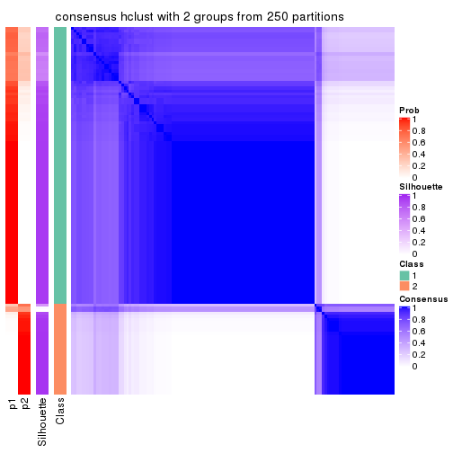</p>

</div>
<div id='tab-MAD-hclust-consensus-heatmap-2'>
<pre><code class="r">consensus_heatmap(res, k = 3)
</code></pre>

<p>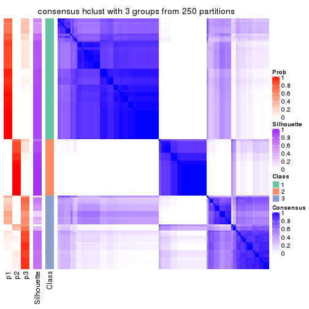</p>

</div>
<div id='tab-MAD-hclust-consensus-heatmap-3'>
<pre><code class="r">consensus_heatmap(res, k = 4)
</code></pre>

<p>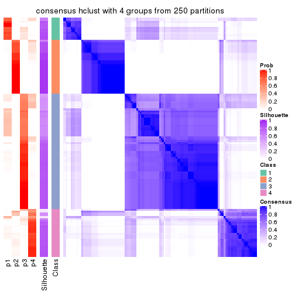</p>

</div>
<div id='tab-MAD-hclust-consensus-heatmap-4'>
<pre><code class="r">consensus_heatmap(res, k = 5)
</code></pre>

<p>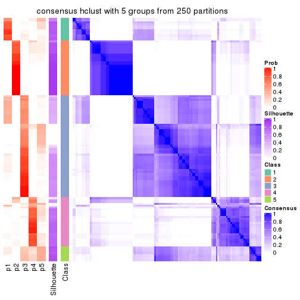</p>

</div>
<div id='tab-MAD-hclust-consensus-heatmap-5'>
<pre><code class="r">consensus_heatmap(res, k = 6)
</code></pre>

<p>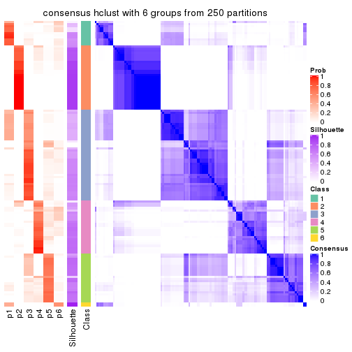</p>

</div>
</div>

Heatmaps for the membership of samples in all partitions to see how consistent they are:


<script>
$( function() {
	$( '#tabs-MAD-hclust-membership-heatmap' ).tabs();
} );
</script>
<div id='tabs-MAD-hclust-membership-heatmap'>
<ul>
<li><a href='#tab-MAD-hclust-membership-heatmap-1'>k = 2</a></li>
<li><a href='#tab-MAD-hclust-membership-heatmap-2'>k = 3</a></li>
<li><a href='#tab-MAD-hclust-membership-heatmap-3'>k = 4</a></li>
<li><a href='#tab-MAD-hclust-membership-heatmap-4'>k = 5</a></li>
<li><a href='#tab-MAD-hclust-membership-heatmap-5'>k = 6</a></li>
</ul>
<div id='tab-MAD-hclust-membership-heatmap-1'>
<pre><code class="r">membership_heatmap(res, k = 2)
</code></pre>

<p>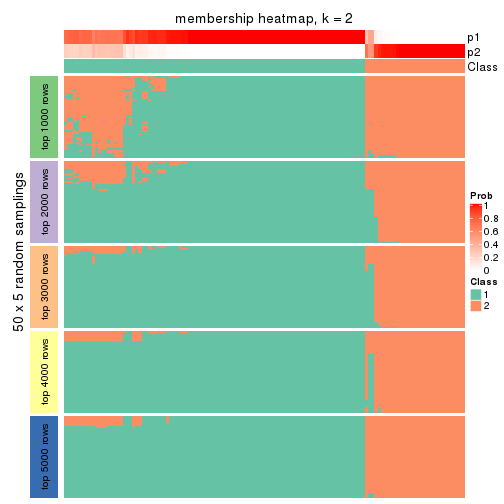</p>

</div>
<div id='tab-MAD-hclust-membership-heatmap-2'>
<pre><code class="r">membership_heatmap(res, k = 3)
</code></pre>

<p>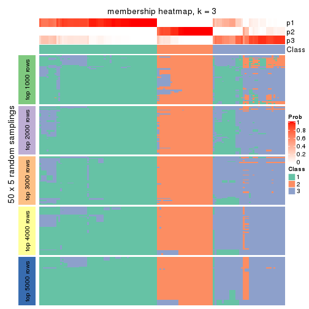</p>

</div>
<div id='tab-MAD-hclust-membership-heatmap-3'>
<pre><code class="r">membership_heatmap(res, k = 4)
</code></pre>

<p>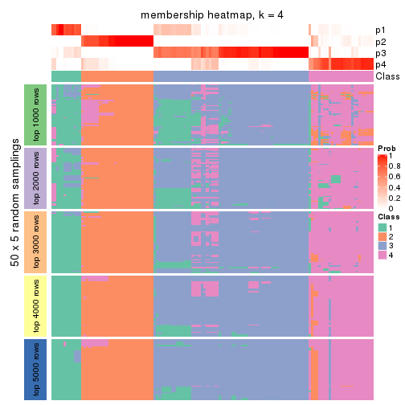</p>

</div>
<div id='tab-MAD-hclust-membership-heatmap-4'>
<pre><code class="r">membership_heatmap(res, k = 5)
</code></pre>

<p>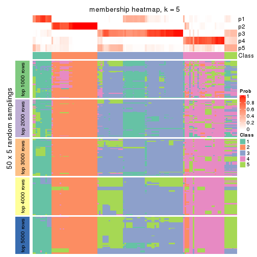</p>

</div>
<div id='tab-MAD-hclust-membership-heatmap-5'>
<pre><code class="r">membership_heatmap(res, k = 6)
</code></pre>

<p>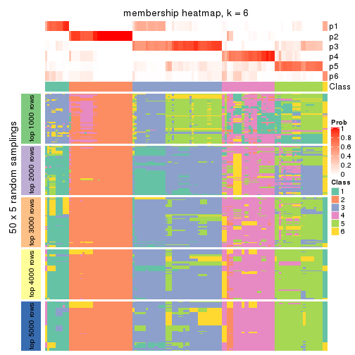</p>

</div>
</div>

As soon as we have had the classes for columns, we can look for signatures
which are significantly different between classes which can be candidate marks
for certain classes. Following are the heatmaps for signatures.


Signature heatmaps where rows are scaled:


<script>
$( function() {
	$( '#tabs-MAD-hclust-get-signatures' ).tabs();
} );
</script>
<div id='tabs-MAD-hclust-get-signatures'>
<ul>
<li><a href='#tab-MAD-hclust-get-signatures-1'>k = 2</a></li>
<li><a href='#tab-MAD-hclust-get-signatures-2'>k = 3</a></li>
<li><a href='#tab-MAD-hclust-get-signatures-3'>k = 4</a></li>
<li><a href='#tab-MAD-hclust-get-signatures-4'>k = 5</a></li>
<li><a href='#tab-MAD-hclust-get-signatures-5'>k = 6</a></li>
</ul>
<div id='tab-MAD-hclust-get-signatures-1'>
<pre><code class="r">get_signatures(res, k = 2)
</code></pre>

<p>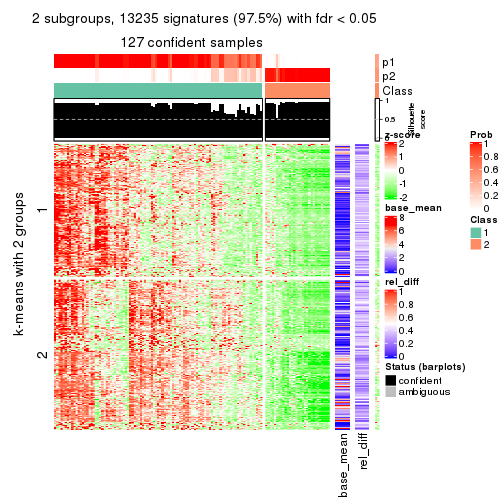</p>

</div>
<div id='tab-MAD-hclust-get-signatures-2'>
<pre><code class="r">get_signatures(res, k = 3)
</code></pre>

<p>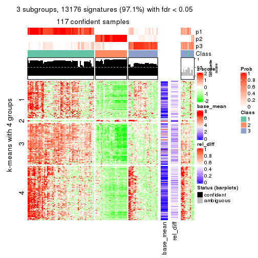</p>

</div>
<div id='tab-MAD-hclust-get-signatures-3'>
<pre><code class="r">get_signatures(res, k = 4)
</code></pre>

<p>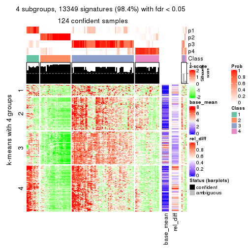</p>

</div>
<div id='tab-MAD-hclust-get-signatures-4'>
<pre><code class="r">get_signatures(res, k = 5)
</code></pre>

<p>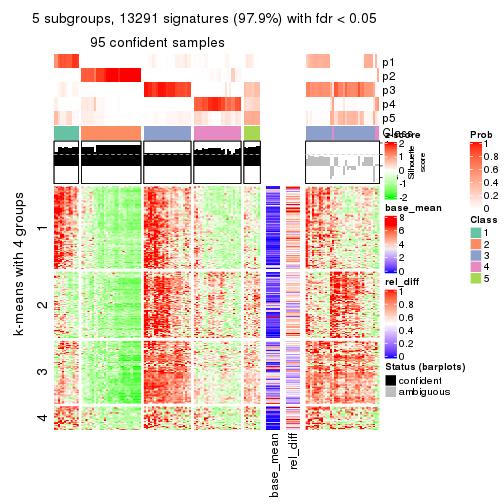</p>

</div>
<div id='tab-MAD-hclust-get-signatures-5'>
<pre><code class="r">get_signatures(res, k = 6)
</code></pre>

<p>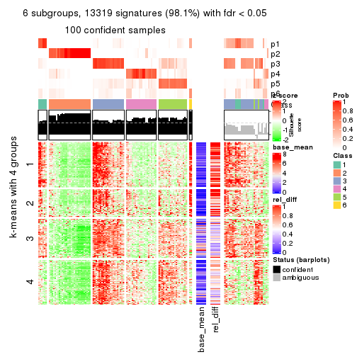</p>

</div>
</div>


Signature heatmaps where rows are not scaled:


<script>
$( function() {
	$( '#tabs-MAD-hclust-get-signatures-no-scale' ).tabs();
} );
</script>
<div id='tabs-MAD-hclust-get-signatures-no-scale'>
<ul>
<li><a href='#tab-MAD-hclust-get-signatures-no-scale-1'>k = 2</a></li>
<li><a href='#tab-MAD-hclust-get-signatures-no-scale-2'>k = 3</a></li>
<li><a href='#tab-MAD-hclust-get-signatures-no-scale-3'>k = 4</a></li>
<li><a href='#tab-MAD-hclust-get-signatures-no-scale-4'>k = 5</a></li>
<li><a href='#tab-MAD-hclust-get-signatures-no-scale-5'>k = 6</a></li>
</ul>
<div id='tab-MAD-hclust-get-signatures-no-scale-1'>
<pre><code class="r">get_signatures(res, k = 2, scale_rows = FALSE)
</code></pre>

<p></p>

</div>
<div id='tab-MAD-hclust-get-signatures-no-scale-2'>
<pre><code class="r">get_signatures(res, k = 3, scale_rows = FALSE)
</code></pre>

<p>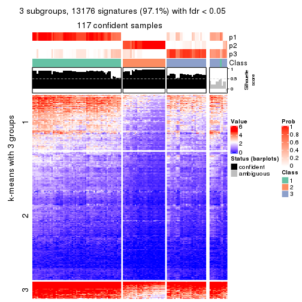</p>

</div>
<div id='tab-MAD-hclust-get-signatures-no-scale-3'>
<pre><code class="r">get_signatures(res, k = 4, scale_rows = FALSE)
</code></pre>

<p>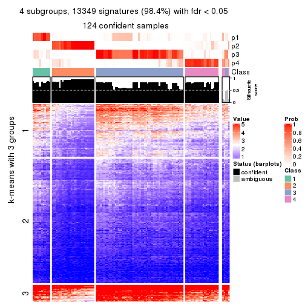</p>

</div>
<div id='tab-MAD-hclust-get-signatures-no-scale-4'>
<pre><code class="r">get_signatures(res, k = 5, scale_rows = FALSE)
</code></pre>

<p>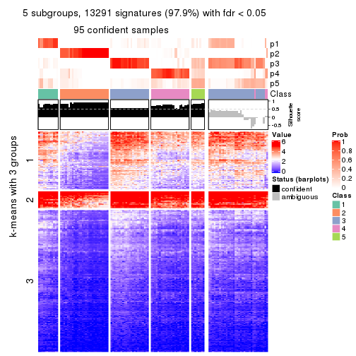</p>

</div>
<div id='tab-MAD-hclust-get-signatures-no-scale-5'>
<pre><code class="r">get_signatures(res, k = 6, scale_rows = FALSE)
</code></pre>

<p>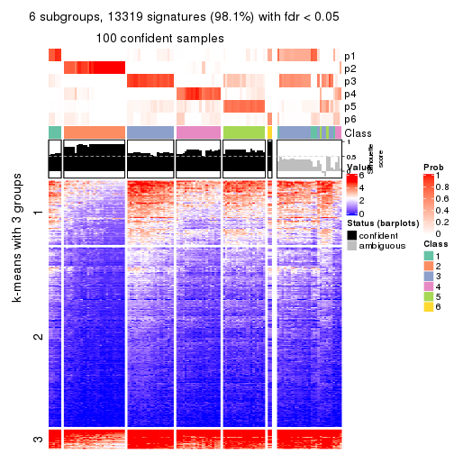</p>

</div>
</div>


Compare the overlap of signatures from different k:

```r
compare_signatures(res)
```

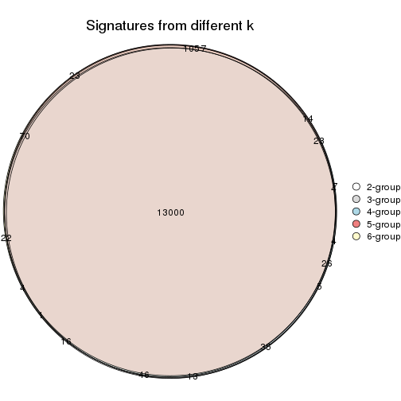

`get_signature()` returns a data frame invisibly. TO get the list of signatures, the function
call should be assigned to a variable explicitly. In following code, if `plot` argument is set
to `FALSE`, no heatmap is plotted while only the differential analysis is performed.

```r
# code only for demonstration
tb = get_signature(res, k = ..., plot = FALSE)
```

An example of the output of `tb` is:

```
#>   which_row         fdr    mean_1    mean_2 scaled_mean_1 scaled_mean_2 km
#> 1        38 0.042760348  8.373488  9.131774    -0.5533452     0.5164555  1
#> 2        40 0.018707592  7.106213  8.469186    -0.6173731     0.5762149  1
#> 3        55 0.019134737 10.221463 11.207825    -0.6159697     0.5749050  1
#> 4        59 0.006059896  5.921854  7.869574    -0.6899429     0.6439467  1
#> 5        60 0.018055526  8.928898 10.211722    -0.6204761     0.5791110  1
#> 6        98 0.009384629 15.714769 14.887706     0.6635654    -0.6193277  2
...
```

The columns in `tb` are:

1. `which_row`: row indices corresponding to the input matrix.
2. `fdr`: FDR for the differential test. 
3. `mean_x`: The mean value in group x.
4. `scaled_mean_x`: The mean value in group x after rows are scaled.
5. `km`: Row groups if k-means clustering is applied to rows.


UMAP plot which shows how samples are separated.


<script>
$( function() {
	$( '#tabs-MAD-hclust-dimension-reduction' ).tabs();
} );
</script>
<div id='tabs-MAD-hclust-dimension-reduction'>
<ul>
<li><a href='#tab-MAD-hclust-dimension-reduction-1'>k = 2</a></li>
<li><a href='#tab-MAD-hclust-dimension-reduction-2'>k = 3</a></li>
<li><a href='#tab-MAD-hclust-dimension-reduction-3'>k = 4</a></li>
<li><a href='#tab-MAD-hclust-dimension-reduction-4'>k = 5</a></li>
<li><a href='#tab-MAD-hclust-dimension-reduction-5'>k = 6</a></li>
</ul>
<div id='tab-MAD-hclust-dimension-reduction-1'>
<pre><code class="r">dimension_reduction(res, k = 2, method = &quot;UMAP&quot;)
</code></pre>

<p>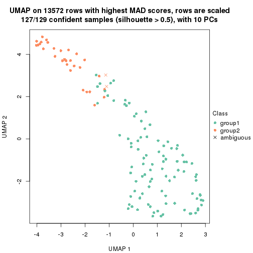</p>

</div>
<div id='tab-MAD-hclust-dimension-reduction-2'>
<pre><code class="r">dimension_reduction(res, k = 3, method = &quot;UMAP&quot;)
</code></pre>

<p>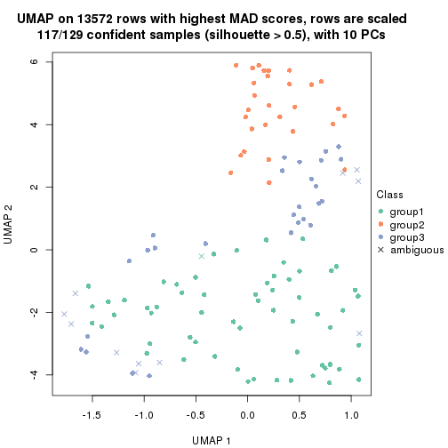</p>

</div>
<div id='tab-MAD-hclust-dimension-reduction-3'>
<pre><code class="r">dimension_reduction(res, k = 4, method = &quot;UMAP&quot;)
</code></pre>

<p>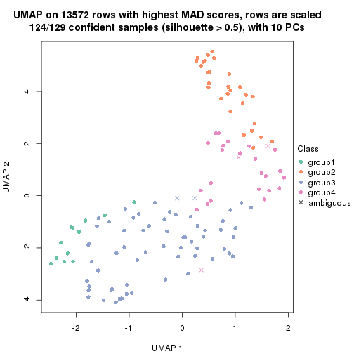</p>

</div>
<div id='tab-MAD-hclust-dimension-reduction-4'>
<pre><code class="r">dimension_reduction(res, k = 5, method = &quot;UMAP&quot;)
</code></pre>

<p>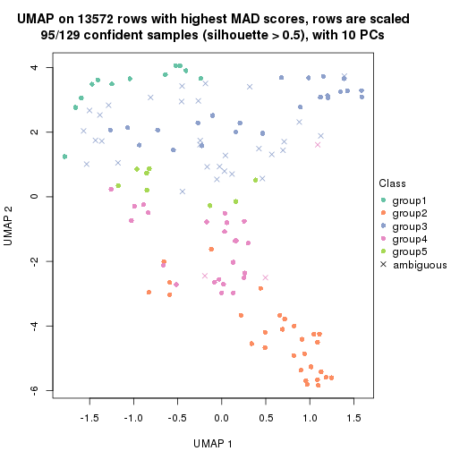</p>

</div>
<div id='tab-MAD-hclust-dimension-reduction-5'>
<pre><code class="r">dimension_reduction(res, k = 6, method = &quot;UMAP&quot;)
</code></pre>

<p>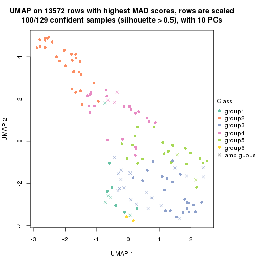</p>

</div>
</div>


Following heatmap shows how subgroups are split when increasing `k`:

```r
collect_classes(res)
```

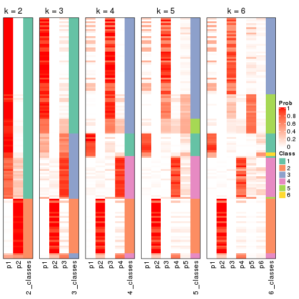


If matrix rows can be associated to genes, consider to use `GO_Enrichment(res,
...)` to perform function enrichment for the signature genes.


 

---------------------------------------------------


### MAD:kmeans**


The object with results only for a single top-value method and a single partition method 
can be extracted as:

```r
res = res_list["MAD", "kmeans"]
# you can also extract it by
# res = res_list["MAD:kmeans"]
```

A summary of `res` and all the functions that can be applied to it:

```r
res
```

```
#> A 'ConsensusPartition' object with k = 2, 3, 4, 5, 6.
#>   On a matrix with 13572 rows and 129 columns.
#>   Top rows (1000, 2000, 3000, 4000, 5000) are extracted by 'MAD' method.
#>   Subgroups are detected by 'kmeans' method.
#>   Performed in total 1250 partitions by row resampling.
#>   Best k for subgroups seems to be 2.
#> 
#> Following methods can be applied to this 'ConsensusPartition' object:
#>  [1] "cola_report"             "collect_classes"         "collect_plots"          
#>  [4] "collect_stats"           "colnames"                "compare_signatures"     
#>  [7] "consensus_heatmap"       "dimension_reduction"     "functional_enrichment"  
#> [10] "get_anno_col"            "get_anno"                "get_classes"            
#> [13] "get_consensus"           "get_matrix"              "get_membership"         
#> [16] "get_param"               "get_signatures"          "get_stats"              
#> [19] "is_best_k"               "is_stable_k"             "membership_heatmap"     
#> [22] "ncol"                    "nrow"                    "plot_ecdf"              
#> [25] "rownames"                "select_partition_number" "show"                   
#> [28] "suggest_best_k"          "test_to_known_factors"
```

`collect_plots()` function collects all the plots made from `res` for all `k` (number of partitions)
into one single page to provide an easy and fast comparison between different `k`.

```r
collect_plots(res)
```

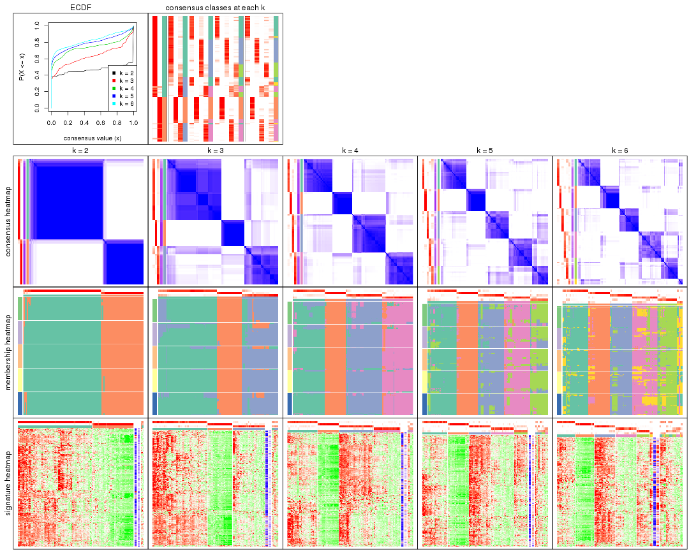

The plots are:

- The first row: a plot of the ECDF (Empirical cumulative distribution
  function) curves of the consensus matrix for each `k` and the heatmap of
  predicted classes for each `k`.
- The second row: heatmaps of the consensus matrix for each `k`.
- The third row: heatmaps of the membership matrix for each `k`.
- The fouth row: heatmaps of the signatures for each `k`.

All the plots in panels can be made by individual functions and they are
plotted later in this section.

`select_partition_number()` produces several plots showing different
statistics for choosing "optimized" `k`. There are following statistics:

- ECDF curves of the consensus matrix for each `k`;
- 1-PAC. [The PAC
  score](https://en.wikipedia.org/wiki/Consensus_clustering#Over-interpretation_potential_of_consensus_clustering)
  measures the proportion of the ambiguous subgrouping.
- Mean silhouette score.
- Concordance. The mean probability of fiting the consensus class ids in all
  partitions.
- Area increased. Denote $A_k$ as the area under the ECDF curve for current
  `k`, the area increased is defined as $A_k - A_{k-1}$.
- Rand index. The percent of pairs of samples that are both in a same cluster
  or both are not in a same cluster in the partition of k and k-1.
- Jaccard index. The ratio of pairs of samples are both in a same cluster in
  the partition of k and k-1 and the pairs of samples are both in a same
  cluster in the partition k or k-1.

The detailed explanations of these statistics can be found in [the cola
vignette](http://bioconductor.org/packages/devel/bioc/vignettes/cola/inst/doc/cola.html#toc_13).

Generally speaking, lower PAC score, higher mean silhouette score or higher
concordance corresponds to better partition. Rand index and Jaccard index
measure how similar the current partition is compared to partition with `k-1`.
If they are too similar, we won't accept `k` is better than `k-1`.

```r
select_partition_number(res)
```

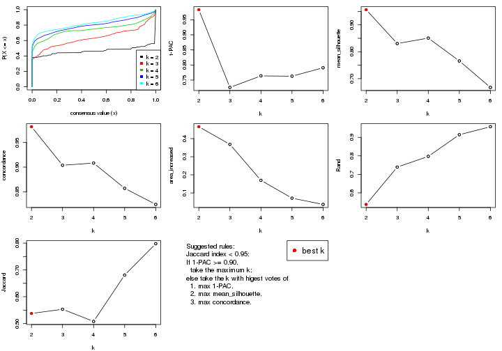

The numeric values for all these statistics can be obtained by `get_stats()`.

```r
get_stats(res)
```

```
#>   k 1-PAC mean_silhouette concordance area_increased  Rand Jaccard
#> 2 2 0.983           0.956       0.982         0.4655 0.538   0.538
#> 3 3 0.726           0.831       0.904         0.3684 0.739   0.553
#> 4 4 0.764           0.851       0.908         0.1696 0.797   0.508
#> 5 5 0.763           0.766       0.857         0.0713 0.914   0.681
#> 6 6 0.791           0.667       0.824         0.0368 0.957   0.798
```

`suggest_best_k()` suggests the best $k$ based on these statistics. The rules are as follows:

- All $k$ with Jaccard index larger than 0.95 are removed because the increase of
  the partition number does not provides enough extra information. If all $k$ are removed,
  the best $k$ is assigned by `NA`.
- For $k$ with 1-PAC larger than 0.9, the maximal $k$ is taken as the "best k". Other $k$ is called "optional k".
- If it does not fit the second rule. The $k$ with the highest vote of highest
  1-PAC, mean silhouette and concordance is taken as the "best k".

```r
suggest_best_k(res)
```

```
#> [1] 2
```


Following shows the table of the partitions (You need to click the **show/hide
code output** link to see it). The membership matrix (columns with name `p*`)
is inferred by
[`clue::cl_consensus()`](https://www.rdocumentation.org/link/cl_consensus?package=clue)
function with the `SE` method. Basically the value in the membership matrix
represents the probability to belong to a certain group. The finall class
label for an item is determined with the group with highest probability it
belongs to.

In `get_classes()` function, the entropy is calculated from the membership
matrix and the silhouette score is calculated from the consensus matrix.


<script>
$( function() {
	$( '#tabs-MAD-kmeans-get-classes' ).tabs();
} );
</script>
<div id='tabs-MAD-kmeans-get-classes'>
<ul>
<li><a href='#tab-MAD-kmeans-get-classes-1'>k = 2</a></li>
<li><a href='#tab-MAD-kmeans-get-classes-2'>k = 3</a></li>
<li><a href='#tab-MAD-kmeans-get-classes-3'>k = 4</a></li>
<li><a href='#tab-MAD-kmeans-get-classes-4'>k = 5</a></li>
<li><a href='#tab-MAD-kmeans-get-classes-5'>k = 6</a></li>
</ul>

<div id='tab-MAD-kmeans-get-classes-1'>
<p><a id='tab-MAD-kmeans-get-classes-1-a' style='color:#0366d6' href='#'>show/hide code output</a></p>
<pre><code class="r">cbind(get_classes(res, k = 2), get_membership(res, k = 2))
</code></pre>

<pre><code>#&gt;            class entropy silhouette    p1    p2
#&gt; SRR1656463     2  0.0000      0.981 0.000 1.000
#&gt; SRR1656464     1  0.0000      0.981 1.000 0.000
#&gt; SRR1656462     1  0.0000      0.981 1.000 0.000
#&gt; SRR1656465     1  0.0000      0.981 1.000 0.000
#&gt; SRR1656467     2  0.0000      0.981 0.000 1.000
#&gt; SRR1656466     1  0.0000      0.981 1.000 0.000
#&gt; SRR1656468     1  0.9833      0.279 0.576 0.424
#&gt; SRR1656472     1  0.0000      0.981 1.000 0.000
#&gt; SRR1656471     1  0.0000      0.981 1.000 0.000
#&gt; SRR1656470     2  0.0000      0.981 0.000 1.000
#&gt; SRR1656469     1  0.0000      0.981 1.000 0.000
#&gt; SRR1656473     2  0.0000      0.981 0.000 1.000
#&gt; SRR1656474     2  0.0000      0.981 0.000 1.000
#&gt; SRR1656475     2  0.0000      0.981 0.000 1.000
#&gt; SRR1656478     1  0.0000      0.981 1.000 0.000
#&gt; SRR1656477     1  0.9710      0.338 0.600 0.400
#&gt; SRR1656479     1  0.0000      0.981 1.000 0.000
#&gt; SRR1656480     2  0.0000      0.981 0.000 1.000
#&gt; SRR1656476     2  0.0000      0.981 0.000 1.000
#&gt; SRR1656481     1  0.7219      0.750 0.800 0.200
#&gt; SRR1656482     2  0.0000      0.981 0.000 1.000
#&gt; SRR1656483     2  0.0000      0.981 0.000 1.000
#&gt; SRR1656485     1  0.0000      0.981 1.000 0.000
#&gt; SRR1656487     1  0.0000      0.981 1.000 0.000
#&gt; SRR1656486     1  0.0000      0.981 1.000 0.000
#&gt; SRR1656488     1  0.0000      0.981 1.000 0.000
#&gt; SRR1656484     1  0.0000      0.981 1.000 0.000
#&gt; SRR1656489     1  0.0000      0.981 1.000 0.000
#&gt; SRR1656491     1  0.0000      0.981 1.000 0.000
#&gt; SRR1656490     1  0.0000      0.981 1.000 0.000
#&gt; SRR1656492     1  0.0000      0.981 1.000 0.000
#&gt; SRR1656493     1  0.0000      0.981 1.000 0.000
#&gt; SRR1656495     2  0.6247      0.812 0.156 0.844
#&gt; SRR1656496     1  0.0000      0.981 1.000 0.000
#&gt; SRR1656494     2  0.0000      0.981 0.000 1.000
#&gt; SRR1656497     2  0.0000      0.981 0.000 1.000
#&gt; SRR1656499     1  0.0000      0.981 1.000 0.000
#&gt; SRR1656500     1  0.0000      0.981 1.000 0.000
#&gt; SRR1656501     1  0.0000      0.981 1.000 0.000
#&gt; SRR1656498     1  0.0000      0.981 1.000 0.000
#&gt; SRR1656504     2  0.0000      0.981 0.000 1.000
#&gt; SRR1656502     1  0.0000      0.981 1.000 0.000
#&gt; SRR1656503     1  0.0000      0.981 1.000 0.000
#&gt; SRR1656507     1  0.0000      0.981 1.000 0.000
#&gt; SRR1656508     1  0.0000      0.981 1.000 0.000
#&gt; SRR1656505     2  0.0000      0.981 0.000 1.000
#&gt; SRR1656506     1  0.0000      0.981 1.000 0.000
#&gt; SRR1656509     1  0.0000      0.981 1.000 0.000
#&gt; SRR1656510     1  0.4298      0.894 0.912 0.088
#&gt; SRR1656511     2  0.0000      0.981 0.000 1.000
#&gt; SRR1656513     2  0.0000      0.981 0.000 1.000
#&gt; SRR1656512     2  0.0000      0.981 0.000 1.000
#&gt; SRR1656514     1  0.0000      0.981 1.000 0.000
#&gt; SRR1656515     2  0.0000      0.981 0.000 1.000
#&gt; SRR1656516     1  0.0000      0.981 1.000 0.000
#&gt; SRR1656518     1  0.0000      0.981 1.000 0.000
#&gt; SRR1656517     1  0.0000      0.981 1.000 0.000
#&gt; SRR1656519     1  0.0000      0.981 1.000 0.000
#&gt; SRR1656522     1  0.0000      0.981 1.000 0.000
#&gt; SRR1656523     2  0.5519      0.847 0.128 0.872
#&gt; SRR1656521     2  0.0000      0.981 0.000 1.000
#&gt; SRR1656520     1  0.0000      0.981 1.000 0.000
#&gt; SRR1656524     1  0.0000      0.981 1.000 0.000
#&gt; SRR1656525     1  0.0000      0.981 1.000 0.000
#&gt; SRR1656526     2  0.0000      0.981 0.000 1.000
#&gt; SRR1656527     2  0.0000      0.981 0.000 1.000
#&gt; SRR1656530     1  0.0000      0.981 1.000 0.000
#&gt; SRR1656529     1  0.0000      0.981 1.000 0.000
#&gt; SRR1656531     1  0.0000      0.981 1.000 0.000
#&gt; SRR1656528     1  0.0000      0.981 1.000 0.000
#&gt; SRR1656534     1  0.0000      0.981 1.000 0.000
#&gt; SRR1656533     1  0.0000      0.981 1.000 0.000
#&gt; SRR1656536     1  0.2603      0.941 0.956 0.044
#&gt; SRR1656532     2  0.0000      0.981 0.000 1.000
#&gt; SRR1656537     1  0.0000      0.981 1.000 0.000
#&gt; SRR1656538     1  0.0000      0.981 1.000 0.000
#&gt; SRR1656535     2  0.0000      0.981 0.000 1.000
#&gt; SRR1656539     1  0.0000      0.981 1.000 0.000
#&gt; SRR1656544     1  0.0000      0.981 1.000 0.000
#&gt; SRR1656542     1  0.0000      0.981 1.000 0.000
#&gt; SRR1656543     1  0.0000      0.981 1.000 0.000
#&gt; SRR1656545     2  0.0000      0.981 0.000 1.000
#&gt; SRR1656540     1  0.0000      0.981 1.000 0.000
#&gt; SRR1656546     1  0.0000      0.981 1.000 0.000
#&gt; SRR1656541     2  0.0000      0.981 0.000 1.000
#&gt; SRR1656547     2  0.0000      0.981 0.000 1.000
#&gt; SRR1656548     1  0.0000      0.981 1.000 0.000
#&gt; SRR1656549     1  0.0000      0.981 1.000 0.000
#&gt; SRR1656551     1  0.0000      0.981 1.000 0.000
#&gt; SRR1656553     1  0.0000      0.981 1.000 0.000
#&gt; SRR1656550     2  0.0000      0.981 0.000 1.000
#&gt; SRR1656552     2  0.0000      0.981 0.000 1.000
#&gt; SRR1656554     1  0.0000      0.981 1.000 0.000
#&gt; SRR1656555     1  0.7219      0.746 0.800 0.200
#&gt; SRR1656556     1  0.3584      0.917 0.932 0.068
#&gt; SRR1656557     1  0.0000      0.981 1.000 0.000
#&gt; SRR1656558     1  0.0000      0.981 1.000 0.000
#&gt; SRR1656559     1  0.0000      0.981 1.000 0.000
#&gt; SRR1656560     1  0.0000      0.981 1.000 0.000
#&gt; SRR1656561     1  0.0000      0.981 1.000 0.000
#&gt; SRR1656562     2  0.0000      0.981 0.000 1.000
#&gt; SRR1656563     1  0.0000      0.981 1.000 0.000
#&gt; SRR1656564     2  0.0000      0.981 0.000 1.000
#&gt; SRR1656565     2  0.0000      0.981 0.000 1.000
#&gt; SRR1656566     1  0.0000      0.981 1.000 0.000
#&gt; SRR1656568     2  0.0000      0.981 0.000 1.000
#&gt; SRR1656567     2  0.0000      0.981 0.000 1.000
#&gt; SRR1656569     1  0.0000      0.981 1.000 0.000
#&gt; SRR1656570     1  0.0000      0.981 1.000 0.000
#&gt; SRR1656571     2  0.0000      0.981 0.000 1.000
#&gt; SRR1656573     1  0.0000      0.981 1.000 0.000
#&gt; SRR1656572     2  0.0000      0.981 0.000 1.000
#&gt; SRR1656574     1  0.0000      0.981 1.000 0.000
#&gt; SRR1656575     1  0.0000      0.981 1.000 0.000
#&gt; SRR1656576     2  0.0000      0.981 0.000 1.000
#&gt; SRR1656578     2  0.0000      0.981 0.000 1.000
#&gt; SRR1656577     1  0.0000      0.981 1.000 0.000
#&gt; SRR1656579     2  0.0000      0.981 0.000 1.000
#&gt; SRR1656580     1  0.0000      0.981 1.000 0.000
#&gt; SRR1656581     1  0.0376      0.978 0.996 0.004
#&gt; SRR1656582     2  0.0000      0.981 0.000 1.000
#&gt; SRR1656585     1  0.3733      0.913 0.928 0.072
#&gt; SRR1656584     1  0.0000      0.981 1.000 0.000
#&gt; SRR1656583     2  0.9710      0.324 0.400 0.600
#&gt; SRR1656586     2  0.0000      0.981 0.000 1.000
#&gt; SRR1656587     2  0.6148      0.814 0.152 0.848
#&gt; SRR1656588     2  0.0000      0.981 0.000 1.000
#&gt; SRR1656589     2  0.0000      0.981 0.000 1.000
#&gt; SRR1656590     1  0.0000      0.981 1.000 0.000
</code></pre>

<script>
$('#tab-MAD-kmeans-get-classes-1-a').parent().next().next().hide();
$('#tab-MAD-kmeans-get-classes-1-a').click(function(){
  $('#tab-MAD-kmeans-get-classes-1-a').parent().next().next().toggle();
  return(false);
});
</script>
</div>

<div id='tab-MAD-kmeans-get-classes-2'>
<p><a id='tab-MAD-kmeans-get-classes-2-a' style='color:#0366d6' href='#'>show/hide code output</a></p>
<pre><code class="r">cbind(get_classes(res, k = 3), get_membership(res, k = 3))
</code></pre>

<pre><code>#&gt;            class entropy silhouette    p1    p2    p3
#&gt; SRR1656463     2  0.0000      0.990 0.000 1.000 0.000
#&gt; SRR1656464     1  0.0747      0.885 0.984 0.000 0.016
#&gt; SRR1656462     1  0.2261      0.891 0.932 0.000 0.068
#&gt; SRR1656465     1  0.6235      0.420 0.564 0.000 0.436
#&gt; SRR1656467     2  0.0747      0.976 0.000 0.984 0.016
#&gt; SRR1656466     1  0.5835      0.618 0.660 0.000 0.340
#&gt; SRR1656468     3  0.0747      0.828 0.016 0.000 0.984
#&gt; SRR1656472     3  0.3686      0.793 0.140 0.000 0.860
#&gt; SRR1656471     1  0.5882      0.568 0.652 0.000 0.348
#&gt; SRR1656470     2  0.0000      0.990 0.000 1.000 0.000
#&gt; SRR1656469     1  0.6111      0.526 0.604 0.000 0.396
#&gt; SRR1656473     2  0.0000      0.990 0.000 1.000 0.000
#&gt; SRR1656474     2  0.0000      0.990 0.000 1.000 0.000
#&gt; SRR1656475     2  0.0000      0.990 0.000 1.000 0.000
#&gt; SRR1656478     1  0.2165      0.875 0.936 0.000 0.064
#&gt; SRR1656477     3  0.0829      0.832 0.004 0.012 0.984
#&gt; SRR1656479     1  0.2959      0.882 0.900 0.000 0.100
#&gt; SRR1656480     3  0.2625      0.828 0.000 0.084 0.916
#&gt; SRR1656476     2  0.0000      0.990 0.000 1.000 0.000
#&gt; SRR1656481     3  0.0747      0.828 0.016 0.000 0.984
#&gt; SRR1656482     2  0.0000      0.990 0.000 1.000 0.000
#&gt; SRR1656483     2  0.0000      0.990 0.000 1.000 0.000
#&gt; SRR1656485     1  0.2261      0.891 0.932 0.000 0.068
#&gt; SRR1656487     1  0.5591      0.642 0.696 0.000 0.304
#&gt; SRR1656486     1  0.2165      0.875 0.936 0.000 0.064
#&gt; SRR1656488     1  0.2261      0.891 0.932 0.000 0.068
#&gt; SRR1656484     1  0.2165      0.875 0.936 0.000 0.064
#&gt; SRR1656489     1  0.0747      0.885 0.984 0.000 0.016
#&gt; SRR1656491     1  0.4121      0.845 0.832 0.000 0.168
#&gt; SRR1656490     3  0.5621      0.575 0.308 0.000 0.692
#&gt; SRR1656492     1  0.2261      0.891 0.932 0.000 0.068
#&gt; SRR1656493     3  0.6008      0.477 0.372 0.000 0.628
#&gt; SRR1656495     3  0.2796      0.811 0.092 0.000 0.908
#&gt; SRR1656496     1  0.3482      0.880 0.872 0.000 0.128
#&gt; SRR1656494     3  0.3686      0.801 0.000 0.140 0.860
#&gt; SRR1656497     2  0.0000      0.990 0.000 1.000 0.000
#&gt; SRR1656499     1  0.2261      0.891 0.932 0.000 0.068
#&gt; SRR1656500     1  0.2261      0.891 0.932 0.000 0.068
#&gt; SRR1656501     1  0.2165      0.875 0.936 0.000 0.064
#&gt; SRR1656498     1  0.0747      0.885 0.984 0.000 0.016
#&gt; SRR1656504     2  0.0000      0.990 0.000 1.000 0.000
#&gt; SRR1656502     3  0.3038      0.808 0.104 0.000 0.896
#&gt; SRR1656503     1  0.2165      0.875 0.936 0.000 0.064
#&gt; SRR1656507     1  0.2165      0.875 0.936 0.000 0.064
#&gt; SRR1656508     1  0.0747      0.885 0.984 0.000 0.016
#&gt; SRR1656505     3  0.2625      0.828 0.000 0.084 0.916
#&gt; SRR1656506     1  0.2261      0.891 0.932 0.000 0.068
#&gt; SRR1656509     3  0.4555      0.623 0.200 0.000 0.800
#&gt; SRR1656510     3  0.0000      0.832 0.000 0.000 1.000
#&gt; SRR1656511     3  0.3816      0.795 0.000 0.148 0.852
#&gt; SRR1656513     2  0.2625      0.902 0.000 0.916 0.084
#&gt; SRR1656512     2  0.0000      0.990 0.000 1.000 0.000
#&gt; SRR1656514     1  0.0000      0.887 1.000 0.000 0.000
#&gt; SRR1656515     2  0.3116      0.875 0.000 0.892 0.108
#&gt; SRR1656516     1  0.1964      0.878 0.944 0.000 0.056
#&gt; SRR1656518     1  0.2165      0.875 0.936 0.000 0.064
#&gt; SRR1656517     1  0.0747      0.885 0.984 0.000 0.016
#&gt; SRR1656519     1  0.2261      0.891 0.932 0.000 0.068
#&gt; SRR1656522     1  0.0000      0.887 1.000 0.000 0.000
#&gt; SRR1656523     3  0.2261      0.831 0.000 0.068 0.932
#&gt; SRR1656521     2  0.0000      0.990 0.000 1.000 0.000
#&gt; SRR1656520     1  0.2261      0.891 0.932 0.000 0.068
#&gt; SRR1656524     3  0.5926      0.508 0.356 0.000 0.644
#&gt; SRR1656525     1  0.2261      0.891 0.932 0.000 0.068
#&gt; SRR1656526     2  0.0000      0.990 0.000 1.000 0.000
#&gt; SRR1656527     2  0.0000      0.990 0.000 1.000 0.000
#&gt; SRR1656530     1  0.3482      0.871 0.872 0.000 0.128
#&gt; SRR1656529     1  0.5835      0.618 0.660 0.000 0.340
#&gt; SRR1656531     1  0.0892      0.884 0.980 0.000 0.020
#&gt; SRR1656528     1  0.2625      0.884 0.916 0.000 0.084
#&gt; SRR1656534     1  0.2165      0.892 0.936 0.000 0.064
#&gt; SRR1656533     1  0.0747      0.885 0.984 0.000 0.016
#&gt; SRR1656536     3  0.0747      0.828 0.016 0.000 0.984
#&gt; SRR1656532     3  0.3879      0.791 0.000 0.152 0.848
#&gt; SRR1656537     1  0.2165      0.875 0.936 0.000 0.064
#&gt; SRR1656538     1  0.2165      0.892 0.936 0.000 0.064
#&gt; SRR1656535     2  0.0000      0.990 0.000 1.000 0.000
#&gt; SRR1656539     1  0.6286      0.361 0.536 0.000 0.464
#&gt; SRR1656544     1  0.2261      0.891 0.932 0.000 0.068
#&gt; SRR1656542     1  0.2261      0.891 0.932 0.000 0.068
#&gt; SRR1656543     1  0.2261      0.891 0.932 0.000 0.068
#&gt; SRR1656545     2  0.0000      0.990 0.000 1.000 0.000
#&gt; SRR1656540     1  0.2261      0.891 0.932 0.000 0.068
#&gt; SRR1656546     3  0.6192      0.368 0.420 0.000 0.580
#&gt; SRR1656541     2  0.1411      0.957 0.000 0.964 0.036
#&gt; SRR1656547     3  0.3412      0.810 0.000 0.124 0.876
#&gt; SRR1656548     1  0.2261      0.891 0.932 0.000 0.068
#&gt; SRR1656549     3  0.6299      0.209 0.476 0.000 0.524
#&gt; SRR1656551     3  0.0747      0.828 0.016 0.000 0.984
#&gt; SRR1656553     1  0.2261      0.891 0.932 0.000 0.068
#&gt; SRR1656550     3  0.2448      0.830 0.000 0.076 0.924
#&gt; SRR1656552     3  0.3551      0.805 0.000 0.132 0.868
#&gt; SRR1656554     1  0.6062      0.537 0.616 0.000 0.384
#&gt; SRR1656555     3  0.0000      0.832 0.000 0.000 1.000
#&gt; SRR1656556     3  0.4605      0.633 0.204 0.000 0.796
#&gt; SRR1656557     1  0.2261      0.891 0.932 0.000 0.068
#&gt; SRR1656558     1  0.2165      0.875 0.936 0.000 0.064
#&gt; SRR1656559     1  0.0000      0.887 1.000 0.000 0.000
#&gt; SRR1656560     1  0.2796      0.879 0.908 0.000 0.092
#&gt; SRR1656561     1  0.2165      0.892 0.936 0.000 0.064
#&gt; SRR1656562     3  0.2625      0.828 0.000 0.084 0.916
#&gt; SRR1656563     1  0.0747      0.885 0.984 0.000 0.016
#&gt; SRR1656564     2  0.0000      0.990 0.000 1.000 0.000
#&gt; SRR1656565     3  0.4974      0.701 0.000 0.236 0.764
#&gt; SRR1656566     3  0.6299      0.209 0.476 0.000 0.524
#&gt; SRR1656568     2  0.0000      0.990 0.000 1.000 0.000
#&gt; SRR1656567     3  0.3551      0.805 0.000 0.132 0.868
#&gt; SRR1656569     1  0.5859      0.615 0.656 0.000 0.344
#&gt; SRR1656570     1  0.0892      0.884 0.980 0.000 0.020
#&gt; SRR1656571     2  0.0000      0.990 0.000 1.000 0.000
#&gt; SRR1656573     3  0.0000      0.832 0.000 0.000 1.000
#&gt; SRR1656572     3  0.3551      0.805 0.000 0.132 0.868
#&gt; SRR1656574     1  0.0747      0.885 0.984 0.000 0.016
#&gt; SRR1656575     1  0.2165      0.875 0.936 0.000 0.064
#&gt; SRR1656576     3  0.3816      0.795 0.000 0.148 0.852
#&gt; SRR1656578     2  0.0000      0.990 0.000 1.000 0.000
#&gt; SRR1656577     1  0.0000      0.887 1.000 0.000 0.000
#&gt; SRR1656579     3  0.3551      0.805 0.000 0.132 0.868
#&gt; SRR1656580     1  0.0747      0.890 0.984 0.000 0.016
#&gt; SRR1656581     3  0.0000      0.832 0.000 0.000 1.000
#&gt; SRR1656582     2  0.0000      0.990 0.000 1.000 0.000
#&gt; SRR1656585     3  0.0000      0.832 0.000 0.000 1.000
#&gt; SRR1656584     1  0.2165      0.875 0.936 0.000 0.064
#&gt; SRR1656583     3  0.1860      0.834 0.000 0.052 0.948
#&gt; SRR1656586     2  0.0000      0.990 0.000 1.000 0.000
#&gt; SRR1656587     3  0.2550      0.831 0.012 0.056 0.932
#&gt; SRR1656588     3  0.5835      0.532 0.000 0.340 0.660
#&gt; SRR1656589     2  0.0000      0.990 0.000 1.000 0.000
#&gt; SRR1656590     1  0.5988      0.335 0.632 0.000 0.368
</code></pre>

<script>
$('#tab-MAD-kmeans-get-classes-2-a').parent().next().next().hide();
$('#tab-MAD-kmeans-get-classes-2-a').click(function(){
  $('#tab-MAD-kmeans-get-classes-2-a').parent().next().next().toggle();
  return(false);
});
</script>
</div>

<div id='tab-MAD-kmeans-get-classes-3'>
<p><a id='tab-MAD-kmeans-get-classes-3-a' style='color:#0366d6' href='#'>show/hide code output</a></p>
<pre><code class="r">cbind(get_classes(res, k = 4), get_membership(res, k = 4))
</code></pre>

<pre><code>#&gt;            class entropy silhouette    p1    p2    p3    p4
#&gt; SRR1656463     2  0.0000     0.9890 0.000 1.000 0.000 0.000
#&gt; SRR1656464     1  0.3356     0.8615 0.824 0.000 0.176 0.000
#&gt; SRR1656462     3  0.1118     0.8973 0.036 0.000 0.964 0.000
#&gt; SRR1656465     3  0.4262     0.6916 0.008 0.000 0.756 0.236
#&gt; SRR1656467     4  0.4972     0.2233 0.000 0.456 0.000 0.544
#&gt; SRR1656466     3  0.2345     0.8345 0.000 0.000 0.900 0.100
#&gt; SRR1656468     4  0.1677     0.8831 0.012 0.000 0.040 0.948
#&gt; SRR1656472     1  0.3610     0.6774 0.800 0.000 0.000 0.200
#&gt; SRR1656471     3  0.3486     0.7609 0.000 0.000 0.812 0.188
#&gt; SRR1656470     2  0.0000     0.9890 0.000 1.000 0.000 0.000
#&gt; SRR1656469     3  0.4175     0.7178 0.012 0.000 0.776 0.212
#&gt; SRR1656473     2  0.0000     0.9890 0.000 1.000 0.000 0.000
#&gt; SRR1656474     2  0.0000     0.9890 0.000 1.000 0.000 0.000
#&gt; SRR1656475     2  0.0000     0.9890 0.000 1.000 0.000 0.000
#&gt; SRR1656478     1  0.2589     0.9025 0.884 0.000 0.116 0.000
#&gt; SRR1656477     4  0.1174     0.8904 0.012 0.000 0.020 0.968
#&gt; SRR1656479     1  0.2868     0.8986 0.864 0.000 0.136 0.000
#&gt; SRR1656480     4  0.0804     0.8921 0.012 0.000 0.008 0.980
#&gt; SRR1656476     2  0.0000     0.9890 0.000 1.000 0.000 0.000
#&gt; SRR1656481     4  0.1854     0.8792 0.012 0.000 0.048 0.940
#&gt; SRR1656482     2  0.0469     0.9829 0.000 0.988 0.000 0.012
#&gt; SRR1656483     2  0.0000     0.9890 0.000 1.000 0.000 0.000
#&gt; SRR1656485     3  0.0592     0.8956 0.016 0.000 0.984 0.000
#&gt; SRR1656487     3  0.2345     0.8345 0.000 0.000 0.900 0.100
#&gt; SRR1656486     1  0.3355     0.8837 0.836 0.000 0.160 0.004
#&gt; SRR1656488     3  0.0707     0.8963 0.020 0.000 0.980 0.000
#&gt; SRR1656484     1  0.2469     0.9032 0.892 0.000 0.108 0.000
#&gt; SRR1656489     1  0.2973     0.8868 0.856 0.000 0.144 0.000
#&gt; SRR1656491     3  0.6084     0.5587 0.244 0.000 0.660 0.096
#&gt; SRR1656490     1  0.2670     0.8442 0.904 0.000 0.024 0.072
#&gt; SRR1656492     3  0.1118     0.8964 0.036 0.000 0.964 0.000
#&gt; SRR1656493     1  0.1022     0.8502 0.968 0.000 0.000 0.032
#&gt; SRR1656495     1  0.3400     0.7018 0.820 0.000 0.000 0.180
#&gt; SRR1656496     1  0.3444     0.8674 0.816 0.000 0.184 0.000
#&gt; SRR1656494     4  0.1792     0.8768 0.068 0.000 0.000 0.932
#&gt; SRR1656497     2  0.0000     0.9890 0.000 1.000 0.000 0.000
#&gt; SRR1656499     3  0.0817     0.8966 0.024 0.000 0.976 0.000
#&gt; SRR1656500     3  0.1474     0.8939 0.052 0.000 0.948 0.000
#&gt; SRR1656501     1  0.3123     0.8838 0.844 0.000 0.156 0.000
#&gt; SRR1656498     1  0.2530     0.9025 0.888 0.000 0.112 0.000
#&gt; SRR1656504     2  0.0000     0.9890 0.000 1.000 0.000 0.000
#&gt; SRR1656502     1  0.3610     0.6774 0.800 0.000 0.000 0.200
#&gt; SRR1656503     1  0.3569     0.8453 0.804 0.000 0.196 0.000
#&gt; SRR1656507     1  0.2704     0.9002 0.876 0.000 0.124 0.000
#&gt; SRR1656508     1  0.2530     0.9025 0.888 0.000 0.112 0.000
#&gt; SRR1656505     4  0.0804     0.8921 0.012 0.000 0.008 0.980
#&gt; SRR1656506     3  0.0336     0.8936 0.008 0.000 0.992 0.000
#&gt; SRR1656509     1  0.6521     0.2268 0.512 0.000 0.076 0.412
#&gt; SRR1656510     4  0.1488     0.8865 0.012 0.000 0.032 0.956
#&gt; SRR1656511     4  0.2466     0.8613 0.096 0.004 0.000 0.900
#&gt; SRR1656513     4  0.5257     0.2457 0.008 0.444 0.000 0.548
#&gt; SRR1656512     2  0.0000     0.9890 0.000 1.000 0.000 0.000
#&gt; SRR1656514     3  0.3219     0.7954 0.164 0.000 0.836 0.000
#&gt; SRR1656515     4  0.4008     0.6732 0.000 0.244 0.000 0.756
#&gt; SRR1656516     1  0.3486     0.8538 0.812 0.000 0.188 0.000
#&gt; SRR1656518     1  0.2281     0.9021 0.904 0.000 0.096 0.000
#&gt; SRR1656517     1  0.2530     0.9025 0.888 0.000 0.112 0.000
#&gt; SRR1656519     3  0.1474     0.8939 0.052 0.000 0.948 0.000
#&gt; SRR1656522     3  0.2081     0.8718 0.084 0.000 0.916 0.000
#&gt; SRR1656523     4  0.1302     0.8897 0.044 0.000 0.000 0.956
#&gt; SRR1656521     2  0.0000     0.9890 0.000 1.000 0.000 0.000
#&gt; SRR1656520     3  0.1118     0.8973 0.036 0.000 0.964 0.000
#&gt; SRR1656524     1  0.1022     0.8502 0.968 0.000 0.000 0.032
#&gt; SRR1656525     3  0.1211     0.8960 0.040 0.000 0.960 0.000
#&gt; SRR1656526     2  0.0469     0.9829 0.000 0.988 0.000 0.012
#&gt; SRR1656527     2  0.2983     0.8998 0.040 0.892 0.000 0.068
#&gt; SRR1656530     3  0.1022     0.8767 0.000 0.000 0.968 0.032
#&gt; SRR1656529     3  0.2647     0.8203 0.000 0.000 0.880 0.120
#&gt; SRR1656531     1  0.2216     0.9018 0.908 0.000 0.092 0.000
#&gt; SRR1656528     3  0.0524     0.8923 0.008 0.000 0.988 0.004
#&gt; SRR1656534     3  0.1474     0.8939 0.052 0.000 0.948 0.000
#&gt; SRR1656533     1  0.2530     0.9025 0.888 0.000 0.112 0.000
#&gt; SRR1656536     4  0.1854     0.8792 0.012 0.000 0.048 0.940
#&gt; SRR1656532     4  0.3037     0.8507 0.100 0.020 0.000 0.880
#&gt; SRR1656537     1  0.1716     0.8949 0.936 0.000 0.064 0.000
#&gt; SRR1656538     3  0.1557     0.8920 0.056 0.000 0.944 0.000
#&gt; SRR1656535     2  0.0469     0.9829 0.000 0.988 0.000 0.012
#&gt; SRR1656539     3  0.4284     0.7019 0.012 0.000 0.764 0.224
#&gt; SRR1656544     3  0.0707     0.8963 0.020 0.000 0.980 0.000
#&gt; SRR1656542     3  0.1474     0.8939 0.052 0.000 0.948 0.000
#&gt; SRR1656543     3  0.1118     0.8973 0.036 0.000 0.964 0.000
#&gt; SRR1656545     2  0.0000     0.9890 0.000 1.000 0.000 0.000
#&gt; SRR1656540     3  0.1022     0.8971 0.032 0.000 0.968 0.000
#&gt; SRR1656546     1  0.1724     0.8654 0.948 0.000 0.020 0.032
#&gt; SRR1656541     4  0.4907     0.3396 0.000 0.420 0.000 0.580
#&gt; SRR1656547     4  0.0000     0.8928 0.000 0.000 0.000 1.000
#&gt; SRR1656548     3  0.1211     0.8960 0.040 0.000 0.960 0.000
#&gt; SRR1656549     1  0.1042     0.8651 0.972 0.000 0.008 0.020
#&gt; SRR1656551     4  0.1854     0.8792 0.012 0.000 0.048 0.940
#&gt; SRR1656553     3  0.1389     0.8943 0.048 0.000 0.952 0.000
#&gt; SRR1656550     4  0.1174     0.8904 0.012 0.000 0.020 0.968
#&gt; SRR1656552     4  0.0707     0.8915 0.020 0.000 0.000 0.980
#&gt; SRR1656554     3  0.3610     0.7458 0.000 0.000 0.800 0.200
#&gt; SRR1656555     4  0.1388     0.8876 0.012 0.000 0.028 0.960
#&gt; SRR1656556     4  0.5378     0.0944 0.012 0.000 0.448 0.540
#&gt; SRR1656557     3  0.1474     0.8939 0.052 0.000 0.948 0.000
#&gt; SRR1656558     1  0.2530     0.9025 0.888 0.000 0.112 0.000
#&gt; SRR1656559     3  0.2589     0.8431 0.116 0.000 0.884 0.000
#&gt; SRR1656560     3  0.1151     0.8844 0.008 0.000 0.968 0.024
#&gt; SRR1656561     3  0.1302     0.8951 0.044 0.000 0.956 0.000
#&gt; SRR1656562     4  0.1940     0.8796 0.076 0.000 0.000 0.924
#&gt; SRR1656563     1  0.2589     0.9014 0.884 0.000 0.116 0.000
#&gt; SRR1656564     2  0.0000     0.9890 0.000 1.000 0.000 0.000
#&gt; SRR1656565     4  0.2816     0.8617 0.064 0.036 0.000 0.900
#&gt; SRR1656566     1  0.0927     0.8665 0.976 0.000 0.008 0.016
#&gt; SRR1656568     2  0.0000     0.9890 0.000 1.000 0.000 0.000
#&gt; SRR1656567     4  0.0000     0.8928 0.000 0.000 0.000 1.000
#&gt; SRR1656569     3  0.2704     0.8174 0.000 0.000 0.876 0.124
#&gt; SRR1656570     1  0.2647     0.9015 0.880 0.000 0.120 0.000
#&gt; SRR1656571     2  0.0000     0.9890 0.000 1.000 0.000 0.000
#&gt; SRR1656573     4  0.1488     0.8863 0.012 0.000 0.032 0.956
#&gt; SRR1656572     4  0.2466     0.8613 0.096 0.004 0.000 0.900
#&gt; SRR1656574     3  0.4994     0.0156 0.480 0.000 0.520 0.000
#&gt; SRR1656575     1  0.2530     0.9031 0.888 0.000 0.112 0.000
#&gt; SRR1656576     4  0.1557     0.8726 0.000 0.056 0.000 0.944
#&gt; SRR1656578     2  0.2983     0.8998 0.040 0.892 0.000 0.068
#&gt; SRR1656577     3  0.3528     0.7526 0.192 0.000 0.808 0.000
#&gt; SRR1656579     4  0.0000     0.8928 0.000 0.000 0.000 1.000
#&gt; SRR1656580     3  0.1557     0.8920 0.056 0.000 0.944 0.000
#&gt; SRR1656581     4  0.1488     0.8932 0.032 0.000 0.012 0.956
#&gt; SRR1656582     2  0.0469     0.9829 0.000 0.988 0.000 0.012
#&gt; SRR1656585     4  0.1452     0.8928 0.036 0.000 0.008 0.956
#&gt; SRR1656584     1  0.1792     0.8950 0.932 0.000 0.068 0.000
#&gt; SRR1656583     4  0.0707     0.8936 0.020 0.000 0.000 0.980
#&gt; SRR1656586     2  0.0000     0.9890 0.000 1.000 0.000 0.000
#&gt; SRR1656587     4  0.2081     0.8763 0.084 0.000 0.000 0.916
#&gt; SRR1656588     4  0.2921     0.7995 0.000 0.140 0.000 0.860
#&gt; SRR1656589     2  0.0000     0.9890 0.000 1.000 0.000 0.000
#&gt; SRR1656590     1  0.0469     0.8641 0.988 0.000 0.000 0.012
</code></pre>

<script>
$('#tab-MAD-kmeans-get-classes-3-a').parent().next().next().hide();
$('#tab-MAD-kmeans-get-classes-3-a').click(function(){
  $('#tab-MAD-kmeans-get-classes-3-a').parent().next().next().toggle();
  return(false);
});
</script>
</div>

<div id='tab-MAD-kmeans-get-classes-4'>
<p><a id='tab-MAD-kmeans-get-classes-4-a' style='color:#0366d6' href='#'>show/hide code output</a></p>
<pre><code class="r">cbind(get_classes(res, k = 5), get_membership(res, k = 5))
</code></pre>

<pre><code>#&gt;            class entropy silhouette    p1    p2    p3    p4    p5
#&gt; SRR1656463     2  0.0000      0.966 0.000 1.000 0.000 0.000 0.000
#&gt; SRR1656464     3  0.5470      0.410 0.332 0.000 0.588 0.000 0.080
#&gt; SRR1656462     3  0.0290      0.810 0.000 0.000 0.992 0.000 0.008
#&gt; SRR1656465     5  0.3795      0.801 0.000 0.000 0.192 0.028 0.780
#&gt; SRR1656467     4  0.3430      0.692 0.000 0.220 0.000 0.776 0.004
#&gt; SRR1656466     5  0.3715      0.763 0.000 0.000 0.260 0.004 0.736
#&gt; SRR1656468     4  0.4182      0.428 0.000 0.000 0.000 0.600 0.400
#&gt; SRR1656472     1  0.5726      0.664 0.636 0.000 0.004 0.148 0.212
#&gt; SRR1656471     5  0.4141      0.784 0.000 0.000 0.236 0.028 0.736
#&gt; SRR1656470     2  0.0000      0.966 0.000 1.000 0.000 0.000 0.000
#&gt; SRR1656469     5  0.4100      0.797 0.016 0.000 0.172 0.028 0.784
#&gt; SRR1656473     2  0.0000      0.966 0.000 1.000 0.000 0.000 0.000
#&gt; SRR1656474     2  0.0000      0.966 0.000 1.000 0.000 0.000 0.000
#&gt; SRR1656475     2  0.0000      0.966 0.000 1.000 0.000 0.000 0.000
#&gt; SRR1656478     1  0.0992      0.864 0.968 0.000 0.024 0.000 0.008
#&gt; SRR1656477     4  0.4015      0.550 0.000 0.000 0.000 0.652 0.348
#&gt; SRR1656479     1  0.4313      0.446 0.636 0.000 0.008 0.000 0.356
#&gt; SRR1656480     4  0.2230      0.831 0.000 0.000 0.000 0.884 0.116
#&gt; SRR1656476     2  0.0000      0.966 0.000 1.000 0.000 0.000 0.000
#&gt; SRR1656481     5  0.3837      0.482 0.000 0.000 0.000 0.308 0.692
#&gt; SRR1656482     2  0.0162      0.964 0.000 0.996 0.000 0.004 0.000
#&gt; SRR1656483     2  0.0000      0.966 0.000 1.000 0.000 0.000 0.000
#&gt; SRR1656485     3  0.2377      0.740 0.000 0.000 0.872 0.000 0.128
#&gt; SRR1656487     5  0.3636      0.750 0.000 0.000 0.272 0.000 0.728
#&gt; SRR1656486     1  0.1195      0.863 0.960 0.000 0.028 0.000 0.012
#&gt; SRR1656488     3  0.2074      0.763 0.000 0.000 0.896 0.000 0.104
#&gt; SRR1656484     1  0.0693      0.865 0.980 0.000 0.012 0.000 0.008
#&gt; SRR1656489     3  0.4597      0.336 0.424 0.000 0.564 0.000 0.012
#&gt; SRR1656491     5  0.4104      0.773 0.032 0.000 0.220 0.000 0.748
#&gt; SRR1656490     1  0.4286      0.510 0.652 0.000 0.004 0.004 0.340
#&gt; SRR1656492     5  0.6253      0.213 0.148 0.000 0.388 0.000 0.464
#&gt; SRR1656493     1  0.3081      0.812 0.832 0.000 0.000 0.012 0.156
#&gt; SRR1656495     1  0.6469      0.345 0.468 0.000 0.000 0.336 0.196
#&gt; SRR1656496     1  0.5376      0.172 0.520 0.000 0.056 0.000 0.424
#&gt; SRR1656494     4  0.0703      0.834 0.000 0.000 0.000 0.976 0.024
#&gt; SRR1656497     2  0.0000      0.966 0.000 1.000 0.000 0.000 0.000
#&gt; SRR1656499     3  0.0510      0.807 0.000 0.000 0.984 0.000 0.016
#&gt; SRR1656500     3  0.0404      0.812 0.012 0.000 0.988 0.000 0.000
#&gt; SRR1656501     1  0.1300      0.862 0.956 0.000 0.028 0.000 0.016
#&gt; SRR1656498     1  0.1106      0.863 0.964 0.000 0.024 0.000 0.012
#&gt; SRR1656504     2  0.0000      0.966 0.000 1.000 0.000 0.000 0.000
#&gt; SRR1656502     1  0.5726      0.664 0.636 0.000 0.004 0.148 0.212
#&gt; SRR1656503     1  0.3081      0.757 0.832 0.000 0.156 0.000 0.012
#&gt; SRR1656507     1  0.1830      0.840 0.924 0.000 0.068 0.000 0.008
#&gt; SRR1656508     1  0.1106      0.863 0.964 0.000 0.024 0.000 0.012
#&gt; SRR1656505     4  0.2230      0.831 0.000 0.000 0.000 0.884 0.116
#&gt; SRR1656506     5  0.4045      0.618 0.000 0.000 0.356 0.000 0.644
#&gt; SRR1656509     5  0.5387      0.723 0.084 0.000 0.088 0.092 0.736
#&gt; SRR1656510     4  0.4597      0.331 0.000 0.000 0.012 0.564 0.424
#&gt; SRR1656511     4  0.0992      0.832 0.008 0.000 0.000 0.968 0.024
#&gt; SRR1656513     4  0.3106      0.738 0.000 0.140 0.000 0.840 0.020
#&gt; SRR1656512     2  0.0000      0.966 0.000 1.000 0.000 0.000 0.000
#&gt; SRR1656514     3  0.2771      0.769 0.128 0.000 0.860 0.000 0.012
#&gt; SRR1656515     4  0.2408      0.814 0.000 0.092 0.000 0.892 0.016
#&gt; SRR1656516     1  0.2423      0.825 0.896 0.000 0.080 0.000 0.024
#&gt; SRR1656518     1  0.0566      0.865 0.984 0.000 0.012 0.000 0.004
#&gt; SRR1656517     1  0.0865      0.864 0.972 0.000 0.024 0.000 0.004
#&gt; SRR1656519     3  0.0162      0.811 0.000 0.000 0.996 0.000 0.004
#&gt; SRR1656522     3  0.2723      0.771 0.124 0.000 0.864 0.000 0.012
#&gt; SRR1656523     4  0.1892      0.846 0.004 0.000 0.000 0.916 0.080
#&gt; SRR1656521     2  0.0000      0.966 0.000 1.000 0.000 0.000 0.000
#&gt; SRR1656520     3  0.0290      0.810 0.000 0.000 0.992 0.000 0.008
#&gt; SRR1656524     1  0.3994      0.772 0.772 0.000 0.000 0.040 0.188
#&gt; SRR1656525     3  0.1965      0.768 0.000 0.000 0.904 0.000 0.096
#&gt; SRR1656526     2  0.1792      0.898 0.000 0.916 0.000 0.084 0.000
#&gt; SRR1656527     2  0.4064      0.718 0.004 0.756 0.000 0.216 0.024
#&gt; SRR1656530     5  0.3774      0.719 0.000 0.000 0.296 0.000 0.704
#&gt; SRR1656529     5  0.3461      0.792 0.000 0.000 0.224 0.004 0.772
#&gt; SRR1656531     1  0.1892      0.852 0.916 0.000 0.004 0.000 0.080
#&gt; SRR1656528     3  0.4060      0.282 0.000 0.000 0.640 0.000 0.360
#&gt; SRR1656534     3  0.0963      0.809 0.036 0.000 0.964 0.000 0.000
#&gt; SRR1656533     1  0.0992      0.864 0.968 0.000 0.024 0.000 0.008
#&gt; SRR1656536     5  0.3816      0.491 0.000 0.000 0.000 0.304 0.696
#&gt; SRR1656532     4  0.2660      0.764 0.008 0.000 0.000 0.864 0.128
#&gt; SRR1656537     1  0.2338      0.836 0.884 0.000 0.004 0.000 0.112
#&gt; SRR1656538     3  0.2358      0.785 0.104 0.000 0.888 0.000 0.008
#&gt; SRR1656535     2  0.0703      0.951 0.000 0.976 0.000 0.024 0.000
#&gt; SRR1656539     5  0.3760      0.801 0.000 0.000 0.188 0.028 0.784
#&gt; SRR1656544     3  0.2424      0.737 0.000 0.000 0.868 0.000 0.132
#&gt; SRR1656542     3  0.0566      0.813 0.012 0.000 0.984 0.000 0.004
#&gt; SRR1656543     3  0.0162      0.811 0.000 0.000 0.996 0.000 0.004
#&gt; SRR1656545     2  0.0000      0.966 0.000 1.000 0.000 0.000 0.000
#&gt; SRR1656540     3  0.0703      0.801 0.000 0.000 0.976 0.000 0.024
#&gt; SRR1656546     1  0.1568      0.857 0.944 0.000 0.000 0.020 0.036
#&gt; SRR1656541     4  0.3160      0.735 0.000 0.188 0.000 0.808 0.004
#&gt; SRR1656547     4  0.1478      0.846 0.000 0.000 0.000 0.936 0.064
#&gt; SRR1656548     3  0.2813      0.690 0.000 0.000 0.832 0.000 0.168
#&gt; SRR1656549     1  0.1478      0.853 0.936 0.000 0.000 0.000 0.064
#&gt; SRR1656551     5  0.3730      0.518 0.000 0.000 0.000 0.288 0.712
#&gt; SRR1656553     3  0.2130      0.792 0.012 0.000 0.908 0.000 0.080
#&gt; SRR1656550     4  0.2230      0.831 0.000 0.000 0.000 0.884 0.116
#&gt; SRR1656552     4  0.1341      0.847 0.000 0.000 0.000 0.944 0.056
#&gt; SRR1656554     5  0.3863      0.800 0.000 0.000 0.200 0.028 0.772
#&gt; SRR1656555     4  0.3752      0.641 0.000 0.000 0.000 0.708 0.292
#&gt; SRR1656556     5  0.4333      0.676 0.000 0.000 0.060 0.188 0.752
#&gt; SRR1656557     3  0.0162      0.811 0.000 0.000 0.996 0.000 0.004
#&gt; SRR1656558     1  0.0865      0.864 0.972 0.000 0.024 0.000 0.004
#&gt; SRR1656559     3  0.2771      0.769 0.128 0.000 0.860 0.000 0.012
#&gt; SRR1656560     3  0.4126      0.216 0.000 0.000 0.620 0.000 0.380
#&gt; SRR1656561     3  0.5309      0.667 0.160 0.000 0.676 0.000 0.164
#&gt; SRR1656562     4  0.0404      0.837 0.000 0.000 0.000 0.988 0.012
#&gt; SRR1656563     1  0.1942      0.839 0.920 0.000 0.068 0.000 0.012
#&gt; SRR1656564     2  0.0000      0.966 0.000 1.000 0.000 0.000 0.000
#&gt; SRR1656565     4  0.0798      0.834 0.000 0.008 0.000 0.976 0.016
#&gt; SRR1656566     1  0.2563      0.828 0.872 0.000 0.000 0.008 0.120
#&gt; SRR1656568     2  0.0000      0.966 0.000 1.000 0.000 0.000 0.000
#&gt; SRR1656567     4  0.1732      0.844 0.000 0.000 0.000 0.920 0.080
#&gt; SRR1656569     5  0.3628      0.796 0.000 0.000 0.216 0.012 0.772
#&gt; SRR1656570     1  0.1195      0.863 0.960 0.000 0.028 0.000 0.012
#&gt; SRR1656571     2  0.0000      0.966 0.000 1.000 0.000 0.000 0.000
#&gt; SRR1656573     5  0.3837      0.483 0.000 0.000 0.000 0.308 0.692
#&gt; SRR1656572     4  0.0992      0.832 0.008 0.000 0.000 0.968 0.024
#&gt; SRR1656574     3  0.4306      0.534 0.328 0.000 0.660 0.000 0.012
#&gt; SRR1656575     1  0.0566      0.865 0.984 0.000 0.012 0.000 0.004
#&gt; SRR1656576     4  0.1697      0.847 0.000 0.008 0.000 0.932 0.060
#&gt; SRR1656578     2  0.4822      0.516 0.004 0.636 0.000 0.332 0.028
#&gt; SRR1656577     3  0.3318      0.725 0.180 0.000 0.808 0.000 0.012
#&gt; SRR1656579     4  0.1732      0.844 0.000 0.000 0.000 0.920 0.080
#&gt; SRR1656580     3  0.2522      0.780 0.108 0.000 0.880 0.000 0.012
#&gt; SRR1656581     4  0.4350      0.391 0.004 0.000 0.000 0.588 0.408
#&gt; SRR1656582     2  0.0880      0.945 0.000 0.968 0.000 0.032 0.000
#&gt; SRR1656585     4  0.3366      0.731 0.004 0.000 0.000 0.784 0.212
#&gt; SRR1656584     1  0.0324      0.864 0.992 0.000 0.004 0.000 0.004
#&gt; SRR1656583     4  0.2074      0.837 0.000 0.000 0.000 0.896 0.104
#&gt; SRR1656586     2  0.0000      0.966 0.000 1.000 0.000 0.000 0.000
#&gt; SRR1656587     4  0.1124      0.835 0.004 0.000 0.000 0.960 0.036
#&gt; SRR1656588     4  0.2450      0.838 0.000 0.048 0.000 0.900 0.052
#&gt; SRR1656589     2  0.0000      0.966 0.000 1.000 0.000 0.000 0.000
#&gt; SRR1656590     1  0.3132      0.802 0.820 0.000 0.000 0.008 0.172
</code></pre>

<script>
$('#tab-MAD-kmeans-get-classes-4-a').parent().next().next().hide();
$('#tab-MAD-kmeans-get-classes-4-a').click(function(){
  $('#tab-MAD-kmeans-get-classes-4-a').parent().next().next().toggle();
  return(false);
});
</script>
</div>

<div id='tab-MAD-kmeans-get-classes-5'>
<p><a id='tab-MAD-kmeans-get-classes-5-a' style='color:#0366d6' href='#'>show/hide code output</a></p>
<pre><code class="r">cbind(get_classes(res, k = 6), get_membership(res, k = 6))
</code></pre>

<pre><code>#&gt;            class entropy silhouette    p1    p2    p3    p4    p5    p6
#&gt; SRR1656463     2  0.0000     0.8925 0.000 1.000 0.000 0.000 0.000 0.000
#&gt; SRR1656464     3  0.4020     0.6689 0.068 0.000 0.764 0.000 0.008 0.160
#&gt; SRR1656462     3  0.0260     0.8609 0.000 0.000 0.992 0.000 0.008 0.000
#&gt; SRR1656465     5  0.0964     0.7993 0.000 0.000 0.016 0.012 0.968 0.004
#&gt; SRR1656467     4  0.3892     0.6555 0.000 0.048 0.000 0.740 0.000 0.212
#&gt; SRR1656466     5  0.1124     0.7955 0.000 0.000 0.036 0.000 0.956 0.008
#&gt; SRR1656468     4  0.3756     0.3249 0.000 0.000 0.000 0.644 0.352 0.004
#&gt; SRR1656472     6  0.4414     0.5953 0.256 0.000 0.004 0.024 0.020 0.696
#&gt; SRR1656471     5  0.1453     0.7980 0.000 0.000 0.040 0.008 0.944 0.008
#&gt; SRR1656470     2  0.0000     0.8925 0.000 1.000 0.000 0.000 0.000 0.000
#&gt; SRR1656469     5  0.0862     0.7991 0.000 0.000 0.016 0.008 0.972 0.004
#&gt; SRR1656473     2  0.0000     0.8925 0.000 1.000 0.000 0.000 0.000 0.000
#&gt; SRR1656474     2  0.0000     0.8925 0.000 1.000 0.000 0.000 0.000 0.000
#&gt; SRR1656475     2  0.0000     0.8925 0.000 1.000 0.000 0.000 0.000 0.000
#&gt; SRR1656478     1  0.0820     0.7717 0.972 0.000 0.016 0.000 0.000 0.012
#&gt; SRR1656477     4  0.2980     0.6236 0.000 0.000 0.000 0.808 0.180 0.012
#&gt; SRR1656479     1  0.4706     0.4287 0.624 0.000 0.008 0.000 0.320 0.048
#&gt; SRR1656480     4  0.1007     0.7116 0.000 0.000 0.000 0.956 0.044 0.000
#&gt; SRR1656476     2  0.0000     0.8925 0.000 1.000 0.000 0.000 0.000 0.000
#&gt; SRR1656481     5  0.4101     0.3545 0.000 0.000 0.000 0.408 0.580 0.012
#&gt; SRR1656482     2  0.2260     0.8142 0.000 0.860 0.000 0.000 0.000 0.140
#&gt; SRR1656483     2  0.0000     0.8925 0.000 1.000 0.000 0.000 0.000 0.000
#&gt; SRR1656485     3  0.3725     0.5921 0.000 0.000 0.676 0.000 0.316 0.008
#&gt; SRR1656487     5  0.1196     0.7943 0.000 0.000 0.040 0.000 0.952 0.008
#&gt; SRR1656486     1  0.1511     0.7656 0.940 0.000 0.012 0.000 0.044 0.004
#&gt; SRR1656488     3  0.3595     0.6351 0.000 0.000 0.704 0.000 0.288 0.008
#&gt; SRR1656484     1  0.1644     0.7689 0.932 0.000 0.000 0.000 0.040 0.028
#&gt; SRR1656489     1  0.3780     0.5445 0.744 0.000 0.224 0.000 0.004 0.028
#&gt; SRR1656491     5  0.1549     0.7966 0.004 0.000 0.024 0.004 0.944 0.024
#&gt; SRR1656490     1  0.4734     0.4388 0.660 0.000 0.000 0.016 0.272 0.052
#&gt; SRR1656492     5  0.5637    -0.0590 0.432 0.000 0.104 0.000 0.452 0.012
#&gt; SRR1656493     1  0.3690     0.3051 0.684 0.000 0.000 0.000 0.008 0.308
#&gt; SRR1656495     6  0.3377     0.5672 0.148 0.000 0.000 0.028 0.012 0.812
#&gt; SRR1656496     1  0.4989     0.3088 0.540 0.000 0.016 0.000 0.404 0.040
#&gt; SRR1656494     4  0.3782     0.6209 0.000 0.000 0.000 0.636 0.004 0.360
#&gt; SRR1656497     2  0.0000     0.8925 0.000 1.000 0.000 0.000 0.000 0.000
#&gt; SRR1656499     3  0.0622     0.8596 0.000 0.000 0.980 0.000 0.012 0.008
#&gt; SRR1656500     3  0.0291     0.8608 0.004 0.000 0.992 0.000 0.004 0.000
#&gt; SRR1656501     1  0.1536     0.7663 0.940 0.000 0.016 0.000 0.040 0.004
#&gt; SRR1656498     1  0.1370     0.7694 0.948 0.000 0.012 0.000 0.004 0.036
#&gt; SRR1656504     2  0.0000     0.8925 0.000 1.000 0.000 0.000 0.000 0.000
#&gt; SRR1656502     6  0.4414     0.5953 0.256 0.000 0.004 0.024 0.020 0.696
#&gt; SRR1656503     1  0.3592     0.6620 0.812 0.000 0.124 0.000 0.044 0.020
#&gt; SRR1656507     1  0.0972     0.7714 0.964 0.000 0.028 0.000 0.000 0.008
#&gt; SRR1656508     1  0.1194     0.7705 0.956 0.000 0.008 0.000 0.004 0.032
#&gt; SRR1656505     4  0.1007     0.7116 0.000 0.000 0.000 0.956 0.044 0.000
#&gt; SRR1656506     5  0.2110     0.7598 0.004 0.000 0.084 0.000 0.900 0.012
#&gt; SRR1656509     5  0.4181     0.6889 0.036 0.000 0.004 0.072 0.788 0.100
#&gt; SRR1656510     4  0.4136     0.1763 0.000 0.000 0.000 0.560 0.428 0.012
#&gt; SRR1656511     4  0.3890     0.5969 0.000 0.000 0.000 0.596 0.004 0.400
#&gt; SRR1656513     4  0.4333     0.5881 0.000 0.028 0.000 0.596 0.000 0.376
#&gt; SRR1656512     2  0.0000     0.8925 0.000 1.000 0.000 0.000 0.000 0.000
#&gt; SRR1656514     3  0.1245     0.8435 0.032 0.000 0.952 0.000 0.000 0.016
#&gt; SRR1656515     4  0.3200     0.6831 0.000 0.016 0.000 0.788 0.000 0.196
#&gt; SRR1656516     1  0.2195     0.7603 0.912 0.000 0.028 0.000 0.036 0.024
#&gt; SRR1656518     1  0.0508     0.7693 0.984 0.000 0.004 0.000 0.000 0.012
#&gt; SRR1656517     1  0.0717     0.7725 0.976 0.000 0.008 0.000 0.000 0.016
#&gt; SRR1656519     3  0.0260     0.8609 0.000 0.000 0.992 0.000 0.008 0.000
#&gt; SRR1656522     3  0.1225     0.8443 0.036 0.000 0.952 0.000 0.000 0.012
#&gt; SRR1656523     4  0.3066     0.7154 0.000 0.000 0.000 0.832 0.044 0.124
#&gt; SRR1656521     2  0.0000     0.8925 0.000 1.000 0.000 0.000 0.000 0.000
#&gt; SRR1656520     3  0.0260     0.8609 0.000 0.000 0.992 0.000 0.008 0.000
#&gt; SRR1656524     6  0.4083     0.3246 0.460 0.000 0.000 0.000 0.008 0.532
#&gt; SRR1656525     3  0.3853     0.6477 0.008 0.000 0.708 0.000 0.272 0.012
#&gt; SRR1656526     2  0.5062     0.5874 0.000 0.636 0.000 0.168 0.000 0.196
#&gt; SRR1656527     2  0.5683     0.3482 0.000 0.484 0.000 0.168 0.000 0.348
#&gt; SRR1656530     5  0.1297     0.7928 0.000 0.000 0.040 0.000 0.948 0.012
#&gt; SRR1656529     5  0.0951     0.7998 0.000 0.000 0.020 0.004 0.968 0.008
#&gt; SRR1656531     1  0.4317     0.0155 0.572 0.000 0.004 0.000 0.016 0.408
#&gt; SRR1656528     5  0.4062     0.3114 0.004 0.000 0.344 0.000 0.640 0.012
#&gt; SRR1656534     3  0.0291     0.8608 0.004 0.000 0.992 0.000 0.004 0.000
#&gt; SRR1656533     1  0.1218     0.7707 0.956 0.000 0.012 0.000 0.004 0.028
#&gt; SRR1656536     5  0.3927     0.4595 0.000 0.000 0.000 0.344 0.644 0.012
#&gt; SRR1656532     6  0.3989    -0.5361 0.000 0.000 0.000 0.468 0.004 0.528
#&gt; SRR1656537     1  0.3878     0.2931 0.668 0.000 0.004 0.000 0.008 0.320
#&gt; SRR1656538     3  0.1194     0.8531 0.032 0.000 0.956 0.000 0.004 0.008
#&gt; SRR1656535     2  0.3551     0.7474 0.000 0.772 0.000 0.036 0.000 0.192
#&gt; SRR1656539     5  0.1167     0.7945 0.000 0.000 0.012 0.020 0.960 0.008
#&gt; SRR1656544     3  0.3903     0.6024 0.004 0.000 0.680 0.000 0.304 0.012
#&gt; SRR1656542     3  0.1307     0.8535 0.008 0.000 0.952 0.000 0.032 0.008
#&gt; SRR1656543     3  0.0260     0.8609 0.000 0.000 0.992 0.000 0.008 0.000
#&gt; SRR1656545     2  0.0000     0.8925 0.000 1.000 0.000 0.000 0.000 0.000
#&gt; SRR1656540     3  0.0717     0.8567 0.000 0.000 0.976 0.000 0.016 0.008
#&gt; SRR1656546     1  0.1285     0.7527 0.944 0.000 0.004 0.000 0.000 0.052
#&gt; SRR1656541     4  0.4357     0.6212 0.000 0.072 0.000 0.696 0.000 0.232
#&gt; SRR1656547     4  0.1588     0.7264 0.000 0.000 0.000 0.924 0.004 0.072
#&gt; SRR1656548     3  0.4139     0.5478 0.008 0.000 0.644 0.000 0.336 0.012
#&gt; SRR1656549     1  0.1196     0.7481 0.952 0.000 0.000 0.000 0.008 0.040
#&gt; SRR1656551     5  0.3802     0.4992 0.000 0.000 0.000 0.312 0.676 0.012
#&gt; SRR1656553     3  0.3329     0.7068 0.004 0.000 0.768 0.000 0.220 0.008
#&gt; SRR1656550     4  0.1204     0.7076 0.000 0.000 0.000 0.944 0.056 0.000
#&gt; SRR1656552     4  0.3373     0.6898 0.000 0.000 0.000 0.744 0.008 0.248
#&gt; SRR1656554     5  0.0806     0.8005 0.000 0.000 0.020 0.008 0.972 0.000
#&gt; SRR1656555     4  0.3867     0.4333 0.000 0.000 0.000 0.660 0.328 0.012
#&gt; SRR1656556     5  0.3376     0.6594 0.000 0.000 0.000 0.220 0.764 0.016
#&gt; SRR1656557     3  0.0260     0.8609 0.000 0.000 0.992 0.000 0.008 0.000
#&gt; SRR1656558     1  0.0622     0.7691 0.980 0.000 0.008 0.000 0.000 0.012
#&gt; SRR1656559     3  0.1225     0.8443 0.036 0.000 0.952 0.000 0.000 0.012
#&gt; SRR1656560     5  0.3848     0.4388 0.004 0.000 0.292 0.000 0.692 0.012
#&gt; SRR1656561     1  0.6355     0.0474 0.396 0.000 0.272 0.000 0.320 0.012
#&gt; SRR1656562     4  0.2964     0.6957 0.000 0.000 0.000 0.792 0.004 0.204
#&gt; SRR1656563     1  0.2195     0.7630 0.912 0.000 0.028 0.000 0.024 0.036
#&gt; SRR1656564     2  0.2454     0.8023 0.000 0.840 0.000 0.000 0.000 0.160
#&gt; SRR1656565     4  0.3819     0.6133 0.000 0.000 0.000 0.624 0.004 0.372
#&gt; SRR1656566     1  0.3445     0.4270 0.732 0.000 0.000 0.000 0.008 0.260
#&gt; SRR1656568     2  0.0458     0.8856 0.000 0.984 0.000 0.000 0.000 0.016
#&gt; SRR1656567     4  0.0717     0.7233 0.000 0.000 0.000 0.976 0.008 0.016
#&gt; SRR1656569     5  0.0692     0.8005 0.000 0.000 0.020 0.004 0.976 0.000
#&gt; SRR1656570     1  0.1933     0.7671 0.924 0.000 0.012 0.000 0.032 0.032
#&gt; SRR1656571     2  0.0000     0.8925 0.000 1.000 0.000 0.000 0.000 0.000
#&gt; SRR1656573     5  0.4406     0.4184 0.000 0.000 0.000 0.336 0.624 0.040
#&gt; SRR1656572     4  0.3862     0.6077 0.000 0.000 0.000 0.608 0.004 0.388
#&gt; SRR1656574     3  0.4385     0.3953 0.328 0.000 0.636 0.000 0.004 0.032
#&gt; SRR1656575     1  0.0837     0.7721 0.972 0.000 0.004 0.000 0.004 0.020
#&gt; SRR1656576     4  0.3052     0.6871 0.000 0.000 0.000 0.780 0.004 0.216
#&gt; SRR1656578     2  0.5901     0.1671 0.000 0.408 0.000 0.204 0.000 0.388
#&gt; SRR1656577     3  0.1442     0.8389 0.040 0.000 0.944 0.000 0.004 0.012
#&gt; SRR1656579     4  0.0717     0.7233 0.000 0.000 0.000 0.976 0.008 0.016
#&gt; SRR1656580     3  0.1196     0.8470 0.040 0.000 0.952 0.000 0.000 0.008
#&gt; SRR1656581     4  0.5044     0.4050 0.000 0.000 0.000 0.584 0.320 0.096
#&gt; SRR1656582     2  0.3679     0.7369 0.000 0.760 0.000 0.040 0.000 0.200
#&gt; SRR1656585     4  0.4643     0.6176 0.000 0.000 0.000 0.688 0.128 0.184
#&gt; SRR1656584     1  0.0547     0.7656 0.980 0.000 0.000 0.000 0.000 0.020
#&gt; SRR1656583     4  0.3396     0.6781 0.000 0.000 0.000 0.812 0.072 0.116
#&gt; SRR1656586     2  0.0000     0.8925 0.000 1.000 0.000 0.000 0.000 0.000
#&gt; SRR1656587     4  0.3483     0.6583 0.000 0.000 0.000 0.748 0.016 0.236
#&gt; SRR1656588     4  0.1340     0.7252 0.000 0.008 0.000 0.948 0.004 0.040
#&gt; SRR1656589     2  0.0000     0.8925 0.000 1.000 0.000 0.000 0.000 0.000
#&gt; SRR1656590     6  0.4238     0.3202 0.444 0.000 0.000 0.000 0.016 0.540
</code></pre>

<script>
$('#tab-MAD-kmeans-get-classes-5-a').parent().next().next().hide();
$('#tab-MAD-kmeans-get-classes-5-a').click(function(){
  $('#tab-MAD-kmeans-get-classes-5-a').parent().next().next().toggle();
  return(false);
});
</script>
</div>
</div>

Heatmaps for the consensus matrix. It visualizes the probability of two
samples to be in a same group.


<script>
$( function() {
	$( '#tabs-MAD-kmeans-consensus-heatmap' ).tabs();
} );
</script>
<div id='tabs-MAD-kmeans-consensus-heatmap'>
<ul>
<li><a href='#tab-MAD-kmeans-consensus-heatmap-1'>k = 2</a></li>
<li><a href='#tab-MAD-kmeans-consensus-heatmap-2'>k = 3</a></li>
<li><a href='#tab-MAD-kmeans-consensus-heatmap-3'>k = 4</a></li>
<li><a href='#tab-MAD-kmeans-consensus-heatmap-4'>k = 5</a></li>
<li><a href='#tab-MAD-kmeans-consensus-heatmap-5'>k = 6</a></li>
</ul>
<div id='tab-MAD-kmeans-consensus-heatmap-1'>
<pre><code class="r">consensus_heatmap(res, k = 2)
</code></pre>

<p>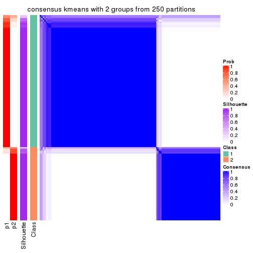</p>

</div>
<div id='tab-MAD-kmeans-consensus-heatmap-2'>
<pre><code class="r">consensus_heatmap(res, k = 3)
</code></pre>

<p>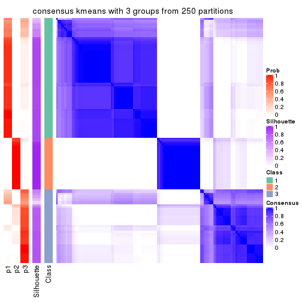</p>

</div>
<div id='tab-MAD-kmeans-consensus-heatmap-3'>
<pre><code class="r">consensus_heatmap(res, k = 4)
</code></pre>

<p>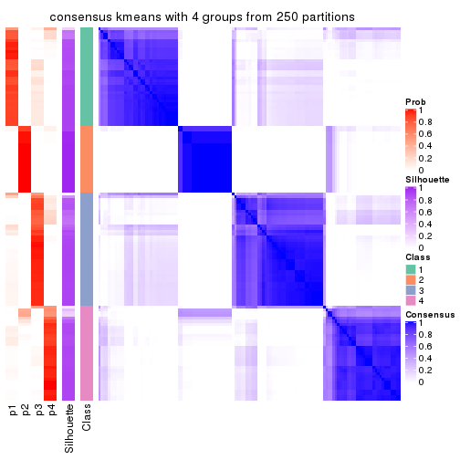</p>

</div>
<div id='tab-MAD-kmeans-consensus-heatmap-4'>
<pre><code class="r">consensus_heatmap(res, k = 5)
</code></pre>

<p>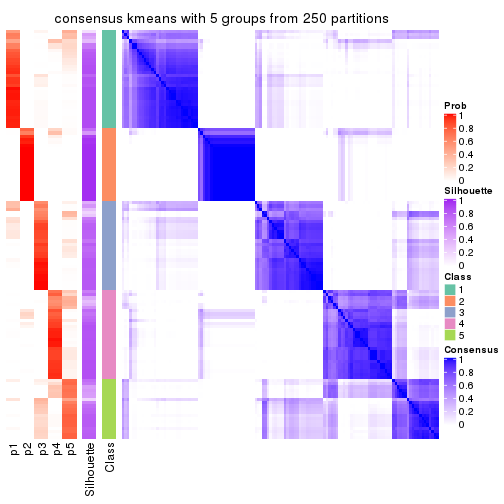</p>

</div>
<div id='tab-MAD-kmeans-consensus-heatmap-5'>
<pre><code class="r">consensus_heatmap(res, k = 6)
</code></pre>

<p>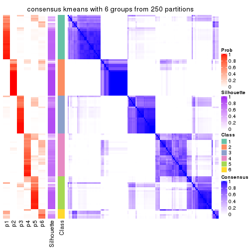</p>

</div>
</div>

Heatmaps for the membership of samples in all partitions to see how consistent they are:


<script>
$( function() {
	$( '#tabs-MAD-kmeans-membership-heatmap' ).tabs();
} );
</script>
<div id='tabs-MAD-kmeans-membership-heatmap'>
<ul>
<li><a href='#tab-MAD-kmeans-membership-heatmap-1'>k = 2</a></li>
<li><a href='#tab-MAD-kmeans-membership-heatmap-2'>k = 3</a></li>
<li><a href='#tab-MAD-kmeans-membership-heatmap-3'>k = 4</a></li>
<li><a href='#tab-MAD-kmeans-membership-heatmap-4'>k = 5</a></li>
<li><a href='#tab-MAD-kmeans-membership-heatmap-5'>k = 6</a></li>
</ul>
<div id='tab-MAD-kmeans-membership-heatmap-1'>
<pre><code class="r">membership_heatmap(res, k = 2)
</code></pre>

<p>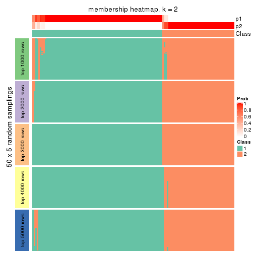</p>

</div>
<div id='tab-MAD-kmeans-membership-heatmap-2'>
<pre><code class="r">membership_heatmap(res, k = 3)
</code></pre>

<p>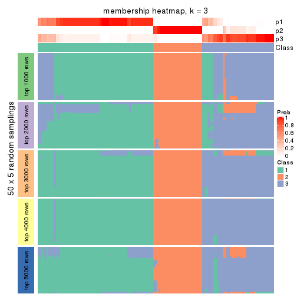</p>

</div>
<div id='tab-MAD-kmeans-membership-heatmap-3'>
<pre><code class="r">membership_heatmap(res, k = 4)
</code></pre>

<p>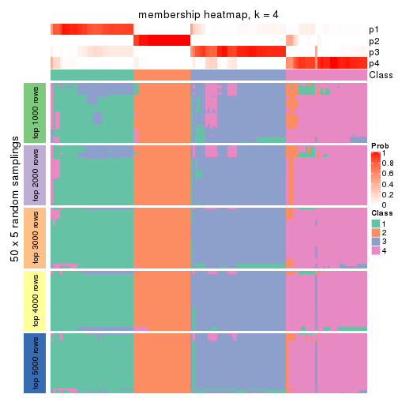</p>

</div>
<div id='tab-MAD-kmeans-membership-heatmap-4'>
<pre><code class="r">membership_heatmap(res, k = 5)
</code></pre>

<p>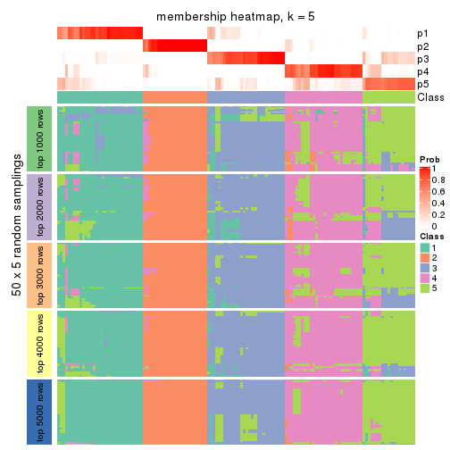</p>

</div>
<div id='tab-MAD-kmeans-membership-heatmap-5'>
<pre><code class="r">membership_heatmap(res, k = 6)
</code></pre>

<p>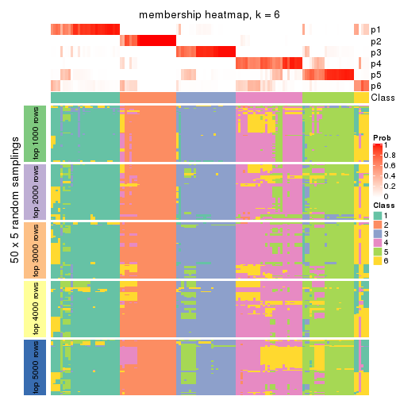</p>

</div>
</div>

As soon as we have had the classes for columns, we can look for signatures
which are significantly different between classes which can be candidate marks
for certain classes. Following are the heatmaps for signatures.


Signature heatmaps where rows are scaled:


<script>
$( function() {
	$( '#tabs-MAD-kmeans-get-signatures' ).tabs();
} );
</script>
<div id='tabs-MAD-kmeans-get-signatures'>
<ul>
<li><a href='#tab-MAD-kmeans-get-signatures-1'>k = 2</a></li>
<li><a href='#tab-MAD-kmeans-get-signatures-2'>k = 3</a></li>
<li><a href='#tab-MAD-kmeans-get-signatures-3'>k = 4</a></li>
<li><a href='#tab-MAD-kmeans-get-signatures-4'>k = 5</a></li>
<li><a href='#tab-MAD-kmeans-get-signatures-5'>k = 6</a></li>
</ul>
<div id='tab-MAD-kmeans-get-signatures-1'>
<pre><code class="r">get_signatures(res, k = 2)
</code></pre>

<p>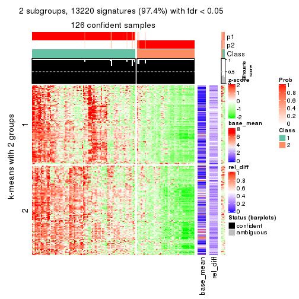</p>

</div>
<div id='tab-MAD-kmeans-get-signatures-2'>
<pre><code class="r">get_signatures(res, k = 3)
</code></pre>

<p>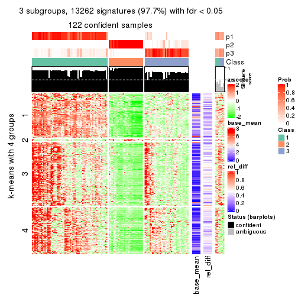</p>

</div>
<div id='tab-MAD-kmeans-get-signatures-3'>
<pre><code class="r">get_signatures(res, k = 4)
</code></pre>

<p>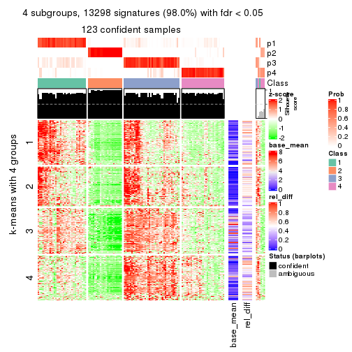</p>

</div>
<div id='tab-MAD-kmeans-get-signatures-4'>
<pre><code class="r">get_signatures(res, k = 5)
</code></pre>

<p>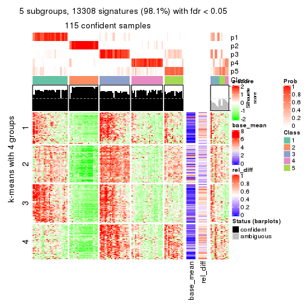</p>

</div>
<div id='tab-MAD-kmeans-get-signatures-5'>
<pre><code class="r">get_signatures(res, k = 6)
</code></pre>

<p>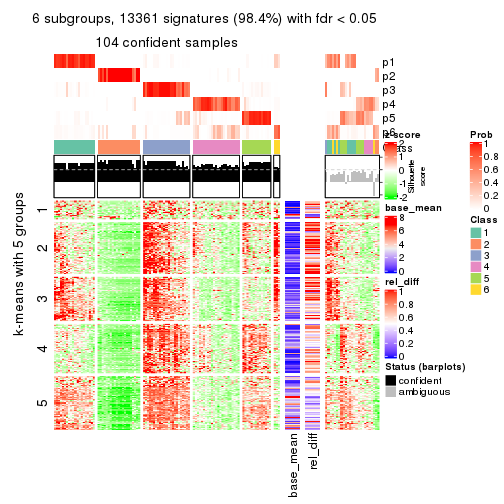</p>

</div>
</div>


Signature heatmaps where rows are not scaled:


<script>
$( function() {
	$( '#tabs-MAD-kmeans-get-signatures-no-scale' ).tabs();
} );
</script>
<div id='tabs-MAD-kmeans-get-signatures-no-scale'>
<ul>
<li><a href='#tab-MAD-kmeans-get-signatures-no-scale-1'>k = 2</a></li>
<li><a href='#tab-MAD-kmeans-get-signatures-no-scale-2'>k = 3</a></li>
<li><a href='#tab-MAD-kmeans-get-signatures-no-scale-3'>k = 4</a></li>
<li><a href='#tab-MAD-kmeans-get-signatures-no-scale-4'>k = 5</a></li>
<li><a href='#tab-MAD-kmeans-get-signatures-no-scale-5'>k = 6</a></li>
</ul>
<div id='tab-MAD-kmeans-get-signatures-no-scale-1'>
<pre><code class="r">get_signatures(res, k = 2, scale_rows = FALSE)
</code></pre>

<p>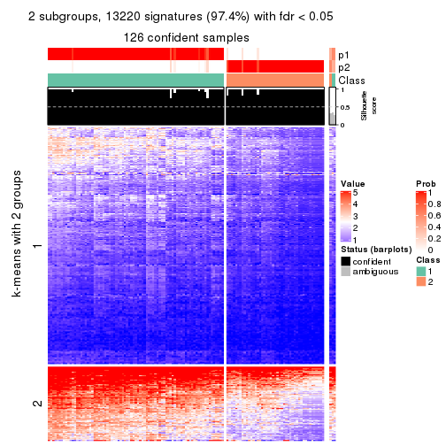</p>

</div>
<div id='tab-MAD-kmeans-get-signatures-no-scale-2'>
<pre><code class="r">get_signatures(res, k = 3, scale_rows = FALSE)
</code></pre>

<p>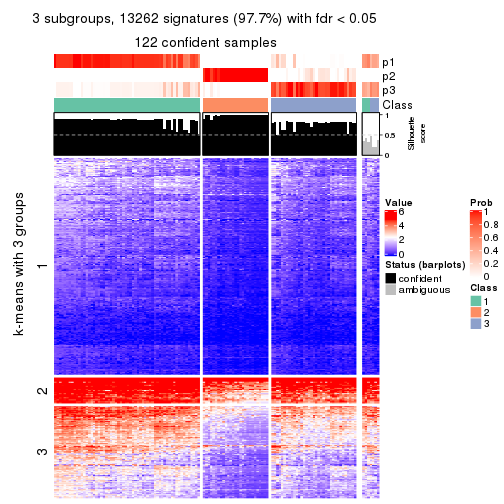</p>

</div>
<div id='tab-MAD-kmeans-get-signatures-no-scale-3'>
<pre><code class="r">get_signatures(res, k = 4, scale_rows = FALSE)
</code></pre>

<p>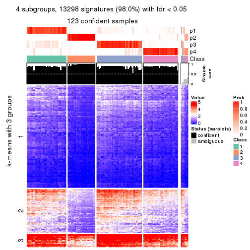</p>

</div>
<div id='tab-MAD-kmeans-get-signatures-no-scale-4'>
<pre><code class="r">get_signatures(res, k = 5, scale_rows = FALSE)
</code></pre>

<p>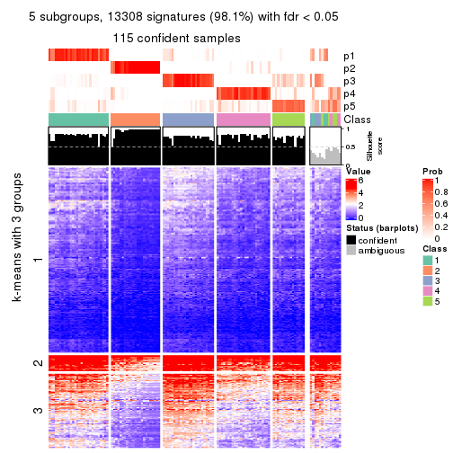</p>

</div>
<div id='tab-MAD-kmeans-get-signatures-no-scale-5'>
<pre><code class="r">get_signatures(res, k = 6, scale_rows = FALSE)
</code></pre>

<p>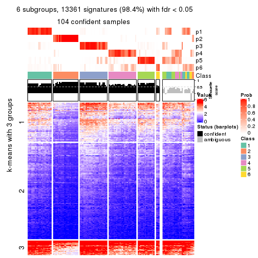</p>

</div>
</div>


Compare the overlap of signatures from different k:

```r
compare_signatures(res)
```

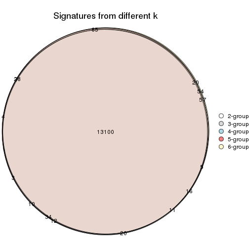

`get_signature()` returns a data frame invisibly. TO get the list of signatures, the function
call should be assigned to a variable explicitly. In following code, if `plot` argument is set
to `FALSE`, no heatmap is plotted while only the differential analysis is performed.

```r
# code only for demonstration
tb = get_signature(res, k = ..., plot = FALSE)
```

An example of the output of `tb` is:

```
#>   which_row         fdr    mean_1    mean_2 scaled_mean_1 scaled_mean_2 km
#> 1        38 0.042760348  8.373488  9.131774    -0.5533452     0.5164555  1
#> 2        40 0.018707592  7.106213  8.469186    -0.6173731     0.5762149  1
#> 3        55 0.019134737 10.221463 11.207825    -0.6159697     0.5749050  1
#> 4        59 0.006059896  5.921854  7.869574    -0.6899429     0.6439467  1
#> 5        60 0.018055526  8.928898 10.211722    -0.6204761     0.5791110  1
#> 6        98 0.009384629 15.714769 14.887706     0.6635654    -0.6193277  2
...
```

The columns in `tb` are:

1. `which_row`: row indices corresponding to the input matrix.
2. `fdr`: FDR for the differential test. 
3. `mean_x`: The mean value in group x.
4. `scaled_mean_x`: The mean value in group x after rows are scaled.
5. `km`: Row groups if k-means clustering is applied to rows.


UMAP plot which shows how samples are separated.


<script>
$( function() {
	$( '#tabs-MAD-kmeans-dimension-reduction' ).tabs();
} );
</script>
<div id='tabs-MAD-kmeans-dimension-reduction'>
<ul>
<li><a href='#tab-MAD-kmeans-dimension-reduction-1'>k = 2</a></li>
<li><a href='#tab-MAD-kmeans-dimension-reduction-2'>k = 3</a></li>
<li><a href='#tab-MAD-kmeans-dimension-reduction-3'>k = 4</a></li>
<li><a href='#tab-MAD-kmeans-dimension-reduction-4'>k = 5</a></li>
<li><a href='#tab-MAD-kmeans-dimension-reduction-5'>k = 6</a></li>
</ul>
<div id='tab-MAD-kmeans-dimension-reduction-1'>
<pre><code class="r">dimension_reduction(res, k = 2, method = &quot;UMAP&quot;)
</code></pre>

<p>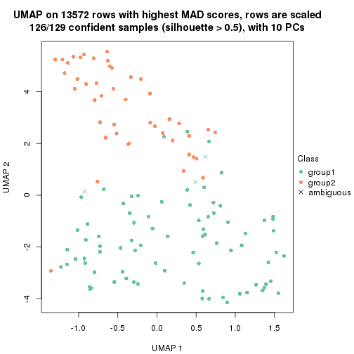</p>

</div>
<div id='tab-MAD-kmeans-dimension-reduction-2'>
<pre><code class="r">dimension_reduction(res, k = 3, method = &quot;UMAP&quot;)
</code></pre>

<p>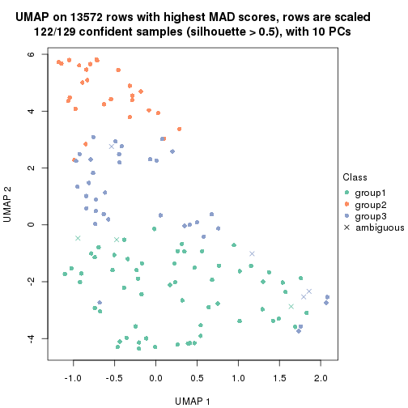</p>

</div>
<div id='tab-MAD-kmeans-dimension-reduction-3'>
<pre><code class="r">dimension_reduction(res, k = 4, method = &quot;UMAP&quot;)
</code></pre>

<p>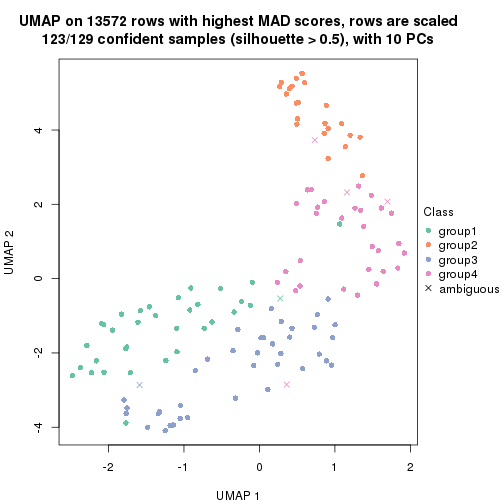</p>

</div>
<div id='tab-MAD-kmeans-dimension-reduction-4'>
<pre><code class="r">dimension_reduction(res, k = 5, method = &quot;UMAP&quot;)
</code></pre>

<p>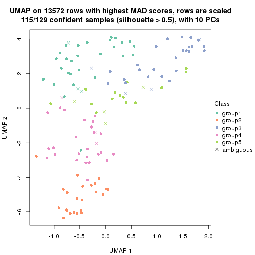</p>

</div>
<div id='tab-MAD-kmeans-dimension-reduction-5'>
<pre><code class="r">dimension_reduction(res, k = 6, method = &quot;UMAP&quot;)
</code></pre>

<p>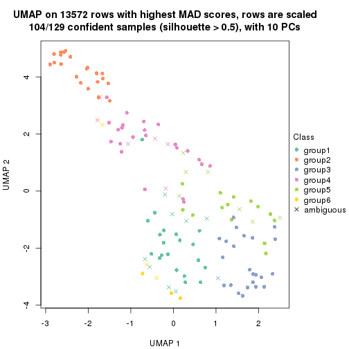</p>

</div>
</div>


Following heatmap shows how subgroups are split when increasing `k`:

```r
collect_classes(res)
```

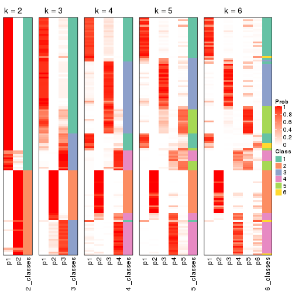


If matrix rows can be associated to genes, consider to use `GO_Enrichment(res,
...)` to perform function enrichment for the signature genes.


 

---------------------------------------------------


### MAD:skmeans**


The object with results only for a single top-value method and a single partition method 
can be extracted as:

```r
res = res_list["MAD", "skmeans"]
# you can also extract it by
# res = res_list["MAD:skmeans"]
```

A summary of `res` and all the functions that can be applied to it:

```r
res
```

```
#> A 'ConsensusPartition' object with k = 2, 3, 4, 5, 6.
#>   On a matrix with 13572 rows and 129 columns.
#>   Top rows (1000, 2000, 3000, 4000, 5000) are extracted by 'MAD' method.
#>   Subgroups are detected by 'skmeans' method.
#>   Performed in total 1250 partitions by row resampling.
#>   Best k for subgroups seems to be 3.
#> 
#> Following methods can be applied to this 'ConsensusPartition' object:
#>  [1] "cola_report"             "collect_classes"         "collect_plots"          
#>  [4] "collect_stats"           "colnames"                "compare_signatures"     
#>  [7] "consensus_heatmap"       "dimension_reduction"     "functional_enrichment"  
#> [10] "get_anno_col"            "get_anno"                "get_classes"            
#> [13] "get_consensus"           "get_matrix"              "get_membership"         
#> [16] "get_param"               "get_signatures"          "get_stats"              
#> [19] "is_best_k"               "is_stable_k"             "membership_heatmap"     
#> [22] "ncol"                    "nrow"                    "plot_ecdf"              
#> [25] "rownames"                "select_partition_number" "show"                   
#> [28] "suggest_best_k"          "test_to_known_factors"
```

`collect_plots()` function collects all the plots made from `res` for all `k` (number of partitions)
into one single page to provide an easy and fast comparison between different `k`.

```r
collect_plots(res)
```

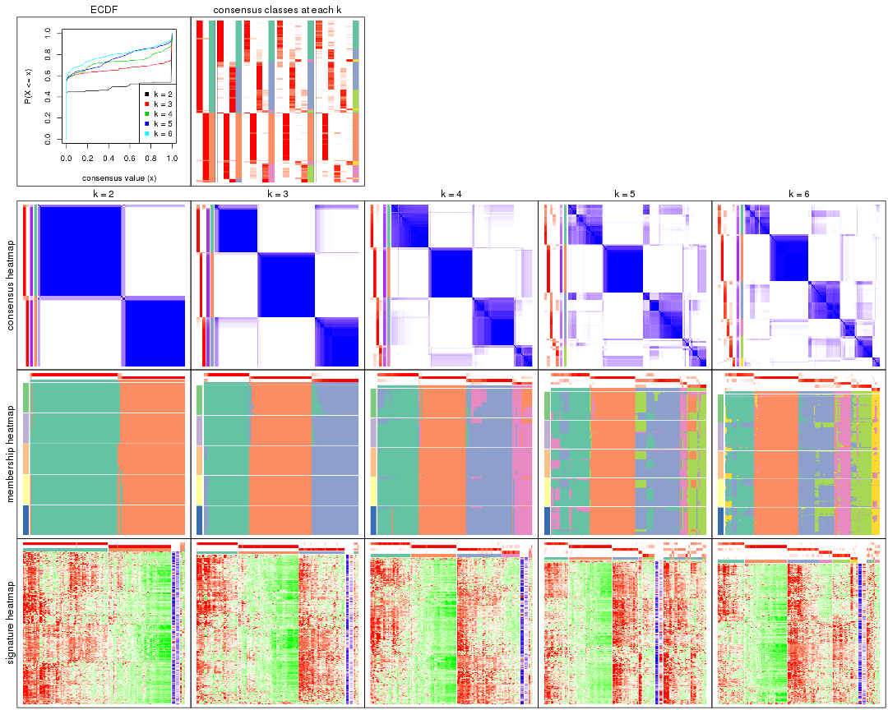

The plots are:

- The first row: a plot of the ECDF (Empirical cumulative distribution
  function) curves of the consensus matrix for each `k` and the heatmap of
  predicted classes for each `k`.
- The second row: heatmaps of the consensus matrix for each `k`.
- The third row: heatmaps of the membership matrix for each `k`.
- The fouth row: heatmaps of the signatures for each `k`.

All the plots in panels can be made by individual functions and they are
plotted later in this section.

`select_partition_number()` produces several plots showing different
statistics for choosing "optimized" `k`. There are following statistics:

- ECDF curves of the consensus matrix for each `k`;
- 1-PAC. [The PAC
  score](https://en.wikipedia.org/wiki/Consensus_clustering#Over-interpretation_potential_of_consensus_clustering)
  measures the proportion of the ambiguous subgrouping.
- Mean silhouette score.
- Concordance. The mean probability of fiting the consensus class ids in all
  partitions.
- Area increased. Denote $A_k$ as the area under the ECDF curve for current
  `k`, the area increased is defined as $A_k - A_{k-1}$.
- Rand index. The percent of pairs of samples that are both in a same cluster
  or both are not in a same cluster in the partition of k and k-1.
- Jaccard index. The ratio of pairs of samples are both in a same cluster in
  the partition of k and k-1 and the pairs of samples are both in a same
  cluster in the partition k or k-1.

The detailed explanations of these statistics can be found in [the cola
vignette](http://bioconductor.org/packages/devel/bioc/vignettes/cola/inst/doc/cola.html#toc_13).

Generally speaking, lower PAC score, higher mean silhouette score or higher
concordance corresponds to better partition. Rand index and Jaccard index
measure how similar the current partition is compared to partition with `k-1`.
If they are too similar, we won't accept `k` is better than `k-1`.

```r
select_partition_number(res)
```

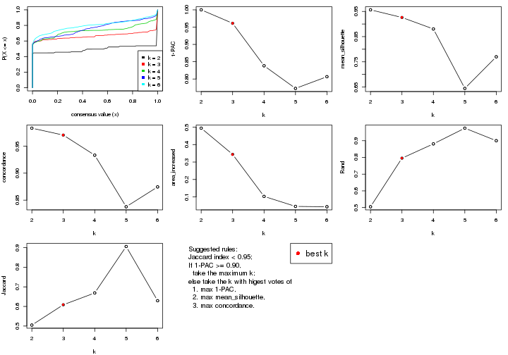

The numeric values for all these statistics can be obtained by `get_stats()`.

```r
get_stats(res)
```

```
#>   k 1-PAC mean_silhouette concordance area_increased  Rand Jaccard
#> 2 2 1.000           0.956       0.983         0.4941 0.505   0.505
#> 3 3 0.961           0.926       0.971         0.3440 0.796   0.609
#> 4 4 0.838           0.880       0.933         0.1029 0.881   0.669
#> 5 5 0.773           0.644       0.838         0.0457 0.975   0.906
#> 6 6 0.807           0.770       0.875         0.0437 0.900   0.629
```

`suggest_best_k()` suggests the best $k$ based on these statistics. The rules are as follows:

- All $k$ with Jaccard index larger than 0.95 are removed because the increase of
  the partition number does not provides enough extra information. If all $k$ are removed,
  the best $k$ is assigned by `NA`.
- For $k$ with 1-PAC larger than 0.9, the maximal $k$ is taken as the "best k". Other $k$ is called "optional k".
- If it does not fit the second rule. The $k$ with the highest vote of highest
  1-PAC, mean silhouette and concordance is taken as the "best k".

```r
suggest_best_k(res)
```

```
#> [1] 3
#> attr(,"optional")
#> [1] 2
```

There is also optional best $k$ = 2 that is worth to check.

Following shows the table of the partitions (You need to click the **show/hide
code output** link to see it). The membership matrix (columns with name `p*`)
is inferred by
[`clue::cl_consensus()`](https://www.rdocumentation.org/link/cl_consensus?package=clue)
function with the `SE` method. Basically the value in the membership matrix
represents the probability to belong to a certain group. The finall class
label for an item is determined with the group with highest probability it
belongs to.

In `get_classes()` function, the entropy is calculated from the membership
matrix and the silhouette score is calculated from the consensus matrix.


<script>
$( function() {
	$( '#tabs-MAD-skmeans-get-classes' ).tabs();
} );
</script>
<div id='tabs-MAD-skmeans-get-classes'>
<ul>
<li><a href='#tab-MAD-skmeans-get-classes-1'>k = 2</a></li>
<li><a href='#tab-MAD-skmeans-get-classes-2'>k = 3</a></li>
<li><a href='#tab-MAD-skmeans-get-classes-3'>k = 4</a></li>
<li><a href='#tab-MAD-skmeans-get-classes-4'>k = 5</a></li>
<li><a href='#tab-MAD-skmeans-get-classes-5'>k = 6</a></li>
</ul>

<div id='tab-MAD-skmeans-get-classes-1'>
<p><a id='tab-MAD-skmeans-get-classes-1-a' style='color:#0366d6' href='#'>show/hide code output</a></p>
<pre><code class="r">cbind(get_classes(res, k = 2), get_membership(res, k = 2))
</code></pre>

<pre><code>#&gt;            class entropy silhouette    p1    p2
#&gt; SRR1656463     2  0.0000      0.973 0.000 1.000
#&gt; SRR1656464     1  0.0000      0.990 1.000 0.000
#&gt; SRR1656462     1  0.0000      0.990 1.000 0.000
#&gt; SRR1656465     1  0.0000      0.990 1.000 0.000
#&gt; SRR1656467     2  0.0000      0.973 0.000 1.000
#&gt; SRR1656466     1  0.0000      0.990 1.000 0.000
#&gt; SRR1656468     2  0.0000      0.973 0.000 1.000
#&gt; SRR1656472     1  0.0000      0.990 1.000 0.000
#&gt; SRR1656471     1  0.0000      0.990 1.000 0.000
#&gt; SRR1656470     2  0.0000      0.973 0.000 1.000
#&gt; SRR1656469     1  0.0000      0.990 1.000 0.000
#&gt; SRR1656473     2  0.0000      0.973 0.000 1.000
#&gt; SRR1656474     2  0.0000      0.973 0.000 1.000
#&gt; SRR1656475     2  0.0000      0.973 0.000 1.000
#&gt; SRR1656478     1  0.0000      0.990 1.000 0.000
#&gt; SRR1656477     2  0.0000      0.973 0.000 1.000
#&gt; SRR1656479     1  0.0000      0.990 1.000 0.000
#&gt; SRR1656480     2  0.0000      0.973 0.000 1.000
#&gt; SRR1656476     2  0.0000      0.973 0.000 1.000
#&gt; SRR1656481     2  0.0000      0.973 0.000 1.000
#&gt; SRR1656482     2  0.0000      0.973 0.000 1.000
#&gt; SRR1656483     2  0.0000      0.973 0.000 1.000
#&gt; SRR1656485     1  0.0000      0.990 1.000 0.000
#&gt; SRR1656487     1  0.0000      0.990 1.000 0.000
#&gt; SRR1656486     1  0.0000      0.990 1.000 0.000
#&gt; SRR1656488     1  0.0000      0.990 1.000 0.000
#&gt; SRR1656484     1  0.0000      0.990 1.000 0.000
#&gt; SRR1656489     1  0.0000      0.990 1.000 0.000
#&gt; SRR1656491     1  0.0000      0.990 1.000 0.000
#&gt; SRR1656490     1  0.0000      0.990 1.000 0.000
#&gt; SRR1656492     1  0.0000      0.990 1.000 0.000
#&gt; SRR1656493     1  0.0000      0.990 1.000 0.000
#&gt; SRR1656495     2  0.0000      0.973 0.000 1.000
#&gt; SRR1656496     1  0.0000      0.990 1.000 0.000
#&gt; SRR1656494     2  0.0000      0.973 0.000 1.000
#&gt; SRR1656497     2  0.0000      0.973 0.000 1.000
#&gt; SRR1656499     1  0.0000      0.990 1.000 0.000
#&gt; SRR1656500     1  0.0000      0.990 1.000 0.000
#&gt; SRR1656501     1  0.0000      0.990 1.000 0.000
#&gt; SRR1656498     1  0.0000      0.990 1.000 0.000
#&gt; SRR1656504     2  0.0000      0.973 0.000 1.000
#&gt; SRR1656502     1  0.0376      0.986 0.996 0.004
#&gt; SRR1656503     1  0.0000      0.990 1.000 0.000
#&gt; SRR1656507     1  0.0000      0.990 1.000 0.000
#&gt; SRR1656508     1  0.0000      0.990 1.000 0.000
#&gt; SRR1656505     2  0.0000      0.973 0.000 1.000
#&gt; SRR1656506     1  0.0000      0.990 1.000 0.000
#&gt; SRR1656509     1  0.0000      0.990 1.000 0.000
#&gt; SRR1656510     2  0.9710      0.341 0.400 0.600
#&gt; SRR1656511     2  0.0000      0.973 0.000 1.000
#&gt; SRR1656513     2  0.0000      0.973 0.000 1.000
#&gt; SRR1656512     2  0.0000      0.973 0.000 1.000
#&gt; SRR1656514     1  0.0000      0.990 1.000 0.000
#&gt; SRR1656515     2  0.0000      0.973 0.000 1.000
#&gt; SRR1656516     1  0.0000      0.990 1.000 0.000
#&gt; SRR1656518     1  0.0000      0.990 1.000 0.000
#&gt; SRR1656517     1  0.0000      0.990 1.000 0.000
#&gt; SRR1656519     1  0.0000      0.990 1.000 0.000
#&gt; SRR1656522     1  0.0000      0.990 1.000 0.000
#&gt; SRR1656523     2  0.0000      0.973 0.000 1.000
#&gt; SRR1656521     2  0.0000      0.973 0.000 1.000
#&gt; SRR1656520     1  0.0000      0.990 1.000 0.000
#&gt; SRR1656524     2  0.9866      0.250 0.432 0.568
#&gt; SRR1656525     1  0.0000      0.990 1.000 0.000
#&gt; SRR1656526     2  0.0000      0.973 0.000 1.000
#&gt; SRR1656527     2  0.0000      0.973 0.000 1.000
#&gt; SRR1656530     1  0.0000      0.990 1.000 0.000
#&gt; SRR1656529     1  0.0000      0.990 1.000 0.000
#&gt; SRR1656531     1  0.0000      0.990 1.000 0.000
#&gt; SRR1656528     1  0.0000      0.990 1.000 0.000
#&gt; SRR1656534     1  0.0000      0.990 1.000 0.000
#&gt; SRR1656533     1  0.0000      0.990 1.000 0.000
#&gt; SRR1656536     2  0.9815      0.282 0.420 0.580
#&gt; SRR1656532     2  0.0000      0.973 0.000 1.000
#&gt; SRR1656537     1  0.0000      0.990 1.000 0.000
#&gt; SRR1656538     1  0.0000      0.990 1.000 0.000
#&gt; SRR1656535     2  0.0000      0.973 0.000 1.000
#&gt; SRR1656539     1  0.0000      0.990 1.000 0.000
#&gt; SRR1656544     1  0.0000      0.990 1.000 0.000
#&gt; SRR1656542     1  0.0000      0.990 1.000 0.000
#&gt; SRR1656543     1  0.0000      0.990 1.000 0.000
#&gt; SRR1656545     2  0.0000      0.973 0.000 1.000
#&gt; SRR1656540     1  0.0000      0.990 1.000 0.000
#&gt; SRR1656546     1  0.9710      0.306 0.600 0.400
#&gt; SRR1656541     2  0.0000      0.973 0.000 1.000
#&gt; SRR1656547     2  0.0000      0.973 0.000 1.000
#&gt; SRR1656548     1  0.0000      0.990 1.000 0.000
#&gt; SRR1656549     1  0.0000      0.990 1.000 0.000
#&gt; SRR1656551     2  0.6623      0.780 0.172 0.828
#&gt; SRR1656553     1  0.0000      0.990 1.000 0.000
#&gt; SRR1656550     2  0.0000      0.973 0.000 1.000
#&gt; SRR1656552     2  0.0000      0.973 0.000 1.000
#&gt; SRR1656554     1  0.0000      0.990 1.000 0.000
#&gt; SRR1656555     2  0.0000      0.973 0.000 1.000
#&gt; SRR1656556     1  0.8955      0.527 0.688 0.312
#&gt; SRR1656557     1  0.0000      0.990 1.000 0.000
#&gt; SRR1656558     1  0.0000      0.990 1.000 0.000
#&gt; SRR1656559     1  0.0000      0.990 1.000 0.000
#&gt; SRR1656560     1  0.0000      0.990 1.000 0.000
#&gt; SRR1656561     1  0.0000      0.990 1.000 0.000
#&gt; SRR1656562     2  0.0000      0.973 0.000 1.000
#&gt; SRR1656563     1  0.0000      0.990 1.000 0.000
#&gt; SRR1656564     2  0.0000      0.973 0.000 1.000
#&gt; SRR1656565     2  0.0000      0.973 0.000 1.000
#&gt; SRR1656566     1  0.0000      0.990 1.000 0.000
#&gt; SRR1656568     2  0.0000      0.973 0.000 1.000
#&gt; SRR1656567     2  0.0000      0.973 0.000 1.000
#&gt; SRR1656569     1  0.0000      0.990 1.000 0.000
#&gt; SRR1656570     1  0.0000      0.990 1.000 0.000
#&gt; SRR1656571     2  0.0000      0.973 0.000 1.000
#&gt; SRR1656573     1  0.0000      0.990 1.000 0.000
#&gt; SRR1656572     2  0.0000      0.973 0.000 1.000
#&gt; SRR1656574     1  0.0000      0.990 1.000 0.000
#&gt; SRR1656575     1  0.0000      0.990 1.000 0.000
#&gt; SRR1656576     2  0.0000      0.973 0.000 1.000
#&gt; SRR1656578     2  0.0000      0.973 0.000 1.000
#&gt; SRR1656577     1  0.0000      0.990 1.000 0.000
#&gt; SRR1656579     2  0.0000      0.973 0.000 1.000
#&gt; SRR1656580     1  0.0000      0.990 1.000 0.000
#&gt; SRR1656581     2  0.0000      0.973 0.000 1.000
#&gt; SRR1656582     2  0.0000      0.973 0.000 1.000
#&gt; SRR1656585     2  0.0000      0.973 0.000 1.000
#&gt; SRR1656584     1  0.0000      0.990 1.000 0.000
#&gt; SRR1656583     2  0.0000      0.973 0.000 1.000
#&gt; SRR1656586     2  0.0000      0.973 0.000 1.000
#&gt; SRR1656587     2  0.0000      0.973 0.000 1.000
#&gt; SRR1656588     2  0.0000      0.973 0.000 1.000
#&gt; SRR1656589     2  0.0000      0.973 0.000 1.000
#&gt; SRR1656590     1  0.0000      0.990 1.000 0.000
</code></pre>

<script>
$('#tab-MAD-skmeans-get-classes-1-a').parent().next().next().hide();
$('#tab-MAD-skmeans-get-classes-1-a').click(function(){
  $('#tab-MAD-skmeans-get-classes-1-a').parent().next().next().toggle();
  return(false);
});
</script>
</div>

<div id='tab-MAD-skmeans-get-classes-2'>
<p><a id='tab-MAD-skmeans-get-classes-2-a' style='color:#0366d6' href='#'>show/hide code output</a></p>
<pre><code class="r">cbind(get_classes(res, k = 3), get_membership(res, k = 3))
</code></pre>

<pre><code>#&gt;            class entropy silhouette    p1    p2    p3
#&gt; SRR1656463     2  0.0000     0.9871 0.000 1.000 0.000
#&gt; SRR1656464     1  0.0000     0.9511 1.000 0.000 0.000
#&gt; SRR1656462     3  0.0424     0.9553 0.008 0.000 0.992
#&gt; SRR1656465     3  0.0000     0.9581 0.000 0.000 1.000
#&gt; SRR1656467     2  0.0000     0.9871 0.000 1.000 0.000
#&gt; SRR1656466     3  0.0000     0.9581 0.000 0.000 1.000
#&gt; SRR1656468     2  0.1289     0.9593 0.000 0.968 0.032
#&gt; SRR1656472     1  0.0000     0.9511 1.000 0.000 0.000
#&gt; SRR1656471     3  0.0000     0.9581 0.000 0.000 1.000
#&gt; SRR1656470     2  0.0000     0.9871 0.000 1.000 0.000
#&gt; SRR1656469     3  0.0000     0.9581 0.000 0.000 1.000
#&gt; SRR1656473     2  0.0000     0.9871 0.000 1.000 0.000
#&gt; SRR1656474     2  0.0000     0.9871 0.000 1.000 0.000
#&gt; SRR1656475     2  0.0000     0.9871 0.000 1.000 0.000
#&gt; SRR1656478     1  0.0000     0.9511 1.000 0.000 0.000
#&gt; SRR1656477     2  0.0000     0.9871 0.000 1.000 0.000
#&gt; SRR1656479     1  0.6225     0.2079 0.568 0.000 0.432
#&gt; SRR1656480     2  0.0000     0.9871 0.000 1.000 0.000
#&gt; SRR1656476     2  0.0000     0.9871 0.000 1.000 0.000
#&gt; SRR1656481     3  0.0000     0.9581 0.000 0.000 1.000
#&gt; SRR1656482     2  0.0000     0.9871 0.000 1.000 0.000
#&gt; SRR1656483     2  0.0000     0.9871 0.000 1.000 0.000
#&gt; SRR1656485     3  0.0000     0.9581 0.000 0.000 1.000
#&gt; SRR1656487     3  0.0000     0.9581 0.000 0.000 1.000
#&gt; SRR1656486     1  0.0000     0.9511 1.000 0.000 0.000
#&gt; SRR1656488     3  0.0000     0.9581 0.000 0.000 1.000
#&gt; SRR1656484     1  0.0000     0.9511 1.000 0.000 0.000
#&gt; SRR1656489     1  0.0000     0.9511 1.000 0.000 0.000
#&gt; SRR1656491     3  0.0000     0.9581 0.000 0.000 1.000
#&gt; SRR1656490     1  0.0000     0.9511 1.000 0.000 0.000
#&gt; SRR1656492     3  0.4452     0.7724 0.192 0.000 0.808
#&gt; SRR1656493     1  0.0000     0.9511 1.000 0.000 0.000
#&gt; SRR1656495     2  0.4002     0.7981 0.160 0.840 0.000
#&gt; SRR1656496     1  0.6309    -0.0225 0.504 0.000 0.496
#&gt; SRR1656494     2  0.0000     0.9871 0.000 1.000 0.000
#&gt; SRR1656497     2  0.0000     0.9871 0.000 1.000 0.000
#&gt; SRR1656499     3  0.0000     0.9581 0.000 0.000 1.000
#&gt; SRR1656500     3  0.2537     0.9017 0.080 0.000 0.920
#&gt; SRR1656501     1  0.0000     0.9511 1.000 0.000 0.000
#&gt; SRR1656498     1  0.0000     0.9511 1.000 0.000 0.000
#&gt; SRR1656504     2  0.0000     0.9871 0.000 1.000 0.000
#&gt; SRR1656502     1  0.0000     0.9511 1.000 0.000 0.000
#&gt; SRR1656503     1  0.0000     0.9511 1.000 0.000 0.000
#&gt; SRR1656507     1  0.0000     0.9511 1.000 0.000 0.000
#&gt; SRR1656508     1  0.0000     0.9511 1.000 0.000 0.000
#&gt; SRR1656505     2  0.0000     0.9871 0.000 1.000 0.000
#&gt; SRR1656506     3  0.0000     0.9581 0.000 0.000 1.000
#&gt; SRR1656509     3  0.0000     0.9581 0.000 0.000 1.000
#&gt; SRR1656510     2  0.6126     0.3669 0.000 0.600 0.400
#&gt; SRR1656511     2  0.0000     0.9871 0.000 1.000 0.000
#&gt; SRR1656513     2  0.0000     0.9871 0.000 1.000 0.000
#&gt; SRR1656512     2  0.0000     0.9871 0.000 1.000 0.000
#&gt; SRR1656514     1  0.5016     0.6517 0.760 0.000 0.240
#&gt; SRR1656515     2  0.0000     0.9871 0.000 1.000 0.000
#&gt; SRR1656516     1  0.0000     0.9511 1.000 0.000 0.000
#&gt; SRR1656518     1  0.0000     0.9511 1.000 0.000 0.000
#&gt; SRR1656517     1  0.0000     0.9511 1.000 0.000 0.000
#&gt; SRR1656519     3  0.2537     0.9017 0.080 0.000 0.920
#&gt; SRR1656522     1  0.0000     0.9511 1.000 0.000 0.000
#&gt; SRR1656523     2  0.0000     0.9871 0.000 1.000 0.000
#&gt; SRR1656521     2  0.0000     0.9871 0.000 1.000 0.000
#&gt; SRR1656520     3  0.0592     0.9534 0.012 0.000 0.988
#&gt; SRR1656524     1  0.0000     0.9511 1.000 0.000 0.000
#&gt; SRR1656525     3  0.0592     0.9534 0.012 0.000 0.988
#&gt; SRR1656526     2  0.0000     0.9871 0.000 1.000 0.000
#&gt; SRR1656527     2  0.0000     0.9871 0.000 1.000 0.000
#&gt; SRR1656530     3  0.0000     0.9581 0.000 0.000 1.000
#&gt; SRR1656529     3  0.0000     0.9581 0.000 0.000 1.000
#&gt; SRR1656531     1  0.0000     0.9511 1.000 0.000 0.000
#&gt; SRR1656528     3  0.0000     0.9581 0.000 0.000 1.000
#&gt; SRR1656534     3  0.4555     0.7610 0.200 0.000 0.800
#&gt; SRR1656533     1  0.0000     0.9511 1.000 0.000 0.000
#&gt; SRR1656536     3  0.0000     0.9581 0.000 0.000 1.000
#&gt; SRR1656532     2  0.0000     0.9871 0.000 1.000 0.000
#&gt; SRR1656537     1  0.0000     0.9511 1.000 0.000 0.000
#&gt; SRR1656538     3  0.5560     0.5888 0.300 0.000 0.700
#&gt; SRR1656535     2  0.0000     0.9871 0.000 1.000 0.000
#&gt; SRR1656539     3  0.0000     0.9581 0.000 0.000 1.000
#&gt; SRR1656544     3  0.0424     0.9553 0.008 0.000 0.992
#&gt; SRR1656542     3  0.2537     0.9017 0.080 0.000 0.920
#&gt; SRR1656543     3  0.0424     0.9553 0.008 0.000 0.992
#&gt; SRR1656545     2  0.0000     0.9871 0.000 1.000 0.000
#&gt; SRR1656540     3  0.0000     0.9581 0.000 0.000 1.000
#&gt; SRR1656546     1  0.0000     0.9511 1.000 0.000 0.000
#&gt; SRR1656541     2  0.0000     0.9871 0.000 1.000 0.000
#&gt; SRR1656547     2  0.0000     0.9871 0.000 1.000 0.000
#&gt; SRR1656548     3  0.0892     0.9482 0.020 0.000 0.980
#&gt; SRR1656549     1  0.0000     0.9511 1.000 0.000 0.000
#&gt; SRR1656551     3  0.0000     0.9581 0.000 0.000 1.000
#&gt; SRR1656553     3  0.3482     0.8526 0.128 0.000 0.872
#&gt; SRR1656550     2  0.0000     0.9871 0.000 1.000 0.000
#&gt; SRR1656552     2  0.0000     0.9871 0.000 1.000 0.000
#&gt; SRR1656554     3  0.0000     0.9581 0.000 0.000 1.000
#&gt; SRR1656555     2  0.2165     0.9282 0.000 0.936 0.064
#&gt; SRR1656556     3  0.0000     0.9581 0.000 0.000 1.000
#&gt; SRR1656557     3  0.0592     0.9534 0.012 0.000 0.988
#&gt; SRR1656558     1  0.0000     0.9511 1.000 0.000 0.000
#&gt; SRR1656559     1  0.0000     0.9511 1.000 0.000 0.000
#&gt; SRR1656560     3  0.0000     0.9581 0.000 0.000 1.000
#&gt; SRR1656561     3  0.5810     0.5107 0.336 0.000 0.664
#&gt; SRR1656562     2  0.0000     0.9871 0.000 1.000 0.000
#&gt; SRR1656563     1  0.0000     0.9511 1.000 0.000 0.000
#&gt; SRR1656564     2  0.0000     0.9871 0.000 1.000 0.000
#&gt; SRR1656565     2  0.0000     0.9871 0.000 1.000 0.000
#&gt; SRR1656566     1  0.0000     0.9511 1.000 0.000 0.000
#&gt; SRR1656568     2  0.0000     0.9871 0.000 1.000 0.000
#&gt; SRR1656567     2  0.0000     0.9871 0.000 1.000 0.000
#&gt; SRR1656569     3  0.0000     0.9581 0.000 0.000 1.000
#&gt; SRR1656570     1  0.0000     0.9511 1.000 0.000 0.000
#&gt; SRR1656571     2  0.0000     0.9871 0.000 1.000 0.000
#&gt; SRR1656573     3  0.0000     0.9581 0.000 0.000 1.000
#&gt; SRR1656572     2  0.0000     0.9871 0.000 1.000 0.000
#&gt; SRR1656574     1  0.0000     0.9511 1.000 0.000 0.000
#&gt; SRR1656575     1  0.0000     0.9511 1.000 0.000 0.000
#&gt; SRR1656576     2  0.0000     0.9871 0.000 1.000 0.000
#&gt; SRR1656578     2  0.0000     0.9871 0.000 1.000 0.000
#&gt; SRR1656577     1  0.0000     0.9511 1.000 0.000 0.000
#&gt; SRR1656579     2  0.0000     0.9871 0.000 1.000 0.000
#&gt; SRR1656580     1  0.6309    -0.0225 0.504 0.000 0.496
#&gt; SRR1656581     2  0.0000     0.9871 0.000 1.000 0.000
#&gt; SRR1656582     2  0.0000     0.9871 0.000 1.000 0.000
#&gt; SRR1656585     2  0.0000     0.9871 0.000 1.000 0.000
#&gt; SRR1656584     1  0.0000     0.9511 1.000 0.000 0.000
#&gt; SRR1656583     2  0.0000     0.9871 0.000 1.000 0.000
#&gt; SRR1656586     2  0.0000     0.9871 0.000 1.000 0.000
#&gt; SRR1656587     2  0.0000     0.9871 0.000 1.000 0.000
#&gt; SRR1656588     2  0.0000     0.9871 0.000 1.000 0.000
#&gt; SRR1656589     2  0.0000     0.9871 0.000 1.000 0.000
#&gt; SRR1656590     1  0.0000     0.9511 1.000 0.000 0.000
</code></pre>

<script>
$('#tab-MAD-skmeans-get-classes-2-a').parent().next().next().hide();
$('#tab-MAD-skmeans-get-classes-2-a').click(function(){
  $('#tab-MAD-skmeans-get-classes-2-a').parent().next().next().toggle();
  return(false);
});
</script>
</div>

<div id='tab-MAD-skmeans-get-classes-3'>
<p><a id='tab-MAD-skmeans-get-classes-3-a' style='color:#0366d6' href='#'>show/hide code output</a></p>
<pre><code class="r">cbind(get_classes(res, k = 4), get_membership(res, k = 4))
</code></pre>

<pre><code>#&gt;            class entropy silhouette    p1    p2    p3    p4
#&gt; SRR1656463     2  0.0000      0.974 0.000 1.000 0.000 0.000
#&gt; SRR1656464     1  0.3528      0.827 0.808 0.000 0.192 0.000
#&gt; SRR1656462     3  0.0000      0.915 0.000 0.000 1.000 0.000
#&gt; SRR1656465     3  0.4193      0.741 0.000 0.000 0.732 0.268
#&gt; SRR1656467     2  0.0000      0.974 0.000 1.000 0.000 0.000
#&gt; SRR1656466     3  0.3311      0.829 0.000 0.000 0.828 0.172
#&gt; SRR1656468     4  0.0000      0.784 0.000 0.000 0.000 1.000
#&gt; SRR1656472     1  0.1940      0.902 0.924 0.000 0.076 0.000
#&gt; SRR1656471     3  0.4134      0.752 0.000 0.000 0.740 0.260
#&gt; SRR1656470     2  0.0000      0.974 0.000 1.000 0.000 0.000
#&gt; SRR1656469     3  0.3486      0.817 0.000 0.000 0.812 0.188
#&gt; SRR1656473     2  0.0000      0.974 0.000 1.000 0.000 0.000
#&gt; SRR1656474     2  0.0000      0.974 0.000 1.000 0.000 0.000
#&gt; SRR1656475     2  0.0000      0.974 0.000 1.000 0.000 0.000
#&gt; SRR1656478     1  0.0592      0.929 0.984 0.000 0.016 0.000
#&gt; SRR1656477     4  0.2011      0.824 0.000 0.080 0.000 0.920
#&gt; SRR1656479     3  0.4250      0.585 0.276 0.000 0.724 0.000
#&gt; SRR1656480     4  0.3311      0.833 0.000 0.172 0.000 0.828
#&gt; SRR1656476     2  0.0000      0.974 0.000 1.000 0.000 0.000
#&gt; SRR1656481     4  0.0000      0.784 0.000 0.000 0.000 1.000
#&gt; SRR1656482     2  0.0000      0.974 0.000 1.000 0.000 0.000
#&gt; SRR1656483     2  0.0000      0.974 0.000 1.000 0.000 0.000
#&gt; SRR1656485     3  0.0000      0.915 0.000 0.000 1.000 0.000
#&gt; SRR1656487     3  0.3486      0.817 0.000 0.000 0.812 0.188
#&gt; SRR1656486     1  0.1637      0.916 0.940 0.000 0.060 0.000
#&gt; SRR1656488     3  0.1792      0.892 0.000 0.000 0.932 0.068
#&gt; SRR1656484     1  0.0817      0.928 0.976 0.000 0.024 0.000
#&gt; SRR1656489     1  0.2149      0.900 0.912 0.000 0.088 0.000
#&gt; SRR1656491     3  0.0000      0.915 0.000 0.000 1.000 0.000
#&gt; SRR1656490     1  0.0188      0.930 0.996 0.000 0.004 0.000
#&gt; SRR1656492     3  0.1867      0.875 0.072 0.000 0.928 0.000
#&gt; SRR1656493     1  0.0000      0.929 1.000 0.000 0.000 0.000
#&gt; SRR1656495     2  0.3942      0.637 0.236 0.764 0.000 0.000
#&gt; SRR1656496     3  0.1716      0.864 0.064 0.000 0.936 0.000
#&gt; SRR1656494     2  0.0000      0.974 0.000 1.000 0.000 0.000
#&gt; SRR1656497     2  0.0000      0.974 0.000 1.000 0.000 0.000
#&gt; SRR1656499     3  0.0000      0.915 0.000 0.000 1.000 0.000
#&gt; SRR1656500     3  0.0000      0.915 0.000 0.000 1.000 0.000
#&gt; SRR1656501     1  0.1716      0.915 0.936 0.000 0.064 0.000
#&gt; SRR1656498     1  0.0000      0.929 1.000 0.000 0.000 0.000
#&gt; SRR1656504     2  0.0000      0.974 0.000 1.000 0.000 0.000
#&gt; SRR1656502     1  0.1867      0.904 0.928 0.000 0.072 0.000
#&gt; SRR1656503     1  0.3649      0.816 0.796 0.000 0.204 0.000
#&gt; SRR1656507     1  0.1022      0.926 0.968 0.000 0.032 0.000
#&gt; SRR1656508     1  0.0000      0.929 1.000 0.000 0.000 0.000
#&gt; SRR1656505     4  0.3569      0.820 0.000 0.196 0.000 0.804
#&gt; SRR1656506     3  0.0000      0.915 0.000 0.000 1.000 0.000
#&gt; SRR1656509     3  0.0592      0.908 0.000 0.000 0.984 0.016
#&gt; SRR1656510     2  0.6854      0.318 0.000 0.596 0.232 0.172
#&gt; SRR1656511     2  0.0000      0.974 0.000 1.000 0.000 0.000
#&gt; SRR1656513     2  0.0000      0.974 0.000 1.000 0.000 0.000
#&gt; SRR1656512     2  0.0000      0.974 0.000 1.000 0.000 0.000
#&gt; SRR1656514     3  0.3942      0.636 0.236 0.000 0.764 0.000
#&gt; SRR1656515     2  0.3172      0.759 0.000 0.840 0.000 0.160
#&gt; SRR1656516     1  0.3528      0.827 0.808 0.000 0.192 0.000
#&gt; SRR1656518     1  0.0188      0.930 0.996 0.000 0.004 0.000
#&gt; SRR1656517     1  0.0188      0.930 0.996 0.000 0.004 0.000
#&gt; SRR1656519     3  0.0000      0.915 0.000 0.000 1.000 0.000
#&gt; SRR1656522     1  0.4040      0.765 0.752 0.000 0.248 0.000
#&gt; SRR1656523     2  0.0000      0.974 0.000 1.000 0.000 0.000
#&gt; SRR1656521     2  0.0000      0.974 0.000 1.000 0.000 0.000
#&gt; SRR1656520     3  0.0000      0.915 0.000 0.000 1.000 0.000
#&gt; SRR1656524     1  0.0000      0.929 1.000 0.000 0.000 0.000
#&gt; SRR1656525     3  0.0000      0.915 0.000 0.000 1.000 0.000
#&gt; SRR1656526     2  0.0000      0.974 0.000 1.000 0.000 0.000
#&gt; SRR1656527     2  0.0000      0.974 0.000 1.000 0.000 0.000
#&gt; SRR1656530     3  0.2011      0.886 0.000 0.000 0.920 0.080
#&gt; SRR1656529     3  0.3486      0.817 0.000 0.000 0.812 0.188
#&gt; SRR1656531     1  0.0000      0.929 1.000 0.000 0.000 0.000
#&gt; SRR1656528     3  0.2081      0.885 0.000 0.000 0.916 0.084
#&gt; SRR1656534     3  0.0000      0.915 0.000 0.000 1.000 0.000
#&gt; SRR1656533     1  0.0188      0.930 0.996 0.000 0.004 0.000
#&gt; SRR1656536     4  0.0000      0.784 0.000 0.000 0.000 1.000
#&gt; SRR1656532     2  0.0000      0.974 0.000 1.000 0.000 0.000
#&gt; SRR1656537     1  0.0000      0.929 1.000 0.000 0.000 0.000
#&gt; SRR1656538     3  0.0000      0.915 0.000 0.000 1.000 0.000
#&gt; SRR1656535     2  0.0000      0.974 0.000 1.000 0.000 0.000
#&gt; SRR1656539     3  0.3801      0.790 0.000 0.000 0.780 0.220
#&gt; SRR1656544     3  0.0000      0.915 0.000 0.000 1.000 0.000
#&gt; SRR1656542     3  0.0000      0.915 0.000 0.000 1.000 0.000
#&gt; SRR1656543     3  0.0000      0.915 0.000 0.000 1.000 0.000
#&gt; SRR1656545     2  0.0000      0.974 0.000 1.000 0.000 0.000
#&gt; SRR1656540     3  0.0000      0.915 0.000 0.000 1.000 0.000
#&gt; SRR1656546     1  0.3486      0.704 0.812 0.188 0.000 0.000
#&gt; SRR1656541     2  0.0000      0.974 0.000 1.000 0.000 0.000
#&gt; SRR1656547     2  0.0000      0.974 0.000 1.000 0.000 0.000
#&gt; SRR1656548     3  0.0000      0.915 0.000 0.000 1.000 0.000
#&gt; SRR1656549     1  0.0000      0.929 1.000 0.000 0.000 0.000
#&gt; SRR1656551     4  0.0000      0.784 0.000 0.000 0.000 1.000
#&gt; SRR1656553     3  0.0000      0.915 0.000 0.000 1.000 0.000
#&gt; SRR1656550     4  0.3311      0.833 0.000 0.172 0.000 0.828
#&gt; SRR1656552     2  0.0000      0.974 0.000 1.000 0.000 0.000
#&gt; SRR1656554     3  0.3649      0.803 0.000 0.000 0.796 0.204
#&gt; SRR1656555     4  0.4072      0.691 0.000 0.252 0.000 0.748
#&gt; SRR1656556     4  0.4761      0.141 0.000 0.000 0.372 0.628
#&gt; SRR1656557     3  0.0000      0.915 0.000 0.000 1.000 0.000
#&gt; SRR1656558     1  0.0000      0.929 1.000 0.000 0.000 0.000
#&gt; SRR1656559     1  0.3837      0.794 0.776 0.000 0.224 0.000
#&gt; SRR1656560     3  0.2081      0.885 0.000 0.000 0.916 0.084
#&gt; SRR1656561     3  0.0000      0.915 0.000 0.000 1.000 0.000
#&gt; SRR1656562     2  0.0000      0.974 0.000 1.000 0.000 0.000
#&gt; SRR1656563     1  0.1211      0.924 0.960 0.000 0.040 0.000
#&gt; SRR1656564     2  0.0000      0.974 0.000 1.000 0.000 0.000
#&gt; SRR1656565     2  0.0000      0.974 0.000 1.000 0.000 0.000
#&gt; SRR1656566     1  0.0000      0.929 1.000 0.000 0.000 0.000
#&gt; SRR1656568     2  0.0000      0.974 0.000 1.000 0.000 0.000
#&gt; SRR1656567     4  0.3569      0.820 0.000 0.196 0.000 0.804
#&gt; SRR1656569     3  0.3486      0.817 0.000 0.000 0.812 0.188
#&gt; SRR1656570     1  0.1118      0.925 0.964 0.000 0.036 0.000
#&gt; SRR1656571     2  0.0000      0.974 0.000 1.000 0.000 0.000
#&gt; SRR1656573     4  0.4193      0.460 0.000 0.000 0.268 0.732
#&gt; SRR1656572     2  0.0000      0.974 0.000 1.000 0.000 0.000
#&gt; SRR1656574     1  0.2814      0.874 0.868 0.000 0.132 0.000
#&gt; SRR1656575     1  0.0188      0.930 0.996 0.000 0.004 0.000
#&gt; SRR1656576     2  0.0000      0.974 0.000 1.000 0.000 0.000
#&gt; SRR1656578     2  0.0000      0.974 0.000 1.000 0.000 0.000
#&gt; SRR1656577     1  0.3569      0.824 0.804 0.000 0.196 0.000
#&gt; SRR1656579     4  0.3873      0.792 0.000 0.228 0.000 0.772
#&gt; SRR1656580     3  0.0188      0.912 0.004 0.000 0.996 0.000
#&gt; SRR1656581     4  0.4800      0.627 0.004 0.340 0.000 0.656
#&gt; SRR1656582     2  0.0000      0.974 0.000 1.000 0.000 0.000
#&gt; SRR1656585     4  0.3311      0.833 0.000 0.172 0.000 0.828
#&gt; SRR1656584     1  0.0000      0.929 1.000 0.000 0.000 0.000
#&gt; SRR1656583     4  0.3311      0.833 0.000 0.172 0.000 0.828
#&gt; SRR1656586     2  0.0000      0.974 0.000 1.000 0.000 0.000
#&gt; SRR1656587     2  0.0000      0.974 0.000 1.000 0.000 0.000
#&gt; SRR1656588     4  0.3726      0.807 0.000 0.212 0.000 0.788
#&gt; SRR1656589     2  0.0000      0.974 0.000 1.000 0.000 0.000
#&gt; SRR1656590     1  0.0000      0.929 1.000 0.000 0.000 0.000
</code></pre>

<script>
$('#tab-MAD-skmeans-get-classes-3-a').parent().next().next().hide();
$('#tab-MAD-skmeans-get-classes-3-a').click(function(){
  $('#tab-MAD-skmeans-get-classes-3-a').parent().next().next().toggle();
  return(false);
});
</script>
</div>

<div id='tab-MAD-skmeans-get-classes-4'>
<p><a id='tab-MAD-skmeans-get-classes-4-a' style='color:#0366d6' href='#'>show/hide code output</a></p>
<pre><code class="r">cbind(get_classes(res, k = 5), get_membership(res, k = 5))
</code></pre>

<pre><code>#&gt;            class entropy silhouette    p1    p2    p3    p4    p5
#&gt; SRR1656463     2  0.0000     0.9669 0.000 1.000 0.000 0.000 0.000
#&gt; SRR1656464     1  0.6127     0.2799 0.484 0.000 0.384 0.132 0.000
#&gt; SRR1656462     3  0.1364     0.7336 0.012 0.000 0.952 0.036 0.000
#&gt; SRR1656465     3  0.4949     0.4269 0.000 0.000 0.572 0.032 0.396
#&gt; SRR1656467     2  0.0451     0.9555 0.000 0.988 0.000 0.004 0.008
#&gt; SRR1656466     3  0.4808     0.4869 0.000 0.000 0.620 0.032 0.348
#&gt; SRR1656468     5  0.0290     0.5112 0.000 0.000 0.000 0.008 0.992
#&gt; SRR1656472     4  0.1579     0.5899 0.032 0.000 0.024 0.944 0.000
#&gt; SRR1656471     3  0.4930     0.4381 0.000 0.000 0.580 0.032 0.388
#&gt; SRR1656470     2  0.0000     0.9669 0.000 1.000 0.000 0.000 0.000
#&gt; SRR1656469     3  0.4808     0.4869 0.000 0.000 0.620 0.032 0.348
#&gt; SRR1656473     2  0.0000     0.9669 0.000 1.000 0.000 0.000 0.000
#&gt; SRR1656474     2  0.0000     0.9669 0.000 1.000 0.000 0.000 0.000
#&gt; SRR1656475     2  0.0000     0.9669 0.000 1.000 0.000 0.000 0.000
#&gt; SRR1656478     1  0.0771     0.7283 0.976 0.000 0.004 0.020 0.000
#&gt; SRR1656477     5  0.1270     0.4928 0.000 0.000 0.000 0.052 0.948
#&gt; SRR1656479     3  0.5114    -0.0597 0.476 0.000 0.488 0.036 0.000
#&gt; SRR1656480     5  0.4491     0.5492 0.000 0.328 0.000 0.020 0.652
#&gt; SRR1656476     2  0.0000     0.9669 0.000 1.000 0.000 0.000 0.000
#&gt; SRR1656481     5  0.0000     0.5113 0.000 0.000 0.000 0.000 1.000
#&gt; SRR1656482     2  0.0000     0.9669 0.000 1.000 0.000 0.000 0.000
#&gt; SRR1656483     2  0.0000     0.9669 0.000 1.000 0.000 0.000 0.000
#&gt; SRR1656485     3  0.0162     0.7370 0.000 0.000 0.996 0.004 0.000
#&gt; SRR1656487     3  0.4808     0.4869 0.000 0.000 0.620 0.032 0.348
#&gt; SRR1656486     1  0.0771     0.7283 0.976 0.000 0.004 0.020 0.000
#&gt; SRR1656488     3  0.0880     0.7311 0.000 0.000 0.968 0.032 0.000
#&gt; SRR1656484     1  0.1582     0.7138 0.944 0.000 0.028 0.028 0.000
#&gt; SRR1656489     1  0.4352     0.5581 0.720 0.000 0.244 0.036 0.000
#&gt; SRR1656491     3  0.0162     0.7373 0.000 0.000 0.996 0.004 0.000
#&gt; SRR1656490     1  0.0609     0.7273 0.980 0.000 0.000 0.020 0.000
#&gt; SRR1656492     3  0.3550     0.6254 0.184 0.000 0.796 0.020 0.000
#&gt; SRR1656493     1  0.4088     0.4470 0.632 0.000 0.000 0.368 0.000
#&gt; SRR1656495     4  0.2632     0.5547 0.040 0.072 0.000 0.888 0.000
#&gt; SRR1656496     3  0.5028     0.1710 0.400 0.000 0.564 0.036 0.000
#&gt; SRR1656494     2  0.2612     0.8143 0.000 0.868 0.000 0.124 0.008
#&gt; SRR1656497     2  0.0000     0.9669 0.000 1.000 0.000 0.000 0.000
#&gt; SRR1656499     3  0.0404     0.7360 0.000 0.000 0.988 0.012 0.000
#&gt; SRR1656500     3  0.1364     0.7336 0.012 0.000 0.952 0.036 0.000
#&gt; SRR1656501     1  0.0771     0.7283 0.976 0.000 0.004 0.020 0.000
#&gt; SRR1656498     1  0.0000     0.7276 1.000 0.000 0.000 0.000 0.000
#&gt; SRR1656504     2  0.0000     0.9669 0.000 1.000 0.000 0.000 0.000
#&gt; SRR1656502     4  0.1579     0.5899 0.032 0.000 0.024 0.944 0.000
#&gt; SRR1656503     1  0.5000     0.3375 0.576 0.000 0.388 0.036 0.000
#&gt; SRR1656507     1  0.1012     0.7282 0.968 0.000 0.012 0.020 0.000
#&gt; SRR1656508     1  0.0880     0.7212 0.968 0.000 0.000 0.032 0.000
#&gt; SRR1656505     5  0.4252     0.5501 0.000 0.340 0.000 0.008 0.652
#&gt; SRR1656506     3  0.0703     0.7333 0.000 0.000 0.976 0.024 0.000
#&gt; SRR1656509     4  0.4874     0.2205 0.032 0.000 0.368 0.600 0.000
#&gt; SRR1656510     2  0.7612    -0.2453 0.084 0.416 0.064 0.032 0.404
#&gt; SRR1656511     2  0.0000     0.9669 0.000 1.000 0.000 0.000 0.000
#&gt; SRR1656513     2  0.0000     0.9669 0.000 1.000 0.000 0.000 0.000
#&gt; SRR1656512     2  0.0000     0.9669 0.000 1.000 0.000 0.000 0.000
#&gt; SRR1656514     3  0.5137     0.0893 0.424 0.000 0.536 0.040 0.000
#&gt; SRR1656515     2  0.2338     0.8178 0.000 0.884 0.000 0.004 0.112
#&gt; SRR1656516     1  0.4671     0.4466 0.640 0.000 0.332 0.028 0.000
#&gt; SRR1656518     1  0.0609     0.7273 0.980 0.000 0.000 0.020 0.000
#&gt; SRR1656517     1  0.0609     0.7273 0.980 0.000 0.000 0.020 0.000
#&gt; SRR1656519     3  0.1364     0.7336 0.012 0.000 0.952 0.036 0.000
#&gt; SRR1656522     1  0.5077     0.2329 0.536 0.000 0.428 0.036 0.000
#&gt; SRR1656523     2  0.0000     0.9669 0.000 1.000 0.000 0.000 0.000
#&gt; SRR1656521     2  0.0000     0.9669 0.000 1.000 0.000 0.000 0.000
#&gt; SRR1656520     3  0.1124     0.7351 0.004 0.000 0.960 0.036 0.000
#&gt; SRR1656524     1  0.4307     0.2170 0.504 0.000 0.000 0.496 0.000
#&gt; SRR1656525     3  0.0000     0.7373 0.000 0.000 1.000 0.000 0.000
#&gt; SRR1656526     2  0.0000     0.9669 0.000 1.000 0.000 0.000 0.000
#&gt; SRR1656527     2  0.0000     0.9669 0.000 1.000 0.000 0.000 0.000
#&gt; SRR1656530     3  0.1992     0.7152 0.000 0.000 0.924 0.032 0.044
#&gt; SRR1656529     3  0.4808     0.4869 0.000 0.000 0.620 0.032 0.348
#&gt; SRR1656531     1  0.3635     0.5992 0.748 0.000 0.004 0.248 0.000
#&gt; SRR1656528     3  0.2067     0.7132 0.000 0.000 0.920 0.032 0.048
#&gt; SRR1656534     3  0.1836     0.7225 0.032 0.000 0.932 0.036 0.000
#&gt; SRR1656533     1  0.0000     0.7276 1.000 0.000 0.000 0.000 0.000
#&gt; SRR1656536     5  0.0000     0.5113 0.000 0.000 0.000 0.000 1.000
#&gt; SRR1656532     2  0.2516     0.8044 0.000 0.860 0.000 0.140 0.000
#&gt; SRR1656537     1  0.4015     0.4526 0.652 0.000 0.000 0.348 0.000
#&gt; SRR1656538     3  0.4934     0.2562 0.364 0.000 0.600 0.036 0.000
#&gt; SRR1656535     2  0.0000     0.9669 0.000 1.000 0.000 0.000 0.000
#&gt; SRR1656539     3  0.4808     0.4869 0.000 0.000 0.620 0.032 0.348
#&gt; SRR1656544     3  0.0794     0.7367 0.000 0.000 0.972 0.028 0.000
#&gt; SRR1656542     3  0.1364     0.7336 0.012 0.000 0.952 0.036 0.000
#&gt; SRR1656543     3  0.0963     0.7356 0.000 0.000 0.964 0.036 0.000
#&gt; SRR1656545     2  0.0000     0.9669 0.000 1.000 0.000 0.000 0.000
#&gt; SRR1656540     3  0.0963     0.7356 0.000 0.000 0.964 0.036 0.000
#&gt; SRR1656546     1  0.4490     0.5490 0.724 0.052 0.000 0.224 0.000
#&gt; SRR1656541     2  0.0000     0.9669 0.000 1.000 0.000 0.000 0.000
#&gt; SRR1656547     2  0.0162     0.9630 0.000 0.996 0.000 0.004 0.000
#&gt; SRR1656548     3  0.0290     0.7366 0.000 0.000 0.992 0.008 0.000
#&gt; SRR1656549     1  0.3876     0.5084 0.684 0.000 0.000 0.316 0.000
#&gt; SRR1656551     5  0.0404     0.5061 0.000 0.000 0.000 0.012 0.988
#&gt; SRR1656553     3  0.1364     0.7336 0.012 0.000 0.952 0.036 0.000
#&gt; SRR1656550     5  0.3835     0.5573 0.000 0.244 0.000 0.012 0.744
#&gt; SRR1656552     2  0.0000     0.9669 0.000 1.000 0.000 0.000 0.000
#&gt; SRR1656554     3  0.4808     0.4869 0.000 0.000 0.620 0.032 0.348
#&gt; SRR1656555     5  0.4735     0.3056 0.000 0.460 0.000 0.016 0.524
#&gt; SRR1656556     5  0.5036     0.1817 0.000 0.000 0.320 0.052 0.628
#&gt; SRR1656557     3  0.1364     0.7336 0.012 0.000 0.952 0.036 0.000
#&gt; SRR1656558     1  0.1043     0.7201 0.960 0.000 0.000 0.040 0.000
#&gt; SRR1656559     1  0.5019     0.3185 0.568 0.000 0.396 0.036 0.000
#&gt; SRR1656560     3  0.2067     0.7132 0.000 0.000 0.920 0.032 0.048
#&gt; SRR1656561     3  0.4114     0.2558 0.376 0.000 0.624 0.000 0.000
#&gt; SRR1656562     2  0.0000     0.9669 0.000 1.000 0.000 0.000 0.000
#&gt; SRR1656563     1  0.1750     0.7103 0.936 0.000 0.036 0.028 0.000
#&gt; SRR1656564     2  0.0000     0.9669 0.000 1.000 0.000 0.000 0.000
#&gt; SRR1656565     2  0.0000     0.9669 0.000 1.000 0.000 0.000 0.000
#&gt; SRR1656566     1  0.4074     0.4522 0.636 0.000 0.000 0.364 0.000
#&gt; SRR1656568     2  0.0000     0.9669 0.000 1.000 0.000 0.000 0.000
#&gt; SRR1656567     5  0.4252     0.5501 0.000 0.340 0.000 0.008 0.652
#&gt; SRR1656569     3  0.4808     0.4869 0.000 0.000 0.620 0.032 0.348
#&gt; SRR1656570     1  0.0609     0.7245 0.980 0.000 0.000 0.020 0.000
#&gt; SRR1656571     2  0.0000     0.9669 0.000 1.000 0.000 0.000 0.000
#&gt; SRR1656573     5  0.4197     0.2744 0.000 0.000 0.244 0.028 0.728
#&gt; SRR1656572     2  0.0000     0.9669 0.000 1.000 0.000 0.000 0.000
#&gt; SRR1656574     1  0.4527     0.5250 0.692 0.000 0.272 0.036 0.000
#&gt; SRR1656575     1  0.0000     0.7276 1.000 0.000 0.000 0.000 0.000
#&gt; SRR1656576     2  0.0000     0.9669 0.000 1.000 0.000 0.000 0.000
#&gt; SRR1656578     2  0.0703     0.9424 0.000 0.976 0.000 0.024 0.000
#&gt; SRR1656577     1  0.4980     0.3550 0.584 0.000 0.380 0.036 0.000
#&gt; SRR1656579     5  0.4211     0.5334 0.000 0.360 0.000 0.004 0.636
#&gt; SRR1656580     3  0.5071     0.1025 0.424 0.000 0.540 0.036 0.000
#&gt; SRR1656581     5  0.4264     0.4737 0.000 0.376 0.000 0.004 0.620
#&gt; SRR1656582     2  0.0000     0.9669 0.000 1.000 0.000 0.000 0.000
#&gt; SRR1656585     4  0.4305    -0.0642 0.000 0.000 0.000 0.512 0.488
#&gt; SRR1656584     1  0.2852     0.6421 0.828 0.000 0.000 0.172 0.000
#&gt; SRR1656583     5  0.4306    -0.1209 0.000 0.000 0.000 0.492 0.508
#&gt; SRR1656586     2  0.0000     0.9669 0.000 1.000 0.000 0.000 0.000
#&gt; SRR1656587     4  0.4489     0.2014 0.000 0.420 0.000 0.572 0.008
#&gt; SRR1656588     5  0.4252     0.5501 0.000 0.340 0.000 0.008 0.652
#&gt; SRR1656589     2  0.0000     0.9669 0.000 1.000 0.000 0.000 0.000
#&gt; SRR1656590     1  0.4302     0.2151 0.520 0.000 0.000 0.480 0.000
</code></pre>

<script>
$('#tab-MAD-skmeans-get-classes-4-a').parent().next().next().hide();
$('#tab-MAD-skmeans-get-classes-4-a').click(function(){
  $('#tab-MAD-skmeans-get-classes-4-a').parent().next().next().toggle();
  return(false);
});
</script>
</div>

<div id='tab-MAD-skmeans-get-classes-5'>
<p><a id='tab-MAD-skmeans-get-classes-5-a' style='color:#0366d6' href='#'>show/hide code output</a></p>
<pre><code class="r">cbind(get_classes(res, k = 6), get_membership(res, k = 6))
</code></pre>

<pre><code>#&gt;            class entropy silhouette    p1    p2    p3    p4    p5    p6
#&gt; SRR1656463     2  0.0000      0.974 0.000 1.000 0.000 0.000 0.000 0.000
#&gt; SRR1656464     3  0.2264      0.758 0.012 0.000 0.888 0.000 0.004 0.096
#&gt; SRR1656462     3  0.2300      0.805 0.000 0.000 0.856 0.000 0.144 0.000
#&gt; SRR1656465     5  0.1225      0.812 0.000 0.000 0.012 0.036 0.952 0.000
#&gt; SRR1656467     2  0.0632      0.955 0.000 0.976 0.000 0.024 0.000 0.000
#&gt; SRR1656466     5  0.1075      0.823 0.000 0.000 0.048 0.000 0.952 0.000
#&gt; SRR1656468     4  0.1204      0.746 0.000 0.000 0.000 0.944 0.056 0.000
#&gt; SRR1656472     6  0.0653      0.773 0.004 0.000 0.012 0.004 0.000 0.980
#&gt; SRR1656471     5  0.1074      0.818 0.000 0.000 0.012 0.028 0.960 0.000
#&gt; SRR1656470     2  0.0000      0.974 0.000 1.000 0.000 0.000 0.000 0.000
#&gt; SRR1656469     5  0.0692      0.826 0.000 0.000 0.020 0.004 0.976 0.000
#&gt; SRR1656473     2  0.0000      0.974 0.000 1.000 0.000 0.000 0.000 0.000
#&gt; SRR1656474     2  0.0000      0.974 0.000 1.000 0.000 0.000 0.000 0.000
#&gt; SRR1656475     2  0.0000      0.974 0.000 1.000 0.000 0.000 0.000 0.000
#&gt; SRR1656478     1  0.2020      0.804 0.896 0.000 0.096 0.008 0.000 0.000
#&gt; SRR1656477     4  0.0993      0.745 0.000 0.000 0.000 0.964 0.024 0.012
#&gt; SRR1656479     3  0.1787      0.779 0.068 0.000 0.920 0.000 0.008 0.004
#&gt; SRR1656480     4  0.0858      0.760 0.000 0.028 0.000 0.968 0.000 0.004
#&gt; SRR1656476     2  0.0000      0.974 0.000 1.000 0.000 0.000 0.000 0.000
#&gt; SRR1656481     4  0.1863      0.726 0.000 0.000 0.000 0.896 0.104 0.000
#&gt; SRR1656482     2  0.0000      0.974 0.000 1.000 0.000 0.000 0.000 0.000
#&gt; SRR1656483     2  0.0000      0.974 0.000 1.000 0.000 0.000 0.000 0.000
#&gt; SRR1656485     3  0.3756      0.374 0.000 0.000 0.600 0.000 0.400 0.000
#&gt; SRR1656487     5  0.0858      0.826 0.000 0.000 0.028 0.004 0.968 0.000
#&gt; SRR1656486     1  0.2431      0.803 0.872 0.000 0.116 0.004 0.004 0.004
#&gt; SRR1656488     5  0.2996      0.694 0.000 0.000 0.228 0.000 0.772 0.000
#&gt; SRR1656484     1  0.3830      0.603 0.620 0.000 0.376 0.000 0.000 0.004
#&gt; SRR1656489     3  0.3426      0.420 0.276 0.000 0.720 0.000 0.000 0.004
#&gt; SRR1656491     3  0.3189      0.732 0.000 0.000 0.760 0.000 0.236 0.004
#&gt; SRR1656490     1  0.1931      0.797 0.916 0.000 0.068 0.008 0.004 0.004
#&gt; SRR1656492     5  0.5916      0.330 0.240 0.000 0.256 0.004 0.500 0.000
#&gt; SRR1656493     1  0.3048      0.677 0.824 0.000 0.004 0.020 0.000 0.152
#&gt; SRR1656495     6  0.2207      0.737 0.076 0.008 0.000 0.016 0.000 0.900
#&gt; SRR1656496     3  0.0837      0.810 0.020 0.000 0.972 0.000 0.004 0.004
#&gt; SRR1656494     2  0.2255      0.876 0.000 0.892 0.000 0.028 0.000 0.080
#&gt; SRR1656497     2  0.0000      0.974 0.000 1.000 0.000 0.000 0.000 0.000
#&gt; SRR1656499     3  0.3817      0.282 0.000 0.000 0.568 0.000 0.432 0.000
#&gt; SRR1656500     3  0.2135      0.810 0.000 0.000 0.872 0.000 0.128 0.000
#&gt; SRR1656501     1  0.2377      0.804 0.868 0.000 0.124 0.004 0.000 0.004
#&gt; SRR1656498     1  0.2595      0.797 0.836 0.000 0.160 0.000 0.000 0.004
#&gt; SRR1656504     2  0.0000      0.974 0.000 1.000 0.000 0.000 0.000 0.000
#&gt; SRR1656502     6  0.0653      0.773 0.004 0.000 0.012 0.004 0.000 0.980
#&gt; SRR1656503     3  0.0858      0.803 0.028 0.000 0.968 0.000 0.000 0.004
#&gt; SRR1656507     1  0.2402      0.803 0.856 0.000 0.140 0.004 0.000 0.000
#&gt; SRR1656508     1  0.3881      0.576 0.600 0.000 0.396 0.000 0.000 0.004
#&gt; SRR1656505     4  0.1007      0.762 0.000 0.044 0.000 0.956 0.000 0.000
#&gt; SRR1656506     5  0.3126      0.646 0.000 0.000 0.248 0.000 0.752 0.000
#&gt; SRR1656509     6  0.3341      0.636 0.000 0.000 0.208 0.004 0.012 0.776
#&gt; SRR1656510     4  0.6966      0.260 0.056 0.168 0.012 0.404 0.360 0.000
#&gt; SRR1656511     2  0.0146      0.973 0.000 0.996 0.000 0.004 0.000 0.000
#&gt; SRR1656513     2  0.0000      0.974 0.000 1.000 0.000 0.000 0.000 0.000
#&gt; SRR1656512     2  0.0000      0.974 0.000 1.000 0.000 0.000 0.000 0.000
#&gt; SRR1656514     3  0.0748      0.810 0.016 0.000 0.976 0.000 0.004 0.004
#&gt; SRR1656515     2  0.3797      0.209 0.000 0.580 0.000 0.420 0.000 0.000
#&gt; SRR1656516     3  0.3136      0.559 0.228 0.000 0.768 0.000 0.000 0.004
#&gt; SRR1656518     1  0.1858      0.803 0.904 0.000 0.092 0.004 0.000 0.000
#&gt; SRR1656517     1  0.2402      0.803 0.856 0.000 0.140 0.004 0.000 0.000
#&gt; SRR1656519     3  0.2300      0.805 0.000 0.000 0.856 0.000 0.144 0.000
#&gt; SRR1656522     3  0.0748      0.810 0.016 0.000 0.976 0.000 0.004 0.004
#&gt; SRR1656523     2  0.1824      0.923 0.004 0.936 0.004 0.020 0.024 0.012
#&gt; SRR1656521     2  0.0000      0.974 0.000 1.000 0.000 0.000 0.000 0.000
#&gt; SRR1656520     3  0.2378      0.800 0.000 0.000 0.848 0.000 0.152 0.000
#&gt; SRR1656524     1  0.3558      0.572 0.736 0.000 0.000 0.016 0.000 0.248
#&gt; SRR1656525     3  0.2631      0.778 0.000 0.000 0.820 0.000 0.180 0.000
#&gt; SRR1656526     2  0.0000      0.974 0.000 1.000 0.000 0.000 0.000 0.000
#&gt; SRR1656527     2  0.0146      0.973 0.000 0.996 0.000 0.004 0.000 0.000
#&gt; SRR1656530     5  0.2823      0.727 0.000 0.000 0.204 0.000 0.796 0.000
#&gt; SRR1656529     5  0.0603      0.825 0.000 0.000 0.016 0.004 0.980 0.000
#&gt; SRR1656531     1  0.5565      0.561 0.488 0.000 0.368 0.000 0.000 0.144
#&gt; SRR1656528     5  0.1814      0.798 0.000 0.000 0.100 0.000 0.900 0.000
#&gt; SRR1656534     3  0.2006      0.816 0.004 0.000 0.892 0.000 0.104 0.000
#&gt; SRR1656533     1  0.2520      0.799 0.844 0.000 0.152 0.000 0.000 0.004
#&gt; SRR1656536     4  0.2883      0.643 0.000 0.000 0.000 0.788 0.212 0.000
#&gt; SRR1656532     2  0.2191      0.857 0.000 0.876 0.000 0.004 0.000 0.120
#&gt; SRR1656537     1  0.3209      0.687 0.816 0.000 0.016 0.012 0.000 0.156
#&gt; SRR1656538     3  0.1176      0.814 0.024 0.000 0.956 0.000 0.020 0.000
#&gt; SRR1656535     2  0.0000      0.974 0.000 1.000 0.000 0.000 0.000 0.000
#&gt; SRR1656539     5  0.0909      0.825 0.000 0.000 0.020 0.012 0.968 0.000
#&gt; SRR1656544     3  0.2416      0.797 0.000 0.000 0.844 0.000 0.156 0.000
#&gt; SRR1656542     3  0.2300      0.805 0.000 0.000 0.856 0.000 0.144 0.000
#&gt; SRR1656543     3  0.2416      0.797 0.000 0.000 0.844 0.000 0.156 0.000
#&gt; SRR1656545     2  0.0000      0.974 0.000 1.000 0.000 0.000 0.000 0.000
#&gt; SRR1656540     3  0.2491      0.791 0.000 0.000 0.836 0.000 0.164 0.000
#&gt; SRR1656546     1  0.0862      0.759 0.972 0.008 0.000 0.016 0.000 0.004
#&gt; SRR1656541     2  0.0000      0.974 0.000 1.000 0.000 0.000 0.000 0.000
#&gt; SRR1656547     2  0.1714      0.885 0.000 0.908 0.000 0.092 0.000 0.000
#&gt; SRR1656548     3  0.3620      0.509 0.000 0.000 0.648 0.000 0.352 0.000
#&gt; SRR1656549     1  0.1204      0.758 0.960 0.000 0.004 0.016 0.004 0.016
#&gt; SRR1656551     4  0.3634      0.506 0.000 0.000 0.000 0.644 0.356 0.000
#&gt; SRR1656553     3  0.1910      0.815 0.000 0.000 0.892 0.000 0.108 0.000
#&gt; SRR1656550     4  0.0993      0.760 0.000 0.024 0.000 0.964 0.012 0.000
#&gt; SRR1656552     2  0.0146      0.972 0.000 0.996 0.000 0.004 0.000 0.000
#&gt; SRR1656554     5  0.0508      0.823 0.000 0.000 0.012 0.004 0.984 0.000
#&gt; SRR1656555     4  0.6163      0.307 0.000 0.332 0.004 0.472 0.180 0.012
#&gt; SRR1656556     5  0.4720      0.184 0.000 0.000 0.012 0.404 0.556 0.028
#&gt; SRR1656557     3  0.2300      0.805 0.000 0.000 0.856 0.000 0.144 0.000
#&gt; SRR1656558     1  0.1524      0.794 0.932 0.000 0.060 0.008 0.000 0.000
#&gt; SRR1656559     3  0.0922      0.807 0.024 0.000 0.968 0.000 0.004 0.004
#&gt; SRR1656560     5  0.2762      0.736 0.000 0.000 0.196 0.000 0.804 0.000
#&gt; SRR1656561     3  0.2685      0.788 0.080 0.000 0.872 0.000 0.044 0.004
#&gt; SRR1656562     2  0.0000      0.974 0.000 1.000 0.000 0.000 0.000 0.000
#&gt; SRR1656563     1  0.3993      0.553 0.592 0.000 0.400 0.000 0.000 0.008
#&gt; SRR1656564     2  0.0146      0.973 0.000 0.996 0.000 0.004 0.000 0.000
#&gt; SRR1656565     2  0.0146      0.973 0.000 0.996 0.000 0.004 0.000 0.000
#&gt; SRR1656566     1  0.2714      0.695 0.848 0.000 0.004 0.012 0.000 0.136
#&gt; SRR1656568     2  0.0146      0.973 0.000 0.996 0.000 0.004 0.000 0.000
#&gt; SRR1656567     4  0.1075      0.761 0.000 0.048 0.000 0.952 0.000 0.000
#&gt; SRR1656569     5  0.0603      0.825 0.000 0.000 0.016 0.004 0.980 0.000
#&gt; SRR1656570     1  0.4009      0.627 0.632 0.000 0.356 0.000 0.004 0.008
#&gt; SRR1656571     2  0.0000      0.974 0.000 1.000 0.000 0.000 0.000 0.000
#&gt; SRR1656573     5  0.3558      0.550 0.004 0.000 0.008 0.192 0.780 0.016
#&gt; SRR1656572     2  0.0146      0.973 0.000 0.996 0.000 0.004 0.000 0.000
#&gt; SRR1656574     3  0.2738      0.632 0.176 0.000 0.820 0.000 0.000 0.004
#&gt; SRR1656575     1  0.2520      0.799 0.844 0.000 0.152 0.000 0.000 0.004
#&gt; SRR1656576     2  0.0000      0.974 0.000 1.000 0.000 0.000 0.000 0.000
#&gt; SRR1656578     2  0.0291      0.970 0.000 0.992 0.000 0.004 0.000 0.004
#&gt; SRR1656577     3  0.1152      0.793 0.044 0.000 0.952 0.000 0.000 0.004
#&gt; SRR1656579     4  0.1444      0.745 0.000 0.072 0.000 0.928 0.000 0.000
#&gt; SRR1656580     3  0.0508      0.810 0.012 0.000 0.984 0.000 0.000 0.004
#&gt; SRR1656581     4  0.5148      0.445 0.016 0.272 0.004 0.648 0.048 0.012
#&gt; SRR1656582     2  0.0000      0.974 0.000 1.000 0.000 0.000 0.000 0.000
#&gt; SRR1656585     6  0.3287      0.658 0.000 0.000 0.000 0.220 0.012 0.768
#&gt; SRR1656584     1  0.0870      0.767 0.972 0.000 0.012 0.012 0.000 0.004
#&gt; SRR1656583     6  0.3695      0.444 0.000 0.000 0.000 0.376 0.000 0.624
#&gt; SRR1656586     2  0.0000      0.974 0.000 1.000 0.000 0.000 0.000 0.000
#&gt; SRR1656587     6  0.2743      0.642 0.000 0.164 0.000 0.008 0.000 0.828
#&gt; SRR1656588     4  0.1204      0.757 0.000 0.056 0.000 0.944 0.000 0.000
#&gt; SRR1656589     2  0.0000      0.974 0.000 1.000 0.000 0.000 0.000 0.000
#&gt; SRR1656590     1  0.4555      0.214 0.532 0.000 0.016 0.012 0.000 0.440
</code></pre>

<script>
$('#tab-MAD-skmeans-get-classes-5-a').parent().next().next().hide();
$('#tab-MAD-skmeans-get-classes-5-a').click(function(){
  $('#tab-MAD-skmeans-get-classes-5-a').parent().next().next().toggle();
  return(false);
});
</script>
</div>
</div>

Heatmaps for the consensus matrix. It visualizes the probability of two
samples to be in a same group.


<script>
$( function() {
	$( '#tabs-MAD-skmeans-consensus-heatmap' ).tabs();
} );
</script>
<div id='tabs-MAD-skmeans-consensus-heatmap'>
<ul>
<li><a href='#tab-MAD-skmeans-consensus-heatmap-1'>k = 2</a></li>
<li><a href='#tab-MAD-skmeans-consensus-heatmap-2'>k = 3</a></li>
<li><a href='#tab-MAD-skmeans-consensus-heatmap-3'>k = 4</a></li>
<li><a href='#tab-MAD-skmeans-consensus-heatmap-4'>k = 5</a></li>
<li><a href='#tab-MAD-skmeans-consensus-heatmap-5'>k = 6</a></li>
</ul>
<div id='tab-MAD-skmeans-consensus-heatmap-1'>
<pre><code class="r">consensus_heatmap(res, k = 2)
</code></pre>

<p>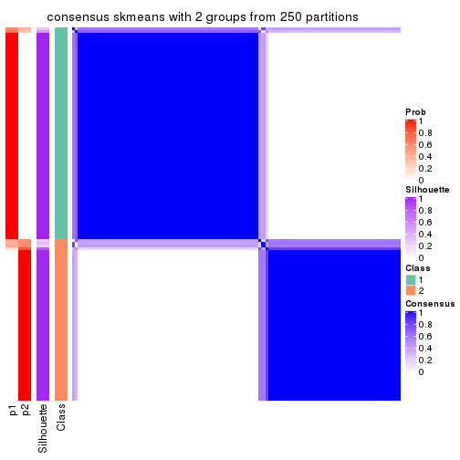</p>

</div>
<div id='tab-MAD-skmeans-consensus-heatmap-2'>
<pre><code class="r">consensus_heatmap(res, k = 3)
</code></pre>

<p>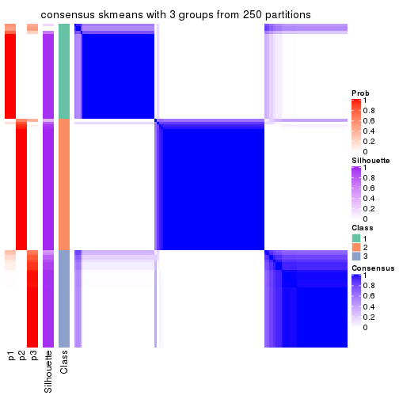</p>

</div>
<div id='tab-MAD-skmeans-consensus-heatmap-3'>
<pre><code class="r">consensus_heatmap(res, k = 4)
</code></pre>

<p>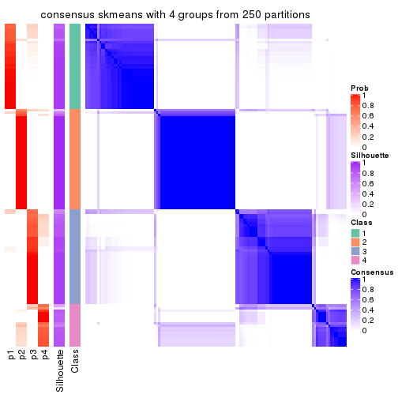</p>

</div>
<div id='tab-MAD-skmeans-consensus-heatmap-4'>
<pre><code class="r">consensus_heatmap(res, k = 5)
</code></pre>

<p>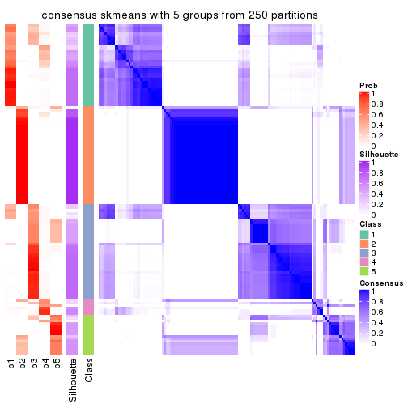</p>

</div>
<div id='tab-MAD-skmeans-consensus-heatmap-5'>
<pre><code class="r">consensus_heatmap(res, k = 6)
</code></pre>

<p>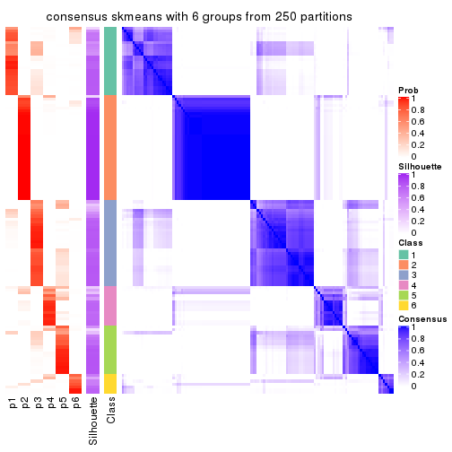</p>

</div>
</div>

Heatmaps for the membership of samples in all partitions to see how consistent they are:


<script>
$( function() {
	$( '#tabs-MAD-skmeans-membership-heatmap' ).tabs();
} );
</script>
<div id='tabs-MAD-skmeans-membership-heatmap'>
<ul>
<li><a href='#tab-MAD-skmeans-membership-heatmap-1'>k = 2</a></li>
<li><a href='#tab-MAD-skmeans-membership-heatmap-2'>k = 3</a></li>
<li><a href='#tab-MAD-skmeans-membership-heatmap-3'>k = 4</a></li>
<li><a href='#tab-MAD-skmeans-membership-heatmap-4'>k = 5</a></li>
<li><a href='#tab-MAD-skmeans-membership-heatmap-5'>k = 6</a></li>
</ul>
<div id='tab-MAD-skmeans-membership-heatmap-1'>
<pre><code class="r">membership_heatmap(res, k = 2)
</code></pre>

<p>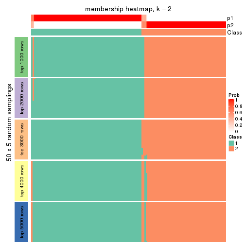</p>

</div>
<div id='tab-MAD-skmeans-membership-heatmap-2'>
<pre><code class="r">membership_heatmap(res, k = 3)
</code></pre>

<p></p>

</div>
<div id='tab-MAD-skmeans-membership-heatmap-3'>
<pre><code class="r">membership_heatmap(res, k = 4)
</code></pre>

<p>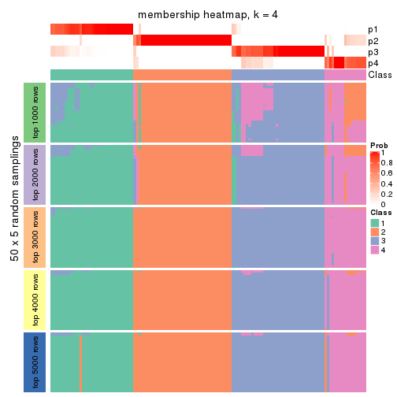</p>

</div>
<div id='tab-MAD-skmeans-membership-heatmap-4'>
<pre><code class="r">membership_heatmap(res, k = 5)
</code></pre>

<p>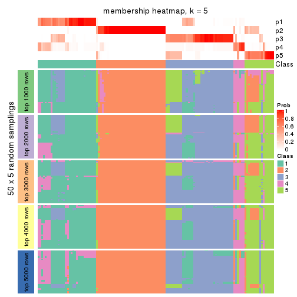</p>

</div>
<div id='tab-MAD-skmeans-membership-heatmap-5'>
<pre><code class="r">membership_heatmap(res, k = 6)
</code></pre>

<p>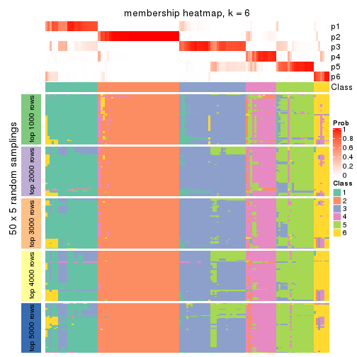</p>

</div>
</div>

As soon as we have had the classes for columns, we can look for signatures
which are significantly different between classes which can be candidate marks
for certain classes. Following are the heatmaps for signatures.


Signature heatmaps where rows are scaled:


<script>
$( function() {
	$( '#tabs-MAD-skmeans-get-signatures' ).tabs();
} );
</script>
<div id='tabs-MAD-skmeans-get-signatures'>
<ul>
<li><a href='#tab-MAD-skmeans-get-signatures-1'>k = 2</a></li>
<li><a href='#tab-MAD-skmeans-get-signatures-2'>k = 3</a></li>
<li><a href='#tab-MAD-skmeans-get-signatures-3'>k = 4</a></li>
<li><a href='#tab-MAD-skmeans-get-signatures-4'>k = 5</a></li>
<li><a href='#tab-MAD-skmeans-get-signatures-5'>k = 6</a></li>
</ul>
<div id='tab-MAD-skmeans-get-signatures-1'>
<pre><code class="r">get_signatures(res, k = 2)
</code></pre>

<p>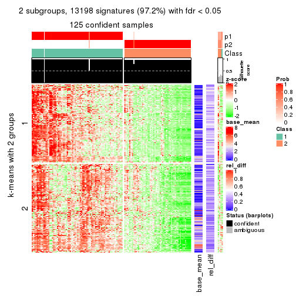</p>

</div>
<div id='tab-MAD-skmeans-get-signatures-2'>
<pre><code class="r">get_signatures(res, k = 3)
</code></pre>

<p>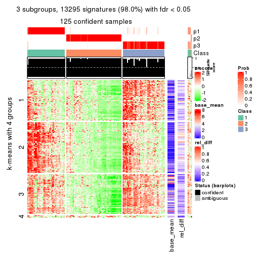</p>

</div>
<div id='tab-MAD-skmeans-get-signatures-3'>
<pre><code class="r">get_signatures(res, k = 4)
</code></pre>

<p>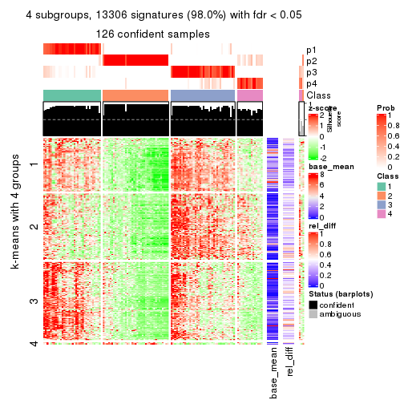</p>

</div>
<div id='tab-MAD-skmeans-get-signatures-4'>
<pre><code class="r">get_signatures(res, k = 5)
</code></pre>

<p>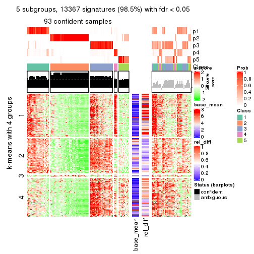</p>

</div>
<div id='tab-MAD-skmeans-get-signatures-5'>
<pre><code class="r">get_signatures(res, k = 6)
</code></pre>

<p>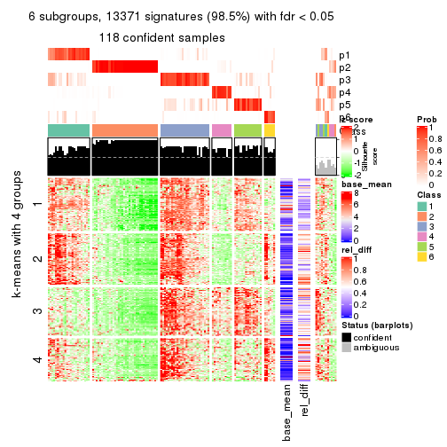</p>

</div>
</div>


Signature heatmaps where rows are not scaled:


<script>
$( function() {
	$( '#tabs-MAD-skmeans-get-signatures-no-scale' ).tabs();
} );
</script>
<div id='tabs-MAD-skmeans-get-signatures-no-scale'>
<ul>
<li><a href='#tab-MAD-skmeans-get-signatures-no-scale-1'>k = 2</a></li>
<li><a href='#tab-MAD-skmeans-get-signatures-no-scale-2'>k = 3</a></li>
<li><a href='#tab-MAD-skmeans-get-signatures-no-scale-3'>k = 4</a></li>
<li><a href='#tab-MAD-skmeans-get-signatures-no-scale-4'>k = 5</a></li>
<li><a href='#tab-MAD-skmeans-get-signatures-no-scale-5'>k = 6</a></li>
</ul>
<div id='tab-MAD-skmeans-get-signatures-no-scale-1'>
<pre><code class="r">get_signatures(res, k = 2, scale_rows = FALSE)
</code></pre>

<p>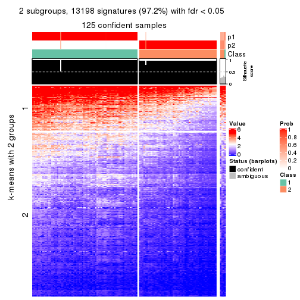</p>

</div>
<div id='tab-MAD-skmeans-get-signatures-no-scale-2'>
<pre><code class="r">get_signatures(res, k = 3, scale_rows = FALSE)
</code></pre>

<p>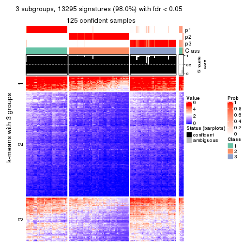</p>

</div>
<div id='tab-MAD-skmeans-get-signatures-no-scale-3'>
<pre><code class="r">get_signatures(res, k = 4, scale_rows = FALSE)
</code></pre>

<p>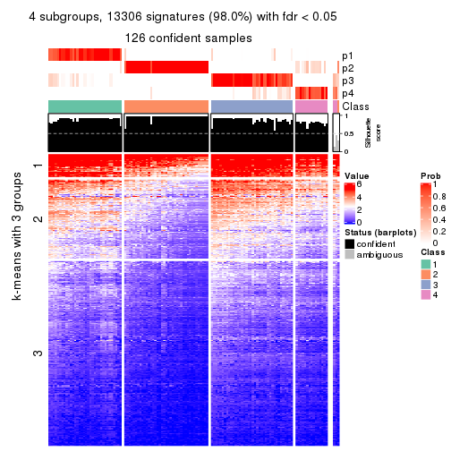</p>

</div>
<div id='tab-MAD-skmeans-get-signatures-no-scale-4'>
<pre><code class="r">get_signatures(res, k = 5, scale_rows = FALSE)
</code></pre>

<p>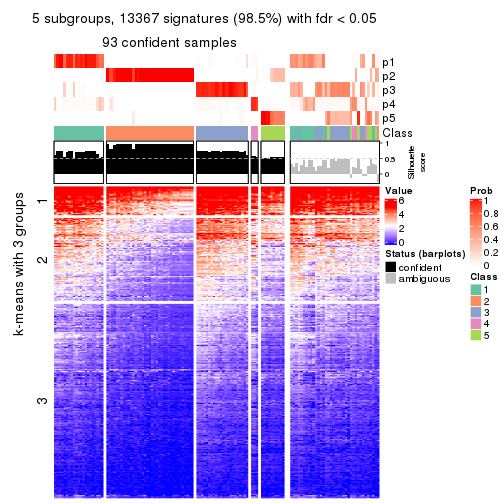</p>

</div>
<div id='tab-MAD-skmeans-get-signatures-no-scale-5'>
<pre><code class="r">get_signatures(res, k = 6, scale_rows = FALSE)
</code></pre>

<p>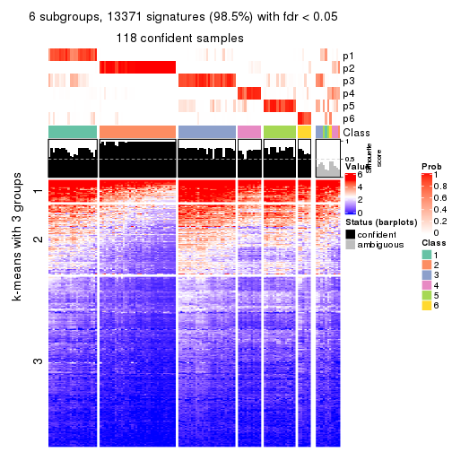</p>

</div>
</div>


Compare the overlap of signatures from different k:

```r
compare_signatures(res)
```

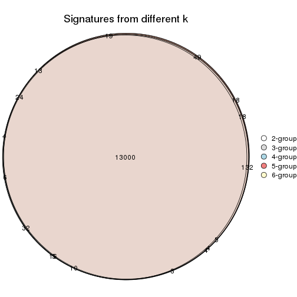

`get_signature()` returns a data frame invisibly. TO get the list of signatures, the function
call should be assigned to a variable explicitly. In following code, if `plot` argument is set
to `FALSE`, no heatmap is plotted while only the differential analysis is performed.

```r
# code only for demonstration
tb = get_signature(res, k = ..., plot = FALSE)
```

An example of the output of `tb` is:

```
#>   which_row         fdr    mean_1    mean_2 scaled_mean_1 scaled_mean_2 km
#> 1        38 0.042760348  8.373488  9.131774    -0.5533452     0.5164555  1
#> 2        40 0.018707592  7.106213  8.469186    -0.6173731     0.5762149  1
#> 3        55 0.019134737 10.221463 11.207825    -0.6159697     0.5749050  1
#> 4        59 0.006059896  5.921854  7.869574    -0.6899429     0.6439467  1
#> 5        60 0.018055526  8.928898 10.211722    -0.6204761     0.5791110  1
#> 6        98 0.009384629 15.714769 14.887706     0.6635654    -0.6193277  2
...
```

The columns in `tb` are:

1. `which_row`: row indices corresponding to the input matrix.
2. `fdr`: FDR for the differential test. 
3. `mean_x`: The mean value in group x.
4. `scaled_mean_x`: The mean value in group x after rows are scaled.
5. `km`: Row groups if k-means clustering is applied to rows.


UMAP plot which shows how samples are separated.


<script>
$( function() {
	$( '#tabs-MAD-skmeans-dimension-reduction' ).tabs();
} );
</script>
<div id='tabs-MAD-skmeans-dimension-reduction'>
<ul>
<li><a href='#tab-MAD-skmeans-dimension-reduction-1'>k = 2</a></li>
<li><a href='#tab-MAD-skmeans-dimension-reduction-2'>k = 3</a></li>
<li><a href='#tab-MAD-skmeans-dimension-reduction-3'>k = 4</a></li>
<li><a href='#tab-MAD-skmeans-dimension-reduction-4'>k = 5</a></li>
<li><a href='#tab-MAD-skmeans-dimension-reduction-5'>k = 6</a></li>
</ul>
<div id='tab-MAD-skmeans-dimension-reduction-1'>
<pre><code class="r">dimension_reduction(res, k = 2, method = &quot;UMAP&quot;)
</code></pre>

<p>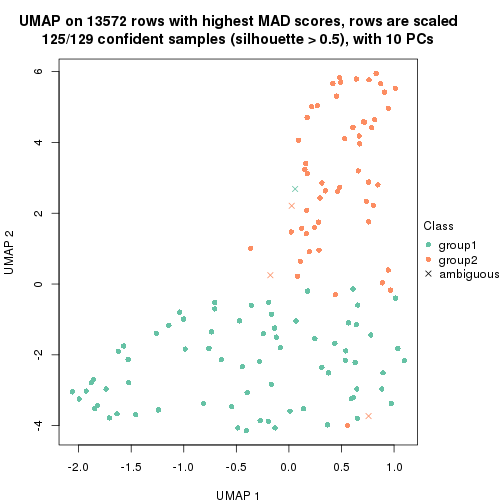</p>

</div>
<div id='tab-MAD-skmeans-dimension-reduction-2'>
<pre><code class="r">dimension_reduction(res, k = 3, method = &quot;UMAP&quot;)
</code></pre>

<p>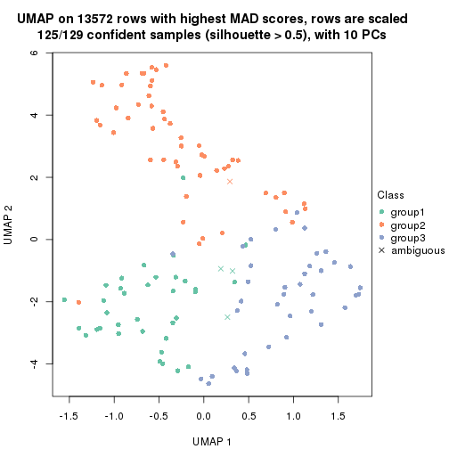</p>

</div>
<div id='tab-MAD-skmeans-dimension-reduction-3'>
<pre><code class="r">dimension_reduction(res, k = 4, method = &quot;UMAP&quot;)
</code></pre>

<p>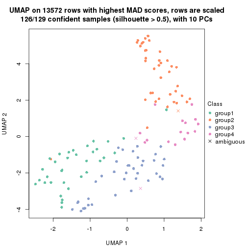</p>

</div>
<div id='tab-MAD-skmeans-dimension-reduction-4'>
<pre><code class="r">dimension_reduction(res, k = 5, method = &quot;UMAP&quot;)
</code></pre>

<p>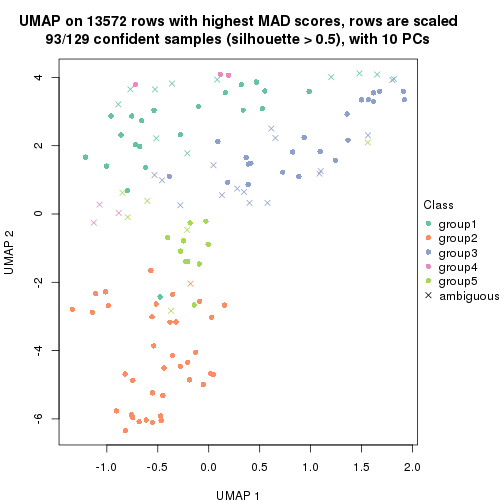</p>

</div>
<div id='tab-MAD-skmeans-dimension-reduction-5'>
<pre><code class="r">dimension_reduction(res, k = 6, method = &quot;UMAP&quot;)
</code></pre>

<p>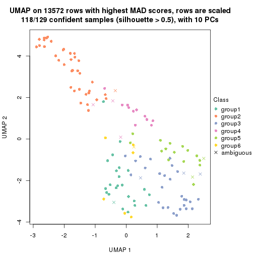</p>

</div>
</div>


Following heatmap shows how subgroups are split when increasing `k`:

```r
collect_classes(res)
```

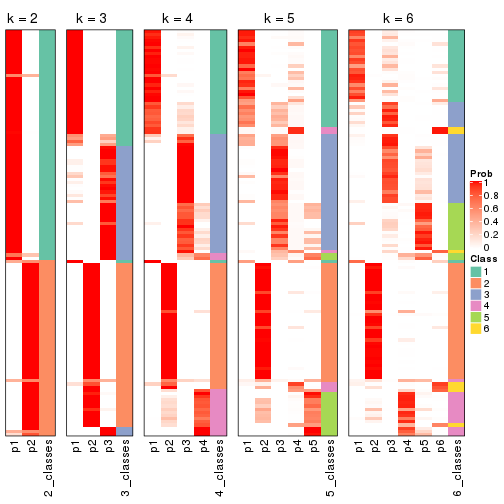


If matrix rows can be associated to genes, consider to use `GO_Enrichment(res,
...)` to perform function enrichment for the signature genes.


 

---------------------------------------------------


### MAD:pam*


The object with results only for a single top-value method and a single partition method 
can be extracted as:

```r
res = res_list["MAD", "pam"]
# you can also extract it by
# res = res_list["MAD:pam"]
```

A summary of `res` and all the functions that can be applied to it:

```r
res
```

```
#> A 'ConsensusPartition' object with k = 2, 3, 4, 5, 6.
#>   On a matrix with 13572 rows and 129 columns.
#>   Top rows (1000, 2000, 3000, 4000, 5000) are extracted by 'MAD' method.
#>   Subgroups are detected by 'pam' method.
#>   Performed in total 1250 partitions by row resampling.
#>   Best k for subgroups seems to be 2.
#> 
#> Following methods can be applied to this 'ConsensusPartition' object:
#>  [1] "cola_report"             "collect_classes"         "collect_plots"          
#>  [4] "collect_stats"           "colnames"                "compare_signatures"     
#>  [7] "consensus_heatmap"       "dimension_reduction"     "functional_enrichment"  
#> [10] "get_anno_col"            "get_anno"                "get_classes"            
#> [13] "get_consensus"           "get_matrix"              "get_membership"         
#> [16] "get_param"               "get_signatures"          "get_stats"              
#> [19] "is_best_k"               "is_stable_k"             "membership_heatmap"     
#> [22] "ncol"                    "nrow"                    "plot_ecdf"              
#> [25] "rownames"                "select_partition_number" "show"                   
#> [28] "suggest_best_k"          "test_to_known_factors"
```

`collect_plots()` function collects all the plots made from `res` for all `k` (number of partitions)
into one single page to provide an easy and fast comparison between different `k`.

```r
collect_plots(res)
```

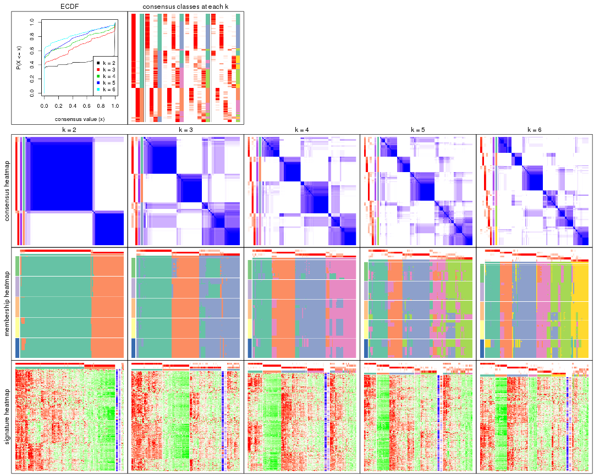

The plots are:

- The first row: a plot of the ECDF (Empirical cumulative distribution
  function) curves of the consensus matrix for each `k` and the heatmap of
  predicted classes for each `k`.
- The second row: heatmaps of the consensus matrix for each `k`.
- The third row: heatmaps of the membership matrix for each `k`.
- The fouth row: heatmaps of the signatures for each `k`.

All the plots in panels can be made by individual functions and they are
plotted later in this section.

`select_partition_number()` produces several plots showing different
statistics for choosing "optimized" `k`. There are following statistics:

- ECDF curves of the consensus matrix for each `k`;
- 1-PAC. [The PAC
  score](https://en.wikipedia.org/wiki/Consensus_clustering#Over-interpretation_potential_of_consensus_clustering)
  measures the proportion of the ambiguous subgrouping.
- Mean silhouette score.
- Concordance. The mean probability of fiting the consensus class ids in all
  partitions.
- Area increased. Denote $A_k$ as the area under the ECDF curve for current
  `k`, the area increased is defined as $A_k - A_{k-1}$.
- Rand index. The percent of pairs of samples that are both in a same cluster
  or both are not in a same cluster in the partition of k and k-1.
- Jaccard index. The ratio of pairs of samples are both in a same cluster in
  the partition of k and k-1 and the pairs of samples are both in a same
  cluster in the partition k or k-1.

The detailed explanations of these statistics can be found in [the cola
vignette](http://bioconductor.org/packages/devel/bioc/vignettes/cola/inst/doc/cola.html#toc_13).

Generally speaking, lower PAC score, higher mean silhouette score or higher
concordance corresponds to better partition. Rand index and Jaccard index
measure how similar the current partition is compared to partition with `k-1`.
If they are too similar, we won't accept `k` is better than `k-1`.

```r
select_partition_number(res)
```

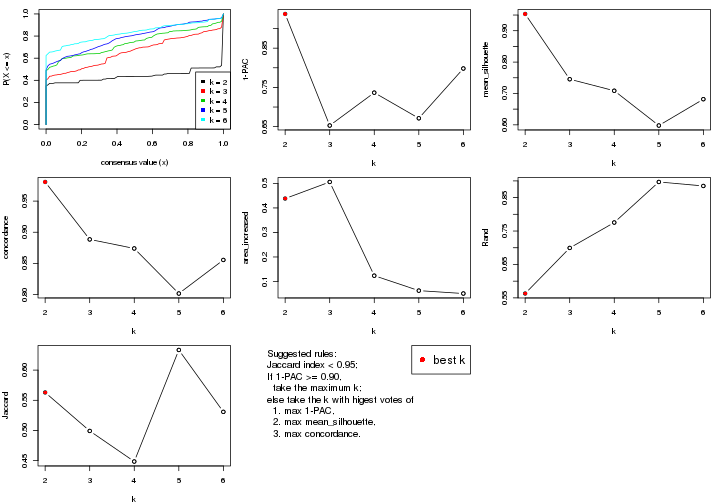

The numeric values for all these statistics can be obtained by `get_stats()`.

```r
get_stats(res)
```

```
#>   k 1-PAC mean_silhouette concordance area_increased  Rand Jaccard
#> 2 2 0.937           0.953       0.981         0.4383 0.563   0.563
#> 3 3 0.653           0.745       0.888         0.5059 0.699   0.499
#> 4 4 0.737           0.709       0.874         0.1238 0.775   0.449
#> 5 5 0.671           0.598       0.802         0.0629 0.897   0.633
#> 6 6 0.798           0.682       0.855         0.0510 0.885   0.531
```

`suggest_best_k()` suggests the best $k$ based on these statistics. The rules are as follows:

- All $k$ with Jaccard index larger than 0.95 are removed because the increase of
  the partition number does not provides enough extra information. If all $k$ are removed,
  the best $k$ is assigned by `NA`.
- For $k$ with 1-PAC larger than 0.9, the maximal $k$ is taken as the "best k". Other $k$ is called "optional k".
- If it does not fit the second rule. The $k$ with the highest vote of highest
  1-PAC, mean silhouette and concordance is taken as the "best k".

```r
suggest_best_k(res)
```

```
#> [1] 2
```


Following shows the table of the partitions (You need to click the **show/hide
code output** link to see it). The membership matrix (columns with name `p*`)
is inferred by
[`clue::cl_consensus()`](https://www.rdocumentation.org/link/cl_consensus?package=clue)
function with the `SE` method. Basically the value in the membership matrix
represents the probability to belong to a certain group. The finall class
label for an item is determined with the group with highest probability it
belongs to.

In `get_classes()` function, the entropy is calculated from the membership
matrix and the silhouette score is calculated from the consensus matrix.


<script>
$( function() {
	$( '#tabs-MAD-pam-get-classes' ).tabs();
} );
</script>
<div id='tabs-MAD-pam-get-classes'>
<ul>
<li><a href='#tab-MAD-pam-get-classes-1'>k = 2</a></li>
<li><a href='#tab-MAD-pam-get-classes-2'>k = 3</a></li>
<li><a href='#tab-MAD-pam-get-classes-3'>k = 4</a></li>
<li><a href='#tab-MAD-pam-get-classes-4'>k = 5</a></li>
<li><a href='#tab-MAD-pam-get-classes-5'>k = 6</a></li>
</ul>

<div id='tab-MAD-pam-get-classes-1'>
<p><a id='tab-MAD-pam-get-classes-1-a' style='color:#0366d6' href='#'>show/hide code output</a></p>
<pre><code class="r">cbind(get_classes(res, k = 2), get_membership(res, k = 2))
</code></pre>

<pre><code>#&gt;            class entropy silhouette    p1    p2
#&gt; SRR1656463     2  0.0000      0.971 0.000 1.000
#&gt; SRR1656464     1  0.0000      0.984 1.000 0.000
#&gt; SRR1656462     1  0.0000      0.984 1.000 0.000
#&gt; SRR1656465     1  0.0000      0.984 1.000 0.000
#&gt; SRR1656467     2  0.0000      0.971 0.000 1.000
#&gt; SRR1656466     1  0.0000      0.984 1.000 0.000
#&gt; SRR1656468     1  0.1184      0.970 0.984 0.016
#&gt; SRR1656472     1  0.0000      0.984 1.000 0.000
#&gt; SRR1656471     1  0.0000      0.984 1.000 0.000
#&gt; SRR1656470     2  0.0000      0.971 0.000 1.000
#&gt; SRR1656469     1  0.0000      0.984 1.000 0.000
#&gt; SRR1656473     2  0.0000      0.971 0.000 1.000
#&gt; SRR1656474     2  0.0000      0.971 0.000 1.000
#&gt; SRR1656475     2  0.0000      0.971 0.000 1.000
#&gt; SRR1656478     1  0.0000      0.984 1.000 0.000
#&gt; SRR1656477     1  0.6973      0.763 0.812 0.188
#&gt; SRR1656479     1  0.0000      0.984 1.000 0.000
#&gt; SRR1656480     2  0.0000      0.971 0.000 1.000
#&gt; SRR1656476     2  0.0000      0.971 0.000 1.000
#&gt; SRR1656481     1  0.0672      0.977 0.992 0.008
#&gt; SRR1656482     2  0.0000      0.971 0.000 1.000
#&gt; SRR1656483     2  0.0000      0.971 0.000 1.000
#&gt; SRR1656485     1  0.0000      0.984 1.000 0.000
#&gt; SRR1656487     1  0.0000      0.984 1.000 0.000
#&gt; SRR1656486     1  0.0000      0.984 1.000 0.000
#&gt; SRR1656488     1  0.0000      0.984 1.000 0.000
#&gt; SRR1656484     1  0.0000      0.984 1.000 0.000
#&gt; SRR1656489     1  0.0000      0.984 1.000 0.000
#&gt; SRR1656491     1  0.0000      0.984 1.000 0.000
#&gt; SRR1656490     1  0.0000      0.984 1.000 0.000
#&gt; SRR1656492     1  0.0000      0.984 1.000 0.000
#&gt; SRR1656493     1  0.0000      0.984 1.000 0.000
#&gt; SRR1656495     1  0.6973      0.769 0.812 0.188
#&gt; SRR1656496     1  0.0000      0.984 1.000 0.000
#&gt; SRR1656494     2  0.0000      0.971 0.000 1.000
#&gt; SRR1656497     2  0.0000      0.971 0.000 1.000
#&gt; SRR1656499     1  0.0000      0.984 1.000 0.000
#&gt; SRR1656500     1  0.0000      0.984 1.000 0.000
#&gt; SRR1656501     1  0.0000      0.984 1.000 0.000
#&gt; SRR1656498     1  0.0000      0.984 1.000 0.000
#&gt; SRR1656504     2  0.0000      0.971 0.000 1.000
#&gt; SRR1656502     1  0.0000      0.984 1.000 0.000
#&gt; SRR1656503     1  0.0000      0.984 1.000 0.000
#&gt; SRR1656507     1  0.0000      0.984 1.000 0.000
#&gt; SRR1656508     1  0.0000      0.984 1.000 0.000
#&gt; SRR1656505     2  0.9710      0.318 0.400 0.600
#&gt; SRR1656506     1  0.0000      0.984 1.000 0.000
#&gt; SRR1656509     1  0.0000      0.984 1.000 0.000
#&gt; SRR1656510     1  0.0000      0.984 1.000 0.000
#&gt; SRR1656511     2  0.1414      0.953 0.020 0.980
#&gt; SRR1656513     2  0.0000      0.971 0.000 1.000
#&gt; SRR1656512     2  0.0000      0.971 0.000 1.000
#&gt; SRR1656514     1  0.0000      0.984 1.000 0.000
#&gt; SRR1656515     2  0.0000      0.971 0.000 1.000
#&gt; SRR1656516     1  0.0000      0.984 1.000 0.000
#&gt; SRR1656518     1  0.0000      0.984 1.000 0.000
#&gt; SRR1656517     1  0.0000      0.984 1.000 0.000
#&gt; SRR1656519     1  0.0000      0.984 1.000 0.000
#&gt; SRR1656522     1  0.0000      0.984 1.000 0.000
#&gt; SRR1656523     1  0.6973      0.769 0.812 0.188
#&gt; SRR1656521     2  0.0000      0.971 0.000 1.000
#&gt; SRR1656520     1  0.0000      0.984 1.000 0.000
#&gt; SRR1656524     1  0.0000      0.984 1.000 0.000
#&gt; SRR1656525     1  0.0000      0.984 1.000 0.000
#&gt; SRR1656526     2  0.0000      0.971 0.000 1.000
#&gt; SRR1656527     2  0.0000      0.971 0.000 1.000
#&gt; SRR1656530     1  0.0000      0.984 1.000 0.000
#&gt; SRR1656529     1  0.0000      0.984 1.000 0.000
#&gt; SRR1656531     1  0.0000      0.984 1.000 0.000
#&gt; SRR1656528     1  0.0000      0.984 1.000 0.000
#&gt; SRR1656534     1  0.0000      0.984 1.000 0.000
#&gt; SRR1656533     1  0.0000      0.984 1.000 0.000
#&gt; SRR1656536     1  0.0000      0.984 1.000 0.000
#&gt; SRR1656532     2  0.0000      0.971 0.000 1.000
#&gt; SRR1656537     1  0.0000      0.984 1.000 0.000
#&gt; SRR1656538     1  0.0000      0.984 1.000 0.000
#&gt; SRR1656535     2  0.0000      0.971 0.000 1.000
#&gt; SRR1656539     1  0.0000      0.984 1.000 0.000
#&gt; SRR1656544     1  0.0000      0.984 1.000 0.000
#&gt; SRR1656542     1  0.0000      0.984 1.000 0.000
#&gt; SRR1656543     1  0.0000      0.984 1.000 0.000
#&gt; SRR1656545     2  0.0000      0.971 0.000 1.000
#&gt; SRR1656540     1  0.0000      0.984 1.000 0.000
#&gt; SRR1656546     1  0.0000      0.984 1.000 0.000
#&gt; SRR1656541     2  0.0000      0.971 0.000 1.000
#&gt; SRR1656547     2  0.0000      0.971 0.000 1.000
#&gt; SRR1656548     1  0.0000      0.984 1.000 0.000
#&gt; SRR1656549     1  0.0000      0.984 1.000 0.000
#&gt; SRR1656551     1  0.0000      0.984 1.000 0.000
#&gt; SRR1656553     1  0.0000      0.984 1.000 0.000
#&gt; SRR1656550     2  0.0000      0.971 0.000 1.000
#&gt; SRR1656552     2  0.9661      0.358 0.392 0.608
#&gt; SRR1656554     1  0.0000      0.984 1.000 0.000
#&gt; SRR1656555     1  0.2778      0.938 0.952 0.048
#&gt; SRR1656556     1  0.0672      0.977 0.992 0.008
#&gt; SRR1656557     1  0.0000      0.984 1.000 0.000
#&gt; SRR1656558     1  0.0000      0.984 1.000 0.000
#&gt; SRR1656559     1  0.0000      0.984 1.000 0.000
#&gt; SRR1656560     1  0.0000      0.984 1.000 0.000
#&gt; SRR1656561     1  0.0000      0.984 1.000 0.000
#&gt; SRR1656562     1  0.6973      0.769 0.812 0.188
#&gt; SRR1656563     1  0.0000      0.984 1.000 0.000
#&gt; SRR1656564     2  0.0000      0.971 0.000 1.000
#&gt; SRR1656565     2  0.0000      0.971 0.000 1.000
#&gt; SRR1656566     1  0.0000      0.984 1.000 0.000
#&gt; SRR1656568     2  0.0000      0.971 0.000 1.000
#&gt; SRR1656567     2  0.0000      0.971 0.000 1.000
#&gt; SRR1656569     1  0.0000      0.984 1.000 0.000
#&gt; SRR1656570     1  0.0000      0.984 1.000 0.000
#&gt; SRR1656571     2  0.0000      0.971 0.000 1.000
#&gt; SRR1656573     1  0.0000      0.984 1.000 0.000
#&gt; SRR1656572     2  0.9000      0.538 0.316 0.684
#&gt; SRR1656574     1  0.0000      0.984 1.000 0.000
#&gt; SRR1656575     1  0.0000      0.984 1.000 0.000
#&gt; SRR1656576     2  0.0000      0.971 0.000 1.000
#&gt; SRR1656578     2  0.0000      0.971 0.000 1.000
#&gt; SRR1656577     1  0.0000      0.984 1.000 0.000
#&gt; SRR1656579     2  0.0000      0.971 0.000 1.000
#&gt; SRR1656580     1  0.0000      0.984 1.000 0.000
#&gt; SRR1656581     1  0.0000      0.984 1.000 0.000
#&gt; SRR1656582     2  0.0000      0.971 0.000 1.000
#&gt; SRR1656585     1  0.0000      0.984 1.000 0.000
#&gt; SRR1656584     1  0.0000      0.984 1.000 0.000
#&gt; SRR1656583     1  0.9248      0.480 0.660 0.340
#&gt; SRR1656586     2  0.0000      0.971 0.000 1.000
#&gt; SRR1656587     1  0.6973      0.769 0.812 0.188
#&gt; SRR1656588     2  0.0000      0.971 0.000 1.000
#&gt; SRR1656589     2  0.0000      0.971 0.000 1.000
#&gt; SRR1656590     1  0.0000      0.984 1.000 0.000
</code></pre>

<script>
$('#tab-MAD-pam-get-classes-1-a').parent().next().next().hide();
$('#tab-MAD-pam-get-classes-1-a').click(function(){
  $('#tab-MAD-pam-get-classes-1-a').parent().next().next().toggle();
  return(false);
});
</script>
</div>

<div id='tab-MAD-pam-get-classes-2'>
<p><a id='tab-MAD-pam-get-classes-2-a' style='color:#0366d6' href='#'>show/hide code output</a></p>
<pre><code class="r">cbind(get_classes(res, k = 3), get_membership(res, k = 3))
</code></pre>

<pre><code>#&gt;            class entropy silhouette    p1    p2    p3
#&gt; SRR1656463     2  0.0000     0.9573 0.000 1.000 0.000
#&gt; SRR1656464     1  0.0000     0.9114 1.000 0.000 0.000
#&gt; SRR1656462     1  0.0000     0.9114 1.000 0.000 0.000
#&gt; SRR1656465     3  0.6307     0.0270 0.488 0.000 0.512
#&gt; SRR1656467     2  0.0000     0.9573 0.000 1.000 0.000
#&gt; SRR1656466     1  0.6192     0.2209 0.580 0.000 0.420
#&gt; SRR1656468     3  0.0000     0.7466 0.000 0.000 1.000
#&gt; SRR1656472     3  0.0747     0.7453 0.016 0.000 0.984
#&gt; SRR1656471     1  0.5835     0.3832 0.660 0.000 0.340
#&gt; SRR1656470     2  0.0000     0.9573 0.000 1.000 0.000
#&gt; SRR1656469     3  0.5591     0.4659 0.304 0.000 0.696
#&gt; SRR1656473     2  0.0000     0.9573 0.000 1.000 0.000
#&gt; SRR1656474     2  0.0000     0.9573 0.000 1.000 0.000
#&gt; SRR1656475     2  0.0000     0.9573 0.000 1.000 0.000
#&gt; SRR1656478     3  0.5810     0.5653 0.336 0.000 0.664
#&gt; SRR1656477     3  0.0237     0.7459 0.000 0.004 0.996
#&gt; SRR1656479     3  0.5810     0.5653 0.336 0.000 0.664
#&gt; SRR1656480     3  0.5529     0.4146 0.000 0.296 0.704
#&gt; SRR1656476     2  0.0000     0.9573 0.000 1.000 0.000
#&gt; SRR1656481     3  0.0000     0.7466 0.000 0.000 1.000
#&gt; SRR1656482     2  0.0000     0.9573 0.000 1.000 0.000
#&gt; SRR1656483     2  0.0000     0.9573 0.000 1.000 0.000
#&gt; SRR1656485     1  0.0000     0.9114 1.000 0.000 0.000
#&gt; SRR1656487     1  0.3482     0.7615 0.872 0.000 0.128
#&gt; SRR1656486     3  0.5810     0.5653 0.336 0.000 0.664
#&gt; SRR1656488     1  0.0000     0.9114 1.000 0.000 0.000
#&gt; SRR1656484     3  0.5810     0.5653 0.336 0.000 0.664
#&gt; SRR1656489     1  0.0000     0.9114 1.000 0.000 0.000
#&gt; SRR1656491     3  0.0000     0.7466 0.000 0.000 1.000
#&gt; SRR1656490     3  0.2959     0.7222 0.100 0.000 0.900
#&gt; SRR1656492     1  0.6309    -0.2143 0.504 0.000 0.496
#&gt; SRR1656493     3  0.4750     0.6648 0.216 0.000 0.784
#&gt; SRR1656495     3  0.5008     0.6462 0.016 0.180 0.804
#&gt; SRR1656496     3  0.5810     0.5653 0.336 0.000 0.664
#&gt; SRR1656494     2  0.4062     0.8170 0.000 0.836 0.164
#&gt; SRR1656497     2  0.0000     0.9573 0.000 1.000 0.000
#&gt; SRR1656499     1  0.0000     0.9114 1.000 0.000 0.000
#&gt; SRR1656500     1  0.0000     0.9114 1.000 0.000 0.000
#&gt; SRR1656501     3  0.5905     0.5458 0.352 0.000 0.648
#&gt; SRR1656498     1  0.0000     0.9114 1.000 0.000 0.000
#&gt; SRR1656504     2  0.0000     0.9573 0.000 1.000 0.000
#&gt; SRR1656502     3  0.0000     0.7466 0.000 0.000 1.000
#&gt; SRR1656503     3  0.6111     0.4733 0.396 0.000 0.604
#&gt; SRR1656507     1  0.5988     0.2167 0.632 0.000 0.368
#&gt; SRR1656508     1  0.0000     0.9114 1.000 0.000 0.000
#&gt; SRR1656505     3  0.0237     0.7459 0.000 0.004 0.996
#&gt; SRR1656506     1  0.0000     0.9114 1.000 0.000 0.000
#&gt; SRR1656509     3  0.6154     0.2610 0.408 0.000 0.592
#&gt; SRR1656510     3  0.0592     0.7454 0.012 0.000 0.988
#&gt; SRR1656511     3  0.6299     0.0646 0.000 0.476 0.524
#&gt; SRR1656513     2  0.0000     0.9573 0.000 1.000 0.000
#&gt; SRR1656512     2  0.0000     0.9573 0.000 1.000 0.000
#&gt; SRR1656514     1  0.0000     0.9114 1.000 0.000 0.000
#&gt; SRR1656515     2  0.0747     0.9480 0.000 0.984 0.016
#&gt; SRR1656516     1  0.2625     0.8230 0.916 0.000 0.084
#&gt; SRR1656518     3  0.5810     0.5653 0.336 0.000 0.664
#&gt; SRR1656517     1  0.0000     0.9114 1.000 0.000 0.000
#&gt; SRR1656519     1  0.0000     0.9114 1.000 0.000 0.000
#&gt; SRR1656522     1  0.0000     0.9114 1.000 0.000 0.000
#&gt; SRR1656523     3  0.0000     0.7466 0.000 0.000 1.000
#&gt; SRR1656521     2  0.0000     0.9573 0.000 1.000 0.000
#&gt; SRR1656520     1  0.0000     0.9114 1.000 0.000 0.000
#&gt; SRR1656524     3  0.4974     0.6513 0.236 0.000 0.764
#&gt; SRR1656525     1  0.0000     0.9114 1.000 0.000 0.000
#&gt; SRR1656526     2  0.0000     0.9573 0.000 1.000 0.000
#&gt; SRR1656527     2  0.0000     0.9573 0.000 1.000 0.000
#&gt; SRR1656530     1  0.3340     0.7872 0.880 0.000 0.120
#&gt; SRR1656529     3  0.6305     0.0442 0.484 0.000 0.516
#&gt; SRR1656531     1  0.4178     0.6853 0.828 0.000 0.172
#&gt; SRR1656528     1  0.0000     0.9114 1.000 0.000 0.000
#&gt; SRR1656534     1  0.0000     0.9114 1.000 0.000 0.000
#&gt; SRR1656533     1  0.0237     0.9080 0.996 0.000 0.004
#&gt; SRR1656536     3  0.0000     0.7466 0.000 0.000 1.000
#&gt; SRR1656532     2  0.0892     0.9453 0.000 0.980 0.020
#&gt; SRR1656537     3  0.5810     0.5653 0.336 0.000 0.664
#&gt; SRR1656538     1  0.0000     0.9114 1.000 0.000 0.000
#&gt; SRR1656535     2  0.0000     0.9573 0.000 1.000 0.000
#&gt; SRR1656539     3  0.6140     0.2701 0.404 0.000 0.596
#&gt; SRR1656544     1  0.0000     0.9114 1.000 0.000 0.000
#&gt; SRR1656542     1  0.0000     0.9114 1.000 0.000 0.000
#&gt; SRR1656543     1  0.0000     0.9114 1.000 0.000 0.000
#&gt; SRR1656545     2  0.0000     0.9573 0.000 1.000 0.000
#&gt; SRR1656540     1  0.1529     0.8735 0.960 0.000 0.040
#&gt; SRR1656546     3  0.4750     0.6648 0.216 0.000 0.784
#&gt; SRR1656541     2  0.3340     0.8627 0.000 0.880 0.120
#&gt; SRR1656547     3  0.1643     0.7311 0.000 0.044 0.956
#&gt; SRR1656548     1  0.0000     0.9114 1.000 0.000 0.000
#&gt; SRR1656549     3  0.5810     0.5653 0.336 0.000 0.664
#&gt; SRR1656551     3  0.0000     0.7466 0.000 0.000 1.000
#&gt; SRR1656553     1  0.0000     0.9114 1.000 0.000 0.000
#&gt; SRR1656550     3  0.5254     0.4757 0.000 0.264 0.736
#&gt; SRR1656552     3  0.0000     0.7466 0.000 0.000 1.000
#&gt; SRR1656554     3  0.6154     0.2610 0.408 0.000 0.592
#&gt; SRR1656555     3  0.0000     0.7466 0.000 0.000 1.000
#&gt; SRR1656556     3  0.6168     0.2511 0.412 0.000 0.588
#&gt; SRR1656557     1  0.0000     0.9114 1.000 0.000 0.000
#&gt; SRR1656558     3  0.5988     0.5163 0.368 0.000 0.632
#&gt; SRR1656559     1  0.0000     0.9114 1.000 0.000 0.000
#&gt; SRR1656560     1  0.2165     0.8468 0.936 0.000 0.064
#&gt; SRR1656561     1  0.0000     0.9114 1.000 0.000 0.000
#&gt; SRR1656562     3  0.0000     0.7466 0.000 0.000 1.000
#&gt; SRR1656563     1  0.0000     0.9114 1.000 0.000 0.000
#&gt; SRR1656564     2  0.0000     0.9573 0.000 1.000 0.000
#&gt; SRR1656565     2  0.0892     0.9453 0.000 0.980 0.020
#&gt; SRR1656566     3  0.5810     0.5653 0.336 0.000 0.664
#&gt; SRR1656568     2  0.0000     0.9573 0.000 1.000 0.000
#&gt; SRR1656567     2  0.5810     0.5699 0.000 0.664 0.336
#&gt; SRR1656569     3  0.4555     0.6103 0.200 0.000 0.800
#&gt; SRR1656570     1  0.3551     0.7688 0.868 0.000 0.132
#&gt; SRR1656571     2  0.0000     0.9573 0.000 1.000 0.000
#&gt; SRR1656573     3  0.0000     0.7466 0.000 0.000 1.000
#&gt; SRR1656572     3  0.4555     0.5682 0.000 0.200 0.800
#&gt; SRR1656574     1  0.0000     0.9114 1.000 0.000 0.000
#&gt; SRR1656575     1  0.6274    -0.1136 0.544 0.000 0.456
#&gt; SRR1656576     2  0.4504     0.7798 0.000 0.804 0.196
#&gt; SRR1656578     2  0.0000     0.9573 0.000 1.000 0.000
#&gt; SRR1656577     1  0.0000     0.9114 1.000 0.000 0.000
#&gt; SRR1656579     2  0.5810     0.5699 0.000 0.664 0.336
#&gt; SRR1656580     1  0.0000     0.9114 1.000 0.000 0.000
#&gt; SRR1656581     3  0.0000     0.7466 0.000 0.000 1.000
#&gt; SRR1656582     2  0.0000     0.9573 0.000 1.000 0.000
#&gt; SRR1656585     3  0.0000     0.7466 0.000 0.000 1.000
#&gt; SRR1656584     3  0.5810     0.5653 0.336 0.000 0.664
#&gt; SRR1656583     3  0.1289     0.7367 0.000 0.032 0.968
#&gt; SRR1656586     2  0.0000     0.9573 0.000 1.000 0.000
#&gt; SRR1656587     3  0.0000     0.7466 0.000 0.000 1.000
#&gt; SRR1656588     2  0.3551     0.8509 0.000 0.868 0.132
#&gt; SRR1656589     2  0.0000     0.9573 0.000 1.000 0.000
#&gt; SRR1656590     3  0.5760     0.5735 0.328 0.000 0.672
</code></pre>

<script>
$('#tab-MAD-pam-get-classes-2-a').parent().next().next().hide();
$('#tab-MAD-pam-get-classes-2-a').click(function(){
  $('#tab-MAD-pam-get-classes-2-a').parent().next().next().toggle();
  return(false);
});
</script>
</div>

<div id='tab-MAD-pam-get-classes-3'>
<p><a id='tab-MAD-pam-get-classes-3-a' style='color:#0366d6' href='#'>show/hide code output</a></p>
<pre><code class="r">cbind(get_classes(res, k = 4), get_membership(res, k = 4))
</code></pre>

<pre><code>#&gt;            class entropy silhouette    p1    p2    p3    p4
#&gt; SRR1656463     2  0.0000     0.8948 0.000 1.000 0.000 0.000
#&gt; SRR1656464     1  0.3024     0.7921 0.852 0.000 0.148 0.000
#&gt; SRR1656462     3  0.0000     0.8900 0.000 0.000 1.000 0.000
#&gt; SRR1656465     4  0.4790     0.4539 0.000 0.000 0.380 0.620
#&gt; SRR1656467     2  0.4843     0.4605 0.000 0.604 0.000 0.396
#&gt; SRR1656466     4  0.4790     0.4539 0.000 0.000 0.380 0.620
#&gt; SRR1656468     4  0.0000     0.7486 0.000 0.000 0.000 1.000
#&gt; SRR1656472     1  0.2984     0.7862 0.888 0.000 0.028 0.084
#&gt; SRR1656471     4  0.4790     0.4539 0.000 0.000 0.380 0.620
#&gt; SRR1656470     2  0.0000     0.8948 0.000 1.000 0.000 0.000
#&gt; SRR1656469     4  0.5284     0.4658 0.016 0.000 0.368 0.616
#&gt; SRR1656473     2  0.0000     0.8948 0.000 1.000 0.000 0.000
#&gt; SRR1656474     2  0.0000     0.8948 0.000 1.000 0.000 0.000
#&gt; SRR1656475     2  0.0000     0.8948 0.000 1.000 0.000 0.000
#&gt; SRR1656478     1  0.0000     0.8431 1.000 0.000 0.000 0.000
#&gt; SRR1656477     4  0.0000     0.7486 0.000 0.000 0.000 1.000
#&gt; SRR1656479     3  0.3754     0.7919 0.064 0.000 0.852 0.084
#&gt; SRR1656480     4  0.0000     0.7486 0.000 0.000 0.000 1.000
#&gt; SRR1656476     2  0.0000     0.8948 0.000 1.000 0.000 0.000
#&gt; SRR1656481     4  0.0000     0.7486 0.000 0.000 0.000 1.000
#&gt; SRR1656482     2  0.0000     0.8948 0.000 1.000 0.000 0.000
#&gt; SRR1656483     2  0.0000     0.8948 0.000 1.000 0.000 0.000
#&gt; SRR1656485     3  0.0000     0.8900 0.000 0.000 1.000 0.000
#&gt; SRR1656487     3  0.3486     0.7088 0.000 0.000 0.812 0.188
#&gt; SRR1656486     3  0.3024     0.7957 0.148 0.000 0.852 0.000
#&gt; SRR1656488     3  0.0000     0.8900 0.000 0.000 1.000 0.000
#&gt; SRR1656484     1  0.4543     0.4291 0.676 0.000 0.324 0.000
#&gt; SRR1656489     3  0.1302     0.8602 0.044 0.000 0.956 0.000
#&gt; SRR1656491     4  0.6276     0.4077 0.064 0.000 0.380 0.556
#&gt; SRR1656490     4  0.6140     0.4661 0.064 0.000 0.340 0.596
#&gt; SRR1656492     3  0.1716     0.8518 0.064 0.000 0.936 0.000
#&gt; SRR1656493     1  0.0000     0.8431 1.000 0.000 0.000 0.000
#&gt; SRR1656495     1  0.4454     0.4806 0.692 0.000 0.000 0.308
#&gt; SRR1656496     3  0.5397     0.5747 0.064 0.000 0.716 0.220
#&gt; SRR1656494     4  0.4933    -0.0624 0.000 0.432 0.000 0.568
#&gt; SRR1656497     2  0.0000     0.8948 0.000 1.000 0.000 0.000
#&gt; SRR1656499     3  0.0000     0.8900 0.000 0.000 1.000 0.000
#&gt; SRR1656500     3  0.0000     0.8900 0.000 0.000 1.000 0.000
#&gt; SRR1656501     3  0.3024     0.7957 0.148 0.000 0.852 0.000
#&gt; SRR1656498     1  0.1716     0.8334 0.936 0.000 0.064 0.000
#&gt; SRR1656504     2  0.0000     0.8948 0.000 1.000 0.000 0.000
#&gt; SRR1656502     1  0.1940     0.8033 0.924 0.000 0.000 0.076
#&gt; SRR1656503     3  0.2081     0.8377 0.000 0.000 0.916 0.084
#&gt; SRR1656507     1  0.3726     0.7176 0.788 0.000 0.212 0.000
#&gt; SRR1656508     1  0.3024     0.7921 0.852 0.000 0.148 0.000
#&gt; SRR1656505     4  0.0000     0.7486 0.000 0.000 0.000 1.000
#&gt; SRR1656506     3  0.2081     0.8377 0.000 0.000 0.916 0.084
#&gt; SRR1656509     4  0.5326     0.4464 0.016 0.000 0.380 0.604
#&gt; SRR1656510     4  0.1716     0.7217 0.064 0.000 0.000 0.936
#&gt; SRR1656511     2  0.6384     0.2523 0.064 0.496 0.000 0.440
#&gt; SRR1656513     2  0.4830     0.4666 0.000 0.608 0.000 0.392
#&gt; SRR1656512     2  0.0000     0.8948 0.000 1.000 0.000 0.000
#&gt; SRR1656514     1  0.4817     0.4303 0.612 0.000 0.388 0.000
#&gt; SRR1656515     2  0.4941     0.3885 0.000 0.564 0.000 0.436
#&gt; SRR1656516     3  0.2081     0.8426 0.084 0.000 0.916 0.000
#&gt; SRR1656518     1  0.4955     0.1044 0.556 0.000 0.444 0.000
#&gt; SRR1656517     1  0.1716     0.8334 0.936 0.000 0.064 0.000
#&gt; SRR1656519     3  0.0000     0.8900 0.000 0.000 1.000 0.000
#&gt; SRR1656522     3  0.4454     0.4612 0.308 0.000 0.692 0.000
#&gt; SRR1656523     4  0.1716     0.7217 0.064 0.000 0.000 0.936
#&gt; SRR1656521     2  0.0000     0.8948 0.000 1.000 0.000 0.000
#&gt; SRR1656520     3  0.0000     0.8900 0.000 0.000 1.000 0.000
#&gt; SRR1656524     1  0.0000     0.8431 1.000 0.000 0.000 0.000
#&gt; SRR1656525     3  0.0000     0.8900 0.000 0.000 1.000 0.000
#&gt; SRR1656526     2  0.0707     0.8833 0.000 0.980 0.000 0.020
#&gt; SRR1656527     2  0.1174     0.8765 0.020 0.968 0.000 0.012
#&gt; SRR1656530     3  0.4094     0.7629 0.056 0.000 0.828 0.116
#&gt; SRR1656529     4  0.5231     0.4422 0.012 0.000 0.384 0.604
#&gt; SRR1656531     1  0.3024     0.7921 0.852 0.000 0.148 0.000
#&gt; SRR1656528     3  0.0000     0.8900 0.000 0.000 1.000 0.000
#&gt; SRR1656534     3  0.0000     0.8900 0.000 0.000 1.000 0.000
#&gt; SRR1656533     1  0.1716     0.8334 0.936 0.000 0.064 0.000
#&gt; SRR1656536     4  0.0000     0.7486 0.000 0.000 0.000 1.000
#&gt; SRR1656532     2  0.5766     0.4060 0.032 0.564 0.000 0.404
#&gt; SRR1656537     1  0.0000     0.8431 1.000 0.000 0.000 0.000
#&gt; SRR1656538     3  0.0000     0.8900 0.000 0.000 1.000 0.000
#&gt; SRR1656535     2  0.0592     0.8855 0.000 0.984 0.000 0.016
#&gt; SRR1656539     4  0.5326     0.4464 0.016 0.000 0.380 0.604
#&gt; SRR1656544     3  0.0000     0.8900 0.000 0.000 1.000 0.000
#&gt; SRR1656542     3  0.0000     0.8900 0.000 0.000 1.000 0.000
#&gt; SRR1656543     3  0.0000     0.8900 0.000 0.000 1.000 0.000
#&gt; SRR1656545     2  0.0000     0.8948 0.000 1.000 0.000 0.000
#&gt; SRR1656540     3  0.0000     0.8900 0.000 0.000 1.000 0.000
#&gt; SRR1656546     1  0.4500     0.4679 0.684 0.000 0.000 0.316
#&gt; SRR1656541     4  0.5000    -0.2565 0.000 0.496 0.000 0.504
#&gt; SRR1656547     4  0.0000     0.7486 0.000 0.000 0.000 1.000
#&gt; SRR1656548     3  0.0000     0.8900 0.000 0.000 1.000 0.000
#&gt; SRR1656549     1  0.0000     0.8431 1.000 0.000 0.000 0.000
#&gt; SRR1656551     4  0.0000     0.7486 0.000 0.000 0.000 1.000
#&gt; SRR1656553     3  0.0000     0.8900 0.000 0.000 1.000 0.000
#&gt; SRR1656550     4  0.0000     0.7486 0.000 0.000 0.000 1.000
#&gt; SRR1656552     4  0.3754     0.6625 0.064 0.084 0.000 0.852
#&gt; SRR1656554     4  0.5326     0.4464 0.016 0.000 0.380 0.604
#&gt; SRR1656555     4  0.0592     0.7431 0.016 0.000 0.000 0.984
#&gt; SRR1656556     4  0.4661     0.4992 0.000 0.000 0.348 0.652
#&gt; SRR1656557     3  0.0000     0.8900 0.000 0.000 1.000 0.000
#&gt; SRR1656558     1  0.1637     0.8346 0.940 0.000 0.060 0.000
#&gt; SRR1656559     3  0.4697     0.3561 0.356 0.000 0.644 0.000
#&gt; SRR1656560     3  0.1211     0.8675 0.000 0.000 0.960 0.040
#&gt; SRR1656561     3  0.0000     0.8900 0.000 0.000 1.000 0.000
#&gt; SRR1656562     4  0.0000     0.7486 0.000 0.000 0.000 1.000
#&gt; SRR1656563     3  0.4454     0.4612 0.308 0.000 0.692 0.000
#&gt; SRR1656564     2  0.0000     0.8948 0.000 1.000 0.000 0.000
#&gt; SRR1656565     2  0.4941     0.3896 0.000 0.564 0.000 0.436
#&gt; SRR1656566     1  0.0000     0.8431 1.000 0.000 0.000 0.000
#&gt; SRR1656568     2  0.0000     0.8948 0.000 1.000 0.000 0.000
#&gt; SRR1656567     4  0.0000     0.7486 0.000 0.000 0.000 1.000
#&gt; SRR1656569     4  0.6212     0.4114 0.060 0.000 0.380 0.560
#&gt; SRR1656570     3  0.3074     0.7993 0.152 0.000 0.848 0.000
#&gt; SRR1656571     2  0.0000     0.8948 0.000 1.000 0.000 0.000
#&gt; SRR1656573     4  0.1716     0.7217 0.064 0.000 0.000 0.936
#&gt; SRR1656572     4  0.5431     0.4620 0.064 0.224 0.000 0.712
#&gt; SRR1656574     3  0.4454     0.4612 0.308 0.000 0.692 0.000
#&gt; SRR1656575     1  0.3764     0.6678 0.784 0.000 0.216 0.000
#&gt; SRR1656576     4  0.4916    -0.0353 0.000 0.424 0.000 0.576
#&gt; SRR1656578     2  0.0000     0.8948 0.000 1.000 0.000 0.000
#&gt; SRR1656577     3  0.4454     0.4612 0.308 0.000 0.692 0.000
#&gt; SRR1656579     4  0.0000     0.7486 0.000 0.000 0.000 1.000
#&gt; SRR1656580     3  0.0000     0.8900 0.000 0.000 1.000 0.000
#&gt; SRR1656581     4  0.1716     0.7217 0.064 0.000 0.000 0.936
#&gt; SRR1656582     2  0.0000     0.8948 0.000 1.000 0.000 0.000
#&gt; SRR1656585     4  0.0000     0.7486 0.000 0.000 0.000 1.000
#&gt; SRR1656584     1  0.0000     0.8431 1.000 0.000 0.000 0.000
#&gt; SRR1656583     4  0.0000     0.7486 0.000 0.000 0.000 1.000
#&gt; SRR1656586     2  0.0000     0.8948 0.000 1.000 0.000 0.000
#&gt; SRR1656587     4  0.0000     0.7486 0.000 0.000 0.000 1.000
#&gt; SRR1656588     4  0.4989    -0.1873 0.000 0.472 0.000 0.528
#&gt; SRR1656589     2  0.0000     0.8948 0.000 1.000 0.000 0.000
#&gt; SRR1656590     1  0.0000     0.8431 1.000 0.000 0.000 0.000
</code></pre>

<script>
$('#tab-MAD-pam-get-classes-3-a').parent().next().next().hide();
$('#tab-MAD-pam-get-classes-3-a').click(function(){
  $('#tab-MAD-pam-get-classes-3-a').parent().next().next().toggle();
  return(false);
});
</script>
</div>

<div id='tab-MAD-pam-get-classes-4'>
<p><a id='tab-MAD-pam-get-classes-4-a' style='color:#0366d6' href='#'>show/hide code output</a></p>
<pre><code class="r">cbind(get_classes(res, k = 5), get_membership(res, k = 5))
</code></pre>

<pre><code>#&gt;            class entropy silhouette    p1    p2    p3    p4    p5
#&gt; SRR1656463     2  0.3913     0.6151 0.000 0.676 0.000 0.324 0.000
#&gt; SRR1656464     1  0.1851     0.7437 0.912 0.000 0.088 0.000 0.000
#&gt; SRR1656462     3  0.0000     0.8706 0.000 0.000 1.000 0.000 0.000
#&gt; SRR1656465     5  0.4045     0.5213 0.000 0.000 0.356 0.000 0.644
#&gt; SRR1656467     4  0.6551     0.3226 0.000 0.228 0.000 0.468 0.304
#&gt; SRR1656466     5  0.4045     0.5213 0.000 0.000 0.356 0.000 0.644
#&gt; SRR1656468     5  0.0000     0.6481 0.000 0.000 0.000 0.000 1.000
#&gt; SRR1656472     1  0.6774     0.4135 0.572 0.000 0.048 0.224 0.156
#&gt; SRR1656471     5  0.4088     0.5036 0.000 0.000 0.368 0.000 0.632
#&gt; SRR1656470     2  0.0000     0.8524 0.000 1.000 0.000 0.000 0.000
#&gt; SRR1656469     5  0.5345     0.5548 0.000 0.000 0.280 0.088 0.632
#&gt; SRR1656473     2  0.0000     0.8524 0.000 1.000 0.000 0.000 0.000
#&gt; SRR1656474     2  0.0000     0.8524 0.000 1.000 0.000 0.000 0.000
#&gt; SRR1656475     2  0.0000     0.8524 0.000 1.000 0.000 0.000 0.000
#&gt; SRR1656478     1  0.0609     0.7504 0.980 0.000 0.000 0.020 0.000
#&gt; SRR1656477     5  0.0000     0.6481 0.000 0.000 0.000 0.000 1.000
#&gt; SRR1656479     3  0.5505     0.5653 0.004 0.000 0.620 0.292 0.084
#&gt; SRR1656480     5  0.0000     0.6481 0.000 0.000 0.000 0.000 1.000
#&gt; SRR1656476     2  0.3003     0.7778 0.000 0.812 0.000 0.188 0.000
#&gt; SRR1656481     5  0.0000     0.6481 0.000 0.000 0.000 0.000 1.000
#&gt; SRR1656482     2  0.4150     0.4973 0.000 0.612 0.000 0.388 0.000
#&gt; SRR1656483     2  0.1792     0.8282 0.000 0.916 0.000 0.084 0.000
#&gt; SRR1656485     3  0.0000     0.8706 0.000 0.000 1.000 0.000 0.000
#&gt; SRR1656487     3  0.3274     0.6415 0.000 0.000 0.780 0.000 0.220
#&gt; SRR1656486     3  0.5404     0.5399 0.088 0.000 0.620 0.292 0.000
#&gt; SRR1656488     3  0.0000     0.8706 0.000 0.000 1.000 0.000 0.000
#&gt; SRR1656484     1  0.6371     0.3335 0.508 0.000 0.200 0.292 0.000
#&gt; SRR1656489     3  0.2605     0.7335 0.148 0.000 0.852 0.000 0.000
#&gt; SRR1656491     5  0.6582     0.4279 0.004 0.000 0.212 0.292 0.492
#&gt; SRR1656490     5  0.6460     0.3201 0.004 0.000 0.156 0.400 0.440
#&gt; SRR1656492     3  0.3884     0.6289 0.004 0.000 0.708 0.288 0.000
#&gt; SRR1656493     4  0.4294    -0.0862 0.468 0.000 0.000 0.532 0.000
#&gt; SRR1656495     4  0.4218     0.1998 0.332 0.000 0.000 0.660 0.008
#&gt; SRR1656496     3  0.6582     0.3038 0.004 0.000 0.492 0.292 0.212
#&gt; SRR1656494     5  0.4547    -0.0177 0.000 0.012 0.000 0.400 0.588
#&gt; SRR1656497     2  0.0000     0.8524 0.000 1.000 0.000 0.000 0.000
#&gt; SRR1656499     3  0.0000     0.8706 0.000 0.000 1.000 0.000 0.000
#&gt; SRR1656500     3  0.0000     0.8706 0.000 0.000 1.000 0.000 0.000
#&gt; SRR1656501     3  0.5385     0.5448 0.088 0.000 0.624 0.288 0.000
#&gt; SRR1656498     1  0.0162     0.7586 0.996 0.000 0.004 0.000 0.000
#&gt; SRR1656504     2  0.3109     0.7691 0.000 0.800 0.000 0.200 0.000
#&gt; SRR1656502     1  0.4974     0.5511 0.696 0.000 0.000 0.212 0.092
#&gt; SRR1656503     3  0.4612     0.6908 0.000 0.000 0.736 0.180 0.084
#&gt; SRR1656507     1  0.1478     0.7525 0.936 0.000 0.064 0.000 0.000
#&gt; SRR1656508     1  0.1851     0.7437 0.912 0.000 0.088 0.000 0.000
#&gt; SRR1656505     5  0.0000     0.6481 0.000 0.000 0.000 0.000 1.000
#&gt; SRR1656506     3  0.1792     0.8061 0.000 0.000 0.916 0.000 0.084
#&gt; SRR1656509     5  0.4416     0.5147 0.000 0.000 0.356 0.012 0.632
#&gt; SRR1656510     5  0.2179     0.5955 0.004 0.000 0.000 0.100 0.896
#&gt; SRR1656511     4  0.1205     0.5279 0.004 0.000 0.000 0.956 0.040
#&gt; SRR1656513     4  0.4951     0.5304 0.000 0.100 0.000 0.704 0.196
#&gt; SRR1656512     2  0.0000     0.8524 0.000 1.000 0.000 0.000 0.000
#&gt; SRR1656514     1  0.3305     0.6753 0.776 0.000 0.224 0.000 0.000
#&gt; SRR1656515     5  0.5822    -0.1081 0.000 0.108 0.000 0.344 0.548
#&gt; SRR1656516     3  0.2230     0.7946 0.116 0.000 0.884 0.000 0.000
#&gt; SRR1656518     1  0.6781     0.2195 0.388 0.000 0.320 0.292 0.000
#&gt; SRR1656517     1  0.0162     0.7586 0.996 0.000 0.004 0.000 0.000
#&gt; SRR1656519     3  0.0000     0.8706 0.000 0.000 1.000 0.000 0.000
#&gt; SRR1656522     3  0.4138     0.1663 0.384 0.000 0.616 0.000 0.000
#&gt; SRR1656523     4  0.4151     0.1070 0.004 0.000 0.000 0.652 0.344
#&gt; SRR1656521     2  0.0404     0.8502 0.000 0.988 0.000 0.012 0.000
#&gt; SRR1656520     3  0.0000     0.8706 0.000 0.000 1.000 0.000 0.000
#&gt; SRR1656524     1  0.4088     0.3356 0.632 0.000 0.000 0.368 0.000
#&gt; SRR1656525     3  0.0000     0.8706 0.000 0.000 1.000 0.000 0.000
#&gt; SRR1656526     4  0.3876     0.2933 0.000 0.316 0.000 0.684 0.000
#&gt; SRR1656527     4  0.4088     0.1680 0.000 0.368 0.000 0.632 0.000
#&gt; SRR1656530     3  0.3997     0.7247 0.004 0.000 0.804 0.076 0.116
#&gt; SRR1656529     5  0.4138     0.4772 0.000 0.000 0.384 0.000 0.616
#&gt; SRR1656531     1  0.1851     0.7437 0.912 0.000 0.088 0.000 0.000
#&gt; SRR1656528     3  0.0000     0.8706 0.000 0.000 1.000 0.000 0.000
#&gt; SRR1656534     3  0.0000     0.8706 0.000 0.000 1.000 0.000 0.000
#&gt; SRR1656533     1  0.0162     0.7586 0.996 0.000 0.004 0.000 0.000
#&gt; SRR1656536     5  0.0000     0.6481 0.000 0.000 0.000 0.000 1.000
#&gt; SRR1656532     4  0.4429     0.5548 0.000 0.064 0.000 0.744 0.192
#&gt; SRR1656537     1  0.0000     0.7573 1.000 0.000 0.000 0.000 0.000
#&gt; SRR1656538     3  0.0000     0.8706 0.000 0.000 1.000 0.000 0.000
#&gt; SRR1656535     4  0.3876     0.2933 0.000 0.316 0.000 0.684 0.000
#&gt; SRR1656539     5  0.4497     0.5176 0.000 0.000 0.352 0.016 0.632
#&gt; SRR1656544     3  0.0000     0.8706 0.000 0.000 1.000 0.000 0.000
#&gt; SRR1656542     3  0.0000     0.8706 0.000 0.000 1.000 0.000 0.000
#&gt; SRR1656543     3  0.0000     0.8706 0.000 0.000 1.000 0.000 0.000
#&gt; SRR1656545     2  0.0000     0.8524 0.000 1.000 0.000 0.000 0.000
#&gt; SRR1656540     3  0.0162     0.8683 0.000 0.000 0.996 0.000 0.004
#&gt; SRR1656546     4  0.5877     0.0907 0.384 0.000 0.012 0.532 0.072
#&gt; SRR1656541     4  0.4820     0.5419 0.000 0.068 0.000 0.696 0.236
#&gt; SRR1656547     5  0.3684     0.3274 0.000 0.000 0.000 0.280 0.720
#&gt; SRR1656548     3  0.0000     0.8706 0.000 0.000 1.000 0.000 0.000
#&gt; SRR1656549     4  0.4235     0.0108 0.424 0.000 0.000 0.576 0.000
#&gt; SRR1656551     5  0.0290     0.6480 0.000 0.000 0.000 0.008 0.992
#&gt; SRR1656553     3  0.0000     0.8706 0.000 0.000 1.000 0.000 0.000
#&gt; SRR1656550     5  0.0000     0.6481 0.000 0.000 0.000 0.000 1.000
#&gt; SRR1656552     4  0.3861     0.5112 0.004 0.000 0.000 0.712 0.284
#&gt; SRR1656554     5  0.4088     0.5036 0.000 0.000 0.368 0.000 0.632
#&gt; SRR1656555     5  0.2773     0.5848 0.000 0.000 0.000 0.164 0.836
#&gt; SRR1656556     5  0.3913     0.5566 0.000 0.000 0.324 0.000 0.676
#&gt; SRR1656557     3  0.0000     0.8706 0.000 0.000 1.000 0.000 0.000
#&gt; SRR1656558     1  0.0162     0.7586 0.996 0.000 0.004 0.000 0.000
#&gt; SRR1656559     1  0.4088     0.4773 0.632 0.000 0.368 0.000 0.000
#&gt; SRR1656560     3  0.1121     0.8439 0.000 0.000 0.956 0.000 0.044
#&gt; SRR1656561     3  0.0000     0.8706 0.000 0.000 1.000 0.000 0.000
#&gt; SRR1656562     5  0.3816     0.2873 0.000 0.000 0.000 0.304 0.696
#&gt; SRR1656563     1  0.4227     0.3737 0.580 0.000 0.420 0.000 0.000
#&gt; SRR1656564     2  0.4235     0.4277 0.000 0.576 0.000 0.424 0.000
#&gt; SRR1656565     4  0.5404     0.5391 0.000 0.100 0.000 0.636 0.264
#&gt; SRR1656566     1  0.0000     0.7573 1.000 0.000 0.000 0.000 0.000
#&gt; SRR1656568     2  0.3730     0.6708 0.000 0.712 0.000 0.288 0.000
#&gt; SRR1656567     5  0.3039     0.4595 0.000 0.000 0.000 0.192 0.808
#&gt; SRR1656569     5  0.6383     0.4989 0.004 0.000 0.248 0.208 0.540
#&gt; SRR1656570     3  0.4380     0.5275 0.304 0.000 0.676 0.020 0.000
#&gt; SRR1656571     2  0.3074     0.7723 0.000 0.804 0.000 0.196 0.000
#&gt; SRR1656573     5  0.3906     0.4874 0.004 0.000 0.000 0.292 0.704
#&gt; SRR1656572     4  0.3607     0.5415 0.004 0.000 0.000 0.752 0.244
#&gt; SRR1656574     1  0.4126     0.4567 0.620 0.000 0.380 0.000 0.000
#&gt; SRR1656575     1  0.2661     0.7333 0.888 0.000 0.056 0.056 0.000
#&gt; SRR1656576     4  0.4457     0.4387 0.000 0.012 0.000 0.620 0.368
#&gt; SRR1656578     4  0.3752     0.3269 0.000 0.292 0.000 0.708 0.000
#&gt; SRR1656577     1  0.4126     0.4567 0.620 0.000 0.380 0.000 0.000
#&gt; SRR1656579     5  0.3074     0.4546 0.000 0.000 0.000 0.196 0.804
#&gt; SRR1656580     3  0.0000     0.8706 0.000 0.000 1.000 0.000 0.000
#&gt; SRR1656581     4  0.4425    -0.1210 0.004 0.000 0.000 0.544 0.452
#&gt; SRR1656582     4  0.3876     0.2933 0.000 0.316 0.000 0.684 0.000
#&gt; SRR1656585     5  0.3039     0.5775 0.000 0.000 0.000 0.192 0.808
#&gt; SRR1656584     1  0.0000     0.7573 1.000 0.000 0.000 0.000 0.000
#&gt; SRR1656583     5  0.0963     0.6427 0.000 0.000 0.000 0.036 0.964
#&gt; SRR1656586     2  0.0000     0.8524 0.000 1.000 0.000 0.000 0.000
#&gt; SRR1656587     5  0.0609     0.6400 0.000 0.000 0.000 0.020 0.980
#&gt; SRR1656588     5  0.4333     0.3717 0.000 0.048 0.000 0.212 0.740
#&gt; SRR1656589     2  0.0000     0.8524 0.000 1.000 0.000 0.000 0.000
#&gt; SRR1656590     1  0.0000     0.7573 1.000 0.000 0.000 0.000 0.000
</code></pre>

<script>
$('#tab-MAD-pam-get-classes-4-a').parent().next().next().hide();
$('#tab-MAD-pam-get-classes-4-a').click(function(){
  $('#tab-MAD-pam-get-classes-4-a').parent().next().next().toggle();
  return(false);
});
</script>
</div>

<div id='tab-MAD-pam-get-classes-5'>
<p><a id='tab-MAD-pam-get-classes-5-a' style='color:#0366d6' href='#'>show/hide code output</a></p>
<pre><code class="r">cbind(get_classes(res, k = 6), get_membership(res, k = 6))
</code></pre>

<pre><code>#&gt;            class entropy silhouette    p1    p2    p3    p4    p5    p6
#&gt; SRR1656463     4  0.3266      0.450 0.000 0.272 0.000 0.728 0.000 0.000
#&gt; SRR1656464     1  0.0000      0.920 1.000 0.000 0.000 0.000 0.000 0.000
#&gt; SRR1656462     3  0.0000      0.882 0.000 0.000 1.000 0.000 0.000 0.000
#&gt; SRR1656465     5  0.3563      0.513 0.000 0.000 0.336 0.000 0.664 0.000
#&gt; SRR1656467     4  0.1462      0.701 0.000 0.008 0.000 0.936 0.056 0.000
#&gt; SRR1656466     5  0.3563      0.513 0.000 0.000 0.336 0.000 0.664 0.000
#&gt; SRR1656468     5  0.0000      0.668 0.000 0.000 0.000 0.000 1.000 0.000
#&gt; SRR1656472     6  0.5225      0.575 0.204 0.000 0.000 0.184 0.000 0.612
#&gt; SRR1656471     5  0.3607      0.493 0.000 0.000 0.348 0.000 0.652 0.000
#&gt; SRR1656470     2  0.0000      0.844 0.000 1.000 0.000 0.000 0.000 0.000
#&gt; SRR1656469     5  0.4843      0.564 0.000 0.000 0.232 0.000 0.652 0.116
#&gt; SRR1656473     2  0.0000      0.844 0.000 1.000 0.000 0.000 0.000 0.000
#&gt; SRR1656474     2  0.0000      0.844 0.000 1.000 0.000 0.000 0.000 0.000
#&gt; SRR1656475     2  0.0000      0.844 0.000 1.000 0.000 0.000 0.000 0.000
#&gt; SRR1656478     1  0.2178      0.878 0.868 0.000 0.000 0.000 0.000 0.132
#&gt; SRR1656477     5  0.0000      0.668 0.000 0.000 0.000 0.000 1.000 0.000
#&gt; SRR1656479     6  0.0000      0.828 0.000 0.000 0.000 0.000 0.000 1.000
#&gt; SRR1656480     5  0.0260      0.664 0.000 0.000 0.000 0.008 0.992 0.000
#&gt; SRR1656476     2  0.3390      0.640 0.000 0.704 0.000 0.296 0.000 0.000
#&gt; SRR1656481     5  0.0000      0.668 0.000 0.000 0.000 0.000 1.000 0.000
#&gt; SRR1656482     4  0.2730      0.583 0.000 0.192 0.000 0.808 0.000 0.000
#&gt; SRR1656483     2  0.3717      0.544 0.000 0.616 0.000 0.384 0.000 0.000
#&gt; SRR1656485     3  0.0000      0.882 0.000 0.000 1.000 0.000 0.000 0.000
#&gt; SRR1656487     3  0.2697      0.684 0.000 0.000 0.812 0.000 0.188 0.000
#&gt; SRR1656486     6  0.0000      0.828 0.000 0.000 0.000 0.000 0.000 1.000
#&gt; SRR1656488     3  0.0000      0.882 0.000 0.000 1.000 0.000 0.000 0.000
#&gt; SRR1656484     6  0.0000      0.828 0.000 0.000 0.000 0.000 0.000 1.000
#&gt; SRR1656489     3  0.3023      0.661 0.232 0.000 0.768 0.000 0.000 0.000
#&gt; SRR1656491     6  0.1610      0.793 0.000 0.000 0.000 0.000 0.084 0.916
#&gt; SRR1656490     6  0.0000      0.828 0.000 0.000 0.000 0.000 0.000 1.000
#&gt; SRR1656492     6  0.2219      0.722 0.000 0.000 0.136 0.000 0.000 0.864
#&gt; SRR1656493     6  0.1610      0.802 0.084 0.000 0.000 0.000 0.000 0.916
#&gt; SRR1656495     6  0.2660      0.785 0.084 0.000 0.000 0.048 0.000 0.868
#&gt; SRR1656496     6  0.0000      0.828 0.000 0.000 0.000 0.000 0.000 1.000
#&gt; SRR1656494     4  0.3634      0.467 0.000 0.000 0.000 0.644 0.356 0.000
#&gt; SRR1656497     2  0.0000      0.844 0.000 1.000 0.000 0.000 0.000 0.000
#&gt; SRR1656499     3  0.0000      0.882 0.000 0.000 1.000 0.000 0.000 0.000
#&gt; SRR1656500     3  0.0000      0.882 0.000 0.000 1.000 0.000 0.000 0.000
#&gt; SRR1656501     6  0.0260      0.825 0.000 0.000 0.008 0.000 0.000 0.992
#&gt; SRR1656498     1  0.0000      0.920 1.000 0.000 0.000 0.000 0.000 0.000
#&gt; SRR1656504     2  0.3727      0.541 0.000 0.612 0.000 0.388 0.000 0.000
#&gt; SRR1656502     6  0.5404      0.543 0.236 0.000 0.000 0.184 0.000 0.580
#&gt; SRR1656503     3  0.3857      0.165 0.000 0.000 0.532 0.000 0.000 0.468
#&gt; SRR1656507     1  0.2147      0.906 0.896 0.000 0.020 0.000 0.000 0.084
#&gt; SRR1656508     1  0.0000      0.920 1.000 0.000 0.000 0.000 0.000 0.000
#&gt; SRR1656505     5  0.0000      0.668 0.000 0.000 0.000 0.000 1.000 0.000
#&gt; SRR1656506     3  0.1610      0.806 0.000 0.000 0.916 0.000 0.084 0.000
#&gt; SRR1656509     5  0.3898      0.507 0.000 0.000 0.336 0.000 0.652 0.012
#&gt; SRR1656510     6  0.3817      0.368 0.000 0.000 0.000 0.000 0.432 0.568
#&gt; SRR1656511     4  0.3867     -0.104 0.000 0.000 0.000 0.512 0.000 0.488
#&gt; SRR1656513     4  0.0000      0.708 0.000 0.000 0.000 1.000 0.000 0.000
#&gt; SRR1656512     2  0.0000      0.844 0.000 1.000 0.000 0.000 0.000 0.000
#&gt; SRR1656514     1  0.1610      0.902 0.916 0.000 0.084 0.000 0.000 0.000
#&gt; SRR1656515     4  0.3634      0.467 0.000 0.000 0.000 0.644 0.356 0.000
#&gt; SRR1656516     3  0.4617      0.559 0.252 0.000 0.664 0.000 0.000 0.084
#&gt; SRR1656518     6  0.0000      0.828 0.000 0.000 0.000 0.000 0.000 1.000
#&gt; SRR1656517     1  0.1610      0.911 0.916 0.000 0.000 0.000 0.000 0.084
#&gt; SRR1656519     3  0.0000      0.882 0.000 0.000 1.000 0.000 0.000 0.000
#&gt; SRR1656522     3  0.3620      0.360 0.352 0.000 0.648 0.000 0.000 0.000
#&gt; SRR1656523     6  0.1838      0.795 0.000 0.000 0.000 0.068 0.016 0.916
#&gt; SRR1656521     2  0.0260      0.840 0.000 0.992 0.000 0.008 0.000 0.000
#&gt; SRR1656520     3  0.0000      0.882 0.000 0.000 1.000 0.000 0.000 0.000
#&gt; SRR1656524     6  0.3867      0.172 0.488 0.000 0.000 0.000 0.000 0.512
#&gt; SRR1656525     3  0.0000      0.882 0.000 0.000 1.000 0.000 0.000 0.000
#&gt; SRR1656526     4  0.1910      0.664 0.000 0.108 0.000 0.892 0.000 0.000
#&gt; SRR1656527     4  0.1663      0.657 0.000 0.088 0.000 0.912 0.000 0.000
#&gt; SRR1656530     3  0.3266      0.638 0.000 0.000 0.728 0.000 0.000 0.272
#&gt; SRR1656529     3  0.3810      0.105 0.000 0.000 0.572 0.000 0.428 0.000
#&gt; SRR1656531     1  0.0000      0.920 1.000 0.000 0.000 0.000 0.000 0.000
#&gt; SRR1656528     3  0.0000      0.882 0.000 0.000 1.000 0.000 0.000 0.000
#&gt; SRR1656534     3  0.0000      0.882 0.000 0.000 1.000 0.000 0.000 0.000
#&gt; SRR1656533     1  0.1610      0.911 0.916 0.000 0.000 0.000 0.000 0.084
#&gt; SRR1656536     5  0.0000      0.668 0.000 0.000 0.000 0.000 1.000 0.000
#&gt; SRR1656532     4  0.0000      0.708 0.000 0.000 0.000 1.000 0.000 0.000
#&gt; SRR1656537     1  0.0000      0.920 1.000 0.000 0.000 0.000 0.000 0.000
#&gt; SRR1656538     3  0.0000      0.882 0.000 0.000 1.000 0.000 0.000 0.000
#&gt; SRR1656535     4  0.2003      0.658 0.000 0.116 0.000 0.884 0.000 0.000
#&gt; SRR1656539     5  0.3969      0.510 0.000 0.000 0.332 0.000 0.652 0.016
#&gt; SRR1656544     3  0.0000      0.882 0.000 0.000 1.000 0.000 0.000 0.000
#&gt; SRR1656542     3  0.0000      0.882 0.000 0.000 1.000 0.000 0.000 0.000
#&gt; SRR1656543     3  0.0000      0.882 0.000 0.000 1.000 0.000 0.000 0.000
#&gt; SRR1656545     2  0.0000      0.844 0.000 1.000 0.000 0.000 0.000 0.000
#&gt; SRR1656540     3  0.0000      0.882 0.000 0.000 1.000 0.000 0.000 0.000
#&gt; SRR1656546     6  0.0000      0.828 0.000 0.000 0.000 0.000 0.000 1.000
#&gt; SRR1656541     4  0.0000      0.708 0.000 0.000 0.000 1.000 0.000 0.000
#&gt; SRR1656547     4  0.3774      0.372 0.000 0.000 0.000 0.592 0.408 0.000
#&gt; SRR1656548     3  0.0000      0.882 0.000 0.000 1.000 0.000 0.000 0.000
#&gt; SRR1656549     6  0.0000      0.828 0.000 0.000 0.000 0.000 0.000 1.000
#&gt; SRR1656551     5  0.0547      0.667 0.000 0.000 0.000 0.000 0.980 0.020
#&gt; SRR1656553     3  0.0260      0.878 0.000 0.000 0.992 0.000 0.000 0.008
#&gt; SRR1656550     5  0.0146      0.666 0.000 0.000 0.000 0.004 0.996 0.000
#&gt; SRR1656552     6  0.5470      0.308 0.000 0.000 0.000 0.136 0.348 0.516
#&gt; SRR1656554     5  0.3607      0.493 0.000 0.000 0.348 0.000 0.652 0.000
#&gt; SRR1656555     5  0.1765      0.645 0.000 0.000 0.000 0.000 0.904 0.096
#&gt; SRR1656556     5  0.3446      0.545 0.000 0.000 0.308 0.000 0.692 0.000
#&gt; SRR1656557     3  0.0000      0.882 0.000 0.000 1.000 0.000 0.000 0.000
#&gt; SRR1656558     1  0.1610      0.911 0.916 0.000 0.000 0.000 0.000 0.084
#&gt; SRR1656559     1  0.1610      0.902 0.916 0.000 0.084 0.000 0.000 0.000
#&gt; SRR1656560     3  0.1075      0.847 0.000 0.000 0.952 0.000 0.048 0.000
#&gt; SRR1656561     3  0.1610      0.821 0.000 0.000 0.916 0.000 0.000 0.084
#&gt; SRR1656562     5  0.2562      0.541 0.000 0.000 0.000 0.172 0.828 0.000
#&gt; SRR1656563     1  0.3244      0.667 0.732 0.000 0.268 0.000 0.000 0.000
#&gt; SRR1656564     4  0.3288      0.437 0.000 0.276 0.000 0.724 0.000 0.000
#&gt; SRR1656565     4  0.3221      0.565 0.000 0.000 0.000 0.736 0.264 0.000
#&gt; SRR1656566     1  0.0000      0.920 1.000 0.000 0.000 0.000 0.000 0.000
#&gt; SRR1656568     2  0.3737      0.534 0.000 0.608 0.000 0.392 0.000 0.000
#&gt; SRR1656567     5  0.3804     -0.104 0.000 0.000 0.000 0.424 0.576 0.000
#&gt; SRR1656569     5  0.5678      0.245 0.000 0.000 0.160 0.000 0.464 0.376
#&gt; SRR1656570     3  0.5135      0.518 0.240 0.000 0.616 0.000 0.000 0.144
#&gt; SRR1656571     2  0.3717      0.544 0.000 0.616 0.000 0.384 0.000 0.000
#&gt; SRR1656573     6  0.1610      0.793 0.000 0.000 0.000 0.000 0.084 0.916
#&gt; SRR1656572     6  0.5670      0.268 0.000 0.000 0.000 0.296 0.188 0.516
#&gt; SRR1656574     1  0.1610      0.902 0.916 0.000 0.084 0.000 0.000 0.000
#&gt; SRR1656575     1  0.2562      0.833 0.828 0.000 0.000 0.000 0.000 0.172
#&gt; SRR1656576     5  0.3867     -0.260 0.000 0.000 0.000 0.488 0.512 0.000
#&gt; SRR1656578     4  0.0000      0.708 0.000 0.000 0.000 1.000 0.000 0.000
#&gt; SRR1656577     1  0.1610      0.902 0.916 0.000 0.084 0.000 0.000 0.000
#&gt; SRR1656579     5  0.3804     -0.104 0.000 0.000 0.000 0.424 0.576 0.000
#&gt; SRR1656580     3  0.0000      0.882 0.000 0.000 1.000 0.000 0.000 0.000
#&gt; SRR1656581     6  0.1610      0.793 0.000 0.000 0.000 0.000 0.084 0.916
#&gt; SRR1656582     4  0.2664      0.587 0.000 0.184 0.000 0.816 0.000 0.000
#&gt; SRR1656585     5  0.3607      0.364 0.000 0.000 0.000 0.000 0.652 0.348
#&gt; SRR1656584     1  0.1610      0.911 0.916 0.000 0.000 0.000 0.000 0.084
#&gt; SRR1656583     5  0.3231      0.511 0.000 0.000 0.000 0.200 0.784 0.016
#&gt; SRR1656586     2  0.0000      0.844 0.000 1.000 0.000 0.000 0.000 0.000
#&gt; SRR1656587     5  0.2664      0.528 0.000 0.000 0.000 0.184 0.816 0.000
#&gt; SRR1656588     4  0.3634      0.467 0.000 0.000 0.000 0.644 0.356 0.000
#&gt; SRR1656589     2  0.0000      0.844 0.000 1.000 0.000 0.000 0.000 0.000
#&gt; SRR1656590     1  0.0000      0.920 1.000 0.000 0.000 0.000 0.000 0.000
</code></pre>

<script>
$('#tab-MAD-pam-get-classes-5-a').parent().next().next().hide();
$('#tab-MAD-pam-get-classes-5-a').click(function(){
  $('#tab-MAD-pam-get-classes-5-a').parent().next().next().toggle();
  return(false);
});
</script>
</div>
</div>

Heatmaps for the consensus matrix. It visualizes the probability of two
samples to be in a same group.


<script>
$( function() {
	$( '#tabs-MAD-pam-consensus-heatmap' ).tabs();
} );
</script>
<div id='tabs-MAD-pam-consensus-heatmap'>
<ul>
<li><a href='#tab-MAD-pam-consensus-heatmap-1'>k = 2</a></li>
<li><a href='#tab-MAD-pam-consensus-heatmap-2'>k = 3</a></li>
<li><a href='#tab-MAD-pam-consensus-heatmap-3'>k = 4</a></li>
<li><a href='#tab-MAD-pam-consensus-heatmap-4'>k = 5</a></li>
<li><a href='#tab-MAD-pam-consensus-heatmap-5'>k = 6</a></li>
</ul>
<div id='tab-MAD-pam-consensus-heatmap-1'>
<pre><code class="r">consensus_heatmap(res, k = 2)
</code></pre>

<p>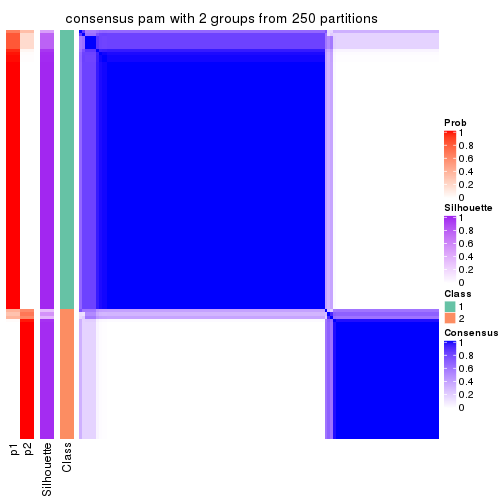</p>

</div>
<div id='tab-MAD-pam-consensus-heatmap-2'>
<pre><code class="r">consensus_heatmap(res, k = 3)
</code></pre>

<p>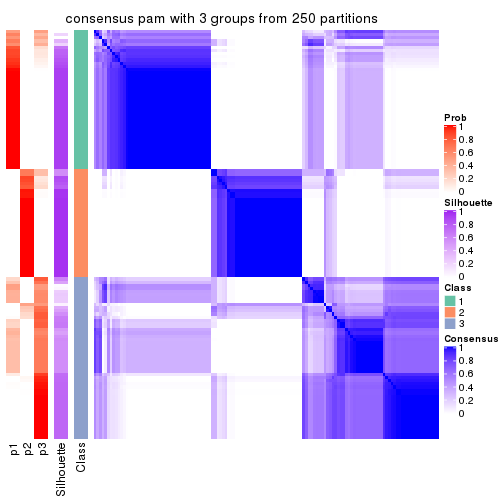</p>

</div>
<div id='tab-MAD-pam-consensus-heatmap-3'>
<pre><code class="r">consensus_heatmap(res, k = 4)
</code></pre>

<p>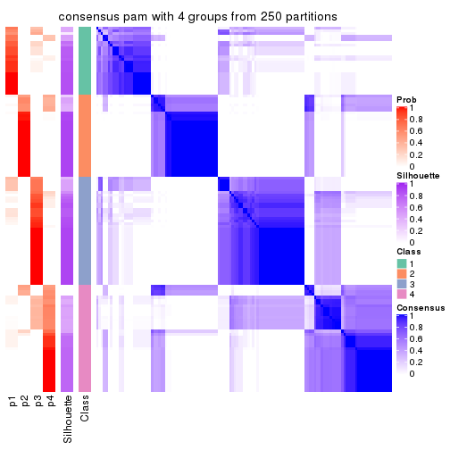</p>

</div>
<div id='tab-MAD-pam-consensus-heatmap-4'>
<pre><code class="r">consensus_heatmap(res, k = 5)
</code></pre>

<p>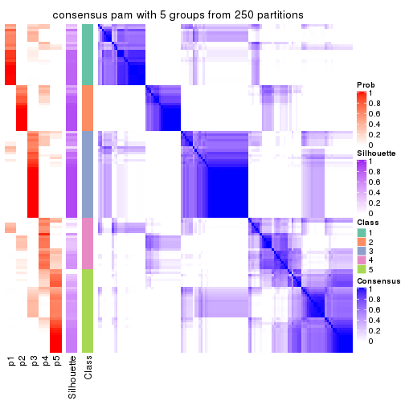</p>

</div>
<div id='tab-MAD-pam-consensus-heatmap-5'>
<pre><code class="r">consensus_heatmap(res, k = 6)
</code></pre>

<p>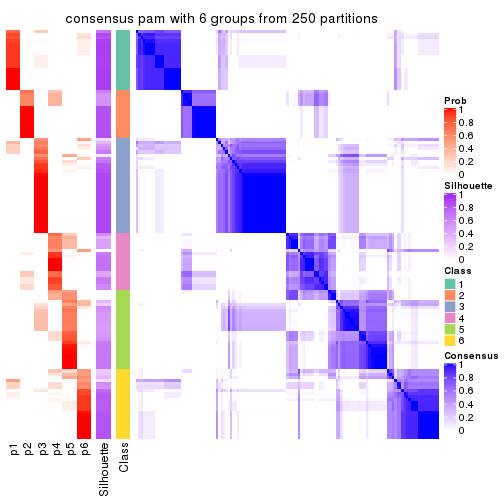</p>

</div>
</div>

Heatmaps for the membership of samples in all partitions to see how consistent they are:


<script>
$( function() {
	$( '#tabs-MAD-pam-membership-heatmap' ).tabs();
} );
</script>
<div id='tabs-MAD-pam-membership-heatmap'>
<ul>
<li><a href='#tab-MAD-pam-membership-heatmap-1'>k = 2</a></li>
<li><a href='#tab-MAD-pam-membership-heatmap-2'>k = 3</a></li>
<li><a href='#tab-MAD-pam-membership-heatmap-3'>k = 4</a></li>
<li><a href='#tab-MAD-pam-membership-heatmap-4'>k = 5</a></li>
<li><a href='#tab-MAD-pam-membership-heatmap-5'>k = 6</a></li>
</ul>
<div id='tab-MAD-pam-membership-heatmap-1'>
<pre><code class="r">membership_heatmap(res, k = 2)
</code></pre>

<p>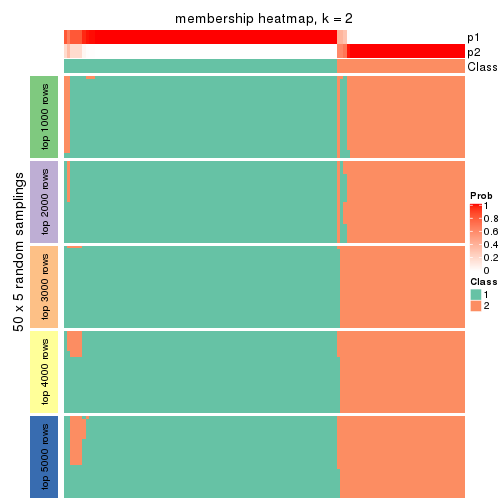</p>

</div>
<div id='tab-MAD-pam-membership-heatmap-2'>
<pre><code class="r">membership_heatmap(res, k = 3)
</code></pre>

<p>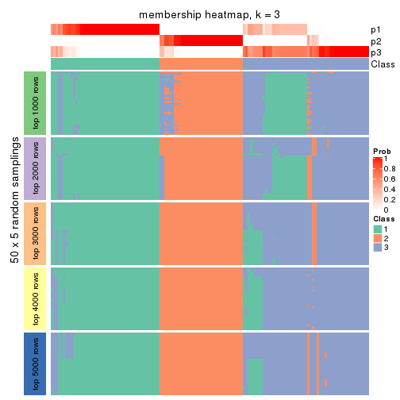</p>

</div>
<div id='tab-MAD-pam-membership-heatmap-3'>
<pre><code class="r">membership_heatmap(res, k = 4)
</code></pre>

<p>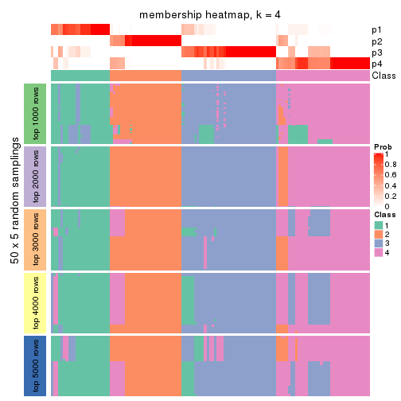</p>

</div>
<div id='tab-MAD-pam-membership-heatmap-4'>
<pre><code class="r">membership_heatmap(res, k = 5)
</code></pre>

<p>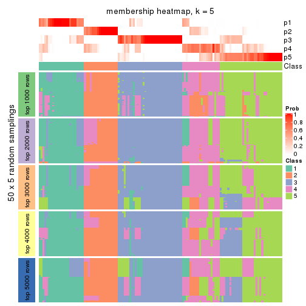</p>

</div>
<div id='tab-MAD-pam-membership-heatmap-5'>
<pre><code class="r">membership_heatmap(res, k = 6)
</code></pre>

<p>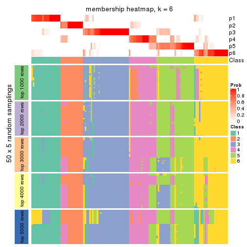</p>

</div>
</div>

As soon as we have had the classes for columns, we can look for signatures
which are significantly different between classes which can be candidate marks
for certain classes. Following are the heatmaps for signatures.


Signature heatmaps where rows are scaled:


<script>
$( function() {
	$( '#tabs-MAD-pam-get-signatures' ).tabs();
} );
</script>
<div id='tabs-MAD-pam-get-signatures'>
<ul>
<li><a href='#tab-MAD-pam-get-signatures-1'>k = 2</a></li>
<li><a href='#tab-MAD-pam-get-signatures-2'>k = 3</a></li>
<li><a href='#tab-MAD-pam-get-signatures-3'>k = 4</a></li>
<li><a href='#tab-MAD-pam-get-signatures-4'>k = 5</a></li>
<li><a href='#tab-MAD-pam-get-signatures-5'>k = 6</a></li>
</ul>
<div id='tab-MAD-pam-get-signatures-1'>
<pre><code class="r">get_signatures(res, k = 2)
</code></pre>

<p>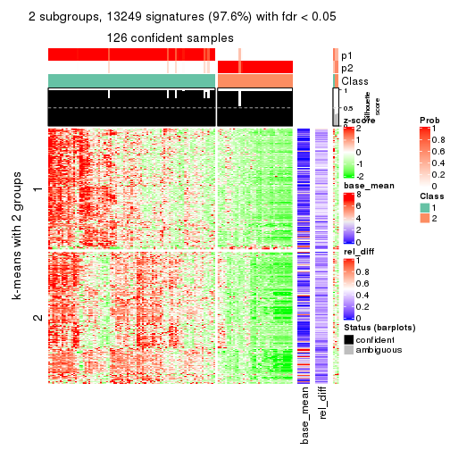</p>

</div>
<div id='tab-MAD-pam-get-signatures-2'>
<pre><code class="r">get_signatures(res, k = 3)
</code></pre>

<p>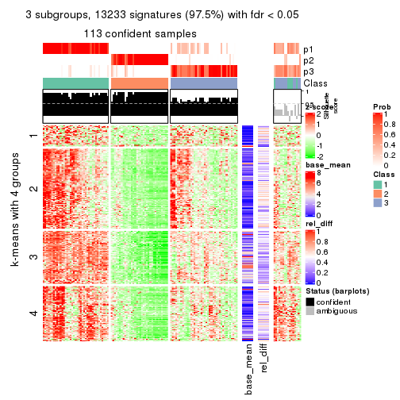</p>

</div>
<div id='tab-MAD-pam-get-signatures-3'>
<pre><code class="r">get_signatures(res, k = 4)
</code></pre>

<p>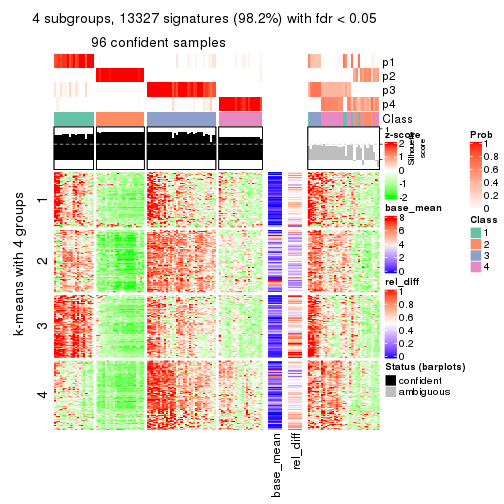</p>

</div>
<div id='tab-MAD-pam-get-signatures-4'>
<pre><code class="r">get_signatures(res, k = 5)
</code></pre>

<p>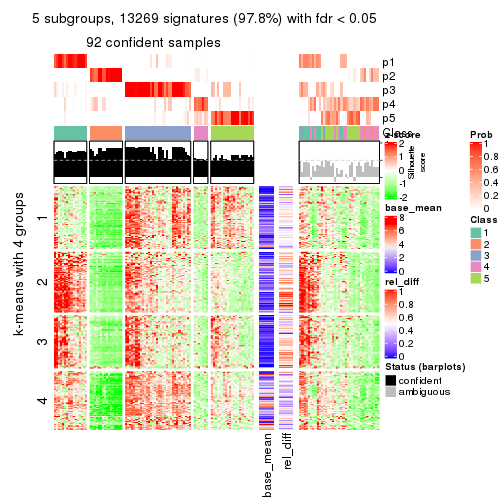</p>

</div>
<div id='tab-MAD-pam-get-signatures-5'>
<pre><code class="r">get_signatures(res, k = 6)
</code></pre>

<p>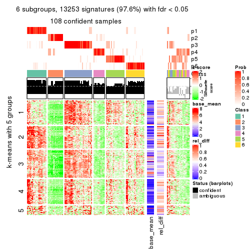</p>

</div>
</div>


Signature heatmaps where rows are not scaled:


<script>
$( function() {
	$( '#tabs-MAD-pam-get-signatures-no-scale' ).tabs();
} );
</script>
<div id='tabs-MAD-pam-get-signatures-no-scale'>
<ul>
<li><a href='#tab-MAD-pam-get-signatures-no-scale-1'>k = 2</a></li>
<li><a href='#tab-MAD-pam-get-signatures-no-scale-2'>k = 3</a></li>
<li><a href='#tab-MAD-pam-get-signatures-no-scale-3'>k = 4</a></li>
<li><a href='#tab-MAD-pam-get-signatures-no-scale-4'>k = 5</a></li>
<li><a href='#tab-MAD-pam-get-signatures-no-scale-5'>k = 6</a></li>
</ul>
<div id='tab-MAD-pam-get-signatures-no-scale-1'>
<pre><code class="r">get_signatures(res, k = 2, scale_rows = FALSE)
</code></pre>

<p>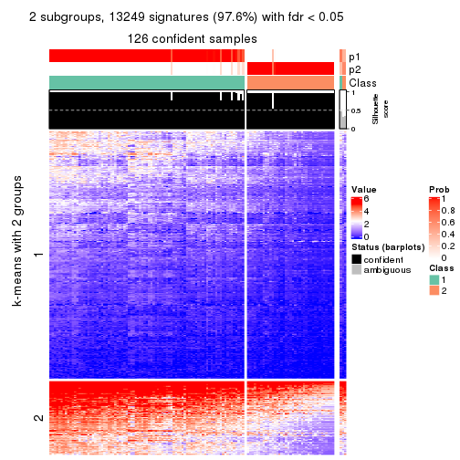</p>

</div>
<div id='tab-MAD-pam-get-signatures-no-scale-2'>
<pre><code class="r">get_signatures(res, k = 3, scale_rows = FALSE)
</code></pre>

<p>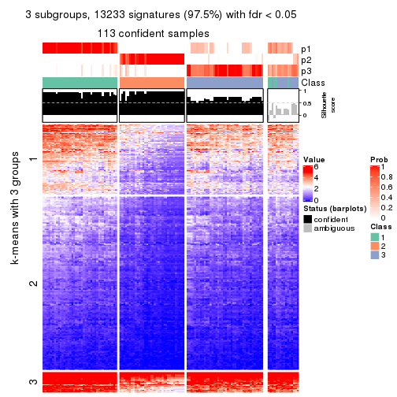</p>

</div>
<div id='tab-MAD-pam-get-signatures-no-scale-3'>
<pre><code class="r">get_signatures(res, k = 4, scale_rows = FALSE)
</code></pre>

<p>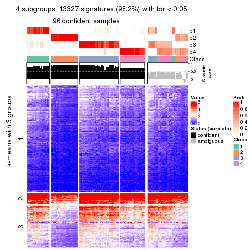</p>

</div>
<div id='tab-MAD-pam-get-signatures-no-scale-4'>
<pre><code class="r">get_signatures(res, k = 5, scale_rows = FALSE)
</code></pre>

<p>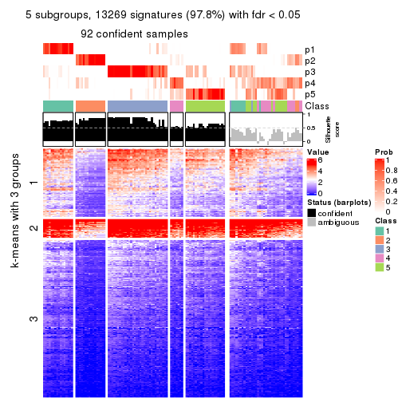</p>

</div>
<div id='tab-MAD-pam-get-signatures-no-scale-5'>
<pre><code class="r">get_signatures(res, k = 6, scale_rows = FALSE)
</code></pre>

<p>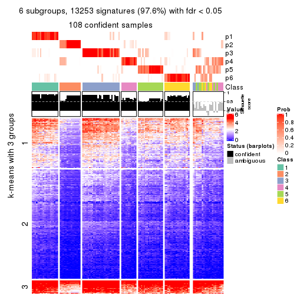</p>

</div>
</div>


Compare the overlap of signatures from different k:

```r
compare_signatures(res)
```

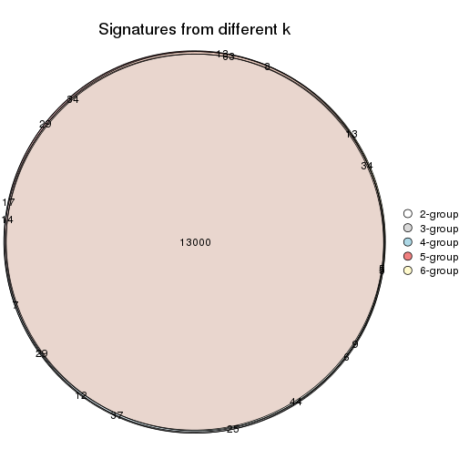

`get_signature()` returns a data frame invisibly. TO get the list of signatures, the function
call should be assigned to a variable explicitly. In following code, if `plot` argument is set
to `FALSE`, no heatmap is plotted while only the differential analysis is performed.

```r
# code only for demonstration
tb = get_signature(res, k = ..., plot = FALSE)
```

An example of the output of `tb` is:

```
#>   which_row         fdr    mean_1    mean_2 scaled_mean_1 scaled_mean_2 km
#> 1        38 0.042760348  8.373488  9.131774    -0.5533452     0.5164555  1
#> 2        40 0.018707592  7.106213  8.469186    -0.6173731     0.5762149  1
#> 3        55 0.019134737 10.221463 11.207825    -0.6159697     0.5749050  1
#> 4        59 0.006059896  5.921854  7.869574    -0.6899429     0.6439467  1
#> 5        60 0.018055526  8.928898 10.211722    -0.6204761     0.5791110  1
#> 6        98 0.009384629 15.714769 14.887706     0.6635654    -0.6193277  2
...
```

The columns in `tb` are:

1. `which_row`: row indices corresponding to the input matrix.
2. `fdr`: FDR for the differential test. 
3. `mean_x`: The mean value in group x.
4. `scaled_mean_x`: The mean value in group x after rows are scaled.
5. `km`: Row groups if k-means clustering is applied to rows.


UMAP plot which shows how samples are separated.


<script>
$( function() {
	$( '#tabs-MAD-pam-dimension-reduction' ).tabs();
} );
</script>
<div id='tabs-MAD-pam-dimension-reduction'>
<ul>
<li><a href='#tab-MAD-pam-dimension-reduction-1'>k = 2</a></li>
<li><a href='#tab-MAD-pam-dimension-reduction-2'>k = 3</a></li>
<li><a href='#tab-MAD-pam-dimension-reduction-3'>k = 4</a></li>
<li><a href='#tab-MAD-pam-dimension-reduction-4'>k = 5</a></li>
<li><a href='#tab-MAD-pam-dimension-reduction-5'>k = 6</a></li>
</ul>
<div id='tab-MAD-pam-dimension-reduction-1'>
<pre><code class="r">dimension_reduction(res, k = 2, method = &quot;UMAP&quot;)
</code></pre>

<p>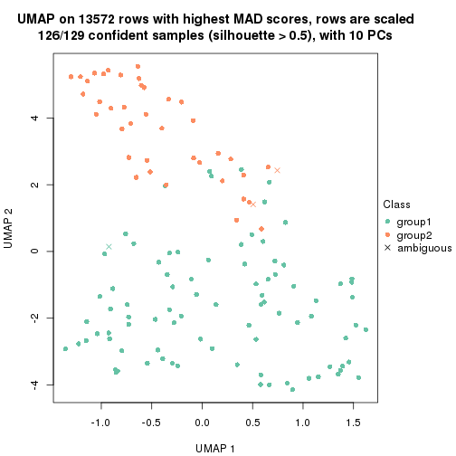</p>

</div>
<div id='tab-MAD-pam-dimension-reduction-2'>
<pre><code class="r">dimension_reduction(res, k = 3, method = &quot;UMAP&quot;)
</code></pre>

<p>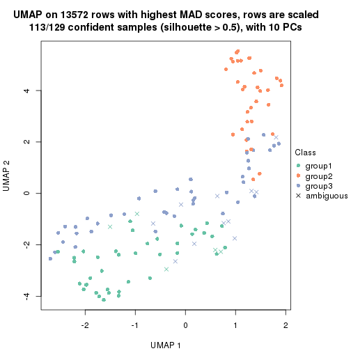</p>

</div>
<div id='tab-MAD-pam-dimension-reduction-3'>
<pre><code class="r">dimension_reduction(res, k = 4, method = &quot;UMAP&quot;)
</code></pre>

<p>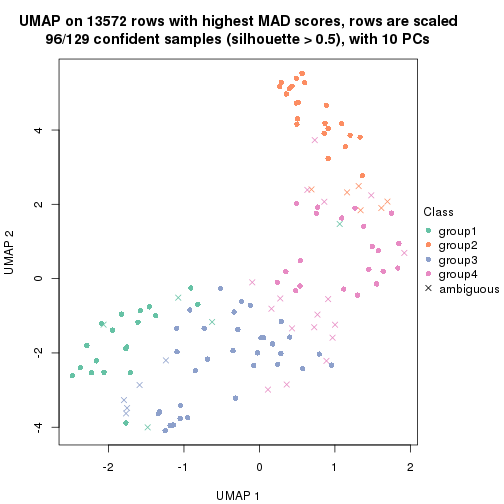</p>

</div>
<div id='tab-MAD-pam-dimension-reduction-4'>
<pre><code class="r">dimension_reduction(res, k = 5, method = &quot;UMAP&quot;)
</code></pre>

<p>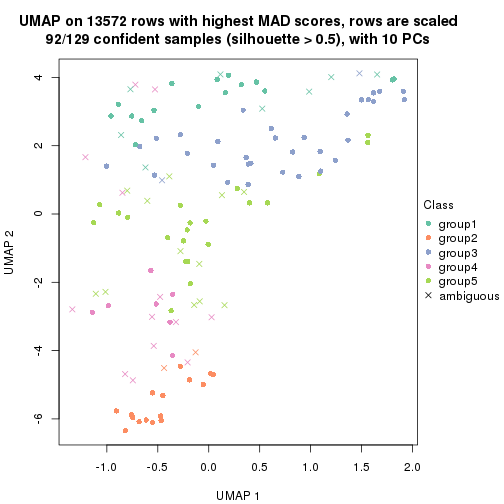</p>

</div>
<div id='tab-MAD-pam-dimension-reduction-5'>
<pre><code class="r">dimension_reduction(res, k = 6, method = &quot;UMAP&quot;)
</code></pre>

<p>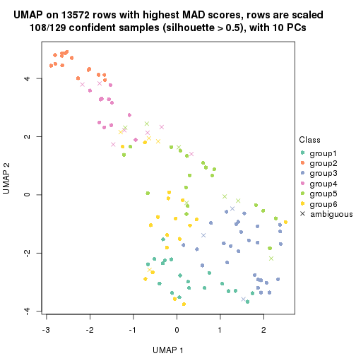</p>

</div>
</div>


Following heatmap shows how subgroups are split when increasing `k`:

```r
collect_classes(res)
```

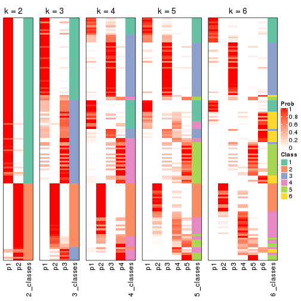


If matrix rows can be associated to genes, consider to use `GO_Enrichment(res,
...)` to perform function enrichment for the signature genes.


 

---------------------------------------------------


### MAD:mclust


The object with results only for a single top-value method and a single partition method 
can be extracted as:

```r
res = res_list["MAD", "mclust"]
# you can also extract it by
# res = res_list["MAD:mclust"]
```

A summary of `res` and all the functions that can be applied to it:

```r
res
```

```
#> A 'ConsensusPartition' object with k = 2, 3, 4, 5, 6.
#>   On a matrix with 13572 rows and 129 columns.
#>   Top rows (1000, 2000, 3000, 4000, 5000) are extracted by 'MAD' method.
#>   Subgroups are detected by 'mclust' method.
#>   Performed in total 1250 partitions by row resampling.
#>   Best k for subgroups seems to be 5.
#> 
#> Following methods can be applied to this 'ConsensusPartition' object:
#>  [1] "cola_report"             "collect_classes"         "collect_plots"          
#>  [4] "collect_stats"           "colnames"                "compare_signatures"     
#>  [7] "consensus_heatmap"       "dimension_reduction"     "functional_enrichment"  
#> [10] "get_anno_col"            "get_anno"                "get_classes"            
#> [13] "get_consensus"           "get_matrix"              "get_membership"         
#> [16] "get_param"               "get_signatures"          "get_stats"              
#> [19] "is_best_k"               "is_stable_k"             "membership_heatmap"     
#> [22] "ncol"                    "nrow"                    "plot_ecdf"              
#> [25] "rownames"                "select_partition_number" "show"                   
#> [28] "suggest_best_k"          "test_to_known_factors"
```

`collect_plots()` function collects all the plots made from `res` for all `k` (number of partitions)
into one single page to provide an easy and fast comparison between different `k`.

```r
collect_plots(res)
```

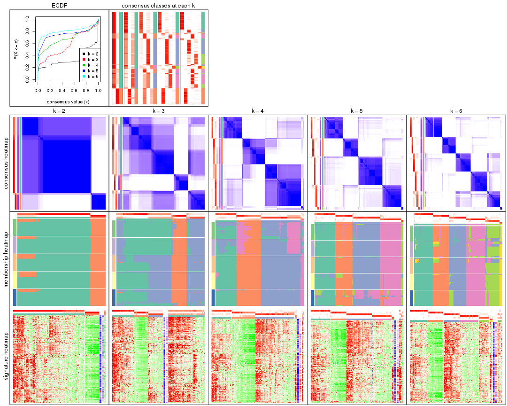

The plots are:

- The first row: a plot of the ECDF (Empirical cumulative distribution
  function) curves of the consensus matrix for each `k` and the heatmap of
  predicted classes for each `k`.
- The second row: heatmaps of the consensus matrix for each `k`.
- The third row: heatmaps of the membership matrix for each `k`.
- The fouth row: heatmaps of the signatures for each `k`.

All the plots in panels can be made by individual functions and they are
plotted later in this section.

`select_partition_number()` produces several plots showing different
statistics for choosing "optimized" `k`. There are following statistics:

- ECDF curves of the consensus matrix for each `k`;
- 1-PAC. [The PAC
  score](https://en.wikipedia.org/wiki/Consensus_clustering#Over-interpretation_potential_of_consensus_clustering)
  measures the proportion of the ambiguous subgrouping.
- Mean silhouette score.
- Concordance. The mean probability of fiting the consensus class ids in all
  partitions.
- Area increased. Denote $A_k$ as the area under the ECDF curve for current
  `k`, the area increased is defined as $A_k - A_{k-1}$.
- Rand index. The percent of pairs of samples that are both in a same cluster
  or both are not in a same cluster in the partition of k and k-1.
- Jaccard index. The ratio of pairs of samples are both in a same cluster in
  the partition of k and k-1 and the pairs of samples are both in a same
  cluster in the partition k or k-1.

The detailed explanations of these statistics can be found in [the cola
vignette](http://bioconductor.org/packages/devel/bioc/vignettes/cola/inst/doc/cola.html#toc_13).

Generally speaking, lower PAC score, higher mean silhouette score or higher
concordance corresponds to better partition. Rand index and Jaccard index
measure how similar the current partition is compared to partition with `k-1`.
If they are too similar, we won't accept `k` is better than `k-1`.

```r
select_partition_number(res)
```

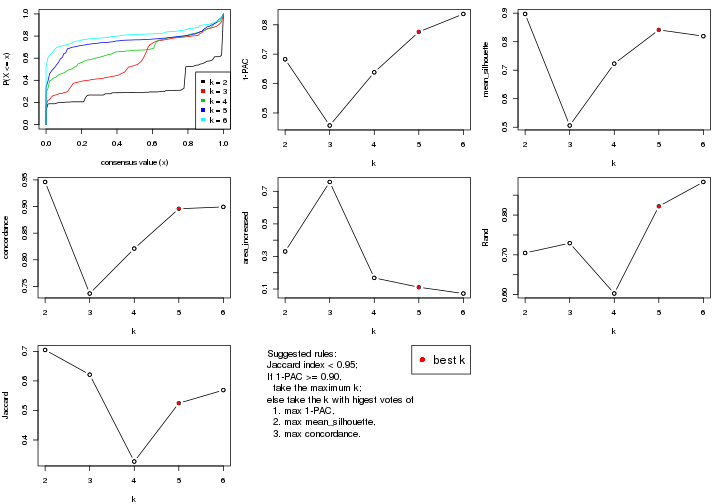

The numeric values for all these statistics can be obtained by `get_stats()`.

```r
get_stats(res)
```

```
#>   k 1-PAC mean_silhouette concordance area_increased  Rand Jaccard
#> 2 2 0.683           0.897       0.946         0.3306 0.705   0.705
#> 3 3 0.457           0.506       0.737         0.7573 0.729   0.621
#> 4 4 0.638           0.723       0.821         0.1682 0.603   0.327
#> 5 5 0.776           0.841       0.896         0.1110 0.822   0.525
#> 6 6 0.837           0.819       0.899         0.0723 0.883   0.569
```

`suggest_best_k()` suggests the best $k$ based on these statistics. The rules are as follows:

- All $k$ with Jaccard index larger than 0.95 are removed because the increase of
  the partition number does not provides enough extra information. If all $k$ are removed,
  the best $k$ is assigned by `NA`.
- For $k$ with 1-PAC larger than 0.9, the maximal $k$ is taken as the "best k". Other $k$ is called "optional k".
- If it does not fit the second rule. The $k$ with the highest vote of highest
  1-PAC, mean silhouette and concordance is taken as the "best k".

```r
suggest_best_k(res)
```

```
#> [1] 5
```


Following shows the table of the partitions (You need to click the **show/hide
code output** link to see it). The membership matrix (columns with name `p*`)
is inferred by
[`clue::cl_consensus()`](https://www.rdocumentation.org/link/cl_consensus?package=clue)
function with the `SE` method. Basically the value in the membership matrix
represents the probability to belong to a certain group. The finall class
label for an item is determined with the group with highest probability it
belongs to.

In `get_classes()` function, the entropy is calculated from the membership
matrix and the silhouette score is calculated from the consensus matrix.


<script>
$( function() {
	$( '#tabs-MAD-mclust-get-classes' ).tabs();
} );
</script>
<div id='tabs-MAD-mclust-get-classes'>
<ul>
<li><a href='#tab-MAD-mclust-get-classes-1'>k = 2</a></li>
<li><a href='#tab-MAD-mclust-get-classes-2'>k = 3</a></li>
<li><a href='#tab-MAD-mclust-get-classes-3'>k = 4</a></li>
<li><a href='#tab-MAD-mclust-get-classes-4'>k = 5</a></li>
<li><a href='#tab-MAD-mclust-get-classes-5'>k = 6</a></li>
</ul>

<div id='tab-MAD-mclust-get-classes-1'>
<p><a id='tab-MAD-mclust-get-classes-1-a' style='color:#0366d6' href='#'>show/hide code output</a></p>
<pre><code class="r">cbind(get_classes(res, k = 2), get_membership(res, k = 2))
</code></pre>

<pre><code>#&gt;            class entropy silhouette    p1    p2
#&gt; SRR1656463     2  0.0000      0.963 0.000 1.000
#&gt; SRR1656464     1  0.0000      0.935 1.000 0.000
#&gt; SRR1656462     1  0.0000      0.935 1.000 0.000
#&gt; SRR1656465     1  0.0000      0.935 1.000 0.000
#&gt; SRR1656467     1  0.9170      0.609 0.668 0.332
#&gt; SRR1656466     1  0.0000      0.935 1.000 0.000
#&gt; SRR1656468     1  0.7602      0.782 0.780 0.220
#&gt; SRR1656472     1  0.0000      0.935 1.000 0.000
#&gt; SRR1656471     1  0.0000      0.935 1.000 0.000
#&gt; SRR1656470     2  0.0000      0.963 0.000 1.000
#&gt; SRR1656469     1  0.0000      0.935 1.000 0.000
#&gt; SRR1656473     2  0.0000      0.963 0.000 1.000
#&gt; SRR1656474     2  0.0000      0.963 0.000 1.000
#&gt; SRR1656475     2  0.0000      0.963 0.000 1.000
#&gt; SRR1656478     1  0.0000      0.935 1.000 0.000
#&gt; SRR1656477     1  0.5842      0.848 0.860 0.140
#&gt; SRR1656479     1  0.0000      0.935 1.000 0.000
#&gt; SRR1656480     1  0.7602      0.782 0.780 0.220
#&gt; SRR1656476     2  0.0376      0.962 0.004 0.996
#&gt; SRR1656481     1  0.3114      0.905 0.944 0.056
#&gt; SRR1656482     2  0.0376      0.962 0.004 0.996
#&gt; SRR1656483     2  0.0000      0.963 0.000 1.000
#&gt; SRR1656485     1  0.0000      0.935 1.000 0.000
#&gt; SRR1656487     1  0.0000      0.935 1.000 0.000
#&gt; SRR1656486     1  0.0000      0.935 1.000 0.000
#&gt; SRR1656488     1  0.0000      0.935 1.000 0.000
#&gt; SRR1656484     1  0.0000      0.935 1.000 0.000
#&gt; SRR1656489     1  0.0000      0.935 1.000 0.000
#&gt; SRR1656491     1  0.0000      0.935 1.000 0.000
#&gt; SRR1656490     1  0.1184      0.927 0.984 0.016
#&gt; SRR1656492     1  0.0000      0.935 1.000 0.000
#&gt; SRR1656493     1  0.0000      0.935 1.000 0.000
#&gt; SRR1656495     1  0.0000      0.935 1.000 0.000
#&gt; SRR1656496     1  0.0000      0.935 1.000 0.000
#&gt; SRR1656494     1  0.7602      0.782 0.780 0.220
#&gt; SRR1656497     2  0.0000      0.963 0.000 1.000
#&gt; SRR1656499     1  0.0000      0.935 1.000 0.000
#&gt; SRR1656500     1  0.0000      0.935 1.000 0.000
#&gt; SRR1656501     1  0.0000      0.935 1.000 0.000
#&gt; SRR1656498     1  0.0000      0.935 1.000 0.000
#&gt; SRR1656504     2  0.0376      0.962 0.004 0.996
#&gt; SRR1656502     1  0.0000      0.935 1.000 0.000
#&gt; SRR1656503     1  0.0000      0.935 1.000 0.000
#&gt; SRR1656507     1  0.0000      0.935 1.000 0.000
#&gt; SRR1656508     1  0.0000      0.935 1.000 0.000
#&gt; SRR1656505     1  0.7602      0.782 0.780 0.220
#&gt; SRR1656506     1  0.0000      0.935 1.000 0.000
#&gt; SRR1656509     1  0.0000      0.935 1.000 0.000
#&gt; SRR1656510     1  0.4815      0.874 0.896 0.104
#&gt; SRR1656511     1  0.7602      0.782 0.780 0.220
#&gt; SRR1656513     1  0.7815      0.768 0.768 0.232
#&gt; SRR1656512     2  0.0000      0.963 0.000 1.000
#&gt; SRR1656514     1  0.0000      0.935 1.000 0.000
#&gt; SRR1656515     1  0.7883      0.763 0.764 0.236
#&gt; SRR1656516     1  0.0000      0.935 1.000 0.000
#&gt; SRR1656518     1  0.0000      0.935 1.000 0.000
#&gt; SRR1656517     1  0.0000      0.935 1.000 0.000
#&gt; SRR1656519     1  0.0000      0.935 1.000 0.000
#&gt; SRR1656522     1  0.0000      0.935 1.000 0.000
#&gt; SRR1656523     1  0.7602      0.782 0.780 0.220
#&gt; SRR1656521     2  0.0000      0.963 0.000 1.000
#&gt; SRR1656520     1  0.0000      0.935 1.000 0.000
#&gt; SRR1656524     1  0.0000      0.935 1.000 0.000
#&gt; SRR1656525     1  0.0000      0.935 1.000 0.000
#&gt; SRR1656526     2  0.0376      0.962 0.004 0.996
#&gt; SRR1656527     2  0.9460      0.345 0.364 0.636
#&gt; SRR1656530     1  0.0000      0.935 1.000 0.000
#&gt; SRR1656529     1  0.0000      0.935 1.000 0.000
#&gt; SRR1656531     1  0.0000      0.935 1.000 0.000
#&gt; SRR1656528     1  0.0000      0.935 1.000 0.000
#&gt; SRR1656534     1  0.0000      0.935 1.000 0.000
#&gt; SRR1656533     1  0.0000      0.935 1.000 0.000
#&gt; SRR1656536     1  0.3114      0.905 0.944 0.056
#&gt; SRR1656532     1  0.7602      0.782 0.780 0.220
#&gt; SRR1656537     1  0.0000      0.935 1.000 0.000
#&gt; SRR1656538     1  0.0000      0.935 1.000 0.000
#&gt; SRR1656535     2  0.0376      0.962 0.004 0.996
#&gt; SRR1656539     1  0.0000      0.935 1.000 0.000
#&gt; SRR1656544     1  0.0000      0.935 1.000 0.000
#&gt; SRR1656542     1  0.0000      0.935 1.000 0.000
#&gt; SRR1656543     1  0.0000      0.935 1.000 0.000
#&gt; SRR1656545     2  0.0000      0.963 0.000 1.000
#&gt; SRR1656540     1  0.0000      0.935 1.000 0.000
#&gt; SRR1656546     1  0.0000      0.935 1.000 0.000
#&gt; SRR1656541     2  0.9129      0.443 0.328 0.672
#&gt; SRR1656547     1  0.7602      0.782 0.780 0.220
#&gt; SRR1656548     1  0.0000      0.935 1.000 0.000
#&gt; SRR1656549     1  0.0000      0.935 1.000 0.000
#&gt; SRR1656551     1  0.3431      0.901 0.936 0.064
#&gt; SRR1656553     1  0.0000      0.935 1.000 0.000
#&gt; SRR1656550     1  0.7602      0.782 0.780 0.220
#&gt; SRR1656552     1  0.7602      0.782 0.780 0.220
#&gt; SRR1656554     1  0.0000      0.935 1.000 0.000
#&gt; SRR1656555     1  0.7602      0.782 0.780 0.220
#&gt; SRR1656556     1  0.0000      0.935 1.000 0.000
#&gt; SRR1656557     1  0.0000      0.935 1.000 0.000
#&gt; SRR1656558     1  0.0000      0.935 1.000 0.000
#&gt; SRR1656559     1  0.0000      0.935 1.000 0.000
#&gt; SRR1656560     1  0.0000      0.935 1.000 0.000
#&gt; SRR1656561     1  0.0000      0.935 1.000 0.000
#&gt; SRR1656562     1  0.7602      0.782 0.780 0.220
#&gt; SRR1656563     1  0.0000      0.935 1.000 0.000
#&gt; SRR1656564     2  0.0000      0.963 0.000 1.000
#&gt; SRR1656565     1  0.7602      0.782 0.780 0.220
#&gt; SRR1656566     1  0.0000      0.935 1.000 0.000
#&gt; SRR1656568     2  0.0376      0.962 0.004 0.996
#&gt; SRR1656567     1  0.7602      0.782 0.780 0.220
#&gt; SRR1656569     1  0.0000      0.935 1.000 0.000
#&gt; SRR1656570     1  0.0000      0.935 1.000 0.000
#&gt; SRR1656571     2  0.0000      0.963 0.000 1.000
#&gt; SRR1656573     1  0.4431      0.882 0.908 0.092
#&gt; SRR1656572     1  0.7602      0.782 0.780 0.220
#&gt; SRR1656574     1  0.0000      0.935 1.000 0.000
#&gt; SRR1656575     1  0.0000      0.935 1.000 0.000
#&gt; SRR1656576     1  0.7602      0.782 0.780 0.220
#&gt; SRR1656578     1  0.7602      0.782 0.780 0.220
#&gt; SRR1656577     1  0.0000      0.935 1.000 0.000
#&gt; SRR1656579     1  0.7602      0.782 0.780 0.220
#&gt; SRR1656580     1  0.0000      0.935 1.000 0.000
#&gt; SRR1656581     1  0.7602      0.782 0.780 0.220
#&gt; SRR1656582     2  0.0376      0.962 0.004 0.996
#&gt; SRR1656585     1  0.7602      0.782 0.780 0.220
#&gt; SRR1656584     1  0.0000      0.935 1.000 0.000
#&gt; SRR1656583     1  0.3274      0.903 0.940 0.060
#&gt; SRR1656586     2  0.0000      0.963 0.000 1.000
#&gt; SRR1656587     1  0.7602      0.782 0.780 0.220
#&gt; SRR1656588     1  0.7602      0.782 0.780 0.220
#&gt; SRR1656589     2  0.0000      0.963 0.000 1.000
#&gt; SRR1656590     1  0.0000      0.935 1.000 0.000
</code></pre>

<script>
$('#tab-MAD-mclust-get-classes-1-a').parent().next().next().hide();
$('#tab-MAD-mclust-get-classes-1-a').click(function(){
  $('#tab-MAD-mclust-get-classes-1-a').parent().next().next().toggle();
  return(false);
});
</script>
</div>

<div id='tab-MAD-mclust-get-classes-2'>
<p><a id='tab-MAD-mclust-get-classes-2-a' style='color:#0366d6' href='#'>show/hide code output</a></p>
<pre><code class="r">cbind(get_classes(res, k = 3), get_membership(res, k = 3))
</code></pre>

<pre><code>#&gt;            class entropy silhouette    p1    p2    p3
#&gt; SRR1656463     2  0.0424     0.9106 0.000 0.992 0.008
#&gt; SRR1656464     1  0.0892     0.5572 0.980 0.000 0.020
#&gt; SRR1656462     1  0.6204     0.2770 0.576 0.000 0.424
#&gt; SRR1656465     3  0.6274     0.0920 0.456 0.000 0.544
#&gt; SRR1656467     3  0.5174     0.8124 0.128 0.048 0.824
#&gt; SRR1656466     1  0.6225     0.2730 0.568 0.000 0.432
#&gt; SRR1656468     3  0.3752     0.8430 0.144 0.000 0.856
#&gt; SRR1656472     1  0.4605     0.3758 0.796 0.000 0.204
#&gt; SRR1656471     1  0.6305     0.1342 0.516 0.000 0.484
#&gt; SRR1656470     2  0.0000     0.9122 0.000 1.000 0.000
#&gt; SRR1656469     1  0.6215     0.2748 0.572 0.000 0.428
#&gt; SRR1656473     2  0.0000     0.9122 0.000 1.000 0.000
#&gt; SRR1656474     2  0.0000     0.9122 0.000 1.000 0.000
#&gt; SRR1656475     2  0.0000     0.9122 0.000 1.000 0.000
#&gt; SRR1656478     1  0.3340     0.5208 0.880 0.000 0.120
#&gt; SRR1656477     3  0.3482     0.8397 0.128 0.000 0.872
#&gt; SRR1656479     1  0.5098     0.4224 0.752 0.000 0.248
#&gt; SRR1656480     3  0.3784     0.8430 0.132 0.004 0.864
#&gt; SRR1656476     2  0.1411     0.9025 0.000 0.964 0.036
#&gt; SRR1656481     3  0.3752     0.8430 0.144 0.000 0.856
#&gt; SRR1656482     2  0.2878     0.8788 0.000 0.904 0.096
#&gt; SRR1656483     2  0.0000     0.9122 0.000 1.000 0.000
#&gt; SRR1656485     1  0.6215     0.2748 0.572 0.000 0.428
#&gt; SRR1656487     1  0.6225     0.2730 0.568 0.000 0.432
#&gt; SRR1656486     1  0.0237     0.5613 0.996 0.000 0.004
#&gt; SRR1656488     1  0.6225     0.2730 0.568 0.000 0.432
#&gt; SRR1656484     1  0.0237     0.5613 0.996 0.000 0.004
#&gt; SRR1656489     1  0.0237     0.5615 0.996 0.000 0.004
#&gt; SRR1656491     1  0.6204     0.2770 0.576 0.000 0.424
#&gt; SRR1656490     1  0.3551     0.5051 0.868 0.000 0.132
#&gt; SRR1656492     1  0.6204     0.2770 0.576 0.000 0.424
#&gt; SRR1656493     1  0.2878     0.4914 0.904 0.000 0.096
#&gt; SRR1656495     1  0.6008     0.0983 0.628 0.000 0.372
#&gt; SRR1656496     1  0.6079     0.3073 0.612 0.000 0.388
#&gt; SRR1656494     1  0.7178    -0.0854 0.512 0.024 0.464
#&gt; SRR1656497     2  0.0000     0.9122 0.000 1.000 0.000
#&gt; SRR1656499     1  0.6225     0.2730 0.568 0.000 0.432
#&gt; SRR1656500     1  0.6204     0.2770 0.576 0.000 0.424
#&gt; SRR1656501     1  0.1031     0.5572 0.976 0.000 0.024
#&gt; SRR1656498     1  0.0000     0.5617 1.000 0.000 0.000
#&gt; SRR1656504     2  0.2959     0.8766 0.000 0.900 0.100
#&gt; SRR1656502     1  0.4750     0.3589 0.784 0.000 0.216
#&gt; SRR1656503     1  0.0000     0.5617 1.000 0.000 0.000
#&gt; SRR1656507     1  0.3340     0.5208 0.880 0.000 0.120
#&gt; SRR1656508     1  0.0000     0.5617 1.000 0.000 0.000
#&gt; SRR1656505     3  0.3918     0.8438 0.140 0.004 0.856
#&gt; SRR1656506     1  0.6225     0.2730 0.568 0.000 0.432
#&gt; SRR1656509     3  0.6302    -0.0482 0.480 0.000 0.520
#&gt; SRR1656510     3  0.6252     0.1520 0.444 0.000 0.556
#&gt; SRR1656511     1  0.7232    -0.0523 0.544 0.028 0.428
#&gt; SRR1656513     3  0.9787     0.0482 0.248 0.328 0.424
#&gt; SRR1656512     2  0.0000     0.9122 0.000 1.000 0.000
#&gt; SRR1656514     1  0.0892     0.5572 0.980 0.000 0.020
#&gt; SRR1656515     3  0.4483     0.8249 0.128 0.024 0.848
#&gt; SRR1656516     1  0.0000     0.5617 1.000 0.000 0.000
#&gt; SRR1656518     1  0.3340     0.5208 0.880 0.000 0.120
#&gt; SRR1656517     1  0.3340     0.5208 0.880 0.000 0.120
#&gt; SRR1656519     1  0.6204     0.2770 0.576 0.000 0.424
#&gt; SRR1656522     1  0.0000     0.5617 1.000 0.000 0.000
#&gt; SRR1656523     3  0.4733     0.7920 0.196 0.004 0.800
#&gt; SRR1656521     2  0.0000     0.9122 0.000 1.000 0.000
#&gt; SRR1656520     1  0.6244     0.2593 0.560 0.000 0.440
#&gt; SRR1656524     1  0.3879     0.4394 0.848 0.000 0.152
#&gt; SRR1656525     1  0.6215     0.2748 0.572 0.000 0.428
#&gt; SRR1656526     2  0.6180     0.5144 0.000 0.584 0.416
#&gt; SRR1656527     1  0.9191    -0.0739 0.428 0.148 0.424
#&gt; SRR1656530     1  0.6225     0.2730 0.568 0.000 0.432
#&gt; SRR1656529     1  0.6225     0.2730 0.568 0.000 0.432
#&gt; SRR1656531     1  0.0747     0.5584 0.984 0.000 0.016
#&gt; SRR1656528     1  0.6225     0.2730 0.568 0.000 0.432
#&gt; SRR1656534     1  0.6192     0.2812 0.580 0.000 0.420
#&gt; SRR1656533     1  0.3340     0.5208 0.880 0.000 0.120
#&gt; SRR1656536     3  0.3752     0.8430 0.144 0.000 0.856
#&gt; SRR1656532     1  0.7159    -0.0579 0.528 0.024 0.448
#&gt; SRR1656537     1  0.0747     0.5584 0.984 0.000 0.016
#&gt; SRR1656538     1  0.5706     0.3634 0.680 0.000 0.320
#&gt; SRR1656535     2  0.6314     0.5500 0.004 0.604 0.392
#&gt; SRR1656539     1  0.6225     0.2664 0.568 0.000 0.432
#&gt; SRR1656544     1  0.6204     0.2770 0.576 0.000 0.424
#&gt; SRR1656542     1  0.6204     0.2770 0.576 0.000 0.424
#&gt; SRR1656543     1  0.6204     0.2770 0.576 0.000 0.424
#&gt; SRR1656545     2  0.0000     0.9122 0.000 1.000 0.000
#&gt; SRR1656540     1  0.6252     0.2538 0.556 0.000 0.444
#&gt; SRR1656546     1  0.0424     0.5593 0.992 0.000 0.008
#&gt; SRR1656541     2  0.7974     0.3183 0.060 0.504 0.436
#&gt; SRR1656547     3  0.3983     0.8439 0.144 0.004 0.852
#&gt; SRR1656548     1  0.6215     0.2748 0.572 0.000 0.428
#&gt; SRR1656549     1  0.3340     0.5208 0.880 0.000 0.120
#&gt; SRR1656551     3  0.4121     0.8238 0.168 0.000 0.832
#&gt; SRR1656553     1  0.6204     0.2770 0.576 0.000 0.424
#&gt; SRR1656550     3  0.3715     0.8406 0.128 0.004 0.868
#&gt; SRR1656552     3  0.4811     0.8323 0.148 0.024 0.828
#&gt; SRR1656554     1  0.6225     0.2730 0.568 0.000 0.432
#&gt; SRR1656555     3  0.4291     0.8122 0.180 0.000 0.820
#&gt; SRR1656556     3  0.4555     0.7624 0.200 0.000 0.800
#&gt; SRR1656557     1  0.6204     0.2770 0.576 0.000 0.424
#&gt; SRR1656558     1  0.3340     0.5208 0.880 0.000 0.120
#&gt; SRR1656559     1  0.0000     0.5617 1.000 0.000 0.000
#&gt; SRR1656560     1  0.6225     0.2730 0.568 0.000 0.432
#&gt; SRR1656561     1  0.5926     0.3330 0.644 0.000 0.356
#&gt; SRR1656562     1  0.7138    -0.0625 0.540 0.024 0.436
#&gt; SRR1656563     1  0.3340     0.5208 0.880 0.000 0.120
#&gt; SRR1656564     2  0.2878     0.8788 0.000 0.904 0.096
#&gt; SRR1656565     1  0.7446    -0.0679 0.532 0.036 0.432
#&gt; SRR1656566     1  0.0424     0.5593 0.992 0.000 0.008
#&gt; SRR1656568     2  0.4335     0.8569 0.036 0.864 0.100
#&gt; SRR1656567     3  0.3784     0.8430 0.132 0.004 0.864
#&gt; SRR1656569     1  0.6225     0.2730 0.568 0.000 0.432
#&gt; SRR1656570     1  0.3340     0.5208 0.880 0.000 0.120
#&gt; SRR1656571     2  0.0000     0.9122 0.000 1.000 0.000
#&gt; SRR1656573     3  0.6244     0.1669 0.440 0.000 0.560
#&gt; SRR1656572     1  0.7121    -0.0486 0.548 0.024 0.428
#&gt; SRR1656574     1  0.0000     0.5617 1.000 0.000 0.000
#&gt; SRR1656575     1  0.3116     0.5261 0.892 0.000 0.108
#&gt; SRR1656576     3  0.4874     0.8300 0.144 0.028 0.828
#&gt; SRR1656578     1  0.7360    -0.0574 0.528 0.032 0.440
#&gt; SRR1656577     1  0.0000     0.5617 1.000 0.000 0.000
#&gt; SRR1656579     3  0.3918     0.8438 0.140 0.004 0.856
#&gt; SRR1656580     1  0.0892     0.5572 0.980 0.000 0.020
#&gt; SRR1656581     3  0.4346     0.8071 0.184 0.000 0.816
#&gt; SRR1656582     2  0.3340     0.8632 0.000 0.880 0.120
#&gt; SRR1656585     3  0.3686     0.8442 0.140 0.000 0.860
#&gt; SRR1656584     1  0.3340     0.5208 0.880 0.000 0.120
#&gt; SRR1656583     3  0.3482     0.8397 0.128 0.000 0.872
#&gt; SRR1656586     2  0.0000     0.9122 0.000 1.000 0.000
#&gt; SRR1656587     1  0.6505    -0.0653 0.528 0.004 0.468
#&gt; SRR1656588     3  0.3715     0.8406 0.128 0.004 0.868
#&gt; SRR1656589     2  0.0000     0.9122 0.000 1.000 0.000
#&gt; SRR1656590     1  0.1163     0.5538 0.972 0.000 0.028
</code></pre>

<script>
$('#tab-MAD-mclust-get-classes-2-a').parent().next().next().hide();
$('#tab-MAD-mclust-get-classes-2-a').click(function(){
  $('#tab-MAD-mclust-get-classes-2-a').parent().next().next().toggle();
  return(false);
});
</script>
</div>

<div id='tab-MAD-mclust-get-classes-3'>
<p><a id='tab-MAD-mclust-get-classes-3-a' style='color:#0366d6' href='#'>show/hide code output</a></p>
<pre><code class="r">cbind(get_classes(res, k = 4), get_membership(res, k = 4))
</code></pre>

<pre><code>#&gt;            class entropy silhouette    p1    p2    p3    p4
#&gt; SRR1656463     2  0.4679      0.777 0.000 0.648 0.000 0.352
#&gt; SRR1656464     4  0.6753      0.482 0.164 0.000 0.228 0.608
#&gt; SRR1656462     3  0.2011      0.764 0.080 0.000 0.920 0.000
#&gt; SRR1656465     3  0.2530      0.708 0.000 0.112 0.888 0.000
#&gt; SRR1656467     2  0.3123      0.743 0.000 0.844 0.000 0.156
#&gt; SRR1656466     3  0.0469      0.751 0.012 0.000 0.988 0.000
#&gt; SRR1656468     3  0.4697      0.603 0.000 0.356 0.644 0.000
#&gt; SRR1656472     4  0.6800      0.701 0.204 0.156 0.008 0.632
#&gt; SRR1656471     3  0.2844      0.750 0.048 0.052 0.900 0.000
#&gt; SRR1656470     2  0.4973      0.776 0.008 0.644 0.000 0.348
#&gt; SRR1656469     3  0.1022      0.755 0.032 0.000 0.968 0.000
#&gt; SRR1656473     2  0.4973      0.776 0.008 0.644 0.000 0.348
#&gt; SRR1656474     2  0.4973      0.776 0.008 0.644 0.000 0.348
#&gt; SRR1656475     2  0.4973      0.776 0.008 0.644 0.000 0.348
#&gt; SRR1656478     1  0.2345      0.880 0.900 0.000 0.100 0.000
#&gt; SRR1656477     3  0.5127      0.593 0.000 0.356 0.632 0.012
#&gt; SRR1656479     3  0.2814      0.730 0.132 0.000 0.868 0.000
#&gt; SRR1656480     3  0.5127      0.593 0.000 0.356 0.632 0.012
#&gt; SRR1656476     2  0.4679      0.777 0.000 0.648 0.000 0.352
#&gt; SRR1656481     3  0.4697      0.603 0.000 0.356 0.644 0.000
#&gt; SRR1656482     2  0.4356      0.786 0.000 0.708 0.000 0.292
#&gt; SRR1656483     2  0.4697      0.775 0.000 0.644 0.000 0.356
#&gt; SRR1656485     3  0.2011      0.764 0.080 0.000 0.920 0.000
#&gt; SRR1656487     3  0.0817      0.752 0.024 0.000 0.976 0.000
#&gt; SRR1656486     1  0.3801      0.807 0.780 0.000 0.220 0.000
#&gt; SRR1656488     3  0.2011      0.764 0.080 0.000 0.920 0.000
#&gt; SRR1656484     1  0.2868      0.873 0.864 0.000 0.136 0.000
#&gt; SRR1656489     1  0.3486      0.839 0.812 0.000 0.188 0.000
#&gt; SRR1656491     3  0.2011      0.764 0.080 0.000 0.920 0.000
#&gt; SRR1656490     3  0.4372      0.577 0.268 0.004 0.728 0.000
#&gt; SRR1656492     3  0.2011      0.764 0.080 0.000 0.920 0.000
#&gt; SRR1656493     1  0.2032      0.786 0.936 0.028 0.036 0.000
#&gt; SRR1656495     4  0.6782      0.689 0.212 0.148 0.008 0.632
#&gt; SRR1656496     3  0.2216      0.757 0.092 0.000 0.908 0.000
#&gt; SRR1656494     2  0.1284      0.643 0.012 0.964 0.024 0.000
#&gt; SRR1656497     2  0.4973      0.776 0.008 0.644 0.000 0.348
#&gt; SRR1656499     3  0.2011      0.764 0.080 0.000 0.920 0.000
#&gt; SRR1656500     3  0.2011      0.764 0.080 0.000 0.920 0.000
#&gt; SRR1656501     1  0.3726      0.817 0.788 0.000 0.212 0.000
#&gt; SRR1656498     1  0.2281      0.880 0.904 0.000 0.096 0.000
#&gt; SRR1656504     2  0.4356      0.786 0.000 0.708 0.000 0.292
#&gt; SRR1656502     4  0.6823      0.696 0.184 0.176 0.008 0.632
#&gt; SRR1656503     1  0.3837      0.802 0.776 0.000 0.224 0.000
#&gt; SRR1656507     1  0.3024      0.866 0.852 0.000 0.148 0.000
#&gt; SRR1656508     1  0.2281      0.880 0.904 0.000 0.096 0.000
#&gt; SRR1656505     3  0.5127      0.593 0.000 0.356 0.632 0.012
#&gt; SRR1656506     3  0.2011      0.764 0.080 0.000 0.920 0.000
#&gt; SRR1656509     3  0.3370      0.741 0.048 0.080 0.872 0.000
#&gt; SRR1656510     3  0.4957      0.632 0.016 0.300 0.684 0.000
#&gt; SRR1656511     2  0.1118      0.642 0.000 0.964 0.036 0.000
#&gt; SRR1656513     2  0.1022      0.687 0.000 0.968 0.000 0.032
#&gt; SRR1656512     2  0.4973      0.776 0.008 0.644 0.000 0.348
#&gt; SRR1656514     4  0.7213      0.335 0.140 0.000 0.408 0.452
#&gt; SRR1656515     2  0.0937      0.655 0.000 0.976 0.012 0.012
#&gt; SRR1656516     1  0.4134      0.751 0.740 0.000 0.260 0.000
#&gt; SRR1656518     1  0.2281      0.880 0.904 0.000 0.096 0.000
#&gt; SRR1656517     1  0.2281      0.880 0.904 0.000 0.096 0.000
#&gt; SRR1656519     3  0.2011      0.764 0.080 0.000 0.920 0.000
#&gt; SRR1656522     1  0.4193      0.738 0.732 0.000 0.268 0.000
#&gt; SRR1656523     3  0.4898      0.518 0.000 0.416 0.584 0.000
#&gt; SRR1656521     2  0.4855      0.776 0.004 0.644 0.000 0.352
#&gt; SRR1656520     3  0.2216      0.759 0.092 0.000 0.908 0.000
#&gt; SRR1656524     1  0.3586      0.634 0.872 0.040 0.012 0.076
#&gt; SRR1656525     3  0.2011      0.764 0.080 0.000 0.920 0.000
#&gt; SRR1656526     2  0.4040      0.779 0.000 0.752 0.000 0.248
#&gt; SRR1656527     2  0.3266      0.755 0.000 0.832 0.000 0.168
#&gt; SRR1656530     3  0.0817      0.752 0.024 0.000 0.976 0.000
#&gt; SRR1656529     3  0.0817      0.752 0.024 0.000 0.976 0.000
#&gt; SRR1656531     1  0.3601      0.841 0.860 0.000 0.084 0.056
#&gt; SRR1656528     3  0.2011      0.764 0.080 0.000 0.920 0.000
#&gt; SRR1656534     3  0.2216      0.757 0.092 0.000 0.908 0.000
#&gt; SRR1656533     1  0.2281      0.880 0.904 0.000 0.096 0.000
#&gt; SRR1656536     3  0.4679      0.606 0.000 0.352 0.648 0.000
#&gt; SRR1656532     2  0.1362      0.647 0.012 0.964 0.004 0.020
#&gt; SRR1656537     1  0.2565      0.779 0.912 0.000 0.032 0.056
#&gt; SRR1656538     3  0.2589      0.736 0.116 0.000 0.884 0.000
#&gt; SRR1656535     2  0.4040      0.779 0.000 0.752 0.000 0.248
#&gt; SRR1656539     3  0.0336      0.745 0.000 0.008 0.992 0.000
#&gt; SRR1656544     3  0.2011      0.764 0.080 0.000 0.920 0.000
#&gt; SRR1656542     3  0.2011      0.764 0.080 0.000 0.920 0.000
#&gt; SRR1656543     3  0.2011      0.764 0.080 0.000 0.920 0.000
#&gt; SRR1656545     2  0.4973      0.776 0.008 0.644 0.000 0.348
#&gt; SRR1656540     3  0.2216      0.759 0.092 0.000 0.908 0.000
#&gt; SRR1656546     1  0.2973      0.864 0.884 0.020 0.096 0.000
#&gt; SRR1656541     2  0.1004      0.654 0.000 0.972 0.024 0.004
#&gt; SRR1656547     3  0.4697      0.603 0.000 0.356 0.644 0.000
#&gt; SRR1656548     3  0.2011      0.764 0.080 0.000 0.920 0.000
#&gt; SRR1656549     1  0.1211      0.828 0.960 0.000 0.040 0.000
#&gt; SRR1656551     3  0.4697      0.603 0.000 0.356 0.644 0.000
#&gt; SRR1656553     3  0.2011      0.764 0.080 0.000 0.920 0.000
#&gt; SRR1656550     3  0.5127      0.593 0.000 0.356 0.632 0.012
#&gt; SRR1656552     2  0.1118      0.642 0.000 0.964 0.036 0.000
#&gt; SRR1656554     3  0.0000      0.748 0.000 0.000 1.000 0.000
#&gt; SRR1656555     3  0.4697      0.603 0.000 0.356 0.644 0.000
#&gt; SRR1656556     3  0.5093      0.600 0.012 0.348 0.640 0.000
#&gt; SRR1656557     3  0.2011      0.764 0.080 0.000 0.920 0.000
#&gt; SRR1656558     1  0.2281      0.880 0.904 0.000 0.096 0.000
#&gt; SRR1656559     1  0.4040      0.769 0.752 0.000 0.248 0.000
#&gt; SRR1656560     3  0.0817      0.752 0.024 0.000 0.976 0.000
#&gt; SRR1656561     3  0.2704      0.727 0.124 0.000 0.876 0.000
#&gt; SRR1656562     2  0.1557      0.615 0.000 0.944 0.056 0.000
#&gt; SRR1656563     1  0.2760      0.875 0.872 0.000 0.128 0.000
#&gt; SRR1656564     2  0.4331      0.786 0.000 0.712 0.000 0.288
#&gt; SRR1656565     2  0.1118      0.642 0.000 0.964 0.036 0.000
#&gt; SRR1656566     1  0.1118      0.824 0.964 0.000 0.036 0.000
#&gt; SRR1656568     2  0.4331      0.786 0.000 0.712 0.000 0.288
#&gt; SRR1656567     3  0.5127      0.593 0.000 0.356 0.632 0.012
#&gt; SRR1656569     3  0.0817      0.752 0.024 0.000 0.976 0.000
#&gt; SRR1656570     1  0.2704      0.876 0.876 0.000 0.124 0.000
#&gt; SRR1656571     2  0.4697      0.775 0.000 0.644 0.000 0.356
#&gt; SRR1656573     3  0.5152      0.623 0.020 0.316 0.664 0.000
#&gt; SRR1656572     2  0.1118      0.642 0.000 0.964 0.036 0.000
#&gt; SRR1656574     1  0.3486      0.839 0.812 0.000 0.188 0.000
#&gt; SRR1656575     1  0.2281      0.880 0.904 0.000 0.096 0.000
#&gt; SRR1656576     2  0.0921      0.649 0.000 0.972 0.028 0.000
#&gt; SRR1656578     2  0.3718      0.752 0.012 0.820 0.000 0.168
#&gt; SRR1656577     1  0.3610      0.829 0.800 0.000 0.200 0.000
#&gt; SRR1656579     3  0.5127      0.593 0.000 0.356 0.632 0.012
#&gt; SRR1656580     3  0.3837      0.575 0.224 0.000 0.776 0.000
#&gt; SRR1656581     3  0.4697      0.603 0.000 0.356 0.644 0.000
#&gt; SRR1656582     2  0.4356      0.786 0.000 0.708 0.000 0.292
#&gt; SRR1656585     3  0.4697      0.603 0.000 0.356 0.644 0.000
#&gt; SRR1656584     1  0.1792      0.859 0.932 0.000 0.068 0.000
#&gt; SRR1656583     3  0.5127      0.593 0.012 0.356 0.632 0.000
#&gt; SRR1656586     2  0.4973      0.776 0.008 0.644 0.000 0.348
#&gt; SRR1656587     3  0.5159      0.584 0.012 0.364 0.624 0.000
#&gt; SRR1656588     2  0.5404     -0.420 0.000 0.512 0.476 0.012
#&gt; SRR1656589     2  0.4973      0.776 0.008 0.644 0.000 0.348
#&gt; SRR1656590     1  0.3280      0.657 0.860 0.000 0.016 0.124
</code></pre>

<script>
$('#tab-MAD-mclust-get-classes-3-a').parent().next().next().hide();
$('#tab-MAD-mclust-get-classes-3-a').click(function(){
  $('#tab-MAD-mclust-get-classes-3-a').parent().next().next().toggle();
  return(false);
});
</script>
</div>

<div id='tab-MAD-mclust-get-classes-4'>
<p><a id='tab-MAD-mclust-get-classes-4-a' style='color:#0366d6' href='#'>show/hide code output</a></p>
<pre><code class="r">cbind(get_classes(res, k = 5), get_membership(res, k = 5))
</code></pre>

<pre><code>#&gt;            class entropy silhouette    p1    p2    p3    p4    p5
#&gt; SRR1656463     2  0.0162     0.8920 0.000 0.996 0.000 0.004 0.000
#&gt; SRR1656464     3  0.7208    -0.0699 0.308 0.000 0.404 0.020 0.268
#&gt; SRR1656462     3  0.2189     0.8656 0.012 0.000 0.904 0.084 0.000
#&gt; SRR1656465     3  0.3421     0.7486 0.004 0.000 0.816 0.164 0.016
#&gt; SRR1656467     4  0.4629     0.6404 0.000 0.244 0.052 0.704 0.000
#&gt; SRR1656466     3  0.1372     0.9153 0.004 0.000 0.956 0.024 0.016
#&gt; SRR1656468     4  0.1908     0.8975 0.000 0.000 0.092 0.908 0.000
#&gt; SRR1656472     5  0.2927     1.0000 0.060 0.000 0.000 0.068 0.872
#&gt; SRR1656471     3  0.1628     0.9114 0.008 0.000 0.936 0.056 0.000
#&gt; SRR1656470     2  0.1908     0.8855 0.000 0.908 0.000 0.000 0.092
#&gt; SRR1656469     3  0.1211     0.9171 0.000 0.000 0.960 0.024 0.016
#&gt; SRR1656473     2  0.1908     0.8855 0.000 0.908 0.000 0.000 0.092
#&gt; SRR1656474     2  0.1908     0.8855 0.000 0.908 0.000 0.000 0.092
#&gt; SRR1656475     2  0.1908     0.8855 0.000 0.908 0.000 0.000 0.092
#&gt; SRR1656478     1  0.0703     0.8722 0.976 0.000 0.024 0.000 0.000
#&gt; SRR1656477     4  0.1671     0.8979 0.000 0.000 0.076 0.924 0.000
#&gt; SRR1656479     3  0.2864     0.8469 0.112 0.000 0.864 0.024 0.000
#&gt; SRR1656480     4  0.1671     0.8979 0.000 0.000 0.076 0.924 0.000
#&gt; SRR1656476     2  0.0771     0.8889 0.000 0.976 0.000 0.004 0.020
#&gt; SRR1656481     4  0.1965     0.8963 0.000 0.000 0.096 0.904 0.000
#&gt; SRR1656482     2  0.0609     0.8891 0.000 0.980 0.000 0.020 0.000
#&gt; SRR1656483     2  0.0162     0.8920 0.000 0.996 0.000 0.004 0.000
#&gt; SRR1656485     3  0.1106     0.9222 0.012 0.000 0.964 0.024 0.000
#&gt; SRR1656487     3  0.1372     0.9153 0.004 0.000 0.956 0.024 0.016
#&gt; SRR1656486     1  0.1410     0.8770 0.940 0.000 0.060 0.000 0.000
#&gt; SRR1656488     3  0.1106     0.9222 0.012 0.000 0.964 0.024 0.000
#&gt; SRR1656484     1  0.1908     0.8633 0.908 0.000 0.092 0.000 0.000
#&gt; SRR1656489     1  0.1478     0.8751 0.936 0.000 0.064 0.000 0.000
#&gt; SRR1656491     3  0.0992     0.9217 0.008 0.000 0.968 0.024 0.000
#&gt; SRR1656490     1  0.4801     0.5822 0.728 0.000 0.148 0.124 0.000
#&gt; SRR1656492     3  0.1106     0.9222 0.012 0.000 0.964 0.024 0.000
#&gt; SRR1656493     1  0.2770     0.8142 0.880 0.000 0.000 0.044 0.076
#&gt; SRR1656495     5  0.2927     1.0000 0.060 0.000 0.000 0.068 0.872
#&gt; SRR1656496     3  0.1211     0.9219 0.016 0.000 0.960 0.024 0.000
#&gt; SRR1656494     4  0.2396     0.8131 0.000 0.024 0.004 0.904 0.068
#&gt; SRR1656497     2  0.1908     0.8855 0.000 0.908 0.000 0.000 0.092
#&gt; SRR1656499     3  0.1106     0.9222 0.012 0.000 0.964 0.024 0.000
#&gt; SRR1656500     3  0.0912     0.9108 0.012 0.000 0.972 0.016 0.000
#&gt; SRR1656501     1  0.1851     0.8610 0.912 0.000 0.088 0.000 0.000
#&gt; SRR1656498     1  0.2367     0.8388 0.904 0.000 0.004 0.020 0.072
#&gt; SRR1656504     2  0.0898     0.8886 0.000 0.972 0.000 0.008 0.020
#&gt; SRR1656502     5  0.2927     1.0000 0.060 0.000 0.000 0.068 0.872
#&gt; SRR1656503     1  0.3210     0.7331 0.788 0.000 0.212 0.000 0.000
#&gt; SRR1656507     1  0.1410     0.8763 0.940 0.000 0.060 0.000 0.000
#&gt; SRR1656508     1  0.2975     0.8646 0.884 0.000 0.048 0.020 0.048
#&gt; SRR1656505     4  0.1908     0.8975 0.000 0.000 0.092 0.908 0.000
#&gt; SRR1656506     3  0.1106     0.9222 0.012 0.000 0.964 0.024 0.000
#&gt; SRR1656509     3  0.2079     0.8747 0.000 0.000 0.916 0.064 0.020
#&gt; SRR1656510     4  0.2230     0.8776 0.000 0.000 0.116 0.884 0.000
#&gt; SRR1656511     4  0.3579     0.6291 0.000 0.240 0.000 0.756 0.004
#&gt; SRR1656513     2  0.3816     0.5247 0.000 0.696 0.000 0.304 0.000
#&gt; SRR1656512     2  0.1908     0.8855 0.000 0.908 0.000 0.000 0.092
#&gt; SRR1656514     3  0.3375     0.8166 0.048 0.000 0.860 0.020 0.072
#&gt; SRR1656515     4  0.2388     0.8850 0.000 0.028 0.072 0.900 0.000
#&gt; SRR1656516     1  0.3210     0.7116 0.788 0.000 0.212 0.000 0.000
#&gt; SRR1656518     1  0.0162     0.8620 0.996 0.000 0.004 0.000 0.000
#&gt; SRR1656517     1  0.1270     0.8772 0.948 0.000 0.052 0.000 0.000
#&gt; SRR1656519     3  0.2189     0.8656 0.012 0.000 0.904 0.084 0.000
#&gt; SRR1656522     3  0.5751     0.4058 0.292 0.000 0.616 0.020 0.072
#&gt; SRR1656523     4  0.1851     0.8980 0.000 0.000 0.088 0.912 0.000
#&gt; SRR1656521     2  0.1571     0.8890 0.000 0.936 0.000 0.004 0.060
#&gt; SRR1656520     3  0.0912     0.9111 0.012 0.000 0.972 0.016 0.000
#&gt; SRR1656524     1  0.4629     0.5902 0.704 0.000 0.000 0.052 0.244
#&gt; SRR1656525     3  0.1106     0.9222 0.012 0.000 0.964 0.024 0.000
#&gt; SRR1656526     2  0.1216     0.8841 0.000 0.960 0.000 0.020 0.020
#&gt; SRR1656527     2  0.2561     0.7729 0.000 0.856 0.000 0.144 0.000
#&gt; SRR1656530     3  0.1211     0.9171 0.000 0.000 0.960 0.024 0.016
#&gt; SRR1656529     3  0.1372     0.9153 0.004 0.000 0.956 0.024 0.016
#&gt; SRR1656531     1  0.2367     0.8388 0.904 0.000 0.004 0.020 0.072
#&gt; SRR1656528     3  0.0992     0.9217 0.008 0.000 0.968 0.024 0.000
#&gt; SRR1656534     3  0.2390     0.8623 0.020 0.000 0.896 0.084 0.000
#&gt; SRR1656533     1  0.1341     0.8770 0.944 0.000 0.056 0.000 0.000
#&gt; SRR1656536     4  0.1965     0.8963 0.000 0.000 0.096 0.904 0.000
#&gt; SRR1656532     2  0.6042     0.1506 0.000 0.484 0.000 0.396 0.120
#&gt; SRR1656537     1  0.2490     0.8341 0.896 0.000 0.004 0.020 0.080
#&gt; SRR1656538     3  0.1331     0.9134 0.040 0.000 0.952 0.008 0.000
#&gt; SRR1656535     2  0.1216     0.8841 0.000 0.960 0.000 0.020 0.020
#&gt; SRR1656539     3  0.1211     0.9171 0.000 0.000 0.960 0.024 0.016
#&gt; SRR1656544     3  0.1106     0.9222 0.012 0.000 0.964 0.024 0.000
#&gt; SRR1656542     3  0.1012     0.9219 0.012 0.000 0.968 0.020 0.000
#&gt; SRR1656543     3  0.2130     0.8679 0.012 0.000 0.908 0.080 0.000
#&gt; SRR1656545     2  0.1908     0.8855 0.000 0.908 0.000 0.000 0.092
#&gt; SRR1656540     3  0.1885     0.8867 0.012 0.000 0.936 0.020 0.032
#&gt; SRR1656546     1  0.0703     0.8510 0.976 0.000 0.000 0.024 0.000
#&gt; SRR1656541     4  0.4774     0.2537 0.000 0.424 0.000 0.556 0.020
#&gt; SRR1656547     4  0.1851     0.8980 0.000 0.000 0.088 0.912 0.000
#&gt; SRR1656548     3  0.1106     0.9222 0.012 0.000 0.964 0.024 0.000
#&gt; SRR1656549     1  0.0324     0.8575 0.992 0.000 0.000 0.004 0.004
#&gt; SRR1656551     4  0.1965     0.8963 0.000 0.000 0.096 0.904 0.000
#&gt; SRR1656553     3  0.0912     0.9111 0.012 0.000 0.972 0.016 0.000
#&gt; SRR1656550     4  0.1671     0.8979 0.000 0.000 0.076 0.924 0.000
#&gt; SRR1656552     4  0.2800     0.8848 0.000 0.024 0.072 0.888 0.016
#&gt; SRR1656554     3  0.1372     0.9153 0.004 0.000 0.956 0.024 0.016
#&gt; SRR1656555     4  0.1908     0.8975 0.000 0.000 0.092 0.908 0.000
#&gt; SRR1656556     4  0.4088     0.4566 0.000 0.000 0.368 0.632 0.000
#&gt; SRR1656557     3  0.2189     0.8656 0.012 0.000 0.904 0.084 0.000
#&gt; SRR1656558     1  0.0162     0.8620 0.996 0.000 0.004 0.000 0.000
#&gt; SRR1656559     1  0.5821     0.4982 0.600 0.000 0.308 0.020 0.072
#&gt; SRR1656560     3  0.1211     0.9171 0.000 0.000 0.960 0.024 0.016
#&gt; SRR1656561     3  0.2171     0.8933 0.064 0.000 0.912 0.024 0.000
#&gt; SRR1656562     4  0.2300     0.8861 0.000 0.024 0.072 0.904 0.000
#&gt; SRR1656563     1  0.1478     0.8751 0.936 0.000 0.064 0.000 0.000
#&gt; SRR1656564     2  0.0404     0.8920 0.000 0.988 0.000 0.012 0.000
#&gt; SRR1656565     4  0.2011     0.8135 0.000 0.088 0.004 0.908 0.000
#&gt; SRR1656566     1  0.2270     0.8344 0.904 0.000 0.000 0.020 0.076
#&gt; SRR1656568     2  0.0703     0.8888 0.000 0.976 0.000 0.024 0.000
#&gt; SRR1656567     4  0.1671     0.8979 0.000 0.000 0.076 0.924 0.000
#&gt; SRR1656569     3  0.1372     0.9153 0.004 0.000 0.956 0.024 0.016
#&gt; SRR1656570     1  0.1478     0.8751 0.936 0.000 0.064 0.000 0.000
#&gt; SRR1656571     2  0.0000     0.8922 0.000 1.000 0.000 0.000 0.000
#&gt; SRR1656573     4  0.1965     0.8963 0.000 0.000 0.096 0.904 0.000
#&gt; SRR1656572     4  0.2970     0.7302 0.000 0.168 0.004 0.828 0.000
#&gt; SRR1656574     1  0.2270     0.8682 0.904 0.000 0.076 0.020 0.000
#&gt; SRR1656575     1  0.0963     0.8757 0.964 0.000 0.036 0.000 0.000
#&gt; SRR1656576     4  0.3005     0.8790 0.000 0.032 0.068 0.880 0.020
#&gt; SRR1656578     2  0.3780     0.7369 0.000 0.812 0.000 0.116 0.072
#&gt; SRR1656577     1  0.3554     0.8246 0.836 0.000 0.120 0.020 0.024
#&gt; SRR1656579     4  0.1908     0.8975 0.000 0.000 0.092 0.908 0.000
#&gt; SRR1656580     3  0.1043     0.9077 0.040 0.000 0.960 0.000 0.000
#&gt; SRR1656581     4  0.1908     0.8975 0.000 0.000 0.092 0.908 0.000
#&gt; SRR1656582     2  0.1012     0.8876 0.000 0.968 0.000 0.012 0.020
#&gt; SRR1656585     4  0.1671     0.8979 0.000 0.000 0.076 0.924 0.000
#&gt; SRR1656584     1  0.0324     0.8601 0.992 0.000 0.004 0.000 0.004
#&gt; SRR1656583     4  0.2067     0.8573 0.000 0.000 0.032 0.920 0.048
#&gt; SRR1656586     2  0.1908     0.8855 0.000 0.908 0.000 0.000 0.092
#&gt; SRR1656587     4  0.2270     0.8066 0.000 0.020 0.000 0.904 0.076
#&gt; SRR1656588     4  0.1671     0.8979 0.000 0.000 0.076 0.924 0.000
#&gt; SRR1656589     2  0.1908     0.8855 0.000 0.908 0.000 0.000 0.092
#&gt; SRR1656590     1  0.2864     0.8077 0.864 0.000 0.000 0.024 0.112
</code></pre>

<script>
$('#tab-MAD-mclust-get-classes-4-a').parent().next().next().hide();
$('#tab-MAD-mclust-get-classes-4-a').click(function(){
  $('#tab-MAD-mclust-get-classes-4-a').parent().next().next().toggle();
  return(false);
});
</script>
</div>

<div id='tab-MAD-mclust-get-classes-5'>
<p><a id='tab-MAD-mclust-get-classes-5-a' style='color:#0366d6' href='#'>show/hide code output</a></p>
<pre><code class="r">cbind(get_classes(res, k = 6), get_membership(res, k = 6))
</code></pre>

<pre><code>#&gt;            class entropy silhouette    p1    p2    p3    p4    p5    p6
#&gt; SRR1656463     2  0.0000     0.9114 0.000 1.000 0.000 0.000 0.000 0.000
#&gt; SRR1656464     3  0.1644     0.8291 0.076 0.000 0.920 0.000 0.004 0.000
#&gt; SRR1656462     3  0.0146     0.8703 0.000 0.000 0.996 0.000 0.004 0.000
#&gt; SRR1656465     5  0.2357     0.8041 0.000 0.000 0.116 0.012 0.872 0.000
#&gt; SRR1656467     4  0.2257     0.8291 0.000 0.116 0.000 0.876 0.008 0.000
#&gt; SRR1656466     5  0.2300     0.8165 0.000 0.000 0.144 0.000 0.856 0.000
#&gt; SRR1656468     4  0.2969     0.7075 0.000 0.000 0.000 0.776 0.224 0.000
#&gt; SRR1656472     6  0.1836     0.9305 0.008 0.000 0.004 0.048 0.012 0.928
#&gt; SRR1656471     5  0.3210     0.8036 0.000 0.000 0.168 0.028 0.804 0.000
#&gt; SRR1656470     2  0.2733     0.8910 0.000 0.864 0.000 0.000 0.080 0.056
#&gt; SRR1656469     5  0.2300     0.8165 0.000 0.000 0.144 0.000 0.856 0.000
#&gt; SRR1656473     2  0.2733     0.8910 0.000 0.864 0.000 0.000 0.080 0.056
#&gt; SRR1656474     2  0.2733     0.8910 0.000 0.864 0.000 0.000 0.080 0.056
#&gt; SRR1656475     2  0.2733     0.8910 0.000 0.864 0.000 0.000 0.080 0.056
#&gt; SRR1656478     1  0.0146     0.9153 0.996 0.000 0.004 0.000 0.000 0.000
#&gt; SRR1656477     4  0.0632     0.9284 0.000 0.000 0.000 0.976 0.024 0.000
#&gt; SRR1656479     1  0.4800     0.5013 0.672 0.000 0.160 0.000 0.168 0.000
#&gt; SRR1656480     4  0.0632     0.9284 0.000 0.000 0.000 0.976 0.024 0.000
#&gt; SRR1656476     2  0.0000     0.9114 0.000 1.000 0.000 0.000 0.000 0.000
#&gt; SRR1656481     5  0.3578     0.4090 0.000 0.000 0.000 0.340 0.660 0.000
#&gt; SRR1656482     2  0.0000     0.9114 0.000 1.000 0.000 0.000 0.000 0.000
#&gt; SRR1656483     2  0.0000     0.9114 0.000 1.000 0.000 0.000 0.000 0.000
#&gt; SRR1656485     3  0.2969     0.6819 0.000 0.000 0.776 0.000 0.224 0.000
#&gt; SRR1656487     5  0.2300     0.8165 0.000 0.000 0.144 0.000 0.856 0.000
#&gt; SRR1656486     1  0.0363     0.9129 0.988 0.000 0.012 0.000 0.000 0.000
#&gt; SRR1656488     3  0.2969     0.6819 0.000 0.000 0.776 0.000 0.224 0.000
#&gt; SRR1656484     1  0.0146     0.9153 0.996 0.000 0.004 0.000 0.000 0.000
#&gt; SRR1656489     1  0.1141     0.8834 0.948 0.000 0.052 0.000 0.000 0.000
#&gt; SRR1656491     5  0.3419     0.8023 0.004 0.000 0.152 0.040 0.804 0.000
#&gt; SRR1656490     1  0.2176     0.8693 0.916 0.000 0.024 0.036 0.004 0.020
#&gt; SRR1656492     5  0.4453     0.2634 0.028 0.000 0.444 0.000 0.528 0.000
#&gt; SRR1656493     1  0.1812     0.8633 0.912 0.000 0.000 0.008 0.000 0.080
#&gt; SRR1656495     6  0.1692     0.9275 0.008 0.000 0.000 0.048 0.012 0.932
#&gt; SRR1656496     1  0.6040    -0.0669 0.420 0.000 0.284 0.000 0.296 0.000
#&gt; SRR1656494     4  0.0547     0.9271 0.000 0.000 0.000 0.980 0.020 0.000
#&gt; SRR1656497     2  0.2672     0.8920 0.000 0.868 0.000 0.000 0.080 0.052
#&gt; SRR1656499     3  0.0146     0.8703 0.000 0.000 0.996 0.000 0.004 0.000
#&gt; SRR1656500     3  0.0260     0.8711 0.008 0.000 0.992 0.000 0.000 0.000
#&gt; SRR1656501     1  0.0458     0.9109 0.984 0.000 0.016 0.000 0.000 0.000
#&gt; SRR1656498     1  0.0291     0.9143 0.992 0.000 0.004 0.000 0.000 0.004
#&gt; SRR1656504     2  0.0000     0.9114 0.000 1.000 0.000 0.000 0.000 0.000
#&gt; SRR1656502     6  0.1836     0.9305 0.008 0.000 0.004 0.048 0.012 0.928
#&gt; SRR1656503     1  0.2219     0.7909 0.864 0.000 0.136 0.000 0.000 0.000
#&gt; SRR1656507     1  0.0865     0.8972 0.964 0.000 0.036 0.000 0.000 0.000
#&gt; SRR1656508     1  0.0146     0.9153 0.996 0.000 0.004 0.000 0.000 0.000
#&gt; SRR1656505     4  0.0632     0.9284 0.000 0.000 0.000 0.976 0.024 0.000
#&gt; SRR1656506     5  0.3864     0.2005 0.000 0.000 0.480 0.000 0.520 0.000
#&gt; SRR1656509     5  0.3477     0.7915 0.004 0.000 0.132 0.056 0.808 0.000
#&gt; SRR1656510     4  0.4118     0.5057 0.000 0.000 0.028 0.660 0.312 0.000
#&gt; SRR1656511     4  0.0777     0.9184 0.000 0.004 0.000 0.972 0.024 0.000
#&gt; SRR1656513     4  0.2301     0.8338 0.000 0.096 0.000 0.884 0.020 0.000
#&gt; SRR1656512     2  0.2672     0.8920 0.000 0.868 0.000 0.000 0.080 0.052
#&gt; SRR1656514     3  0.0713     0.8660 0.028 0.000 0.972 0.000 0.000 0.000
#&gt; SRR1656515     4  0.0632     0.9270 0.000 0.000 0.000 0.976 0.024 0.000
#&gt; SRR1656516     1  0.2340     0.7716 0.852 0.000 0.148 0.000 0.000 0.000
#&gt; SRR1656518     1  0.0146     0.9153 0.996 0.000 0.004 0.000 0.000 0.000
#&gt; SRR1656517     1  0.0146     0.9153 0.996 0.000 0.004 0.000 0.000 0.000
#&gt; SRR1656519     3  0.0146     0.8712 0.004 0.000 0.996 0.000 0.000 0.000
#&gt; SRR1656522     3  0.1007     0.8559 0.044 0.000 0.956 0.000 0.000 0.000
#&gt; SRR1656523     4  0.0603     0.9261 0.004 0.000 0.000 0.980 0.016 0.000
#&gt; SRR1656521     2  0.0000     0.9114 0.000 1.000 0.000 0.000 0.000 0.000
#&gt; SRR1656520     3  0.0146     0.8703 0.000 0.000 0.996 0.000 0.004 0.000
#&gt; SRR1656524     6  0.3628     0.8006 0.168 0.000 0.000 0.044 0.004 0.784
#&gt; SRR1656525     3  0.2854     0.7024 0.000 0.000 0.792 0.000 0.208 0.000
#&gt; SRR1656526     2  0.1524     0.8603 0.000 0.932 0.000 0.060 0.008 0.000
#&gt; SRR1656527     2  0.3374     0.6614 0.000 0.772 0.000 0.208 0.020 0.000
#&gt; SRR1656530     5  0.2300     0.8165 0.000 0.000 0.144 0.000 0.856 0.000
#&gt; SRR1656529     5  0.2300     0.8165 0.000 0.000 0.144 0.000 0.856 0.000
#&gt; SRR1656531     1  0.0291     0.9143 0.992 0.000 0.004 0.000 0.000 0.004
#&gt; SRR1656528     5  0.3862     0.2195 0.000 0.000 0.476 0.000 0.524 0.000
#&gt; SRR1656534     3  0.0547     0.8689 0.020 0.000 0.980 0.000 0.000 0.000
#&gt; SRR1656533     1  0.0146     0.9153 0.996 0.000 0.004 0.000 0.000 0.000
#&gt; SRR1656536     5  0.2631     0.6486 0.000 0.000 0.000 0.180 0.820 0.000
#&gt; SRR1656532     4  0.2545     0.8405 0.004 0.008 0.000 0.884 0.020 0.084
#&gt; SRR1656537     1  0.0713     0.9036 0.972 0.000 0.000 0.000 0.000 0.028
#&gt; SRR1656538     3  0.0632     0.8677 0.024 0.000 0.976 0.000 0.000 0.000
#&gt; SRR1656535     2  0.0520     0.9037 0.000 0.984 0.000 0.008 0.008 0.000
#&gt; SRR1656539     5  0.2219     0.8141 0.000 0.000 0.136 0.000 0.864 0.000
#&gt; SRR1656544     3  0.2912     0.6927 0.000 0.000 0.784 0.000 0.216 0.000
#&gt; SRR1656542     3  0.0291     0.8710 0.004 0.000 0.992 0.000 0.004 0.000
#&gt; SRR1656543     3  0.0146     0.8703 0.000 0.000 0.996 0.000 0.004 0.000
#&gt; SRR1656545     2  0.2672     0.8920 0.000 0.868 0.000 0.000 0.080 0.052
#&gt; SRR1656540     3  0.0146     0.8703 0.000 0.000 0.996 0.000 0.004 0.000
#&gt; SRR1656546     1  0.1549     0.8786 0.936 0.000 0.000 0.020 0.000 0.044
#&gt; SRR1656541     4  0.2768     0.7634 0.000 0.156 0.000 0.832 0.012 0.000
#&gt; SRR1656547     4  0.0632     0.9284 0.000 0.000 0.000 0.976 0.024 0.000
#&gt; SRR1656548     3  0.3151     0.6348 0.000 0.000 0.748 0.000 0.252 0.000
#&gt; SRR1656549     1  0.0547     0.9046 0.980 0.000 0.000 0.000 0.000 0.020
#&gt; SRR1656551     5  0.2772     0.6441 0.000 0.000 0.004 0.180 0.816 0.000
#&gt; SRR1656553     3  0.3758     0.4612 0.008 0.000 0.668 0.000 0.324 0.000
#&gt; SRR1656550     4  0.0632     0.9284 0.000 0.000 0.000 0.976 0.024 0.000
#&gt; SRR1656552     4  0.0603     0.9265 0.000 0.004 0.000 0.980 0.016 0.000
#&gt; SRR1656554     5  0.2300     0.8165 0.000 0.000 0.144 0.000 0.856 0.000
#&gt; SRR1656555     4  0.2964     0.7268 0.000 0.000 0.004 0.792 0.204 0.000
#&gt; SRR1656556     5  0.3314     0.7139 0.004 0.000 0.048 0.128 0.820 0.000
#&gt; SRR1656557     3  0.0146     0.8712 0.004 0.000 0.996 0.000 0.000 0.000
#&gt; SRR1656558     1  0.0146     0.9153 0.996 0.000 0.004 0.000 0.000 0.000
#&gt; SRR1656559     3  0.1141     0.8487 0.052 0.000 0.948 0.000 0.000 0.000
#&gt; SRR1656560     5  0.2340     0.8152 0.000 0.000 0.148 0.000 0.852 0.000
#&gt; SRR1656561     3  0.3989     0.6601 0.044 0.000 0.720 0.000 0.236 0.000
#&gt; SRR1656562     4  0.0458     0.9271 0.000 0.000 0.000 0.984 0.016 0.000
#&gt; SRR1656563     1  0.0260     0.9141 0.992 0.000 0.008 0.000 0.000 0.000
#&gt; SRR1656564     2  0.0000     0.9114 0.000 1.000 0.000 0.000 0.000 0.000
#&gt; SRR1656565     4  0.0692     0.9189 0.000 0.004 0.000 0.976 0.020 0.000
#&gt; SRR1656566     1  0.1267     0.8841 0.940 0.000 0.000 0.000 0.000 0.060
#&gt; SRR1656568     2  0.0000     0.9114 0.000 1.000 0.000 0.000 0.000 0.000
#&gt; SRR1656567     4  0.0632     0.9284 0.000 0.000 0.000 0.976 0.024 0.000
#&gt; SRR1656569     5  0.2300     0.8165 0.000 0.000 0.144 0.000 0.856 0.000
#&gt; SRR1656570     1  0.0146     0.9153 0.996 0.000 0.004 0.000 0.000 0.000
#&gt; SRR1656571     2  0.0000     0.9114 0.000 1.000 0.000 0.000 0.000 0.000
#&gt; SRR1656573     5  0.4394     0.2513 0.004 0.000 0.020 0.408 0.568 0.000
#&gt; SRR1656572     4  0.0603     0.9224 0.004 0.000 0.000 0.980 0.016 0.000
#&gt; SRR1656574     3  0.3050     0.5930 0.236 0.000 0.764 0.000 0.000 0.000
#&gt; SRR1656575     1  0.0146     0.9153 0.996 0.000 0.004 0.000 0.000 0.000
#&gt; SRR1656576     4  0.0777     0.9266 0.000 0.004 0.000 0.972 0.024 0.000
#&gt; SRR1656578     2  0.3566     0.6207 0.000 0.744 0.000 0.236 0.020 0.000
#&gt; SRR1656577     3  0.1327     0.8367 0.064 0.000 0.936 0.000 0.000 0.000
#&gt; SRR1656579     4  0.0632     0.9284 0.000 0.000 0.000 0.976 0.024 0.000
#&gt; SRR1656580     3  0.0790     0.8639 0.032 0.000 0.968 0.000 0.000 0.000
#&gt; SRR1656581     4  0.0777     0.9242 0.004 0.000 0.000 0.972 0.024 0.000
#&gt; SRR1656582     2  0.0260     0.9079 0.000 0.992 0.000 0.000 0.008 0.000
#&gt; SRR1656585     4  0.0458     0.9284 0.000 0.000 0.000 0.984 0.016 0.000
#&gt; SRR1656584     1  0.0146     0.9119 0.996 0.000 0.000 0.000 0.000 0.004
#&gt; SRR1656583     4  0.0632     0.9284 0.000 0.000 0.000 0.976 0.024 0.000
#&gt; SRR1656586     2  0.2733     0.8910 0.000 0.864 0.000 0.000 0.080 0.056
#&gt; SRR1656587     4  0.0363     0.9279 0.000 0.000 0.000 0.988 0.012 0.000
#&gt; SRR1656588     4  0.0632     0.9270 0.000 0.000 0.000 0.976 0.024 0.000
#&gt; SRR1656589     2  0.2733     0.8910 0.000 0.864 0.000 0.000 0.080 0.056
#&gt; SRR1656590     1  0.2416     0.7900 0.844 0.000 0.000 0.000 0.000 0.156
</code></pre>

<script>
$('#tab-MAD-mclust-get-classes-5-a').parent().next().next().hide();
$('#tab-MAD-mclust-get-classes-5-a').click(function(){
  $('#tab-MAD-mclust-get-classes-5-a').parent().next().next().toggle();
  return(false);
});
</script>
</div>
</div>

Heatmaps for the consensus matrix. It visualizes the probability of two
samples to be in a same group.


<script>
$( function() {
	$( '#tabs-MAD-mclust-consensus-heatmap' ).tabs();
} );
</script>
<div id='tabs-MAD-mclust-consensus-heatmap'>
<ul>
<li><a href='#tab-MAD-mclust-consensus-heatmap-1'>k = 2</a></li>
<li><a href='#tab-MAD-mclust-consensus-heatmap-2'>k = 3</a></li>
<li><a href='#tab-MAD-mclust-consensus-heatmap-3'>k = 4</a></li>
<li><a href='#tab-MAD-mclust-consensus-heatmap-4'>k = 5</a></li>
<li><a href='#tab-MAD-mclust-consensus-heatmap-5'>k = 6</a></li>
</ul>
<div id='tab-MAD-mclust-consensus-heatmap-1'>
<pre><code class="r">consensus_heatmap(res, k = 2)
</code></pre>

<p>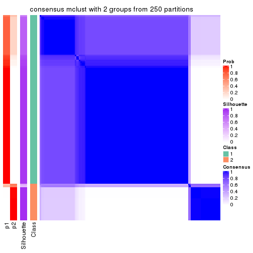</p>

</div>
<div id='tab-MAD-mclust-consensus-heatmap-2'>
<pre><code class="r">consensus_heatmap(res, k = 3)
</code></pre>

<p>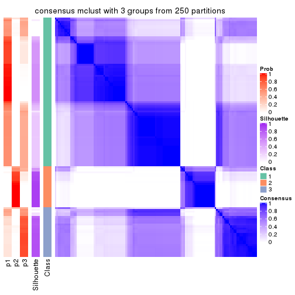</p>

</div>
<div id='tab-MAD-mclust-consensus-heatmap-3'>
<pre><code class="r">consensus_heatmap(res, k = 4)
</code></pre>

<p>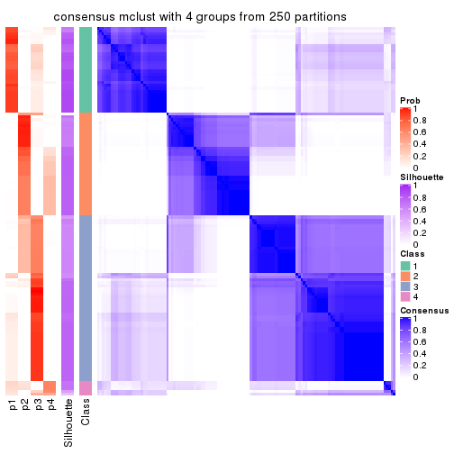</p>

</div>
<div id='tab-MAD-mclust-consensus-heatmap-4'>
<pre><code class="r">consensus_heatmap(res, k = 5)
</code></pre>

<p>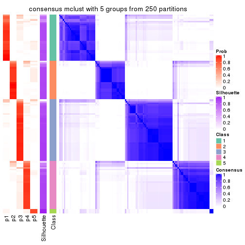</p>

</div>
<div id='tab-MAD-mclust-consensus-heatmap-5'>
<pre><code class="r">consensus_heatmap(res, k = 6)
</code></pre>

<p>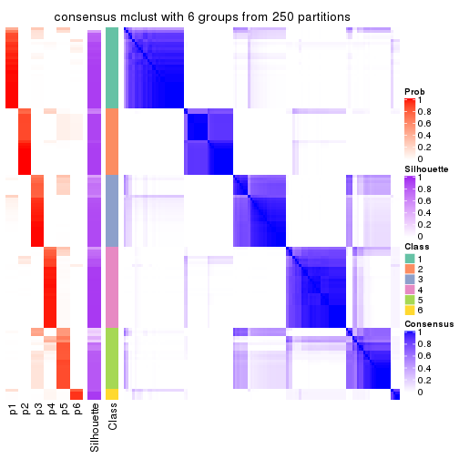</p>

</div>
</div>

Heatmaps for the membership of samples in all partitions to see how consistent they are:


<script>
$( function() {
	$( '#tabs-MAD-mclust-membership-heatmap' ).tabs();
} );
</script>
<div id='tabs-MAD-mclust-membership-heatmap'>
<ul>
<li><a href='#tab-MAD-mclust-membership-heatmap-1'>k = 2</a></li>
<li><a href='#tab-MAD-mclust-membership-heatmap-2'>k = 3</a></li>
<li><a href='#tab-MAD-mclust-membership-heatmap-3'>k = 4</a></li>
<li><a href='#tab-MAD-mclust-membership-heatmap-4'>k = 5</a></li>
<li><a href='#tab-MAD-mclust-membership-heatmap-5'>k = 6</a></li>
</ul>
<div id='tab-MAD-mclust-membership-heatmap-1'>
<pre><code class="r">membership_heatmap(res, k = 2)
</code></pre>

<p>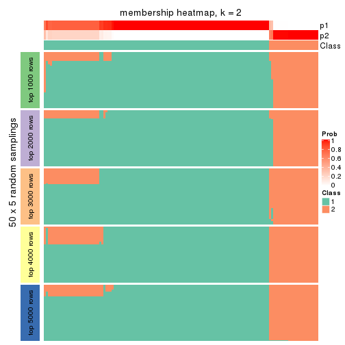</p>

</div>
<div id='tab-MAD-mclust-membership-heatmap-2'>
<pre><code class="r">membership_heatmap(res, k = 3)
</code></pre>

<p>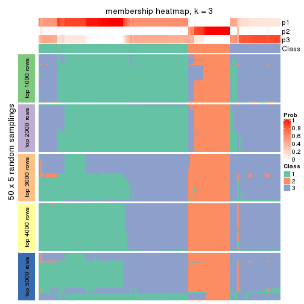</p>

</div>
<div id='tab-MAD-mclust-membership-heatmap-3'>
<pre><code class="r">membership_heatmap(res, k = 4)
</code></pre>

<p>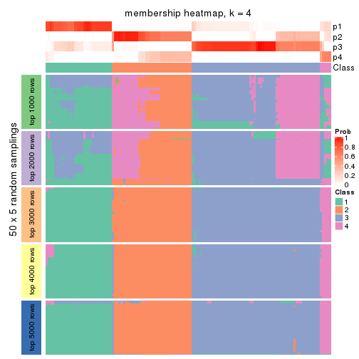</p>

</div>
<div id='tab-MAD-mclust-membership-heatmap-4'>
<pre><code class="r">membership_heatmap(res, k = 5)
</code></pre>

<p>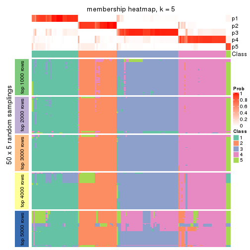</p>

</div>
<div id='tab-MAD-mclust-membership-heatmap-5'>
<pre><code class="r">membership_heatmap(res, k = 6)
</code></pre>

<p>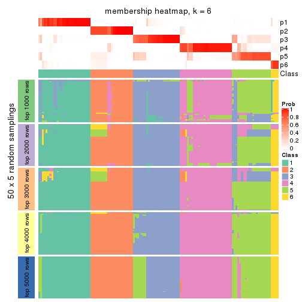</p>

</div>
</div>

As soon as we have had the classes for columns, we can look for signatures
which are significantly different between classes which can be candidate marks
for certain classes. Following are the heatmaps for signatures.


Signature heatmaps where rows are scaled:


<script>
$( function() {
	$( '#tabs-MAD-mclust-get-signatures' ).tabs();
} );
</script>
<div id='tabs-MAD-mclust-get-signatures'>
<ul>
<li><a href='#tab-MAD-mclust-get-signatures-1'>k = 2</a></li>
<li><a href='#tab-MAD-mclust-get-signatures-2'>k = 3</a></li>
<li><a href='#tab-MAD-mclust-get-signatures-3'>k = 4</a></li>
<li><a href='#tab-MAD-mclust-get-signatures-4'>k = 5</a></li>
<li><a href='#tab-MAD-mclust-get-signatures-5'>k = 6</a></li>
</ul>
<div id='tab-MAD-mclust-get-signatures-1'>
<pre><code class="r">get_signatures(res, k = 2)
</code></pre>

<p>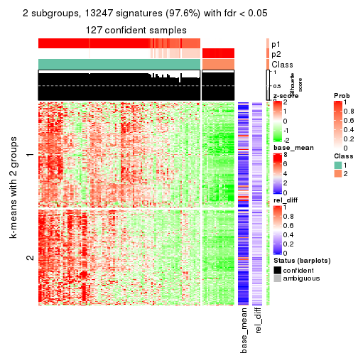</p>

</div>
<div id='tab-MAD-mclust-get-signatures-2'>
<pre><code class="r">get_signatures(res, k = 3)
</code></pre>

<p>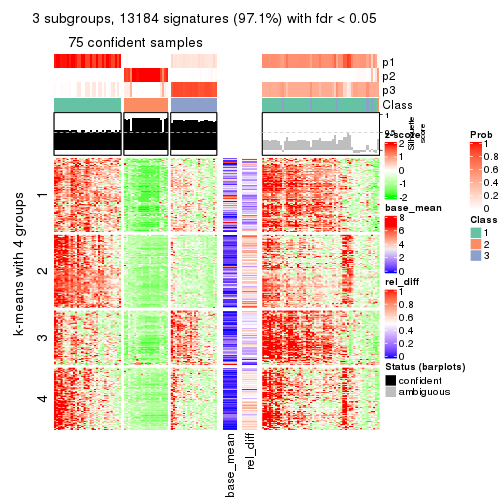</p>

</div>
<div id='tab-MAD-mclust-get-signatures-3'>
<pre><code class="r">get_signatures(res, k = 4)
</code></pre>

<p>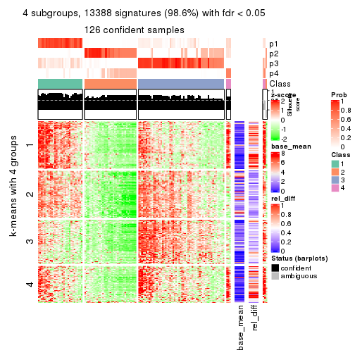</p>

</div>
<div id='tab-MAD-mclust-get-signatures-4'>
<pre><code class="r">get_signatures(res, k = 5)
</code></pre>

<p>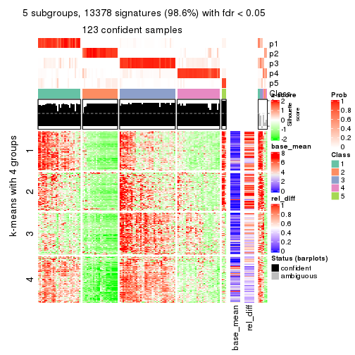</p>

</div>
<div id='tab-MAD-mclust-get-signatures-5'>
<pre><code class="r">get_signatures(res, k = 6)
</code></pre>

<p>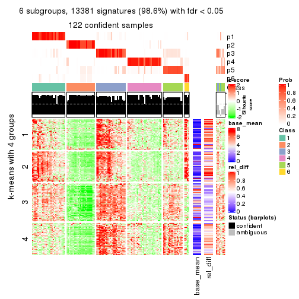</p>

</div>
</div>


Signature heatmaps where rows are not scaled:


<script>
$( function() {
	$( '#tabs-MAD-mclust-get-signatures-no-scale' ).tabs();
} );
</script>
<div id='tabs-MAD-mclust-get-signatures-no-scale'>
<ul>
<li><a href='#tab-MAD-mclust-get-signatures-no-scale-1'>k = 2</a></li>
<li><a href='#tab-MAD-mclust-get-signatures-no-scale-2'>k = 3</a></li>
<li><a href='#tab-MAD-mclust-get-signatures-no-scale-3'>k = 4</a></li>
<li><a href='#tab-MAD-mclust-get-signatures-no-scale-4'>k = 5</a></li>
<li><a href='#tab-MAD-mclust-get-signatures-no-scale-5'>k = 6</a></li>
</ul>
<div id='tab-MAD-mclust-get-signatures-no-scale-1'>
<pre><code class="r">get_signatures(res, k = 2, scale_rows = FALSE)
</code></pre>

<p>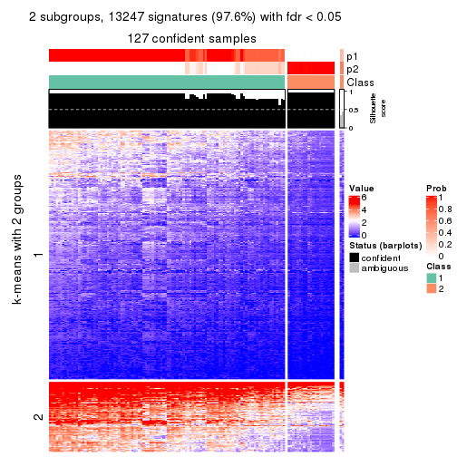</p>

</div>
<div id='tab-MAD-mclust-get-signatures-no-scale-2'>
<pre><code class="r">get_signatures(res, k = 3, scale_rows = FALSE)
</code></pre>

<p>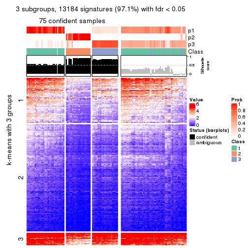</p>

</div>
<div id='tab-MAD-mclust-get-signatures-no-scale-3'>
<pre><code class="r">get_signatures(res, k = 4, scale_rows = FALSE)
</code></pre>

<p>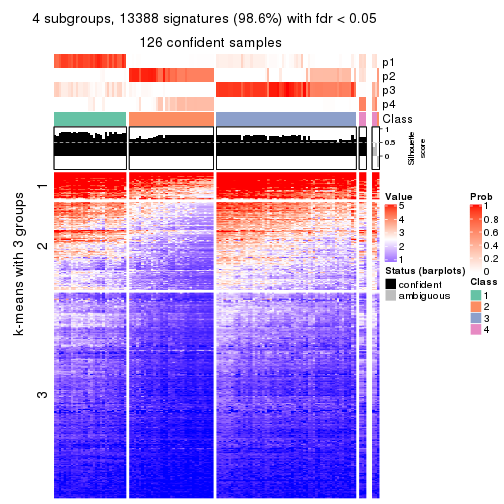</p>

</div>
<div id='tab-MAD-mclust-get-signatures-no-scale-4'>
<pre><code class="r">get_signatures(res, k = 5, scale_rows = FALSE)
</code></pre>

<p>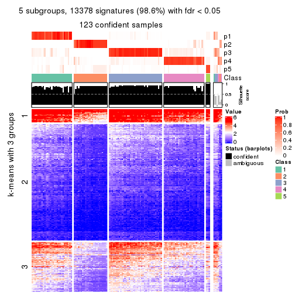</p>

</div>
<div id='tab-MAD-mclust-get-signatures-no-scale-5'>
<pre><code class="r">get_signatures(res, k = 6, scale_rows = FALSE)
</code></pre>

<p>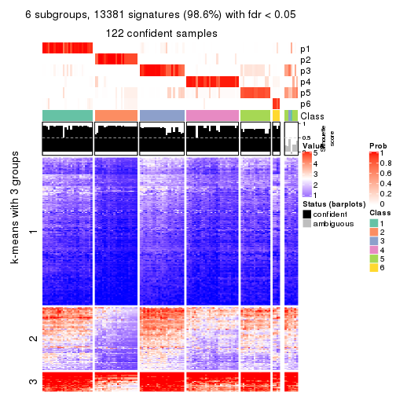</p>

</div>
</div>


Compare the overlap of signatures from different k:

```r
compare_signatures(res)
```

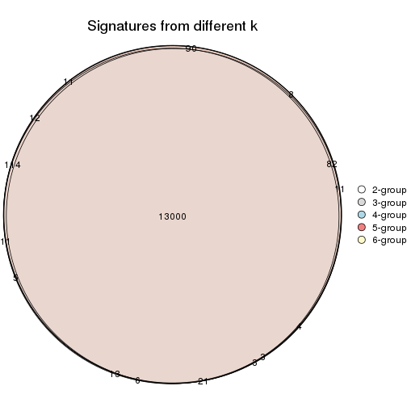

`get_signature()` returns a data frame invisibly. TO get the list of signatures, the function
call should be assigned to a variable explicitly. In following code, if `plot` argument is set
to `FALSE`, no heatmap is plotted while only the differential analysis is performed.

```r
# code only for demonstration
tb = get_signature(res, k = ..., plot = FALSE)
```

An example of the output of `tb` is:

```
#>   which_row         fdr    mean_1    mean_2 scaled_mean_1 scaled_mean_2 km
#> 1        38 0.042760348  8.373488  9.131774    -0.5533452     0.5164555  1
#> 2        40 0.018707592  7.106213  8.469186    -0.6173731     0.5762149  1
#> 3        55 0.019134737 10.221463 11.207825    -0.6159697     0.5749050  1
#> 4        59 0.006059896  5.921854  7.869574    -0.6899429     0.6439467  1
#> 5        60 0.018055526  8.928898 10.211722    -0.6204761     0.5791110  1
#> 6        98 0.009384629 15.714769 14.887706     0.6635654    -0.6193277  2
...
```

The columns in `tb` are:

1. `which_row`: row indices corresponding to the input matrix.
2. `fdr`: FDR for the differential test. 
3. `mean_x`: The mean value in group x.
4. `scaled_mean_x`: The mean value in group x after rows are scaled.
5. `km`: Row groups if k-means clustering is applied to rows.


UMAP plot which shows how samples are separated.


<script>
$( function() {
	$( '#tabs-MAD-mclust-dimension-reduction' ).tabs();
} );
</script>
<div id='tabs-MAD-mclust-dimension-reduction'>
<ul>
<li><a href='#tab-MAD-mclust-dimension-reduction-1'>k = 2</a></li>
<li><a href='#tab-MAD-mclust-dimension-reduction-2'>k = 3</a></li>
<li><a href='#tab-MAD-mclust-dimension-reduction-3'>k = 4</a></li>
<li><a href='#tab-MAD-mclust-dimension-reduction-4'>k = 5</a></li>
<li><a href='#tab-MAD-mclust-dimension-reduction-5'>k = 6</a></li>
</ul>
<div id='tab-MAD-mclust-dimension-reduction-1'>
<pre><code class="r">dimension_reduction(res, k = 2, method = &quot;UMAP&quot;)
</code></pre>

<p>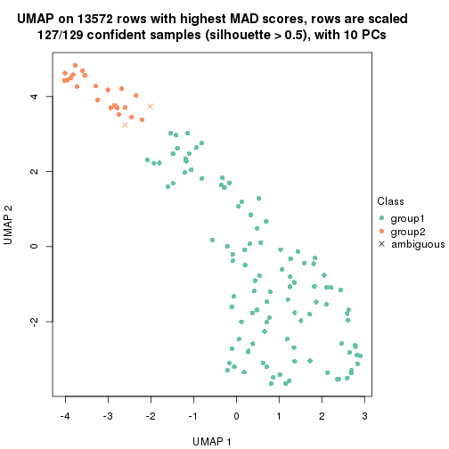</p>

</div>
<div id='tab-MAD-mclust-dimension-reduction-2'>
<pre><code class="r">dimension_reduction(res, k = 3, method = &quot;UMAP&quot;)
</code></pre>

<p>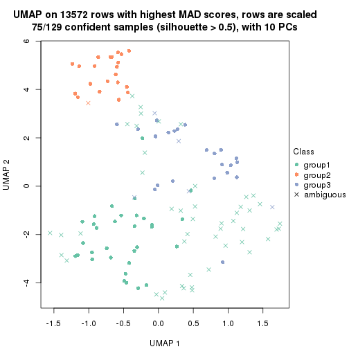</p>

</div>
<div id='tab-MAD-mclust-dimension-reduction-3'>
<pre><code class="r">dimension_reduction(res, k = 4, method = &quot;UMAP&quot;)
</code></pre>

<p>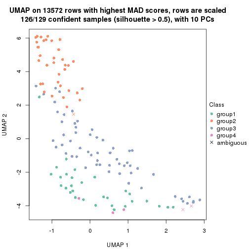</p>

</div>
<div id='tab-MAD-mclust-dimension-reduction-4'>
<pre><code class="r">dimension_reduction(res, k = 5, method = &quot;UMAP&quot;)
</code></pre>

<p>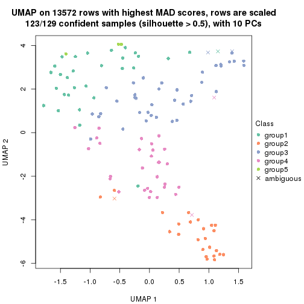</p>

</div>
<div id='tab-MAD-mclust-dimension-reduction-5'>
<pre><code class="r">dimension_reduction(res, k = 6, method = &quot;UMAP&quot;)
</code></pre>

<p>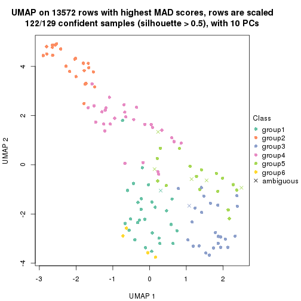</p>

</div>
</div>


Following heatmap shows how subgroups are split when increasing `k`:

```r
collect_classes(res)
```

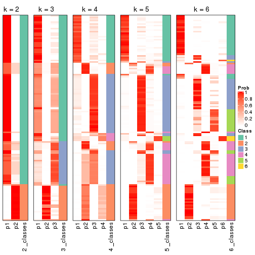


If matrix rows can be associated to genes, consider to use `GO_Enrichment(res,
...)` to perform function enrichment for the signature genes.


 

---------------------------------------------------


### MAD:NMF


The object with results only for a single top-value method and a single partition method 
can be extracted as:

```r
res = res_list["MAD", "NMF"]
# you can also extract it by
# res = res_list["MAD:NMF"]
```

A summary of `res` and all the functions that can be applied to it:

```r
res
```

```
#> A 'ConsensusPartition' object with k = 2, 3, 4, 5, 6.
#>   On a matrix with 13572 rows and 129 columns.
#>   Top rows (1000, 2000, 3000, 4000, 5000) are extracted by 'MAD' method.
#>   Subgroups are detected by 'NMF' method.
#>   Performed in total 1250 partitions by row resampling.
#>   Best k for subgroups seems to be 2.
#> 
#> Following methods can be applied to this 'ConsensusPartition' object:
#>  [1] "cola_report"             "collect_classes"         "collect_plots"          
#>  [4] "collect_stats"           "colnames"                "compare_signatures"     
#>  [7] "consensus_heatmap"       "dimension_reduction"     "functional_enrichment"  
#> [10] "get_anno_col"            "get_anno"                "get_classes"            
#> [13] "get_consensus"           "get_matrix"              "get_membership"         
#> [16] "get_param"               "get_signatures"          "get_stats"              
#> [19] "is_best_k"               "is_stable_k"             "membership_heatmap"     
#> [22] "ncol"                    "nrow"                    "plot_ecdf"              
#> [25] "rownames"                "select_partition_number" "show"                   
#> [28] "suggest_best_k"          "test_to_known_factors"
```

`collect_plots()` function collects all the plots made from `res` for all `k` (number of partitions)
into one single page to provide an easy and fast comparison between different `k`.

```r
collect_plots(res)
```

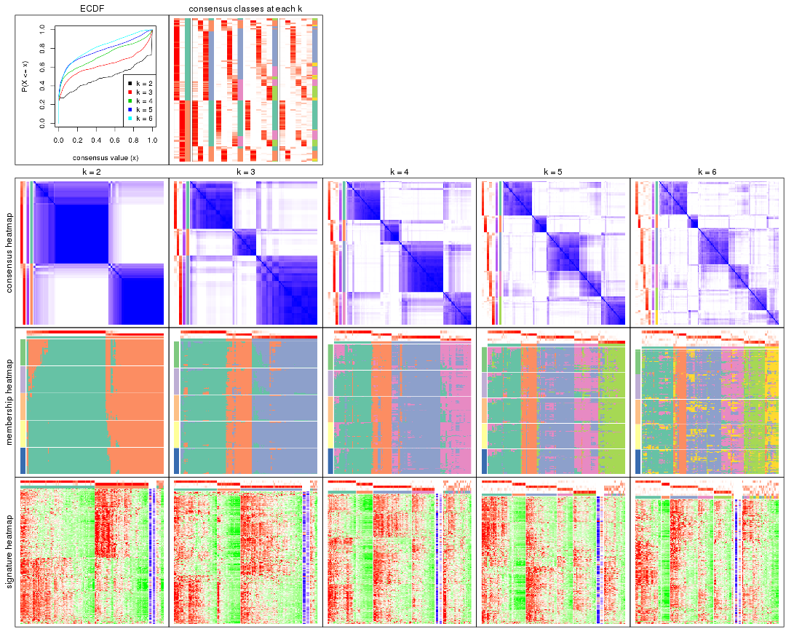

The plots are:

- The first row: a plot of the ECDF (Empirical cumulative distribution
  function) curves of the consensus matrix for each `k` and the heatmap of
  predicted classes for each `k`.
- The second row: heatmaps of the consensus matrix for each `k`.
- The third row: heatmaps of the membership matrix for each `k`.
- The fouth row: heatmaps of the signatures for each `k`.

All the plots in panels can be made by individual functions and they are
plotted later in this section.

`select_partition_number()` produces several plots showing different
statistics for choosing "optimized" `k`. There are following statistics:

- ECDF curves of the consensus matrix for each `k`;
- 1-PAC. [The PAC
  score](https://en.wikipedia.org/wiki/Consensus_clustering#Over-interpretation_potential_of_consensus_clustering)
  measures the proportion of the ambiguous subgrouping.
- Mean silhouette score.
- Concordance. The mean probability of fiting the consensus class ids in all
  partitions.
- Area increased. Denote $A_k$ as the area under the ECDF curve for current
  `k`, the area increased is defined as $A_k - A_{k-1}$.
- Rand index. The percent of pairs of samples that are both in a same cluster
  or both are not in a same cluster in the partition of k and k-1.
- Jaccard index. The ratio of pairs of samples are both in a same cluster in
  the partition of k and k-1 and the pairs of samples are both in a same
  cluster in the partition k or k-1.

The detailed explanations of these statistics can be found in [the cola
vignette](http://bioconductor.org/packages/devel/bioc/vignettes/cola/inst/doc/cola.html#toc_13).

Generally speaking, lower PAC score, higher mean silhouette score or higher
concordance corresponds to better partition. Rand index and Jaccard index
measure how similar the current partition is compared to partition with `k-1`.
If they are too similar, we won't accept `k` is better than `k-1`.

```r
select_partition_number(res)
```

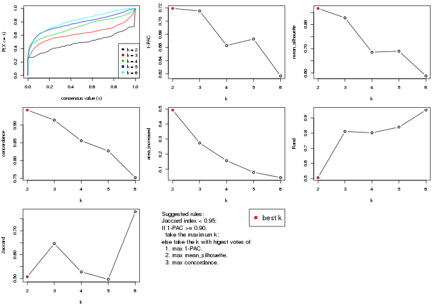

The numeric values for all these statistics can be obtained by `get_stats()`.

```r
get_stats(res)
```

```
#>   k 1-PAC mean_silhouette concordance area_increased  Rand Jaccard
#> 2 2 0.719           0.866       0.942         0.4927 0.507   0.507
#> 3 3 0.715           0.827       0.914         0.2738 0.811   0.646
#> 4 4 0.663           0.686       0.856         0.1562 0.802   0.527
#> 5 5 0.673           0.690       0.827         0.0791 0.840   0.496
#> 6 6 0.617           0.588       0.752         0.0436 0.952   0.780
```

`suggest_best_k()` suggests the best $k$ based on these statistics. The rules are as follows:

- All $k$ with Jaccard index larger than 0.95 are removed because the increase of
  the partition number does not provides enough extra information. If all $k$ are removed,
  the best $k$ is assigned by `NA`.
- For $k$ with 1-PAC larger than 0.9, the maximal $k$ is taken as the "best k". Other $k$ is called "optional k".
- If it does not fit the second rule. The $k$ with the highest vote of highest
  1-PAC, mean silhouette and concordance is taken as the "best k".

```r
suggest_best_k(res)
```

```
#> [1] 2
```


Following shows the table of the partitions (You need to click the **show/hide
code output** link to see it). The membership matrix (columns with name `p*`)
is inferred by
[`clue::cl_consensus()`](https://www.rdocumentation.org/link/cl_consensus?package=clue)
function with the `SE` method. Basically the value in the membership matrix
represents the probability to belong to a certain group. The finall class
label for an item is determined with the group with highest probability it
belongs to.

In `get_classes()` function, the entropy is calculated from the membership
matrix and the silhouette score is calculated from the consensus matrix.


<script>
$( function() {
	$( '#tabs-MAD-NMF-get-classes' ).tabs();
} );
</script>
<div id='tabs-MAD-NMF-get-classes'>
<ul>
<li><a href='#tab-MAD-NMF-get-classes-1'>k = 2</a></li>
<li><a href='#tab-MAD-NMF-get-classes-2'>k = 3</a></li>
<li><a href='#tab-MAD-NMF-get-classes-3'>k = 4</a></li>
<li><a href='#tab-MAD-NMF-get-classes-4'>k = 5</a></li>
<li><a href='#tab-MAD-NMF-get-classes-5'>k = 6</a></li>
</ul>

<div id='tab-MAD-NMF-get-classes-1'>
<p><a id='tab-MAD-NMF-get-classes-1-a' style='color:#0366d6' href='#'>show/hide code output</a></p>
<pre><code class="r">cbind(get_classes(res, k = 2), get_membership(res, k = 2))
</code></pre>

<pre><code>#&gt;            class entropy silhouette    p1    p2
#&gt; SRR1656463     1  0.0000     0.9326 1.000 0.000
#&gt; SRR1656464     2  0.0000     0.9373 0.000 1.000
#&gt; SRR1656462     1  0.0000     0.9326 1.000 0.000
#&gt; SRR1656465     1  0.0000     0.9326 1.000 0.000
#&gt; SRR1656467     1  0.0000     0.9326 1.000 0.000
#&gt; SRR1656466     1  0.0000     0.9326 1.000 0.000
#&gt; SRR1656468     1  0.0000     0.9326 1.000 0.000
#&gt; SRR1656472     2  0.0000     0.9373 0.000 1.000
#&gt; SRR1656471     1  0.0000     0.9326 1.000 0.000
#&gt; SRR1656470     1  0.0000     0.9326 1.000 0.000
#&gt; SRR1656469     1  0.0000     0.9326 1.000 0.000
#&gt; SRR1656473     2  0.6438     0.7807 0.164 0.836
#&gt; SRR1656474     2  0.5178     0.8358 0.116 0.884
#&gt; SRR1656475     1  0.9795     0.2363 0.584 0.416
#&gt; SRR1656478     2  0.0000     0.9373 0.000 1.000
#&gt; SRR1656477     1  0.0000     0.9326 1.000 0.000
#&gt; SRR1656479     1  0.9732     0.3771 0.596 0.404
#&gt; SRR1656480     1  0.0000     0.9326 1.000 0.000
#&gt; SRR1656476     1  0.0000     0.9326 1.000 0.000
#&gt; SRR1656481     1  0.0000     0.9326 1.000 0.000
#&gt; SRR1656482     1  0.0000     0.9326 1.000 0.000
#&gt; SRR1656483     1  0.0000     0.9326 1.000 0.000
#&gt; SRR1656485     1  0.0000     0.9326 1.000 0.000
#&gt; SRR1656487     1  0.0000     0.9326 1.000 0.000
#&gt; SRR1656486     2  0.9754     0.2632 0.408 0.592
#&gt; SRR1656488     1  0.0000     0.9326 1.000 0.000
#&gt; SRR1656484     2  0.7528     0.7001 0.216 0.784
#&gt; SRR1656489     2  0.0000     0.9373 0.000 1.000
#&gt; SRR1656491     1  0.0000     0.9326 1.000 0.000
#&gt; SRR1656490     2  0.9977     0.0328 0.472 0.528
#&gt; SRR1656492     1  0.7219     0.7643 0.800 0.200
#&gt; SRR1656493     2  0.0000     0.9373 0.000 1.000
#&gt; SRR1656495     2  0.0000     0.9373 0.000 1.000
#&gt; SRR1656496     1  0.7815     0.7228 0.768 0.232
#&gt; SRR1656494     1  0.3584     0.8799 0.932 0.068
#&gt; SRR1656497     1  0.0000     0.9326 1.000 0.000
#&gt; SRR1656499     1  0.0000     0.9326 1.000 0.000
#&gt; SRR1656500     1  0.3431     0.8926 0.936 0.064
#&gt; SRR1656501     2  0.6973     0.7427 0.188 0.812
#&gt; SRR1656498     2  0.0000     0.9373 0.000 1.000
#&gt; SRR1656504     1  0.9323     0.5164 0.652 0.348
#&gt; SRR1656502     2  0.0000     0.9373 0.000 1.000
#&gt; SRR1656503     2  0.2948     0.8975 0.052 0.948
#&gt; SRR1656507     2  0.0000     0.9373 0.000 1.000
#&gt; SRR1656508     2  0.0000     0.9373 0.000 1.000
#&gt; SRR1656505     1  0.0000     0.9326 1.000 0.000
#&gt; SRR1656506     1  0.0000     0.9326 1.000 0.000
#&gt; SRR1656509     1  0.0000     0.9326 1.000 0.000
#&gt; SRR1656510     1  0.4431     0.8718 0.908 0.092
#&gt; SRR1656511     2  0.0000     0.9373 0.000 1.000
#&gt; SRR1656513     2  0.0376     0.9347 0.004 0.996
#&gt; SRR1656512     2  0.0000     0.9373 0.000 1.000
#&gt; SRR1656514     2  0.4939     0.8466 0.108 0.892
#&gt; SRR1656515     1  0.0000     0.9326 1.000 0.000
#&gt; SRR1656516     2  0.3733     0.8798 0.072 0.928
#&gt; SRR1656518     2  0.0000     0.9373 0.000 1.000
#&gt; SRR1656517     2  0.0000     0.9373 0.000 1.000
#&gt; SRR1656519     1  0.0672     0.9280 0.992 0.008
#&gt; SRR1656522     2  0.0000     0.9373 0.000 1.000
#&gt; SRR1656523     1  0.8813     0.6121 0.700 0.300
#&gt; SRR1656521     2  0.0000     0.9373 0.000 1.000
#&gt; SRR1656520     1  0.0000     0.9326 1.000 0.000
#&gt; SRR1656524     2  0.0000     0.9373 0.000 1.000
#&gt; SRR1656525     1  0.0000     0.9326 1.000 0.000
#&gt; SRR1656526     1  0.0000     0.9326 1.000 0.000
#&gt; SRR1656527     2  0.0000     0.9373 0.000 1.000
#&gt; SRR1656530     1  0.0000     0.9326 1.000 0.000
#&gt; SRR1656529     1  0.0000     0.9326 1.000 0.000
#&gt; SRR1656531     2  0.0000     0.9373 0.000 1.000
#&gt; SRR1656528     1  0.0000     0.9326 1.000 0.000
#&gt; SRR1656534     1  0.7299     0.7596 0.796 0.204
#&gt; SRR1656533     2  0.0000     0.9373 0.000 1.000
#&gt; SRR1656536     1  0.0000     0.9326 1.000 0.000
#&gt; SRR1656532     2  0.0000     0.9373 0.000 1.000
#&gt; SRR1656537     2  0.0000     0.9373 0.000 1.000
#&gt; SRR1656538     1  0.7674     0.7337 0.776 0.224
#&gt; SRR1656535     2  0.0000     0.9373 0.000 1.000
#&gt; SRR1656539     1  0.0000     0.9326 1.000 0.000
#&gt; SRR1656544     1  0.0000     0.9326 1.000 0.000
#&gt; SRR1656542     1  0.5629     0.8363 0.868 0.132
#&gt; SRR1656543     1  0.0000     0.9326 1.000 0.000
#&gt; SRR1656545     2  0.0000     0.9373 0.000 1.000
#&gt; SRR1656540     1  0.0000     0.9326 1.000 0.000
#&gt; SRR1656546     2  0.0000     0.9373 0.000 1.000
#&gt; SRR1656541     1  0.0000     0.9326 1.000 0.000
#&gt; SRR1656547     1  0.0000     0.9326 1.000 0.000
#&gt; SRR1656548     1  0.4161     0.8780 0.916 0.084
#&gt; SRR1656549     2  0.0000     0.9373 0.000 1.000
#&gt; SRR1656551     1  0.0000     0.9326 1.000 0.000
#&gt; SRR1656553     1  0.4562     0.8690 0.904 0.096
#&gt; SRR1656550     1  0.0000     0.9326 1.000 0.000
#&gt; SRR1656552     1  0.7219     0.7643 0.800 0.200
#&gt; SRR1656554     1  0.0000     0.9326 1.000 0.000
#&gt; SRR1656555     1  0.0000     0.9326 1.000 0.000
#&gt; SRR1656556     1  0.0000     0.9326 1.000 0.000
#&gt; SRR1656557     1  0.0000     0.9326 1.000 0.000
#&gt; SRR1656558     2  0.0000     0.9373 0.000 1.000
#&gt; SRR1656559     2  0.0000     0.9373 0.000 1.000
#&gt; SRR1656560     1  0.0000     0.9326 1.000 0.000
#&gt; SRR1656561     1  0.8267     0.6803 0.740 0.260
#&gt; SRR1656562     1  0.8955     0.5261 0.688 0.312
#&gt; SRR1656563     2  0.0000     0.9373 0.000 1.000
#&gt; SRR1656564     2  0.0000     0.9373 0.000 1.000
#&gt; SRR1656565     2  0.8909     0.5292 0.308 0.692
#&gt; SRR1656566     2  0.0000     0.9373 0.000 1.000
#&gt; SRR1656568     2  0.0000     0.9373 0.000 1.000
#&gt; SRR1656567     1  0.0000     0.9326 1.000 0.000
#&gt; SRR1656569     1  0.0000     0.9326 1.000 0.000
#&gt; SRR1656570     2  0.0000     0.9373 0.000 1.000
#&gt; SRR1656571     2  0.0376     0.9347 0.004 0.996
#&gt; SRR1656573     1  0.4022     0.8811 0.920 0.080
#&gt; SRR1656572     2  0.0000     0.9373 0.000 1.000
#&gt; SRR1656574     2  0.0000     0.9373 0.000 1.000
#&gt; SRR1656575     2  0.0000     0.9373 0.000 1.000
#&gt; SRR1656576     1  0.0000     0.9326 1.000 0.000
#&gt; SRR1656578     2  0.0000     0.9373 0.000 1.000
#&gt; SRR1656577     2  0.0000     0.9373 0.000 1.000
#&gt; SRR1656579     1  0.0000     0.9326 1.000 0.000
#&gt; SRR1656580     1  0.9460     0.4792 0.636 0.364
#&gt; SRR1656581     1  0.7219     0.7643 0.800 0.200
#&gt; SRR1656582     1  0.6623     0.7958 0.828 0.172
#&gt; SRR1656585     1  0.0000     0.9326 1.000 0.000
#&gt; SRR1656584     2  0.0000     0.9373 0.000 1.000
#&gt; SRR1656583     1  0.0000     0.9326 1.000 0.000
#&gt; SRR1656586     2  0.9850     0.2876 0.428 0.572
#&gt; SRR1656587     2  0.6343     0.7956 0.160 0.840
#&gt; SRR1656588     1  0.0000     0.9326 1.000 0.000
#&gt; SRR1656589     2  0.9323     0.4868 0.348 0.652
#&gt; SRR1656590     2  0.0000     0.9373 0.000 1.000
</code></pre>

<script>
$('#tab-MAD-NMF-get-classes-1-a').parent().next().next().hide();
$('#tab-MAD-NMF-get-classes-1-a').click(function(){
  $('#tab-MAD-NMF-get-classes-1-a').parent().next().next().toggle();
  return(false);
});
</script>
</div>

<div id='tab-MAD-NMF-get-classes-2'>
<p><a id='tab-MAD-NMF-get-classes-2-a' style='color:#0366d6' href='#'>show/hide code output</a></p>
<pre><code class="r">cbind(get_classes(res, k = 3), get_membership(res, k = 3))
</code></pre>

<pre><code>#&gt;            class entropy silhouette    p1    p2    p3
#&gt; SRR1656463     3  0.4346     0.7506 0.000 0.184 0.816
#&gt; SRR1656464     1  0.4235     0.7482 0.824 0.176 0.000
#&gt; SRR1656462     3  0.0424     0.8989 0.000 0.008 0.992
#&gt; SRR1656465     3  0.0424     0.8989 0.000 0.008 0.992
#&gt; SRR1656467     2  0.5397     0.5977 0.000 0.720 0.280
#&gt; SRR1656466     3  0.0237     0.9024 0.004 0.000 0.996
#&gt; SRR1656468     3  0.0424     0.9030 0.008 0.000 0.992
#&gt; SRR1656472     2  0.1163     0.8792 0.028 0.972 0.000
#&gt; SRR1656471     3  0.1964     0.8729 0.000 0.056 0.944
#&gt; SRR1656470     2  0.1643     0.8716 0.000 0.956 0.044
#&gt; SRR1656469     3  0.0747     0.9026 0.016 0.000 0.984
#&gt; SRR1656473     2  0.0424     0.8811 0.008 0.992 0.000
#&gt; SRR1656474     2  0.0592     0.8809 0.012 0.988 0.000
#&gt; SRR1656475     2  0.0000     0.8815 0.000 1.000 0.000
#&gt; SRR1656478     1  0.1031     0.9114 0.976 0.000 0.024
#&gt; SRR1656477     3  0.4121     0.7785 0.000 0.168 0.832
#&gt; SRR1656479     1  0.6295     0.0248 0.528 0.000 0.472
#&gt; SRR1656480     3  0.2625     0.8531 0.000 0.084 0.916
#&gt; SRR1656476     3  0.0424     0.9030 0.008 0.000 0.992
#&gt; SRR1656481     3  0.0592     0.8971 0.000 0.012 0.988
#&gt; SRR1656482     2  0.1529     0.8735 0.000 0.960 0.040
#&gt; SRR1656483     2  0.2165     0.8611 0.000 0.936 0.064
#&gt; SRR1656485     3  0.0000     0.9015 0.000 0.000 1.000
#&gt; SRR1656487     3  0.0424     0.8989 0.000 0.008 0.992
#&gt; SRR1656486     1  0.3619     0.8231 0.864 0.000 0.136
#&gt; SRR1656488     3  0.0892     0.9019 0.020 0.000 0.980
#&gt; SRR1656484     1  0.1860     0.9013 0.948 0.000 0.052
#&gt; SRR1656489     1  0.1860     0.9011 0.948 0.000 0.052
#&gt; SRR1656491     3  0.0892     0.9019 0.020 0.000 0.980
#&gt; SRR1656490     1  0.4654     0.7272 0.792 0.000 0.208
#&gt; SRR1656492     3  0.4654     0.7523 0.208 0.000 0.792
#&gt; SRR1656493     1  0.0424     0.9031 0.992 0.008 0.000
#&gt; SRR1656495     1  0.4974     0.6551 0.764 0.236 0.000
#&gt; SRR1656496     3  0.5760     0.5692 0.328 0.000 0.672
#&gt; SRR1656494     2  0.0592     0.8797 0.000 0.988 0.012
#&gt; SRR1656497     2  0.1411     0.8750 0.000 0.964 0.036
#&gt; SRR1656499     3  0.0747     0.9026 0.016 0.000 0.984
#&gt; SRR1656500     3  0.1860     0.8887 0.052 0.000 0.948
#&gt; SRR1656501     1  0.3267     0.8448 0.884 0.000 0.116
#&gt; SRR1656498     1  0.0424     0.9031 0.992 0.008 0.000
#&gt; SRR1656504     3  0.6308     0.0713 0.492 0.000 0.508
#&gt; SRR1656502     2  0.1753     0.8736 0.048 0.952 0.000
#&gt; SRR1656503     1  0.1643     0.9052 0.956 0.000 0.044
#&gt; SRR1656507     1  0.1860     0.9010 0.948 0.000 0.052
#&gt; SRR1656508     1  0.0424     0.9037 0.992 0.008 0.000
#&gt; SRR1656505     3  0.0424     0.8989 0.000 0.008 0.992
#&gt; SRR1656506     3  0.0892     0.9019 0.020 0.000 0.980
#&gt; SRR1656509     2  0.6225     0.2043 0.000 0.568 0.432
#&gt; SRR1656510     3  0.2959     0.8573 0.100 0.000 0.900
#&gt; SRR1656511     1  0.0592     0.9115 0.988 0.000 0.012
#&gt; SRR1656513     2  0.1411     0.8776 0.036 0.964 0.000
#&gt; SRR1656512     2  0.4235     0.7718 0.176 0.824 0.000
#&gt; SRR1656514     1  0.5339     0.7893 0.824 0.080 0.096
#&gt; SRR1656515     3  0.4178     0.7729 0.000 0.172 0.828
#&gt; SRR1656516     1  0.2959     0.8608 0.900 0.000 0.100
#&gt; SRR1656518     1  0.1411     0.9084 0.964 0.000 0.036
#&gt; SRR1656517     1  0.0747     0.9119 0.984 0.000 0.016
#&gt; SRR1656519     3  0.0424     0.9030 0.008 0.000 0.992
#&gt; SRR1656522     1  0.0892     0.9123 0.980 0.000 0.020
#&gt; SRR1656523     3  0.6111     0.4013 0.396 0.000 0.604
#&gt; SRR1656521     1  0.0592     0.9115 0.988 0.000 0.012
#&gt; SRR1656520     3  0.1529     0.8824 0.000 0.040 0.960
#&gt; SRR1656524     1  0.1643     0.8829 0.956 0.044 0.000
#&gt; SRR1656525     3  0.1411     0.8958 0.036 0.000 0.964
#&gt; SRR1656526     3  0.0592     0.9030 0.012 0.000 0.988
#&gt; SRR1656527     1  0.2356     0.8636 0.928 0.072 0.000
#&gt; SRR1656530     3  0.1163     0.8993 0.028 0.000 0.972
#&gt; SRR1656529     3  0.0424     0.9030 0.008 0.000 0.992
#&gt; SRR1656531     1  0.1643     0.8829 0.956 0.044 0.000
#&gt; SRR1656528     3  0.0592     0.9030 0.012 0.000 0.988
#&gt; SRR1656534     3  0.4452     0.7726 0.192 0.000 0.808
#&gt; SRR1656533     1  0.0592     0.9115 0.988 0.000 0.012
#&gt; SRR1656536     3  0.0592     0.8971 0.000 0.012 0.988
#&gt; SRR1656532     1  0.3879     0.7779 0.848 0.152 0.000
#&gt; SRR1656537     1  0.1411     0.8876 0.964 0.036 0.000
#&gt; SRR1656538     3  0.5810     0.5359 0.336 0.000 0.664
#&gt; SRR1656535     1  0.0747     0.9119 0.984 0.000 0.016
#&gt; SRR1656539     3  0.0237     0.9003 0.000 0.004 0.996
#&gt; SRR1656544     3  0.1031     0.9007 0.024 0.000 0.976
#&gt; SRR1656542     3  0.2537     0.8720 0.080 0.000 0.920
#&gt; SRR1656543     3  0.0237     0.9024 0.004 0.000 0.996
#&gt; SRR1656545     2  0.2448     0.8594 0.076 0.924 0.000
#&gt; SRR1656540     3  0.2711     0.8509 0.000 0.088 0.912
#&gt; SRR1656546     1  0.1753     0.9033 0.952 0.000 0.048
#&gt; SRR1656541     3  0.0424     0.9030 0.008 0.000 0.992
#&gt; SRR1656547     3  0.0424     0.8989 0.000 0.008 0.992
#&gt; SRR1656548     3  0.2356     0.8770 0.072 0.000 0.928
#&gt; SRR1656549     1  0.0424     0.9102 0.992 0.000 0.008
#&gt; SRR1656551     3  0.0237     0.9003 0.000 0.004 0.996
#&gt; SRR1656553     3  0.2356     0.8774 0.072 0.000 0.928
#&gt; SRR1656550     3  0.2448     0.8585 0.000 0.076 0.924
#&gt; SRR1656552     3  0.4399     0.7776 0.188 0.000 0.812
#&gt; SRR1656554     3  0.0237     0.9024 0.004 0.000 0.996
#&gt; SRR1656555     3  0.1031     0.9007 0.024 0.000 0.976
#&gt; SRR1656556     3  0.4002     0.7855 0.000 0.160 0.840
#&gt; SRR1656557     3  0.0747     0.9026 0.016 0.000 0.984
#&gt; SRR1656558     1  0.0424     0.9102 0.992 0.000 0.008
#&gt; SRR1656559     1  0.0592     0.9116 0.988 0.000 0.012
#&gt; SRR1656560     3  0.0592     0.9031 0.012 0.000 0.988
#&gt; SRR1656561     3  0.6045     0.4331 0.380 0.000 0.620
#&gt; SRR1656562     2  0.7988     0.6543 0.144 0.656 0.200
#&gt; SRR1656563     1  0.1860     0.9010 0.948 0.000 0.052
#&gt; SRR1656564     2  0.6140     0.3485 0.404 0.596 0.000
#&gt; SRR1656565     2  0.7252     0.7029 0.196 0.704 0.100
#&gt; SRR1656566     1  0.0424     0.9031 0.992 0.008 0.000
#&gt; SRR1656568     1  0.2165     0.8695 0.936 0.064 0.000
#&gt; SRR1656567     3  0.2537     0.8559 0.000 0.080 0.920
#&gt; SRR1656569     3  0.0424     0.9030 0.008 0.000 0.992
#&gt; SRR1656570     1  0.1964     0.8982 0.944 0.000 0.056
#&gt; SRR1656571     2  0.1643     0.8753 0.044 0.956 0.000
#&gt; SRR1656573     3  0.2066     0.8847 0.060 0.000 0.940
#&gt; SRR1656572     1  0.1529     0.9067 0.960 0.000 0.040
#&gt; SRR1656574     1  0.0892     0.9118 0.980 0.000 0.020
#&gt; SRR1656575     1  0.1289     0.9094 0.968 0.000 0.032
#&gt; SRR1656576     3  0.0892     0.9019 0.020 0.000 0.980
#&gt; SRR1656578     2  0.3412     0.8243 0.124 0.876 0.000
#&gt; SRR1656577     1  0.0747     0.9119 0.984 0.000 0.016
#&gt; SRR1656579     3  0.0592     0.8971 0.000 0.012 0.988
#&gt; SRR1656580     1  0.6008     0.4015 0.628 0.000 0.372
#&gt; SRR1656581     3  0.4974     0.7200 0.236 0.000 0.764
#&gt; SRR1656582     3  0.3551     0.8319 0.132 0.000 0.868
#&gt; SRR1656585     3  0.5835     0.5041 0.000 0.340 0.660
#&gt; SRR1656584     1  0.0424     0.9102 0.992 0.000 0.008
#&gt; SRR1656583     2  0.1964     0.8656 0.000 0.944 0.056
#&gt; SRR1656586     2  0.0000     0.8815 0.000 1.000 0.000
#&gt; SRR1656587     2  0.2625     0.8559 0.084 0.916 0.000
#&gt; SRR1656588     3  0.3116     0.8344 0.000 0.108 0.892
#&gt; SRR1656589     2  0.0000     0.8815 0.000 1.000 0.000
#&gt; SRR1656590     1  0.2261     0.8653 0.932 0.068 0.000
</code></pre>

<script>
$('#tab-MAD-NMF-get-classes-2-a').parent().next().next().hide();
$('#tab-MAD-NMF-get-classes-2-a').click(function(){
  $('#tab-MAD-NMF-get-classes-2-a').parent().next().next().toggle();
  return(false);
});
</script>
</div>

<div id='tab-MAD-NMF-get-classes-3'>
<p><a id='tab-MAD-NMF-get-classes-3-a' style='color:#0366d6' href='#'>show/hide code output</a></p>
<pre><code class="r">cbind(get_classes(res, k = 4), get_membership(res, k = 4))
</code></pre>

<pre><code>#&gt;            class entropy silhouette    p1    p2    p3    p4
#&gt; SRR1656463     3  0.3710    0.70375 0.000 0.192 0.804 0.004
#&gt; SRR1656464     1  0.1339    0.82404 0.964 0.008 0.024 0.004
#&gt; SRR1656462     3  0.0188    0.85964 0.000 0.000 0.996 0.004
#&gt; SRR1656465     3  0.0188    0.85976 0.000 0.000 0.996 0.004
#&gt; SRR1656467     3  0.5292   -0.08887 0.000 0.480 0.512 0.008
#&gt; SRR1656466     3  0.0707    0.85782 0.000 0.000 0.980 0.020
#&gt; SRR1656468     3  0.3356    0.72595 0.000 0.000 0.824 0.176
#&gt; SRR1656472     2  0.6174    0.17192 0.460 0.496 0.040 0.004
#&gt; SRR1656471     3  0.0376    0.85872 0.000 0.004 0.992 0.004
#&gt; SRR1656470     2  0.0000    0.84853 0.000 1.000 0.000 0.000
#&gt; SRR1656469     3  0.3123    0.74156 0.000 0.000 0.844 0.156
#&gt; SRR1656473     2  0.0000    0.84853 0.000 1.000 0.000 0.000
#&gt; SRR1656474     2  0.0000    0.84853 0.000 1.000 0.000 0.000
#&gt; SRR1656475     2  0.0000    0.84853 0.000 1.000 0.000 0.000
#&gt; SRR1656478     1  0.0779    0.83630 0.980 0.000 0.004 0.016
#&gt; SRR1656477     3  0.1109    0.84632 0.000 0.028 0.968 0.004
#&gt; SRR1656479     4  0.2546    0.76315 0.028 0.000 0.060 0.912
#&gt; SRR1656480     3  0.0937    0.85758 0.000 0.012 0.976 0.012
#&gt; SRR1656476     4  0.3726    0.70109 0.000 0.000 0.212 0.788
#&gt; SRR1656481     3  0.0336    0.85928 0.000 0.000 0.992 0.008
#&gt; SRR1656482     2  0.4428    0.61828 0.000 0.720 0.276 0.004
#&gt; SRR1656483     3  0.5303    0.16195 0.004 0.448 0.544 0.004
#&gt; SRR1656485     3  0.0336    0.85995 0.000 0.000 0.992 0.008
#&gt; SRR1656487     3  0.0817    0.85700 0.000 0.000 0.976 0.024
#&gt; SRR1656486     4  0.2300    0.75177 0.064 0.000 0.016 0.920
#&gt; SRR1656488     3  0.1211    0.85047 0.000 0.000 0.960 0.040
#&gt; SRR1656484     1  0.4248    0.69822 0.768 0.000 0.012 0.220
#&gt; SRR1656489     1  0.2021    0.82528 0.932 0.000 0.012 0.056
#&gt; SRR1656491     4  0.4500    0.52424 0.000 0.000 0.316 0.684
#&gt; SRR1656490     4  0.5088    0.49471 0.288 0.000 0.024 0.688
#&gt; SRR1656492     4  0.5630    0.47363 0.032 0.000 0.360 0.608
#&gt; SRR1656493     1  0.0188    0.83501 0.996 0.000 0.000 0.004
#&gt; SRR1656495     1  0.2266    0.77681 0.912 0.084 0.000 0.004
#&gt; SRR1656496     4  0.4322    0.74953 0.044 0.000 0.152 0.804
#&gt; SRR1656494     2  0.5252    0.33232 0.004 0.572 0.420 0.004
#&gt; SRR1656497     2  0.2704    0.78745 0.000 0.876 0.000 0.124
#&gt; SRR1656499     3  0.0707    0.85777 0.000 0.000 0.980 0.020
#&gt; SRR1656500     3  0.0937    0.85767 0.012 0.000 0.976 0.012
#&gt; SRR1656501     4  0.5149    0.41261 0.336 0.000 0.016 0.648
#&gt; SRR1656498     1  0.0188    0.83501 0.996 0.000 0.000 0.004
#&gt; SRR1656504     4  0.0804    0.76213 0.012 0.000 0.008 0.980
#&gt; SRR1656502     1  0.5771   -0.12467 0.504 0.472 0.020 0.004
#&gt; SRR1656503     1  0.3032    0.79078 0.868 0.000 0.008 0.124
#&gt; SRR1656507     1  0.2473    0.81554 0.908 0.000 0.012 0.080
#&gt; SRR1656508     1  0.1792    0.82611 0.932 0.000 0.000 0.068
#&gt; SRR1656505     3  0.0592    0.85922 0.000 0.000 0.984 0.016
#&gt; SRR1656506     4  0.4250    0.60736 0.000 0.000 0.276 0.724
#&gt; SRR1656509     3  0.2861    0.78813 0.004 0.092 0.892 0.012
#&gt; SRR1656510     4  0.5517    0.35548 0.020 0.000 0.412 0.568
#&gt; SRR1656511     4  0.0921    0.75597 0.028 0.000 0.000 0.972
#&gt; SRR1656513     2  0.0188    0.84786 0.004 0.996 0.000 0.000
#&gt; SRR1656512     2  0.2081    0.81850 0.000 0.916 0.000 0.084
#&gt; SRR1656514     1  0.5165    0.35754 0.604 0.004 0.388 0.004
#&gt; SRR1656515     3  0.1545    0.84507 0.000 0.040 0.952 0.008
#&gt; SRR1656516     1  0.5658    0.46886 0.632 0.000 0.040 0.328
#&gt; SRR1656518     1  0.5099    0.42198 0.612 0.000 0.008 0.380
#&gt; SRR1656517     1  0.2530    0.79939 0.888 0.000 0.000 0.112
#&gt; SRR1656519     3  0.0188    0.85934 0.004 0.000 0.996 0.000
#&gt; SRR1656522     1  0.1209    0.82617 0.964 0.000 0.032 0.004
#&gt; SRR1656523     4  0.0657    0.76324 0.004 0.000 0.012 0.984
#&gt; SRR1656521     4  0.5147   -0.00283 0.460 0.000 0.004 0.536
#&gt; SRR1656520     3  0.0188    0.85964 0.000 0.000 0.996 0.004
#&gt; SRR1656524     1  0.0376    0.83443 0.992 0.004 0.000 0.004
#&gt; SRR1656525     3  0.4804    0.33124 0.000 0.000 0.616 0.384
#&gt; SRR1656526     4  0.0592    0.76358 0.000 0.000 0.016 0.984
#&gt; SRR1656527     1  0.0524    0.83493 0.988 0.008 0.000 0.004
#&gt; SRR1656530     3  0.3172    0.74271 0.000 0.000 0.840 0.160
#&gt; SRR1656529     3  0.4605    0.45449 0.000 0.000 0.664 0.336
#&gt; SRR1656531     1  0.0817    0.83302 0.976 0.000 0.000 0.024
#&gt; SRR1656528     3  0.4989    0.06063 0.000 0.000 0.528 0.472
#&gt; SRR1656534     3  0.1807    0.82974 0.052 0.000 0.940 0.008
#&gt; SRR1656533     1  0.3400    0.75125 0.820 0.000 0.000 0.180
#&gt; SRR1656536     3  0.0336    0.85995 0.000 0.000 0.992 0.008
#&gt; SRR1656532     1  0.0524    0.83086 0.988 0.008 0.000 0.004
#&gt; SRR1656537     1  0.0188    0.83501 0.996 0.000 0.000 0.004
#&gt; SRR1656538     4  0.6691    0.61507 0.152 0.000 0.236 0.612
#&gt; SRR1656535     4  0.4428    0.51140 0.276 0.000 0.004 0.720
#&gt; SRR1656539     3  0.0336    0.85995 0.000 0.000 0.992 0.008
#&gt; SRR1656544     3  0.0336    0.85995 0.000 0.000 0.992 0.008
#&gt; SRR1656542     3  0.2413    0.82496 0.020 0.000 0.916 0.064
#&gt; SRR1656543     3  0.0336    0.85928 0.000 0.000 0.992 0.008
#&gt; SRR1656545     2  0.3024    0.77271 0.000 0.852 0.000 0.148
#&gt; SRR1656540     3  0.0376    0.85923 0.004 0.000 0.992 0.004
#&gt; SRR1656546     1  0.5193    0.33674 0.580 0.000 0.008 0.412
#&gt; SRR1656541     3  0.4967    0.09724 0.000 0.000 0.548 0.452
#&gt; SRR1656547     3  0.1792    0.82893 0.000 0.000 0.932 0.068
#&gt; SRR1656548     4  0.3219    0.74126 0.000 0.000 0.164 0.836
#&gt; SRR1656549     4  0.4661    0.28219 0.348 0.000 0.000 0.652
#&gt; SRR1656551     3  0.1389    0.84625 0.000 0.000 0.952 0.048
#&gt; SRR1656553     3  0.1545    0.84094 0.040 0.000 0.952 0.008
#&gt; SRR1656550     3  0.0524    0.85970 0.000 0.004 0.988 0.008
#&gt; SRR1656552     4  0.2198    0.77016 0.008 0.000 0.072 0.920
#&gt; SRR1656554     3  0.4925    0.23712 0.000 0.000 0.572 0.428
#&gt; SRR1656555     4  0.2345    0.76545 0.000 0.000 0.100 0.900
#&gt; SRR1656556     3  0.0188    0.85892 0.000 0.004 0.996 0.000
#&gt; SRR1656557     3  0.0188    0.85964 0.000 0.000 0.996 0.004
#&gt; SRR1656558     1  0.0707    0.83604 0.980 0.000 0.000 0.020
#&gt; SRR1656559     1  0.0524    0.83547 0.988 0.000 0.008 0.004
#&gt; SRR1656560     3  0.1302    0.84830 0.000 0.000 0.956 0.044
#&gt; SRR1656561     4  0.1510    0.77121 0.016 0.000 0.028 0.956
#&gt; SRR1656562     2  0.1917    0.83697 0.012 0.944 0.008 0.036
#&gt; SRR1656563     4  0.2216    0.71621 0.092 0.000 0.000 0.908
#&gt; SRR1656564     2  0.3108    0.79644 0.016 0.872 0.000 0.112
#&gt; SRR1656565     2  0.3134    0.80024 0.024 0.884 0.088 0.004
#&gt; SRR1656566     1  0.0469    0.83615 0.988 0.000 0.000 0.012
#&gt; SRR1656568     1  0.1305    0.83210 0.960 0.004 0.000 0.036
#&gt; SRR1656567     3  0.0524    0.85994 0.000 0.004 0.988 0.008
#&gt; SRR1656569     4  0.4790    0.40424 0.000 0.000 0.380 0.620
#&gt; SRR1656570     4  0.1118    0.75266 0.036 0.000 0.000 0.964
#&gt; SRR1656571     2  0.0469    0.84626 0.012 0.988 0.000 0.000
#&gt; SRR1656573     4  0.4500    0.55054 0.000 0.000 0.316 0.684
#&gt; SRR1656572     1  0.5097    0.30098 0.568 0.000 0.004 0.428
#&gt; SRR1656574     1  0.2647    0.79526 0.880 0.000 0.000 0.120
#&gt; SRR1656575     1  0.1305    0.83273 0.960 0.000 0.004 0.036
#&gt; SRR1656576     4  0.3123    0.74194 0.000 0.000 0.156 0.844
#&gt; SRR1656578     2  0.3908    0.67857 0.212 0.784 0.000 0.004
#&gt; SRR1656577     1  0.0376    0.83550 0.992 0.000 0.004 0.004
#&gt; SRR1656579     3  0.5132    0.17888 0.000 0.004 0.548 0.448
#&gt; SRR1656580     1  0.7558    0.10994 0.488 0.000 0.256 0.256
#&gt; SRR1656581     4  0.0707    0.76458 0.000 0.000 0.020 0.980
#&gt; SRR1656582     4  0.1297    0.75948 0.000 0.016 0.020 0.964
#&gt; SRR1656585     3  0.6261   -0.05523 0.000 0.440 0.504 0.056
#&gt; SRR1656584     1  0.3123    0.77024 0.844 0.000 0.000 0.156
#&gt; SRR1656583     2  0.4978    0.42374 0.000 0.612 0.384 0.004
#&gt; SRR1656586     2  0.0000    0.84853 0.000 1.000 0.000 0.000
#&gt; SRR1656587     1  0.7146    0.32013 0.560 0.152 0.284 0.004
#&gt; SRR1656588     3  0.0188    0.85892 0.000 0.004 0.996 0.000
#&gt; SRR1656589     2  0.0336    0.84744 0.000 0.992 0.008 0.000
#&gt; SRR1656590     1  0.0376    0.83182 0.992 0.004 0.000 0.004
</code></pre>

<script>
$('#tab-MAD-NMF-get-classes-3-a').parent().next().next().hide();
$('#tab-MAD-NMF-get-classes-3-a').click(function(){
  $('#tab-MAD-NMF-get-classes-3-a').parent().next().next().toggle();
  return(false);
});
</script>
</div>

<div id='tab-MAD-NMF-get-classes-4'>
<p><a id='tab-MAD-NMF-get-classes-4-a' style='color:#0366d6' href='#'>show/hide code output</a></p>
<pre><code class="r">cbind(get_classes(res, k = 5), get_membership(res, k = 5))
</code></pre>

<pre><code>#&gt;            class entropy silhouette    p1    p2    p3    p4    p5
#&gt; SRR1656463     4  0.6497     0.3457 0.000 0.312 0.212 0.476 0.000
#&gt; SRR1656464     1  0.0671     0.8381 0.980 0.000 0.016 0.004 0.000
#&gt; SRR1656462     3  0.2068     0.8137 0.004 0.000 0.904 0.092 0.000
#&gt; SRR1656465     3  0.3048     0.7553 0.000 0.000 0.820 0.176 0.004
#&gt; SRR1656467     3  0.2084     0.7618 0.004 0.064 0.920 0.008 0.004
#&gt; SRR1656466     4  0.3966     0.4323 0.000 0.000 0.336 0.664 0.000
#&gt; SRR1656468     4  0.4306     0.4332 0.000 0.000 0.328 0.660 0.012
#&gt; SRR1656472     1  0.3782     0.7380 0.836 0.048 0.096 0.016 0.004
#&gt; SRR1656471     3  0.0324     0.8017 0.000 0.000 0.992 0.004 0.004
#&gt; SRR1656470     2  0.0162     0.8654 0.000 0.996 0.000 0.004 0.000
#&gt; SRR1656469     3  0.4642     0.5588 0.000 0.000 0.660 0.308 0.032
#&gt; SRR1656473     2  0.0000     0.8658 0.000 1.000 0.000 0.000 0.000
#&gt; SRR1656474     2  0.0162     0.8655 0.000 0.996 0.000 0.004 0.000
#&gt; SRR1656475     2  0.0000     0.8658 0.000 1.000 0.000 0.000 0.000
#&gt; SRR1656478     1  0.4287     0.3781 0.540 0.000 0.000 0.460 0.000
#&gt; SRR1656477     3  0.0290     0.8032 0.000 0.008 0.992 0.000 0.000
#&gt; SRR1656479     5  0.1168     0.8327 0.008 0.000 0.032 0.000 0.960
#&gt; SRR1656480     3  0.0290     0.8027 0.000 0.000 0.992 0.000 0.008
#&gt; SRR1656476     4  0.4370     0.5603 0.000 0.000 0.040 0.724 0.236
#&gt; SRR1656481     3  0.3689     0.6640 0.000 0.000 0.740 0.256 0.004
#&gt; SRR1656482     2  0.4911     0.0238 0.008 0.504 0.476 0.012 0.000
#&gt; SRR1656483     2  0.3924     0.7169 0.008 0.816 0.096 0.080 0.000
#&gt; SRR1656485     3  0.1831     0.8136 0.000 0.000 0.920 0.076 0.004
#&gt; SRR1656487     3  0.4268     0.5140 0.000 0.000 0.648 0.344 0.008
#&gt; SRR1656486     5  0.4026     0.6259 0.020 0.000 0.000 0.244 0.736
#&gt; SRR1656488     4  0.4218     0.4302 0.000 0.000 0.332 0.660 0.008
#&gt; SRR1656484     1  0.4247     0.7829 0.776 0.000 0.000 0.132 0.092
#&gt; SRR1656489     1  0.3969     0.6807 0.692 0.000 0.000 0.304 0.004
#&gt; SRR1656491     5  0.3110     0.8116 0.000 0.000 0.080 0.060 0.860
#&gt; SRR1656490     5  0.2514     0.7976 0.060 0.000 0.000 0.044 0.896
#&gt; SRR1656492     4  0.2684     0.7146 0.024 0.000 0.032 0.900 0.044
#&gt; SRR1656493     1  0.2230     0.8322 0.884 0.000 0.000 0.116 0.000
#&gt; SRR1656495     1  0.0854     0.8339 0.976 0.012 0.000 0.008 0.004
#&gt; SRR1656496     5  0.1788     0.8379 0.004 0.000 0.056 0.008 0.932
#&gt; SRR1656494     3  0.3052     0.7282 0.036 0.072 0.876 0.016 0.000
#&gt; SRR1656497     2  0.1768     0.8479 0.000 0.924 0.000 0.072 0.004
#&gt; SRR1656499     4  0.4451    -0.0778 0.000 0.000 0.492 0.504 0.004
#&gt; SRR1656500     3  0.2295     0.8103 0.004 0.000 0.900 0.088 0.008
#&gt; SRR1656501     4  0.4316     0.6343 0.108 0.000 0.000 0.772 0.120
#&gt; SRR1656498     1  0.1205     0.8437 0.956 0.000 0.000 0.040 0.004
#&gt; SRR1656504     4  0.3684     0.5205 0.000 0.000 0.000 0.720 0.280
#&gt; SRR1656502     1  0.2949     0.7738 0.884 0.048 0.052 0.016 0.000
#&gt; SRR1656503     1  0.3780     0.7999 0.812 0.000 0.000 0.116 0.072
#&gt; SRR1656507     4  0.2970     0.6264 0.168 0.000 0.004 0.828 0.000
#&gt; SRR1656508     1  0.1638     0.8290 0.932 0.000 0.000 0.004 0.064
#&gt; SRR1656505     3  0.4331     0.3800 0.000 0.000 0.596 0.400 0.004
#&gt; SRR1656506     5  0.1851     0.8240 0.000 0.000 0.088 0.000 0.912
#&gt; SRR1656509     3  0.1772     0.7779 0.024 0.012 0.944 0.016 0.004
#&gt; SRR1656510     4  0.2434     0.7116 0.008 0.000 0.036 0.908 0.048
#&gt; SRR1656511     5  0.0671     0.8350 0.004 0.000 0.000 0.016 0.980
#&gt; SRR1656513     2  0.2529     0.8366 0.056 0.900 0.004 0.040 0.000
#&gt; SRR1656512     2  0.2236     0.8436 0.000 0.908 0.000 0.068 0.024
#&gt; SRR1656514     1  0.3635     0.6099 0.748 0.000 0.248 0.004 0.000
#&gt; SRR1656515     3  0.4926     0.6800 0.000 0.112 0.712 0.176 0.000
#&gt; SRR1656516     4  0.4294     0.6300 0.148 0.000 0.008 0.780 0.064
#&gt; SRR1656518     4  0.4732     0.5250 0.208 0.000 0.000 0.716 0.076
#&gt; SRR1656517     1  0.4339     0.6250 0.652 0.000 0.000 0.336 0.012
#&gt; SRR1656519     3  0.1731     0.8167 0.004 0.000 0.932 0.060 0.004
#&gt; SRR1656522     1  0.2171     0.8326 0.912 0.000 0.024 0.064 0.000
#&gt; SRR1656523     5  0.0000     0.8369 0.000 0.000 0.000 0.000 1.000
#&gt; SRR1656521     4  0.3670     0.6538 0.112 0.000 0.000 0.820 0.068
#&gt; SRR1656520     3  0.0451     0.8008 0.008 0.000 0.988 0.004 0.000
#&gt; SRR1656524     1  0.0671     0.8416 0.980 0.000 0.000 0.016 0.004
#&gt; SRR1656525     5  0.6507     0.2177 0.000 0.000 0.316 0.212 0.472
#&gt; SRR1656526     5  0.2511     0.8137 0.000 0.016 0.004 0.088 0.892
#&gt; SRR1656527     1  0.2929     0.8040 0.820 0.000 0.000 0.180 0.000
#&gt; SRR1656530     4  0.4003     0.4997 0.000 0.000 0.288 0.704 0.008
#&gt; SRR1656529     3  0.6110     0.1011 0.000 0.000 0.476 0.128 0.396
#&gt; SRR1656531     1  0.1281     0.8335 0.956 0.000 0.000 0.012 0.032
#&gt; SRR1656528     5  0.5599     0.5261 0.000 0.000 0.260 0.120 0.620
#&gt; SRR1656534     3  0.2151     0.8006 0.040 0.000 0.924 0.016 0.020
#&gt; SRR1656533     1  0.4535     0.7690 0.752 0.000 0.000 0.108 0.140
#&gt; SRR1656536     3  0.1544     0.8144 0.000 0.000 0.932 0.068 0.000
#&gt; SRR1656532     1  0.0000     0.8385 1.000 0.000 0.000 0.000 0.000
#&gt; SRR1656537     1  0.0865     0.8427 0.972 0.000 0.000 0.024 0.004
#&gt; SRR1656538     4  0.3100     0.7103 0.040 0.000 0.020 0.876 0.064
#&gt; SRR1656535     4  0.3543     0.6772 0.060 0.000 0.000 0.828 0.112
#&gt; SRR1656539     3  0.1908     0.8105 0.000 0.000 0.908 0.092 0.000
#&gt; SRR1656544     3  0.2497     0.8014 0.004 0.000 0.880 0.112 0.004
#&gt; SRR1656542     4  0.4836     0.2332 0.008 0.000 0.412 0.568 0.012
#&gt; SRR1656543     3  0.3452     0.6885 0.000 0.000 0.756 0.244 0.000
#&gt; SRR1656545     2  0.2853     0.8268 0.000 0.876 0.000 0.072 0.052
#&gt; SRR1656540     3  0.0693     0.8043 0.008 0.000 0.980 0.012 0.000
#&gt; SRR1656546     4  0.3452     0.6335 0.148 0.000 0.000 0.820 0.032
#&gt; SRR1656541     4  0.3323     0.6512 0.000 0.000 0.100 0.844 0.056
#&gt; SRR1656547     3  0.4403     0.3946 0.000 0.000 0.560 0.436 0.004
#&gt; SRR1656548     5  0.2951     0.7922 0.000 0.000 0.028 0.112 0.860
#&gt; SRR1656549     5  0.1872     0.8184 0.052 0.000 0.000 0.020 0.928
#&gt; SRR1656551     3  0.1800     0.8134 0.000 0.000 0.932 0.048 0.020
#&gt; SRR1656553     3  0.5691     0.2252 0.084 0.000 0.516 0.400 0.000
#&gt; SRR1656550     3  0.1410     0.8146 0.000 0.000 0.940 0.060 0.000
#&gt; SRR1656552     4  0.2674     0.7031 0.020 0.000 0.008 0.888 0.084
#&gt; SRR1656554     5  0.4436     0.4163 0.000 0.000 0.396 0.008 0.596
#&gt; SRR1656555     5  0.2727     0.8178 0.000 0.000 0.016 0.116 0.868
#&gt; SRR1656556     3  0.1331     0.8132 0.008 0.000 0.952 0.040 0.000
#&gt; SRR1656557     3  0.2068     0.8104 0.004 0.000 0.904 0.092 0.000
#&gt; SRR1656558     1  0.3774     0.6950 0.704 0.000 0.000 0.296 0.000
#&gt; SRR1656559     1  0.2648     0.8177 0.848 0.000 0.000 0.152 0.000
#&gt; SRR1656560     4  0.4527     0.2829 0.000 0.000 0.392 0.596 0.012
#&gt; SRR1656561     5  0.1041     0.8370 0.000 0.000 0.004 0.032 0.964
#&gt; SRR1656562     2  0.6123     0.1446 0.004 0.512 0.020 0.064 0.400
#&gt; SRR1656563     5  0.0290     0.8365 0.000 0.000 0.000 0.008 0.992
#&gt; SRR1656564     5  0.4965     0.4379 0.032 0.320 0.000 0.008 0.640
#&gt; SRR1656565     2  0.5326     0.7070 0.096 0.740 0.044 0.004 0.116
#&gt; SRR1656566     1  0.2280     0.8311 0.880 0.000 0.000 0.120 0.000
#&gt; SRR1656568     1  0.1662     0.8443 0.936 0.004 0.000 0.056 0.004
#&gt; SRR1656567     3  0.2516     0.7852 0.000 0.000 0.860 0.140 0.000
#&gt; SRR1656569     5  0.4010     0.7129 0.000 0.000 0.208 0.032 0.760
#&gt; SRR1656570     5  0.0290     0.8365 0.000 0.000 0.000 0.008 0.992
#&gt; SRR1656571     2  0.0613     0.8636 0.008 0.984 0.004 0.004 0.000
#&gt; SRR1656573     5  0.2305     0.8221 0.000 0.000 0.092 0.012 0.896
#&gt; SRR1656572     4  0.4360     0.5743 0.184 0.000 0.000 0.752 0.064
#&gt; SRR1656574     1  0.2068     0.8212 0.904 0.000 0.000 0.004 0.092
#&gt; SRR1656575     1  0.2488     0.8302 0.872 0.000 0.000 0.124 0.004
#&gt; SRR1656576     5  0.2378     0.8302 0.000 0.000 0.048 0.048 0.904
#&gt; SRR1656578     1  0.4450     0.0809 0.508 0.488 0.000 0.004 0.000
#&gt; SRR1656577     1  0.1410     0.8434 0.940 0.000 0.000 0.060 0.000
#&gt; SRR1656579     3  0.4359     0.1193 0.000 0.000 0.584 0.004 0.412
#&gt; SRR1656580     5  0.5272     0.6827 0.164 0.000 0.072 0.040 0.724
#&gt; SRR1656581     5  0.0162     0.8367 0.000 0.000 0.000 0.004 0.996
#&gt; SRR1656582     5  0.0000     0.8369 0.000 0.000 0.000 0.000 1.000
#&gt; SRR1656585     3  0.5194     0.5998 0.040 0.044 0.748 0.016 0.152
#&gt; SRR1656584     1  0.4528     0.7457 0.728 0.000 0.000 0.212 0.060
#&gt; SRR1656583     3  0.2943     0.7368 0.016 0.068 0.888 0.016 0.012
#&gt; SRR1656586     2  0.0162     0.8655 0.000 0.996 0.000 0.004 0.000
#&gt; SRR1656587     1  0.4023     0.6960 0.792 0.028 0.164 0.016 0.000
#&gt; SRR1656588     3  0.1544     0.8155 0.000 0.000 0.932 0.068 0.000
#&gt; SRR1656589     2  0.0613     0.8635 0.004 0.984 0.008 0.004 0.000
#&gt; SRR1656590     1  0.0451     0.8368 0.988 0.000 0.000 0.008 0.004
</code></pre>

<script>
$('#tab-MAD-NMF-get-classes-4-a').parent().next().next().hide();
$('#tab-MAD-NMF-get-classes-4-a').click(function(){
  $('#tab-MAD-NMF-get-classes-4-a').parent().next().next().toggle();
  return(false);
});
</script>
</div>

<div id='tab-MAD-NMF-get-classes-5'>
<p><a id='tab-MAD-NMF-get-classes-5-a' style='color:#0366d6' href='#'>show/hide code output</a></p>
<pre><code class="r">cbind(get_classes(res, k = 6), get_membership(res, k = 6))
</code></pre>

<pre><code>#&gt;            class entropy silhouette    p1    p2    p3    p4    p5    p6
#&gt; SRR1656463     4  0.6928    0.26196 0.000 0.328 0.172 0.416 0.000 0.084
#&gt; SRR1656464     1  0.3013    0.75569 0.864 0.000 0.044 0.028 0.000 0.064
#&gt; SRR1656462     3  0.4198    0.62103 0.004 0.000 0.656 0.024 0.000 0.316
#&gt; SRR1656465     3  0.3168    0.75995 0.000 0.000 0.828 0.116 0.000 0.056
#&gt; SRR1656467     3  0.2030    0.74991 0.000 0.016 0.920 0.012 0.004 0.048
#&gt; SRR1656466     4  0.5255    0.42652 0.000 0.000 0.272 0.588 0.000 0.140
#&gt; SRR1656468     4  0.5070    0.52718 0.000 0.000 0.200 0.656 0.008 0.136
#&gt; SRR1656472     1  0.5008    0.63239 0.728 0.008 0.136 0.020 0.012 0.096
#&gt; SRR1656471     3  0.1003    0.76691 0.000 0.000 0.964 0.004 0.004 0.028
#&gt; SRR1656470     2  0.0146    0.76381 0.000 0.996 0.000 0.000 0.000 0.004
#&gt; SRR1656469     3  0.5829    0.40606 0.000 0.000 0.548 0.324 0.052 0.076
#&gt; SRR1656473     2  0.0000    0.76460 0.000 1.000 0.000 0.000 0.000 0.000
#&gt; SRR1656474     2  0.0000    0.76460 0.000 1.000 0.000 0.000 0.000 0.000
#&gt; SRR1656475     2  0.0146    0.76381 0.000 0.996 0.000 0.000 0.000 0.004
#&gt; SRR1656478     1  0.4750    0.47716 0.596 0.000 0.000 0.340 0.000 0.064
#&gt; SRR1656477     3  0.1218    0.76342 0.000 0.012 0.956 0.004 0.000 0.028
#&gt; SRR1656479     5  0.2962    0.73157 0.024 0.000 0.060 0.020 0.876 0.020
#&gt; SRR1656480     3  0.1010    0.77050 0.000 0.000 0.960 0.000 0.004 0.036
#&gt; SRR1656476     4  0.4506    0.57806 0.000 0.000 0.048 0.752 0.136 0.064
#&gt; SRR1656481     3  0.3806    0.68464 0.000 0.000 0.752 0.200 0.000 0.048
#&gt; SRR1656482     2  0.4467   -0.04362 0.000 0.496 0.480 0.004 0.000 0.020
#&gt; SRR1656483     2  0.3106    0.67686 0.000 0.860 0.048 0.036 0.000 0.056
#&gt; SRR1656485     3  0.2499    0.77373 0.000 0.000 0.880 0.048 0.000 0.072
#&gt; SRR1656487     3  0.5096    0.47657 0.000 0.000 0.596 0.292 0.000 0.112
#&gt; SRR1656486     5  0.5124    0.16239 0.028 0.000 0.000 0.440 0.500 0.032
#&gt; SRR1656488     4  0.5327    0.44812 0.000 0.000 0.248 0.588 0.000 0.164
#&gt; SRR1656484     1  0.7466    0.10831 0.388 0.004 0.036 0.208 0.320 0.044
#&gt; SRR1656489     1  0.4736    0.63957 0.680 0.000 0.000 0.212 0.004 0.104
#&gt; SRR1656491     6  0.4654    0.37130 0.000 0.000 0.044 0.000 0.412 0.544
#&gt; SRR1656490     5  0.4392    0.64019 0.120 0.000 0.000 0.088 0.760 0.032
#&gt; SRR1656492     4  0.3029    0.65787 0.016 0.000 0.020 0.872 0.032 0.060
#&gt; SRR1656493     1  0.3314    0.74256 0.820 0.000 0.000 0.128 0.004 0.048
#&gt; SRR1656495     1  0.1937    0.75971 0.924 0.004 0.000 0.012 0.012 0.048
#&gt; SRR1656496     5  0.3781    0.73725 0.028 0.000 0.064 0.040 0.832 0.036
#&gt; SRR1656494     3  0.4017    0.66796 0.084 0.012 0.800 0.016 0.000 0.088
#&gt; SRR1656497     2  0.3955    0.17772 0.000 0.560 0.000 0.000 0.004 0.436
#&gt; SRR1656499     3  0.6120   -0.00335 0.000 0.000 0.364 0.320 0.000 0.316
#&gt; SRR1656500     3  0.3005    0.76756 0.008 0.000 0.856 0.036 0.004 0.096
#&gt; SRR1656501     4  0.5501    0.58656 0.136 0.000 0.000 0.660 0.052 0.152
#&gt; SRR1656498     1  0.1480    0.77291 0.940 0.000 0.000 0.040 0.000 0.020
#&gt; SRR1656504     4  0.3319    0.56776 0.004 0.000 0.004 0.800 0.176 0.016
#&gt; SRR1656502     1  0.4345    0.68851 0.788 0.008 0.076 0.020 0.012 0.096
#&gt; SRR1656503     6  0.4833    0.36140 0.288 0.000 0.000 0.012 0.060 0.640
#&gt; SRR1656507     4  0.3236    0.61275 0.180 0.000 0.000 0.796 0.000 0.024
#&gt; SRR1656508     1  0.3178    0.72282 0.832 0.000 0.000 0.012 0.128 0.028
#&gt; SRR1656505     3  0.4859    0.48796 0.000 0.000 0.604 0.316 0.000 0.080
#&gt; SRR1656506     5  0.3093    0.72008 0.000 0.000 0.104 0.024 0.848 0.024
#&gt; SRR1656509     3  0.3620    0.71624 0.028 0.004 0.808 0.012 0.004 0.144
#&gt; SRR1656510     4  0.2055    0.65907 0.008 0.000 0.020 0.924 0.020 0.028
#&gt; SRR1656511     5  0.1620    0.73597 0.012 0.000 0.000 0.024 0.940 0.024
#&gt; SRR1656513     6  0.4981   -0.07936 0.068 0.436 0.000 0.000 0.000 0.496
#&gt; SRR1656512     2  0.4388    0.38850 0.000 0.648 0.000 0.004 0.036 0.312
#&gt; SRR1656514     1  0.4812    0.39112 0.592 0.000 0.352 0.008 0.000 0.048
#&gt; SRR1656515     3  0.5626    0.61150 0.000 0.068 0.644 0.096 0.000 0.192
#&gt; SRR1656516     4  0.5503    0.57725 0.128 0.000 0.004 0.676 0.060 0.132
#&gt; SRR1656518     4  0.4279    0.58925 0.184 0.000 0.000 0.744 0.048 0.024
#&gt; SRR1656517     1  0.4066    0.62687 0.696 0.000 0.000 0.272 0.004 0.028
#&gt; SRR1656519     3  0.1926    0.77096 0.000 0.000 0.912 0.020 0.000 0.068
#&gt; SRR1656522     1  0.3399    0.72771 0.816 0.000 0.024 0.020 0.000 0.140
#&gt; SRR1656523     5  0.0858    0.72811 0.000 0.000 0.000 0.004 0.968 0.028
#&gt; SRR1656521     4  0.3758    0.63647 0.112 0.000 0.000 0.808 0.032 0.048
#&gt; SRR1656520     3  0.1410    0.77230 0.000 0.000 0.944 0.008 0.004 0.044
#&gt; SRR1656524     1  0.1059    0.77346 0.964 0.000 0.000 0.016 0.004 0.016
#&gt; SRR1656525     6  0.5562    0.58193 0.004 0.000 0.152 0.040 0.148 0.656
#&gt; SRR1656526     6  0.4355    0.38251 0.000 0.008 0.004 0.008 0.396 0.584
#&gt; SRR1656527     1  0.3522    0.73613 0.804 0.004 0.000 0.148 0.004 0.040
#&gt; SRR1656530     4  0.5731    0.43975 0.000 0.000 0.184 0.552 0.008 0.256
#&gt; SRR1656529     6  0.6548    0.25519 0.000 0.000 0.304 0.056 0.164 0.476
#&gt; SRR1656531     1  0.3745    0.72303 0.820 0.000 0.008 0.020 0.080 0.072
#&gt; SRR1656528     6  0.6906    0.32264 0.000 0.000 0.180 0.076 0.340 0.404
#&gt; SRR1656534     3  0.3532    0.73579 0.032 0.000 0.844 0.016 0.064 0.044
#&gt; SRR1656533     1  0.4803    0.61789 0.672 0.000 0.000 0.108 0.216 0.004
#&gt; SRR1656536     3  0.2558    0.77572 0.000 0.000 0.868 0.028 0.000 0.104
#&gt; SRR1656532     1  0.1411    0.76011 0.936 0.000 0.000 0.004 0.000 0.060
#&gt; SRR1656537     1  0.0603    0.77294 0.980 0.000 0.000 0.016 0.000 0.004
#&gt; SRR1656538     4  0.4791    0.62139 0.048 0.000 0.024 0.752 0.048 0.128
#&gt; SRR1656535     4  0.2119    0.65192 0.060 0.000 0.000 0.904 0.036 0.000
#&gt; SRR1656539     3  0.2752    0.77351 0.000 0.000 0.856 0.036 0.000 0.108
#&gt; SRR1656544     3  0.4471    0.71731 0.004 0.000 0.736 0.096 0.008 0.156
#&gt; SRR1656542     4  0.4836    0.52562 0.004 0.000 0.240 0.680 0.020 0.056
#&gt; SRR1656543     3  0.5367    0.53301 0.000 0.000 0.588 0.188 0.000 0.224
#&gt; SRR1656545     6  0.5533    0.00690 0.000 0.420 0.000 0.000 0.132 0.448
#&gt; SRR1656540     3  0.0806    0.77056 0.000 0.000 0.972 0.008 0.000 0.020
#&gt; SRR1656546     4  0.5051    0.52191 0.208 0.000 0.000 0.656 0.008 0.128
#&gt; SRR1656541     6  0.4949    0.48221 0.000 0.000 0.084 0.172 0.040 0.704
#&gt; SRR1656547     6  0.5013    0.45503 0.000 0.000 0.220 0.116 0.008 0.656
#&gt; SRR1656548     5  0.4280    0.60734 0.000 0.000 0.004 0.232 0.708 0.056
#&gt; SRR1656549     5  0.2520    0.72055 0.068 0.000 0.000 0.032 0.888 0.012
#&gt; SRR1656551     3  0.2851    0.76603 0.000 0.000 0.868 0.016 0.036 0.080
#&gt; SRR1656553     6  0.5687    0.41531 0.068 0.000 0.208 0.092 0.000 0.632
#&gt; SRR1656550     3  0.2831    0.75129 0.000 0.000 0.840 0.024 0.000 0.136
#&gt; SRR1656552     4  0.3234    0.65748 0.024 0.000 0.008 0.856 0.040 0.072
#&gt; SRR1656554     5  0.4450    0.37091 0.000 0.000 0.352 0.012 0.616 0.020
#&gt; SRR1656555     6  0.4150    0.42947 0.000 0.000 0.012 0.004 0.372 0.612
#&gt; SRR1656556     3  0.1643    0.77822 0.000 0.000 0.924 0.008 0.000 0.068
#&gt; SRR1656557     3  0.4341    0.65524 0.004 0.000 0.684 0.036 0.004 0.272
#&gt; SRR1656558     1  0.3969    0.68362 0.740 0.000 0.000 0.212 0.004 0.044
#&gt; SRR1656559     1  0.3828    0.72600 0.776 0.000 0.000 0.100 0.000 0.124
#&gt; SRR1656560     4  0.6085    0.11519 0.000 0.000 0.320 0.392 0.000 0.288
#&gt; SRR1656561     5  0.2908    0.71256 0.000 0.000 0.000 0.104 0.848 0.048
#&gt; SRR1656562     6  0.4819    0.55603 0.012 0.060 0.028 0.008 0.148 0.744
#&gt; SRR1656563     5  0.1346    0.73823 0.024 0.000 0.000 0.016 0.952 0.008
#&gt; SRR1656564     5  0.5075    0.54747 0.068 0.176 0.000 0.016 0.708 0.032
#&gt; SRR1656565     2  0.8911    0.09298 0.080 0.376 0.108 0.092 0.252 0.092
#&gt; SRR1656566     1  0.2877    0.75315 0.848 0.000 0.000 0.124 0.008 0.020
#&gt; SRR1656568     1  0.2960    0.76544 0.868 0.004 0.000 0.076 0.024 0.028
#&gt; SRR1656567     3  0.3045    0.76637 0.000 0.000 0.840 0.060 0.000 0.100
#&gt; SRR1656569     5  0.5261    0.59102 0.000 0.000 0.196 0.096 0.668 0.040
#&gt; SRR1656570     5  0.1078    0.73844 0.008 0.000 0.000 0.012 0.964 0.016
#&gt; SRR1656571     2  0.0976    0.75346 0.008 0.968 0.000 0.008 0.000 0.016
#&gt; SRR1656573     5  0.4421    0.66359 0.000 0.000 0.152 0.048 0.752 0.048
#&gt; SRR1656572     4  0.5551    0.48678 0.244 0.000 0.000 0.612 0.028 0.116
#&gt; SRR1656574     1  0.4593    0.65132 0.720 0.000 0.000 0.024 0.188 0.068
#&gt; SRR1656575     1  0.4902    0.68982 0.720 0.000 0.000 0.120 0.044 0.116
#&gt; SRR1656576     5  0.5283    0.56694 0.000 0.000 0.016 0.164 0.648 0.172
#&gt; SRR1656578     1  0.4167    0.46382 0.632 0.344 0.000 0.000 0.000 0.024
#&gt; SRR1656577     1  0.1844    0.77215 0.924 0.000 0.000 0.048 0.004 0.024
#&gt; SRR1656579     3  0.5606    0.06824 0.000 0.000 0.516 0.036 0.384 0.064
#&gt; SRR1656580     5  0.7141    0.06936 0.304 0.000 0.028 0.032 0.400 0.236
#&gt; SRR1656581     5  0.2937    0.73340 0.000 0.000 0.020 0.080 0.864 0.036
#&gt; SRR1656582     5  0.1549    0.73275 0.000 0.000 0.000 0.020 0.936 0.044
#&gt; SRR1656585     3  0.6033    0.43784 0.024 0.004 0.624 0.024 0.188 0.136
#&gt; SRR1656584     1  0.4331    0.68843 0.728 0.000 0.000 0.192 0.072 0.008
#&gt; SRR1656583     3  0.2703    0.73829 0.000 0.028 0.876 0.016 0.000 0.080
#&gt; SRR1656586     2  0.0000    0.76460 0.000 1.000 0.000 0.000 0.000 0.000
#&gt; SRR1656587     1  0.6104    0.24729 0.492 0.004 0.360 0.020 0.004 0.120
#&gt; SRR1656588     3  0.2129    0.77589 0.000 0.000 0.904 0.040 0.000 0.056
#&gt; SRR1656589     2  0.0291    0.76255 0.000 0.992 0.004 0.004 0.000 0.000
#&gt; SRR1656590     1  0.1442    0.76275 0.944 0.000 0.000 0.012 0.004 0.040
</code></pre>

<script>
$('#tab-MAD-NMF-get-classes-5-a').parent().next().next().hide();
$('#tab-MAD-NMF-get-classes-5-a').click(function(){
  $('#tab-MAD-NMF-get-classes-5-a').parent().next().next().toggle();
  return(false);
});
</script>
</div>
</div>

Heatmaps for the consensus matrix. It visualizes the probability of two
samples to be in a same group.


<script>
$( function() {
	$( '#tabs-MAD-NMF-consensus-heatmap' ).tabs();
} );
</script>
<div id='tabs-MAD-NMF-consensus-heatmap'>
<ul>
<li><a href='#tab-MAD-NMF-consensus-heatmap-1'>k = 2</a></li>
<li><a href='#tab-MAD-NMF-consensus-heatmap-2'>k = 3</a></li>
<li><a href='#tab-MAD-NMF-consensus-heatmap-3'>k = 4</a></li>
<li><a href='#tab-MAD-NMF-consensus-heatmap-4'>k = 5</a></li>
<li><a href='#tab-MAD-NMF-consensus-heatmap-5'>k = 6</a></li>
</ul>
<div id='tab-MAD-NMF-consensus-heatmap-1'>
<pre><code class="r">consensus_heatmap(res, k = 2)
</code></pre>

<p>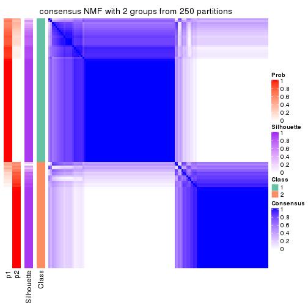</p>

</div>
<div id='tab-MAD-NMF-consensus-heatmap-2'>
<pre><code class="r">consensus_heatmap(res, k = 3)
</code></pre>

<p>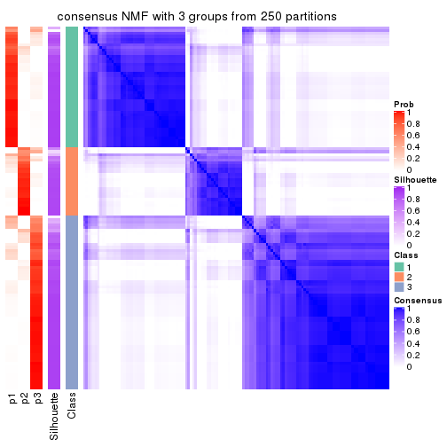</p>

</div>
<div id='tab-MAD-NMF-consensus-heatmap-3'>
<pre><code class="r">consensus_heatmap(res, k = 4)
</code></pre>

<p>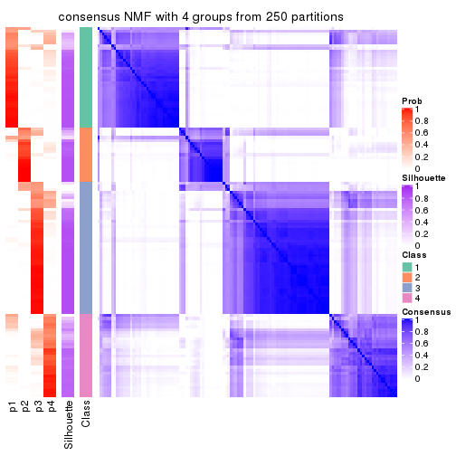</p>

</div>
<div id='tab-MAD-NMF-consensus-heatmap-4'>
<pre><code class="r">consensus_heatmap(res, k = 5)
</code></pre>

<p>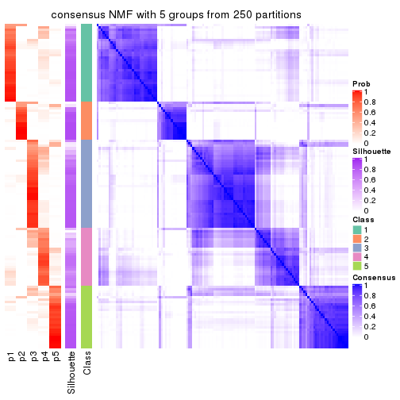</p>

</div>
<div id='tab-MAD-NMF-consensus-heatmap-5'>
<pre><code class="r">consensus_heatmap(res, k = 6)
</code></pre>

<p>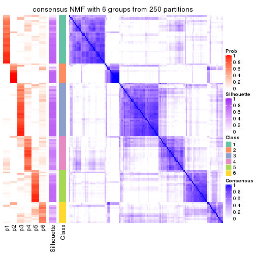</p>

</div>
</div>

Heatmaps for the membership of samples in all partitions to see how consistent they are:


<script>
$( function() {
	$( '#tabs-MAD-NMF-membership-heatmap' ).tabs();
} );
</script>
<div id='tabs-MAD-NMF-membership-heatmap'>
<ul>
<li><a href='#tab-MAD-NMF-membership-heatmap-1'>k = 2</a></li>
<li><a href='#tab-MAD-NMF-membership-heatmap-2'>k = 3</a></li>
<li><a href='#tab-MAD-NMF-membership-heatmap-3'>k = 4</a></li>
<li><a href='#tab-MAD-NMF-membership-heatmap-4'>k = 5</a></li>
<li><a href='#tab-MAD-NMF-membership-heatmap-5'>k = 6</a></li>
</ul>
<div id='tab-MAD-NMF-membership-heatmap-1'>
<pre><code class="r">membership_heatmap(res, k = 2)
</code></pre>

<p>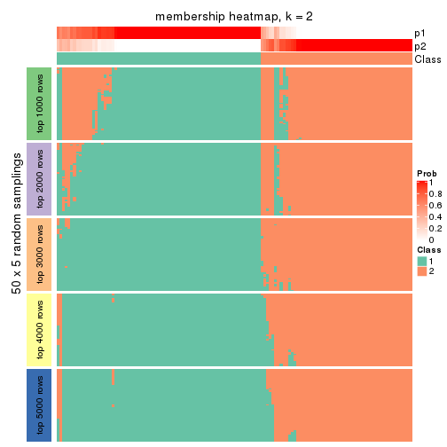</p>

</div>
<div id='tab-MAD-NMF-membership-heatmap-2'>
<pre><code class="r">membership_heatmap(res, k = 3)
</code></pre>

<p>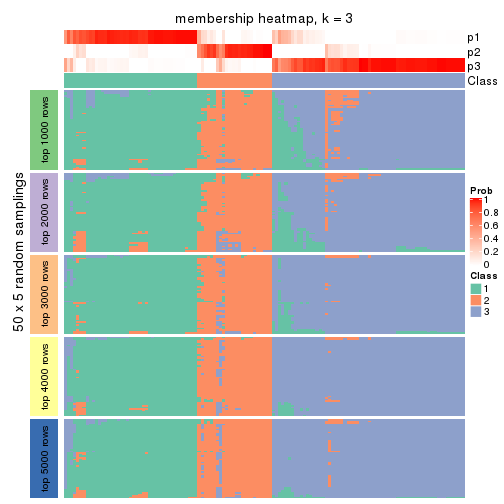</p>

</div>
<div id='tab-MAD-NMF-membership-heatmap-3'>
<pre><code class="r">membership_heatmap(res, k = 4)
</code></pre>

<p>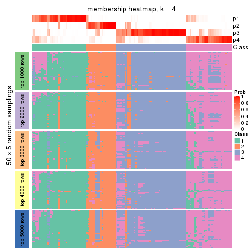</p>

</div>
<div id='tab-MAD-NMF-membership-heatmap-4'>
<pre><code class="r">membership_heatmap(res, k = 5)
</code></pre>

<p>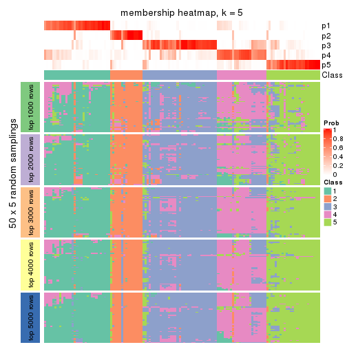</p>

</div>
<div id='tab-MAD-NMF-membership-heatmap-5'>
<pre><code class="r">membership_heatmap(res, k = 6)
</code></pre>

<p>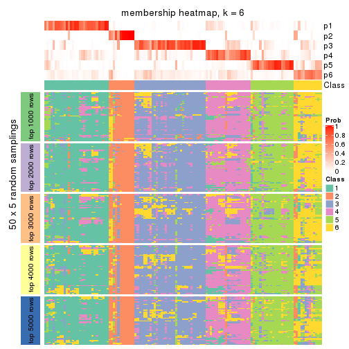</p>

</div>
</div>

As soon as we have had the classes for columns, we can look for signatures
which are significantly different between classes which can be candidate marks
for certain classes. Following are the heatmaps for signatures.


Signature heatmaps where rows are scaled:


<script>
$( function() {
	$( '#tabs-MAD-NMF-get-signatures' ).tabs();
} );
</script>
<div id='tabs-MAD-NMF-get-signatures'>
<ul>
<li><a href='#tab-MAD-NMF-get-signatures-1'>k = 2</a></li>
<li><a href='#tab-MAD-NMF-get-signatures-2'>k = 3</a></li>
<li><a href='#tab-MAD-NMF-get-signatures-3'>k = 4</a></li>
<li><a href='#tab-MAD-NMF-get-signatures-4'>k = 5</a></li>
<li><a href='#tab-MAD-NMF-get-signatures-5'>k = 6</a></li>
</ul>
<div id='tab-MAD-NMF-get-signatures-1'>
<pre><code class="r">get_signatures(res, k = 2)
</code></pre>

<p>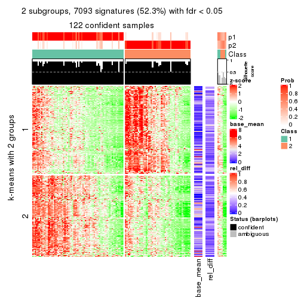</p>

</div>
<div id='tab-MAD-NMF-get-signatures-2'>
<pre><code class="r">get_signatures(res, k = 3)
</code></pre>

<p>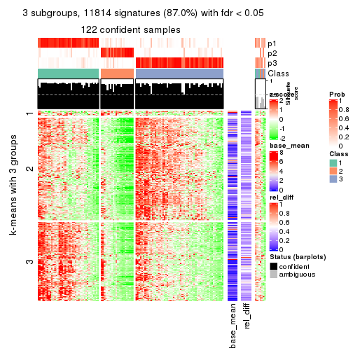</p>

</div>
<div id='tab-MAD-NMF-get-signatures-3'>
<pre><code class="r">get_signatures(res, k = 4)
</code></pre>

<p>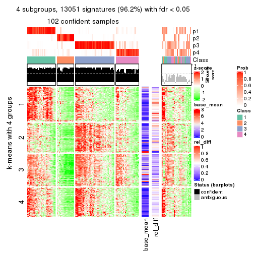</p>

</div>
<div id='tab-MAD-NMF-get-signatures-4'>
<pre><code class="r">get_signatures(res, k = 5)
</code></pre>

<p>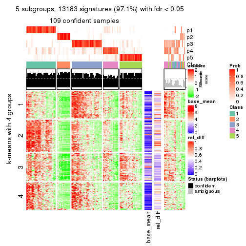</p>

</div>
<div id='tab-MAD-NMF-get-signatures-5'>
<pre><code class="r">get_signatures(res, k = 6)
</code></pre>

<p>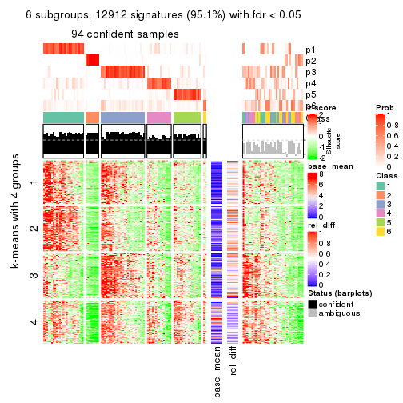</p>

</div>
</div>


Signature heatmaps where rows are not scaled:


<script>
$( function() {
	$( '#tabs-MAD-NMF-get-signatures-no-scale' ).tabs();
} );
</script>
<div id='tabs-MAD-NMF-get-signatures-no-scale'>
<ul>
<li><a href='#tab-MAD-NMF-get-signatures-no-scale-1'>k = 2</a></li>
<li><a href='#tab-MAD-NMF-get-signatures-no-scale-2'>k = 3</a></li>
<li><a href='#tab-MAD-NMF-get-signatures-no-scale-3'>k = 4</a></li>
<li><a href='#tab-MAD-NMF-get-signatures-no-scale-4'>k = 5</a></li>
<li><a href='#tab-MAD-NMF-get-signatures-no-scale-5'>k = 6</a></li>
</ul>
<div id='tab-MAD-NMF-get-signatures-no-scale-1'>
<pre><code class="r">get_signatures(res, k = 2, scale_rows = FALSE)
</code></pre>

<p>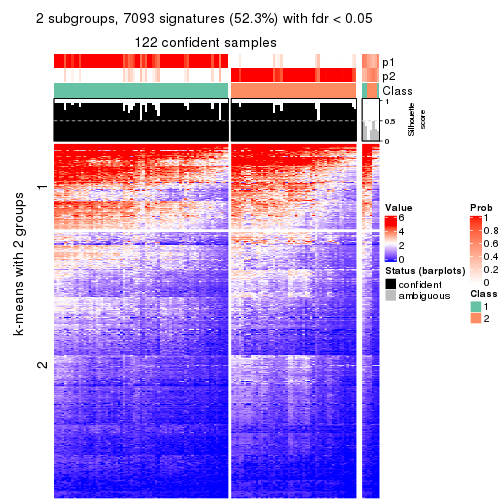</p>

</div>
<div id='tab-MAD-NMF-get-signatures-no-scale-2'>
<pre><code class="r">get_signatures(res, k = 3, scale_rows = FALSE)
</code></pre>

<p>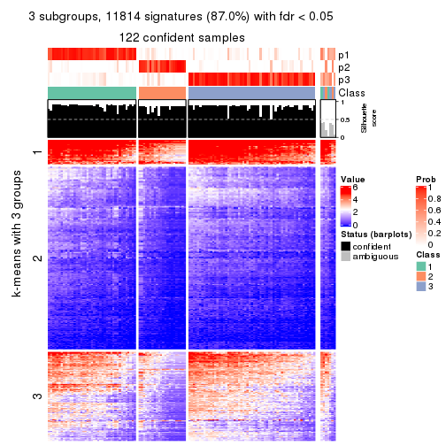</p>

</div>
<div id='tab-MAD-NMF-get-signatures-no-scale-3'>
<pre><code class="r">get_signatures(res, k = 4, scale_rows = FALSE)
</code></pre>

<p>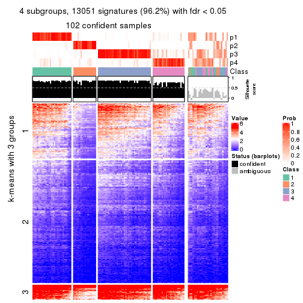</p>

</div>
<div id='tab-MAD-NMF-get-signatures-no-scale-4'>
<pre><code class="r">get_signatures(res, k = 5, scale_rows = FALSE)
</code></pre>

<p>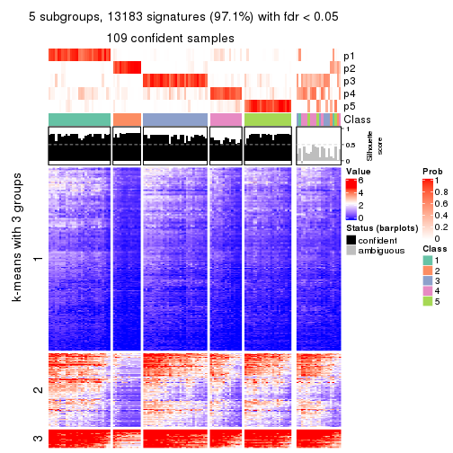</p>

</div>
<div id='tab-MAD-NMF-get-signatures-no-scale-5'>
<pre><code class="r">get_signatures(res, k = 6, scale_rows = FALSE)
</code></pre>

<p>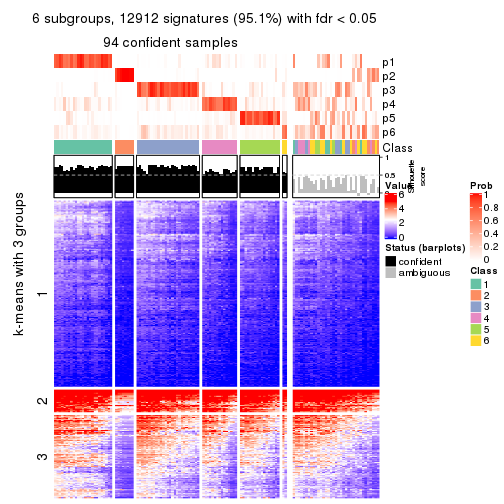</p>

</div>
</div>


Compare the overlap of signatures from different k:

```r
compare_signatures(res)
```

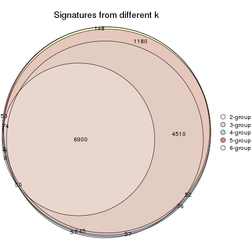

`get_signature()` returns a data frame invisibly. TO get the list of signatures, the function
call should be assigned to a variable explicitly. In following code, if `plot` argument is set
to `FALSE`, no heatmap is plotted while only the differential analysis is performed.

```r
# code only for demonstration
tb = get_signature(res, k = ..., plot = FALSE)
```

An example of the output of `tb` is:

```
#>   which_row         fdr    mean_1    mean_2 scaled_mean_1 scaled_mean_2 km
#> 1        38 0.042760348  8.373488  9.131774    -0.5533452     0.5164555  1
#> 2        40 0.018707592  7.106213  8.469186    -0.6173731     0.5762149  1
#> 3        55 0.019134737 10.221463 11.207825    -0.6159697     0.5749050  1
#> 4        59 0.006059896  5.921854  7.869574    -0.6899429     0.6439467  1
#> 5        60 0.018055526  8.928898 10.211722    -0.6204761     0.5791110  1
#> 6        98 0.009384629 15.714769 14.887706     0.6635654    -0.6193277  2
...
```

The columns in `tb` are:

1. `which_row`: row indices corresponding to the input matrix.
2. `fdr`: FDR for the differential test. 
3. `mean_x`: The mean value in group x.
4. `scaled_mean_x`: The mean value in group x after rows are scaled.
5. `km`: Row groups if k-means clustering is applied to rows.


UMAP plot which shows how samples are separated.


<script>
$( function() {
	$( '#tabs-MAD-NMF-dimension-reduction' ).tabs();
} );
</script>
<div id='tabs-MAD-NMF-dimension-reduction'>
<ul>
<li><a href='#tab-MAD-NMF-dimension-reduction-1'>k = 2</a></li>
<li><a href='#tab-MAD-NMF-dimension-reduction-2'>k = 3</a></li>
<li><a href='#tab-MAD-NMF-dimension-reduction-3'>k = 4</a></li>
<li><a href='#tab-MAD-NMF-dimension-reduction-4'>k = 5</a></li>
<li><a href='#tab-MAD-NMF-dimension-reduction-5'>k = 6</a></li>
</ul>
<div id='tab-MAD-NMF-dimension-reduction-1'>
<pre><code class="r">dimension_reduction(res, k = 2, method = &quot;UMAP&quot;)
</code></pre>

<p>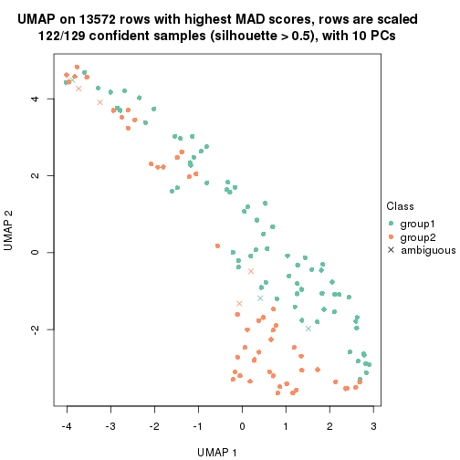</p>

</div>
<div id='tab-MAD-NMF-dimension-reduction-2'>
<pre><code class="r">dimension_reduction(res, k = 3, method = &quot;UMAP&quot;)
</code></pre>

<p>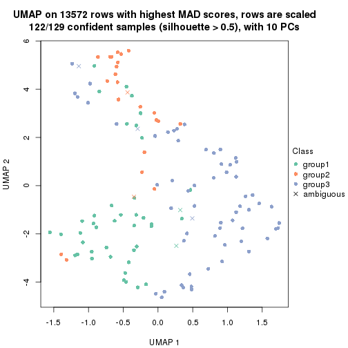</p>

</div>
<div id='tab-MAD-NMF-dimension-reduction-3'>
<pre><code class="r">dimension_reduction(res, k = 4, method = &quot;UMAP&quot;)
</code></pre>

<p>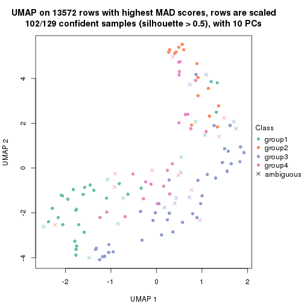</p>

</div>
<div id='tab-MAD-NMF-dimension-reduction-4'>
<pre><code class="r">dimension_reduction(res, k = 5, method = &quot;UMAP&quot;)
</code></pre>

<p>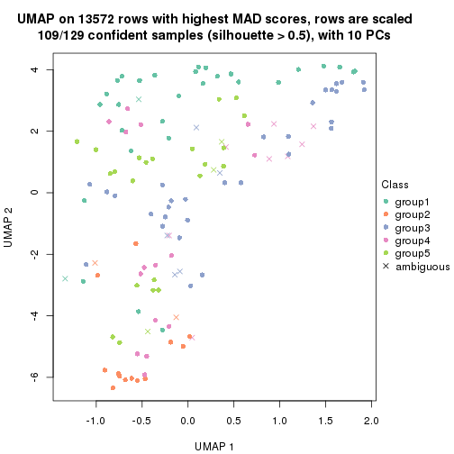</p>

</div>
<div id='tab-MAD-NMF-dimension-reduction-5'>
<pre><code class="r">dimension_reduction(res, k = 6, method = &quot;UMAP&quot;)
</code></pre>

<p>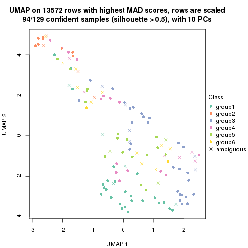</p>

</div>
</div>


Following heatmap shows how subgroups are split when increasing `k`:

```r
collect_classes(res)
```

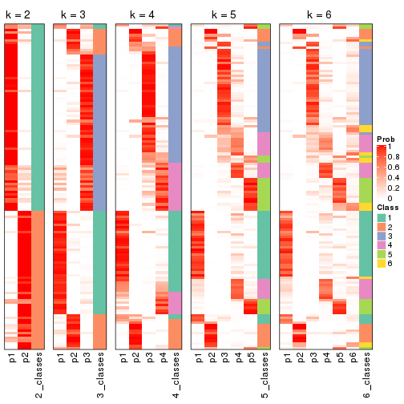


If matrix rows can be associated to genes, consider to use `GO_Enrichment(res,
...)` to perform function enrichment for the signature genes.


 

---------------------------------------------------


### ATC:hclust


The object with results only for a single top-value method and a single partition method 
can be extracted as:

```r
res = res_list["ATC", "hclust"]
# you can also extract it by
# res = res_list["ATC:hclust"]
```

A summary of `res` and all the functions that can be applied to it:

```r
res
```

```
#> A 'ConsensusPartition' object with k = 2, 3, 4, 5, 6.
#>   On a matrix with 13572 rows and 129 columns.
#>   Top rows (1000, 2000, 3000, 4000, 5000) are extracted by 'ATC' method.
#>   Subgroups are detected by 'hclust' method.
#>   Performed in total 1250 partitions by row resampling.
#>   Best k for subgroups seems to be 2.
#> 
#> Following methods can be applied to this 'ConsensusPartition' object:
#>  [1] "cola_report"             "collect_classes"         "collect_plots"          
#>  [4] "collect_stats"           "colnames"                "compare_signatures"     
#>  [7] "consensus_heatmap"       "dimension_reduction"     "functional_enrichment"  
#> [10] "get_anno_col"            "get_anno"                "get_classes"            
#> [13] "get_consensus"           "get_matrix"              "get_membership"         
#> [16] "get_param"               "get_signatures"          "get_stats"              
#> [19] "is_best_k"               "is_stable_k"             "membership_heatmap"     
#> [22] "ncol"                    "nrow"                    "plot_ecdf"              
#> [25] "rownames"                "select_partition_number" "show"                   
#> [28] "suggest_best_k"          "test_to_known_factors"
```

`collect_plots()` function collects all the plots made from `res` for all `k` (number of partitions)
into one single page to provide an easy and fast comparison between different `k`.

```r
collect_plots(res)
```

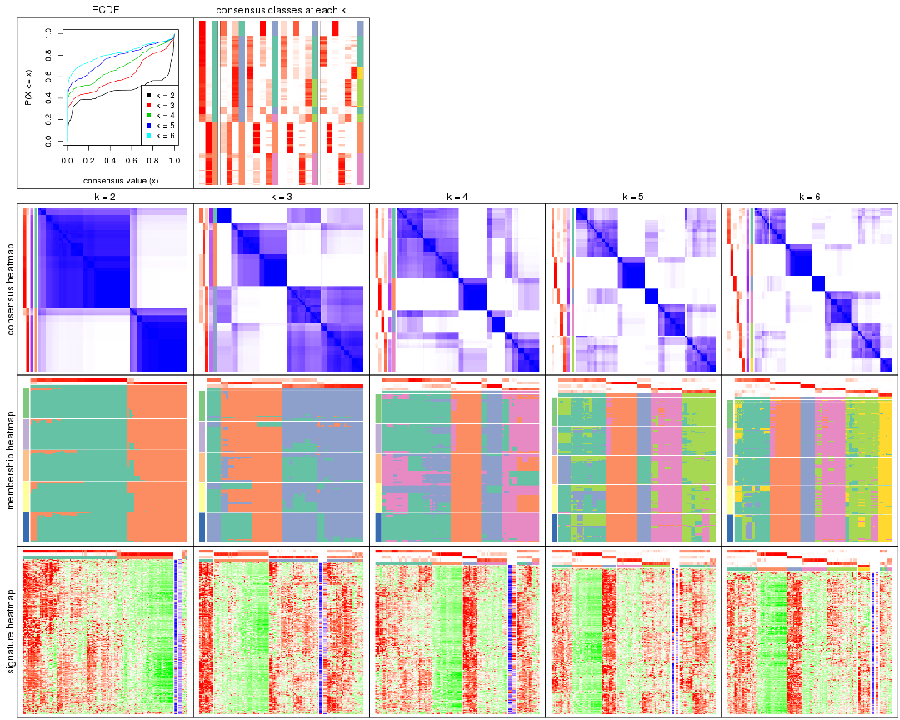

The plots are:

- The first row: a plot of the ECDF (Empirical cumulative distribution
  function) curves of the consensus matrix for each `k` and the heatmap of
  predicted classes for each `k`.
- The second row: heatmaps of the consensus matrix for each `k`.
- The third row: heatmaps of the membership matrix for each `k`.
- The fouth row: heatmaps of the signatures for each `k`.

All the plots in panels can be made by individual functions and they are
plotted later in this section.

`select_partition_number()` produces several plots showing different
statistics for choosing "optimized" `k`. There are following statistics:

- ECDF curves of the consensus matrix for each `k`;
- 1-PAC. [The PAC
  score](https://en.wikipedia.org/wiki/Consensus_clustering#Over-interpretation_potential_of_consensus_clustering)
  measures the proportion of the ambiguous subgrouping.
- Mean silhouette score.
- Concordance. The mean probability of fiting the consensus class ids in all
  partitions.
- Area increased. Denote $A_k$ as the area under the ECDF curve for current
  `k`, the area increased is defined as $A_k - A_{k-1}$.
- Rand index. The percent of pairs of samples that are both in a same cluster
  or both are not in a same cluster in the partition of k and k-1.
- Jaccard index. The ratio of pairs of samples are both in a same cluster in
  the partition of k and k-1 and the pairs of samples are both in a same
  cluster in the partition k or k-1.

The detailed explanations of these statistics can be found in [the cola
vignette](http://bioconductor.org/packages/devel/bioc/vignettes/cola/inst/doc/cola.html#toc_13).

Generally speaking, lower PAC score, higher mean silhouette score or higher
concordance corresponds to better partition. Rand index and Jaccard index
measure how similar the current partition is compared to partition with `k-1`.
If they are too similar, we won't accept `k` is better than `k-1`.

```r
select_partition_number(res)
```

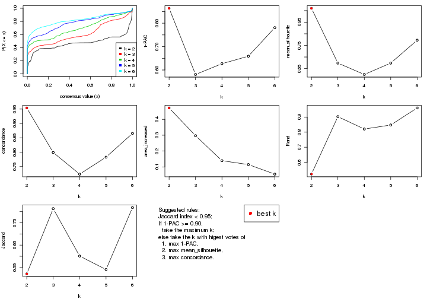

The numeric values for all these statistics can be obtained by `get_stats()`.

```r
get_stats(res)
```

```
#>   k 1-PAC mean_silhouette concordance area_increased  Rand Jaccard
#> 2 2 0.864           0.910       0.954         0.4720 0.522   0.522
#> 3 3 0.581           0.674       0.799         0.2969 0.903   0.813
#> 4 4 0.627           0.625       0.724         0.1392 0.821   0.601
#> 5 5 0.659           0.674       0.783         0.1147 0.847   0.541
#> 6 6 0.781           0.772       0.865         0.0545 0.960   0.818
```

`suggest_best_k()` suggests the best $k$ based on these statistics. The rules are as follows:

- All $k$ with Jaccard index larger than 0.95 are removed because the increase of
  the partition number does not provides enough extra information. If all $k$ are removed,
  the best $k$ is assigned by `NA`.
- For $k$ with 1-PAC larger than 0.9, the maximal $k$ is taken as the "best k". Other $k$ is called "optional k".
- If it does not fit the second rule. The $k$ with the highest vote of highest
  1-PAC, mean silhouette and concordance is taken as the "best k".

```r
suggest_best_k(res)
```

```
#> [1] 2
```


Following shows the table of the partitions (You need to click the **show/hide
code output** link to see it). The membership matrix (columns with name `p*`)
is inferred by
[`clue::cl_consensus()`](https://www.rdocumentation.org/link/cl_consensus?package=clue)
function with the `SE` method. Basically the value in the membership matrix
represents the probability to belong to a certain group. The finall class
label for an item is determined with the group with highest probability it
belongs to.

In `get_classes()` function, the entropy is calculated from the membership
matrix and the silhouette score is calculated from the consensus matrix.


<script>
$( function() {
	$( '#tabs-ATC-hclust-get-classes' ).tabs();
} );
</script>
<div id='tabs-ATC-hclust-get-classes'>
<ul>
<li><a href='#tab-ATC-hclust-get-classes-1'>k = 2</a></li>
<li><a href='#tab-ATC-hclust-get-classes-2'>k = 3</a></li>
<li><a href='#tab-ATC-hclust-get-classes-3'>k = 4</a></li>
<li><a href='#tab-ATC-hclust-get-classes-4'>k = 5</a></li>
<li><a href='#tab-ATC-hclust-get-classes-5'>k = 6</a></li>
</ul>

<div id='tab-ATC-hclust-get-classes-1'>
<p><a id='tab-ATC-hclust-get-classes-1-a' style='color:#0366d6' href='#'>show/hide code output</a></p>
<pre><code class="r">cbind(get_classes(res, k = 2), get_membership(res, k = 2))
</code></pre>

<pre><code>#&gt;            class entropy silhouette    p1    p2
#&gt; SRR1656463     2  0.0000      0.950 0.000 1.000
#&gt; SRR1656464     1  0.0000      0.951 1.000 0.000
#&gt; SRR1656462     1  0.0000      0.951 1.000 0.000
#&gt; SRR1656465     1  0.2236      0.950 0.964 0.036
#&gt; SRR1656467     2  0.0000      0.950 0.000 1.000
#&gt; SRR1656466     1  0.2423      0.949 0.960 0.040
#&gt; SRR1656468     2  0.7674      0.704 0.224 0.776
#&gt; SRR1656472     1  0.2423      0.949 0.960 0.040
#&gt; SRR1656471     1  0.0000      0.951 1.000 0.000
#&gt; SRR1656470     2  0.0000      0.950 0.000 1.000
#&gt; SRR1656469     1  0.8499      0.661 0.724 0.276
#&gt; SRR1656473     2  0.0000      0.950 0.000 1.000
#&gt; SRR1656474     2  0.0000      0.950 0.000 1.000
#&gt; SRR1656475     2  0.0000      0.950 0.000 1.000
#&gt; SRR1656478     1  0.2603      0.947 0.956 0.044
#&gt; SRR1656477     2  0.9552      0.394 0.376 0.624
#&gt; SRR1656479     1  0.2236      0.950 0.964 0.036
#&gt; SRR1656480     2  0.9129      0.512 0.328 0.672
#&gt; SRR1656476     2  0.0000      0.950 0.000 1.000
#&gt; SRR1656481     2  0.8443      0.624 0.272 0.728
#&gt; SRR1656482     2  0.0000      0.950 0.000 1.000
#&gt; SRR1656483     2  0.0000      0.950 0.000 1.000
#&gt; SRR1656485     1  0.0000      0.951 1.000 0.000
#&gt; SRR1656487     1  0.3274      0.938 0.940 0.060
#&gt; SRR1656486     1  0.8499      0.661 0.724 0.276
#&gt; SRR1656488     1  0.0000      0.951 1.000 0.000
#&gt; SRR1656484     1  0.1184      0.953 0.984 0.016
#&gt; SRR1656489     1  0.0000      0.951 1.000 0.000
#&gt; SRR1656491     1  0.4161      0.919 0.916 0.084
#&gt; SRR1656490     1  0.4939      0.898 0.892 0.108
#&gt; SRR1656492     1  0.3431      0.935 0.936 0.064
#&gt; SRR1656493     1  0.2423      0.949 0.960 0.040
#&gt; SRR1656495     1  0.3733      0.929 0.928 0.072
#&gt; SRR1656496     1  0.2603      0.947 0.956 0.044
#&gt; SRR1656494     2  0.2603      0.922 0.044 0.956
#&gt; SRR1656497     2  0.0000      0.950 0.000 1.000
#&gt; SRR1656499     1  0.0000      0.951 1.000 0.000
#&gt; SRR1656500     1  0.0000      0.951 1.000 0.000
#&gt; SRR1656501     1  0.1184      0.953 0.984 0.016
#&gt; SRR1656498     1  0.0000      0.951 1.000 0.000
#&gt; SRR1656504     2  0.0000      0.950 0.000 1.000
#&gt; SRR1656502     1  0.2423      0.949 0.960 0.040
#&gt; SRR1656503     1  0.2423      0.949 0.960 0.040
#&gt; SRR1656507     1  0.2603      0.947 0.956 0.044
#&gt; SRR1656508     1  0.0000      0.951 1.000 0.000
#&gt; SRR1656505     2  0.2778      0.919 0.048 0.952
#&gt; SRR1656506     1  0.2043      0.951 0.968 0.032
#&gt; SRR1656509     1  0.1184      0.953 0.984 0.016
#&gt; SRR1656510     2  0.0672      0.948 0.008 0.992
#&gt; SRR1656511     2  0.0376      0.949 0.004 0.996
#&gt; SRR1656513     2  0.0376      0.949 0.004 0.996
#&gt; SRR1656512     2  0.0000      0.950 0.000 1.000
#&gt; SRR1656514     1  0.0000      0.951 1.000 0.000
#&gt; SRR1656515     2  0.0000      0.950 0.000 1.000
#&gt; SRR1656516     1  0.1184      0.953 0.984 0.016
#&gt; SRR1656518     1  0.8386      0.674 0.732 0.268
#&gt; SRR1656517     1  0.0000      0.951 1.000 0.000
#&gt; SRR1656519     1  0.0000      0.951 1.000 0.000
#&gt; SRR1656522     1  0.0000      0.951 1.000 0.000
#&gt; SRR1656523     2  0.0672      0.947 0.008 0.992
#&gt; SRR1656521     2  0.0000      0.950 0.000 1.000
#&gt; SRR1656520     1  0.0000      0.951 1.000 0.000
#&gt; SRR1656524     1  0.2423      0.949 0.960 0.040
#&gt; SRR1656525     1  0.0672      0.952 0.992 0.008
#&gt; SRR1656526     2  0.0000      0.950 0.000 1.000
#&gt; SRR1656527     2  0.0000      0.950 0.000 1.000
#&gt; SRR1656530     1  0.2423      0.949 0.960 0.040
#&gt; SRR1656529     1  0.3114      0.940 0.944 0.056
#&gt; SRR1656531     1  0.2423      0.949 0.960 0.040
#&gt; SRR1656528     1  0.0938      0.953 0.988 0.012
#&gt; SRR1656534     1  0.0000      0.951 1.000 0.000
#&gt; SRR1656533     1  0.0000      0.951 1.000 0.000
#&gt; SRR1656536     1  0.9248      0.533 0.660 0.340
#&gt; SRR1656532     2  0.0376      0.949 0.004 0.996
#&gt; SRR1656537     1  0.0000      0.951 1.000 0.000
#&gt; SRR1656538     1  0.0000      0.951 1.000 0.000
#&gt; SRR1656535     2  0.0000      0.950 0.000 1.000
#&gt; SRR1656539     1  0.2043      0.951 0.968 0.032
#&gt; SRR1656544     1  0.0376      0.952 0.996 0.004
#&gt; SRR1656542     1  0.0376      0.952 0.996 0.004
#&gt; SRR1656543     1  0.0000      0.951 1.000 0.000
#&gt; SRR1656545     2  0.0000      0.950 0.000 1.000
#&gt; SRR1656540     1  0.0000      0.951 1.000 0.000
#&gt; SRR1656546     2  0.0672      0.948 0.008 0.992
#&gt; SRR1656541     2  0.0000      0.950 0.000 1.000
#&gt; SRR1656547     2  0.0376      0.949 0.004 0.996
#&gt; SRR1656548     1  0.2043      0.951 0.968 0.032
#&gt; SRR1656549     1  0.8499      0.661 0.724 0.276
#&gt; SRR1656551     1  0.9427      0.485 0.640 0.360
#&gt; SRR1656553     1  0.0672      0.952 0.992 0.008
#&gt; SRR1656550     2  0.9661      0.348 0.392 0.608
#&gt; SRR1656552     2  0.0376      0.949 0.004 0.996
#&gt; SRR1656554     1  0.3114      0.940 0.944 0.056
#&gt; SRR1656555     2  0.0672      0.947 0.008 0.992
#&gt; SRR1656556     1  0.0000      0.951 1.000 0.000
#&gt; SRR1656557     1  0.0000      0.951 1.000 0.000
#&gt; SRR1656558     1  0.2603      0.947 0.956 0.044
#&gt; SRR1656559     1  0.0000      0.951 1.000 0.000
#&gt; SRR1656560     1  0.0672      0.952 0.992 0.008
#&gt; SRR1656561     1  0.2043      0.951 0.968 0.032
#&gt; SRR1656562     2  0.0672      0.947 0.008 0.992
#&gt; SRR1656563     1  0.0000      0.951 1.000 0.000
#&gt; SRR1656564     2  0.0000      0.950 0.000 1.000
#&gt; SRR1656565     2  0.2778      0.919 0.048 0.952
#&gt; SRR1656566     1  0.2603      0.947 0.956 0.044
#&gt; SRR1656568     2  0.0000      0.950 0.000 1.000
#&gt; SRR1656567     2  0.2778      0.919 0.048 0.952
#&gt; SRR1656569     1  0.3114      0.940 0.944 0.056
#&gt; SRR1656570     1  0.0000      0.951 1.000 0.000
#&gt; SRR1656571     2  0.0000      0.950 0.000 1.000
#&gt; SRR1656573     1  0.5059      0.894 0.888 0.112
#&gt; SRR1656572     2  0.0376      0.949 0.004 0.996
#&gt; SRR1656574     1  0.0000      0.951 1.000 0.000
#&gt; SRR1656575     1  0.1184      0.953 0.984 0.016
#&gt; SRR1656576     2  0.0376      0.949 0.004 0.996
#&gt; SRR1656578     2  0.0376      0.949 0.004 0.996
#&gt; SRR1656577     1  0.0000      0.951 1.000 0.000
#&gt; SRR1656579     2  0.0376      0.949 0.004 0.996
#&gt; SRR1656580     1  0.0000      0.951 1.000 0.000
#&gt; SRR1656581     2  0.9286      0.476 0.344 0.656
#&gt; SRR1656582     2  0.0000      0.950 0.000 1.000
#&gt; SRR1656585     1  0.4815      0.902 0.896 0.104
#&gt; SRR1656584     1  0.2603      0.947 0.956 0.044
#&gt; SRR1656583     1  0.4815      0.902 0.896 0.104
#&gt; SRR1656586     2  0.0000      0.950 0.000 1.000
#&gt; SRR1656587     1  0.4815      0.902 0.896 0.104
#&gt; SRR1656588     2  0.2778      0.919 0.048 0.952
#&gt; SRR1656589     2  0.0000      0.950 0.000 1.000
#&gt; SRR1656590     1  0.1184      0.953 0.984 0.016
</code></pre>

<script>
$('#tab-ATC-hclust-get-classes-1-a').parent().next().next().hide();
$('#tab-ATC-hclust-get-classes-1-a').click(function(){
  $('#tab-ATC-hclust-get-classes-1-a').parent().next().next().toggle();
  return(false);
});
</script>
</div>

<div id='tab-ATC-hclust-get-classes-2'>
<p><a id='tab-ATC-hclust-get-classes-2-a' style='color:#0366d6' href='#'>show/hide code output</a></p>
<pre><code class="r">cbind(get_classes(res, k = 3), get_membership(res, k = 3))
</code></pre>

<pre><code>#&gt;            class entropy silhouette    p1    p2    p3
#&gt; SRR1656463     2  0.5327      0.808 0.272 0.728 0.000
#&gt; SRR1656464     1  0.5327      1.000 0.728 0.000 0.272
#&gt; SRR1656462     1  0.5327      1.000 0.728 0.000 0.272
#&gt; SRR1656465     3  0.1765      0.709 0.040 0.004 0.956
#&gt; SRR1656467     2  0.4974      0.809 0.236 0.764 0.000
#&gt; SRR1656466     3  0.2063      0.709 0.044 0.008 0.948
#&gt; SRR1656468     2  0.5254      0.593 0.000 0.736 0.264
#&gt; SRR1656472     3  0.0983      0.713 0.016 0.004 0.980
#&gt; SRR1656471     3  0.6126      0.230 0.400 0.000 0.600
#&gt; SRR1656470     2  0.5327      0.808 0.272 0.728 0.000
#&gt; SRR1656469     3  0.4974      0.478 0.000 0.236 0.764
#&gt; SRR1656473     2  0.5327      0.808 0.272 0.728 0.000
#&gt; SRR1656474     2  0.5327      0.808 0.272 0.728 0.000
#&gt; SRR1656475     2  0.5327      0.808 0.272 0.728 0.000
#&gt; SRR1656478     3  0.1015      0.712 0.012 0.008 0.980
#&gt; SRR1656477     2  0.6180      0.306 0.000 0.584 0.416
#&gt; SRR1656479     3  0.0983      0.713 0.016 0.004 0.980
#&gt; SRR1656480     2  0.5988      0.422 0.000 0.632 0.368
#&gt; SRR1656476     2  0.5327      0.808 0.272 0.728 0.000
#&gt; SRR1656481     2  0.5650      0.520 0.000 0.688 0.312
#&gt; SRR1656482     2  0.4974      0.809 0.236 0.764 0.000
#&gt; SRR1656483     2  0.5327      0.808 0.272 0.728 0.000
#&gt; SRR1656485     3  0.6062      0.290 0.384 0.000 0.616
#&gt; SRR1656487     3  0.0892      0.703 0.000 0.020 0.980
#&gt; SRR1656486     3  0.4974      0.478 0.000 0.236 0.764
#&gt; SRR1656488     3  0.6062      0.290 0.384 0.000 0.616
#&gt; SRR1656484     3  0.5016      0.573 0.240 0.000 0.760
#&gt; SRR1656489     3  0.5678      0.459 0.316 0.000 0.684
#&gt; SRR1656491     3  0.1643      0.688 0.000 0.044 0.956
#&gt; SRR1656490     3  0.2261      0.669 0.000 0.068 0.932
#&gt; SRR1656492     3  0.1031      0.701 0.000 0.024 0.976
#&gt; SRR1656493     3  0.0829      0.712 0.012 0.004 0.984
#&gt; SRR1656495     3  0.1289      0.696 0.000 0.032 0.968
#&gt; SRR1656496     3  0.1015      0.712 0.012 0.008 0.980
#&gt; SRR1656494     2  0.2625      0.771 0.000 0.916 0.084
#&gt; SRR1656497     2  0.5327      0.808 0.272 0.728 0.000
#&gt; SRR1656499     3  0.6095      0.261 0.392 0.000 0.608
#&gt; SRR1656500     3  0.6126      0.232 0.400 0.000 0.600
#&gt; SRR1656501     3  0.4062      0.640 0.164 0.000 0.836
#&gt; SRR1656498     3  0.5988      0.339 0.368 0.000 0.632
#&gt; SRR1656504     2  0.5327      0.808 0.272 0.728 0.000
#&gt; SRR1656502     3  0.0983      0.713 0.016 0.004 0.980
#&gt; SRR1656503     3  0.1315      0.713 0.020 0.008 0.972
#&gt; SRR1656507     3  0.1015      0.712 0.012 0.008 0.980
#&gt; SRR1656508     3  0.5760      0.436 0.328 0.000 0.672
#&gt; SRR1656505     2  0.2711      0.769 0.000 0.912 0.088
#&gt; SRR1656506     3  0.2096      0.707 0.052 0.004 0.944
#&gt; SRR1656509     3  0.4974      0.575 0.236 0.000 0.764
#&gt; SRR1656510     2  0.1753      0.790 0.000 0.952 0.048
#&gt; SRR1656511     2  0.1765      0.793 0.004 0.956 0.040
#&gt; SRR1656513     2  0.1529      0.792 0.000 0.960 0.040
#&gt; SRR1656512     2  0.5327      0.808 0.272 0.728 0.000
#&gt; SRR1656514     1  0.5327      1.000 0.728 0.000 0.272
#&gt; SRR1656515     2  0.4974      0.809 0.236 0.764 0.000
#&gt; SRR1656516     3  0.4062      0.640 0.164 0.000 0.836
#&gt; SRR1656518     3  0.4887      0.486 0.000 0.228 0.772
#&gt; SRR1656517     3  0.5988      0.339 0.368 0.000 0.632
#&gt; SRR1656519     1  0.5327      1.000 0.728 0.000 0.272
#&gt; SRR1656522     1  0.5327      1.000 0.728 0.000 0.272
#&gt; SRR1656523     2  0.1753      0.790 0.000 0.952 0.048
#&gt; SRR1656521     2  0.5327      0.808 0.272 0.728 0.000
#&gt; SRR1656520     1  0.5327      1.000 0.728 0.000 0.272
#&gt; SRR1656524     3  0.0829      0.712 0.012 0.004 0.984
#&gt; SRR1656525     3  0.5216      0.547 0.260 0.000 0.740
#&gt; SRR1656526     2  0.5327      0.808 0.272 0.728 0.000
#&gt; SRR1656527     2  0.5327      0.808 0.272 0.728 0.000
#&gt; SRR1656530     3  0.1950      0.710 0.040 0.008 0.952
#&gt; SRR1656529     3  0.0747      0.705 0.000 0.016 0.984
#&gt; SRR1656531     3  0.0983      0.713 0.016 0.004 0.980
#&gt; SRR1656528     3  0.5327      0.533 0.272 0.000 0.728
#&gt; SRR1656534     1  0.5327      1.000 0.728 0.000 0.272
#&gt; SRR1656533     3  0.5988      0.339 0.368 0.000 0.632
#&gt; SRR1656536     3  0.5560      0.404 0.000 0.300 0.700
#&gt; SRR1656532     2  0.1529      0.792 0.000 0.960 0.040
#&gt; SRR1656537     3  0.5988      0.339 0.368 0.000 0.632
#&gt; SRR1656538     3  0.6079      0.276 0.388 0.000 0.612
#&gt; SRR1656535     2  0.5327      0.808 0.272 0.728 0.000
#&gt; SRR1656539     3  0.2096      0.707 0.052 0.004 0.944
#&gt; SRR1656544     3  0.5621      0.474 0.308 0.000 0.692
#&gt; SRR1656542     3  0.5621      0.474 0.308 0.000 0.692
#&gt; SRR1656543     1  0.5327      1.000 0.728 0.000 0.272
#&gt; SRR1656545     2  0.5327      0.808 0.272 0.728 0.000
#&gt; SRR1656540     1  0.5327      1.000 0.728 0.000 0.272
#&gt; SRR1656546     2  0.1753      0.790 0.000 0.952 0.048
#&gt; SRR1656541     2  0.4974      0.809 0.236 0.764 0.000
#&gt; SRR1656547     2  0.1765      0.793 0.004 0.956 0.040
#&gt; SRR1656548     3  0.2301      0.704 0.060 0.004 0.936
#&gt; SRR1656549     3  0.4974      0.478 0.000 0.236 0.764
#&gt; SRR1656551     3  0.5706      0.377 0.000 0.320 0.680
#&gt; SRR1656553     3  0.5098      0.560 0.248 0.000 0.752
#&gt; SRR1656550     2  0.6225      0.264 0.000 0.568 0.432
#&gt; SRR1656552     2  0.1765      0.793 0.004 0.956 0.040
#&gt; SRR1656554     3  0.0747      0.705 0.000 0.016 0.984
#&gt; SRR1656555     2  0.1753      0.790 0.000 0.952 0.048
#&gt; SRR1656556     3  0.6126      0.230 0.400 0.000 0.600
#&gt; SRR1656557     1  0.5327      1.000 0.728 0.000 0.272
#&gt; SRR1656558     3  0.1015      0.712 0.012 0.008 0.980
#&gt; SRR1656559     1  0.5327      1.000 0.728 0.000 0.272
#&gt; SRR1656560     3  0.5926      0.372 0.356 0.000 0.644
#&gt; SRR1656561     3  0.2301      0.704 0.060 0.004 0.936
#&gt; SRR1656562     2  0.1753      0.790 0.000 0.952 0.048
#&gt; SRR1656563     3  0.5678      0.458 0.316 0.000 0.684
#&gt; SRR1656564     2  0.5291      0.808 0.268 0.732 0.000
#&gt; SRR1656565     2  0.2711      0.769 0.000 0.912 0.088
#&gt; SRR1656566     3  0.1015      0.712 0.012 0.008 0.980
#&gt; SRR1656568     2  0.5327      0.808 0.272 0.728 0.000
#&gt; SRR1656567     2  0.2711      0.769 0.000 0.912 0.088
#&gt; SRR1656569     3  0.0747      0.705 0.000 0.016 0.984
#&gt; SRR1656570     3  0.5591      0.480 0.304 0.000 0.696
#&gt; SRR1656571     2  0.5327      0.808 0.272 0.728 0.000
#&gt; SRR1656573     3  0.2356      0.665 0.000 0.072 0.928
#&gt; SRR1656572     2  0.1529      0.792 0.000 0.960 0.040
#&gt; SRR1656574     3  0.6079      0.277 0.388 0.000 0.612
#&gt; SRR1656575     3  0.4452      0.619 0.192 0.000 0.808
#&gt; SRR1656576     2  0.1765      0.793 0.004 0.956 0.040
#&gt; SRR1656578     2  0.1529      0.792 0.000 0.960 0.040
#&gt; SRR1656577     1  0.5327      1.000 0.728 0.000 0.272
#&gt; SRR1656579     2  0.1765      0.793 0.004 0.956 0.040
#&gt; SRR1656580     3  0.6079      0.276 0.388 0.000 0.612
#&gt; SRR1656581     2  0.6062      0.386 0.000 0.616 0.384
#&gt; SRR1656582     2  0.5327      0.808 0.272 0.728 0.000
#&gt; SRR1656585     3  0.2165      0.672 0.000 0.064 0.936
#&gt; SRR1656584     3  0.1015      0.712 0.012 0.008 0.980
#&gt; SRR1656583     3  0.2165      0.672 0.000 0.064 0.936
#&gt; SRR1656586     2  0.5327      0.808 0.272 0.728 0.000
#&gt; SRR1656587     3  0.2165      0.672 0.000 0.064 0.936
#&gt; SRR1656588     2  0.2711      0.769 0.000 0.912 0.088
#&gt; SRR1656589     2  0.5327      0.808 0.272 0.728 0.000
#&gt; SRR1656590     3  0.5098      0.564 0.248 0.000 0.752
</code></pre>

<script>
$('#tab-ATC-hclust-get-classes-2-a').parent().next().next().hide();
$('#tab-ATC-hclust-get-classes-2-a').click(function(){
  $('#tab-ATC-hclust-get-classes-2-a').parent().next().next().toggle();
  return(false);
});
</script>
</div>

<div id='tab-ATC-hclust-get-classes-3'>
<p><a id='tab-ATC-hclust-get-classes-3-a' style='color:#0366d6' href='#'>show/hide code output</a></p>
<pre><code class="r">cbind(get_classes(res, k = 4), get_membership(res, k = 4))
</code></pre>

<pre><code>#&gt;            class entropy silhouette    p1    p2    p3    p4
#&gt; SRR1656463     2  0.0000     0.9409 0.000 1.000 0.000 0.000
#&gt; SRR1656464     3  0.0000     0.7924 0.000 0.000 1.000 0.000
#&gt; SRR1656462     3  0.0000     0.7924 0.000 0.000 1.000 0.000
#&gt; SRR1656465     1  0.5463     0.6976 0.692 0.000 0.052 0.256
#&gt; SRR1656467     2  0.4164     0.6156 0.000 0.736 0.000 0.264
#&gt; SRR1656466     1  0.5434     0.6996 0.696 0.000 0.052 0.252
#&gt; SRR1656468     4  0.1767     0.6080 0.012 0.044 0.000 0.944
#&gt; SRR1656472     1  0.0188     0.6905 0.996 0.000 0.004 0.000
#&gt; SRR1656471     3  0.4972    -0.0394 0.456 0.000 0.544 0.000
#&gt; SRR1656470     2  0.0000     0.9409 0.000 1.000 0.000 0.000
#&gt; SRR1656469     4  0.4977    -0.2454 0.460 0.000 0.000 0.540
#&gt; SRR1656473     2  0.0000     0.9409 0.000 1.000 0.000 0.000
#&gt; SRR1656474     2  0.0000     0.9409 0.000 1.000 0.000 0.000
#&gt; SRR1656475     2  0.0000     0.9409 0.000 1.000 0.000 0.000
#&gt; SRR1656478     1  0.0469     0.6951 0.988 0.000 0.000 0.012
#&gt; SRR1656477     4  0.2704     0.5431 0.124 0.000 0.000 0.876
#&gt; SRR1656479     1  0.4284     0.7114 0.780 0.000 0.020 0.200
#&gt; SRR1656480     4  0.2796     0.5829 0.092 0.016 0.000 0.892
#&gt; SRR1656476     2  0.0000     0.9409 0.000 1.000 0.000 0.000
#&gt; SRR1656481     4  0.1388     0.5973 0.028 0.012 0.000 0.960
#&gt; SRR1656482     2  0.4164     0.6156 0.000 0.736 0.000 0.264
#&gt; SRR1656483     2  0.0188     0.9390 0.000 0.996 0.000 0.004
#&gt; SRR1656485     3  0.5392    -0.0884 0.460 0.000 0.528 0.012
#&gt; SRR1656487     1  0.4769     0.6744 0.684 0.000 0.008 0.308
#&gt; SRR1656486     4  0.4977    -0.2454 0.460 0.000 0.000 0.540
#&gt; SRR1656488     3  0.5408    -0.1977 0.488 0.000 0.500 0.012
#&gt; SRR1656484     1  0.4155     0.6414 0.756 0.000 0.240 0.004
#&gt; SRR1656489     1  0.4543     0.5610 0.676 0.000 0.324 0.000
#&gt; SRR1656491     1  0.4522     0.6647 0.680 0.000 0.000 0.320
#&gt; SRR1656490     1  0.4624     0.6468 0.660 0.000 0.000 0.340
#&gt; SRR1656492     1  0.4655     0.6735 0.684 0.000 0.004 0.312
#&gt; SRR1656493     1  0.0000     0.6909 1.000 0.000 0.000 0.000
#&gt; SRR1656495     1  0.1716     0.6833 0.936 0.000 0.000 0.064
#&gt; SRR1656496     1  0.4399     0.7073 0.768 0.000 0.020 0.212
#&gt; SRR1656494     4  0.3837     0.6454 0.000 0.224 0.000 0.776
#&gt; SRR1656497     2  0.0000     0.9409 0.000 1.000 0.000 0.000
#&gt; SRR1656499     3  0.5147    -0.0657 0.460 0.000 0.536 0.004
#&gt; SRR1656500     1  0.4981     0.3001 0.536 0.000 0.464 0.000
#&gt; SRR1656501     1  0.3355     0.6799 0.836 0.000 0.160 0.004
#&gt; SRR1656498     1  0.4804     0.4786 0.616 0.000 0.384 0.000
#&gt; SRR1656504     2  0.0000     0.9409 0.000 1.000 0.000 0.000
#&gt; SRR1656502     1  0.0188     0.6905 0.996 0.000 0.004 0.000
#&gt; SRR1656503     1  0.4307     0.7120 0.784 0.000 0.024 0.192
#&gt; SRR1656507     1  0.0469     0.6951 0.988 0.000 0.000 0.012
#&gt; SRR1656508     1  0.4605     0.5486 0.664 0.000 0.336 0.000
#&gt; SRR1656505     4  0.3801     0.6462 0.000 0.220 0.000 0.780
#&gt; SRR1656506     1  0.5565     0.7010 0.684 0.000 0.056 0.260
#&gt; SRR1656509     1  0.4328     0.6407 0.748 0.000 0.244 0.008
#&gt; SRR1656510     4  0.4134     0.6318 0.000 0.260 0.000 0.740
#&gt; SRR1656511     4  0.4477     0.5808 0.000 0.312 0.000 0.688
#&gt; SRR1656513     4  0.4222     0.6231 0.000 0.272 0.000 0.728
#&gt; SRR1656512     2  0.0000     0.9409 0.000 1.000 0.000 0.000
#&gt; SRR1656514     3  0.0000     0.7924 0.000 0.000 1.000 0.000
#&gt; SRR1656515     2  0.4164     0.6156 0.000 0.736 0.000 0.264
#&gt; SRR1656516     1  0.3355     0.6799 0.836 0.000 0.160 0.004
#&gt; SRR1656518     4  0.4985    -0.2685 0.468 0.000 0.000 0.532
#&gt; SRR1656517     1  0.4804     0.4786 0.616 0.000 0.384 0.000
#&gt; SRR1656519     3  0.0000     0.7924 0.000 0.000 1.000 0.000
#&gt; SRR1656522     3  0.0000     0.7924 0.000 0.000 1.000 0.000
#&gt; SRR1656523     4  0.4134     0.6321 0.000 0.260 0.000 0.740
#&gt; SRR1656521     2  0.0000     0.9409 0.000 1.000 0.000 0.000
#&gt; SRR1656520     3  0.0000     0.7924 0.000 0.000 1.000 0.000
#&gt; SRR1656524     1  0.0000     0.6909 1.000 0.000 0.000 0.000
#&gt; SRR1656525     1  0.5953     0.6385 0.656 0.000 0.268 0.076
#&gt; SRR1656526     2  0.0000     0.9409 0.000 1.000 0.000 0.000
#&gt; SRR1656527     2  0.0188     0.9390 0.000 0.996 0.000 0.004
#&gt; SRR1656530     1  0.5463     0.6979 0.692 0.000 0.052 0.256
#&gt; SRR1656529     1  0.4746     0.6768 0.688 0.000 0.008 0.304
#&gt; SRR1656531     1  0.0188     0.6905 0.996 0.000 0.004 0.000
#&gt; SRR1656528     1  0.6028     0.6246 0.644 0.000 0.280 0.076
#&gt; SRR1656534     3  0.0000     0.7924 0.000 0.000 1.000 0.000
#&gt; SRR1656533     1  0.4804     0.4786 0.616 0.000 0.384 0.000
#&gt; SRR1656536     4  0.4877    -0.0918 0.408 0.000 0.000 0.592
#&gt; SRR1656532     4  0.4222     0.6231 0.000 0.272 0.000 0.728
#&gt; SRR1656537     1  0.4804     0.4786 0.616 0.000 0.384 0.000
#&gt; SRR1656538     1  0.4866     0.4534 0.596 0.000 0.404 0.000
#&gt; SRR1656535     2  0.0188     0.9390 0.000 0.996 0.000 0.004
#&gt; SRR1656539     1  0.5417     0.7039 0.704 0.000 0.056 0.240
#&gt; SRR1656544     1  0.4957     0.5690 0.668 0.000 0.320 0.012
#&gt; SRR1656542     1  0.4957     0.5690 0.668 0.000 0.320 0.012
#&gt; SRR1656543     3  0.0000     0.7924 0.000 0.000 1.000 0.000
#&gt; SRR1656545     2  0.0000     0.9409 0.000 1.000 0.000 0.000
#&gt; SRR1656540     3  0.0000     0.7924 0.000 0.000 1.000 0.000
#&gt; SRR1656546     4  0.4134     0.6321 0.000 0.260 0.000 0.740
#&gt; SRR1656541     2  0.4008     0.6499 0.000 0.756 0.000 0.244
#&gt; SRR1656547     4  0.4431     0.5901 0.000 0.304 0.000 0.696
#&gt; SRR1656548     1  0.5579     0.7028 0.688 0.000 0.060 0.252
#&gt; SRR1656549     4  0.4977    -0.2454 0.460 0.000 0.000 0.540
#&gt; SRR1656551     4  0.4830    -0.0290 0.392 0.000 0.000 0.608
#&gt; SRR1656553     1  0.4516     0.6421 0.736 0.000 0.252 0.012
#&gt; SRR1656550     4  0.2921     0.5233 0.140 0.000 0.000 0.860
#&gt; SRR1656552     4  0.4500     0.5756 0.000 0.316 0.000 0.684
#&gt; SRR1656554     1  0.4746     0.6768 0.688 0.000 0.008 0.304
#&gt; SRR1656555     4  0.4134     0.6321 0.000 0.260 0.000 0.740
#&gt; SRR1656556     3  0.4972    -0.0394 0.456 0.000 0.544 0.000
#&gt; SRR1656557     3  0.0000     0.7924 0.000 0.000 1.000 0.000
#&gt; SRR1656558     1  0.0469     0.6951 0.988 0.000 0.000 0.012
#&gt; SRR1656559     3  0.0000     0.7924 0.000 0.000 1.000 0.000
#&gt; SRR1656560     1  0.5600     0.5006 0.596 0.000 0.376 0.028
#&gt; SRR1656561     1  0.5579     0.7028 0.688 0.000 0.060 0.252
#&gt; SRR1656562     4  0.4134     0.6321 0.000 0.260 0.000 0.740
#&gt; SRR1656563     1  0.4522     0.5652 0.680 0.000 0.320 0.000
#&gt; SRR1656564     2  0.1792     0.8803 0.000 0.932 0.000 0.068
#&gt; SRR1656565     4  0.3801     0.6462 0.000 0.220 0.000 0.780
#&gt; SRR1656566     1  0.0469     0.6951 0.988 0.000 0.000 0.012
#&gt; SRR1656568     2  0.0000     0.9409 0.000 1.000 0.000 0.000
#&gt; SRR1656567     4  0.3801     0.6462 0.000 0.220 0.000 0.780
#&gt; SRR1656569     1  0.4746     0.6768 0.688 0.000 0.008 0.304
#&gt; SRR1656570     1  0.4454     0.5820 0.692 0.000 0.308 0.000
#&gt; SRR1656571     2  0.0188     0.9390 0.000 0.996 0.000 0.004
#&gt; SRR1656573     1  0.4643     0.6414 0.656 0.000 0.000 0.344
#&gt; SRR1656572     4  0.4222     0.6231 0.000 0.272 0.000 0.728
#&gt; SRR1656574     1  0.4888     0.4365 0.588 0.000 0.412 0.000
#&gt; SRR1656575     1  0.3710     0.6649 0.804 0.000 0.192 0.004
#&gt; SRR1656576     4  0.4500     0.5756 0.000 0.316 0.000 0.684
#&gt; SRR1656578     4  0.4222     0.6231 0.000 0.272 0.000 0.728
#&gt; SRR1656577     3  0.0000     0.7924 0.000 0.000 1.000 0.000
#&gt; SRR1656579     4  0.4500     0.5756 0.000 0.316 0.000 0.684
#&gt; SRR1656580     1  0.4866     0.4534 0.596 0.000 0.404 0.000
#&gt; SRR1656581     4  0.2216     0.5773 0.092 0.000 0.000 0.908
#&gt; SRR1656582     2  0.0000     0.9409 0.000 1.000 0.000 0.000
#&gt; SRR1656585     1  0.4605     0.6519 0.664 0.000 0.000 0.336
#&gt; SRR1656584     1  0.0469     0.6951 0.988 0.000 0.000 0.012
#&gt; SRR1656583     1  0.4605     0.6519 0.664 0.000 0.000 0.336
#&gt; SRR1656586     2  0.0000     0.9409 0.000 1.000 0.000 0.000
#&gt; SRR1656587     1  0.4605     0.6519 0.664 0.000 0.000 0.336
#&gt; SRR1656588     4  0.3801     0.6462 0.000 0.220 0.000 0.780
#&gt; SRR1656589     2  0.0000     0.9409 0.000 1.000 0.000 0.000
#&gt; SRR1656590     1  0.4072     0.6284 0.748 0.000 0.252 0.000
</code></pre>

<script>
$('#tab-ATC-hclust-get-classes-3-a').parent().next().next().hide();
$('#tab-ATC-hclust-get-classes-3-a').click(function(){
  $('#tab-ATC-hclust-get-classes-3-a').parent().next().next().toggle();
  return(false);
});
</script>
</div>

<div id='tab-ATC-hclust-get-classes-4'>
<p><a id='tab-ATC-hclust-get-classes-4-a' style='color:#0366d6' href='#'>show/hide code output</a></p>
<pre><code class="r">cbind(get_classes(res, k = 5), get_membership(res, k = 5))
</code></pre>

<pre><code>#&gt;            class entropy silhouette    p1    p2    p3    p4    p5
#&gt; SRR1656463     2  0.0000      0.940 0.000 1.000 0.000 0.000 0.000
#&gt; SRR1656464     3  0.3074      1.000 0.196 0.000 0.804 0.000 0.000
#&gt; SRR1656462     3  0.3074      1.000 0.196 0.000 0.804 0.000 0.000
#&gt; SRR1656465     5  0.2629      0.686 0.136 0.000 0.004 0.000 0.860
#&gt; SRR1656467     2  0.3837      0.603 0.000 0.692 0.000 0.308 0.000
#&gt; SRR1656466     5  0.2719      0.679 0.144 0.000 0.004 0.000 0.852
#&gt; SRR1656468     4  0.3534      0.671 0.000 0.000 0.000 0.744 0.256
#&gt; SRR1656472     1  0.6671      0.256 0.540 0.000 0.192 0.020 0.248
#&gt; SRR1656471     1  0.5700      0.309 0.600 0.000 0.280 0.000 0.120
#&gt; SRR1656470     2  0.0000      0.940 0.000 1.000 0.000 0.000 0.000
#&gt; SRR1656469     5  0.4054      0.605 0.020 0.000 0.000 0.248 0.732
#&gt; SRR1656473     2  0.0000      0.940 0.000 1.000 0.000 0.000 0.000
#&gt; SRR1656474     2  0.0000      0.940 0.000 1.000 0.000 0.000 0.000
#&gt; SRR1656475     2  0.0000      0.940 0.000 1.000 0.000 0.000 0.000
#&gt; SRR1656478     1  0.6701      0.240 0.532 0.000 0.188 0.020 0.260
#&gt; SRR1656477     4  0.4397      0.367 0.000 0.000 0.004 0.564 0.432
#&gt; SRR1656479     5  0.3906      0.555 0.292 0.000 0.000 0.004 0.704
#&gt; SRR1656480     4  0.4276      0.482 0.000 0.000 0.004 0.616 0.380
#&gt; SRR1656476     2  0.0000      0.940 0.000 1.000 0.000 0.000 0.000
#&gt; SRR1656481     4  0.3990      0.599 0.000 0.000 0.004 0.688 0.308
#&gt; SRR1656482     2  0.3837      0.603 0.000 0.692 0.000 0.308 0.000
#&gt; SRR1656483     2  0.0162      0.938 0.000 0.996 0.000 0.004 0.000
#&gt; SRR1656485     1  0.5775      0.332 0.600 0.000 0.264 0.000 0.136
#&gt; SRR1656487     5  0.1638      0.730 0.064 0.000 0.000 0.004 0.932
#&gt; SRR1656486     5  0.4141      0.602 0.024 0.000 0.000 0.248 0.728
#&gt; SRR1656488     1  0.5864      0.362 0.600 0.000 0.236 0.000 0.164
#&gt; SRR1656484     1  0.3398      0.558 0.780 0.000 0.004 0.000 0.216
#&gt; SRR1656489     1  0.3814      0.592 0.808 0.000 0.068 0.000 0.124
#&gt; SRR1656491     5  0.3063      0.724 0.096 0.000 0.004 0.036 0.864
#&gt; SRR1656490     5  0.2853      0.723 0.068 0.000 0.008 0.040 0.884
#&gt; SRR1656492     5  0.1764      0.731 0.064 0.000 0.000 0.008 0.928
#&gt; SRR1656493     1  0.6708      0.248 0.532 0.000 0.192 0.020 0.256
#&gt; SRR1656495     5  0.7032     -0.023 0.388 0.000 0.196 0.020 0.396
#&gt; SRR1656496     5  0.3814      0.581 0.276 0.000 0.000 0.004 0.720
#&gt; SRR1656494     4  0.2032      0.859 0.000 0.020 0.004 0.924 0.052
#&gt; SRR1656497     2  0.0000      0.940 0.000 1.000 0.000 0.000 0.000
#&gt; SRR1656499     1  0.5740      0.321 0.600 0.000 0.272 0.000 0.128
#&gt; SRR1656500     1  0.5444      0.472 0.656 0.000 0.204 0.000 0.140
#&gt; SRR1656501     1  0.4902      0.417 0.648 0.000 0.048 0.000 0.304
#&gt; SRR1656498     1  0.4262      0.557 0.776 0.000 0.124 0.000 0.100
#&gt; SRR1656504     2  0.0000      0.940 0.000 1.000 0.000 0.000 0.000
#&gt; SRR1656502     1  0.6671      0.256 0.540 0.000 0.192 0.020 0.248
#&gt; SRR1656503     5  0.3969      0.531 0.304 0.000 0.000 0.004 0.692
#&gt; SRR1656507     1  0.6742      0.219 0.520 0.000 0.184 0.020 0.276
#&gt; SRR1656508     1  0.3888      0.588 0.804 0.000 0.076 0.000 0.120
#&gt; SRR1656505     4  0.2005      0.857 0.000 0.016 0.004 0.924 0.056
#&gt; SRR1656506     5  0.3635      0.548 0.248 0.000 0.000 0.004 0.748
#&gt; SRR1656509     1  0.3783      0.521 0.740 0.000 0.008 0.000 0.252
#&gt; SRR1656510     4  0.1012      0.867 0.000 0.020 0.000 0.968 0.012
#&gt; SRR1656511     4  0.1478      0.851 0.000 0.064 0.000 0.936 0.000
#&gt; SRR1656513     4  0.0703      0.866 0.000 0.024 0.000 0.976 0.000
#&gt; SRR1656512     2  0.0000      0.940 0.000 1.000 0.000 0.000 0.000
#&gt; SRR1656514     3  0.3074      1.000 0.196 0.000 0.804 0.000 0.000
#&gt; SRR1656515     2  0.3837      0.603 0.000 0.692 0.000 0.308 0.000
#&gt; SRR1656516     1  0.4902      0.417 0.648 0.000 0.048 0.000 0.304
#&gt; SRR1656518     5  0.4352      0.607 0.036 0.000 0.000 0.244 0.720
#&gt; SRR1656517     1  0.4262      0.557 0.776 0.000 0.124 0.000 0.100
#&gt; SRR1656519     3  0.3074      1.000 0.196 0.000 0.804 0.000 0.000
#&gt; SRR1656522     3  0.3074      1.000 0.196 0.000 0.804 0.000 0.000
#&gt; SRR1656523     4  0.0898      0.867 0.000 0.020 0.000 0.972 0.008
#&gt; SRR1656521     2  0.0000      0.940 0.000 1.000 0.000 0.000 0.000
#&gt; SRR1656520     3  0.3074      1.000 0.196 0.000 0.804 0.000 0.000
#&gt; SRR1656524     1  0.6726      0.242 0.528 0.000 0.192 0.020 0.260
#&gt; SRR1656525     1  0.5131      0.366 0.540 0.000 0.040 0.000 0.420
#&gt; SRR1656526     2  0.0000      0.940 0.000 1.000 0.000 0.000 0.000
#&gt; SRR1656527     2  0.0290      0.936 0.000 0.992 0.000 0.008 0.000
#&gt; SRR1656530     5  0.2763      0.675 0.148 0.000 0.004 0.000 0.848
#&gt; SRR1656529     5  0.1704      0.730 0.068 0.000 0.000 0.004 0.928
#&gt; SRR1656531     1  0.6671      0.256 0.540 0.000 0.192 0.020 0.248
#&gt; SRR1656528     1  0.5345      0.368 0.540 0.000 0.056 0.000 0.404
#&gt; SRR1656534     3  0.3074      1.000 0.196 0.000 0.804 0.000 0.000
#&gt; SRR1656533     1  0.4262      0.557 0.776 0.000 0.124 0.000 0.100
#&gt; SRR1656536     5  0.3968      0.515 0.004 0.000 0.004 0.276 0.716
#&gt; SRR1656532     4  0.0703      0.866 0.000 0.024 0.000 0.976 0.000
#&gt; SRR1656537     1  0.4262      0.557 0.776 0.000 0.124 0.000 0.100
#&gt; SRR1656538     1  0.4971      0.539 0.712 0.000 0.144 0.000 0.144
#&gt; SRR1656535     2  0.0290      0.936 0.000 0.992 0.000 0.008 0.000
#&gt; SRR1656539     5  0.3491      0.578 0.228 0.000 0.004 0.000 0.768
#&gt; SRR1656544     1  0.4793      0.571 0.700 0.000 0.068 0.000 0.232
#&gt; SRR1656542     1  0.4820      0.572 0.696 0.000 0.068 0.000 0.236
#&gt; SRR1656543     3  0.3074      1.000 0.196 0.000 0.804 0.000 0.000
#&gt; SRR1656545     2  0.0000      0.940 0.000 1.000 0.000 0.000 0.000
#&gt; SRR1656540     3  0.3074      1.000 0.196 0.000 0.804 0.000 0.000
#&gt; SRR1656546     4  0.0912      0.867 0.000 0.016 0.000 0.972 0.012
#&gt; SRR1656541     2  0.3730      0.636 0.000 0.712 0.000 0.288 0.000
#&gt; SRR1656547     4  0.1341      0.855 0.000 0.056 0.000 0.944 0.000
#&gt; SRR1656548     5  0.4084      0.393 0.328 0.000 0.000 0.004 0.668
#&gt; SRR1656549     5  0.4141      0.602 0.024 0.000 0.000 0.248 0.728
#&gt; SRR1656551     5  0.3928      0.473 0.004 0.000 0.000 0.296 0.700
#&gt; SRR1656553     1  0.4851      0.484 0.624 0.000 0.036 0.000 0.340
#&gt; SRR1656550     4  0.4425      0.316 0.000 0.000 0.004 0.544 0.452
#&gt; SRR1656552     4  0.1608      0.846 0.000 0.072 0.000 0.928 0.000
#&gt; SRR1656554     5  0.1704      0.730 0.068 0.000 0.000 0.004 0.928
#&gt; SRR1656555     4  0.0898      0.867 0.000 0.020 0.000 0.972 0.008
#&gt; SRR1656556     1  0.5739      0.314 0.596 0.000 0.280 0.000 0.124
#&gt; SRR1656557     3  0.3074      1.000 0.196 0.000 0.804 0.000 0.000
#&gt; SRR1656558     1  0.6701      0.240 0.532 0.000 0.188 0.020 0.260
#&gt; SRR1656559     3  0.3074      1.000 0.196 0.000 0.804 0.000 0.000
#&gt; SRR1656560     1  0.5618      0.477 0.608 0.000 0.112 0.000 0.280
#&gt; SRR1656561     5  0.4084      0.393 0.328 0.000 0.000 0.004 0.668
#&gt; SRR1656562     4  0.0898      0.867 0.000 0.020 0.000 0.972 0.008
#&gt; SRR1656563     1  0.3780      0.593 0.808 0.000 0.060 0.000 0.132
#&gt; SRR1656564     2  0.1851      0.872 0.000 0.912 0.000 0.088 0.000
#&gt; SRR1656565     4  0.2005      0.857 0.000 0.016 0.004 0.924 0.056
#&gt; SRR1656566     1  0.6718      0.234 0.528 0.000 0.188 0.020 0.264
#&gt; SRR1656568     2  0.0000      0.940 0.000 1.000 0.000 0.000 0.000
#&gt; SRR1656567     4  0.2005      0.857 0.000 0.016 0.004 0.924 0.056
#&gt; SRR1656569     5  0.1704      0.730 0.068 0.000 0.000 0.004 0.928
#&gt; SRR1656570     1  0.3995      0.600 0.788 0.000 0.060 0.000 0.152
#&gt; SRR1656571     2  0.0162      0.938 0.000 0.996 0.000 0.004 0.000
#&gt; SRR1656573     5  0.2929      0.723 0.068 0.000 0.008 0.044 0.880
#&gt; SRR1656572     4  0.0703      0.866 0.000 0.024 0.000 0.976 0.000
#&gt; SRR1656574     1  0.4968      0.537 0.712 0.000 0.152 0.000 0.136
#&gt; SRR1656575     1  0.4163      0.525 0.740 0.000 0.032 0.000 0.228
#&gt; SRR1656576     4  0.1608      0.846 0.000 0.072 0.000 0.928 0.000
#&gt; SRR1656578     4  0.0703      0.866 0.000 0.024 0.000 0.976 0.000
#&gt; SRR1656577     3  0.3074      1.000 0.196 0.000 0.804 0.000 0.000
#&gt; SRR1656579     4  0.1608      0.846 0.000 0.072 0.000 0.928 0.000
#&gt; SRR1656580     1  0.4971      0.539 0.712 0.000 0.144 0.000 0.144
#&gt; SRR1656581     4  0.4331      0.443 0.000 0.000 0.004 0.596 0.400
#&gt; SRR1656582     2  0.0000      0.940 0.000 1.000 0.000 0.000 0.000
#&gt; SRR1656585     5  0.2886      0.721 0.068 0.000 0.012 0.036 0.884
#&gt; SRR1656584     1  0.6701      0.240 0.532 0.000 0.188 0.020 0.260
#&gt; SRR1656583     5  0.2886      0.721 0.068 0.000 0.012 0.036 0.884
#&gt; SRR1656586     2  0.0000      0.940 0.000 1.000 0.000 0.000 0.000
#&gt; SRR1656587     5  0.2886      0.721 0.068 0.000 0.012 0.036 0.884
#&gt; SRR1656588     4  0.2005      0.857 0.000 0.016 0.004 0.924 0.056
#&gt; SRR1656589     2  0.0000      0.940 0.000 1.000 0.000 0.000 0.000
#&gt; SRR1656590     1  0.3246      0.578 0.808 0.000 0.008 0.000 0.184
</code></pre>

<script>
$('#tab-ATC-hclust-get-classes-4-a').parent().next().next().hide();
$('#tab-ATC-hclust-get-classes-4-a').click(function(){
  $('#tab-ATC-hclust-get-classes-4-a').parent().next().next().toggle();
  return(false);
});
</script>
</div>

<div id='tab-ATC-hclust-get-classes-5'>
<p><a id='tab-ATC-hclust-get-classes-5-a' style='color:#0366d6' href='#'>show/hide code output</a></p>
<pre><code class="r">cbind(get_classes(res, k = 6), get_membership(res, k = 6))
</code></pre>

<pre><code>#&gt;            class entropy silhouette    p1    p2    p3    p4    p5    p6
#&gt; SRR1656463     2  0.0000      0.935 0.000 1.000 0.000 0.000 0.000 0.000
#&gt; SRR1656464     3  0.0260      1.000 0.008 0.000 0.992 0.000 0.000 0.000
#&gt; SRR1656462     3  0.0260      1.000 0.008 0.000 0.992 0.000 0.000 0.000
#&gt; SRR1656465     5  0.2488      0.719 0.124 0.000 0.000 0.004 0.864 0.008
#&gt; SRR1656467     2  0.3584      0.607 0.000 0.688 0.000 0.308 0.000 0.004
#&gt; SRR1656466     5  0.2723      0.713 0.128 0.000 0.000 0.004 0.852 0.016
#&gt; SRR1656468     4  0.3445      0.637 0.000 0.000 0.000 0.732 0.260 0.008
#&gt; SRR1656472     6  0.0862      0.936 0.016 0.000 0.004 0.000 0.008 0.972
#&gt; SRR1656471     1  0.4366      0.671 0.712 0.000 0.212 0.004 0.072 0.000
#&gt; SRR1656470     2  0.0000      0.935 0.000 1.000 0.000 0.000 0.000 0.000
#&gt; SRR1656469     5  0.3571      0.620 0.008 0.000 0.000 0.240 0.744 0.008
#&gt; SRR1656473     2  0.0000      0.935 0.000 1.000 0.000 0.000 0.000 0.000
#&gt; SRR1656474     2  0.0000      0.935 0.000 1.000 0.000 0.000 0.000 0.000
#&gt; SRR1656475     2  0.0000      0.935 0.000 1.000 0.000 0.000 0.000 0.000
#&gt; SRR1656478     6  0.1245      0.947 0.016 0.000 0.000 0.000 0.032 0.952
#&gt; SRR1656477     4  0.4189      0.284 0.000 0.000 0.004 0.552 0.436 0.008
#&gt; SRR1656479     5  0.4949      0.560 0.256 0.000 0.000 0.004 0.640 0.100
#&gt; SRR1656480     4  0.4090      0.420 0.000 0.000 0.004 0.604 0.384 0.008
#&gt; SRR1656476     2  0.0000      0.935 0.000 1.000 0.000 0.000 0.000 0.000
#&gt; SRR1656481     4  0.3844      0.556 0.000 0.000 0.004 0.676 0.312 0.008
#&gt; SRR1656482     2  0.3584      0.607 0.000 0.688 0.000 0.308 0.000 0.004
#&gt; SRR1656483     2  0.0291      0.932 0.000 0.992 0.000 0.004 0.000 0.004
#&gt; SRR1656485     1  0.4253      0.678 0.728 0.000 0.196 0.004 0.072 0.000
#&gt; SRR1656487     5  0.0713      0.761 0.028 0.000 0.000 0.000 0.972 0.000
#&gt; SRR1656486     5  0.3667      0.618 0.008 0.000 0.000 0.240 0.740 0.012
#&gt; SRR1656488     1  0.4371      0.688 0.728 0.000 0.168 0.004 0.100 0.000
#&gt; SRR1656484     1  0.4166      0.664 0.728 0.000 0.000 0.000 0.076 0.196
#&gt; SRR1656489     1  0.2114      0.765 0.904 0.000 0.012 0.000 0.008 0.076
#&gt; SRR1656491     5  0.3717      0.742 0.036 0.000 0.000 0.036 0.808 0.120
#&gt; SRR1656490     5  0.3434      0.730 0.008 0.000 0.004 0.040 0.820 0.128
#&gt; SRR1656492     5  0.0858      0.761 0.028 0.000 0.000 0.000 0.968 0.004
#&gt; SRR1656493     6  0.0909      0.946 0.012 0.000 0.000 0.000 0.020 0.968
#&gt; SRR1656495     6  0.3565      0.586 0.004 0.000 0.004 0.000 0.276 0.716
#&gt; SRR1656496     5  0.4798      0.587 0.236 0.000 0.000 0.004 0.664 0.096
#&gt; SRR1656494     4  0.1573      0.848 0.000 0.004 0.004 0.936 0.052 0.004
#&gt; SRR1656497     2  0.0000      0.935 0.000 1.000 0.000 0.000 0.000 0.000
#&gt; SRR1656499     1  0.4310      0.675 0.720 0.000 0.204 0.004 0.072 0.000
#&gt; SRR1656500     1  0.2357      0.759 0.872 0.000 0.116 0.000 0.012 0.000
#&gt; SRR1656501     1  0.5347      0.294 0.504 0.000 0.000 0.000 0.112 0.384
#&gt; SRR1656498     1  0.2745      0.756 0.864 0.000 0.068 0.000 0.000 0.068
#&gt; SRR1656504     2  0.0000      0.935 0.000 1.000 0.000 0.000 0.000 0.000
#&gt; SRR1656502     6  0.0862      0.936 0.016 0.000 0.004 0.000 0.008 0.972
#&gt; SRR1656503     5  0.5303      0.513 0.260 0.000 0.000 0.004 0.600 0.136
#&gt; SRR1656507     6  0.1745      0.927 0.020 0.000 0.000 0.000 0.056 0.924
#&gt; SRR1656508     1  0.1745      0.768 0.924 0.000 0.020 0.000 0.000 0.056
#&gt; SRR1656505     4  0.1637      0.847 0.000 0.004 0.004 0.932 0.056 0.004
#&gt; SRR1656506     5  0.3259      0.602 0.216 0.000 0.000 0.000 0.772 0.012
#&gt; SRR1656509     1  0.4634      0.625 0.688 0.000 0.000 0.000 0.124 0.188
#&gt; SRR1656510     4  0.0748      0.857 0.000 0.004 0.000 0.976 0.016 0.004
#&gt; SRR1656511     4  0.1152      0.841 0.000 0.044 0.000 0.952 0.000 0.004
#&gt; SRR1656513     4  0.0291      0.856 0.000 0.004 0.000 0.992 0.000 0.004
#&gt; SRR1656512     2  0.0000      0.935 0.000 1.000 0.000 0.000 0.000 0.000
#&gt; SRR1656514     3  0.0260      1.000 0.008 0.000 0.992 0.000 0.000 0.000
#&gt; SRR1656515     2  0.3584      0.607 0.000 0.688 0.000 0.308 0.000 0.004
#&gt; SRR1656516     1  0.5347      0.294 0.504 0.000 0.000 0.000 0.112 0.384
#&gt; SRR1656518     5  0.4412      0.609 0.008 0.000 0.000 0.236 0.700 0.056
#&gt; SRR1656517     1  0.2745      0.756 0.864 0.000 0.068 0.000 0.000 0.068
#&gt; SRR1656519     3  0.0260      1.000 0.008 0.000 0.992 0.000 0.000 0.000
#&gt; SRR1656522     3  0.0260      1.000 0.008 0.000 0.992 0.000 0.000 0.000
#&gt; SRR1656523     4  0.0405      0.858 0.000 0.004 0.000 0.988 0.008 0.000
#&gt; SRR1656521     2  0.0000      0.935 0.000 1.000 0.000 0.000 0.000 0.000
#&gt; SRR1656520     3  0.0260      1.000 0.008 0.000 0.992 0.000 0.000 0.000
#&gt; SRR1656524     6  0.0692      0.944 0.004 0.000 0.000 0.000 0.020 0.976
#&gt; SRR1656525     1  0.4343      0.451 0.584 0.000 0.004 0.004 0.396 0.012
#&gt; SRR1656526     2  0.0000      0.935 0.000 1.000 0.000 0.000 0.000 0.000
#&gt; SRR1656527     2  0.0405      0.930 0.000 0.988 0.000 0.008 0.000 0.004
#&gt; SRR1656530     5  0.2631      0.714 0.128 0.000 0.000 0.004 0.856 0.012
#&gt; SRR1656529     5  0.0547      0.763 0.020 0.000 0.000 0.000 0.980 0.000
#&gt; SRR1656531     6  0.0862      0.936 0.016 0.000 0.004 0.000 0.008 0.972
#&gt; SRR1656528     1  0.3965      0.463 0.616 0.000 0.004 0.004 0.376 0.000
#&gt; SRR1656534     3  0.0260      1.000 0.008 0.000 0.992 0.000 0.000 0.000
#&gt; SRR1656533     1  0.2745      0.756 0.864 0.000 0.068 0.000 0.000 0.068
#&gt; SRR1656536     5  0.4161      0.557 0.000 0.000 0.004 0.264 0.696 0.036
#&gt; SRR1656532     4  0.0291      0.856 0.000 0.004 0.000 0.992 0.000 0.004
#&gt; SRR1656537     1  0.2745      0.756 0.864 0.000 0.068 0.000 0.000 0.068
#&gt; SRR1656538     1  0.1657      0.773 0.928 0.000 0.056 0.000 0.016 0.000
#&gt; SRR1656535     2  0.0405      0.930 0.000 0.988 0.000 0.008 0.000 0.004
#&gt; SRR1656539     5  0.3426      0.615 0.220 0.000 0.000 0.004 0.764 0.012
#&gt; SRR1656544     1  0.3737      0.736 0.780 0.000 0.008 0.000 0.168 0.044
#&gt; SRR1656542     1  0.3771      0.734 0.776 0.000 0.008 0.000 0.172 0.044
#&gt; SRR1656543     3  0.0260      1.000 0.008 0.000 0.992 0.000 0.000 0.000
#&gt; SRR1656545     2  0.0000      0.935 0.000 1.000 0.000 0.000 0.000 0.000
#&gt; SRR1656540     3  0.0260      1.000 0.008 0.000 0.992 0.000 0.000 0.000
#&gt; SRR1656546     4  0.0458      0.857 0.000 0.000 0.000 0.984 0.016 0.000
#&gt; SRR1656541     2  0.3489      0.640 0.000 0.708 0.000 0.288 0.000 0.004
#&gt; SRR1656547     4  0.1010      0.846 0.000 0.036 0.000 0.960 0.000 0.004
#&gt; SRR1656548     5  0.3748      0.444 0.300 0.000 0.000 0.000 0.688 0.012
#&gt; SRR1656549     5  0.3667      0.618 0.008 0.000 0.000 0.240 0.740 0.012
#&gt; SRR1656551     5  0.3670      0.526 0.000 0.000 0.000 0.284 0.704 0.012
#&gt; SRR1656553     1  0.4895      0.616 0.632 0.000 0.000 0.000 0.264 0.104
#&gt; SRR1656550     4  0.4211      0.223 0.000 0.000 0.004 0.532 0.456 0.008
#&gt; SRR1656552     4  0.1285      0.837 0.000 0.052 0.000 0.944 0.000 0.004
#&gt; SRR1656554     5  0.0547      0.763 0.020 0.000 0.000 0.000 0.980 0.000
#&gt; SRR1656555     4  0.0405      0.858 0.000 0.004 0.000 0.988 0.008 0.000
#&gt; SRR1656556     1  0.4416      0.673 0.708 0.000 0.212 0.004 0.076 0.000
#&gt; SRR1656557     3  0.0260      1.000 0.008 0.000 0.992 0.000 0.000 0.000
#&gt; SRR1656558     6  0.1245      0.947 0.016 0.000 0.000 0.000 0.032 0.952
#&gt; SRR1656559     3  0.0260      1.000 0.008 0.000 0.992 0.000 0.000 0.000
#&gt; SRR1656560     1  0.4051      0.663 0.728 0.000 0.044 0.004 0.224 0.000
#&gt; SRR1656561     5  0.3748      0.444 0.300 0.000 0.000 0.000 0.688 0.012
#&gt; SRR1656562     4  0.0405      0.858 0.000 0.004 0.000 0.988 0.008 0.000
#&gt; SRR1656563     1  0.1349      0.767 0.940 0.000 0.000 0.000 0.004 0.056
#&gt; SRR1656564     2  0.1806      0.867 0.000 0.908 0.000 0.088 0.000 0.004
#&gt; SRR1656565     4  0.1637      0.847 0.000 0.004 0.004 0.932 0.056 0.004
#&gt; SRR1656566     6  0.1151      0.947 0.012 0.000 0.000 0.000 0.032 0.956
#&gt; SRR1656568     2  0.0000      0.935 0.000 1.000 0.000 0.000 0.000 0.000
#&gt; SRR1656567     4  0.1637      0.847 0.000 0.004 0.004 0.932 0.056 0.004
#&gt; SRR1656569     5  0.0547      0.763 0.020 0.000 0.000 0.000 0.980 0.000
#&gt; SRR1656570     1  0.1807      0.768 0.920 0.000 0.000 0.000 0.020 0.060
#&gt; SRR1656571     2  0.0291      0.932 0.000 0.992 0.000 0.004 0.000 0.004
#&gt; SRR1656573     5  0.3475      0.730 0.008 0.000 0.004 0.040 0.816 0.132
#&gt; SRR1656572     4  0.0291      0.856 0.000 0.004 0.000 0.992 0.000 0.004
#&gt; SRR1656574     1  0.1584      0.773 0.928 0.000 0.064 0.000 0.008 0.000
#&gt; SRR1656575     1  0.4750      0.582 0.652 0.000 0.000 0.000 0.096 0.252
#&gt; SRR1656576     4  0.1285      0.837 0.000 0.052 0.000 0.944 0.000 0.004
#&gt; SRR1656578     4  0.0291      0.856 0.000 0.004 0.000 0.992 0.000 0.004
#&gt; SRR1656577     3  0.0260      1.000 0.008 0.000 0.992 0.000 0.000 0.000
#&gt; SRR1656579     4  0.1285      0.837 0.000 0.052 0.000 0.944 0.000 0.004
#&gt; SRR1656580     1  0.1657      0.773 0.928 0.000 0.056 0.000 0.016 0.000
#&gt; SRR1656581     4  0.4135      0.375 0.000 0.000 0.004 0.584 0.404 0.008
#&gt; SRR1656582     2  0.0000      0.935 0.000 1.000 0.000 0.000 0.000 0.000
#&gt; SRR1656585     5  0.3447      0.727 0.008 0.000 0.004 0.036 0.816 0.136
#&gt; SRR1656584     6  0.1320      0.945 0.016 0.000 0.000 0.000 0.036 0.948
#&gt; SRR1656583     5  0.3447      0.727 0.008 0.000 0.004 0.036 0.816 0.136
#&gt; SRR1656586     2  0.0000      0.935 0.000 1.000 0.000 0.000 0.000 0.000
#&gt; SRR1656587     5  0.3447      0.727 0.008 0.000 0.004 0.036 0.816 0.136
#&gt; SRR1656588     4  0.1637      0.847 0.000 0.004 0.004 0.932 0.056 0.004
#&gt; SRR1656589     2  0.0000      0.935 0.000 1.000 0.000 0.000 0.000 0.000
#&gt; SRR1656590     1  0.3806      0.674 0.752 0.000 0.000 0.000 0.048 0.200
</code></pre>

<script>
$('#tab-ATC-hclust-get-classes-5-a').parent().next().next().hide();
$('#tab-ATC-hclust-get-classes-5-a').click(function(){
  $('#tab-ATC-hclust-get-classes-5-a').parent().next().next().toggle();
  return(false);
});
</script>
</div>
</div>

Heatmaps for the consensus matrix. It visualizes the probability of two
samples to be in a same group.


<script>
$( function() {
	$( '#tabs-ATC-hclust-consensus-heatmap' ).tabs();
} );
</script>
<div id='tabs-ATC-hclust-consensus-heatmap'>
<ul>
<li><a href='#tab-ATC-hclust-consensus-heatmap-1'>k = 2</a></li>
<li><a href='#tab-ATC-hclust-consensus-heatmap-2'>k = 3</a></li>
<li><a href='#tab-ATC-hclust-consensus-heatmap-3'>k = 4</a></li>
<li><a href='#tab-ATC-hclust-consensus-heatmap-4'>k = 5</a></li>
<li><a href='#tab-ATC-hclust-consensus-heatmap-5'>k = 6</a></li>
</ul>
<div id='tab-ATC-hclust-consensus-heatmap-1'>
<pre><code class="r">consensus_heatmap(res, k = 2)
</code></pre>

<p>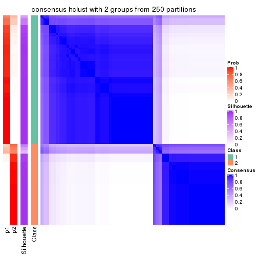</p>

</div>
<div id='tab-ATC-hclust-consensus-heatmap-2'>
<pre><code class="r">consensus_heatmap(res, k = 3)
</code></pre>

<p>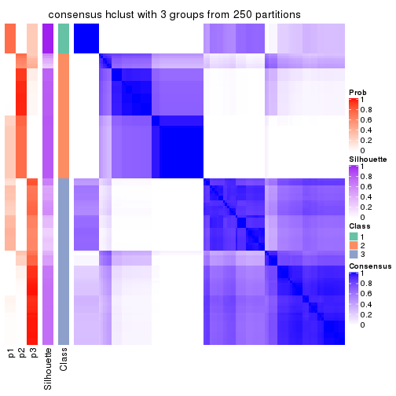</p>

</div>
<div id='tab-ATC-hclust-consensus-heatmap-3'>
<pre><code class="r">consensus_heatmap(res, k = 4)
</code></pre>

<p>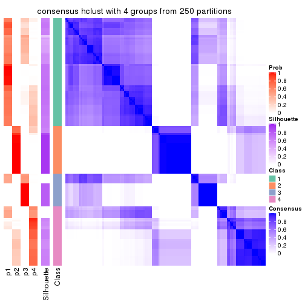</p>

</div>
<div id='tab-ATC-hclust-consensus-heatmap-4'>
<pre><code class="r">consensus_heatmap(res, k = 5)
</code></pre>

<p>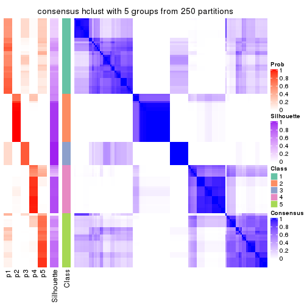</p>

</div>
<div id='tab-ATC-hclust-consensus-heatmap-5'>
<pre><code class="r">consensus_heatmap(res, k = 6)
</code></pre>

<p>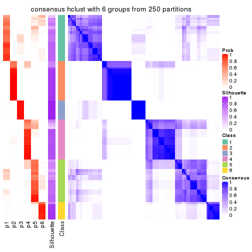</p>

</div>
</div>

Heatmaps for the membership of samples in all partitions to see how consistent they are:


<script>
$( function() {
	$( '#tabs-ATC-hclust-membership-heatmap' ).tabs();
} );
</script>
<div id='tabs-ATC-hclust-membership-heatmap'>
<ul>
<li><a href='#tab-ATC-hclust-membership-heatmap-1'>k = 2</a></li>
<li><a href='#tab-ATC-hclust-membership-heatmap-2'>k = 3</a></li>
<li><a href='#tab-ATC-hclust-membership-heatmap-3'>k = 4</a></li>
<li><a href='#tab-ATC-hclust-membership-heatmap-4'>k = 5</a></li>
<li><a href='#tab-ATC-hclust-membership-heatmap-5'>k = 6</a></li>
</ul>
<div id='tab-ATC-hclust-membership-heatmap-1'>
<pre><code class="r">membership_heatmap(res, k = 2)
</code></pre>

<p>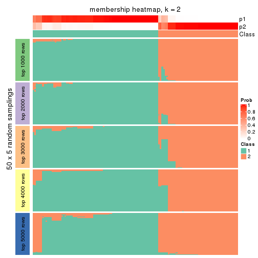</p>

</div>
<div id='tab-ATC-hclust-membership-heatmap-2'>
<pre><code class="r">membership_heatmap(res, k = 3)
</code></pre>

<p>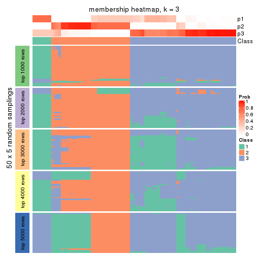</p>

</div>
<div id='tab-ATC-hclust-membership-heatmap-3'>
<pre><code class="r">membership_heatmap(res, k = 4)
</code></pre>

<p>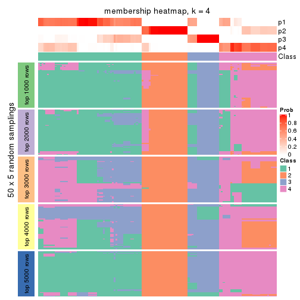</p>

</div>
<div id='tab-ATC-hclust-membership-heatmap-4'>
<pre><code class="r">membership_heatmap(res, k = 5)
</code></pre>

<p>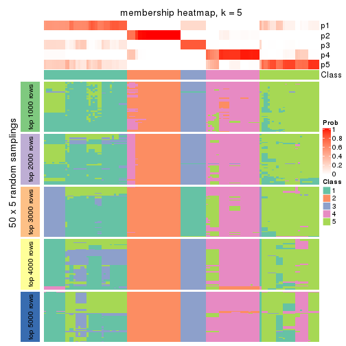</p>

</div>
<div id='tab-ATC-hclust-membership-heatmap-5'>
<pre><code class="r">membership_heatmap(res, k = 6)
</code></pre>

<p>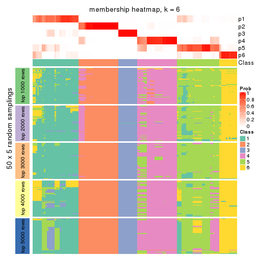</p>

</div>
</div>

As soon as we have had the classes for columns, we can look for signatures
which are significantly different between classes which can be candidate marks
for certain classes. Following are the heatmaps for signatures.


Signature heatmaps where rows are scaled:


<script>
$( function() {
	$( '#tabs-ATC-hclust-get-signatures' ).tabs();
} );
</script>
<div id='tabs-ATC-hclust-get-signatures'>
<ul>
<li><a href='#tab-ATC-hclust-get-signatures-1'>k = 2</a></li>
<li><a href='#tab-ATC-hclust-get-signatures-2'>k = 3</a></li>
<li><a href='#tab-ATC-hclust-get-signatures-3'>k = 4</a></li>
<li><a href='#tab-ATC-hclust-get-signatures-4'>k = 5</a></li>
<li><a href='#tab-ATC-hclust-get-signatures-5'>k = 6</a></li>
</ul>
<div id='tab-ATC-hclust-get-signatures-1'>
<pre><code class="r">get_signatures(res, k = 2)
</code></pre>

<p>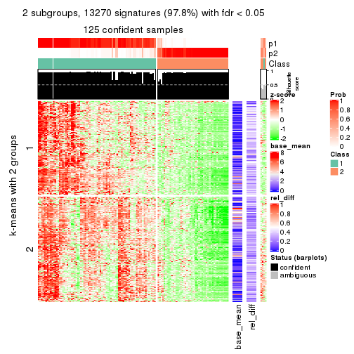</p>

</div>
<div id='tab-ATC-hclust-get-signatures-2'>
<pre><code class="r">get_signatures(res, k = 3)
</code></pre>

<p>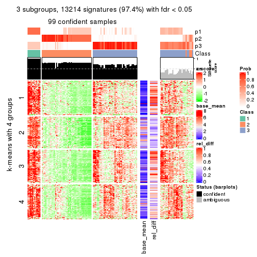</p>

</div>
<div id='tab-ATC-hclust-get-signatures-3'>
<pre><code class="r">get_signatures(res, k = 4)
</code></pre>

<p>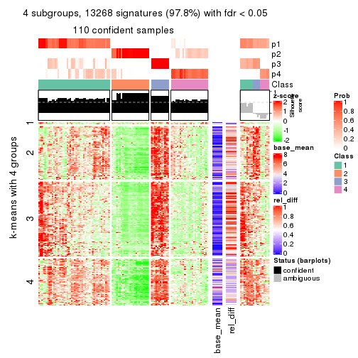</p>

</div>
<div id='tab-ATC-hclust-get-signatures-4'>
<pre><code class="r">get_signatures(res, k = 5)
</code></pre>

<p>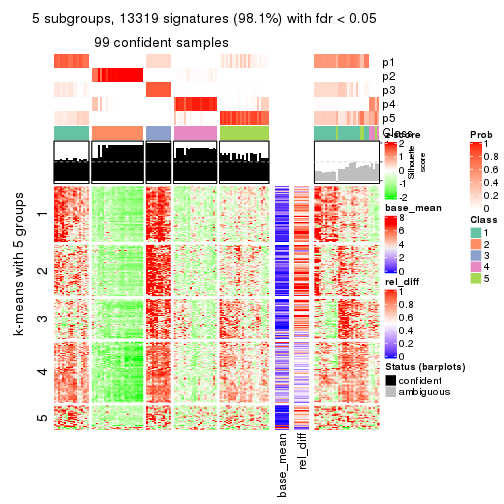</p>

</div>
<div id='tab-ATC-hclust-get-signatures-5'>
<pre><code class="r">get_signatures(res, k = 6)
</code></pre>

<p>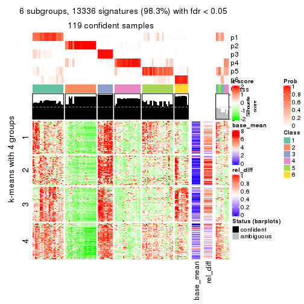</p>

</div>
</div>


Signature heatmaps where rows are not scaled:


<script>
$( function() {
	$( '#tabs-ATC-hclust-get-signatures-no-scale' ).tabs();
} );
</script>
<div id='tabs-ATC-hclust-get-signatures-no-scale'>
<ul>
<li><a href='#tab-ATC-hclust-get-signatures-no-scale-1'>k = 2</a></li>
<li><a href='#tab-ATC-hclust-get-signatures-no-scale-2'>k = 3</a></li>
<li><a href='#tab-ATC-hclust-get-signatures-no-scale-3'>k = 4</a></li>
<li><a href='#tab-ATC-hclust-get-signatures-no-scale-4'>k = 5</a></li>
<li><a href='#tab-ATC-hclust-get-signatures-no-scale-5'>k = 6</a></li>
</ul>
<div id='tab-ATC-hclust-get-signatures-no-scale-1'>
<pre><code class="r">get_signatures(res, k = 2, scale_rows = FALSE)
</code></pre>

<p>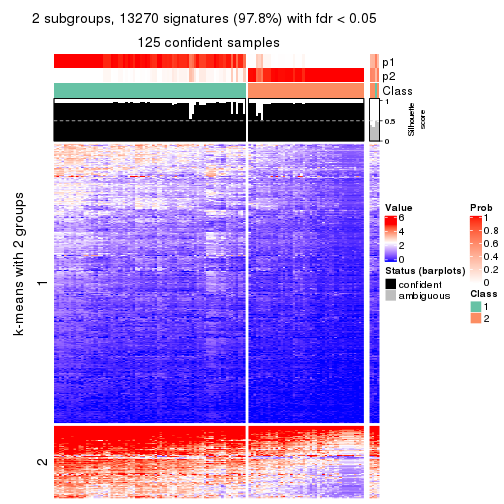</p>

</div>
<div id='tab-ATC-hclust-get-signatures-no-scale-2'>
<pre><code class="r">get_signatures(res, k = 3, scale_rows = FALSE)
</code></pre>

<p>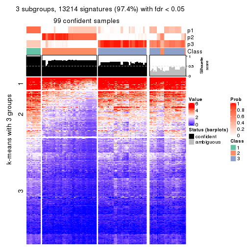</p>

</div>
<div id='tab-ATC-hclust-get-signatures-no-scale-3'>
<pre><code class="r">get_signatures(res, k = 4, scale_rows = FALSE)
</code></pre>

<p>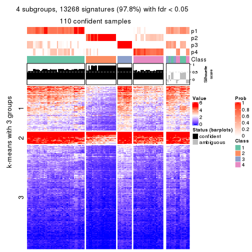</p>

</div>
<div id='tab-ATC-hclust-get-signatures-no-scale-4'>
<pre><code class="r">get_signatures(res, k = 5, scale_rows = FALSE)
</code></pre>

<p>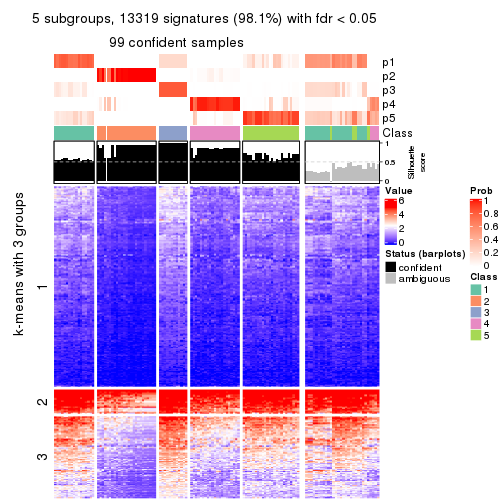</p>

</div>
<div id='tab-ATC-hclust-get-signatures-no-scale-5'>
<pre><code class="r">get_signatures(res, k = 6, scale_rows = FALSE)
</code></pre>

<p>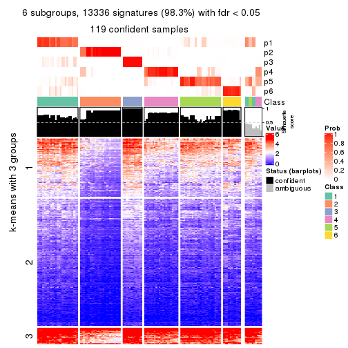</p>

</div>
</div>


Compare the overlap of signatures from different k:

```r
compare_signatures(res)
```

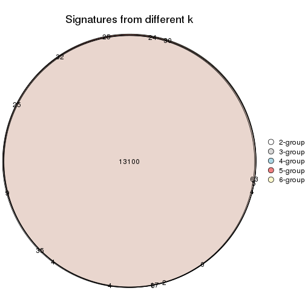

`get_signature()` returns a data frame invisibly. TO get the list of signatures, the function
call should be assigned to a variable explicitly. In following code, if `plot` argument is set
to `FALSE`, no heatmap is plotted while only the differential analysis is performed.

```r
# code only for demonstration
tb = get_signature(res, k = ..., plot = FALSE)
```

An example of the output of `tb` is:

```
#>   which_row         fdr    mean_1    mean_2 scaled_mean_1 scaled_mean_2 km
#> 1        38 0.042760348  8.373488  9.131774    -0.5533452     0.5164555  1
#> 2        40 0.018707592  7.106213  8.469186    -0.6173731     0.5762149  1
#> 3        55 0.019134737 10.221463 11.207825    -0.6159697     0.5749050  1
#> 4        59 0.006059896  5.921854  7.869574    -0.6899429     0.6439467  1
#> 5        60 0.018055526  8.928898 10.211722    -0.6204761     0.5791110  1
#> 6        98 0.009384629 15.714769 14.887706     0.6635654    -0.6193277  2
...
```

The columns in `tb` are:

1. `which_row`: row indices corresponding to the input matrix.
2. `fdr`: FDR for the differential test. 
3. `mean_x`: The mean value in group x.
4. `scaled_mean_x`: The mean value in group x after rows are scaled.
5. `km`: Row groups if k-means clustering is applied to rows.


UMAP plot which shows how samples are separated.


<script>
$( function() {
	$( '#tabs-ATC-hclust-dimension-reduction' ).tabs();
} );
</script>
<div id='tabs-ATC-hclust-dimension-reduction'>
<ul>
<li><a href='#tab-ATC-hclust-dimension-reduction-1'>k = 2</a></li>
<li><a href='#tab-ATC-hclust-dimension-reduction-2'>k = 3</a></li>
<li><a href='#tab-ATC-hclust-dimension-reduction-3'>k = 4</a></li>
<li><a href='#tab-ATC-hclust-dimension-reduction-4'>k = 5</a></li>
<li><a href='#tab-ATC-hclust-dimension-reduction-5'>k = 6</a></li>
</ul>
<div id='tab-ATC-hclust-dimension-reduction-1'>
<pre><code class="r">dimension_reduction(res, k = 2, method = &quot;UMAP&quot;)
</code></pre>

<p>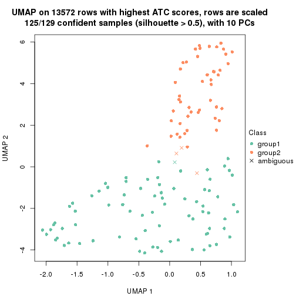</p>

</div>
<div id='tab-ATC-hclust-dimension-reduction-2'>
<pre><code class="r">dimension_reduction(res, k = 3, method = &quot;UMAP&quot;)
</code></pre>

<p>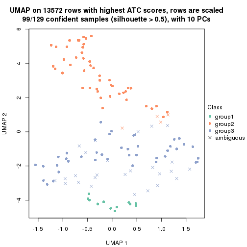</p>

</div>
<div id='tab-ATC-hclust-dimension-reduction-3'>
<pre><code class="r">dimension_reduction(res, k = 4, method = &quot;UMAP&quot;)
</code></pre>

<p>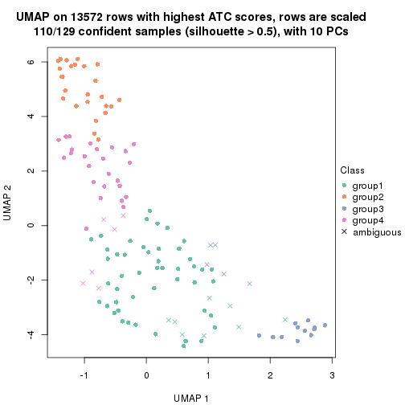</p>

</div>
<div id='tab-ATC-hclust-dimension-reduction-4'>
<pre><code class="r">dimension_reduction(res, k = 5, method = &quot;UMAP&quot;)
</code></pre>

<p>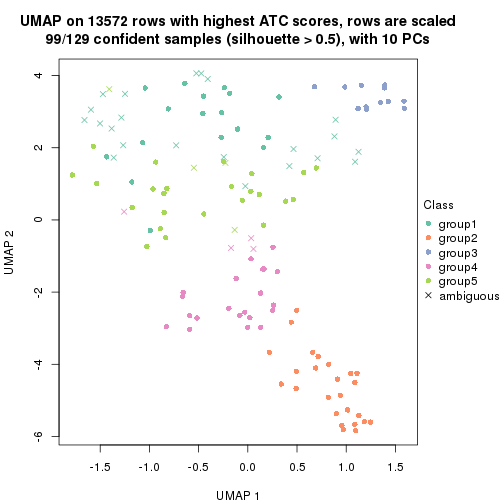</p>

</div>
<div id='tab-ATC-hclust-dimension-reduction-5'>
<pre><code class="r">dimension_reduction(res, k = 6, method = &quot;UMAP&quot;)
</code></pre>

<p>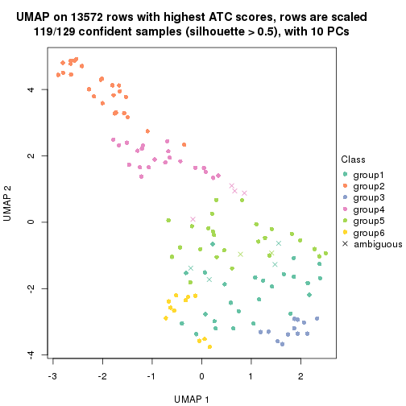</p>

</div>
</div>


Following heatmap shows how subgroups are split when increasing `k`:

```r
collect_classes(res)
```

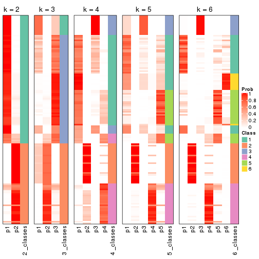


If matrix rows can be associated to genes, consider to use `GO_Enrichment(res,
...)` to perform function enrichment for the signature genes.


 

---------------------------------------------------


### ATC:kmeans**


The object with results only for a single top-value method and a single partition method 
can be extracted as:

```r
res = res_list["ATC", "kmeans"]
# you can also extract it by
# res = res_list["ATC:kmeans"]
```

A summary of `res` and all the functions that can be applied to it:

```r
res
```

```
#> A 'ConsensusPartition' object with k = 2, 3, 4, 5, 6.
#>   On a matrix with 13572 rows and 129 columns.
#>   Top rows (1000, 2000, 3000, 4000, 5000) are extracted by 'ATC' method.
#>   Subgroups are detected by 'kmeans' method.
#>   Performed in total 1250 partitions by row resampling.
#>   Best k for subgroups seems to be 3.
#> 
#> Following methods can be applied to this 'ConsensusPartition' object:
#>  [1] "cola_report"             "collect_classes"         "collect_plots"          
#>  [4] "collect_stats"           "colnames"                "compare_signatures"     
#>  [7] "consensus_heatmap"       "dimension_reduction"     "functional_enrichment"  
#> [10] "get_anno_col"            "get_anno"                "get_classes"            
#> [13] "get_consensus"           "get_matrix"              "get_membership"         
#> [16] "get_param"               "get_signatures"          "get_stats"              
#> [19] "is_best_k"               "is_stable_k"             "membership_heatmap"     
#> [22] "ncol"                    "nrow"                    "plot_ecdf"              
#> [25] "rownames"                "select_partition_number" "show"                   
#> [28] "suggest_best_k"          "test_to_known_factors"
```

`collect_plots()` function collects all the plots made from `res` for all `k` (number of partitions)
into one single page to provide an easy and fast comparison between different `k`.

```r
collect_plots(res)
```

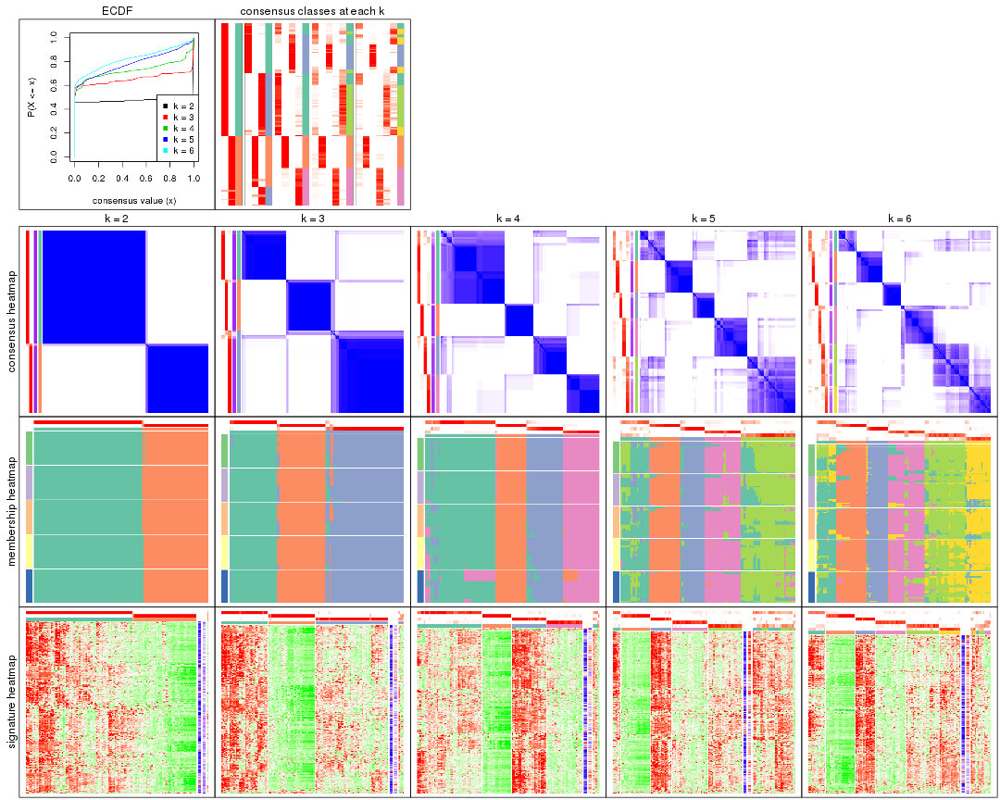

The plots are:

- The first row: a plot of the ECDF (Empirical cumulative distribution
  function) curves of the consensus matrix for each `k` and the heatmap of
  predicted classes for each `k`.
- The second row: heatmaps of the consensus matrix for each `k`.
- The third row: heatmaps of the membership matrix for each `k`.
- The fouth row: heatmaps of the signatures for each `k`.

All the plots in panels can be made by individual functions and they are
plotted later in this section.

`select_partition_number()` produces several plots showing different
statistics for choosing "optimized" `k`. There are following statistics:

- ECDF curves of the consensus matrix for each `k`;
- 1-PAC. [The PAC
  score](https://en.wikipedia.org/wiki/Consensus_clustering#Over-interpretation_potential_of_consensus_clustering)
  measures the proportion of the ambiguous subgrouping.
- Mean silhouette score.
- Concordance. The mean probability of fiting the consensus class ids in all
  partitions.
- Area increased. Denote $A_k$ as the area under the ECDF curve for current
  `k`, the area increased is defined as $A_k - A_{k-1}$.
- Rand index. The percent of pairs of samples that are both in a same cluster
  or both are not in a same cluster in the partition of k and k-1.
- Jaccard index. The ratio of pairs of samples are both in a same cluster in
  the partition of k and k-1 and the pairs of samples are both in a same
  cluster in the partition k or k-1.

The detailed explanations of these statistics can be found in [the cola
vignette](http://bioconductor.org/packages/devel/bioc/vignettes/cola/inst/doc/cola.html#toc_13).

Generally speaking, lower PAC score, higher mean silhouette score or higher
concordance corresponds to better partition. Rand index and Jaccard index
measure how similar the current partition is compared to partition with `k-1`.
If they are too similar, we won't accept `k` is better than `k-1`.

```r
select_partition_number(res)
```

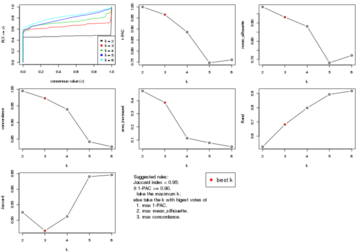

The numeric values for all these statistics can be obtained by `get_stats()`.

```r
get_stats(res)
```

```
#>   k 1-PAC mean_silhouette concordance area_increased  Rand Jaccard
#> 2 2 1.000           0.988       0.995         0.4729 0.525   0.525
#> 3 3 0.965           0.932       0.973         0.3844 0.682   0.466
#> 4 4 0.886           0.881       0.940         0.1143 0.798   0.512
#> 5 5 0.747           0.682       0.842         0.0785 0.893   0.641
#> 6 6 0.760           0.722       0.827         0.0489 0.918   0.646
```

`suggest_best_k()` suggests the best $k$ based on these statistics. The rules are as follows:

- All $k$ with Jaccard index larger than 0.95 are removed because the increase of
  the partition number does not provides enough extra information. If all $k$ are removed,
  the best $k$ is assigned by `NA`.
- For $k$ with 1-PAC larger than 0.9, the maximal $k$ is taken as the "best k". Other $k$ is called "optional k".
- If it does not fit the second rule. The $k$ with the highest vote of highest
  1-PAC, mean silhouette and concordance is taken as the "best k".

```r
suggest_best_k(res)
```

```
#> [1] 3
#> attr(,"optional")
#> [1] 2
```

There is also optional best $k$ = 2 that is worth to check.

Following shows the table of the partitions (You need to click the **show/hide
code output** link to see it). The membership matrix (columns with name `p*`)
is inferred by
[`clue::cl_consensus()`](https://www.rdocumentation.org/link/cl_consensus?package=clue)
function with the `SE` method. Basically the value in the membership matrix
represents the probability to belong to a certain group. The finall class
label for an item is determined with the group with highest probability it
belongs to.

In `get_classes()` function, the entropy is calculated from the membership
matrix and the silhouette score is calculated from the consensus matrix.


<script>
$( function() {
	$( '#tabs-ATC-kmeans-get-classes' ).tabs();
} );
</script>
<div id='tabs-ATC-kmeans-get-classes'>
<ul>
<li><a href='#tab-ATC-kmeans-get-classes-1'>k = 2</a></li>
<li><a href='#tab-ATC-kmeans-get-classes-2'>k = 3</a></li>
<li><a href='#tab-ATC-kmeans-get-classes-3'>k = 4</a></li>
<li><a href='#tab-ATC-kmeans-get-classes-4'>k = 5</a></li>
<li><a href='#tab-ATC-kmeans-get-classes-5'>k = 6</a></li>
</ul>

<div id='tab-ATC-kmeans-get-classes-1'>
<p><a id='tab-ATC-kmeans-get-classes-1-a' style='color:#0366d6' href='#'>show/hide code output</a></p>
<pre><code class="r">cbind(get_classes(res, k = 2), get_membership(res, k = 2))
</code></pre>

<pre><code>#&gt;            class entropy silhouette    p1    p2
#&gt; SRR1656463     2   0.000      0.987 0.000 1.000
#&gt; SRR1656464     1   0.000      1.000 1.000 0.000
#&gt; SRR1656462     1   0.000      1.000 1.000 0.000
#&gt; SRR1656465     1   0.000      1.000 1.000 0.000
#&gt; SRR1656467     2   0.000      0.987 0.000 1.000
#&gt; SRR1656466     1   0.000      1.000 1.000 0.000
#&gt; SRR1656468     2   0.000      0.987 0.000 1.000
#&gt; SRR1656472     1   0.000      1.000 1.000 0.000
#&gt; SRR1656471     1   0.000      1.000 1.000 0.000
#&gt; SRR1656470     2   0.000      0.987 0.000 1.000
#&gt; SRR1656469     1   0.000      1.000 1.000 0.000
#&gt; SRR1656473     2   0.000      0.987 0.000 1.000
#&gt; SRR1656474     2   0.000      0.987 0.000 1.000
#&gt; SRR1656475     2   0.000      0.987 0.000 1.000
#&gt; SRR1656478     1   0.000      1.000 1.000 0.000
#&gt; SRR1656477     1   0.000      1.000 1.000 0.000
#&gt; SRR1656479     1   0.000      1.000 1.000 0.000
#&gt; SRR1656480     2   0.000      0.987 0.000 1.000
#&gt; SRR1656476     2   0.000      0.987 0.000 1.000
#&gt; SRR1656481     2   0.980      0.292 0.416 0.584
#&gt; SRR1656482     2   0.000      0.987 0.000 1.000
#&gt; SRR1656483     2   0.000      0.987 0.000 1.000
#&gt; SRR1656485     1   0.000      1.000 1.000 0.000
#&gt; SRR1656487     1   0.000      1.000 1.000 0.000
#&gt; SRR1656486     1   0.000      1.000 1.000 0.000
#&gt; SRR1656488     1   0.000      1.000 1.000 0.000
#&gt; SRR1656484     1   0.000      1.000 1.000 0.000
#&gt; SRR1656489     1   0.000      1.000 1.000 0.000
#&gt; SRR1656491     1   0.000      1.000 1.000 0.000
#&gt; SRR1656490     1   0.000      1.000 1.000 0.000
#&gt; SRR1656492     1   0.000      1.000 1.000 0.000
#&gt; SRR1656493     1   0.000      1.000 1.000 0.000
#&gt; SRR1656495     1   0.000      1.000 1.000 0.000
#&gt; SRR1656496     1   0.000      1.000 1.000 0.000
#&gt; SRR1656494     2   0.000      0.987 0.000 1.000
#&gt; SRR1656497     2   0.000      0.987 0.000 1.000
#&gt; SRR1656499     1   0.000      1.000 1.000 0.000
#&gt; SRR1656500     1   0.000      1.000 1.000 0.000
#&gt; SRR1656501     1   0.000      1.000 1.000 0.000
#&gt; SRR1656498     1   0.000      1.000 1.000 0.000
#&gt; SRR1656504     2   0.000      0.987 0.000 1.000
#&gt; SRR1656502     1   0.000      1.000 1.000 0.000
#&gt; SRR1656503     1   0.000      1.000 1.000 0.000
#&gt; SRR1656507     1   0.000      1.000 1.000 0.000
#&gt; SRR1656508     1   0.000      1.000 1.000 0.000
#&gt; SRR1656505     2   0.000      0.987 0.000 1.000
#&gt; SRR1656506     1   0.000      1.000 1.000 0.000
#&gt; SRR1656509     1   0.000      1.000 1.000 0.000
#&gt; SRR1656510     2   0.000      0.987 0.000 1.000
#&gt; SRR1656511     2   0.000      0.987 0.000 1.000
#&gt; SRR1656513     2   0.000      0.987 0.000 1.000
#&gt; SRR1656512     2   0.000      0.987 0.000 1.000
#&gt; SRR1656514     1   0.000      1.000 1.000 0.000
#&gt; SRR1656515     2   0.000      0.987 0.000 1.000
#&gt; SRR1656516     1   0.000      1.000 1.000 0.000
#&gt; SRR1656518     1   0.000      1.000 1.000 0.000
#&gt; SRR1656517     1   0.000      1.000 1.000 0.000
#&gt; SRR1656519     1   0.000      1.000 1.000 0.000
#&gt; SRR1656522     1   0.000      1.000 1.000 0.000
#&gt; SRR1656523     2   0.000      0.987 0.000 1.000
#&gt; SRR1656521     2   0.000      0.987 0.000 1.000
#&gt; SRR1656520     1   0.000      1.000 1.000 0.000
#&gt; SRR1656524     1   0.000      1.000 1.000 0.000
#&gt; SRR1656525     1   0.000      1.000 1.000 0.000
#&gt; SRR1656526     2   0.000      0.987 0.000 1.000
#&gt; SRR1656527     2   0.000      0.987 0.000 1.000
#&gt; SRR1656530     1   0.000      1.000 1.000 0.000
#&gt; SRR1656529     1   0.000      1.000 1.000 0.000
#&gt; SRR1656531     1   0.000      1.000 1.000 0.000
#&gt; SRR1656528     1   0.000      1.000 1.000 0.000
#&gt; SRR1656534     1   0.000      1.000 1.000 0.000
#&gt; SRR1656533     1   0.000      1.000 1.000 0.000
#&gt; SRR1656536     1   0.000      1.000 1.000 0.000
#&gt; SRR1656532     2   0.000      0.987 0.000 1.000
#&gt; SRR1656537     1   0.000      1.000 1.000 0.000
#&gt; SRR1656538     1   0.000      1.000 1.000 0.000
#&gt; SRR1656535     2   0.000      0.987 0.000 1.000
#&gt; SRR1656539     1   0.000      1.000 1.000 0.000
#&gt; SRR1656544     1   0.000      1.000 1.000 0.000
#&gt; SRR1656542     1   0.000      1.000 1.000 0.000
#&gt; SRR1656543     1   0.000      1.000 1.000 0.000
#&gt; SRR1656545     2   0.000      0.987 0.000 1.000
#&gt; SRR1656540     1   0.000      1.000 1.000 0.000
#&gt; SRR1656546     2   0.000      0.987 0.000 1.000
#&gt; SRR1656541     2   0.000      0.987 0.000 1.000
#&gt; SRR1656547     2   0.000      0.987 0.000 1.000
#&gt; SRR1656548     1   0.000      1.000 1.000 0.000
#&gt; SRR1656549     1   0.000      1.000 1.000 0.000
#&gt; SRR1656551     1   0.000      1.000 1.000 0.000
#&gt; SRR1656553     1   0.000      1.000 1.000 0.000
#&gt; SRR1656550     2   0.738      0.736 0.208 0.792
#&gt; SRR1656552     2   0.000      0.987 0.000 1.000
#&gt; SRR1656554     1   0.000      1.000 1.000 0.000
#&gt; SRR1656555     2   0.000      0.987 0.000 1.000
#&gt; SRR1656556     1   0.000      1.000 1.000 0.000
#&gt; SRR1656557     1   0.000      1.000 1.000 0.000
#&gt; SRR1656558     1   0.000      1.000 1.000 0.000
#&gt; SRR1656559     1   0.000      1.000 1.000 0.000
#&gt; SRR1656560     1   0.000      1.000 1.000 0.000
#&gt; SRR1656561     1   0.000      1.000 1.000 0.000
#&gt; SRR1656562     2   0.000      0.987 0.000 1.000
#&gt; SRR1656563     1   0.000      1.000 1.000 0.000
#&gt; SRR1656564     2   0.000      0.987 0.000 1.000
#&gt; SRR1656565     2   0.000      0.987 0.000 1.000
#&gt; SRR1656566     1   0.000      1.000 1.000 0.000
#&gt; SRR1656568     2   0.000      0.987 0.000 1.000
#&gt; SRR1656567     2   0.000      0.987 0.000 1.000
#&gt; SRR1656569     1   0.000      1.000 1.000 0.000
#&gt; SRR1656570     1   0.000      1.000 1.000 0.000
#&gt; SRR1656571     2   0.000      0.987 0.000 1.000
#&gt; SRR1656573     1   0.000      1.000 1.000 0.000
#&gt; SRR1656572     2   0.000      0.987 0.000 1.000
#&gt; SRR1656574     1   0.000      1.000 1.000 0.000
#&gt; SRR1656575     1   0.000      1.000 1.000 0.000
#&gt; SRR1656576     2   0.000      0.987 0.000 1.000
#&gt; SRR1656578     2   0.000      0.987 0.000 1.000
#&gt; SRR1656577     1   0.000      1.000 1.000 0.000
#&gt; SRR1656579     2   0.000      0.987 0.000 1.000
#&gt; SRR1656580     1   0.000      1.000 1.000 0.000
#&gt; SRR1656581     2   0.000      0.987 0.000 1.000
#&gt; SRR1656582     2   0.000      0.987 0.000 1.000
#&gt; SRR1656585     1   0.000      1.000 1.000 0.000
#&gt; SRR1656584     1   0.000      1.000 1.000 0.000
#&gt; SRR1656583     1   0.000      1.000 1.000 0.000
#&gt; SRR1656586     2   0.000      0.987 0.000 1.000
#&gt; SRR1656587     1   0.000      1.000 1.000 0.000
#&gt; SRR1656588     2   0.000      0.987 0.000 1.000
#&gt; SRR1656589     2   0.000      0.987 0.000 1.000
#&gt; SRR1656590     1   0.000      1.000 1.000 0.000
</code></pre>

<script>
$('#tab-ATC-kmeans-get-classes-1-a').parent().next().next().hide();
$('#tab-ATC-kmeans-get-classes-1-a').click(function(){
  $('#tab-ATC-kmeans-get-classes-1-a').parent().next().next().toggle();
  return(false);
});
</script>
</div>

<div id='tab-ATC-kmeans-get-classes-2'>
<p><a id='tab-ATC-kmeans-get-classes-2-a' style='color:#0366d6' href='#'>show/hide code output</a></p>
<pre><code class="r">cbind(get_classes(res, k = 3), get_membership(res, k = 3))
</code></pre>

<pre><code>#&gt;            class entropy silhouette    p1    p2    p3
#&gt; SRR1656463     2  0.0000     0.9793 0.000 1.000 0.000
#&gt; SRR1656464     1  0.0000     0.9862 1.000 0.000 0.000
#&gt; SRR1656462     1  0.0000     0.9862 1.000 0.000 0.000
#&gt; SRR1656465     3  0.0000     0.9563 0.000 0.000 1.000
#&gt; SRR1656467     2  0.0000     0.9793 0.000 1.000 0.000
#&gt; SRR1656466     3  0.0000     0.9563 0.000 0.000 1.000
#&gt; SRR1656468     3  0.0237     0.9539 0.000 0.004 0.996
#&gt; SRR1656472     1  0.2356     0.9167 0.928 0.000 0.072
#&gt; SRR1656471     1  0.0000     0.9862 1.000 0.000 0.000
#&gt; SRR1656470     2  0.0000     0.9793 0.000 1.000 0.000
#&gt; SRR1656469     3  0.0000     0.9563 0.000 0.000 1.000
#&gt; SRR1656473     2  0.0000     0.9793 0.000 1.000 0.000
#&gt; SRR1656474     2  0.0000     0.9793 0.000 1.000 0.000
#&gt; SRR1656475     2  0.0000     0.9793 0.000 1.000 0.000
#&gt; SRR1656478     3  0.0592     0.9486 0.012 0.000 0.988
#&gt; SRR1656477     3  0.0000     0.9563 0.000 0.000 1.000
#&gt; SRR1656479     3  0.0000     0.9563 0.000 0.000 1.000
#&gt; SRR1656480     3  0.0237     0.9539 0.000 0.004 0.996
#&gt; SRR1656476     2  0.0000     0.9793 0.000 1.000 0.000
#&gt; SRR1656481     3  0.0000     0.9563 0.000 0.000 1.000
#&gt; SRR1656482     2  0.0000     0.9793 0.000 1.000 0.000
#&gt; SRR1656483     2  0.0000     0.9793 0.000 1.000 0.000
#&gt; SRR1656485     1  0.0237     0.9841 0.996 0.000 0.004
#&gt; SRR1656487     3  0.0000     0.9563 0.000 0.000 1.000
#&gt; SRR1656486     3  0.0000     0.9563 0.000 0.000 1.000
#&gt; SRR1656488     1  0.0000     0.9862 1.000 0.000 0.000
#&gt; SRR1656484     3  0.1031     0.9387 0.024 0.000 0.976
#&gt; SRR1656489     1  0.0237     0.9841 0.996 0.000 0.004
#&gt; SRR1656491     3  0.0000     0.9563 0.000 0.000 1.000
#&gt; SRR1656490     3  0.0000     0.9563 0.000 0.000 1.000
#&gt; SRR1656492     3  0.0000     0.9563 0.000 0.000 1.000
#&gt; SRR1656493     3  0.0000     0.9563 0.000 0.000 1.000
#&gt; SRR1656495     3  0.0000     0.9563 0.000 0.000 1.000
#&gt; SRR1656496     3  0.0000     0.9563 0.000 0.000 1.000
#&gt; SRR1656494     3  0.0237     0.9539 0.000 0.004 0.996
#&gt; SRR1656497     2  0.0000     0.9793 0.000 1.000 0.000
#&gt; SRR1656499     1  0.0000     0.9862 1.000 0.000 0.000
#&gt; SRR1656500     1  0.0000     0.9862 1.000 0.000 0.000
#&gt; SRR1656501     3  0.0000     0.9563 0.000 0.000 1.000
#&gt; SRR1656498     1  0.0000     0.9862 1.000 0.000 0.000
#&gt; SRR1656504     2  0.0000     0.9793 0.000 1.000 0.000
#&gt; SRR1656502     1  0.3412     0.8583 0.876 0.000 0.124
#&gt; SRR1656503     3  0.0000     0.9563 0.000 0.000 1.000
#&gt; SRR1656507     3  0.0000     0.9563 0.000 0.000 1.000
#&gt; SRR1656508     1  0.0000     0.9862 1.000 0.000 0.000
#&gt; SRR1656505     3  0.0237     0.9539 0.000 0.004 0.996
#&gt; SRR1656506     3  0.0000     0.9563 0.000 0.000 1.000
#&gt; SRR1656509     3  0.0592     0.9486 0.012 0.000 0.988
#&gt; SRR1656510     3  0.6235     0.2309 0.000 0.436 0.564
#&gt; SRR1656511     2  0.0000     0.9793 0.000 1.000 0.000
#&gt; SRR1656513     2  0.0000     0.9793 0.000 1.000 0.000
#&gt; SRR1656512     2  0.0000     0.9793 0.000 1.000 0.000
#&gt; SRR1656514     1  0.0000     0.9862 1.000 0.000 0.000
#&gt; SRR1656515     2  0.0000     0.9793 0.000 1.000 0.000
#&gt; SRR1656516     3  0.0000     0.9563 0.000 0.000 1.000
#&gt; SRR1656518     3  0.0000     0.9563 0.000 0.000 1.000
#&gt; SRR1656517     1  0.0000     0.9862 1.000 0.000 0.000
#&gt; SRR1656519     1  0.0000     0.9862 1.000 0.000 0.000
#&gt; SRR1656522     1  0.0000     0.9862 1.000 0.000 0.000
#&gt; SRR1656523     3  0.5431     0.5888 0.000 0.284 0.716
#&gt; SRR1656521     2  0.0000     0.9793 0.000 1.000 0.000
#&gt; SRR1656520     1  0.0000     0.9862 1.000 0.000 0.000
#&gt; SRR1656524     3  0.0000     0.9563 0.000 0.000 1.000
#&gt; SRR1656525     3  0.5560     0.5620 0.300 0.000 0.700
#&gt; SRR1656526     2  0.0000     0.9793 0.000 1.000 0.000
#&gt; SRR1656527     2  0.0000     0.9793 0.000 1.000 0.000
#&gt; SRR1656530     3  0.0000     0.9563 0.000 0.000 1.000
#&gt; SRR1656529     3  0.0000     0.9563 0.000 0.000 1.000
#&gt; SRR1656531     1  0.0237     0.9841 0.996 0.000 0.004
#&gt; SRR1656528     3  0.6302     0.0938 0.480 0.000 0.520
#&gt; SRR1656534     1  0.0000     0.9862 1.000 0.000 0.000
#&gt; SRR1656533     1  0.0000     0.9862 1.000 0.000 0.000
#&gt; SRR1656536     3  0.0000     0.9563 0.000 0.000 1.000
#&gt; SRR1656532     2  0.0747     0.9640 0.000 0.984 0.016
#&gt; SRR1656537     1  0.0000     0.9862 1.000 0.000 0.000
#&gt; SRR1656538     1  0.0000     0.9862 1.000 0.000 0.000
#&gt; SRR1656535     2  0.0000     0.9793 0.000 1.000 0.000
#&gt; SRR1656539     3  0.0000     0.9563 0.000 0.000 1.000
#&gt; SRR1656544     1  0.0237     0.9841 0.996 0.000 0.004
#&gt; SRR1656542     1  0.0237     0.9841 0.996 0.000 0.004
#&gt; SRR1656543     1  0.0000     0.9862 1.000 0.000 0.000
#&gt; SRR1656545     2  0.0000     0.9793 0.000 1.000 0.000
#&gt; SRR1656540     1  0.0000     0.9862 1.000 0.000 0.000
#&gt; SRR1656546     3  0.0237     0.9539 0.000 0.004 0.996
#&gt; SRR1656541     2  0.0000     0.9793 0.000 1.000 0.000
#&gt; SRR1656547     2  0.0000     0.9793 0.000 1.000 0.000
#&gt; SRR1656548     3  0.1031     0.9387 0.024 0.000 0.976
#&gt; SRR1656549     3  0.0000     0.9563 0.000 0.000 1.000
#&gt; SRR1656551     3  0.0000     0.9563 0.000 0.000 1.000
#&gt; SRR1656553     3  0.5363     0.6065 0.276 0.000 0.724
#&gt; SRR1656550     3  0.0000     0.9563 0.000 0.000 1.000
#&gt; SRR1656552     2  0.0000     0.9793 0.000 1.000 0.000
#&gt; SRR1656554     3  0.0000     0.9563 0.000 0.000 1.000
#&gt; SRR1656555     3  0.0237     0.9539 0.000 0.004 0.996
#&gt; SRR1656556     1  0.0237     0.9841 0.996 0.000 0.004
#&gt; SRR1656557     1  0.0000     0.9862 1.000 0.000 0.000
#&gt; SRR1656558     3  0.0592     0.9486 0.012 0.000 0.988
#&gt; SRR1656559     1  0.0000     0.9862 1.000 0.000 0.000
#&gt; SRR1656560     1  0.4291     0.7754 0.820 0.000 0.180
#&gt; SRR1656561     3  0.0000     0.9563 0.000 0.000 1.000
#&gt; SRR1656562     3  0.0237     0.9539 0.000 0.004 0.996
#&gt; SRR1656563     1  0.0000     0.9862 1.000 0.000 0.000
#&gt; SRR1656564     2  0.0000     0.9793 0.000 1.000 0.000
#&gt; SRR1656565     2  0.5835     0.4839 0.000 0.660 0.340
#&gt; SRR1656566     3  0.0000     0.9563 0.000 0.000 1.000
#&gt; SRR1656568     2  0.0000     0.9793 0.000 1.000 0.000
#&gt; SRR1656567     2  0.5431     0.6002 0.000 0.716 0.284
#&gt; SRR1656569     3  0.0000     0.9563 0.000 0.000 1.000
#&gt; SRR1656570     3  0.0592     0.9486 0.012 0.000 0.988
#&gt; SRR1656571     2  0.0000     0.9793 0.000 1.000 0.000
#&gt; SRR1656573     3  0.0000     0.9563 0.000 0.000 1.000
#&gt; SRR1656572     2  0.0000     0.9793 0.000 1.000 0.000
#&gt; SRR1656574     1  0.0000     0.9862 1.000 0.000 0.000
#&gt; SRR1656575     3  0.0592     0.9486 0.012 0.000 0.988
#&gt; SRR1656576     2  0.0000     0.9793 0.000 1.000 0.000
#&gt; SRR1656578     2  0.0000     0.9793 0.000 1.000 0.000
#&gt; SRR1656577     1  0.0000     0.9862 1.000 0.000 0.000
#&gt; SRR1656579     2  0.0000     0.9793 0.000 1.000 0.000
#&gt; SRR1656580     1  0.0000     0.9862 1.000 0.000 0.000
#&gt; SRR1656581     3  0.0000     0.9563 0.000 0.000 1.000
#&gt; SRR1656582     2  0.0000     0.9793 0.000 1.000 0.000
#&gt; SRR1656585     3  0.0000     0.9563 0.000 0.000 1.000
#&gt; SRR1656584     3  0.0000     0.9563 0.000 0.000 1.000
#&gt; SRR1656583     3  0.0000     0.9563 0.000 0.000 1.000
#&gt; SRR1656586     2  0.0000     0.9793 0.000 1.000 0.000
#&gt; SRR1656587     3  0.0000     0.9563 0.000 0.000 1.000
#&gt; SRR1656588     3  0.6307     0.0157 0.000 0.488 0.512
#&gt; SRR1656589     2  0.0000     0.9793 0.000 1.000 0.000
#&gt; SRR1656590     1  0.0747     0.9736 0.984 0.000 0.016
</code></pre>

<script>
$('#tab-ATC-kmeans-get-classes-2-a').parent().next().next().hide();
$('#tab-ATC-kmeans-get-classes-2-a').click(function(){
  $('#tab-ATC-kmeans-get-classes-2-a').parent().next().next().toggle();
  return(false);
});
</script>
</div>

<div id='tab-ATC-kmeans-get-classes-3'>
<p><a id='tab-ATC-kmeans-get-classes-3-a' style='color:#0366d6' href='#'>show/hide code output</a></p>
<pre><code class="r">cbind(get_classes(res, k = 4), get_membership(res, k = 4))
</code></pre>

<pre><code>#&gt;            class entropy silhouette    p1    p2    p3    p4
#&gt; SRR1656463     2  0.0000     0.9815 0.000 1.000 0.000 0.000
#&gt; SRR1656464     3  0.0000     0.9303 0.000 0.000 1.000 0.000
#&gt; SRR1656462     3  0.0000     0.9303 0.000 0.000 1.000 0.000
#&gt; SRR1656465     1  0.1716     0.9017 0.936 0.000 0.000 0.064
#&gt; SRR1656467     4  0.2281     0.9122 0.000 0.096 0.000 0.904
#&gt; SRR1656466     1  0.1716     0.9017 0.936 0.000 0.000 0.064
#&gt; SRR1656468     4  0.0000     0.9594 0.000 0.000 0.000 1.000
#&gt; SRR1656472     1  0.4250     0.5908 0.724 0.000 0.276 0.000
#&gt; SRR1656471     3  0.0000     0.9303 0.000 0.000 1.000 0.000
#&gt; SRR1656470     2  0.0000     0.9815 0.000 1.000 0.000 0.000
#&gt; SRR1656469     1  0.2281     0.8847 0.904 0.000 0.000 0.096
#&gt; SRR1656473     2  0.0000     0.9815 0.000 1.000 0.000 0.000
#&gt; SRR1656474     2  0.0000     0.9815 0.000 1.000 0.000 0.000
#&gt; SRR1656475     2  0.0000     0.9815 0.000 1.000 0.000 0.000
#&gt; SRR1656478     1  0.0000     0.8949 1.000 0.000 0.000 0.000
#&gt; SRR1656477     4  0.0000     0.9594 0.000 0.000 0.000 1.000
#&gt; SRR1656479     1  0.1716     0.9017 0.936 0.000 0.000 0.064
#&gt; SRR1656480     4  0.0000     0.9594 0.000 0.000 0.000 1.000
#&gt; SRR1656476     2  0.0000     0.9815 0.000 1.000 0.000 0.000
#&gt; SRR1656481     4  0.0000     0.9594 0.000 0.000 0.000 1.000
#&gt; SRR1656482     2  0.4804     0.3287 0.000 0.616 0.000 0.384
#&gt; SRR1656483     2  0.0000     0.9815 0.000 1.000 0.000 0.000
#&gt; SRR1656485     3  0.4961     0.1920 0.448 0.000 0.552 0.000
#&gt; SRR1656487     1  0.1716     0.9017 0.936 0.000 0.000 0.064
#&gt; SRR1656486     1  0.2281     0.8847 0.904 0.000 0.000 0.096
#&gt; SRR1656488     3  0.3873     0.7215 0.228 0.000 0.772 0.000
#&gt; SRR1656484     1  0.0000     0.8949 1.000 0.000 0.000 0.000
#&gt; SRR1656489     1  0.4585     0.4304 0.668 0.000 0.332 0.000
#&gt; SRR1656491     1  0.1716     0.9017 0.936 0.000 0.000 0.064
#&gt; SRR1656490     1  0.2011     0.8942 0.920 0.000 0.000 0.080
#&gt; SRR1656492     1  0.1716     0.9017 0.936 0.000 0.000 0.064
#&gt; SRR1656493     1  0.0000     0.8949 1.000 0.000 0.000 0.000
#&gt; SRR1656495     1  0.4193     0.6275 0.732 0.000 0.000 0.268
#&gt; SRR1656496     1  0.1716     0.9017 0.936 0.000 0.000 0.064
#&gt; SRR1656494     4  0.0000     0.9594 0.000 0.000 0.000 1.000
#&gt; SRR1656497     2  0.0000     0.9815 0.000 1.000 0.000 0.000
#&gt; SRR1656499     3  0.0000     0.9303 0.000 0.000 1.000 0.000
#&gt; SRR1656500     3  0.0000     0.9303 0.000 0.000 1.000 0.000
#&gt; SRR1656501     1  0.0000     0.8949 1.000 0.000 0.000 0.000
#&gt; SRR1656498     3  0.0921     0.9198 0.028 0.000 0.972 0.000
#&gt; SRR1656504     2  0.0000     0.9815 0.000 1.000 0.000 0.000
#&gt; SRR1656502     1  0.4250     0.5908 0.724 0.000 0.276 0.000
#&gt; SRR1656503     1  0.0921     0.8989 0.972 0.000 0.000 0.028
#&gt; SRR1656507     1  0.0000     0.8949 1.000 0.000 0.000 0.000
#&gt; SRR1656508     3  0.2469     0.8780 0.108 0.000 0.892 0.000
#&gt; SRR1656505     4  0.0000     0.9594 0.000 0.000 0.000 1.000
#&gt; SRR1656506     1  0.1716     0.9017 0.936 0.000 0.000 0.064
#&gt; SRR1656509     1  0.0000     0.8949 1.000 0.000 0.000 0.000
#&gt; SRR1656510     4  0.0000     0.9594 0.000 0.000 0.000 1.000
#&gt; SRR1656511     4  0.1716     0.9392 0.000 0.064 0.000 0.936
#&gt; SRR1656513     4  0.1716     0.9392 0.000 0.064 0.000 0.936
#&gt; SRR1656512     2  0.0000     0.9815 0.000 1.000 0.000 0.000
#&gt; SRR1656514     3  0.0000     0.9303 0.000 0.000 1.000 0.000
#&gt; SRR1656515     4  0.3219     0.8328 0.000 0.164 0.000 0.836
#&gt; SRR1656516     1  0.0000     0.8949 1.000 0.000 0.000 0.000
#&gt; SRR1656518     1  0.0000     0.8949 1.000 0.000 0.000 0.000
#&gt; SRR1656517     3  0.0921     0.9198 0.028 0.000 0.972 0.000
#&gt; SRR1656519     3  0.0000     0.9303 0.000 0.000 1.000 0.000
#&gt; SRR1656522     3  0.0000     0.9303 0.000 0.000 1.000 0.000
#&gt; SRR1656523     4  0.0000     0.9594 0.000 0.000 0.000 1.000
#&gt; SRR1656521     2  0.0000     0.9815 0.000 1.000 0.000 0.000
#&gt; SRR1656520     3  0.0000     0.9303 0.000 0.000 1.000 0.000
#&gt; SRR1656524     1  0.0000     0.8949 1.000 0.000 0.000 0.000
#&gt; SRR1656525     1  0.0000     0.8949 1.000 0.000 0.000 0.000
#&gt; SRR1656526     2  0.0000     0.9815 0.000 1.000 0.000 0.000
#&gt; SRR1656527     2  0.0000     0.9815 0.000 1.000 0.000 0.000
#&gt; SRR1656530     1  0.1716     0.9017 0.936 0.000 0.000 0.064
#&gt; SRR1656529     1  0.1716     0.9017 0.936 0.000 0.000 0.064
#&gt; SRR1656531     1  0.4304     0.5758 0.716 0.000 0.284 0.000
#&gt; SRR1656528     1  0.1716     0.9017 0.936 0.000 0.000 0.064
#&gt; SRR1656534     3  0.0000     0.9303 0.000 0.000 1.000 0.000
#&gt; SRR1656533     3  0.2469     0.8780 0.108 0.000 0.892 0.000
#&gt; SRR1656536     1  0.2281     0.8847 0.904 0.000 0.000 0.096
#&gt; SRR1656532     4  0.1716     0.9392 0.000 0.064 0.000 0.936
#&gt; SRR1656537     3  0.1716     0.8993 0.064 0.000 0.936 0.000
#&gt; SRR1656538     3  0.3219     0.8105 0.164 0.000 0.836 0.000
#&gt; SRR1656535     2  0.0000     0.9815 0.000 1.000 0.000 0.000
#&gt; SRR1656539     1  0.1716     0.9017 0.936 0.000 0.000 0.064
#&gt; SRR1656544     1  0.4994    -0.0828 0.520 0.000 0.480 0.000
#&gt; SRR1656542     1  0.2814     0.7806 0.868 0.000 0.132 0.000
#&gt; SRR1656543     3  0.0000     0.9303 0.000 0.000 1.000 0.000
#&gt; SRR1656545     2  0.0000     0.9815 0.000 1.000 0.000 0.000
#&gt; SRR1656540     3  0.0000     0.9303 0.000 0.000 1.000 0.000
#&gt; SRR1656546     4  0.0000     0.9594 0.000 0.000 0.000 1.000
#&gt; SRR1656541     2  0.0000     0.9815 0.000 1.000 0.000 0.000
#&gt; SRR1656547     4  0.1716     0.9392 0.000 0.064 0.000 0.936
#&gt; SRR1656548     1  0.1716     0.9017 0.936 0.000 0.000 0.064
#&gt; SRR1656549     1  0.2011     0.8942 0.920 0.000 0.000 0.080
#&gt; SRR1656551     1  0.4916     0.4051 0.576 0.000 0.000 0.424
#&gt; SRR1656553     1  0.0000     0.8949 1.000 0.000 0.000 0.000
#&gt; SRR1656550     4  0.0000     0.9594 0.000 0.000 0.000 1.000
#&gt; SRR1656552     4  0.1716     0.9392 0.000 0.064 0.000 0.936
#&gt; SRR1656554     1  0.1716     0.9017 0.936 0.000 0.000 0.064
#&gt; SRR1656555     4  0.0000     0.9594 0.000 0.000 0.000 1.000
#&gt; SRR1656556     3  0.3024     0.8228 0.148 0.000 0.852 0.000
#&gt; SRR1656557     3  0.0000     0.9303 0.000 0.000 1.000 0.000
#&gt; SRR1656558     1  0.0000     0.8949 1.000 0.000 0.000 0.000
#&gt; SRR1656559     3  0.0000     0.9303 0.000 0.000 1.000 0.000
#&gt; SRR1656560     1  0.3764     0.7103 0.784 0.000 0.216 0.000
#&gt; SRR1656561     1  0.1716     0.9017 0.936 0.000 0.000 0.064
#&gt; SRR1656562     4  0.0000     0.9594 0.000 0.000 0.000 1.000
#&gt; SRR1656563     3  0.4008     0.7412 0.244 0.000 0.756 0.000
#&gt; SRR1656564     2  0.0000     0.9815 0.000 1.000 0.000 0.000
#&gt; SRR1656565     4  0.0000     0.9594 0.000 0.000 0.000 1.000
#&gt; SRR1656566     1  0.0000     0.8949 1.000 0.000 0.000 0.000
#&gt; SRR1656568     2  0.0000     0.9815 0.000 1.000 0.000 0.000
#&gt; SRR1656567     4  0.0000     0.9594 0.000 0.000 0.000 1.000
#&gt; SRR1656569     1  0.1716     0.9017 0.936 0.000 0.000 0.064
#&gt; SRR1656570     1  0.0000     0.8949 1.000 0.000 0.000 0.000
#&gt; SRR1656571     2  0.0000     0.9815 0.000 1.000 0.000 0.000
#&gt; SRR1656573     1  0.4477     0.6344 0.688 0.000 0.000 0.312
#&gt; SRR1656572     4  0.1716     0.9392 0.000 0.064 0.000 0.936
#&gt; SRR1656574     3  0.0000     0.9303 0.000 0.000 1.000 0.000
#&gt; SRR1656575     1  0.0000     0.8949 1.000 0.000 0.000 0.000
#&gt; SRR1656576     4  0.1716     0.9392 0.000 0.064 0.000 0.936
#&gt; SRR1656578     4  0.2281     0.9122 0.000 0.096 0.000 0.904
#&gt; SRR1656577     3  0.0000     0.9303 0.000 0.000 1.000 0.000
#&gt; SRR1656579     4  0.1716     0.9392 0.000 0.064 0.000 0.936
#&gt; SRR1656580     3  0.0817     0.9203 0.024 0.000 0.976 0.000
#&gt; SRR1656581     4  0.0000     0.9594 0.000 0.000 0.000 1.000
#&gt; SRR1656582     2  0.0000     0.9815 0.000 1.000 0.000 0.000
#&gt; SRR1656585     1  0.1716     0.9017 0.936 0.000 0.000 0.064
#&gt; SRR1656584     1  0.0000     0.8949 1.000 0.000 0.000 0.000
#&gt; SRR1656583     1  0.1716     0.9017 0.936 0.000 0.000 0.064
#&gt; SRR1656586     2  0.0000     0.9815 0.000 1.000 0.000 0.000
#&gt; SRR1656587     1  0.4585     0.6005 0.668 0.000 0.000 0.332
#&gt; SRR1656588     4  0.0000     0.9594 0.000 0.000 0.000 1.000
#&gt; SRR1656589     2  0.0000     0.9815 0.000 1.000 0.000 0.000
#&gt; SRR1656590     1  0.0000     0.8949 1.000 0.000 0.000 0.000
</code></pre>

<script>
$('#tab-ATC-kmeans-get-classes-3-a').parent().next().next().hide();
$('#tab-ATC-kmeans-get-classes-3-a').click(function(){
  $('#tab-ATC-kmeans-get-classes-3-a').parent().next().next().toggle();
  return(false);
});
</script>
</div>

<div id='tab-ATC-kmeans-get-classes-4'>
<p><a id='tab-ATC-kmeans-get-classes-4-a' style='color:#0366d6' href='#'>show/hide code output</a></p>
<pre><code class="r">cbind(get_classes(res, k = 5), get_membership(res, k = 5))
</code></pre>

<pre><code>#&gt;            class entropy silhouette    p1    p2    p3    p4    p5
#&gt; SRR1656463     2  0.0880     0.9441 0.032 0.968 0.000 0.000 0.000
#&gt; SRR1656464     3  0.0000     0.9045 0.000 0.000 1.000 0.000 0.000
#&gt; SRR1656462     3  0.0000     0.9045 0.000 0.000 1.000 0.000 0.000
#&gt; SRR1656465     5  0.0404     0.7017 0.012 0.000 0.000 0.000 0.988
#&gt; SRR1656467     4  0.3875     0.8291 0.124 0.072 0.000 0.804 0.000
#&gt; SRR1656466     5  0.0794     0.6991 0.028 0.000 0.000 0.000 0.972
#&gt; SRR1656468     4  0.0404     0.9131 0.012 0.000 0.000 0.988 0.000
#&gt; SRR1656472     1  0.3593     0.6245 0.828 0.000 0.088 0.000 0.084
#&gt; SRR1656471     3  0.5275     0.4356 0.276 0.000 0.640 0.000 0.084
#&gt; SRR1656470     2  0.0000     0.9486 0.000 1.000 0.000 0.000 0.000
#&gt; SRR1656469     5  0.3409     0.6129 0.032 0.000 0.000 0.144 0.824
#&gt; SRR1656473     2  0.0000     0.9486 0.000 1.000 0.000 0.000 0.000
#&gt; SRR1656474     2  0.0000     0.9486 0.000 1.000 0.000 0.000 0.000
#&gt; SRR1656475     2  0.0000     0.9486 0.000 1.000 0.000 0.000 0.000
#&gt; SRR1656478     1  0.3999     0.4584 0.656 0.000 0.000 0.000 0.344
#&gt; SRR1656477     4  0.4063     0.5796 0.012 0.000 0.000 0.708 0.280
#&gt; SRR1656479     5  0.1197     0.6936 0.048 0.000 0.000 0.000 0.952
#&gt; SRR1656480     4  0.0404     0.9131 0.012 0.000 0.000 0.988 0.000
#&gt; SRR1656476     2  0.0000     0.9486 0.000 1.000 0.000 0.000 0.000
#&gt; SRR1656481     4  0.2470     0.8358 0.012 0.000 0.000 0.884 0.104
#&gt; SRR1656482     2  0.6066     0.1645 0.124 0.488 0.000 0.388 0.000
#&gt; SRR1656483     2  0.1043     0.9419 0.040 0.960 0.000 0.000 0.000
#&gt; SRR1656485     5  0.5691     0.0636 0.376 0.000 0.088 0.000 0.536
#&gt; SRR1656487     5  0.0609     0.7010 0.020 0.000 0.000 0.000 0.980
#&gt; SRR1656486     5  0.3262     0.6341 0.036 0.000 0.000 0.124 0.840
#&gt; SRR1656488     5  0.6564    -0.2002 0.376 0.000 0.204 0.000 0.420
#&gt; SRR1656484     5  0.3876     0.3817 0.316 0.000 0.000 0.000 0.684
#&gt; SRR1656489     1  0.4125     0.5903 0.772 0.000 0.056 0.000 0.172
#&gt; SRR1656491     5  0.1410     0.6893 0.060 0.000 0.000 0.000 0.940
#&gt; SRR1656490     5  0.3359     0.6453 0.072 0.000 0.000 0.084 0.844
#&gt; SRR1656492     5  0.0794     0.6991 0.028 0.000 0.000 0.000 0.972
#&gt; SRR1656493     1  0.3949     0.4679 0.668 0.000 0.000 0.000 0.332
#&gt; SRR1656495     1  0.6325     0.0567 0.428 0.000 0.000 0.156 0.416
#&gt; SRR1656496     5  0.1410     0.6893 0.060 0.000 0.000 0.000 0.940
#&gt; SRR1656494     4  0.0404     0.9131 0.012 0.000 0.000 0.988 0.000
#&gt; SRR1656497     2  0.0000     0.9486 0.000 1.000 0.000 0.000 0.000
#&gt; SRR1656499     3  0.4233     0.6390 0.208 0.000 0.748 0.000 0.044
#&gt; SRR1656500     3  0.0609     0.8936 0.020 0.000 0.980 0.000 0.000
#&gt; SRR1656501     5  0.2929     0.6178 0.180 0.000 0.000 0.000 0.820
#&gt; SRR1656498     3  0.3424     0.6473 0.240 0.000 0.760 0.000 0.000
#&gt; SRR1656504     2  0.0000     0.9486 0.000 1.000 0.000 0.000 0.000
#&gt; SRR1656502     1  0.3593     0.6245 0.828 0.000 0.088 0.000 0.084
#&gt; SRR1656503     5  0.1608     0.6851 0.072 0.000 0.000 0.000 0.928
#&gt; SRR1656507     5  0.3336     0.5463 0.228 0.000 0.000 0.000 0.772
#&gt; SRR1656508     1  0.3333     0.5032 0.788 0.000 0.208 0.000 0.004
#&gt; SRR1656505     4  0.0404     0.9131 0.012 0.000 0.000 0.988 0.000
#&gt; SRR1656506     5  0.0510     0.7018 0.016 0.000 0.000 0.000 0.984
#&gt; SRR1656509     5  0.4297     0.0753 0.472 0.000 0.000 0.000 0.528
#&gt; SRR1656510     4  0.1410     0.9128 0.060 0.000 0.000 0.940 0.000
#&gt; SRR1656511     4  0.1792     0.9085 0.084 0.000 0.000 0.916 0.000
#&gt; SRR1656513     4  0.1851     0.9075 0.088 0.000 0.000 0.912 0.000
#&gt; SRR1656512     2  0.0000     0.9486 0.000 1.000 0.000 0.000 0.000
#&gt; SRR1656514     3  0.0000     0.9045 0.000 0.000 1.000 0.000 0.000
#&gt; SRR1656515     4  0.3875     0.8291 0.124 0.072 0.000 0.804 0.000
#&gt; SRR1656516     5  0.3684     0.4733 0.280 0.000 0.000 0.000 0.720
#&gt; SRR1656518     5  0.1851     0.6820 0.088 0.000 0.000 0.000 0.912
#&gt; SRR1656517     3  0.4302     0.1031 0.480 0.000 0.520 0.000 0.000
#&gt; SRR1656519     3  0.0000     0.9045 0.000 0.000 1.000 0.000 0.000
#&gt; SRR1656522     3  0.0000     0.9045 0.000 0.000 1.000 0.000 0.000
#&gt; SRR1656523     4  0.0290     0.9138 0.008 0.000 0.000 0.992 0.000
#&gt; SRR1656521     2  0.0000     0.9486 0.000 1.000 0.000 0.000 0.000
#&gt; SRR1656520     3  0.0000     0.9045 0.000 0.000 1.000 0.000 0.000
#&gt; SRR1656524     1  0.4192     0.3530 0.596 0.000 0.000 0.000 0.404
#&gt; SRR1656525     5  0.4030     0.3188 0.352 0.000 0.000 0.000 0.648
#&gt; SRR1656526     2  0.0794     0.9449 0.028 0.972 0.000 0.000 0.000
#&gt; SRR1656527     2  0.2723     0.8865 0.124 0.864 0.000 0.012 0.000
#&gt; SRR1656530     5  0.0510     0.7018 0.016 0.000 0.000 0.000 0.984
#&gt; SRR1656529     5  0.0510     0.7016 0.016 0.000 0.000 0.000 0.984
#&gt; SRR1656531     1  0.3359     0.6228 0.844 0.000 0.072 0.000 0.084
#&gt; SRR1656528     5  0.3999     0.3338 0.344 0.000 0.000 0.000 0.656
#&gt; SRR1656534     3  0.0000     0.9045 0.000 0.000 1.000 0.000 0.000
#&gt; SRR1656533     1  0.4132     0.4588 0.720 0.000 0.260 0.000 0.020
#&gt; SRR1656536     5  0.3616     0.5944 0.032 0.000 0.000 0.164 0.804
#&gt; SRR1656532     4  0.1792     0.9085 0.084 0.000 0.000 0.916 0.000
#&gt; SRR1656537     1  0.3210     0.4966 0.788 0.000 0.212 0.000 0.000
#&gt; SRR1656538     1  0.6620     0.3812 0.456 0.000 0.288 0.000 0.256
#&gt; SRR1656535     2  0.2723     0.8865 0.124 0.864 0.000 0.012 0.000
#&gt; SRR1656539     5  0.0510     0.7018 0.016 0.000 0.000 0.000 0.984
#&gt; SRR1656544     1  0.5932     0.1463 0.456 0.000 0.104 0.000 0.440
#&gt; SRR1656542     5  0.4740    -0.0231 0.468 0.000 0.016 0.000 0.516
#&gt; SRR1656543     3  0.0000     0.9045 0.000 0.000 1.000 0.000 0.000
#&gt; SRR1656545     2  0.0000     0.9486 0.000 1.000 0.000 0.000 0.000
#&gt; SRR1656540     3  0.0000     0.9045 0.000 0.000 1.000 0.000 0.000
#&gt; SRR1656546     4  0.0703     0.9158 0.024 0.000 0.000 0.976 0.000
#&gt; SRR1656541     2  0.2723     0.8865 0.124 0.864 0.000 0.012 0.000
#&gt; SRR1656547     4  0.1792     0.9085 0.084 0.000 0.000 0.916 0.000
#&gt; SRR1656548     5  0.3796     0.4098 0.300 0.000 0.000 0.000 0.700
#&gt; SRR1656549     5  0.2782     0.6663 0.072 0.000 0.000 0.048 0.880
#&gt; SRR1656551     5  0.3942     0.4958 0.012 0.000 0.000 0.260 0.728
#&gt; SRR1656553     5  0.4302     0.0126 0.480 0.000 0.000 0.000 0.520
#&gt; SRR1656550     4  0.3355     0.7387 0.012 0.000 0.000 0.804 0.184
#&gt; SRR1656552     4  0.2280     0.8936 0.120 0.000 0.000 0.880 0.000
#&gt; SRR1656554     5  0.0510     0.7016 0.016 0.000 0.000 0.000 0.984
#&gt; SRR1656555     4  0.0404     0.9131 0.012 0.000 0.000 0.988 0.000
#&gt; SRR1656556     1  0.6665     0.3539 0.436 0.000 0.252 0.000 0.312
#&gt; SRR1656557     3  0.0000     0.9045 0.000 0.000 1.000 0.000 0.000
#&gt; SRR1656558     1  0.3949     0.4693 0.668 0.000 0.000 0.000 0.332
#&gt; SRR1656559     3  0.0000     0.9045 0.000 0.000 1.000 0.000 0.000
#&gt; SRR1656560     5  0.4341     0.2795 0.364 0.000 0.008 0.000 0.628
#&gt; SRR1656561     5  0.2020     0.6528 0.100 0.000 0.000 0.000 0.900
#&gt; SRR1656562     4  0.0404     0.9131 0.012 0.000 0.000 0.988 0.000
#&gt; SRR1656563     1  0.6141     0.4605 0.560 0.000 0.244 0.000 0.196
#&gt; SRR1656564     2  0.2286     0.9028 0.108 0.888 0.000 0.004 0.000
#&gt; SRR1656565     4  0.0609     0.9156 0.020 0.000 0.000 0.980 0.000
#&gt; SRR1656566     1  0.4287     0.2362 0.540 0.000 0.000 0.000 0.460
#&gt; SRR1656568     2  0.1043     0.9419 0.040 0.960 0.000 0.000 0.000
#&gt; SRR1656567     4  0.0000     0.9147 0.000 0.000 0.000 1.000 0.000
#&gt; SRR1656569     5  0.1117     0.6962 0.016 0.000 0.000 0.020 0.964
#&gt; SRR1656570     5  0.4235     0.1246 0.424 0.000 0.000 0.000 0.576
#&gt; SRR1656571     2  0.1043     0.9419 0.040 0.960 0.000 0.000 0.000
#&gt; SRR1656573     5  0.4201     0.5475 0.044 0.000 0.000 0.204 0.752
#&gt; SRR1656572     4  0.1792     0.9085 0.084 0.000 0.000 0.916 0.000
#&gt; SRR1656574     3  0.0609     0.8927 0.020 0.000 0.980 0.000 0.000
#&gt; SRR1656575     1  0.3876     0.4708 0.684 0.000 0.000 0.000 0.316
#&gt; SRR1656576     4  0.2329     0.8915 0.124 0.000 0.000 0.876 0.000
#&gt; SRR1656578     4  0.3992     0.8198 0.124 0.080 0.000 0.796 0.000
#&gt; SRR1656577     3  0.0000     0.9045 0.000 0.000 1.000 0.000 0.000
#&gt; SRR1656579     4  0.1792     0.9085 0.084 0.000 0.000 0.916 0.000
#&gt; SRR1656580     1  0.5896     0.0500 0.452 0.000 0.448 0.000 0.100
#&gt; SRR1656581     4  0.2069     0.8617 0.012 0.000 0.000 0.912 0.076
#&gt; SRR1656582     2  0.0880     0.9441 0.032 0.968 0.000 0.000 0.000
#&gt; SRR1656585     5  0.2632     0.6754 0.072 0.000 0.000 0.040 0.888
#&gt; SRR1656584     1  0.4235     0.3167 0.576 0.000 0.000 0.000 0.424
#&gt; SRR1656583     5  0.3184     0.6575 0.100 0.000 0.000 0.048 0.852
#&gt; SRR1656586     2  0.0000     0.9486 0.000 1.000 0.000 0.000 0.000
#&gt; SRR1656587     5  0.5663     0.2546 0.084 0.000 0.000 0.384 0.532
#&gt; SRR1656588     4  0.0404     0.9131 0.012 0.000 0.000 0.988 0.000
#&gt; SRR1656589     2  0.0000     0.9486 0.000 1.000 0.000 0.000 0.000
#&gt; SRR1656590     1  0.2732     0.5912 0.840 0.000 0.000 0.000 0.160
</code></pre>

<script>
$('#tab-ATC-kmeans-get-classes-4-a').parent().next().next().hide();
$('#tab-ATC-kmeans-get-classes-4-a').click(function(){
  $('#tab-ATC-kmeans-get-classes-4-a').parent().next().next().toggle();
  return(false);
});
</script>
</div>

<div id='tab-ATC-kmeans-get-classes-5'>
<p><a id='tab-ATC-kmeans-get-classes-5-a' style='color:#0366d6' href='#'>show/hide code output</a></p>
<pre><code class="r">cbind(get_classes(res, k = 6), get_membership(res, k = 6))
</code></pre>

<pre><code>#&gt;            class entropy silhouette    p1    p2    p3    p4    p5    p6
#&gt; SRR1656463     2  0.1625     0.9143 0.060 0.928 0.000 0.000 0.000 0.012
#&gt; SRR1656464     3  0.0000     0.9369 0.000 0.000 1.000 0.000 0.000 0.000
#&gt; SRR1656462     3  0.0000     0.9369 0.000 0.000 1.000 0.000 0.000 0.000
#&gt; SRR1656465     5  0.3360     0.7003 0.004 0.000 0.000 0.000 0.732 0.264
#&gt; SRR1656467     4  0.3274     0.7654 0.168 0.004 0.000 0.804 0.000 0.024
#&gt; SRR1656466     5  0.3969     0.6517 0.020 0.000 0.000 0.000 0.668 0.312
#&gt; SRR1656468     4  0.2100     0.8092 0.004 0.000 0.000 0.884 0.112 0.000
#&gt; SRR1656472     1  0.3863     0.6320 0.712 0.000 0.028 0.000 0.000 0.260
#&gt; SRR1656471     6  0.3052     0.6416 0.004 0.000 0.216 0.000 0.000 0.780
#&gt; SRR1656470     2  0.0000     0.9267 0.000 1.000 0.000 0.000 0.000 0.000
#&gt; SRR1656469     5  0.0622     0.7184 0.000 0.000 0.000 0.008 0.980 0.012
#&gt; SRR1656473     2  0.0000     0.9267 0.000 1.000 0.000 0.000 0.000 0.000
#&gt; SRR1656474     2  0.0000     0.9267 0.000 1.000 0.000 0.000 0.000 0.000
#&gt; SRR1656475     2  0.0000     0.9267 0.000 1.000 0.000 0.000 0.000 0.000
#&gt; SRR1656478     1  0.4634     0.7076 0.688 0.000 0.000 0.000 0.188 0.124
#&gt; SRR1656477     5  0.3707     0.3315 0.008 0.000 0.000 0.312 0.680 0.000
#&gt; SRR1656479     5  0.2538     0.7493 0.016 0.000 0.000 0.000 0.860 0.124
#&gt; SRR1656480     4  0.2257     0.8060 0.008 0.000 0.000 0.876 0.116 0.000
#&gt; SRR1656476     2  0.0000     0.9267 0.000 1.000 0.000 0.000 0.000 0.000
#&gt; SRR1656481     4  0.4095     0.2672 0.008 0.000 0.000 0.512 0.480 0.000
#&gt; SRR1656482     4  0.6209     0.1068 0.168 0.344 0.000 0.464 0.000 0.024
#&gt; SRR1656483     2  0.2070     0.9029 0.092 0.896 0.000 0.000 0.000 0.012
#&gt; SRR1656485     6  0.2019     0.7814 0.000 0.000 0.012 0.000 0.088 0.900
#&gt; SRR1656487     5  0.3351     0.6831 0.000 0.000 0.000 0.000 0.712 0.288
#&gt; SRR1656486     5  0.1082     0.7022 0.040 0.000 0.000 0.000 0.956 0.004
#&gt; SRR1656488     6  0.2088     0.7860 0.000 0.000 0.028 0.000 0.068 0.904
#&gt; SRR1656484     6  0.4062     0.6146 0.068 0.000 0.000 0.000 0.196 0.736
#&gt; SRR1656489     6  0.2520     0.6355 0.152 0.000 0.000 0.000 0.004 0.844
#&gt; SRR1656491     5  0.2538     0.7484 0.016 0.000 0.000 0.000 0.860 0.124
#&gt; SRR1656490     5  0.0820     0.7187 0.016 0.000 0.000 0.000 0.972 0.012
#&gt; SRR1656492     5  0.3934     0.6616 0.020 0.000 0.000 0.000 0.676 0.304
#&gt; SRR1656493     1  0.3874     0.7179 0.760 0.000 0.000 0.000 0.172 0.068
#&gt; SRR1656495     1  0.4593     0.4924 0.620 0.000 0.000 0.056 0.324 0.000
#&gt; SRR1656496     5  0.2784     0.7476 0.028 0.000 0.000 0.000 0.848 0.124
#&gt; SRR1656494     4  0.2212     0.8080 0.008 0.000 0.000 0.880 0.112 0.000
#&gt; SRR1656497     2  0.0000     0.9267 0.000 1.000 0.000 0.000 0.000 0.000
#&gt; SRR1656499     6  0.3695     0.3582 0.000 0.000 0.376 0.000 0.000 0.624
#&gt; SRR1656500     3  0.1141     0.9010 0.000 0.000 0.948 0.000 0.000 0.052
#&gt; SRR1656501     5  0.5879     0.2597 0.284 0.000 0.000 0.000 0.476 0.240
#&gt; SRR1656498     3  0.4336     0.6352 0.160 0.000 0.724 0.000 0.000 0.116
#&gt; SRR1656504     2  0.0000     0.9267 0.000 1.000 0.000 0.000 0.000 0.000
#&gt; SRR1656502     1  0.3863     0.6320 0.712 0.000 0.028 0.000 0.000 0.260
#&gt; SRR1656503     5  0.2923     0.7338 0.052 0.000 0.000 0.000 0.848 0.100
#&gt; SRR1656507     5  0.5894     0.2456 0.284 0.000 0.000 0.000 0.472 0.244
#&gt; SRR1656508     1  0.4219     0.5676 0.648 0.000 0.032 0.000 0.000 0.320
#&gt; SRR1656505     4  0.2212     0.8080 0.008 0.000 0.000 0.880 0.112 0.000
#&gt; SRR1656506     5  0.3634     0.6735 0.008 0.000 0.000 0.000 0.696 0.296
#&gt; SRR1656509     6  0.6032    -0.1820 0.284 0.000 0.000 0.000 0.292 0.424
#&gt; SRR1656510     4  0.1777     0.8247 0.024 0.000 0.000 0.928 0.044 0.004
#&gt; SRR1656511     4  0.1858     0.8144 0.076 0.000 0.000 0.912 0.000 0.012
#&gt; SRR1656513     4  0.2060     0.8106 0.084 0.000 0.000 0.900 0.000 0.016
#&gt; SRR1656512     2  0.0000     0.9267 0.000 1.000 0.000 0.000 0.000 0.000
#&gt; SRR1656514     3  0.0000     0.9369 0.000 0.000 1.000 0.000 0.000 0.000
#&gt; SRR1656515     4  0.3274     0.7654 0.168 0.004 0.000 0.804 0.000 0.024
#&gt; SRR1656516     5  0.6091    -0.0108 0.320 0.000 0.000 0.000 0.388 0.292
#&gt; SRR1656518     5  0.4795     0.6243 0.152 0.000 0.000 0.000 0.672 0.176
#&gt; SRR1656517     3  0.5682     0.1031 0.160 0.000 0.460 0.000 0.000 0.380
#&gt; SRR1656519     3  0.0146     0.9360 0.000 0.000 0.996 0.000 0.000 0.004
#&gt; SRR1656522     3  0.0000     0.9369 0.000 0.000 1.000 0.000 0.000 0.000
#&gt; SRR1656523     4  0.1814     0.8136 0.000 0.000 0.000 0.900 0.100 0.000
#&gt; SRR1656521     2  0.0000     0.9267 0.000 1.000 0.000 0.000 0.000 0.000
#&gt; SRR1656520     3  0.0146     0.9360 0.000 0.000 0.996 0.000 0.000 0.004
#&gt; SRR1656524     1  0.3715     0.7114 0.764 0.000 0.000 0.000 0.188 0.048
#&gt; SRR1656525     6  0.2135     0.7595 0.000 0.000 0.000 0.000 0.128 0.872
#&gt; SRR1656526     2  0.1563     0.9152 0.056 0.932 0.000 0.000 0.000 0.012
#&gt; SRR1656527     2  0.4948     0.7519 0.168 0.696 0.000 0.112 0.000 0.024
#&gt; SRR1656530     5  0.3969     0.6517 0.020 0.000 0.000 0.000 0.668 0.312
#&gt; SRR1656529     5  0.2664     0.7402 0.000 0.000 0.000 0.000 0.816 0.184
#&gt; SRR1656531     1  0.3950     0.6174 0.696 0.000 0.028 0.000 0.000 0.276
#&gt; SRR1656528     6  0.2340     0.7435 0.000 0.000 0.000 0.000 0.148 0.852
#&gt; SRR1656534     3  0.0146     0.9360 0.000 0.000 0.996 0.000 0.000 0.004
#&gt; SRR1656533     6  0.4412     0.4125 0.236 0.000 0.056 0.000 0.008 0.700
#&gt; SRR1656536     5  0.1555     0.6943 0.008 0.000 0.000 0.040 0.940 0.012
#&gt; SRR1656532     4  0.1858     0.8144 0.076 0.000 0.000 0.912 0.000 0.012
#&gt; SRR1656537     1  0.4020     0.6196 0.692 0.000 0.032 0.000 0.000 0.276
#&gt; SRR1656538     6  0.1410     0.7762 0.008 0.000 0.044 0.000 0.004 0.944
#&gt; SRR1656535     2  0.4948     0.7519 0.168 0.696 0.000 0.112 0.000 0.024
#&gt; SRR1656539     5  0.3595     0.6810 0.008 0.000 0.000 0.000 0.704 0.288
#&gt; SRR1656544     6  0.1346     0.7853 0.008 0.000 0.016 0.000 0.024 0.952
#&gt; SRR1656542     6  0.1225     0.7834 0.012 0.000 0.000 0.000 0.036 0.952
#&gt; SRR1656543     3  0.0146     0.9360 0.000 0.000 0.996 0.000 0.000 0.004
#&gt; SRR1656545     2  0.0000     0.9267 0.000 1.000 0.000 0.000 0.000 0.000
#&gt; SRR1656540     3  0.0000     0.9369 0.000 0.000 1.000 0.000 0.000 0.000
#&gt; SRR1656546     4  0.1285     0.8225 0.004 0.000 0.000 0.944 0.052 0.000
#&gt; SRR1656541     2  0.4989     0.7471 0.168 0.692 0.000 0.116 0.000 0.024
#&gt; SRR1656547     4  0.1858     0.8144 0.076 0.000 0.000 0.912 0.000 0.012
#&gt; SRR1656548     6  0.2915     0.6918 0.008 0.000 0.000 0.000 0.184 0.808
#&gt; SRR1656549     5  0.2311     0.6776 0.104 0.000 0.000 0.000 0.880 0.016
#&gt; SRR1656551     5  0.2257     0.6433 0.008 0.000 0.000 0.116 0.876 0.000
#&gt; SRR1656553     6  0.1794     0.7738 0.036 0.000 0.000 0.000 0.040 0.924
#&gt; SRR1656550     4  0.4097     0.2305 0.008 0.000 0.000 0.500 0.492 0.000
#&gt; SRR1656552     4  0.3025     0.7749 0.156 0.000 0.000 0.820 0.000 0.024
#&gt; SRR1656554     5  0.2793     0.7337 0.000 0.000 0.000 0.000 0.800 0.200
#&gt; SRR1656555     4  0.1957     0.8103 0.000 0.000 0.000 0.888 0.112 0.000
#&gt; SRR1656556     6  0.1577     0.7833 0.008 0.000 0.036 0.000 0.016 0.940
#&gt; SRR1656557     3  0.0000     0.9369 0.000 0.000 1.000 0.000 0.000 0.000
#&gt; SRR1656558     1  0.4634     0.7076 0.688 0.000 0.000 0.000 0.188 0.124
#&gt; SRR1656559     3  0.0000     0.9369 0.000 0.000 1.000 0.000 0.000 0.000
#&gt; SRR1656560     6  0.1910     0.7716 0.000 0.000 0.000 0.000 0.108 0.892
#&gt; SRR1656561     5  0.4449     0.3925 0.028 0.000 0.000 0.000 0.532 0.440
#&gt; SRR1656562     4  0.2212     0.8080 0.008 0.000 0.000 0.880 0.112 0.000
#&gt; SRR1656563     6  0.2119     0.7575 0.036 0.000 0.044 0.000 0.008 0.912
#&gt; SRR1656564     2  0.4210     0.8075 0.168 0.756 0.000 0.052 0.000 0.024
#&gt; SRR1656565     4  0.0508     0.8229 0.004 0.000 0.000 0.984 0.012 0.000
#&gt; SRR1656566     1  0.3934     0.6598 0.708 0.000 0.000 0.000 0.260 0.032
#&gt; SRR1656568     2  0.2070     0.9029 0.092 0.896 0.000 0.000 0.000 0.012
#&gt; SRR1656567     4  0.1141     0.8218 0.000 0.000 0.000 0.948 0.052 0.000
#&gt; SRR1656569     5  0.2631     0.7414 0.000 0.000 0.000 0.000 0.820 0.180
#&gt; SRR1656570     1  0.6119     0.1759 0.356 0.000 0.000 0.000 0.304 0.340
#&gt; SRR1656571     2  0.2070     0.9029 0.092 0.896 0.000 0.000 0.000 0.012
#&gt; SRR1656573     5  0.2404     0.6325 0.016 0.000 0.000 0.112 0.872 0.000
#&gt; SRR1656572     4  0.1858     0.8144 0.076 0.000 0.000 0.912 0.000 0.012
#&gt; SRR1656574     3  0.0713     0.9208 0.000 0.000 0.972 0.000 0.000 0.028
#&gt; SRR1656575     1  0.5428     0.5805 0.568 0.000 0.000 0.000 0.168 0.264
#&gt; SRR1656576     4  0.3062     0.7728 0.160 0.000 0.000 0.816 0.000 0.024
#&gt; SRR1656578     4  0.3274     0.7654 0.168 0.004 0.000 0.804 0.000 0.024
#&gt; SRR1656577     3  0.0000     0.9369 0.000 0.000 1.000 0.000 0.000 0.000
#&gt; SRR1656579     4  0.1858     0.8144 0.076 0.000 0.000 0.912 0.000 0.012
#&gt; SRR1656580     6  0.1951     0.7509 0.016 0.000 0.076 0.000 0.000 0.908
#&gt; SRR1656581     4  0.3945     0.4949 0.008 0.000 0.000 0.612 0.380 0.000
#&gt; SRR1656582     2  0.1625     0.9143 0.060 0.928 0.000 0.000 0.000 0.012
#&gt; SRR1656585     5  0.1401     0.7230 0.020 0.000 0.000 0.004 0.948 0.028
#&gt; SRR1656584     1  0.4685     0.6759 0.664 0.000 0.000 0.000 0.240 0.096
#&gt; SRR1656583     5  0.2216     0.7060 0.052 0.000 0.000 0.016 0.908 0.024
#&gt; SRR1656586     2  0.0000     0.9267 0.000 1.000 0.000 0.000 0.000 0.000
#&gt; SRR1656587     5  0.3227     0.5985 0.088 0.000 0.000 0.084 0.828 0.000
#&gt; SRR1656588     4  0.2212     0.8080 0.008 0.000 0.000 0.880 0.112 0.000
#&gt; SRR1656589     2  0.0000     0.9267 0.000 1.000 0.000 0.000 0.000 0.000
#&gt; SRR1656590     1  0.3555     0.6325 0.712 0.000 0.000 0.000 0.008 0.280
</code></pre>

<script>
$('#tab-ATC-kmeans-get-classes-5-a').parent().next().next().hide();
$('#tab-ATC-kmeans-get-classes-5-a').click(function(){
  $('#tab-ATC-kmeans-get-classes-5-a').parent().next().next().toggle();
  return(false);
});
</script>
</div>
</div>

Heatmaps for the consensus matrix. It visualizes the probability of two
samples to be in a same group.


<script>
$( function() {
	$( '#tabs-ATC-kmeans-consensus-heatmap' ).tabs();
} );
</script>
<div id='tabs-ATC-kmeans-consensus-heatmap'>
<ul>
<li><a href='#tab-ATC-kmeans-consensus-heatmap-1'>k = 2</a></li>
<li><a href='#tab-ATC-kmeans-consensus-heatmap-2'>k = 3</a></li>
<li><a href='#tab-ATC-kmeans-consensus-heatmap-3'>k = 4</a></li>
<li><a href='#tab-ATC-kmeans-consensus-heatmap-4'>k = 5</a></li>
<li><a href='#tab-ATC-kmeans-consensus-heatmap-5'>k = 6</a></li>
</ul>
<div id='tab-ATC-kmeans-consensus-heatmap-1'>
<pre><code class="r">consensus_heatmap(res, k = 2)
</code></pre>

<p>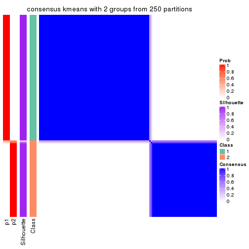</p>

</div>
<div id='tab-ATC-kmeans-consensus-heatmap-2'>
<pre><code class="r">consensus_heatmap(res, k = 3)
</code></pre>

<p>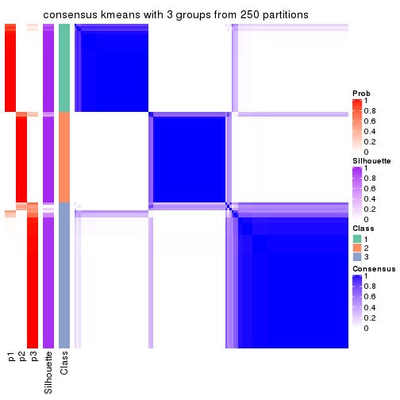</p>

</div>
<div id='tab-ATC-kmeans-consensus-heatmap-3'>
<pre><code class="r">consensus_heatmap(res, k = 4)
</code></pre>

<p>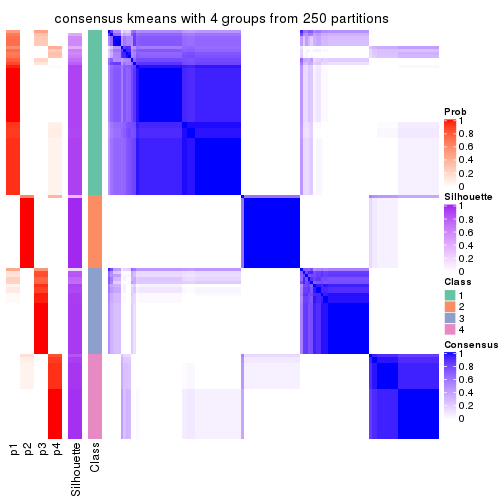</p>

</div>
<div id='tab-ATC-kmeans-consensus-heatmap-4'>
<pre><code class="r">consensus_heatmap(res, k = 5)
</code></pre>

<p>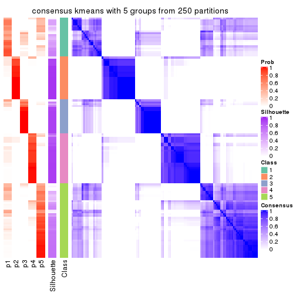</p>

</div>
<div id='tab-ATC-kmeans-consensus-heatmap-5'>
<pre><code class="r">consensus_heatmap(res, k = 6)
</code></pre>

<p>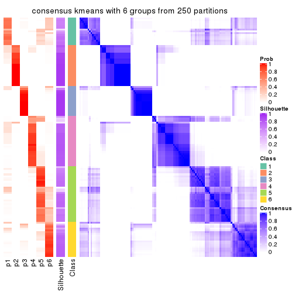</p>

</div>
</div>

Heatmaps for the membership of samples in all partitions to see how consistent they are:


<script>
$( function() {
	$( '#tabs-ATC-kmeans-membership-heatmap' ).tabs();
} );
</script>
<div id='tabs-ATC-kmeans-membership-heatmap'>
<ul>
<li><a href='#tab-ATC-kmeans-membership-heatmap-1'>k = 2</a></li>
<li><a href='#tab-ATC-kmeans-membership-heatmap-2'>k = 3</a></li>
<li><a href='#tab-ATC-kmeans-membership-heatmap-3'>k = 4</a></li>
<li><a href='#tab-ATC-kmeans-membership-heatmap-4'>k = 5</a></li>
<li><a href='#tab-ATC-kmeans-membership-heatmap-5'>k = 6</a></li>
</ul>
<div id='tab-ATC-kmeans-membership-heatmap-1'>
<pre><code class="r">membership_heatmap(res, k = 2)
</code></pre>

<p>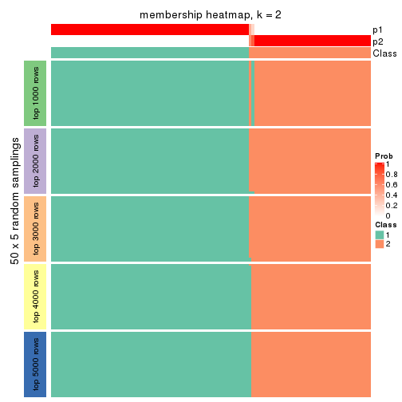</p>

</div>
<div id='tab-ATC-kmeans-membership-heatmap-2'>
<pre><code class="r">membership_heatmap(res, k = 3)
</code></pre>

<p>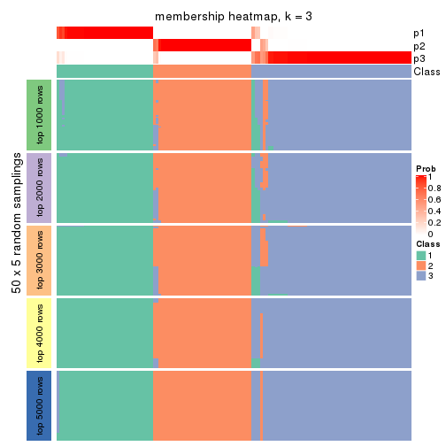</p>

</div>
<div id='tab-ATC-kmeans-membership-heatmap-3'>
<pre><code class="r">membership_heatmap(res, k = 4)
</code></pre>

<p>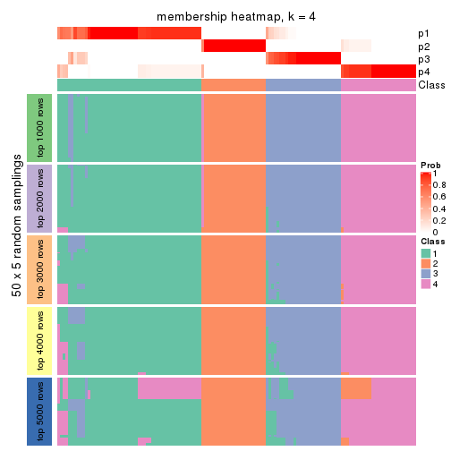</p>

</div>
<div id='tab-ATC-kmeans-membership-heatmap-4'>
<pre><code class="r">membership_heatmap(res, k = 5)
</code></pre>

<p>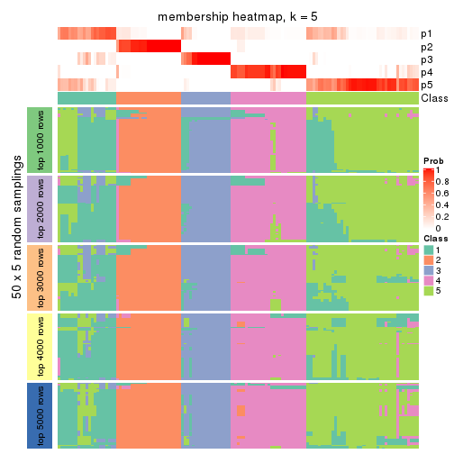</p>

</div>
<div id='tab-ATC-kmeans-membership-heatmap-5'>
<pre><code class="r">membership_heatmap(res, k = 6)
</code></pre>

<p>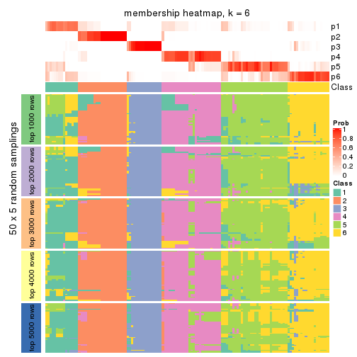</p>

</div>
</div>

As soon as we have had the classes for columns, we can look for signatures
which are significantly different between classes which can be candidate marks
for certain classes. Following are the heatmaps for signatures.


Signature heatmaps where rows are scaled:


<script>
$( function() {
	$( '#tabs-ATC-kmeans-get-signatures' ).tabs();
} );
</script>
<div id='tabs-ATC-kmeans-get-signatures'>
<ul>
<li><a href='#tab-ATC-kmeans-get-signatures-1'>k = 2</a></li>
<li><a href='#tab-ATC-kmeans-get-signatures-2'>k = 3</a></li>
<li><a href='#tab-ATC-kmeans-get-signatures-3'>k = 4</a></li>
<li><a href='#tab-ATC-kmeans-get-signatures-4'>k = 5</a></li>
<li><a href='#tab-ATC-kmeans-get-signatures-5'>k = 6</a></li>
</ul>
<div id='tab-ATC-kmeans-get-signatures-1'>
<pre><code class="r">get_signatures(res, k = 2)
</code></pre>

<p>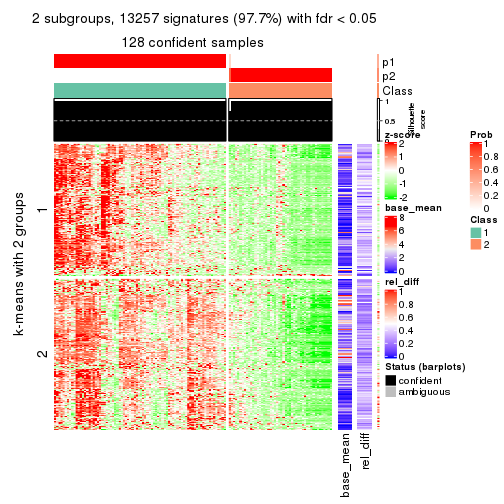</p>

</div>
<div id='tab-ATC-kmeans-get-signatures-2'>
<pre><code class="r">get_signatures(res, k = 3)
</code></pre>

<p>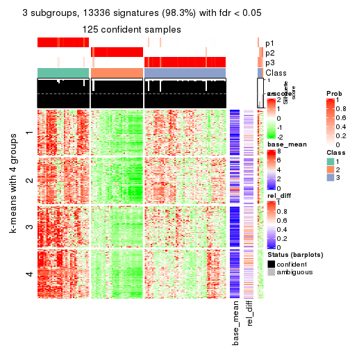</p>

</div>
<div id='tab-ATC-kmeans-get-signatures-3'>
<pre><code class="r">get_signatures(res, k = 4)
</code></pre>

<p>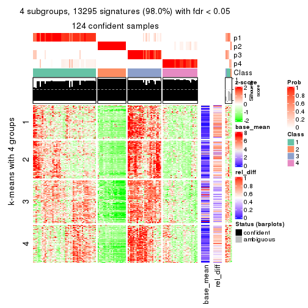</p>

</div>
<div id='tab-ATC-kmeans-get-signatures-4'>
<pre><code class="r">get_signatures(res, k = 5)
</code></pre>

<p>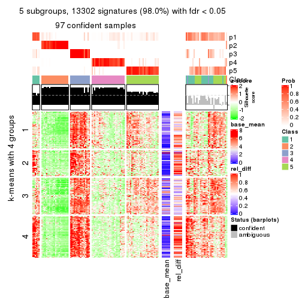</p>

</div>
<div id='tab-ATC-kmeans-get-signatures-5'>
<pre><code class="r">get_signatures(res, k = 6)
</code></pre>

<p>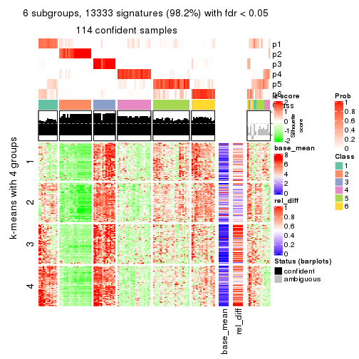</p>

</div>
</div>


Signature heatmaps where rows are not scaled:


<script>
$( function() {
	$( '#tabs-ATC-kmeans-get-signatures-no-scale' ).tabs();
} );
</script>
<div id='tabs-ATC-kmeans-get-signatures-no-scale'>
<ul>
<li><a href='#tab-ATC-kmeans-get-signatures-no-scale-1'>k = 2</a></li>
<li><a href='#tab-ATC-kmeans-get-signatures-no-scale-2'>k = 3</a></li>
<li><a href='#tab-ATC-kmeans-get-signatures-no-scale-3'>k = 4</a></li>
<li><a href='#tab-ATC-kmeans-get-signatures-no-scale-4'>k = 5</a></li>
<li><a href='#tab-ATC-kmeans-get-signatures-no-scale-5'>k = 6</a></li>
</ul>
<div id='tab-ATC-kmeans-get-signatures-no-scale-1'>
<pre><code class="r">get_signatures(res, k = 2, scale_rows = FALSE)
</code></pre>

<p>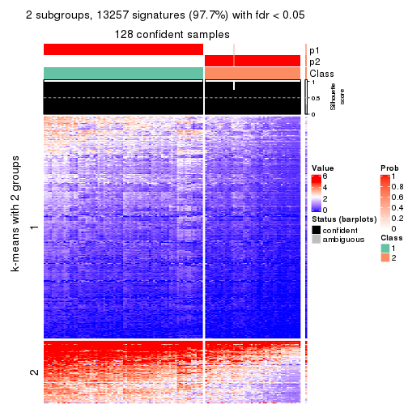</p>

</div>
<div id='tab-ATC-kmeans-get-signatures-no-scale-2'>
<pre><code class="r">get_signatures(res, k = 3, scale_rows = FALSE)
</code></pre>

<p>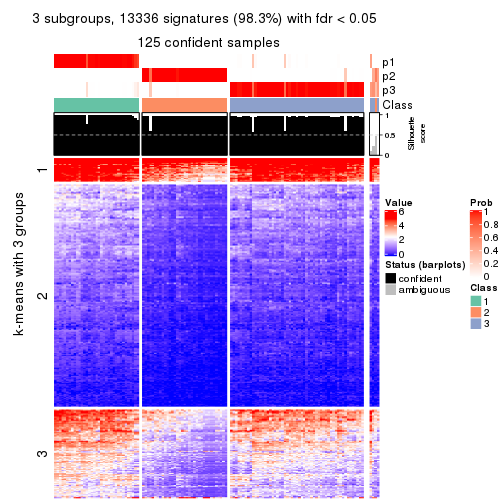</p>

</div>
<div id='tab-ATC-kmeans-get-signatures-no-scale-3'>
<pre><code class="r">get_signatures(res, k = 4, scale_rows = FALSE)
</code></pre>

<p>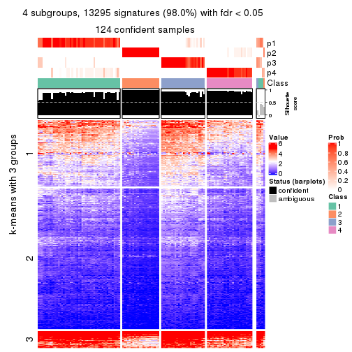</p>

</div>
<div id='tab-ATC-kmeans-get-signatures-no-scale-4'>
<pre><code class="r">get_signatures(res, k = 5, scale_rows = FALSE)
</code></pre>

<p>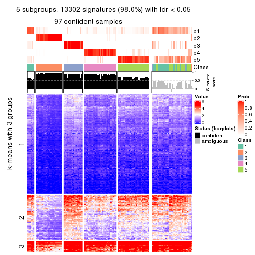</p>

</div>
<div id='tab-ATC-kmeans-get-signatures-no-scale-5'>
<pre><code class="r">get_signatures(res, k = 6, scale_rows = FALSE)
</code></pre>

<p>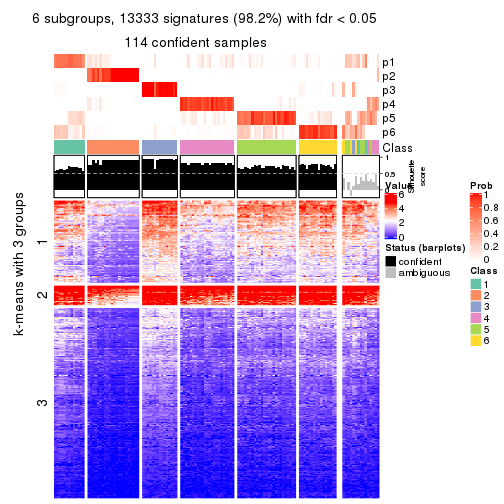</p>

</div>
</div>


Compare the overlap of signatures from different k:

```r
compare_signatures(res)
```

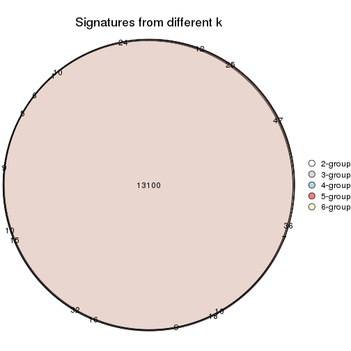

`get_signature()` returns a data frame invisibly. TO get the list of signatures, the function
call should be assigned to a variable explicitly. In following code, if `plot` argument is set
to `FALSE`, no heatmap is plotted while only the differential analysis is performed.

```r
# code only for demonstration
tb = get_signature(res, k = ..., plot = FALSE)
```

An example of the output of `tb` is:

```
#>   which_row         fdr    mean_1    mean_2 scaled_mean_1 scaled_mean_2 km
#> 1        38 0.042760348  8.373488  9.131774    -0.5533452     0.5164555  1
#> 2        40 0.018707592  7.106213  8.469186    -0.6173731     0.5762149  1
#> 3        55 0.019134737 10.221463 11.207825    -0.6159697     0.5749050  1
#> 4        59 0.006059896  5.921854  7.869574    -0.6899429     0.6439467  1
#> 5        60 0.018055526  8.928898 10.211722    -0.6204761     0.5791110  1
#> 6        98 0.009384629 15.714769 14.887706     0.6635654    -0.6193277  2
...
```

The columns in `tb` are:

1. `which_row`: row indices corresponding to the input matrix.
2. `fdr`: FDR for the differential test. 
3. `mean_x`: The mean value in group x.
4. `scaled_mean_x`: The mean value in group x after rows are scaled.
5. `km`: Row groups if k-means clustering is applied to rows.


UMAP plot which shows how samples are separated.


<script>
$( function() {
	$( '#tabs-ATC-kmeans-dimension-reduction' ).tabs();
} );
</script>
<div id='tabs-ATC-kmeans-dimension-reduction'>
<ul>
<li><a href='#tab-ATC-kmeans-dimension-reduction-1'>k = 2</a></li>
<li><a href='#tab-ATC-kmeans-dimension-reduction-2'>k = 3</a></li>
<li><a href='#tab-ATC-kmeans-dimension-reduction-3'>k = 4</a></li>
<li><a href='#tab-ATC-kmeans-dimension-reduction-4'>k = 5</a></li>
<li><a href='#tab-ATC-kmeans-dimension-reduction-5'>k = 6</a></li>
</ul>
<div id='tab-ATC-kmeans-dimension-reduction-1'>
<pre><code class="r">dimension_reduction(res, k = 2, method = &quot;UMAP&quot;)
</code></pre>

<p>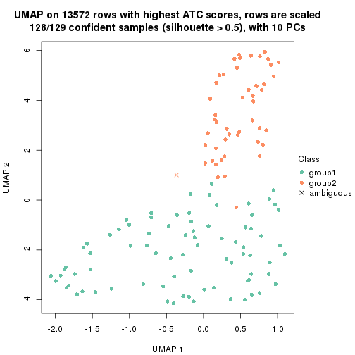</p>

</div>
<div id='tab-ATC-kmeans-dimension-reduction-2'>
<pre><code class="r">dimension_reduction(res, k = 3, method = &quot;UMAP&quot;)
</code></pre>

<p>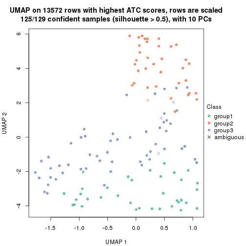</p>

</div>
<div id='tab-ATC-kmeans-dimension-reduction-3'>
<pre><code class="r">dimension_reduction(res, k = 4, method = &quot;UMAP&quot;)
</code></pre>

<p>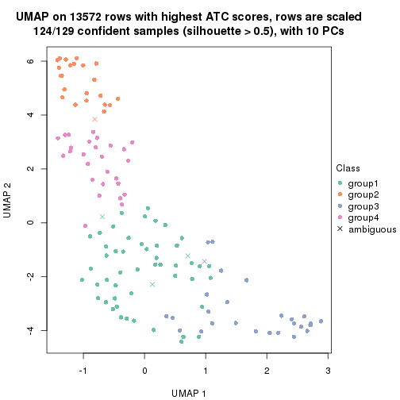</p>

</div>
<div id='tab-ATC-kmeans-dimension-reduction-4'>
<pre><code class="r">dimension_reduction(res, k = 5, method = &quot;UMAP&quot;)
</code></pre>

<p>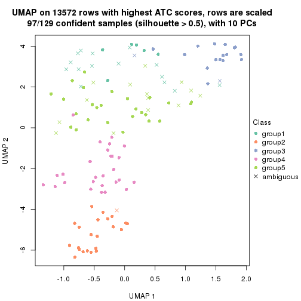</p>

</div>
<div id='tab-ATC-kmeans-dimension-reduction-5'>
<pre><code class="r">dimension_reduction(res, k = 6, method = &quot;UMAP&quot;)
</code></pre>

<p>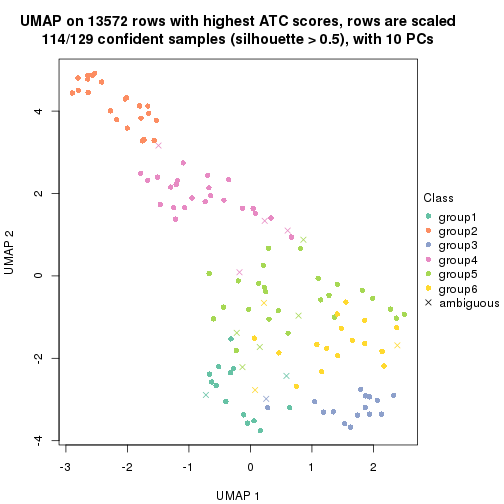</p>

</div>
</div>


Following heatmap shows how subgroups are split when increasing `k`:

```r
collect_classes(res)
```

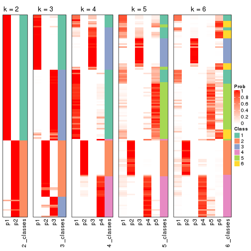


If matrix rows can be associated to genes, consider to use `GO_Enrichment(res,
...)` to perform function enrichment for the signature genes.


 

---------------------------------------------------


### ATC:skmeans**


The object with results only for a single top-value method and a single partition method 
can be extracted as:

```r
res = res_list["ATC", "skmeans"]
# you can also extract it by
# res = res_list["ATC:skmeans"]
```

A summary of `res` and all the functions that can be applied to it:

```r
res
```

```
#> A 'ConsensusPartition' object with k = 2, 3, 4, 5, 6.
#>   On a matrix with 13572 rows and 129 columns.
#>   Top rows (1000, 2000, 3000, 4000, 5000) are extracted by 'ATC' method.
#>   Subgroups are detected by 'skmeans' method.
#>   Performed in total 1250 partitions by row resampling.
#>   Best k for subgroups seems to be 3.
#> 
#> Following methods can be applied to this 'ConsensusPartition' object:
#>  [1] "cola_report"             "collect_classes"         "collect_plots"          
#>  [4] "collect_stats"           "colnames"                "compare_signatures"     
#>  [7] "consensus_heatmap"       "dimension_reduction"     "functional_enrichment"  
#> [10] "get_anno_col"            "get_anno"                "get_classes"            
#> [13] "get_consensus"           "get_matrix"              "get_membership"         
#> [16] "get_param"               "get_signatures"          "get_stats"              
#> [19] "is_best_k"               "is_stable_k"             "membership_heatmap"     
#> [22] "ncol"                    "nrow"                    "plot_ecdf"              
#> [25] "rownames"                "select_partition_number" "show"                   
#> [28] "suggest_best_k"          "test_to_known_factors"
```

`collect_plots()` function collects all the plots made from `res` for all `k` (number of partitions)
into one single page to provide an easy and fast comparison between different `k`.

```r
collect_plots(res)
```

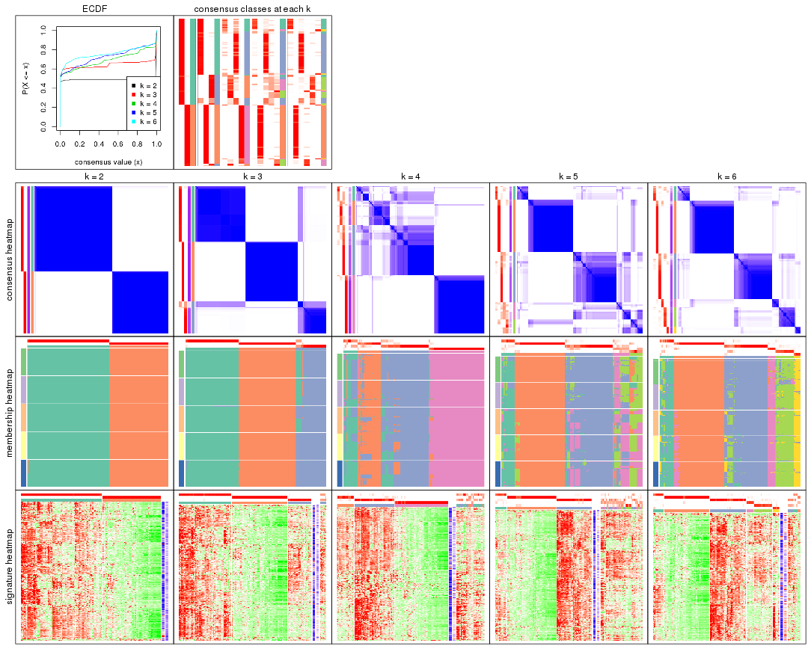

The plots are:

- The first row: a plot of the ECDF (Empirical cumulative distribution
  function) curves of the consensus matrix for each `k` and the heatmap of
  predicted classes for each `k`.
- The second row: heatmaps of the consensus matrix for each `k`.
- The third row: heatmaps of the membership matrix for each `k`.
- The fouth row: heatmaps of the signatures for each `k`.

All the plots in panels can be made by individual functions and they are
plotted later in this section.

`select_partition_number()` produces several plots showing different
statistics for choosing "optimized" `k`. There are following statistics:

- ECDF curves of the consensus matrix for each `k`;
- 1-PAC. [The PAC
  score](https://en.wikipedia.org/wiki/Consensus_clustering#Over-interpretation_potential_of_consensus_clustering)
  measures the proportion of the ambiguous subgrouping.
- Mean silhouette score.
- Concordance. The mean probability of fiting the consensus class ids in all
  partitions.
- Area increased. Denote $A_k$ as the area under the ECDF curve for current
  `k`, the area increased is defined as $A_k - A_{k-1}$.
- Rand index. The percent of pairs of samples that are both in a same cluster
  or both are not in a same cluster in the partition of k and k-1.
- Jaccard index. The ratio of pairs of samples are both in a same cluster in
  the partition of k and k-1 and the pairs of samples are both in a same
  cluster in the partition k or k-1.

The detailed explanations of these statistics can be found in [the cola
vignette](http://bioconductor.org/packages/devel/bioc/vignettes/cola/inst/doc/cola.html#toc_13).

Generally speaking, lower PAC score, higher mean silhouette score or higher
concordance corresponds to better partition. Rand index and Jaccard index
measure how similar the current partition is compared to partition with `k-1`.
If they are too similar, we won't accept `k` is better than `k-1`.

```r
select_partition_number(res)
```

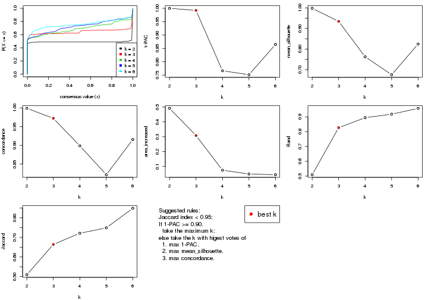

The numeric values for all these statistics can be obtained by `get_stats()`.

```r
get_stats(res)
```

```
#>   k 1-PAC mean_silhouette concordance area_increased  Rand Jaccard
#> 2 2 1.000           0.998       0.999         0.4913 0.509   0.509
#> 3 3 0.992           0.934       0.972         0.3086 0.827   0.664
#> 4 4 0.766           0.763       0.899         0.0751 0.894   0.721
#> 5 5 0.752           0.676       0.822         0.0494 0.918   0.749
#> 6 6 0.865           0.824       0.916         0.0447 0.957   0.849
```

`suggest_best_k()` suggests the best $k$ based on these statistics. The rules are as follows:

- All $k$ with Jaccard index larger than 0.95 are removed because the increase of
  the partition number does not provides enough extra information. If all $k$ are removed,
  the best $k$ is assigned by `NA`.
- For $k$ with 1-PAC larger than 0.9, the maximal $k$ is taken as the "best k". Other $k$ is called "optional k".
- If it does not fit the second rule. The $k$ with the highest vote of highest
  1-PAC, mean silhouette and concordance is taken as the "best k".

```r
suggest_best_k(res)
```

```
#> [1] 3
#> attr(,"optional")
#> [1] 2
```

There is also optional best $k$ = 2 that is worth to check.

Following shows the table of the partitions (You need to click the **show/hide
code output** link to see it). The membership matrix (columns with name `p*`)
is inferred by
[`clue::cl_consensus()`](https://www.rdocumentation.org/link/cl_consensus?package=clue)
function with the `SE` method. Basically the value in the membership matrix
represents the probability to belong to a certain group. The finall class
label for an item is determined with the group with highest probability it
belongs to.

In `get_classes()` function, the entropy is calculated from the membership
matrix and the silhouette score is calculated from the consensus matrix.


<script>
$( function() {
	$( '#tabs-ATC-skmeans-get-classes' ).tabs();
} );
</script>
<div id='tabs-ATC-skmeans-get-classes'>
<ul>
<li><a href='#tab-ATC-skmeans-get-classes-1'>k = 2</a></li>
<li><a href='#tab-ATC-skmeans-get-classes-2'>k = 3</a></li>
<li><a href='#tab-ATC-skmeans-get-classes-3'>k = 4</a></li>
<li><a href='#tab-ATC-skmeans-get-classes-4'>k = 5</a></li>
<li><a href='#tab-ATC-skmeans-get-classes-5'>k = 6</a></li>
</ul>

<div id='tab-ATC-skmeans-get-classes-1'>
<p><a id='tab-ATC-skmeans-get-classes-1-a' style='color:#0366d6' href='#'>show/hide code output</a></p>
<pre><code class="r">cbind(get_classes(res, k = 2), get_membership(res, k = 2))
</code></pre>

<pre><code>#&gt;            class entropy silhouette    p1    p2
#&gt; SRR1656463     2   0.000      1.000 0.000 1.000
#&gt; SRR1656464     1   0.000      0.998 1.000 0.000
#&gt; SRR1656462     1   0.000      0.998 1.000 0.000
#&gt; SRR1656465     1   0.000      0.998 1.000 0.000
#&gt; SRR1656467     2   0.000      1.000 0.000 1.000
#&gt; SRR1656466     1   0.000      0.998 1.000 0.000
#&gt; SRR1656468     2   0.000      1.000 0.000 1.000
#&gt; SRR1656472     1   0.000      0.998 1.000 0.000
#&gt; SRR1656471     1   0.000      0.998 1.000 0.000
#&gt; SRR1656470     2   0.000      1.000 0.000 1.000
#&gt; SRR1656469     1   0.000      0.998 1.000 0.000
#&gt; SRR1656473     2   0.000      1.000 0.000 1.000
#&gt; SRR1656474     2   0.000      1.000 0.000 1.000
#&gt; SRR1656475     2   0.000      1.000 0.000 1.000
#&gt; SRR1656478     1   0.000      0.998 1.000 0.000
#&gt; SRR1656477     2   0.000      1.000 0.000 1.000
#&gt; SRR1656479     1   0.000      0.998 1.000 0.000
#&gt; SRR1656480     2   0.000      1.000 0.000 1.000
#&gt; SRR1656476     2   0.000      1.000 0.000 1.000
#&gt; SRR1656481     2   0.000      1.000 0.000 1.000
#&gt; SRR1656482     2   0.000      1.000 0.000 1.000
#&gt; SRR1656483     2   0.000      1.000 0.000 1.000
#&gt; SRR1656485     1   0.000      0.998 1.000 0.000
#&gt; SRR1656487     1   0.000      0.998 1.000 0.000
#&gt; SRR1656486     1   0.456      0.894 0.904 0.096
#&gt; SRR1656488     1   0.000      0.998 1.000 0.000
#&gt; SRR1656484     1   0.000      0.998 1.000 0.000
#&gt; SRR1656489     1   0.000      0.998 1.000 0.000
#&gt; SRR1656491     1   0.000      0.998 1.000 0.000
#&gt; SRR1656490     1   0.000      0.998 1.000 0.000
#&gt; SRR1656492     1   0.000      0.998 1.000 0.000
#&gt; SRR1656493     1   0.000      0.998 1.000 0.000
#&gt; SRR1656495     2   0.000      1.000 0.000 1.000
#&gt; SRR1656496     1   0.000      0.998 1.000 0.000
#&gt; SRR1656494     2   0.000      1.000 0.000 1.000
#&gt; SRR1656497     2   0.000      1.000 0.000 1.000
#&gt; SRR1656499     1   0.000      0.998 1.000 0.000
#&gt; SRR1656500     1   0.000      0.998 1.000 0.000
#&gt; SRR1656501     1   0.000      0.998 1.000 0.000
#&gt; SRR1656498     1   0.000      0.998 1.000 0.000
#&gt; SRR1656504     2   0.000      1.000 0.000 1.000
#&gt; SRR1656502     1   0.000      0.998 1.000 0.000
#&gt; SRR1656503     1   0.000      0.998 1.000 0.000
#&gt; SRR1656507     1   0.000      0.998 1.000 0.000
#&gt; SRR1656508     1   0.000      0.998 1.000 0.000
#&gt; SRR1656505     2   0.000      1.000 0.000 1.000
#&gt; SRR1656506     1   0.000      0.998 1.000 0.000
#&gt; SRR1656509     1   0.000      0.998 1.000 0.000
#&gt; SRR1656510     2   0.000      1.000 0.000 1.000
#&gt; SRR1656511     2   0.000      1.000 0.000 1.000
#&gt; SRR1656513     2   0.000      1.000 0.000 1.000
#&gt; SRR1656512     2   0.000      1.000 0.000 1.000
#&gt; SRR1656514     1   0.000      0.998 1.000 0.000
#&gt; SRR1656515     2   0.000      1.000 0.000 1.000
#&gt; SRR1656516     1   0.000      0.998 1.000 0.000
#&gt; SRR1656518     1   0.000      0.998 1.000 0.000
#&gt; SRR1656517     1   0.000      0.998 1.000 0.000
#&gt; SRR1656519     1   0.000      0.998 1.000 0.000
#&gt; SRR1656522     1   0.000      0.998 1.000 0.000
#&gt; SRR1656523     2   0.000      1.000 0.000 1.000
#&gt; SRR1656521     2   0.000      1.000 0.000 1.000
#&gt; SRR1656520     1   0.000      0.998 1.000 0.000
#&gt; SRR1656524     1   0.000      0.998 1.000 0.000
#&gt; SRR1656525     1   0.000      0.998 1.000 0.000
#&gt; SRR1656526     2   0.000      1.000 0.000 1.000
#&gt; SRR1656527     2   0.000      1.000 0.000 1.000
#&gt; SRR1656530     1   0.000      0.998 1.000 0.000
#&gt; SRR1656529     1   0.000      0.998 1.000 0.000
#&gt; SRR1656531     1   0.000      0.998 1.000 0.000
#&gt; SRR1656528     1   0.000      0.998 1.000 0.000
#&gt; SRR1656534     1   0.000      0.998 1.000 0.000
#&gt; SRR1656533     1   0.000      0.998 1.000 0.000
#&gt; SRR1656536     1   0.204      0.966 0.968 0.032
#&gt; SRR1656532     2   0.000      1.000 0.000 1.000
#&gt; SRR1656537     1   0.000      0.998 1.000 0.000
#&gt; SRR1656538     1   0.000      0.998 1.000 0.000
#&gt; SRR1656535     2   0.000      1.000 0.000 1.000
#&gt; SRR1656539     1   0.000      0.998 1.000 0.000
#&gt; SRR1656544     1   0.000      0.998 1.000 0.000
#&gt; SRR1656542     1   0.000      0.998 1.000 0.000
#&gt; SRR1656543     1   0.000      0.998 1.000 0.000
#&gt; SRR1656545     2   0.000      1.000 0.000 1.000
#&gt; SRR1656540     1   0.000      0.998 1.000 0.000
#&gt; SRR1656546     2   0.000      1.000 0.000 1.000
#&gt; SRR1656541     2   0.000      1.000 0.000 1.000
#&gt; SRR1656547     2   0.000      1.000 0.000 1.000
#&gt; SRR1656548     1   0.000      0.998 1.000 0.000
#&gt; SRR1656549     1   0.000      0.998 1.000 0.000
#&gt; SRR1656551     2   0.141      0.980 0.020 0.980
#&gt; SRR1656553     1   0.000      0.998 1.000 0.000
#&gt; SRR1656550     2   0.000      1.000 0.000 1.000
#&gt; SRR1656552     2   0.000      1.000 0.000 1.000
#&gt; SRR1656554     1   0.000      0.998 1.000 0.000
#&gt; SRR1656555     2   0.000      1.000 0.000 1.000
#&gt; SRR1656556     1   0.000      0.998 1.000 0.000
#&gt; SRR1656557     1   0.000      0.998 1.000 0.000
#&gt; SRR1656558     1   0.000      0.998 1.000 0.000
#&gt; SRR1656559     1   0.000      0.998 1.000 0.000
#&gt; SRR1656560     1   0.000      0.998 1.000 0.000
#&gt; SRR1656561     1   0.000      0.998 1.000 0.000
#&gt; SRR1656562     2   0.000      1.000 0.000 1.000
#&gt; SRR1656563     1   0.000      0.998 1.000 0.000
#&gt; SRR1656564     2   0.000      1.000 0.000 1.000
#&gt; SRR1656565     2   0.000      1.000 0.000 1.000
#&gt; SRR1656566     1   0.000      0.998 1.000 0.000
#&gt; SRR1656568     2   0.000      1.000 0.000 1.000
#&gt; SRR1656567     2   0.000      1.000 0.000 1.000
#&gt; SRR1656569     1   0.000      0.998 1.000 0.000
#&gt; SRR1656570     1   0.000      0.998 1.000 0.000
#&gt; SRR1656571     2   0.000      1.000 0.000 1.000
#&gt; SRR1656573     2   0.000      1.000 0.000 1.000
#&gt; SRR1656572     2   0.000      1.000 0.000 1.000
#&gt; SRR1656574     1   0.000      0.998 1.000 0.000
#&gt; SRR1656575     1   0.000      0.998 1.000 0.000
#&gt; SRR1656576     2   0.000      1.000 0.000 1.000
#&gt; SRR1656578     2   0.000      1.000 0.000 1.000
#&gt; SRR1656577     1   0.000      0.998 1.000 0.000
#&gt; SRR1656579     2   0.000      1.000 0.000 1.000
#&gt; SRR1656580     1   0.000      0.998 1.000 0.000
#&gt; SRR1656581     2   0.000      1.000 0.000 1.000
#&gt; SRR1656582     2   0.000      1.000 0.000 1.000
#&gt; SRR1656585     1   0.000      0.998 1.000 0.000
#&gt; SRR1656584     1   0.000      0.998 1.000 0.000
#&gt; SRR1656583     1   0.000      0.998 1.000 0.000
#&gt; SRR1656586     2   0.000      1.000 0.000 1.000
#&gt; SRR1656587     2   0.000      1.000 0.000 1.000
#&gt; SRR1656588     2   0.000      1.000 0.000 1.000
#&gt; SRR1656589     2   0.000      1.000 0.000 1.000
#&gt; SRR1656590     1   0.000      0.998 1.000 0.000
</code></pre>

<script>
$('#tab-ATC-skmeans-get-classes-1-a').parent().next().next().hide();
$('#tab-ATC-skmeans-get-classes-1-a').click(function(){
  $('#tab-ATC-skmeans-get-classes-1-a').parent().next().next().toggle();
  return(false);
});
</script>
</div>

<div id='tab-ATC-skmeans-get-classes-2'>
<p><a id='tab-ATC-skmeans-get-classes-2-a' style='color:#0366d6' href='#'>show/hide code output</a></p>
<pre><code class="r">cbind(get_classes(res, k = 3), get_membership(res, k = 3))
</code></pre>

<pre><code>#&gt;            class entropy silhouette    p1    p2    p3
#&gt; SRR1656463     2  0.0000      0.999 0.000 1.000 0.000
#&gt; SRR1656464     1  0.0424      0.988 0.992 0.000 0.008
#&gt; SRR1656462     1  0.0592      0.987 0.988 0.000 0.012
#&gt; SRR1656465     3  0.0000      0.885 0.000 0.000 1.000
#&gt; SRR1656467     2  0.0000      0.999 0.000 1.000 0.000
#&gt; SRR1656466     3  0.6309      0.154 0.496 0.000 0.504
#&gt; SRR1656468     2  0.0000      0.999 0.000 1.000 0.000
#&gt; SRR1656472     1  0.0000      0.987 1.000 0.000 0.000
#&gt; SRR1656471     1  0.3038      0.878 0.896 0.000 0.104
#&gt; SRR1656470     2  0.0000      0.999 0.000 1.000 0.000
#&gt; SRR1656469     3  0.0000      0.885 0.000 0.000 1.000
#&gt; SRR1656473     2  0.0000      0.999 0.000 1.000 0.000
#&gt; SRR1656474     2  0.0000      0.999 0.000 1.000 0.000
#&gt; SRR1656475     2  0.0000      0.999 0.000 1.000 0.000
#&gt; SRR1656478     1  0.0000      0.987 1.000 0.000 0.000
#&gt; SRR1656477     2  0.0000      0.999 0.000 1.000 0.000
#&gt; SRR1656479     3  0.0000      0.885 0.000 0.000 1.000
#&gt; SRR1656480     2  0.0000      0.999 0.000 1.000 0.000
#&gt; SRR1656476     2  0.0000      0.999 0.000 1.000 0.000
#&gt; SRR1656481     2  0.0000      0.999 0.000 1.000 0.000
#&gt; SRR1656482     2  0.0000      0.999 0.000 1.000 0.000
#&gt; SRR1656483     2  0.0000      0.999 0.000 1.000 0.000
#&gt; SRR1656485     3  0.6308      0.168 0.492 0.000 0.508
#&gt; SRR1656487     3  0.0000      0.885 0.000 0.000 1.000
#&gt; SRR1656486     3  0.0424      0.880 0.008 0.000 0.992
#&gt; SRR1656488     3  0.6308      0.168 0.492 0.000 0.508
#&gt; SRR1656484     1  0.0592      0.987 0.988 0.000 0.012
#&gt; SRR1656489     1  0.0000      0.987 1.000 0.000 0.000
#&gt; SRR1656491     3  0.0000      0.885 0.000 0.000 1.000
#&gt; SRR1656490     3  0.0000      0.885 0.000 0.000 1.000
#&gt; SRR1656492     3  0.0237      0.883 0.004 0.000 0.996
#&gt; SRR1656493     1  0.0000      0.987 1.000 0.000 0.000
#&gt; SRR1656495     2  0.1964      0.935 0.056 0.944 0.000
#&gt; SRR1656496     3  0.0892      0.875 0.020 0.000 0.980
#&gt; SRR1656494     2  0.0000      0.999 0.000 1.000 0.000
#&gt; SRR1656497     2  0.0000      0.999 0.000 1.000 0.000
#&gt; SRR1656499     1  0.1163      0.972 0.972 0.000 0.028
#&gt; SRR1656500     1  0.0592      0.987 0.988 0.000 0.012
#&gt; SRR1656501     1  0.0000      0.987 1.000 0.000 0.000
#&gt; SRR1656498     1  0.0000      0.987 1.000 0.000 0.000
#&gt; SRR1656504     2  0.0000      0.999 0.000 1.000 0.000
#&gt; SRR1656502     1  0.0000      0.987 1.000 0.000 0.000
#&gt; SRR1656503     1  0.0237      0.985 0.996 0.000 0.004
#&gt; SRR1656507     1  0.0000      0.987 1.000 0.000 0.000
#&gt; SRR1656508     1  0.0000      0.987 1.000 0.000 0.000
#&gt; SRR1656505     2  0.0000      0.999 0.000 1.000 0.000
#&gt; SRR1656506     3  0.0000      0.885 0.000 0.000 1.000
#&gt; SRR1656509     1  0.0424      0.988 0.992 0.000 0.008
#&gt; SRR1656510     2  0.0000      0.999 0.000 1.000 0.000
#&gt; SRR1656511     2  0.0000      0.999 0.000 1.000 0.000
#&gt; SRR1656513     2  0.0000      0.999 0.000 1.000 0.000
#&gt; SRR1656512     2  0.0000      0.999 0.000 1.000 0.000
#&gt; SRR1656514     1  0.0424      0.988 0.992 0.000 0.008
#&gt; SRR1656515     2  0.0000      0.999 0.000 1.000 0.000
#&gt; SRR1656516     1  0.0000      0.987 1.000 0.000 0.000
#&gt; SRR1656518     1  0.0000      0.987 1.000 0.000 0.000
#&gt; SRR1656517     1  0.0000      0.987 1.000 0.000 0.000
#&gt; SRR1656519     1  0.0592      0.987 0.988 0.000 0.012
#&gt; SRR1656522     1  0.0424      0.988 0.992 0.000 0.008
#&gt; SRR1656523     2  0.0000      0.999 0.000 1.000 0.000
#&gt; SRR1656521     2  0.0000      0.999 0.000 1.000 0.000
#&gt; SRR1656520     1  0.0592      0.987 0.988 0.000 0.012
#&gt; SRR1656524     1  0.0000      0.987 1.000 0.000 0.000
#&gt; SRR1656525     3  0.2711      0.822 0.088 0.000 0.912
#&gt; SRR1656526     2  0.0000      0.999 0.000 1.000 0.000
#&gt; SRR1656527     2  0.0000      0.999 0.000 1.000 0.000
#&gt; SRR1656530     3  0.0747      0.877 0.016 0.000 0.984
#&gt; SRR1656529     3  0.0000      0.885 0.000 0.000 1.000
#&gt; SRR1656531     1  0.0000      0.987 1.000 0.000 0.000
#&gt; SRR1656528     3  0.0000      0.885 0.000 0.000 1.000
#&gt; SRR1656534     1  0.0592      0.987 0.988 0.000 0.012
#&gt; SRR1656533     1  0.0000      0.987 1.000 0.000 0.000
#&gt; SRR1656536     3  0.0000      0.885 0.000 0.000 1.000
#&gt; SRR1656532     2  0.0000      0.999 0.000 1.000 0.000
#&gt; SRR1656537     1  0.0000      0.987 1.000 0.000 0.000
#&gt; SRR1656538     1  0.0592      0.987 0.988 0.000 0.012
#&gt; SRR1656535     2  0.0000      0.999 0.000 1.000 0.000
#&gt; SRR1656539     3  0.6308      0.168 0.492 0.000 0.508
#&gt; SRR1656544     1  0.0592      0.987 0.988 0.000 0.012
#&gt; SRR1656542     1  0.0592      0.987 0.988 0.000 0.012
#&gt; SRR1656543     1  0.0592      0.987 0.988 0.000 0.012
#&gt; SRR1656545     2  0.0000      0.999 0.000 1.000 0.000
#&gt; SRR1656540     1  0.0592      0.987 0.988 0.000 0.012
#&gt; SRR1656546     2  0.0000      0.999 0.000 1.000 0.000
#&gt; SRR1656541     2  0.0000      0.999 0.000 1.000 0.000
#&gt; SRR1656547     2  0.0000      0.999 0.000 1.000 0.000
#&gt; SRR1656548     3  0.0000      0.885 0.000 0.000 1.000
#&gt; SRR1656549     3  0.0747      0.877 0.016 0.000 0.984
#&gt; SRR1656551     3  0.0592      0.876 0.000 0.012 0.988
#&gt; SRR1656553     1  0.0424      0.988 0.992 0.000 0.008
#&gt; SRR1656550     2  0.0000      0.999 0.000 1.000 0.000
#&gt; SRR1656552     2  0.0000      0.999 0.000 1.000 0.000
#&gt; SRR1656554     3  0.0000      0.885 0.000 0.000 1.000
#&gt; SRR1656555     2  0.0000      0.999 0.000 1.000 0.000
#&gt; SRR1656556     1  0.0592      0.987 0.988 0.000 0.012
#&gt; SRR1656557     1  0.0592      0.987 0.988 0.000 0.012
#&gt; SRR1656558     1  0.0000      0.987 1.000 0.000 0.000
#&gt; SRR1656559     1  0.0424      0.988 0.992 0.000 0.008
#&gt; SRR1656560     3  0.6308      0.168 0.492 0.000 0.508
#&gt; SRR1656561     3  0.0000      0.885 0.000 0.000 1.000
#&gt; SRR1656562     2  0.0000      0.999 0.000 1.000 0.000
#&gt; SRR1656563     1  0.0424      0.988 0.992 0.000 0.008
#&gt; SRR1656564     2  0.0000      0.999 0.000 1.000 0.000
#&gt; SRR1656565     2  0.0000      0.999 0.000 1.000 0.000
#&gt; SRR1656566     1  0.0000      0.987 1.000 0.000 0.000
#&gt; SRR1656568     2  0.0000      0.999 0.000 1.000 0.000
#&gt; SRR1656567     2  0.0000      0.999 0.000 1.000 0.000
#&gt; SRR1656569     3  0.0000      0.885 0.000 0.000 1.000
#&gt; SRR1656570     1  0.4062      0.775 0.836 0.000 0.164
#&gt; SRR1656571     2  0.0000      0.999 0.000 1.000 0.000
#&gt; SRR1656573     3  0.5882      0.428 0.000 0.348 0.652
#&gt; SRR1656572     2  0.0000      0.999 0.000 1.000 0.000
#&gt; SRR1656574     1  0.0424      0.988 0.992 0.000 0.008
#&gt; SRR1656575     1  0.0000      0.987 1.000 0.000 0.000
#&gt; SRR1656576     2  0.0000      0.999 0.000 1.000 0.000
#&gt; SRR1656578     2  0.0000      0.999 0.000 1.000 0.000
#&gt; SRR1656577     1  0.0424      0.988 0.992 0.000 0.008
#&gt; SRR1656579     2  0.0000      0.999 0.000 1.000 0.000
#&gt; SRR1656580     1  0.0592      0.987 0.988 0.000 0.012
#&gt; SRR1656581     2  0.0000      0.999 0.000 1.000 0.000
#&gt; SRR1656582     2  0.0000      0.999 0.000 1.000 0.000
#&gt; SRR1656585     3  0.0000      0.885 0.000 0.000 1.000
#&gt; SRR1656584     1  0.0000      0.987 1.000 0.000 0.000
#&gt; SRR1656583     1  0.0747      0.984 0.984 0.000 0.016
#&gt; SRR1656586     2  0.0000      0.999 0.000 1.000 0.000
#&gt; SRR1656587     2  0.0000      0.999 0.000 1.000 0.000
#&gt; SRR1656588     2  0.0000      0.999 0.000 1.000 0.000
#&gt; SRR1656589     2  0.0000      0.999 0.000 1.000 0.000
#&gt; SRR1656590     1  0.0000      0.987 1.000 0.000 0.000
</code></pre>

<script>
$('#tab-ATC-skmeans-get-classes-2-a').parent().next().next().hide();
$('#tab-ATC-skmeans-get-classes-2-a').click(function(){
  $('#tab-ATC-skmeans-get-classes-2-a').parent().next().next().toggle();
  return(false);
});
</script>
</div>

<div id='tab-ATC-skmeans-get-classes-3'>
<p><a id='tab-ATC-skmeans-get-classes-3-a' style='color:#0366d6' href='#'>show/hide code output</a></p>
<pre><code class="r">cbind(get_classes(res, k = 4), get_membership(res, k = 4))
</code></pre>

<pre><code>#&gt;            class entropy silhouette    p1    p2    p3    p4
#&gt; SRR1656463     4  0.0000     0.9784 0.000 0.000 0.000 1.000
#&gt; SRR1656464     3  0.0000     0.8385 0.000 0.000 1.000 0.000
#&gt; SRR1656462     3  0.0000     0.8385 0.000 0.000 1.000 0.000
#&gt; SRR1656465     2  0.2760     0.7801 0.000 0.872 0.128 0.000
#&gt; SRR1656467     4  0.0000     0.9784 0.000 0.000 0.000 1.000
#&gt; SRR1656466     3  0.3444     0.6435 0.000 0.184 0.816 0.000
#&gt; SRR1656468     4  0.0000     0.9784 0.000 0.000 0.000 1.000
#&gt; SRR1656472     1  0.4843     0.2713 0.604 0.000 0.396 0.000
#&gt; SRR1656471     3  0.0000     0.8385 0.000 0.000 1.000 0.000
#&gt; SRR1656470     4  0.0000     0.9784 0.000 0.000 0.000 1.000
#&gt; SRR1656469     2  0.0000     0.7846 0.000 1.000 0.000 0.000
#&gt; SRR1656473     4  0.0000     0.9784 0.000 0.000 0.000 1.000
#&gt; SRR1656474     4  0.0000     0.9784 0.000 0.000 0.000 1.000
#&gt; SRR1656475     4  0.0000     0.9784 0.000 0.000 0.000 1.000
#&gt; SRR1656478     1  0.4955     0.4341 0.556 0.000 0.444 0.000
#&gt; SRR1656477     4  0.3937     0.7724 0.012 0.188 0.000 0.800
#&gt; SRR1656479     2  0.3764     0.7083 0.000 0.784 0.216 0.000
#&gt; SRR1656480     4  0.0000     0.9784 0.000 0.000 0.000 1.000
#&gt; SRR1656476     4  0.0000     0.9784 0.000 0.000 0.000 1.000
#&gt; SRR1656481     4  0.3626     0.7866 0.004 0.184 0.000 0.812
#&gt; SRR1656482     4  0.0000     0.9784 0.000 0.000 0.000 1.000
#&gt; SRR1656483     4  0.0000     0.9784 0.000 0.000 0.000 1.000
#&gt; SRR1656485     3  0.3219     0.6684 0.000 0.164 0.836 0.000
#&gt; SRR1656487     2  0.0469     0.7857 0.000 0.988 0.012 0.000
#&gt; SRR1656486     2  0.4522     0.4700 0.320 0.680 0.000 0.000
#&gt; SRR1656488     3  0.3486     0.6377 0.000 0.188 0.812 0.000
#&gt; SRR1656484     3  0.0000     0.8385 0.000 0.000 1.000 0.000
#&gt; SRR1656489     3  0.0000     0.8385 0.000 0.000 1.000 0.000
#&gt; SRR1656491     2  0.3791     0.7235 0.004 0.796 0.200 0.000
#&gt; SRR1656490     2  0.0376     0.7857 0.004 0.992 0.004 0.000
#&gt; SRR1656492     2  0.5222     0.6663 0.132 0.756 0.112 0.000
#&gt; SRR1656493     1  0.1557     0.5147 0.944 0.000 0.056 0.000
#&gt; SRR1656495     1  0.3024     0.3866 0.852 0.000 0.000 0.148
#&gt; SRR1656496     2  0.4961     0.2953 0.000 0.552 0.448 0.000
#&gt; SRR1656494     4  0.0000     0.9784 0.000 0.000 0.000 1.000
#&gt; SRR1656497     4  0.0000     0.9784 0.000 0.000 0.000 1.000
#&gt; SRR1656499     3  0.0000     0.8385 0.000 0.000 1.000 0.000
#&gt; SRR1656500     3  0.0000     0.8385 0.000 0.000 1.000 0.000
#&gt; SRR1656501     1  0.4967     0.4147 0.548 0.000 0.452 0.000
#&gt; SRR1656498     3  0.3356     0.6406 0.176 0.000 0.824 0.000
#&gt; SRR1656504     4  0.0000     0.9784 0.000 0.000 0.000 1.000
#&gt; SRR1656502     1  0.4843     0.2713 0.604 0.000 0.396 0.000
#&gt; SRR1656503     3  0.3037     0.7396 0.100 0.020 0.880 0.000
#&gt; SRR1656507     1  0.4955     0.4341 0.556 0.000 0.444 0.000
#&gt; SRR1656508     3  0.3311     0.6459 0.172 0.000 0.828 0.000
#&gt; SRR1656505     4  0.0000     0.9784 0.000 0.000 0.000 1.000
#&gt; SRR1656506     2  0.2647     0.7830 0.000 0.880 0.120 0.000
#&gt; SRR1656509     3  0.0000     0.8385 0.000 0.000 1.000 0.000
#&gt; SRR1656510     4  0.0000     0.9784 0.000 0.000 0.000 1.000
#&gt; SRR1656511     4  0.0000     0.9784 0.000 0.000 0.000 1.000
#&gt; SRR1656513     4  0.0000     0.9784 0.000 0.000 0.000 1.000
#&gt; SRR1656512     4  0.0000     0.9784 0.000 0.000 0.000 1.000
#&gt; SRR1656514     3  0.0000     0.8385 0.000 0.000 1.000 0.000
#&gt; SRR1656515     4  0.0000     0.9784 0.000 0.000 0.000 1.000
#&gt; SRR1656516     3  0.4830     0.0861 0.392 0.000 0.608 0.000
#&gt; SRR1656518     1  0.5119     0.4367 0.556 0.004 0.440 0.000
#&gt; SRR1656517     3  0.3400     0.6353 0.180 0.000 0.820 0.000
#&gt; SRR1656519     3  0.0000     0.8385 0.000 0.000 1.000 0.000
#&gt; SRR1656522     3  0.0000     0.8385 0.000 0.000 1.000 0.000
#&gt; SRR1656523     4  0.0000     0.9784 0.000 0.000 0.000 1.000
#&gt; SRR1656521     4  0.0000     0.9784 0.000 0.000 0.000 1.000
#&gt; SRR1656520     3  0.0000     0.8385 0.000 0.000 1.000 0.000
#&gt; SRR1656524     1  0.0469     0.4816 0.988 0.000 0.012 0.000
#&gt; SRR1656525     3  0.3942     0.5642 0.000 0.236 0.764 0.000
#&gt; SRR1656526     4  0.0000     0.9784 0.000 0.000 0.000 1.000
#&gt; SRR1656527     4  0.0000     0.9784 0.000 0.000 0.000 1.000
#&gt; SRR1656530     2  0.4877     0.3569 0.000 0.592 0.408 0.000
#&gt; SRR1656529     2  0.0000     0.7846 0.000 1.000 0.000 0.000
#&gt; SRR1656531     3  0.4697     0.3127 0.356 0.000 0.644 0.000
#&gt; SRR1656528     2  0.2704     0.7824 0.000 0.876 0.124 0.000
#&gt; SRR1656534     3  0.0000     0.8385 0.000 0.000 1.000 0.000
#&gt; SRR1656533     3  0.3356     0.6406 0.176 0.000 0.824 0.000
#&gt; SRR1656536     2  0.0469     0.7814 0.012 0.988 0.000 0.000
#&gt; SRR1656532     4  0.0000     0.9784 0.000 0.000 0.000 1.000
#&gt; SRR1656537     3  0.4564     0.3837 0.328 0.000 0.672 0.000
#&gt; SRR1656538     3  0.0000     0.8385 0.000 0.000 1.000 0.000
#&gt; SRR1656535     4  0.0000     0.9784 0.000 0.000 0.000 1.000
#&gt; SRR1656539     3  0.3400     0.6483 0.000 0.180 0.820 0.000
#&gt; SRR1656544     3  0.0000     0.8385 0.000 0.000 1.000 0.000
#&gt; SRR1656542     3  0.0000     0.8385 0.000 0.000 1.000 0.000
#&gt; SRR1656543     3  0.0000     0.8385 0.000 0.000 1.000 0.000
#&gt; SRR1656545     4  0.0000     0.9784 0.000 0.000 0.000 1.000
#&gt; SRR1656540     3  0.0000     0.8385 0.000 0.000 1.000 0.000
#&gt; SRR1656546     4  0.0000     0.9784 0.000 0.000 0.000 1.000
#&gt; SRR1656541     4  0.0000     0.9784 0.000 0.000 0.000 1.000
#&gt; SRR1656547     4  0.0000     0.9784 0.000 0.000 0.000 1.000
#&gt; SRR1656548     2  0.2704     0.7824 0.000 0.876 0.124 0.000
#&gt; SRR1656549     1  0.5147    -0.1276 0.536 0.460 0.004 0.000
#&gt; SRR1656551     2  0.0469     0.7814 0.012 0.988 0.000 0.000
#&gt; SRR1656553     3  0.0000     0.8385 0.000 0.000 1.000 0.000
#&gt; SRR1656550     4  0.3105     0.8563 0.012 0.120 0.000 0.868
#&gt; SRR1656552     4  0.0000     0.9784 0.000 0.000 0.000 1.000
#&gt; SRR1656554     2  0.0000     0.7846 0.000 1.000 0.000 0.000
#&gt; SRR1656555     4  0.0000     0.9784 0.000 0.000 0.000 1.000
#&gt; SRR1656556     3  0.0000     0.8385 0.000 0.000 1.000 0.000
#&gt; SRR1656557     3  0.0000     0.8385 0.000 0.000 1.000 0.000
#&gt; SRR1656558     1  0.4933     0.4511 0.568 0.000 0.432 0.000
#&gt; SRR1656559     3  0.0000     0.8385 0.000 0.000 1.000 0.000
#&gt; SRR1656560     3  0.3610     0.6196 0.000 0.200 0.800 0.000
#&gt; SRR1656561     2  0.2704     0.7824 0.000 0.876 0.124 0.000
#&gt; SRR1656562     4  0.0000     0.9784 0.000 0.000 0.000 1.000
#&gt; SRR1656563     3  0.0000     0.8385 0.000 0.000 1.000 0.000
#&gt; SRR1656564     4  0.0000     0.9784 0.000 0.000 0.000 1.000
#&gt; SRR1656565     4  0.0000     0.9784 0.000 0.000 0.000 1.000
#&gt; SRR1656566     1  0.0707     0.4893 0.980 0.000 0.020 0.000
#&gt; SRR1656568     4  0.0000     0.9784 0.000 0.000 0.000 1.000
#&gt; SRR1656567     4  0.0000     0.9784 0.000 0.000 0.000 1.000
#&gt; SRR1656569     2  0.0000     0.7846 0.000 1.000 0.000 0.000
#&gt; SRR1656570     3  0.6391     0.1113 0.328 0.084 0.588 0.000
#&gt; SRR1656571     4  0.0000     0.9784 0.000 0.000 0.000 1.000
#&gt; SRR1656573     2  0.4795     0.4433 0.012 0.696 0.000 0.292
#&gt; SRR1656572     4  0.0000     0.9784 0.000 0.000 0.000 1.000
#&gt; SRR1656574     3  0.0000     0.8385 0.000 0.000 1.000 0.000
#&gt; SRR1656575     3  0.4304     0.4512 0.284 0.000 0.716 0.000
#&gt; SRR1656576     4  0.0000     0.9784 0.000 0.000 0.000 1.000
#&gt; SRR1656578     4  0.0000     0.9784 0.000 0.000 0.000 1.000
#&gt; SRR1656577     3  0.0000     0.8385 0.000 0.000 1.000 0.000
#&gt; SRR1656579     4  0.0000     0.9784 0.000 0.000 0.000 1.000
#&gt; SRR1656580     3  0.0000     0.8385 0.000 0.000 1.000 0.000
#&gt; SRR1656581     4  0.2831     0.8635 0.004 0.120 0.000 0.876
#&gt; SRR1656582     4  0.0000     0.9784 0.000 0.000 0.000 1.000
#&gt; SRR1656585     2  0.7336     0.4276 0.216 0.528 0.256 0.000
#&gt; SRR1656584     1  0.4933     0.4511 0.568 0.000 0.432 0.000
#&gt; SRR1656583     3  0.5372    -0.0113 0.444 0.012 0.544 0.000
#&gt; SRR1656586     4  0.0000     0.9784 0.000 0.000 0.000 1.000
#&gt; SRR1656587     4  0.4972     0.3108 0.456 0.000 0.000 0.544
#&gt; SRR1656588     4  0.0000     0.9784 0.000 0.000 0.000 1.000
#&gt; SRR1656589     4  0.0000     0.9784 0.000 0.000 0.000 1.000
#&gt; SRR1656590     3  0.4564     0.3837 0.328 0.000 0.672 0.000
</code></pre>

<script>
$('#tab-ATC-skmeans-get-classes-3-a').parent().next().next().hide();
$('#tab-ATC-skmeans-get-classes-3-a').click(function(){
  $('#tab-ATC-skmeans-get-classes-3-a').parent().next().next().toggle();
  return(false);
});
</script>
</div>

<div id='tab-ATC-skmeans-get-classes-4'>
<p><a id='tab-ATC-skmeans-get-classes-4-a' style='color:#0366d6' href='#'>show/hide code output</a></p>
<pre><code class="r">cbind(get_classes(res, k = 5), get_membership(res, k = 5))
</code></pre>

<pre><code>#&gt;            class entropy silhouette    p1    p2    p3    p4    p5
#&gt; SRR1656463     2  0.0000     0.9735 0.000 1.000 0.000 0.000 0.000
#&gt; SRR1656464     3  0.0609     0.8193 0.000 0.000 0.980 0.020 0.000
#&gt; SRR1656462     3  0.0000     0.8309 0.000 0.000 1.000 0.000 0.000
#&gt; SRR1656465     4  0.6655     0.3668 0.000 0.000 0.296 0.444 0.260
#&gt; SRR1656467     2  0.0000     0.9735 0.000 1.000 0.000 0.000 0.000
#&gt; SRR1656466     3  0.4213     0.4244 0.000 0.000 0.680 0.308 0.012
#&gt; SRR1656468     2  0.3242     0.7145 0.000 0.784 0.000 0.000 0.216
#&gt; SRR1656472     4  0.5996     0.0799 0.136 0.000 0.316 0.548 0.000
#&gt; SRR1656471     3  0.0290     0.8264 0.000 0.000 0.992 0.008 0.000
#&gt; SRR1656470     2  0.0000     0.9735 0.000 1.000 0.000 0.000 0.000
#&gt; SRR1656469     5  0.4390     0.2388 0.004 0.000 0.000 0.428 0.568
#&gt; SRR1656473     2  0.0000     0.9735 0.000 1.000 0.000 0.000 0.000
#&gt; SRR1656474     2  0.0000     0.9735 0.000 1.000 0.000 0.000 0.000
#&gt; SRR1656475     2  0.0000     0.9735 0.000 1.000 0.000 0.000 0.000
#&gt; SRR1656478     1  0.2516     0.7835 0.860 0.000 0.140 0.000 0.000
#&gt; SRR1656477     5  0.3561     0.4326 0.000 0.260 0.000 0.000 0.740
#&gt; SRR1656479     4  0.6549     0.3683 0.000 0.000 0.360 0.436 0.204
#&gt; SRR1656480     2  0.3684     0.6010 0.000 0.720 0.000 0.000 0.280
#&gt; SRR1656476     2  0.0000     0.9735 0.000 1.000 0.000 0.000 0.000
#&gt; SRR1656481     5  0.4150     0.3160 0.000 0.388 0.000 0.000 0.612
#&gt; SRR1656482     2  0.0000     0.9735 0.000 1.000 0.000 0.000 0.000
#&gt; SRR1656483     2  0.0000     0.9735 0.000 1.000 0.000 0.000 0.000
#&gt; SRR1656485     3  0.3774     0.4677 0.000 0.000 0.704 0.296 0.000
#&gt; SRR1656487     5  0.5852     0.0495 0.008 0.000 0.072 0.444 0.476
#&gt; SRR1656486     1  0.5122     0.5041 0.688 0.000 0.000 0.200 0.112
#&gt; SRR1656488     3  0.4108     0.4321 0.000 0.000 0.684 0.308 0.008
#&gt; SRR1656484     3  0.0000     0.8309 0.000 0.000 1.000 0.000 0.000
#&gt; SRR1656489     3  0.0000     0.8309 0.000 0.000 1.000 0.000 0.000
#&gt; SRR1656491     4  0.6623     0.3680 0.000 0.000 0.300 0.452 0.248
#&gt; SRR1656490     4  0.6200    -0.1578 0.036 0.000 0.056 0.464 0.444
#&gt; SRR1656492     4  0.6479    -0.0535 0.428 0.000 0.024 0.448 0.100
#&gt; SRR1656493     1  0.4355     0.6182 0.732 0.000 0.044 0.224 0.000
#&gt; SRR1656495     4  0.6460    -0.1304 0.284 0.152 0.000 0.548 0.016
#&gt; SRR1656496     3  0.6037    -0.2366 0.000 0.000 0.444 0.440 0.116
#&gt; SRR1656494     2  0.0000     0.9735 0.000 1.000 0.000 0.000 0.000
#&gt; SRR1656497     2  0.0000     0.9735 0.000 1.000 0.000 0.000 0.000
#&gt; SRR1656499     3  0.0510     0.8217 0.000 0.000 0.984 0.016 0.000
#&gt; SRR1656500     3  0.0000     0.8309 0.000 0.000 1.000 0.000 0.000
#&gt; SRR1656501     1  0.2424     0.7902 0.868 0.000 0.132 0.000 0.000
#&gt; SRR1656498     3  0.1626     0.7949 0.044 0.000 0.940 0.016 0.000
#&gt; SRR1656504     2  0.0000     0.9735 0.000 1.000 0.000 0.000 0.000
#&gt; SRR1656502     4  0.5996     0.0799 0.136 0.000 0.316 0.548 0.000
#&gt; SRR1656503     3  0.3142     0.7094 0.032 0.000 0.856 0.108 0.004
#&gt; SRR1656507     1  0.2329     0.7945 0.876 0.000 0.124 0.000 0.000
#&gt; SRR1656508     3  0.2230     0.7722 0.044 0.000 0.912 0.044 0.000
#&gt; SRR1656505     2  0.2929     0.7677 0.000 0.820 0.000 0.000 0.180
#&gt; SRR1656506     4  0.6662     0.3531 0.000 0.000 0.280 0.444 0.276
#&gt; SRR1656509     3  0.1197     0.7994 0.000 0.000 0.952 0.048 0.000
#&gt; SRR1656510     2  0.0000     0.9735 0.000 1.000 0.000 0.000 0.000
#&gt; SRR1656511     2  0.0000     0.9735 0.000 1.000 0.000 0.000 0.000
#&gt; SRR1656513     2  0.0000     0.9735 0.000 1.000 0.000 0.000 0.000
#&gt; SRR1656512     2  0.0000     0.9735 0.000 1.000 0.000 0.000 0.000
#&gt; SRR1656514     3  0.0000     0.8309 0.000 0.000 1.000 0.000 0.000
#&gt; SRR1656515     2  0.0000     0.9735 0.000 1.000 0.000 0.000 0.000
#&gt; SRR1656516     1  0.4242     0.2994 0.572 0.000 0.428 0.000 0.000
#&gt; SRR1656518     1  0.2411     0.7970 0.884 0.000 0.108 0.008 0.000
#&gt; SRR1656517     3  0.1608     0.7843 0.072 0.000 0.928 0.000 0.000
#&gt; SRR1656519     3  0.0000     0.8309 0.000 0.000 1.000 0.000 0.000
#&gt; SRR1656522     3  0.0000     0.8309 0.000 0.000 1.000 0.000 0.000
#&gt; SRR1656523     2  0.0000     0.9735 0.000 1.000 0.000 0.000 0.000
#&gt; SRR1656521     2  0.0000     0.9735 0.000 1.000 0.000 0.000 0.000
#&gt; SRR1656520     3  0.0000     0.8309 0.000 0.000 1.000 0.000 0.000
#&gt; SRR1656524     1  0.3534     0.5729 0.744 0.000 0.000 0.256 0.000
#&gt; SRR1656525     3  0.4708     0.0841 0.000 0.000 0.548 0.436 0.016
#&gt; SRR1656526     2  0.0000     0.9735 0.000 1.000 0.000 0.000 0.000
#&gt; SRR1656527     2  0.0000     0.9735 0.000 1.000 0.000 0.000 0.000
#&gt; SRR1656530     3  0.6068    -0.2110 0.000 0.000 0.452 0.428 0.120
#&gt; SRR1656529     5  0.4268     0.2266 0.000 0.000 0.000 0.444 0.556
#&gt; SRR1656531     3  0.4877     0.4853 0.072 0.000 0.692 0.236 0.000
#&gt; SRR1656528     4  0.6633     0.3735 0.000 0.000 0.304 0.448 0.248
#&gt; SRR1656534     3  0.0000     0.8309 0.000 0.000 1.000 0.000 0.000
#&gt; SRR1656533     3  0.1544     0.7873 0.068 0.000 0.932 0.000 0.000
#&gt; SRR1656536     5  0.0000     0.3989 0.000 0.000 0.000 0.000 1.000
#&gt; SRR1656532     2  0.0000     0.9735 0.000 1.000 0.000 0.000 0.000
#&gt; SRR1656537     3  0.4871     0.5090 0.084 0.000 0.704 0.212 0.000
#&gt; SRR1656538     3  0.0000     0.8309 0.000 0.000 1.000 0.000 0.000
#&gt; SRR1656535     2  0.0000     0.9735 0.000 1.000 0.000 0.000 0.000
#&gt; SRR1656539     3  0.3957     0.4834 0.000 0.000 0.712 0.280 0.008
#&gt; SRR1656544     3  0.0000     0.8309 0.000 0.000 1.000 0.000 0.000
#&gt; SRR1656542     3  0.0000     0.8309 0.000 0.000 1.000 0.000 0.000
#&gt; SRR1656543     3  0.0000     0.8309 0.000 0.000 1.000 0.000 0.000
#&gt; SRR1656545     2  0.0000     0.9735 0.000 1.000 0.000 0.000 0.000
#&gt; SRR1656540     3  0.0000     0.8309 0.000 0.000 1.000 0.000 0.000
#&gt; SRR1656546     2  0.0000     0.9735 0.000 1.000 0.000 0.000 0.000
#&gt; SRR1656541     2  0.0000     0.9735 0.000 1.000 0.000 0.000 0.000
#&gt; SRR1656547     2  0.0000     0.9735 0.000 1.000 0.000 0.000 0.000
#&gt; SRR1656548     4  0.6621     0.3752 0.000 0.000 0.312 0.448 0.240
#&gt; SRR1656549     1  0.3241     0.6681 0.832 0.000 0.000 0.144 0.024
#&gt; SRR1656551     5  0.0290     0.3994 0.000 0.000 0.000 0.008 0.992
#&gt; SRR1656553     3  0.0000     0.8309 0.000 0.000 1.000 0.000 0.000
#&gt; SRR1656550     5  0.3684     0.4263 0.000 0.280 0.000 0.000 0.720
#&gt; SRR1656552     2  0.0000     0.9735 0.000 1.000 0.000 0.000 0.000
#&gt; SRR1656554     5  0.4262     0.2312 0.000 0.000 0.000 0.440 0.560
#&gt; SRR1656555     2  0.0000     0.9735 0.000 1.000 0.000 0.000 0.000
#&gt; SRR1656556     3  0.0000     0.8309 0.000 0.000 1.000 0.000 0.000
#&gt; SRR1656557     3  0.0000     0.8309 0.000 0.000 1.000 0.000 0.000
#&gt; SRR1656558     1  0.2127     0.7991 0.892 0.000 0.108 0.000 0.000
#&gt; SRR1656559     3  0.0000     0.8309 0.000 0.000 1.000 0.000 0.000
#&gt; SRR1656560     3  0.4108     0.4321 0.000 0.000 0.684 0.308 0.008
#&gt; SRR1656561     4  0.7087     0.3675 0.020 0.000 0.288 0.448 0.244
#&gt; SRR1656562     2  0.0000     0.9735 0.000 1.000 0.000 0.000 0.000
#&gt; SRR1656563     3  0.0000     0.8309 0.000 0.000 1.000 0.000 0.000
#&gt; SRR1656564     2  0.0000     0.9735 0.000 1.000 0.000 0.000 0.000
#&gt; SRR1656565     2  0.0000     0.9735 0.000 1.000 0.000 0.000 0.000
#&gt; SRR1656566     1  0.0579     0.7361 0.984 0.000 0.008 0.008 0.000
#&gt; SRR1656568     2  0.0000     0.9735 0.000 1.000 0.000 0.000 0.000
#&gt; SRR1656567     2  0.2690     0.7996 0.000 0.844 0.000 0.000 0.156
#&gt; SRR1656569     5  0.4262     0.2312 0.000 0.000 0.000 0.440 0.560
#&gt; SRR1656570     3  0.6343     0.0877 0.376 0.000 0.500 0.108 0.016
#&gt; SRR1656571     2  0.0000     0.9735 0.000 1.000 0.000 0.000 0.000
#&gt; SRR1656573     5  0.2230     0.4368 0.000 0.116 0.000 0.000 0.884
#&gt; SRR1656572     2  0.0000     0.9735 0.000 1.000 0.000 0.000 0.000
#&gt; SRR1656574     3  0.0000     0.8309 0.000 0.000 1.000 0.000 0.000
#&gt; SRR1656575     3  0.3895     0.4698 0.320 0.000 0.680 0.000 0.000
#&gt; SRR1656576     2  0.0000     0.9735 0.000 1.000 0.000 0.000 0.000
#&gt; SRR1656578     2  0.0000     0.9735 0.000 1.000 0.000 0.000 0.000
#&gt; SRR1656577     3  0.0000     0.8309 0.000 0.000 1.000 0.000 0.000
#&gt; SRR1656579     2  0.0000     0.9735 0.000 1.000 0.000 0.000 0.000
#&gt; SRR1656580     3  0.0000     0.8309 0.000 0.000 1.000 0.000 0.000
#&gt; SRR1656581     5  0.4242     0.2116 0.000 0.428 0.000 0.000 0.572
#&gt; SRR1656582     2  0.0000     0.9735 0.000 1.000 0.000 0.000 0.000
#&gt; SRR1656585     4  0.7405     0.1108 0.064 0.000 0.160 0.456 0.320
#&gt; SRR1656584     1  0.2127     0.7991 0.892 0.000 0.108 0.000 0.000
#&gt; SRR1656583     4  0.7250     0.0769 0.100 0.000 0.204 0.548 0.148
#&gt; SRR1656586     2  0.0000     0.9735 0.000 1.000 0.000 0.000 0.000
#&gt; SRR1656587     4  0.6839    -0.0225 0.120 0.276 0.000 0.548 0.056
#&gt; SRR1656588     2  0.3177     0.7269 0.000 0.792 0.000 0.000 0.208
#&gt; SRR1656589     2  0.0000     0.9735 0.000 1.000 0.000 0.000 0.000
#&gt; SRR1656590     3  0.4793     0.5143 0.076 0.000 0.708 0.216 0.000
</code></pre>

<script>
$('#tab-ATC-skmeans-get-classes-4-a').parent().next().next().hide();
$('#tab-ATC-skmeans-get-classes-4-a').click(function(){
  $('#tab-ATC-skmeans-get-classes-4-a').parent().next().next().toggle();
  return(false);
});
</script>
</div>

<div id='tab-ATC-skmeans-get-classes-5'>
<p><a id='tab-ATC-skmeans-get-classes-5-a' style='color:#0366d6' href='#'>show/hide code output</a></p>
<pre><code class="r">cbind(get_classes(res, k = 6), get_membership(res, k = 6))
</code></pre>

<pre><code>#&gt;            class entropy silhouette    p1    p2    p3    p4    p5    p6
#&gt; SRR1656463     2  0.0000      0.963 0.000 1.000 0.000 0.000 0.000 0.000
#&gt; SRR1656464     3  0.0000      0.887 0.000 0.000 1.000 0.000 0.000 0.000
#&gt; SRR1656462     3  0.0000      0.887 0.000 0.000 1.000 0.000 0.000 0.000
#&gt; SRR1656465     5  0.1897      0.868 0.000 0.000 0.084 0.004 0.908 0.004
#&gt; SRR1656467     2  0.0000      0.963 0.000 1.000 0.000 0.000 0.000 0.000
#&gt; SRR1656466     3  0.4076      0.232 0.000 0.000 0.564 0.004 0.428 0.004
#&gt; SRR1656468     2  0.3737      0.346 0.000 0.608 0.000 0.392 0.000 0.000
#&gt; SRR1656472     6  0.1141      0.898 0.000 0.000 0.052 0.000 0.000 0.948
#&gt; SRR1656471     3  0.0363      0.882 0.000 0.000 0.988 0.000 0.012 0.000
#&gt; SRR1656470     2  0.0000      0.963 0.000 1.000 0.000 0.000 0.000 0.000
#&gt; SRR1656469     5  0.3743      0.744 0.028 0.000 0.000 0.160 0.788 0.024
#&gt; SRR1656473     2  0.0000      0.963 0.000 1.000 0.000 0.000 0.000 0.000
#&gt; SRR1656474     2  0.0000      0.963 0.000 1.000 0.000 0.000 0.000 0.000
#&gt; SRR1656475     2  0.0000      0.963 0.000 1.000 0.000 0.000 0.000 0.000
#&gt; SRR1656478     1  0.2191      0.702 0.876 0.000 0.120 0.000 0.000 0.004
#&gt; SRR1656477     4  0.1333      0.891 0.000 0.048 0.000 0.944 0.000 0.008
#&gt; SRR1656479     5  0.2708      0.854 0.016 0.000 0.104 0.004 0.868 0.008
#&gt; SRR1656480     2  0.3765      0.312 0.000 0.596 0.000 0.404 0.000 0.000
#&gt; SRR1656476     2  0.0000      0.963 0.000 1.000 0.000 0.000 0.000 0.000
#&gt; SRR1656481     4  0.2003      0.832 0.000 0.116 0.000 0.884 0.000 0.000
#&gt; SRR1656482     2  0.0000      0.963 0.000 1.000 0.000 0.000 0.000 0.000
#&gt; SRR1656483     2  0.0000      0.963 0.000 1.000 0.000 0.000 0.000 0.000
#&gt; SRR1656485     3  0.3756      0.426 0.000 0.000 0.644 0.000 0.352 0.004
#&gt; SRR1656487     5  0.1933      0.876 0.000 0.000 0.044 0.032 0.920 0.004
#&gt; SRR1656486     1  0.4960      0.402 0.600 0.000 0.000 0.044 0.336 0.020
#&gt; SRR1656488     3  0.4088      0.207 0.000 0.000 0.556 0.004 0.436 0.004
#&gt; SRR1656484     3  0.0000      0.887 0.000 0.000 1.000 0.000 0.000 0.000
#&gt; SRR1656489     3  0.0000      0.887 0.000 0.000 1.000 0.000 0.000 0.000
#&gt; SRR1656491     5  0.3447      0.852 0.020 0.000 0.072 0.012 0.844 0.052
#&gt; SRR1656490     5  0.4087      0.764 0.052 0.000 0.004 0.080 0.800 0.064
#&gt; SRR1656492     5  0.3708      0.661 0.220 0.000 0.000 0.020 0.752 0.008
#&gt; SRR1656493     1  0.3830      0.597 0.744 0.000 0.044 0.000 0.000 0.212
#&gt; SRR1656495     6  0.0914      0.894 0.016 0.016 0.000 0.000 0.000 0.968
#&gt; SRR1656496     5  0.2500      0.849 0.012 0.000 0.116 0.000 0.868 0.004
#&gt; SRR1656494     2  0.0000      0.963 0.000 1.000 0.000 0.000 0.000 0.000
#&gt; SRR1656497     2  0.0000      0.963 0.000 1.000 0.000 0.000 0.000 0.000
#&gt; SRR1656499     3  0.0508      0.880 0.000 0.000 0.984 0.000 0.012 0.004
#&gt; SRR1656500     3  0.0000      0.887 0.000 0.000 1.000 0.000 0.000 0.000
#&gt; SRR1656501     1  0.0937      0.750 0.960 0.000 0.040 0.000 0.000 0.000
#&gt; SRR1656498     3  0.1556      0.837 0.080 0.000 0.920 0.000 0.000 0.000
#&gt; SRR1656504     2  0.0000      0.963 0.000 1.000 0.000 0.000 0.000 0.000
#&gt; SRR1656502     6  0.1141      0.898 0.000 0.000 0.052 0.000 0.000 0.948
#&gt; SRR1656503     3  0.4685      0.646 0.100 0.000 0.728 0.008 0.152 0.012
#&gt; SRR1656507     1  0.1285      0.746 0.944 0.000 0.052 0.000 0.000 0.004
#&gt; SRR1656508     3  0.1398      0.853 0.052 0.000 0.940 0.000 0.000 0.008
#&gt; SRR1656505     2  0.2854      0.722 0.000 0.792 0.000 0.208 0.000 0.000
#&gt; SRR1656506     5  0.1410      0.881 0.004 0.000 0.044 0.008 0.944 0.000
#&gt; SRR1656509     3  0.0458      0.881 0.000 0.000 0.984 0.000 0.000 0.016
#&gt; SRR1656510     2  0.0146      0.960 0.000 0.996 0.000 0.004 0.000 0.000
#&gt; SRR1656511     2  0.0000      0.963 0.000 1.000 0.000 0.000 0.000 0.000
#&gt; SRR1656513     2  0.0000      0.963 0.000 1.000 0.000 0.000 0.000 0.000
#&gt; SRR1656512     2  0.0000      0.963 0.000 1.000 0.000 0.000 0.000 0.000
#&gt; SRR1656514     3  0.0000      0.887 0.000 0.000 1.000 0.000 0.000 0.000
#&gt; SRR1656515     2  0.0000      0.963 0.000 1.000 0.000 0.000 0.000 0.000
#&gt; SRR1656516     1  0.3592      0.441 0.656 0.000 0.344 0.000 0.000 0.000
#&gt; SRR1656518     1  0.1823      0.728 0.932 0.000 0.016 0.012 0.036 0.004
#&gt; SRR1656517     3  0.2003      0.806 0.116 0.000 0.884 0.000 0.000 0.000
#&gt; SRR1656519     3  0.0000      0.887 0.000 0.000 1.000 0.000 0.000 0.000
#&gt; SRR1656522     3  0.0000      0.887 0.000 0.000 1.000 0.000 0.000 0.000
#&gt; SRR1656523     2  0.0000      0.963 0.000 1.000 0.000 0.000 0.000 0.000
#&gt; SRR1656521     2  0.0000      0.963 0.000 1.000 0.000 0.000 0.000 0.000
#&gt; SRR1656520     3  0.0000      0.887 0.000 0.000 1.000 0.000 0.000 0.000
#&gt; SRR1656524     1  0.3309      0.520 0.720 0.000 0.000 0.000 0.000 0.280
#&gt; SRR1656525     5  0.2946      0.761 0.004 0.000 0.184 0.000 0.808 0.004
#&gt; SRR1656526     2  0.0000      0.963 0.000 1.000 0.000 0.000 0.000 0.000
#&gt; SRR1656527     2  0.0000      0.963 0.000 1.000 0.000 0.000 0.000 0.000
#&gt; SRR1656530     5  0.2632      0.785 0.000 0.000 0.164 0.000 0.832 0.004
#&gt; SRR1656529     5  0.1411      0.859 0.000 0.000 0.000 0.060 0.936 0.004
#&gt; SRR1656531     3  0.3520      0.710 0.036 0.000 0.776 0.000 0.000 0.188
#&gt; SRR1656528     5  0.1075      0.881 0.000 0.000 0.048 0.000 0.952 0.000
#&gt; SRR1656534     3  0.0000      0.887 0.000 0.000 1.000 0.000 0.000 0.000
#&gt; SRR1656533     3  0.1610      0.834 0.084 0.000 0.916 0.000 0.000 0.000
#&gt; SRR1656536     4  0.1536      0.850 0.004 0.000 0.000 0.940 0.040 0.016
#&gt; SRR1656532     2  0.0000      0.963 0.000 1.000 0.000 0.000 0.000 0.000
#&gt; SRR1656537     3  0.4159      0.670 0.116 0.000 0.744 0.000 0.000 0.140
#&gt; SRR1656538     3  0.0146      0.886 0.000 0.000 0.996 0.000 0.004 0.000
#&gt; SRR1656535     2  0.0000      0.963 0.000 1.000 0.000 0.000 0.000 0.000
#&gt; SRR1656539     3  0.3769      0.425 0.000 0.000 0.640 0.000 0.356 0.004
#&gt; SRR1656544     3  0.0000      0.887 0.000 0.000 1.000 0.000 0.000 0.000
#&gt; SRR1656542     3  0.0146      0.886 0.000 0.000 0.996 0.000 0.004 0.000
#&gt; SRR1656543     3  0.0000      0.887 0.000 0.000 1.000 0.000 0.000 0.000
#&gt; SRR1656545     2  0.0000      0.963 0.000 1.000 0.000 0.000 0.000 0.000
#&gt; SRR1656540     3  0.0000      0.887 0.000 0.000 1.000 0.000 0.000 0.000
#&gt; SRR1656546     2  0.0000      0.963 0.000 1.000 0.000 0.000 0.000 0.000
#&gt; SRR1656541     2  0.0000      0.963 0.000 1.000 0.000 0.000 0.000 0.000
#&gt; SRR1656547     2  0.0000      0.963 0.000 1.000 0.000 0.000 0.000 0.000
#&gt; SRR1656548     5  0.1349      0.881 0.004 0.000 0.056 0.000 0.940 0.000
#&gt; SRR1656549     1  0.4129      0.595 0.744 0.000 0.000 0.036 0.200 0.020
#&gt; SRR1656551     4  0.1036      0.855 0.004 0.000 0.000 0.964 0.024 0.008
#&gt; SRR1656553     3  0.0000      0.887 0.000 0.000 1.000 0.000 0.000 0.000
#&gt; SRR1656550     4  0.1462      0.889 0.000 0.056 0.000 0.936 0.000 0.008
#&gt; SRR1656552     2  0.0000      0.963 0.000 1.000 0.000 0.000 0.000 0.000
#&gt; SRR1656554     5  0.1471      0.858 0.000 0.000 0.000 0.064 0.932 0.004
#&gt; SRR1656555     2  0.0146      0.960 0.000 0.996 0.000 0.004 0.000 0.000
#&gt; SRR1656556     3  0.0000      0.887 0.000 0.000 1.000 0.000 0.000 0.000
#&gt; SRR1656557     3  0.0000      0.887 0.000 0.000 1.000 0.000 0.000 0.000
#&gt; SRR1656558     1  0.0972      0.748 0.964 0.000 0.028 0.000 0.000 0.008
#&gt; SRR1656559     3  0.0000      0.887 0.000 0.000 1.000 0.000 0.000 0.000
#&gt; SRR1656560     3  0.3979      0.153 0.000 0.000 0.540 0.000 0.456 0.004
#&gt; SRR1656561     5  0.1628      0.879 0.012 0.000 0.036 0.008 0.940 0.004
#&gt; SRR1656562     2  0.0000      0.963 0.000 1.000 0.000 0.000 0.000 0.000
#&gt; SRR1656563     3  0.1124      0.867 0.036 0.000 0.956 0.000 0.008 0.000
#&gt; SRR1656564     2  0.0000      0.963 0.000 1.000 0.000 0.000 0.000 0.000
#&gt; SRR1656565     2  0.0000      0.963 0.000 1.000 0.000 0.000 0.000 0.000
#&gt; SRR1656566     1  0.1075      0.724 0.952 0.000 0.000 0.000 0.000 0.048
#&gt; SRR1656568     2  0.0000      0.963 0.000 1.000 0.000 0.000 0.000 0.000
#&gt; SRR1656567     2  0.2454      0.790 0.000 0.840 0.000 0.160 0.000 0.000
#&gt; SRR1656569     5  0.1531      0.857 0.000 0.000 0.000 0.068 0.928 0.004
#&gt; SRR1656570     1  0.6219      0.209 0.384 0.000 0.304 0.000 0.308 0.004
#&gt; SRR1656571     2  0.0000      0.963 0.000 1.000 0.000 0.000 0.000 0.000
#&gt; SRR1656573     4  0.0951      0.880 0.000 0.020 0.000 0.968 0.004 0.008
#&gt; SRR1656572     2  0.0000      0.963 0.000 1.000 0.000 0.000 0.000 0.000
#&gt; SRR1656574     3  0.0000      0.887 0.000 0.000 1.000 0.000 0.000 0.000
#&gt; SRR1656575     3  0.3620      0.447 0.352 0.000 0.648 0.000 0.000 0.000
#&gt; SRR1656576     2  0.0000      0.963 0.000 1.000 0.000 0.000 0.000 0.000
#&gt; SRR1656578     2  0.0000      0.963 0.000 1.000 0.000 0.000 0.000 0.000
#&gt; SRR1656577     3  0.0000      0.887 0.000 0.000 1.000 0.000 0.000 0.000
#&gt; SRR1656579     2  0.0260      0.957 0.000 0.992 0.000 0.008 0.000 0.000
#&gt; SRR1656580     3  0.0000      0.887 0.000 0.000 1.000 0.000 0.000 0.000
#&gt; SRR1656581     4  0.2260      0.793 0.000 0.140 0.000 0.860 0.000 0.000
#&gt; SRR1656582     2  0.0000      0.963 0.000 1.000 0.000 0.000 0.000 0.000
#&gt; SRR1656585     6  0.4329      0.729 0.008 0.000 0.016 0.064 0.152 0.760
#&gt; SRR1656584     1  0.0972      0.748 0.964 0.000 0.028 0.000 0.000 0.008
#&gt; SRR1656583     6  0.1232      0.904 0.004 0.000 0.024 0.016 0.000 0.956
#&gt; SRR1656586     2  0.0000      0.963 0.000 1.000 0.000 0.000 0.000 0.000
#&gt; SRR1656587     6  0.0858      0.888 0.000 0.028 0.000 0.004 0.000 0.968
#&gt; SRR1656588     2  0.3578      0.477 0.000 0.660 0.000 0.340 0.000 0.000
#&gt; SRR1656589     2  0.0000      0.963 0.000 1.000 0.000 0.000 0.000 0.000
#&gt; SRR1656590     3  0.3637      0.718 0.056 0.000 0.780 0.000 0.000 0.164
</code></pre>

<script>
$('#tab-ATC-skmeans-get-classes-5-a').parent().next().next().hide();
$('#tab-ATC-skmeans-get-classes-5-a').click(function(){
  $('#tab-ATC-skmeans-get-classes-5-a').parent().next().next().toggle();
  return(false);
});
</script>
</div>
</div>

Heatmaps for the consensus matrix. It visualizes the probability of two
samples to be in a same group.


<script>
$( function() {
	$( '#tabs-ATC-skmeans-consensus-heatmap' ).tabs();
} );
</script>
<div id='tabs-ATC-skmeans-consensus-heatmap'>
<ul>
<li><a href='#tab-ATC-skmeans-consensus-heatmap-1'>k = 2</a></li>
<li><a href='#tab-ATC-skmeans-consensus-heatmap-2'>k = 3</a></li>
<li><a href='#tab-ATC-skmeans-consensus-heatmap-3'>k = 4</a></li>
<li><a href='#tab-ATC-skmeans-consensus-heatmap-4'>k = 5</a></li>
<li><a href='#tab-ATC-skmeans-consensus-heatmap-5'>k = 6</a></li>
</ul>
<div id='tab-ATC-skmeans-consensus-heatmap-1'>
<pre><code class="r">consensus_heatmap(res, k = 2)
</code></pre>

<p>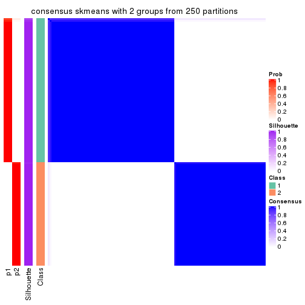</p>

</div>
<div id='tab-ATC-skmeans-consensus-heatmap-2'>
<pre><code class="r">consensus_heatmap(res, k = 3)
</code></pre>

<p>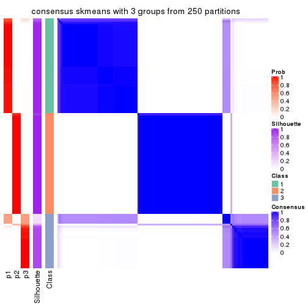</p>

</div>
<div id='tab-ATC-skmeans-consensus-heatmap-3'>
<pre><code class="r">consensus_heatmap(res, k = 4)
</code></pre>

<p>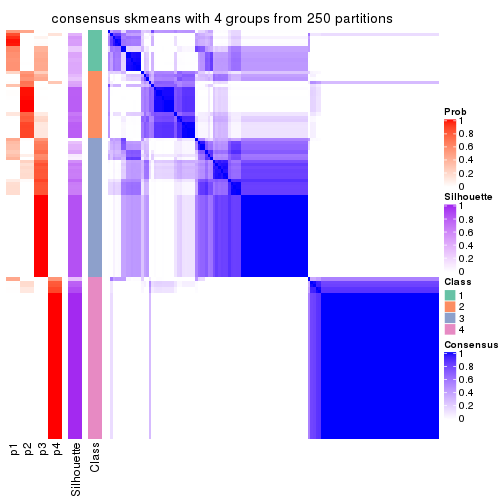</p>

</div>
<div id='tab-ATC-skmeans-consensus-heatmap-4'>
<pre><code class="r">consensus_heatmap(res, k = 5)
</code></pre>

<p>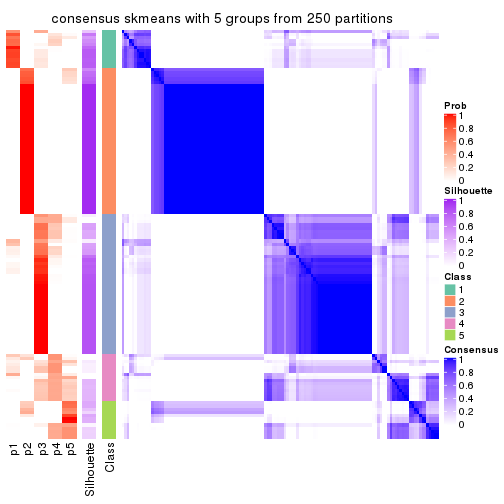</p>

</div>
<div id='tab-ATC-skmeans-consensus-heatmap-5'>
<pre><code class="r">consensus_heatmap(res, k = 6)
</code></pre>

<p>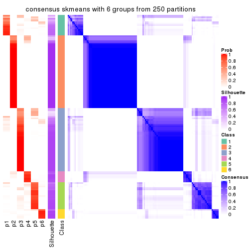</p>

</div>
</div>

Heatmaps for the membership of samples in all partitions to see how consistent they are:


<script>
$( function() {
	$( '#tabs-ATC-skmeans-membership-heatmap' ).tabs();
} );
</script>
<div id='tabs-ATC-skmeans-membership-heatmap'>
<ul>
<li><a href='#tab-ATC-skmeans-membership-heatmap-1'>k = 2</a></li>
<li><a href='#tab-ATC-skmeans-membership-heatmap-2'>k = 3</a></li>
<li><a href='#tab-ATC-skmeans-membership-heatmap-3'>k = 4</a></li>
<li><a href='#tab-ATC-skmeans-membership-heatmap-4'>k = 5</a></li>
<li><a href='#tab-ATC-skmeans-membership-heatmap-5'>k = 6</a></li>
</ul>
<div id='tab-ATC-skmeans-membership-heatmap-1'>
<pre><code class="r">membership_heatmap(res, k = 2)
</code></pre>

<p>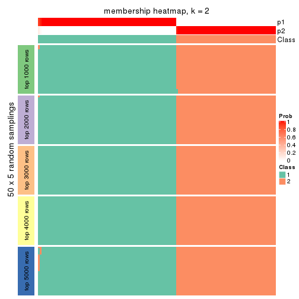</p>

</div>
<div id='tab-ATC-skmeans-membership-heatmap-2'>
<pre><code class="r">membership_heatmap(res, k = 3)
</code></pre>

<p>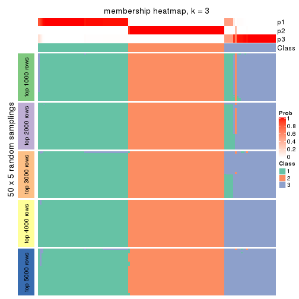</p>

</div>
<div id='tab-ATC-skmeans-membership-heatmap-3'>
<pre><code class="r">membership_heatmap(res, k = 4)
</code></pre>

<p>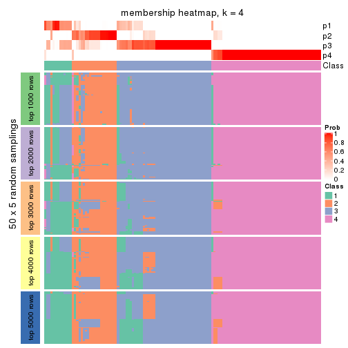</p>

</div>
<div id='tab-ATC-skmeans-membership-heatmap-4'>
<pre><code class="r">membership_heatmap(res, k = 5)
</code></pre>

<p>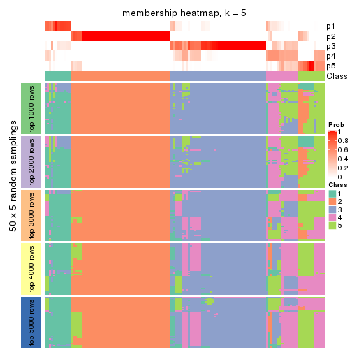</p>

</div>
<div id='tab-ATC-skmeans-membership-heatmap-5'>
<pre><code class="r">membership_heatmap(res, k = 6)
</code></pre>

<p>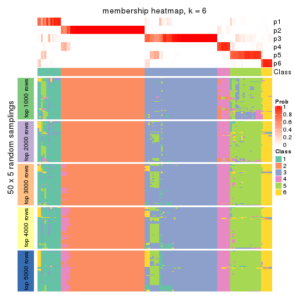</p>

</div>
</div>

As soon as we have had the classes for columns, we can look for signatures
which are significantly different between classes which can be candidate marks
for certain classes. Following are the heatmaps for signatures.


Signature heatmaps where rows are scaled:


<script>
$( function() {
	$( '#tabs-ATC-skmeans-get-signatures' ).tabs();
} );
</script>
<div id='tabs-ATC-skmeans-get-signatures'>
<ul>
<li><a href='#tab-ATC-skmeans-get-signatures-1'>k = 2</a></li>
<li><a href='#tab-ATC-skmeans-get-signatures-2'>k = 3</a></li>
<li><a href='#tab-ATC-skmeans-get-signatures-3'>k = 4</a></li>
<li><a href='#tab-ATC-skmeans-get-signatures-4'>k = 5</a></li>
<li><a href='#tab-ATC-skmeans-get-signatures-5'>k = 6</a></li>
</ul>
<div id='tab-ATC-skmeans-get-signatures-1'>
<pre><code class="r">get_signatures(res, k = 2)
</code></pre>

<p>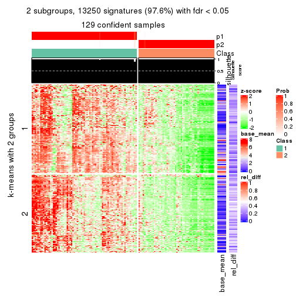</p>

</div>
<div id='tab-ATC-skmeans-get-signatures-2'>
<pre><code class="r">get_signatures(res, k = 3)
</code></pre>

<p>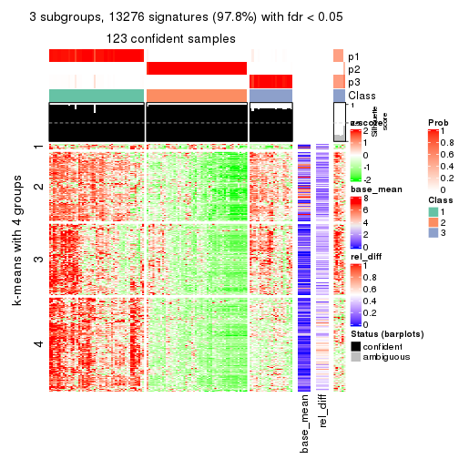</p>

</div>
<div id='tab-ATC-skmeans-get-signatures-3'>
<pre><code class="r">get_signatures(res, k = 4)
</code></pre>

<p>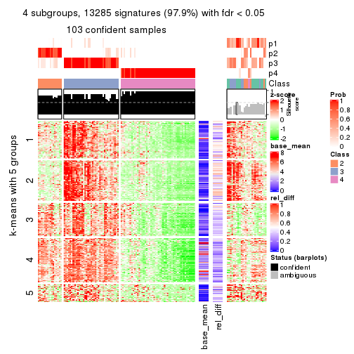</p>

</div>
<div id='tab-ATC-skmeans-get-signatures-4'>
<pre><code class="r">get_signatures(res, k = 5)
</code></pre>

<p>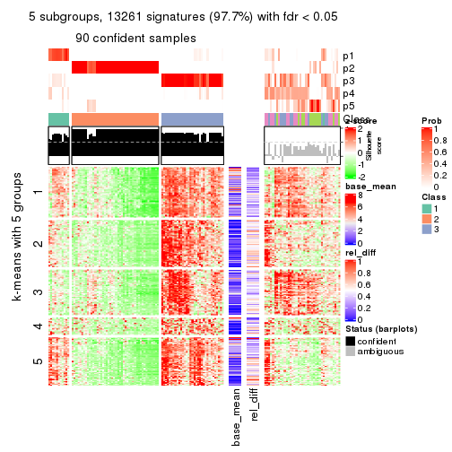</p>

</div>
<div id='tab-ATC-skmeans-get-signatures-5'>
<pre><code class="r">get_signatures(res, k = 6)
</code></pre>

<p>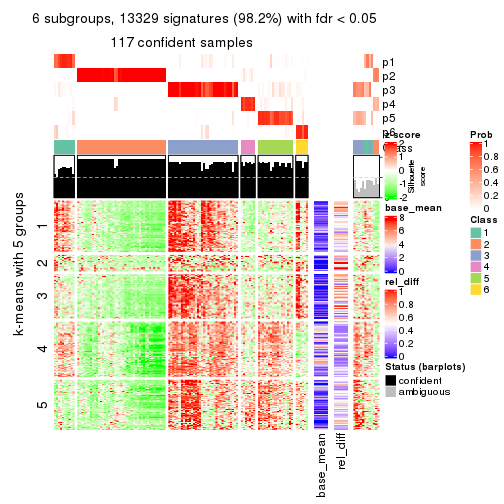</p>

</div>
</div>


Signature heatmaps where rows are not scaled:


<script>
$( function() {
	$( '#tabs-ATC-skmeans-get-signatures-no-scale' ).tabs();
} );
</script>
<div id='tabs-ATC-skmeans-get-signatures-no-scale'>
<ul>
<li><a href='#tab-ATC-skmeans-get-signatures-no-scale-1'>k = 2</a></li>
<li><a href='#tab-ATC-skmeans-get-signatures-no-scale-2'>k = 3</a></li>
<li><a href='#tab-ATC-skmeans-get-signatures-no-scale-3'>k = 4</a></li>
<li><a href='#tab-ATC-skmeans-get-signatures-no-scale-4'>k = 5</a></li>
<li><a href='#tab-ATC-skmeans-get-signatures-no-scale-5'>k = 6</a></li>
</ul>
<div id='tab-ATC-skmeans-get-signatures-no-scale-1'>
<pre><code class="r">get_signatures(res, k = 2, scale_rows = FALSE)
</code></pre>

<p>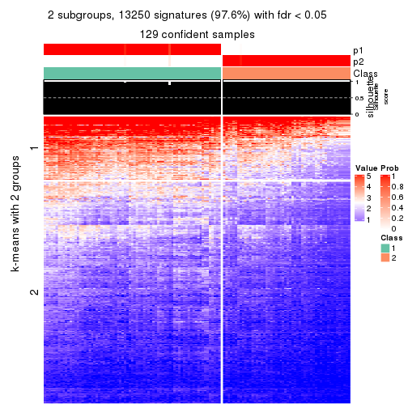</p>

</div>
<div id='tab-ATC-skmeans-get-signatures-no-scale-2'>
<pre><code class="r">get_signatures(res, k = 3, scale_rows = FALSE)
</code></pre>

<p>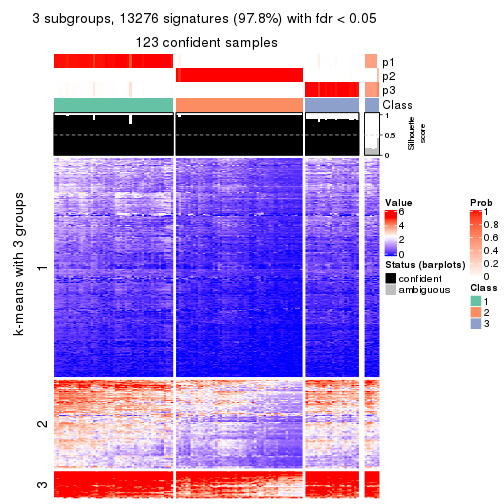</p>

</div>
<div id='tab-ATC-skmeans-get-signatures-no-scale-3'>
<pre><code class="r">get_signatures(res, k = 4, scale_rows = FALSE)
</code></pre>

<p>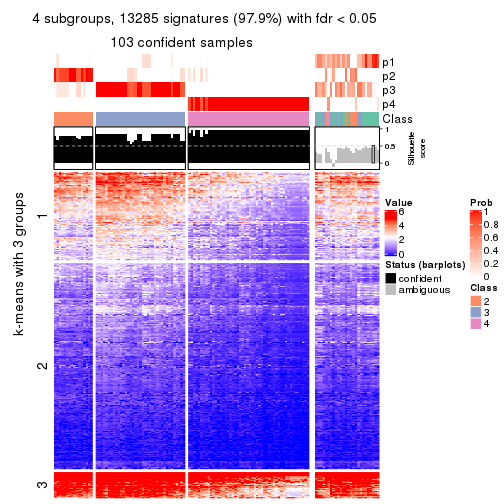</p>

</div>
<div id='tab-ATC-skmeans-get-signatures-no-scale-4'>
<pre><code class="r">get_signatures(res, k = 5, scale_rows = FALSE)
</code></pre>

<p>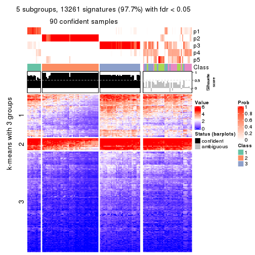</p>

</div>
<div id='tab-ATC-skmeans-get-signatures-no-scale-5'>
<pre><code class="r">get_signatures(res, k = 6, scale_rows = FALSE)
</code></pre>

<p>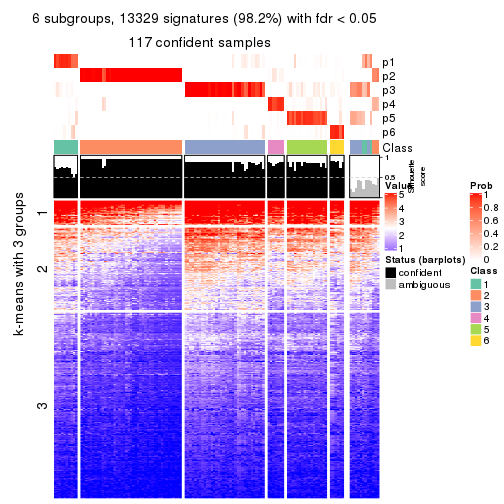</p>

</div>
</div>


Compare the overlap of signatures from different k:

```r
compare_signatures(res)
```

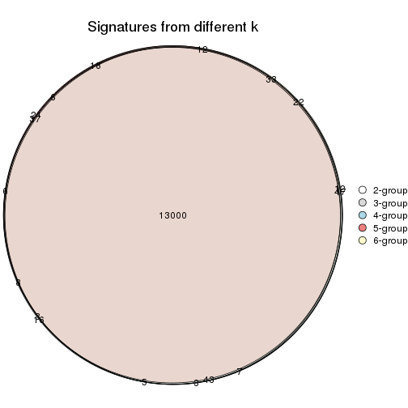

`get_signature()` returns a data frame invisibly. TO get the list of signatures, the function
call should be assigned to a variable explicitly. In following code, if `plot` argument is set
to `FALSE`, no heatmap is plotted while only the differential analysis is performed.

```r
# code only for demonstration
tb = get_signature(res, k = ..., plot = FALSE)
```

An example of the output of `tb` is:

```
#>   which_row         fdr    mean_1    mean_2 scaled_mean_1 scaled_mean_2 km
#> 1        38 0.042760348  8.373488  9.131774    -0.5533452     0.5164555  1
#> 2        40 0.018707592  7.106213  8.469186    -0.6173731     0.5762149  1
#> 3        55 0.019134737 10.221463 11.207825    -0.6159697     0.5749050  1
#> 4        59 0.006059896  5.921854  7.869574    -0.6899429     0.6439467  1
#> 5        60 0.018055526  8.928898 10.211722    -0.6204761     0.5791110  1
#> 6        98 0.009384629 15.714769 14.887706     0.6635654    -0.6193277  2
...
```

The columns in `tb` are:

1. `which_row`: row indices corresponding to the input matrix.
2. `fdr`: FDR for the differential test. 
3. `mean_x`: The mean value in group x.
4. `scaled_mean_x`: The mean value in group x after rows are scaled.
5. `km`: Row groups if k-means clustering is applied to rows.


UMAP plot which shows how samples are separated.


<script>
$( function() {
	$( '#tabs-ATC-skmeans-dimension-reduction' ).tabs();
} );
</script>
<div id='tabs-ATC-skmeans-dimension-reduction'>
<ul>
<li><a href='#tab-ATC-skmeans-dimension-reduction-1'>k = 2</a></li>
<li><a href='#tab-ATC-skmeans-dimension-reduction-2'>k = 3</a></li>
<li><a href='#tab-ATC-skmeans-dimension-reduction-3'>k = 4</a></li>
<li><a href='#tab-ATC-skmeans-dimension-reduction-4'>k = 5</a></li>
<li><a href='#tab-ATC-skmeans-dimension-reduction-5'>k = 6</a></li>
</ul>
<div id='tab-ATC-skmeans-dimension-reduction-1'>
<pre><code class="r">dimension_reduction(res, k = 2, method = &quot;UMAP&quot;)
</code></pre>

<p>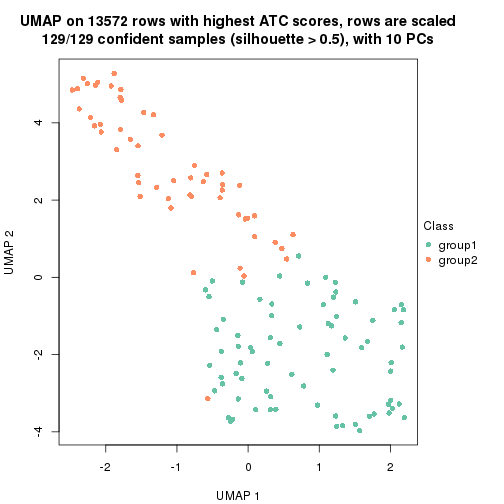</p>

</div>
<div id='tab-ATC-skmeans-dimension-reduction-2'>
<pre><code class="r">dimension_reduction(res, k = 3, method = &quot;UMAP&quot;)
</code></pre>

<p>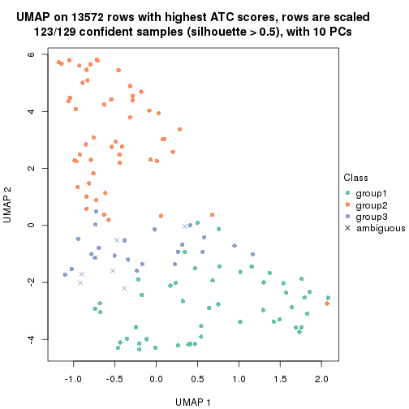</p>

</div>
<div id='tab-ATC-skmeans-dimension-reduction-3'>
<pre><code class="r">dimension_reduction(res, k = 4, method = &quot;UMAP&quot;)
</code></pre>

<p>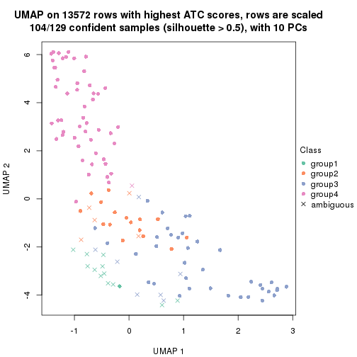</p>

</div>
<div id='tab-ATC-skmeans-dimension-reduction-4'>
<pre><code class="r">dimension_reduction(res, k = 5, method = &quot;UMAP&quot;)
</code></pre>

<p>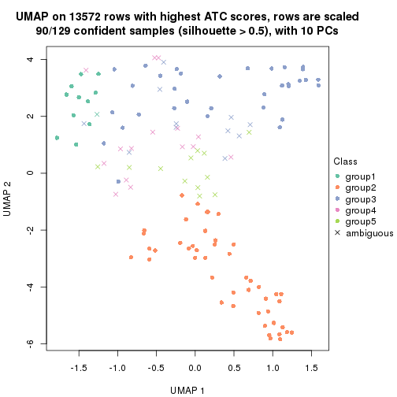</p>

</div>
<div id='tab-ATC-skmeans-dimension-reduction-5'>
<pre><code class="r">dimension_reduction(res, k = 6, method = &quot;UMAP&quot;)
</code></pre>

<p>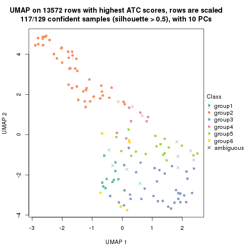</p>

</div>
</div>


Following heatmap shows how subgroups are split when increasing `k`:

```r
collect_classes(res)
```

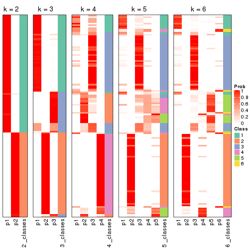


If matrix rows can be associated to genes, consider to use `GO_Enrichment(res,
...)` to perform function enrichment for the signature genes.


 

---------------------------------------------------


### ATC:pam**


The object with results only for a single top-value method and a single partition method 
can be extracted as:

```r
res = res_list["ATC", "pam"]
# you can also extract it by
# res = res_list["ATC:pam"]
```

A summary of `res` and all the functions that can be applied to it:

```r
res
```

```
#> A 'ConsensusPartition' object with k = 2, 3, 4, 5, 6.
#>   On a matrix with 13572 rows and 129 columns.
#>   Top rows (1000, 2000, 3000, 4000, 5000) are extracted by 'ATC' method.
#>   Subgroups are detected by 'pam' method.
#>   Performed in total 1250 partitions by row resampling.
#>   Best k for subgroups seems to be 4.
#> 
#> Following methods can be applied to this 'ConsensusPartition' object:
#>  [1] "cola_report"             "collect_classes"         "collect_plots"          
#>  [4] "collect_stats"           "colnames"                "compare_signatures"     
#>  [7] "consensus_heatmap"       "dimension_reduction"     "functional_enrichment"  
#> [10] "get_anno_col"            "get_anno"                "get_classes"            
#> [13] "get_consensus"           "get_matrix"              "get_membership"         
#> [16] "get_param"               "get_signatures"          "get_stats"              
#> [19] "is_best_k"               "is_stable_k"             "membership_heatmap"     
#> [22] "ncol"                    "nrow"                    "plot_ecdf"              
#> [25] "rownames"                "select_partition_number" "show"                   
#> [28] "suggest_best_k"          "test_to_known_factors"
```

`collect_plots()` function collects all the plots made from `res` for all `k` (number of partitions)
into one single page to provide an easy and fast comparison between different `k`.

```r
collect_plots(res)
```

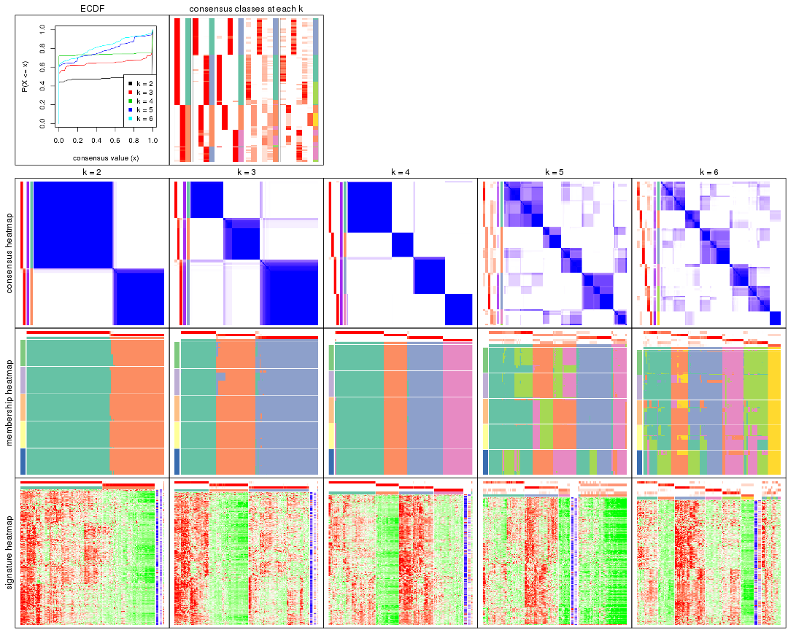

The plots are:

- The first row: a plot of the ECDF (Empirical cumulative distribution
  function) curves of the consensus matrix for each `k` and the heatmap of
  predicted classes for each `k`.
- The second row: heatmaps of the consensus matrix for each `k`.
- The third row: heatmaps of the membership matrix for each `k`.
- The fouth row: heatmaps of the signatures for each `k`.

All the plots in panels can be made by individual functions and they are
plotted later in this section.

`select_partition_number()` produces several plots showing different
statistics for choosing "optimized" `k`. There are following statistics:

- ECDF curves of the consensus matrix for each `k`;
- 1-PAC. [The PAC
  score](https://en.wikipedia.org/wiki/Consensus_clustering#Over-interpretation_potential_of_consensus_clustering)
  measures the proportion of the ambiguous subgrouping.
- Mean silhouette score.
- Concordance. The mean probability of fiting the consensus class ids in all
  partitions.
- Area increased. Denote $A_k$ as the area under the ECDF curve for current
  `k`, the area increased is defined as $A_k - A_{k-1}$.
- Rand index. The percent of pairs of samples that are both in a same cluster
  or both are not in a same cluster in the partition of k and k-1.
- Jaccard index. The ratio of pairs of samples are both in a same cluster in
  the partition of k and k-1 and the pairs of samples are both in a same
  cluster in the partition k or k-1.

The detailed explanations of these statistics can be found in [the cola
vignette](http://bioconductor.org/packages/devel/bioc/vignettes/cola/inst/doc/cola.html#toc_13).

Generally speaking, lower PAC score, higher mean silhouette score or higher
concordance corresponds to better partition. Rand index and Jaccard index
measure how similar the current partition is compared to partition with `k-1`.
If they are too similar, we won't accept `k` is better than `k-1`.

```r
select_partition_number(res)
```

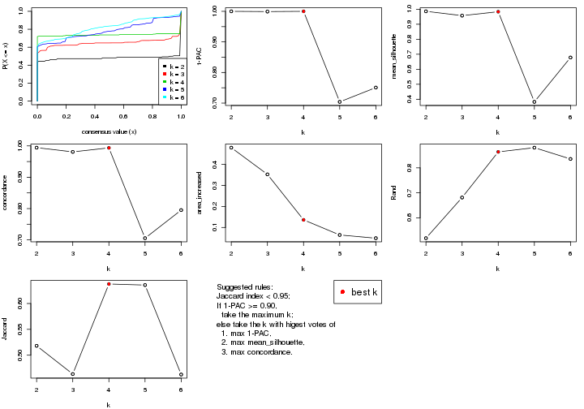

The numeric values for all these statistics can be obtained by `get_stats()`.

```r
get_stats(res)
```

```
#>   k 1-PAC mean_silhouette concordance area_increased  Rand Jaccard
#> 2 2 1.000           0.986       0.994         0.4798 0.518   0.518
#> 3 3 0.999           0.957       0.981         0.3527 0.681   0.464
#> 4 4 1.000           0.983       0.994         0.1363 0.864   0.638
#> 5 5 0.704           0.383       0.705         0.0644 0.881   0.636
#> 6 6 0.751           0.678       0.795         0.0490 0.836   0.463
```

`suggest_best_k()` suggests the best $k$ based on these statistics. The rules are as follows:

- All $k$ with Jaccard index larger than 0.95 are removed because the increase of
  the partition number does not provides enough extra information. If all $k$ are removed,
  the best $k$ is assigned by `NA`.
- For $k$ with 1-PAC larger than 0.9, the maximal $k$ is taken as the "best k". Other $k$ is called "optional k".
- If it does not fit the second rule. The $k$ with the highest vote of highest
  1-PAC, mean silhouette and concordance is taken as the "best k".

```r
suggest_best_k(res)
```

```
#> [1] 4
#> attr(,"optional")
#> [1] 2 3
```

There is also optional best $k$ = 2 3 that is worth to check.

Following shows the table of the partitions (You need to click the **show/hide
code output** link to see it). The membership matrix (columns with name `p*`)
is inferred by
[`clue::cl_consensus()`](https://www.rdocumentation.org/link/cl_consensus?package=clue)
function with the `SE` method. Basically the value in the membership matrix
represents the probability to belong to a certain group. The finall class
label for an item is determined with the group with highest probability it
belongs to.

In `get_classes()` function, the entropy is calculated from the membership
matrix and the silhouette score is calculated from the consensus matrix.


<script>
$( function() {
	$( '#tabs-ATC-pam-get-classes' ).tabs();
} );
</script>
<div id='tabs-ATC-pam-get-classes'>
<ul>
<li><a href='#tab-ATC-pam-get-classes-1'>k = 2</a></li>
<li><a href='#tab-ATC-pam-get-classes-2'>k = 3</a></li>
<li><a href='#tab-ATC-pam-get-classes-3'>k = 4</a></li>
<li><a href='#tab-ATC-pam-get-classes-4'>k = 5</a></li>
<li><a href='#tab-ATC-pam-get-classes-5'>k = 6</a></li>
</ul>

<div id='tab-ATC-pam-get-classes-1'>
<p><a id='tab-ATC-pam-get-classes-1-a' style='color:#0366d6' href='#'>show/hide code output</a></p>
<pre><code class="r">cbind(get_classes(res, k = 2), get_membership(res, k = 2))
</code></pre>

<pre><code>#&gt;            class entropy silhouette    p1    p2
#&gt; SRR1656463     2  0.0000      0.985 0.000 1.000
#&gt; SRR1656464     1  0.0000      1.000 1.000 0.000
#&gt; SRR1656462     1  0.0000      1.000 1.000 0.000
#&gt; SRR1656465     1  0.0000      1.000 1.000 0.000
#&gt; SRR1656467     2  0.0000      0.985 0.000 1.000
#&gt; SRR1656466     1  0.0000      1.000 1.000 0.000
#&gt; SRR1656468     2  0.0000      0.985 0.000 1.000
#&gt; SRR1656472     1  0.0000      1.000 1.000 0.000
#&gt; SRR1656471     1  0.0000      1.000 1.000 0.000
#&gt; SRR1656470     2  0.0000      0.985 0.000 1.000
#&gt; SRR1656469     1  0.0000      1.000 1.000 0.000
#&gt; SRR1656473     2  0.0000      0.985 0.000 1.000
#&gt; SRR1656474     2  0.0000      0.985 0.000 1.000
#&gt; SRR1656475     2  0.0000      0.985 0.000 1.000
#&gt; SRR1656478     1  0.0000      1.000 1.000 0.000
#&gt; SRR1656477     2  0.5629      0.848 0.132 0.868
#&gt; SRR1656479     1  0.0000      1.000 1.000 0.000
#&gt; SRR1656480     2  0.0000      0.985 0.000 1.000
#&gt; SRR1656476     2  0.0000      0.985 0.000 1.000
#&gt; SRR1656481     2  0.2948      0.938 0.052 0.948
#&gt; SRR1656482     2  0.0000      0.985 0.000 1.000
#&gt; SRR1656483     2  0.0000      0.985 0.000 1.000
#&gt; SRR1656485     1  0.0000      1.000 1.000 0.000
#&gt; SRR1656487     1  0.0000      1.000 1.000 0.000
#&gt; SRR1656486     1  0.0000      1.000 1.000 0.000
#&gt; SRR1656488     1  0.0000      1.000 1.000 0.000
#&gt; SRR1656484     1  0.0000      1.000 1.000 0.000
#&gt; SRR1656489     1  0.0000      1.000 1.000 0.000
#&gt; SRR1656491     1  0.0000      1.000 1.000 0.000
#&gt; SRR1656490     1  0.0000      1.000 1.000 0.000
#&gt; SRR1656492     1  0.0000      1.000 1.000 0.000
#&gt; SRR1656493     1  0.0000      1.000 1.000 0.000
#&gt; SRR1656495     2  0.9922      0.204 0.448 0.552
#&gt; SRR1656496     1  0.0000      1.000 1.000 0.000
#&gt; SRR1656494     2  0.0000      0.985 0.000 1.000
#&gt; SRR1656497     2  0.0000      0.985 0.000 1.000
#&gt; SRR1656499     1  0.0000      1.000 1.000 0.000
#&gt; SRR1656500     1  0.0000      1.000 1.000 0.000
#&gt; SRR1656501     1  0.0000      1.000 1.000 0.000
#&gt; SRR1656498     1  0.0000      1.000 1.000 0.000
#&gt; SRR1656504     2  0.0000      0.985 0.000 1.000
#&gt; SRR1656502     1  0.0000      1.000 1.000 0.000
#&gt; SRR1656503     1  0.0000      1.000 1.000 0.000
#&gt; SRR1656507     1  0.0000      1.000 1.000 0.000
#&gt; SRR1656508     1  0.0000      1.000 1.000 0.000
#&gt; SRR1656505     2  0.0000      0.985 0.000 1.000
#&gt; SRR1656506     1  0.0000      1.000 1.000 0.000
#&gt; SRR1656509     1  0.0000      1.000 1.000 0.000
#&gt; SRR1656510     2  0.0000      0.985 0.000 1.000
#&gt; SRR1656511     2  0.0000      0.985 0.000 1.000
#&gt; SRR1656513     2  0.0000      0.985 0.000 1.000
#&gt; SRR1656512     2  0.0000      0.985 0.000 1.000
#&gt; SRR1656514     1  0.0000      1.000 1.000 0.000
#&gt; SRR1656515     2  0.0000      0.985 0.000 1.000
#&gt; SRR1656516     1  0.0000      1.000 1.000 0.000
#&gt; SRR1656518     1  0.0000      1.000 1.000 0.000
#&gt; SRR1656517     1  0.0000      1.000 1.000 0.000
#&gt; SRR1656519     1  0.0000      1.000 1.000 0.000
#&gt; SRR1656522     1  0.0000      1.000 1.000 0.000
#&gt; SRR1656523     2  0.0000      0.985 0.000 1.000
#&gt; SRR1656521     2  0.0000      0.985 0.000 1.000
#&gt; SRR1656520     1  0.0000      1.000 1.000 0.000
#&gt; SRR1656524     1  0.0000      1.000 1.000 0.000
#&gt; SRR1656525     1  0.0000      1.000 1.000 0.000
#&gt; SRR1656526     2  0.0000      0.985 0.000 1.000
#&gt; SRR1656527     2  0.0000      0.985 0.000 1.000
#&gt; SRR1656530     1  0.0000      1.000 1.000 0.000
#&gt; SRR1656529     1  0.0000      1.000 1.000 0.000
#&gt; SRR1656531     1  0.0000      1.000 1.000 0.000
#&gt; SRR1656528     1  0.0000      1.000 1.000 0.000
#&gt; SRR1656534     1  0.0000      1.000 1.000 0.000
#&gt; SRR1656533     1  0.0000      1.000 1.000 0.000
#&gt; SRR1656536     1  0.0000      1.000 1.000 0.000
#&gt; SRR1656532     2  0.0000      0.985 0.000 1.000
#&gt; SRR1656537     1  0.0000      1.000 1.000 0.000
#&gt; SRR1656538     1  0.0000      1.000 1.000 0.000
#&gt; SRR1656535     2  0.0000      0.985 0.000 1.000
#&gt; SRR1656539     1  0.0000      1.000 1.000 0.000
#&gt; SRR1656544     1  0.0000      1.000 1.000 0.000
#&gt; SRR1656542     1  0.0000      1.000 1.000 0.000
#&gt; SRR1656543     1  0.0000      1.000 1.000 0.000
#&gt; SRR1656545     2  0.0000      0.985 0.000 1.000
#&gt; SRR1656540     1  0.0000      1.000 1.000 0.000
#&gt; SRR1656546     2  0.0000      0.985 0.000 1.000
#&gt; SRR1656541     2  0.0000      0.985 0.000 1.000
#&gt; SRR1656547     2  0.0000      0.985 0.000 1.000
#&gt; SRR1656548     1  0.0000      1.000 1.000 0.000
#&gt; SRR1656549     1  0.0000      1.000 1.000 0.000
#&gt; SRR1656551     1  0.0000      1.000 1.000 0.000
#&gt; SRR1656553     1  0.0000      1.000 1.000 0.000
#&gt; SRR1656550     2  0.4298      0.899 0.088 0.912
#&gt; SRR1656552     2  0.0000      0.985 0.000 1.000
#&gt; SRR1656554     1  0.0000      1.000 1.000 0.000
#&gt; SRR1656555     2  0.0000      0.985 0.000 1.000
#&gt; SRR1656556     1  0.0000      1.000 1.000 0.000
#&gt; SRR1656557     1  0.0000      1.000 1.000 0.000
#&gt; SRR1656558     1  0.0000      1.000 1.000 0.000
#&gt; SRR1656559     1  0.0000      1.000 1.000 0.000
#&gt; SRR1656560     1  0.0000      1.000 1.000 0.000
#&gt; SRR1656561     1  0.0000      1.000 1.000 0.000
#&gt; SRR1656562     2  0.0000      0.985 0.000 1.000
#&gt; SRR1656563     1  0.0000      1.000 1.000 0.000
#&gt; SRR1656564     2  0.0000      0.985 0.000 1.000
#&gt; SRR1656565     2  0.0000      0.985 0.000 1.000
#&gt; SRR1656566     1  0.0000      1.000 1.000 0.000
#&gt; SRR1656568     2  0.0000      0.985 0.000 1.000
#&gt; SRR1656567     2  0.0000      0.985 0.000 1.000
#&gt; SRR1656569     1  0.0000      1.000 1.000 0.000
#&gt; SRR1656570     1  0.0000      1.000 1.000 0.000
#&gt; SRR1656571     2  0.0000      0.985 0.000 1.000
#&gt; SRR1656573     1  0.0000      1.000 1.000 0.000
#&gt; SRR1656572     2  0.0000      0.985 0.000 1.000
#&gt; SRR1656574     1  0.0000      1.000 1.000 0.000
#&gt; SRR1656575     1  0.0000      1.000 1.000 0.000
#&gt; SRR1656576     2  0.0000      0.985 0.000 1.000
#&gt; SRR1656578     2  0.0000      0.985 0.000 1.000
#&gt; SRR1656577     1  0.0000      1.000 1.000 0.000
#&gt; SRR1656579     2  0.0000      0.985 0.000 1.000
#&gt; SRR1656580     1  0.0000      1.000 1.000 0.000
#&gt; SRR1656581     2  0.0672      0.979 0.008 0.992
#&gt; SRR1656582     2  0.0000      0.985 0.000 1.000
#&gt; SRR1656585     1  0.0000      1.000 1.000 0.000
#&gt; SRR1656584     1  0.0000      1.000 1.000 0.000
#&gt; SRR1656583     1  0.0000      1.000 1.000 0.000
#&gt; SRR1656586     2  0.0000      0.985 0.000 1.000
#&gt; SRR1656587     1  0.0000      1.000 1.000 0.000
#&gt; SRR1656588     2  0.0000      0.985 0.000 1.000
#&gt; SRR1656589     2  0.0000      0.985 0.000 1.000
#&gt; SRR1656590     1  0.0000      1.000 1.000 0.000
</code></pre>

<script>
$('#tab-ATC-pam-get-classes-1-a').parent().next().next().hide();
$('#tab-ATC-pam-get-classes-1-a').click(function(){
  $('#tab-ATC-pam-get-classes-1-a').parent().next().next().toggle();
  return(false);
});
</script>
</div>

<div id='tab-ATC-pam-get-classes-2'>
<p><a id='tab-ATC-pam-get-classes-2-a' style='color:#0366d6' href='#'>show/hide code output</a></p>
<pre><code class="r">cbind(get_classes(res, k = 3), get_membership(res, k = 3))
</code></pre>

<pre><code>#&gt;            class entropy silhouette    p1    p2    p3
#&gt; SRR1656463     2  0.0000      0.966 0.000 1.000 0.000
#&gt; SRR1656464     1  0.0000      0.999 1.000 0.000 0.000
#&gt; SRR1656462     1  0.0000      0.999 1.000 0.000 0.000
#&gt; SRR1656465     3  0.0000      0.975 0.000 0.000 1.000
#&gt; SRR1656467     2  0.0000      0.966 0.000 1.000 0.000
#&gt; SRR1656466     3  0.0000      0.975 0.000 0.000 1.000
#&gt; SRR1656468     3  0.0892      0.959 0.000 0.020 0.980
#&gt; SRR1656472     3  0.5650      0.562 0.312 0.000 0.688
#&gt; SRR1656471     1  0.0000      0.999 1.000 0.000 0.000
#&gt; SRR1656470     2  0.0000      0.966 0.000 1.000 0.000
#&gt; SRR1656469     3  0.0000      0.975 0.000 0.000 1.000
#&gt; SRR1656473     2  0.0000      0.966 0.000 1.000 0.000
#&gt; SRR1656474     2  0.0000      0.966 0.000 1.000 0.000
#&gt; SRR1656475     2  0.0000      0.966 0.000 1.000 0.000
#&gt; SRR1656478     3  0.0000      0.975 0.000 0.000 1.000
#&gt; SRR1656477     3  0.0000      0.975 0.000 0.000 1.000
#&gt; SRR1656479     3  0.0000      0.975 0.000 0.000 1.000
#&gt; SRR1656480     3  0.0000      0.975 0.000 0.000 1.000
#&gt; SRR1656476     2  0.0000      0.966 0.000 1.000 0.000
#&gt; SRR1656481     3  0.0000      0.975 0.000 0.000 1.000
#&gt; SRR1656482     2  0.0000      0.966 0.000 1.000 0.000
#&gt; SRR1656483     2  0.0000      0.966 0.000 1.000 0.000
#&gt; SRR1656485     1  0.0000      0.999 1.000 0.000 0.000
#&gt; SRR1656487     3  0.0000      0.975 0.000 0.000 1.000
#&gt; SRR1656486     3  0.0000      0.975 0.000 0.000 1.000
#&gt; SRR1656488     1  0.0000      0.999 1.000 0.000 0.000
#&gt; SRR1656484     3  0.0747      0.962 0.016 0.000 0.984
#&gt; SRR1656489     1  0.0000      0.999 1.000 0.000 0.000
#&gt; SRR1656491     3  0.0000      0.975 0.000 0.000 1.000
#&gt; SRR1656490     3  0.0000      0.975 0.000 0.000 1.000
#&gt; SRR1656492     3  0.0000      0.975 0.000 0.000 1.000
#&gt; SRR1656493     3  0.0000      0.975 0.000 0.000 1.000
#&gt; SRR1656495     3  0.0000      0.975 0.000 0.000 1.000
#&gt; SRR1656496     3  0.0000      0.975 0.000 0.000 1.000
#&gt; SRR1656494     3  0.0000      0.975 0.000 0.000 1.000
#&gt; SRR1656497     2  0.0000      0.966 0.000 1.000 0.000
#&gt; SRR1656499     1  0.0000      0.999 1.000 0.000 0.000
#&gt; SRR1656500     1  0.0000      0.999 1.000 0.000 0.000
#&gt; SRR1656501     3  0.0000      0.975 0.000 0.000 1.000
#&gt; SRR1656498     1  0.0000      0.999 1.000 0.000 0.000
#&gt; SRR1656504     2  0.0000      0.966 0.000 1.000 0.000
#&gt; SRR1656502     3  0.0237      0.973 0.004 0.000 0.996
#&gt; SRR1656503     3  0.0000      0.975 0.000 0.000 1.000
#&gt; SRR1656507     3  0.0000      0.975 0.000 0.000 1.000
#&gt; SRR1656508     1  0.0000      0.999 1.000 0.000 0.000
#&gt; SRR1656505     3  0.0000      0.975 0.000 0.000 1.000
#&gt; SRR1656506     3  0.0000      0.975 0.000 0.000 1.000
#&gt; SRR1656509     3  0.0000      0.975 0.000 0.000 1.000
#&gt; SRR1656510     2  0.2537      0.912 0.000 0.920 0.080
#&gt; SRR1656511     2  0.2261      0.923 0.000 0.932 0.068
#&gt; SRR1656513     2  0.2261      0.923 0.000 0.932 0.068
#&gt; SRR1656512     2  0.0000      0.966 0.000 1.000 0.000
#&gt; SRR1656514     1  0.0000      0.999 1.000 0.000 0.000
#&gt; SRR1656515     2  0.0000      0.966 0.000 1.000 0.000
#&gt; SRR1656516     3  0.0000      0.975 0.000 0.000 1.000
#&gt; SRR1656518     3  0.0000      0.975 0.000 0.000 1.000
#&gt; SRR1656517     1  0.0000      0.999 1.000 0.000 0.000
#&gt; SRR1656519     1  0.0000      0.999 1.000 0.000 0.000
#&gt; SRR1656522     1  0.0000      0.999 1.000 0.000 0.000
#&gt; SRR1656523     3  0.3192      0.862 0.000 0.112 0.888
#&gt; SRR1656521     2  0.0000      0.966 0.000 1.000 0.000
#&gt; SRR1656520     1  0.0000      0.999 1.000 0.000 0.000
#&gt; SRR1656524     3  0.0000      0.975 0.000 0.000 1.000
#&gt; SRR1656525     3  0.6126      0.356 0.400 0.000 0.600
#&gt; SRR1656526     2  0.0000      0.966 0.000 1.000 0.000
#&gt; SRR1656527     2  0.0000      0.966 0.000 1.000 0.000
#&gt; SRR1656530     3  0.0000      0.975 0.000 0.000 1.000
#&gt; SRR1656529     3  0.0000      0.975 0.000 0.000 1.000
#&gt; SRR1656531     1  0.0747      0.982 0.984 0.000 0.016
#&gt; SRR1656528     1  0.0237      0.995 0.996 0.000 0.004
#&gt; SRR1656534     1  0.0000      0.999 1.000 0.000 0.000
#&gt; SRR1656533     1  0.0000      0.999 1.000 0.000 0.000
#&gt; SRR1656536     3  0.0000      0.975 0.000 0.000 1.000
#&gt; SRR1656532     2  0.2625      0.908 0.000 0.916 0.084
#&gt; SRR1656537     1  0.0000      0.999 1.000 0.000 0.000
#&gt; SRR1656538     1  0.0000      0.999 1.000 0.000 0.000
#&gt; SRR1656535     2  0.0000      0.966 0.000 1.000 0.000
#&gt; SRR1656539     3  0.0000      0.975 0.000 0.000 1.000
#&gt; SRR1656544     1  0.0000      0.999 1.000 0.000 0.000
#&gt; SRR1656542     1  0.0000      0.999 1.000 0.000 0.000
#&gt; SRR1656543     1  0.0000      0.999 1.000 0.000 0.000
#&gt; SRR1656545     2  0.0000      0.966 0.000 1.000 0.000
#&gt; SRR1656540     1  0.0000      0.999 1.000 0.000 0.000
#&gt; SRR1656546     3  0.1163      0.952 0.000 0.028 0.972
#&gt; SRR1656541     2  0.0000      0.966 0.000 1.000 0.000
#&gt; SRR1656547     2  0.2261      0.923 0.000 0.932 0.068
#&gt; SRR1656548     3  0.0000      0.975 0.000 0.000 1.000
#&gt; SRR1656549     3  0.0000      0.975 0.000 0.000 1.000
#&gt; SRR1656551     3  0.0000      0.975 0.000 0.000 1.000
#&gt; SRR1656553     3  0.2261      0.911 0.068 0.000 0.932
#&gt; SRR1656550     3  0.0000      0.975 0.000 0.000 1.000
#&gt; SRR1656552     2  0.0000      0.966 0.000 1.000 0.000
#&gt; SRR1656554     3  0.0000      0.975 0.000 0.000 1.000
#&gt; SRR1656555     3  0.0892      0.959 0.000 0.020 0.980
#&gt; SRR1656556     1  0.0000      0.999 1.000 0.000 0.000
#&gt; SRR1656557     1  0.0000      0.999 1.000 0.000 0.000
#&gt; SRR1656558     3  0.0000      0.975 0.000 0.000 1.000
#&gt; SRR1656559     1  0.0000      0.999 1.000 0.000 0.000
#&gt; SRR1656560     1  0.0000      0.999 1.000 0.000 0.000
#&gt; SRR1656561     3  0.0000      0.975 0.000 0.000 1.000
#&gt; SRR1656562     3  0.0000      0.975 0.000 0.000 1.000
#&gt; SRR1656563     1  0.0000      0.999 1.000 0.000 0.000
#&gt; SRR1656564     2  0.0000      0.966 0.000 1.000 0.000
#&gt; SRR1656565     2  0.5465      0.632 0.000 0.712 0.288
#&gt; SRR1656566     3  0.0000      0.975 0.000 0.000 1.000
#&gt; SRR1656568     2  0.0000      0.966 0.000 1.000 0.000
#&gt; SRR1656567     2  0.5397      0.647 0.000 0.720 0.280
#&gt; SRR1656569     3  0.0000      0.975 0.000 0.000 1.000
#&gt; SRR1656570     3  0.0000      0.975 0.000 0.000 1.000
#&gt; SRR1656571     2  0.0000      0.966 0.000 1.000 0.000
#&gt; SRR1656573     3  0.0000      0.975 0.000 0.000 1.000
#&gt; SRR1656572     2  0.2261      0.923 0.000 0.932 0.068
#&gt; SRR1656574     1  0.0000      0.999 1.000 0.000 0.000
#&gt; SRR1656575     3  0.0000      0.975 0.000 0.000 1.000
#&gt; SRR1656576     2  0.0000      0.966 0.000 1.000 0.000
#&gt; SRR1656578     2  0.0000      0.966 0.000 1.000 0.000
#&gt; SRR1656577     1  0.0000      0.999 1.000 0.000 0.000
#&gt; SRR1656579     2  0.2261      0.923 0.000 0.932 0.068
#&gt; SRR1656580     1  0.0000      0.999 1.000 0.000 0.000
#&gt; SRR1656581     3  0.0000      0.975 0.000 0.000 1.000
#&gt; SRR1656582     2  0.0000      0.966 0.000 1.000 0.000
#&gt; SRR1656585     3  0.0000      0.975 0.000 0.000 1.000
#&gt; SRR1656584     3  0.0000      0.975 0.000 0.000 1.000
#&gt; SRR1656583     3  0.0000      0.975 0.000 0.000 1.000
#&gt; SRR1656586     2  0.0000      0.966 0.000 1.000 0.000
#&gt; SRR1656587     3  0.0000      0.975 0.000 0.000 1.000
#&gt; SRR1656588     3  0.3038      0.870 0.000 0.104 0.896
#&gt; SRR1656589     2  0.0000      0.966 0.000 1.000 0.000
#&gt; SRR1656590     3  0.5465      0.605 0.288 0.000 0.712
</code></pre>

<script>
$('#tab-ATC-pam-get-classes-2-a').parent().next().next().hide();
$('#tab-ATC-pam-get-classes-2-a').click(function(){
  $('#tab-ATC-pam-get-classes-2-a').parent().next().next().toggle();
  return(false);
});
</script>
</div>

<div id='tab-ATC-pam-get-classes-3'>
<p><a id='tab-ATC-pam-get-classes-3-a' style='color:#0366d6' href='#'>show/hide code output</a></p>
<pre><code class="r">cbind(get_classes(res, k = 4), get_membership(res, k = 4))
</code></pre>

<pre><code>#&gt;            class entropy silhouette    p1    p2   p3    p4
#&gt; SRR1656463     2  0.0000      1.000 0.000 1.000 0.00 0.000
#&gt; SRR1656464     3  0.0000      0.986 0.000 0.000 1.00 0.000
#&gt; SRR1656462     3  0.0000      0.986 0.000 0.000 1.00 0.000
#&gt; SRR1656465     1  0.0000      0.990 1.000 0.000 0.00 0.000
#&gt; SRR1656467     4  0.0000      1.000 0.000 0.000 0.00 1.000
#&gt; SRR1656466     1  0.0000      0.990 1.000 0.000 0.00 0.000
#&gt; SRR1656468     4  0.0000      1.000 0.000 0.000 0.00 1.000
#&gt; SRR1656472     1  0.0000      0.990 1.000 0.000 0.00 0.000
#&gt; SRR1656471     3  0.0000      0.986 0.000 0.000 1.00 0.000
#&gt; SRR1656470     2  0.0000      1.000 0.000 1.000 0.00 0.000
#&gt; SRR1656469     1  0.0000      0.990 1.000 0.000 0.00 0.000
#&gt; SRR1656473     2  0.0000      1.000 0.000 1.000 0.00 0.000
#&gt; SRR1656474     2  0.0000      1.000 0.000 1.000 0.00 0.000
#&gt; SRR1656475     2  0.0000      1.000 0.000 1.000 0.00 0.000
#&gt; SRR1656478     1  0.0000      0.990 1.000 0.000 0.00 0.000
#&gt; SRR1656477     4  0.0000      1.000 0.000 0.000 0.00 1.000
#&gt; SRR1656479     1  0.0000      0.990 1.000 0.000 0.00 0.000
#&gt; SRR1656480     4  0.0000      1.000 0.000 0.000 0.00 1.000
#&gt; SRR1656476     2  0.0000      1.000 0.000 1.000 0.00 0.000
#&gt; SRR1656481     4  0.0000      1.000 0.000 0.000 0.00 1.000
#&gt; SRR1656482     4  0.0000      1.000 0.000 0.000 0.00 1.000
#&gt; SRR1656483     2  0.0000      1.000 0.000 1.000 0.00 0.000
#&gt; SRR1656485     3  0.0000      0.986 0.000 0.000 1.00 0.000
#&gt; SRR1656487     1  0.0000      0.990 1.000 0.000 0.00 0.000
#&gt; SRR1656486     1  0.0000      0.990 1.000 0.000 0.00 0.000
#&gt; SRR1656488     3  0.0000      0.986 0.000 0.000 1.00 0.000
#&gt; SRR1656484     1  0.0000      0.990 1.000 0.000 0.00 0.000
#&gt; SRR1656489     3  0.0000      0.986 0.000 0.000 1.00 0.000
#&gt; SRR1656491     1  0.0000      0.990 1.000 0.000 0.00 0.000
#&gt; SRR1656490     1  0.0000      0.990 1.000 0.000 0.00 0.000
#&gt; SRR1656492     1  0.0000      0.990 1.000 0.000 0.00 0.000
#&gt; SRR1656493     1  0.0000      0.990 1.000 0.000 0.00 0.000
#&gt; SRR1656495     1  0.0000      0.990 1.000 0.000 0.00 0.000
#&gt; SRR1656496     1  0.0000      0.990 1.000 0.000 0.00 0.000
#&gt; SRR1656494     4  0.0000      1.000 0.000 0.000 0.00 1.000
#&gt; SRR1656497     2  0.0000      1.000 0.000 1.000 0.00 0.000
#&gt; SRR1656499     3  0.0000      0.986 0.000 0.000 1.00 0.000
#&gt; SRR1656500     3  0.0000      0.986 0.000 0.000 1.00 0.000
#&gt; SRR1656501     1  0.0000      0.990 1.000 0.000 0.00 0.000
#&gt; SRR1656498     3  0.0000      0.986 0.000 0.000 1.00 0.000
#&gt; SRR1656504     2  0.0000      1.000 0.000 1.000 0.00 0.000
#&gt; SRR1656502     1  0.0000      0.990 1.000 0.000 0.00 0.000
#&gt; SRR1656503     1  0.0000      0.990 1.000 0.000 0.00 0.000
#&gt; SRR1656507     1  0.0000      0.990 1.000 0.000 0.00 0.000
#&gt; SRR1656508     3  0.0000      0.986 0.000 0.000 1.00 0.000
#&gt; SRR1656505     4  0.0000      1.000 0.000 0.000 0.00 1.000
#&gt; SRR1656506     1  0.0000      0.990 1.000 0.000 0.00 0.000
#&gt; SRR1656509     1  0.0000      0.990 1.000 0.000 0.00 0.000
#&gt; SRR1656510     4  0.0000      1.000 0.000 0.000 0.00 1.000
#&gt; SRR1656511     4  0.0000      1.000 0.000 0.000 0.00 1.000
#&gt; SRR1656513     4  0.0000      1.000 0.000 0.000 0.00 1.000
#&gt; SRR1656512     2  0.0000      1.000 0.000 1.000 0.00 0.000
#&gt; SRR1656514     3  0.0000      0.986 0.000 0.000 1.00 0.000
#&gt; SRR1656515     4  0.0000      1.000 0.000 0.000 0.00 1.000
#&gt; SRR1656516     1  0.0000      0.990 1.000 0.000 0.00 0.000
#&gt; SRR1656518     1  0.0000      0.990 1.000 0.000 0.00 0.000
#&gt; SRR1656517     3  0.0000      0.986 0.000 0.000 1.00 0.000
#&gt; SRR1656519     3  0.0000      0.986 0.000 0.000 1.00 0.000
#&gt; SRR1656522     3  0.0000      0.986 0.000 0.000 1.00 0.000
#&gt; SRR1656523     4  0.0000      1.000 0.000 0.000 0.00 1.000
#&gt; SRR1656521     2  0.0000      1.000 0.000 1.000 0.00 0.000
#&gt; SRR1656520     3  0.0000      0.986 0.000 0.000 1.00 0.000
#&gt; SRR1656524     1  0.0000      0.990 1.000 0.000 0.00 0.000
#&gt; SRR1656525     1  0.0000      0.990 1.000 0.000 0.00 0.000
#&gt; SRR1656526     2  0.0000      1.000 0.000 1.000 0.00 0.000
#&gt; SRR1656527     2  0.0000      1.000 0.000 1.000 0.00 0.000
#&gt; SRR1656530     1  0.0000      0.990 1.000 0.000 0.00 0.000
#&gt; SRR1656529     1  0.0000      0.990 1.000 0.000 0.00 0.000
#&gt; SRR1656531     3  0.3610      0.742 0.200 0.000 0.80 0.000
#&gt; SRR1656528     3  0.3400      0.770 0.180 0.000 0.82 0.000
#&gt; SRR1656534     3  0.0000      0.986 0.000 0.000 1.00 0.000
#&gt; SRR1656533     3  0.0000      0.986 0.000 0.000 1.00 0.000
#&gt; SRR1656536     1  0.0000      0.990 1.000 0.000 0.00 0.000
#&gt; SRR1656532     4  0.0000      1.000 0.000 0.000 0.00 1.000
#&gt; SRR1656537     3  0.0000      0.986 0.000 0.000 1.00 0.000
#&gt; SRR1656538     3  0.0000      0.986 0.000 0.000 1.00 0.000
#&gt; SRR1656535     2  0.0000      1.000 0.000 1.000 0.00 0.000
#&gt; SRR1656539     1  0.0000      0.990 1.000 0.000 0.00 0.000
#&gt; SRR1656544     3  0.0000      0.986 0.000 0.000 1.00 0.000
#&gt; SRR1656542     3  0.0000      0.986 0.000 0.000 1.00 0.000
#&gt; SRR1656543     3  0.0000      0.986 0.000 0.000 1.00 0.000
#&gt; SRR1656545     2  0.0000      1.000 0.000 1.000 0.00 0.000
#&gt; SRR1656540     3  0.0000      0.986 0.000 0.000 1.00 0.000
#&gt; SRR1656546     4  0.0000      1.000 0.000 0.000 0.00 1.000
#&gt; SRR1656541     2  0.0188      0.996 0.000 0.996 0.00 0.004
#&gt; SRR1656547     4  0.0000      1.000 0.000 0.000 0.00 1.000
#&gt; SRR1656548     1  0.0000      0.990 1.000 0.000 0.00 0.000
#&gt; SRR1656549     1  0.0000      0.990 1.000 0.000 0.00 0.000
#&gt; SRR1656551     1  0.4925      0.252 0.572 0.000 0.00 0.428
#&gt; SRR1656553     1  0.0000      0.990 1.000 0.000 0.00 0.000
#&gt; SRR1656550     4  0.0000      1.000 0.000 0.000 0.00 1.000
#&gt; SRR1656552     4  0.0000      1.000 0.000 0.000 0.00 1.000
#&gt; SRR1656554     1  0.0000      0.990 1.000 0.000 0.00 0.000
#&gt; SRR1656555     4  0.0000      1.000 0.000 0.000 0.00 1.000
#&gt; SRR1656556     3  0.0000      0.986 0.000 0.000 1.00 0.000
#&gt; SRR1656557     3  0.0000      0.986 0.000 0.000 1.00 0.000
#&gt; SRR1656558     1  0.0000      0.990 1.000 0.000 0.00 0.000
#&gt; SRR1656559     3  0.0000      0.986 0.000 0.000 1.00 0.000
#&gt; SRR1656560     3  0.0000      0.986 0.000 0.000 1.00 0.000
#&gt; SRR1656561     1  0.0000      0.990 1.000 0.000 0.00 0.000
#&gt; SRR1656562     4  0.0000      1.000 0.000 0.000 0.00 1.000
#&gt; SRR1656563     3  0.0000      0.986 0.000 0.000 1.00 0.000
#&gt; SRR1656564     2  0.0000      1.000 0.000 1.000 0.00 0.000
#&gt; SRR1656565     4  0.0000      1.000 0.000 0.000 0.00 1.000
#&gt; SRR1656566     1  0.0000      0.990 1.000 0.000 0.00 0.000
#&gt; SRR1656568     2  0.0000      1.000 0.000 1.000 0.00 0.000
#&gt; SRR1656567     4  0.0000      1.000 0.000 0.000 0.00 1.000
#&gt; SRR1656569     1  0.0000      0.990 1.000 0.000 0.00 0.000
#&gt; SRR1656570     1  0.0000      0.990 1.000 0.000 0.00 0.000
#&gt; SRR1656571     2  0.0000      1.000 0.000 1.000 0.00 0.000
#&gt; SRR1656573     1  0.0000      0.990 1.000 0.000 0.00 0.000
#&gt; SRR1656572     4  0.0000      1.000 0.000 0.000 0.00 1.000
#&gt; SRR1656574     3  0.0000      0.986 0.000 0.000 1.00 0.000
#&gt; SRR1656575     1  0.0000      0.990 1.000 0.000 0.00 0.000
#&gt; SRR1656576     4  0.0000      1.000 0.000 0.000 0.00 1.000
#&gt; SRR1656578     4  0.0000      1.000 0.000 0.000 0.00 1.000
#&gt; SRR1656577     3  0.0000      0.986 0.000 0.000 1.00 0.000
#&gt; SRR1656579     4  0.0000      1.000 0.000 0.000 0.00 1.000
#&gt; SRR1656580     3  0.0000      0.986 0.000 0.000 1.00 0.000
#&gt; SRR1656581     4  0.0000      1.000 0.000 0.000 0.00 1.000
#&gt; SRR1656582     2  0.0000      1.000 0.000 1.000 0.00 0.000
#&gt; SRR1656585     1  0.0000      0.990 1.000 0.000 0.00 0.000
#&gt; SRR1656584     1  0.0000      0.990 1.000 0.000 0.00 0.000
#&gt; SRR1656583     1  0.0000      0.990 1.000 0.000 0.00 0.000
#&gt; SRR1656586     2  0.0000      1.000 0.000 1.000 0.00 0.000
#&gt; SRR1656587     1  0.0000      0.990 1.000 0.000 0.00 0.000
#&gt; SRR1656588     4  0.0000      1.000 0.000 0.000 0.00 1.000
#&gt; SRR1656589     2  0.0000      1.000 0.000 1.000 0.00 0.000
#&gt; SRR1656590     1  0.0000      0.990 1.000 0.000 0.00 0.000
</code></pre>

<script>
$('#tab-ATC-pam-get-classes-3-a').parent().next().next().hide();
$('#tab-ATC-pam-get-classes-3-a').click(function(){
  $('#tab-ATC-pam-get-classes-3-a').parent().next().next().toggle();
  return(false);
});
</script>
</div>

<div id='tab-ATC-pam-get-classes-4'>
<p><a id='tab-ATC-pam-get-classes-4-a' style='color:#0366d6' href='#'>show/hide code output</a></p>
<pre><code class="r">cbind(get_classes(res, k = 5), get_membership(res, k = 5))
</code></pre>

<pre><code>#&gt;            class entropy silhouette    p1    p2    p3    p4    p5
#&gt; SRR1656463     2  0.5338    -0.0625 0.000 0.544 0.000 0.400 0.056
#&gt; SRR1656464     3  0.0000     0.8621 0.000 0.000 1.000 0.000 0.000
#&gt; SRR1656462     3  0.0000     0.8621 0.000 0.000 1.000 0.000 0.000
#&gt; SRR1656465     1  0.0000     0.7000 1.000 0.000 0.000 0.000 0.000
#&gt; SRR1656467     4  0.4114     0.5476 0.000 0.000 0.000 0.624 0.376
#&gt; SRR1656466     1  0.2561     0.7347 0.856 0.000 0.000 0.144 0.000
#&gt; SRR1656468     2  0.6510    -0.8515 0.004 0.456 0.000 0.168 0.372
#&gt; SRR1656472     1  0.6782     0.7052 0.492 0.000 0.020 0.320 0.168
#&gt; SRR1656471     3  0.3074     0.8271 0.196 0.000 0.804 0.000 0.000
#&gt; SRR1656470     2  0.4283     0.2482 0.000 0.544 0.000 0.000 0.456
#&gt; SRR1656469     1  0.4012     0.4984 0.788 0.036 0.000 0.168 0.008
#&gt; SRR1656473     2  0.4283     0.2482 0.000 0.544 0.000 0.000 0.456
#&gt; SRR1656474     2  0.4283     0.2482 0.000 0.544 0.000 0.000 0.456
#&gt; SRR1656475     2  0.4283     0.2482 0.000 0.544 0.000 0.000 0.456
#&gt; SRR1656478     1  0.6372     0.7029 0.456 0.000 0.000 0.376 0.168
#&gt; SRR1656477     2  0.6991    -0.2666 0.348 0.456 0.000 0.168 0.028
#&gt; SRR1656479     1  0.0000     0.7000 1.000 0.000 0.000 0.000 0.000
#&gt; SRR1656480     2  0.7052    -0.8205 0.032 0.456 0.000 0.168 0.344
#&gt; SRR1656476     2  0.4283     0.2482 0.000 0.544 0.000 0.000 0.456
#&gt; SRR1656481     2  0.7109    -0.2776 0.340 0.456 0.000 0.168 0.036
#&gt; SRR1656482     4  0.6372     0.5304 0.000 0.168 0.000 0.456 0.376
#&gt; SRR1656483     2  0.4867    -0.1013 0.000 0.544 0.000 0.432 0.024
#&gt; SRR1656485     3  0.3074     0.8271 0.196 0.000 0.804 0.000 0.000
#&gt; SRR1656487     1  0.0162     0.6979 0.996 0.004 0.000 0.000 0.000
#&gt; SRR1656486     1  0.4410     0.6498 0.556 0.004 0.000 0.440 0.000
#&gt; SRR1656488     3  0.3074     0.8271 0.196 0.000 0.804 0.000 0.000
#&gt; SRR1656484     1  0.4015     0.7512 0.652 0.000 0.000 0.348 0.000
#&gt; SRR1656489     3  0.3074     0.8271 0.196 0.000 0.804 0.000 0.000
#&gt; SRR1656491     1  0.0162     0.6979 0.996 0.004 0.000 0.000 0.000
#&gt; SRR1656490     1  0.2970     0.5548 0.828 0.004 0.000 0.168 0.000
#&gt; SRR1656492     1  0.4015     0.7512 0.652 0.000 0.000 0.348 0.000
#&gt; SRR1656493     1  0.6372     0.7029 0.456 0.000 0.000 0.376 0.168
#&gt; SRR1656495     1  0.4244     0.6189 0.780 0.024 0.000 0.028 0.168
#&gt; SRR1656496     1  0.0404     0.7043 0.988 0.000 0.000 0.012 0.000
#&gt; SRR1656494     2  0.6372    -0.8554 0.000 0.456 0.000 0.168 0.376
#&gt; SRR1656497     2  0.4283     0.2482 0.000 0.544 0.000 0.000 0.456
#&gt; SRR1656499     3  0.3074     0.8271 0.196 0.000 0.804 0.000 0.000
#&gt; SRR1656500     3  0.0000     0.8621 0.000 0.000 1.000 0.000 0.000
#&gt; SRR1656501     1  0.4015     0.7512 0.652 0.000 0.000 0.348 0.000
#&gt; SRR1656498     3  0.3574     0.8164 0.000 0.000 0.804 0.028 0.168
#&gt; SRR1656504     2  0.4283     0.2482 0.000 0.544 0.000 0.000 0.456
#&gt; SRR1656502     1  0.6131     0.7095 0.548 0.000 0.000 0.284 0.168
#&gt; SRR1656503     1  0.0671     0.7040 0.980 0.004 0.000 0.016 0.000
#&gt; SRR1656507     1  0.4015     0.7512 0.652 0.000 0.000 0.348 0.000
#&gt; SRR1656508     3  0.3574     0.8164 0.000 0.000 0.804 0.028 0.168
#&gt; SRR1656505     2  0.7816    -0.4063 0.260 0.456 0.000 0.168 0.116
#&gt; SRR1656506     1  0.0000     0.7000 1.000 0.000 0.000 0.000 0.000
#&gt; SRR1656509     1  0.6147     0.7118 0.544 0.000 0.000 0.288 0.168
#&gt; SRR1656510     2  0.6396    -0.8611 0.000 0.452 0.000 0.172 0.376
#&gt; SRR1656511     4  0.4264     0.5392 0.000 0.004 0.000 0.620 0.376
#&gt; SRR1656513     4  0.4264     0.5392 0.000 0.004 0.000 0.620 0.376
#&gt; SRR1656512     2  0.4283     0.2482 0.000 0.544 0.000 0.000 0.456
#&gt; SRR1656514     3  0.0000     0.8621 0.000 0.000 1.000 0.000 0.000
#&gt; SRR1656515     4  0.4114     0.5476 0.000 0.000 0.000 0.624 0.376
#&gt; SRR1656516     1  0.4015     0.7512 0.652 0.000 0.000 0.348 0.000
#&gt; SRR1656518     1  0.4015     0.7512 0.652 0.000 0.000 0.348 0.000
#&gt; SRR1656517     3  0.3574     0.8164 0.000 0.000 0.804 0.028 0.168
#&gt; SRR1656519     3  0.0000     0.8621 0.000 0.000 1.000 0.000 0.000
#&gt; SRR1656522     3  0.0000     0.8621 0.000 0.000 1.000 0.000 0.000
#&gt; SRR1656523     2  0.6372    -0.8554 0.000 0.456 0.000 0.168 0.376
#&gt; SRR1656521     2  0.4283     0.2482 0.000 0.544 0.000 0.000 0.456
#&gt; SRR1656520     3  0.0000     0.8621 0.000 0.000 1.000 0.000 0.000
#&gt; SRR1656524     1  0.6372     0.7029 0.456 0.000 0.000 0.376 0.168
#&gt; SRR1656525     1  0.4015     0.7512 0.652 0.000 0.000 0.348 0.000
#&gt; SRR1656526     2  0.5338    -0.0625 0.000 0.544 0.000 0.400 0.056
#&gt; SRR1656527     2  0.5039    -0.1792 0.000 0.512 0.000 0.456 0.032
#&gt; SRR1656530     1  0.4015     0.7512 0.652 0.000 0.000 0.348 0.000
#&gt; SRR1656529     1  0.0162     0.6979 0.996 0.004 0.000 0.000 0.000
#&gt; SRR1656531     3  0.5022     0.7620 0.068 0.000 0.736 0.028 0.168
#&gt; SRR1656528     3  0.5841     0.5710 0.256 0.000 0.596 0.148 0.000
#&gt; SRR1656534     3  0.0000     0.8621 0.000 0.000 1.000 0.000 0.000
#&gt; SRR1656533     3  0.3574     0.8164 0.000 0.000 0.804 0.028 0.168
#&gt; SRR1656536     2  0.7031    -0.2487 0.384 0.420 0.000 0.168 0.028
#&gt; SRR1656532     2  0.6396    -0.8611 0.000 0.452 0.000 0.172 0.376
#&gt; SRR1656537     3  0.3574     0.8164 0.000 0.000 0.804 0.028 0.168
#&gt; SRR1656538     3  0.3074     0.8271 0.196 0.000 0.804 0.000 0.000
#&gt; SRR1656535     4  0.6608     0.5100 0.000 0.244 0.000 0.456 0.300
#&gt; SRR1656539     1  0.0000     0.7000 1.000 0.000 0.000 0.000 0.000
#&gt; SRR1656544     3  0.3074     0.8271 0.196 0.000 0.804 0.000 0.000
#&gt; SRR1656542     3  0.6563     0.2857 0.220 0.000 0.456 0.324 0.000
#&gt; SRR1656543     3  0.0000     0.8621 0.000 0.000 1.000 0.000 0.000
#&gt; SRR1656545     2  0.4283     0.2482 0.000 0.544 0.000 0.000 0.456
#&gt; SRR1656540     3  0.0000     0.8621 0.000 0.000 1.000 0.000 0.000
#&gt; SRR1656546     2  0.6372    -0.8554 0.000 0.456 0.000 0.168 0.376
#&gt; SRR1656541     4  0.6596     0.5140 0.000 0.236 0.000 0.456 0.308
#&gt; SRR1656547     2  0.6645    -0.9535 0.000 0.400 0.000 0.224 0.376
#&gt; SRR1656548     1  0.4015     0.7512 0.652 0.000 0.000 0.348 0.000
#&gt; SRR1656549     4  0.4304    -0.6809 0.484 0.000 0.000 0.516 0.000
#&gt; SRR1656551     2  0.6991    -0.2666 0.348 0.456 0.000 0.168 0.028
#&gt; SRR1656553     1  0.4015     0.7512 0.652 0.000 0.000 0.348 0.000
#&gt; SRR1656550     2  0.6991    -0.2666 0.348 0.456 0.000 0.168 0.028
#&gt; SRR1656552     4  0.4114     0.5476 0.000 0.000 0.000 0.624 0.376
#&gt; SRR1656554     1  0.0162     0.6979 0.996 0.004 0.000 0.000 0.000
#&gt; SRR1656555     2  0.6372    -0.8554 0.000 0.456 0.000 0.168 0.376
#&gt; SRR1656556     3  0.3574     0.8164 0.000 0.000 0.804 0.028 0.168
#&gt; SRR1656557     3  0.0000     0.8621 0.000 0.000 1.000 0.000 0.000
#&gt; SRR1656558     1  0.6372     0.7029 0.456 0.000 0.000 0.376 0.168
#&gt; SRR1656559     3  0.0000     0.8621 0.000 0.000 1.000 0.000 0.000
#&gt; SRR1656560     3  0.4270     0.7834 0.204 0.000 0.748 0.048 0.000
#&gt; SRR1656561     1  0.4015     0.7512 0.652 0.000 0.000 0.348 0.000
#&gt; SRR1656562     2  0.6372    -0.8554 0.000 0.456 0.000 0.168 0.376
#&gt; SRR1656563     3  0.3074     0.8271 0.196 0.000 0.804 0.000 0.000
#&gt; SRR1656564     4  0.6183     0.2800 0.000 0.408 0.000 0.456 0.136
#&gt; SRR1656565     2  0.6396    -0.8611 0.000 0.452 0.000 0.172 0.376
#&gt; SRR1656566     1  0.6372     0.7029 0.456 0.000 0.000 0.376 0.168
#&gt; SRR1656568     2  0.5338    -0.0625 0.000 0.544 0.000 0.400 0.056
#&gt; SRR1656567     2  0.6396    -0.8611 0.000 0.452 0.000 0.172 0.376
#&gt; SRR1656569     1  0.0162     0.6979 0.996 0.004 0.000 0.000 0.000
#&gt; SRR1656570     1  0.4015     0.7512 0.652 0.000 0.000 0.348 0.000
#&gt; SRR1656571     2  0.5236    -0.0717 0.000 0.544 0.000 0.408 0.048
#&gt; SRR1656573     2  0.6991    -0.2666 0.348 0.456 0.000 0.168 0.028
#&gt; SRR1656572     4  0.4264     0.5388 0.000 0.004 0.000 0.620 0.376
#&gt; SRR1656574     3  0.0000     0.8621 0.000 0.000 1.000 0.000 0.000
#&gt; SRR1656575     1  0.6372     0.7029 0.456 0.000 0.000 0.376 0.168
#&gt; SRR1656576     4  0.4114     0.5476 0.000 0.000 0.000 0.624 0.376
#&gt; SRR1656578     4  0.4114     0.5476 0.000 0.000 0.000 0.624 0.376
#&gt; SRR1656577     3  0.0000     0.8621 0.000 0.000 1.000 0.000 0.000
#&gt; SRR1656579     5  0.6719     0.0000 0.000 0.376 0.000 0.248 0.376
#&gt; SRR1656580     3  0.3074     0.8271 0.196 0.000 0.804 0.000 0.000
#&gt; SRR1656581     2  0.7987    -0.5624 0.176 0.456 0.000 0.168 0.200
#&gt; SRR1656582     2  0.5338    -0.0625 0.000 0.544 0.000 0.400 0.056
#&gt; SRR1656585     1  0.3231     0.5449 0.800 0.004 0.000 0.196 0.000
#&gt; SRR1656584     1  0.6372     0.7029 0.456 0.000 0.000 0.376 0.168
#&gt; SRR1656583     1  0.3852     0.6314 0.796 0.008 0.000 0.028 0.168
#&gt; SRR1656586     2  0.4283     0.2482 0.000 0.544 0.000 0.000 0.456
#&gt; SRR1656587     2  0.6772    -0.2563 0.348 0.456 0.000 0.184 0.012
#&gt; SRR1656588     2  0.6534    -0.8573 0.004 0.452 0.000 0.172 0.372
#&gt; SRR1656589     2  0.4283     0.2482 0.000 0.544 0.000 0.000 0.456
#&gt; SRR1656590     1  0.6372     0.7029 0.456 0.000 0.000 0.376 0.168
</code></pre>

<script>
$('#tab-ATC-pam-get-classes-4-a').parent().next().next().hide();
$('#tab-ATC-pam-get-classes-4-a').click(function(){
  $('#tab-ATC-pam-get-classes-4-a').parent().next().next().toggle();
  return(false);
});
</script>
</div>

<div id='tab-ATC-pam-get-classes-5'>
<p><a id='tab-ATC-pam-get-classes-5-a' style='color:#0366d6' href='#'>show/hide code output</a></p>
<pre><code class="r">cbind(get_classes(res, k = 6), get_membership(res, k = 6))
</code></pre>

<pre><code>#&gt;            class entropy silhouette    p1    p2    p3    p4    p5    p6
#&gt; SRR1656463     2  0.0458     0.8313 0.000 0.984 0.000 0.000 0.000 0.016
#&gt; SRR1656464     3  0.0000     0.7599 0.000 0.000 1.000 0.000 0.000 0.000
#&gt; SRR1656462     3  0.0000     0.7599 0.000 0.000 1.000 0.000 0.000 0.000
#&gt; SRR1656465     5  0.0260     0.6697 0.000 0.000 0.000 0.000 0.992 0.008
#&gt; SRR1656467     2  0.2854     0.8016 0.000 0.792 0.000 0.208 0.000 0.000
#&gt; SRR1656466     5  0.4672    -0.0376 0.348 0.000 0.000 0.000 0.596 0.056
#&gt; SRR1656468     4  0.0713     0.8450 0.000 0.000 0.000 0.972 0.028 0.000
#&gt; SRR1656472     1  0.6360     0.3956 0.572 0.000 0.096 0.000 0.180 0.152
#&gt; SRR1656471     3  0.4815     0.6593 0.008 0.000 0.664 0.000 0.244 0.084
#&gt; SRR1656470     6  0.2854     1.0000 0.000 0.208 0.000 0.000 0.000 0.792
#&gt; SRR1656469     5  0.3578     0.5385 0.000 0.000 0.000 0.340 0.660 0.000
#&gt; SRR1656473     6  0.2854     1.0000 0.000 0.208 0.000 0.000 0.000 0.792
#&gt; SRR1656474     6  0.2854     1.0000 0.000 0.208 0.000 0.000 0.000 0.792
#&gt; SRR1656475     6  0.2854     1.0000 0.000 0.208 0.000 0.000 0.000 0.792
#&gt; SRR1656478     1  0.0146     0.6580 0.996 0.000 0.000 0.000 0.004 0.000
#&gt; SRR1656477     5  0.3823     0.4001 0.000 0.000 0.000 0.436 0.564 0.000
#&gt; SRR1656479     5  0.0000     0.6719 0.000 0.000 0.000 0.000 1.000 0.000
#&gt; SRR1656480     4  0.1007     0.8314 0.000 0.000 0.000 0.956 0.044 0.000
#&gt; SRR1656476     6  0.2854     1.0000 0.000 0.208 0.000 0.000 0.000 0.792
#&gt; SRR1656481     4  0.3756     0.0450 0.000 0.000 0.000 0.600 0.400 0.000
#&gt; SRR1656482     2  0.2854     0.8016 0.000 0.792 0.000 0.208 0.000 0.000
#&gt; SRR1656483     2  0.0363     0.8333 0.000 0.988 0.000 0.000 0.000 0.012
#&gt; SRR1656485     3  0.4815     0.6593 0.008 0.000 0.664 0.000 0.244 0.084
#&gt; SRR1656487     5  0.1349     0.6378 0.004 0.000 0.000 0.000 0.940 0.056
#&gt; SRR1656486     1  0.5308     0.3567 0.592 0.000 0.000 0.244 0.164 0.000
#&gt; SRR1656488     3  0.4815     0.6593 0.008 0.000 0.664 0.000 0.244 0.084
#&gt; SRR1656484     1  0.5290     0.5671 0.504 0.000 0.000 0.000 0.392 0.104
#&gt; SRR1656489     3  0.5929     0.4551 0.008 0.000 0.464 0.000 0.360 0.168
#&gt; SRR1656491     5  0.0000     0.6719 0.000 0.000 0.000 0.000 1.000 0.000
#&gt; SRR1656490     5  0.3101     0.6158 0.000 0.000 0.000 0.244 0.756 0.000
#&gt; SRR1656492     1  0.3859     0.6643 0.692 0.000 0.000 0.000 0.288 0.020
#&gt; SRR1656493     1  0.1866     0.6297 0.908 0.000 0.000 0.000 0.008 0.084
#&gt; SRR1656495     5  0.4573     0.4324 0.244 0.000 0.000 0.000 0.672 0.084
#&gt; SRR1656496     5  0.0363     0.6648 0.012 0.000 0.000 0.000 0.988 0.000
#&gt; SRR1656494     4  0.0000     0.8617 0.000 0.000 0.000 1.000 0.000 0.000
#&gt; SRR1656497     6  0.2854     1.0000 0.000 0.208 0.000 0.000 0.000 0.792
#&gt; SRR1656499     3  0.4815     0.6593 0.008 0.000 0.664 0.000 0.244 0.084
#&gt; SRR1656500     3  0.0405     0.7594 0.004 0.000 0.988 0.000 0.000 0.008
#&gt; SRR1656501     1  0.3859     0.6645 0.692 0.000 0.000 0.000 0.288 0.020
#&gt; SRR1656498     3  0.4945     0.5771 0.304 0.000 0.604 0.000 0.000 0.092
#&gt; SRR1656504     6  0.2854     1.0000 0.000 0.208 0.000 0.000 0.000 0.792
#&gt; SRR1656502     1  0.5239     0.3810 0.600 0.000 0.000 0.000 0.248 0.152
#&gt; SRR1656503     5  0.2597     0.4236 0.176 0.000 0.000 0.000 0.824 0.000
#&gt; SRR1656507     1  0.3446     0.6587 0.692 0.000 0.000 0.000 0.308 0.000
#&gt; SRR1656508     3  0.5156     0.5696 0.308 0.000 0.580 0.000 0.000 0.112
#&gt; SRR1656505     4  0.1444     0.8001 0.000 0.000 0.000 0.928 0.072 0.000
#&gt; SRR1656506     5  0.1462     0.6352 0.008 0.000 0.000 0.000 0.936 0.056
#&gt; SRR1656509     1  0.4932     0.3110 0.600 0.000 0.000 0.000 0.312 0.088
#&gt; SRR1656510     4  0.0000     0.8617 0.000 0.000 0.000 1.000 0.000 0.000
#&gt; SRR1656511     4  0.3684     0.2192 0.000 0.372 0.000 0.628 0.000 0.000
#&gt; SRR1656513     4  0.3684     0.2192 0.000 0.372 0.000 0.628 0.000 0.000
#&gt; SRR1656512     6  0.2854     1.0000 0.000 0.208 0.000 0.000 0.000 0.792
#&gt; SRR1656514     3  0.0000     0.7599 0.000 0.000 1.000 0.000 0.000 0.000
#&gt; SRR1656515     2  0.2854     0.8016 0.000 0.792 0.000 0.208 0.000 0.000
#&gt; SRR1656516     1  0.4239     0.6646 0.696 0.000 0.000 0.000 0.248 0.056
#&gt; SRR1656518     1  0.3482     0.6552 0.684 0.000 0.000 0.000 0.316 0.000
#&gt; SRR1656517     3  0.4134     0.6313 0.316 0.000 0.656 0.000 0.000 0.028
#&gt; SRR1656519     3  0.0000     0.7599 0.000 0.000 1.000 0.000 0.000 0.000
#&gt; SRR1656522     3  0.0000     0.7599 0.000 0.000 1.000 0.000 0.000 0.000
#&gt; SRR1656523     4  0.0000     0.8617 0.000 0.000 0.000 1.000 0.000 0.000
#&gt; SRR1656521     6  0.2854     1.0000 0.000 0.208 0.000 0.000 0.000 0.792
#&gt; SRR1656520     3  0.0000     0.7599 0.000 0.000 1.000 0.000 0.000 0.000
#&gt; SRR1656524     1  0.2060     0.6275 0.900 0.000 0.000 0.000 0.016 0.084
#&gt; SRR1656525     1  0.4993     0.5872 0.560 0.000 0.000 0.000 0.360 0.080
#&gt; SRR1656526     2  0.1267     0.7852 0.000 0.940 0.000 0.000 0.000 0.060
#&gt; SRR1656527     2  0.0632     0.8464 0.000 0.976 0.000 0.024 0.000 0.000
#&gt; SRR1656530     1  0.4305     0.6633 0.684 0.000 0.000 0.000 0.260 0.056
#&gt; SRR1656529     5  0.1141     0.6446 0.000 0.000 0.000 0.000 0.948 0.052
#&gt; SRR1656531     3  0.7076     0.3721 0.308 0.000 0.420 0.000 0.120 0.152
#&gt; SRR1656528     3  0.7006     0.1322 0.184 0.000 0.368 0.000 0.364 0.084
#&gt; SRR1656534     3  0.0000     0.7599 0.000 0.000 1.000 0.000 0.000 0.000
#&gt; SRR1656533     3  0.4101     0.6364 0.308 0.000 0.664 0.000 0.000 0.028
#&gt; SRR1656536     5  0.3659     0.5119 0.000 0.000 0.000 0.364 0.636 0.000
#&gt; SRR1656532     4  0.0000     0.8617 0.000 0.000 0.000 1.000 0.000 0.000
#&gt; SRR1656537     3  0.5184     0.5616 0.316 0.000 0.572 0.000 0.000 0.112
#&gt; SRR1656538     3  0.4815     0.6593 0.008 0.000 0.664 0.000 0.244 0.084
#&gt; SRR1656535     2  0.1663     0.8525 0.000 0.912 0.000 0.088 0.000 0.000
#&gt; SRR1656539     5  0.0146     0.6707 0.004 0.000 0.000 0.000 0.996 0.000
#&gt; SRR1656544     3  0.4815     0.6593 0.008 0.000 0.664 0.000 0.244 0.084
#&gt; SRR1656542     1  0.7160     0.1698 0.364 0.000 0.308 0.000 0.244 0.084
#&gt; SRR1656543     3  0.0000     0.7599 0.000 0.000 1.000 0.000 0.000 0.000
#&gt; SRR1656545     6  0.2854     1.0000 0.000 0.208 0.000 0.000 0.000 0.792
#&gt; SRR1656540     3  0.0000     0.7599 0.000 0.000 1.000 0.000 0.000 0.000
#&gt; SRR1656546     4  0.1075     0.8248 0.000 0.000 0.000 0.952 0.048 0.000
#&gt; SRR1656541     2  0.1765     0.8518 0.000 0.904 0.000 0.096 0.000 0.000
#&gt; SRR1656547     4  0.0458     0.8553 0.000 0.016 0.000 0.984 0.000 0.000
#&gt; SRR1656548     1  0.5002     0.5833 0.556 0.000 0.000 0.000 0.364 0.080
#&gt; SRR1656549     1  0.4573     0.4703 0.672 0.000 0.000 0.244 0.084 0.000
#&gt; SRR1656551     5  0.3672     0.5070 0.000 0.000 0.000 0.368 0.632 0.000
#&gt; SRR1656553     1  0.4526     0.6577 0.676 0.000 0.000 0.000 0.244 0.080
#&gt; SRR1656550     5  0.3817     0.4086 0.000 0.000 0.000 0.432 0.568 0.000
#&gt; SRR1656552     2  0.2854     0.8016 0.000 0.792 0.000 0.208 0.000 0.000
#&gt; SRR1656554     5  0.1075     0.6475 0.000 0.000 0.000 0.000 0.952 0.048
#&gt; SRR1656555     4  0.0000     0.8617 0.000 0.000 0.000 1.000 0.000 0.000
#&gt; SRR1656556     3  0.4101     0.6364 0.308 0.000 0.664 0.000 0.000 0.028
#&gt; SRR1656557     3  0.0000     0.7599 0.000 0.000 1.000 0.000 0.000 0.000
#&gt; SRR1656558     1  0.0146     0.6580 0.996 0.000 0.000 0.000 0.004 0.000
#&gt; SRR1656559     3  0.0000     0.7599 0.000 0.000 1.000 0.000 0.000 0.000
#&gt; SRR1656560     3  0.5802     0.5894 0.068 0.000 0.604 0.000 0.244 0.084
#&gt; SRR1656561     1  0.4284     0.6640 0.688 0.000 0.000 0.000 0.256 0.056
#&gt; SRR1656562     4  0.0000     0.8617 0.000 0.000 0.000 1.000 0.000 0.000
#&gt; SRR1656563     3  0.4815     0.6593 0.008 0.000 0.664 0.000 0.244 0.084
#&gt; SRR1656564     2  0.0260     0.8418 0.000 0.992 0.000 0.008 0.000 0.000
#&gt; SRR1656565     4  0.0000     0.8617 0.000 0.000 0.000 1.000 0.000 0.000
#&gt; SRR1656566     1  0.0632     0.6572 0.976 0.000 0.000 0.000 0.024 0.000
#&gt; SRR1656568     2  0.0458     0.8313 0.000 0.984 0.000 0.000 0.000 0.016
#&gt; SRR1656567     4  0.0000     0.8617 0.000 0.000 0.000 1.000 0.000 0.000
#&gt; SRR1656569     5  0.0000     0.6719 0.000 0.000 0.000 0.000 1.000 0.000
#&gt; SRR1656570     1  0.4284     0.6640 0.688 0.000 0.000 0.000 0.256 0.056
#&gt; SRR1656571     2  0.0458     0.8313 0.000 0.984 0.000 0.000 0.000 0.016
#&gt; SRR1656573     5  0.3672     0.5070 0.000 0.000 0.000 0.368 0.632 0.000
#&gt; SRR1656572     4  0.3862    -0.1340 0.000 0.476 0.000 0.524 0.000 0.000
#&gt; SRR1656574     3  0.0291     0.7596 0.004 0.000 0.992 0.000 0.000 0.004
#&gt; SRR1656575     1  0.0363     0.6584 0.988 0.000 0.000 0.000 0.012 0.000
#&gt; SRR1656576     2  0.2883     0.7971 0.000 0.788 0.000 0.212 0.000 0.000
#&gt; SRR1656578     2  0.2854     0.8016 0.000 0.792 0.000 0.208 0.000 0.000
#&gt; SRR1656577     3  0.0000     0.7599 0.000 0.000 1.000 0.000 0.000 0.000
#&gt; SRR1656579     4  0.0547     0.8534 0.000 0.020 0.000 0.980 0.000 0.000
#&gt; SRR1656580     3  0.4815     0.6593 0.008 0.000 0.664 0.000 0.244 0.084
#&gt; SRR1656581     4  0.2135     0.7356 0.000 0.000 0.000 0.872 0.128 0.000
#&gt; SRR1656582     2  0.0458     0.8313 0.000 0.984 0.000 0.000 0.000 0.016
#&gt; SRR1656585     5  0.3101     0.6158 0.000 0.000 0.000 0.244 0.756 0.000
#&gt; SRR1656584     1  0.0260     0.6573 0.992 0.000 0.000 0.000 0.008 0.000
#&gt; SRR1656583     5  0.3101     0.5177 0.244 0.000 0.000 0.000 0.756 0.000
#&gt; SRR1656586     6  0.2854     1.0000 0.000 0.208 0.000 0.000 0.000 0.792
#&gt; SRR1656587     5  0.3672     0.5070 0.000 0.000 0.000 0.368 0.632 0.000
#&gt; SRR1656588     4  0.0260     0.8582 0.000 0.000 0.000 0.992 0.008 0.000
#&gt; SRR1656589     6  0.2854     1.0000 0.000 0.208 0.000 0.000 0.000 0.792
#&gt; SRR1656590     1  0.3657     0.5737 0.792 0.000 0.000 0.000 0.108 0.100
</code></pre>

<script>
$('#tab-ATC-pam-get-classes-5-a').parent().next().next().hide();
$('#tab-ATC-pam-get-classes-5-a').click(function(){
  $('#tab-ATC-pam-get-classes-5-a').parent().next().next().toggle();
  return(false);
});
</script>
</div>
</div>

Heatmaps for the consensus matrix. It visualizes the probability of two
samples to be in a same group.


<script>
$( function() {
	$( '#tabs-ATC-pam-consensus-heatmap' ).tabs();
} );
</script>
<div id='tabs-ATC-pam-consensus-heatmap'>
<ul>
<li><a href='#tab-ATC-pam-consensus-heatmap-1'>k = 2</a></li>
<li><a href='#tab-ATC-pam-consensus-heatmap-2'>k = 3</a></li>
<li><a href='#tab-ATC-pam-consensus-heatmap-3'>k = 4</a></li>
<li><a href='#tab-ATC-pam-consensus-heatmap-4'>k = 5</a></li>
<li><a href='#tab-ATC-pam-consensus-heatmap-5'>k = 6</a></li>
</ul>
<div id='tab-ATC-pam-consensus-heatmap-1'>
<pre><code class="r">consensus_heatmap(res, k = 2)
</code></pre>

<p>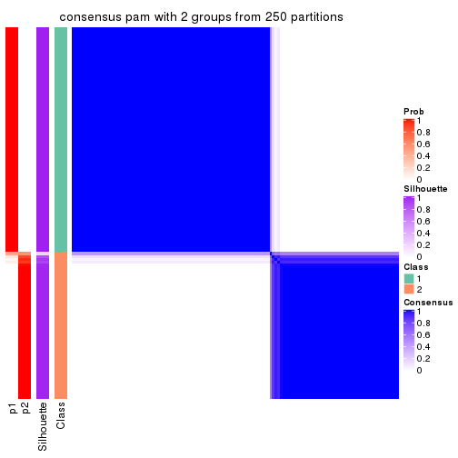</p>

</div>
<div id='tab-ATC-pam-consensus-heatmap-2'>
<pre><code class="r">consensus_heatmap(res, k = 3)
</code></pre>

<p>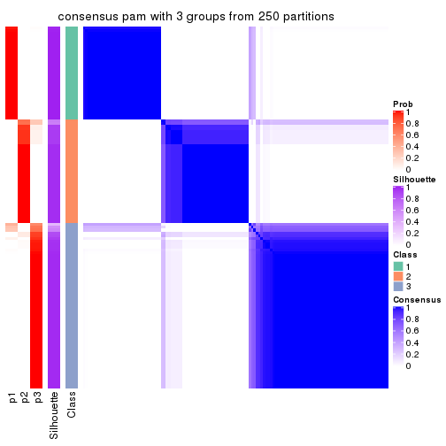</p>

</div>
<div id='tab-ATC-pam-consensus-heatmap-3'>
<pre><code class="r">consensus_heatmap(res, k = 4)
</code></pre>

<p>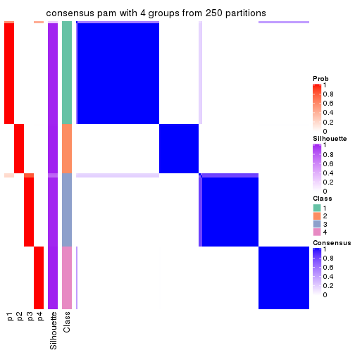</p>

</div>
<div id='tab-ATC-pam-consensus-heatmap-4'>
<pre><code class="r">consensus_heatmap(res, k = 5)
</code></pre>

<p>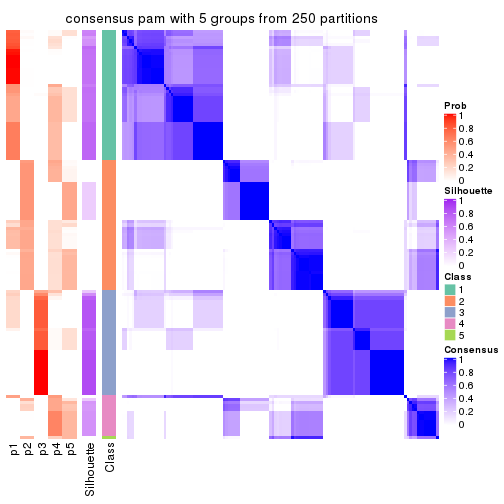</p>

</div>
<div id='tab-ATC-pam-consensus-heatmap-5'>
<pre><code class="r">consensus_heatmap(res, k = 6)
</code></pre>

<p>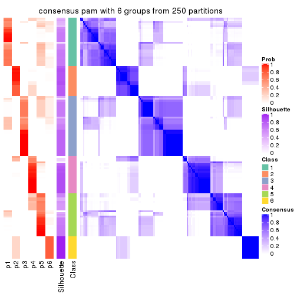</p>

</div>
</div>

Heatmaps for the membership of samples in all partitions to see how consistent they are:


<script>
$( function() {
	$( '#tabs-ATC-pam-membership-heatmap' ).tabs();
} );
</script>
<div id='tabs-ATC-pam-membership-heatmap'>
<ul>
<li><a href='#tab-ATC-pam-membership-heatmap-1'>k = 2</a></li>
<li><a href='#tab-ATC-pam-membership-heatmap-2'>k = 3</a></li>
<li><a href='#tab-ATC-pam-membership-heatmap-3'>k = 4</a></li>
<li><a href='#tab-ATC-pam-membership-heatmap-4'>k = 5</a></li>
<li><a href='#tab-ATC-pam-membership-heatmap-5'>k = 6</a></li>
</ul>
<div id='tab-ATC-pam-membership-heatmap-1'>
<pre><code class="r">membership_heatmap(res, k = 2)
</code></pre>

<p>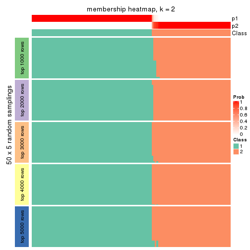</p>

</div>
<div id='tab-ATC-pam-membership-heatmap-2'>
<pre><code class="r">membership_heatmap(res, k = 3)
</code></pre>

<p>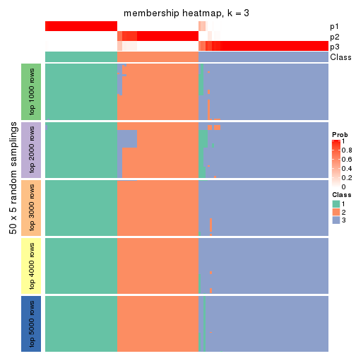</p>

</div>
<div id='tab-ATC-pam-membership-heatmap-3'>
<pre><code class="r">membership_heatmap(res, k = 4)
</code></pre>

<p>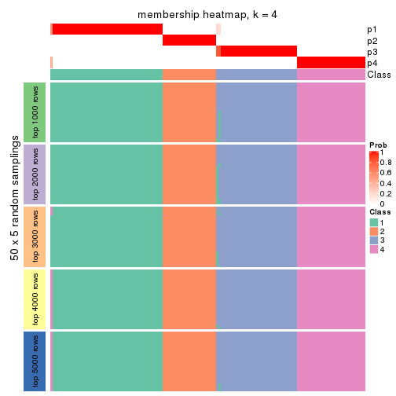</p>

</div>
<div id='tab-ATC-pam-membership-heatmap-4'>
<pre><code class="r">membership_heatmap(res, k = 5)
</code></pre>

<p>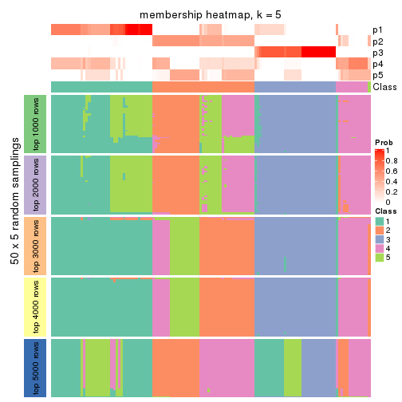</p>

</div>
<div id='tab-ATC-pam-membership-heatmap-5'>
<pre><code class="r">membership_heatmap(res, k = 6)
</code></pre>

<p>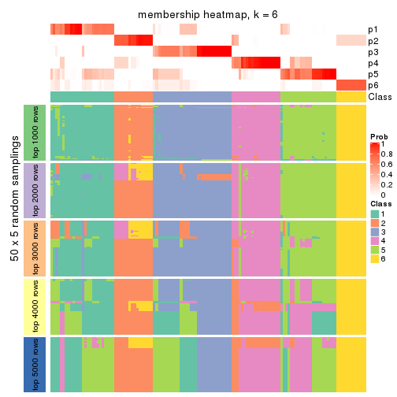</p>

</div>
</div>

As soon as we have had the classes for columns, we can look for signatures
which are significantly different between classes which can be candidate marks
for certain classes. Following are the heatmaps for signatures.


Signature heatmaps where rows are scaled:


<script>
$( function() {
	$( '#tabs-ATC-pam-get-signatures' ).tabs();
} );
</script>
<div id='tabs-ATC-pam-get-signatures'>
<ul>
<li><a href='#tab-ATC-pam-get-signatures-1'>k = 2</a></li>
<li><a href='#tab-ATC-pam-get-signatures-2'>k = 3</a></li>
<li><a href='#tab-ATC-pam-get-signatures-3'>k = 4</a></li>
<li><a href='#tab-ATC-pam-get-signatures-4'>k = 5</a></li>
<li><a href='#tab-ATC-pam-get-signatures-5'>k = 6</a></li>
</ul>
<div id='tab-ATC-pam-get-signatures-1'>
<pre><code class="r">get_signatures(res, k = 2)
</code></pre>

<p>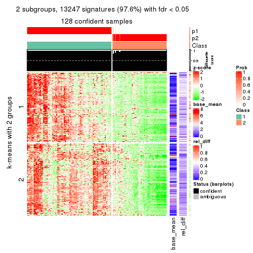</p>

</div>
<div id='tab-ATC-pam-get-signatures-2'>
<pre><code class="r">get_signatures(res, k = 3)
</code></pre>

<p>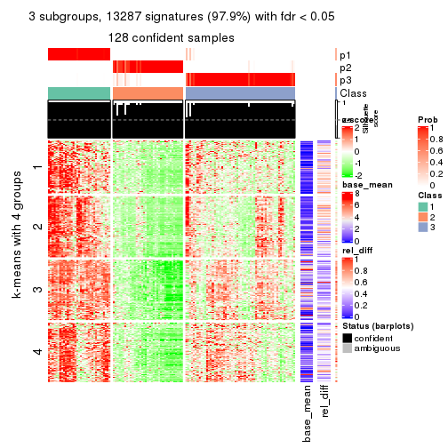</p>

</div>
<div id='tab-ATC-pam-get-signatures-3'>
<pre><code class="r">get_signatures(res, k = 4)
</code></pre>

<p>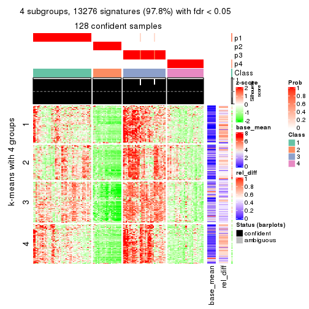</p>

</div>
<div id='tab-ATC-pam-get-signatures-4'>
<pre><code class="r">get_signatures(res, k = 5)
</code></pre>

<p>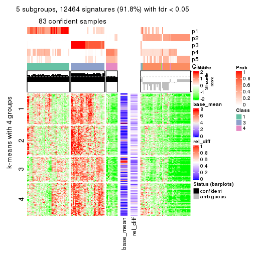</p>

</div>
<div id='tab-ATC-pam-get-signatures-5'>
<pre><code class="r">get_signatures(res, k = 6)
</code></pre>

<p>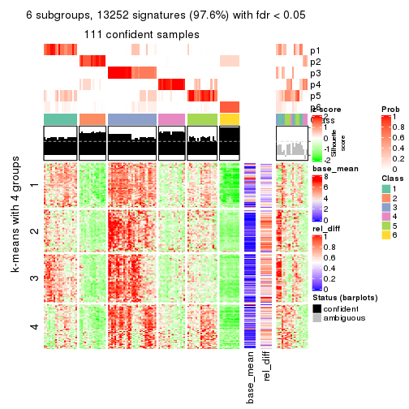</p>

</div>
</div>


Signature heatmaps where rows are not scaled:


<script>
$( function() {
	$( '#tabs-ATC-pam-get-signatures-no-scale' ).tabs();
} );
</script>
<div id='tabs-ATC-pam-get-signatures-no-scale'>
<ul>
<li><a href='#tab-ATC-pam-get-signatures-no-scale-1'>k = 2</a></li>
<li><a href='#tab-ATC-pam-get-signatures-no-scale-2'>k = 3</a></li>
<li><a href='#tab-ATC-pam-get-signatures-no-scale-3'>k = 4</a></li>
<li><a href='#tab-ATC-pam-get-signatures-no-scale-4'>k = 5</a></li>
<li><a href='#tab-ATC-pam-get-signatures-no-scale-5'>k = 6</a></li>
</ul>
<div id='tab-ATC-pam-get-signatures-no-scale-1'>
<pre><code class="r">get_signatures(res, k = 2, scale_rows = FALSE)
</code></pre>

<p>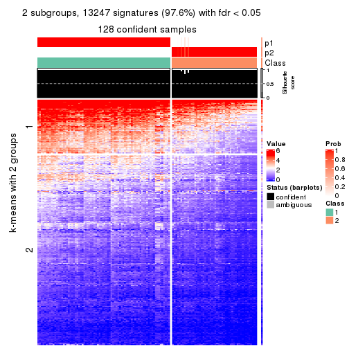</p>

</div>
<div id='tab-ATC-pam-get-signatures-no-scale-2'>
<pre><code class="r">get_signatures(res, k = 3, scale_rows = FALSE)
</code></pre>

<p>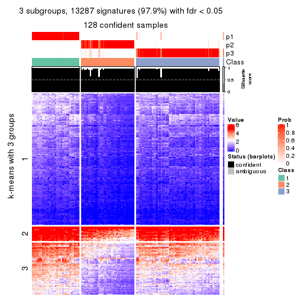</p>

</div>
<div id='tab-ATC-pam-get-signatures-no-scale-3'>
<pre><code class="r">get_signatures(res, k = 4, scale_rows = FALSE)
</code></pre>

<p>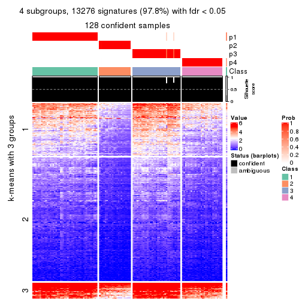</p>

</div>
<div id='tab-ATC-pam-get-signatures-no-scale-4'>
<pre><code class="r">get_signatures(res, k = 5, scale_rows = FALSE)
</code></pre>

<p>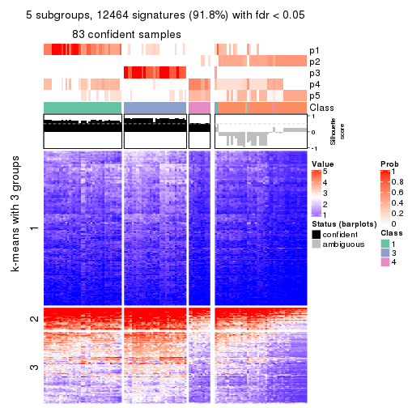</p>

</div>
<div id='tab-ATC-pam-get-signatures-no-scale-5'>
<pre><code class="r">get_signatures(res, k = 6, scale_rows = FALSE)
</code></pre>

<p>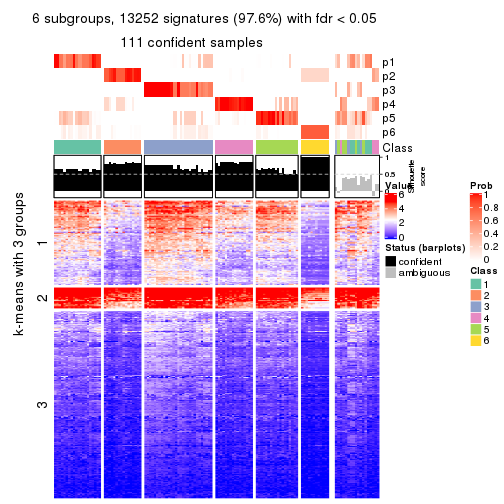</p>

</div>
</div>


Compare the overlap of signatures from different k:

```r
compare_signatures(res)
```

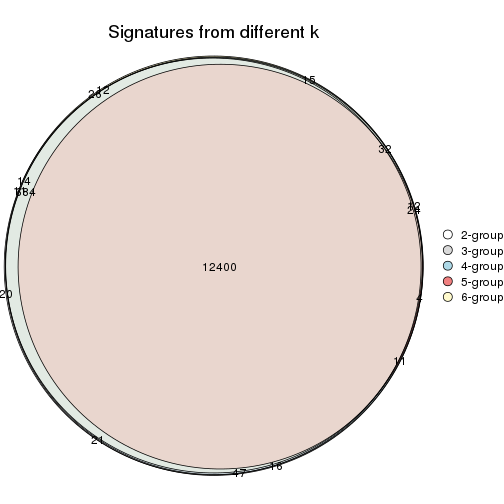

`get_signature()` returns a data frame invisibly. TO get the list of signatures, the function
call should be assigned to a variable explicitly. In following code, if `plot` argument is set
to `FALSE`, no heatmap is plotted while only the differential analysis is performed.

```r
# code only for demonstration
tb = get_signature(res, k = ..., plot = FALSE)
```

An example of the output of `tb` is:

```
#>   which_row         fdr    mean_1    mean_2 scaled_mean_1 scaled_mean_2 km
#> 1        38 0.042760348  8.373488  9.131774    -0.5533452     0.5164555  1
#> 2        40 0.018707592  7.106213  8.469186    -0.6173731     0.5762149  1
#> 3        55 0.019134737 10.221463 11.207825    -0.6159697     0.5749050  1
#> 4        59 0.006059896  5.921854  7.869574    -0.6899429     0.6439467  1
#> 5        60 0.018055526  8.928898 10.211722    -0.6204761     0.5791110  1
#> 6        98 0.009384629 15.714769 14.887706     0.6635654    -0.6193277  2
...
```

The columns in `tb` are:

1. `which_row`: row indices corresponding to the input matrix.
2. `fdr`: FDR for the differential test. 
3. `mean_x`: The mean value in group x.
4. `scaled_mean_x`: The mean value in group x after rows are scaled.
5. `km`: Row groups if k-means clustering is applied to rows.


UMAP plot which shows how samples are separated.


<script>
$( function() {
	$( '#tabs-ATC-pam-dimension-reduction' ).tabs();
} );
</script>
<div id='tabs-ATC-pam-dimension-reduction'>
<ul>
<li><a href='#tab-ATC-pam-dimension-reduction-1'>k = 2</a></li>
<li><a href='#tab-ATC-pam-dimension-reduction-2'>k = 3</a></li>
<li><a href='#tab-ATC-pam-dimension-reduction-3'>k = 4</a></li>
<li><a href='#tab-ATC-pam-dimension-reduction-4'>k = 5</a></li>
<li><a href='#tab-ATC-pam-dimension-reduction-5'>k = 6</a></li>
</ul>
<div id='tab-ATC-pam-dimension-reduction-1'>
<pre><code class="r">dimension_reduction(res, k = 2, method = &quot;UMAP&quot;)
</code></pre>

<p>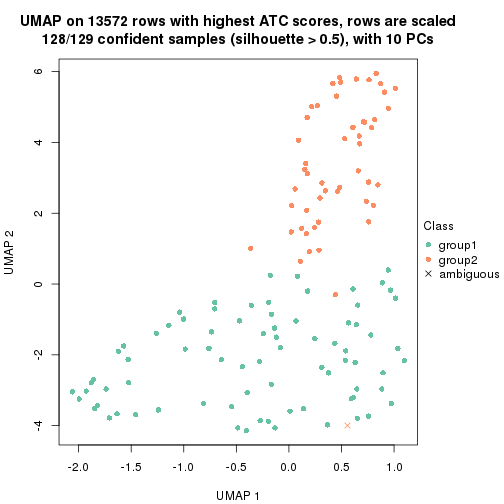</p>

</div>
<div id='tab-ATC-pam-dimension-reduction-2'>
<pre><code class="r">dimension_reduction(res, k = 3, method = &quot;UMAP&quot;)
</code></pre>

<p>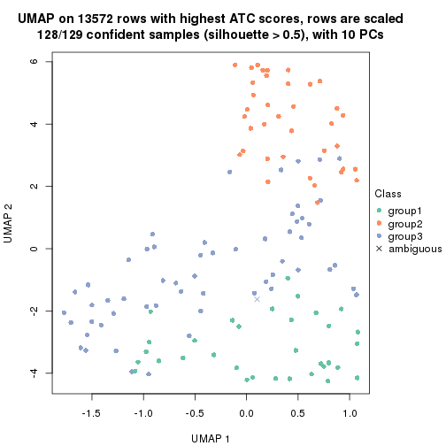</p>

</div>
<div id='tab-ATC-pam-dimension-reduction-3'>
<pre><code class="r">dimension_reduction(res, k = 4, method = &quot;UMAP&quot;)
</code></pre>

<p>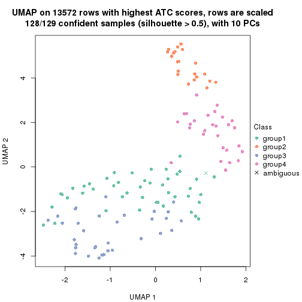</p>

</div>
<div id='tab-ATC-pam-dimension-reduction-4'>
<pre><code class="r">dimension_reduction(res, k = 5, method = &quot;UMAP&quot;)
</code></pre>

<p>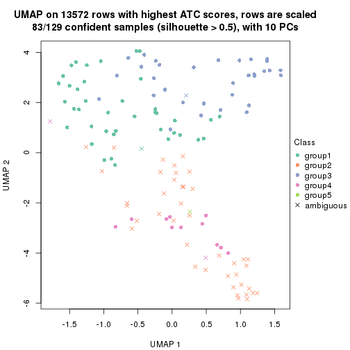</p>

</div>
<div id='tab-ATC-pam-dimension-reduction-5'>
<pre><code class="r">dimension_reduction(res, k = 6, method = &quot;UMAP&quot;)
</code></pre>

<p>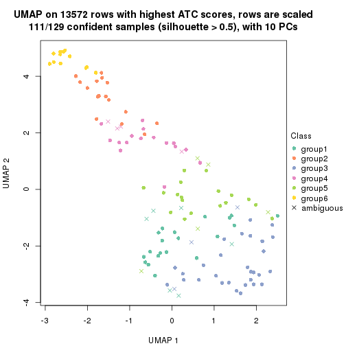</p>

</div>
</div>


Following heatmap shows how subgroups are split when increasing `k`:

```r
collect_classes(res)
```

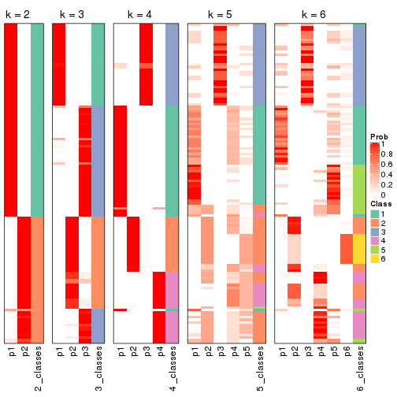


If matrix rows can be associated to genes, consider to use `GO_Enrichment(res,
...)` to perform function enrichment for the signature genes.


 

---------------------------------------------------


### ATC:mclust**


The object with results only for a single top-value method and a single partition method 
can be extracted as:

```r
res = res_list["ATC", "mclust"]
# you can also extract it by
# res = res_list["ATC:mclust"]
```

A summary of `res` and all the functions that can be applied to it:

```r
res
```

```
#> A 'ConsensusPartition' object with k = 2, 3, 4, 5, 6.
#>   On a matrix with 13572 rows and 129 columns.
#>   Top rows (1000, 2000, 3000, 4000, 5000) are extracted by 'ATC' method.
#>   Subgroups are detected by 'mclust' method.
#>   Performed in total 1250 partitions by row resampling.
#>   Best k for subgroups seems to be 2.
#> 
#> Following methods can be applied to this 'ConsensusPartition' object:
#>  [1] "cola_report"             "collect_classes"         "collect_plots"          
#>  [4] "collect_stats"           "colnames"                "compare_signatures"     
#>  [7] "consensus_heatmap"       "dimension_reduction"     "functional_enrichment"  
#> [10] "get_anno_col"            "get_anno"                "get_classes"            
#> [13] "get_consensus"           "get_matrix"              "get_membership"         
#> [16] "get_param"               "get_signatures"          "get_stats"              
#> [19] "is_best_k"               "is_stable_k"             "membership_heatmap"     
#> [22] "ncol"                    "nrow"                    "plot_ecdf"              
#> [25] "rownames"                "select_partition_number" "show"                   
#> [28] "suggest_best_k"          "test_to_known_factors"
```

`collect_plots()` function collects all the plots made from `res` for all `k` (number of partitions)
into one single page to provide an easy and fast comparison between different `k`.

```r
collect_plots(res)
```

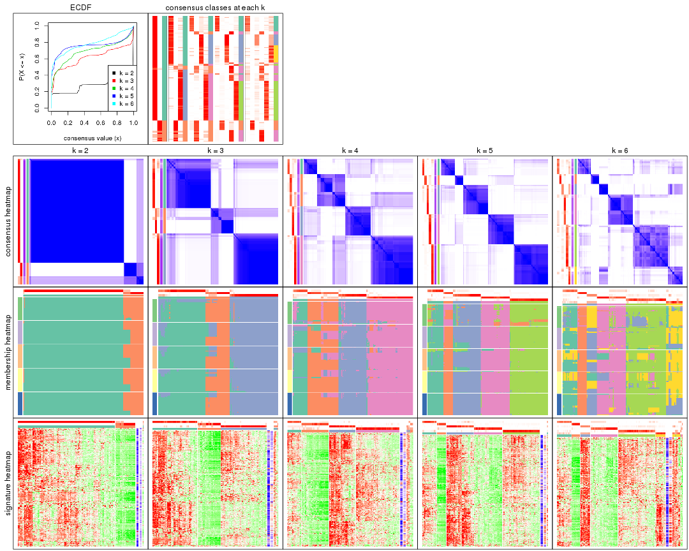

The plots are:

- The first row: a plot of the ECDF (Empirical cumulative distribution
  function) curves of the consensus matrix for each `k` and the heatmap of
  predicted classes for each `k`.
- The second row: heatmaps of the consensus matrix for each `k`.
- The third row: heatmaps of the membership matrix for each `k`.
- The fouth row: heatmaps of the signatures for each `k`.

All the plots in panels can be made by individual functions and they are
plotted later in this section.

`select_partition_number()` produces several plots showing different
statistics for choosing "optimized" `k`. There are following statistics:

- ECDF curves of the consensus matrix for each `k`;
- 1-PAC. [The PAC
  score](https://en.wikipedia.org/wiki/Consensus_clustering#Over-interpretation_potential_of_consensus_clustering)
  measures the proportion of the ambiguous subgrouping.
- Mean silhouette score.
- Concordance. The mean probability of fiting the consensus class ids in all
  partitions.
- Area increased. Denote $A_k$ as the area under the ECDF curve for current
  `k`, the area increased is defined as $A_k - A_{k-1}$.
- Rand index. The percent of pairs of samples that are both in a same cluster
  or both are not in a same cluster in the partition of k and k-1.
- Jaccard index. The ratio of pairs of samples are both in a same cluster in
  the partition of k and k-1 and the pairs of samples are both in a same
  cluster in the partition k or k-1.

The detailed explanations of these statistics can be found in [the cola
vignette](http://bioconductor.org/packages/devel/bioc/vignettes/cola/inst/doc/cola.html#toc_13).

Generally speaking, lower PAC score, higher mean silhouette score or higher
concordance corresponds to better partition. Rand index and Jaccard index
measure how similar the current partition is compared to partition with `k-1`.
If they are too similar, we won't accept `k` is better than `k-1`.

```r
select_partition_number(res)
```

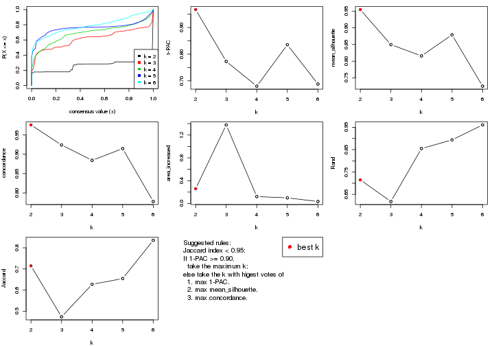

The numeric values for all these statistics can be obtained by `get_stats()`.

```r
get_stats(res)
```

```
#>   k 1-PAC mean_silhouette concordance area_increased  Rand Jaccard
#> 2 2 0.967           0.955       0.976         0.2597 0.715   0.715
#> 3 3 0.773           0.850       0.924         1.3773 0.618   0.474
#> 4 4 0.680           0.816       0.884         0.1218 0.855   0.627
#> 5 5 0.836           0.879       0.915         0.0991 0.894   0.654
#> 6 6 0.688           0.725       0.778         0.0353 0.961   0.836
```

`suggest_best_k()` suggests the best $k$ based on these statistics. The rules are as follows:

- All $k$ with Jaccard index larger than 0.95 are removed because the increase of
  the partition number does not provides enough extra information. If all $k$ are removed,
  the best $k$ is assigned by `NA`.
- For $k$ with 1-PAC larger than 0.9, the maximal $k$ is taken as the "best k". Other $k$ is called "optional k".
- If it does not fit the second rule. The $k$ with the highest vote of highest
  1-PAC, mean silhouette and concordance is taken as the "best k".

```r
suggest_best_k(res)
```

```
#> [1] 2
```


Following shows the table of the partitions (You need to click the **show/hide
code output** link to see it). The membership matrix (columns with name `p*`)
is inferred by
[`clue::cl_consensus()`](https://www.rdocumentation.org/link/cl_consensus?package=clue)
function with the `SE` method. Basically the value in the membership matrix
represents the probability to belong to a certain group. The finall class
label for an item is determined with the group with highest probability it
belongs to.

In `get_classes()` function, the entropy is calculated from the membership
matrix and the silhouette score is calculated from the consensus matrix.


<script>
$( function() {
	$( '#tabs-ATC-mclust-get-classes' ).tabs();
} );
</script>
<div id='tabs-ATC-mclust-get-classes'>
<ul>
<li><a href='#tab-ATC-mclust-get-classes-1'>k = 2</a></li>
<li><a href='#tab-ATC-mclust-get-classes-2'>k = 3</a></li>
<li><a href='#tab-ATC-mclust-get-classes-3'>k = 4</a></li>
<li><a href='#tab-ATC-mclust-get-classes-4'>k = 5</a></li>
<li><a href='#tab-ATC-mclust-get-classes-5'>k = 6</a></li>
</ul>

<div id='tab-ATC-mclust-get-classes-1'>
<p><a id='tab-ATC-mclust-get-classes-1-a' style='color:#0366d6' href='#'>show/hide code output</a></p>
<pre><code class="r">cbind(get_classes(res, k = 2), get_membership(res, k = 2))
</code></pre>

<pre><code>#&gt;            class entropy silhouette    p1    p2
#&gt; SRR1656463     2   0.000      0.867 0.000 1.000
#&gt; SRR1656464     1   0.000      0.995 1.000 0.000
#&gt; SRR1656462     1   0.000      0.995 1.000 0.000
#&gt; SRR1656465     1   0.000      0.995 1.000 0.000
#&gt; SRR1656467     1   0.000      0.995 1.000 0.000
#&gt; SRR1656466     1   0.000      0.995 1.000 0.000
#&gt; SRR1656468     1   0.000      0.995 1.000 0.000
#&gt; SRR1656472     1   0.000      0.995 1.000 0.000
#&gt; SRR1656471     1   0.000      0.995 1.000 0.000
#&gt; SRR1656470     2   0.000      0.867 0.000 1.000
#&gt; SRR1656469     1   0.000      0.995 1.000 0.000
#&gt; SRR1656473     2   0.000      0.867 0.000 1.000
#&gt; SRR1656474     2   0.000      0.867 0.000 1.000
#&gt; SRR1656475     2   0.000      0.867 0.000 1.000
#&gt; SRR1656478     1   0.000      0.995 1.000 0.000
#&gt; SRR1656477     1   0.000      0.995 1.000 0.000
#&gt; SRR1656479     1   0.000      0.995 1.000 0.000
#&gt; SRR1656480     1   0.000      0.995 1.000 0.000
#&gt; SRR1656476     2   0.900      0.677 0.316 0.684
#&gt; SRR1656481     1   0.000      0.995 1.000 0.000
#&gt; SRR1656482     2   0.946      0.602 0.364 0.636
#&gt; SRR1656483     2   0.000      0.867 0.000 1.000
#&gt; SRR1656485     1   0.000      0.995 1.000 0.000
#&gt; SRR1656487     1   0.000      0.995 1.000 0.000
#&gt; SRR1656486     1   0.000      0.995 1.000 0.000
#&gt; SRR1656488     1   0.000      0.995 1.000 0.000
#&gt; SRR1656484     1   0.000      0.995 1.000 0.000
#&gt; SRR1656489     1   0.000      0.995 1.000 0.000
#&gt; SRR1656491     1   0.000      0.995 1.000 0.000
#&gt; SRR1656490     1   0.000      0.995 1.000 0.000
#&gt; SRR1656492     1   0.000      0.995 1.000 0.000
#&gt; SRR1656493     1   0.000      0.995 1.000 0.000
#&gt; SRR1656495     1   0.000      0.995 1.000 0.000
#&gt; SRR1656496     1   0.000      0.995 1.000 0.000
#&gt; SRR1656494     1   0.000      0.995 1.000 0.000
#&gt; SRR1656497     2   0.000      0.867 0.000 1.000
#&gt; SRR1656499     1   0.000      0.995 1.000 0.000
#&gt; SRR1656500     1   0.000      0.995 1.000 0.000
#&gt; SRR1656501     1   0.000      0.995 1.000 0.000
#&gt; SRR1656498     1   0.000      0.995 1.000 0.000
#&gt; SRR1656504     2   0.900      0.677 0.316 0.684
#&gt; SRR1656502     1   0.000      0.995 1.000 0.000
#&gt; SRR1656503     1   0.000      0.995 1.000 0.000
#&gt; SRR1656507     1   0.000      0.995 1.000 0.000
#&gt; SRR1656508     1   0.000      0.995 1.000 0.000
#&gt; SRR1656505     1   0.000      0.995 1.000 0.000
#&gt; SRR1656506     1   0.000      0.995 1.000 0.000
#&gt; SRR1656509     1   0.000      0.995 1.000 0.000
#&gt; SRR1656510     1   0.000      0.995 1.000 0.000
#&gt; SRR1656511     1   0.000      0.995 1.000 0.000
#&gt; SRR1656513     1   0.000      0.995 1.000 0.000
#&gt; SRR1656512     2   0.000      0.867 0.000 1.000
#&gt; SRR1656514     1   0.000      0.995 1.000 0.000
#&gt; SRR1656515     1   0.456      0.872 0.904 0.096
#&gt; SRR1656516     1   0.000      0.995 1.000 0.000
#&gt; SRR1656518     1   0.000      0.995 1.000 0.000
#&gt; SRR1656517     1   0.000      0.995 1.000 0.000
#&gt; SRR1656519     1   0.000      0.995 1.000 0.000
#&gt; SRR1656522     1   0.000      0.995 1.000 0.000
#&gt; SRR1656523     1   0.000      0.995 1.000 0.000
#&gt; SRR1656521     2   0.000      0.867 0.000 1.000
#&gt; SRR1656520     1   0.000      0.995 1.000 0.000
#&gt; SRR1656524     1   0.000      0.995 1.000 0.000
#&gt; SRR1656525     1   0.000      0.995 1.000 0.000
#&gt; SRR1656526     2   0.921      0.655 0.336 0.664
#&gt; SRR1656527     1   0.904      0.411 0.680 0.320
#&gt; SRR1656530     1   0.000      0.995 1.000 0.000
#&gt; SRR1656529     1   0.000      0.995 1.000 0.000
#&gt; SRR1656531     1   0.000      0.995 1.000 0.000
#&gt; SRR1656528     1   0.000      0.995 1.000 0.000
#&gt; SRR1656534     1   0.000      0.995 1.000 0.000
#&gt; SRR1656533     1   0.000      0.995 1.000 0.000
#&gt; SRR1656536     1   0.000      0.995 1.000 0.000
#&gt; SRR1656532     1   0.000      0.995 1.000 0.000
#&gt; SRR1656537     1   0.000      0.995 1.000 0.000
#&gt; SRR1656538     1   0.000      0.995 1.000 0.000
#&gt; SRR1656535     2   0.925      0.649 0.340 0.660
#&gt; SRR1656539     1   0.000      0.995 1.000 0.000
#&gt; SRR1656544     1   0.000      0.995 1.000 0.000
#&gt; SRR1656542     1   0.000      0.995 1.000 0.000
#&gt; SRR1656543     1   0.000      0.995 1.000 0.000
#&gt; SRR1656545     2   0.000      0.867 0.000 1.000
#&gt; SRR1656540     1   0.000      0.995 1.000 0.000
#&gt; SRR1656546     1   0.000      0.995 1.000 0.000
#&gt; SRR1656541     2   0.925      0.649 0.340 0.660
#&gt; SRR1656547     1   0.000      0.995 1.000 0.000
#&gt; SRR1656548     1   0.000      0.995 1.000 0.000
#&gt; SRR1656549     1   0.000      0.995 1.000 0.000
#&gt; SRR1656551     1   0.000      0.995 1.000 0.000
#&gt; SRR1656553     1   0.000      0.995 1.000 0.000
#&gt; SRR1656550     1   0.000      0.995 1.000 0.000
#&gt; SRR1656552     1   0.000      0.995 1.000 0.000
#&gt; SRR1656554     1   0.000      0.995 1.000 0.000
#&gt; SRR1656555     1   0.000      0.995 1.000 0.000
#&gt; SRR1656556     1   0.000      0.995 1.000 0.000
#&gt; SRR1656557     1   0.000      0.995 1.000 0.000
#&gt; SRR1656558     1   0.000      0.995 1.000 0.000
#&gt; SRR1656559     1   0.000      0.995 1.000 0.000
#&gt; SRR1656560     1   0.000      0.995 1.000 0.000
#&gt; SRR1656561     1   0.000      0.995 1.000 0.000
#&gt; SRR1656562     1   0.000      0.995 1.000 0.000
#&gt; SRR1656563     1   0.000      0.995 1.000 0.000
#&gt; SRR1656564     2   0.141      0.859 0.020 0.980
#&gt; SRR1656565     1   0.000      0.995 1.000 0.000
#&gt; SRR1656566     1   0.000      0.995 1.000 0.000
#&gt; SRR1656568     2   0.921      0.655 0.336 0.664
#&gt; SRR1656567     1   0.000      0.995 1.000 0.000
#&gt; SRR1656569     1   0.000      0.995 1.000 0.000
#&gt; SRR1656570     1   0.000      0.995 1.000 0.000
#&gt; SRR1656571     2   0.000      0.867 0.000 1.000
#&gt; SRR1656573     1   0.000      0.995 1.000 0.000
#&gt; SRR1656572     1   0.000      0.995 1.000 0.000
#&gt; SRR1656574     1   0.000      0.995 1.000 0.000
#&gt; SRR1656575     1   0.000      0.995 1.000 0.000
#&gt; SRR1656576     1   0.000      0.995 1.000 0.000
#&gt; SRR1656578     1   0.000      0.995 1.000 0.000
#&gt; SRR1656577     1   0.000      0.995 1.000 0.000
#&gt; SRR1656579     1   0.000      0.995 1.000 0.000
#&gt; SRR1656580     1   0.000      0.995 1.000 0.000
#&gt; SRR1656581     1   0.000      0.995 1.000 0.000
#&gt; SRR1656582     2   0.925      0.649 0.340 0.660
#&gt; SRR1656585     1   0.000      0.995 1.000 0.000
#&gt; SRR1656584     1   0.000      0.995 1.000 0.000
#&gt; SRR1656583     1   0.000      0.995 1.000 0.000
#&gt; SRR1656586     2   0.000      0.867 0.000 1.000
#&gt; SRR1656587     1   0.000      0.995 1.000 0.000
#&gt; SRR1656588     1   0.000      0.995 1.000 0.000
#&gt; SRR1656589     2   0.000      0.867 0.000 1.000
#&gt; SRR1656590     1   0.000      0.995 1.000 0.000
</code></pre>

<script>
$('#tab-ATC-mclust-get-classes-1-a').parent().next().next().hide();
$('#tab-ATC-mclust-get-classes-1-a').click(function(){
  $('#tab-ATC-mclust-get-classes-1-a').parent().next().next().toggle();
  return(false);
});
</script>
</div>

<div id='tab-ATC-mclust-get-classes-2'>
<p><a id='tab-ATC-mclust-get-classes-2-a' style='color:#0366d6' href='#'>show/hide code output</a></p>
<pre><code class="r">cbind(get_classes(res, k = 3), get_membership(res, k = 3))
</code></pre>

<pre><code>#&gt;            class entropy silhouette    p1    p2    p3
#&gt; SRR1656463     2  0.0000      0.823 0.000 1.000 0.000
#&gt; SRR1656464     1  0.1031      0.910 0.976 0.000 0.024
#&gt; SRR1656462     1  0.1031      0.910 0.976 0.000 0.024
#&gt; SRR1656465     3  0.0000      0.964 0.000 0.000 1.000
#&gt; SRR1656467     2  0.6229      0.603 0.008 0.652 0.340
#&gt; SRR1656466     3  0.0000      0.964 0.000 0.000 1.000
#&gt; SRR1656468     3  0.0000      0.964 0.000 0.000 1.000
#&gt; SRR1656472     1  0.1031      0.910 0.976 0.000 0.024
#&gt; SRR1656471     1  0.6140      0.415 0.596 0.000 0.404
#&gt; SRR1656470     2  0.0000      0.823 0.000 1.000 0.000
#&gt; SRR1656469     3  0.0000      0.964 0.000 0.000 1.000
#&gt; SRR1656473     2  0.0000      0.823 0.000 1.000 0.000
#&gt; SRR1656474     2  0.0000      0.823 0.000 1.000 0.000
#&gt; SRR1656475     2  0.0000      0.823 0.000 1.000 0.000
#&gt; SRR1656478     1  0.0000      0.891 1.000 0.000 0.000
#&gt; SRR1656477     3  0.0237      0.961 0.004 0.000 0.996
#&gt; SRR1656479     3  0.0000      0.964 0.000 0.000 1.000
#&gt; SRR1656480     3  0.0000      0.964 0.000 0.000 1.000
#&gt; SRR1656476     2  0.6018      0.649 0.008 0.684 0.308
#&gt; SRR1656481     3  0.0000      0.964 0.000 0.000 1.000
#&gt; SRR1656482     2  0.7366      0.670 0.072 0.668 0.260
#&gt; SRR1656483     2  0.0000      0.823 0.000 1.000 0.000
#&gt; SRR1656485     3  0.0000      0.964 0.000 0.000 1.000
#&gt; SRR1656487     3  0.0000      0.964 0.000 0.000 1.000
#&gt; SRR1656486     3  0.0424      0.959 0.008 0.000 0.992
#&gt; SRR1656488     3  0.0000      0.964 0.000 0.000 1.000
#&gt; SRR1656484     3  0.0424      0.959 0.008 0.000 0.992
#&gt; SRR1656489     1  0.1289      0.907 0.968 0.000 0.032
#&gt; SRR1656491     3  0.0000      0.964 0.000 0.000 1.000
#&gt; SRR1656490     3  0.0424      0.959 0.008 0.000 0.992
#&gt; SRR1656492     3  0.0000      0.964 0.000 0.000 1.000
#&gt; SRR1656493     1  0.1031      0.910 0.976 0.000 0.024
#&gt; SRR1656495     1  0.1031      0.910 0.976 0.000 0.024
#&gt; SRR1656496     3  0.0000      0.964 0.000 0.000 1.000
#&gt; SRR1656494     1  0.1163      0.909 0.972 0.000 0.028
#&gt; SRR1656497     2  0.0000      0.823 0.000 1.000 0.000
#&gt; SRR1656499     3  0.0000      0.964 0.000 0.000 1.000
#&gt; SRR1656500     1  0.5882      0.536 0.652 0.000 0.348
#&gt; SRR1656501     1  0.4235      0.766 0.824 0.000 0.176
#&gt; SRR1656498     1  0.1031      0.910 0.976 0.000 0.024
#&gt; SRR1656504     2  0.6018      0.649 0.008 0.684 0.308
#&gt; SRR1656502     1  0.1031      0.910 0.976 0.000 0.024
#&gt; SRR1656503     3  0.3686      0.794 0.140 0.000 0.860
#&gt; SRR1656507     1  0.2165      0.869 0.936 0.000 0.064
#&gt; SRR1656508     1  0.1031      0.910 0.976 0.000 0.024
#&gt; SRR1656505     3  0.0000      0.964 0.000 0.000 1.000
#&gt; SRR1656506     3  0.0000      0.964 0.000 0.000 1.000
#&gt; SRR1656509     1  0.1411      0.905 0.964 0.000 0.036
#&gt; SRR1656510     3  0.0747      0.953 0.016 0.000 0.984
#&gt; SRR1656511     3  0.1711      0.931 0.008 0.032 0.960
#&gt; SRR1656513     2  0.7394      0.563 0.284 0.652 0.064
#&gt; SRR1656512     2  0.0000      0.823 0.000 1.000 0.000
#&gt; SRR1656514     1  0.1031      0.910 0.976 0.000 0.024
#&gt; SRR1656515     2  0.6565      0.445 0.008 0.576 0.416
#&gt; SRR1656516     1  0.4235      0.778 0.824 0.000 0.176
#&gt; SRR1656518     1  0.5098      0.700 0.752 0.000 0.248
#&gt; SRR1656517     1  0.0000      0.891 1.000 0.000 0.000
#&gt; SRR1656519     1  0.3038      0.852 0.896 0.000 0.104
#&gt; SRR1656522     1  0.1031      0.910 0.976 0.000 0.024
#&gt; SRR1656523     3  0.0000      0.964 0.000 0.000 1.000
#&gt; SRR1656521     2  0.0000      0.823 0.000 1.000 0.000
#&gt; SRR1656520     1  0.1031      0.910 0.976 0.000 0.024
#&gt; SRR1656524     1  0.1031      0.910 0.976 0.000 0.024
#&gt; SRR1656525     3  0.0000      0.964 0.000 0.000 1.000
#&gt; SRR1656526     2  0.6129      0.630 0.008 0.668 0.324
#&gt; SRR1656527     2  0.6282      0.537 0.324 0.664 0.012
#&gt; SRR1656530     3  0.0000      0.964 0.000 0.000 1.000
#&gt; SRR1656529     3  0.0000      0.964 0.000 0.000 1.000
#&gt; SRR1656531     1  0.1031      0.910 0.976 0.000 0.024
#&gt; SRR1656528     3  0.0000      0.964 0.000 0.000 1.000
#&gt; SRR1656534     1  0.1860      0.894 0.948 0.000 0.052
#&gt; SRR1656533     1  0.0747      0.905 0.984 0.000 0.016
#&gt; SRR1656536     3  0.0000      0.964 0.000 0.000 1.000
#&gt; SRR1656532     1  0.1031      0.910 0.976 0.000 0.024
#&gt; SRR1656537     1  0.1031      0.910 0.976 0.000 0.024
#&gt; SRR1656538     3  0.6008      0.341 0.372 0.000 0.628
#&gt; SRR1656535     2  0.6255      0.635 0.012 0.668 0.320
#&gt; SRR1656539     3  0.0000      0.964 0.000 0.000 1.000
#&gt; SRR1656544     3  0.3941      0.773 0.156 0.000 0.844
#&gt; SRR1656542     3  0.0747      0.952 0.016 0.000 0.984
#&gt; SRR1656543     1  0.1753      0.897 0.952 0.000 0.048
#&gt; SRR1656545     2  0.0000      0.823 0.000 1.000 0.000
#&gt; SRR1656540     1  0.1031      0.910 0.976 0.000 0.024
#&gt; SRR1656546     1  0.0000      0.891 1.000 0.000 0.000
#&gt; SRR1656541     2  0.6129      0.630 0.008 0.668 0.324
#&gt; SRR1656547     3  0.0237      0.961 0.004 0.000 0.996
#&gt; SRR1656548     3  0.0000      0.964 0.000 0.000 1.000
#&gt; SRR1656549     1  0.6026      0.501 0.624 0.000 0.376
#&gt; SRR1656551     3  0.0000      0.964 0.000 0.000 1.000
#&gt; SRR1656553     1  0.6252      0.307 0.556 0.000 0.444
#&gt; SRR1656550     3  0.0424      0.959 0.008 0.000 0.992
#&gt; SRR1656552     3  0.5202      0.635 0.008 0.220 0.772
#&gt; SRR1656554     3  0.0000      0.964 0.000 0.000 1.000
#&gt; SRR1656555     3  0.0000      0.964 0.000 0.000 1.000
#&gt; SRR1656556     1  0.1163      0.909 0.972 0.000 0.028
#&gt; SRR1656557     1  0.1031      0.910 0.976 0.000 0.024
#&gt; SRR1656558     1  0.0000      0.891 1.000 0.000 0.000
#&gt; SRR1656559     1  0.1031      0.910 0.976 0.000 0.024
#&gt; SRR1656560     3  0.0000      0.964 0.000 0.000 1.000
#&gt; SRR1656561     3  0.0000      0.964 0.000 0.000 1.000
#&gt; SRR1656562     3  0.5733      0.460 0.324 0.000 0.676
#&gt; SRR1656563     1  0.5591      0.635 0.696 0.000 0.304
#&gt; SRR1656564     2  0.0424      0.821 0.000 0.992 0.008
#&gt; SRR1656565     3  0.1525      0.933 0.032 0.004 0.964
#&gt; SRR1656566     1  0.0000      0.891 1.000 0.000 0.000
#&gt; SRR1656568     2  0.6129      0.542 0.324 0.668 0.008
#&gt; SRR1656567     3  0.0000      0.964 0.000 0.000 1.000
#&gt; SRR1656569     3  0.0000      0.964 0.000 0.000 1.000
#&gt; SRR1656570     1  0.5926      0.545 0.644 0.000 0.356
#&gt; SRR1656571     2  0.0000      0.823 0.000 1.000 0.000
#&gt; SRR1656573     3  0.0000      0.964 0.000 0.000 1.000
#&gt; SRR1656572     1  0.4737      0.826 0.852 0.064 0.084
#&gt; SRR1656574     1  0.1163      0.909 0.972 0.000 0.028
#&gt; SRR1656575     1  0.1031      0.910 0.976 0.000 0.024
#&gt; SRR1656576     3  0.0661      0.957 0.008 0.004 0.988
#&gt; SRR1656578     1  0.1031      0.910 0.976 0.000 0.024
#&gt; SRR1656577     1  0.1031      0.910 0.976 0.000 0.024
#&gt; SRR1656579     3  0.0000      0.964 0.000 0.000 1.000
#&gt; SRR1656580     1  0.5760      0.580 0.672 0.000 0.328
#&gt; SRR1656581     3  0.0000      0.964 0.000 0.000 1.000
#&gt; SRR1656582     2  0.6129      0.630 0.008 0.668 0.324
#&gt; SRR1656585     3  0.0892      0.948 0.020 0.000 0.980
#&gt; SRR1656584     1  0.0000      0.891 1.000 0.000 0.000
#&gt; SRR1656583     1  0.1031      0.910 0.976 0.000 0.024
#&gt; SRR1656586     2  0.0000      0.823 0.000 1.000 0.000
#&gt; SRR1656587     1  0.1031      0.910 0.976 0.000 0.024
#&gt; SRR1656588     3  0.0424      0.959 0.008 0.000 0.992
#&gt; SRR1656589     2  0.0000      0.823 0.000 1.000 0.000
#&gt; SRR1656590     1  0.1031      0.910 0.976 0.000 0.024
</code></pre>

<script>
$('#tab-ATC-mclust-get-classes-2-a').parent().next().next().hide();
$('#tab-ATC-mclust-get-classes-2-a').click(function(){
  $('#tab-ATC-mclust-get-classes-2-a').parent().next().next().toggle();
  return(false);
});
</script>
</div>

<div id='tab-ATC-mclust-get-classes-3'>
<p><a id='tab-ATC-mclust-get-classes-3-a' style='color:#0366d6' href='#'>show/hide code output</a></p>
<pre><code class="r">cbind(get_classes(res, k = 4), get_membership(res, k = 4))
</code></pre>

<pre><code>#&gt;            class entropy silhouette    p1    p2    p3    p4
#&gt; SRR1656463     2  0.1629      0.731 0.024 0.952 0.000 0.024
#&gt; SRR1656464     3  0.0000      0.908 0.000 0.000 1.000 0.000
#&gt; SRR1656462     3  0.0000      0.908 0.000 0.000 1.000 0.000
#&gt; SRR1656465     4  0.0000      0.935 0.000 0.000 0.000 1.000
#&gt; SRR1656467     2  0.4193      0.730 0.000 0.732 0.000 0.268
#&gt; SRR1656466     4  0.0469      0.931 0.012 0.000 0.000 0.988
#&gt; SRR1656468     4  0.0817      0.925 0.000 0.024 0.000 0.976
#&gt; SRR1656472     3  0.1042      0.910 0.008 0.000 0.972 0.020
#&gt; SRR1656471     3  0.3074      0.755 0.000 0.000 0.848 0.152
#&gt; SRR1656470     2  0.2647      0.699 0.120 0.880 0.000 0.000
#&gt; SRR1656469     4  0.0000      0.935 0.000 0.000 0.000 1.000
#&gt; SRR1656473     2  0.2647      0.699 0.120 0.880 0.000 0.000
#&gt; SRR1656474     2  0.1867      0.713 0.072 0.928 0.000 0.000
#&gt; SRR1656475     2  0.2647      0.699 0.120 0.880 0.000 0.000
#&gt; SRR1656478     1  0.3392      0.890 0.856 0.000 0.124 0.020
#&gt; SRR1656477     4  0.0804      0.931 0.000 0.012 0.008 0.980
#&gt; SRR1656479     4  0.0000      0.935 0.000 0.000 0.000 1.000
#&gt; SRR1656480     4  0.0817      0.925 0.000 0.024 0.000 0.976
#&gt; SRR1656476     2  0.4188      0.740 0.004 0.752 0.000 0.244
#&gt; SRR1656481     4  0.0817      0.925 0.000 0.024 0.000 0.976
#&gt; SRR1656482     2  0.4193      0.730 0.000 0.732 0.000 0.268
#&gt; SRR1656483     2  0.1520      0.732 0.020 0.956 0.000 0.024
#&gt; SRR1656485     4  0.0000      0.935 0.000 0.000 0.000 1.000
#&gt; SRR1656487     4  0.0592      0.929 0.016 0.000 0.000 0.984
#&gt; SRR1656486     4  0.5408     -0.122 0.488 0.000 0.012 0.500
#&gt; SRR1656488     4  0.0000      0.935 0.000 0.000 0.000 1.000
#&gt; SRR1656484     4  0.1474      0.906 0.000 0.000 0.052 0.948
#&gt; SRR1656489     1  0.7832      0.313 0.380 0.000 0.360 0.260
#&gt; SRR1656491     4  0.0000      0.935 0.000 0.000 0.000 1.000
#&gt; SRR1656490     4  0.0000      0.935 0.000 0.000 0.000 1.000
#&gt; SRR1656492     4  0.0804      0.929 0.012 0.000 0.008 0.980
#&gt; SRR1656493     3  0.4267      0.722 0.188 0.000 0.788 0.024
#&gt; SRR1656495     3  0.0921      0.909 0.000 0.000 0.972 0.028
#&gt; SRR1656496     4  0.0000      0.935 0.000 0.000 0.000 1.000
#&gt; SRR1656494     3  0.2908      0.829 0.000 0.040 0.896 0.064
#&gt; SRR1656497     2  0.2647      0.699 0.120 0.880 0.000 0.000
#&gt; SRR1656499     4  0.1716      0.896 0.000 0.000 0.064 0.936
#&gt; SRR1656500     3  0.4713      0.356 0.000 0.000 0.640 0.360
#&gt; SRR1656501     1  0.3160      0.889 0.872 0.000 0.108 0.020
#&gt; SRR1656498     3  0.4399      0.687 0.212 0.000 0.768 0.020
#&gt; SRR1656504     2  0.4188      0.740 0.004 0.752 0.000 0.244
#&gt; SRR1656502     3  0.1042      0.910 0.008 0.000 0.972 0.020
#&gt; SRR1656503     4  0.1637      0.898 0.000 0.000 0.060 0.940
#&gt; SRR1656507     1  0.3160      0.889 0.872 0.000 0.108 0.020
#&gt; SRR1656508     3  0.1042      0.907 0.008 0.000 0.972 0.020
#&gt; SRR1656505     4  0.0817      0.925 0.000 0.024 0.000 0.976
#&gt; SRR1656506     4  0.0469      0.931 0.012 0.000 0.000 0.988
#&gt; SRR1656509     3  0.3486      0.702 0.000 0.000 0.812 0.188
#&gt; SRR1656510     4  0.1936      0.915 0.028 0.032 0.000 0.940
#&gt; SRR1656511     2  0.4972      0.355 0.000 0.544 0.000 0.456
#&gt; SRR1656513     2  0.5221      0.734 0.000 0.732 0.060 0.208
#&gt; SRR1656512     2  0.2647      0.699 0.120 0.880 0.000 0.000
#&gt; SRR1656514     3  0.0000      0.908 0.000 0.000 1.000 0.000
#&gt; SRR1656515     2  0.4193      0.730 0.000 0.732 0.000 0.268
#&gt; SRR1656516     1  0.3464      0.891 0.860 0.000 0.108 0.032
#&gt; SRR1656518     1  0.4344      0.870 0.816 0.000 0.108 0.076
#&gt; SRR1656517     1  0.3447      0.888 0.852 0.000 0.128 0.020
#&gt; SRR1656519     3  0.1118      0.890 0.000 0.000 0.964 0.036
#&gt; SRR1656522     3  0.0000      0.908 0.000 0.000 1.000 0.000
#&gt; SRR1656523     4  0.2647      0.848 0.000 0.120 0.000 0.880
#&gt; SRR1656521     2  0.2647      0.699 0.120 0.880 0.000 0.000
#&gt; SRR1656520     3  0.0000      0.908 0.000 0.000 1.000 0.000
#&gt; SRR1656524     3  0.4399      0.685 0.212 0.000 0.768 0.020
#&gt; SRR1656525     4  0.0000      0.935 0.000 0.000 0.000 1.000
#&gt; SRR1656526     2  0.4193      0.730 0.000 0.732 0.000 0.268
#&gt; SRR1656527     2  0.5277      0.664 0.008 0.740 0.204 0.048
#&gt; SRR1656530     4  0.0592      0.929 0.016 0.000 0.000 0.984
#&gt; SRR1656529     4  0.0188      0.934 0.004 0.000 0.000 0.996
#&gt; SRR1656531     3  0.1042      0.910 0.008 0.000 0.972 0.020
#&gt; SRR1656528     4  0.0000      0.935 0.000 0.000 0.000 1.000
#&gt; SRR1656534     3  0.0592      0.906 0.000 0.000 0.984 0.016
#&gt; SRR1656533     1  0.3447      0.888 0.852 0.000 0.128 0.020
#&gt; SRR1656536     4  0.0000      0.935 0.000 0.000 0.000 1.000
#&gt; SRR1656532     2  0.5537      0.654 0.008 0.720 0.216 0.056
#&gt; SRR1656537     3  0.1042      0.907 0.008 0.000 0.972 0.020
#&gt; SRR1656538     4  0.4499      0.748 0.072 0.000 0.124 0.804
#&gt; SRR1656535     2  0.4193      0.730 0.000 0.732 0.000 0.268
#&gt; SRR1656539     4  0.0000      0.935 0.000 0.000 0.000 1.000
#&gt; SRR1656544     4  0.2704      0.829 0.000 0.000 0.124 0.876
#&gt; SRR1656542     4  0.2081      0.877 0.000 0.000 0.084 0.916
#&gt; SRR1656543     3  0.0469      0.908 0.000 0.000 0.988 0.012
#&gt; SRR1656545     2  0.2647      0.699 0.120 0.880 0.000 0.000
#&gt; SRR1656540     3  0.0000      0.908 0.000 0.000 1.000 0.000
#&gt; SRR1656546     1  0.3616      0.888 0.852 0.000 0.112 0.036
#&gt; SRR1656541     2  0.4193      0.730 0.000 0.732 0.000 0.268
#&gt; SRR1656547     4  0.3311      0.778 0.000 0.172 0.000 0.828
#&gt; SRR1656548     4  0.0000      0.935 0.000 0.000 0.000 1.000
#&gt; SRR1656549     1  0.5839      0.765 0.696 0.000 0.104 0.200
#&gt; SRR1656551     4  0.0000      0.935 0.000 0.000 0.000 1.000
#&gt; SRR1656553     4  0.2760      0.824 0.000 0.000 0.128 0.872
#&gt; SRR1656550     4  0.0804      0.931 0.000 0.012 0.008 0.980
#&gt; SRR1656552     2  0.4222      0.726 0.000 0.728 0.000 0.272
#&gt; SRR1656554     4  0.0592      0.929 0.016 0.000 0.000 0.984
#&gt; SRR1656555     4  0.0817      0.925 0.000 0.024 0.000 0.976
#&gt; SRR1656556     3  0.0921      0.909 0.000 0.000 0.972 0.028
#&gt; SRR1656557     3  0.0000      0.908 0.000 0.000 1.000 0.000
#&gt; SRR1656558     1  0.3219      0.890 0.868 0.000 0.112 0.020
#&gt; SRR1656559     3  0.0000      0.908 0.000 0.000 1.000 0.000
#&gt; SRR1656560     4  0.0000      0.935 0.000 0.000 0.000 1.000
#&gt; SRR1656561     4  0.1256      0.920 0.028 0.000 0.008 0.964
#&gt; SRR1656562     4  0.2973      0.819 0.000 0.144 0.000 0.856
#&gt; SRR1656563     1  0.6075      0.762 0.680 0.000 0.128 0.192
#&gt; SRR1656564     2  0.1624      0.733 0.020 0.952 0.000 0.028
#&gt; SRR1656565     2  0.4907      0.453 0.000 0.580 0.000 0.420
#&gt; SRR1656566     1  0.3447      0.888 0.852 0.000 0.128 0.020
#&gt; SRR1656568     2  0.5277      0.664 0.008 0.740 0.204 0.048
#&gt; SRR1656567     4  0.1716      0.901 0.000 0.064 0.000 0.936
#&gt; SRR1656569     4  0.0000      0.935 0.000 0.000 0.000 1.000
#&gt; SRR1656570     1  0.5766      0.770 0.704 0.000 0.104 0.192
#&gt; SRR1656571     2  0.1297      0.729 0.020 0.964 0.000 0.016
#&gt; SRR1656573     4  0.0707      0.926 0.000 0.020 0.000 0.980
#&gt; SRR1656572     2  0.4631      0.733 0.008 0.728 0.004 0.260
#&gt; SRR1656574     3  0.2011      0.861 0.000 0.000 0.920 0.080
#&gt; SRR1656575     1  0.4609      0.865 0.788 0.000 0.156 0.056
#&gt; SRR1656576     2  0.4992      0.295 0.000 0.524 0.000 0.476
#&gt; SRR1656578     2  0.5466      0.661 0.008 0.728 0.208 0.056
#&gt; SRR1656577     3  0.0336      0.907 0.008 0.000 0.992 0.000
#&gt; SRR1656579     4  0.2647      0.848 0.000 0.120 0.000 0.880
#&gt; SRR1656580     4  0.5173      0.492 0.020 0.000 0.320 0.660
#&gt; SRR1656581     4  0.0817      0.925 0.000 0.024 0.000 0.976
#&gt; SRR1656582     2  0.4193      0.730 0.000 0.732 0.000 0.268
#&gt; SRR1656585     4  0.1557      0.904 0.000 0.000 0.056 0.944
#&gt; SRR1656584     1  0.3219      0.890 0.868 0.000 0.112 0.020
#&gt; SRR1656583     3  0.1109      0.909 0.000 0.004 0.968 0.028
#&gt; SRR1656586     2  0.2647      0.699 0.120 0.880 0.000 0.000
#&gt; SRR1656587     3  0.1557      0.888 0.000 0.000 0.944 0.056
#&gt; SRR1656588     4  0.1970      0.903 0.000 0.060 0.008 0.932
#&gt; SRR1656589     2  0.3166      0.708 0.116 0.868 0.000 0.016
#&gt; SRR1656590     3  0.0895      0.908 0.004 0.000 0.976 0.020
</code></pre>

<script>
$('#tab-ATC-mclust-get-classes-3-a').parent().next().next().hide();
$('#tab-ATC-mclust-get-classes-3-a').click(function(){
  $('#tab-ATC-mclust-get-classes-3-a').parent().next().next().toggle();
  return(false);
});
</script>
</div>

<div id='tab-ATC-mclust-get-classes-4'>
<p><a id='tab-ATC-mclust-get-classes-4-a' style='color:#0366d6' href='#'>show/hide code output</a></p>
<pre><code class="r">cbind(get_classes(res, k = 5), get_membership(res, k = 5))
</code></pre>

<pre><code>#&gt;            class entropy silhouette    p1    p2    p3    p4    p5
#&gt; SRR1656463     4  0.1168      0.913 0.032 0.008 0.000 0.960 0.000
#&gt; SRR1656464     3  0.1410      0.882 0.060 0.000 0.940 0.000 0.000
#&gt; SRR1656462     3  0.0000      0.878 0.000 0.000 1.000 0.000 0.000
#&gt; SRR1656465     5  0.0963      0.954 0.000 0.036 0.000 0.000 0.964
#&gt; SRR1656467     4  0.0324      0.915 0.004 0.000 0.004 0.992 0.000
#&gt; SRR1656466     5  0.0510      0.953 0.000 0.016 0.000 0.000 0.984
#&gt; SRR1656468     5  0.1568      0.936 0.000 0.020 0.000 0.036 0.944
#&gt; SRR1656472     3  0.3522      0.873 0.104 0.020 0.844 0.000 0.032
#&gt; SRR1656471     3  0.2824      0.832 0.020 0.000 0.864 0.000 0.116
#&gt; SRR1656470     2  0.2230      0.947 0.000 0.884 0.000 0.116 0.000
#&gt; SRR1656469     5  0.0290      0.956 0.000 0.008 0.000 0.000 0.992
#&gt; SRR1656473     2  0.2230      0.947 0.000 0.884 0.000 0.116 0.000
#&gt; SRR1656474     2  0.4201      0.511 0.000 0.592 0.000 0.408 0.000
#&gt; SRR1656475     2  0.2230      0.947 0.000 0.884 0.000 0.116 0.000
#&gt; SRR1656478     1  0.1168      0.861 0.960 0.000 0.008 0.000 0.032
#&gt; SRR1656477     5  0.1569      0.948 0.000 0.044 0.004 0.008 0.944
#&gt; SRR1656479     5  0.1043      0.953 0.000 0.040 0.000 0.000 0.960
#&gt; SRR1656480     5  0.2074      0.927 0.000 0.044 0.000 0.036 0.920
#&gt; SRR1656476     4  0.1082      0.913 0.028 0.008 0.000 0.964 0.000
#&gt; SRR1656481     5  0.1818      0.937 0.000 0.044 0.000 0.024 0.932
#&gt; SRR1656482     4  0.1041      0.915 0.032 0.000 0.004 0.964 0.000
#&gt; SRR1656483     4  0.1168      0.913 0.032 0.008 0.000 0.960 0.000
#&gt; SRR1656485     5  0.0992      0.951 0.000 0.008 0.024 0.000 0.968
#&gt; SRR1656487     5  0.1043      0.953 0.000 0.040 0.000 0.000 0.960
#&gt; SRR1656486     1  0.4661      0.623 0.656 0.032 0.000 0.000 0.312
#&gt; SRR1656488     5  0.0510      0.953 0.000 0.016 0.000 0.000 0.984
#&gt; SRR1656484     5  0.0609      0.952 0.000 0.020 0.000 0.000 0.980
#&gt; SRR1656489     1  0.6403      0.228 0.500 0.016 0.368 0.000 0.116
#&gt; SRR1656491     5  0.1121      0.952 0.000 0.044 0.000 0.000 0.956
#&gt; SRR1656490     5  0.0963      0.954 0.000 0.036 0.000 0.000 0.964
#&gt; SRR1656492     5  0.0794      0.947 0.000 0.028 0.000 0.000 0.972
#&gt; SRR1656493     3  0.4697      0.658 0.320 0.000 0.648 0.000 0.032
#&gt; SRR1656495     3  0.3522      0.873 0.104 0.020 0.844 0.000 0.032
#&gt; SRR1656496     5  0.0510      0.953 0.000 0.016 0.000 0.000 0.984
#&gt; SRR1656494     4  0.2867      0.843 0.004 0.020 0.072 0.888 0.016
#&gt; SRR1656497     2  0.2230      0.947 0.000 0.884 0.000 0.116 0.000
#&gt; SRR1656499     5  0.0510      0.953 0.000 0.016 0.000 0.000 0.984
#&gt; SRR1656500     3  0.0854      0.880 0.012 0.004 0.976 0.000 0.008
#&gt; SRR1656501     1  0.2291      0.857 0.908 0.036 0.000 0.000 0.056
#&gt; SRR1656498     3  0.4452      0.730 0.272 0.000 0.696 0.000 0.032
#&gt; SRR1656504     4  0.1082      0.913 0.028 0.008 0.000 0.964 0.000
#&gt; SRR1656502     3  0.3522      0.873 0.104 0.020 0.844 0.000 0.032
#&gt; SRR1656503     5  0.0807      0.950 0.000 0.012 0.012 0.000 0.976
#&gt; SRR1656507     1  0.1661      0.859 0.940 0.024 0.000 0.000 0.036
#&gt; SRR1656508     3  0.2932      0.876 0.104 0.000 0.864 0.000 0.032
#&gt; SRR1656505     5  0.2074      0.927 0.000 0.044 0.000 0.036 0.920
#&gt; SRR1656506     5  0.0290      0.955 0.000 0.008 0.000 0.000 0.992
#&gt; SRR1656509     3  0.3758      0.840 0.096 0.000 0.816 0.000 0.088
#&gt; SRR1656510     4  0.4291      0.542 0.016 0.004 0.000 0.704 0.276
#&gt; SRR1656511     4  0.1043      0.897 0.000 0.000 0.000 0.960 0.040
#&gt; SRR1656513     4  0.0162      0.915 0.000 0.000 0.004 0.996 0.000
#&gt; SRR1656512     2  0.2230      0.947 0.000 0.884 0.000 0.116 0.000
#&gt; SRR1656514     3  0.0000      0.878 0.000 0.000 1.000 0.000 0.000
#&gt; SRR1656515     4  0.0324      0.915 0.004 0.000 0.004 0.992 0.000
#&gt; SRR1656516     1  0.2580      0.855 0.892 0.044 0.000 0.000 0.064
#&gt; SRR1656518     1  0.2843      0.850 0.876 0.048 0.000 0.000 0.076
#&gt; SRR1656517     1  0.1836      0.847 0.932 0.000 0.036 0.000 0.032
#&gt; SRR1656519     3  0.0000      0.878 0.000 0.000 1.000 0.000 0.000
#&gt; SRR1656522     3  0.0000      0.878 0.000 0.000 1.000 0.000 0.000
#&gt; SRR1656523     4  0.3267      0.793 0.000 0.044 0.000 0.844 0.112
#&gt; SRR1656521     2  0.2377      0.940 0.000 0.872 0.000 0.128 0.000
#&gt; SRR1656520     3  0.0000      0.878 0.000 0.000 1.000 0.000 0.000
#&gt; SRR1656524     3  0.4849      0.580 0.360 0.000 0.608 0.000 0.032
#&gt; SRR1656525     5  0.0510      0.953 0.000 0.016 0.000 0.000 0.984
#&gt; SRR1656526     4  0.1041      0.914 0.032 0.004 0.000 0.964 0.000
#&gt; SRR1656527     4  0.1041      0.915 0.032 0.000 0.004 0.964 0.000
#&gt; SRR1656530     5  0.0510      0.953 0.000 0.016 0.000 0.000 0.984
#&gt; SRR1656529     5  0.0162      0.956 0.000 0.004 0.000 0.000 0.996
#&gt; SRR1656531     3  0.3090      0.876 0.104 0.004 0.860 0.000 0.032
#&gt; SRR1656528     5  0.0510      0.953 0.000 0.016 0.000 0.000 0.984
#&gt; SRR1656534     3  0.0000      0.878 0.000 0.000 1.000 0.000 0.000
#&gt; SRR1656533     1  0.1386      0.859 0.952 0.000 0.016 0.000 0.032
#&gt; SRR1656536     5  0.1121      0.952 0.000 0.044 0.000 0.000 0.956
#&gt; SRR1656532     4  0.0162      0.915 0.000 0.000 0.004 0.996 0.000
#&gt; SRR1656537     3  0.3452      0.855 0.148 0.000 0.820 0.000 0.032
#&gt; SRR1656538     5  0.4237      0.695 0.168 0.032 0.020 0.000 0.780
#&gt; SRR1656535     4  0.1041      0.914 0.032 0.004 0.000 0.964 0.000
#&gt; SRR1656539     5  0.0963      0.954 0.000 0.036 0.000 0.000 0.964
#&gt; SRR1656544     5  0.1168      0.944 0.000 0.008 0.032 0.000 0.960
#&gt; SRR1656542     5  0.0510      0.953 0.000 0.016 0.000 0.000 0.984
#&gt; SRR1656543     3  0.0000      0.878 0.000 0.000 1.000 0.000 0.000
#&gt; SRR1656545     2  0.2230      0.947 0.000 0.884 0.000 0.116 0.000
#&gt; SRR1656540     3  0.0000      0.878 0.000 0.000 1.000 0.000 0.000
#&gt; SRR1656546     1  0.1251      0.823 0.956 0.000 0.008 0.036 0.000
#&gt; SRR1656541     4  0.0880      0.915 0.032 0.000 0.000 0.968 0.000
#&gt; SRR1656547     4  0.2149      0.870 0.000 0.036 0.000 0.916 0.048
#&gt; SRR1656548     5  0.0510      0.953 0.000 0.016 0.000 0.000 0.984
#&gt; SRR1656549     1  0.4476      0.766 0.744 0.044 0.008 0.000 0.204
#&gt; SRR1656551     5  0.1121      0.952 0.000 0.044 0.000 0.000 0.956
#&gt; SRR1656553     5  0.1012      0.946 0.000 0.020 0.012 0.000 0.968
#&gt; SRR1656550     5  0.2234      0.926 0.000 0.044 0.004 0.036 0.916
#&gt; SRR1656552     4  0.0000      0.914 0.000 0.000 0.000 1.000 0.000
#&gt; SRR1656554     5  0.0963      0.954 0.000 0.036 0.000 0.000 0.964
#&gt; SRR1656555     5  0.2438      0.910 0.000 0.040 0.000 0.060 0.900
#&gt; SRR1656556     3  0.2959      0.876 0.100 0.000 0.864 0.000 0.036
#&gt; SRR1656557     3  0.0000      0.878 0.000 0.000 1.000 0.000 0.000
#&gt; SRR1656558     1  0.1168      0.861 0.960 0.000 0.008 0.000 0.032
#&gt; SRR1656559     3  0.0000      0.878 0.000 0.000 1.000 0.000 0.000
#&gt; SRR1656560     5  0.0510      0.953 0.000 0.016 0.000 0.000 0.984
#&gt; SRR1656561     5  0.0955      0.945 0.004 0.028 0.000 0.000 0.968
#&gt; SRR1656562     4  0.2867      0.837 0.000 0.044 0.004 0.880 0.072
#&gt; SRR1656563     1  0.4253      0.765 0.756 0.032 0.008 0.000 0.204
#&gt; SRR1656564     4  0.1168      0.913 0.032 0.008 0.000 0.960 0.000
#&gt; SRR1656565     4  0.1356      0.900 0.000 0.012 0.004 0.956 0.028
#&gt; SRR1656566     1  0.1168      0.861 0.960 0.000 0.008 0.000 0.032
#&gt; SRR1656568     4  0.1202      0.914 0.032 0.004 0.004 0.960 0.000
#&gt; SRR1656567     4  0.3551      0.762 0.000 0.044 0.000 0.820 0.136
#&gt; SRR1656569     5  0.0794      0.955 0.000 0.028 0.000 0.000 0.972
#&gt; SRR1656570     1  0.4233      0.760 0.748 0.044 0.000 0.000 0.208
#&gt; SRR1656571     4  0.1168      0.913 0.032 0.008 0.000 0.960 0.000
#&gt; SRR1656573     5  0.1121      0.952 0.000 0.044 0.000 0.000 0.956
#&gt; SRR1656572     4  0.0162      0.915 0.000 0.000 0.004 0.996 0.000
#&gt; SRR1656574     3  0.2673      0.879 0.076 0.016 0.892 0.000 0.016
#&gt; SRR1656575     1  0.3033      0.852 0.876 0.016 0.032 0.000 0.076
#&gt; SRR1656576     4  0.1043      0.897 0.000 0.000 0.000 0.960 0.040
#&gt; SRR1656578     4  0.0162      0.915 0.000 0.000 0.004 0.996 0.000
#&gt; SRR1656577     3  0.0000      0.878 0.000 0.000 1.000 0.000 0.000
#&gt; SRR1656579     4  0.2514      0.852 0.000 0.044 0.000 0.896 0.060
#&gt; SRR1656580     3  0.5701      0.609 0.104 0.016 0.652 0.000 0.228
#&gt; SRR1656581     5  0.2074      0.927 0.000 0.044 0.000 0.036 0.920
#&gt; SRR1656582     4  0.1041      0.914 0.032 0.004 0.000 0.964 0.000
#&gt; SRR1656585     5  0.2230      0.922 0.000 0.044 0.044 0.000 0.912
#&gt; SRR1656584     1  0.1168      0.861 0.960 0.000 0.008 0.000 0.032
#&gt; SRR1656583     3  0.3613      0.872 0.104 0.024 0.840 0.000 0.032
#&gt; SRR1656586     2  0.2230      0.947 0.000 0.884 0.000 0.116 0.000
#&gt; SRR1656587     3  0.4041      0.852 0.100 0.020 0.816 0.000 0.064
#&gt; SRR1656588     4  0.3880      0.736 0.000 0.044 0.004 0.800 0.152
#&gt; SRR1656589     2  0.3488      0.892 0.024 0.808 0.000 0.168 0.000
#&gt; SRR1656590     3  0.2932      0.876 0.104 0.000 0.864 0.000 0.032
</code></pre>

<script>
$('#tab-ATC-mclust-get-classes-4-a').parent().next().next().hide();
$('#tab-ATC-mclust-get-classes-4-a').click(function(){
  $('#tab-ATC-mclust-get-classes-4-a').parent().next().next().toggle();
  return(false);
});
</script>
</div>

<div id='tab-ATC-mclust-get-classes-5'>
<p><a id='tab-ATC-mclust-get-classes-5-a' style='color:#0366d6' href='#'>show/hide code output</a></p>
<pre><code class="r">cbind(get_classes(res, k = 6), get_membership(res, k = 6))
</code></pre>

<pre><code>#&gt;            class entropy silhouette    p1    p2    p3    p4    p5    p6
#&gt; SRR1656463     4  0.0458     0.8178 0.000 0.016 0.000 0.984 0.000 0.000
#&gt; SRR1656464     6  0.3351    -0.0732 0.000 0.000 0.288 0.000 0.000 0.712
#&gt; SRR1656462     3  0.3862     0.9838 0.000 0.000 0.608 0.000 0.004 0.388
#&gt; SRR1656465     5  0.0632     0.8058 0.000 0.000 0.024 0.000 0.976 0.000
#&gt; SRR1656467     4  0.2778     0.8411 0.168 0.000 0.000 0.824 0.008 0.000
#&gt; SRR1656466     5  0.1285     0.7982 0.000 0.004 0.052 0.000 0.944 0.000
#&gt; SRR1656468     5  0.4710     0.6993 0.176 0.000 0.116 0.008 0.700 0.000
#&gt; SRR1656472     6  0.1779     0.6313 0.000 0.016 0.064 0.000 0.000 0.920
#&gt; SRR1656471     6  0.4932     0.2395 0.000 0.000 0.072 0.000 0.372 0.556
#&gt; SRR1656470     2  0.0632     0.9243 0.000 0.976 0.000 0.024 0.000 0.000
#&gt; SRR1656469     5  0.0458     0.8062 0.000 0.000 0.016 0.000 0.984 0.000
#&gt; SRR1656473     2  0.0632     0.9243 0.000 0.976 0.000 0.024 0.000 0.000
#&gt; SRR1656474     2  0.3737     0.3555 0.000 0.608 0.000 0.392 0.000 0.000
#&gt; SRR1656475     2  0.0632     0.9243 0.000 0.976 0.000 0.024 0.000 0.000
#&gt; SRR1656478     1  0.3163     0.7804 0.764 0.000 0.000 0.000 0.004 0.232
#&gt; SRR1656477     5  0.3393     0.7659 0.020 0.000 0.140 0.008 0.820 0.012
#&gt; SRR1656479     5  0.1957     0.7969 0.000 0.000 0.112 0.000 0.888 0.000
#&gt; SRR1656480     5  0.5670     0.6440 0.176 0.000 0.128 0.056 0.640 0.000
#&gt; SRR1656476     4  0.0935     0.8119 0.000 0.032 0.004 0.964 0.000 0.000
#&gt; SRR1656481     5  0.3358     0.7678 0.052 0.000 0.116 0.008 0.824 0.000
#&gt; SRR1656482     4  0.0810     0.8237 0.008 0.008 0.000 0.976 0.004 0.004
#&gt; SRR1656483     4  0.0458     0.8194 0.000 0.016 0.000 0.984 0.000 0.000
#&gt; SRR1656485     5  0.3052     0.7277 0.000 0.000 0.004 0.000 0.780 0.216
#&gt; SRR1656487     5  0.0937     0.8044 0.000 0.000 0.040 0.000 0.960 0.000
#&gt; SRR1656486     5  0.5097    -0.0303 0.420 0.004 0.068 0.000 0.508 0.000
#&gt; SRR1656488     5  0.3542     0.7373 0.000 0.000 0.052 0.000 0.788 0.160
#&gt; SRR1656484     5  0.4672     0.7075 0.000 0.004 0.152 0.000 0.700 0.144
#&gt; SRR1656489     1  0.6124     0.5424 0.488 0.004 0.056 0.000 0.076 0.376
#&gt; SRR1656491     5  0.1714     0.8015 0.000 0.000 0.092 0.000 0.908 0.000
#&gt; SRR1656490     5  0.2219     0.7916 0.000 0.000 0.136 0.000 0.864 0.000
#&gt; SRR1656492     5  0.1728     0.7935 0.008 0.004 0.064 0.000 0.924 0.000
#&gt; SRR1656493     6  0.3314     0.4513 0.224 0.000 0.012 0.000 0.000 0.764
#&gt; SRR1656495     6  0.0665     0.6496 0.000 0.008 0.004 0.000 0.008 0.980
#&gt; SRR1656496     5  0.2442     0.7761 0.000 0.004 0.144 0.000 0.852 0.000
#&gt; SRR1656494     4  0.5795     0.7471 0.176 0.000 0.092 0.660 0.040 0.032
#&gt; SRR1656497     2  0.0632     0.9243 0.000 0.976 0.000 0.024 0.000 0.000
#&gt; SRR1656499     5  0.3523     0.7299 0.000 0.000 0.040 0.000 0.780 0.180
#&gt; SRR1656500     6  0.4537    -0.3396 0.000 0.000 0.412 0.000 0.036 0.552
#&gt; SRR1656501     1  0.4716     0.7521 0.756 0.008 0.060 0.000 0.076 0.100
#&gt; SRR1656498     6  0.2946     0.5485 0.176 0.000 0.012 0.000 0.000 0.812
#&gt; SRR1656504     4  0.0935     0.8119 0.000 0.032 0.004 0.964 0.000 0.000
#&gt; SRR1656502     6  0.1779     0.6313 0.000 0.016 0.064 0.000 0.000 0.920
#&gt; SRR1656503     5  0.3477     0.7589 0.056 0.004 0.132 0.000 0.808 0.000
#&gt; SRR1656507     1  0.4021     0.7779 0.780 0.004 0.040 0.000 0.024 0.152
#&gt; SRR1656508     6  0.1679     0.6510 0.012 0.000 0.036 0.000 0.016 0.936
#&gt; SRR1656505     5  0.5519     0.6558 0.176 0.000 0.112 0.056 0.656 0.000
#&gt; SRR1656506     5  0.1007     0.7993 0.000 0.000 0.044 0.000 0.956 0.000
#&gt; SRR1656509     6  0.4495     0.3713 0.000 0.000 0.064 0.000 0.276 0.660
#&gt; SRR1656510     4  0.5998     0.5675 0.192 0.000 0.028 0.560 0.220 0.000
#&gt; SRR1656511     4  0.2946     0.8382 0.176 0.000 0.000 0.812 0.012 0.000
#&gt; SRR1656513     4  0.2879     0.8393 0.176 0.000 0.000 0.816 0.004 0.004
#&gt; SRR1656512     2  0.0632     0.9243 0.000 0.976 0.000 0.024 0.000 0.000
#&gt; SRR1656514     3  0.3747     0.9771 0.000 0.000 0.604 0.000 0.000 0.396
#&gt; SRR1656515     4  0.2669     0.8420 0.156 0.000 0.000 0.836 0.008 0.000
#&gt; SRR1656516     1  0.4641     0.7744 0.736 0.008 0.076 0.000 0.020 0.160
#&gt; SRR1656518     1  0.5113     0.6795 0.704 0.008 0.080 0.000 0.168 0.040
#&gt; SRR1656517     1  0.3742     0.6526 0.648 0.000 0.004 0.000 0.000 0.348
#&gt; SRR1656519     3  0.3862     0.9838 0.000 0.000 0.608 0.000 0.004 0.388
#&gt; SRR1656522     3  0.3833     0.8960 0.000 0.000 0.556 0.000 0.000 0.444
#&gt; SRR1656523     4  0.5178     0.7615 0.176 0.000 0.060 0.688 0.076 0.000
#&gt; SRR1656521     2  0.0937     0.9134 0.000 0.960 0.000 0.040 0.000 0.000
#&gt; SRR1656520     3  0.3862     0.9838 0.000 0.000 0.608 0.000 0.004 0.388
#&gt; SRR1656524     6  0.3368     0.4319 0.232 0.000 0.012 0.000 0.000 0.756
#&gt; SRR1656525     5  0.3044     0.7684 0.000 0.000 0.048 0.000 0.836 0.116
#&gt; SRR1656526     4  0.0260     0.8202 0.000 0.008 0.000 0.992 0.000 0.000
#&gt; SRR1656527     4  0.0520     0.8199 0.000 0.008 0.000 0.984 0.000 0.008
#&gt; SRR1656530     5  0.1349     0.7972 0.000 0.004 0.056 0.000 0.940 0.000
#&gt; SRR1656529     5  0.0363     0.8060 0.000 0.000 0.012 0.000 0.988 0.000
#&gt; SRR1656531     6  0.0260     0.6490 0.000 0.000 0.008 0.000 0.000 0.992
#&gt; SRR1656528     5  0.3417     0.7414 0.000 0.000 0.044 0.000 0.796 0.160
#&gt; SRR1656534     3  0.3862     0.9838 0.000 0.000 0.608 0.000 0.004 0.388
#&gt; SRR1656533     1  0.3101     0.7765 0.756 0.000 0.000 0.000 0.000 0.244
#&gt; SRR1656536     5  0.1957     0.7876 0.000 0.000 0.112 0.000 0.888 0.000
#&gt; SRR1656532     4  0.2848     0.8388 0.176 0.000 0.000 0.816 0.000 0.008
#&gt; SRR1656537     6  0.1398     0.6440 0.052 0.000 0.008 0.000 0.000 0.940
#&gt; SRR1656538     5  0.5803     0.5811 0.088 0.004 0.068 0.000 0.628 0.212
#&gt; SRR1656535     4  0.0260     0.8202 0.000 0.008 0.000 0.992 0.000 0.000
#&gt; SRR1656539     5  0.0146     0.8070 0.000 0.000 0.004 0.000 0.996 0.000
#&gt; SRR1656544     5  0.3564     0.6695 0.000 0.000 0.012 0.000 0.724 0.264
#&gt; SRR1656542     5  0.3777     0.7314 0.000 0.004 0.056 0.000 0.776 0.164
#&gt; SRR1656543     3  0.3862     0.9838 0.000 0.000 0.608 0.000 0.004 0.388
#&gt; SRR1656545     2  0.0632     0.9243 0.000 0.976 0.000 0.024 0.000 0.000
#&gt; SRR1656540     3  0.3862     0.9838 0.000 0.000 0.608 0.000 0.004 0.388
#&gt; SRR1656546     1  0.2199     0.6123 0.892 0.000 0.020 0.000 0.000 0.088
#&gt; SRR1656541     4  0.0260     0.8202 0.000 0.008 0.000 0.992 0.000 0.000
#&gt; SRR1656547     4  0.3452     0.8310 0.176 0.000 0.008 0.792 0.024 0.000
#&gt; SRR1656548     5  0.2724     0.7820 0.000 0.000 0.052 0.000 0.864 0.084
#&gt; SRR1656549     1  0.6071     0.5812 0.556 0.008 0.096 0.000 0.296 0.044
#&gt; SRR1656551     5  0.1957     0.7885 0.000 0.000 0.112 0.000 0.888 0.000
#&gt; SRR1656553     5  0.4873     0.6848 0.000 0.004 0.160 0.000 0.676 0.160
#&gt; SRR1656550     5  0.5568     0.6767 0.156 0.000 0.140 0.008 0.660 0.036
#&gt; SRR1656552     4  0.2597     0.8393 0.176 0.000 0.000 0.824 0.000 0.000
#&gt; SRR1656554     5  0.1007     0.8036 0.000 0.000 0.044 0.000 0.956 0.000
#&gt; SRR1656555     5  0.5996     0.6112 0.176 0.000 0.112 0.096 0.616 0.000
#&gt; SRR1656556     6  0.3361     0.5591 0.000 0.000 0.076 0.000 0.108 0.816
#&gt; SRR1656557     3  0.3862     0.9838 0.000 0.000 0.608 0.000 0.004 0.388
#&gt; SRR1656558     1  0.3834     0.7602 0.708 0.000 0.024 0.000 0.000 0.268
#&gt; SRR1656559     3  0.3747     0.9771 0.000 0.000 0.604 0.000 0.000 0.396
#&gt; SRR1656560     5  0.3417     0.7414 0.000 0.000 0.044 0.000 0.796 0.160
#&gt; SRR1656561     5  0.3403     0.7730 0.012 0.004 0.068 0.000 0.836 0.080
#&gt; SRR1656562     4  0.4431     0.8013 0.176 0.000 0.036 0.740 0.048 0.000
#&gt; SRR1656563     1  0.6336     0.6957 0.568 0.004 0.072 0.000 0.132 0.224
#&gt; SRR1656564     4  0.0458     0.8194 0.000 0.016 0.000 0.984 0.000 0.000
#&gt; SRR1656565     4  0.3197     0.8361 0.176 0.000 0.008 0.804 0.012 0.000
#&gt; SRR1656566     1  0.3971     0.7594 0.704 0.000 0.024 0.000 0.004 0.268
#&gt; SRR1656568     4  0.0520     0.8199 0.000 0.008 0.000 0.984 0.000 0.008
#&gt; SRR1656567     4  0.6514     0.6138 0.176 0.000 0.112 0.556 0.156 0.000
#&gt; SRR1656569     5  0.0937     0.8041 0.000 0.000 0.040 0.000 0.960 0.000
#&gt; SRR1656570     1  0.6144     0.6993 0.620 0.008 0.088 0.000 0.124 0.160
#&gt; SRR1656571     4  0.0458     0.8194 0.000 0.016 0.000 0.984 0.000 0.000
#&gt; SRR1656573     5  0.2165     0.7861 0.000 0.000 0.108 0.008 0.884 0.000
#&gt; SRR1656572     4  0.2879     0.8393 0.176 0.000 0.000 0.816 0.004 0.004
#&gt; SRR1656574     6  0.4172    -0.5354 0.000 0.000 0.460 0.000 0.012 0.528
#&gt; SRR1656575     1  0.4773     0.7782 0.692 0.004 0.036 0.000 0.036 0.232
#&gt; SRR1656576     4  0.2848     0.8391 0.176 0.000 0.000 0.816 0.008 0.000
#&gt; SRR1656578     4  0.3099     0.8395 0.176 0.008 0.000 0.808 0.000 0.008
#&gt; SRR1656577     3  0.3756     0.9727 0.000 0.000 0.600 0.000 0.000 0.400
#&gt; SRR1656579     4  0.5573     0.7317 0.176 0.000 0.112 0.652 0.060 0.000
#&gt; SRR1656580     5  0.5453     0.3117 0.020 0.004 0.060 0.000 0.516 0.400
#&gt; SRR1656581     5  0.4710     0.6956 0.176 0.000 0.116 0.008 0.700 0.000
#&gt; SRR1656582     4  0.0260     0.8202 0.000 0.008 0.000 0.992 0.000 0.000
#&gt; SRR1656585     5  0.3558     0.7537 0.000 0.000 0.112 0.000 0.800 0.088
#&gt; SRR1656584     1  0.3665     0.7715 0.728 0.000 0.020 0.000 0.000 0.252
#&gt; SRR1656583     6  0.2224     0.6267 0.000 0.012 0.064 0.000 0.020 0.904
#&gt; SRR1656586     2  0.0632     0.9243 0.000 0.976 0.000 0.024 0.000 0.000
#&gt; SRR1656587     6  0.3055     0.6135 0.000 0.000 0.068 0.008 0.072 0.852
#&gt; SRR1656588     4  0.7238     0.3792 0.176 0.000 0.140 0.420 0.264 0.000
#&gt; SRR1656589     2  0.2664     0.8020 0.000 0.816 0.000 0.184 0.000 0.000
#&gt; SRR1656590     6  0.1167     0.6559 0.008 0.000 0.012 0.000 0.020 0.960
</code></pre>

<script>
$('#tab-ATC-mclust-get-classes-5-a').parent().next().next().hide();
$('#tab-ATC-mclust-get-classes-5-a').click(function(){
  $('#tab-ATC-mclust-get-classes-5-a').parent().next().next().toggle();
  return(false);
});
</script>
</div>
</div>

Heatmaps for the consensus matrix. It visualizes the probability of two
samples to be in a same group.


<script>
$( function() {
	$( '#tabs-ATC-mclust-consensus-heatmap' ).tabs();
} );
</script>
<div id='tabs-ATC-mclust-consensus-heatmap'>
<ul>
<li><a href='#tab-ATC-mclust-consensus-heatmap-1'>k = 2</a></li>
<li><a href='#tab-ATC-mclust-consensus-heatmap-2'>k = 3</a></li>
<li><a href='#tab-ATC-mclust-consensus-heatmap-3'>k = 4</a></li>
<li><a href='#tab-ATC-mclust-consensus-heatmap-4'>k = 5</a></li>
<li><a href='#tab-ATC-mclust-consensus-heatmap-5'>k = 6</a></li>
</ul>
<div id='tab-ATC-mclust-consensus-heatmap-1'>
<pre><code class="r">consensus_heatmap(res, k = 2)
</code></pre>

<p>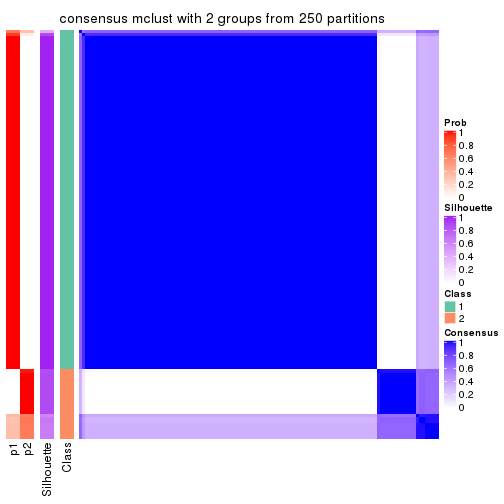</p>

</div>
<div id='tab-ATC-mclust-consensus-heatmap-2'>
<pre><code class="r">consensus_heatmap(res, k = 3)
</code></pre>

<p>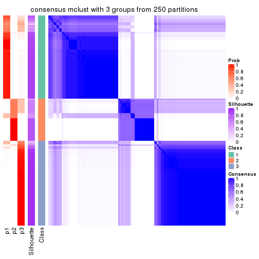</p>

</div>
<div id='tab-ATC-mclust-consensus-heatmap-3'>
<pre><code class="r">consensus_heatmap(res, k = 4)
</code></pre>

<p>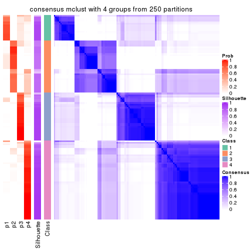</p>

</div>
<div id='tab-ATC-mclust-consensus-heatmap-4'>
<pre><code class="r">consensus_heatmap(res, k = 5)
</code></pre>

<p>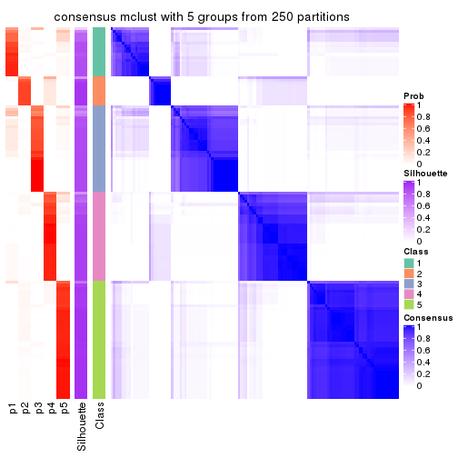</p>

</div>
<div id='tab-ATC-mclust-consensus-heatmap-5'>
<pre><code class="r">consensus_heatmap(res, k = 6)
</code></pre>

<p>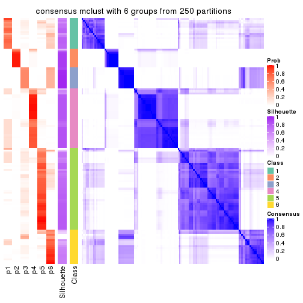</p>

</div>
</div>

Heatmaps for the membership of samples in all partitions to see how consistent they are:


<script>
$( function() {
	$( '#tabs-ATC-mclust-membership-heatmap' ).tabs();
} );
</script>
<div id='tabs-ATC-mclust-membership-heatmap'>
<ul>
<li><a href='#tab-ATC-mclust-membership-heatmap-1'>k = 2</a></li>
<li><a href='#tab-ATC-mclust-membership-heatmap-2'>k = 3</a></li>
<li><a href='#tab-ATC-mclust-membership-heatmap-3'>k = 4</a></li>
<li><a href='#tab-ATC-mclust-membership-heatmap-4'>k = 5</a></li>
<li><a href='#tab-ATC-mclust-membership-heatmap-5'>k = 6</a></li>
</ul>
<div id='tab-ATC-mclust-membership-heatmap-1'>
<pre><code class="r">membership_heatmap(res, k = 2)
</code></pre>

<p>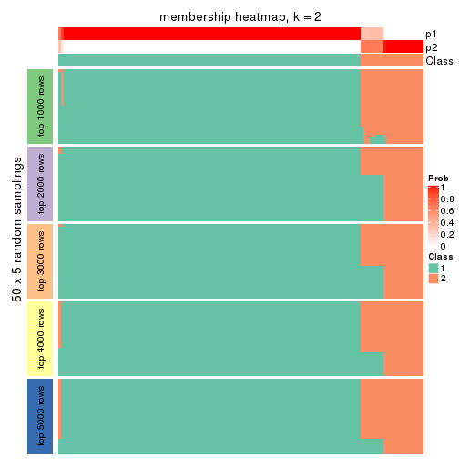</p>

</div>
<div id='tab-ATC-mclust-membership-heatmap-2'>
<pre><code class="r">membership_heatmap(res, k = 3)
</code></pre>

<p>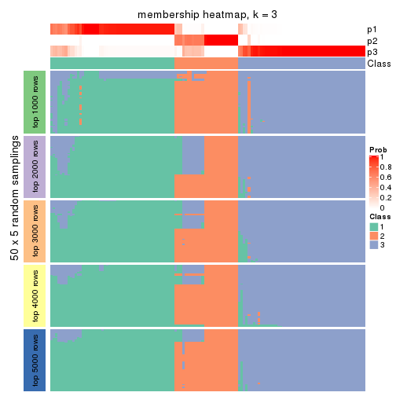</p>

</div>
<div id='tab-ATC-mclust-membership-heatmap-3'>
<pre><code class="r">membership_heatmap(res, k = 4)
</code></pre>

<p>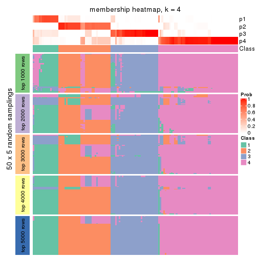</p>

</div>
<div id='tab-ATC-mclust-membership-heatmap-4'>
<pre><code class="r">membership_heatmap(res, k = 5)
</code></pre>

<p>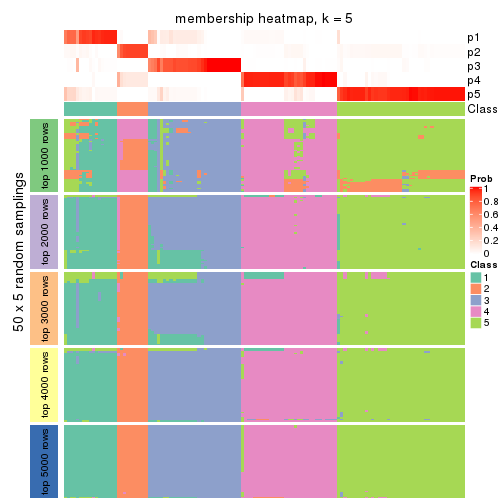</p>

</div>
<div id='tab-ATC-mclust-membership-heatmap-5'>
<pre><code class="r">membership_heatmap(res, k = 6)
</code></pre>

<p>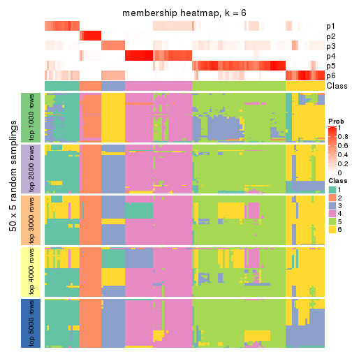</p>

</div>
</div>

As soon as we have had the classes for columns, we can look for signatures
which are significantly different between classes which can be candidate marks
for certain classes. Following are the heatmaps for signatures.


Signature heatmaps where rows are scaled:


<script>
$( function() {
	$( '#tabs-ATC-mclust-get-signatures' ).tabs();
} );
</script>
<div id='tabs-ATC-mclust-get-signatures'>
<ul>
<li><a href='#tab-ATC-mclust-get-signatures-1'>k = 2</a></li>
<li><a href='#tab-ATC-mclust-get-signatures-2'>k = 3</a></li>
<li><a href='#tab-ATC-mclust-get-signatures-3'>k = 4</a></li>
<li><a href='#tab-ATC-mclust-get-signatures-4'>k = 5</a></li>
<li><a href='#tab-ATC-mclust-get-signatures-5'>k = 6</a></li>
</ul>
<div id='tab-ATC-mclust-get-signatures-1'>
<pre><code class="r">get_signatures(res, k = 2)
</code></pre>

<p>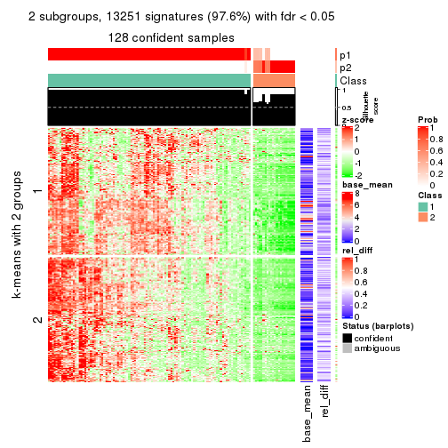</p>

</div>
<div id='tab-ATC-mclust-get-signatures-2'>
<pre><code class="r">get_signatures(res, k = 3)
</code></pre>

<p>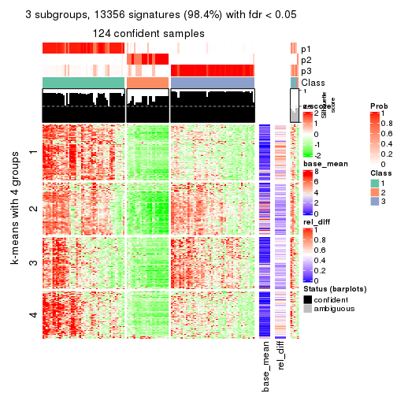</p>

</div>
<div id='tab-ATC-mclust-get-signatures-3'>
<pre><code class="r">get_signatures(res, k = 4)
</code></pre>

<p>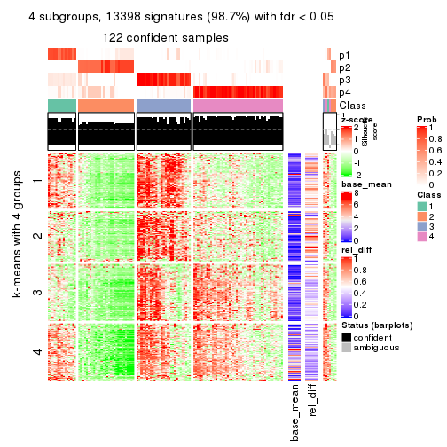</p>

</div>
<div id='tab-ATC-mclust-get-signatures-4'>
<pre><code class="r">get_signatures(res, k = 5)
</code></pre>

<p>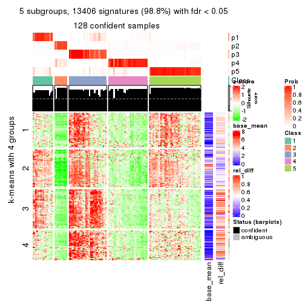</p>

</div>
<div id='tab-ATC-mclust-get-signatures-5'>
<pre><code class="r">get_signatures(res, k = 6)
</code></pre>

<p>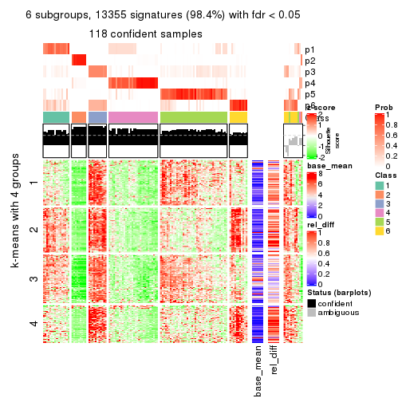</p>

</div>
</div>


Signature heatmaps where rows are not scaled:


<script>
$( function() {
	$( '#tabs-ATC-mclust-get-signatures-no-scale' ).tabs();
} );
</script>
<div id='tabs-ATC-mclust-get-signatures-no-scale'>
<ul>
<li><a href='#tab-ATC-mclust-get-signatures-no-scale-1'>k = 2</a></li>
<li><a href='#tab-ATC-mclust-get-signatures-no-scale-2'>k = 3</a></li>
<li><a href='#tab-ATC-mclust-get-signatures-no-scale-3'>k = 4</a></li>
<li><a href='#tab-ATC-mclust-get-signatures-no-scale-4'>k = 5</a></li>
<li><a href='#tab-ATC-mclust-get-signatures-no-scale-5'>k = 6</a></li>
</ul>
<div id='tab-ATC-mclust-get-signatures-no-scale-1'>
<pre><code class="r">get_signatures(res, k = 2, scale_rows = FALSE)
</code></pre>

<p>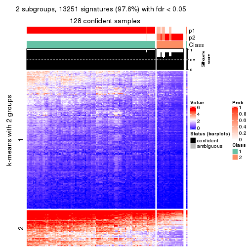</p>

</div>
<div id='tab-ATC-mclust-get-signatures-no-scale-2'>
<pre><code class="r">get_signatures(res, k = 3, scale_rows = FALSE)
</code></pre>

<p>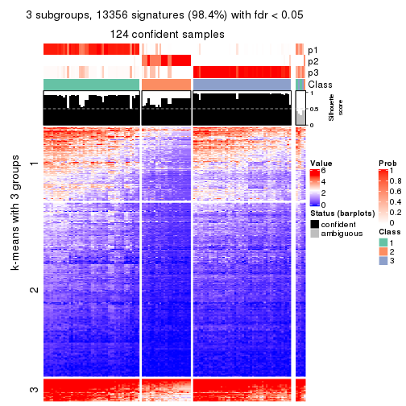</p>

</div>
<div id='tab-ATC-mclust-get-signatures-no-scale-3'>
<pre><code class="r">get_signatures(res, k = 4, scale_rows = FALSE)
</code></pre>

<p>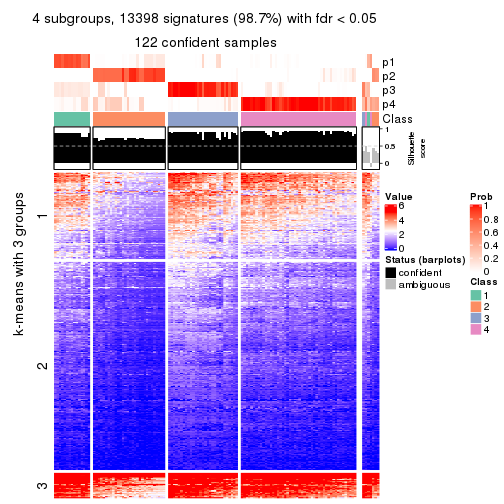</p>

</div>
<div id='tab-ATC-mclust-get-signatures-no-scale-4'>
<pre><code class="r">get_signatures(res, k = 5, scale_rows = FALSE)
</code></pre>

<p>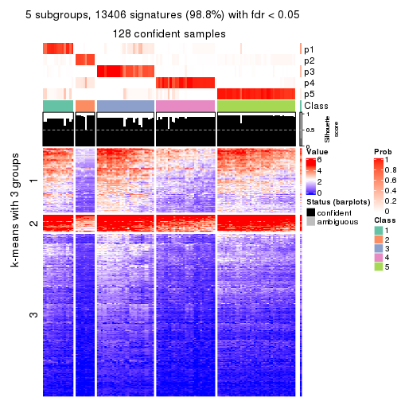</p>

</div>
<div id='tab-ATC-mclust-get-signatures-no-scale-5'>
<pre><code class="r">get_signatures(res, k = 6, scale_rows = FALSE)
</code></pre>

<p>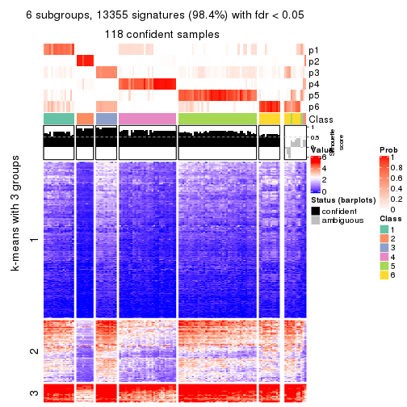</p>

</div>
</div>


Compare the overlap of signatures from different k:

```r
compare_signatures(res)
```

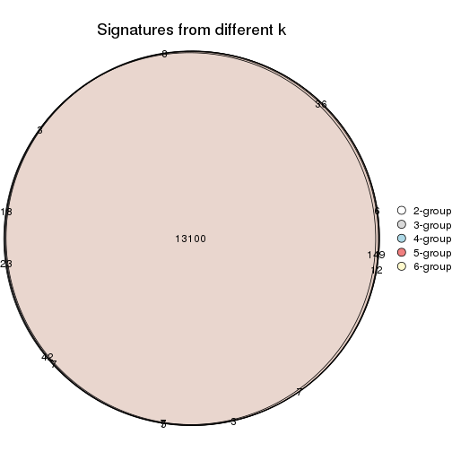

`get_signature()` returns a data frame invisibly. TO get the list of signatures, the function
call should be assigned to a variable explicitly. In following code, if `plot` argument is set
to `FALSE`, no heatmap is plotted while only the differential analysis is performed.

```r
# code only for demonstration
tb = get_signature(res, k = ..., plot = FALSE)
```

An example of the output of `tb` is:

```
#>   which_row         fdr    mean_1    mean_2 scaled_mean_1 scaled_mean_2 km
#> 1        38 0.042760348  8.373488  9.131774    -0.5533452     0.5164555  1
#> 2        40 0.018707592  7.106213  8.469186    -0.6173731     0.5762149  1
#> 3        55 0.019134737 10.221463 11.207825    -0.6159697     0.5749050  1
#> 4        59 0.006059896  5.921854  7.869574    -0.6899429     0.6439467  1
#> 5        60 0.018055526  8.928898 10.211722    -0.6204761     0.5791110  1
#> 6        98 0.009384629 15.714769 14.887706     0.6635654    -0.6193277  2
...
```

The columns in `tb` are:

1. `which_row`: row indices corresponding to the input matrix.
2. `fdr`: FDR for the differential test. 
3. `mean_x`: The mean value in group x.
4. `scaled_mean_x`: The mean value in group x after rows are scaled.
5. `km`: Row groups if k-means clustering is applied to rows.


UMAP plot which shows how samples are separated.


<script>
$( function() {
	$( '#tabs-ATC-mclust-dimension-reduction' ).tabs();
} );
</script>
<div id='tabs-ATC-mclust-dimension-reduction'>
<ul>
<li><a href='#tab-ATC-mclust-dimension-reduction-1'>k = 2</a></li>
<li><a href='#tab-ATC-mclust-dimension-reduction-2'>k = 3</a></li>
<li><a href='#tab-ATC-mclust-dimension-reduction-3'>k = 4</a></li>
<li><a href='#tab-ATC-mclust-dimension-reduction-4'>k = 5</a></li>
<li><a href='#tab-ATC-mclust-dimension-reduction-5'>k = 6</a></li>
</ul>
<div id='tab-ATC-mclust-dimension-reduction-1'>
<pre><code class="r">dimension_reduction(res, k = 2, method = &quot;UMAP&quot;)
</code></pre>

<p>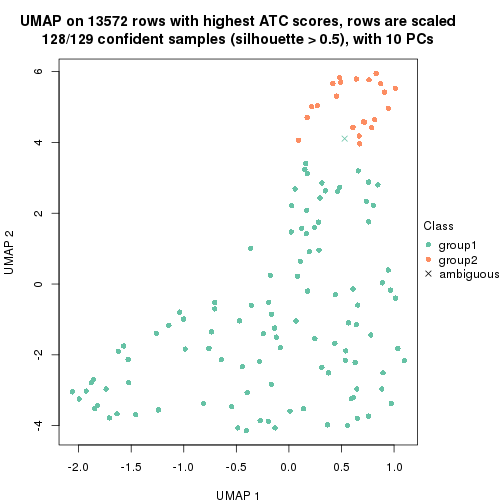</p>

</div>
<div id='tab-ATC-mclust-dimension-reduction-2'>
<pre><code class="r">dimension_reduction(res, k = 3, method = &quot;UMAP&quot;)
</code></pre>

<p>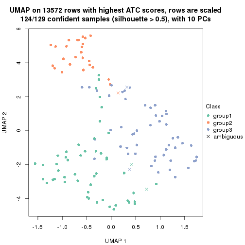</p>

</div>
<div id='tab-ATC-mclust-dimension-reduction-3'>
<pre><code class="r">dimension_reduction(res, k = 4, method = &quot;UMAP&quot;)
</code></pre>

<p>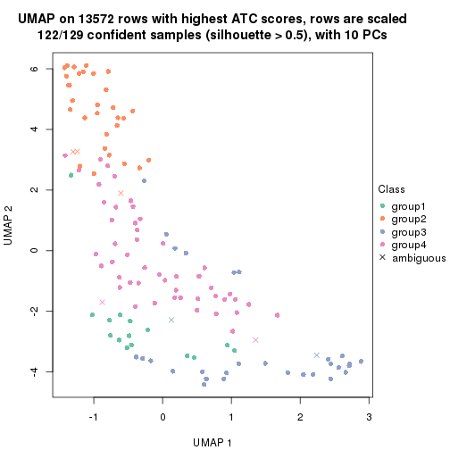</p>

</div>
<div id='tab-ATC-mclust-dimension-reduction-4'>
<pre><code class="r">dimension_reduction(res, k = 5, method = &quot;UMAP&quot;)
</code></pre>

<p>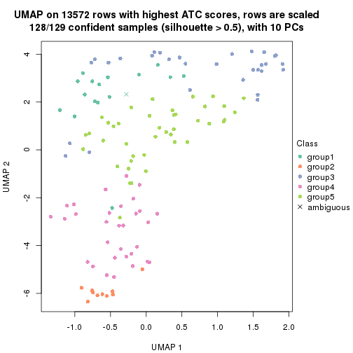</p>

</div>
<div id='tab-ATC-mclust-dimension-reduction-5'>
<pre><code class="r">dimension_reduction(res, k = 6, method = &quot;UMAP&quot;)
</code></pre>

<p>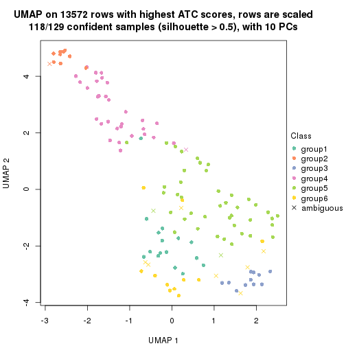</p>

</div>
</div>


Following heatmap shows how subgroups are split when increasing `k`:

```r
collect_classes(res)
```

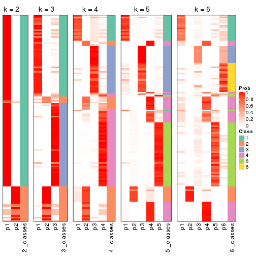


If matrix rows can be associated to genes, consider to use `GO_Enrichment(res,
...)` to perform function enrichment for the signature genes.


 

---------------------------------------------------


### ATC:NMF


The object with results only for a single top-value method and a single partition method 
can be extracted as:

```r
res = res_list["ATC", "NMF"]
# you can also extract it by
# res = res_list["ATC:NMF"]
```

A summary of `res` and all the functions that can be applied to it:

```r
res
```

```
#> A 'ConsensusPartition' object with k = 2, 3, 4, 5, 6.
#>   On a matrix with 13572 rows and 129 columns.
#>   Top rows (1000, 2000, 3000, 4000, 5000) are extracted by 'ATC' method.
#>   Subgroups are detected by 'NMF' method.
#>   Performed in total 1250 partitions by row resampling.
#>   Best k for subgroups seems to be 2.
#> 
#> Following methods can be applied to this 'ConsensusPartition' object:
#>  [1] "cola_report"             "collect_classes"         "collect_plots"          
#>  [4] "collect_stats"           "colnames"                "compare_signatures"     
#>  [7] "consensus_heatmap"       "dimension_reduction"     "functional_enrichment"  
#> [10] "get_anno_col"            "get_anno"                "get_classes"            
#> [13] "get_consensus"           "get_matrix"              "get_membership"         
#> [16] "get_param"               "get_signatures"          "get_stats"              
#> [19] "is_best_k"               "is_stable_k"             "membership_heatmap"     
#> [22] "ncol"                    "nrow"                    "plot_ecdf"              
#> [25] "rownames"                "select_partition_number" "show"                   
#> [28] "suggest_best_k"          "test_to_known_factors"
```

`collect_plots()` function collects all the plots made from `res` for all `k` (number of partitions)
into one single page to provide an easy and fast comparison between different `k`.

```r
collect_plots(res)
```

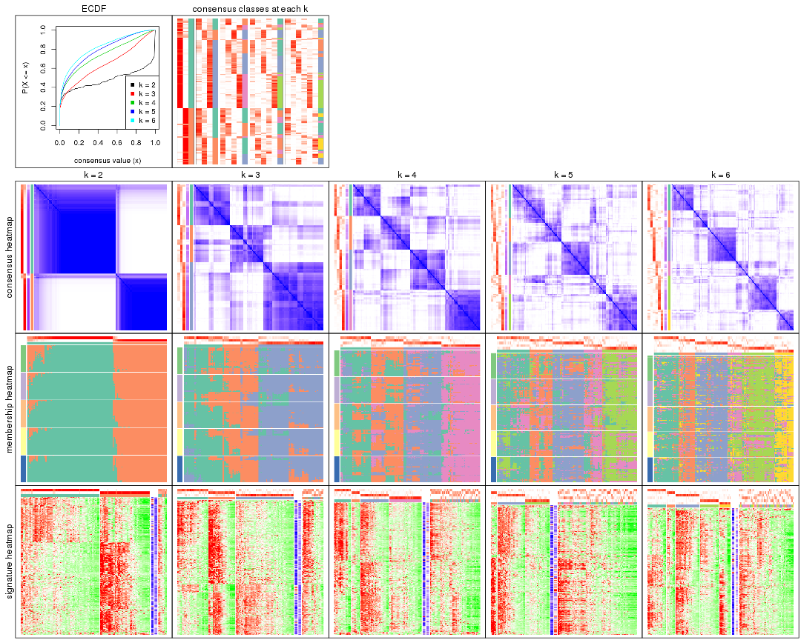

The plots are:

- The first row: a plot of the ECDF (Empirical cumulative distribution
  function) curves of the consensus matrix for each `k` and the heatmap of
  predicted classes for each `k`.
- The second row: heatmaps of the consensus matrix for each `k`.
- The third row: heatmaps of the membership matrix for each `k`.
- The fouth row: heatmaps of the signatures for each `k`.

All the plots in panels can be made by individual functions and they are
plotted later in this section.

`select_partition_number()` produces several plots showing different
statistics for choosing "optimized" `k`. There are following statistics:

- ECDF curves of the consensus matrix for each `k`;
- 1-PAC. [The PAC
  score](https://en.wikipedia.org/wiki/Consensus_clustering#Over-interpretation_potential_of_consensus_clustering)
  measures the proportion of the ambiguous subgrouping.
- Mean silhouette score.
- Concordance. The mean probability of fiting the consensus class ids in all
  partitions.
- Area increased. Denote $A_k$ as the area under the ECDF curve for current
  `k`, the area increased is defined as $A_k - A_{k-1}$.
- Rand index. The percent of pairs of samples that are both in a same cluster
  or both are not in a same cluster in the partition of k and k-1.
- Jaccard index. The ratio of pairs of samples are both in a same cluster in
  the partition of k and k-1 and the pairs of samples are both in a same
  cluster in the partition k or k-1.

The detailed explanations of these statistics can be found in [the cola
vignette](http://bioconductor.org/packages/devel/bioc/vignettes/cola/inst/doc/cola.html#toc_13).

Generally speaking, lower PAC score, higher mean silhouette score or higher
concordance corresponds to better partition. Rand index and Jaccard index
measure how similar the current partition is compared to partition with `k-1`.
If they are too similar, we won't accept `k` is better than `k-1`.

```r
select_partition_number(res)
```

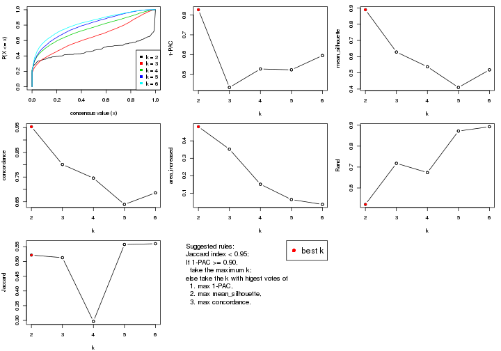

The numeric values for all these statistics can be obtained by `get_stats()`.

```r
get_stats(res)
```

```
#>   k 1-PAC mean_silhouette concordance area_increased  Rand Jaccard
#> 2 2 0.827           0.890       0.954         0.4810 0.522   0.522
#> 3 3 0.433           0.629       0.801         0.3523 0.718   0.513
#> 4 4 0.527           0.537       0.746         0.1511 0.674   0.297
#> 5 5 0.522           0.410       0.639         0.0634 0.872   0.558
#> 6 6 0.595           0.519       0.686         0.0356 0.893   0.560
```

`suggest_best_k()` suggests the best $k$ based on these statistics. The rules are as follows:

- All $k$ with Jaccard index larger than 0.95 are removed because the increase of
  the partition number does not provides enough extra information. If all $k$ are removed,
  the best $k$ is assigned by `NA`.
- For $k$ with 1-PAC larger than 0.9, the maximal $k$ is taken as the "best k". Other $k$ is called "optional k".
- If it does not fit the second rule. The $k$ with the highest vote of highest
  1-PAC, mean silhouette and concordance is taken as the "best k".

```r
suggest_best_k(res)
```

```
#> [1] 2
```


Following shows the table of the partitions (You need to click the **show/hide
code output** link to see it). The membership matrix (columns with name `p*`)
is inferred by
[`clue::cl_consensus()`](https://www.rdocumentation.org/link/cl_consensus?package=clue)
function with the `SE` method. Basically the value in the membership matrix
represents the probability to belong to a certain group. The finall class
label for an item is determined with the group with highest probability it
belongs to.

In `get_classes()` function, the entropy is calculated from the membership
matrix and the silhouette score is calculated from the consensus matrix.


<script>
$( function() {
	$( '#tabs-ATC-NMF-get-classes' ).tabs();
} );
</script>
<div id='tabs-ATC-NMF-get-classes'>
<ul>
<li><a href='#tab-ATC-NMF-get-classes-1'>k = 2</a></li>
<li><a href='#tab-ATC-NMF-get-classes-2'>k = 3</a></li>
<li><a href='#tab-ATC-NMF-get-classes-3'>k = 4</a></li>
<li><a href='#tab-ATC-NMF-get-classes-4'>k = 5</a></li>
<li><a href='#tab-ATC-NMF-get-classes-5'>k = 6</a></li>
</ul>

<div id='tab-ATC-NMF-get-classes-1'>
<p><a id='tab-ATC-NMF-get-classes-1-a' style='color:#0366d6' href='#'>show/hide code output</a></p>
<pre><code class="r">cbind(get_classes(res, k = 2), get_membership(res, k = 2))
</code></pre>

<pre><code>#&gt;            class entropy silhouette    p1    p2
#&gt; SRR1656463     1  0.2236    0.92518 0.964 0.036
#&gt; SRR1656464     2  0.0000    0.95886 0.000 1.000
#&gt; SRR1656462     2  0.0376    0.95682 0.004 0.996
#&gt; SRR1656465     1  0.0000    0.94459 1.000 0.000
#&gt; SRR1656467     1  0.0000    0.94459 1.000 0.000
#&gt; SRR1656466     1  0.0000    0.94459 1.000 0.000
#&gt; SRR1656468     1  0.0000    0.94459 1.000 0.000
#&gt; SRR1656472     2  0.0000    0.95886 0.000 1.000
#&gt; SRR1656471     1  0.0000    0.94459 1.000 0.000
#&gt; SRR1656470     1  0.9896    0.25954 0.560 0.440
#&gt; SRR1656469     1  0.0000    0.94459 1.000 0.000
#&gt; SRR1656473     2  0.0000    0.95886 0.000 1.000
#&gt; SRR1656474     2  0.0000    0.95886 0.000 1.000
#&gt; SRR1656475     2  0.0000    0.95886 0.000 1.000
#&gt; SRR1656478     2  0.0000    0.95886 0.000 1.000
#&gt; SRR1656477     1  0.0000    0.94459 1.000 0.000
#&gt; SRR1656479     1  0.0000    0.94459 1.000 0.000
#&gt; SRR1656480     1  0.0000    0.94459 1.000 0.000
#&gt; SRR1656476     1  0.0000    0.94459 1.000 0.000
#&gt; SRR1656481     1  0.0000    0.94459 1.000 0.000
#&gt; SRR1656482     1  0.2603    0.91903 0.956 0.044
#&gt; SRR1656483     2  0.9209    0.45837 0.336 0.664
#&gt; SRR1656485     1  0.0000    0.94459 1.000 0.000
#&gt; SRR1656487     1  0.0000    0.94459 1.000 0.000
#&gt; SRR1656486     1  0.0000    0.94459 1.000 0.000
#&gt; SRR1656488     1  0.0000    0.94459 1.000 0.000
#&gt; SRR1656484     1  0.4161    0.88863 0.916 0.084
#&gt; SRR1656489     2  0.2043    0.93488 0.032 0.968
#&gt; SRR1656491     1  0.0000    0.94459 1.000 0.000
#&gt; SRR1656490     1  0.1414    0.93410 0.980 0.020
#&gt; SRR1656492     1  0.0000    0.94459 1.000 0.000
#&gt; SRR1656493     2  0.0000    0.95886 0.000 1.000
#&gt; SRR1656495     2  0.0000    0.95886 0.000 1.000
#&gt; SRR1656496     1  0.0376    0.94268 0.996 0.004
#&gt; SRR1656494     2  0.0000    0.95886 0.000 1.000
#&gt; SRR1656497     1  0.0000    0.94459 1.000 0.000
#&gt; SRR1656499     1  0.0000    0.94459 1.000 0.000
#&gt; SRR1656500     1  0.5059    0.86339 0.888 0.112
#&gt; SRR1656501     1  0.4562    0.87858 0.904 0.096
#&gt; SRR1656498     2  0.0000    0.95886 0.000 1.000
#&gt; SRR1656504     1  0.0000    0.94459 1.000 0.000
#&gt; SRR1656502     2  0.0000    0.95886 0.000 1.000
#&gt; SRR1656503     1  0.7602    0.73679 0.780 0.220
#&gt; SRR1656507     2  0.9983    0.00863 0.476 0.524
#&gt; SRR1656508     2  0.0000    0.95886 0.000 1.000
#&gt; SRR1656505     1  0.0000    0.94459 1.000 0.000
#&gt; SRR1656506     1  0.0000    0.94459 1.000 0.000
#&gt; SRR1656509     2  0.2423    0.92748 0.040 0.960
#&gt; SRR1656510     1  0.0000    0.94459 1.000 0.000
#&gt; SRR1656511     1  0.0000    0.94459 1.000 0.000
#&gt; SRR1656513     2  0.0376    0.95678 0.004 0.996
#&gt; SRR1656512     2  0.0000    0.95886 0.000 1.000
#&gt; SRR1656514     2  0.0000    0.95886 0.000 1.000
#&gt; SRR1656515     1  0.0000    0.94459 1.000 0.000
#&gt; SRR1656516     1  0.8267    0.67682 0.740 0.260
#&gt; SRR1656518     1  0.6973    0.78114 0.812 0.188
#&gt; SRR1656517     2  0.0000    0.95886 0.000 1.000
#&gt; SRR1656519     1  0.6247    0.81803 0.844 0.156
#&gt; SRR1656522     2  0.0000    0.95886 0.000 1.000
#&gt; SRR1656523     1  0.0000    0.94459 1.000 0.000
#&gt; SRR1656521     2  0.1414    0.94480 0.020 0.980
#&gt; SRR1656520     2  0.8144    0.63454 0.252 0.748
#&gt; SRR1656524     2  0.0000    0.95886 0.000 1.000
#&gt; SRR1656525     1  0.0000    0.94459 1.000 0.000
#&gt; SRR1656526     1  0.0000    0.94459 1.000 0.000
#&gt; SRR1656527     2  0.0000    0.95886 0.000 1.000
#&gt; SRR1656530     1  0.0000    0.94459 1.000 0.000
#&gt; SRR1656529     1  0.0000    0.94459 1.000 0.000
#&gt; SRR1656531     2  0.0000    0.95886 0.000 1.000
#&gt; SRR1656528     1  0.0000    0.94459 1.000 0.000
#&gt; SRR1656534     1  0.8207    0.68356 0.744 0.256
#&gt; SRR1656533     2  0.0000    0.95886 0.000 1.000
#&gt; SRR1656536     1  0.0000    0.94459 1.000 0.000
#&gt; SRR1656532     2  0.0000    0.95886 0.000 1.000
#&gt; SRR1656537     2  0.0000    0.95886 0.000 1.000
#&gt; SRR1656538     1  0.0000    0.94459 1.000 0.000
#&gt; SRR1656535     1  0.0938    0.93875 0.988 0.012
#&gt; SRR1656539     1  0.0000    0.94459 1.000 0.000
#&gt; SRR1656544     1  0.3584    0.90127 0.932 0.068
#&gt; SRR1656542     1  0.2423    0.92162 0.960 0.040
#&gt; SRR1656543     1  0.9850    0.31020 0.572 0.428
#&gt; SRR1656545     1  0.0000    0.94459 1.000 0.000
#&gt; SRR1656540     2  0.0672    0.95430 0.008 0.992
#&gt; SRR1656546     1  0.9850    0.30928 0.572 0.428
#&gt; SRR1656541     1  0.0000    0.94459 1.000 0.000
#&gt; SRR1656547     1  0.0000    0.94459 1.000 0.000
#&gt; SRR1656548     1  0.0000    0.94459 1.000 0.000
#&gt; SRR1656549     1  0.0376    0.94265 0.996 0.004
#&gt; SRR1656551     1  0.0000    0.94459 1.000 0.000
#&gt; SRR1656553     1  0.9815    0.33232 0.580 0.420
#&gt; SRR1656550     1  0.0000    0.94459 1.000 0.000
#&gt; SRR1656552     1  0.0000    0.94459 1.000 0.000
#&gt; SRR1656554     1  0.0000    0.94459 1.000 0.000
#&gt; SRR1656555     1  0.0000    0.94459 1.000 0.000
#&gt; SRR1656556     1  0.9686    0.39436 0.604 0.396
#&gt; SRR1656557     2  0.1843    0.93837 0.028 0.972
#&gt; SRR1656558     2  0.0000    0.95886 0.000 1.000
#&gt; SRR1656559     2  0.0000    0.95886 0.000 1.000
#&gt; SRR1656560     1  0.0000    0.94459 1.000 0.000
#&gt; SRR1656561     1  0.0000    0.94459 1.000 0.000
#&gt; SRR1656562     2  1.0000   -0.04371 0.496 0.504
#&gt; SRR1656563     1  0.2603    0.91869 0.956 0.044
#&gt; SRR1656564     2  0.0376    0.95666 0.004 0.996
#&gt; SRR1656565     1  0.6148    0.82231 0.848 0.152
#&gt; SRR1656566     2  0.0000    0.95886 0.000 1.000
#&gt; SRR1656568     2  0.0000    0.95886 0.000 1.000
#&gt; SRR1656567     1  0.0000    0.94459 1.000 0.000
#&gt; SRR1656569     1  0.0000    0.94459 1.000 0.000
#&gt; SRR1656570     1  0.4022    0.88920 0.920 0.080
#&gt; SRR1656571     2  0.0000    0.95886 0.000 1.000
#&gt; SRR1656573     1  0.0000    0.94459 1.000 0.000
#&gt; SRR1656572     2  0.0672    0.95429 0.008 0.992
#&gt; SRR1656574     2  0.5408    0.83359 0.124 0.876
#&gt; SRR1656575     2  0.0376    0.95682 0.004 0.996
#&gt; SRR1656576     1  0.0000    0.94459 1.000 0.000
#&gt; SRR1656578     2  0.0000    0.95886 0.000 1.000
#&gt; SRR1656577     2  0.0000    0.95886 0.000 1.000
#&gt; SRR1656579     1  0.0000    0.94459 1.000 0.000
#&gt; SRR1656580     1  0.5059    0.86402 0.888 0.112
#&gt; SRR1656581     1  0.0000    0.94459 1.000 0.000
#&gt; SRR1656582     1  0.0000    0.94459 1.000 0.000
#&gt; SRR1656585     1  0.1843    0.92987 0.972 0.028
#&gt; SRR1656584     2  0.0000    0.95886 0.000 1.000
#&gt; SRR1656583     2  0.0938    0.95143 0.012 0.988
#&gt; SRR1656586     2  0.0000    0.95886 0.000 1.000
#&gt; SRR1656587     2  0.0000    0.95886 0.000 1.000
#&gt; SRR1656588     1  0.0000    0.94459 1.000 0.000
#&gt; SRR1656589     2  0.0000    0.95886 0.000 1.000
#&gt; SRR1656590     2  0.0000    0.95886 0.000 1.000
</code></pre>

<script>
$('#tab-ATC-NMF-get-classes-1-a').parent().next().next().hide();
$('#tab-ATC-NMF-get-classes-1-a').click(function(){
  $('#tab-ATC-NMF-get-classes-1-a').parent().next().next().toggle();
  return(false);
});
</script>
</div>

<div id='tab-ATC-NMF-get-classes-2'>
<p><a id='tab-ATC-NMF-get-classes-2-a' style='color:#0366d6' href='#'>show/hide code output</a></p>
<pre><code class="r">cbind(get_classes(res, k = 3), get_membership(res, k = 3))
</code></pre>

<pre><code>#&gt;            class entropy silhouette    p1    p2    p3
#&gt; SRR1656463     3  0.4569     0.7894 0.068 0.072 0.860
#&gt; SRR1656464     2  0.4399     0.5533 0.188 0.812 0.000
#&gt; SRR1656462     2  0.2982     0.6887 0.024 0.920 0.056
#&gt; SRR1656465     3  0.2959     0.7653 0.000 0.100 0.900
#&gt; SRR1656467     2  0.6309     0.0677 0.000 0.504 0.496
#&gt; SRR1656466     3  0.4575     0.7695 0.184 0.004 0.812
#&gt; SRR1656468     3  0.4291     0.7726 0.180 0.000 0.820
#&gt; SRR1656472     2  0.3879     0.5933 0.152 0.848 0.000
#&gt; SRR1656471     2  0.6225     0.2817 0.000 0.568 0.432
#&gt; SRR1656470     2  0.4555     0.6720 0.000 0.800 0.200
#&gt; SRR1656469     3  0.4504     0.7534 0.196 0.000 0.804
#&gt; SRR1656473     2  0.3941     0.5900 0.156 0.844 0.000
#&gt; SRR1656474     2  0.3267     0.6229 0.116 0.884 0.000
#&gt; SRR1656475     2  0.2173     0.6625 0.048 0.944 0.008
#&gt; SRR1656478     1  0.2400     0.7087 0.932 0.064 0.004
#&gt; SRR1656477     3  0.5291     0.5708 0.000 0.268 0.732
#&gt; SRR1656479     3  0.2066     0.7944 0.000 0.060 0.940
#&gt; SRR1656480     3  0.4654     0.6604 0.000 0.208 0.792
#&gt; SRR1656476     3  0.5098     0.7151 0.248 0.000 0.752
#&gt; SRR1656481     3  0.2663     0.8063 0.024 0.044 0.932
#&gt; SRR1656482     2  0.5497     0.5775 0.000 0.708 0.292
#&gt; SRR1656483     2  0.7489     0.4979 0.256 0.664 0.080
#&gt; SRR1656485     3  0.3551     0.7398 0.000 0.132 0.868
#&gt; SRR1656487     3  0.1129     0.8081 0.004 0.020 0.976
#&gt; SRR1656486     3  0.6295     0.3137 0.472 0.000 0.528
#&gt; SRR1656488     3  0.3192     0.8045 0.112 0.000 0.888
#&gt; SRR1656484     3  0.4569     0.7927 0.072 0.068 0.860
#&gt; SRR1656489     1  0.3644     0.7016 0.872 0.124 0.004
#&gt; SRR1656491     3  0.3551     0.7470 0.000 0.132 0.868
#&gt; SRR1656490     3  0.2492     0.8135 0.048 0.016 0.936
#&gt; SRR1656492     3  0.5621     0.6502 0.308 0.000 0.692
#&gt; SRR1656493     1  0.5291     0.6205 0.732 0.268 0.000
#&gt; SRR1656495     2  0.6267    -0.0933 0.452 0.548 0.000
#&gt; SRR1656496     3  0.3686     0.7880 0.140 0.000 0.860
#&gt; SRR1656494     2  0.2537     0.6928 0.000 0.920 0.080
#&gt; SRR1656497     3  0.1031     0.8060 0.000 0.024 0.976
#&gt; SRR1656499     3  0.3456     0.8013 0.036 0.060 0.904
#&gt; SRR1656500     3  0.6195     0.5575 0.020 0.276 0.704
#&gt; SRR1656501     1  0.4062     0.6358 0.836 0.000 0.164
#&gt; SRR1656498     1  0.5058     0.6400 0.756 0.244 0.000
#&gt; SRR1656504     3  0.5591     0.6532 0.304 0.000 0.696
#&gt; SRR1656502     2  0.4121     0.5763 0.168 0.832 0.000
#&gt; SRR1656503     1  0.6420     0.5219 0.688 0.024 0.288
#&gt; SRR1656507     1  0.3192     0.6679 0.888 0.000 0.112
#&gt; SRR1656508     1  0.6274     0.3235 0.544 0.456 0.000
#&gt; SRR1656505     3  0.2703     0.8131 0.056 0.016 0.928
#&gt; SRR1656506     3  0.0747     0.8134 0.016 0.000 0.984
#&gt; SRR1656509     2  0.3784     0.6903 0.004 0.864 0.132
#&gt; SRR1656510     3  0.6280     0.3710 0.460 0.000 0.540
#&gt; SRR1656511     3  0.4605     0.7416 0.204 0.000 0.796
#&gt; SRR1656513     2  0.3530     0.6691 0.068 0.900 0.032
#&gt; SRR1656512     1  0.6421     0.3958 0.572 0.424 0.004
#&gt; SRR1656514     2  0.2448     0.6491 0.076 0.924 0.000
#&gt; SRR1656515     3  0.4045     0.7734 0.024 0.104 0.872
#&gt; SRR1656516     1  0.3816     0.6479 0.852 0.000 0.148
#&gt; SRR1656518     1  0.3752     0.6505 0.856 0.000 0.144
#&gt; SRR1656517     1  0.2878     0.7059 0.904 0.096 0.000
#&gt; SRR1656519     2  0.5845     0.5502 0.004 0.688 0.308
#&gt; SRR1656522     2  0.6095     0.1284 0.392 0.608 0.000
#&gt; SRR1656523     3  0.3500     0.7970 0.116 0.004 0.880
#&gt; SRR1656521     1  0.2261     0.6859 0.932 0.000 0.068
#&gt; SRR1656520     2  0.4555     0.6712 0.000 0.800 0.200
#&gt; SRR1656524     1  0.5138     0.6352 0.748 0.252 0.000
#&gt; SRR1656525     3  0.3340     0.7965 0.120 0.000 0.880
#&gt; SRR1656526     3  0.3941     0.7792 0.156 0.000 0.844
#&gt; SRR1656527     1  0.3816     0.6889 0.852 0.148 0.000
#&gt; SRR1656530     3  0.4452     0.7651 0.192 0.000 0.808
#&gt; SRR1656529     3  0.0000     0.8117 0.000 0.000 1.000
#&gt; SRR1656531     2  0.6309    -0.2384 0.496 0.504 0.000
#&gt; SRR1656528     3  0.0000     0.8117 0.000 0.000 1.000
#&gt; SRR1656534     2  0.5953     0.5958 0.012 0.708 0.280
#&gt; SRR1656533     1  0.2537     0.7088 0.920 0.080 0.000
#&gt; SRR1656536     3  0.3941     0.7173 0.000 0.156 0.844
#&gt; SRR1656532     1  0.5363     0.6127 0.724 0.276 0.000
#&gt; SRR1656537     1  0.5621     0.5772 0.692 0.308 0.000
#&gt; SRR1656538     3  0.5926     0.5858 0.356 0.000 0.644
#&gt; SRR1656535     1  0.5098     0.5091 0.752 0.000 0.248
#&gt; SRR1656539     3  0.4605     0.6656 0.000 0.204 0.796
#&gt; SRR1656544     3  0.4702     0.6708 0.000 0.212 0.788
#&gt; SRR1656542     3  0.4465     0.7750 0.176 0.004 0.820
#&gt; SRR1656543     2  0.5331     0.6761 0.024 0.792 0.184
#&gt; SRR1656545     3  0.4978     0.6527 0.004 0.216 0.780
#&gt; SRR1656540     2  0.4099     0.6883 0.008 0.852 0.140
#&gt; SRR1656546     1  0.3686     0.6530 0.860 0.000 0.140
#&gt; SRR1656541     3  0.4842     0.7350 0.224 0.000 0.776
#&gt; SRR1656547     3  0.1129     0.8091 0.004 0.020 0.976
#&gt; SRR1656548     3  0.3816     0.7850 0.148 0.000 0.852
#&gt; SRR1656549     1  0.5058     0.5421 0.756 0.000 0.244
#&gt; SRR1656551     3  0.1289     0.8035 0.000 0.032 0.968
#&gt; SRR1656553     1  0.7797     0.6005 0.672 0.140 0.188
#&gt; SRR1656550     3  0.5706     0.4714 0.000 0.320 0.680
#&gt; SRR1656552     3  0.5560     0.6630 0.300 0.000 0.700
#&gt; SRR1656554     3  0.2261     0.7862 0.000 0.068 0.932
#&gt; SRR1656555     3  0.3941     0.7792 0.156 0.000 0.844
#&gt; SRR1656556     2  0.4796     0.6606 0.000 0.780 0.220
#&gt; SRR1656557     2  0.3310     0.6896 0.028 0.908 0.064
#&gt; SRR1656558     1  0.0237     0.7008 0.996 0.000 0.004
#&gt; SRR1656559     2  0.6244    -0.0241 0.440 0.560 0.000
#&gt; SRR1656560     3  0.2492     0.8136 0.048 0.016 0.936
#&gt; SRR1656561     3  0.4887     0.7306 0.228 0.000 0.772
#&gt; SRR1656562     1  0.9851     0.2784 0.420 0.296 0.284
#&gt; SRR1656563     1  0.6416     0.3072 0.616 0.008 0.376
#&gt; SRR1656564     2  0.5558     0.6110 0.152 0.800 0.048
#&gt; SRR1656565     3  0.7083     0.3117 0.028 0.380 0.592
#&gt; SRR1656566     1  0.2711     0.7077 0.912 0.088 0.000
#&gt; SRR1656568     1  0.5016     0.6428 0.760 0.240 0.000
#&gt; SRR1656567     3  0.3826     0.7509 0.008 0.124 0.868
#&gt; SRR1656569     3  0.0237     0.8122 0.004 0.000 0.996
#&gt; SRR1656570     1  0.5988     0.4944 0.688 0.008 0.304
#&gt; SRR1656571     1  0.5178     0.6323 0.744 0.256 0.000
#&gt; SRR1656573     3  0.0892     0.8072 0.000 0.020 0.980
#&gt; SRR1656572     1  0.2096     0.6925 0.944 0.004 0.052
#&gt; SRR1656574     2  0.6322     0.4017 0.276 0.700 0.024
#&gt; SRR1656575     1  0.2860     0.7095 0.912 0.084 0.004
#&gt; SRR1656576     3  0.4887     0.7311 0.228 0.000 0.772
#&gt; SRR1656578     1  0.5882     0.5245 0.652 0.348 0.000
#&gt; SRR1656577     1  0.6180     0.4001 0.584 0.416 0.000
#&gt; SRR1656579     3  0.1163     0.8050 0.000 0.028 0.972
#&gt; SRR1656580     3  0.7044     0.5329 0.348 0.032 0.620
#&gt; SRR1656581     3  0.0983     0.8134 0.016 0.004 0.980
#&gt; SRR1656582     3  0.1482     0.8134 0.020 0.012 0.968
#&gt; SRR1656585     2  0.5650     0.5465 0.000 0.688 0.312
#&gt; SRR1656584     1  0.1163     0.6971 0.972 0.000 0.028
#&gt; SRR1656583     2  0.5016     0.6431 0.000 0.760 0.240
#&gt; SRR1656586     2  0.2066     0.6906 0.000 0.940 0.060
#&gt; SRR1656587     2  0.3619     0.6099 0.136 0.864 0.000
#&gt; SRR1656588     3  0.6062     0.3134 0.000 0.384 0.616
#&gt; SRR1656589     1  0.4931     0.6489 0.768 0.232 0.000
#&gt; SRR1656590     1  0.6305     0.2396 0.516 0.484 0.000
</code></pre>

<script>
$('#tab-ATC-NMF-get-classes-2-a').parent().next().next().hide();
$('#tab-ATC-NMF-get-classes-2-a').click(function(){
  $('#tab-ATC-NMF-get-classes-2-a').parent().next().next().toggle();
  return(false);
});
</script>
</div>

<div id='tab-ATC-NMF-get-classes-3'>
<p><a id='tab-ATC-NMF-get-classes-3-a' style='color:#0366d6' href='#'>show/hide code output</a></p>
<pre><code class="r">cbind(get_classes(res, k = 4), get_membership(res, k = 4))
</code></pre>

<pre><code>#&gt;            class entropy silhouette    p1    p2    p3    p4
#&gt; SRR1656463     3  0.5167     0.5112 0.000 0.340 0.644 0.016
#&gt; SRR1656464     1  0.5217     0.4241 0.608 0.012 0.380 0.000
#&gt; SRR1656462     3  0.3528     0.5834 0.192 0.000 0.808 0.000
#&gt; SRR1656465     3  0.6816     0.5215 0.000 0.184 0.604 0.212
#&gt; SRR1656467     3  0.3764     0.6933 0.040 0.000 0.844 0.116
#&gt; SRR1656466     2  0.5750    -0.1598 0.000 0.532 0.440 0.028
#&gt; SRR1656468     2  0.7102     0.2344 0.000 0.540 0.156 0.304
#&gt; SRR1656472     1  0.3873     0.5995 0.772 0.000 0.228 0.000
#&gt; SRR1656471     3  0.4740     0.6667 0.080 0.000 0.788 0.132
#&gt; SRR1656470     3  0.2216     0.6736 0.092 0.000 0.908 0.000
#&gt; SRR1656469     4  0.3812     0.7719 0.000 0.140 0.028 0.832
#&gt; SRR1656473     1  0.3831     0.6105 0.792 0.004 0.204 0.000
#&gt; SRR1656474     1  0.4535     0.5248 0.704 0.004 0.292 0.000
#&gt; SRR1656475     1  0.5449     0.4903 0.676 0.004 0.288 0.032
#&gt; SRR1656478     2  0.4431     0.4028 0.304 0.696 0.000 0.000
#&gt; SRR1656477     3  0.4292     0.6695 0.008 0.016 0.796 0.180
#&gt; SRR1656479     4  0.1484     0.8328 0.020 0.004 0.016 0.960
#&gt; SRR1656480     4  0.3683     0.7989 0.016 0.016 0.112 0.856
#&gt; SRR1656476     2  0.6797     0.1582 0.000 0.536 0.108 0.356
#&gt; SRR1656481     3  0.6170     0.4850 0.000 0.332 0.600 0.068
#&gt; SRR1656482     3  0.2053     0.6883 0.072 0.000 0.924 0.004
#&gt; SRR1656483     3  0.5607     0.2315 0.020 0.484 0.496 0.000
#&gt; SRR1656485     3  0.5540     0.6336 0.000 0.108 0.728 0.164
#&gt; SRR1656487     3  0.6519     0.4689 0.000 0.320 0.584 0.096
#&gt; SRR1656486     4  0.5576     0.6184 0.068 0.212 0.004 0.716
#&gt; SRR1656488     2  0.6885    -0.0562 0.000 0.516 0.372 0.112
#&gt; SRR1656484     2  0.8862    -0.0174 0.056 0.396 0.324 0.224
#&gt; SRR1656489     2  0.4955     0.1684 0.444 0.556 0.000 0.000
#&gt; SRR1656491     4  0.2384     0.8094 0.072 0.004 0.008 0.916
#&gt; SRR1656490     4  0.1362     0.8383 0.020 0.012 0.004 0.964
#&gt; SRR1656492     2  0.4426     0.5046 0.000 0.812 0.092 0.096
#&gt; SRR1656493     1  0.4697     0.3029 0.644 0.356 0.000 0.000
#&gt; SRR1656495     1  0.1377     0.6432 0.964 0.008 0.020 0.008
#&gt; SRR1656496     4  0.2023     0.8339 0.028 0.028 0.004 0.940
#&gt; SRR1656494     3  0.4905     0.2600 0.364 0.000 0.632 0.004
#&gt; SRR1656497     4  0.1598     0.8346 0.020 0.004 0.020 0.956
#&gt; SRR1656499     3  0.5636     0.5366 0.000 0.308 0.648 0.044
#&gt; SRR1656500     3  0.3380     0.7080 0.008 0.088 0.876 0.028
#&gt; SRR1656501     2  0.5031     0.4945 0.212 0.740 0.000 0.048
#&gt; SRR1656498     1  0.4830     0.2275 0.608 0.392 0.000 0.000
#&gt; SRR1656504     2  0.6206     0.3349 0.000 0.632 0.088 0.280
#&gt; SRR1656502     1  0.3726     0.6109 0.788 0.000 0.212 0.000
#&gt; SRR1656503     4  0.6089     0.4609 0.328 0.064 0.000 0.608
#&gt; SRR1656507     2  0.2149     0.5380 0.088 0.912 0.000 0.000
#&gt; SRR1656508     1  0.2830     0.6182 0.904 0.032 0.004 0.060
#&gt; SRR1656505     3  0.6644     0.3652 0.000 0.392 0.520 0.088
#&gt; SRR1656506     4  0.0927     0.8377 0.000 0.008 0.016 0.976
#&gt; SRR1656509     1  0.6058     0.2092 0.536 0.004 0.424 0.036
#&gt; SRR1656510     2  0.3617     0.5300 0.000 0.860 0.076 0.064
#&gt; SRR1656511     4  0.1356     0.8292 0.032 0.008 0.000 0.960
#&gt; SRR1656513     1  0.5586     0.2048 0.528 0.000 0.452 0.020
#&gt; SRR1656512     1  0.4809     0.4035 0.684 0.004 0.004 0.308
#&gt; SRR1656514     3  0.3649     0.5726 0.204 0.000 0.796 0.000
#&gt; SRR1656515     3  0.5720     0.5441 0.000 0.296 0.652 0.052
#&gt; SRR1656516     2  0.5052     0.4741 0.244 0.720 0.000 0.036
#&gt; SRR1656518     2  0.4214     0.4977 0.204 0.780 0.000 0.016
#&gt; SRR1656517     2  0.4790     0.2957 0.380 0.620 0.000 0.000
#&gt; SRR1656519     3  0.1256     0.7089 0.028 0.008 0.964 0.000
#&gt; SRR1656522     1  0.3877     0.6471 0.840 0.048 0.112 0.000
#&gt; SRR1656523     4  0.1305     0.8254 0.036 0.004 0.000 0.960
#&gt; SRR1656521     2  0.3444     0.5064 0.184 0.816 0.000 0.000
#&gt; SRR1656520     3  0.2530     0.6581 0.112 0.000 0.888 0.000
#&gt; SRR1656524     1  0.3764     0.5317 0.816 0.172 0.000 0.012
#&gt; SRR1656525     4  0.3198     0.8083 0.000 0.080 0.040 0.880
#&gt; SRR1656526     4  0.1284     0.8373 0.000 0.024 0.012 0.964
#&gt; SRR1656527     2  0.4961     0.1594 0.448 0.552 0.000 0.000
#&gt; SRR1656530     2  0.6971     0.2887 0.000 0.568 0.156 0.276
#&gt; SRR1656529     4  0.2224     0.8303 0.000 0.032 0.040 0.928
#&gt; SRR1656531     1  0.2643     0.6328 0.916 0.016 0.016 0.052
#&gt; SRR1656528     4  0.2670     0.8248 0.000 0.052 0.040 0.908
#&gt; SRR1656534     3  0.1635     0.7033 0.044 0.008 0.948 0.000
#&gt; SRR1656533     2  0.5388     0.1252 0.456 0.532 0.000 0.012
#&gt; SRR1656536     3  0.5798     0.6148 0.000 0.112 0.704 0.184
#&gt; SRR1656532     1  0.4585     0.3420 0.668 0.332 0.000 0.000
#&gt; SRR1656537     1  0.4049     0.5190 0.780 0.212 0.008 0.000
#&gt; SRR1656538     2  0.5139     0.5218 0.020 0.768 0.040 0.172
#&gt; SRR1656535     2  0.1593     0.5524 0.024 0.956 0.004 0.016
#&gt; SRR1656539     3  0.3877     0.6875 0.000 0.112 0.840 0.048
#&gt; SRR1656544     3  0.6116     0.5804 0.052 0.020 0.672 0.256
#&gt; SRR1656542     2  0.5395     0.4173 0.000 0.736 0.172 0.092
#&gt; SRR1656543     3  0.2227     0.7109 0.036 0.036 0.928 0.000
#&gt; SRR1656545     4  0.4063     0.7225 0.172 0.004 0.016 0.808
#&gt; SRR1656540     3  0.2814     0.6425 0.132 0.000 0.868 0.000
#&gt; SRR1656546     2  0.3808     0.5133 0.176 0.812 0.000 0.012
#&gt; SRR1656541     4  0.6557     0.1096 0.000 0.448 0.076 0.476
#&gt; SRR1656547     4  0.5812     0.6350 0.000 0.136 0.156 0.708
#&gt; SRR1656548     4  0.2949     0.8136 0.000 0.088 0.024 0.888
#&gt; SRR1656549     4  0.4332     0.7414 0.112 0.072 0.000 0.816
#&gt; SRR1656551     4  0.5421     0.6462 0.000 0.076 0.200 0.724
#&gt; SRR1656553     2  0.3994     0.5095 0.028 0.828 0.140 0.004
#&gt; SRR1656550     3  0.1733     0.7216 0.000 0.024 0.948 0.028
#&gt; SRR1656552     2  0.5092     0.4807 0.000 0.764 0.096 0.140
#&gt; SRR1656554     4  0.2644     0.8244 0.000 0.032 0.060 0.908
#&gt; SRR1656555     4  0.0895     0.8379 0.000 0.020 0.004 0.976
#&gt; SRR1656556     3  0.1902     0.6925 0.064 0.004 0.932 0.000
#&gt; SRR1656557     3  0.3266     0.6110 0.168 0.000 0.832 0.000
#&gt; SRR1656558     2  0.5024     0.3338 0.360 0.632 0.000 0.008
#&gt; SRR1656559     1  0.6320     0.5558 0.656 0.204 0.140 0.000
#&gt; SRR1656560     3  0.6926     0.3304 0.000 0.392 0.496 0.112
#&gt; SRR1656561     4  0.1732     0.8325 0.008 0.040 0.004 0.948
#&gt; SRR1656562     4  0.4872     0.4585 0.356 0.004 0.000 0.640
#&gt; SRR1656563     4  0.3217     0.7754 0.128 0.012 0.000 0.860
#&gt; SRR1656564     1  0.6027     0.1490 0.552 0.004 0.036 0.408
#&gt; SRR1656565     3  0.4065     0.7146 0.068 0.044 0.856 0.032
#&gt; SRR1656566     1  0.5388     0.0287 0.532 0.456 0.000 0.012
#&gt; SRR1656568     1  0.5119     0.1157 0.556 0.440 0.004 0.000
#&gt; SRR1656567     3  0.5911     0.5992 0.000 0.196 0.692 0.112
#&gt; SRR1656569     4  0.3810     0.7873 0.000 0.092 0.060 0.848
#&gt; SRR1656570     4  0.3271     0.7710 0.132 0.012 0.000 0.856
#&gt; SRR1656571     2  0.5402     0.0251 0.472 0.516 0.012 0.000
#&gt; SRR1656573     4  0.1833     0.8343 0.000 0.024 0.032 0.944
#&gt; SRR1656572     2  0.5536     0.2908 0.384 0.592 0.000 0.024
#&gt; SRR1656574     1  0.2660     0.6506 0.908 0.012 0.072 0.008
#&gt; SRR1656575     1  0.5308     0.3736 0.684 0.280 0.000 0.036
#&gt; SRR1656576     4  0.1256     0.8329 0.008 0.028 0.000 0.964
#&gt; SRR1656578     1  0.2198     0.6173 0.920 0.072 0.008 0.000
#&gt; SRR1656577     1  0.4462     0.5817 0.792 0.164 0.044 0.000
#&gt; SRR1656579     4  0.1936     0.8341 0.000 0.028 0.032 0.940
#&gt; SRR1656580     4  0.6726     0.3404 0.364 0.100 0.000 0.536
#&gt; SRR1656581     4  0.3004     0.8139 0.000 0.060 0.048 0.892
#&gt; SRR1656582     4  0.0804     0.8366 0.008 0.000 0.012 0.980
#&gt; SRR1656585     4  0.7333     0.2927 0.320 0.004 0.156 0.520
#&gt; SRR1656584     2  0.5110     0.3454 0.352 0.636 0.000 0.012
#&gt; SRR1656583     3  0.5596     0.3312 0.332 0.000 0.632 0.036
#&gt; SRR1656586     3  0.4483     0.4402 0.284 0.000 0.712 0.004
#&gt; SRR1656587     1  0.4250     0.5541 0.724 0.000 0.276 0.000
#&gt; SRR1656588     3  0.2179     0.7152 0.000 0.064 0.924 0.012
#&gt; SRR1656589     2  0.5867     0.4520 0.096 0.688 0.216 0.000
#&gt; SRR1656590     1  0.1510     0.6395 0.956 0.028 0.016 0.000
</code></pre>

<script>
$('#tab-ATC-NMF-get-classes-3-a').parent().next().next().hide();
$('#tab-ATC-NMF-get-classes-3-a').click(function(){
  $('#tab-ATC-NMF-get-classes-3-a').parent().next().next().toggle();
  return(false);
});
</script>
</div>

<div id='tab-ATC-NMF-get-classes-4'>
<p><a id='tab-ATC-NMF-get-classes-4-a' style='color:#0366d6' href='#'>show/hide code output</a></p>
<pre><code class="r">cbind(get_classes(res, k = 5), get_membership(res, k = 5))
</code></pre>

<pre><code>#&gt;            class entropy silhouette    p1    p2    p3    p4    p5
#&gt; SRR1656463     1   0.855    0.09557 0.392 0.152 0.268 0.016 0.172
#&gt; SRR1656464     2   0.545    0.48766 0.008 0.668 0.220 0.104 0.000
#&gt; SRR1656462     3   0.402    0.70522 0.000 0.096 0.796 0.108 0.000
#&gt; SRR1656465     3   0.416    0.69439 0.128 0.000 0.800 0.016 0.056
#&gt; SRR1656467     5   0.766    0.01649 0.024 0.348 0.216 0.020 0.392
#&gt; SRR1656466     1   0.457    0.02634 0.576 0.000 0.412 0.000 0.012
#&gt; SRR1656468     1   0.649    0.29286 0.552 0.000 0.208 0.012 0.228
#&gt; SRR1656472     2   0.248    0.56178 0.000 0.900 0.068 0.028 0.004
#&gt; SRR1656471     3   0.384    0.72980 0.000 0.048 0.832 0.092 0.028
#&gt; SRR1656470     3   0.345    0.71024 0.000 0.156 0.816 0.028 0.000
#&gt; SRR1656469     5   0.396    0.57960 0.204 0.012 0.004 0.008 0.772
#&gt; SRR1656473     2   0.541    0.42939 0.000 0.612 0.084 0.304 0.000
#&gt; SRR1656474     2   0.546    0.46749 0.000 0.652 0.136 0.212 0.000
#&gt; SRR1656475     2   0.623    0.26014 0.000 0.484 0.112 0.396 0.008
#&gt; SRR1656478     1   0.538    0.28930 0.632 0.076 0.004 0.288 0.000
#&gt; SRR1656477     3   0.576    0.63401 0.004 0.100 0.696 0.040 0.160
#&gt; SRR1656479     5   0.193    0.69338 0.000 0.016 0.004 0.052 0.928
#&gt; SRR1656480     5   0.684    0.25495 0.008 0.000 0.232 0.312 0.448
#&gt; SRR1656476     1   0.633    0.15273 0.536 0.000 0.108 0.020 0.336
#&gt; SRR1656481     3   0.582    0.29428 0.388 0.004 0.540 0.012 0.056
#&gt; SRR1656482     3   0.279    0.73909 0.000 0.100 0.872 0.028 0.000
#&gt; SRR1656483     3   0.473    0.58893 0.240 0.000 0.700 0.060 0.000
#&gt; SRR1656485     5   0.783    0.18108 0.108 0.104 0.308 0.016 0.464
#&gt; SRR1656487     1   0.734    0.05764 0.372 0.008 0.332 0.012 0.276
#&gt; SRR1656486     5   0.501    0.44555 0.320 0.020 0.000 0.020 0.640
#&gt; SRR1656488     1   0.564    0.10119 0.552 0.000 0.372 0.004 0.072
#&gt; SRR1656484     3   0.667    0.38606 0.204 0.008 0.544 0.236 0.008
#&gt; SRR1656489     2   0.560    0.05991 0.424 0.520 0.004 0.008 0.044
#&gt; SRR1656491     5   0.487    0.32871 0.000 0.004 0.016 0.444 0.536
#&gt; SRR1656490     5   0.120    0.69508 0.000 0.004 0.000 0.040 0.956
#&gt; SRR1656492     1   0.477    0.42393 0.724 0.000 0.096 0.000 0.180
#&gt; SRR1656493     4   0.681   -0.06384 0.324 0.312 0.000 0.364 0.000
#&gt; SRR1656495     2   0.335    0.53908 0.032 0.848 0.004 0.112 0.004
#&gt; SRR1656496     5   0.501    0.50840 0.032 0.000 0.008 0.332 0.628
#&gt; SRR1656494     2   0.451    0.47596 0.000 0.736 0.220 0.020 0.024
#&gt; SRR1656497     4   0.489   -0.24388 0.000 0.000 0.024 0.524 0.452
#&gt; SRR1656499     3   0.349    0.63533 0.228 0.000 0.768 0.000 0.004
#&gt; SRR1656500     3   0.152    0.75658 0.048 0.004 0.944 0.004 0.000
#&gt; SRR1656501     1   0.522    0.20141 0.576 0.032 0.004 0.384 0.004
#&gt; SRR1656498     1   0.682   -0.00392 0.344 0.336 0.000 0.320 0.000
#&gt; SRR1656504     1   0.579    0.28428 0.628 0.000 0.076 0.024 0.272
#&gt; SRR1656502     2   0.268    0.56455 0.004 0.896 0.060 0.036 0.004
#&gt; SRR1656503     5   0.650    0.15901 0.172 0.352 0.000 0.004 0.472
#&gt; SRR1656507     1   0.306    0.43096 0.860 0.020 0.008 0.112 0.000
#&gt; SRR1656508     4   0.507   -0.09498 0.020 0.392 0.000 0.576 0.012
#&gt; SRR1656505     3   0.422    0.54648 0.300 0.000 0.688 0.004 0.008
#&gt; SRR1656506     5   0.342    0.66960 0.008 0.000 0.016 0.152 0.824
#&gt; SRR1656509     4   0.627   -0.04308 0.000 0.076 0.392 0.504 0.028
#&gt; SRR1656510     1   0.403    0.44861 0.812 0.000 0.096 0.012 0.080
#&gt; SRR1656511     5   0.325    0.65030 0.008 0.000 0.000 0.184 0.808
#&gt; SRR1656513     2   0.373    0.53623 0.012 0.832 0.096 0.000 0.060
#&gt; SRR1656512     4   0.435    0.37788 0.008 0.104 0.000 0.784 0.104
#&gt; SRR1656514     3   0.381    0.71232 0.000 0.096 0.812 0.092 0.000
#&gt; SRR1656515     3   0.503    0.51134 0.296 0.004 0.660 0.012 0.028
#&gt; SRR1656516     4   0.575   -0.09509 0.456 0.024 0.024 0.488 0.008
#&gt; SRR1656518     1   0.423    0.42417 0.768 0.184 0.000 0.040 0.008
#&gt; SRR1656517     1   0.595    0.27328 0.584 0.164 0.000 0.252 0.000
#&gt; SRR1656519     3   0.443    0.68420 0.032 0.200 0.752 0.016 0.000
#&gt; SRR1656522     2   0.395    0.53732 0.052 0.816 0.016 0.116 0.000
#&gt; SRR1656523     5   0.382    0.55178 0.000 0.000 0.000 0.304 0.696
#&gt; SRR1656521     1   0.428    0.40390 0.744 0.224 0.004 0.024 0.004
#&gt; SRR1656520     3   0.378    0.64308 0.000 0.236 0.752 0.012 0.000
#&gt; SRR1656524     2   0.678    0.07807 0.232 0.424 0.000 0.340 0.004
#&gt; SRR1656525     5   0.247    0.69051 0.084 0.000 0.008 0.012 0.896
#&gt; SRR1656526     5   0.128    0.69226 0.044 0.000 0.000 0.004 0.952
#&gt; SRR1656527     1   0.644    0.11143 0.448 0.372 0.000 0.180 0.000
#&gt; SRR1656530     1   0.608    0.17501 0.564 0.000 0.324 0.016 0.096
#&gt; SRR1656529     5   0.620    0.45914 0.024 0.000 0.088 0.336 0.552
#&gt; SRR1656531     2   0.258    0.53349 0.044 0.892 0.000 0.000 0.064
#&gt; SRR1656528     5   0.513    0.65340 0.036 0.000 0.084 0.140 0.740
#&gt; SRR1656534     3   0.318    0.74685 0.028 0.108 0.856 0.008 0.000
#&gt; SRR1656533     1   0.646    0.20862 0.500 0.244 0.000 0.256 0.000
#&gt; SRR1656536     3   0.328    0.73657 0.056 0.000 0.868 0.052 0.024
#&gt; SRR1656532     2   0.430    0.44513 0.192 0.752 0.000 0.056 0.000
#&gt; SRR1656537     2   0.641    0.21349 0.244 0.512 0.000 0.244 0.000
#&gt; SRR1656538     1   0.635    0.22365 0.532 0.000 0.132 0.324 0.012
#&gt; SRR1656535     1   0.233    0.45402 0.916 0.004 0.016 0.052 0.012
#&gt; SRR1656539     3   0.254    0.74522 0.044 0.000 0.900 0.052 0.004
#&gt; SRR1656544     3   0.575    0.66581 0.012 0.096 0.716 0.048 0.128
#&gt; SRR1656542     1   0.709    0.36938 0.572 0.100 0.104 0.004 0.220
#&gt; SRR1656543     3   0.496    0.64644 0.056 0.228 0.704 0.012 0.000
#&gt; SRR1656545     5   0.394    0.58602 0.000 0.200 0.000 0.032 0.768
#&gt; SRR1656540     3   0.408    0.63890 0.000 0.228 0.744 0.028 0.000
#&gt; SRR1656546     1   0.442    0.41912 0.760 0.148 0.000 0.092 0.000
#&gt; SRR1656541     5   0.469    0.43022 0.320 0.012 0.008 0.004 0.656
#&gt; SRR1656547     5   0.525    0.55505 0.172 0.060 0.020 0.016 0.732
#&gt; SRR1656548     5   0.299    0.68599 0.100 0.000 0.008 0.024 0.868
#&gt; SRR1656549     5   0.570    0.53014 0.092 0.028 0.000 0.212 0.668
#&gt; SRR1656551     5   0.452    0.62339 0.036 0.004 0.164 0.024 0.772
#&gt; SRR1656553     1   0.447    0.43593 0.772 0.156 0.060 0.004 0.008
#&gt; SRR1656550     3   0.191    0.75657 0.000 0.032 0.932 0.032 0.004
#&gt; SRR1656552     1   0.547    0.29368 0.632 0.036 0.032 0.000 0.300
#&gt; SRR1656554     5   0.532    0.60722 0.016 0.000 0.152 0.124 0.708
#&gt; SRR1656555     5   0.347    0.65807 0.012 0.000 0.004 0.180 0.804
#&gt; SRR1656556     3   0.219    0.74425 0.000 0.092 0.900 0.008 0.000
#&gt; SRR1656557     3   0.359    0.72162 0.000 0.092 0.828 0.080 0.000
#&gt; SRR1656558     1   0.618    0.28141 0.556 0.224 0.000 0.220 0.000
#&gt; SRR1656559     4   0.856   -0.13432 0.196 0.276 0.252 0.276 0.000
#&gt; SRR1656560     3   0.419    0.60136 0.260 0.000 0.720 0.016 0.004
#&gt; SRR1656561     5   0.279    0.69353 0.052 0.000 0.000 0.068 0.880
#&gt; SRR1656562     4   0.386    0.29936 0.004 0.008 0.004 0.764 0.220
#&gt; SRR1656563     4   0.498    0.08580 0.028 0.008 0.000 0.620 0.344
#&gt; SRR1656564     2   0.520    0.29353 0.000 0.616 0.012 0.036 0.336
#&gt; SRR1656565     3   0.540    0.46954 0.056 0.004 0.616 0.320 0.004
#&gt; SRR1656566     1   0.688    0.07859 0.396 0.264 0.000 0.336 0.004
#&gt; SRR1656568     2   0.660   -0.09514 0.392 0.396 0.000 0.212 0.000
#&gt; SRR1656567     3   0.342    0.69698 0.152 0.000 0.824 0.016 0.008
#&gt; SRR1656569     5   0.469    0.66242 0.056 0.000 0.088 0.072 0.784
#&gt; SRR1656570     4   0.464    0.16125 0.024 0.004 0.000 0.664 0.308
#&gt; SRR1656571     4   0.655    0.06129 0.364 0.040 0.088 0.508 0.000
#&gt; SRR1656573     5   0.300    0.68355 0.008 0.000 0.020 0.108 0.864
#&gt; SRR1656572     1   0.616    0.29766 0.576 0.268 0.000 0.148 0.008
#&gt; SRR1656574     4   0.345    0.38242 0.020 0.028 0.084 0.860 0.008
#&gt; SRR1656575     4   0.711   -0.09158 0.336 0.280 0.000 0.372 0.012
#&gt; SRR1656576     5   0.550    0.33152 0.040 0.000 0.012 0.432 0.516
#&gt; SRR1656578     2   0.432    0.48296 0.100 0.780 0.000 0.116 0.004
#&gt; SRR1656577     4   0.750    0.10086 0.208 0.216 0.080 0.496 0.000
#&gt; SRR1656579     5   0.186    0.68781 0.044 0.008 0.004 0.008 0.936
#&gt; SRR1656580     4   0.645    0.37858 0.152 0.028 0.020 0.644 0.156
#&gt; SRR1656581     5   0.234    0.67960 0.072 0.004 0.008 0.008 0.908
#&gt; SRR1656582     5   0.120    0.69535 0.000 0.000 0.004 0.040 0.956
#&gt; SRR1656585     4   0.621    0.27554 0.000 0.024 0.188 0.620 0.168
#&gt; SRR1656584     1   0.595    0.21235 0.532 0.120 0.000 0.348 0.000
#&gt; SRR1656583     2   0.662    0.13950 0.000 0.512 0.356 0.080 0.052
#&gt; SRR1656586     2   0.471    0.39976 0.000 0.684 0.280 0.024 0.012
#&gt; SRR1656587     4   0.681   -0.06639 0.004 0.232 0.372 0.392 0.000
#&gt; SRR1656588     3   0.130    0.76095 0.016 0.028 0.956 0.000 0.000
#&gt; SRR1656589     1   0.657    0.15283 0.500 0.052 0.376 0.072 0.000
#&gt; SRR1656590     2   0.577    0.35503 0.072 0.588 0.008 0.328 0.004
</code></pre>

<script>
$('#tab-ATC-NMF-get-classes-4-a').parent().next().next().hide();
$('#tab-ATC-NMF-get-classes-4-a').click(function(){
  $('#tab-ATC-NMF-get-classes-4-a').parent().next().next().toggle();
  return(false);
});
</script>
</div>

<div id='tab-ATC-NMF-get-classes-5'>
<p><a id='tab-ATC-NMF-get-classes-5-a' style='color:#0366d6' href='#'>show/hide code output</a></p>
<pre><code class="r">cbind(get_classes(res, k = 6), get_membership(res, k = 6))
</code></pre>

<pre><code>#&gt;            class entropy silhouette    p1    p2    p3    p4    p5    p6
#&gt; SRR1656463     2  0.8398     0.3390 0.060 0.396 0.188 0.036 0.072 0.248
#&gt; SRR1656464     6  0.4707     0.6393 0.048 0.000 0.096 0.116 0.000 0.740
#&gt; SRR1656462     3  0.2321     0.7600 0.008 0.000 0.900 0.052 0.000 0.040
#&gt; SRR1656465     3  0.5689     0.5516 0.000 0.232 0.628 0.032 0.096 0.012
#&gt; SRR1656467     6  0.6417     0.2921 0.000 0.048 0.092 0.028 0.280 0.552
#&gt; SRR1656466     2  0.3705     0.5538 0.024 0.748 0.224 0.004 0.000 0.000
#&gt; SRR1656468     2  0.2247     0.6407 0.004 0.912 0.024 0.020 0.040 0.000
#&gt; SRR1656472     6  0.1251     0.6619 0.008 0.000 0.012 0.024 0.000 0.956
#&gt; SRR1656471     3  0.5357     0.6711 0.000 0.012 0.708 0.108 0.088 0.084
#&gt; SRR1656470     3  0.3279     0.7227 0.000 0.000 0.796 0.028 0.000 0.176
#&gt; SRR1656469     2  0.5031    -0.0332 0.016 0.504 0.000 0.000 0.440 0.040
#&gt; SRR1656473     6  0.4134     0.5240 0.016 0.000 0.004 0.340 0.000 0.640
#&gt; SRR1656474     6  0.4034     0.5913 0.008 0.000 0.024 0.260 0.000 0.708
#&gt; SRR1656475     6  0.4440     0.4232 0.008 0.000 0.016 0.420 0.000 0.556
#&gt; SRR1656478     1  0.3820     0.7090 0.796 0.056 0.020 0.128 0.000 0.000
#&gt; SRR1656477     3  0.7370     0.2904 0.000 0.040 0.432 0.048 0.260 0.220
#&gt; SRR1656479     5  0.1700     0.6670 0.000 0.012 0.000 0.028 0.936 0.024
#&gt; SRR1656480     4  0.6993     0.0051 0.000 0.048 0.120 0.408 0.388 0.036
#&gt; SRR1656476     2  0.2340     0.6256 0.004 0.896 0.000 0.044 0.056 0.000
#&gt; SRR1656481     2  0.4341     0.3207 0.000 0.620 0.356 0.008 0.012 0.004
#&gt; SRR1656482     3  0.3475     0.7408 0.000 0.008 0.816 0.040 0.004 0.132
#&gt; SRR1656483     3  0.6659     0.1818 0.048 0.356 0.464 0.112 0.000 0.020
#&gt; SRR1656485     5  0.6913     0.1836 0.000 0.080 0.308 0.016 0.476 0.120
#&gt; SRR1656487     2  0.7006     0.3047 0.000 0.456 0.304 0.016 0.160 0.064
#&gt; SRR1656486     5  0.5612     0.1213 0.096 0.432 0.000 0.008 0.460 0.004
#&gt; SRR1656488     2  0.4574     0.3842 0.016 0.636 0.324 0.004 0.020 0.000
#&gt; SRR1656484     3  0.5566     0.5684 0.120 0.036 0.672 0.156 0.016 0.000
#&gt; SRR1656489     1  0.5700     0.5686 0.700 0.060 0.012 0.040 0.048 0.140
#&gt; SRR1656491     5  0.4229     0.4132 0.000 0.012 0.008 0.324 0.652 0.004
#&gt; SRR1656490     5  0.2651     0.6519 0.052 0.016 0.012 0.028 0.892 0.000
#&gt; SRR1656492     2  0.2409     0.6483 0.040 0.904 0.024 0.004 0.028 0.000
#&gt; SRR1656493     1  0.3316     0.7162 0.828 0.000 0.024 0.124 0.000 0.024
#&gt; SRR1656495     6  0.4473     0.6104 0.212 0.008 0.000 0.072 0.000 0.708
#&gt; SRR1656496     5  0.4836     0.3275 0.020 0.032 0.000 0.356 0.592 0.000
#&gt; SRR1656494     6  0.1590     0.6512 0.000 0.008 0.048 0.008 0.000 0.936
#&gt; SRR1656497     5  0.4452     0.2657 0.000 0.004 0.024 0.400 0.572 0.000
#&gt; SRR1656499     3  0.2512     0.7558 0.020 0.048 0.900 0.012 0.020 0.000
#&gt; SRR1656500     3  0.1918     0.7589 0.020 0.024 0.932 0.016 0.004 0.004
#&gt; SRR1656501     1  0.5478     0.4374 0.544 0.128 0.000 0.324 0.000 0.004
#&gt; SRR1656498     1  0.3992     0.7068 0.784 0.008 0.008 0.136 0.000 0.064
#&gt; SRR1656504     2  0.2122     0.6292 0.008 0.912 0.000 0.040 0.040 0.000
#&gt; SRR1656502     6  0.1555     0.6631 0.008 0.000 0.012 0.040 0.000 0.940
#&gt; SRR1656503     5  0.7537    -0.0167 0.180 0.092 0.000 0.024 0.380 0.324
#&gt; SRR1656507     1  0.4368     0.4879 0.640 0.328 0.012 0.020 0.000 0.000
#&gt; SRR1656508     4  0.5586    -0.0156 0.152 0.000 0.000 0.544 0.004 0.300
#&gt; SRR1656505     3  0.3486     0.6875 0.000 0.180 0.788 0.008 0.024 0.000
#&gt; SRR1656506     5  0.4588     0.5982 0.000 0.120 0.000 0.156 0.716 0.008
#&gt; SRR1656509     4  0.5935     0.1984 0.000 0.000 0.204 0.564 0.024 0.208
#&gt; SRR1656510     2  0.1793     0.6318 0.040 0.932 0.008 0.016 0.004 0.000
#&gt; SRR1656511     5  0.2588     0.6352 0.004 0.012 0.000 0.124 0.860 0.000
#&gt; SRR1656513     6  0.8054     0.1911 0.304 0.024 0.076 0.040 0.168 0.388
#&gt; SRR1656512     4  0.4228     0.4889 0.060 0.000 0.000 0.784 0.076 0.080
#&gt; SRR1656514     3  0.2190     0.7623 0.008 0.012 0.916 0.032 0.000 0.032
#&gt; SRR1656515     3  0.4825     0.3744 0.000 0.368 0.588 0.012 0.012 0.020
#&gt; SRR1656516     4  0.6075     0.0324 0.304 0.192 0.000 0.492 0.008 0.004
#&gt; SRR1656518     1  0.4098     0.6151 0.724 0.240 0.000 0.008 0.012 0.016
#&gt; SRR1656517     1  0.3711     0.7245 0.828 0.032 0.044 0.084 0.000 0.012
#&gt; SRR1656519     3  0.3585     0.7323 0.004 0.024 0.824 0.020 0.008 0.120
#&gt; SRR1656522     6  0.4949     0.4918 0.308 0.000 0.016 0.056 0.000 0.620
#&gt; SRR1656523     5  0.4574     0.4091 0.004 0.016 0.000 0.324 0.636 0.020
#&gt; SRR1656521     1  0.5039     0.5820 0.700 0.184 0.004 0.024 0.004 0.084
#&gt; SRR1656520     3  0.2295     0.7587 0.000 0.004 0.900 0.016 0.008 0.072
#&gt; SRR1656524     1  0.4522     0.6582 0.720 0.008 0.000 0.168 0.000 0.104
#&gt; SRR1656525     5  0.1988     0.6692 0.000 0.072 0.004 0.008 0.912 0.004
#&gt; SRR1656526     5  0.1152     0.6688 0.000 0.044 0.000 0.000 0.952 0.004
#&gt; SRR1656527     1  0.2957     0.6992 0.864 0.056 0.000 0.016 0.000 0.064
#&gt; SRR1656530     3  0.5955     0.3029 0.036 0.336 0.536 0.008 0.084 0.000
#&gt; SRR1656529     5  0.5103     0.3366 0.000 0.028 0.040 0.356 0.576 0.000
#&gt; SRR1656531     6  0.3498     0.6293 0.096 0.016 0.000 0.016 0.036 0.836
#&gt; SRR1656528     5  0.3747     0.6231 0.000 0.016 0.072 0.108 0.804 0.000
#&gt; SRR1656534     3  0.2538     0.7547 0.012 0.020 0.892 0.008 0.000 0.068
#&gt; SRR1656533     1  0.2738     0.7267 0.876 0.004 0.016 0.084 0.000 0.020
#&gt; SRR1656536     3  0.3629     0.7378 0.000 0.028 0.828 0.064 0.076 0.004
#&gt; SRR1656532     6  0.4468     0.4437 0.316 0.028 0.000 0.012 0.000 0.644
#&gt; SRR1656537     1  0.4210     0.6732 0.756 0.000 0.008 0.116 0.000 0.120
#&gt; SRR1656538     2  0.6609     0.0385 0.164 0.456 0.032 0.336 0.012 0.000
#&gt; SRR1656535     2  0.4771     0.0625 0.412 0.544 0.008 0.036 0.000 0.000
#&gt; SRR1656539     3  0.1592     0.7620 0.000 0.012 0.944 0.024 0.016 0.004
#&gt; SRR1656544     3  0.5261     0.4410 0.008 0.012 0.600 0.028 0.332 0.020
#&gt; SRR1656542     2  0.6861     0.5310 0.124 0.600 0.024 0.020 0.096 0.136
#&gt; SRR1656543     3  0.3688     0.7181 0.008 0.024 0.804 0.020 0.000 0.144
#&gt; SRR1656545     5  0.3363     0.6157 0.000 0.024 0.000 0.036 0.832 0.108
#&gt; SRR1656540     3  0.3043     0.7087 0.000 0.000 0.792 0.008 0.000 0.200
#&gt; SRR1656546     1  0.3308     0.6717 0.812 0.160 0.000 0.012 0.008 0.008
#&gt; SRR1656541     5  0.5829     0.3738 0.052 0.272 0.004 0.016 0.608 0.048
#&gt; SRR1656547     5  0.5999     0.4622 0.008 0.136 0.020 0.032 0.644 0.160
#&gt; SRR1656548     5  0.3018     0.6511 0.000 0.168 0.000 0.012 0.816 0.004
#&gt; SRR1656549     5  0.6333     0.3199 0.240 0.044 0.000 0.132 0.568 0.016
#&gt; SRR1656551     5  0.3813     0.5639 0.000 0.024 0.180 0.016 0.776 0.004
#&gt; SRR1656553     1  0.5934     0.6041 0.696 0.112 0.068 0.028 0.028 0.068
#&gt; SRR1656550     3  0.1453     0.7619 0.000 0.008 0.944 0.008 0.040 0.000
#&gt; SRR1656552     2  0.4152     0.6199 0.100 0.792 0.008 0.004 0.080 0.016
#&gt; SRR1656554     5  0.3923     0.5735 0.000 0.004 0.144 0.080 0.772 0.000
#&gt; SRR1656555     5  0.3263     0.6167 0.000 0.020 0.004 0.160 0.812 0.004
#&gt; SRR1656556     3  0.0935     0.7641 0.000 0.000 0.964 0.000 0.004 0.032
#&gt; SRR1656557     3  0.2008     0.7627 0.004 0.004 0.920 0.032 0.000 0.040
#&gt; SRR1656558     1  0.1088     0.7271 0.960 0.024 0.000 0.000 0.000 0.016
#&gt; SRR1656559     1  0.5812     0.2401 0.496 0.008 0.400 0.060 0.000 0.036
#&gt; SRR1656560     3  0.3070     0.7467 0.028 0.060 0.868 0.008 0.036 0.000
#&gt; SRR1656561     5  0.3658     0.6442 0.000 0.152 0.000 0.048 0.792 0.008
#&gt; SRR1656562     4  0.4012     0.4752 0.024 0.000 0.000 0.712 0.256 0.008
#&gt; SRR1656563     4  0.5147     0.3690 0.064 0.004 0.000 0.600 0.320 0.012
#&gt; SRR1656564     5  0.7208     0.2874 0.144 0.012 0.040 0.064 0.540 0.200
#&gt; SRR1656565     3  0.4978     0.3639 0.028 0.012 0.576 0.372 0.012 0.000
#&gt; SRR1656566     1  0.3926     0.6951 0.768 0.016 0.000 0.176 0.000 0.040
#&gt; SRR1656568     1  0.2244     0.7259 0.912 0.004 0.016 0.032 0.000 0.036
#&gt; SRR1656567     3  0.4166     0.7018 0.000 0.156 0.772 0.040 0.024 0.008
#&gt; SRR1656569     5  0.4607     0.6179 0.000 0.180 0.028 0.068 0.724 0.000
#&gt; SRR1656570     4  0.4625     0.4792 0.044 0.004 0.000 0.688 0.248 0.016
#&gt; SRR1656571     4  0.7744     0.1678 0.188 0.084 0.084 0.472 0.000 0.172
#&gt; SRR1656573     5  0.2686     0.6602 0.000 0.032 0.012 0.080 0.876 0.000
#&gt; SRR1656572     1  0.5033     0.2864 0.520 0.424 0.000 0.020 0.000 0.036
#&gt; SRR1656574     4  0.5231     0.4516 0.136 0.008 0.164 0.676 0.016 0.000
#&gt; SRR1656575     1  0.5337     0.6135 0.664 0.032 0.000 0.232 0.024 0.048
#&gt; SRR1656576     4  0.6282     0.2556 0.012 0.328 0.000 0.420 0.240 0.000
#&gt; SRR1656578     6  0.4524     0.6125 0.200 0.004 0.000 0.092 0.000 0.704
#&gt; SRR1656577     1  0.6287     0.4564 0.536 0.004 0.156 0.264 0.000 0.040
#&gt; SRR1656579     5  0.3164     0.6572 0.000 0.112 0.004 0.020 0.844 0.020
#&gt; SRR1656580     4  0.5129     0.5491 0.100 0.024 0.000 0.700 0.164 0.012
#&gt; SRR1656581     5  0.2742     0.6566 0.000 0.076 0.020 0.016 0.880 0.008
#&gt; SRR1656582     5  0.2164     0.6686 0.000 0.044 0.000 0.028 0.912 0.016
#&gt; SRR1656585     4  0.6208     0.2581 0.000 0.000 0.236 0.456 0.296 0.012
#&gt; SRR1656584     1  0.4703     0.6436 0.692 0.096 0.000 0.204 0.000 0.008
#&gt; SRR1656583     6  0.4107     0.5856 0.000 0.000 0.156 0.052 0.024 0.768
#&gt; SRR1656586     6  0.2309     0.6353 0.000 0.000 0.084 0.028 0.000 0.888
#&gt; SRR1656587     6  0.6897     0.1452 0.040 0.004 0.260 0.344 0.000 0.352
#&gt; SRR1656588     3  0.2006     0.7639 0.000 0.024 0.924 0.008 0.008 0.036
#&gt; SRR1656589     3  0.6172     0.2445 0.316 0.128 0.520 0.028 0.000 0.008
#&gt; SRR1656590     6  0.5988     0.3499 0.288 0.000 0.004 0.232 0.000 0.476
</code></pre>

<script>
$('#tab-ATC-NMF-get-classes-5-a').parent().next().next().hide();
$('#tab-ATC-NMF-get-classes-5-a').click(function(){
  $('#tab-ATC-NMF-get-classes-5-a').parent().next().next().toggle();
  return(false);
});
</script>
</div>
</div>

Heatmaps for the consensus matrix. It visualizes the probability of two
samples to be in a same group.


<script>
$( function() {
	$( '#tabs-ATC-NMF-consensus-heatmap' ).tabs();
} );
</script>
<div id='tabs-ATC-NMF-consensus-heatmap'>
<ul>
<li><a href='#tab-ATC-NMF-consensus-heatmap-1'>k = 2</a></li>
<li><a href='#tab-ATC-NMF-consensus-heatmap-2'>k = 3</a></li>
<li><a href='#tab-ATC-NMF-consensus-heatmap-3'>k = 4</a></li>
<li><a href='#tab-ATC-NMF-consensus-heatmap-4'>k = 5</a></li>
<li><a href='#tab-ATC-NMF-consensus-heatmap-5'>k = 6</a></li>
</ul>
<div id='tab-ATC-NMF-consensus-heatmap-1'>
<pre><code class="r">consensus_heatmap(res, k = 2)
</code></pre>

<p>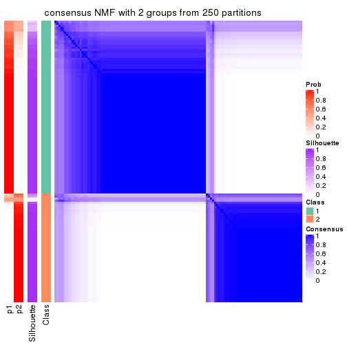</p>

</div>
<div id='tab-ATC-NMF-consensus-heatmap-2'>
<pre><code class="r">consensus_heatmap(res, k = 3)
</code></pre>

<p>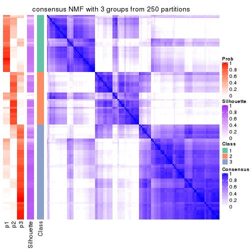</p>

</div>
<div id='tab-ATC-NMF-consensus-heatmap-3'>
<pre><code class="r">consensus_heatmap(res, k = 4)
</code></pre>

<p>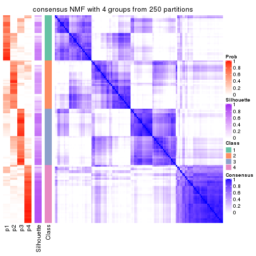</p>

</div>
<div id='tab-ATC-NMF-consensus-heatmap-4'>
<pre><code class="r">consensus_heatmap(res, k = 5)
</code></pre>

<p>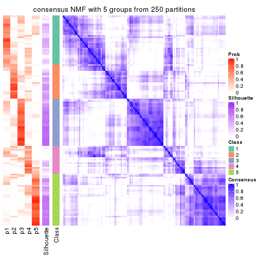</p>

</div>
<div id='tab-ATC-NMF-consensus-heatmap-5'>
<pre><code class="r">consensus_heatmap(res, k = 6)
</code></pre>

<p>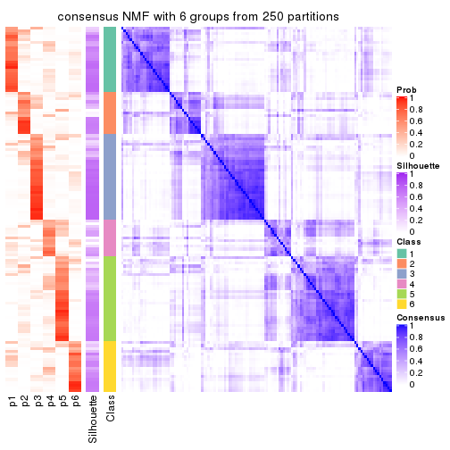</p>

</div>
</div>

Heatmaps for the membership of samples in all partitions to see how consistent they are:


<script>
$( function() {
	$( '#tabs-ATC-NMF-membership-heatmap' ).tabs();
} );
</script>
<div id='tabs-ATC-NMF-membership-heatmap'>
<ul>
<li><a href='#tab-ATC-NMF-membership-heatmap-1'>k = 2</a></li>
<li><a href='#tab-ATC-NMF-membership-heatmap-2'>k = 3</a></li>
<li><a href='#tab-ATC-NMF-membership-heatmap-3'>k = 4</a></li>
<li><a href='#tab-ATC-NMF-membership-heatmap-4'>k = 5</a></li>
<li><a href='#tab-ATC-NMF-membership-heatmap-5'>k = 6</a></li>
</ul>
<div id='tab-ATC-NMF-membership-heatmap-1'>
<pre><code class="r">membership_heatmap(res, k = 2)
</code></pre>

<p>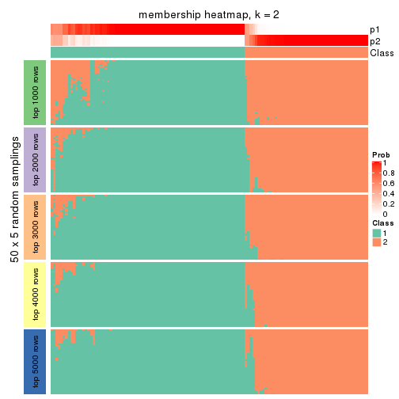</p>

</div>
<div id='tab-ATC-NMF-membership-heatmap-2'>
<pre><code class="r">membership_heatmap(res, k = 3)
</code></pre>

<p>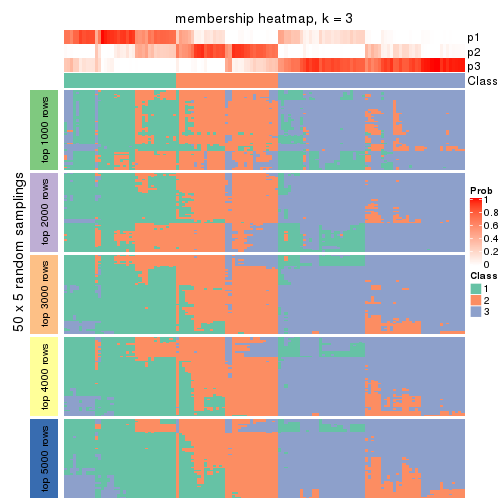</p>

</div>
<div id='tab-ATC-NMF-membership-heatmap-3'>
<pre><code class="r">membership_heatmap(res, k = 4)
</code></pre>

<p>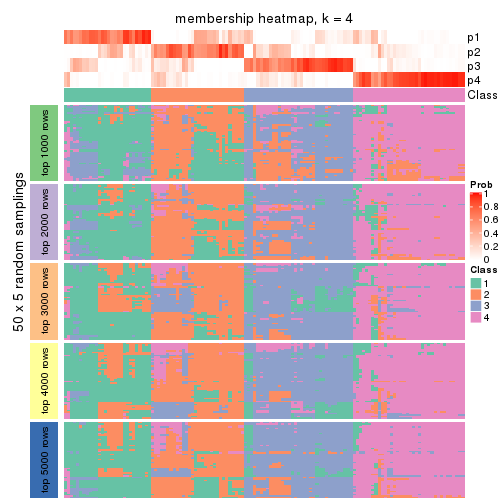</p>

</div>
<div id='tab-ATC-NMF-membership-heatmap-4'>
<pre><code class="r">membership_heatmap(res, k = 5)
</code></pre>

<p>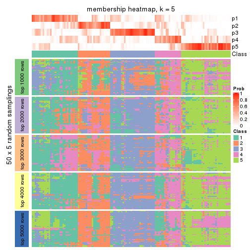</p>

</div>
<div id='tab-ATC-NMF-membership-heatmap-5'>
<pre><code class="r">membership_heatmap(res, k = 6)
</code></pre>

<p>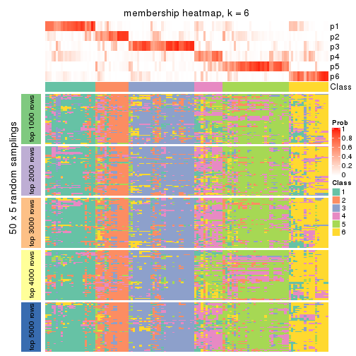</p>

</div>
</div>

As soon as we have had the classes for columns, we can look for signatures
which are significantly different between classes which can be candidate marks
for certain classes. Following are the heatmaps for signatures.


Signature heatmaps where rows are scaled:


<script>
$( function() {
	$( '#tabs-ATC-NMF-get-signatures' ).tabs();
} );
</script>
<div id='tabs-ATC-NMF-get-signatures'>
<ul>
<li><a href='#tab-ATC-NMF-get-signatures-1'>k = 2</a></li>
<li><a href='#tab-ATC-NMF-get-signatures-2'>k = 3</a></li>
<li><a href='#tab-ATC-NMF-get-signatures-3'>k = 4</a></li>
<li><a href='#tab-ATC-NMF-get-signatures-4'>k = 5</a></li>
<li><a href='#tab-ATC-NMF-get-signatures-5'>k = 6</a></li>
</ul>
<div id='tab-ATC-NMF-get-signatures-1'>
<pre><code class="r">get_signatures(res, k = 2)
</code></pre>

<p>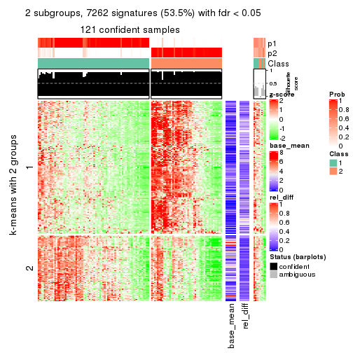</p>

</div>
<div id='tab-ATC-NMF-get-signatures-2'>
<pre><code class="r">get_signatures(res, k = 3)
</code></pre>

<p>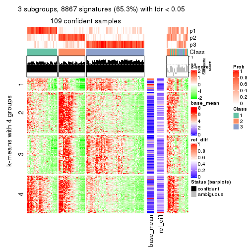</p>

</div>
<div id='tab-ATC-NMF-get-signatures-3'>
<pre><code class="r">get_signatures(res, k = 4)
</code></pre>

<p>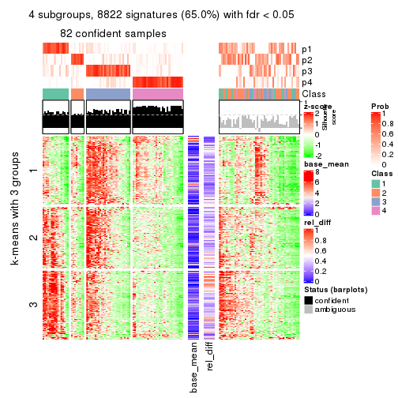</p>

</div>
<div id='tab-ATC-NMF-get-signatures-4'>
<pre><code class="r">get_signatures(res, k = 5)
</code></pre>

<p>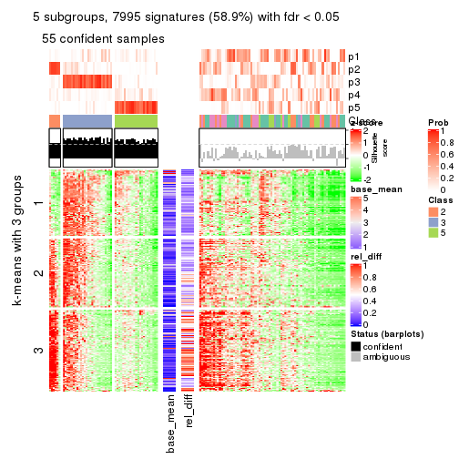</p>

</div>
<div id='tab-ATC-NMF-get-signatures-5'>
<pre><code class="r">get_signatures(res, k = 6)
</code></pre>

<p>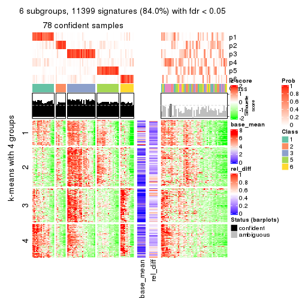</p>

</div>
</div>


Signature heatmaps where rows are not scaled:


<script>
$( function() {
	$( '#tabs-ATC-NMF-get-signatures-no-scale' ).tabs();
} );
</script>
<div id='tabs-ATC-NMF-get-signatures-no-scale'>
<ul>
<li><a href='#tab-ATC-NMF-get-signatures-no-scale-1'>k = 2</a></li>
<li><a href='#tab-ATC-NMF-get-signatures-no-scale-2'>k = 3</a></li>
<li><a href='#tab-ATC-NMF-get-signatures-no-scale-3'>k = 4</a></li>
<li><a href='#tab-ATC-NMF-get-signatures-no-scale-4'>k = 5</a></li>
<li><a href='#tab-ATC-NMF-get-signatures-no-scale-5'>k = 6</a></li>
</ul>
<div id='tab-ATC-NMF-get-signatures-no-scale-1'>
<pre><code class="r">get_signatures(res, k = 2, scale_rows = FALSE)
</code></pre>

<p>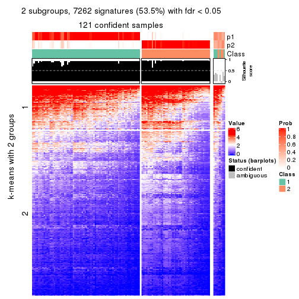</p>

</div>
<div id='tab-ATC-NMF-get-signatures-no-scale-2'>
<pre><code class="r">get_signatures(res, k = 3, scale_rows = FALSE)
</code></pre>

<p>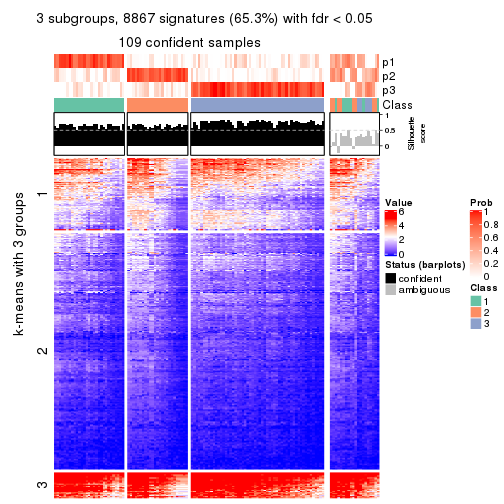</p>

</div>
<div id='tab-ATC-NMF-get-signatures-no-scale-3'>
<pre><code class="r">get_signatures(res, k = 4, scale_rows = FALSE)
</code></pre>

<p>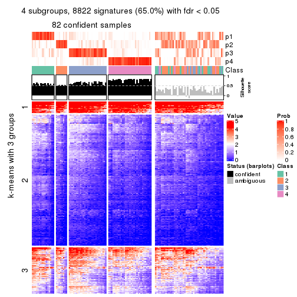</p>

</div>
<div id='tab-ATC-NMF-get-signatures-no-scale-4'>
<pre><code class="r">get_signatures(res, k = 5, scale_rows = FALSE)
</code></pre>

<p>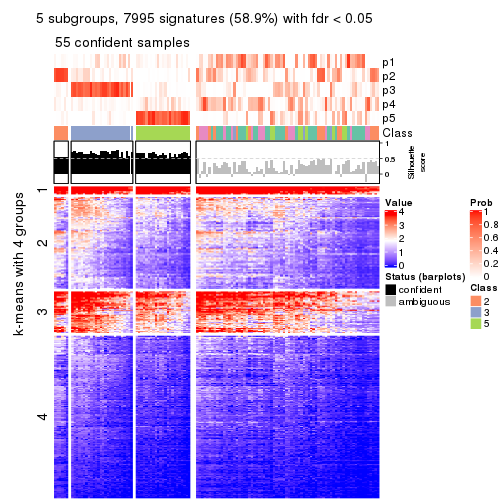</p>

</div>
<div id='tab-ATC-NMF-get-signatures-no-scale-5'>
<pre><code class="r">get_signatures(res, k = 6, scale_rows = FALSE)
</code></pre>

<p>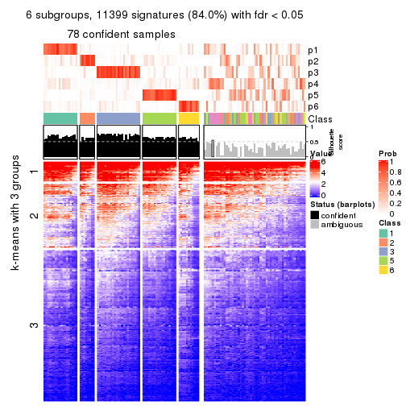</p>

</div>
</div>


Compare the overlap of signatures from different k:

```r
compare_signatures(res)
```

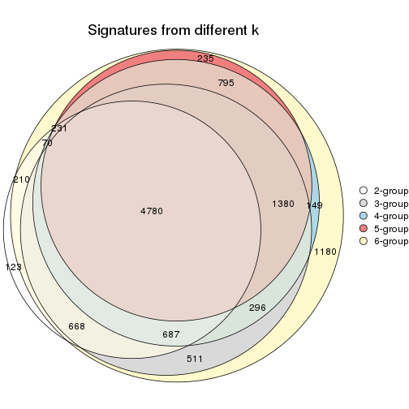

`get_signature()` returns a data frame invisibly. TO get the list of signatures, the function
call should be assigned to a variable explicitly. In following code, if `plot` argument is set
to `FALSE`, no heatmap is plotted while only the differential analysis is performed.

```r
# code only for demonstration
tb = get_signature(res, k = ..., plot = FALSE)
```

An example of the output of `tb` is:

```
#>   which_row         fdr    mean_1    mean_2 scaled_mean_1 scaled_mean_2 km
#> 1        38 0.042760348  8.373488  9.131774    -0.5533452     0.5164555  1
#> 2        40 0.018707592  7.106213  8.469186    -0.6173731     0.5762149  1
#> 3        55 0.019134737 10.221463 11.207825    -0.6159697     0.5749050  1
#> 4        59 0.006059896  5.921854  7.869574    -0.6899429     0.6439467  1
#> 5        60 0.018055526  8.928898 10.211722    -0.6204761     0.5791110  1
#> 6        98 0.009384629 15.714769 14.887706     0.6635654    -0.6193277  2
...
```

The columns in `tb` are:

1. `which_row`: row indices corresponding to the input matrix.
2. `fdr`: FDR for the differential test. 
3. `mean_x`: The mean value in group x.
4. `scaled_mean_x`: The mean value in group x after rows are scaled.
5. `km`: Row groups if k-means clustering is applied to rows.


UMAP plot which shows how samples are separated.


<script>
$( function() {
	$( '#tabs-ATC-NMF-dimension-reduction' ).tabs();
} );
</script>
<div id='tabs-ATC-NMF-dimension-reduction'>
<ul>
<li><a href='#tab-ATC-NMF-dimension-reduction-1'>k = 2</a></li>
<li><a href='#tab-ATC-NMF-dimension-reduction-2'>k = 3</a></li>
<li><a href='#tab-ATC-NMF-dimension-reduction-3'>k = 4</a></li>
<li><a href='#tab-ATC-NMF-dimension-reduction-4'>k = 5</a></li>
<li><a href='#tab-ATC-NMF-dimension-reduction-5'>k = 6</a></li>
</ul>
<div id='tab-ATC-NMF-dimension-reduction-1'>
<pre><code class="r">dimension_reduction(res, k = 2, method = &quot;UMAP&quot;)
</code></pre>

<p>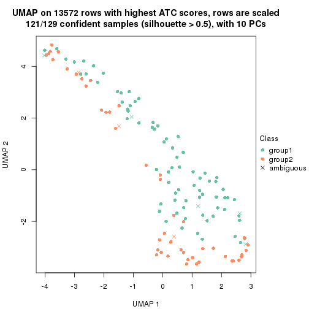</p>

</div>
<div id='tab-ATC-NMF-dimension-reduction-2'>
<pre><code class="r">dimension_reduction(res, k = 3, method = &quot;UMAP&quot;)
</code></pre>

<p>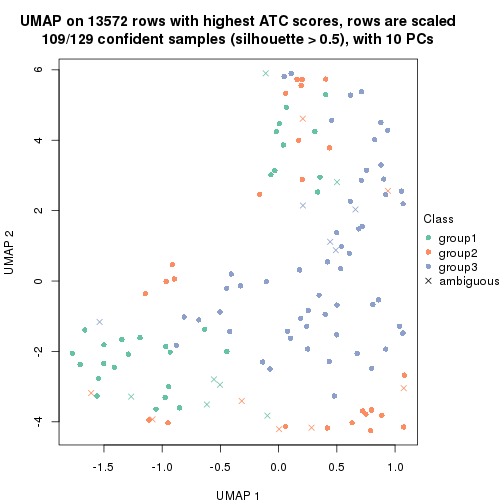</p>

</div>
<div id='tab-ATC-NMF-dimension-reduction-3'>
<pre><code class="r">dimension_reduction(res, k = 4, method = &quot;UMAP&quot;)
</code></pre>

<p>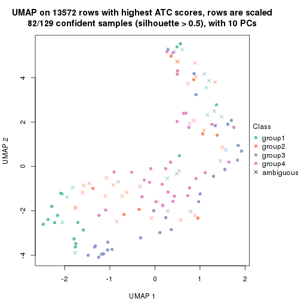</p>

</div>
<div id='tab-ATC-NMF-dimension-reduction-4'>
<pre><code class="r">dimension_reduction(res, k = 5, method = &quot;UMAP&quot;)
</code></pre>

<p>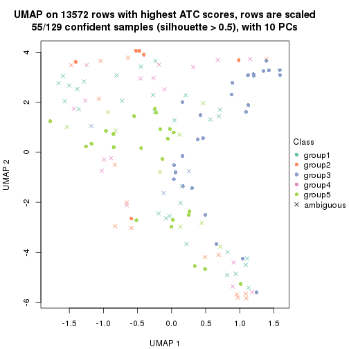</p>

</div>
<div id='tab-ATC-NMF-dimension-reduction-5'>
<pre><code class="r">dimension_reduction(res, k = 6, method = &quot;UMAP&quot;)
</code></pre>

<p>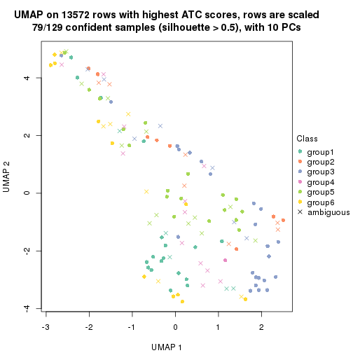</p>

</div>
</div>


Following heatmap shows how subgroups are split when increasing `k`:

```r
collect_classes(res)
```

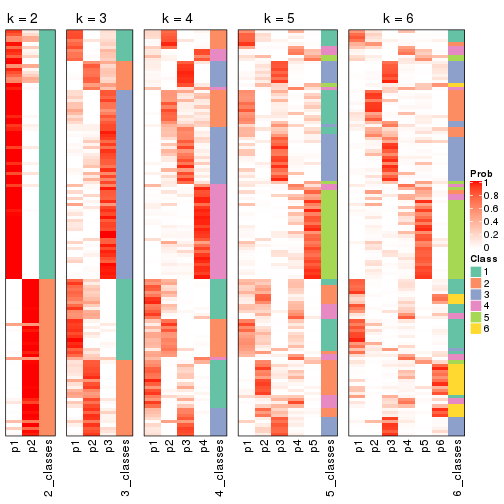


If matrix rows can be associated to genes, consider to use `GO_Enrichment(res,
...)` to perform function enrichment for the signature genes.


 

## Session info


```r
sessionInfo()
```

```
#> R version 3.6.0 (2019-04-26)
#> Platform: x86_64-pc-linux-gnu (64-bit)
#> Running under: CentOS Linux 7 (Core)
#> 
#> Matrix products: default
#> BLAS:   /usr/lib64/libblas.so.3.4.2
#> LAPACK: /usr/lib64/liblapack.so.3.4.2
#> 
#> locale:
#>  [1] LC_CTYPE=en_US.UTF-8       LC_NUMERIC=C               LC_TIME=en_US.UTF-8       
#>  [4] LC_COLLATE=en_US.UTF-8     LC_MONETARY=en_US.UTF-8    LC_MESSAGES=en_US.UTF-8   
#>  [7] LC_PAPER=en_US.UTF-8       LC_NAME=C                  LC_ADDRESS=C              
#> [10] LC_TELEPHONE=C             LC_MEASUREMENT=en_US.UTF-8 LC_IDENTIFICATION=C       
#> 
#> attached base packages:
#>  [1] grid      parallel  stats4    stats     graphics  grDevices utils     datasets  methods  
#> [10] base     
#> 
#> other attached packages:
#>  [1] genefilter_1.66.0           ComplexHeatmap_2.1.1        markdown_1.1               
#>  [4] knitr_1.26                  cola_1.3.2                  SummarizedExperiment_1.14.1
#>  [7] DelayedArray_0.10.0         BiocParallel_1.18.1         matrixStats_0.55.0         
#> [10] Biobase_2.44.0              GenomicRanges_1.36.1        GenomeInfoDb_1.20.0        
#> [13] IRanges_2.18.3              S4Vectors_0.22.1            BiocGenerics_0.30.0        
#> [16] GetoptLong_0.1.7           
#> 
#> loaded via a namespace (and not attached):
#>  [1] bitops_1.0-6           bit64_0.9-7            doParallel_1.0.15      RColorBrewer_1.1-2    
#>  [5] httr_1.4.1             backports_1.1.5        tools_3.6.0            R6_2.4.1              
#>  [9] DBI_1.0.0              lazyeval_0.2.2         colorspace_1.4-1       withr_2.1.2           
#> [13] tidyselect_0.2.5       gridExtra_2.3          bit_1.1-14             compiler_3.6.0        
#> [17] xml2_1.2.2             microbenchmark_1.4-7   pkgmaker_0.28          slam_0.1-46           
#> [21] scales_1.1.0           NMF_0.23.6             stringr_1.4.0          digest_0.6.23         
#> [25] XVector_0.24.0         pkgconfig_2.0.3        bibtex_0.4.2           highr_0.8             
#> [29] rlang_0.4.2            GlobalOptions_0.1.1    RSQLite_2.1.2          impute_1.58.0         
#> [33] shape_1.4.4            mclust_5.4.5           dendextend_1.12.0      dplyr_0.8.3           
#> [37] RCurl_1.95-4.12        magrittr_1.5           GenomeInfoDbData_1.2.1 Matrix_1.2-17         
#> [41] Rcpp_1.0.3             munsell_0.5.0          viridis_0.5.1          lifecycle_0.1.0       
#> [45] stringi_1.4.3          zlibbioc_1.30.0        plyr_1.8.4             blob_1.2.0            
#> [49] crayon_1.3.4           lattice_0.20-38        splines_3.6.0          annotate_1.62.0       
#> [53] circlize_0.4.9         zeallot_0.1.0          pillar_1.4.2           rjson_0.2.20          
#> [57] rngtools_1.4           reshape2_1.4.3         codetools_0.2-16       XML_3.98-1.20         
#> [61] glue_1.3.1             evaluate_0.14          vctrs_0.2.0            png_0.1-7             
#> [65] foreach_1.4.7          polyclip_1.10-0        gtable_0.3.0           purrr_0.3.3           
#> [69] clue_0.3-57            assertthat_0.2.1       ggplot2_3.2.1          xfun_0.11             
#> [73] gridBase_0.4-7         eulerr_6.0.0           xtable_1.8-4           skmeans_0.2-11        
#> [77] survival_2.44-1.1      viridisLite_0.3.0      tibble_2.1.3           iterators_1.0.12      
#> [81] memoise_1.1.0          AnnotationDbi_1.46.1   registry_0.5-1         GTF_0.0.1             
#> [85] cluster_2.1.0          brew_1.0-6
```


